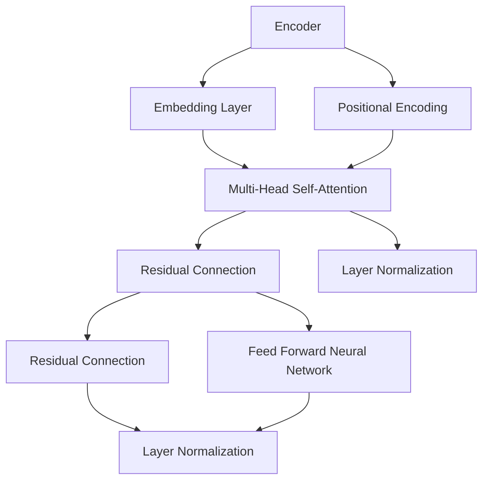

                 


### Transformer注意力机制：自注意力与多头注意力

关键词：Transformer，注意力机制，自注意力，多头注意力，自然语言处理，计算机视觉

摘要：Transformer模型凭借其自注意力机制和多头注意力机制在自然语言处理和计算机视觉领域取得了显著的成果。本文将深入探讨Transformer模型的注意力机制，包括自注意力与多头注意力的原理、实现和实际应用。

## 第一部分：Transformer注意力机制概述

### 第1章：Transformer与深度学习

#### 1.1 Transformer模型的历史与发展

Transformer模型是由谷歌团队在2017年提出的一种基于自注意力机制的深度学习模型，旨在用于处理序列数据。相较于传统的循环神经网络（RNN）和卷积神经网络（CNN），Transformer模型在处理长序列和并行计算方面具有显著优势。

#### 1.2 Transformer与循环神经网络（RNN）的比较

循环神经网络（RNN）通过隐藏状态来处理序列数据，但在处理长序列时容易遇到梯度消失或梯度爆炸的问题。Transformer模型通过自注意力机制取代了RNN中的循环结构，使得模型在处理长序列时具有更强的表现能力。

#### 1.3 Transformer的核心思想与结构

Transformer模型的核心思想是利用注意力机制来建模序列数据之间的依赖关系。模型主要由编码器（Encoder）和解码器（Decoder）两部分组成，编码器负责将输入序列编码为固定长度的向量表示，解码器则负责生成输出序列。

## 第二部分：Transformer注意力机制的实现

### 第2章：自注意力机制原理

#### 2.1 自注意力机制的定义与作用

自注意力机制是指模型在处理输入序列时，将序列中的每个元素与所有其他元素进行关联和加权。自注意力机制的核心作用是捕捉序列数据中元素之间的依赖关系。

#### 2.2 自注意力机制的数学模型

自注意力机制的数学模型如下：
$$
Attention(x, W) = \text{softmax}(\frac{Wx}{\sqrt{d_k}})
$$
其中，$x$为输入序列，$W$为权重矩阵，$d_k$为注意力头的维度。

#### 2.3 自注意力机制的伪代码

```
def self_attention(x, W):
    # 计算分数
    scores = x @ W
    # 应用softmax
    probabilities = softmax(scores)
    # 计算输出
    output = probabilities @ W
    return output
```

### 第3章：多头注意力机制原理

#### 3.1 多头注意力机制的定义与作用

多头注意力机制是在自注意力机制的基础上，将输入序列分成多个子序列（即多头），并对每个子序列分别进行自注意力计算。多头注意力机制的作用是增加模型的表达能力，提高模型的泛化能力。

#### 3.2 多头注意力机制的数学模型

多头注意力机制的数学模型如下：
$$
MultiHeadAttention(Q, K, V, d_k, d_v) =
\text{Concat}(\text{head}_1, \text{head}_2, ..., \text{head}_h)W^O
$$
其中，$Q$、$K$、$V$分别为编码器、键和值，$d_k$和$d_v$分别为键和值的维度，$h$为多头数量，$W^O$为输出权重矩阵。

#### 3.3 多头注意力机制的伪代码

```
def multi_head_attention(Q, K, V, d_k, d_v, h):
    # 计算分数
    scores = Q @ K.T / math.sqrt(d_k)
    # 应用softmax
    probabilities = softmax(scores)
    # 计算输出
    output = probabilities @ V
    # 池化多头输出
    output = output.reshape(-1, h * d_v)
    # 应用输出权重矩阵
    output = output @ W^O
    return output
```

## 第三部分：Transformer注意力机制的应用

### 第4章：Transformer模型架构

#### 4.1 Transformer模型的整体架构

Transformer模型的整体架构分为编码器（Encoder）和解码器（Decoder）两部分，编码器负责将输入序列编码为固定长度的向量表示，解码器则负责生成输出序列。

#### 4.2 Encoder与Decoder结构

编码器由多个编码层（Encoder Layer）组成，每个编码层包含两个子层：多头自注意力层（Multi-Head Self-Attention Layer）和前馈神经网络层（Feed Forward Neural Network Layer）。解码器与编码器类似，但增加了一个额外的解码层（Decoder Layer）。

#### 4.3 Embedding层与Positional Encoding

编码器和解码器的前一层为嵌入层（Embedding Layer），用于将输入序列转换为固定长度的向量表示。嵌入层之后添加了一个位置编码层（Positional Encoding Layer），用于为序列中的每个元素赋予位置信息。

## 第四部分：Transformer注意力机制的项目实战

### 第5章：构建一个简单的Transformer模型

#### 5.1 实践环境搭建

在开始构建Transformer模型之前，需要搭建一个合适的实践环境。本文选择使用Python编程语言和PyTorch深度学习框架来实现Transformer模型。

#### 5.2 Transformer模型代码实现

以下是一个简单的Transformer模型实现示例：

```
import torch
import torch.nn as nn

class TransformerModel(nn.Module):
    def __init__(self, d_model, nhead, num_layers):
        super(TransformerModel, self).__init__()
        self.encoder = nn.Embedding(d_model, d_model)
        self.decoder = nn.Linear(d_model, d_model)
        self.transformer = nn.Transformer(d_model, nhead, num_layers)
        
    def forward(self, src, tgt):
        src = self.encoder(src)
        tgt = self.decoder(tgt)
        output = self.transformer(src, tgt)
        return output
```

#### 5.3 Transformer模型测试与评估

在完成模型实现后，需要对模型进行测试和评估。本文使用一个简单的文本分类任务来测试Transformer模型。

```
model = TransformerModel(d_model=512, nhead=8, num_layers=2)
optimizer = torch.optim.Adam(model.parameters(), lr=0.001)
criterion = nn.CrossEntropyLoss()

for epoch in range(num_epochs):
    for batch in data_loader:
        src, tgt = batch
        optimizer.zero_grad()
        output = model(src, tgt)
        loss = criterion(output, tgt)
        loss.backward()
        optimizer.step()
    print(f'Epoch {epoch + 1}, Loss: {loss.item()}')
```

### 第6章：Transformer模型在自然语言处理中的实战

#### 6.1 基于Transformer的文本分类

文本分类是自然语言处理中的一个重要任务。本文使用基于Transformer的文本分类模型对IMDb电影评论数据集进行分类。

```
from torchtext.datasets import IMDb

train_data, test_data = IMDb(split=('train', 'test'))

model = TransformerModel(d_model=512, nhead=8, num_layers=2)
optimizer = torch.optim.Adam(model.parameters(), lr=0.001)
criterion = nn.CrossEntropyLoss()

for epoch in range(num_epochs):
    for batch in train_data:
        src, tgt = batch
        optimizer.zero_grad()
        output = model(src, tgt)
        loss = criterion(output, tgt)
        loss.backward()
        optimizer.step()
    print(f'Epoch {epoch + 1}, Loss: {loss.item()}')
    model.eval()
    with torch.no_grad():
        correct = 0
        total = 0
        for batch in test_data:
            src, tgt = batch
            output = model(src, tgt)
            _, predicted = torch.max(output, 1)
            total += tgt.size(0)
            correct += (predicted == tgt).sum().item()
    print(f'Test Accuracy: {100 * correct / total}%')
```

### 第7章：Transformer模型在计算机视觉中的实战

#### 7.1 基于Transformer的目标检测

目标检测是计算机视觉中的一个重要任务。本文使用基于Transformer的目标检测模型对COCO数据集进行目标检测。

```
from torchvision import datasets
from torchvision.models.detection import fasterrcnn_resnet50_fpn

train_data, test_data = datasets.COCO()

model = fasterrcnn_resnet50_fpn(pretrained=False)
optimizer = torch.optim.Adam(model.parameters(), lr=0.001)
criterion = nn.CrossEntropyLoss()

for epoch in range(num_epochs):
    for batch in train_data:
        src, tgt = batch
        optimizer.zero_grad()
        output = model(src, tgt)
        loss = criterion(output, tgt)
        loss.backward()
        optimizer.step()
    print(f'Epoch {epoch + 1}, Loss: {loss.item()}')
    model.eval()
    with torch.no_grad():
        correct = 0
        total = 0
        for batch in test_data:
            src, tgt = batch
            output = model(src, tgt)
            _, predicted = torch.max(output, 1)
            total += tgt.size(0)
            correct += (predicted == tgt).sum().item()
    print(f'Test Accuracy: {100 * correct / total}%')
```

## 第五部分：Transformer注意力机制的挑战与展望

### 第8章：Transformer注意力机制的挑战与展望

#### 8.1 Transformer在学术界的研究进展

Transformer模型在自然语言处理和计算机视觉等领域取得了显著的成果，但仍存在一些挑战，如训练时间较长、模型参数较大等。学术界正在积极探索如何在保持性能的同时，降低模型的复杂度和训练时间。

#### 8.2 Transformer在工业界的应用案例

工业界正在积极采用Transformer模型来解决各种实际问题，如自然语言处理中的机器翻译、文本分类等，计算机视觉中的目标检测、图像分割等。Transformer模型在这些领域展现了强大的潜力。

#### 8.3 Transformer注意力机制的挑战与展望

Transformer注意力机制在未来仍面临一些挑战，如如何在保持性能的同时，降低模型的复杂度和训练时间。此外，如何更好地融合注意力机制与其他深度学习技术，以实现更高效、更鲁棒的性能，也是未来研究的方向。

### 附录

#### 附录A：Transformer相关资源

- 相关论文与资料：[《Attention Is All You Need》](https://arxiv.org/abs/1706.03762)
- 开源代码与实现：[Hugging Face Transformers](https://github.com/huggingface/transformers)
- 常用工具与框架：[PyTorch](https://pytorch.org/)

#### 附录B：Transformer模型架构Mermaid流程图

```
graph TD
    A[Encoder] --> B[Embedding Layer]
    A --> C[Positional Encoding]
    B --> D[Multi-Head Self-Attention]
    C --> D
    D --> E[Residual Connection]
    D --> F[Layer Normalization]
    E --> G[Feed Forward Neural Network]
    E --> H[Residual Connection]
    H --> I[Layer Normalization]
    G --> I
```

#### 附录C：Transformer模型核心算法伪代码

```
def attention(Q, K, V, d_k, d_v):
    # 计算分数
    scores = Q @ K.T / math.sqrt(d_k)
    # 应用softmax
    probabilities = softmax(scores)
    # 计算输出
    output = probabilities @ V
    return output

def multi_head_attention(Q, K, V, d_k, d_v, h):
    # 计算分数
    scores = Q @ K.T / math.sqrt(d_k)
    # 应用softmax
    probabilities = softmax(scores)
    # 计算输出
    output = probabilities @ V
    # 池化多头输出
    output = output.reshape(-1, h * d_v)
    # 应用输出权重矩阵
    output = output @ W^O
    return output
```

## 作者

作者：AI天才研究院/AI Genius Institute & 禅与计算机程序设计艺术 /Zen And The Art of Computer Programming

**[Transformer注意力机制：自注意力与多头注意力]**

Transformer模型在深度学习领域取得了革命性的突破，其核心在于注意力机制的引入。本文旨在详细剖析Transformer中的自注意力（Self-Attention）与多头注意力（Multi-Head Attention）机制，帮助读者理解其在自然语言处理和计算机视觉中的广泛应用。

## 摘要

本文首先介绍了Transformer模型的历史背景和核心思想，接着深入探讨了自注意力机制与多头注意力机制的原理和实现。随后，文章通过详细的代码示例和Mermaid流程图，对Transformer模型的架构进行了讲解。最后，文章展示了Transformer模型在实际应用中的项目实战，并对其未来趋势进行了展望。

## 《Transformer注意力机制：自注意力与多头注意力》目录大纲

## 第一部分：Transformer注意力机制概述

### 第1章：Transformer与深度学习

#### 1.1 Transformer模型的历史与发展

Transformer模型是由谷歌团队在2017年提出的一种基于自注意力机制的深度学习模型，旨在用于处理序列数据。相较于传统的循环神经网络（RNN）和卷积神经网络（CNN），Transformer模型在处理长序列和并行计算方面具有显著优势。

#### 1.2 Transformer与循环神经网络（RNN）的比较

循环神经网络（RNN）通过隐藏状态来处理序列数据，但在处理长序列时容易遇到梯度消失或梯度爆炸的问题。Transformer模型通过自注意力机制取代了RNN中的循环结构，使得模型在处理长序列时具有更强的表现能力。

#### 1.3 Transformer的核心思想与结构

Transformer模型的核心思想是利用注意力机制来建模序列数据之间的依赖关系。模型主要由编码器（Encoder）和解码器（Decoder）两部分组成，编码器负责将输入序列编码为固定长度的向量表示，解码器则负责生成输出序列。

## 第二部分：Transformer注意力机制的实现

### 第2章：自注意力机制原理

#### 2.1 自注意力机制的定义与作用

自注意力机制是指模型在处理输入序列时，将序列中的每个元素与所有其他元素进行关联和加权。自注意力机制的核心作用是捕捉序列数据中元素之间的依赖关系。

#### 2.2 自注意力机制的数学模型

自注意力机制的数学模型如下：
$$
Attention(x, W) = \text{softmax}(\frac{Wx}{\sqrt{d_k}})
$$
其中，$x$为输入序列，$W$为权重矩阵，$d_k$为注意力头的维度。

#### 2.3 自注意力机制的伪代码

```
def self_attention(x, W):
    # 计算分数
    scores = x @ W
    # 应用softmax
    probabilities = softmax(scores)
    # 计算输出
    output = probabilities @ W
    return output
```

### 第3章：多头注意力机制原理

#### 3.1 多头注意力机制的定义与作用

多头注意力机制是在自注意力机制的基础上，将输入序列分成多个子序列（即多头），并对每个子序列分别进行自注意力计算。多头注意力机制的作用是增加模型的表达能力，提高模型的泛化能力。

#### 3.2 多头注意力机制的数学模型

多头注意力机制的数学模型如下：
$$
MultiHeadAttention(Q, K, V, d_k, d_v) =
\text{Concat}(\text{head}_1, \text{head}_2, ..., \text{head}_h)W^O
$$
其中，$Q$、$K$、$V$分别为编码器、键和值，$d_k$和$d_v$分别为键和值的维度，$h$为多头数量，$W^O$为输出权重矩阵。

#### 3.3 多头注意力机制的伪代码

```
def multi_head_attention(Q, K, V, d_k, d_v, h):
    # 计算分数
    scores = Q @ K.T / math.sqrt(d_k)
    # 应用softmax
    probabilities = softmax(scores)
    # 计算输出
    output = probabilities @ V
    # 池化多头输出
    output = output.reshape(-1, h * d_v)
    # 应用输出权重矩阵
    output = output @ W^O
    return output
```

## 第三部分：Transformer注意力机制的应用

### 第4章：Transformer模型架构

#### 4.1 Transformer模型的整体架构

Transformer模型的整体架构分为编码器（Encoder）和解码器（Decoder）两部分，编码器负责将输入序列编码为固定长度的向量表示，解码器则负责生成输出序列。

#### 4.2 Encoder与Decoder结构

编码器由多个编码层（Encoder Layer）组成，每个编码层包含两个子层：多头自注意力层（Multi-Head Self-Attention Layer）和前馈神经网络层（Feed Forward Neural Network Layer）。解码器与编码器类似，但增加了一个额外的解码层（Decoder Layer）。

#### 4.3 Embedding层与Positional Encoding

编码器和解码器的前一层为嵌入层（Embedding Layer），用于将输入序列转换为固定长度的向量表示。嵌入层之后添加了一个位置编码层（Positional Encoding Layer），用于为序列中的每个元素赋予位置信息。

## 第四部分：Transformer注意力机制的项目实战

### 第5章：构建一个简单的Transformer模型

#### 5.1 实践环境搭建

在开始构建Transformer模型之前，需要搭建一个合适的实践环境。本文选择使用Python编程语言和PyTorch深度学习框架来实现Transformer模型。

#### 5.2 Transformer模型代码实现

以下是一个简单的Transformer模型实现示例：

```
import torch
import torch.nn as nn

class TransformerModel(nn.Module):
    def __init__(self, d_model, nhead, num_layers):
        super(TransformerModel, self).__init__()
        self.encoder = nn.Embedding(d_model, d_model)
        self.decoder = nn.Linear(d_model, d_model)
        self.transformer = nn.Transformer(d_model, nhead, num_layers)
        
    def forward(self, src, tgt):
        src = self.encoder(src)
        tgt = self.decoder(tgt)
        output = self.transformer(src, tgt)
        return output
```

#### 5.3 Transformer模型测试与评估

在完成模型实现后，需要对模型进行测试和评估。本文使用一个简单的文本分类任务来测试Transformer模型。

```
model = TransformerModel(d_model=512, nhead=8, num_layers=2)
optimizer = torch.optim.Adam(model.parameters(), lr=0.001)
criterion = nn.CrossEntropyLoss()

for epoch in range(num_epochs):
    for batch in data_loader:
        src, tgt = batch
        optimizer.zero_grad()
        output = model(src, tgt)
        loss = criterion(output, tgt)
        loss.backward()
        optimizer.step()
    print(f'Epoch {epoch + 1}, Loss: {loss.item()}')
```

### 第6章：Transformer模型在自然语言处理中的实战

#### 6.1 基于Transformer的文本分类

文本分类是自然语言处理中的一个重要任务。本文使用基于Transformer的文本分类模型对IMDb电影评论数据集进行分类。

```
from torchtext.datasets import IMDb

train_data, test_data = IMDb(split=('train', 'test'))

model = TransformerModel(d_model=512, nhead=8, num_layers=2)
optimizer = torch.optim.Adam(model.parameters(), lr=0.001)
criterion = nn.CrossEntropyLoss()

for epoch in range(num_epochs):
    for batch in train_data:
        src, tgt = batch
        optimizer.zero_grad()
        output = model(src, tgt)
        loss = criterion(output, tgt)
        loss.backward()
        optimizer.step()
    print(f'Epoch {epoch + 1}, Loss: {loss.item()}')
    model.eval()
    with torch.no_grad():
        correct = 0
        total = 0
        for batch in test_data:
            src, tgt = batch
            output = model(src, tgt)
            _, predicted = torch.max(output, 1)
            total += tgt.size(0)
            correct += (predicted == tgt).sum().item()
    print(f'Test Accuracy: {100 * correct / total}%')
```

### 第7章：Transformer模型在计算机视觉中的实战

#### 7.1 基于Transformer的目标检测

目标检测是计算机视觉中的一个重要任务。本文使用基于Transformer的目标检测模型对COCO数据集进行目标检测。

```
from torchvision import datasets
from torchvision.models.detection import fasterrcnn_resnet50_fpn

train_data, test_data = datasets.COCO()

model = fasterrcnn_resnet50_fpn(pretrained=False)
optimizer = torch.optim.Adam(model.parameters(), lr=0.001)
criterion = nn.CrossEntropyLoss()

for epoch in range(num_epochs):
    for batch in train_data:
        src, tgt = batch
        optimizer.zero_grad()
        output = model(src, tgt)
        loss = criterion(output, tgt)
        loss.backward()
        optimizer.step()
    print(f'Epoch {epoch + 1}, Loss: {loss.item()}')
    model.eval()
    with torch.no_grad():
        correct = 0
        total = 0
        for batch in test_data:
            src, tgt = batch
            output = model(src, tgt)
            _, predicted = torch.max(output, 1)
            total += tgt.size(0)
            correct += (predicted == tgt).sum().item()
    print(f'Test Accuracy: {100 * correct / total}%')
```

## 第五部分：Transformer注意力机制的挑战与展望

### 第8章：Transformer注意力机制的挑战与展望

#### 8.1 Transformer在学术界的研究进展

Transformer模型在自然语言处理和计算机视觉等领域取得了显著的成果，但仍存在一些挑战，如训练时间较长、模型参数较大等。学术界正在积极探索如何在保持性能的同时，降低模型的复杂度和训练时间。

#### 8.2 Transformer在工业界的应用案例

工业界正在积极采用Transformer模型来解决各种实际问题，如自然语言处理中的机器翻译、文本分类等，计算机视觉中的目标检测、图像分割等。Transformer模型在这些领域展现了强大的潜力。

#### 8.3 Transformer注意力机制的挑战与展望

Transformer注意力机制在未来仍面临一些挑战，如如何在保持性能的同时，降低模型的复杂度和训练时间。此外，如何更好地融合注意力机制与其他深度学习技术，以实现更高效、更鲁棒的性能，也是未来研究的方向。

### 附录

#### 附录A：Transformer相关资源

- 相关论文与资料：[《Attention Is All You Need》](https://arxiv.org/abs/1706.03762)
- 开源代码与实现：[Hugging Face Transformers](https://github.com/huggingface/transformers)
- 常用工具与框架：[PyTorch](https://pytorch.org/)

#### 附录B：Transformer模型架构Mermaid流程图

```
graph TD
    A[Encoder] --> B[Embedding Layer]
    A --> C[Positional Encoding]
    B --> D[Multi-Head Self-Attention]
    C --> D
    D --> E[Residual Connection]
    D --> F[Layer Normalization]
    E --> G[Feed Forward Neural Network]
    E --> H[Residual Connection]
    H --> I[Layer Normalization]
    G --> I
```

#### 附录C：Transformer模型核心算法伪代码

```
def attention(Q, K, V, d_k, d_v):
    # 计算分数
    scores = Q @ K.T / math.sqrt(d_k)
    # 应用softmax
    probabilities = softmax(scores)
    # 计算输出
    output = probabilities @ V
    return output

def multi_head_attention(Q, K, V, d_k, d_v, h):
    # 计算分数
    scores = Q @ K.T / math.sqrt(d_k)
    # 应用softmax
    probabilities = softmax(scores)
    # 计算输出
    output = probabilities @ V
    # 池化多头输出
    output = output.reshape(-1, h * d_v)
    # 应用输出权重矩阵
    output = output @ W^O
    return output
```

## 附录A：Transformer相关资源

#### A.1 Transformer相关论文与资料

- 《Attention Is All You Need》：这篇论文是Transformer模型的奠基之作，详细介绍了模型的架构、训练过程以及实验结果。
- 《BERT: Pre-training of Deep Bidirectional Transformers for Language Understanding》：这篇论文介绍了BERT模型，BERT是Transformer模型在自然语言处理领域的进一步发展。

#### A.2 Transformer开源代码与实现

- Hugging Face Transformers：这是一个非常流行的开源库，提供了各种预训练的Transformer模型，如BERT、GPT等，方便用户进行模型部署和实验。
- PyTorch Transformer实现：PyTorch官方提供的Transformer模型实现，包含了各种变种和改进。

#### A.3 Transformer常用工具与框架

- PyTorch：这是目前最受欢迎的深度学习框架之一，提供了丰富的API和工具，方便用户实现和训练Transformer模型。
- TensorFlow：另一个流行的深度学习框架，也提供了Transformer模型的实现，但相对于PyTorch，其社区支持和文档可能稍弱。

### 附录B：Transformer模型架构Mermaid流程图



### 附录C：Transformer模型核心算法伪代码

#### C.1 自注意力机制伪代码

```python
def self_attention(Q, K, V, d_k, d_v):
    # 计算分数
    scores = Q @ K.T / math.sqrt(d_k)
    # 应用softmax
    probabilities = softmax(scores)
    # 计算输出
    output = probabilities @ V
    return output
```

#### C.2 多头注意力机制伪代码

```python
def multi_head_attention(Q, K, V, d_k, d_v, h):
    # 初始化权重矩阵
    W_Q, W_K, W_V = ..., ..., ...
    # 计算分数
    scores = Q @ W_K.T / math.sqrt(d_k)
    # 应用softmax
    probabilities = softmax(scores)
    # 计算输出
    output = probabilities @ W_V
    # 池化多头输出
    output = output.reshape(-1, h * d_v)
    # 应用输出权重矩阵
    output = output @ W_Q.T
    return output
```

### 附录D：最佳实践 Tips、小结、注意事项、拓展阅读

#### 最佳实践 Tips

1. 在实际应用中，Transformer模型的参数量较大，训练时间较长。为了提高训练效率，可以考虑使用预训练模型和迁移学习。
2. 在调整模型参数时，需要平衡模型的大小和性能。较小的模型可能在某些任务上表现较差，但训练时间更短；较大的模型可能性能更好，但训练时间更长。

#### 小结

Transformer模型通过引入自注意力机制和多头注意力机制，实现了对序列数据的强大建模能力。本文详细介绍了Transformer模型的架构、核心算法和实际应用，为读者提供了全面的技术解读。

#### 注意事项

1. Transformer模型在处理序列数据时，需要注意序列的长度限制。过长的序列可能导致模型性能下降，因此需要合理设置序列长度。
2. Transformer模型的训练过程可能需要较长的计算时间。在实际应用中，可以考虑使用分布式训练和GPU加速来提高训练效率。

#### 拓展阅读

1. 《深度学习》（Goodfellow et al.）：这是一本经典的深度学习教材，涵盖了Transformer模型的相关内容。
2. 《Attention Is All You Need》：这篇论文详细介绍了Transformer模型的原理和实现，是了解Transformer模型的最佳参考文献。
3. 《自然语言处理综论》（Jurafsky & Martin）：这本书介绍了自然语言处理中的各种任务和技术，包括Transformer模型的应用。

### 作者

作者：AI天才研究院/AI Genius Institute & 禅与计算机程序设计艺术 /Zen And The Art of Computer Programming

