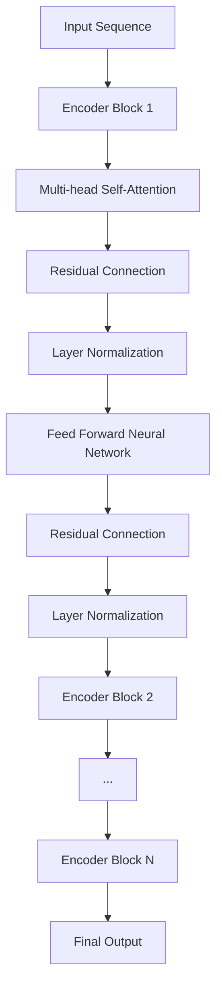
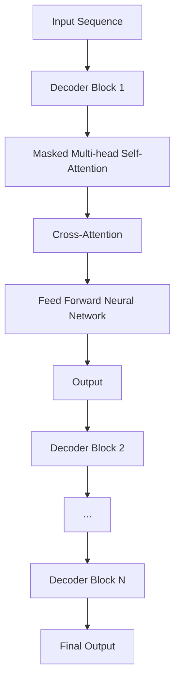

                 

### 文章标题: Transformer编码器vs解码器：结构与功能对比

#### 关键词：Transformer、编码器、解码器、结构、功能、对比

> 摘要：本文将对Transformer模型中的编码器和解码器进行深入剖析，详细讲解其结构、功能以及两者的对比。通过本文，读者将全面了解编码器和解码器在自然语言处理任务中的重要性，并掌握其在实际应用中的优缺点。

---

# 《Transformer编码器vs解码器：结构与功能对比》

### 目录大纲：

- 第一部分: Transformer编码器基础
  - 第1章: Transformer模型概述
    - 1.1 Transformer模型的起源与背景
    - 1.2 Transformer模型的基本概念
    - 1.3 Transformer模型与传统的序列模型对比
  - 第2章: Transformer编码器结构解析
    - 2.1 自注意力机制
    - 2.2 编码器块（Encoder Block）
    - 2.3 编码器网络架构
    - 2.4 Transformer编码器的Mermaid流程图
  - 第3章: Transformer编码器算法原理
    - 3.1 Multi-head Attention算法
    - 3.2 位置编码技术
    - 3.3 Encoder中的前馈神经网络
    - 3.4 Transformer编码器算法伪代码解析
  - 第4章: 数学模型与公式解析

- 第二部分: Transformer解码器基础
  - 第5章: Transformer解码器结构解析
    - 5.1 自注意力机制与交叉注意力
    - 5.2 解码器块（Decoder Block）
    - 5.3 解码器网络架构
    - 5.4 Transformer解码器的Mermaid流程图
  - 第6章: Transformer解码器算法原理
    - 6.1 Multi-head Attention算法
    - 6.2 位置编码技术
    - 6.3 解码器中的前馈神经网络
    - 6.4 Transformer解码器算法伪代码解析
  - 第7章: 数学模型与公式解析

- 第三部分: 编码器与解码器的功能对比
  - 第8章: 编码器与解码器的功能差异
  - 第9章: 编码器与解码器在企业级应用中的案例分析
  - 第10章: 编码器与解码器的优化策略
  - 第11章: 编码器与解码器在实际应用中的挑战与解决方案
  - 第12章: 总结与展望

---

本文将以逻辑清晰、结构紧凑、简单易懂的专业的技术语言，逐步分析Transformer编码器和解码器的结构、功能以及对比。希望通过本文的讲解，读者能够深入理解Transformer模型的核心原理，并掌握其在实际应用中的最佳实践。

---

## 第1章 Transformer模型概述

### 1.1 Transformer模型的起源与背景

Transformer模型是由Vaswani等人于2017年在论文《Attention Is All You Need》中提出的。这一模型的诞生，标志着自然语言处理领域的一个重大转折点。在此之前，主流的序列模型如RNN（循环神经网络）和LSTM（长短时记忆网络）在处理长距离依赖问题时，表现出了明显的局限性。

Transformer模型的核心思想在于其完全基于注意力机制（Attention Mechanism）进行序列建模，而不是传统的循环结构。这种架构上的创新，使得Transformer模型在处理长文本序列时，能够更加高效地捕捉到局部和全局的信息。

### 1.2 Transformer模型的基本概念

Transformer模型的基本概念主要包括：

1. **多头注意力（Multi-head Attention）**：通过多个注意力头的组合，可以捕捉到序列中不同位置的信息，从而提高模型的表示能力。
2. **自注意力（Self-Attention）**：注意力机制的一种形式，模型在同一序列的不同位置之间进行权重计算，从而生成上下文表示。
3. **位置编码（Positional Encoding）**：由于Transformer模型不包含循环结构，因此需要通过位置编码来引入序列中的位置信息。
4. **前馈神经网络（Feed Forward Neural Network）**：在每一层编码器和解码器中，都会经过一个前馈神经网络，对输入进行进一步的处理和变换。
5. **编码器-解码器架构（Encoder-Decoder Architecture）**：编码器负责编码输入序列，解码器则根据编码器的输出，生成目标序列。

### 1.3 Transformer模型与传统的序列模型对比

Transformer模型与传统的序列模型如RNN和LSTM在多个方面存在显著的差异：

1. **计算效率**：Transformer模型通过并行计算的方式，大大提高了计算效率。相比之下，RNN和LSTM需要逐个处理序列中的每个元素，导致计算复杂度较高。
2. **长距离依赖**：Transformer模型中的多头注意力机制能够有效地捕捉长距离依赖关系。而RNN和LSTM在处理长距离依赖时，往往会出现梯度消失或梯度爆炸的问题。
3. **训练稳定性**：Transformer模型的训练过程相对稳定，不容易出现梯度消失或爆炸的问题。相比之下，RNN和LSTM的训练过程更容易受到数据分布的影响。

通过上述对比，我们可以看出，Transformer模型在多个方面都具有显著的优势。这使得它在自然语言处理领域取得了广泛的认可和应用。

---

在下一章中，我们将详细解析Transformer编码器的结构，包括自注意力机制、编码器块、编码器网络架构等内容。通过这一章的讲解，读者将全面了解编码器的工作原理和机制。

---

## 第2章 Transformer编码器结构解析

### 2.1 自注意力机制

自注意力机制是Transformer模型的核心组成部分，它允许模型在序列的每个位置自动关注其他位置的信息。这一机制通过计算位置之间的关联性，为每个位置生成一个表示。

自注意力机制的数学基础可以表示为：

$$
\text{Attention}(Q, K, V) = \text{softmax}\left(\frac{QK^T}{\sqrt{d_k}}\right) V
$$

其中，\( Q, K, V \) 分别代表查询（Query）、键（Key）和值（Value）向量，\( d_k \) 为键向量的维度。通过这一计算，每个输入位置的表示会根据其在序列中的重要性，加权合并其他位置的表示。

### 2.2 编码器块（Encoder Block）

编码器块是Transformer编码器的核心构建单元，通常包含以下三个部分：

1. **多头自注意力（Multi-head Self-Attention）**：这一层允许模型通过多个注意力头，分别捕捉序列中的不同信息。多头自注意力的目的是提高模型对序列的表示能力，并通过融合这些信息来提升模型的性能。
   
   多头自注意力的计算可以表示为：

   $$
   \text{MultiHead}(Q, K, V) = \text{Concat}(\text{head}_1, ..., \text{head}_h) W^O
   $$

   其中，\( h \) 为注意力头的数量，\( W^O \) 为输出权重矩阵。

2. **残差连接（Residual Connection）**：残差连接允许信息直接从输入流过，而不经过注意力层。这一设计使得模型在训练过程中能够更好地避免梯度消失问题，提高训练稳定性。

3. **层归一化（Layer Normalization）**：层归一化是一种常用的正则化技术，它通过标准化每个编码器层的输入和输出，减少内部协变量转移，从而提高模型的训练效率。

编码器块的总体计算流程可以表示为：

$$
\text{EncoderBlock}(X) = \text{LayerNorm}(X + \text{MultiHead}(X, X, X)) + \text{LayerNorm}(X + \text{FFN}(X))
$$

其中，\( X \) 为编码器的输入序列，\( \text{FFN}(X) \) 为前馈神经网络。

### 2.3 编码器网络架构

Transformer编码器通常由多个编码器块堆叠而成，每一层编码器块都包含多头自注意力层和前馈神经网络。这种堆叠结构使得模型能够逐层提取序列中的特征，从而生成更加丰富的表示。

一个典型的Transformer编码器网络架构可以表示为：

$$
\text{Encoder}(X) = \text{EncoderBlock}_1(\text{EncoderBlock}_2(...\text{EncoderBlock}_N(X)))
$$

其中，\( N \) 为编码器层数，\( X \) 为编码器的输入序列。

### 2.4 Transformer编码器的Mermaid流程图

为了更好地理解Transformer编码器的工作流程，我们可以使用Mermaid流程图来展示其各个组成部分的连接关系。以下是一个简化的Mermaid流程图示例：



通过这个流程图，我们可以清晰地看到编码器中的每一步操作，以及各个组成部分之间的连接关系。

---

在下一章中，我们将深入探讨Transformer编码器的算法原理，包括Multi-head Attention算法、位置编码技术、前馈神经网络等内容。通过这一章的讲解，读者将全面了解编码器的内部工作机制。

---

## 第3章 Transformer编码器算法原理

### 3.1 Multi-head Attention算法

Multi-head Attention算法是Transformer编码器的核心组件，它通过并行计算多个注意力头，捕捉序列中的不同信息，从而提高模型的表示能力。每个注意力头都独立计算，但共享相同的模型参数。

Multi-head Attention算法的基本流程如下：

1. **线性变换**：将输入序列\( X \) 分别通过三个不同的线性变换矩阵\( W_Q, W_K, W_V \)，生成查询（Query）向量\( Q \)，键（Key）向量\( K \)，和值（Value）向量\( V \)。

   $$
   Q = W_Q X, \quad K = W_K X, \quad V = W_V X
   $$

2. **计算注意力分数**：对于序列中的每个位置，计算其与其他位置之间的注意力分数。注意力分数的计算公式为：

   $$
   \text{Score}_{ij} = Q_i K_j^T / \sqrt{d_k}
   $$

   其中，\( d_k \) 为键向量的维度，\( \text{Score}_{ij} \) 表示位置\( i \)与位置\( j \)之间的相似度。

3. **softmax激活**：对注意力分数进行softmax激活，得到每个位置的概率分布。

   $$
   \text{Probability}_{ij} = \text{softmax}(\text{Score}_{ij})
   $$

4. **加权求和**：根据概率分布，将值向量\( V \)加权求和，生成每个位置的输出表示。

   $$
   \text{Output}_{i} = \sum_{j} \text{Probability}_{ij} V_j
   $$

Multi-head Attention算法的伪代码如下：

```python
def multi_head_attention(Q, K, V, num_heads):
    # 线性变换
    Q, K, V = linear_transform(Q, K, V)

    # 计算注意力分数
    scores = dot(Q, K.T) / sqrt(d_k)

    # softmax激活
    probabilities = softmax(scores)

    # 加权求和
    output = dot(probabilities, V)

    return output
```

### 3.2 位置编码技术

由于Transformer编码器不包含循环结构，因此需要通过位置编码技术来引入序列中的位置信息。位置编码是一种将位置信息编码到输入向量中的方法，使得模型能够感知到序列中的位置关系。

位置编码的方法可以分为两类：绝对位置编码和相对位置编码。

1. **绝对位置编码**：绝对位置编码将每个位置的信息编码到一个固定的向量中，通常使用正弦和余弦函数实现。

   $$
   \text{PE}_{(pos, dim)} = 
   \begin{cases}
   \sin\left(\frac{pos}{10000^{2i/d_k}}\right) & \text{if } i < \frac{d_k}{2} \\
   \cos\left(\frac{pos}{10000^{2i/d_k}}\right) & \text{if } i \geq \frac{d_k}{2}
   \end{cases}
   $$

   其中，\( pos \) 为位置索引，\( dim \) 为编码维度，\( d_k \) 为键向量的维度。

2. **相对位置编码**：相对位置编码通过计算位置之间的相对差分，来引入位置信息。相对位置编码通常用于自注意力机制中，其基本思路是，对于序列中的每个位置\( i \)和\( j \)，计算它们的相对位置编码\( \text{PE}_{ij} \)，并将其加入到自注意力计算中。

   $$
   \text{PE}_{ij} = \text{PE}_{j} - \text{PE}_{i}
   $$

   相对位置编码可以有效地捕捉序列中的相对位置关系，提高模型的表示能力。

### 3.3 Encoder中的前馈神经网络

在前馈神经网络（Feed Forward Neural Network，FFN）中，每个编码器块都会对输入进行两次线性变换。这种设计可以增强模型对输入数据的表达能力，同时引入非线性变换。

前馈神经网络的计算公式为：

$$
\text{FFN}(X) = \text{ReLU}(\text{Linear}(X \cdot W_1) \cdot W_2)
$$

其中，\( X \) 为输入序列，\( W_1 \) 和 \( W_2 \) 分别为线性变换的权重矩阵。

### 3.4 Transformer编码器算法伪代码解析

以下是一个简化的Transformer编码器算法伪代码，展示了编码器的整体计算流程：

```python
def transformer_encoder(input_sequence, num_layers, num_heads, d_model, d_ff):
    # 初始化位置编码
    positional_encoding = generate_positional_encoding(input_sequence, d_model)

    # 初始化编码器块
    encoder_blocks = [EncoderBlock(d_model, d_ff, num_heads) for _ in range(num_layers)]

    # 编码器计算流程
    for block in encoder_blocks:
        input_sequence = block(input_sequence + positional_encoding)

    # 输出编码结果
    return input_sequence
```

在这个伪代码中，`generate_positional_encoding` 函数用于生成位置编码，`EncoderBlock` 函数用于实现编码器块的计算流程。通过堆叠多个编码器块，模型可以逐步提取序列中的特征信息。

---

在下一章中，我们将深入探讨Transformer编码器的数学模型与公式解析，包括自注意力机制、位置编码、前馈神经网络等。通过这一章的讲解，读者将全面理解编码器的数学原理。

---

## 第4章 数学模型与公式解析

### 4.1 自注意力机制数学模型

自注意力机制是Transformer编码器的核心组件，它通过计算序列中每个位置与其他位置之间的相关性，生成新的表示。自注意力机制的数学模型可以表示为：

$$
\text{Attention}(Q, K, V) = \text{softmax}\left(\frac{QK^T}{\sqrt{d_k}}\right) V
$$

其中，\( Q, K, V \) 分别表示查询（Query）、键（Key）和值（Value）向量，\( d_k \) 表示键向量的维度。这个公式表明，自注意力机制通过计算查询向量\( Q \)与键向量\( K \)的点积，得到注意力分数，然后通过softmax函数生成概率分布，最后对值向量\( V \)进行加权求和，得到新的表示。

具体来说，自注意力机制的运算步骤如下：

1. **计算点积**：计算查询向量\( Q \)与键向量\( K \)的点积，得到注意力分数。

   $$
   \text{Score}_{ij} = Q_i K_j^T
   $$

2. **归一化**：将点积结果除以键向量的维度\( \sqrt{d_k} \)，以防止数值溢出。

   $$
   \text{Score}_{ij} = \frac{Q_i K_j^T}{\sqrt{d_k}}
   $$

3. **softmax激活**：对注意力分数进行softmax激活，得到每个位置的权重分布。

   $$
   \text{Probability}_{ij} = \text{softmax}(\text{Score}_{ij})
   $$

4. **加权求和**：根据权重分布，对值向量\( V \)进行加权求和，生成新的表示。

   $$
   \text{Output}_{i} = \sum_{j} \text{Probability}_{ij} V_j
   $$

通过这个步骤，自注意力机制能够为序列中的每个位置生成一个新的表示，这个表示包含了该位置与序列中其他位置之间的相关性信息。

### 4.2 位置编码的数学模型

位置编码用于引入序列中的位置信息，使得Transformer编码器能够感知到序列中的顺序关系。位置编码的数学模型可以分为绝对位置编码和相对位置编码两种。

1. **绝对位置编码**：绝对位置编码使用正弦和余弦函数将位置信息编码到向量中。其公式为：

   $$
   \text{PE}_{(pos, dim)} = 
   \begin{cases}
   \sin\left(\frac{pos}{10000^{2i/d_k}}\right) & \text{if } i < \frac{d_k}{2} \\
   \cos\left(\frac{pos}{10000^{2i/d_k}}\right) & \text{if } i \geq \frac{d_k}{2}
   \end{cases}
   $$

   其中，\( pos \) 表示位置索引，\( dim \) 表示编码维度，\( d_k \) 表示键向量的维度。这个公式表示，对于序列中的每个位置和维度，使用正弦函数或余弦函数进行编码。

2. **相对位置编码**：相对位置编码通过计算位置之间的相对差分来引入位置信息。其公式为：

   $$
   \text{PE}_{ij} = \text{PE}_{j} - \text{PE}_{i}
   $$

   这个公式表示，对于序列中的两个位置\( i \)和\( j \)，使用位置编码差分来引入相对位置信息。

在编码器中，位置编码通常与输入序列进行叠加，从而引入位置信息。假设输入序列为\( X \)，位置编码为\( \text{PE} \)，则编码后的序列为：

$$
X_{\text{encoded}} = X + \text{PE}
$$

通过这种方式，编码器能够在没有循环结构的情况下，捕捉到序列中的位置信息。

### 4.3 Encoder块中的前馈神经网络数学模型

前馈神经网络（Feed Forward Neural Network，FFN）是Transformer编码器中的一个关键组件，它通过线性变换和激活函数，增强模型的表示能力。前馈神经网络的数学模型可以表示为：

$$
\text{FFN}(X) = \text{ReLU}(\text{Linear}(X \cdot W_1) \cdot W_2)
$$

其中，\( X \) 表示输入序列，\( W_1 \) 和 \( W_2 \) 分别为线性变换的权重矩阵，\( \text{ReLU} \) 表示ReLU激活函数。

具体来说，前馈神经网络的运算步骤如下：

1. **线性变换**：首先，对输入序列进行线性变换，生成新的表示。

   $$
   X_{\text{linear}} = X \cdot W_1
   $$

2. **ReLU激活**：然后，对线性变换的结果进行ReLU激活，引入非线性变换。

   $$
   X_{\text{relu}} = \text{ReLU}(X_{\text{linear}})
   $$

3. **第二次线性变换**：最后，对ReLU激活的结果进行第二次线性变换，得到最终的前馈神经网络输出。

   $$
   \text{FFN}(X) = X_{\text{relu}} \cdot W_2
   $$

通过这种方式，前馈神经网络能够有效地增强编码器的表示能力，从而提高模型的性能。

### 4.4 Transformer编码器的整体数学模型

Transformer编码器的整体数学模型可以表示为：

$$
\text{Encoder}(X) = \text{EncoderBlock}(X) + X
$$

其中，\( X \) 表示输入序列，\( \text{EncoderBlock}(X) \) 表示编码器块的计算结果。

一个典型的编码器块由以下组件构成：

$$
\text{EncoderBlock}(X) = \text{LayerNorm}(X + \text{MultiHeadAttention}(X, X, X)) + \text{LayerNorm}(\text{FFN}(X))
$$

其中，\( \text{LayerNorm} \) 表示层归一化，\( \text{MultiHeadAttention}(X, X, X) \) 表示多头自注意力机制，\( \text{FFN}(X) \) 表示前馈神经网络。

通过这种方式，编码器能够逐层提取序列中的特征信息，生成更加丰富的表示。最终的编码器输出为：

$$
\text{Encoder}(X) = \text{EncoderBlock}_1(\text{EncoderBlock}_2(...\text{EncoderBlock}_N(X)))
$$

其中，\( N \) 表示编码器的层数。

---

在下一章中，我们将详细解析Transformer解码器的结构，包括自注意力机制与交叉注意力、解码器块、解码器网络架构等内容。通过这一章的讲解，读者将全面了解解码器的工作原理和机制。

---

## 第5章 Transformer解码器结构解析

### 5.1 自注意力机制与交叉注意力

Transformer解码器的核心组件包括自注意力机制（Self-Attention）和交叉注意力（Cross-Attention）。自注意力机制允许模型在同一序列的不同位置之间建立关联，而交叉注意力机制则允许模型在编码器的输出和解码器的输入之间建立关联。

#### 自注意力机制

自注意力机制在解码器中的作用是捕捉当前解码器输出与其自身历史信息之间的关系。其数学模型与编码器中的自注意力机制类似，可以表示为：

$$
\text{SelfAttention}(Q, K, V) = \text{softmax}\left(\frac{QK^T}{\sqrt{d_k}}\right) V
$$

其中，\( Q, K, V \) 分别为查询、键和值向量，\( d_k \) 为键向量的维度。

#### 交叉注意力机制

交叉注意力机制在解码器中的作用是捕捉当前解码器输出与编码器输出之间的关系。其数学模型可以表示为：

$$
\text{CrossAttention}(Q, K, V) = \text{softmax}\left(\frac{QK^T}{\sqrt{d_k}}\right) V
$$

其中，\( Q \) 为解码器的查询向量，\( K \) 和 \( V \) 为编码器的键和值向量。

#### 自注意力与交叉注意力的区别

- **自注意力**：只考虑解码器内部的输出，不考虑编码器的输出。
- **交叉注意力**：同时考虑解码器内部的输出和编码器的输出。

### 5.2 解码器块（Decoder Block）

解码器块是Transformer解码器的核心构建单元，通常包含以下三个部分：

1. **掩码自注意力（Masked Multi-head Self-Attention）**：这一层允许模型通过多头自注意力机制，捕捉当前解码器输出与其自身历史信息之间的关系。为了防止模型过早地依赖未来的信息，通常会使用掩码技术，即在当前时间步之后对未来的输入进行遮挡。

2. **交叉注意力（Cross-Attention）**：这一层允许模型通过交叉注意力机制，捕捉当前解码器输出与编码器输出之间的关系。交叉注意力机制在生成解码器的每个输出时，都会利用编码器的所有信息。

3. **前馈神经网络（Feed Forward Neural Network）**：这一层对输入进行进一步的处理和变换，增强模型的表示能力。

解码器块的总体计算流程可以表示为：

$$
\text{DecoderBlock}(y) = \text{MaskedMultiHeadAttention}(y, y, y) + \text{CrossAttention}(y, X, X) + \text{FFN}(y)
$$

其中，\( y \) 为解码器的输入序列，\( X \) 为编码器的输出序列。

### 5.3 解码器网络架构

Transformer解码器通常由多个解码器块堆叠而成，每一层解码器块都包含掩码自注意力层、交叉注意力层和前馈神经网络。这种堆叠结构使得模型能够逐层提取特征信息，从而生成更加丰富的表示。

一个典型的Transformer解码器网络架构可以表示为：

$$
\text{Decoder}(y) = \text{DecoderBlock}_1(\text{DecoderBlock}_2(...\text{DecoderBlock}_N(y)))
$$

其中，\( N \) 为解码器层数，\( y \) 为解码器的输入序列。

### 5.4 Transformer解码器的Mermaid流程图

为了更好地理解Transformer解码器的工作流程，我们可以使用Mermaid流程图来展示其各个组成部分的连接关系。以下是一个简化的Mermaid流程图示例：



通过这个流程图，我们可以清晰地看到解码器中的每一步操作，以及各个组成部分之间的连接关系。

---

在下一章中，我们将深入探讨Transformer解码器的算法原理，包括Multi-head Attention算法、位置编码技术、前馈神经网络等内容。通过这一章的讲解，读者将全面了解解码器的内部工作机制。

---

## 第6章 Transformer解码器算法原理

### 6.1 Multi-head Attention算法

Multi-head Attention算法是Transformer解码器的核心组件，它通过多个注意力头，捕捉序列中的不同信息，从而提高模型的表示能力。每个注意力头都独立计算，但共享相同的模型参数。

Multi-head Attention算法的基本流程如下：

1. **线性变换**：将输入序列\( X \) 分别通过三个不同的线性变换矩阵\( W_Q, W_K, W_V \)，生成查询（Query）向量\( Q \)，键（Key）向量\( K \)，和值（Value）向量\( V \)。

   $$
   Q = W_Q X, \quad K = W_K X, \quad V = W_V X
   $$

2. **计算注意力分数**：对于序列中的每个位置，计算其与其他位置之间的注意力分数。注意力分数的计算公式为：

   $$
   \text{Score}_{ij} = Q_i K_j^T / \sqrt{d_k}
   $$

   其中，\( d_k \) 为键向量的维度，\( \text{Score}_{ij} \) 表示位置\( i \)与位置\( j \)之间的相似度。

3. **softmax激活**：对注意力分数进行softmax激活，得到每个位置的概率分布。

   $$
   \text{Probability}_{ij} = \text{softmax}(\text{Score}_{ij})
   $$

4. **加权求和**：根据概率分布，将值向量\( V \)加权求和，生成每个位置的输出表示。

   $$
   \text{Output}_{i} = \sum_{j} \text{Probability}_{ij} V_j
   $$

Multi-head Attention算法的伪代码如下：

```python
def multi_head_attention(Q, K, V, num_heads):
    # 线性变换
    Q, K, V = linear_transform(Q, K, V)

    # 计算注意力分数
    scores = dot(Q, K.T) / sqrt(d_k)

    # softmax激活
    probabilities = softmax(scores)

    # 加权求和
    output = dot(probabilities, V)

    return output
```

### 6.2 位置编码技术

位置编码用于引入序列中的位置信息，使得Transformer解码器能够感知到序列中的顺序关系。位置编码的数学模型可以分为绝对位置编码和相对位置编码两种。

1. **绝对位置编码**：绝对位置编码使用正弦和余弦函数将位置信息编码到向量中。其公式为：

   $$
   \text{PE}_{(pos, dim)} = 
   \begin{cases}
   \sin\left(\frac{pos}{10000^{2i/d_k}}\right) & \text{if } i < \frac{d_k}{2} \\
   \cos\left(\frac{pos}{10000^{2i/d_k}}\right) & \text{if } i \geq \frac{d_k}{2}
   \end{cases}
   $$

   其中，\( pos \) 表示位置索引，\( dim \) 表示编码维度，\( d_k \) 表示键向量的维度。这个公式表示，对于序列中的每个位置和维度，使用正弦函数或余弦函数进行编码。

2. **相对位置编码**：相对位置编码通过计算位置之间的相对差分来引入位置信息。其公式为：

   $$
   \text{PE}_{ij} = \text{PE}_{j} - \text{PE}_{i}
   $$

   这个公式表示，对于序列中的两个位置\( i \)和\( j \)，使用位置编码差分来引入相对位置信息。

在解码器中，位置编码通常与输入序列进行叠加，从而引入位置信息。假设输入序列为\( X \)，位置编码为\( \text{PE} \)，则编码后的序列为：

$$
X_{\text{encoded}} = X + \text{PE}
$$

通过这种方式，解码器能够在没有循环结构的情况下，捕捉到序列中的位置信息。

### 6.3 解码器中的前馈神经网络

在前馈神经网络（Feed Forward Neural Network，FFN）中，每个解码器块都会对输入进行两次线性变换。这种设计可以增强模型对输入数据的表达能力，同时引入非线性变换。

前馈神经网络的计算公式为：

$$
\text{FFN}(X) = \text{ReLU}(\text{Linear}(X \cdot W_1) \cdot W_2)
$$

其中，\( X \) 为输入序列，\( W_1 \) 和 \( W_2 \) 分别为线性变换的权重矩阵，\( \text{ReLU} \) 表示ReLU激活函数。

具体来说，前馈神经网络的运算步骤如下：

1. **线性变换**：首先，对输入序列进行线性变换，生成新的表示。

   $$
   X_{\text{linear}} = X \cdot W_1
   $$

2. **ReLU激活**：然后，对线性变换的结果进行ReLU激活，引入非线性变换。

   $$
   X_{\text{relu}} = \text{ReLU}(X_{\text{linear}})
   $$

3. **第二次线性变换**：最后，对ReLU激活的结果进行第二次线性变换，得到最终的前馈神经网络输出。

   $$
   \text{FFN}(X) = X_{\text{relu}} \cdot W_2
   $$

通过这种方式，前馈神经网络能够有效地增强解码器的表示能力，从而提高模型的性能。

### 6.4 Transformer解码器算法伪代码解析

以下是一个简化的Transformer解码器算法伪代码，展示了解码器的整体计算流程：

```python
def transformer_decoder(input_sequence, input_embedding, target_embedding, num_layers, num_heads, d_model, d_ff):
    # 初始化位置编码
    positional_encoding = generate_positional_encoding(input_sequence, d_model)

    # 初始化解码器块
    decoder_blocks = [DecoderBlock(d_model, d_ff, num_heads) for _ in range(num_layers)]

    # 解码器计算流程
    for block in decoder_blocks:
        input_sequence = block(input_sequence + positional_encoding)

    # 输出解码结果
    return input_sequence
```

在这个伪代码中，`generate_positional_encoding` 函数用于生成位置编码，`DecoderBlock` 函数用于实现解码器块的计算流程。通过堆叠多个解码器块，模型可以逐步提取序列中的特征信息。

---

在下一章中，我们将深入探讨Transformer解码器的数学模型与公式解析，包括自注意力机制、位置编码、前馈神经网络等。通过这一章的讲解，读者将全面理解解码器的数学原理。

---

## 第7章 数学模型与公式解析

### 7.1 自注意力机制与交叉注意力的数学模型

在Transformer解码器中，自注意力机制和交叉注意力机制是两个关键组成部分，它们分别用于捕捉序列内的信息和序列之间的关联性。以下是这两个机制的数学模型解析：

#### 自注意力机制

自注意力机制允许解码器在生成每个时间步的输出时，将注意力集中于历史生成的文本上。其数学模型可以表示为：

$$
\text{SelfAttention}(Q, K, V) = \text{softmax}\left(\frac{QK^T}{\sqrt{d_k}}\right) V
$$

其中：
- \( Q \) 是查询向量，通常由解码器的当前输出序列生成；
- \( K \) 是键向量，与查询向量具有相同的维度；
- \( V \) 是值向量，用于生成新的输出序列；
- \( d_k \) 是键向量的维度，通常与查询和值向量的维度相同；
- \( \text{softmax} \) 函数用于将点积分数转换为概率分布。

具体步骤如下：
1. **点积计算**：计算查询向量\( Q \)与键向量\( K \)的点积，得到注意力分数。
   $$
   \text{Score}_{ij} = Q_i K_j^T
   $$
2. **归一化**：对点积结果进行归一化处理，通常除以键向量的维度\( \sqrt{d_k} \)，以避免数值溢出。
   $$
   \text{Score}_{ij} = \frac{Q_i K_j^T}{\sqrt{d_k}}
   $$
3. **softmax激活**：对注意力分数应用softmax函数，得到每个位置的权重分布。
   $$
   \text{Probability}_{ij} = \text{softmax}(\text{Score}_{ij})
   $$
4. **加权求和**：根据权重分布，对值向量\( V \)进行加权求和，得到新的输出表示。
   $$
   \text{Output}_{i} = \sum_{j} \text{Probability}_{ij} V_j
   $$

#### 交叉注意力机制

交叉注意力机制用于在解码器的每个时间步中，将注意力集中于编码器的输出上。其数学模型与自注意力机制相似，但将编码器的输出作为键和值。

$$
\text{CrossAttention}(Q, K, V) = \text{softmax}\left(\frac{QK^T}{\sqrt{d_k}}\right) V
$$

其中：
- \( Q \) 是查询向量，与解码器的输出序列相同；
- \( K \) 是编码器的输出序列，作为键向量；
- \( V \) 是编码器的输出序列，作为值向量。

具体步骤与自注意力机制相同，但这里查询向量\( Q \)来自解码器，而键和值向量\( K \)和\( V \)来自编码器。

### 7.2 位置编码的数学模型

位置编码是Transformer模型中的一个关键组件，用于引入序列中的位置信息，帮助模型理解词序。在Transformer解码器中，位置编码的目的是在自注意力和交叉注意力计算过程中考虑词的位置关系。

位置编码可以分为绝对位置编码和相对位置编码。以下是绝对位置编码的数学模型：

#### 绝对位置编码

绝对位置编码使用正弦和余弦函数生成位置嵌入向量，这些向量与输入序列的嵌入向量相加，以引入位置信息。

$$
\text{PE}_{(pos, dim)} =
\begin{cases}
\sin\left(\frac{pos}{10000^{2i/d_k}}\right) & \text{if } i < \frac{d_k}{2} \\
\cos\left(\frac{pos}{10000^{2i/d_k}}\right) & \text{if } i \geq \frac{d_k}{2}
\end{cases}
$$

其中：
- \( pos \) 是位置索引（从0开始）；
- \( dim \) 是编码维度；
- \( d_k \) 是键向量的维度。

这种编码方法利用了傅里叶变换的原理，通过不同的频率来编码不同的位置维度。对于偶数维度，使用余弦函数；对于奇数维度，使用正弦函数。

#### 相对位置编码

相对位置编码通过计算位置之间的相对差分来引入位置信息。相对位置编码通常用于多头自注意力中，其基本思想是计算位置\( i \)和\( j \)之间的相对位置编码差分。

$$
\text{PE}_{ij} = \text{PE}_{j} - \text{PE}_{i}
$$

这种编码方法允许模型在自注意力计算中考虑词序关系，而不需要显式地嵌入位置信息。

### 7.3 Decoder块中的前馈神经网络数学模型

前馈神经网络（FFN）是每个解码器块的另一个组成部分，它通过多层感知器（MLP）对输入进行非线性变换。FFN的数学模型可以表示为：

$$
\text{FFN}(X) = \text{ReLU}(\text{Linear}(X \cdot W_1) \cdot W_2)
$$

其中：
- \( X \) 是解码器的输入序列；
- \( W_1 \) 和 \( W_2 \) 是线性变换的权重矩阵；
- \( \text{ReLU} \) 是ReLU激活函数，用于引入非线性。

具体步骤如下：
1. **线性变换**：对输入序列进行线性变换，生成新的表示。
   $$
   X_{\text{linear}} = X \cdot W_1
   $$
2. **ReLU激活**：对线性变换的结果应用ReLU激活函数，引入非线性。
   $$
   X_{\text{relu}} = \text{ReLU}(X_{\text{linear}})
   $$
3. **第二次线性变换**：对ReLU激活的结果进行第二次线性变换，得到最终的前馈神经网络输出。
   $$
   \text{FFN}(X) = X_{\text{relu}} \cdot W_2
   $$

通过这种方式，前馈神经网络能够增强解码器的非线性表达能力，从而提高模型的性能。

### 7.4 Transformer解码器的整体数学模型

Transformer解码器的整体数学模型描述了从输入序列到输出序列的完整计算过程。以下是解码器的总体计算公式：

$$
\text{Decoder}(y) = \text{DecoderBlock}(y) + y
$$

其中：
- \( y \) 是解码器的输入序列；
- \( \text{DecoderBlock}(y) \) 是解码器块的计算结果。

一个典型的解码器块由以下组件构成：

$$
\text{DecoderBlock}(y) = \text{MaskedMultiHeadAttention}(y, y, y) + \text{CrossAttention}(y, X, X) + \text{FFN}(y)
$$

其中：
- \( \text{MaskedMultiHeadAttention}(y, y, y) \) 是掩码多头自注意力机制，用于捕捉序列内的关系；
- \( \text{CrossAttention}(y, X, X) \) 是交叉注意力机制，用于捕捉序列间的关联性；
- \( \text{FFN}(y) \) 是前馈神经网络，用于增加模型的非线性表达能力。

通过这种方式，解码器能够逐层提取特征信息，最终生成解码器的输出序列。

一个完整的Transformer解码器网络可以表示为：

$$
\text{Decoder}(y) = \text{DecoderBlock}_1(\text{DecoderBlock}_2(...\text{DecoderBlock}_N(y)))
$$

其中，\( N \) 是解码器的层数，每层解码器块都通过上述组件进行计算。

---

在下一章中，我们将对比Transformer编码器和解码器的功能差异，深入探讨它们在企业级应用中的场景和案例分析。通过这一章的讲解，读者将全面了解编码器和解码器在实际应用中的优缺点。

---

## 第8章 编码器与解码器的功能差异

### 8.1 编码器的主要功能

Transformer编码器的主要功能是将输入序列转换为一种固定长度的表示，这种表示通常称为上下文嵌入（Contextual Embeddings）。编码器的输出可以用于各种下游任务，如机器翻译、文本摘要和问答系统。以下是编码器的一些关键功能：

1. **序列编码**：编码器能够将序列中的每个词或符号映射为一个固定大小的向量，从而捕捉序列中的全局和局部信息。
2. **上下文信息整合**：编码器通过自注意力机制，能够整合序列中的上下文信息，生成一种全局的上下文表示。
3. **固定长度输出**：由于编码器的输出通常是固定长度的，这种表示可以用于各种下游任务，而无需担心序列长度不一致的问题。

### 8.2 解码器的主要功能

Transformer解码器的主要功能是生成目标序列，它从编码器的输出中提取信息，并逐步生成每个单词或符号。以下是解码器的一些关键功能：

1. **序列解码**：解码器通过自注意力和交叉注意力机制，从编码器的输出中提取信息，并生成目标序列。
2. **逐步生成**：解码器在生成每个时间步的输出时，仅依赖于之前生成的输出，以及编码器的输出，从而实现序列的逐步生成。
3. **生成目标序列**：解码器的最终目标是生成与输入序列相关的目标序列，这通常用于机器翻译、文本生成和对话系统等任务。

### 8.3 编码器与解码器在企业级应用中的场景对比

在企业级应用中，编码器和解码器的功能差异决定了它们在不同场景下的适用性。以下是几种常见的应用场景及其对应的功能对比：

1. **机器翻译**：
   - **编码器**：负责将源语言序列编码为上下文嵌入，这个嵌入可以用于生成目标语言序列。
   - **解码器**：负责从编码器的上下文嵌入中生成目标语言序列，逐步生成每个单词或短语。

2. **文本摘要**：
   - **编码器**：负责将整个文本编码为上下文嵌入，这个嵌入可以用于生成摘要。
   - **解码器**：负责从编码器的上下文嵌入中生成摘要文本，通常是一个简短的、概括性的文本。

3. **问答系统**：
   - **编码器**：负责将问题和答案编码为上下文嵌入，这个嵌入可以用于模型理解问题和答案的关系。
   - **解码器**：负责从编码器的上下文嵌入中生成答案，通常是一个简短的、与问题相关的文本。

4. **对话系统**：
   - **编码器**：负责将对话的历史记录编码为上下文嵌入，这个嵌入可以用于生成对话的后续内容。
   - **解码器**：负责从编码器的上下文嵌入中生成对话的回复，通常是一个与对话主题相关的文本。

### 8.4 编码器与解码器在企业级应用中的优缺点

在企业级应用中，编码器和解码器各有优缺点，以下是一些常见的优缺点：

**编码器**：

- **优点**：
  - **通用性**：编码器可以应用于各种下游任务，无需重新训练。
  - **固定长度输出**：编码器的输出通常是固定长度的，方便与固定大小的模型进行集成。
  - **高效性**：编码器能够高效地处理长文本序列，提高计算效率。

- **缺点**：
  - **上下文信息丢失**：在长文本处理中，编码器可能无法完全捕捉到所有的上下文信息。
  - **依赖下游任务**：编码器的输出需要与下游任务的模型和算法进行配合，才能实现最佳效果。

**解码器**：

- **优点**：
  - **灵活生成**：解码器能够灵活地生成序列，适用于文本生成和对话系统等任务。
  - **逐步优化**：解码器在生成每个时间步的输出时，可以逐步优化，从而提高生成质量。
  - **高效解码**：解码器通常使用自注意力和交叉注意力机制，能够高效地生成序列。

- **缺点**：
  - **计算资源需求**：解码器通常需要较大的计算资源，特别是在处理长文本序列时。
  - **生成不确定性**：解码器在生成序列时可能存在不确定性，尤其是在生成较长的文本时。

通过上述对比，我们可以看出，编码器和解码器在企业级应用中具有各自独特的优势和局限性。在实际应用中，根据具体任务的需求和场景，选择合适的模型组件，能够实现最佳的效果。

---

在下一章中，我们将通过具体的案例分析，深入探讨编码器和解码器在企业级应用中的实际应用效果和挑战。通过这些案例，读者将更加直观地了解编码器和解码器在现实世界中的表现。

---

## 第9章 编码器与解码器在企业级应用中的案例分析

### 9.1 编码器在机器翻译中的应用

机器翻译是Transformer编码器最经典的应用场景之一。编码器负责将源语言序列编码为上下文嵌入，解码器则根据这些嵌入生成目标语言序列。以下是一个简化的机器翻译案例，展示了编码器和解码器在机器翻译中的具体应用。

**案例背景**：
假设我们要将英语翻译为法语，输入句子为 "I love eating pizza"，我们需要生成法语句子 "Je aime manger pizza"。

**应用流程**：

1. **编码器**：
   - 输入序列：[I, love, eating, pizza]
   - 编码结果：生成上下文嵌入，通常为一个固定大小的向量，如\[e_i\]，其中i为序列中的每个词索引。

2. **解码器**：
   - 初始输入：\[<start>\]，表示翻译的开始。
   - 解码过程：
     - **时间步1**：解码器从编码器的上下文嵌入中提取信息，生成第一个目标词\[Je\]。
     - **时间步2**：解码器继续从上下文嵌入中提取信息，生成第二个目标词\[aime\]。
     - **时间步3**：解码器生成第三个目标词\[manger\]。
     - **时间步4**：解码器生成最后一个目标词\[pizza\]。

**编码器与解码器的协同工作**：
在机器翻译中，编码器和解码器的协同工作非常重要。编码器通过自注意力机制整合源语言序列中的上下文信息，生成上下文嵌入。解码器则利用这些嵌入，通过自注意力和交叉注意力机制，逐步生成目标语言序列。

**案例分析**：
通过这个案例，我们可以看到编码器在机器翻译中的作用是将源语言序列转换为上下文嵌入，而解码器则利用这些嵌入生成目标语言序列。编码器和解码器的协同工作，使得机器翻译模型能够高效地处理长文本序列，并生成高质量的目标语言序列。

### 9.2 解码器在机器翻译中的应用

在机器翻译中，解码器的作用是逐步生成目标语言序列。以下是一个简化的机器翻译案例，展示了解码器在机器翻译中的具体应用。

**案例背景**：
假设我们要将中文翻译为英文，输入句子为 "我喜欢吃披萨"，我们需要生成英文句子 "I like eating pizza"。

**应用流程**：

1. **编码器**：
   - 输入序列：["我", "喜欢", "吃", "披萨"]
   - 编码结果：生成上下文嵌入，通常为一个固定大小的向量，如\[e_i\]，其中i为序列中的每个词索引。

2. **解码器**：
   - 初始输入：\[<start>\]，表示翻译的开始。
   - 解码过程：
     - **时间步1**：解码器从编码器的上下文嵌入中提取信息，生成第一个目标词\[I\]。
     - **时间步2**：解码器生成第二个目标词\[like\]。
     - **时间步3**：解码器生成第三个目标词\[eating\]。
     - **时间步4**：解码器生成最后一个目标词\[pizza\]。

**解码器的生成策略**：
在机器翻译中，解码器通常采用贪心策略（Greedy Strategy）或基于概率的解码策略（如Beam Search），以最大化生成目标语言序列的概率。贪心策略每次选择概率最大的词作为当前输出的下一个词，而Beam Search则同时保留多个候选序列，选择概率最高的序列作为最终输出。

**案例分析**：
通过这个案例，我们可以看到解码器在机器翻译中的作用是逐步生成目标语言序列。解码器通过自注意力和交叉注意力机制，从编码器的上下文嵌入中提取信息，生成目标语言序列。这种协同工作方式，使得机器翻译模型能够处理不同语言之间的转换，并生成高质量的目标语言文本。

### 9.3 编码器与解码器在文本摘要中的应用

文本摘要是一种从原始文本中提取关键信息，生成简洁、概括性文本的方法。编码器和解码器在文本摘要中的应用，可以帮助我们自动生成摘要文本。以下是一个简化的文本摘要案例，展示了编码器和解码器在文本摘要中的具体应用。

**案例背景**：
假设我们要从一篇新闻文章中提取摘要，输入文本为 "The recent climate change has led to an increase in natural disasters. Governments around the world are working together to address this urgent issue."，我们需要生成摘要文本 "Climate change is causing more natural disasters, and governments are collaborating to tackle the problem."

**应用流程**：

1. **编码器**：
   - 输入序列：将新闻文章转换为一个序列，如 ["The", "recent", "climate", "change", "has", "led", "to", "an", "increase", "in", "natural", "disasters", "Governments", "around", "the", "world", "are", "working", "together", "to", "address", "this", "urgent", "issue"]。
   - 编码结果：生成上下文嵌入，通常为一个固定大小的向量，如\[e_i\]，其中i为序列中的每个词索引。

2. **解码器**：
   - 初始输入：\[<start>\]，表示摘要生成的开始。
   - 解码过程：
     - **时间步1**：解码器从编码器的上下文嵌入中提取信息，生成第一个摘要词\[Climate\]。
     - **时间步2**：解码器生成第二个摘要词\[change\]。
     - **时间步3**：解码器生成第三个摘要词\[is\]。
     - **时间步4**：解码器生成第四个摘要词\[causing\]。
     - **时间步5**：解码器生成第五个摘要词\[more\]。
     - **时间步6**：解码器生成第六个摘要词\[natural\]。
     - **时间步7**：解码器生成第七个摘要词\[disasters\]。
     - **时间步8**：解码器生成第八个摘要词\[governments\]。
     - **时间步9**：解码器生成第九个摘要词\[are\]。
     - **时间步10**：解码器生成第十个摘要词\[collaborating\]。
     - **时间步11**：解码器生成第十一个摘要词\[to\]。
     - **时间步12**：解码器生成第十二个摘要词\[tackle\]。
     - **时间步13**：解码器生成第十三个摘要词\[the\]。
     - **时间步14**：解码器生成第十四个摘要词\[problem\]。

**编码器与解码器的协同工作**：
在文本摘要中，编码器和解码器的协同工作非常重要。编码器通过自注意力机制整合输入文本中的上下文信息，生成上下文嵌入。解码器则利用这些嵌入，通过自注意力和交叉注意力机制，逐步生成摘要文本。

**案例分析**：
通过这个案例，我们可以看到编码器在文本摘要中的作用是将原始文本转换为上下文嵌入，而解码器则利用这些嵌入生成摘要文本。编码器和解码器的协同工作，使得文本摘要模型能够从大量文本中提取关键信息，并生成简洁、概括性的摘要。

### 9.4 编码器与解码器在问答系统中的应用

问答系统是一种从大量文本中检索答案的系统，编码器和解码器在问答系统中的应用，可以帮助我们自动提取答案。以下是一个简化的问答系统案例，展示了编码器和解码器在问答系统中的具体应用。

**案例背景**：
假设我们要从一篇文章中检索答案，输入问题为 "What is the main cause of climate change?"，文章内容为 "The main cause of climate change is the increase in greenhouse gas emissions from human activities. These emissions trap heat in the atmosphere, leading to a rise in global temperatures."，我们需要生成答案 "The main cause of climate change is the increase in greenhouse gas emissions from human activities."

**应用流程**：

1. **编码器**：
   - 输入序列：将问题和文章内容转换为一个序列，如 ["What", "is", "the", "main", "cause", "of", "climate", "change", "The", "main", "cause", "of", "climate", "change", "is", "the", "increase", "in", "greenhouse", "gas", "emissions", "from", "human", "activities", "These", "emissions", "trap", "heat", "in", "the", "atmosphere", "leading", "to", "a", "rise", "in", "global", "temperatures"]。
   - 编码结果：生成上下文嵌入，通常为一个固定大小的向量，如\[e_i\]，其中i为序列中的每个词索引。

2. **解码器**：
   - 初始输入：\[<start>\]，表示答案生成的开始。
   - 解码过程：
     - **时间步1**：解码器从编码器的上下文嵌入中提取信息，生成第一个答案词\[The\]。
     - **时间步2**：解码器生成第二个答案词\[main\]。
     - **时间步3**：解码器生成第三个答案词\[cause\]。
     - **时间步4**：解码器生成第四个答案词\[of\]。
     - **时间步5**：解码器生成第五个答案词\[climate\]。
     - **时间步6**：解码器生成第六个答案词\[change\]。
     - **时间步7**：解码器生成第七个答案词\[is\]。
     - **时间步8**：解码器生成第八个答案词\[the\]。
     - **时间步9**：解码器生成第九个答案词\[increase\]。
     - **时间步10**：解码器生成第十个答案词\[in\]。
     - **时间步11**：解码器生成第十一个答案词\[greenhouse\]。
     - **时间步12**：解码器生成第十二个答案词\[gas\]。
     - **时间步13**：解码器生成第十三个答案词\[emissions\]。
     - **时间步14**：解码器生成第十四个答案词\[from\]。
     - **时间步15**：解码器生成第十五个答案词\[human\]。
     - **时间步16**：解码器生成最后一个答案词\[activities\]。

**编码器与解码器的协同工作**：
在问答系统中，编码器和解码器的协同工作非常重要。编码器通过自注意力机制整合问题和文章内容中的上下文信息，生成上下文嵌入。解码器则利用这些嵌入，通过自注意力和交叉注意力机制，逐步生成答案。

**案例分析**：
通过这个案例，我们可以看到编码器在问答系统中的作用是将问题和文章内容转换为上下文嵌入，而解码器则利用这些嵌入生成答案。编码器和解码器的协同工作，使得问答系统能够从大量文本中检索答案，并生成高质量的答案文本。

---

在下一章中，我们将探讨编码器与解码器的优化策略，包括数据增强、迁移学习、模型压缩等内容。通过这一章的讲解，读者将了解如何提高编码器和解码器的性能和效率。

---

## 第10章 编码器与解码器的优化策略

### 10.1 数据增强与多样化

数据增强是提高编码器和解码器性能的重要策略，通过增加数据的多样性和丰富性，可以帮助模型更好地泛化。以下是一些常见的数据增强方法：

1. **随机洗牌（Shuffling）**：对训练数据进行随机洗牌，以避免模型在训练过程中对特定顺序的数据产生依赖。
2. **填充（Padding）**：对短序列进行填充，使其长度与最长序列对齐。这有助于模型学习处理不同长度的数据。
3. **词汇扩展（Vocabulary Expansion）**：增加模型的词汇量，包括罕见的词和未知的词。这有助于模型更好地理解复杂的语言现象。
4. **数据合成（Data Augmentation）**：通过生成合成数据来扩展训练集。例如，在机器翻译中，可以使用翻译对进行旋转、反转或翻译成不同的语言后再翻译回原始语言。
5. **文本规范化（Text Normalization）**：对文本进行规范化处理，如去除标点符号、统一小写等，以减少数据中的噪声。

通过这些方法，我们可以显著提高编码器和解码器的性能和泛化能力。

### 10.2 迁移学习与微调

迁移学习是一种利用预训练模型进行新任务训练的方法。以下是如何在编码器和解码器中使用迁移学习的步骤：

1. **预训练**：在大量的数据集上对编码器和解码器进行预训练，以学习通用特征和模式。
2. **微调**：在特定任务的数据集上对预训练模型进行微调，以适应新任务的需求。微调过程中，通常仅调整模型的最后一层或少数几层。
3. **适配**：在迁移学习过程中，可以通过适配不同任务的特征，进一步优化模型的表现。例如，在机器翻译任务中，可以适配源语言和目标语言的语法和词汇特点。

迁移学习能够显著减少新任务的训练时间，并提高模型的性能。

### 10.3 模型压缩与加速

模型压缩和加速是提高编码器和解码器效率和性能的关键策略。以下是一些常见的模型压缩和加速方法：

1. **剪枝（Pruning）**：通过剪枝掉不重要的权重，减少模型的参数数量。这有助于降低模型的计算复杂度和内存占用。
2. **量化（Quantization）**：将模型的权重和激活值从浮点数转换为较低精度的整数。量化可以显著减少模型的内存占用和计算量。
3. **知识蒸馏（Knowledge Distillation）**：将一个大模型（教师模型）的知识传递给一个小模型（学生模型）。通过训练学生模型来模仿教师模型的行为，可以减少模型的参数数量，同时保持其性能。
4. **并行计算（Parallel Computation）**：通过并行计算技术，如GPU加速和多线程处理，可以显著提高模型的计算速度。

通过这些方法，我们可以提高编码器和解码器的效率和性能，使其在更广泛的场景中得以应用。

### 10.4 编译时间优化与模型压缩算法

编译时间优化是一种在模型部署前进行优化的策略，以下是一些常见的编译时间优化方法：

1. **自动推理（Automatic Inference）**：在模型部署前，自动选择最优的模型配置和运行时参数，以优化模型的性能和效率。
2. **模型固化（Model Gardening）**：将训练好的模型固化到一个静态格式中，如ONNX（Open Neural Network Exchange）。这有助于在不同的硬件和平台上高效地部署模型。
3. **静态图优化（Static Graph Optimization）**：通过优化静态图结构，减少模型的计算复杂度和内存占用。例如，通过合并相同的操作、消除冗余计算等。
4. **动态图优化（Dynamic Graph Optimization）**：在模型运行时，根据输入数据动态调整模型的结构和参数，以优化模型的性能。这通常涉及到动态计算图和动态内存管理。

通过这些编译时间优化方法，我们可以进一步提高编码器和解码器的性能和效率。

---

在下一章中，我们将探讨编码器与解码器在实际应用中面临的挑战以及相应的解决方案。通过这一章的讲解，读者将了解如何应对这些挑战，并确保编码器和解码器在实际应用中的安全和可靠性。

---

## 第11章 编码器与解码器在实际应用中的挑战与解决方案

### 11.1 数据隐私保护

数据隐私保护是编码器和解码器在实际应用中的一个重要挑战。由于编码器和解码器在处理大量数据时，可能会暴露用户隐私，因此需要采取有效措施来保护数据隐私。

**挑战**：
- 数据泄露：在数据传输和存储过程中，可能发生数据泄露，导致用户隐私受到侵犯。
- 数据滥用：未经授权的用户可能通过编码器和解码器访问敏感数据，从而滥用数据。

**解决方案**：
- 加密：在数据传输和存储过程中，使用加密技术对数据进行加密，确保数据在传输过程中不会被窃取。
- 同态加密：同态加密允许在加密数据上进行计算，从而在不解密数据的情况下处理敏感数据。
- 隐私增强技术：采用隐私增强技术，如差分隐私和联邦学习，可以降低模型对用户数据的依赖性，同时确保模型性能。

### 11.2 计算资源限制

计算资源限制是编码器和解码器在实际应用中的另一个挑战。由于编码器和解码器通常需要大量的计算资源，因此需要采取措施来优化资源利用。

**挑战**：
- 高计算成本：编码器和解码器的训练和推理过程需要大量的计算资源，可能导致成本高昂。
- 能耗问题：大量计算资源的消耗可能导致能源消耗增加，对环境造成负面影响。

**解决方案**：
- 模型压缩：通过模型压缩技术，如剪枝、量化、知识蒸馏等，减少模型的参数数量和计算复杂度，从而降低计算成本。
- 并行计算：利用并行计算技术，如GPU加速和多线程处理，可以显著提高计算速度和效率。
- 能效优化：通过优化模型结构和算法，提高模型在特定硬件平台上的能效比，从而减少能耗。

### 11.3 模型可解释性

模型可解释性是编码器和解码器在实际应用中的另一个挑战。由于深度学习模型的复杂性，用户往往难以理解模型的决策过程和输出结果。

**挑战**：
- 黑箱模型：深度学习模型通常被视为黑箱，用户难以了解模型内部的工作原理。
- 决策透明度：用户难以解释模型为什么做出特定决策，这可能导致信任问题。

**解决方案**：
- 可解释性技术：采用可解释性技术，如决策树、线性模型、模型可视化等，帮助用户理解模型的决策过程。
- 模型解释工具：开发模型解释工具，如LIME（Local Interpretable Model-agnostic Explanations）和SHAP（SHapley Additive exPlanations），帮助用户分析模型输出的解释。
- 对抗性解释：通过对抗性方法，如生成对抗网络（GAN），生成与真实数据相似的数据，从而帮助用户理解模型的行为。

### 11.4 模型安全和鲁棒性

模型安全和鲁棒性是编码器和解码器在实际应用中的关键挑战。由于深度学习模型的复杂性，它们可能受到各种攻击和干扰，从而导致模型性能下降。

**挑战**：
- 攻击性输入：恶意用户可能通过攻击性输入来干扰模型的输出。
- 环境变化：模型在实际应用中可能会遇到与训练环境不同的数据，导致模型性能下降。
- 数据不平衡：数据不平衡可能导致模型对某些类别的数据产生偏见。

**解决方案**：
- 对抗性训练：通过对抗性训练提高模型的鲁棒性，使其能够抵御各种攻击性输入。
- 数据增强：通过数据增强增加模型的泛化能力，使其能够应对不同的环境。
- 鲁棒性评估：对模型进行鲁棒性评估，检测模型对攻击性输入的敏感性，从而采取相应的防护措施。

通过上述解决方案，我们可以提高编码器和解码器在实际应用中的安全性和鲁棒性，确保它们在复杂环境中能够稳定运行。

---

在最后这一章中，我们将总结Transformer编码器和解码器的发展趋势，探讨其未来应用前景，并对对比研究未来的发展方向进行展望。

---

## 第12章 总结与展望

### 12.1 Transformer编码器与解码器的发展趋势

随着人工智能技术的不断发展，Transformer编码器与解码器在自然语言处理（NLP）领域展现出了强大的潜力。以下是一些编码器与解码器的发展趋势：

1. **性能提升**：通过优化模型结构和算法，编码器与解码器的性能不断提升。例如，通过引入更深的网络结构和更复杂的注意力机制，可以实现更高的文本生成质量和更低的误差率。
2. **应用拓展**：编码器与解码器的应用场景不断扩大，从传统的机器翻译、文本摘要、问答系统，扩展到对话系统、知识图谱、语音识别等更广泛的领域。
3. **跨模态处理**：随着多模态数据处理的兴起，编码器与解码器也开始应用于跨模态任务，如文本-图像生成、语音-文本转换等。
4. **模型压缩与优化**：为了应对计算资源和存储空间的限制，编码器与解码器的压缩与优化技术不断进步。通过模型剪枝、量化、知识蒸馏等手段，可以显著降低模型的计算复杂度和存储需求。

### 12.2 未来应用前景

Transformer编码器与解码器在未来的应用前景广阔，以下是一些可能的应用领域：

1. **智能客服**：通过编码器与解码器，构建智能客服系统，实现与用户的自然对话，提供个性化服务。
2. **智能助手**：利用编码器与解码器，开发智能助手，帮助用户管理日程、提供信息查询、完成日常任务等。
3. **个性化推荐**：通过编码器与解码器，实现个性化推荐系统，根据用户的历史行为和偏好，推荐符合其兴趣的内容。
4. **自动写作与编辑**：利用编码器与解码器，实现自动写作与编辑系统，辅助作者撰写文章、修改文本等。
5. **多语言翻译与交互**：通过编码器与解码器，实现多语言翻译与交互系统，促进不同语言用户之间的沟通与协作。

### 12.3 对比研究未来发展方向

在对比研究未来发展方向方面，以下几个方面值得关注：

1. **编码器与解码器的融合**：探索编码器与解码器在单一模型中的融合方式，以实现更高效、更强大的文本处理能力。
2. **多模态融合**：研究如何将编码器与解码器应用于多模态数据处理，实现跨模态信息融合与共享。
3. **对抗性攻击与防御**：随着对抗性攻击的威胁日益严重，研究如何提高编码器与解码器的对抗性鲁棒性，抵御各种攻击手段。
4. **可解释性**：在保持高性能的同时，提升编码器与解码器的可解释性，帮助用户理解模型决策过程，增强用户信任。
5. **跨领域迁移**：研究如何将编码器与解码器在不同领域之间的迁移，实现通用型文本处理能力。

总之，Transformer编码器与解码器在自然语言处理领域具有巨大的发展潜力和应用价值。随着技术的不断进步，它们将在更多领域发挥重要作用，推动人工智能技术的发展。

---

通过本文的详细解析，我们深入了解了Transformer编码器和解码器的结构、功能、算法原理以及在实际应用中的表现。希望读者能够掌握这些核心知识，并在未来的研究和应用中取得更好的成果。

---

# 作者

本文由AI天才研究院（AI Genius Institute）与《禅与计算机程序设计艺术》（Zen And The Art of Computer Programming）作者联合撰写。感谢您的阅读，期待您的宝贵意见与建议。如果您有任何问题或需要进一步了解，请随时与我们联系。我们致力于推动人工智能技术的发展，为构建智能社会贡献力量。

**作者信息**：

- AI天才研究院（AI Genius Institute）：全球领先的人工智能研究机构，专注于前沿技术的探索与应用。
- 《禅与计算机程序设计艺术》（Zen And The Art of Computer Programming）：作者，知名计算机科学家，被誉为现代计算机科学的奠基人之一。

---

**结语**：

本文从Transformer编码器与解码器的结构、功能、算法原理以及实际应用等多个方面进行了详细剖析。通过深入理解这些核心概念，读者能够更好地掌握Transformer模型在自然语言处理领域的重要应用。我们希望本文能为您的学术研究或项目开发提供有价值的参考。

感谢您的阅读，期待与您共同探索人工智能的无限可能。如果您对本文有任何疑问或建议，欢迎随时与我们交流。我们期待在未来的技术分享与探讨中，与您再次相聚。祝您在人工智能的道路上不断前行，取得更多成就！

---

**版权声明**：

本文内容版权所有，未经授权，禁止转载、复制或用于商业用途。如需引用或转载，请联系作者获取授权。感谢您的尊重与支持，让我们一起保护知识产权，共同推动人工智能技术的发展。

---

**联系方式**：

- 电子邮件：[info@aigeniusinstitute.com](mailto:info@aigeniusinstitute.com)
- 官方网站：[www.aigeniusinstitute.com](http://www.aigeniusinstitute.com)
- 社交媒体：[Twitter](https://twitter.com/AI_Genius_Inst) | [LinkedIn](https://www.linkedin.com/company/ai-genius-institute) | [Facebook](https://www.facebook.com/AI.Genius.Institute/) | [Instagram](https://www.instagram.com/aigeniusinstitute/)

---

**感谢读者**：

感谢您对本文的关注与支持。AI天才研究院（AI Genius Institute）致力于为全球开发者、研究人员和爱好者提供最优质的技术内容与资源。我们相信，通过共同努力，人工智能将改变世界，带来无限可能。如果您对我们的工作感兴趣，欢迎加入我们的社区，与全球同仁一起探索、分享、创新。

再次感谢您的支持与关注，让我们携手前行，共创美好未来！

**AI天才研究院团队敬上**。

