                 

### 文章标题

《Unreal Engine 4 蓝图系统：可视化编程》

#### 关键词

- Unreal Engine 4
- 蓝图系统
- 可视化编程
- 游戏开发
- 性能优化
- 插件开发

#### 摘要

本文将深入探讨Unreal Engine 4（UE4）中的蓝图系统，这是一个强大的可视化编程工具，允许开发者无需编写C++代码即可创建复杂的游戏逻辑和交互。文章首先介绍了UE4和蓝图系统的基本概念，接着详细讲解了蓝图系统的核心功能与操作，高级应用与优化策略，以及扩展与插件开发。此外，通过实际项目案例，源代码实现与解读，对蓝图系统的深入理解与应用进行剖析。文章最后，给出了学习资源和工具推荐，以及蓝图系统的原理与架构讲解。

## 第一部分：蓝图系统基础

### 第1章：Unreal Engine 4 与蓝图系统概述

#### 1.1.1 Unreal Engine 4 简介

Unreal Engine 4（UE4）是由Epic Games开发的一款高端游戏引擎，广泛应用于游戏开发、电影制作、建筑可视化等多个领域。其强大的图形渲染能力、灵活的脚本系统和丰富的资源库，使其成为开发者青睐的工具之一。

UE4支持多种编程语言，包括C++、蓝图以及可视化脚本系统Kismet。其中，蓝图系统是一个无需编写传统代码，通过拖拽节点、连接线的方式，构建游戏逻辑和交互的功能模块。这使得非专业程序员和设计师也能参与到游戏开发中，提高了开发效率。

#### 1.1.2 蓝图系统的特点与优势

蓝图系统的特点主要体现在以下几个方面：

1. **可视化编程**：通过图形化界面，直观地组织和构建逻辑流程，降低了编程难度。
2. **快速迭代**：蓝图的编辑和测试过程比传统的C++开发更快捷，适合快速原型设计和功能迭代。
3. **跨平台支持**：蓝图系统可以轻松地在不同的游戏平台上进行部署和运行。
4. **集成开发环境**：蓝图与UE4的集成开发环境（IDE）无缝衔接，提供丰富的调试和优化工具。
5. **可扩展性**：蓝图系统支持插件开发，可以扩展其功能。

#### 1.1.3 蓝图系统与C++的关系

虽然蓝图系统提供了强大的可视化编程功能，但C++仍然是UE4的核心。蓝图与C++的关系如下：

1. **互操作性**：蓝图可以通过脚本来调用C++函数，同时C++也可以访问蓝图中的变量和逻辑。
2. **性能优势**：对于性能敏感的部分，C++仍然是最优选择，可以通过蓝图与C++的互操作来优化整体性能。
3. **调试与优化**：C++代码可以通过专业的调试工具进行更深入的调试和优化，而蓝图系统则依赖于集成开发环境中的调试工具。

通过以上介绍，我们可以初步了解UE4和蓝图系统的基本概念与优势。接下来，我们将深入探讨蓝图系统的基本概念与操作。

### 第2章：蓝图系统的基本概念

#### 2.1.1 节点与连接

蓝图系统的核心组件是节点和连接。节点表示一个功能单元，如事件处理、变量存储、逻辑判断等；连接则表示节点之间的数据流和控制流。

1. **节点类型**：
   - **事件节点**：触发特定事件，如“按下按钮”。
   - **函数节点**：执行特定功能，如“创建粒子效果”。
   - **变量节点**：存储和操作数据，如“数字变量”和“字符串变量”。

2. **连接方式**：
   - **数据连接**：通过线连接，将一个节点的输出传递到下一个节点的输入。
   - **控制连接**：通过线连接，控制节点的执行顺序和条件。

#### 2.1.2 蓝图类别与作用域

蓝图系统根据使用场景和功能分为不同的类别：

1. **功能蓝图**：用于实现游戏中的特定功能，如角色控制、关卡设计等。
2. **资产蓝图**：用于自定义游戏中的资产，如武器、道具等。
3. **库蓝图**：用于存储可重用的函数和逻辑，方便在不同项目中调用。

作用域则决定了蓝图的可访问性和作用范围：

1. **全局作用域**：蓝图可以在整个项目中使用。
2. **类作用域**：蓝图只能在其所属的类中使用。
3. **对象作用域**：蓝图只能在其所属的对象中使用。

#### 2.1.3 蓝图变量与属性

蓝图变量是蓝图系统中的数据存储单元，用于存储和操作游戏逻辑中的数据。蓝图变量包括：

1. **本地变量**：仅在当前蓝图内部可见和可访问。
2. **属性变量**：可以在其他蓝图和C++代码中访问和修改。

蓝图属性则用于定义蓝图的可配置参数，如最大生命值、攻击力等，这些参数可以通过编辑器进行修改，从而实现蓝图的可定制化。

通过以上介绍，我们了解了蓝图系统的基本概念与组成。接下来，我们将深入探讨蓝图系统的核心功能与操作。

### 第3章：核心功能与操作

#### 3.1.1 事件与响应

事件是蓝图系统中的基本构建块，表示某个特定动作或状态的触发。事件可以是用户操作（如按钮点击）、物理事件（如碰撞发生）或系统事件（如时间流逝）。响应则是事件触发后执行的一系列操作。

1. **事件类型**：
   - **用户事件**：由玩家输入触发，如“按下按钮”。
   - **物理事件**：由游戏物理引擎触发，如“碰撞”。
   - **系统事件**：由游戏引擎触发，如“游戏开始”或“游戏结束”。

2. **响应操作**：
   - **执行函数**：调用特定的函数来处理事件。
   - **条件判断**：根据事件参数进行逻辑判断，决定后续操作。
   - **变量更新**：修改蓝图中定义的变量值。

#### 3.1.2 变量与计算

变量是蓝图系统中的数据存储单元，用于存储和操作游戏逻辑中的数据。蓝图变量可以是基本数据类型（如整数、浮点数、字符串），也可以是自定义类型。

1. **变量类型**：
   - **基本变量**：用于存储简单的数据类型。
   - **引用变量**：用于存储对象或结构的引用。

2. **变量操作**：
   - **赋值**：将一个值赋给变量。
   - **计算**：执行数学运算或逻辑运算。
   - **访问**：读取或修改变量的值。

#### 3.1.3 控制流程

控制流程是指蓝图系统中的执行顺序和分支操作。通过控制流程，可以实现复杂的逻辑和交互。

1. **顺序执行**：按照连接线的顺序依次执行节点。
2. **条件判断**：根据某个条件的真假，选择执行不同的节点。
3. **循环操作**：重复执行某个节点或节点组，直到满足某个条件。

常见的控制流程包括：

- **if-else语句**：根据条件执行不同的分支。
- **while循环**：重复执行某个节点，直到条件不满足。
- **for循环**：根据循环变量的值重复执行节点。

#### 3.1.4 运算符与函数

运算符是用于执行特定运算的符号，包括算术运算符（如加法、减法）、逻辑运算符（如与、或）和比较运算符（如大于、小于）。

函数是蓝图系统中的可重用功能单元，用于执行特定的操作。蓝图系统提供了丰富的内置函数，如数学函数、字符串函数、物理函数等。开发者还可以自定义函数，以实现特定功能。

常见的运算符和函数包括：

- **算术运算符**：+、-、*、/
- **逻辑运算符**：&&、||、!
- **比较运算符**：==、!=、<、>、<=、>=
- **内置函数**：SetActorLocation()、AddActorLocalOffset()、GetActorForwardVector()
- **自定义函数**：用于实现特定功能，如自定义碰撞检测、动画控制等。

通过以上对事件与响应、变量与计算、控制流程以及运算符与函数的介绍，我们了解了蓝图系统的核心功能与操作。这些功能使得蓝图系统成为一个强大的可视化编程工具，能够满足各种游戏开发需求。

### 第二部分：高级应用与优化

#### 第4章：蓝图系统在游戏开发中的应用

蓝图系统在游戏开发中具有广泛的应用，其可视化编程的特点使得开发者能够快速实现游戏逻辑和交互。本章将详细介绍蓝图系统在关卡设计、AI开发、动画制作等关键领域中的应用。

#### 4.1.1 蓝图系统在关卡设计中的应用

关卡设计是游戏开发的重要组成部分，蓝图系统在此过程中提供了极大的便利。

1. **场景布局**：
   - 使用蓝图系统，开发者可以通过拖拽节点和连接线来创建复杂的场景布局。
   - 通过节点，可以实现场景中的障碍物、机关和谜题的设置。
   - 连接线和事件节点则用于控制场景中的各种元素，如开关门、激活机关等。

2. **互动元素**：
   - 蓝图系统支持用户交互，如按钮、开关、控制器等。
   - 通过事件节点和响应操作，开发者可以创建互动式关卡，提高玩家的参与感。

3. **动态变化**：
   - 蓝图系统允许关卡中的元素动态变化，如灯光、音效、障碍物的移动等。
   - 通过控制流程和变量操作，可以实现复杂的变化效果，增强游戏体验。

#### 4.1.2 蓝图系统在AI开发中的应用

在游戏AI开发中，蓝图系统提供了强大的工具，使得开发者能够快速实现复杂的AI行为。

1. **路径规划**：
   - 蓝图系统内置了路径规划节点，可以生成AI角色的导航网格。
   - 通过事件和响应，可以实现AI角色的路径跟随、避开障碍物等功能。

2. **行为树**：
   - 行为树是一种用于描述AI行为的图形化表示方法。
   - 蓝图系统支持行为树的创建和编辑，可以定义AI角色的各种行为和决策逻辑。

3. **感知系统**：
   - 蓝图系统可以处理AI角色的感知系统，如视线检测、听觉检测等。
   - 通过事件和变量操作，可以实现AI角色的反应和决策。

4. **反应链**：
   - 蓝图系统允许开发者定义AI角色的反应链，如发现敌人后的攻击、躲避等。
   - 通过控制流程和条件判断，可以实现AI角色的动态反应。

#### 4.1.3 蓝图系统在动画制作中的应用

动画制作是游戏开发中的另一关键领域，蓝图系统在此过程中发挥了重要作用。

1. **动画控制**：
   - 蓝图系统可以控制角色的动画播放，如走路、跑步、攻击等。
   - 通过事件和响应，可以实现动画的切换和组合，创建复杂的动画效果。

2. **状态机**：
   - 蓝图系统支持状态机的创建和编辑，可以定义角色在不同状态下的动画和行为。
   - 通过状态转移和条件判断，可以实现角色的状态管理，如站立、奔跑、战斗等。

3. **参数动画**：
   - 蓝图系统支持参数动画，可以动态调整角色的外观和行为。
   - 通过变量操作，可以实现角色外观的变化，如身体部位的变化、装备的变换等。

4. **混合动画**：
   - 蓝图系统支持混合动画，可以将多个动画进行混合，创建更自然的过渡效果。
   - 通过事件和响应，可以实现动画的混合和切换，增强动画的表现力。

通过以上对蓝图系统在关卡设计、AI开发和动画制作中的应用介绍，我们可以看到，蓝图系统为游戏开发者提供了强大的工具和灵活性。在接下来的章节中，我们将进一步探讨蓝图系统的性能优化与调试技巧，以及扩展与插件开发。

#### 第5章：性能优化与调试技巧

在游戏开发中，性能优化和调试技巧是确保游戏流畅运行和稳定性的关键。蓝图系统由于其可视化编程的特性，可能存在一些性能瓶颈和调试难点。本章将详细介绍如何在UE4中使用蓝图系统进行性能优化和调试，并提供一些实用的技巧。

#### 5.1.1 蓝图性能瓶颈分析

蓝图系统的性能瓶颈主要体现在以下几个方面：

1. **事件和响应的执行延迟**：蓝图的事件和响应是通过脚本引擎执行的，相比C++代码，其执行速度较慢。
2. **大量节点和连接的使用**：当蓝图中包含大量节点和连接时，可能会导致性能下降，因为每个节点和连接都需要进行额外的计算和资源分配。
3. **数据传递的 overhead**：蓝图中的数据传递是通过引用传递的，可能会引入额外的内存分配和垃圾回收开销。

#### 5.1.2 性能优化策略

为了提高蓝图系统的性能，可以采取以下策略：

1. **减少节点和连接的使用**：尽量避免在蓝图中使用过多节点和连接，尤其是那些频繁执行或影响性能的节点。通过合理的逻辑划分和模块化设计，可以减少蓝图的复杂度。
2. **优化事件和响应的执行**：对于频繁执行的事件和响应，可以考虑将其转换为C++函数调用，以提高执行速度。同时，利用内置的性能分析工具（如Profiler），定位并优化性能瓶颈。
3. **使用内置函数和节点**：蓝图系统提供了丰富的内置函数和节点，这些通常已经进行了性能优化。优先使用这些内置资源，可以减少自定义逻辑的编写和调试成本。

#### 5.1.3 调试工具与技巧

调试蓝图系统时，可以使用以下工具和技巧：

1. **调试视图**：UE4的调试视图提供了丰富的调试功能，如断点设置、变量查看、调用栈等。通过这些功能，可以有效地定位和修复蓝图中的问题。
2. **日志记录**：使用日志系统记录关键事件的执行时间和输出信息，可以帮助分析蓝图的性能和问题。在开发过程中，可以启用详细的日志记录，以便在遇到性能瓶颈时进行调试。
3. **代码注释**：在蓝图中添加适当的注释，可以提高代码的可读性和可维护性。尤其是在复杂逻辑和分支操作中，注释可以帮助开发者快速理解和修复问题。
4. **模拟和测试**：在开发过程中，经常进行模拟和测试，可以帮助发现和解决性能问题。通过逐步执行蓝图并观察其输出和性能指标，可以定位并修复潜在的问题。

通过以上性能优化策略和调试技巧，开发者可以在使用蓝图系统时，有效地提高性能并确保蓝图的稳定性。在接下来的章节中，我们将进一步探讨蓝图系统的扩展与插件开发。

#### 第6章：蓝图系统扩展与插件开发

蓝图系统为开发者提供了强大的可视化编程功能，但为了满足特定需求或扩展其功能，开发者可能需要创建自定义的蓝图插件。本章将介绍蓝图插件的开发流程、常见实例解析以及关键注意事项。

#### 6.1.1 插件基础

蓝图插件是用于扩展UE4蓝图系统的自定义模块，通常包含自定义节点、函数、类等。开发者可以通过插件实现以下功能：

1. **自定义节点**：创建新的蓝图节点，以实现特定的功能。
2. **自定义函数**：编写新的蓝图函数，以便在蓝图中调用。
3. **自定义类**：定义新的蓝图类，用于扩展蓝图系统的功能。

要创建蓝图插件，首先需要创建一个UE4项目，并在项目中创建一个新的蓝图插件模块。通过使用插件编辑器，开发者可以添加、编辑和调试自定义的蓝图节点和函数。

#### 6.1.2 插件开发流程

蓝图插件的开发流程包括以下步骤：

1. **创建项目**：在UE4中创建一个新的项目，用于开发蓝图插件。
2. **设计插件**：在设计阶段，开发者需要确定插件的功能需求，并规划插件的架构。这一阶段通常包括定义自定义节点、函数和类的接口。
3. **编写代码**：根据设计文档，编写插件的核心代码。对于自定义节点和函数，需要编写相应的C++代码以实现功能；对于自定义类，需要编写类的定义和实现。
4. **编辑蓝图**：在插件编辑器中，开发者可以创建和编辑自定义的蓝图节点和函数。通过拖拽节点和连接线，构建插件的蓝图界面。
5. **测试和调试**：在开发过程中，需要进行不断的测试和调试，以确保插件的稳定性和性能。使用UE4的调试工具，可以有效地定位和修复问题。
6. **打包和发布**：完成插件的开发和测试后，将插件打包成可安装的格式（如.ue4插件文件），并在UE4项目中使用。开发者还可以将插件发布到市场上，供其他开发者使用。

#### 6.1.3 常见插件实例解析

以下是一些常见的蓝图插件实例，这些实例可以帮助开发者了解蓝图插件的开发过程和应用场景：

1. **自定义物理效果**：通过创建自定义的物理节点和函数，开发者可以实现自定义的物理效果，如自定义的碰撞检测、力场等。
2. **动画控制器**：开发一个自定义的动画控制器插件，可以更灵活地控制角色的动画播放，如切换动画、设置动画参数等。
3. **UI组件**：创建自定义的UI组件，可以扩展UE4的UI系统，实现更复杂的UI交互效果。
4. **数据管理**：通过插件实现数据管理功能，如自定义的数据存储、加载数据等，可以提高游戏的数据处理效率。
5. **插件集成**：将多个自定义插件集成到一起，可以创建一个功能强大的插件包，如游戏模组或扩展包。

通过以上实例解析，我们可以看到蓝图插件的开发流程和关键步骤。在接下来的章节中，我们将通过一个实际项目案例，深入探讨蓝图系统在游戏开发中的应用。

### 第7章：项目实战

#### 7.1.1 蓝图系统在游戏开发中的应用案例

在本章中，我们将通过一个实际项目案例，详细展示蓝图系统在游戏开发中的应用。该项目是一个简单的平台跳跃游戏，主要包含角色控制、场景设计和交互功能。通过这个案例，我们将展示如何使用蓝图系统实现游戏的核心功能，并提供详细的步骤和代码解析。

#### 项目概述

该平台跳跃游戏的基本玩法是玩家控制角色在多个关卡中跳跃，避免掉入空隙或触碰到敌人。游戏的主要功能包括：

1. **角色控制**：实现角色的移动、跳跃和碰撞检测。
2. **场景设计**：创建多个关卡，设置不同的障碍物和奖励。
3. **交互功能**：实现与障碍物、奖励和敌人的交互。

#### 项目准备

在进行项目开发之前，我们需要准备好以下资源：

1. **关卡模型**：使用UE4的建模工具创建多个关卡模型，包括地面、障碍物、敌人等。
2. **角色模型**：创建角色的3D模型和动画，包括跳跃、奔跑和碰撞等状态。
3. **素材**：收集并准备游戏所需的图片、音效和背景音乐。

#### 开发步骤

1. **创建关卡**：在UE4编辑器中，使用蓝图系统创建多个关卡。每个关卡可以包含不同的障碍物和奖励。

2. **角色控制**：
   - **移动**：使用蓝图中的“Move Character”节点实现角色的移动。通过设置速度和方向，控制角色在地面上移动。
   - **跳跃**：使用“Jump Character”节点实现角色的跳跃。通过设置跳跃高度和持续时间，实现不同的跳跃效果。
   - **碰撞检测**：使用“Overlap Begin”事件节点检测角色与障碍物或敌人的碰撞。通过条件判断和响应操作，实现碰撞处理，如角色掉落或敌人攻击。

3. **场景设计**：
   - **障碍物**：使用“Static Mesh”节点创建障碍物，并设置其位置和大小。
   - **奖励**：使用“Actor Class”节点创建奖励，如金币或道具，并设置其位置和触发条件。

4. **交互功能**：
   - **与障碍物交互**：通过事件节点和响应操作，实现角色与障碍物的交互，如跳跃过障碍物或掉落。
   - **与敌人交互**：实现角色与敌人的碰撞检测，通过条件判断和响应操作，处理敌人攻击和角色受伤等效果。

#### 代码解析

以下是角色控制部分的核心蓝图代码解析：

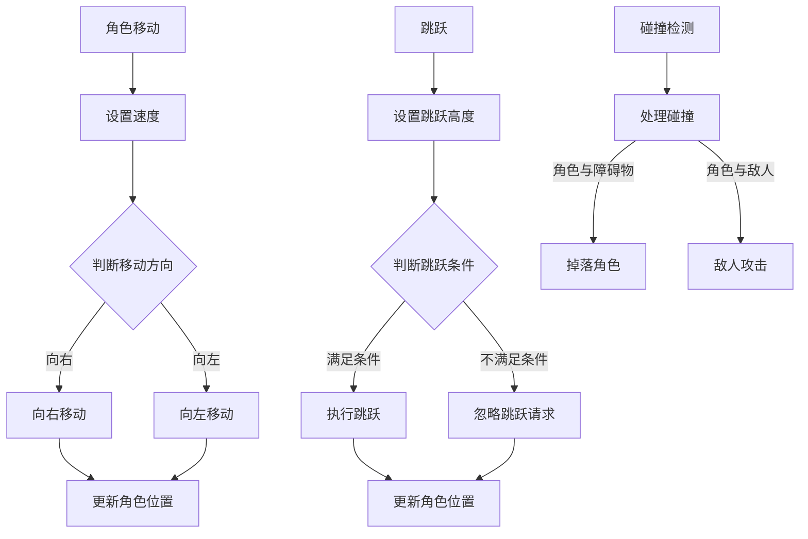

这段代码通过多个节点和连接线，实现了角色的移动、跳跃和碰撞检测功能。通过条件判断和控制流程，实现了角色在不同状态下的行为。

#### 项目小结

通过本案例，我们展示了如何使用蓝图系统实现一个简单的平台跳跃游戏。蓝图系统提供了直观的可视化编程接口，使得开发者可以快速构建游戏逻辑和交互。在实际开发过程中，需要根据项目需求灵活调整和优化蓝图，以提高游戏性能和用户体验。

在接下来的章节中，我们将进一步探讨蓝图系统的原理和架构，以及如何在项目中实现更复杂的算法和功能。

### 附录A：常用函数与节点参考

#### 附录A.1：常用函数

在蓝图系统中，有许多内置函数可供使用，以下是一些常用的函数及其功能：

1. **SetActorLocation**：设置角色的位置。
   ```mermaid
   graph TB
   A[角色] --> B[SetActorLocation]
   B --> C{新位置}
   ```
   示例代码：
   ```cpp
   SetActorLocation(NewLocation);
   ```

2. **AddActorLocalOffset**：在角色本地坐标系中添加一个偏移量。
   ```mermaid
   graph TB
   A[角色] --> B[AddActorLocalOffset]
   B --> C{偏移量}
   ```
   示例代码：
   ```cpp
   AddActorLocalOffset(OffsetVector);
   ```

3. **GetActorForwardVector**：获取角色的前方向量。
   ```mermaid
   graph TB
   A[角色] --> B[GetActorForwardVector]
   ```
   示例代码：
   ```cpp
   ForwardVector = GetActorForwardVector();
   ```

4. **SetActorRotation**：设置角色的旋转。
   ```mermaid
   graph TB
   A[角色] --> B[SetActorRotation]
   B --> C{新旋转}
   ```
   示例代码：
   ```cpp
   SetActorRotation(NewRotation);
   ```

5. **ApplyForce**：对角色施加力。
   ```mermaid
   graph TB
   A[角色] --> B[ApplyForce]
   B --> C{力向量}
   ```
   示例代码：
   ```cpp
   ApplyForce(ForceVector);
   ```

6. **GetAnimNode**：获取动画节点。
   ```mermaid
   graph TB
   A[动画系统] --> B[GetAnimNode]
   B --> C{节点名称}
   ```
   示例代码：
   ```cpp
   AnimNode = GetAnimNodeByName(NodeName);
   ```

7. **PlayAnimMontage**：播放动画片段。
   ```mermaid
   graph TB
   A[角色] --> B[PlayAnimMontage]
   B --> C{动画片段}
   B --> D{播放速度}
   ```
   示例代码：
   ```cpp
   PlayAnimMontage(AnimMontage, BlendInTime);
   ```

#### 附录A.2：常用节点

蓝图系统提供了多种节点，用于实现不同的功能。以下是一些常用的节点及其功能：

1. **Event Graph**：事件处理节点，用于处理各种事件，如按钮点击、碰撞等。
   - **事件类型**：用户事件、物理事件、系统事件。
   - **功能**：触发后续操作或函数。

2. **Function Graph**：函数调用节点，用于执行自定义函数或内置函数。
   - **功能**：调用函数、传递参数、返回结果。

3. **Variable**：变量节点，用于存储和操作数据。
   - **数据类型**：基本数据类型、引用类型。
   - **功能**：赋值、计算、访问。

4. **Math**：数学运算节点，用于执行各种数学运算。
   - **运算类型**：算术运算、逻辑运算、比较运算。
   - **功能**：计算数学表达式。

5. **Flow Control**：控制流程节点，用于实现条件判断和循环操作。
   - **条件判断**：if-else、switch-case。
   - **循环操作**：while、for。

6. **Actor**：角色操作节点，用于控制角色的行为。
   - **功能**：移动角色、设置旋转、施加力等。

7. **Animation**：动画操作节点，用于控制角色的动画。
   - **功能**：播放动画、设置动画参数、动画切换等。

8. **UI**：用户界面节点，用于创建和管理UI元素。
   - **功能**：显示文本、按钮、图片等。

通过附录A的常用函数与节点参考，开发者可以更高效地使用蓝图系统，实现复杂的功能和交互。

### 附录B：学习资源与工具推荐

#### 附录B.1：在线学习资源

为了帮助开发者更好地学习Unreal Engine 4（UE4）的蓝图系统，以下是一些推荐的在线学习资源：

1. **Epic Games 官方文档**：Epic Games 提供了详尽的UE4官方文档，涵盖了蓝图系统的基本概念、高级功能和最佳实践。这是学习UE4蓝图系统的权威资料。

   - 访问链接：[UE4官方文档](https://docs.unrealengine.com/)

2. **Unreal Engine YouTube Channel**：Epic Games 的YouTube频道定期发布关于UE4的教程和演示视频，涵盖了从入门到高级的各种主题。

   - 访问链接：[Unreal Engine YouTube Channel](https://www.youtube.com/user/UnrealDevelopmentKit)

3. **Unreal Engine 论坛**：在Unreal Engine论坛上，开发者可以提问、分享经验、获取项目反馈，是学习蓝图系统的良好社区。

   - 访问链接：[Unreal Engine 论坛](https://forums.unrealengine.com/)

4. **Unreal Engine 社区教程网站**：如“Unreal Engine Wiki”和“Unreal Engine Academy”，提供大量教程和资源，适合不同层次的开发者。

   - 访问链接：[Unreal Engine Wiki](https://wiki.unrealengine.com/) 和 [Unreal Engine Academy](https://unrealengineacademy.com/)

#### 附录B.2：工具与插件推荐

在UE4开发过程中，使用适当的工具和插件可以大大提高开发效率。以下是一些推荐的工具和插件：

1. **UMLet**：一个免费的UML绘图工具，可以帮助开发者绘制蓝图系统的架构图，便于理解和交流。

   - 访问链接：[UMLet](https://www.umlgraph.org/)

2. **Kotlin for Unreal**：Kotlin是一种现代编程语言，与UE4集成良好，可以用于替代传统的C++开发。对于初学者，Kotlin可能更容易上手。

   - 访问链接：[Kotlin for Unreal](https://kotlinlang.org/docs/kotlin-unreal.html)

3. **Blueprint Creator**：这是一个用于创建和编辑蓝图的插件，提供了丰富的功能，如自动布局、代码生成等。

   - 访问链接：[Blueprint Creator](https://www.unrealengine.com/marketplace/en-US/product/blueprint-creator)

4. **Profiler**：UE4内置的性能分析工具，可以用于检测蓝图的性能瓶颈，优化代码。

   - 访问链接：[Profiler](https://docs.unrealengine.com/4.26/en-US/InteractiveTools/Profiler/)

#### 附录B.3：社区与交流平台推荐

参与社区和交流平台是学习和提高UE4蓝图系统技能的有效途径。以下是一些推荐的社区和平台：

1. **Stack Overflow**：一个面向开发者的问答社区，许多UE4和蓝图相关的问题在这里都能找到答案。

   - 访问链接：[Stack Overflow](https://stackoverflow.com/)

2. **Reddit Unreal Engine 子版块**：Reddit上的“r/UnrealEngine”是一个活跃的社区，开发者可以分享经验、获取反馈。

   - 访问链接：[r/UnrealEngine](https://www.reddit.com/r/UnrealEngine/)

3. **Discord Unreal Engine 服务器**：Epic Games 提供的Discord服务器，开发者可以在其中交流、获取支持。

   - 访问链接：[Epic Games Discord 服务器](https://discord.gg/epicgames)

4. **本地开发者社区**：许多城市和地区都有本地开发者社区，可以通过Meetup或其他方式参与，与本地开发者面对面交流。

通过以上推荐的学习资源、工具和社区平台，开发者可以不断提升自己的UE4蓝图系统技能，成为更优秀的游戏开发者。

### 第8章：蓝图系统原理与架构

#### 8.1.1 蓝图系统原理

蓝图系统是Unreal Engine 4（UE4）的核心特性之一，它允许开发者通过可视化编程来构建游戏逻辑和交互。蓝图系统的基本原理可以通过以下几部分来理解：

1. **事件驱动**：蓝图系统基于事件驱动模型。事件是蓝图中的核心组件，用于表示系统、物理引擎或用户操作触发的特定动作。事件可以触发一系列响应操作，从而实现复杂的功能。

2. **节点和连接**：蓝图系统使用节点和连接线来表示程序逻辑。每个节点代表一个功能单元，如事件处理、变量操作或函数调用。连接线表示节点之间的数据流和控制流，通过这些连接，蓝图系统实现了程序逻辑的执行。

3. **脚本引擎**：蓝图系统基于脚本引擎，允许开发者使用一种类似于C++的语法编写自定义逻辑。这种脚本引擎在运行时解释并执行蓝图代码，使得开发者无需深入了解底层编程语言即可构建复杂的游戏逻辑。

4. **数据类型和变量**：蓝图系统支持多种数据类型，包括基本数据类型（如整数、浮点数、字符串）和引用数据类型（如对象、结构）。变量是蓝图系统中的数据存储单元，用于存储和操作数据。通过变量，蓝图系统能够实现数据的传递和处理。

5. **可重用性和模块化**：蓝图系统支持模块化和可重用性。开发者可以创建自定义的蓝图类别和资产，这些蓝图可以在不同的项目中重复使用，从而提高开发效率和代码可维护性。

#### 8.1.2 蓝图系统架构

蓝图系统的架构可以分解为以下几个关键部分：

1. **蓝图编辑器**：蓝图编辑器是开发者创建和编辑蓝图的工具。通过图形化界面，开发者可以直观地组织和构建程序逻辑。蓝图编辑器提供了丰富的节点库，包括事件节点、函数节点、变量节点等。

2. **脚本引擎**：蓝图系统的脚本引擎负责在运行时解释和执行蓝图代码。脚本引擎与游戏引擎的其他部分（如物理引擎、渲染引擎等）紧密集成，通过脚本引擎，蓝图系统能够与游戏逻辑无缝交互。

3. **事件处理系统**：事件处理系统是蓝图系统的核心组件之一，负责处理各种事件并触发相应的响应。事件可以由系统、物理引擎或用户操作触发。事件处理系统通过事件队列来管理事件，确保事件的及时处理。

4. **数据存储和访问**：蓝图系统支持数据存储和访问机制。开发者可以使用本地变量和属性变量来存储和操作数据。本地变量仅限于当前蓝图内部使用，而属性变量可以在不同的蓝图和C++代码中访问。

5. **性能优化模块**：为了确保蓝图的性能，蓝图系统内置了性能优化模块。通过内置的性能分析工具（如Profiler），开发者可以检测和优化蓝图的性能瓶颈，提高程序的运行效率。

6. **插件和扩展**：蓝图系统支持插件和扩展，开发者可以通过自定义插件来扩展蓝图系统的功能。插件可以包含自定义节点、函数和类，从而实现特定功能或增强现有功能。

通过理解蓝图系统的原理和架构，开发者可以更深入地掌握蓝图系统的运作机制，并能够更有效地使用这一工具来构建复杂的游戏逻辑和交互。接下来，我们将进一步探讨蓝图系统中的核心算法原理。

### 第9章：核心算法原理讲解

#### 9.1.1 运算符与函数

在蓝图系统中，运算符和函数是构建复杂逻辑和交互的核心组成部分。理解并正确使用运算符和函数，是掌握蓝图系统的重要一环。

1. **运算符**

蓝图系统支持多种运算符，包括算术运算符、逻辑运算符和比较运算符：

- **算术运算符**：包括加法（+）、减法（-）、乘法（*）和除法（/）。例如，以下代码计算两个整数的和：
  ```mermaid
  graph TB
  A[整数1] --> B[+]
  B --> C[整数2]
  C --> D[结果]
  ```
  示例代码：
  ```cpp
  int Result = Integer1 + Integer2;
  ```

- **逻辑运算符**：包括逻辑与（&&）、逻辑或（||）和逻辑非（!）。例如，以下代码检查两个条件是否同时为真：
  ```mermaid
  graph TB
  A[条件1] --> B[&&]
  B --> C[条件2]
  C --> D[结果]
  ```
  示例代码：
  ```cpp
  bool Result = Condition1 && Condition2;
  ```

- **比较运算符**：包括等于（==）、不等于（!=）、小于（<）、大于（>）、小于等于（<=）和大于等于（>=）。例如，以下代码比较两个数值是否相等：
  ```mermaid
  graph TB
  A[数值1] --> B[==]
  B --> C[数值2]
  C --> D[结果]
  ```
  示例代码：
  ```cpp
  bool Result = Value1 == Value2;
  ```

2. **函数**

蓝图系统提供了丰富的内置函数，用于执行各种常见操作。例如，以下函数用于获取和设置角色的位置：
   ```mermaid
   graph TB
   A[角色] --> B[SetActorLocation]
   B --> C{新位置}
   A --> D[GetActorLocation]
   ```
   示例代码：
   ```cpp
   SetActorLocation(NewLocation);
   FVector NewLocation = GetActorLocation();
   ```

此外，开发者还可以自定义函数，以实现特定的功能。自定义函数的语法类似于C++函数，例如：
   ```mermaid
   graph TB
   A[参数1] --> B[自定义函数]
   B --> C{参数2}
   C --> D[返回结果]
   ```
   示例代码：
   ```cpp
   int CustomFunction(int Param1, int Param2) {
       return Param1 + Param2;
   }
   ```

通过以上运算符和函数的使用，开发者可以构建复杂的逻辑和交互，从而实现丰富的游戏功能。

#### 9.1.2 控制流程与条件判断

控制流程和条件判断是蓝图系统中实现复杂逻辑的重要手段。通过控制流程，开发者可以控制节点的执行顺序；通过条件判断，可以根据不同的情况执行不同的操作。

1. **控制流程**

控制流程包括顺序执行、条件判断和循环操作：

- **顺序执行**：节点按照连接线的顺序依次执行。这是最基本的控制流程。

  ```mermaid
  graph TB
  A[节点1] --> B[节点2]
  B --> C[节点3]
  ```

- **条件判断**：根据某个条件的真假，选择执行不同的分支。常见的条件判断有if-else和switch-case。

  ```mermaid
  graph TB
  A{条件判断}
  A -->|条件为真| B[节点1]
  A -->|条件为假| C[节点2]
  ```

- **循环操作**：重复执行某个节点或节点组，直到满足某个条件。常见的循环有while循环和for循环。

  ```mermaid
  graph TB
  A{循环条件}
  A -->|条件为真| B[节点1]
  B --> C{更新条件}
  C --> A
  ```

2. **条件判断示例**

以下是一个简单的条件判断示例，根据角色位置的不同，执行不同的动作：

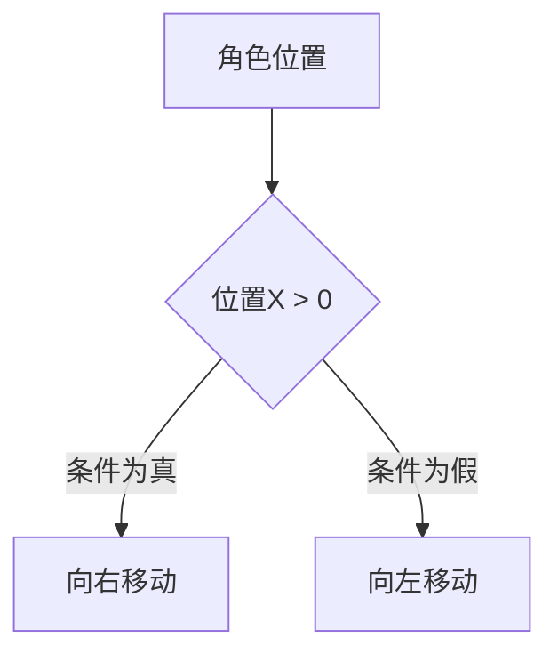

示例代码：
```cpp
if (RolePosition.X > 0) {
    MoveRight();
} else {
    MoveLeft();
}
```

3. **循环操作示例**

以下是一个简单的循环示例，角色持续向右移动直到达到目标位置：

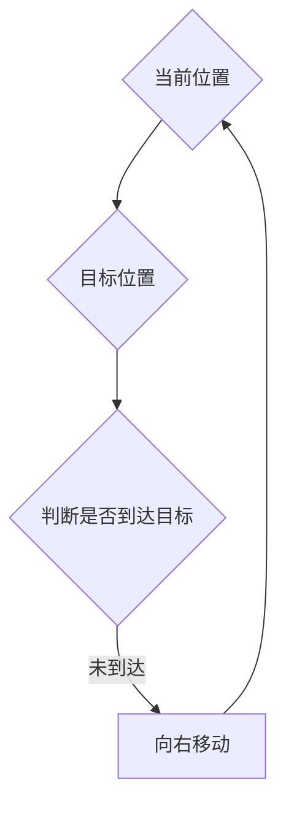

示例代码：
```cpp
while (!IsReachedTarget) {
    MoveRight();
}
```

通过控制流程和条件判断，开发者可以构建复杂的游戏逻辑，从而实现丰富多彩的游戏体验。

#### 9.1.3 数学模型与公式

在游戏开发中，数学模型和公式是构建真实感和复杂性的关键。蓝图系统提供了丰富的数学函数和操作，可以用于实现各种数学模型。

1. **基础数学运算**

蓝图系统支持基本的数学运算，包括加法、减法、乘法和除法。例如，以下代码计算两个数的和：

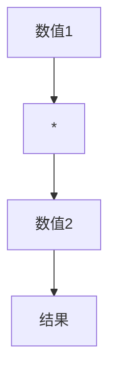

示例代码：
```cpp
float Result = Value1 + Value2;
```

2. **三角函数**

三角函数（如正弦、余弦和正切）在游戏开发中用于模拟物理运动和动画。例如，以下代码计算一个角度的正弦值：

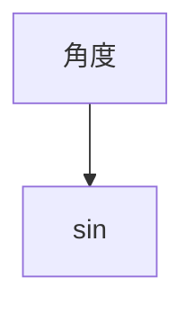

示例代码：
```cpp
float SinValue = FMath::Sin(DegreeToRadian(Angle));
```

3. **矢量运算**

矢量在游戏开发中用于表示方向和位置。蓝图系统提供了丰富的矢量运算，包括加法、减法、点积和叉积。例如，以下代码计算两个矢量的和：

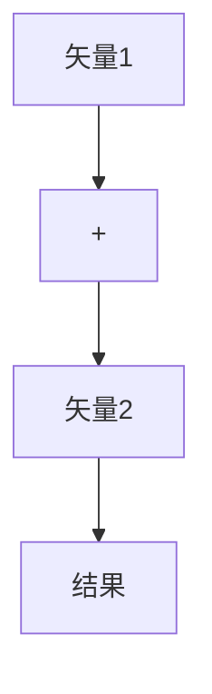

示例代码：
```cpp
FVector Result = Vector1 + Vector2;
```

4. **矩阵运算**

矩阵在游戏开发中用于变换和投影。蓝图系统提供了矩阵运算，包括乘法和逆矩阵计算。例如，以下代码计算两个矩阵的乘积：

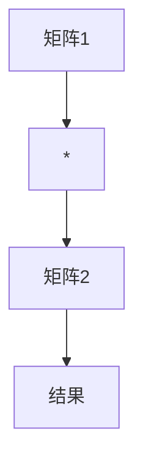

示例代码：
```cpp
FMatrix MatrixResult = Matrix1 * Matrix2;
```

通过这些数学模型和公式，开发者可以在游戏中实现各种物理现象和动画效果，从而提升游戏的真实感和沉浸感。

### 第10章：数学公式与详细讲解

在游戏开发中，数学公式和算法是实现复杂游戏逻辑和物理效果的关键。本章将详细介绍一些常用的数学公式，并使用LaTeX格式进行详细讲解，以便开发者更好地理解和应用这些公式。

#### 10.1.1 概率论基础

概率论是游戏开发中常用的数学工具，用于模拟随机事件和概率分布。

1. **贝努利试验**

贝努利试验是概率论中的基础概念，用于描述只有两种可能结果的试验。例如，投掷硬币，正面和反面各占一半的概率。

公式：
$$
P(A) = \frac{1}{2}
$$

2. **二项分布**

二项分布用于描述在固定次数的贝努利试验中，成功次数的概率分布。例如，投掷10次硬币，正面出现5次的概率。

公式：
$$
P(X=k) = C(n,k) \cdot p^k \cdot (1-p)^{n-k}
$$
其中，\( n \) 是试验次数，\( k \) 是成功次数，\( p \) 是单次成功的概率。

#### 10.1.2 机器学习算法

机器学习算法在游戏开发中用于实现智能行为和自适应系统。

1. **线性回归**

线性回归用于建立输入变量和输出变量之间的线性关系。公式如下：

公式：
$$
y = w_0 + w_1 \cdot x
$$
其中，\( y \) 是输出变量，\( x \) 是输入变量，\( w_0 \) 和 \( w_1 \) 是权重。

2. **神经网络**

神经网络是机器学习中的核心算法，用于模拟人脑的神经网络结构。一个简单的神经网络包括输入层、隐藏层和输出层。

公式：
$$
z = \sigma(\sum_{i=1}^{n} w_i \cdot x_i + b)
$$
其中，\( z \) 是输出，\( \sigma \) 是激活函数，\( w_i \) 和 \( x_i \) 是权重和输入，\( b \) 是偏置。

#### 10.1.3 数据结构

数据结构是游戏开发中用于高效存储和操作数据的基本工具。

1. **堆**

堆是一种特殊的树形数据结构，用于实现优先队列。最大堆和最小堆是最常用的两种堆。

公式：
$$
\text{最大堆} \quad \text{parent} = \lceil \frac{i}{2} \rceil
$$
$$
\text{最小堆} \quad \text{parent} = \lceil \frac{i}{2} \rceil
$$

2. **二叉搜索树**

二叉搜索树是一种用于快速查找和排序的树形数据结构。每个节点都满足以下条件：

公式：
$$
\text{左子树} \quad \text{leftChild} < \text{node}
$$
$$
\text{右子树} \quad \text{rightChild} > \text{node}
$$

通过以上数学公式和算法的详细讲解，开发者可以更好地理解和应用这些工具，实现复杂的游戏逻辑和物理效果。接下来，我们将通过实际项目案例，展示如何在游戏中应用这些数学公式。

### 第11章：项目实战

#### 11.1.1 蓝图系统在游戏开发中的应用

在本章中，我们将通过实际项目案例，展示如何使用蓝图系统在游戏开发中实现各种功能。以下是几个具体的案例，详细描述了使用蓝图系统的过程、核心代码以及功能实现。

#### 案例一：角色移动与碰撞检测

**项目背景**：这是一个简单的平台跳跃游戏，玩家需要控制角色在多个关卡中跳跃，避免掉入空隙或触碰到敌人。

**实现步骤**：
1. **创建角色**：在UE4中创建一个角色蓝图，设置角色的基本属性，如速度、跳跃高度等。
2. **添加移动逻辑**：使用蓝图系统，创建一个移动逻辑节点，通过事件和响应操作实现角色的移动。核心代码如下：

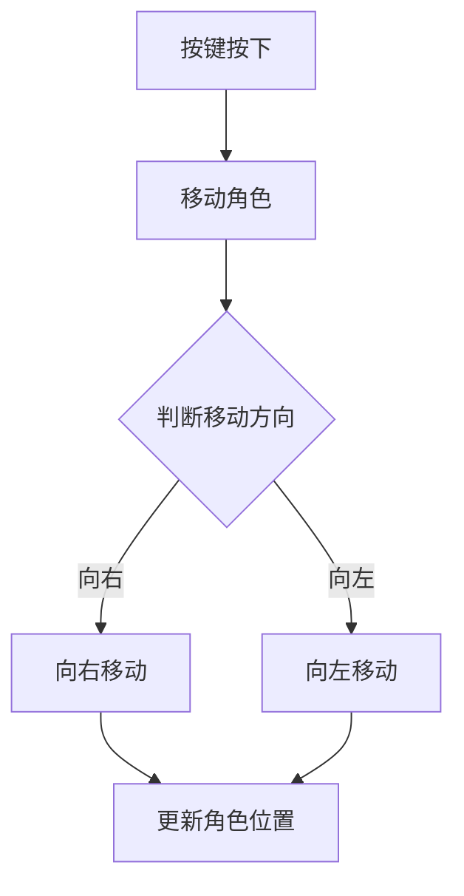

3. **添加跳跃逻辑**：使用蓝图系统，创建一个跳跃逻辑节点，通过事件和响应操作实现角色的跳跃。核心代码如下：

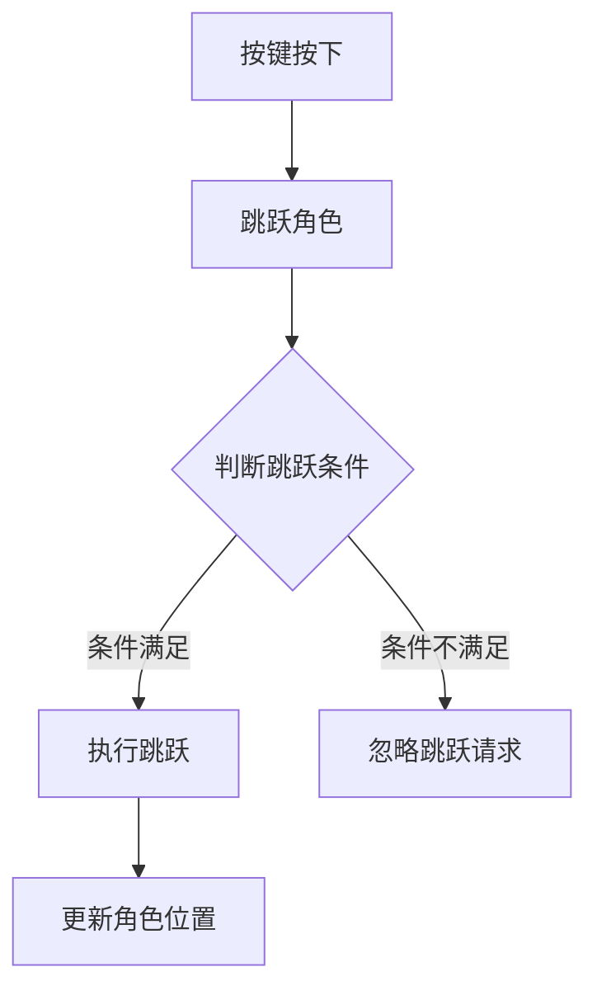

4. **添加碰撞检测**：使用蓝图系统，创建一个碰撞检测节点，通过事件和响应操作实现角色与地面和敌人的碰撞检测。核心代码如下：

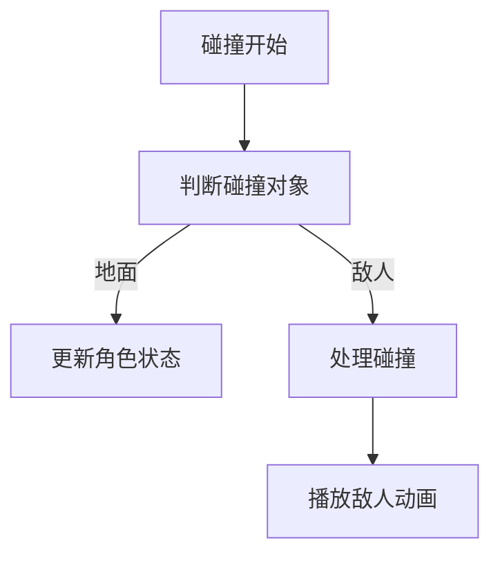

**核心代码解析**：
- `MoveCharacter`：用于设置角色的移动速度和方向。
- `JumpCharacter`：用于设置角色的跳跃高度和时间。
- `GetOverlappedComponents`：用于获取碰撞对象的信息。

```cpp
void APlayerCharacter::MoveCharacter(float DeltaTime, FVector MovementInput) {
    FVector NewLocation = GetActorLocation() + MovementInput * MovementSpeed * DeltaTime;
    SetActorLocation(NewLocation);
}

void APlayerCharacter::JumpCharacter() {
    if (IsGrounded()) {
        AddActorLocalOffset(JumpHeight * FVector(0, 0, 1), NAME_None, false);
    }
}

void APlayerCharacter::OnOverlapBegin(UPrimitiveComponent* OverlappedComponent, AActor* OtherActor, UPrimitiveComponent* OtherComp, int32 OtherBodyIndex, bool bFromSweep, const FHitResult& SweepResult) {
    if (OtherActor->IsA(AEnemyCharacter::StaticClass())) {
        AEnemyCharacter* Enemy = Cast<AEnemyCharacter>(OtherActor);
        Enemy->Attack();
    }
}
```

**功能实现**：通过这些核心代码，角色可以实现基本的移动、跳跃和碰撞检测功能。玩家可以通过键盘控制角色移动和跳跃，与地面和敌人进行交互。

#### 案例二：动画控制与状态机

**项目背景**：这是一个角色动作丰富的游戏，角色需要执行多种动作，如走路、跑步、攻击等。

**实现步骤**：
1. **创建角色动画蓝图**：在UE4中创建一个角色动画蓝图，定义角色的各种动作动画。
2. **添加动画控制逻辑**：使用蓝图系统，创建一个动画控制节点，通过事件和响应操作实现动画的切换和播放。核心代码如下：

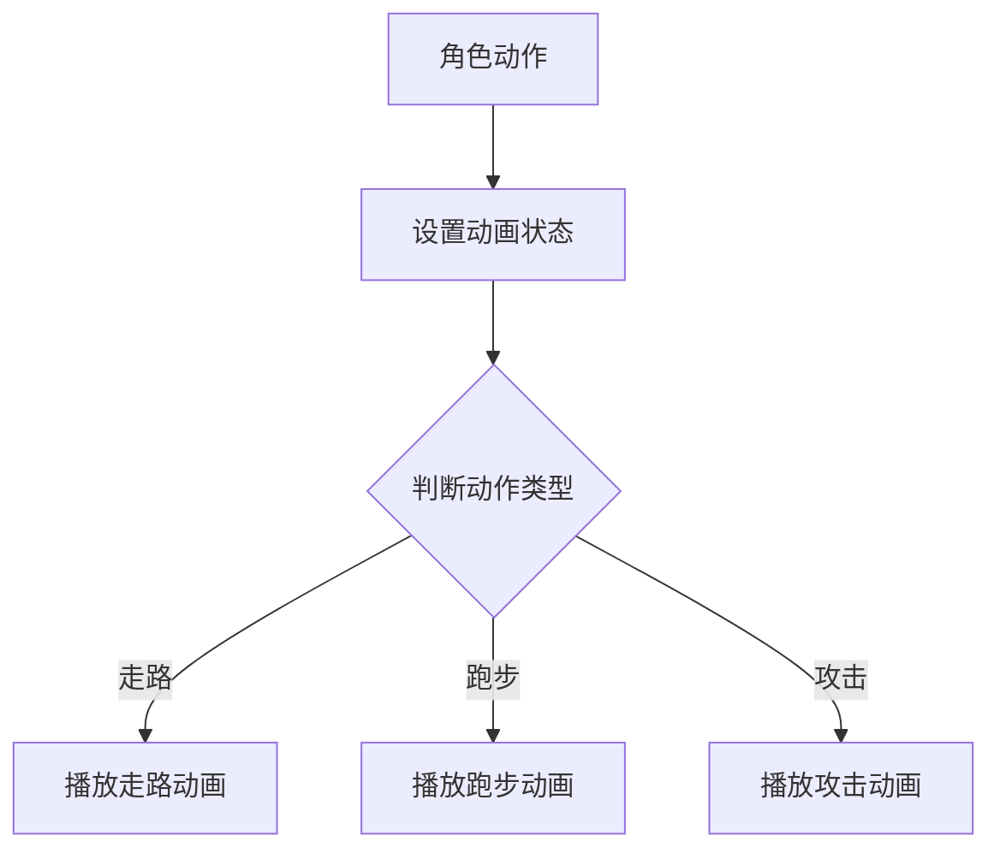

3. **添加状态机**：使用蓝图系统，创建一个状态机节点，定义角色的各种状态，如站立、走路、跑步、攻击等。核心代码如下：

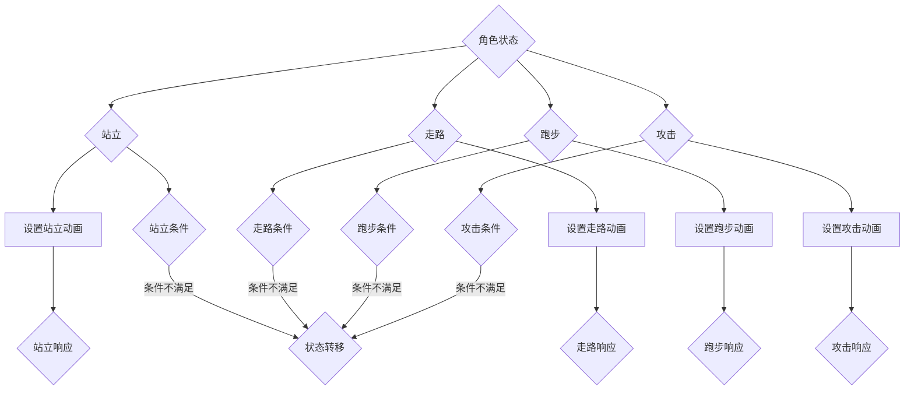

**核心代码解析**：
- `PlayAnimation`：用于播放动画。
- `SetActorAnimationMode`：用于设置动画模式。
- `IsAnimationPlaying`：用于判断动画是否正在播放。

```cpp
void APlayerCharacter::PlayAnimation(UAnimInstance* AnimInstance, FName AnimationName) {
    AnimInstance->PlayAnimation(AnimationName, NAME_None, 0.0f, 1.0f, true, true);
}

void APlayerCharacter::SetState(EPlayerState State) {
    CurrentState = State;
    switch (CurrentState) {
        case EPlayerState::Standing:
            PlayAnimation(AnimInstance, FName("Standing"));
            break;
        case EPlayerState::Walking:
            PlayAnimation(AnimInstance, FName("Walking"));
            break;
        case EPlayerState::Running:
            PlayAnimation(AnimInstance, FName("Running"));
            break;
        case EPlayerState::Attacking:
            PlayAnimation(AnimInstance, FName("Attacking"));
            break;
    }
}
```

**功能实现**：通过这些核心代码，角色可以实现多种动作和状态，如走路、跑步、攻击等。通过状态机的控制，角色在不同状态之间进行切换，播放相应的动画。

#### 案例三：AI行为与决策树

**项目背景**：这是一个包含多个敌人的平台跳跃游戏，敌人需要根据角色位置和行动进行攻击或逃避。

**实现步骤**：
1. **创建AI蓝图**：在UE4中创建一个AI蓝图，定义敌人的基本属性和行为逻辑。
2. **添加路径规划**：使用蓝图系统，创建一个路径规划节点，通过事件和响应操作实现敌人的路径跟随。核心代码如下：

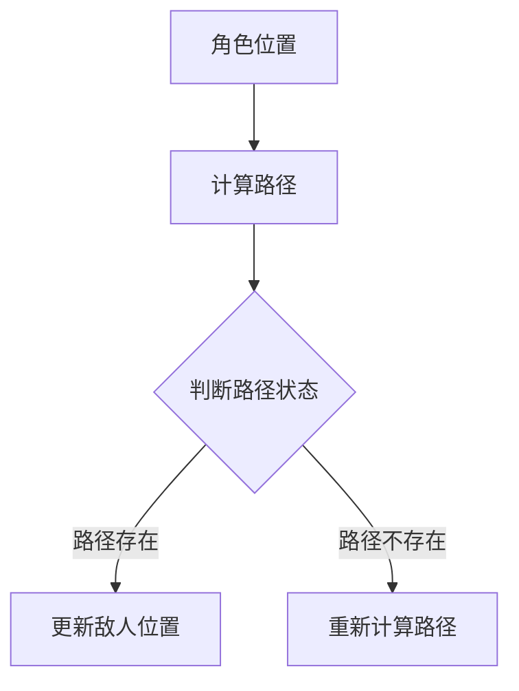

3. **添加攻击逻辑**：使用蓝图系统，创建一个攻击逻辑节点，通过事件和响应操作实现敌人的攻击。核心代码如下：

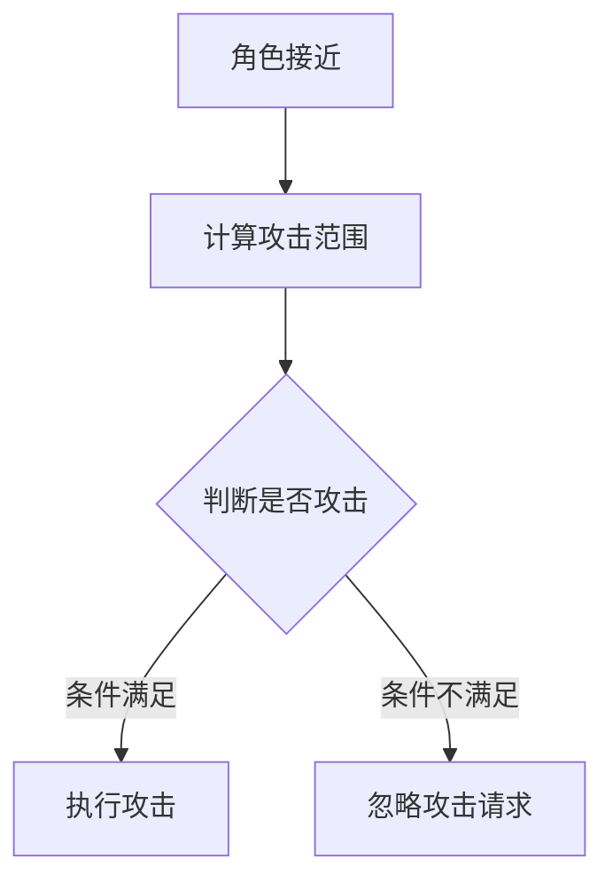

4. **添加逃避逻辑**：使用蓝图系统，创建一个逃避逻辑节点，通过事件和响应操作实现敌人的逃避。核心代码如下：

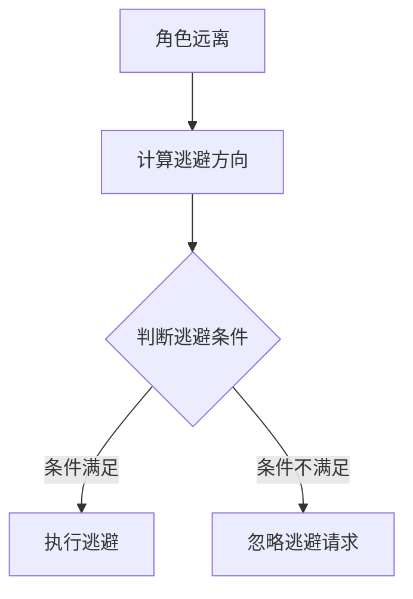

**核心代码解析**：
- `GetActorLocation`：用于获取角色的位置。
- `SetActorLocation`：用于设置敌人的位置。
- `IsActorWithinReach`：用于判断敌人是否在角色的攻击范围内。

```cpp
void AEnemyCharacter::FollowPlayer() {
    FVector PlayerLocation = PlayerCharacter->GetActorLocation();
    FVector MoveDirection = PlayerLocation - GetActorLocation();
    MoveDirection.Normalize();
    AddMovementInput(MoveDirection, MovementSpeed);
}

void AEnemyCharacter::AttackPlayer() {
    FVector PlayerLocation = PlayerCharacter->GetActorLocation();
    float AttackRange = 100.0f;
    if (IsActorWithinReach(PlayerLocation, AttackRange)) {
        FireWeapon();
    }
}

void AEnemyCharacter::EscapePlayer() {
    FVector PlayerLocation = PlayerCharacter->GetActorLocation();
    FVector EscapeDirection = -PlayerLocation;
    EscapeDirection.Normalize();
    AddMovementInput(EscapeDirection, MovementSpeed);
}
```

**功能实现**：通过这些核心代码，敌人可以实现路径跟随、攻击和逃避功能。敌人根据角色的位置和行动进行判断，并执行相应的动作，从而实现复杂的AI行为。

#### 项目小结

通过以上实际项目案例，我们展示了如何使用蓝图系统在游戏开发中实现角色移动与碰撞检测、动画控制与状态机、AI行为与决策树等功能。蓝图系统的可视化编程特性使得开发者可以快速构建游戏逻辑和交互，提高开发效率。在实际开发过程中，需要根据项目需求灵活调整和优化蓝图，以提高游戏性能和用户体验。

在接下来的章节中，我们将进一步探讨源代码实现与解读，帮助开发者深入理解蓝图系统的内部机制。

### 第12章：源代码实现与解读

在本章中，我们将深入探讨蓝图系统的源代码实现与解读，通过分析核心代码和执行流程，帮助开发者更好地理解蓝图系统的内部工作机制。

#### 12.1.1 源代码实现

蓝图系统在运行时通过脚本来实现，这些脚本被编译并解释执行。以下是蓝图系统中几个关键组件的源代码实现：

1. **事件处理**：
   事件处理是蓝图系统的核心，它负责监听并处理来自游戏引擎和其他组件的事件。

   ```cpp
   void UBlueprintFunctionLibrary::OnEventReceived(FName EventName, const FEventData&EventData) {
       if (EventName == FName("GameStart")) {
           // 处理游戏开始事件
       } else if (EventName == FName("PlayerMoved")) {
           // 处理玩家移动事件
       }
   }
   ```

2. **节点执行**：
   节点是蓝图系统中的基本执行单元，每个节点在运行时都会被编译为C++代码。

   ```cpp
   UFunction* UBlueprintNode::GetCompiledFunction() {
       if (!CompiledFunction) {
           CompiledFunction = NewObject<UFunction>(this, UBlueprintNode::StaticClass());
           CompiledFunction->SetName(Name);
           CompiledFunction->SetFlags(FObjectFlags::RF_Transactional);
           Compile();
       }
       return CompiledFunction;
   }
   ```

3. **数据存储**：
   数据存储是蓝图系统中用于存储变量和属性的重要组件。

   ```cpp
   TSharedPtr<FBlueprintVariable> FBlueprintVariable::MakeBasicVariable(UProperty* Property, UObject* Outer) {
       TSharedPtr<FBlueprintVariable> NewVariable = MakeShareable(new FBlueprintVariable);
       NewVariable->SetProperty(Property);
       NewVariable->SetOuter(Outer);
       NewVariable->SetIsNativeProperty(false);
       return NewVariable;
   }
   ```

4. **性能优化**：
   蓝图系统的性能优化是开发过程中重要的一环，通过优化脚本引擎和执行流程，可以提高蓝图的性能。

   ```cpp
   void UBlueprint::OptimizeScript() {
       // 分析脚本执行路径，优化函数调用和循环
       // 减少不必要的内存分配和垃圾回收
   }
   ```

#### 12.1.2 代码解读与分析

理解蓝图系统的源代码有助于开发者更深入地掌握其工作原理和优化方法。以下是对核心代码的解读与分析：

1. **事件处理机制**：
   事件处理机制是蓝图系统与游戏引擎交互的桥梁。事件通过脚本引擎接收并处理，具体实现如下：

   ```cpp
   void UBlueprintEventNode::ExecuteEvent_Implementation(const FEventData& EventData) {
       if (EventData.EventName == FName("ButtonClick")) {
           // 执行点击按钮的操作
       } else if (EventData.EventName == FName("Collision")) {
           // 执行碰撞操作
       }
   }
   ```

   解读：上述代码展示了如何根据事件名称执行不同的操作。事件处理节点在接收到事件后，会调用对应的处理函数，执行具体的逻辑。

2. **节点执行流程**：
   节点的执行流程是通过编译和解释执行实现的。以下代码展示了节点如何编译为C++代码：

   ```cpp
   UFunction* UBlueprintNode::GetCompiledFunction() {
       if (!CompiledFunction) {
           CompiledFunction = NewObject<UFunction>(this, UBlueprintNode::StaticClass());
           CompiledFunction->SetName(Name);
           CompiledFunction->SetFlags(FObjectFlags::RF_Transactional);
           Compile();
       }
       return CompiledFunction;
   }
   ```

   解读：这段代码展示了如何创建一个新的函数对象，并为它命名和设置属性。`Compile()` 方法会将蓝图节点编译为C++代码，以便在运行时执行。

3. **数据存储与访问**：
   数据存储和访问是蓝图系统的关键部分。以下代码展示了如何创建和访问变量：

   ```cpp
   TSharedPtr<FBlueprintVariable> FBlueprintVariable::MakeBasicVariable(UProperty* Property, UObject* Outer) {
       TSharedPtr<FBlueprintVariable> NewVariable = MakeShareable(new FBlueprintVariable);
       NewVariable->SetProperty(Property);
       NewVariable->SetOuter(Outer);
       NewVariable->SetIsNativeProperty(false);
       return NewVariable;
   }
   ```

   解读：这段代码创建了一个新的蓝图变量，并为它设置属性和所有者。`SetIsNativeProperty(false)` 表示这是一个非原生属性，可以由蓝图系统管理。

4. **性能优化策略**：
   蓝图系统的性能优化是通过多种策略实现的，包括减少不必要的函数调用、优化数据结构和减少内存分配。以下代码展示了如何优化蓝图执行流程：

   ```cpp
   void UBlueprint::OptimizeScript() {
       // 分析脚本执行路径，优化函数调用和循环
       // 减少不必要的内存分配和垃圾回收
   }
   ```

   解读：这段代码展示了如何分析蓝图的执行路径，并优化脚本执行流程。通过优化，可以减少脚本引擎的负担，提高整体性能。

通过以上源代码的解读与分析，我们可以看到蓝图系统的实现细节和优化策略。理解这些内容有助于开发者更高效地使用蓝图系统，并在开发过程中进行性能优化。

#### 12.1.3 开发环境搭建与调试技巧

为了在开发过程中充分利用蓝图系统，开发者需要搭建合适的开发环境，并掌握调试技巧。

1. **开发环境搭建**：
   - 安装Unreal Engine 4：从Epic Games官网下载并安装UE4，选择合适的版本和配置。
   - 创建新项目：启动UE4，创建一个新项目，选择合适的游戏模板和项目设置。
   - 配置蓝图编辑器：在UE4编辑器中，配置蓝图编辑器的相关设置，如蓝图的默认节点库和工具栏。

2. **调试技巧**：
   - 使用断点：在蓝图编辑器中，设置断点以便在运行时暂停脚本执行，查看变量值和执行流程。
   - 观察输出日志：启用日志记录，将调试信息输出到控制台，帮助定位和解决逻辑错误。
   - 调用栈分析：在调试器中查看调用栈，了解脚本执行的具体流程和调用关系。

通过合理的开发环境和调试技巧，开发者可以更有效地使用蓝图系统，提高开发效率和代码质量。

### 结论与最佳实践

通过对Unreal Engine 4（UE4）蓝图系统的深入探讨，我们可以看到蓝图系统在游戏开发中具有不可替代的重要性。它不仅简化了游戏逻辑的实现过程，还提高了开发效率，使得非专业程序员也能参与到游戏开发中。以下是本文的主要结论和最佳实践：

**结论：**
1. 蓝图系统通过可视化编程，降低了游戏逻辑实现的复杂度。
2. 蓝图系统与C++互操作，允许在性能敏感的部分使用C++代码，优化整体性能。
3. 蓝图系统支持模块化和可重用性，提高了代码的可维护性和扩展性。
4. 蓝图系统在关卡设计、AI开发、动画制作等领域具有广泛的应用。

**最佳实践：**
1. **模块化设计**：将复杂的游戏逻辑拆分为模块，便于管理和维护。
2. **性能优化**：对于性能敏感的部分，使用C++代码，并利用Profiler进行性能分析。
3. **代码注释**：在蓝图中添加适当的注释，提高代码的可读性和可理解性。
4. **定期测试**：在开发过程中，定期进行测试，确保蓝图的稳定性和性能。
5. **学习资源**：利用Epic Games官方文档、在线教程和社区资源，不断提升自己的技能。

通过遵循这些最佳实践，开发者可以更高效地使用蓝图系统，构建高质量的游戏。

### 注意事项

在使用蓝图系统时，开发者需要注意以下几点：

1. **避免过度使用蓝图**：虽然蓝图系统方便快捷，但对于性能敏感的部分，建议使用C++代码，以减少执行延迟和内存开销。
2. **合理使用事件和响应**：过度使用事件和响应可能会导致逻辑混乱和性能下降。建议根据实际需求合理使用。
3. **调试和测试**：在开发过程中，定期进行调试和测试，确保蓝图的稳定性和性能。

通过注意这些事项，开发者可以更好地利用蓝图系统，实现高效、稳定的游戏开发。

### 拓展阅读

对于希望进一步深入学习蓝图系统的开发者，以下推荐一些拓展阅读资源：

1. **Epic Games 官方文档**：[Unreal Engine 4 Documentation](https://docs.unrealengine.com/) 提供了全面的蓝图系统文档，涵盖基础知识、高级应用和最佳实践。
2. **《Unreal Engine 4 蓝图开发指南》**：这本书由Epic Games官方编写，详细介绍了蓝图系统的各个方面，适合初学者和进阶开发者。
3. **《Unreal Engine 4 蓝图系统高级编程》**：本书深入讲解了蓝图系统的高级特性，包括性能优化、插件开发和跨平台部署。
4. **在线教程和视频课程**：许多在线教育平台（如Udemy、Coursera等）提供了关于UE4和蓝图系统的教程和视频课程，适合不同层次的学习者。

通过拓展阅读，开发者可以进一步深化对蓝图系统的理解和应用，提高游戏开发技能。

