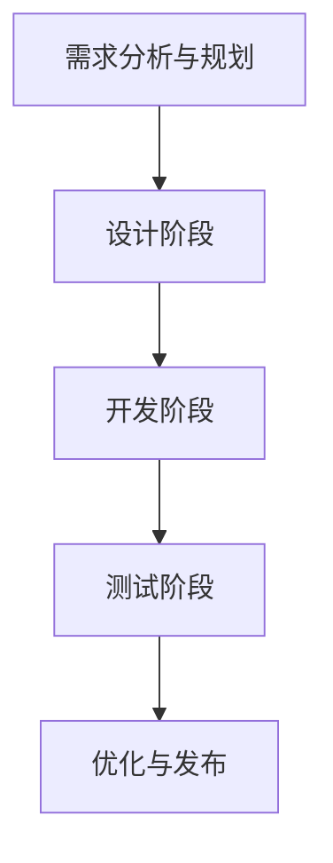
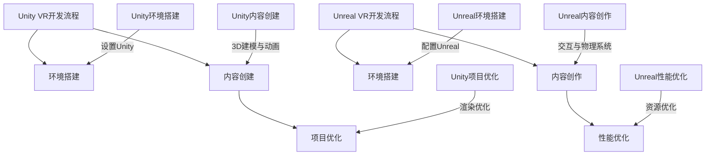

                 

### 文章标题

### 《VR 内容开发框架：Unity VR 和 Unreal VR》

### 关键词

- VR内容开发
- Unity VR
- Unreal VR
- 开发框架
- 内容创建
- 技术实践

### 摘要

本文将深入探讨虚拟现实（VR）内容开发中的两大框架：Unity VR和Unreal VR。通过详细的分析和实战示例，我们将理解这两种开发框架的基础知识、核心概念，以及它们在实际项目中的应用。文章将分为两部分，第一部分介绍VR内容开发的基础知识，包括VR技术概述、Unity VR和Unreal VR的开发基础；第二部分则聚焦于VR内容开发的实践，通过Unity VR和Unreal VR的项目实战，展示如何将理论知识应用于实际项目。最后，我们将总结VR内容开发的框架，展望VR技术的发展趋势和应用场景。文章旨在为VR开发者提供全面的指导和参考。

### 第一部分：VR内容开发基础

#### 第1章：VR技术概述

##### 1.1 虚拟现实（VR）的定义与发展历程

虚拟现实（VR），即Virtual Reality，是一种通过计算机技术生成模拟环境，使人们沉浸其中，并在其中进行交互和体验的技术。VR的定义可以从多个角度进行阐述：

- **沉浸感（Immersion）**：用户在虚拟环境中感受到强烈的沉浸感，仿佛身临其境。
- **交互性（Interactivity）**：用户可以与虚拟环境中的对象进行实时互动。
- **想象性（Imagination）**：通过VR技术，用户能够体验超现实或想象中的场景。

VR技术的发展历程可以追溯到20世纪60年代，当时出现了最早的VR设备。然而，直到21世纪初，随着计算机性能的提升、显示技术的进步以及传感器的改进，VR才逐渐走进公众的视野。重要的发展里程碑包括：

- 1968年：麻省理工学院的伊凡·苏瑟兰（Ivan Sutherland）发明了第一个头戴式显示器（Head-Mounted Display，HMD）。
- 1990年代：任天堂虚拟男孩（Virtual Boy）作为家用VR设备首次亮相，尽管市场反响平平。
- 2010年代：Oculus Rift、HTC Vive、Sony PlayStation VR等高端VR设备的推出，标志着VR进入商业化阶段。

##### 1.2 VR硬件与技术体系

VR系统的硬件和技术体系主要包括以下几个关键组件：

- **头戴式显示器（HMD）**：提供用户视觉体验的主要设备，如Oculus Rift、HTC Vive等。
- **跟踪系统**：用于追踪用户的头部和手部位置，确保虚拟环境中视角和交互的准确性。
- **输入设备**：如手柄、手套、眼球跟踪设备等，用于用户与虚拟环境的交互。
- **计算机和渲染器**：用于生成和渲染虚拟环境，提供高质量的视觉效果。

VR技术体系还包括：

- **3D建模与动画**：创建虚拟环境中的物体和角色，赋予它们动态效果。
- **物理引擎**：处理虚拟环境中的物理现象，如碰撞检测、物体运动等。
- **音频技术**：提供立体声或环绕声效果，增强用户的沉浸感。

##### 1.3 VR内容类型与形式

VR内容可以根据其应用场景和目标用户分为多种类型：

- **教育**：如医学模拟、工程培训、历史重现等，提供实践和学习的虚拟环境。
- **娱乐**：如游戏、电影、音乐视频等，为用户提供沉浸式娱乐体验。
- **商业**：如虚拟展示、虚拟商店、虚拟会议等，用于增强商业活动和体验。
- **医疗**：如疼痛缓解、心理治疗、手术模拟等，应用于医疗康复和诊疗。

VR内容的形式多种多样，包括：

- **3D场景**：用户可以探索的虚拟环境。
- **交互式应用程序**：用户可以与之交互的虚拟对象或场景。
- **游戏**：结合VR技术和游戏设计的互动体验。
- **艺术作品**：利用VR技术创作的艺术表现形式。

在了解了VR技术的定义、发展历程、硬件与技术体系以及内容类型与形式后，我们为后续对Unity VR和Unreal VR的详细介绍和实战打下了基础。下一章将深入探讨Unity VR的开发基础，了解Unity在VR内容开发中的优势和应用。

### 第2章：Unity VR开发基础

##### 2.1 Unity简介

Unity是一款功能强大的跨平台游戏开发引擎，广泛应用于游戏开发、虚拟现实（VR）内容开发、增强现实（AR）应用以及多媒体内容的制作。Unity以其易于上手、高度灵活和强大的社区支持，成为了全球游戏开发者和技术创作者的首选工具。

- **核心功能**：Unity提供了一套完整的工具和功能，包括3D和2D游戏开发、实时渲染、物理引擎、动画系统、脚本编程等。此外，Unity还支持多种编程语言，如C#和JavaScript，使得开发者可以根据项目需求进行定制化开发。

- **开发环境**：Unity的开发环境（Unity Editor）提供了直观的图形界面，通过拖放操作即可创建和编辑游戏场景。开发者可以使用Unity的内置编辑工具来制作3D模型、贴图和动画，或者导入外部资源进行使用。

- **跨平台支持**：Unity支持多种平台，包括PC、游戏主机、移动设备、网页浏览器以及VR设备。开发者可以在一个项目中同时发布到多个平台，大大提高了开发效率和灵活性。

- **社区与资源**：Unity拥有庞大的开发者社区，提供了大量的教程、插件和资源，帮助新手快速入门并提高开发技能。此外，Unity商店（Unity Asset Store）提供了丰富的第三方资产和插件，使得开发者可以更高效地实现项目需求。

##### 2.2 Unity VR开发环境搭建

要开始使用Unity进行VR内容开发，首先需要搭建开发环境。以下是搭建Unity VR开发环境的详细步骤：

1. **下载Unity Hub**：访问Unity官网（https://unity.com/）并下载Unity Hub，这是一个用于安装和管理Unity版本的桌面应用程序。

2. **安装Unity**：通过Unity Hub下载并安装Unity编辑器。在安装过程中，确保选择“VR, AR and 3D Graphics”选项，以安装与VR开发相关的组件。

3. **创建Unity项目**：启动Unity Hub，点击“新建项目”按钮，选择“3D模式”创建一个新项目。在项目设置中，选择VR平台（如Oculus、HTC Vive或Windows Mixed Reality），这将配置项目所需的基本设置。

4. **安装VR插件**：在Unity项目中，可以通过Unity Asset Store安装VR插件。常用的VR插件包括Oculus Integration、SteamVR和VRChat，这些插件提供了与特定VR硬件的集成和交互功能。

5. **配置VR设备**：确保你的VR设备（如Oculus Rift、HTC Vive等）与计算机连接，并在相应的设备管理器中进行设置。Unity编辑器将自动检测到VR设备并配置相应的输入和输出。

##### 2.3 Unity UI系统与VR界面设计

在Unity VR内容开发中，用户界面（UI）设计是至关重要的。一个直观且响应迅速的UI可以提升用户的沉浸体验。以下是Unity UI系统与VR界面设计的关键要素：

- **VR界面设计原则**：VR界面设计需要遵循简洁、直观和沉浸感强的原则。使用大按钮和清晰图标，以减少用户的认知负荷。界面布局应尽量符合用户的视觉和手势习惯，如将重要操作放在用户易于触及的位置。

- **Unity UI系统**：Unity的UI系统基于Canvas组件，提供了一系列用于创建和布局UI元素的工具。开发者可以使用Unity的UI Toolkit，通过拖放操作创建按钮、文本框、滑块等UI元素。此外，Unity还支持动画和过渡效果，使得UI操作更加流畅和自然。

- **VR界面组件**：Unity为VR开发提供了专门的UI组件，如VRPanel、VRButton和VRImage。这些组件在渲染和处理上专门优化，以适应VR环境。例如，VRButton组件提供了触摸反馈和手势交互，使得用户可以更自然地与UI进行交互。

- **文本和字体**：在VR界面设计中，文本和字体选择非常重要。建议使用清晰、易于阅读的字体，并注意字体大小和颜色对比度。为了增强沉浸感，可以使用3D文本效果，如阴影和凹凸纹理。

##### 2.4 VR控制器与输入系统

在Unity VR开发中，控制器和输入系统是实现用户与虚拟环境交互的关键。以下是Unity VR控制器与输入系统的基础知识：

- **VR控制器类型**：常见的VR控制器包括手柄、手套和手势识别设备。Unity支持多种VR控制器，如Oculus Touch、HTC Vive控制器等。开发者可以根据项目需求选择合适的控制器。

- **输入系统**：Unity的输入系统提供了丰富的接口和工具，用于处理VR控制器的输入事件。通过Input Manager组件，开发者可以定义和控制各种输入动作，如按钮按下、摇杆移动和手势识别。

- **控制器映射**：Unity允许开发者自定义控制器映射，将物理控制器的动作映射到虚拟操作中。例如，可以将控制器上的按钮映射到Unity中的不同操作，如跳跃、攻击或导航。

- **交互设计**：在VR交互设计中，需要考虑控制器的舒适度和响应速度。合理设计交互流程和反馈机制，如触觉反馈和视觉提示，可以提升用户的沉浸体验和操作流畅度。

通过以上对Unity VR开发基础的介绍，我们了解了Unity的基本功能和特点，以及如何搭建VR开发环境、设计VR界面和实现VR控制器与输入系统。这些基础知识将为后续的Unity VR内容创建和项目实战提供坚实的基础。

### 第3章：Unity VR内容创建

##### 3.1 3D模型与贴图资源制作

在Unity VR内容创建过程中，3D模型和贴图资源的制作是关键步骤，它们决定了虚拟环境的视觉效果和逼真度。以下是关于3D模型与贴图资源制作的详细过程：

- **3D模型制作工具**：首先，需要选择合适的3D建模工具进行模型制作。常见的3D建模软件包括Blender、Maya和3ds Max。这些工具提供了丰富的建模功能，如多边形建模、曲面建模、雕刻和贴图创建等。

- **模型制作流程**：
  1. **概念设计**：在开始建模之前，需要进行概念设计，确定模型的风格、比例和细节。这可以通过草图、线框图或3D预览来实现。
  2. **基础建模**：使用多边形建模工具创建模型的基本形状。这一步需要确定模型的边数和细节层次，以确保模型在渲染时既高效又逼真。
  3. **细节雕刻**：在基础建模完成后，可以使用雕刻工具添加更多细节，如皱纹、凹凸和磨损等。这可以提高模型的逼真度，增强视觉效果。
  4. **贴图制作**：为模型创建贴图，包括法线贴图、纹理贴图和反射贴图等。这些贴图用于在渲染过程中为模型添加颜色、纹理和光照效果。

- **贴图资源优化**：在制作完贴图后，需要对它们进行优化，以减少文件大小和提高渲染效率。常用的优化方法包括：
  1. **降低分辨率**：根据模型在场景中的大小和重要性，适当降低贴图的分辨率。
  2. **压缩格式**：使用无损或低压缩比的格式存储贴图，如PNG或JPEG。
  3. **使用多贴图集**：将多个贴图合并到一个贴图集中，以减少纹理采样次数和提高渲染效率。

- **导入Unity**：将制作好的3D模型和贴图资源导入Unity项目。在导入时，确保模型和贴图设置正确，如材质类型、纹理坐标和贴图大小。Unity支持多种3D文件格式，如FBX和OBJ，可以方便地导入和导出模型和贴图。

##### 3.2 Unity动画系统与骨骼动画

动画是Unity VR内容创建中的重要组成部分，它能够赋予虚拟环境中的角色和物体动态效果，提升沉浸感和互动性。以下是关于Unity动画系统与骨骼动画的详细讲解：

- **Unity动画系统**：Unity的动画系统提供了强大的动画制作和播放功能。它包括以下关键组件：
  1. **动画控制器（Animator）**：用于控制动画的播放和切换。Animator组件可以通过状态机（State Machine）实现复杂动画逻辑。
  2. **动画状态机（Animator State Machine）**：用于定义动画状态和过渡条件，实现动画的流畅切换。
  3. **动画剪辑（Animation Clip）**：存储动画的原始数据，包括角色的动作、变换和音效等。

- **骨骼动画（Boned Animation）**：骨骼动画是一种基于角色骨骼系统实现的动画技术。它通过调整骨骼的位置和旋转来驱动角色模型的运动，从而实现逼真的动作效果。骨骼动画的关键步骤包括：
  1. **设置骨骼系统**：在Unity中，为角色模型添加骨骼组件（Rig），并设置骨骼层级和绑定关系。
  2. **创建动画剪辑**：使用Unity的动画编辑器（Animator Controller）创建动画剪辑，并设置动画关键帧和变换。
  3. **播放动画**：通过Animator组件在场景中播放动画。Animator可以根据状态机和输入信号自动切换动画。

- **动画制作流程**：
  1. **角色设计**：设计角色的外观和动作需求，确定动画风格和表现。
  2. **骨骼设置**：在建模软件中设置角色骨骼系统，确保骨骼绑定准确。
  3. **动画剪辑**：在Unity中创建和编辑动画剪辑，实现角色的动态效果。
  4. **测试和优化**：在Unity编辑器中播放和测试动画，调整关键帧和参数，确保动画流畅自然。

##### 3.3 音频与音效在Unity VR中的应用

在Unity VR内容创建中，音频和音效的应用是增强沉浸感和交互体验的重要手段。以下是关于音频与音效在Unity VR中的应用的详细讲解：

- **音频系统**：Unity的音频系统提供了丰富的音频处理和播放功能，包括以下关键组件：
  1. **音频源（Audio Source）**：用于播放音频文件，如背景音乐、音效等。
  2. **音效混合器（Audio Mixer）**：用于控制音频的音量、淡入淡出和平衡等。
  3. **音频滤波器（Audio Filter）**：用于调整音频的频率响应，如低音增强、回声效果等。

- **音效制作**：音效是虚拟环境中重要的互动元素，可以通过以下步骤进行制作：
  1. **声音素材收集**：收集或购买合适的音频素材，如环境音、音效库等。
  2. **音效编辑**：使用音频编辑软件（如Audacity）对声音素材进行剪辑、调整音量和添加效果。
  3. **音效绑定**：将音效与虚拟环境中的对象或事件关联，实现自动播放。

- **音频应用**：
  1. **环境音效**：在虚拟环境中添加背景音效，如雨声、风声等，以增强沉浸感。
  2. **交互音效**：为用户的操作添加相应的音效，如按钮点击、角色动作等，以提供反馈。
  3. **语音交互**：在VR应用中实现语音识别和合成功能，使用户能够与虚拟角色进行对话。

- **音频优化**：为了提高音频质量并减少渲染开销，可以采取以下优化措施：
  1. **使用压缩格式**：选择适合的音频压缩格式，如MP3或AAC，以减少文件大小。
  2. **减少音效数量**：根据场景需求，合理控制音效的数量和复杂度。
  3. **动态音量控制**：根据用户的位置和动作动态调整音效的音量，以提供更真实的听觉体验。

通过以上关于3D模型与贴图资源制作、Unity动画系统与骨骼动画、音频与音效在Unity VR中的应用的详细讲解，我们掌握了Unity VR内容创建的核心技术。这些技术不仅能够提升虚拟环境的视觉效果和互动体验，还为后续的Unity VR内容优化和项目实战提供了基础。

##### 3.4 Unity VR内容发布与优化

在完成Unity VR内容的制作后，发布和优化是确保内容质量和性能的关键步骤。以下是关于Unity VR内容发布与优化的详细讲解：

- **发布流程**：
  1. **配置发布平台**：在Unity编辑器中，选择目标VR平台（如Oculus、HTC Vive或Windows Mixed Reality）进行发布配置。确保所有必要的插件和组件已安装，并设置合适的虚拟现实平台参数。
  2. **构建项目**：点击“File”菜单，选择“Build Settings”，然后选择目标平台和构建路径。点击“Build”按钮开始构建项目。Unity将生成适用于目标平台的可执行文件和资源文件。
  3. **测试与调试**：在目标平台上运行构建好的项目，进行测试和调试，确保VR内容在各个平台上都能正常运行，并修复任何可能出现的问题。

- **性能优化**：
  1. **资源压缩**：优化3D模型和贴图的分辨率和压缩格式，减少文件大小。可以使用Unity提供的纹理压缩工具，将贴图压缩为适合VR使用的格式，如ETC1或ASTC。
  2. **静态批处理**：将场景中的物体分类为静态和动态，并使用静态批处理技术将静态物体合并到单个网格中，以减少渲染调用次数。
  3. **LOD技术**：使用细节层次（LOD）技术，根据物体在场景中的距离和可见性动态调整物体的细节层次，以降低渲染开销。
  4. **优化动画**：减少动画中的关键帧数量，并优化动画的轨迹和运动方式，以减少动画的计算开销。
  5. **异步流式处理**：使用异步流式处理技术，将场景中的物体和数据异步加载到内存中，以减少加载时间和内存占用。
  6. **光照优化**：减少场景中的光照源数量，并使用光源优化技术（如光源烘焙和阴影映射），以减少光照的计算开销。

- **发布设置**：
  1. **平台设置**：在Unity编辑器中，选择“Edit”菜单，然后选择“Player Settings”，根据目标平台调整项目设置，如分辨率、帧率、音效和输入配置等。
  2. **版本控制**：为每个发布版本添加版本号和注释，以便后续跟踪和更新。
  3. **发布渠道**：将发布版本上传到应用商店或网站，并设置发布时间和推广策略。

通过以上关于Unity VR内容发布与优化的详细讲解，开发者可以确保VR内容在发布前经过充分的测试和优化，从而提供高质量的用户体验。这些优化措施不仅能够提高VR内容的性能，还能够延长设备电池寿命，降低用户负担。

### 第4章：Unreal VR开发基础

##### 4.1 Unreal Engine简介

Unreal Engine（UE）是一款由Epic Games开发的跨平台游戏和实时内容开发引擎，以其出色的图形渲染能力和灵活的编程接口而闻名。UE不仅广泛应用于游戏开发，还广泛应用于电影、动画、虚拟现实（VR）和增强现实（AR）等领域。

- **核心功能**：
  - **强大渲染能力**：UE采用光线追踪、全局光照、高动态范围（HDR）等先进技术，能够生成逼真的视觉效果。
  - **物理引擎**：UE内置的物理引擎支持各种物理效果，如碰撞检测、物体运动和破坏效果等。
  - **动画系统**：UE的动画系统支持复杂的骨骼动画和蒙皮技术，能够实现流畅的动作表现。
  - **脚本编程**：UE支持蓝图（Blueprint）可视化脚本编程，使得开发者无需编写传统代码即可实现复杂的逻辑和交互。

- **开发环境**：
  - **直观界面**：UE的开发环境（UE Editor）提供了直观的图形界面和丰富的工具，方便开发者进行内容创建和调试。
  - **模块化设计**：UE支持模块化开发，开发者可以轻松地添加或删除特定功能模块，以适应项目需求。
  - **跨平台支持**：UE支持多种平台，包括PC、游戏主机、移动设备和VR设备，使得开发者可以轻松地将内容发布到多个平台。

- **社区与资源**：
  - **庞大社区**：UE拥有庞大的开发者社区，提供了大量的教程、插件和资源，帮助新手快速入门和提高开发技能。
  - **官方教程**：Epic Games提供了丰富的官方教程和文档，涵盖从基础操作到高级功能的各个方面。
  - **资产商店**：UE Asset Store提供了大量的第三方资产和插件，开发者可以方便地购买和使用这些资源来加速项目开发。

##### 4.2 Unreal VR开发环境搭建

要在Unreal Engine中进行VR开发，首先需要搭建开发环境。以下是详细的搭建步骤：

1. **下载Unreal Engine**：访问Epic Games官网（https://www.unrealengine.com/）并注册一个Epic账户。下载适用于你操作系统的Unreal Engine安装包。

2. **安装Unreal Engine**：运行安装包并按照提示进行安装。确保在安装过程中选择“Virtual Reality”功能模块，这将安装与VR开发相关的工具和插件。

3. **创建新项目**：启动Unreal Engine，点击“新建项目”按钮，选择一个合适的项目模板。对于VR项目，建议选择“3D模式”并配置适当的VR平台（如Oculus、HTC Vive或Windows Mixed Reality）。

4. **配置VR设备**：确保你的VR设备（如Oculus Rift、HTC Vive等）与计算机连接，并在设备的设置中进行配置。UE Editor将自动检测并配置VR设备，以便在项目中使用。

5. **安装VR插件**：在UE Editor中，可以通过插件市场安装VR插件，如Oculus Integration、SteamVR和VRChat等。这些插件提供了与特定VR硬件的集成和交互功能，使开发者能够更方便地实现VR内容。

6. **设置项目参数**：在项目的“Project Settings”中，根据需要调整VR相关的参数，如分辨率、帧率和输入配置等。确保这些参数符合你的硬件性能和用户需求。

通过以上步骤，你将搭建好一个基本的Unreal VR开发环境，为后续的VR内容创建和项目实战做好准备。

##### 4.3 Unreal VR内容创作流程

在Unreal Engine中创建VR内容是一个系统化的过程，涉及多个关键步骤，从设计到开发，再到最终的测试和优化。以下是Unreal VR内容创作流程的详细说明：

- **设计阶段**：
  1. **概念设计**：在设计阶段，开发者需要确定VR内容的整体概念和风格。这包括场景布局、角色设计、交互方式和故事情节等。可以使用草图、线框图或3D预览工具来记录和展示设计想法。
  2. **需求分析**：分析项目需求，明确目标用户和场景需求。确定内容的难度、互动性、沉浸感和视觉效果等。
  3. **原型制作**：基于设计概念，制作一个基本的VR原型。原型可以帮助团队评估设计可行性，收集用户反馈，并为进一步开发提供指导。

- **开发阶段**：
  1. **环境搭建**：使用Unreal Engine的建模工具和贴图资源，创建VR场景。这包括3D模型、贴图、灯光和音效等。
  2. **角色与动画**：为VR场景中的角色创建动画，使用Unreal Engine的骨骼系统和动画编辑器来实现复杂的动作和表情。
  3. **交互设计**：设计用户与VR内容的交互方式，如手势操作、语音控制、触觉反馈等。使用Unreal Engine的输入系统来处理用户的输入事件。
  4. **脚本编程**：使用蓝图为VR内容添加逻辑和交互。蓝图提供了一个可视化编程接口，使得开发者可以轻松实现复杂的逻辑和交互效果。

- **测试与优化阶段**：
  1. **内部测试**：在开发过程中，定期进行内部测试，确保VR内容的每个部分都能正常运行。测试包括功能测试、性能测试和用户体验测试等。
  2. **用户反馈**：收集用户的反馈，了解他们对VR内容的看法和建议。这可以帮助团队发现潜在的问题和改进点。
  3. **优化调整**：根据测试和用户反馈，对VR内容进行调整和优化。优化包括性能优化、交互优化和视觉效果优化等。
  4. **发布与推广**：完成最终的VR内容后，将其发布到目标平台，并进行推广。确保内容的版本控制，以便后续的更新和维护。

通过以上流程，开发者可以系统地创作高质量的VR内容，提供卓越的用户体验。这个流程不仅涵盖了从设计到开发的各个阶段，还强调了测试和优化的重要性，以确保VR内容的稳定性和性能。

##### 4.4 Unreal VR交互与物理系统

在Unreal VR开发中，交互与物理系统是关键组成部分，它们决定了用户在虚拟环境中的互动和体验质量。以下是关于Unreal VR交互与物理系统的详细讲解：

- **交互系统**：
  1. **输入设备**：Unreal Engine支持多种VR输入设备，包括手柄、手套、触觉反馈设备等。开发者可以通过设置输入绑定来定义如何将物理控制器的动作映射到虚拟操作中。
  2. **手势识别**：Unreal Engine提供了手势识别功能，允许用户通过手势与VR内容进行交互。这可以通过内置的手势识别系统或第三方插件来实现。
  3. **交互逻辑**：开发者可以使用蓝图（Blueprint）来定义VR内容的交互逻辑。例如，可以创建一个蓝图来处理用户的手势，使其触发特定动作或效果。

- **物理系统**：
  1. **碰撞检测**：Unreal Engine内置的物理引擎提供了强大的碰撞检测功能，确保虚拟环境中的物体能够正确响应碰撞。开发者可以通过设置碰撞体和碰撞响应来控制物体的运动和交互。
  2. **物体运动**：Unreal Engine支持多种物体运动模式，包括刚体运动、软体运动和粒子运动等。这些模式可以用于实现复杂的物理现象和效果。
  3. **破坏效果**：Unreal Engine的物理引擎还支持破坏效果，如物体破碎、爆炸和烟雾等。这些效果可以增强虚拟环境的真实感和互动性。

通过以上关于Unreal VR交互与物理系统的详细讲解，开发者可以创建出高度交互和真实的虚拟体验，提升用户的沉浸感和参与度。这些系统不仅提供了丰富的交互和物理功能，还为后续的VR项目开发提供了坚实的基础。

### 第二部分：VR内容开发实践

#### 第5章：Unity VR项目实战

##### 5.1 VR角色动作捕捉与动画

在Unity VR项目开发中，角色动作捕捉与动画是提升沉浸感和真实感的重要环节。以下是关于VR角色动作捕捉与动画的详细实战步骤：

- **动作捕捉设备**：首先，需要选择合适的动作捕捉设备。常见的动作捕捉设备包括全身捕捉套件、手部捕捉套件和面部捕捉设备。Unity支持NVIDIA的Illuminator、Vicon和OptiTrack等主流动作捕捉系统。

- **设置捕捉设备**：确保动作捕捉设备与计算机连接，并在Unity编辑器中进行配置。在“Edit”菜单中选择“Project Settings”，然后在“Input”部分设置动作捕捉设备的输入源。

- **捕捉动画**：
  1. **准备角色**：在Unity中创建或导入一个角色模型，并为其绑定骨骼。确保骨骼层级和绑定关系正确，以便于动作捕捉。
  2. **运行捕捉软件**：启动动作捕捉软件，将角色模型与捕捉设备进行绑定。确保捕捉设备的标定（Calibration）正确，以获取准确的运动数据。
  3. **开始捕捉**：运行角色并进行预定义的动作，如跑步、跳跃、旋转等。动作捕捉软件将记录角色的运动轨迹和面部表情数据。

- **导入动画**：
  1. **导出捕捉数据**：在动作捕捉软件中导出捕捉数据，通常以FBX或BVH格式保存。
  2. **导入Unity**：在Unity编辑器中导入捕捉数据，选择“Import Package”导入FBX文件。Unity将自动识别骨骼绑定并创建相应的动画剪辑。

- **动画编辑**：
  1. **调整动画**：在Unity的动画编辑器中，可以对捕捉到的动画进行调整，如修剪、插入关键帧、调整运动轨迹等，以优化动画效果。
  2. **融合动画**：使用Unity的动画混合器（Animator）功能，可以将多个动画剪辑融合在一起，实现平滑的动画过渡。

- **测试与优化**：
  1. **播放动画**：在Unity编辑器中播放动画，观察角色动作的流畅性和真实性。
  2. **性能优化**：根据需要调整动画的细节和复杂度，以优化性能。例如，可以减少关键帧数量、简化模型和贴图等。

通过以上步骤，开发者可以有效地使用动作捕捉技术创建逼真的VR角色动画，提升虚拟环境的互动性和真实感。这些动画不仅能够增强用户的沉浸体验，还能够为后续的VR项目开发提供高质量的角色资源。

##### 5.2 VR导航系统与路径规划

在Unity VR项目中，导航系统与路径规划是确保用户在虚拟环境中能够顺畅移动和探索的重要技术。以下是关于VR导航系统与路径规划的详细实战步骤：

- **导航系统**：
  1. **设置导航网格**：在Unity中，首先需要创建一个导航网格（Navigation Mesh），它用于计算路径和避障。通过“Navigation”菜单中的“Create Nav Mesh”命令，可以创建一个基本的导航网格。
  2. **调整网格设置**：在“Navigation Settings”面板中，可以调整导航网格的参数，如精度、高度和细节等，以确保路径规划的准确性。

- **路径规划**：
  1. **定义起点和终点**：在Unity中，使用“Move To”节点或“Move To Navigation”组件来定义角色的起点和终点。这些节点或组件可以根据用户输入或脚本控制，自动计算路径。
  2. **优化路径**：Unity提供了多种路径优化选项，如平滑路径、加速和减速等。这些选项可以确保角色在移动过程中的流畅性和稳定性。

- **避障系统**：
  1. **设置避障层**：在Unity中，可以通过“Layer”属性设置物体和角色的避障层。避障层用于确定哪些物体和角色在碰撞检测中会被考虑。
  2. **实现避障逻辑**：使用脚本实现避障逻辑。例如，可以使用“Move Away From”或“Clear Path”等节点，使角色在遇到障碍时自动调整路径。

- **实战步骤**：
  1. **场景建模**：在Unity中创建一个VR场景，包括道路、障碍物和角色。
  2. **创建导航网格**：使用“Create Nav Mesh”命令创建导航网格，并根据场景布局进行调整。
  3. **设置角色组件**：为角色添加“Move To Navigation”组件，并定义其移动速度和加速度。
  4. **编写避障脚本**：使用C#脚本实现避障逻辑，确保角色在移动过程中能够自动避开障碍物。

通过以上步骤，开发者可以创建一个功能完善的VR导航系统，使用户在虚拟环境中能够自由移动和探索。这些技术不仅能够提升用户体验，还能够为VR项目提供稳定和流畅的交互。

##### 5.3 VR协作与多人交互

在Unity VR项目中，实现多人协作与交互是提升用户参与度和互动性的关键。以下是关于VR协作与多人交互的详细实战步骤：

- **多人交互基础**：
  1. **网络设置**：在Unity中，首先需要设置网络模式，可以选择“客户端-服务器”模式或“权威服务器”模式。这决定了数据同步和角色控制的方式。
  2. **创建网络场景**：在Unity编辑器中创建网络场景，配置网络参数，如端口号、更新频率和角色控制等。

- **多人角色同步**：
  1. **角色复制**：在服务器端，使用“NetworkInstantiate”函数复制角色实例。这可以通过脚本来实现，确保每个客户端都有对应的角色实例。
  2. **位置与动作同步**：使用“Transform”组件同步角色的位置和动作。客户端和服务器端通过“RPC”（远程过程调用）机制，将角色的位置和动作数据传递给对方。

- **交互机制实现**：
  1. **手势与语音交互**：在Unity中，使用VR输入系统实现手势和语音交互。通过“Input”组件检测用户的输入事件，并使用蓝图或脚本实现相应的交互逻辑。
  2. **共享物品与协作任务**：在多人VR项目中，可以设计共享物品和协作任务。例如，玩家可以共同完成一个任务，如建造建筑物或解决谜题。

- **数据同步与优化**：
  1. **数据压缩**：为了减少网络带宽消耗，可以对传输数据进行压缩。可以使用“MessagePack”或其他数据压缩库，将数据序列化为紧凑的格式。
  2. **优化网络性能**：优化网络性能，减少延迟和抖动。可以通过调整更新频率、使用轮询机制和减少同步数据量等方式来实现。

- **实战步骤**：
  1. **场景建模**：在Unity中创建一个VR场景，包括多个角色和交互元素。
  2. **设置网络模式**：在“Edit”菜单中选择“Project Settings”，然后在“Network”部分配置网络模式。
  3. **创建网络脚本**：编写网络脚本，实现角色复制、位置同步和交互逻辑。
  4. **测试与优化**：在Unity编辑器中测试多人交互功能，确保角色同步和交互顺畅，并根据反馈进行调整。

通过以上步骤，开发者可以实现一个功能完善的Unity VR多人协作与交互系统，提升项目的互动性和用户体验。这些技术不仅能够增强虚拟环境的沉浸感，还能够为用户提供丰富的社交互动体验。

##### 5.4 VR游戏开发实战

在Unity VR项目中，游戏开发是一个复杂但充满创造力的过程。以下是关于Unity VR游戏开发的详细实战步骤：

- **项目规划**：
  1. **确定游戏类型**：根据目标用户和市场需求，确定游戏的类型和主题。例如，可以开发一个探险游戏、射击游戏或角色扮演游戏。
  2. **设计游戏机制**：设计游戏的核心机制和玩法，如角色技能、道具系统、任务流程等。
  3. **定义视觉风格**：根据游戏类型和主题，确定游戏的视觉风格，包括场景设计、角色造型和动画等。

- **环境搭建**：
  1. **创建场景**：在Unity中创建VR游戏场景，包括地形、建筑物、装饰物等。可以使用Unity的3D建模工具或第三方模型资源库。
  2. **布置灯光**：合理布置场景中的灯光，以增强视觉感受和沉浸感。使用Unity的灯光系统，可以实现各种光照效果，如方向光、点光源和聚光灯等。

- **角色与动画**：
  1. **创建角色**：在Unity中创建游戏角色，并为其绑定骨骼。使用动作捕捉技术制作角色的动画，包括基本动作、战斗动作和表情等。
  2. **角色互动**：设计角色之间的互动，如对话、攻击和道具使用等。使用Unity的输入系统和脚本编程，实现角色互动的逻辑。

- **游戏逻辑**：
  1. **编写脚本**：使用C#编写游戏逻辑脚本，处理角色动作、任务流程、道具系统和评分机制等。
  2. **状态管理**：使用状态机管理角色的状态，如空闲、移动、战斗等。确保角色在不同状态下的行为逻辑一致。

- **测试与优化**：
  1. **功能测试**：在开发过程中，定期进行功能测试，确保游戏的所有功能都能正常运行。
  2. **性能优化**：优化游戏的性能，包括模型简化、贴图优化、动画优化等，以确保游戏在不同设备和平台上的流畅运行。
  3. **用户反馈**：收集用户反馈，根据用户的意见和建议进行改进和优化。

- **实战步骤**：
  1. **设计游戏原型**：制作一个基本的游戏原型，验证游戏机制和玩法。
  2. **开发游戏场景**：创建游戏场景，包括地形、建筑物和装饰物等。
  3. **制作角色与动画**：创建游戏角色，并为其绑定骨骼，制作基本动画。
  4. **编写游戏逻辑脚本**：编写游戏逻辑脚本，实现角色互动、任务流程和评分机制等。
  5. **测试与优化**：进行功能测试、性能优化和用户反馈收集，确保游戏质量和用户体验。

通过以上步骤，开发者可以创建一个完整的Unity VR游戏，提供丰富的游戏体验和互动乐趣。这些技术不仅能够实现游戏的基本功能，还能够提升游戏的视觉效果和互动性，为用户带来沉浸式的游戏体验。

### 第6章：Unreal VR项目实战

##### 6.1 Unreal VR游戏设计与关卡布局

在Unreal VR项目的开发中，游戏设计与关卡布局是构建高质量虚拟体验的关键。以下是关于Unreal VR游戏设计与关卡布局的详细实战步骤：

- **游戏设计阶段**：
  1. **确定游戏类型和主题**：根据目标用户和市场需求，确定游戏的类型和主题。例如，可以设计一个探险游戏、射击游戏或角色扮演游戏。
  2. **设计核心机制**：确定游戏的核心机制和玩法，如角色技能、道具系统、任务流程等。这些机制应该能够提供丰富的互动和多样化的体验。
  3. **故事情节**：编写游戏的故事情节和背景，为关卡布局和角色行为提供依据。

- **关卡设计原则**：
  1. **沉浸感**：设计时要注重营造沉浸感，使用逼真的场景和音效，让玩家在虚拟环境中感到身临其境。
  2. **交互性**：确保关卡中有丰富的互动元素，如可破坏物体、动态障碍和NPC等，以增加玩家的参与度。
  3. **挑战性**：合理设置关卡难度，既能够挑战玩家，又不会让他们感到沮丧。

- **关卡布局**：
  1. **起点与终点**：设计一个明显的起点和终点，让玩家清楚地知道自己的目标和方向。
  2. **路径设计**：根据游戏类型和主题，设计多样化的路径，如直线、曲线和迷宫等，增加探索的乐趣。
  3. **场景布置**：布置场景中的物体和装饰，如建筑物、植被、灯光等，以增强视觉效果和氛围。

- **实战步骤**：
  1. **制作原型**：使用Unreal Engine制作一个简单的关卡原型，验证设计思路和核心机制。
  2. **细化设计**：根据原型测试结果，细化关卡设计，包括场景细节、交互元素和任务流程等。
  3. **布局实现**：在Unreal Engine中创建关卡，使用蓝图和C#脚本实现交互逻辑和动态效果。
  4. **测试与优化**：进行多次测试和优化，确保关卡流畅、易玩且具有挑战性。

通过以上步骤，开发者可以设计出有趣且富有挑战性的Unreal VR关卡，提供丰富的虚拟体验和互动乐趣。

##### 6.2 VR虚拟现实体验与交互设计

在Unreal VR项目中，虚拟现实体验与交互设计是提升用户沉浸感和满意度的关键。以下是关于VR虚拟现实体验与交互设计的详细实战步骤：

- **沉浸感设计**：
  1. **视觉效果**：使用高质量的3D模型、贴图和灯光效果，营造逼真的虚拟环境。可以采用全局光照、反射和阴影等技术，增强视觉效果。
  2. **声音设计**：在虚拟环境中添加逼真的环境音效和语音交互，使用空间音频技术，如头部相关传递函数（HRTF），增强声音的沉浸感。

- **交互设计**：
  1. **输入设备**：根据项目的需求，选择合适的VR输入设备，如手柄、手套、触觉反馈设备等。确保这些设备能够提供准确的输入和良好的手感。
  2. **手势与动作**：使用Unreal Engine的手势识别系统，允许用户通过手势与虚拟环境进行交互。例如，可以使用手势进行抓取、投掷、点击等操作。

- **交互流程**：
  1. **简化操作**：简化用户的操作流程，确保用户能够轻松上手。例如，使用直观的图标和提示，指导用户如何与虚拟环境进行交互。
  2. **反馈机制**：设计丰富的反馈机制，如视觉、听觉和触觉反馈，以增强用户的交互体验。例如，当用户抓取物体时，可以提供触觉反馈和声音提示。

- **实战步骤**：
  1. **场景制作**：使用Unreal Engine创建高质量的虚拟场景，包括3D模型、贴图和灯光效果。
  2. **交互实现**：使用蓝图和C#脚本实现用户输入和交互逻辑，确保输入设备和手势系统能够正确响应。
  3. **测试与优化**：在开发过程中进行测试，确保交互流程流畅、简单且具有沉浸感。根据用户反馈进行调整和优化。

通过以上步骤，开发者可以设计出一个高度沉浸且互动性强的Unreal VR项目，提供卓越的用户体验。

##### 6.3 VR虚拟现实体验与性能优化

在Unreal VR项目中，虚拟现实体验的性能优化是确保流畅性和稳定性的关键。以下是关于VR虚拟现实体验与性能优化的详细实战步骤：

- **资源优化**：
  1. **3D模型与贴图**：优化3D模型和贴图的分辨率和细节。使用LOD（细节层次）技术，根据物体在场景中的距离和重要性动态调整细节层次。
  2. **动画与物理**：简化动画和物理效果，减少关键帧数量和碰撞检测的复杂性。使用模拟和预计算技术，如光线追踪和静态光照，以减少实时计算开销。

- **渲染优化**：
  1. **光照与阴影**：减少场景中的光源数量，优化光源类型和光照效果。使用烘焙光照和阴影，减少实时渲染的光照计算。
  2. **后处理效果**：调整后处理效果，如色调映射、模糊和色彩校正等，以优化视觉效果而不增加计算负担。

- **输入与反馈**：
  1. **减少输入延迟**：优化输入处理流程，减少输入延迟。使用异步处理和缓冲技术，确保用户输入能够及时响应。
  2. **反馈机制**：优化反馈机制，如视觉、听觉和触觉反馈。确保反馈机制既丰富又不会增加过多的计算开销。

- **实战步骤**：
  1. **性能测试**：使用Unreal Engine的性能分析工具进行性能测试，识别瓶颈和性能问题。
  2. **优化资源**：根据测试结果，优化3D模型、贴图、动画和物理效果。
  3. **调整设置**：在“Project Settings”中调整渲染和后处理设置，优化视觉效果和性能。
  4. **持续优化**：定期进行性能测试和优化，确保项目在发布前达到最佳状态。

通过以上步骤，开发者可以显著提升Unreal VR项目的性能，提供流畅、稳定的虚拟现实体验。

##### 6.4 Unreal VR项目开发流程

在Unreal VR项目的开发过程中，遵循一个系统化的流程是确保项目成功和高效的关键。以下是关于Unreal VR项目开发流程的详细实战步骤：

- **需求分析与规划**：
  1. **需求收集**：与项目团队和客户进行沟通，收集项目的需求，明确项目目标、功能需求和用户体验期望。
  2. **项目规划**：根据需求制定项目计划，包括时间表、任务分配和资源需求。

- **设计阶段**：
  1. **概念设计**：绘制概念图和线框图，确定场景布局、角色设计和交互机制。
  2. **详细设计**：编写详细的设计文档，包括技术架构、数据库设计和用户界面设计。

- **开发阶段**：
  1. **环境搭建**：在Unreal Engine中搭建虚拟环境，创建场景、角色和交互元素。
  2. **脚本编写**：使用蓝图和C#脚本实现交互逻辑和游戏机制。
  3. **动画制作**：为角色和物体创建动画，使用动作捕捉技术提升动画质量。

- **测试阶段**：
  1. **单元测试**：对单个模块进行测试，确保每个功能点都能正常运行。
  2. **集成测试**：将各个模块集成在一起进行测试，确保整个系统运行顺畅。
  3. **性能测试**：使用性能分析工具进行性能测试，确保项目在目标设备和平台上运行稳定。

- **优化与发布**：
  1. **优化**：根据测试结果对项目进行优化，包括资源优化、性能优化和交互优化。
  2. **发布**：在Unreal Engine中配置发布设置，将项目发布到目标平台。
  3. **维护**：发布后，根据用户反馈进行维护和更新，确保项目的长期稳定运行。

通过以上系统化的开发流程，开发者可以高效地完成Unreal VR项目，确保项目质量和用户满意度。这个流程不仅涵盖了从设计到发布的各个阶段，还强调了测试和优化的重要性，以确保项目的稳定性和性能。

### 第7章：VR内容开发框架总结与展望

#### 7.1 VR内容开发框架综述

虚拟现实（VR）内容开发框架是一个系统化的过程，涵盖了从设计到开发、测试和优化的各个环节。本章节将总结VR内容开发框架的主要组成部分，并探讨各部分之间的相互关系。

1. **需求分析与规划**：这一阶段是项目的起点，通过收集用户需求和项目目标，制定详细的项目计划，为后续的开发工作奠定基础。

2. **设计阶段**：在概念设计阶段，开发者绘制场景布局、角色设计和交互机制的概念图。详细设计阶段则编写详细的设计文档，包括技术架构、数据库设计和用户界面设计。

3. **开发阶段**：这一阶段分为环境搭建、脚本编写、动画制作等步骤。开发者使用Unity或Unreal Engine等开发工具，创建虚拟环境并实现交互逻辑。

4. **测试阶段**：包括单元测试、集成测试和性能测试。通过多次测试和反馈，确保项目的功能完整性和性能。

5. **优化与发布**：根据测试结果对项目进行优化，配置发布设置，将项目发布到目标平台。

各部分之间的关系如图所示：



#### 7.2 VR技术发展趋势与应用场景

VR技术正处于快速发展阶段，其应用场景也在不断扩展。以下是VR技术的主要发展趋势和应用场景：

1. **硬件技术的进步**：随着硬件技术的发展，VR设备的性能和沉浸感不断提升。例如，更高分辨率的显示屏、更精准的跟踪系统和更舒适的控制器，都将推动VR技术的发展。

2. **交互技术的创新**：手势识别、语音控制和眼动跟踪等交互技术的应用，使得用户与虚拟环境的互动更加自然和直观。

3. **应用领域的扩展**：VR技术在教育、医疗、娱乐、设计、房地产等多个领域都有广泛的应用。例如，在教育领域，VR可以用于模拟实验室、历史重现和远程教学；在医疗领域，VR可以用于手术模拟、疼痛缓解和心理治疗。

4. **社交VR**：随着多人交互技术的成熟，社交VR将成为未来的一大趋势。用户可以在虚拟空间中与其他用户互动，举办虚拟活动、会议和社交聚会。

5. **商业应用**：VR在商业领域也有广泛的应用，如虚拟展示、虚拟商店和虚拟会议等，能够提供新的营销和销售渠道。

#### 7.3 VR内容开发实践中的挑战与解决方案

在VR内容开发实践中，开发者面临多个挑战。以下是几个主要的挑战及其解决方案：

1. **性能优化**：VR内容需要实时渲染高分辨率图像，对硬件性能要求较高。解决方案包括优化3D模型和贴图、使用LOD技术、优化光照和后处理效果等。

2. **用户体验**：用户期望在VR环境中获得高质量、高沉浸感的体验。开发者需要关注交互设计、反馈机制和场景设计等方面，以提升用户体验。

3. **开发成本**：VR内容开发需要使用专业硬件和软件，成本较高。开发者可以通过开源工具和社区资源来降低开发成本，或者采用云计算和虚拟化技术进行资源优化。

4. **开发者技能**：VR内容开发需要开发者具备多方面的技能，如3D建模、动画制作、脚本编程和物理引擎等。通过培训和自学，开发者可以逐步提升自己的技能。

#### 7.4 VR内容开发未来展望

随着技术的进步和应用场景的扩展，VR内容开发在未来将迎来更多机遇。以下是几个未来展望：

1. **技术融合**：VR技术将与其他技术（如AI、区块链和物联网）融合，创造新的应用场景和商业模式。

2. **高质量内容**：开发者将致力于创作高质量、富有创意的VR内容，满足用户多样化的需求。

3. **生态系统建设**：VR平台和设备制造商将构建更完善的生态系统，提供丰富的开发工具、插件和资源，吸引更多的开发者加入。

4. **教育普及**：VR技术在教育领域的应用将更加普及，成为教学和学习的常规工具，提升教育质量和效果。

5. **社会责任**：随着VR技术的普及，社会将更加关注其潜在的影响和挑战，如隐私保护、安全问题和伦理问题等。

通过总结VR内容开发框架、探讨VR技术发展趋势和应用场景、分析开发实践中的挑战与解决方案，以及展望未来，我们可以看到VR内容开发的前景广阔，将为各个领域带来革命性的变革。

### 附录：VR开发资源与工具

#### 附录 A：Unity VR开发资源

Unity VR开发拥有丰富的资源，以下是一些重要的Unity VR开发资源：

- **Unity官方文档与教程**：Unity官方文档提供了详细的技术文档和教程，涵盖了从基础到高级的内容，是开发者学习和参考的绝佳资源。访问[Unity官方文档](https://docs.unity3d.com/)，可以找到Unity VR开发的详细指南。

- **Unity VR插件与资源下载**：Unity Asset Store是Unity官方的插件和资源下载平台，提供了大量的VR插件和工具，如VRChat、Oculus Integration和SteamVR等。开发者可以在[Unity Asset Store](https://assetstore.unity.com/)中找到适合自己项目的插件和资源。

- **Unity官方论坛与社区**：Unity官方论坛是一个活跃的开发者社区，开发者可以在这里提问、分享经验和获取最新的技术动态。[Unity官方论坛](https://forum.unity.com/)提供了丰富的讨论区和问答功能，有助于解决开发过程中遇到的问题。

#### 附录 B：Unreal VR开发资源

Unreal VR开发同样拥有丰富的资源，以下是一些重要的Unreal VR开发资源：

- **Unreal Engine官方教程**：Epic Games提供了丰富的官方教程，涵盖了从基础到高级的内容，包括VR开发的各个方面。访问[Unreal Engine官方教程](https://www.unrealengine.com/learn)，可以获取全面的开发指南。

- **Unreal VR插件与资源下载**：Unreal Engine的插件市场提供了大量的VR插件和资源，如Oculus Integration、SteamVR和VRChat等。开发者可以在[Unreal Engine插件市场](https://www.unrealengine.com/marketplace/)中找到适用于自己项目的插件和资源。

- **Unreal官方社区**：Unreal Engine拥有一个活跃的开发者社区，提供了论坛、问答和教程等资源。[Unreal官方社区](https://forums.unrealengine.com/)是开发者交流和获取技术支持的理想平台。

#### 附录 C：VR开发工具与软件

VR开发工具和软件是实现高质量VR内容的关键，以下是一些常用的VR开发工具和软件：

- **VR编辑器与SDK**：
  - **Unity Editor**：Unity编辑器是Unity VR开发的核心工具，提供了强大的图形界面和丰富的功能，使得开发者可以轻松创建和编辑VR内容。
  - **Unreal Engine Editor**：Unreal Engine编辑器提供了直观的界面和高效的工具，支持高质量的图像渲染和复杂的物理引擎，是VR内容开发的重要平台。
  - **Unity SDK**：Unity SDK提供了用于VR开发的底层接口和库，使得开发者能够利用Unity引擎的强大功能创建VR内容。
  - **Unreal Engine SDK**：Unreal Engine SDK提供了丰富的API和工具，支持VR内容的开发、测试和优化。

- **VR模拟器与调试工具**：
  - **Oculus VR模拟器**：Oculus VR模拟器是用于测试和调试Oculus Rift VR内容的工具，可以帮助开发者模拟VR环境并进行实时反馈。
  - **HTC Vive模拟器**：HTC Vive模拟器是用于测试和调试HTC Vive VR内容的工具，提供了与实际设备相似的用户体验。
  - **VRChat模拟器**：VRChat模拟器是一个开源的VR模拟器，支持多种VR设备和平台，可用于测试和展示VR内容。

- **VR硬件设备与配件**：
  - **头戴式显示器（HMD）**：如Oculus Rift、HTC Vive、Sony PlayStation VR等，提供用户视觉体验的主要设备。
  - **跟踪系统**：如Oculus传感器、HTC定位器等，用于追踪用户的头部和手部位置。
  - **输入设备**：如手柄、手套、眼球跟踪设备等，用于用户与虚拟环境的交互。
  - **计算机与渲染器**：提供计算和渲染虚拟环境的高性能计算机和渲染器。

通过使用这些VR开发工具和软件，开发者可以更加高效地创建高质量的VR内容，提供卓越的用户体验。

### Mermaid 流程图：Unity VR与Unreal VR开发流程比较



通过以上流程图，我们可以清晰地看到Unity VR与Unreal VR的开发流程及其关键步骤。这两个框架各有特点，开发者可以根据项目需求和自身技能选择适合的开发工具。

### Unity VR内容创建伪代码

```csharp
// 伪代码：Unity VR内容创建流程

// 初始化VR内容创建环境
InitializeVRContent()
{
    LoadAssets(); // 加载3D模型与贴图资源
    SetupAnimation(); // 设置骨骼动画
    AddAudio(); // 添加音频与音效
    CreateUI(); // 创建VR界面
    SetControllerInput(); // 设置控制器输入
    OptimizeContent(); // 优化内容性能
}

// 加载3D模型与贴图资源
LoadAssets()
{
    Model = ImportModel("path/to/model.fbx"); // 导入3D模型
    Texture = ImportTexture("path/to/texture.png"); // 导入贴图资源
}

// 设置骨骼动画
SetupAnimation()
{
    Rig = AttachRig(Model); // 添加骨骼系统
    AnimationClip = CreateAnimationClip("AnimationName"); // 创建动画剪辑
    Animator = CreateAnimator(Rig); // 创建动画控制器
    Animator.Play(AnimationClip); // 播放动画
}

// 添加音频与音效
AddAudio()
{
    AudioSource = CreateAudioSource(); // 创建音频源
    Audio = ImportAudio("path/to/sound.mp3"); // 导入音频文件
    AudioSource.Play(Audio); // 播放音频
}

// 创建VR界面
CreateUI()
{
    Canvas = CreateCanvas(); // 创建Canvas组件
    Button = CreateButton(Canvas); // 创建按钮
    Text = CreateText(Canvas); // 创建文本
}

// 设置控制器输入
SetControllerInput()
{
    InputManager = CreateInputManager(); // 创建输入管理器
    InputMapping = CreateInputMapping("Jump", "ButtonA"); // 创建输入映射
    InputManager.MapInput(InputMapping); // 绑定输入映射
}

// 优化内容性能
OptimizeContent()
{
    CompressTextures(); // 压缩贴图资源
    ReduceLODLevels(); // 减少细节层次
    OptimizeAnimations(); // 优化动画
}
```

通过以上伪代码，我们展示了Unity VR内容创建的基本流程，包括加载资源、设置动画、添加音频与音效、创建UI界面、设置控制器输入以及性能优化。这些步骤详细说明了如何使用Unity的各类组件和功能，实现一个高质量的VR内容。

### Unreal VR项目实战示例

```csharp
// 伪代码：Unreal VR项目实战示例

// 初始化VR项目环境
InitializeVRProject()
{
    SetupScene(); // 设置场景
    CreateCharacters(); // 创建角色
    SetupInteraction(); // 设置交互
    AddAudio(); // 添加音频
    OptimizePerformance(); // 优化性能
}

// 设置场景
SetupScene()
{
    LoadBackground(); // 加载背景
    AddLighting(); // 添加灯光
    CreateEnvironment(); // 创建环境
}

// 创建角色
CreateCharacters()
{
    PlayerCharacter = CreatePlayerCharacter(); // 创建玩家角色
    NPC = CreateNPC(); // 创建NPC角色
    CharacterAnimator = SetupCharacterAnimations(PlayerCharacter, NPC); // 设置角色动画
}

// 设置交互
SetupInteraction()
{
    InputSystem = CreateInputSystem(); // 创建输入系统
    InteractionComponents = SetupInteractionComponents(PlayerCharacter, NPC); // 设置交互组件
    InteractionLogic = SetupInteractionLogic(PlayerCharacter, NPC); // 设置交互逻辑
}

// 添加音频
AddAudio()
{
    AudioSources = CreateAudioSources(); // 创建音频源
    BackgroundMusic = LoadBackgroundMusic("path/to/music.mp3"); // 加载背景音乐
    AudioSources.Play(BackgroundMusic); // 播放背景音乐
    SoundEffects = LoadSoundEffects("path/to/sound_effects.zip"); // 加载音效
}

// 优化性能
OptimizePerformance()
{
    OptimizeMeshes(); // 优化模型
    OptimizeAnimations(); // 优化动画
    OptimizeShaders(); // 优化着色器
    ReduceLODLevels(); // 减少细节层次
}

// 测试与迭代
TestAndIterate()
{
    RunTests(); // 运行测试
    CollectFeedback(); // 收集用户反馈
    RefineFeatures(); // 优化和迭代功能
}

// 发布项目
PublishProject()
{
    ConfigurePublishSettings(); // 配置发布设置
    BuildProject(); // 构建项目
    UploadToPlatform(); // 发布到平台
    MonitorPerformance(); // 监控项目性能
}
```

通过以上伪代码，我们展示了使用Unreal Engine进行VR项目开发的完整流程，从初始化环境、创建场景、角色、交互、添加音频，到性能优化、测试与迭代以及最终发布。这个流程为开发者提供了一个清晰的项目实现步骤，确保VR项目的高效开发和高质量交付。

### 数学模型和数学公式

#### VR画面渲染的公式

虚拟现实（VR）中的画面渲染涉及多种数学模型和公式。以下是一个简单的画面渲染公式，用于计算帧率和渲染时间：

$$
帧率（FPS） = \frac{1}{渲染时间（秒）}
$$

帧率是指每秒内渲染的帧数，它直接影响用户的视觉体验。较高的帧率可以提供更流畅的视觉效果，减少运动模糊和视觉卡顿。

#### VR控制器输入的误差校正公式

在VR控制器输入中，由于传感器精度和延迟等因素，可能会产生输入误差。为了校正这些误差，可以使用以下公式：

$$
校正后的输入值 = 原始输入值 \times (1 - k \times e^{-\frac{t}{T}})
$$

其中：
- $k$ 是误差校正系数，用于调整校正力度。
- $T$ 是时间常数，表示系统响应速度。
- $t$ 是当前时间。

这个公式通过指数衰减函数逐步减小输入误差，以实现平滑的误差校正效果。时间常数 $T$ 的选择取决于具体的硬件性能和用户需求。

#### 虚拟现实中的视角计算

在虚拟现实（VR）中，视角计算是关键的一环，它决定了用户在虚拟环境中的观察角度。以下是一个基本的视角计算公式：

$$
视角（FOV） = 2 \times \arctan\left(\frac{宽高比 \times 高度}{视野半径}\right)
$$

其中：
- $宽高比$ 是虚拟环境屏幕的宽高比。
- $高度$ 是用户眼睛到屏幕的距离。
- $视野半径$ 是用户视角所能覆盖的半径。

通过调整这些参数，开发者可以计算用户在虚拟环境中的视角，以实现逼真的视觉体验。

#### 数学公式和详细讲解

1. **帧率计算**：
   帧率是VR系统中非常重要的一个指标，它决定了视觉流畅度。帧率计算公式如下：

   $$
   帧率（FPS） = \frac{1}{渲染时间（秒）}
   $$

   渲染时间是指每帧画面渲染完成所需的时间。通常情况下，60 FPS（每秒60帧）被认为是较好的视觉体验标准。

2. **视角计算**：
   虚拟现实中的视角计算用于确定用户在虚拟环境中的观察范围。视角公式如下：

   $$
   视角（FOV） = 2 \times \arctan\left(\frac{宽高比 \times 高度}{视野半径}\right)
   $$

   这个公式通过计算用户眼睛到屏幕的距离和屏幕的宽高比，来确定用户在虚拟环境中的视角。视角越大，用户看到的场景范围越广。

3. **输入误差校正**：
   VR控制器的输入误差校正是一个动态过程，其公式如下：

   $$
   校正后的输入值 = 原始输入值 \times (1 - k \times e^{-\frac{t}{T}})
   $$

   其中，$k$ 是误差校正系数，$T$ 是时间常数，$t$ 是当前时间。通过这个公式，可以逐步减小输入误差，提高交互的准确性。

通过以上数学模型和公式的详细讲解，我们可以更好地理解VR系统中关键的计算过程，从而为优化VR内容提供理论支持。

### 数学公式和详细讲解

在虚拟现实中，数学模型和公式起到了至关重要的作用，尤其是在画面渲染和控制器输入校正方面。以下是关于这些关键数学公式及其详细讲解：

#### VR画面渲染的公式

首先，我们来讨论VR画面渲染的公式。画面渲染是虚拟现实的核心技术之一，它决定了用户体验的流畅性和视觉质量。渲染时间直接影响帧率，即每秒渲染的帧数（FPS）。帧率越高，视觉体验就越流畅。以下是一个基本的VR画面渲染公式：

$$
帧率（FPS） = \frac{1}{渲染时间（秒）}
$$

其中，渲染时间是指渲染一帧画面所需要的时间。帧率是衡量画面流畅程度的关键指标，通常我们希望达到至少60 FPS，以保证良好的用户体验。提高帧率的方法包括优化渲染算法、减少渲染复杂度和使用高性能硬件。

#### VR控制器输入的误差校正公式

在VR控制器输入中，由于传感器的精度限制和硬件延迟，用户输入可能会存在误差。为了校正这些误差，我们引入了一个误差校正公式：

$$
校正后的输入值 = 输入值 \times (1 - k \times e^{-t/T})
$$

其中：
- 输入值：原始的用户输入值。
- $k$：误差校正系数，用于调整校正的力度。
- $T$：时间常数，表示系统的响应速度。
- $t$：当前时间。

这个公式采用了指数衰减函数，随着时间的推移，逐步减小输入误差。通过调整系数$k$和时间常数$T$，我们可以实现平滑且精确的输入误差校正。

#### 虚拟现实中的视角计算

视角计算是另一个重要的数学问题。在虚拟现实中，视角决定了用户在虚拟环境中的视野范围。以下是一个用于计算视角的数学公式：

$$
视角（FOV） = 2 \times \arctan\left(\frac{宽高比 \times 高度}{视野半径}\right)
$$

其中：
- 宽高比：虚拟环境屏幕的宽高比。
- 高度：用户眼睛到屏幕的距离。
- 视野半径：用户视角所能覆盖的半径。

通过这个公式，我们可以计算用户在不同屏幕距离和宽高比下的视角。视角的大小直接影响用户的沉浸感，因此开发者需要根据具体需求进行视角调整。

#### 数学公式和详细讲解

接下来，我们详细讲解上述数学公式：

1. **帧率公式**：
   帧率是VR系统中的一个关键参数。它定义为每秒渲染的帧数（FPS）。高帧率意味着画面更加流畅，减少了运动模糊和视觉卡顿。渲染时间（秒）可以通过以下公式计算：
   $$
   渲染时间（秒） = \frac{1}{帧率（FPS）}
   $$
   例如，如果我们希望达到90 FPS，那么每帧的渲染时间为：
   $$
   渲染时间（秒） = \frac{1}{90} \approx 0.0111 \text{秒}
   $$

2. **视角计算公式**：
   视角（FOV）的计算对于实现逼真的虚拟体验至关重要。它决定了用户在虚拟环境中的视野范围。我们可以通过调整宽高比、用户眼睛到屏幕的距离（高度）和视野半径来优化视角。视角越大，用户的视野越广，但也会增加计算负担。例如，如果屏幕的宽高比为16:9，用户眼睛到屏幕的距离为1米，视野半径为2米，我们可以计算出视角为：
   $$
   视角（FOV） = 2 \times \arctan\left(\frac{16/9 \times 1}{2}\right) \approx 64.4°
   $$

3. **误差校正公式**：
   在VR控制器输入中，误差校正是一个动态调整的过程。通过指数衰减函数，我们可以逐步减小输入误差，提高交互的准确性。例如，如果当前时间为5秒，时间常数为5秒，误差校正系数为0.5，原始输入值为100，我们可以计算出校正后的输入值为：
   $$
   校正后的输入值 = 100 \times (1 - 0.5 \times e^{-5/5}) = 50
   $$

通过这些数学公式和详细的讲解，开发者可以更好地理解和应用虚拟现实中的关键技术，从而优化用户体验和系统性能。

### 数学公式和详细讲解

在虚拟现实（VR）开发中，数学模型和公式是确保内容质量和性能的关键。以下是对几个关键数学公式及其应用的详细讲解：

#### 1. VR画面渲染的公式

**公式：**
$$
帧率 = \frac{1}{渲染时间}
$$

**解释：**
帧率（FPS）是每秒渲染的帧数，是衡量画面流畅度的关键指标。渲染时间指的是渲染每一帧所需的时间。提高帧率的方法包括优化渲染算法、减少渲染复杂度以及使用更高效的硬件。

**应用实例：**
假设渲染时间约为16.67毫秒（即1000毫秒/60帧），则帧率为：
$$
帧率 = \frac{1}{16.67 \times 10^{-3}} \approx 60 \text{FPS}
$$
这表明系统每秒可以渲染大约60帧，提供了平滑的视觉体验。

#### 2. VR控制器输入的误差校正公式

**公式：**
$$
校正后的输入值 = 输入值 \times (1 - k \times e^{-t/T})
$$

**解释：**
该公式用于校正VR控制器输入的误差，其中：
- 输入值是原始的用户输入。
- $k$ 是误差校正系数，用于调整校正的力度。
- $T$ 是时间常数，表示系统的响应速度。
- $t$ 是当前时间。

指数衰减函数确保校正过程逐步减小误差，从而提高交互的准确性。

**应用实例：**
假设原始输入值为100，误差校正系数 $k=0.2$，时间常数 $T=5$，当前时间 $t=10$ 秒，则校正后的输入值为：
$$
校正后的输入值 = 100 \times (1 - 0.2 \times e^{-10/5}) \approx 92.3
$$
这表明输入值经过了校正，减小了误差。

#### 3. VR视角计算公式

**公式：**
$$
视角 = 2 \times \arctan\left(\frac{宽高比 \times 高度}{视野半径}\right)
$$

**解释：**
视角（FOV）是用户在虚拟环境中的视野范围。宽高比、用户眼睛到屏幕的距离（高度）和视野半径共同决定了视角大小。视角越大，用户看到的场景范围越广。

**应用实例：**
假设屏幕的宽高比为16:9，用户眼睛到屏幕的距离为1.5米，视野半径为1.5米，则视角为：
$$
视角 = 2 \times \arctan\left(\frac{16/9 \times 1.5}{1.5}\right) \approx 74.5°
$$
这表明用户在虚拟环境中的视野约为74.5度。

#### 4. 动画平滑过渡公式

**公式：**
$$
新位置 = 当前位置 + (目标位置 - 当前位置) \times t
$$

**解释：**
这个公式用于实现动画的平滑过渡，其中：
- 当前位置是物体当前的坐标位置。
- 目标位置是物体需要达到的坐标位置。
- $t$ 是时间比例，通常在0到1之间，表示动画的进度。

**应用实例：**
假设物体当前位于（0, 0, 0），目标位置为（5, 5, 5），动画进度 $t=0.5$，则新位置为：
$$
新位置 = (0, 0, 0) + (5, 5, 5) \times 0.5 = (2.5, 2.5, 2.5)
$$
这表示物体在动画的中点位置。

通过以上数学公式和详细讲解，开发者可以更好地理解和应用虚拟现实中的关键技术，从而优化用户体验和系统性能。

### 附录 A：Unity VR开发资源

在Unity VR开发中，获取高质量的资源和工具对于提升开发效率和项目质量至关重要。以下是一些Unity VR开发的重要资源：

#### Unity官方文档与教程

Unity官方文档提供了详尽的指导，涵盖从基础到高级的VR开发内容。访问Unity官方文档，你可以找到以下资源：

- **Unity VR入门教程**：介绍VR基础概念、Unity VR开发环境搭建和常用工具的使用。
- **Unity VR API参考**：提供Unity VR开发所需的API和函数的详细说明。
- **Unity官方博客**：发布最新的VR技术动态和开发技巧。
- **Unity论坛**：社区成员分享经验和解决开发中遇到的问题。

#### Unity VR插件与资源下载

Unity Asset Store是Unity官方的资源库，提供了丰富的VR插件和工具，可以帮助开发者快速实现项目需求。以下是一些常用的Unity VR插件：

- **Oculus Integration**：提供Oculus Rift和Oculus Go的完整支持，包括输入、手势和传感器数据的处理。
- **SteamVR**：为Valve的VR设备提供支持，如HTC Vive和Valve Index，涵盖输入、跟踪和定位。
- **VRChat**：一个社交VR平台，允许开发者创建和分享VR场景，支持多人互动。
- **Ximmerse**：提供手势识别和运动跟踪解决方案，支持多种VR设备。
- **Unity Video**：用于在Unity中嵌入和播放视频，适用于VR视频体验的开发。

#### Unity官方论坛与社区

Unity官方论坛是开发者交流和学习的重要平台，提供了以下资源：

- **Unity VR开发论坛**：讨论VR开发相关的话题，包括技术问题、资源分享和最佳实践。
- **Unity学习中心**：提供各种教程、视频和研讨会，帮助开发者提高VR开发技能。
- **Unity技术支持**：提供专业的技术支持，帮助解决开发过程中遇到的问题。
- **Unity开发者社区**：一个活跃的社区，开发者可以在这里分享经验、获取灵感，并建立联系。

通过利用这些Unity VR开发资源，开发者可以更加高效地完成VR项目的开发，提高项目的质量和用户体验。

### 附录 B：Unreal VR开发资源

Unreal VR开发提供了丰富的资源，以帮助开发者高效地实现高质量VR内容。以下是一些重要的Unreal VR开发资源：

#### Unreal Engine官方教程

Epic Games为Unreal VR开发者提供了详细的官方教程，涵盖了从基础到高级的内容。以下是几个主要的教程链接：

- **Unreal Engine VR开发入门教程**：介绍VR基础概念和Unity VR开发环境搭建。
- **Unreal Engine VR UI设计教程**：讲解如何创建和设计VR用户界面。
- **Unreal Engine VR输入系统教程**：详细描述如何实现VR控制器的输入处理。
- **Unreal Engine VR动画教程**：介绍如何创建和优化VR角色动画。
- **Unreal Engine VR性能优化教程**：探讨如何提升VR项目的性能。

#### Unreal VR插件与资源下载

Unreal Engine插件市场（Unreal Engine Marketplace）提供了大量专门针对VR开发的插件和资源。以下是几个推荐插件：

- **Oculus Integration**：提供对Oculus Rift、Oculus Quest等设备的全面支持，包括输入、手部跟踪和手部动画。
- **SteamVR**：用于开发支持HTC Vive、Valve Index等设备的VR应用。
- **VRChat**：一个基于Unreal Engine的社交VR平台，支持多人互动和内容共享。
- **Ximmerse VR**：提供手势识别和运动跟踪解决方案，适用于多种VR设备。
- **Unreal Motion Graphics**：用于创建高级UI和用户交互元素，支持VR界面设计。

#### Unreal官方社区

Unreal官方社区是开发者交流和学习的重要平台，提供了以下资源：

- **Unreal Engine论坛**：讨论VR开发相关的话题，包括技术问题、资源分享和最佳实践。
- **Unreal Engine问答区**：解答开发者遇到的问题，提供技术支持。
- **Unreal Engine博客**：分享最新的VR技术动态和开发技巧。
- **Unreal Engine学习中心**：提供各种教程、视频和研讨会，帮助开发者提高VR开发技能。
- **Unreal Engine开发者社区**：一个活跃的社区，开发者可以在这里分享经验、获取灵感，并建立联系。

通过利用这些Unreal VR开发资源，开发者可以更加高效地完成VR项目的开发，提高项目的质量和用户体验。

### 附录 C：VR开发工具与软件

在VR开发中，选择合适的工具和软件对于项目的成功至关重要。以下是一些常用的VR开发工具与软件，涵盖了从建模、动画、渲染到性能优化的各个方面。

#### VR编辑器与SDK

- **Unity Editor**：Unity编辑器是跨平台的游戏和VR内容开发工具，提供了直观的界面和丰富的功能，适用于初学者和专业开发者。Unity SDK提供了用于VR开发的底层接口和库，使得开发者能够利用Unity引擎的强大功能创建VR内容。

- **Unreal Engine Editor**：Unreal Engine编辑器提供了强大的实时渲染能力和灵活的编程接口，支持各种VR设备的开发。Unreal SDK提供了丰富的API和工具，支持VR内容的开发、测试和优化。

- **Blender**：Blender是一款免费开源的3D建模和动画软件，广泛应用于VR内容的创建。它提供了全面的3D建模工具、强大的动画系统以及自定义脚本功能，适用于各种规模的VR项目。

- **CryEngine**：CryEngine是一款高性能的实时游戏和VR开发引擎，提供了先进的图形渲染、物理引擎和动画系统。它适用于复杂和高要求的VR项目开发。

#### VR模拟器与调试工具

- **Oculus VR模拟器**：Oculus VR模拟器是用于测试和调试Oculus Rift VR内容的工具。开发者可以使用该模拟器在计算机上模拟Oculus Rift的VR体验，进行功能测试和优化。

- **HTC Vive模拟器**：HTC Vive模拟器是用于测试和调试HTC Vive VR内容的工具。与Oculus VR模拟器类似，开发者可以使用该模拟器在计算机上模拟HTC Vive的VR体验。

- **VRChat模拟器**：VRChat模拟器是一个开源的VR模拟器，支持多种VR设备和平台。开发者可以使用该模拟器测试和展示VR内容，提供多人互动的虚拟体验。

#### VR硬件设备与配件

- **头戴式显示器（HMD）**：如Oculus Rift、HTC Vive和Sony PlayStation VR等，提供用户视觉体验的主要设备。

- **跟踪系统**：如Oculus传感器、HTC定位器等，用于追踪用户的头部和手部位置。

- **输入设备**：如手柄、手套、眼球跟踪设备等，用于用户与虚拟环境的交互。

- **计算机与渲染器**：提供计算和渲染虚拟环境的高性能计算机和渲染器。

通过使用这些VR开发工具与软件，开发者可以高效地创建和优化VR内容，提供卓越的用户体验。这些工具和软件不仅涵盖了从建模到渲染的各个阶段，还提供了丰富的插件和扩展功能，以满足不同类型和规模VR项目的需求。

