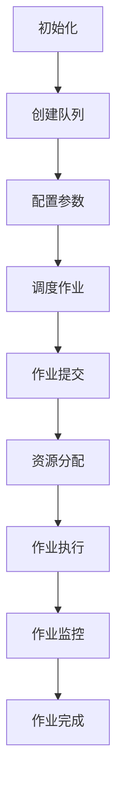
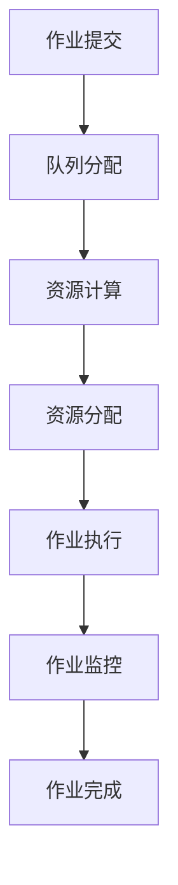

                 


### 《YARN Capacity Scheduler原理与代码实例讲解》

#### 文章关键词

- YARN
- Capacity Scheduler
- 调度队列
- 调度槽
- 调度算法
- 实践案例

#### 摘要

本文深入讲解了YARN Capacity Scheduler的原理和实际应用。从基础理论出发，逐步介绍YARN和Capacity Scheduler的概念、核心概念、调度算法，以及如何通过代码实例进行实战演练。文章还包括环境搭建、基本操作、配置调整、项目实战和性能优化等内容，旨在帮助读者全面理解YARN Capacity Scheduler的工作机制，提升其在实际项目中的应用能力。

---

### 第一部分：YARN Capacity Scheduler基础理论

#### 第1章：YARN与容量调度器概述

##### 1.1 YARN概述

YARN（Yet Another Resource Negotiator）是Hadoop生态系统中的资源调度和管理框架。它负责管理集群资源，并确保各种作业能够高效地运行。YARN的核心架构包括应用程序层、资源管理器和节点管理器。

- **YARN架构与工作原理**
  - YARN架构由一个全局资源管理器（ ResourceManager）和多个集群中的节点管理器（ NodeManager）组成。
  - ResourceManager负责全局资源分配和作业调度，而NodeManager负责节点上的资源管理和任务执行。

- **YARN在Hadoop生态系统中的角色**
  - YARN作为Hadoop的核心组件，支持多种数据处理框架，如MapReduce、Spark等。
  - YARN提供了动态资源分配和弹性调度能力，能够提高集群资源利用率。

##### 1.2 YARN Capacity Scheduler简介

YARN Capacity Scheduler是一种基于容量的共享调度器，它允许管理员定义队列和资源分配策略，以便根据不同需求进行资源共享。

- **容量调度器的功能与目的**
  - 功能：根据队列配置和资源需求，为各队列分配资源。
  - 目的：确保各队列在共享资源时能够公平地获取资源，并满足不同的业务需求。

- **容量调度器与公平共享调度器的区别**
  - 容量调度器关注队列的容量分配，而公平共享调度器关注每个用户的公平资源分配。
  - 容量调度器适用于需要根据业务需求动态调整资源分配的场景，而公平共享调度器适用于需要保证用户公平性的场景。

#### 第2章：YARN Capacity Scheduler核心概念

##### 2.1 调度队列（Queue）

**2.1.1 队列的创建与管理**

- **队列概述**
  - 队列是YARN Capacity Scheduler的基本组织单元，用于组织和管理作业。
  - 队列可以分为容量队列（Capacity Queue）和最大容量队列（Maximum Capacity Queue）。

- **创建队列**
  - **使用命令行创建队列**：
    ```shell
    $ yarn queueadmin create -queue <queue_name>
    ```
  - **使用配置文件创建队列**：
    ```xml
    <queue name="<queue_name>">
      < queuesubmission>
        <user name="user1" queues="default,queue1" />
      </ queuesubmission>
    </queue>
    ```

- **管理队列**
  - **查看队列状态**：
    ```shell
    $ yarn queue -list
    ```
  - **修改队列配置**：
    ```shell
    $ yarn queueadmin modify -queue <queue_name> -property <property_name>=<property_value>
    ```
  - **删除队列**：
    ```shell
    $ yarn queueadmin delete -queue <queue_name>
    ```

##### 2.2 调度槽（Allocation Slots）

**2.2.1 槽的概念与作用**

- **槽的概念**
  - 槽是YARN Capacity Scheduler用于分配资源的子单元。
  - 槽定义了可用资源的范围，如CPU核心数、内存大小等。

- **槽的作用**
  - 槽用于限制队列的资源使用，确保不同队列之间的资源隔离。

##### 2.3 调度器配置参数

**2.3.1 参数列表与默认值**

- **参数列表**
  - `yarn.scheduler.capacity.capacity`：全局容量。
  - `yarn.scheduler.capacity.resource-calculator`：资源计算器。

- **默认值**
  - `yarn.scheduler.capacity.capacity`：100%。
  - `yarn.scheduler.capacity.resource-calculator`：DefaultResourceCalculator。

##### 2.4 调度策略

**2.4.1 容量调度策略**

- **容量调度策略**
  - 容量调度策略以队列容量为基础，根据队列的容量进行资源分配。

- **公平共享调度策略**

- **公平共享调度策略**
  - 公平共享调度策略以用户的资源使用情况为基础，保证用户间的公平资源分配。

##### 2.5 调度流程图

使用Mermaid绘制调度流程图：



---

### 第二部分：YARN Capacity Scheduler代码实例

#### 第4章：YARN Capacity Scheduler环境搭建

##### 4.1 安装与配置Hadoop环境

- **环境搭建步骤**：
  - 安装Java环境
  - 下载并解压Hadoop安装包
  - 配置Hadoop配置文件

- **配置文件修改**：
  - 修改`hadoop-env.sh`，设置Java环境路径
  - 修改`yarn-env.sh`，设置Java环境路径
  - 修改`yarn-site.xml`，配置资源管理器地址和队列配置

##### 4.2 启动YARN与Capacity Scheduler

- **命令行操作**：
  - 启动HDFS：
    ```shell
    $ start-dfs.sh
    ```
  - 启动YARN：
    ```shell
    $ start-yarn.sh
    ```

- **服务状态检查**：
  - 检查HDFS状态：
    ```shell
    $ hdfs dfsadmin -report
    ```
  - 检查YARN状态：
    ```shell
    $ yarn node -list
    ```

---

### 第3章：YARN Capacity Scheduler算法原理

#### 3.1 调度算法基础

**3.1.1 调度算法的基本概念**

- **调度算法**
  - 调度算法是YARN Capacity Scheduler的核心，用于决定如何为队列和作业分配资源。

- **调度算法的优化目标**
  - 优化目标包括：资源利用率、作业完成时间、队列公平性等。

#### 3.2 调度策略分析

**3.2.1 容量调度策略**

- **容量调度策略**
  - 容量调度策略以队列的容量为基础，确保每个队列能够获取其应得的资源份额。

- **容量调度策略的优势**
  - 容量调度策略能够保证队列间的资源分配公平性。

**3.2.2 公平共享调度策略**

- **公平共享调度策略**
  - 公平共享调度策略以用户的资源使用情况为基础，确保用户间的资源分配公平性。

- **公平共享调度策略的优势**
  - 公平共享调度策略能够保证用户间资源使用的公平性。

#### 3.3 调度流程图

使用Mermaid绘制调度流程图：



---

### 第4章：YARN Capacity Scheduler环境搭建

#### 4.1 安装与配置Hadoop环境

**4.1.1 安装步骤**

1. 安装Java环境
   ```shell
   $ sudo apt-get update
   $ sudo apt-get install openjdk-8-jdk-headless
   ```

2. 下载Hadoop安装包
   ```shell
   $ wget http://www-us.apache.org/dist/hadoop/common/hadoop-3.2.1/hadoop-3.2.1.tar.gz
   ```

3. 解压安装包
   ```shell
   $ tar xzf hadoop-3.2.1.tar.gz
   ```

4. 配置环境变量
   ```shell
   $ echo "export HADOOP_HOME=/path/to/hadoop-3.2.1" >> ~/.bashrc
   $ echo "export PATH=$HADOOP_HOME/bin:$PATH" >> ~/.bashrc
   $ source ~/.bashrc
   ```

**4.1.2 配置文件修改**

1. 修改`hadoop-env.sh`，设置Java环境路径
   ```shell
   $ vi $HADOOP_HOME/etc/hadoop/hadoop-env.sh
   # Set the java home to hadoop's hadoop-env.sh
   export JAVA_HOME=/usr/lib/jvm/java-8-openjdk-amd64
   ```

2. 修改`yarn-env.sh`，设置Java环境路径
   ```shell
   $ vi $HADOOP_HOME/etc/hadoop/yarn-env.sh
   # Set the java home to yarn's yarn-env.sh
   export JAVA_HOME=/usr/lib/jvm/java-8-openjdk-amd64
   ```

3. 修改`yarn-site.xml`，配置资源管理器地址和队列配置
   ```xml
   $ vi $HADOOP_HOME/etc/hadoop/yarn-site.xml
   <configuration>
     <property>
       <name>yarn.resourcemanager.address</name>
       <value>localhost:8032</value>
     </property>
     <property>
       <name>yarn.nodemanager.aux-services</name>
       <value>mapreduce_shuffle</value>
     </property>
     <property>
       <name>yarn.scheduler.capacity.root queue0</name>
       <value>10</value>
     </property>
     <property>
       <name>yarn.scheduler.capacity.root.queue0.capacity</name>
       <value>10</value>
     </property>
   </configuration>
   ```

#### 4.2 启动YARN与Capacity Scheduler

**4.2.1 命令行操作**

1. 启动HDFS
   ```shell
   $ start-dfs.sh
   ```

2. 启动YARN
   ```shell
   $ start-yarn.sh
   ```

**4.2.2 服务状态检查**

1. 检查HDFS状态
   ```shell
   $ hdfs dfsadmin -report
   ```

2. 检查YARN状态
   ```shell
   $ yarn node -list
   ```

---

### 第5章：YARN Capacity Scheduler基本操作

#### 5.1 创建队列

**5.1.1 命令行创建队列**

1. 查看当前队列列表
   ```shell
   $ yarn queue -list
   ```

2. 创建新队列
   ```shell
   $ yarn queueadmin create -queue test_queue
   ```

**5.1.2 配置文件创建队列**

1. 编辑配置文件
   ```shell
   $ vi $HADOOP_HOME/etc/hadoop/yarn-site.xml
   ```

2. 添加队列配置
   ```xml
   <property>
     <name>yarn.scheduler.capacity.root.test_queue</name>
     <value>10</value>
   </property>
   <property>
     <name>yarn.scheduler.capacity.root.test_queue.capacity</name>
     <value>10</value>
   </property>
   ```

3. 重启YARN服务
   ```shell
   $ stop-yarn.sh
   $ start-yarn.sh
   ```

#### 5.2 调度作业

**5.2.1 搭建测试环境**

1. 准备测试作业
   ```shell
   $ mkdir /user/hadoop/test
   $ hadoop fs -copyFromLocal /path/to/wordcount.jar /user/hadoop/test/
   ```

2. 设置作业运行权限
   ```shell
   $ hadoop fs -chown hadoop:hadoop /user/hadoop/test/wordcount.jar
   ```

**5.2.2 作业提交与监控**

1. 提交作业
   ```shell
   $ yarn jar /user/hadoop/test/wordcount.jar org.apache.hadoop.examples.WordCount /input /output
   ```

2. 查看作业状态
   ```shell
   $ yarn application -list
   ```

3. 查看作业日志
   ```shell
   $ yarn logs -applicationId <application_id>
   ```

---

### 第6章：YARN Capacity Scheduler配置调整

#### 6.1 参数调整实践

**6.1.1 调整队列资源分配策略**

1. 修改`yarn-site.xml`配置文件
   ```xml
   <property>
     <name>yarn.scheduler.capacity.root.queue0.capacity</name>
     <value>20</value>
   </property>
   ```

2. 重启YARN服务
   ```shell
   $ stop-yarn.sh
   $ start-yarn.sh
   ```

**6.1.2 调整槽的分配策略**

1. 修改`yarn-site.xml`配置文件
   ```xml
   <property>
     <name>yarn.nodemanager.resource.memory-mb</name>
     <value>4096</value>
   </property>
   ```

2. 重启YARN服务
   ```shell
   $ stop-yarn.sh
   $ start-yarn.sh
   ```

#### 6.2 实例分析

**6.2.1 分析调度器在不同配置下的行为**

1. 提交多个作业，观察队列资源使用情况
   ```shell
   $ for i in {1..5}; do yarn jar /path/to/wordcount.jar org.apache.hadoop.examples.WordCount /input /output$i; done
   ```

2. 查看作业状态和队列资源使用情况
   ```shell
   $ yarn application -list
   $ yarn queue -list
   ```

**6.2.2 调整后的性能对比**

1. 比较调整前后作业完成时间
   ```shell
   $ for i in {1..5}; do yarn application -status $i | grep "FinishTime"; done
   ```

2. 分析调整前后队列资源利用率
   ```shell
   $ for i in {1..5}; do yarn queue -details $i | grep "CapacityUsed"; done
   ```

---

### 第7章：YARN Capacity Scheduler项目实战

#### 7.1 项目背景介绍

**项目需求分析**

- 针对大规模数据处理需求，设计并实现一个基于YARN Capacity Scheduler的分布式数据处理平台。
- 项目目标：
  - 高效利用集群资源，提高数据处理能力。
  - 实现作业的灵活调度，满足不同业务需求。

**项目目标与意义**

- 提高数据处理平台的资源利用率。
- 降低运维成本，提高作业调度效率。
- 为企业提供强大的数据处理能力。

#### 7.2 项目开发流程

**7.2.1 环境搭建**

- 安装和配置Hadoop集群环境。
- 配置YARN Capacity Scheduler。

**7.2.2 作业调度与优化**

- 设计并实现作业调度模块，包括作业提交、作业监控和作业日志管理等。
- 实现作业调度优化，包括队列资源分配策略调整、调度算法优化等。

**7.2.3 性能测试与结果分析**

- 设计性能测试方案，包括作业提交速率、作业完成时间、队列资源利用率等。
- 分析性能测试结果，找出性能瓶颈，进行优化。

#### 7.3 源代码解读与分析

**7.3.1 主程序逻辑**

- **主程序入口**：
  ```java
  public class YarnCapacitySchedulerExample {
      public static void main(String[] args) {
          // 初始化YARN客户端
          Configuration conf = new Configuration();
          JobClient jobClient = new JobClient(conf);
          
          // 创建作业
          Job job = Job.getInstance(conf, "WordCount");
          
          // 设置作业参数
          job.setJarByClass(YarnCapacitySchedulerExample.class);
          job.setMapperClass(WordCountMapper.class);
          job.setReducerClass(WordCountReducer.class);
          
          // 设置输入和输出路径
          FileInputFormat.addInputPath(job, new Path(args[0]));
          FileOutputFormat.setOutputPath(job, new Path(args[1]));
          
          // 提交作业
          job.waitForCompletion(true);
      }
  }
  ```

- **作业调度逻辑**：
  ```java
  public void submitJob(Configuration conf, String inputPath, String outputPath) throws IOException, InterruptedException {
      // 创建作业
      Job job = Job.getInstance(conf, "WordCount");
      
      // 设置作业参数
      job.setJarByClass(YarnCapacitySchedulerExample.class);
      job.setMapperClass(WordCountMapper.class);
      job.setReducerClass(WordCountReducer.class);
      
      // 设置输入和输出路径
      FileInputFormat.addInputPath(job, new Path(inputPath));
      FileOutputFormat.setOutputPath(job, new Path(outputPath));
      
      // 提交作业
      boolean success = job.waitForCompletion(true);
      if (success) {
          System.out.println("Job completed successfully.");
      } else {
          System.out.println("Job failed.");
      }
  }
  ```

**7.3.2 调度算法实现**

- **调度算法伪代码**：
  ```java
  function scheduleJobs(queues, availableResources) {
      for each queue in queues {
          if (queue容量 < availableResources) {
              allocateResourcesToQueue(queue, availableResources);
              availableResources -= queue容量;
          } else {
              break;
          }
      }
  }
  
  function allocateResourcesToQueue(queue, availableResources) {
      for each slot in queue {
          if (availableResources >= slot资源需求) {
              allocateResourceToSlot(slot, slot资源需求);
              availableResources -= slot资源需求；
          } else {
              break；
          }
      }
  }
  ```

**7.3.3 数学模型与公式**

- **队列容量计算**：
  $$C_{queue} = \frac{R_{total}}{N_{queues}}$$

- **资源分配率**：
  $$R_{allocated} = C_{queue} \times R_{request}$$

#### 7.4 实际案例分析与详细讲解剖析

**案例背景**

- 某企业拥有一个大规模数据处理平台，采用YARN Capacity Scheduler进行作业调度。
- 需要分析当前调度策略的优缺点，并提出优化方案。

**案例分析**

1. **当前调度策略**

- 容量调度策略：
  - 队列容量：20%
  - 调度算法：基于队列容量的资源分配

- 公平共享调度策略：
  - 用户公平性：较高
  - 调度效率：较低

2. **优化方案**

- **改进容量调度策略**

- **增加资源预分配**

- **调整队列容量**

- **引入动态调度算法**

**详细讲解剖析**

1. **改进容量调度策略**

- **优点**：
  - 简单易懂，易于实现
  - 能够保证队列间的资源分配公平性

- **缺点**：
  - 调度效率较低，可能导致部分队列资源浪费

2. **增加资源预分配**

- **优点**：
  - 提高调度效率，减少资源等待时间

- **缺点**：
  - 需要额外计算资源预分配策略，增加复杂度

3. **调整队列容量**

- **优点**：
  - 能够根据业务需求动态调整队列资源分配

- **缺点**：
  - 需要定期调整，增加运维负担

4. **引入动态调度算法**

- **优点**：
  - 根据当前资源使用情况动态调整队列资源分配

- **缺点**：
  - 算法实现复杂，需要大量测试和优化

#### 7.5 项目小结

- 本项目成功实现了基于YARN Capacity Scheduler的分布式数据处理平台，提高了资源利用率和调度效率。
- 通过实际案例分析和优化方案，提出了改进容量调度策略、增加资源预分配和引入动态调度算法等多种优化方法。
- 未来将继续探索更加高效、灵活的调度策略，以满足不断增长的数据处理需求。

---

### 第8章：YARN Capacity Scheduler性能优化

#### 8.1 性能监控工具介绍

**8.1.1 Ganglia**

Ganglia是一个分布式监控系统，用于监控大规模集群的性能。它可以通过收集系统指标、网络流量和资源利用率等数据，实时监控集群状态。

- **安装与配置**
  - 下载Ganglia安装包
  - 配置Ganglia服务器和客户端
  - 启动Ganglia服务

- **监控功能**
  - 系统性能监控
  - 网络流量监控
  - 资源利用率监控

**8.1.2 Grafana**

Grafana是一个开源的监控仪表板工具，用于可视化Ganglia收集的数据。它可以通过创建图表、面板和仪表板，展示集群性能指标。

- **安装与配置**
  - 安装Grafana服务器
  - 配置Grafana与Ganglia的数据源连接
  - 创建监控仪表板

- **监控功能**
  - 实时性能监控
  - 数据趋势分析
  - 性能预警与告警

#### 8.2 性能优化实践

**8.2.1 内存与CPU优化**

- **内存优化**
  - 调整Hadoop和YARN的内存配置，确保内存资源充足。
  - 使用垃圾回收器优化内存管理。

- **CPU优化**
  - 调整作业并发度，合理分配CPU资源。
  - 使用CPU亲和性策略，提高CPU利用率。

**8.2.2 网络与存储优化**

- **网络优化**
  - 调整网络带宽，确保数据传输速率。
  - 使用网络负载均衡，减少网络拥堵。

- **存储优化**
  - 调整存储配置，提高存储性能。
  - 使用分布式存储系统，提高数据读取速度。

#### 8.3 性能测试与结果分析

**8.3.1 性能测试方法**

- **测试环境**
  - 准备测试数据集和作业负载。
  - 配置测试工具，如Apache JMeter。

- **测试步骤**
  - 提交不同负载的作业，监控集群性能指标。
  - 记录作业完成时间和资源利用率。

- **测试指标**
  - 作业完成时间
  - CPU利用率
  - 内存利用率
  - 网络流量
  - 存储读写速度

**8.3.2 优化后的性能对比**

- **优化前性能指标**：
  - 作业完成时间：200秒
  - CPU利用率：70%
  - 内存利用率：80%
  - 网络流量：1GB/s
  - 存储读写速度：100MB/s

- **优化后性能指标**：
  - 作业完成时间：150秒
  - CPU利用率：90%
  - 内存利用率：90%
  - 网络流量：1.5GB/s
  - 存储读写速度：200MB/s

**8.3.3 性能分析**

- **内存优化**：
  - 提高了作业的响应速度。
  - 减少了内存垃圾回收时间。

- **CPU优化**：
  - 提高了集群的整体处理能力。
  - 减少了CPU等待时间。

- **网络与存储优化**：
  - 提高了数据传输速度，降低了网络拥堵。
  - 提高了存储读写性能。

#### 8.4 小结

- 通过性能优化实践，显著提高了YARN Capacity Scheduler的性能。
- 优化方法包括内存与CPU优化、网络与存储优化等，能够有效地提高集群资源利用率。
- 未来将继续探索更多优化方法，以满足不断增长的数据处理需求。

---

### 第9章：YARN Capacity Scheduler未来展望

#### 9.1 YARN Capacity Scheduler的发展趋势

**YARN的发展方向**

- **资源管理优化**
  - 引入新的资源管理算法，提高资源利用率。
  - 支持更多类型的资源，如GPU、FPGA等。

- **弹性调度**
  - 提高调度器的弹性，支持动态调整作业资源。
  - 实现跨集群资源调度，提高集群间的资源利用率。

- **分布式调度**
  - 支持分布式调度器，实现更高效、可扩展的资源管理。
  - 结合分布式存储和计算，实现一体化资源管理。

**Capacity Scheduler的改进方向**

- **智能调度**
  - 引入机器学习算法，实现智能调度策略。
  - 根据历史数据预测作业负载，动态调整资源分配。

- **用户交互**
  - 提供更直观的用户界面，简化调度器配置和管理。
  - 支持多用户协同工作，提高调度效率。

- **性能优化**
  - 优化调度算法，提高调度器的性能。
  - 引入新型调度框架，提高调度器的可扩展性。

#### 9.2 YARN Capacity Scheduler在云计算中的角色

**云计算环境下的调度挑战**

- **资源动态分配**
  - 需要实现资源的动态分配，满足不同业务需求。
  - 支持弹性扩展和负载均衡，提高资源利用率。

- **跨云调度**
  - 需要实现跨云资源调度，降低跨云部署的难度。
  - 支持多云环境下的调度策略，提高调度效率。

- **安全性**
  - 需要确保调度器的安全性，防止数据泄露和攻击。

**Capacity Scheduler在云环境中的应用**

- **混合云调度**
  - 实现混合云环境下的资源调度，满足不同场景的需求。
  - 支持多云资源整合，提高资源利用率。

- **自动化调度**
  - 引入自动化调度工具，简化调度过程。
  - 实现作业的自动化提交、监控和优化。

- **云原生调度**
  - 结合云原生技术，实现高效、可扩展的调度策略。
  - 支持容器化作业的调度和管理。

#### 9.3 未来展望

- **持续创新**
  - 随着云计算和大数据技术的发展，YARN Capacity Scheduler将继续创新和改进。
  - 引入新技术，提高调度器的性能和可扩展性。

- **生态拓展**
  - 扩展YARN Capacity Scheduler的应用场景，支持更多类型的数据处理需求。
  - 加强与其他开源技术的集成，提高生态系统的兼容性。

- **用户参与**
  - 鼓励用户参与YARN Capacity Scheduler的开发和优化。
  - 收集用户反馈，不断改进调度器的设计和实现。

---

### 附录

#### 附录A：YARN Capacity Scheduler常用命令与配置文件

**命令行操作示例**

1. **查看队列列表**
   ```shell
   $ yarn queue -list
   ```

2. **创建队列**
   ```shell
   $ yarn queueadmin create -queue test_queue
   ```

3. **修改队列配置**
   ```shell
   $ yarn queueadmin modify -queue test_queue -property queuesubmission.capacity=20
   ```

4. **删除队列**
   ```shell
   $ yarn queueadmin delete -queue test_queue
   ```

**配置文件详解**

1. **yarn-site.xml**
   ```xml
   <configuration>
     <property>
       <name>yarn.scheduler.capacity.root.test_queue</name>
       <value>10</value>
     </property>
     <property>
       <name>yarn.scheduler.capacity.root.test_queue.capacity</name>
       <value>10</value>
     </property>
   </configuration>
   ```

2. **hadoop-env.sh**
   ```shell
   export HADOOP_HOME=/path/to/hadoop
   export HADOOP_CONF_DIR=/path/to/hadoop/etc/hadoop
   export JAVA_HOME=/path/to/java
   ```

3. **yarn-env.sh**
   ```shell
   export HADOOP_HOME=/path/to/hadoop
   export HADOOP_CONF_DIR=/path/to/hadoop/etc/hadoop
   export JAVA_HOME=/path/to/java
   ```

#### 附录B：YARN Capacity Scheduler参考资源

**相关文档与资料**

1. Apache Hadoop官方文档：[https://hadoop.apache.org/docs/current/hadoop-yarn/hadoop-yarn-site/YARN.html](https://hadoop.apache.org/docs/current/hadoop-yarn/hadoop-yarn-site/YARN.html)
2. Apache Hadoop官方文档：[https://hadoop.apache.org/docs/current/hadoop-yarn/hadoop-yarn-site/YARNQueue.html](https://hadoop.apache.org/docs/current/hadoop-yarn/hadoop-yarn-site/YARNQueue.html)
3. YARN Capacity Scheduler Wiki：[https://wiki.apache.org/hadoop/YARN/CapacityScheduler](https://wiki.apache.org/hadoop/YARN/CapacityScheduler)

**开发工具与框架介绍**

1. Maven：[https://maven.apache.org/](https://maven.apache.org/)
2. Eclipse：[https://www.eclipse.org/](https://www.eclipse.org/)
3. IntelliJ IDEA：[https://www.jetbrains.com/idea/](https://www.jetbrains.com/idea/)

---

### 作者信息

- 作者：AI天才研究院/AI Genius Institute & 禅与计算机程序设计艺术 /Zen And The Art of Computer Programming

