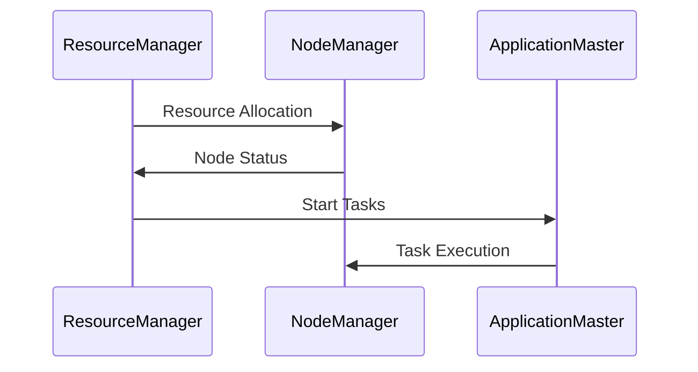
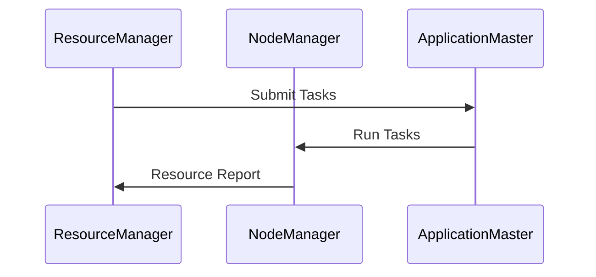
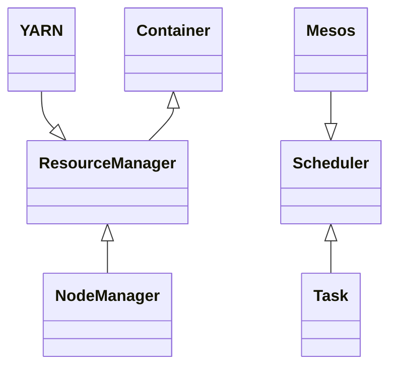

                 


### 文章标题
《YARN Resource Manager原理与代码实例讲解》

### 关键词
YARN, Resource Manager, ResourceManager, NodeManager, ApplicationMaster,调度原理,资源管理,容错机制

### 摘要
本文详细解析了YARN（Hadoop Yet Another Resource Negotiator）中的核心组件——Resource Manager的工作原理。文章首先介绍了YARN Resource Manager的基本概念、角色与职责，随后深入探讨了其调度原理、资源管理机制和容错策略。通过代码实例，本文帮助读者理解Resource Manager在实际应用中的运作方式和实现细节，为分布式系统的开发和管理提供了实用指导。

---

#### 第一部分：YARN Resource Manager基础

##### 第1章：YARN Resource Manager概述

**1.1 YARN Resource Manager的核心概念**

YARN（Hadoop Yet Another Resource Negotiator）是Hadoop生态系统中的一个核心组件，负责资源的调度和管理。YARN Resource Manager是其核心部分，主要负责协调集群中资源的使用。

- **概念介绍**：
  - **Resource Manager**：负责整体资源的分配和管理，它将集群资源以任务的形式分配给各个应用。
  - **ApplicationMaster**：每个应用都有自己的ApplicationMaster，它负责协调和管理应用内部的各个任务。
  - **Node Manager**：在集群中的每个节点上运行，负责监控和管理节点上的资源使用情况。

**1.2 YARN Resource Manager的角色和职责**

YARN Resource Manager的主要职责包括：

- **资源分配**：根据应用的需求和集群的可用资源，动态分配资源给各个应用。
- **任务调度**：将资源分配给ApplicationMaster，使其能够启动和运行任务。
- **监控和恢复**：监控应用的运行状态，并在应用失败时进行恢复。

**1.3 YARN Resource Manager与YARN的其他组件关系**

在YARN架构中，Resource Manager与其他组件的关系如下：

- **与ApplicationMaster**：Resource Manager负责为ApplicationMaster分配资源，并通过ApplicationMaster监控应用的运行状态。
- **与Node Manager**：Node Manager向Resource Manager报告节点的资源使用情况，Resource Manager根据这些信息进行资源调度。

**图1.1 YARN Resource Manager与其他组件的关系**



---

##### 第2章：YARN架构基础

**2.1 YARN的基本架构**

YARN采用了分布式架构，主要由以下几部分组成：

- ** ResourceManager**：资源管理器，负责整个集群的资源管理和调度。
- ** NodeManager**：每个节点上的资源管理器，负责监控和管理节点上的资源。
- ** ApplicationMaster**：每个应用的协调者，负责管理应用内的任务调度。
- ** Container**：资源分配的基本单位，包含一定量的CPU、内存等资源。

**2.2 YARN的分层结构**

YARN的架构分为两层：

- **资源管理层**：由Resource Manager和Node Manager组成，负责资源的管理和调度。
- **应用管理层**：由ApplicationMaster和Container组成，负责应用的任务管理和协调。

**2.3 YARN的调度策略**

YARN支持多种调度策略：

- **Fairscheduler**：公平调度器，保证每个应用都能得到公平的资源分配。
- **Capacityscheduler**：容量调度器，根据集群的可用资源动态分配资源。

**图2.1 YARN架构分层**

```mermaid
tree
  YARN
  ├── Resource Management
  │   ├── ResourceManager
  │   └── NodeManager
  └── Application Management
      ├── ApplicationMaster
      └── Container
```

---

##### 第3章：YARN Resource Manager核心组件

**3.1 ResourceManager组件详解**

Resource Manager是YARN架构中的核心组件，负责整个集群的资源管理和调度。其核心功能包括：

- **资源分配**：根据应用的需求和集群的可用资源，动态分配资源。
- **任务调度**：将资源分配给ApplicationMaster，使其能够启动和运行任务。
- **监控和恢复**：监控应用的运行状态，并在应用失败时进行恢复。

**伪代码示例：ResourceManager资源分配**

```python
def allocate_resources(applications):
    for app in applications:
        if has_enough_resources(app):
            alloc_resource(app)
        else:
            queue_app(app)
```

**3.2 NodeManager组件详解**

Node Manager是运行在集群每个节点上的组件，负责监控和管理节点上的资源。其主要功能包括：

- **资源监控**：监控节点的CPU、内存、磁盘等资源使用情况。
- **任务执行**：接收Resource Manager的任务分配，并在节点上执行任务。
- **资源报告**：定期向Resource Manager报告节点的资源使用情况。

**伪代码示例：NodeManager资源报告**

```python
def report_resources():
    resources = get_available_resources()
    send_report_to_RM(resources)
```

**3.3 ApplicationMaster组件详解**

ApplicationMaster是每个应用的协调者，负责管理应用内的任务调度。其主要功能包括：

- **任务提交**：向Resource Manager提交应用的任务。
- **任务调度**：根据应用的资源需求，调度任务到合适的节点上执行。
- **任务监控**：监控任务的执行状态，并在任务失败时进行重试。

**伪代码示例：ApplicationMaster任务调度**

```python
def schedule_tasks(tasks):
    for task in tasks:
        if can_run_task(task):
            run_task(task)
        else:
            queue_task(task)
```

**图3.1 YARN Resource Manager核心组件关系**



---

#### 第二部分：YARN Resource Manager原理

##### 第4章：YARN Resource Manager调度原理

**4.1 调度算法基础**

调度算法是YARN Resource Manager的核心组成部分，其目标是在给定资源约束下，尽可能地满足所有应用的资源需求。YARN Resource Manager支持多种调度器，包括Fairscheduler和Capacityscheduler。

**Fairscheduler调度器**

Fairscheduler是基于公平共享的调度策略，将集群资源均匀地分配给不同的应用。每个应用都被分配一个份额，份额大小与该应用的优先级和资源需求有关。

**伪代码示例：Fairscheduler资源分配**

```python
def fair_scheduler(applications):
    for app in applications:
        if app优先级 > 0:
            allocate_fair_share(app)
```

**Capacityscheduler调度器**

Capacityscheduler是基于容量管理的调度策略，根据集群的可用资源情况，动态地分配资源给应用。它保证每个应用都有足够的资源来运行，同时避免资源浪费。

**伪代码示例：Capacityscheduler资源分配**

```python
def capacity_scheduler(available_resources, applications):
    for app in applications:
        allocate_required_resources(app, available_resources)
```

**4.2 Fairscheduler调度器**

Fairscheduler调度器是一种公平调度器，它将集群资源按照一定的比例分配给不同的队列和应用。每个队列和应用都会得到一个固定的份额，这个份额是根据集群的总资源量和队列或应用的优先级来计算的。

**伪代码示例：Fairscheduler调度流程**

```python
def fair_scheduler(resources, queues, applications):
    for app in applications:
        queue = get_queue(app)
        allocate.resources(app, queue份额 * 总资源量 / 队列总数)
```

**4.3 Capacityscheduler调度器**

Capacityscheduler调度器是一种基于容量管理的调度器，它根据集群的可用资源情况，动态地分配资源给应用。它不会固定分配资源份额，而是根据实际需要来分配资源。

**伪代码示例：Capacityscheduler调度流程**

```python
def capacity_scheduler(resources, applications):
    for app in applications:
        if resources >= app需求：
            allocate.resources(app, app需求)
        else：
            queue_app(app)
```

**4.4 YARN调度器与Mesos对比**

YARN和Mesos都是分布式计算框架，它们都提供了资源调度功能。但是，它们的调度策略和设计理念有所不同。

- **调度策略**：YARN的调度器是静态的，即集群资源在运行前就分配好了。而Mesos的调度器是动态的，即资源在运行时根据实际需求动态分配。
- **调度粒度**：YARN的调度器是基于Container的，即最小的调度单位是Container。而Mesos的调度器是基于Task的，即最小的调度单位是Task。
- **适用场景**：YARN适用于大规模的数据处理和批处理任务，而Mesos适用于实时计算和流处理任务。

**图4.1 YARN调度器与Mesos调度器对比**



---

##### 第5章：YARN Resource Manager资源管理原理

**5.1 资源分配模型**

YARN Resource Manager的资源分配模型是基于Container的。Container是资源分配的基本单位，它包括CPU、内存等资源。应用通过ApplicationMaster向Resource Manager申请Container，Resource Manager根据集群的可用资源情况，动态地为应用分配Container。

**伪代码示例：资源分配模型**

```python
def allocate_resources(app, resources):
    if resources >= available_resources:
        allocate_container(app, resources)
    else:
        raise ResourceException("Not enough resources available")
```

**5.2 内存管理**

YARN Resource Manager对内存的管理包括以下几个方面：

- **内存隔离**：每个Container都有独立的内存空间，防止一个应用的内存占用影响其他应用。
- **内存监控**：Node Manager定期向Resource Manager报告节点的内存使用情况，Resource Manager根据这些信息进行资源调度。
- **内存调整**：如果某个应用的内存使用过高，Resource Manager可以调整其内存分配，以避免系统崩溃。

**伪代码示例：内存管理**

```python
def monitor_memory_usage(node, containers):
    for container in containers:
        if container内存使用率 > 高阈值：
            adjust_memory_allocation(container)
```

**5.3 存储管理**

YARN Resource Manager对存储的管理包括以下几个方面：

- **存储分配**：Resource Manager根据应用的需求，动态地为应用分配存储资源。
- **存储监控**：Node Manager定期向Resource Manager报告节点的存储使用情况，Resource Manager根据这些信息进行资源调度。
- **存储备份**：为了防止数据丢失，YARN支持数据备份功能，将应用的数据备份到不同的存储设备上。

**伪代码示例：存储管理**

```python
def allocate_storage(app, storage_size):
    if storage_size <= available_storage:
        allocate_storage_to_app(app, storage_size)
    else:
        raise StorageException("Not enough storage available")
```

**5.4 网络资源管理**

YARN Resource Manager对网络资源的管理包括以下几个方面：

- **网络分配**：Resource Manager根据应用的需求，动态地为应用分配网络资源。
- **网络监控**：Node Manager定期向Resource Manager报告节点的网络使用情况，Resource Manager根据这些信息进行资源调度。
- **网络优化**：为了提高网络性能，YARN支持网络优化功能，如网络流量控制、网络负载均衡等。

**伪代码示例：网络资源管理**

```python
def allocate_network_resources(app, network_bandwidth):
    if network_bandwidth <= available_network_bandwidth:
        allocate_network_to_app(app, network_bandwidth)
    else:
        raise NetworkException("Not enough network resources available")
```

---

##### 第6章：YARN Resource Manager容错机制

**6.1 容错机制设计**

YARN Resource Manager的设计考虑了容错性，确保在出现故障时系统能够自动恢复，保证服务的连续性和可靠性。

- **故障检测**：Node Manager和ApplicationMaster会定期向Resource Manager发送心跳信号，如果某个组件长时间没有收到心跳信号，Resource Manager会认为该组件出现故障。
- **故障恢复**：当Resource Manager检测到故障时，会重新启动出现故障的组件，并重新分配其任务。

**伪代码示例：故障检测与恢复**

```python
def check_for_faulty_components(components):
    for component in components:
        if not has_heart_beat(component):
            mark_as_faulty(component)
            recover_component(component)

def recover_component(component):
    if component == NodeManager:
        restart_node_manager(component)
    elif component == ApplicationMaster:
        restart_application_master(component)
```

**6.2 ApplicationMaster的容错**

ApplicationMaster负责管理应用的任务调度和监控，其容错机制主要包括以下几个方面：

- **任务重启**：如果某个任务执行失败，ApplicationMaster会重新启动该任务。
- **任务迁移**：如果ApplicationMaster出现故障，Resource Manager会重新选择一个健康的节点来启动一个新的ApplicationMaster，并将之前任务的执行状态传递给新的ApplicationMaster。

**伪代码示例：ApplicationMaster容错**

```python
def handle_task_failure(task):
    if task失败次数 < 最大失败次数：
        restart_task(task)
    else：
        raise Exception("Task failed too many times")

def recover_application_master(app, faulty_am):
    new_am = select_new_node_for_am(app)
    transfer_state_to_new_am(app, new_am)
    start_new_am(new_am)
```

**6.3 NodeManager的容错**

NodeManager负责监控和管理节点上的资源使用情况，其容错机制主要包括以下几个方面：

- **节点重启**：如果NodeManager出现故障，Resource Manager会重新启动NodeManager。
- **任务迁移**：如果某个节点上的任务执行失败，Resource Manager会重新调度任务到其他健康的节点上。

**伪代码示例：NodeManager容错**

```python
def recover_node_manager(node):
    if node_status == "faulty":
        restart_node_manager(node)

def migrate_tasks_from_faulty_node(faulty_node, healthy_nodes):
    for task in faulty_node.tasks:
        node = select_healthy_node(healthy_nodes)
        start_task_on_new_node(task, node)
```

**6.4 数据恢复与备份策略**

YARN支持数据恢复与备份策略，确保在发生故障时，数据能够得到及时恢复。

- **数据备份**：YARN支持将数据备份到不同的存储设备上，防止数据丢失。
- **数据恢复**：当发生故障时，YARN会从备份的数据中恢复数据，确保系统的正常运行。

**伪代码示例：数据恢复与备份**

```python
def backup_data(data, backup_location):
    copy_data_to_backup_location(data, backup_location)

def recover_data_from_backup(backup_location):
    data = load_data_from_backup_location(backup_location)
    return data
```

---

#### 第三部分：YARN Resource Manager应用实战

##### 第7章：YARN Resource Manager部署与配置

**7.1 YARN集群搭建**

搭建YARN集群需要以下步骤：

1. **环境准备**：安装Java环境、Hadoop环境等。
2. **配置文件**：配置`hadoop-env.sh`、`yarn-env.sh`、`hdfs-site.xml`、`yarn-site.xml`等。
3. **启动服务**：启动HDFS、YARN等服务。

**伪代码示例：YARN集群搭建**

```shell
# 安装Java环境
install_java

# 安装Hadoop环境
install_hadoop

# 配置Hadoop环境变量
export HADOOP_HOME=/path/to/hadoop
export PATH=$PATH:$HADOOP_HOME/bin:$HADOOP_HOME/sbin

# 配置HDFS
start_hdfs

# 配置YARN
start_yarn
```

**7.2 ResourceManager配置详解**

ResourceManager的配置文件为`yarn-site.xml`，主要配置项包括：

- **调度策略**：配置使用的调度器，如Fairscheduler或Capacityscheduler。
- **资源限制**：配置集群的CPU、内存、磁盘等资源限制。
- **日志配置**：配置日志文件的存储路径和日志级别。

**伪代码示例：ResourceManager配置**

```xml
<configuration>
    <property>
        <name>yarn.resourcemanager.scheduler.class</name>
        <value>org.apache.hadoop.yarn.server.resourcemanager.scheduler.fair.FairScheduler</value>
    </property>
    <property>
        <name>yarn.nodemanager.resource.memory-mb</name>
        <value>8192</value>
    </property>
    <property>
        <name>yarn.nodemanager.log.dir</name>
        <value>/var/log/hadoop/yarn</value>
    </property>
</configuration>
```

**7.3 NodeManager配置详解**

NodeManager的配置文件为`yarn-nodemanager.xml`，主要配置项包括：

- **内存限制**：配置节点的内存使用限制。
- **CPU限制**：配置节点的CPU使用限制。
- **日志配置**：配置日志文件的存储路径和日志级别。

**伪代码示例：NodeManager配置**

```xml
<configuration>
    <property>
        <name>yarn.nodemanager.resource.memory-mb</name>
        <value>4096</value>
    </property>
    <property>
        <name>yarn.nodemanager.resource.cores.maximum</name>
        <value>2</value>
    </property>
    <property>
        <name>yarn.nodemanager.log.dir</name>
        <value>/var/log/hadoop/yarn/nm</value>
    </property>
</configuration>
```

**7.4 应用部署与监控**

部署YARN应用需要以下步骤：

1. **打包应用**：将应用打包成jar文件。
2. **提交应用**：使用`yarn application submit`命令提交应用。
3. **监控应用**：使用`yarn application list`和`yarn application detail`命令监控应用的运行状态。

**伪代码示例：应用部署与监控**

```shell
# 打包应用
jar cf myapp.jar myapp

# 提交应用
yarn application submit myapp.jar myapp

# 监控应用
yarn application list
yarn application detail <application_id>
```

---

##### 第8章：YARN Resource Manager性能优化

**8.1 性能监控与调优**

性能监控与调优是YARN运维的重要组成部分。以下是一些常用的监控工具和调优策略：

- **监控工具**：使用Ganglia、Nagios等工具监控集群的性能。
- **调优策略**：根据监控数据，调整资源分配、调度策略和网络配置等。

**伪代码示例：性能监控与调优**

```shell
# 监控CPU使用率
check_cpu_usage

# 调整内存分配
adjust_memory_allocation

# 调整网络配置
configure_network
```

**8.2 资源利用率优化**

资源利用率优化是提高YARN集群性能的关键。以下是一些优化策略：

- **负载均衡**：通过调整调度策略，实现负载均衡。
- **资源预留**：为重要的应用预留一定量的资源，确保其运行稳定。

**伪代码示例：资源利用率优化**

```shell
# 负载均衡
balance_load

# 资源预留
reserve_resources
```

**8.3 调度器优化**

调度器优化是提高YARN性能的重要手段。以下是一些优化策略：

- **Fairscheduler优化**：调整队列份额、优先级等。
- **Capacityscheduler优化**：调整容量配置、动态资源分配等。

**伪代码示例：调度器优化**

```shell
# Fairscheduler优化
adjust_queue_shares

# Capacityscheduler优化
configure_capacity_scheduler
```

**8.4 网络优化**

网络优化是提高YARN性能的重要环节。以下是一些优化策略：

- **网络带宽调整**：根据应用需求，调整网络带宽。
- **网络延迟优化**：通过调整网络设备配置，降低网络延迟。

**伪代码示例：网络优化**

```shell
# 网络带宽调整
adjust_network_bandwidth

# 网络延迟优化
reduce_network_delay
```

---

##### 第9章：YARN Resource Manager最佳实践

**9.1 大型分布式系统设计最佳实践**

设计大型分布式系统时，需要考虑以下最佳实践：

- **高可用性**：确保系统在发生故障时能够快速恢复。
- **可扩展性**：系统应能够支持大量应用和任务。
- **容错性**：系统应具备容错机制，确保数据安全和系统稳定。

**9.2 YARN集群运维最佳实践**

运维YARN集群时，需要考虑以下最佳实践：

- **监控与告警**：实时监控集群性能，及时处理告警。
- **资源调度**：根据应用需求，合理调度资源。
- **系统升级**：定期升级Hadoop和YARN版本，确保系统稳定。

**9.3 YARN性能调优最佳实践**

调优YARN性能时，需要考虑以下最佳实践：

- **调度策略优化**：根据应用特性，选择合适的调度策略。
- **资源分配**：合理分配资源，避免资源浪费。
- **网络优化**：优化网络配置，提高数据传输速度。

**9.4 YARN应用开发最佳实践**

开发YARN应用时，需要考虑以下最佳实践：

- **模块化设计**：将应用分解为模块，便于维护和扩展。
- **资源管理**：合理管理应用资源，避免资源浪费。
- **容错处理**：处理应用执行过程中的异常情况。

---

##### 第10章：YARN Resource Manager未来展望

**10.1 YARN的发展趋势**

YARN在分布式计算领域取得了巨大成功，未来发展趋势包括：

- **性能优化**：继续优化调度算法和资源管理机制，提高系统性能。
- **与Kubernetes的融合**：与Kubernetes等容器编排系统的融合，实现更好的资源利用和管理。

**10.2 YARN与Kubernetes的融合**

YARN与Kubernetes的融合是未来的一个重要方向，其优势包括：

- **灵活的资源管理**：结合YARN和Kubernetes的资源管理能力，实现更灵活的资源分配。
- **统一的编排**：通过Kubernetes，实现YARN应用的统一编排和管理。

**10.3 YARN的未来研究方向**

YARN的未来研究方向包括：

- **智能调度**：引入人工智能技术，实现更智能的调度算法。
- **多租户支持**：增强多租户支持，满足不同类型应用的需求。

---

**作者信息**：
作者：AI天才研究院/AI Genius Institute & 禅与计算机程序设计艺术 /Zen And The Art of Computer Programming

