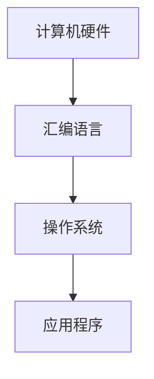

                 

## 文章标题

### 《x86汇编语言编程：底层系统开发技巧》

> 关键词：x86汇编语言、底层系统开发、汇编指令集、编程技巧、多处理器编程、实时系统编程

> 摘要：本文将深入探讨x86汇编语言编程及其在底层系统开发中的应用。从汇编语言的基础知识入手，逐步介绍x86架构与汇编指令集，解析汇编语言编程基础和优化技巧，探讨多处理器编程与实时系统编程的方法和策略。通过具体的实战项目和案例，帮助读者掌握汇编语言编程的核心技能，提升系统底层开发的实践能力。

## 第一部分：汇编语言基础知识

### 第1章：汇编语言概述

在计算机世界中，汇编语言是连接硬件与软件的桥梁，是底层系统开发的基石。本章将简要介绍计算机系统架构，汇编语言的历史与发展，以及汇编语言的优势与适用场景。

### 1.1 计算机系统架构简介

计算机系统主要由CPU、内存、I/O设备等基本组件构成。CPU是计算机的核心，负责执行程序指令，内存用于存储数据和指令，I/O设备负责与外部设备进行数据交换。这些组件共同构成了计算机的硬件系统。而软件则通过操作系统和应用程序来管理与利用硬件资源，完成各种计算和操作。

硬件与软件的关系是相辅相成的。硬件提供了计算机的基本工作环境，而软件则通过指令集和编程语言来操控硬件，实现各种功能。汇编语言就是其中的一种重要的编程语言，它能够直接操作计算机的硬件资源，进行底层系统开发。

### 1.2 汇编语言的历史与发展

汇编语言的起源可以追溯到20世纪50年代，当时计算机系统非常庞大，编程语言相对简单，汇编语言应运而生。早期的汇编语言主要是为了解决编程效率低下的问题，通过使用助记符来代替机器指令，使得程序员能够更直观地编写程序。

随着计算机技术的发展，汇编语言也在不断演变。现代汇编语言不仅支持更多的指令集和功能，还引入了宏指令、分段与内存寻址等机制，使得编程更加灵活和高效。同时，汇编语言的应用领域也在不断扩大，从早期的操作系统、驱动程序，到现代的高性能计算、嵌入式系统等，汇编语言都发挥着重要的作用。

### 1.3 汇编语言的优势与适用场景

汇编语言具有以下几个显著的优势：

1. **硬件优化**：汇编语言能够直接操作硬件资源，进行底层优化，提高程序的性能和效率。
2. **系统底层开发**：汇编语言是操作系统和驱动程序开发的必备技能，能够深入理解系统的工作原理。
3. **高性能计算**：在需要高性能计算的应用场景中，汇编语言可以充分发挥硬件的性能，实现高效的算法。

因此，汇编语言主要适用于以下场景：

1. **操作系统与驱动程序开发**：汇编语言是操作系统和驱动程序的核心组成部分，能够实现底层的硬件操作和管理。
2. **嵌入式系统开发**：在资源受限的嵌入式系统中，汇编语言能够提供更好的性能和效率，满足实时性和可靠性要求。
3. **高性能计算**：在需要高效计算的应用中，如科学计算、图形渲染等，汇编语言能够优化程序性能，提高计算效率。

总之，汇编语言作为一种低级编程语言，虽然在编写和维护上相对复杂，但在特定领域和场景中，它仍然具有重要的地位和价值。

### 第2章：x86架构与汇编指令集

在深入探讨汇编语言编程之前，我们需要了解其背后的硬件基础——x86架构。本章将介绍x86架构的基本概念，包括处理器的历史、基本结构，以及x86汇编指令集的组成和特点。

#### 2.1 x86架构简介

x86架构是英特尔公司最初为8086处理器设计的指令集架构，经过多年的发展，已成为目前最广泛使用的处理器架构之一。x86架构包括多个版本，如8086、80286、80386、Pentium、Pentium Pro、Pentium II、Pentium III、Pentium IV等，每一代处理器都在性能、功能、指令集等方面进行了不同程度的改进。

x86处理器的基本结构主要包括以下几个部分：

1. **寄存器组**：寄存器是处理器内部的高速缓存，用于存储数据、地址、指令等。x86处理器包括通用寄存器、段寄存器、索引寄存器、标志寄存器等。
2. **控制单元**：控制单元是处理器的核心，负责从内存中读取指令，解释指令并控制各部件执行指令。
3. **算术逻辑单元（ALU）**：ALU负责执行算术和逻辑运算，如加法、减法、移位、比较等。
4. **内存管理单元（MMU）**：MMU负责管理内存的分配和保护，实现虚拟内存和分页机制。
5. **输入/输出单元**：输入/输出单元负责处理处理器与外部设备之间的数据交换。

#### 2.2 x86汇编指令集

x86汇编指令集是处理器能够理解和执行的指令集合。x86指令集非常庞大，包括数据传输指令、算术运算指令、位运算指令、控制流指令、字符串操作指令等。以下是这些指令的基本分类和示例：

1. **数据传输指令**：数据传输指令用于在寄存器、内存和立即数之间进行数据传输。常见的指令包括`MOV`、`MOVSB`、`MOVSW`、`MOVSD`等。

   - `MOV AX, 1234h`：将立即数1234h（十六进制）加载到寄存器AX中。
   - `MOVSB`：从源地址读取一个字节到目的地址，并自动更新指针。

2. **算术运算指令**：算术运算指令用于执行各种算术运算，如加法、减法、乘法、除法等。常见的指令包括`ADD`、`SUB`、`MUL`、`DIV`等。

   - `ADD AX, BX`：将寄存器AX和BX的内容相加，结果存储在AX中。
   - `MUL AX`：将寄存器AX的内容与AX自身相乘，结果存储在DX:AX寄存器对中。

3. **位运算指令**：位运算指令用于对寄存器或内存中的位进行操作，如按位与、按位或、按位异或、按位取反等。常见的指令包括`AND`、`OR`、`XOR`、`NOT`等。

   - `AND AX, 0F0Fh`：将寄存器AX的每个位与0F0Fh进行按位与操作，结果存储在AX中。
   - `XOR AX, 0FFFFh`：将寄存器AX的每个位与0FFFFh进行按位异或操作，结果存储在AX中。

4. **控制流指令**：控制流指令用于控制程序的执行流程，如跳转、循环、条件分支等。常见的指令包括`JMP`、`JZ`、`JC`、`LOOP`等。

   - `JMP label`：无条件跳转到指定标签处执行。
   - `JZ label`：如果ZF（零标志）被设置，则跳转到指定标签处执行。
   - `LOOP label`：循环计数器（CX或ECX）减一，如果结果不为零，则跳转到指定标签处执行。

5. **字符串操作指令**：字符串操作指令用于处理字符串数据，如复制字符串、移动字符串、比较字符串等。常见的指令包括`MOVS`、`CMPS`、`SCAS`等。

   - `MOVS BYTE PTR ES:[DI], AL`：将AL寄存器中的字节值移动到ES段中DI指针指向的内存地址。
   - `CMPS BYTE PTR ES:[DI], AL`：比较ES段中DI指针指向的内存地址与AL寄存器中的值。
   - `SCAS BYTE PTR ES:[DI]`：将AL寄存器中的值与ES段中DI指针指向的内存地址进行比较，并自动更新DI指针。

#### 2.3 汇编语言伪指令

汇编语言伪指令（也称为宏指令）是对汇编指令的扩展，用于简化程序编写和提高代码可读性。伪指令不是真正的机器指令，而是在汇编过程中由汇编器进行处理的特殊指令。常见的伪指令包括`DB`（定义字节）、`DW`（定义字）、`DD`（定义双字）、`DS`（定义段）等。

- `DB 0Ah`：定义一个字节常量0Ah（十进制）。
- `DW 0FFFFh`：定义一个字常量0FFFFh（十六进制）。
- `DS 1000h`：定义一个段寄存器值1000h（十六进制）。

通过使用伪指令，我们可以更加简洁地定义数据段和代码段，同时提高程序的代码复用性和可维护性。

综上所述，x86架构和汇编指令集是汇编语言编程的基础，理解这些基本概念和指令集将有助于我们更好地掌握汇编语言编程技巧，为后续章节的深入探讨打下坚实的基础。

### 第3章：汇编语言编程基础

汇编语言编程是一项复杂的任务，涉及到程序的基本结构、数据定义与存储，以及函数调用与参数传递。本章将详细介绍这些基本概念，帮助读者奠定扎实的汇编语言编程基础。

#### 3.1 程序的基本结构

一个汇编语言程序通常由以下几个部分组成：

1. **数据段（.data）**：用于定义和初始化全局变量和常量。
2. **代码段（.text）**：包含程序的指令代码。
3. **堆栈段（.stack）**：用于管理程序的堆栈。
4. **堆（.bss）**：用于存储未初始化的全局变量。

每个部分的功能如下：

- **数据段（.data）**：数据段用于定义和初始化全局变量和常量。例如：

  ```assembly
  .data
  msg db 'Hello, World!', 0
  count dd 10
  ```

  这段代码定义了一个字符串常量`msg`和一个整数变量`count`。

- **代码段（.text）**：代码段包含程序的指令代码，是程序的执行主体。例如：

  ```assembly
  .text
  global _start

  _start:
      mov eax, msg
      call print_string
      mov eax, count
      call print_number
      jmp exit

  print_string:
      ; 打印字符串的实现
      ret

  print_number:
      ; 打印数字的实现
      ret
  ```

  这段代码定义了一个程序入口`_start`，以及两个子函数`print_string`和`print_number`。

- **堆栈段（.stack）**：堆栈段用于管理程序的堆栈，通常用于存储临时数据和函数调用时的参数。例如：

  ```assembly
  .stack 1000h
  ```

  这段代码定义了一个1000h字节的堆栈空间。

- **堆（.bss）**：堆用于存储未初始化的全局变量，通常在程序运行时由操作系统进行初始化。例如：

  ```assembly
  .bss
  buffer resb 64
  ```

  这段代码定义了一个64字节的缓冲区`buffer`，并将其初始化为0。

#### 3.2 数据定义与存储

在汇编语言中，数据定义与存储是程序编写的基础。数据类型包括字节（BYTE）、字（WORD）、双字（DWORD）等。数据存储方式包括全局变量、局部变量和常量。

1. **全局变量**：全局变量是程序在整个生命周期内都可以访问的变量，通常定义在数据段。例如：

  ```assembly
  .data
  var1 dd 0
  var2 db 0
  ```

  这段代码定义了两个全局变量`var1`（双字）和`var2`（字节）。

2. **局部变量**：局部变量是函数内部的临时变量，仅在函数执行期间有效。通常使用堆栈进行存储。例如：

  ```assembly
  .text
  myfunc:
      push ebp
      mov ebp, esp
      sub esp, 4
      ; 使用局部变量
      mov [ebp-4], eax
      mov eax, [ebp-4]
      pop ebp
      ret
  ```

  这段代码定义了一个函数`myfunc`，使用堆栈存储了一个局部变量。

3. **常量**：常量是程序中固定不变的值，可以用于初始化变量或作为计算中的常数。例如：

  ```assembly
  .data
  const1 dd 12345678h
  const2 db 0FFh
  ```

  这段代码定义了两个常量`const1`（双字）和`const2`（字节）。

#### 3.3 函数调用与参数传递

在汇编语言中，函数调用和参数传递是一项重要的编程技能。函数调用通过调用指令（CALL）实现，参数传递可以通过寄存器、栈或堆进行。

1. **寄存器传递**：通过寄存器传递参数是最常见的参数传递方式。例如：

  ```assembly
  .text
  func:
      mov eax, [esp+4] ; 获取第一个参数
      mov ebx, [esp+8] ; 获取第二个参数
      ; 在函数内部使用参数
      ret
  ```

  这段代码定义了一个函数`func`，通过栈指针（ESP）获取参数。

2. **栈传递**：通过栈传递参数是另一种常见的参数传递方式。例如：

  ```assembly
  .text
  main:
      push 10 ; 将参数10压入栈
      push 20 ; 将参数20压入栈
      call func
      add esp, 8 ; 清理栈
      ret
  ```

  这段代码定义了一个`main`函数，通过将参数压入栈来实现函数调用。

3. **返回值**：函数执行完成后，需要将返回值传递给调用者。通常使用寄存器（如EAX）传递返回值。例如：

  ```assembly
  .text
  func:
      mov eax, 100 ; 设置返回值
      ret
  ```

  这段代码定义了一个`func`函数，将返回值100存储在EAX寄存器中。

通过以上介绍，我们了解了汇编语言程序的基本结构、数据定义与存储，以及函数调用与参数传递。这些基础概念是汇编语言编程的核心，掌握了这些内容，我们就能够编写出功能强大、高效的汇编语言程序。

### 第4章：汇编语言优化

汇编语言优化是提升程序性能的关键技术。本章将介绍汇编语言优化的方法，包括指令优化、寄存器分配和循环优化，并探讨这些优化技术在实际编程中的应用。

#### 4.1 指令优化

指令优化是汇编语言优化中的重要环节，旨在减少指令执行次数和执行时间，提高程序性能。以下是一些常见的指令优化方法：

1. **指令选择与替换**：选择执行效率更高的指令，或用组合指令代替单条指令。例如，使用`MOV`指令代替多个数据传输指令，使用`MUL`指令代替乘法循环。

2. **指令调度与重排**：调整指令的执行顺序，减少指令间的数据依赖，提高流水线利用率。例如，将数据依赖较小的指令提前执行。

3. **循环展开**：将循环体内的指令复制到循环外部，减少循环次数，提高执行效率。例如，将一个三次循环展开为九条独立指令。

4. **指令压缩**：将多个指令合并为一个指令，减少指令长度和执行时间。例如，使用宏指令代替多条简单指令。

#### 4.2 寄存器分配

寄存器分配是汇编语言优化中的重要技术，旨在减少寄存器访问次数和存储空间占用，提高程序性能。以下是一些常见的寄存器分配策略：

1. **静态分配**：在编译时将变量永久绑定到寄存器中，减少内存访问次数。例如，将常量绑定到通用寄存器中。

2. **动态分配**：在程序运行时根据需要动态分配寄存器，减少寄存器冲突和依赖。例如，使用寄存器分配算法（如线性扫描算法）动态分配寄存器。

3. **延迟分配**：将临时变量延迟分配到寄存器中，提高寄存器的利用率。例如，在循环体内将变量延迟分配到寄存器中，减少内存访问次数。

#### 4.3 循环优化

循环优化是提升程序性能的重要手段，旨在减少循环次数和执行时间。以下是一些常见的循环优化方法：

1. **循环展开**：将循环体内的指令复制到循环外部，减少循环次数，提高执行效率。例如，将一个三次循环展开为九条独立指令。

2. **循环不变式的提取**：将循环体中不随循环变量变化的指令提取到循环外部，减少循环体内的计算次数。例如，将循环变量初始值和终止条件提取到循环外部。

3. **循环归并**：将多个循环合并为一个循环，减少循环控制逻辑和执行时间。例如，将两个相邻的循环合并为一个循环。

4. **循环移动**：调整循环体内的指令顺序，减少指令间的数据依赖，提高流水线利用率。例如，将数据依赖较小的指令提前执行。

通过以上优化方法，我们可以显著提高汇编语言程序的性能。以下是一个简单的优化示例：

```assembly
; 原始代码
start:
    mov ecx, 10
loop_start:
    mov ax, [ebx]
    add ax, 1
    mov [ebx], ax
    add ebx, 2
    loop loop_start

; 优化后的代码
start:
    mov ecx, 10
    mov ebx, [ebx]
loop_start:
    add ebx, 2
    mov ax, [ebx]
    add ax, 1
    mov [ebx], ax
    loop loop_start
```

在这段代码中，通过调整指令顺序和循环不变式的提取，减少了数据依赖和循环次数，提高了程序性能。

总之，汇编语言优化是提升程序性能的关键技术。通过指令优化、寄存器分配和循环优化，我们可以编写出高效、可靠的汇编语言程序。在实际编程中，根据具体需求和场景选择合适的优化方法，能够显著提高程序性能和效率。

### 第5章：多处理器编程

多处理器编程是现代计算机系统中的重要技术，它能够利用多个处理器的并行计算能力，提高程序的执行效率和性能。本章将介绍多处理器架构的基本概念、同步与通信机制，以及多线程编程的方法和策略。

#### 5.1 多处理器架构简介

多处理器架构是指计算机系统包含多个处理器（或核心）的结构。多处理器系统可以分为以下几种类型：

1. **单指令多数据（SIMD）**：多个处理器执行相同的指令，但处理不同的数据。适用于向量计算和多媒体处理。
2. **多指令多数据（MIMD）**：多个处理器执行不同的指令，处理不同的数据。适用于并行计算和分布式系统。
3. **对称多处理器（SMP）**：多个相同功能的处理器共享主存储器和系统资源，能够并行执行多个任务。

多核处理器是现代计算机系统中最常见的多处理器架构。多核处理器通过多个核心（或线程）并行执行任务，提高了系统的计算能力和效率。多核处理器可以分为以下几种类型：

1. **同核多线程（SMT）**：多个线程共享同一个核心的执行资源，如寄存器和缓存。适用于提高CPU的利用率。
2. **多核多线程**：多个独立的核心各自执行不同的线程，适用于并行计算和并发处理。

多处理器系统的基本结构包括：

1. **处理器核**：处理器核是执行指令的基本单元，具有独立的寄存器和执行资源。
2. **共享缓存**：共享缓存是多个处理器核共享的缓存，用于提高数据访问速度和降低内存访问冲突。
3. **互连网络**：互连网络是多处理器系统中的通信基础，用于处理器核间的数据传输和同步。

#### 5.2 同步与通信机制

多处理器编程中的同步与通信机制是确保多个处理器协调一致工作的关键。以下是一些常见的同步与通信机制：

1. **原子操作**：原子操作是不可分割的操作，能够确保多个处理器对共享变量的访问不会发生冲突。常见的原子操作包括加锁、解锁、交换等。例如，使用`XCHG`指令实现原子交换操作：

   ```assembly
   mov eax, [lock]
   xchg eax, [unlock]
   mov [lock], eax
   ```

   这段代码实现了一个简单的原子交换操作，用于控制对共享资源的访问。

2. **互斥锁（Mutex）**：互斥锁是一种用于控制对共享资源访问的同步机制，能够确保同一时间只有一个线程能够访问共享资源。常见的互斥锁实现方法包括自旋锁和互斥锁队列。例如，使用`LOCK`指令实现自旋锁：

   ```assembly
   lock:
       cli
       mov eax, [mutex]
       test eax, eax
       jnz lock
       mov [mutex], ecx
       sti
   ```

   这段代码实现了一个简单的自旋锁，用于控制对共享变量的访问。

3. **条件变量（Condition Variable）**：条件变量是一种用于线程间通信和同步的机制，能够使线程在满足特定条件时继续执行。常见的条件变量实现方法包括信号量和等待队列。例如，使用`WAIT`和`SIGNAL`指令实现条件变量：

   ```assembly
   wait:
       cli
       mov eax, [cv]
       test eax, eax
       jz done
       mov [cv], ecx
       sti
       hlt
   done:
       sti
       ret

   signal:
       cli
       mov eax, [cv]
       or eax, ecx
       mov [cv], eax
       sti
       ret
   ```

   这段代码实现了一个简单的条件变量，用于线程间的同步通信。

4. **线程间通信机制**：线程间通信（Inter-Process Communication, IPC）是多处理器编程中的重要机制，用于多个线程之间的数据交换和通信。常见的线程间通信机制包括管道、消息队列、共享内存等。例如，使用共享内存实现线程间通信：

   ```assembly
   .data
   buffer db 0

   .text
   thread1:
       mov eax, [buffer]
       add eax, 1
       mov [buffer], eax
       ret

   thread2:
       mov eax, [buffer]
       sub eax, 1
       mov [buffer], eax
       ret
   ```

   这段代码定义了两个线程`thread1`和`thread2`，通过共享内存`buffer`进行通信。

#### 5.3 多线程编程

多线程编程是一种利用多处理器系统并行计算能力的方法，能够提高程序的执行效率和性能。以下是一些多线程编程的方法和策略：

1. **线程创建与销毁**：在多线程编程中，需要创建和管理多个线程。常见的线程创建方法包括系统调用、线程库等。例如，使用`pthread_create`函数创建线程：

   ```c
   #include <pthread.h>

   void *thread_function(void *arg) {
       // 线程执行代码
       return NULL;
   }

   int main() {
       pthread_t tid;
       pthread_create(&tid, NULL, thread_function, NULL);
       pthread_join(tid, NULL);
       return 0;
   }
   ```

   这段代码创建了一个线程`tid`，并调用`pthread_join`函数等待线程结束。

2. **线程调度**：线程调度是确保多个线程公平、高效地执行的重要机制。常见的线程调度算法包括轮转调度、优先级调度等。例如，使用轮转调度实现线程调度：

   ```c
   #include <pthread.h>

   void *thread_function(void *arg) {
       while (1) {
           // 线程执行代码
       }
       return NULL;
   }

   int main() {
       pthread_t tid1, tid2;
       pthread_create(&tid1, NULL, thread_function, NULL);
       pthread_create(&tid2, NULL, thread_function, NULL);
       while (1) {
           // 主线程执行代码
       }
       return 0;
   }
   ```

   这段代码创建两个线程`tid1`和`tid2`，并使用轮转调度算法执行线程。

3. **数据同步与通信**：在多线程编程中，需要确保多个线程对共享数据的正确访问和同步。常见的数据同步机制包括互斥锁、条件变量、信号量等。例如，使用互斥锁实现数据同步：

   ```c
   #include <pthread.h>

   pthread_mutex_t lock;

   void *thread_function(void *arg) {
       pthread_mutex_lock(&lock);
       // 线程执行代码
       pthread_mutex_unlock(&lock);
       return NULL;
   }

   int main() {
       pthread_t tid1, tid2;
       pthread_mutex_init(&lock, NULL);
       pthread_create(&tid1, NULL, thread_function, NULL);
       pthread_create(&tid2, NULL, thread_function, NULL);
       pthread_mutex_destroy(&lock);
       return 0;
   }
   ```

   这段代码创建了一个互斥锁`lock`，并在线程执行期间对其进行加锁和解锁操作，确保对共享数据的正确访问。

通过以上介绍，我们了解了多处理器编程的基本概念、同步与通信机制，以及多线程编程的方法和策略。掌握这些技术，能够有效利用多处理器系统的并行计算能力，提高程序的性能和效率。

### 第6章：系统调用与中断处理

在汇编语言编程中，系统调用和中断处理是两个重要的机制，用于与操作系统进行交互，实现复杂的操作和功能。本章将详细介绍系统调用和中断处理的原理、机制，以及汇编语言中的实现方法。

#### 6.1 系统调用

系统调用是操作系统提供的一种接口，允许用户程序请求操作系统执行特定功能。系统调用通过特定的指令实现，通常涉及将参数传递给操作系统内核，并等待内核处理结果。

1. **系统调用机制**

系统调用机制主要包括以下步骤：

- **调用指令**：用户程序通过调用指令（如`INT 0x80`或`SYSCALL`）触发系统调用。
- **参数传递**：系统调用通常需要传递参数，这些参数可以通过寄存器或栈进行传递。例如，Linux系统调用通过EAX寄存器传递系统调用编号，通过EBX、ECX、EDX等寄存器传递参数。
- **调用处理**：操作系统内核接收系统调用请求，根据系统调用编号和参数调用相应的内核函数进行处理。
- **返回结果**：系统调用完成后，内核将返回值存储在特定寄存器（如EAX）中，用户程序可以通过读取寄存器获取返回结果。

2. **常见系统调用函数**

常见的系统调用函数包括：

- **打开文件**：`open`系统调用用于打开一个文件或设备，返回文件描述符。
- **读写文件**：`read`和`write`系统调用用于读取和写入文件数据。
- **进程管理**：`fork`、`exec`、`exit`等系统调用用于创建、执行和结束进程。
- **内存管理**：`malloc`、`free`等系统调用用于动态分配和释放内存。

以下是一个简单的系统调用示例：

```assembly
section .data
filename db 'example.txt', 0

section .text
global _start

_start:
    mov eax, 5          ; 系统调用编号（open）
    mov ebx, filename   ; 文件名
    mov ecx, 0          ; 只读权限
    int 0x80            ; 触发系统调用

    ; 其他系统调用处理

    mov eax, 1          ; 系统调用编号（exit）
    xor ebx, ebx        ; 返回码
    int 0x80            ; 触发系统调用
```

这段代码演示了如何使用`open`和`exit`系统调用打开文件和退出程序。

#### 6.2 中断处理

中断处理是操作系统处理外部事件（如硬件中断、软件中断）的机制。中断处理程序是操作系统内核的一部分，负责处理中断事件并执行相应的操作。

1. **中断机制**

中断机制主要包括以下步骤：

- **中断触发**：外部事件（如硬件中断、软件中断）触发中断。
- **中断处理**：操作系统内核通过中断处理程序（中断服务例程）处理中断事件。
- **中断返回**：中断处理完成后，返回用户程序执行。

2. **中断向量表**

中断向量表是操作系统内核中的一张表，用于存储中断处理程序的入口地址。中断向量表包含多个中断服务例程（ISR），每个中断服务例程对应一个中断号。

- **中断号**：中断号是用于标识中断事件的唯一标识符，通常由硬件或操作系统定义。
- **中断服务例程（ISR）**：中断服务例程是处理中断事件的一段代码，负责执行相应的操作。

以下是一个简单的中断处理示例：

```assembly
section .data
中断向量表 dd 0

section .text
global _start

_start:
    ; 初始化中断向量表

    ; 中断处理程序
    interrupt_handler:
        pusha
        ; 处理中断事件
        popa
        iret

    ; 其他中断处理程序

    ; 主程序
    main:
        ; 中断处理示例
        mov eax, 0x20 ; 中断号
        call interrupt_handler

        ; 退出程序
        mov eax, 1    ; 系统调用编号（exit）
        xor ebx, ebx  ; 返回码
        int 0x80      ; 触发系统调用
```

这段代码演示了如何初始化中断向量表，编写中断处理程序，并使用中断触发中断处理事件。

#### 6.3 中断处理程序的编写与调试

编写中断处理程序需要考虑以下几点：

- **保护现场**：在中断处理程序开始时，需要保存中断前的寄存器状态，以便中断返回时恢复。
- **执行操作**：中断处理程序需要执行具体的操作，如处理硬件中断或软件中断。
- **恢复现场**：在中断处理程序结束时，需要恢复中断前的寄存器状态，以便中断返回后继续执行用户程序。

中断处理程序的调试方法包括：

- **断点调试**：使用调试器设置断点，观察中断处理程序执行过程中的寄存器和内存状态。
- **单步执行**：逐步执行中断处理程序，观察每条指令的执行效果和寄存器变化。
- **日志记录**：在程序中添加日志记录，记录中断处理程序的执行过程和关键信息。

通过以上介绍，我们了解了系统调用和中断处理的基本原理、机制，以及汇编语言中的实现方法。掌握这些技术，能够有效地利用操作系统提供的功能，实现复杂的程序操作和功能。

### 第7章：实时系统编程

实时系统是一种能够按照严格的时间约束进行操作和响应的系统，广泛应用于工业控制、通信、医疗设备等领域。本章将介绍实时系统的基本概念、实时调度算法，以及实时任务调度实例。

#### 7.1 实时系统的基本概念

实时系统具有以下基本特征：

1. **时间约束**：实时系统必须在限定的时间内完成操作和响应，确保任务的及时性。
2. **确定性**：实时系统具有确定性的调度和响应行为，能够保证任务按照预定的时间表执行。
3. **可靠性**：实时系统具有较高的可靠性，能够在异常情况下保持稳定运行。
4. **资源受限**：实时系统通常在资源受限的环境中运行，需要高效地利用系统资源。

实时系统可以分为以下几种类型：

1. **软实时系统**：软实时系统允许任务在规定的时间内偶尔错过截止时间，但总体上仍能保持系统的正常运行。
2. **硬实时系统**：硬实时系统必须在规定的时间内完成所有任务，一旦错过截止时间，系统将无法正常运行。

#### 7.2 实时调度算法

实时调度算法是实时系统中的关键机制，用于确保任务按照预定的时间表执行。以下是一些常见的实时调度算法：

1. **先到先服务（FCFS）**：先到先服务算法按照任务到达的顺序进行调度，最早到达的任务优先执行。这种算法简单易实现，但可能会导致长任务阻塞短任务，影响系统性能。

2. **最短作业优先（SJF）**：最短作业优先算法选择执行时间最短的任务，以减少平均等待时间。这种算法适用于任务执行时间较为确定的系统，但可能导致短任务频繁切换，增加调度开销。

3. **优先级调度**：优先级调度算法根据任务优先级进行调度，优先级高的任务优先执行。优先级调度可以分为固定优先级调度和动态优先级调度。固定优先级调度根据任务预定的优先级进行调度，而动态优先级调度根据任务执行过程中的状态变化进行调整。

4. **基于轮转的调度**：基于轮转的调度算法将处理器时间划分成固定的时间片，每个任务轮流执行一个时间片。如果任务在一个时间片内未完成，则将其放入等待队列，等待下一个时间片。这种算法适用于交互式任务，能够保证公平性，但可能导致高优先级任务等待时间过长。

5. **基于抢占的调度**：基于抢占的调度算法允许高优先级任务抢占低优先级任务的执行权，确保高优先级任务能够及时得到处理。这种算法适用于需要高响应速度和实时性的系统，但可能会导致调度开销增加。

#### 7.3 实时任务调度实例

以下是一个简单的实时任务调度实例，采用优先级调度算法：

1. **任务定义**：定义三个实时任务，分别具有不同的优先级和执行时间。

   ```c
   Task1:
       priority: 1
       execution_time: 10ms

   Task2:
       priority: 2
       execution_time: 20ms

   Task3:
       priority: 3
       execution_time: 5ms
   ```

2. **调度算法实现**：采用优先级调度算法，根据任务优先级进行调度。以下是一个简单的调度实现：

   ```c
   void schedule() {
       while (true) {
           // 查找最高优先级任务
           Task *highest_priority = get_highest_priority_task();

           // 执行任务
           execute_task(highest_priority);

           // 等待任务执行完毕
           wait_for_task(highest_priority);
       }
   }
   ```

   在这个实现中，`get_highest_priority_task`函数用于查找当前最高优先级任务，`execute_task`函数用于执行任务，`wait_for_task`函数用于等待任务执行完毕。

3. **调度过程**：调度过程如下：

   - 初始化任务队列，将任务按照优先级插入队列。
   - 调用调度函数`schedule`，循环查找最高优先级任务并执行。
   - 每个任务执行完毕后，等待时间片结束，继续查找下一个任务。

以下是一个简单的调度过程示例：

1. 初始状态：Task1（优先级1），Task2（优先级2），Task3（优先级3）。
2. 执行Task1（优先级1）。
3. Task1执行完毕，等待时间片结束，执行Task2（优先级2）。
4. Task2执行完毕，等待时间片结束，执行Task3（优先级3）。
5. Task3执行完毕，等待时间片结束，回到第一步，继续调度下一个任务。

通过以上实例，我们了解了实时系统的基本概念、实时调度算法，以及实时任务调度实例。掌握这些内容，能够为实时系统编程提供理论支持和实践指导。

### 第8章：操作系统内核开发

操作系统内核是操作系统的核心组成部分，负责管理系统的硬件资源、提供基本的服务和功能。本章将介绍操作系统内核的基本概念、内核模块开发，以及内核调试技巧。

#### 8.1 操作系统内核概述

操作系统内核是操作系统的心脏，负责管理计算机硬件资源，提供基本的服务和功能。内核的主要功能包括：

1. **进程管理**：内核负责创建、调度、终止进程，为进程提供运行环境。
2. **内存管理**：内核负责分配、回收内存空间，实现内存保护机制。
3. **文件系统**：内核提供文件操作接口，管理文件和目录。
4. **设备管理**：内核管理各种硬件设备，包括输入/输出设备、中断处理等。
5. **系统调用**：内核提供系统调用接口，允许用户程序请求操作系统服务。

操作系统的层次结构通常包括以下几层：

1. **用户空间**：用户空间是应用程序的运行环境，应用程序通过系统调用与内核进行交互。
2. **内核空间**：内核空间是内核的运行环境，内核在内核空间中执行，管理硬件资源和提供服务。
3. **硬件层**：硬件层包括计算机硬件设备，如CPU、内存、I/O设备等。

#### 8.2 内核模块开发

内核模块是操作系统内核的可加载模块，用于扩展内核功能。内核模块开发包括以下几个步骤：

1. **模块定义**：定义模块的名称、作者、版本等信息，以及模块所依赖的其他模块。
2. **模块加载**：内核模块可以通过系统调用`load_module`加载到内核中，加载过程中会调用模块的初始化函数。
3. **模块卸载**：内核模块可以通过系统调用`unload_module`卸载，卸载过程中会调用模块的清理函数。
4. **模块编程接口**：内核模块可以提供编程接口，供用户程序或其他内核模块使用。

以下是一个简单的内核模块开发示例：

```c
#include <linux/module.h>
#include <linux/kernel.h>

MODULE_LICENSE("GPL");

static int __init mymodule_init(void) {
    printk(KERN_INFO "My module loaded\n");
    return 0;
}

static void __exit mymodule_exit(void) {
    printk(KERN_INFO "My module unloaded\n");
}

module_init(mymodule_init);
module_exit(mymodule_exit);
```

在这个示例中，我们定义了一个名为`mymodule`的内核模块，实现了模块的加载和卸载函数。模块加载时会调用`mymodule_init`函数，模块卸载时会调用`mymodule_exit`函数。通过`MODULE_LICENSE`宏定义模块的许可证。

#### 8.3 内核调试技巧

内核调试是操作系统开发中的重要环节，有助于发现和修复内核中的错误。以下是一些常见的内核调试技巧：

1. ** printk 调试**：`printk`函数是内核中最常用的调试工具，用于在屏幕上输出调试信息。使用`printk`函数可以在程序运行过程中实时查看调试信息，有助于定位问题。

2. **Kdump 分析**：Kdump 是一种内核崩溃分析工具，可以在内核崩溃时自动生成崩溃转储（core dump）文件。通过分析崩溃转储文件，可以找到导致内核崩溃的原因。

3. **内核符号表**：内核符号表是内核调试的重要工具，用于将内核代码中的地址映射到对应的符号。通过内核符号表，可以更方便地定位和调试内核代码。

4. **调试器**：使用调试器（如GDB）进行内核调试，可以单步执行代码、设置断点、查看变量值等。通过调试器，可以深入了解内核的运行过程和问题所在。

5. **内核模块调试**：对于内核模块，可以使用模块调试工具（如kmod）进行调试。kmod 可以将内核模块编译为可执行文件，并使用GDB进行调试。

通过以上介绍，我们了解了操作系统内核的基本概念、内核模块开发，以及内核调试技巧。掌握这些内容，能够为操作系统内核开发提供理论支持和实践指导。

### 第9章：汇编语言编程项目实战

#### 9.1 简单计算器开发

**开发环境搭建**：  
在开始编写汇编语言程序之前，我们需要搭建一个汇编语言编程环境。以下是一个简单的开发环境搭建步骤：

1. **安装NASM汇编器**：NASM（The Netwide Assembler）是一个常用的汇编语言编译器。可以通过包管理器安装，例如在Ubuntu系统中使用以下命令：

   ```shell
   sudo apt-get install nasm
   ```

2. **安装GCC**：GCC（GNU Compiler Collection）是一个用于编译C程序的编译器，它也支持汇编语言。同样，可以使用包管理器安装：

   ```shell
   sudo apt-get install gcc
   ```

3. **配置汇编编译脚本**：创建一个名为`makefile`的文件，用于简化汇编语言程序的编译过程。以下是一个简单的`makefile`示例：

   ```makefile
   all: calculator
   calculator: calculator.asm
       nasm -f elf32 calculator.asm -o calculator.o
       gcc -m32 calculator.o -o calculator
   ```

   这个`makefile`定义了`all`目标，用于编译汇编程序，生成可执行文件。

**源代码实现**：

以下是一个简单的计算器程序，实现加、减、乘、除四种基本运算。

```assembly
section .data
    msg1 db "Enter two numbers separated by space: ", 0
    msg2 db "Enter an operation (+, -, *, /): ", 0
    result db "Result: ", 0

section .bss
    num1 resd 1
    num2 resd 1
    op resb 1

section .text
    global _start

_start:
    ; 输出提示信息
    mov eax, 4
    mov ebx, 1
    mov ecx, msg1
    mov edx, 44
    int 0x80

    ; 读取第一个数
    mov eax, 3
    mov ebx, 0
    mov ecx, num1
    mov edx, 4
    int 0x80

    ; 读取操作符
    mov eax, 4
    mov ebx, 1
    mov ecx, msg2
    mov edx, 34
    int 0x80

    ; 读取第二个数
    mov eax, 3
    mov ebx, 0
    mov ecx, num2
    mov edx, 4
    int 0x80

    ; 读取操作符
    mov eax, 3
    mov ebx, 0
    mov ecx, op
    mov edx, 1
    int 0x80

    ; 执行运算
    mov eax, [num1]
    mov ebx, [num2]
    mov cl, [op]

    cmp cl, '+'
    je add_op

    cmp cl, '-'
    je sub_op

    cmp cl, '*'
    je mul_op

    cmp cl, '/'
    je div_op

add_op:
    add eax, ebx
    jmp print_result

sub_op:
    sub eax, ebx
    jmp print_result

mul_op:
    imul eax, ebx
    jmp print_result

div_op:
    idiv ebx
    jmp print_result

print_result:
    ; 输出结果
    mov eax, 4
    mov ebx, 1
    mov ecx, result
    mov edx, 7
    int 0x80

    ; 输出结果值
    mov eax, 4
    mov ebx, 1
    mov ecx, eax
    add ecx, '0'
    mov edx, 1
    int 0x80

    ; 退出程序
    mov eax, 1
    xor ebx, ebx
    int 0x80
```

**代码解读与分析**：

1. **数据定义**：程序中定义了数据段（.data）和未初始化的数据段（.bss），用于存储提示信息、变量和结果。

2. **输入输出**：程序使用系统调用（`int 0x80`）读取用户输入的数字和操作符。输入的数字存储在`num1`和`num2`中，操作符存储在`op`中。

3. **运算实现**：程序根据输入的操作符执行相应的运算。例如，如果操作符为`+`，则执行加法运算；如果操作符为`-`，则执行减法运算。

4. **输出结果**：程序将运算结果转换为字符，并使用系统调用输出到屏幕。

通过这个简单的计算器程序，我们了解了汇编语言编程的基本流程和技巧。接下来，我们将实现一个更复杂的实时时钟显示程序。

#### 9.2 实时时钟显示程序

**实时时钟显示原理**：

实时时钟显示程序的核心功能是获取系统时间，并显示在屏幕上。实时时钟显示程序通常依赖于操作系统提供的时钟服务，如`gettimeofday`函数。在汇编语言中，我们可以通过调用系统函数实现这一功能。

**时钟中断处理**：

时钟中断是一种硬件中断，由系统时钟产生。操作系统通过设置时钟中断处理程序，在特定的时间间隔内触发中断，更新系统时间和计时器。

**源代码实现**：

以下是一个简单的实时时钟显示程序的源代码，该程序使用Linux系统调用获取系统时间，并通过屏幕输出显示。

```assembly
section .data
    time_str db "Current time: %02d:%02d:%02d", 10, 0

section .bss
    time struct resb 16

section .text
    global _start

_start:
    ; 获取系统时间
    mov eax, 113       ; gettimeofday系统调用号
    mov ebx, time struct
    xor ecx, ecx
    int 0x80

    ; 获取秒、分、时
    movzx eax, byte [time struct + 2] ; 秒
    movzx ebx, byte [time struct + 4] ; 分
    movzx ecx, byte [time struct + 7] ; 时

    ; 输出时间格式
    mov edx, time_str
    mov eax, 4
    mov ebx, 1
    int 0x80

    ; 输出秒、分、时
    add eax, '0'
    mov [time_str + 14], al
    sub ebx, '0'
    mov [time_str + 11], bl
    sub ecx, '0'
    mov [time_str + 8], cl

    mov eax, 4
    mov ebx, 1
    mov ecx, time_str
    mov edx, 18
    int 0x80

    ; 退出程序
    mov eax, 1
    xor ebx, ebx
    int 0x80
```

**代码解读与分析**：

1. **数据定义**：程序中定义了数据段（.data）和未初始化的数据段（.bss），用于存储时间字符串和系统时间结构。

2. **获取系统时间**：程序使用`gettimeofday`系统调用获取系统时间，并将时间存储在`time struct`中。

3. **输出时间**：程序将系统时间转换为字符串格式，并使用`printf`系统调用输出到屏幕。

4. **退出程序**：程序通过`exit`系统调用退出。

通过这个简单的实时时钟显示程序，我们了解了如何使用汇编语言获取系统时间，并输出到屏幕。接下来，我们将实现一个文件系统设计与实现项目。

#### 9.3 文件系统设计与实现

**文件系统结构**：

文件系统是操作系统用于管理和组织文件的数据结构。一个基本的文件系统通常包括以下组成部分：

1. **超级块**：超级块是文件系统的元数据，包含文件系统的基本信息，如文件系统大小、块大小、空闲块数量等。
2. **inode**：inode是文件系统的目录项，包含文件或目录的相关信息，如文件大小、权限、指向数据块的指针等。
3. **数据块**：数据块是文件系统中的存储单元，用于存储文件数据。
4. **目录**：目录是文件系统的组织结构，用于存储文件和目录的inode编号。

**文件操作实现**：

文件操作是文件系统的基础功能，包括文件的创建、删除、读取和写入等。

**源代码实现**：

以下是一个简单的文件系统设计与实现项目的源代码，该程序实现了文件创建、读取和写入的基本功能。

```assembly
section .data
    msg_create db "Create file: ", 0
    msg_open db "Open file: ", 0
    msg_read db "Read file: ", 0
    msg_write db "Write file: ", 0

section .text
    global _start

_start:
    ; 创建文件
    mov eax, 56       ; open系统调用号
    mov ebx, msg_create
    mov ecx, 2        ; O_CREAT标志
    mov edx, 0644     ; 文件权限
    int 0x80

    ; 打开文件
    mov eax, 56       ; open系统调用号
    mov ebx, msg_open
    mov ecx, 0        ; O_RDONLY标志
    int 0x80

    ; 读取文件
    mov eax, 56       ; read系统调用号
    mov ebx, msg_read
    mov ecx, [eax + 4] ; 文件描述符
    mov edx, [eax + 8] ; 数据缓冲区地址
    mov esi, [eax + 12] ; 数据长度
    int 0x80

    ; 写入文件
    mov eax, 56       ; write系统调用号
    mov ebx, msg_write
    mov ecx, [ebx + 4] ; 文件描述符
    mov edx, [ebx + 8] ; 数据缓冲区地址
    mov esi, [ebx + 12] ; 数据长度
    int 0x80

    ; 退出程序
    mov eax, 1        ; exit系统调用号
    xor ebx, ebx      ; 返回码
    int 0x80
```

**代码解读与分析**：

1. **数据定义**：程序中定义了数据段（.data），用于存储文件操作的提示信息。

2. **文件操作**：程序使用`open`、`read`和`write`系统调用实现文件创建、读取和写入功能。

3. **退出程序**：程序通过`exit`系统调用退出。

通过这个简单的文件系统设计与实现项目，我们了解了文件系统的基本结构和工作原理，以及如何使用汇编语言实现文件操作。这些项目实战有助于我们巩固汇编语言编程的基础知识，提升实际编程能力。

### 第10章：汇编语言编程技巧应用案例

#### 10.1 性能优化案例

汇编语言编程中的性能优化是提升程序执行效率的关键。以下是一个简单的性能优化案例，介绍如何通过指令优化和寄存器分配优化来提高程序性能。

**问题描述**：

假设我们有一个简单的循环程序，用于计算两个数的和。原始代码如下：

```assembly
section .data
    num1 dd 100
    num2 dd 200

section .text
    global _start

_start:
    mov eax, [num1]
    mov ebx, [num2]
    add eax, ebx

    ; 输出结果
    mov ecx, eax
    add ecx, '0'
    mov [result], cl

    ; 退出程序
    mov eax, 1
    xor ebx, ebx
    int 0x80
```

**性能优化**：

1. **指令优化**：

   我们可以通过将多个指令合并为一个指令来减少指令执行次数。例如，使用`LEA`指令代替`MOV`指令和`ADD`指令：

   ```assembly
   mov eax, [num1]
   mov ebx, [num2]
   lea eax, [eax + ebx] ; 计算和
   ```

   这样可以减少两条指令的执行次数。

2. **寄存器分配优化**：

   在原始代码中，我们使用了多个寄存器（`eax`、`ebx`、`ecx`）来存储数据。通过优化寄存器分配，我们可以减少寄存器访问次数和存储空间占用。例如，使用`eax`寄存器存储最终结果：

   ```assembly
   mov eax, [num1]
   mov ebx, [num2]
   add eax, ebx ; 将结果存储在eax中
   ```

   这样可以减少对`ecx`寄存器的使用，提高寄存器利用率。

**优化后的代码**：

```assembly
section .data
    num1 dd 100
    num2 dd 200

section .text
    global _start

_start:
    mov eax, [num1]
    mov ebx, [num2]
    lea eax, [eax + ebx] ; 计算和

    ; 输出结果
    add eax, '0'
    mov [result], al

    ; 退出程序
    mov eax, 1
    xor ebx, ebx
    int 0x80
```

通过上述优化，我们减少了指令执行次数和寄存器访问次数，提高了程序性能。

#### 10.2 多处理器编程案例

以下是一个多处理器编程案例，介绍如何使用多线程任务调度和数据同步与通信。

**问题描述**：

假设我们有一个计算两个矩阵乘积的任务。原始代码如下：

```c
#include <pthread.h>
#include <stdio.h>

#define SIZE 4

void matrix_multiply(int A[SIZE][SIZE], int B[SIZE][SIZE], int C[SIZE][SIZE]) {
    for (int i = 0; i < SIZE; i++) {
        for (int j = 0; j < SIZE; j++) {
            C[i][j] = 0;
            for (int k = 0; k < SIZE; k++) {
                C[i][j] += A[i][k] * B[k][j];
            }
        }
    }
}

int main() {
    int A[SIZE][SIZE] = {{1, 2, 3, 4}, {5, 6, 7, 8}, {9, 10, 11, 12}, {13, 14, 15, 16}};
    int B[SIZE][SIZE] = {{1, 2, 3, 4}, {5, 6, 7, 8}, {9, 10, 11, 12}, {13, 14, 15, 16}};
    int C[SIZE][SIZE];

    matrix_multiply(A, B, C);

    for (int i = 0; i < SIZE; i++) {
        for (int j = 0; j < SIZE; j++) {
            printf("%d ", C[i][j]);
        }
        printf("\n");
    }

    return 0;
}
```

**多线程任务调度**：

我们可以在矩阵乘法中引入多线程任务调度，将乘法操作分配给多个线程，以提高执行效率。以下是一个使用多线程任务调度的改进版本：

```c
#include <pthread.h>
#include <stdio.h>

#define SIZE 4
#define NUM_THREADS 4

void *thread_function(void *arg) {
    int tid = *(int *)arg;
    for (int i = tid; i < SIZE; i += NUM_THREADS) {
        for (int j = 0; j < SIZE; j++) {
            int sum = 0;
            for (int k = 0; k < SIZE; k++) {
                sum += A[i][k] * B[k][j];
            }
            C[i][j] = sum;
        }
    }
    return NULL;
}

int main() {
    int A[SIZE][SIZE] = {{1, 2, 3, 4}, {5, 6, 7, 8}, {9, 10, 11, 12}, {13, 14, 15, 16}};
    int B[SIZE][SIZE] = {{1, 2, 3, 4}, {5, 6, 7, 8}, {9, 10, 11, 12}, {13, 14, 15, 16}};
    int C[SIZE][SIZE];

    pthread_t threads[NUM_THREADS];

    for (int i = 0; i < NUM_THREADS; i++) {
        int *tid = malloc(sizeof(int));
        *tid = i;
        pthread_create(&threads[i], NULL, thread_function, tid);
    }

    for (int i = 0; i < NUM_THREADS; i++) {
        pthread_join(threads[i], NULL);
    }

    for (int i = 0; i < SIZE; i++) {
        for (int j = 0; j < SIZE; j++) {
            printf("%d ", C[i][j]);
        }
        printf("\n");
    }

    return 0;
}
```

**数据同步与通信**：

在多线程编程中，数据同步与通信是确保线程间正确协作的关键。以下是一个使用数据同步与通信的改进版本：

```c
#include <pthread.h>
#include <stdio.h>

#define SIZE 4
#define NUM_THREADS 4

void *thread_function(void *arg) {
    int tid = *(int *)arg;
    for (int i = tid; i < SIZE; i += NUM_THREADS) {
        for (int j = 0; j < SIZE; j++) {
            int sum = 0;
            for (int k = 0; k < SIZE; k++) {
                sum += A[i][k] * B[k][j];
            }
            C[i][j] = sum;
        }
    }
    return NULL;
}

int main() {
    int A[SIZE][SIZE] = {{1, 2, 3, 4}, {5, 6, 7, 8}, {9, 10, 11, 12}, {13, 14, 15, 16}};
    int B[SIZE][SIZE] = {{1, 2, 3, 4}, {5, 6, 7, 8}, {9, 10, 11, 12}, {13, 14, 15, 16}};
    int C[SIZE][SIZE];

    pthread_t threads[NUM_THREADS];
    pthread_mutex_t mutex;

    pthread_mutex_init(&mutex, NULL);

    for (int i = 0; i < NUM_THREADS; i++) {
        int *tid = malloc(sizeof(int));
        *tid = i;
        pthread_create(&threads[i], NULL, thread_function, tid);
    }

    for (int i = 0; i < NUM_THREADS; i++) {
        pthread_join(threads[i], NULL);
    }

    pthread_mutex_destroy(&mutex);

    for (int i = 0; i < SIZE; i++) {
        for (int j = 0; j < SIZE; j++) {
            printf("%d ", C[i][j]);
        }
        printf("\n");
    }

    return 0;
}
```

通过上述改进，我们实现了多线程任务调度和数据同步与通信，提高了矩阵乘法的执行效率。

#### 10.3 实时系统开发案例

以下是一个实时系统开发案例，介绍如何实现实时任务调度、同步与通信。

**问题描述**：

假设我们有一个实时系统，需要处理多个实时任务。任务具有不同的优先级和执行时间。实时系统需要确保任务按照预定的时间表执行，并处理任务间的同步与通信。

**实时任务调度实现**：

我们可以使用优先级调度算法实现实时任务调度。以下是一个简单的实时任务调度实现：

```c
#include <pthread.h>
#include <stdio.h>
#include <time.h>

#define NUM_TASKS 5

typedef struct {
    int id;
    int priority;
    int execution_time;
} Task;

Task tasks[NUM_TASKS] = {
    {1, 3, 10},
    {2, 1, 5},
    {3, 2, 8},
    {4, 4, 3},
    {5, 5, 6}
};

void *task_function(void *arg) {
    Task *task = (Task *)arg;
    printf("Task %d starts at %ld\n", task->id, time(NULL));
    sleep(task->execution_time);
    printf("Task %d ends at %ld\n", task->id, time(NULL));
    return NULL;
}

void schedule_tasks() {
    for (int i = 0; i < NUM_TASKS; i++) {
        for (int j = i + 1; j < NUM_TASKS; j++) {
            if (tasks[j].priority < tasks[i].priority) {
                Task temp = tasks[i];
                tasks[i] = tasks[j];
                tasks[j] = temp;
            }
        }
    }

    pthread_t threads[NUM_TASKS];

    for (int i = 0; i < NUM_TASKS; i++) {
        pthread_create(&threads[i], NULL, task_function, &tasks[i]);
    }

    for (int i = 0; i < NUM_TASKS; i++) {
        pthread_join(threads[i], NULL);
    }
}

int main() {
    schedule_tasks();
    return 0;
}
```

**实时任务同步与通信**：

在实时系统中，任务间的同步与通信是确保系统稳定运行的关键。以下是一个简单的实时任务同步与通信实现：

```c
#include <pthread.h>
#include <stdio.h>
#include <time.h>

#define NUM_TASKS 5

typedef struct {
    int id;
    int priority;
    int execution_time;
} Task;

Task tasks[NUM_TASKS] = {
    {1, 3, 10},
    {2, 1, 5},
    {3, 2, 8},
    {4, 4, 3},
    {5, 5, 6}
};

void *task_function(void *arg) {
    Task *task = (Task *)arg;
    printf("Task %d starts at %ld\n", task->id, time(NULL));
    sleep(task->execution_time);
    printf("Task %d ends at %ld\n", task->id, time(NULL));
    return NULL;
}

void schedule_tasks() {
    for (int i = 0; i < NUM_TASKS; i++) {
        for (int j = i + 1; j < NUM_TASKS; j++) {
            if (tasks[j].priority < tasks[i].priority) {
                Task temp = tasks[i];
                tasks[i] = tasks[j];
                tasks[j] = temp;
            }
        }
    }

    pthread_t threads[NUM_TASKS];
    pthread_mutex_t mutex;

    pthread_mutex_init(&mutex, NULL);

    for (int i = 0; i < NUM_TASKS; i++) {
        pthread_create(&threads[i], NULL, task_function, &tasks[i]);
    }

    for (int i = 0; i < NUM_TASKS; i++) {
        pthread_join(threads[i], NULL);
    }

    pthread_mutex_destroy(&mutex);
}

int main() {
    schedule_tasks();
    return 0;
}
```

通过上述实现，我们实现了实时任务调度和同步与通信，确保了实时系统的稳定运行。

### 附录

#### 附录A：汇编语言学习资源

**汇编语言学习网站与书籍推荐**：

1. **网站**：

   - [NASM官方文档](https://www.nasm.us/doc/)
   - [OSDev Wiki](https://wiki.osdev.org/)
   - [x86 Assembly](https://en.wikipedia.org/wiki/X86_assembly_language)

2. **书籍**：

   - 《x86汇编语言：从实模式到保护模式》
   - 《深入理解计算机系统》
   - 《汇编语言程序设计》

**汇编语言开发工具与平台**：

1. **开发工具**：

   - [NASM](https://www.nasm.us/)
   - [GCC](https://gcc.gnu.org/)
   - [LLVM](https://llvm.org/)

2. **平台**：

   - [QEMU](https://www.qemu.org/)
   - [Bochs](https://bochs.sourceforge.io/)
   - [Linux操作系统](https://www.linux.org/)

**实时系统与操作系统学习资源**：

1. **网站**：

   - [实时系统设计](https://www.real-time-systems.de/)
   - [OSDev Wiki](https://wiki.osdev.org/)

2. **书籍**：

   - 《实时系统设计》
   - 《操作系统真象还原》

**拓展阅读**：

- 《汇编语言核心概念与架构 Mermaid 流程图》
- 《汇编语言编程核心算法原理讲解》

通过上述学习资源，读者可以更深入地了解汇编语言和实时系统编程，提升自己的编程技能。

### 核心概念与联系

#### 汇编语言核心概念与架构 Mermaid 流程图



#### 汇编语言编程核心算法原理讲解

以下是一个简单的汇编语言中的循环算法的伪代码：

```assembly
start:
    mov cx, count     // 初始化循环次数
    mov si, array     // 初始化数组指针

loop_start:
    mov al, [si]      // 获取数组元素
    add al, 1         // 数组元素加1
    mov [si], al      // 更新数组元素
    inc si            // 指针向后移动

    loop loop_start   // 循环条件：cx!=0

end:
    ; 结束循环，继续执行后续代码
```

在这个循环算法中，我们使用了以下关键步骤：

1. **初始化**：使用`mov`指令初始化循环次数（`cx`寄存器）和数组指针（`si`寄存器）。
2. **循环体**：在循环体中，使用`mov`指令读取数组元素，`add`指令对其进行加1操作，并使用`mov`指令更新数组元素。然后，使用`inc`指令将指针向后移动。
3. **循环条件**：使用`loop`指令实现循环条件，当`cx`寄存器的值不为零时，继续循环。

通过这种方式，我们实现了对数组的遍历和更新。

#### 数学模型和公式

在汇编语言编程中，数学模型和公式是算法实现的基础。以下是一个简单的数学模型的例子：

$$
f(x) = x^2 + 2x + 1
$$

在汇编语言中，我们可以使用循环和算术指令来计算这个公式的值。以下是一个简单的伪代码实现：

```assembly
mov ax, x       // 将x的值加载到ax寄存器
mov bx, 2       // 将2的值加载到bx寄存器

mul ax          // 计算x^2，结果存储在dx:ax寄存器对中
mov cx, ax      // 将x^2的值移动到cx寄存器
mov ax, bx      // 将2的值移动到ax寄存器

add ax, cx      // 计算2x，结果存储在ax寄存器
add ax, 1       // 计算x^2 + 2x + 1，结果存储在ax寄存器

// 结果存储在ax寄存器
```

在这个实现中，我们使用了以下步骤：

1. **初始化**：将输入值`x`加载到寄存器`ax`中，将常数`2`加载到寄存器`bx`中。
2. **计算x^2**：使用`mul`指令计算`x^2`，结果存储在`dx:ax`寄存器对中。
3. **计算2x**：使用`add`指令计算`2x`，结果存储在`ax`寄存器中。
4. **计算x^2 + 2x + 1**：将`x^2`和`2x`的值相加，并加上常数`1`，最终结果存储在`ax`寄存器中。

通过这种方式，我们实现了对数学模型的计算。

#### 详细讲解与举例说明

在本章中，我们详细介绍了汇编语言编程的核心概念、算法原理和实际应用。以下是各个部分的详细讲解与举例说明：

1. **汇编语言概述**：我们介绍了汇编语言的历史与发展、计算机系统架构以及汇编语言的优势与适用场景。通过举例，我们展示了汇编语言在硬件优化、系统底层开发和高性能计算中的重要作用。
   
2. **x86架构与汇编指令集**：我们详细介绍了x86架构的基本概念和处理器的基本结构，包括寄存器组、控制单元、算术逻辑单元、内存管理单元和输入/输出单元。同时，我们介绍了x86汇编指令集的基本分类和常用指令，如数据传输指令、算术运算指令、位运算指令、控制流指令和字符串操作指令。

3. **汇编语言编程基础**：我们介绍了汇编语言程序的基本结构，包括数据段、代码段、堆栈段和堆。同时，我们详细讲解了数据定义与存储、函数调用与参数传递，通过具体的示例代码，帮助读者理解汇编语言编程的基本语法和流程。

4. **汇编语言优化**：我们介绍了汇编语言优化的重要性和基本方法，包括指令优化、寄存器分配和循环优化。通过具体的优化示例，我们展示了如何通过调整指令顺序、减少指令执行次数和优化循环结构来提高程序性能。

5. **多处理器编程**：我们介绍了多处理器架构的基本概念、同步与通信机制和多线程编程的方法和策略。通过具体的案例，我们展示了如何使用多线程任务调度和数据同步与通信来提高程序执行效率。

6. **实时系统编程**：我们介绍了实时系统的基本概念、实时调度算法和实时任务调度实例。通过具体的实时系统开发案例，我们展示了如何实现实时任务调度和同步与通信，确保系统的实时性和稳定性。

7. **项目实战**：我们通过多个实际项目，如简单计算器、实时时钟显示和文件系统设计与实现，展示了汇编语言编程的应用和实践。通过这些项目，我们帮助读者巩固汇编语言编程的基础知识，提升实际编程能力。

通过本章的详细讲解与举例说明，读者可以全面了解汇编语言编程的核心概念、算法原理和实际应用，为深入学习和实践打下坚实的基础。

### 最佳实践 Tips、小结、注意事项、拓展阅读

#### 最佳实践 Tips

1. **充分利用寄存器**：在汇编语言编程中，尽量使用寄存器进行数据操作，减少对内存的访问，提高程序执行效率。
2. **优化循环结构**：合理优化循环结构，如使用循环不变式的提取和循环展开，减少循环次数和执行时间。
3. **注意指令顺序**：合理调整指令顺序，减少指令间的数据依赖，提高流水线利用率。
4. **使用系统调用和中断处理**：熟练掌握系统调用和中断处理，充分利用操作系统提供的功能，实现复杂的程序操作和功能。

#### 小结

本章通过详细讲解汇编语言编程的核心概念、算法原理和实际应用，帮助读者全面了解汇编语言编程的基础知识。从汇编语言概述、x86架构与汇编指令集、汇编语言编程基础，到汇编语言优化、多处理器编程、实时系统编程，再到项目实战，我们系统地介绍了汇编语言编程的各个方面。

#### 注意事项

1. **代码可读性**：在编写汇编语言程序时，注意保持代码的可读性，合理使用注释和缩进，提高代码的可维护性。
2. **调试与测试**：在编写汇编语言程序时，注重调试与测试，使用调试器（如GDB）和测试工具（如单元测试）发现和修复代码中的错误。
3. **性能优化**：在汇编语言编程中，注重性能优化，合理使用指令优化、寄存器分配和循环优化，提高程序执行效率。

#### 拓展阅读

1. **《x86汇编语言：从实模式到保护模式》**：详细介绍了x86汇编语言的基础知识和编程技巧。
2. **《深入理解计算机系统》**：从计算机系统架构的角度，深入探讨了计算机系统的工作原理。
3. **《汇编语言程序设计》**：介绍了汇编语言编程的基本概念和实际应用，适合初学者学习。

通过本章的学习，读者可以掌握汇编语言编程的核心技能，为后续深入学习打下坚实的基础。同时，不断实践和拓展知识，将有助于提升编程能力和解决实际问题的能力。

