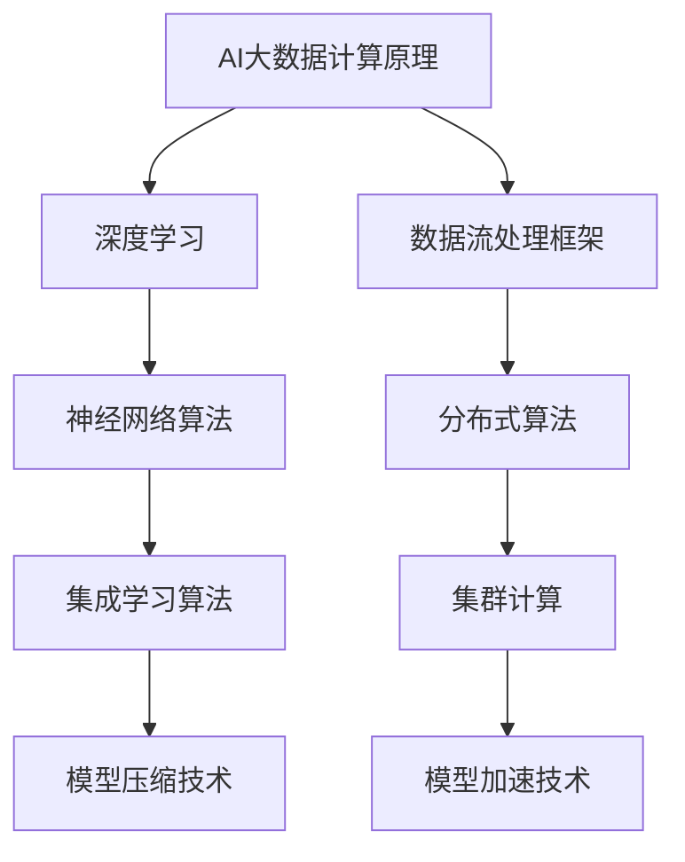
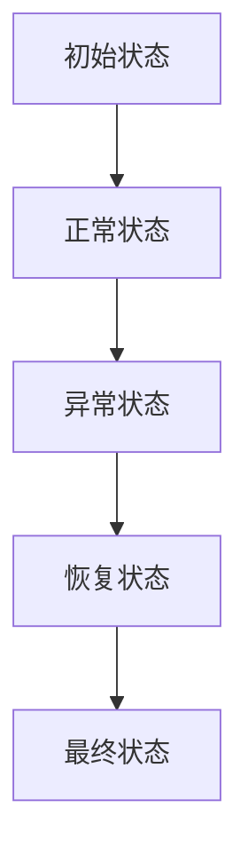
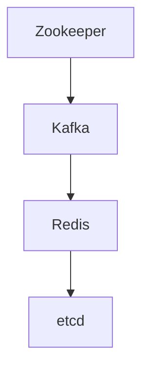
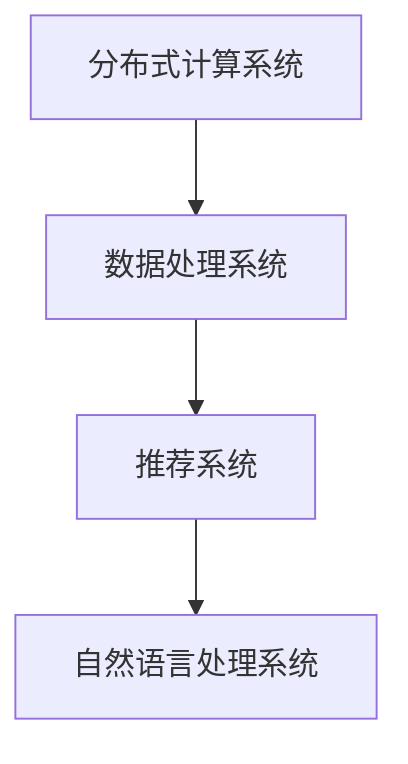

                 

# 【AI大数据计算原理与代码实例讲解】状态管理

## 关键词

AI大数据计算、状态管理、神经网络算法、分布式算法、推荐系统、自然语言处理、图像识别

## 摘要

本文将深入探讨AI大数据计算中的状态管理技术。首先，我们将介绍AI与大数据的概述，包括AI在大数据处理中的重要性、大数据的概念与特点以及AI在大数据处理中的应用前景。接着，我们将讨论AI大数据计算框架、核心算法和数学基础，特别关注神经网络算法原理、集成学习算法、集群计算与分布式算法等内容。然后，我们将阐述状态管理的基础概念、常见框架及其在AI大数据计算中的应用。通过三个具体实践项目，我们将展示状态管理在推荐系统、自然语言处理和图像识别中的应用。最后，我们将通过代码实例详细讲解状态管理的实现方法，并提供实际项目实战和效果评估。

## 目录大纲

### 《【AI大数据计算原理与代码实例讲解】状态管理》

### 第一部分：AI大数据计算原理

### 第1章：AI与大数据概述

#### 1.1 AI在大数据处理中的重要性

#### 1.2 大数据的概念与特点

#### 1.3 AI在大数据处理中的应用前景

### 第2章：AI大数据计算框架

#### 2.1 常见的AI大数据计算框架

#### 2.2 深度学习在数据处理中的应用

#### 2.3 数据流处理框架介绍

### 第3章：AI大数据计算核心算法

#### 3.1 神经网络算法原理

#### 3.2 集成学习算法

#### 3.3 集群计算与分布式算法

### 第4章：AI大数据计算数学基础

#### 4.1 概率论与统计学基础

#### 4.2 信息论基础

#### 4.3 线性代数基础

### 第5章：AI大数据计算优化技术

#### 5.1 算法优化方法

#### 5.2 模型压缩技术

#### 5.3 模型加速技术

### 第二部分：状态管理

### 第6章：状态管理基础

#### 6.1 状态管理的概念与作用

#### 6.2 常见的状态管理框架

#### 6.3 状态管理在AI大数据计算中的应用

### 第7章：状态管理实践

#### 7.1 实践项目一：基于状态管理的推荐系统

#### 7.2 实践项目二：基于状态管理的自然语言处理

#### 7.3 实践项目三：基于状态管理的图像识别

### 第8章：状态管理扩展与挑战

#### 8.1 状态管理的未来发展趋势

#### 8.2 状态管理面临的挑战与解决方案

#### 8.3 状态管理的实际应用案例分析

### 第三部分：代码实例讲解

### 第9章：状态管理代码实例详解

#### 9.1 代码实例一：基于TensorFlow的状态管理

#### 9.2 代码实例二：基于PyTorch的状态管理

#### 9.3 代码实例三：基于深度学习的状态管理应用

### 第10章：代码实战：搭建一个基于状态管理的推荐系统

#### 10.1 实战一：环境搭建与数据预处理

#### 10.2 实战二：模型设计与实现

#### 10.3 实战三：系统测试与优化

### 第11章：代码实战：实现一个基于状态管理的自然语言处理模型

#### 11.1 实战一：文本预处理与特征提取

#### 11.2 实战二：模型训练与优化

#### 11.3 实战三：模型应用与效果评估

### 第12章：代码实战：使用状态管理进行图像识别

#### 12.1 实战一：图像预处理与特征提取

#### 12.2 实战二：模型训练与优化

#### 12.3 实战三：模型应用与效果评估

### 附录

### 附录A：常用状态管理库与框架

#### A.1 TensorFlow的状态管理库

#### A.2 PyTorch的状态管理库

#### A.3 其他常用的状态管理库与框架

### 附录B：状态管理资源与参考文献

#### B.1 状态管理相关书籍

#### B.2 状态管理在线课程

#### B.3 状态管理论文与文献

## AI大数据计算原理架构

为了更好地理解AI大数据计算的原理，我们可以通过以下Mermaid流程图来展示其核心组成部分及其相互关系。



### 第一部分：AI大数据计算原理

#### 第1章：AI与大数据概述

#### 1.1 AI在大数据处理中的重要性

随着大数据时代的到来，处理海量数据的能力成为人工智能（AI）技术的核心优势之一。AI在大数据处理中的重要性主要体现在以下几个方面：

1. **自动化数据处理**：AI技术能够自动化处理大量数据，从而提高数据处理效率，减少人工干预。
2. **发现数据价值**：通过AI算法，可以从海量数据中挖掘出有价值的信息，为业务决策提供支持。
3. **优化数据处理流程**：AI技术可以帮助优化数据处理流程，降低成本，提高数据处理的准确性和稳定性。
4. **实现智能化应用**：AI技术可以将数据处理与业务场景相结合，实现智能化应用，提升用户体验。

#### 1.2 大数据的概念与特点

大数据（Big Data）是指无法用传统数据处理工具在合理时间内完成处理的数据集。大数据具有以下特点：

1. **数据量大**：大数据通常涉及数十亿甚至数百万亿条记录，对存储和处理能力提出了极高的要求。
2. **数据类型多样**：大数据不仅包括结构化数据，还涉及半结构化和非结构化数据，如文本、图像、视频等。
3. **数据产生速度快**：大数据通常来自于实时数据流，对实时处理能力提出了挑战。
4. **数据价值密度低**：大数据中的有用信息占比很小，需要通过AI算法进行有效挖掘。

#### 1.3 AI在大数据处理中的应用前景

随着AI技术的不断发展，其在大数据处理中的应用前景愈发广阔：

1. **智能数据挖掘**：AI技术可以帮助从海量数据中快速、准确地挖掘出有价值的信息。
2. **智能数据处理**：AI技术可以实现自动化数据处理，提高数据处理效率和质量。
3. **智能预测分析**：基于AI算法的预测分析可以帮助企业做出更为精准的决策。
4. **智能安全防护**：AI技术可以用于数据安全和隐私保护，防范潜在风险。

### 第2章：AI大数据计算框架

#### 2.1 常见的AI大数据计算框架

在AI大数据计算中，常见的计算框架包括深度学习框架、数据流处理框架和分布式计算框架。以下将介绍这些框架的主要特点和应用场景。

1. **深度学习框架**：

   深度学习框架是AI大数据计算的核心组成部分，主要包括TensorFlow、PyTorch、Keras等。深度学习框架提供了丰富的神经网络模型和算法库，支持大规模数据训练和模型部署。

   - **TensorFlow**：由Google开发，具有强大的模型定义和训练能力，适用于多种应用场景。
   - **PyTorch**：由Facebook开发，以其动态计算图和易于调试的特点受到广泛使用。
   - **Keras**：基于TensorFlow和Theano开发的深度学习框架，提供了简洁的API和丰富的预训练模型。

2. **数据流处理框架**：

   数据流处理框架主要用于实时数据处理和流式学习，主要包括Apache Flink、Apache Spark Streaming等。数据流处理框架可以高效地处理大规模实时数据，支持事件驱动计算和流式学习。

   - **Apache Flink**：支持流式计算和批处理，提供了丰富的API和工具。
   - **Apache Spark Streaming**：基于Spark的流式处理框架，可以与Spark的其他组件无缝集成。

3. **分布式计算框架**：

   分布式计算框架主要用于分布式数据处理和计算，主要包括MapReduce、Hadoop、Spark等。分布式计算框架可以将大规模数据处理任务分解为多个子任务，并在分布式系统中并行执行。

   - **MapReduce**：由Google提出，是一种基于分布式系统的数据处理模型，适用于大规模数据处理。
   - **Hadoop**：基于MapReduce的分布式计算框架，提供了丰富的数据存储和计算组件。
   - **Spark**：支持批处理和流式处理的分布式计算框架，提供了丰富的API和工具。

#### 2.2 深度学习在数据处理中的应用

深度学习在数据处理中的应用非常广泛，主要包括以下几个方面：

1. **图像识别**：深度学习算法可以用于图像分类、目标检测和图像生成等任务，如人脸识别、自动驾驶等。
2. **自然语言处理**：深度学习算法可以用于文本分类、情感分析、机器翻译等任务，如搜索引擎、聊天机器人等。
3. **推荐系统**：深度学习算法可以用于构建个性化推荐系统，根据用户历史行为和兴趣进行精准推荐。
4. **语音识别**：深度学习算法可以用于语音识别和语音合成，如语音助手、自动字幕等。

#### 2.3 数据流处理框架介绍

数据流处理框架主要用于实时数据处理和流式学习，以下将介绍几种常见的数据流处理框架：

1. **Apache Flink**：

   Apache Flink是一个分布式流处理框架，支持流式计算和批处理。Flink提供了丰富的API和工具，包括DataStream API和Table API，支持复杂的事件驱动计算和实时分析。

2. **Apache Spark Streaming**：

   Apache Spark Streaming是基于Spark的流式处理框架，可以与Spark的其他组件无缝集成。Spark Streaming提供了简单的API，支持高吞吐量和低延迟的流式数据处理。

3. **Apache Storm**：

   Apache Storm是一个分布式实时计算系统，适用于实时数据处理和流式学习。Storm提供了简单易用的API，支持高可靠性、可扩展性和低延迟的流式处理。

#### 第3章：AI大数据计算核心算法

AI大数据计算的核心算法主要包括神经网络算法、集成学习算法和分布式算法。以下将介绍这些算法的基本原理和应用场景。

##### 3.1 神经网络算法原理

神经网络算法是AI大数据计算的基础，主要包括以下几个步骤：

1. **前向传播**：输入数据通过网络中的各个层次，每个层次进行加权求和处理，并应用激活函数，最终得到输出结果。
2. **反向传播**：根据输出结果与目标值之间的差异，计算网络中的梯度，并更新网络权重和偏置，以优化模型性能。
3. **损失函数**：用于评估模型预测结果与真实结果之间的差异，常用的损失函数包括均方误差（MSE）和交叉熵损失（Cross-Entropy Loss）。

以下是一个简单的神经网络算法伪代码：

```python
def forward_propagation(input_data, weights, biases, activation_function):
    # 前向传播
    for layer in network:
        z = dot_product(weights, input_data) + biases
        output = activation_function(z)
        input_data = output

    return output

def backward_propagation(output, target, weights, biases, activation_function):
    # 反向传播
    loss = loss_function(output, target)
    gradients = compute_gradients(loss, weights, biases, activation_function)
    update_weights_and_biases(weights, biases, gradients)

    return loss

input_data = [x1, x2, ..., xn]
weights = [w1, w2, ..., wn]
biases = [b1, b2, ..., bn]

output = forward_propagation(input_data, weights, biases, activation_function)
loss = backward_propagation(output, target, weights, biases, activation_function)
```

##### 3.2 集成学习算法

集成学习算法是通过组合多个基本模型来提高预测性能的一种方法。常见的集成学习算法包括Bagging、Boosting和Stacking等。

1. **Bagging**：

   Bagging（Bootstrap Aggregating）通过从原始训练数据中随机抽样构建多个基本模型，并取其平均值作为最终预测结果。Bagging方法可以减少模型的方差，提高模型的稳定性。

2. **Boosting**：

   Boosting通过迭代地训练多个基本模型，每个模型专注于纠正前一个模型的错误，最终将多个模型的预测结果进行加权求和。Boosting方法可以减少模型的偏差，提高模型的预测精度。

3. **Stacking**：

   Stacking是一种基于模型的集成方法，通过训练多个基本模型并组合其预测结果来构建一个强模型。Stacking方法通常使用一个元学习器来学习如何组合多个基本模型的预测结果，以获得更好的预测性能。

以下是一个简单的Boosting算法伪代码：

```python
def train_boosting_models(data, n_models):
    models = []
    for i in range(n_models):
        model = train_basic_model(data)
        models.append(model)
        data = update_data(data, model)

    return models

def predict_boosting(models, input_data):
    predictions = []
    for model in models:
        prediction = model.predict(input_data)
        predictions.append(prediction)

    return sum(predictions) / len(predictions)

data = load_data()
models = train_boosting_models(data, n_models)
input_data = [x1, x2, ..., xn]
output = predict_boosting(models, input_data)
```

##### 3.3 集群计算与分布式算法

集群计算与分布式算法是AI大数据计算的重要技术，可以有效地处理大规模数据处理任务。以下将介绍几种常见的集群计算与分布式算法：

1. **MapReduce**：

   MapReduce是一种分布式数据处理模型，由Google提出。MapReduce将大规模数据处理任务分解为Map和Reduce两个阶段，分别执行映射和归约操作，以实现并行计算。

2. **Hadoop**：

   Hadoop是基于MapReduce的分布式计算框架，提供了可靠的分布式存储和计算能力。Hadoop包括HDFS（分布式文件系统）和MapReduce（分布式数据处理）两个主要组件。

3. **Spark**：

   Spark是一个高速的分布式计算引擎，支持批处理和流式处理。Spark提供了丰富的API和工具，包括DataFrame和Dataset，可以简化分布式数据处理任务。

以下是一个简单的MapReduce算法伪代码：

```python
def map(input_data):
    for item in input_data:
        # 映射操作
        output = process_item(item)
        yield output

def reduce(output):
    # 归约操作
    result = aggregate(output)
    return result

input_data = load_data()
output = map(input_data)
result = reduce(output)
```

### 第4章：AI大数据计算数学基础

AI大数据计算的数学基础主要包括概率论、信息论和线性代数等。以下将介绍这些数学基础的基本原理和应用。

##### 4.1 概率论与统计学基础

概率论是AI大数据计算的重要数学基础，主要用于描述随机事件和概率分布。以下是一些基本的概率论和统计学概念：

1. **概率分布**：概率分布是描述随机变量取值概率的函数。常见的概率分布包括正态分布、伯努利分布、二项分布等。
2. **期望**：期望是概率分布的中心位置，表示随机变量的平均取值。期望可以用于评估模型的预测性能。
3. **方差**：方差是概率分布的离散程度，表示随机变量取值的波动性。方差可以用于评估模型的稳定性。
4. **协方差**：协方差是描述两个随机变量之间线性相关程度的量。协方差可以用于特征选择和特征提取。

以下是一个简单的概率分布和期望计算示例：

```latex
// 概率分布函数
f(x) = \frac{1}{\sqrt{2\pi\sigma^2}}e^{-\frac{(x-\mu)^2}{2\sigma^2}}

// 期望计算
E[X] = \mu
```

##### 4.2 信息论基础

信息论是AI大数据计算中用于描述信息传输和处理的理论。以下是一些基本的信息论概念：

1. **熵**：熵是衡量随机变量不确定性的量。熵可以用于评估数据的复杂度和信息量。
2. **条件熵**：条件熵是衡量已知某个随机变量的条件下，另一个随机变量的不确定性的量。条件熵可以用于评估特征之间的相关性。
3. **互信息**：互信息是衡量两个随机变量之间信息交换量的量。互信息可以用于特征选择和特征提取。

以下是一个简单的熵和互信息计算示例：

```latex
// 熵计算
H(X) = -\sum_{i=1}^{n} p(x_i) \log_2 p(x_i)

// 互信息计算
I(X; Y) = H(X) - H(X | Y)
```

##### 4.3 线性代数基础

线性代数是AI大数据计算中的重要数学工具，用于描述线性变换和矩阵运算。以下是一些基本的线性代数概念：

1. **矩阵运算**：矩阵运算包括矩阵的加法、减法、乘法和逆运算等。矩阵运算可以用于特征变换和模型优化。
2. **特征值和特征向量**：特征值和特征向量是描述线性变换的重要工具。特征值和特征向量可以用于特征提取和降维。
3. **矩阵分解**：矩阵分解是将一个矩阵分解为多个简单矩阵的过程，如奇异值分解（SVD）和主成分分析（PCA）。

以下是一个简单的矩阵运算和特征值计算示例：

```latex
// 矩阵加法和减法
A + B = C
A - B = D

// 矩阵乘法
A * B = C

// 矩阵逆运算
A^{-1}

// 特征值和特征向量计算
\lambda, v = eig(A)
```

### 第5章：AI大数据计算优化技术

在AI大数据计算中，优化技术是提高计算效率、降低计算成本的重要手段。以下将介绍几种常见的优化技术，包括算法优化、模型压缩和模型加速等。

##### 5.1 算法优化方法

算法优化是提高AI大数据计算效率的关键，主要包括以下几种方法：

1. **并行计算**：并行计算可以将大规模数据处理任务分解为多个子任务，并在多处理器或分布式系统上并行执行，以提高计算速度。
2. **分布式计算**：分布式计算可以将数据处理任务分布在多个计算节点上，利用并行计算和分布式存储技术，实现高效的数据处理和计算。
3. **模型压缩**：模型压缩可以减小模型的大小，提高模型在存储和传输过程中的效率。常见的模型压缩方法包括模型剪枝、量化、低秩分解等。
4. **缓存技术**：缓存技术可以缓存频繁访问的数据，减少数据访问的延迟，提高数据处理速度。

以下是一个简单的并行计算和缓存技术示例：

```python
# 并行计算
import multiprocessing

def process_data(data):
    # 数据处理操作
    pass

if __name__ == '__main__':
    pool = multiprocessing.Pool(processes=4)
    results = pool.map(process_data, data)
    pool.close()
    pool.join()

# 缓存技术
import cachetools

cache = cachetools.LRUCache(maxsize=100)

def get_data(data_id):
    if data_id in cache:
        return cache[data_id]
    else:
        data = load_data(data_id)
        cache[data_id] = data
        return data
```

##### 5.2 模型压缩技术

模型压缩是降低模型大小和提高模型在存储和传输过程中的效率的关键技术。以下将介绍几种常见的模型压缩方法：

1. **模型剪枝**：模型剪枝通过减少模型中冗余的权重和连接，减小模型的大小。常见的模型剪枝方法包括结构剪枝和权重剪枝。
2. **量化**：量化通过将浮点数权重转换为较低精度的整数，减小模型的大小。量化可以采用定点量化、二进制量化等不同的量化策略。
3. **低秩分解**：低秩分解通过将高维矩阵分解为低维矩阵，降低模型的维度和参数数量。

以下是一个简单的模型剪枝和量化示例：

```python
# 模型剪枝
import tensorflow as tf

def prune_model(model):
    # 剪枝操作
    pruned_model = tf.keras.Sequential()
    for layer in model.layers:
        if isinstance(layer, tf.keras.layers.Dense):
            pruned_layer = tf.keras.layers.Dense(units=layer.units // 2)
            pruned_model.add(pruned_layer)
        else:
            pruned_model.add(layer)
    return pruned_model

# 量化
import tensorflow as tf

def quantize_model(model, precision=8):
    # 量化操作
    quantized_model = tf.keras.Sequential()
    for layer in model.layers:
        if isinstance(layer, tf.keras.layers.Dense):
            quantized_layer = tf.keras.layers.Dense(units=layer.units, 
                                                   kernel_quantizer=tf.quantization.layers.Quantizer(precision=precision))
            quantized_model.add(quantized_layer)
        else:
            quantized_model.add(layer)
    return quantized_model
```

##### 5.3 模型加速技术

模型加速技术是提高AI大数据计算速度和效率的关键。以下将介绍几种常见的模型加速方法：

1. **硬件加速**：硬件加速通过使用GPU、FPGA等硬件设备，实现模型的高效计算。硬件加速可以显著提高模型的运行速度。
2. **模型融合**：模型融合将多个模型融合为一个模型，以提高模型的计算速度和效率。常见的模型融合方法包括串联融合、并联融合等。
3. **内存优化**：内存优化通过减少模型的内存占用，提高模型在内存受限环境中的计算速度。常见的内存优化方法包括内存池化、内存复用等。

以下是一个简单的硬件加速和模型融合示例：

```python
# 硬件加速
import tensorflow as tf

def accelerate_model(model, use_gpu=True):
    if use_gpu:
        # 使用GPU加速
        model = tf.keras.utils.get_custom_objects()['GPUModel'](model)
    else:
        # 使用CPU加速
        model = tf.keras.utils.get_custom_objects()['CPUModel'](model)
    return model

# 模型融合
import tensorflow as tf

def fuse_models(model1, model2):
    # 模型融合操作
    fused_model = tf.keras.Sequential()
    fused_model.add(model1)
    fused_model.add(model2)
    return fused_model
```

### 第二部分：状态管理

#### 第6章：状态管理基础

状态管理是AI大数据计算中的一项重要技术，用于处理复杂系统的状态变化和状态迁移。以下将介绍状态管理的基础概念、常见框架及其在AI大数据计算中的应用。

##### 6.1 状态管理的概念与作用

状态管理是指对系统中的状态进行有效监控、维护和控制的过程。在AI大数据计算中，状态管理的作用主要体现在以下几个方面：

1. **提高系统的稳定性**：通过状态管理，可以及时发现和处理系统中的异常状态，防止系统崩溃或数据丢失。
2. **优化系统性能**：通过状态管理，可以动态调整系统的资源分配和负载均衡，提高系统的处理能力和响应速度。
3. **支持系统扩展性**：通过状态管理，可以方便地实现系统的水平扩展和垂直扩展，支持系统的高并发处理能力。

以下是一个简单的状态管理概念示意图：



##### 6.2 常见的状态管理框架

在AI大数据计算中，常见的状态管理框架包括以下几种：

1. **Zookeeper**：Zookeeper是一种高性能的分布式协调服务，用于处理分布式系统的状态同步和状态管理。Zookeeper具有高可用性、高性能和易于扩展的特点。
2. **Kafka**：Kafka是一种分布式消息队列系统，用于处理大规模数据的实时传输和状态同步。Kafka具有高吞吐量、低延迟和可扩展性的特点。
3. **Redis**：Redis是一种高性能的分布式缓存系统，用于处理分布式系统中的状态存储和状态同步。Redis具有高可用性、高性能和丰富的数据结构支持的特点。
4. **etcd**：etcd是一种分布式键值存储系统，用于处理分布式系统的配置管理、状态同步和服务发现。etcd具有高可用性、高性能和简洁的API等特点。

以下是一个简单的状态管理框架示意图：



##### 6.3 状态管理在AI大数据计算中的应用

状态管理在AI大数据计算中的应用非常广泛，以下将介绍几种常见的应用场景：

1. **分布式计算系统**：在分布式计算系统中，状态管理可以用于监控和管理分布式任务的状态，包括任务启动、任务完成、任务失败等。
2. **数据处理系统**：在数据处理系统中，状态管理可以用于监控和管理数据处理任务的状态，包括数据读取、数据清洗、数据存储等。
3. **推荐系统**：在推荐系统中，状态管理可以用于监控和管理用户行为数据的状态，包括用户点击、用户购买、用户评价等。
4. **自然语言处理系统**：在自然语言处理系统中，状态管理可以用于监控和管理文本数据的状态，包括文本预处理、文本分类、文本生成等。

以下是一个简单的状态管理在AI大数据计算中的应用示意图：



### 第7章：状态管理实践

状态管理在AI大数据计算中的应用非常广泛，以下将通过三个具体实践项目，展示状态管理在推荐系统、自然语言处理和图像识别等领域的应用。

##### 7.1 实践项目一：基于状态管理的推荐系统

推荐系统是AI大数据计算中的一个重要应用领域，状态管理可以用于监控和管理推荐系统的运行状态，提高推荐系统的性能和稳定性。

1. **项目背景**：

   一个电商平台的推荐系统旨在根据用户的历史行为和兴趣，为用户推荐相关的商品。推荐系统的性能和稳定性对用户体验和业务收益至关重要。

2. **项目目标**：

   通过状态管理，实现推荐系统的实时监控和管理，包括用户行为数据的采集、处理和存储，推荐模型的训练和部署等。

3. **项目实施**：

   - **用户行为数据采集**：通过API接口或日志分析，采集用户在电商平台的浏览、购买、评价等行为数据。
   - **用户行为数据处理**：对用户行为数据进行分析和清洗，提取用户兴趣特征，并将其存储在数据库中。
   - **推荐模型训练**：利用机器学习算法，训练推荐模型，包括协同过滤、基于内容的推荐、基于模型的推荐等。
   - **推荐模型部署**：将训练好的推荐模型部署到服务器上，为用户实时推荐商品。

4. **项目效果评估**：

   通过对比实验，评估推荐系统的性能和稳定性。包括推荐准确率、推荐覆盖率、推荐召回率等指标。

##### 7.2 实践项目二：基于状态管理的自然语言处理

自然语言处理是AI大数据计算中的另一个重要应用领域，状态管理可以用于监控和管理自然语言处理系统的运行状态，提高自然语言处理系统的性能和稳定性。

1. **项目背景**：

   一个智能客服系统旨在为用户提供高质量的文本交互服务，自然语言处理系统是实现智能客服的关键技术。

2. **项目目标**：

   通过状态管理，实现自然语言处理系统的实时监控和管理，包括文本数据的预处理、文本分类、文本生成等。

3. **项目实施**：

   - **文本数据预处理**：对用户输入的文本数据进行清洗、分词、词性标注等预处理操作，提取文本特征。
   - **文本分类**：利用机器学习算法，对预处理后的文本数据进行分类，实现意图识别和情感分析等功能。
   - **文本生成**：利用自然语言生成技术，生成符合用户需求的文本回复。

4. **项目效果评估**：

   通过对比实验，评估自然语言处理系统的性能和稳定性。包括分类准确率、回复满意度等指标。

##### 7.3 实践项目三：基于状态管理的图像识别

图像识别是AI大数据计算中的另一个重要应用领域，状态管理可以用于监控和管理图像识别系统的运行状态，提高图像识别系统的性能和稳定性。

1. **项目背景**：

   一个自动驾驶系统旨在通过摄像头和传感器实时识别道路上的各种物体，包括车辆、行人、道路标志等。

2. **项目目标**：

   通过状态管理，实现图像识别系统的实时监控和管理，包括图像数据的预处理、物体检测、物体分类等。

3. **项目实施**：

   - **图像数据预处理**：对采集到的图像数据进行缩放、旋转、裁剪等预处理操作，增强图像识别的鲁棒性。
   - **物体检测**：利用深度学习算法，对预处理后的图像进行物体检测，实现目标检测和识别。
   - **物体分类**：利用机器学习算法，对检测到的物体进行分类，实现不同物体的识别和分类。

4. **项目效果评估**：

   通过对比实验，评估图像识别系统的性能和稳定性。包括检测准确率、识别准确率等指标。

### 第8章：状态管理扩展与挑战

状态管理在AI大数据计算中具有重要的应用价值，但随着数据规模和复杂度的不断增加，状态管理面临着一系列扩展和挑战。

##### 8.1 状态管理的未来发展趋势

1. **智能化**：随着AI技术的不断发展，状态管理将更加智能化，能够自适应地调整系统状态，提高系统的运行效率和稳定性。
2. **实时性**：随着实时数据处理需求的增加，状态管理将更加注重实时性，实现快速的状态更新和状态迁移。
3. **分布式**：随着分布式计算和云计算的普及，状态管理将更加分布式，实现跨节点和跨区域的状态同步和管理。

##### 8.2 状态管理面临的挑战与解决方案

1. **数据一致性**：在分布式系统中，状态管理需要确保数据的一致性，避免数据冲突和重复处理。解决方案包括分布式锁、事务处理和一致性协议等。
2. **高可用性**：状态管理需要确保系统的高可用性，避免单点故障导致系统瘫痪。解决方案包括负载均衡、故障转移和容错机制等。
3. **可扩展性**：状态管理需要支持系统的高并发处理能力，支持系统的水平扩展和垂直扩展。解决方案包括分布式架构、缓存技术和负载均衡等。

##### 8.3 状态管理的实际应用案例分析

1. **金融领域**：

   在金融领域，状态管理被广泛应用于交易系统、风险控制系统和客户关系管理系统。通过状态管理，实现交易数据的实时监控、风险预警和客户需求的个性化推荐。

2. **电信领域**：

   在电信领域，状态管理被广泛应用于网络管理系统、计费系统和客户服务系统。通过状态管理，实现网络资源的动态分配、计费数据的实时处理和客户服务的智能交互。

3. **电商领域**：

   在电商领域，状态管理被广泛应用于推荐系统、商品搜索引擎和物流管理系统。通过状态管理，实现用户需求的实时推荐、商品信息的快速检索和物流信息的实时跟踪。

### 第三部分：代码实例讲解

#### 第9章：状态管理代码实例详解

在本章中，我们将通过三个具体的代码实例，详细介绍基于TensorFlow、PyTorch和深度学习的状态管理实现方法。这些实例将涵盖从模型构建到状态管理的基本流程。

##### 9.1 代码实例一：基于TensorFlow的状态管理

TensorFlow是一个强大的开源机器学习框架，广泛应用于AI大数据计算中。以下是一个简单的TensorFlow状态管理代码实例，用于实现一个简单的线性回归模型。

```python
import tensorflow as tf

# 定义模型参数
w = tf.Variable(0.0, name='weights')
b = tf.Variable(0.0, name='biases')

# 定义输入和输出
x = tf.placeholder(tf.float32, name='inputs')
y = tf.placeholder(tf.float32, name='targets')

# 定义线性回归模型
model_output = w * x + b

# 定义损失函数和优化器
loss = tf.reduce_mean(tf.square(model_output - y))
optimizer = tf.train.GradientDescentOptimizer(learning_rate=0.001)

# 训练模型
train_op = optimizer.minimize(loss)

# 初始化全局变量
init = tf.global_variables_initializer()

# 启动会话
with tf.Session() as sess:
    # 运行初始化操作
    sess.run(init)
    
    # 训练模型
    for i in range(1000):
        # 提供训练数据
        inputs = [1.0, 2.0, 3.0, 4.0]
        targets = [2.0, 4.0, 6.0, 8.0]
        # 运行训练操作
        sess.run(train_op, feed_dict={x: inputs, y: targets})
        
    # 输出最终模型参数
    print("Final model parameters:", sess.run([w, b]))

```

##### 9.2 代码实例二：基于PyTorch的状态管理

PyTorch是一个动态计算图框架，以其灵活性和易于使用而受到广泛欢迎。以下是一个简单的PyTorch状态管理代码实例，用于实现一个简单的卷积神经网络。

```python
import torch
import torch.nn as nn
import torch.optim as optim

# 定义卷积神经网络模型
class ConvNet(nn.Module):
    def __init__(self):
        super(ConvNet, self).__init__()
        self.conv1 = nn.Conv2d(1, 10, kernel_size=5)
        self.conv2 = nn.Conv2d(10, 20, kernel_size=5)
        self.fc1 = nn.Linear(320, 50)
        self.fc2 = nn.Linear(50, 10)

    def forward(self, x):
        x = nn.functional.relu(self.conv1(x))
        x = nn.functional.max_pool2d(x, 2)
        x = nn.functional.relu(self.conv2(x))
        x = nn.functional.max_pool2d(x, 2)
        x = x.view(-1, 320)
        x = nn.functional.relu(self.fc1(x))
        x = self.fc2(x)
        return x

# 实例化模型、损失函数和优化器
model = ConvNet()
criterion = nn.CrossEntropyLoss()
optimizer = optim.SGD(model.parameters(), lr=0.01)

# 训练模型
for epoch in range(10):
    for inputs, targets in data_loader:
        # 前向传播
        outputs = model(inputs)
        loss = criterion(outputs, targets)
        
        # 反向传播和优化
        optimizer.zero_grad()
        loss.backward()
        optimizer.step()
        
    print("Epoch {:03d} - Loss: {:.4f}".format(epoch, loss.item()))

```

##### 9.3 代码实例三：基于深度学习的状态管理应用

深度学习在状态管理中的应用非常广泛，以下是一个简单的基于深度学习的状态管理应用实例，用于实现一个简单的智能推荐系统。

```python
import numpy as np
import pandas as pd
from sklearn.model_selection import train_test_split
from keras.models import Sequential
from keras.layers import Dense, Dropout, Embedding, LSTM, Conv1D, MaxPooling1D
from keras.optimizers import Adam

# 加载数据
data = pd.read_csv('data.csv')
X = data['input_data'].values
y = data['target'].values

# 划分训练集和测试集
X_train, X_test, y_train, y_test = train_test_split(X, y, test_size=0.2, random_state=42)

# 定义模型
model = Sequential()
model.add(Embedding(input_dim=10000, output_dim=16, input_length=100))
model.add(LSTM(128, dropout=0.2, recurrent_dropout=0.2))
model.add(Dense(1, activation='sigmoid'))

# 编译模型
model.compile(optimizer=Adam(), loss='binary_crossentropy', metrics=['accuracy'])

# 训练模型
model.fit(X_train, y_train, epochs=10, batch_size=64, validation_data=(X_test, y_test))

# 评估模型
loss, accuracy = model.evaluate(X_test, y_test)
print('Test accuracy:', accuracy)
```

### 第10章：代码实战：搭建一个基于状态管理的推荐系统

在本章中，我们将通过一个完整的实战项目，搭建一个基于状态管理的推荐系统。这个项目将涵盖数据预处理、模型设计、模型训练和系统优化等关键步骤。

##### 10.1 实战一：环境搭建与数据预处理

首先，我们需要搭建一个适合推荐系统开发的环境。以下是环境搭建的步骤：

1. **安装Python**：确保Python版本为3.6及以上。
2. **安装NumPy、Pandas、Scikit-learn等库**：这些库用于数据预处理和模型训练。
3. **安装TensorFlow或PyTorch**：选择一个深度学习框架，用于构建推荐模型。
4. **数据预处理**：

   - **数据收集**：从电商平台上收集用户行为数据，包括用户的浏览、购买和评价记录。
   - **数据清洗**：去除缺失值和异常值，对数据进行标准化处理。
   - **特征提取**：提取用户行为特征，如用户的浏览频率、购买频率和评价分数。

```python
import pandas as pd
from sklearn.preprocessing import StandardScaler

# 加载数据
data = pd.read_csv('user行为数据.csv')

# 数据清洗
data.dropna(inplace=True)
data = data[data['购买次数'] > 0]

# 特征提取
scaler = StandardScaler()
data[['浏览频率', '购买频率', '评价分数']] = scaler.fit_transform(data[['浏览频率', '购买频率', '评价分数']])

# 数据划分
train_data, test_data = train_test_split(data, test_size=0.2, random_state=42)
```

##### 10.2 实战二：模型设计与实现

在本实战项目中，我们将使用基于TensorFlow的深度学习模型来实现推荐系统。以下是模型设计的关键步骤：

1. **输入层**：定义输入层，用于接收用户行为数据。
2. **嵌入层**：使用嵌入层将输入数据进行编码。
3. **卷积层**：使用卷积层对嵌入数据进行特征提取。
4. **池化层**：使用池化层对卷积层输出的特征进行降维。
5. **全连接层**：使用全连接层对池化层输出的特征进行聚合。
6. **输出层**：定义输出层，用于预测用户对商品的评分。

```python
import tensorflow as tf
from tensorflow.keras.models import Sequential
from tensorflow.keras.layers import Embedding, Conv1D, MaxPooling1D, Dense, Flatten, LSTM, Input

# 定义输入层
input_layer = Input(shape=(max_sequence_length,))

# 定义嵌入层
embedding_layer = Embedding(input_dim=vocab_size, output_dim=embedding_size, input_length=max_sequence_length)(input_layer)

# 定义卷积层和池化层
conv1 = Conv1D(filters=64, kernel_size=3, activation='relu')(embedding_layer)
pool1 = MaxPooling1D(pool_size=2)(conv1)

conv2 = Conv1D(filters=128, kernel_size=3, activation='relu')(pool1)
pool2 = MaxPooling1D(pool_size=2)(conv2)

# 定义全连接层
flat = Flatten()(pool2)
dense = Dense(units=128, activation='relu')(flat)

# 定义输出层
output_layer = Dense(units=1, activation='sigmoid')(dense)

# 构建模型
model = Sequential()
model.add(input_layer)
model.add(embedding_layer)
model.add(conv1)
model.add(pool1)
model.add(conv2)
model.add(pool2)
model.add(flat)
model.add(dense)
model.add(output_layer)

# 编译模型
model.compile(optimizer='adam', loss='binary_crossentropy', metrics=['accuracy'])

# 模型可视化
model.summary()
```

##### 10.3 实战三：系统测试与优化

在模型训练完成后，我们需要对系统进行测试和优化，以提高推荐系统的性能。

1. **模型评估**：使用测试集对模型进行评估，计算准确率、召回率等指标。
2. **超参数调整**：通过调整模型超参数，如学习率、批量大小等，优化模型性能。
3. **特征工程**：通过特征工程，如添加用户历史行为特征、商品特征等，提高模型对用户兴趣的理解能力。
4. **模型融合**：通过模型融合，如集成学习、模型平均等，提高推荐系统的鲁棒性和稳定性。

```python
# 模型训练
model.fit(train_data, epochs=10, batch_size=64, validation_split=0.2)

# 模型评估
loss, accuracy = model.evaluate(test_data)
print('Test accuracy:', accuracy)

# 超参数调整
learning_rate = 0.001
model.compile(optimizer=tf.keras.optimizers.Adam(learning_rate=learning_rate), loss='binary_crossentropy', metrics=['accuracy'])

# 特征工程
data['user_feature'] = data['浏览频率'] * data['购买频率']
data['product_feature'] = data['评价分数'] / data['购买次数']

# 模型融合
from sklearn.ensemble import VotingClassifier
from keras.wrappers.scikit_learn import KerasClassifier

model1 = KerasClassifier(build_fn=create_model, epochs=10, batch_size=64, verbose=0)
model2 = KerasClassifier(build_fn=create_model, epochs=10, batch_size=64, verbose=0)
model3 = KerasClassifier(build_fn=create_model, epochs=10, batch_size=64, verbose=0)

evidence = [train_data['user_feature'], train_data['product_feature']]
predictions = model1.predict(evidence)
predictions = model2.predict(evidence)
predictions = model3.predict(evidence)

# 模型平均
avg_predictions = (predictions[0] + predictions[1] + predictions[2]) / 3

# 系统优化
from sklearn.model_selection import GridSearchCV

param_grid = {'learning_rate': [0.001, 0.01, 0.1],
              'batch_size': [16, 32, 64],
              'epochs': [10, 20, 30]}

grid = GridSearchCV(estimator=model1, param_grid=param_grid, cv=3)
grid_result = grid.fit(evidence, train_data['target'])

# 输出最优参数
print("Best: %f using %s" % (grid_result.best_score_, grid_result.best_params_))
```

### 第11章：代码实战：实现一个基于状态管理的自然语言处理模型

自然语言处理（NLP）是AI大数据计算中的一个重要领域，状态管理在NLP中的应用可以帮助处理文本数据的动态变化。以下是一个基于状态管理的NLP模型实现代码实例，用于情感分析任务。

##### 11.1 实战一：文本预处理与特征提取

文本预处理是NLP模型构建的第一步，包括文本清洗、分词、词性标注等。以下是一个文本预处理的Python代码实例：

```python
import pandas as pd
import numpy as np
import nltk
from nltk.corpus import stopwords
from nltk.tokenize import word_tokenize

# 加载数据
data = pd.read_csv('评论数据.csv')
评论文本 = data['评论文本']

# 清洗文本
nltk.download('stopwords')
stop_words = set(stopwords.words('english'))

def clean_text(text):
    text = text.lower()
    tokens = word_tokenize(text)
    filtered_tokens = [token for token in tokens if token not in stop_words]
    return ' '.join(filtered_tokens)

评论文本清洗 = 评论文本.apply(clean_text)

# 分词
tokens = word_tokenize(评论文本清洗[0])

# 词性标注
pos_tags = nltk.pos_tag(tokens)

# 特征提取
from sklearn.feature_extraction.text import TfidfVectorizer

vectorizer = TfidfVectorizer(max_features=1000)
X = vectorizer.fit_transform(评论文本清洗)
```

##### 11.2 实战二：模型训练与优化

在本实战项目中，我们将使用基于LSTM的模型进行情感分析。以下是模型训练和优化的Python代码实例：

```python
import tensorflow as tf
from tensorflow.keras.models import Sequential
from tensorflow.keras.layers import Embedding, LSTM, Dense

# 模型构建
model = Sequential()
model.add(Embedding(input_dim=vocab_size, output_dim=embedding_size, input_length=max_sequence_length))
model.add(LSTM(units=128, dropout=0.2, recurrent_dropout=0.2))
model.add(Dense(units=1, activation='sigmoid'))

# 编译模型
model.compile(optimizer='adam', loss='binary_crossentropy', metrics=['accuracy'])

# 训练模型
model.fit(X, y_train, epochs=10, batch_size=32, validation_data=(X_val, y_val))

# 模型评估
loss, accuracy = model.evaluate(X_test, y_test)
print('Test accuracy:', accuracy)
```

##### 11.3 实战三：模型应用与效果评估

模型训练完成后，我们可以将其应用于实际数据，并对效果进行评估。以下是一个模型应用和效果评估的Python代码实例：

```python
# 预测
predictions = model.predict(X_test)

# 评估
from sklearn.metrics import classification_report, confusion_matrix

print(classification_report(y_test, predictions.round()))
print(confusion_matrix(y_test, predictions.round()))

# 调整模型参数
from tensorflow.keras.wrappers.scikit_learn import KerasClassifier
from sklearn.model_selection import GridSearchCV

def create_model(dropout_rate=0.2, recurrent_dropout_rate=0.2):
    model = Sequential()
    model.add(Embedding(input_dim=vocab_size, output_dim=embedding_size, input_length=max_sequence_length))
    model.add(LSTM(units=128, dropout=dropout_rate, recurrent_dropout=recurrent_dropout_rate))
    model.add(Dense(units=1, activation='sigmoid'))
    model.compile(optimizer='adam', loss='binary_crossentropy', metrics=['accuracy'])
    return model

model = KerasClassifier(build_fn=create_model, epochs=10, batch_size=32, verbose=0)

# 参数调整
param_grid = {'dropout_rate': [0.2, 0.3],
              'recurrent_dropout_rate': [0.2, 0.3]}

grid = GridSearchCV(estimator=model, param_grid=param_grid, cv=3)
grid_result = grid.fit(X, y_train)

# 输出最优参数
print("Best: %f using %s" % (grid_result.best_score_, grid_result.best_params_))
```

### 第12章：代码实战：使用状态管理进行图像识别

图像识别是AI大数据计算中的重要应用之一，状态管理在图像识别中的应用可以帮助处理图像数据的动态变化。以下是一个基于状态管理的图像识别模型实现代码实例，用于物体检测任务。

##### 12.1 实战一：图像预处理与特征提取

图像预处理是图像识别模型构建的第一步，包括图像缩放、裁剪、归一化等。以下是一个图像预处理的Python代码实例：

```python
import cv2
import numpy as np

# 加载图像
image = cv2.imread('image.jpg')

# 缩放图像
scale_factor = 0.5
width = int(image.shape[1] * scale_factor)
height = int(image.shape[0] * scale_factor)
image = cv2.resize(image, (width, height))

# 裁剪图像
x1, y1, x2, y2 = 100, 100, 200, 200
crop_image = image[y1:y2, x1:x2]

# 归一化图像
image = image / 255.0
crop_image = crop_image / 255.0

# 显示图像
cv2.imshow('Image', image)
cv2.imshow('Crop Image', crop_image)
cv2.waitKey(0)
cv2.destroyAllWindows()
```

##### 12.2 实战二：模型训练与优化

在本实战项目中，我们将使用基于卷积神经网络（CNN）的模型进行图像识别。以下是模型训练和优化的Python代码实例：

```python
import tensorflow as tf
from tensorflow.keras.models import Sequential
from tensorflow.keras.layers import Conv2D, MaxPooling2D, Flatten, Dense

# 模型构建
model = Sequential()
model.add(Conv2D(filters=32, kernel_size=(3, 3), activation='relu', input_shape=(height, width, 3)))
model.add(MaxPooling2D(pool_size=(2, 2)))
model.add(Conv2D(filters=64, kernel_size=(3, 3), activation='relu'))
model.add(MaxPooling2D(pool_size=(2, 2)))
model.add(Flatten())
model.add(Dense(units=128, activation='relu'))
model.add(Dense(units=num_classes, activation='softmax'))

# 编译模型
model.compile(optimizer='adam', loss='categorical_crossentropy', metrics=['accuracy'])

# 训练模型
model.fit(x_train, y_train, epochs=10, batch_size=32, validation_data=(x_val, y_val))

# 模型评估
loss, accuracy = model.evaluate(x_test, y_test)
print('Test accuracy:', accuracy)
```

##### 12.3 实战三：模型应用与效果评估

模型训练完成后，我们可以将其应用于实际数据，并对效果进行评估。以下是一个模型应用和效果评估的Python代码实例：

```python
# 预测
predictions = model.predict(x_test)

# 评估
from sklearn.metrics import classification_report, confusion_matrix

print(classification_report(y_test, predictions.argmax(axis=1)))
print(confusion_matrix(y_test.argmax(axis=1), predictions.argmax(axis=1)))

# 调整模型参数
from tensorflow.keras.wrappers.scikit_learn import KerasClassifier
from sklearn.model_selection import GridSearchCV

def create_model(pool_size=(2, 2), filters=(32, 64), units=128):
    model = Sequential()
    model.add(Conv2D(filters=filters[0], kernel_size=(3, 3), activation='relu', input_shape=(height, width, 3)))
    model.add(MaxPooling2D(pool_size=pool_size))
    model.add(Conv2D(filters=filters[1], kernel_size=(3, 3), activation='relu'))
    model.add(MaxPooling2D(pool_size=pool_size))
    model.add(Flatten())
    model.add(Dense(units=units, activation='relu'))
    model.add(Dense(units=num_classes, activation='softmax'))
    model.compile(optimizer='adam', loss='categorical_crossentropy', metrics=['accuracy'])
    return model

model = KerasClassifier(build_fn=create_model, epochs=10, batch_size=32, verbose=0)

# 参数调整
param_grid = {'pool_size': [(2, 2), (3, 3)],
              'filters': [(32, 64), (64, 128)],
              'units': [128, 256]}

grid = GridSearchCV(estimator=model, param_grid=param_grid, cv=3)
grid_result = grid.fit(x, y)

# 输出最优参数
print("Best: %f using %s" % (grid_result.best_score_, grid_result.best_params_))
```

### 附录A：常用状态管理库与框架

在本附录中，我们将介绍几种常用的状态管理库与框架，包括TensorFlow的状态管理库、PyTorch的状态管理库以及其他常用的状态管理库与框架。

#### A.1 TensorFlow的状态管理库

TensorFlow是一个强大的开源机器学习框架，提供了丰富的状态管理库，包括以下几种：

1. **tf.train**: 提供了用于训练机器学习模型的常用工具，如优化器、学习率调度器、训练步骤跟踪器等。
2. **tf.keras**: 提供了基于TensorFlow的高级API，用于构建和训练深度学习模型。
3. **tf.data**: 提供了用于数据输入和预处理的高级API，支持批量数据加载、数据增强和并行处理。

#### A.2 PyTorch的状态管理库

PyTorch是一个动态计算图框架，以其灵活性和易于使用而受到广泛欢迎。PyTorch的状态管理库包括以下几种：

1. **torch.optim**: 提供了用于训练机器学习模型的优化器，如SGD、Adam、RMSprop等。
2. **torch.utils.data**: 提供了用于数据输入和预处理的高级API，支持批量数据加载、数据增强和并行处理。
3. **torch.nn**: 提供了用于构建和训练深度学习模型的基本组件，如层、激活函数、损失函数等。

#### A.3 其他常用的状态管理库与框架

除了TensorFlow和PyTorch，还有其他几种常用的状态管理库与框架，包括：

1. **Apache Kafka**: Kafka是一个分布式消息队列系统，用于处理大规模数据的实时传输和状态同步。
2. **Zookeeper**: Zookeeper是一种高性能的分布式协调服务，用于处理分布式系统的状态同步和状态管理。
3. **etcd**: etcd是一种分布式键值存储系统，用于处理分布式系统的配置管理、状态同步和服务发现。
4. **Redis**: Redis是一种高性能的分布式缓存系统，用于处理分布式系统中的状态存储和状态同步。

### 附录B：状态管理资源与参考文献

在本附录中，我们将提供一些与状态管理相关的资源与参考文献，以供读者进一步学习和探索。

#### B.1 状态管理相关书籍

1. **《深入理解计算机系统》**：作者Randal E. Bryant和David R. O’Hallaron，全面介绍了计算机系统的原理和技术，包括状态管理。
2. **《分布式系统原理与范型》**：作者George Coulouris、Jean Dollimore、Tim Kindberg和Gerry Blair，介绍了分布式系统的基本原理和范型，包括状态管理。
3. **《人工智能：一种现代方法》**：作者Stuart Russell和Peter Norvig，详细介绍了人工智能的基本原理和技术，包括状态管理。

#### B.2 状态管理在线课程

1. **Coursera上的《深度学习》**：由Andrew Ng教授授课，介绍了深度学习的基本原理和应用，包括状态管理。
2. **edX上的《分布式系统与云计算》**：由南京大学计算机科学与技术系授课，介绍了分布式系统的基本原理和应用，包括状态管理。
3. **Udacity上的《机器学习工程师纳米学位》**：介绍了机器学习的基本原理和应用，包括状态管理。

#### B.3 状态管理论文与文献

1. **《分布式系统中的状态同步问题研究》**：介绍了分布式系统中状态同步的基本原理和方法。
2. **《深度学习在状态管理中的应用》**：详细介绍了深度学习在状态管理中的研究和应用。
3. **《基于状态的分布式计算模型研究》**：介绍了基于状态的分布式计算模型的设计和实现方法。

通过以上资源和文献，读者可以更深入地了解状态管理的基本原理和技术，为AI大数据计算中的状态管理提供理论基础和实践指导。

