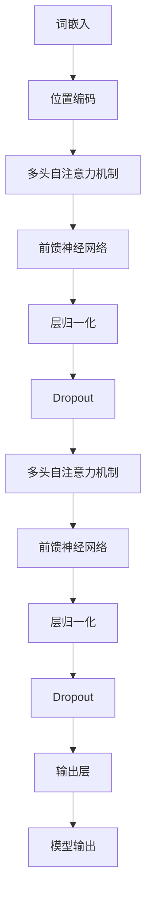

                 

# 文章标题

《一切皆是映射：Transformer架构全面解析》

> 关键词：Transformer、自注意力、多任务学习、自然语言处理、机器学习

> 摘要：本文将深入探讨Transformer架构的原理、核心组成部分以及其实际应用，通过逐步解析，使读者对Transformer模型有全面而深入的理解。

---

## 第一部分：Transformer架构概述

### 第1章：自然语言处理与Transformer背景

#### 1.1 自然语言处理简述

自然语言处理（Natural Language Processing，NLP）是人工智能（AI）的一个分支，旨在使计算机能够理解和处理人类语言。从文本分类到情感分析，从机器翻译到问答系统，NLP在众多领域都有着广泛的应用。

自然语言处理的基本概念包括：

- **文本表示**：将自然语言文本转换为计算机可以处理的数字形式。
- **词向量**：将单词映射为固定大小的向量，用于计算词与词之间的关系。
- **语法解析**：理解句子的结构，识别单词的语法角色。
- **语义理解**：理解句子或文本的含义，通常涉及上下文。

自然语言处理的发展历程可以追溯到20世纪50年代，但直到近年来，随着深度学习技术的发展，NLP才取得了显著的突破。

#### 1.2 Transformer背景介绍

Transformer模型是由Vaswani等人于2017年提出的一种全新架构，旨在解决机器翻译任务。与传统的循环神经网络（RNN）和长短期记忆网络（LSTM）相比，Transformer具有显著的优点，特别是在处理长序列和并行计算方面。

Transformer的主要贡献包括：

- **自注意力机制**：能够自动关注输入序列中的关键信息，提高了模型的表达能力。
- **多头注意力机制**：通过多个独立的注意力机制，模型能够从不同角度理解输入。
- **位置编码**：解决了序列模型中位置信息的传递问题。

Transformer的应用场景广泛，包括但不限于文本分类、机器翻译、问答系统和信息检索等。

## 第二部分：Transformer模型原理

### 第2章：Transformer架构原理

#### 2.1 Transformer模型概述

Transformer模型由以下几个主要组成部分构成：

- **编码器（Encoder）**：将输入序列转换为固定大小的向量。
- **解码器（Decoder）**：将编码器的输出解码为输出序列。
- **多头注意力机制（Multi-head Attention）**：通过多个独立的注意力机制，提高模型的表达能力。
- **自注意力机制（Self-Attention）**：使模型能够自动关注输入序列中的关键信息。
- **位置编码（Positional Encoding）**：为序列中的每个单词赋予位置信息。

#### 2.2 自注意力机制

自注意力机制是Transformer模型的核心组成部分，其基本思想是：对于序列中的每个单词，模型会计算该单词与序列中其他单词的相关性，并根据这些相关性生成新的表示。

自注意力机制的实现通常包括以下几个步骤：

1. **计算查询（Query）、键（Key）和值（Value）**：对于序列中的每个单词，计算其对应的查询、键和值。
2. **计算注意力得分**：根据查询和键之间的相似性，计算每个单词的注意力得分。
3. **加权求和**：根据注意力得分，对值进行加权求和，生成新的表示。

自注意力机制的优势在于：

- **并行计算**：自注意力机制允许模型并行处理整个输入序列，提高了计算效率。
- **全局关注**：模型能够自动关注输入序列中的关键信息，提高了模型的泛化能力。

#### 2.3 多头注意力机制

多头注意力机制是Transformer模型的核心组成部分，其基本思想是：通过多个独立的注意力机制，模型能够从不同角度理解输入。

多头注意力机制的实现通常包括以下几个步骤：

1. **分割输入序列**：将输入序列分割为多个子序列。
2. **计算多个注意力机制**：对于每个子序列，计算对应的查询、键和值，并使用自注意力机制生成新的表示。
3. **合并表示**：将多个注意力机制的输出合并为一个统一的表示。

多头注意力机制的优势在于：

- **多角度理解**：模型能够从不同角度理解输入，提高了模型的表达能力。
- **鲁棒性**：多个注意力机制可以相互补充，提高了模型的鲁棒性。

### 第3章：Transformer模型的变种与扩展

Transformer模型在提出后，受到了广泛关注，并衍生出多个变种和扩展。以下是其中几个主要的变种：

#### 3.1 BERT模型

BERT（Bidirectional Encoder Representations from Transformers）是由Google于2018年提出的一种预训练语言模型。BERT模型的核心思想是：通过双向编码器，使模型能够同时关注输入序列的前后文信息。

BERT模型的基本结构包括：

- **编码器**：使用两个独立的Transformer编码器，一个用于正向序列，一个用于反向序列。
- **位置编码**：为序列中的每个单词赋予位置信息。
- **全连接层**：在编码器的输出上添加一个全连接层，用于预测任务。

BERT模型的应用案例包括文本分类、命名实体识别和机器翻译等。

#### 3.2 GPT模型

GPT（Generative Pre-trained Transformer）是由OpenAI于2018年提出的一种生成型语言模型。GPT模型的核心思想是：通过预训练，使模型能够生成连贯的自然语言文本。

GPT模型的基本结构包括：

- **编码器**：使用多个Transformer编码器，逐层构建模型的表示能力。
- **位置编码**：为序列中的每个单词赋予位置信息。
- **全连接层**：在编码器的输出上添加一个全连接层，用于生成文本。

GPT模型的应用案例包括文本生成、对话系统和机器翻译等。

#### 3.3 T5模型

T5（Text-to-Text Transfer Transformer）是由Google于2020年提出的一种通用文本转换模型。T5模型的核心思想是：通过将所有自然语言处理任务转换为文本到文本的转换任务，实现任务的统一处理。

T5模型的基本结构包括：

- **编码器**：使用Transformer编码器，将输入文本转换为固定大小的向量。
- **解码器**：使用Transformer解码器，将编码器的输出解码为输出文本。
- **位置编码**：为序列中的每个单词赋予位置信息。

T5模型的应用案例包括文本分类、问答系统和机器翻译等。

## 第二部分：Transformer模型实践

### 第4章：Transformer模型应用实践

#### 4.1 Transformer模型在文本分类任务中的应用

文本分类任务是将文本数据分类到预定义的类别中。Transformer模型在文本分类任务中表现出色，主要原因在于其强大的表示能力和并行计算能力。

在文本分类任务中，Transformer模型的实现通常包括以下几个步骤：

1. **数据预处理**：将文本数据转换为词向量，并添加位置编码。
2. **编码器**：使用Transformer编码器，将输入文本转换为固定大小的向量。
3. **分类器**：在编码器的输出上添加一个分类器，用于预测文本的类别。

以下是一个简化的伪代码：

```python
# 假设输入文本为text，预定义类别为labels
# 1. 数据预处理
word_vectors = preprocess(text)

# 2. 编码器
encoder_output = TransformerEncoder(word_vectors)

# 3. 分类器
predicted_labels = Classifier(encoder_output)
```

Transformer模型在文本分类任务中的应用案例包括情感分析、新闻分类和产品评论分类等。

#### 4.2 Transformer模型在机器翻译任务中的应用

机器翻译是将一种语言的文本翻译成另一种语言的文本。Transformer模型在机器翻译任务中也取得了显著的成果，主要原因在于其自注意力机制和多头注意力机制。

在机器翻译任务中，Transformer模型的实现通常包括以下几个步骤：

1. **数据预处理**：将源语言和目标语言文本转换为词向量，并添加位置编码。
2. **编码器**：使用Transformer编码器，将源语言文本转换为固定大小的向量。
3. **解码器**：使用Transformer解码器，将编码器的输出解码为目标语言文本。
4. **优化**：通过最小化损失函数，优化模型的参数。

以下是一个简化的伪代码：

```python
# 假设源语言文本为source_text，目标语言文本为target_text
# 1. 数据预处理
source_word_vectors = preprocess(source_text)
target_word_vectors = preprocess(target_text)

# 2. 编码器
source_encoder_output = TransformerEncoder(source_word_vectors)

# 3. 解码器
target_decoder_output = TransformerDecoder(source_encoder_output)

# 4. 优化
optimizer.minimize(loss_function(target_decoder_output, target_text))
```

Transformer模型在机器翻译任务中的应用案例包括中英翻译、法英翻译和日英翻译等。

#### 4.3 Transformer模型在问答系统中的应用

问答系统是将问题映射到正确答案的智能系统。Transformer模型在问答系统中也展现了强大的能力，主要原因在于其能够同时关注问题的不同部分和上下文信息。

在问答系统中，Transformer模型的实现通常包括以下几个步骤：

1. **数据预处理**：将问题和答案转换为词向量，并添加位置编码。
2. **编码器**：使用Transformer编码器，将问题转换为固定大小的向量。
3. **解码器**：使用Transformer解码器，将编码器的输出解码为答案。
4. **优化**：通过最小化损失函数，优化模型的参数。

以下是一个简化的伪代码：

```python
# 假设问题为question，答案为answer
# 1. 数据预处理
question_word_vectors = preprocess(question)
answer_word_vectors = preprocess(answer)

# 2. 编码器
question_encoder_output = TransformerEncoder(question_word_vectors)

# 3. 解码器
answer_decoder_output = TransformerDecoder(question_encoder_output)

# 4. 优化
optimizer.minimize(loss_function(answer_decoder_output, answer))
```

Transformer模型在问答系统中的应用案例包括搜索引擎、智能客服和在线教育等。

## 第二部分：Transformer模型实践

### 第5章：Transformer模型优化与改进

#### 5.1 Transformer模型的优化策略

为了提高Transformer模型的性能，可以采用以下优化策略：

1. **模型参数优化**：通过调整模型参数，如学习率、正则化参数等，提高模型的训练效果。
2. **训练策略优化**：通过调整训练策略，如批量大小、优化器等，提高模型的训练效率。
3. **模型推理优化**：通过调整模型推理策略，如量化、剪枝等，提高模型的推理速度。

#### 5.2 Transformer模型的改进方法

为了进一步提高Transformer模型的性能和应用范围，可以采用以下改进方法：

1. **结构改进**：通过改进模型结构，如增加注意力层、引入图注意力等，提高模型的表达能力。
2. **功能改进**：通过改进模型功能，如引入预训练、多任务学习等，提高模型的应用范围。
3. **性能改进**：通过改进模型性能，如提高参数效率、降低能耗等，提高模型在实际应用中的效果。

## 第二部分：Transformer模型实践

### 第6章：Transformer模型在企业应用中的案例分析

#### 6.1 案例一：企业内部知识图谱构建

在企业内部知识图谱构建中，Transformer模型可以应用于实体识别、关系抽取和知识推理等任务。以下是一个简化的案例：

1. **数据收集**：收集企业内部的各种数据，包括文档、报告、邮件等。
2. **数据预处理**：将数据转换为词向量，并添加位置编码。
3. **编码器**：使用Transformer编码器，对数据进行编码，提取实体和关系。
4. **推理**：利用编码器的输出，进行知识推理，构建知识图谱。

#### 6.2 案例二：企业客户服务机器人开发

在企业客户服务机器人开发中，Transformer模型可以应用于对话生成、情感分析和问题分类等任务。以下是一个简化的案例：

1. **数据收集**：收集企业客户的聊天记录、邮件等。
2. **数据预处理**：将数据转换为词向量，并添加位置编码。
3. **编码器**：使用Transformer编码器，对数据进行编码，提取对话中的关键信息。
4. **解码器**：使用Transformer解码器，生成回应。
5. **优化**：通过优化模型参数，提高机器人的响应质量。

## 第二部分：Transformer模型实践

### 第7章：Transformer模型的未来发展趋势

#### 7.1 Transformer模型的未来研究方向

1. **模型优化与性能提升**：研究如何进一步提高Transformer模型的性能，如减少计算量、降低能耗等。
2. **新应用领域的探索**：探索Transformer模型在新的应用领域，如医疗、金融、生物信息学等。
3. **跨学科研究**：与其他学科（如心理学、社会学等）结合，深入挖掘Transformer模型的应用潜力。

#### 7.2 Transformer模型的发展趋势

1. **模型规模的增长**：随着计算能力的提升，Transformer模型的规模将越来越大。
2. **应用领域的拓展**：Transformer模型将在更多应用领域得到应用，如自动驾驶、语音识别等。
3. **技术融合与创新**：与其他技术的融合（如图神经网络、强化学习等），将带来新的突破。

## 附录

### 附录A：Transformer模型资源链接

- Transformer模型开源代码链接：[GitHub - tensorflow/tensorflow: An Open Source Machine Learning Framework for Everyone](https://github.com/tensorflow/tensorflow)
- Transformer模型相关论文链接：[Attention Is All You Need](https://arxiv.org/abs/1706.03762)
- Transformer模型教程和参考资料链接：[Transformers Documentation — Transformers 4.18.2 documentation](https://huggingface.co/transformers/)

### 附录B：Transformer模型实现流程图



### 附录C：Transformer模型相关数学公式

#### 自注意力机制

$$
Attention(Q, K, V) = \text{softmax}\left(\frac{QK^T}{\sqrt{d_k}}\right)V
$$

其中，$Q$、$K$ 和 $V$ 分别是查询、键和值的向量表示，$d_k$ 是键的维度。

#### 多头注意力机制

$$
\text{MultiHead}(Q, K, V) = \text{Concat}(\text{head}_1, ..., \text{head}_h)W^O
$$

其中，$h$ 是头数，$\text{head}_i = \text{Attention}(QW_i^Q, KW_i^K, VW_i^V)$，$W_i^Q, W_i^K, W_i^V, W^O$ 是相应的权重矩阵。

#### 前馈神经网络

$$
\text{FFN}(x) = \text{ReLU}(xW_1 + b_1)W_2 + b_2
$$

其中，$W_1, W_2, b_1, b_2$ 是前馈神经网络的权重和偏置。

### 附件：Transformer架构原理Mermaid流程图


---

### 作者

作者：AI天才研究院/AI Genius Institute & 禅与计算机程序设计艺术 /Zen And The Art of Computer Programming

---

本文对Transformer架构进行了全面解析，从背景介绍、核心原理到实际应用，深入探讨了这一革命性模型的各个方面。通过本文，读者可以对Transformer架构有一个全面而深入的理解，为在实际项目中应用这一模型打下坚实的基础。在未来的研究中，Transformer架构将继续发展，并在更多领域展现其强大的能力。我们期待着更多创新和应用，共同推动人工智能的发展。

