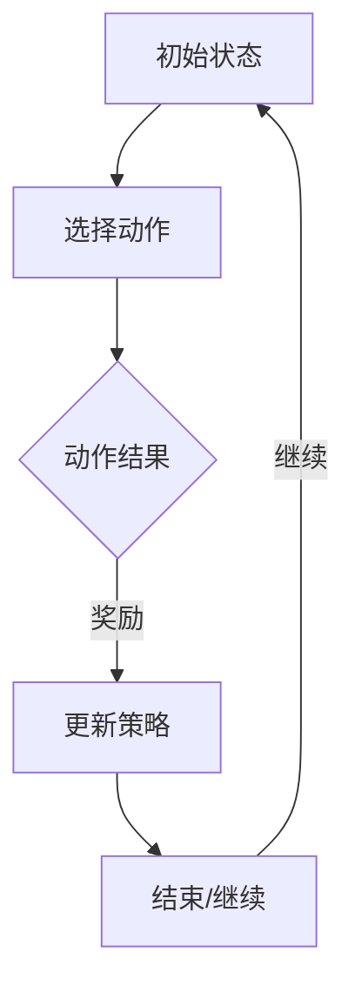
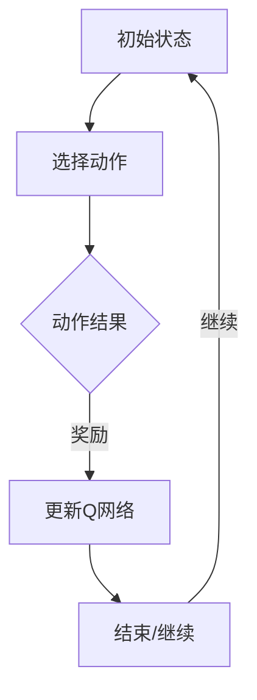
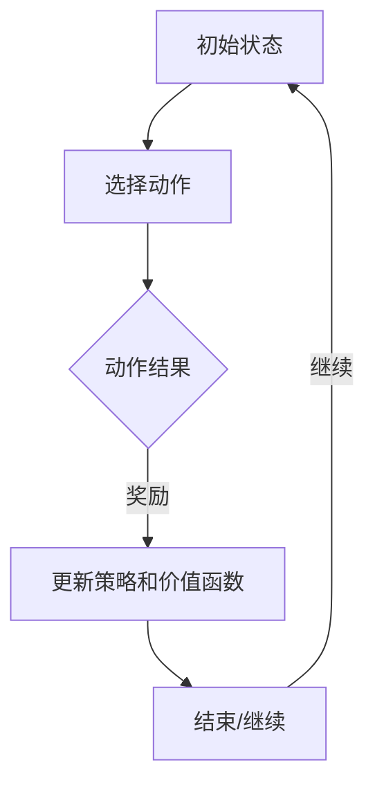

                 

# 一切皆是映射：强化学习的基础概念与核心算法

## 关键词

强化学习，映射，状态-动作值函数，策略梯度，深度强化学习，模型预测控制，游戏AI，自动驾驶，机器人控制。

## 摘要

本文旨在深入探讨强化学习的基础概念与核心算法，并通过一步一步的推理分析，揭示强化学习中的映射概念。强化学习作为一种重要的机器学习方法，其核心在于通过与环境交互来学习最佳策略。本文首先介绍强化学习的基本概念和发展历史，然后详细解析强化学习中的符号表示和数学模型，接着重点介绍强化学习的核心算法，包括蒙特卡洛方法、时序差分算法、Q-Learning算法和策略梯度算法。随后，本文讨论强化学习在实际项目中的应用与改进，如模型预测控制、基于模型的学习、actor-critic算法和深度强化学习。最后，本文探讨映射在强化学习中的重要性，以及映射与深度学习结合的前景与挑战。

## 目录大纲

### 第一部分：强化学习基础

### 第1章：强化学习的概念与历史

#### 1.1 强化学习的基本概念

强化学习是一种通过不断与环境交互，并从中学习最佳行为策略的机器学习方法。它主要由四个核心元素组成：状态（State）、动作（Action）、奖励（Reward）和策略（Policy）。在强化学习过程中，智能体（Agent）根据当前状态选择动作，然后根据动作的结果（即状态转移和奖励）来更新其策略。

强化学习与监督学习和无监督学习有所不同。监督学习依赖于预先标注的数据集，而强化学习则通过与环境的互动来获取反馈，从而不断优化其策略。无监督学习则是通过未标注的数据来学习模式，而强化学习更注重在动态环境中实现目标。

#### 1.2 强化学习的发展历史

强化学习起源于20世纪50年代，由Richard Sutton和Andrew Barto在其经典著作《强化学习：一种引入行为的动机问题解决方法》（Reinforcement Learning: An Introduction）中奠定了理论基础。此后，强化学习经历了多个发展阶段，从最初的确定性策略到随机策略，再到现在的深度强化学习，应用领域也越来越广泛。

强化学习的重要里程碑事件包括：1952年Arthur Samuel的西洋跳棋程序，1992年Richard Sutton和Andrew Barto的《强化学习：一种引入行为的动机问题解决方法》，以及2015年DeepMind的AlphaGo击败围棋世界冠军李世石。这些事件标志着强化学习在理论和实践上的重大突破。

#### 1.3 强化学习在不同领域的应用

强化学习在多个领域得到了广泛应用，以下是其中几个主要领域：

- **游戏AI**：强化学习在游戏AI中有着广泛的应用，如电子游戏、棋类游戏、体育模拟等。通过学习最佳策略，智能体可以在游戏中取得卓越的表现。

- **自主导航**：强化学习在自动驾驶领域有着重要的应用，通过学习最佳驾驶策略，自动驾驶车辆可以在复杂的道路环境中安全行驶。

- **能源管理**：强化学习在能源管理中用于优化电力系统的调度和控制，提高能源利用效率和降低成本。

- **机器人控制**：强化学习在机器人控制中用于实现自主导航、物体抓取和任务规划等。

### 第2章：强化学习的基础理论

#### 2.1 强化学习中的符号表示

在强化学习中，我们使用一些特定的符号来表示不同的概念：

- **状态（State）**：智能体当前所处的环境状态。
- **动作（Action）**：智能体在特定状态下可以采取的动作。
- **奖励（Reward）**：智能体采取动作后从环境中获得的即时反馈。
- **策略（Policy）**：智能体根据当前状态选择动作的规则。
- **值函数（Value Function）**：衡量智能体在特定状态下采取特定动作所能获得的长期奖励。
- **状态-动作值函数（Q-Function）**：衡量智能体在特定状态下采取特定动作所能获得的长期奖励。
- **策略值函数（Policy Value Function）**：衡量策略在特定状态下所能获得的长期奖励。

#### 2.2 强化学习的数学模型

强化学习的数学模型描述了智能体与环境之间的交互过程。其基本模型由以下几部分组成：

- **状态转移概率（State Transition Probability）**：给定当前状态和动作，智能体转移到下一状态的概率。
- **奖励函数（Reward Function）**：给定当前状态和动作，智能体获得的即时奖励。
- **策略（Policy）**：智能体根据当前状态选择动作的规则。

强化学习的目标是通过与环境交互，学习到最佳策略，使得智能体能够在长期内获得最大的总奖励。

### 第3章：强化学习的核心算法

强化学习的核心算法包括蒙特卡洛方法、时序差分算法、Q-Learning算法和策略梯度算法。这些算法通过不同的方式来优化智能体的策略，以达到最佳表现。

#### 3.1 蒙特卡洛算法

蒙特卡洛算法是一种基于随机采样的强化学习算法。它通过在环境中进行随机探索，积累经验，并利用这些经验来更新智能体的策略。蒙特卡洛算法的核心思想是通过估计策略的期望回报来优化策略。

蒙特卡洛算法的伪代码如下：

```python
初始化 Q(s, a) 为随机值
while 未达到目标
    选择动作 a_s 从策略 π(s)
    执行动作 a_s，观察状态 s' 和奖励 r
    更新 Q(s, a) = Q(s, a) + α [r + γ max(Q(s', a')) - Q(s, a)]
```

#### 3.2 时序差分算法

时序差分算法是一种基于状态-动作值函数的强化学习算法。它通过估计状态-动作值函数的期望回报来优化策略。时序差分算法的核心思想是利用当前经验值与先前的经验值之间的差异来更新状态-动作值函数。

时序差分算法包括SARSa算法和Q-Learning算法。SARSa算法的伪代码如下：

```python
初始化 Q(s, a) 为随机值
while 未达到目标
    选择动作 a_s 从策略 π(s)
    执行动作 a_s，观察状态 s' 和奖励 r
    s, a, r, s' = s', a_s, r, s
    Q(s, a) = Q(s, a) + α [r + γ max(Q(s', a')) - Q(s, a)]
```

Q-Learning算法是SARSa算法的一种特殊情况，其伪代码如下：

```python
初始化 Q(s, a) 为随机值
while 未达到目标
    选择动作 a_s 从策略 π(s)
    执行动作 a_s，观察状态 s' 和奖励 r
    s, a, r, s' = s', a_s, r, s
    Q(s, a) = Q(s, a) + α [r + γ max(Q(s', a')) - Q(s, a)]
```

#### 3.3 Q-Learning算法

Q-Learning算法是一种基于状态-动作值函数的强化学习算法。它通过迭代更新状态-动作值函数来优化智能体的策略。Q-Learning算法的核心思想是通过比较实际奖励与预期奖励的差异来更新状态-动作值函数。

Q-Learning算法的伪代码如下：

```python
初始化 Q(s, a) 为随机值
while 未达到目标
    选择动作 a_s 从策略 π(s)
    执行动作 a_s，观察状态 s' 和奖励 r
    s, a, r, s' = s', a_s, r, s
    Q(s, a) = Q(s, a) + α [r + γ max(Q(s', a')) - Q(s, a)]
```

#### 3.4 策略梯度算法

策略梯度算法是一种基于策略值函数的强化学习算法。它通过估计策略值函数的梯度来更新策略。策略梯度算法的核心思想是通过优化策略值函数来优化策略。

策略梯度算法包括REINFORCE算法和策略梯度（Policy Gradient）算法。REINFORCE算法的伪代码如下：

```python
初始化策略π(s)为随机策略
while 未达到目标
    执行动作a_s = π(s)
    观察状态s'和奖励r
    s, a, r, s' = s', a_s, r, s
    π(s) = π(s) + α [r - V(π(s))]
```

策略梯度算法的伪代码如下：

```python
初始化策略π(s)为随机策略
while 未达到目标
    执行动作a_s = π(s)
    观察状态s'和奖励r
    s, a, r, s' = s', a_s, r, s
    π(s) = π(s) + α [r - V(π(s))]
```

### 第4章：强化学习算法的应用与改进

#### 4.1 模型预测控制（MPC）

模型预测控制（Model Predictive Control，MPC）是一种基于模型的控制方法，它在强化学习中有广泛的应用。MPC通过建立系统的数学模型，预测未来状态并选择最佳动作，从而实现控制目标。

MPC在强化学习中的应用包括：

- **游戏AI**：MPC可以用于游戏AI中的实时决策，通过预测游戏状态的变化来选择最佳动作。
- **自动驾驶**：MPC可以用于自动驾驶中的路径规划和控制，通过预测车辆的未来状态来选择最佳驾驶策略。
- **机器人控制**：MPC可以用于机器人控制中的运动规划和控制，通过预测机器人的未来状态来选择最佳动作。

#### 4.2 基于模型的学习

基于模型的学习（Model-Based Learning）是一种强化学习算法，它在学习过程中使用系统模型来预测状态转移和奖励。基于模型的学习可以减少探索次数，提高学习效率。

基于模型的学习算法包括：

- **模型预测控制（MPC）**：MPC通过建立系统模型，预测未来状态并选择最佳动作。
- **策略迭代（Policy Iteration）**：策略迭代通过迭代更新策略值函数来优化策略。
- **Q值迭代（Q-Iteration）**：Q值迭代通过迭代更新状态-动作值函数来优化策略。

#### 4.3 actor-critic算法

actor-critic算法是一种强化学习算法，它结合了策略优化和值函数评估。actor-critic算法中的actor负责更新策略，而critic负责评估策略的优劣。

actor-critic算法包括：

- **A2C算法（Asynchronous Advantage Actor-Critic）**：A2C算法是一种异步actor-critic算法，它通过并行更新策略和价值函数来优化策略。
- **PPO算法（Proximal Policy Optimization）**：PPO算法是一种基于actor-critic的方法，它通过优化策略梯度来优化策略。

#### 4.4 深度强化学习

深度强化学习（Deep Reinforcement Learning，DRL）是一种结合深度学习与强化学习的算法。它通过使用深度神经网络来表示状态和动作，从而提高强化学习算法的学习效率和表现。

深度强化学习算法包括：

- **深度Q网络（DQN）**：DQN使用深度神经网络来估计Q值，从而优化策略。
- **深度确定性策略梯度（DDPG）**：DDPG使用深度神经网络来表示策略和价值函数，从而优化策略。
- **深度策略梯度（Deep Policy Gradient）**：Deep Policy Gradient使用深度神经网络来表示策略和价值函数，从而优化策略。

### 第5章：强化学习在实际项目中的应用

#### 5.1 强化学习在游戏AI中的应用

强化学习在游戏AI中有着广泛的应用，通过学习最佳策略，智能体可以在各种游戏中取得卓越的表现。以下是强化学习在游戏AI中的应用实例：

- **电子游戏**：强化学习可以用于电子游戏的自动玩家，如Atari游戏的自动玩家。
- **棋类游戏**：强化学习可以用于棋类游戏的自动玩家，如围棋、国际象棋等。
- **体育模拟**：强化学习可以用于体育模拟游戏，如足球、篮球等。

#### 5.2 强化学习在自动驾驶中的应用

强化学习在自动驾驶领域有着重要的应用，通过学习最佳驾驶策略，自动驾驶车辆可以在复杂的道路环境中安全行驶。以下是强化学习在自动驾驶中的应用实例：

- **路径规划**：强化学习可以用于自动驾驶车辆的路径规划，通过学习最佳路径选择策略。
- **控制策略**：强化学习可以用于自动驾驶车辆的控制策略，通过学习最佳驾驶操作策略。
- **障碍物检测**：强化学习可以用于自动驾驶车辆的障碍物检测，通过学习最佳检测策略。

#### 5.3 强化学习在机器人控制中的应用

强化学习在机器人控制中有着广泛的应用，通过学习最佳控制策略，机器人可以实现自主导航、物体抓取和任务规划。以下是强化学习在机器人控制中的应用实例：

- **自主导航**：强化学习可以用于机器人的自主导航，通过学习最佳路径选择策略。
- **物体抓取**：强化学习可以用于机器人的物体抓取，通过学习最佳抓取策略。
- **任务规划**：强化学习可以用于机器人的任务规划，通过学习最佳任务执行策略。

### 第二部分：强化学习中的映射概念

#### 第6章：映射概念与强化学习

#### 6.1 映射的概念

映射（Mapping）是指将一个集合中的元素映射到另一个集合中的元素的过程。在强化学习中，映射是指将状态和动作映射到奖励和策略的过程。这种映射使得智能体能够在不同的状态和动作之间进行有效的决策。

#### 6.2 强化学习中的映射

在强化学习中，映射可以分为以下几种：

- **状态映射**：将状态映射到动作空间，以便智能体能够根据当前状态选择最佳动作。
- **动作映射**：将动作映射到奖励空间，以便智能体能够根据动作结果获得即时奖励。
- **奖励映射**：将奖励映射到策略空间，以便智能体能够根据奖励更新策略。

这些映射使得强化学习算法能够在动态环境中进行有效的决策和优化。

#### 第7章：映射在强化学习算法中的应用

#### 7.1 基于映射的强化学习算法

基于映射的强化学习算法通过将状态、动作和奖励映射到策略空间，从而实现有效的决策和优化。以下是几种基于映射的强化学习算法：

- **状态-动作映射**：将状态和动作映射到策略空间，以便智能体能够根据当前状态和动作选择最佳策略。
- **奖励映射**：将奖励映射到策略空间，以便智能体能够根据奖励更新策略。
- **策略映射**：将策略映射到状态-动作值函数空间，以便智能体能够根据策略评估状态-动作值函数。

这些算法通过映射的概念，实现了在复杂动态环境中的高效决策和优化。

#### 7.2 映射算法的优化

映射算法的优化是强化学习中的一个重要问题。优化的目标是提高映射的精度和效率，从而提高智能体的表现。以下是几种映射算法的优化方法：

- **优化状态映射**：通过使用更先进的特征提取技术，提高状态映射的精度和效率。
- **优化动作映射**：通过使用更加鲁棒的奖励函数，提高动作映射的精度和效率。
- **优化奖励映射**：通过使用更加合理的奖励机制，提高奖励映射的精度和效率。
- **优化策略映射**：通过使用更加先进的策略优化方法，提高策略映射的精度和效率。

#### 7.3 映射算法的应用案例

映射算法在多个领域有着广泛的应用。以下是几个映射算法的应用案例：

- **游戏AI**：映射算法可以用于游戏AI中的动作选择和策略优化，从而提高智能体在游戏中的表现。
- **自动驾驶**：映射算法可以用于自动驾驶中的路径规划和控制策略优化，从而提高自动驾驶车辆的安全性和稳定性。
- **机器人控制**：映射算法可以用于机器人控制中的自主导航和任务规划，从而提高机器人的工作效率和灵活性。

#### 第8章：映射与深度学习结合

#### 8.1 深度学习与映射

深度学习（Deep Learning）是一种基于多层神经网络的机器学习方法。深度学习在映射中的应用主要体现在以下几个方面：

- **状态映射**：通过使用深度神经网络，可以将高维状态空间映射到低维特征空间，从而提高状态映射的精度和效率。
- **动作映射**：通过使用深度神经网络，可以将高维动作空间映射到低维特征空间，从而提高动作映射的精度和效率。
- **奖励映射**：通过使用深度神经网络，可以将高维奖励空间映射到低维特征空间，从而提高奖励映射的精度和效率。
- **策略映射**：通过使用深度神经网络，可以将高维策略空间映射到低维特征空间，从而提高策略映射的精度和效率。

#### 8.2 深度强化学习

深度强化学习（Deep Reinforcement Learning，DRL）是一种结合深度学习和强化学习的算法。深度强化学习通过使用深度神经网络来表示状态、动作和奖励，从而提高了强化学习算法的学习效率和表现。以下是几种深度强化学习算法：

- **深度Q网络（DQN）**：DQN使用深度神经网络来估计Q值，从而优化策略。
- **深度确定性策略梯度（DDPG）**：DDPG使用深度神经网络来表示策略和价值函数，从而优化策略。
- **深度策略梯度（Deep Policy Gradient）**：Deep Policy Gradient使用深度神经网络来表示策略和价值函数，从而优化策略。

这些算法通过深度学习与映射的结合，实现了在复杂动态环境中的高效决策和优化。

#### 第9章：映射在强化学习中的未来展望

#### 9.1 映射在强化学习中的应用前景

映射在强化学习中的应用前景非常广阔。随着深度学习和强化学习的不断发展，映射算法在以下几个方面具有巨大的应用潜力：

- **游戏AI**：映射算法可以用于游戏AI中的动作选择和策略优化，从而提高智能体在游戏中的表现。
- **自动驾驶**：映射算法可以用于自动驾驶中的路径规划和控制策略优化，从而提高自动驾驶车辆的安全性和稳定性。
- **机器人控制**：映射算法可以用于机器人控制中的自主导航和任务规划，从而提高机器人的工作效率和灵活性。
- **智能推荐系统**：映射算法可以用于智能推荐系统中的用户行为预测和推荐策略优化，从而提高系统的推荐效果。

#### 9.2 映射在强化学习中的挑战与机遇

尽管映射在强化学习中有许多应用前景，但同时也面临着一些挑战和机遇：

- **计算资源需求**：映射算法通常需要大量的计算资源，特别是在处理高维状态和动作空间时。因此，如何优化计算资源的利用是一个重要的挑战。
- **算法稳定性**：映射算法的稳定性和可解释性是强化学习中的一个重要问题。如何提高算法的稳定性和可解释性是未来的一个重要研究方向。
- **数据需求**：映射算法通常需要大量的数据来训练模型。如何在数据稀缺的情况下训练出有效的映射模型是一个重要的挑战。

尽管存在这些挑战，但映射在强化学习中的机遇也同样巨大。随着深度学习和强化学习的不断发展，映射算法将有望在更多的应用领域中发挥重要作用，推动人工智能技术的进步。

## 附录

### 附录A：强化学习算法流程图

以下是几种常见的强化学习算法的流程图：

#### Q-Learning算法流程图



#### REINFORCE算法流程图


#### DQN算法流程图



#### DDPG算法流程图



### 附录B：强化学习伪代码示例

以下是几种常见的强化学习算法的伪代码：

#### Q-Learning伪代码

```python
# 初始化 Q(s, a) 为随机值
while 未达到目标
    # 选择动作 a_s 从策略 π(s)
    a_s = π(s)
    # 执行动作 a_s，观察状态 s' 和奖励 r
    s', r = 环境执行(a_s)
    # 更新 Q(s, a)
    Q(s, a) = Q(s, a) + α [r + γ max(Q(s', a')) - Q(s, a)]
```

#### REINFORCE伪代码

```python
# 初始化策略π(s)为随机策略
while 未达到目标
    # 执行动作a_s = π(s)
    a_s = π(s)
    # 观察状态s'和奖励r
    s', r = 环境执行(a_s)
    # 更新策略π(s)
    π(s) = π(s) + α [r - V(π(s))]
```

#### DQN伪代码

```python
# 初始化 Q(s, a) 为随机值
# 初始化目标Q网络
while 未达到目标
    # 选择动作 a_s 从策略 π(s)
    a_s = π(s)
    # 执行动作 a_s，观察状态 s' 和奖励 r
    s', r = 环境执行(a_s)
    # 更新目标Q网络
    目标Q网络(s', a') = r + γ max(Q(s', a'))
    # 更新Q网络
    Q网络(s, a) = Q网络(s, a) + α [目标Q网络(s', a') - Q网络(s, a)]
```

#### DDPG伪代码

```python
# 初始化 actor网络 和 critic网络
# 初始化目标actor网络 和 目标critic网络
while 未达到目标
    # 选择动作 a_s 从策略 π(s)
    a_s = π(s)
    # 执行动作 a_s，观察状态 s' 和奖励 r
    s', r = 环境执行(a_s)
    # 更新目标actor网络 和 目标critic网络
    目标actor网络(s') = π(s')
    目标critic网络(s', a') = r + γ 目标actor网络(s', a')
    # 更新actor网络 和 critic网络
    actor网络(s) = π(s)
    critic网络(s, a) = r + γ 目标actor网络(s', a')
    # 更新网络
    actor网络(s) = actor网络(s) + α [目标actor网络(s') - actor网络(s)]
    critic网络(s, a) = critic网络(s, a) + α [目标critic网络(s', a') - critic网络(s, a)]
```

作者：AI天才研究院/AI Genius Institute & 禅与计算机程序设计艺术 /Zen And The Art of Computer Programming

