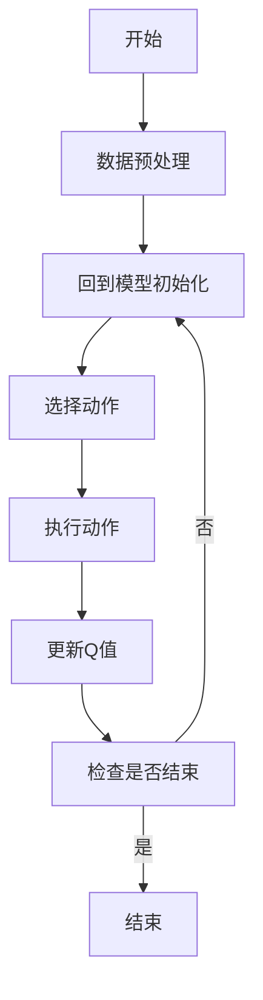

                 

# 一切皆是映射：情境感知与DQN：环境交互的重要性

> 关键词：情境感知、深度Q网络（DQN）、环境交互、人工智能、自动驾驶、游戏AI、机器人导航

> 摘要：本文旨在探讨情境感知与深度Q网络（DQN）在人工智能环境交互中的重要性。首先介绍了情境感知的基本概念和核心技术，以及DQN算法的基本原理。然后，详细分析了情境感知与DQN的融合方法，以及环境交互在DQN算法中的作用和影响。最后，通过具体的应用场景，展示了情境感知与DQN在自动驾驶、游戏AI和机器人导航等领域的重要作用，并提出了未来的研究方向和挑战。

## 第1章 引言与背景

### 1.1 书籍主题介绍

人工智能作为当今科技领域的热门话题，已经深入到我们生活的方方面面。而情境感知（Situation Awareness，简称SA）作为人工智能的重要分支，旨在使机器能够理解和解释人类所处的环境，从而做出合理的决策。深度Q网络（Deep Q-Network，简称DQN）则是一种基于深度学习的强化学习算法，被广泛应用于游戏、自动驾驶、机器人导航等领域。

本文将围绕情境感知与DQN的关系展开讨论，主要研究环境交互在人工智能中的应用。环境交互是指人工智能系统与其所处环境之间的信息交换和相互作用。通过有效的环境交互，人工智能系统可以更好地理解环境，提高学习效率和决策质量。

### 1.2 情境感知与DQN的基本概念

**情境感知**：情境感知是指个体对周围环境的感知和理解，包括对环境的变化、事件的发生、潜在威胁的识别等。在人工智能领域，情境感知旨在使机器能够模拟人类对环境的感知，从而实现对环境的理解和预测。

**深度Q网络（DQN）**：DQN是一种基于深度学习的强化学习算法，通过神经网络来近似Q值函数，实现对环境的自适应学习。DQN的核心思想是利用经验回放（Experience Replay）和目标网络（Target Network）来缓解数据样本的相关性和避免策略偏差。

### 1.3 环境交互的重要性

环境交互在人工智能系统中具有至关重要的作用。通过环境交互，人工智能系统能够获取外部环境的信息，了解环境的变化，并根据环境反馈调整自己的行为。具体来说，环境交互的重要性体现在以下几个方面：

1. **信息获取**：环境交互使人工智能系统能够获取环境中的各种信息，包括视觉、听觉、触觉等，从而提高对环境的理解和感知能力。

2. **决策优化**：基于环境反馈的决策优化是人工智能系统实现智能化的关键。通过环境交互，系统能够根据环境变化调整策略，提高决策质量和效率。

3. **鲁棒性提升**：环境交互有助于提高人工智能系统的鲁棒性，使其能够适应不同的环境和情况，降低对特定环境的依赖。

4. **学习效率**：有效的环境交互可以加速人工智能系统的学习过程，提高学习效率。

### 1.4 书籍结构概述

本文将分为七个章节，具体结构如下：

1. **第1章 引言与背景**：介绍本文的主题和背景，阐述情境感知与DQN的重要性。

2. **第2章 情境感知基础**：介绍情境感知的基本概念、核心技术及应用场景。

3. **第3章 DQN算法原理**：详细讲解DQN算法的基本原理、算法流程和改进方法。

4. **第4章 情境感知与DQN结合**：分析情境感知与DQN的结合方法，探讨两者融合的优势。

5. **第5章 环境交互的重要性**：阐述环境交互的基本概念、模型构建和DQN算法的影响。

6. **第6章 情境感知与DQN的应用场景**：分析情境感知与DQN在自动驾驶、游戏AI和机器人导航中的应用。

7. **第7章 总结与展望**：总结本文的核心内容，展望未来的研究方向和挑战。

## 第2章 情境感知基础

### 2.1 情境感知概述

情境感知是指个体对周围环境的感知和理解，包括对环境的变化、事件的发生、潜在威胁的识别等。在人工智能领域，情境感知旨在使机器能够模拟人类对环境的感知，从而实现对环境的理解和预测。

情境感知的重要性在于：

1. **提高决策质量**：通过情境感知，人工智能系统能够更好地理解环境，提高决策质量和效率。

2. **增强鲁棒性**：情境感知使人工智能系统能够适应不同的环境和情况，降低对特定环境的依赖，提高系统的鲁棒性。

3. **提升用户体验**：在交互式应用中，情境感知能够提供更加自然和贴心的用户体验。

### 2.1.1 情境感知的定义

情境感知的定义可以概括为以下几点：

1. **环境理解**：情境感知使机器能够理解所处的环境，包括环境的物理特征、动态变化等。

2. **情境识别**：情境感知能够识别和理解环境中的事件和变化，包括威胁、机会等。

3. **情境预测**：情境感知能够预测环境的变化，为决策提供依据。

4. **情境建模**：情境感知需要建立对环境的数学模型，以支持对环境的理解和预测。

### 2.1.2 情境感知的关键特性

情境感知具有以下关键特性：

1. **多模态感知**：情境感知需要处理多种类型的信息，包括视觉、听觉、触觉等，这些信息通过多传感器融合得到。

2. **动态适应性**：情境感知需要能够适应环境的变化，实时更新对环境的理解。

3. **上下文关联**：情境感知需要考虑上下文信息，将当前情境与其他情境进行关联，以提高情境理解。

4. **情境推理**：情境感知需要具备一定的推理能力，能够从感知信息中推断出情境的变化和潜在的趋势。

### 2.2 情境感知的核心技术

情境感知的核心技术包括多传感器融合、情境模型构建和情境推理与决策。

#### 2.2.1 多传感器融合

多传感器融合是指将来自不同传感器的数据集成到一个统一的感知框架中，以获得对环境的更全面、更准确的感知。多传感器融合的关键技术包括：

1. **数据预处理**：包括传感器的校准、去噪、数据同步等。

2. **特征提取**：从多传感器数据中提取具有代表性的特征，以支持后续的情境建模和推理。

3. **数据融合策略**：根据不同的应用需求，选择合适的数据融合策略，如加权融合、投票融合、神经网络融合等。

#### 2.2.2 情境模型构建

情境模型构建是指基于多传感器融合的特征，建立对环境的数学模型，以支持对环境的理解和预测。情境模型通常包括以下几种类型：

1. **静态模型**：用于描述环境的静态特征，如地理信息、建筑布局等。

2. **动态模型**：用于描述环境的动态特征，如车辆运动、行人行为等。

3. **概率模型**：基于概率统计方法，描述环境的不确定性，如高斯过程、贝叶斯网络等。

4. **神经网络模型**：利用神经网络，如深度神经网络（DNN）、卷积神经网络（CNN）等，建立对环境的非线性模型。

#### 2.2.3 情境推理与决策

情境推理与决策是指基于情境模型，对环境中的事件和变化进行推理和决策。情境推理与决策的关键技术包括：

1. **情境识别**：通过模式识别方法，识别环境中的事件和变化。

2. **情境预测**：基于历史数据和情境模型，预测环境的变化趋势。

3. **决策生成**：根据情境识别和预测结果，生成合理的决策方案。

4. **决策优化**：利用优化算法，如贪心算法、动态规划、遗传算法等，优化决策方案。

### 2.3 情境感知应用场景

情境感知在许多领域具有广泛的应用，以下列举几个典型的应用场景：

1. **自动驾驶**：通过情境感知，自动驾驶系统能够实时识别和理解道路环境，提高行驶安全性和效率。

2. **机器人导航**：情境感知使机器人能够适应复杂环境，实现自主导航和任务执行。

3. **智能家居**：情境感知可以实现对家庭环境的智能化管理，如自动调节室内温度、灯光等。

4. **安防监控**：情境感知可以用于实时监控和识别异常行为，提高安防系统的响应速度和准确性。

5. **虚拟现实**：情境感知可以为虚拟现实系统提供更加真实的交互体验，如空间定位、手势识别等。

通过上述内容，我们可以看到情境感知在人工智能中的应用前景十分广阔。在接下来的章节中，我们将进一步探讨DQN算法的原理和应用，以及情境感知与DQN的结合方法。

### 2.3 情境感知应用场景

情境感知技术由于其高度的综合性和实时性，在多个领域展现了其独特的价值。以下将详细介绍几个典型的应用场景，以展示情境感知的实际应用效果。

#### 2.3.1 自动驾驶

自动驾驶是情境感知技术的典型应用之一。自动驾驶系统需要实时感知道路环境，包括道路标志、交通信号、其他车辆和行人等。通过多传感器融合，如摄像头、激光雷达（LIDAR）、雷达和超声波传感器，自动驾驶系统能够构建一个高度详细的3D环境模型。情境感知技术可以帮助自动驾驶车辆识别道路上的各种动态和静态障碍物，从而实现安全驾驶。

**案例**：谷歌的Waymo自动驾驶项目就是一个成功应用情境感知技术的例子。Waymo利用先进的感知算法，将摄像头、雷达和激光雷达数据融合，实现对周围环境的全面感知，从而实现了高水平的自动驾驶。

#### 2.3.2 机器人导航

机器人导航也是情境感知的重要应用领域。机器人在执行任务时需要不断感知周围环境，以避免碰撞、找到路径、识别目标等。情境感知技术可以帮助机器人构建环境地图，识别路径上的障碍物，并根据任务需求进行路径规划和导航。

**案例**：亚马逊的仓库机器人使用情境感知技术来导航。机器人通过摄像头和激光雷达感知仓库内的环境，识别货架和物品的位置，从而自主导航并执行物品搬运任务。

#### 2.3.3 智能家居

智能家居系统通过情境感知技术，可以实现对家庭环境的智能化管理。情境感知技术可以感知家庭中的人体活动、光线变化、温度变化等，从而自动调节家庭设备，如空调、灯光和窗帘等，提供更加舒适和便捷的生活环境。

**案例**：苹果的HomeKit智能家居平台利用情境感知技术，通过iPhone或其他智能设备感知用户的行为和环境变化，自动调节家庭设备，如自动打开灯光、调节温度等。

#### 2.3.4 安防监控

安防监控系统利用情境感知技术，可以实现对监控区域的实时监控和异常行为识别。情境感知技术可以帮助监控系统识别入侵者、火灾、地震等紧急情况，并迅速响应。

**案例**：某些城市的智能监控系统利用情境感知技术，通过对摄像头捕捉到的画面进行分析，自动识别行人异常行为，如跌倒或打架，从而及时报警。

#### 2.3.5 虚拟现实

虚拟现实（VR）系统通过情境感知技术，可以为用户提供更加真实的交互体验。情境感知技术可以感知用户的动作和手势，并实时调整虚拟环境的视觉效果和声音效果，以匹配用户的实际动作。

**案例**：Oculus Rift虚拟现实头盔利用情境感知技术，通过摄像头和运动传感器感知用户头部和手部的动作，从而提供沉浸式的虚拟现实体验。

通过上述应用场景的介绍，我们可以看到情境感知技术在各种实际应用中的重要性。情境感知技术不仅提高了系统的智能水平，还大大提升了用户体验。在接下来的章节中，我们将深入探讨DQN算法的基本原理和应用。

### 2.3 情境感知应用场景

情境感知技术在众多领域都有着广泛的应用，以下我们将详细探讨情境感知技术在智能交通、智能医疗、虚拟现实以及人机交互等领域的应用。

#### 2.3.1 智能交通

在智能交通领域，情境感知技术能够实现对交通流量的实时监控和优化。通过摄像头、雷达和激光雷达等传感器收集数据，情境感知技术可以分析交通状况，识别车辆和行人的位置，预测交通流量变化。这种技术有助于提高交通管理的效率，减少交通拥堵和事故发生率。

**案例**：智能交通信号系统利用情境感知技术，根据实时交通流量数据调整信号灯的切换时间，从而提高道路通行效率。

#### 2.3.2 智能医疗

在智能医疗领域，情境感知技术可以帮助医生更好地诊断和治疗患者。通过监测患者的心率、血压、体温等生理参数，情境感知技术可以实时分析患者的健康状况，发现潜在的健康问题。此外，情境感知技术还可以用于辅助手术，通过手术机器人的实时感知和反馈，提高手术的准确性和安全性。

**案例**：远程医疗系统通过情境感知技术，实时监控患者的健康状况，并提供远程诊断和治疗建议。

#### 2.3.3 虚拟现实

在虚拟现实（VR）领域，情境感知技术可以提供更加沉浸式的体验。通过感知用户的动作、姿势和面部表情，情境感知技术可以实时调整虚拟环境的视觉效果和声音效果，以匹配用户的实际感受。这种技术可以应用于游戏、教育、娱乐等领域，提供更加生动和互动的虚拟体验。

**案例**：VR游戏利用情境感知技术，通过摄像头和运动传感器感知用户的动作，使游戏更加具有互动性。

#### 2.3.4 人机交互

在人机交互领域，情境感知技术可以帮助系统更好地理解用户的需求和行为，从而提供更加智能和个性化的服务。通过感知用户的行为和环境变化，情境感知技术可以自动调整设备的设置，如亮度、音量、界面布局等，以提升用户体验。

**案例**：智能助手通过情境感知技术，根据用户的地理位置、日程安排和喜好，自动提供相关信息和建议。

通过上述应用场景的探讨，我们可以看到情境感知技术在各个领域的广泛应用和巨大潜力。情境感知技术的不断发展和完善，将为人工智能系统带来更高的智能水平，为社会带来更多便利和效益。在接下来的章节中，我们将进一步探讨DQN算法的基本原理和应用。

### 2.3 情境感知应用场景

情境感知技术在人工智能领域的应用越来越广泛，不仅在自动驾驶、机器人导航和智能家居等传统领域发挥着重要作用，还在新兴领域展现出巨大的潜力。以下将详细探讨情境感知技术在无人机导航、智能农业、虚拟助理等领域的应用。

#### 2.3.1 无人机导航

无人机导航是情境感知技术的另一个重要应用领域。无人机在执行任务时，需要实时感知周围环境，包括地形、障碍物、气象条件等。情境感知技术可以帮助无人机避免碰撞、规划最优路径，并确保在复杂环境中安全飞行。

**案例**：无人机在农业喷洒中利用情境感知技术，实时感知作物生长情况和环境条件，实现精准喷洒，提高农业产量。

#### 2.3.2 智能农业

智能农业是现代农业发展的重要方向，情境感知技术在其中发挥着关键作用。通过传感器收集土壤、气候、作物生长等信息，情境感知技术可以实时监测农田状态，提供精准的农业管理建议，如灌溉、施肥、病虫害防治等。

**案例**：智能农业系统利用情境感知技术，监测农田土壤湿度，自动控制灌溉系统，提高水资源利用效率。

#### 2.3.3 虚拟助理

虚拟助理是人工智能在服务领域的重要应用，情境感知技术为虚拟助理提供了强大的支持。虚拟助理通过感知用户的行为、语言和环境变化，能够提供更加自然和贴心的服务。

**案例**：智能客服系统通过情境感知技术，根据用户的提问和交互历史，提供针对性的答案和建议，提升用户体验。

通过以上探讨，我们可以看到情境感知技术在无人机导航、智能农业和虚拟助理等新兴领域的广泛应用和巨大潜力。情境感知技术的不断发展和创新，将为人工智能系统带来更高的智能水平，为人类生活带来更多便利和变革。在接下来的章节中，我们将深入探讨DQN算法的基本原理和应用。

## 第3章 DQN算法原理

### 3.1 Q-Learning基础

Q-Learning是一种基于值函数的强化学习算法，其核心思想是通过学习值函数（Q函数）来预测在未来某个状态采取某个动作所能获得的累积奖励。Q-Learning的基本概念和核心思想如下：

#### 3.1.1 Q-Learning的定义

Q-Learning旨在通过迭代更新Q值，使智能体能够学会在一个给定的环境中选择最优动作。Q值（Q-value）是一个状态-动作值函数，表示在某个状态下采取某个动作所能获得的期望奖励。

#### 3.1.2 Q-Learning的核心思想

Q-Learning的核心思想是通过试错（Trial and Error）来学习，即智能体在环境中不断执行动作，并通过反馈来更新Q值。Q值的更新公式如下：

$$
Q(s, a) \leftarrow Q(s, a) + \alpha [r + \gamma \max_{a'} Q(s', a') - Q(s, a)]
$$

其中，$s$表示当前状态，$a$表示当前动作，$r$表示立即奖励，$\gamma$表示折扣因子，$\alpha$表示学习率。

#### 3.1.3 Q-Learning的算法流程

Q-Learning的算法流程可以概括为以下几个步骤：

1. **初始化Q值**：初始化Q值矩阵，通常可以设置为所有状态的期望奖励。

2. **选择动作**：根据当前状态和探索策略（如ε-greedy策略）选择动作。

3. **执行动作**：在环境中执行所选动作，获得状态转移和立即奖励。

4. **更新Q值**：使用上述更新公式更新Q值。

5. **重复步骤2-4**：不断重复上述步骤，直到满足停止条件（如达到最大迭代次数或收敛条件）。

### 3.2 Deep Q-Network（DQN）算法

DQN是一种基于深度学习的Q-Learning算法，旨在解决传统Q-Learning算法在处理高维状态空间和连续动作空间时的困难。DQN的主要贡献在于引入深度神经网络（DNN）来近似Q值函数，从而实现端到端的学习。以下将详细讲解DQN的主要特点、算法流程和改进方法。

#### 3.2.1 DQN的提出背景

传统Q-Learning算法在处理高维状态空间和连续动作空间时存在以下问题：

1. **状态爆炸**：状态空间随状态维度的增加呈指数级增长，导致计算复杂度和存储需求大幅增加。

2. **收敛速度慢**：在高维状态空间中，Q值函数的收敛速度显著降低。

3. **难以处理连续动作**：传统Q-Learning算法通常设计用于离散动作空间，在连续动作空间中难以应用。

为了解决上述问题，Hochreiter和Schmidhuber于2015年提出了DQN算法。

#### 3.2.2 DQN的主要特点

DQN的主要特点包括：

1. **端到端学习**：DQN使用深度神经网络来近似Q值函数，实现端到端的学习，减少了人工设计特征的需求。

2. **经验回放**：DQN引入经验回放机制，通过随机采样历史经验，缓解了数据样本的相关性，提高了学习效率和收敛速度。

3. **目标网络**：DQN使用目标网络（Target Network）来稳定学习过程。目标网络用于计算目标Q值，更新周期性地从主网络复制参数。

#### 3.2.3 DQN的算法流程

DQN的算法流程如下：

1. **初始化**：初始化DNN网络、目标网络、经验回放缓冲区和参数。

2. **选择动作**：使用ε-greedy策略选择动作。

3. **执行动作**：在环境中执行所选动作，获得状态转移和立即奖励。

4. **更新经验回放缓冲区**：将（s, a, r, s', done）经验对存储到经验回放缓冲区。

5. **更新目标网络**：周期性地更新目标网络，从主网络复制参数。

6. **计算目标Q值**：根据更新后的目标网络，计算目标Q值。

7. **更新Q值**：使用更新后的目标Q值和经验回放缓冲区，更新主网络Q值。

8. **重复步骤2-7**：不断重复上述步骤，直到满足停止条件。

### 3.3 DQN算法的改进与发展

尽管DQN在处理高维状态空间和连续动作空间方面取得了显著成果，但仍存在一些挑战和局限性。为了进一步提升DQN的性能和应用范围，研究者提出了多种改进方法。

#### 3.3.1 Double DQN

Double DQN是对DQN的改进，旨在解决目标网络和主网络之间的不一致问题。Double DQN使用两个网络分别选择最佳动作和计算目标Q值，从而减小了目标误差。

$$
Q(s', a')^* = \max_a Q'(s', a) \\
Q(s, a) \leftarrow Q(s, a) + \alpha [r + \gamma Q'(s', a')^* - Q(s, a)]
$$

其中，$Q'(s', a')^*$表示目标网络选择的最优动作的Q值。

#### 3.3.2 Prioritized Experience Replay

Prioritized Experience Replay是对经验回放机制的改进，通过引入优先级采样，提高了学习效率和收敛速度。Prioritized Experience Replay将经验对按照重要性排序，并使用概率采样进行更新。

$$
\tau(s, a, r, s', done) \propto \frac{\pi(s, a) \cdot |r + \gamma \max_{a'} Q(s', a') - Q(s, a)|^2}{N}
$$

其中，$\tau$表示重要性权重，$\pi(s, a)$表示策略概率，$N$表示经验回放缓冲区的容量。

#### 3.3.3 Dueling DQN

Dueling DQN是对DQN的另一种改进，其核心思想是将Q值函数拆分为两个部分：值函数（Value Function）和优势函数（Advantage Function）。这种结构使得DQN在处理具有不对称奖励的问题时更加稳定。

$$
Q(s, a) = V(s) + A(s, a)
$$

其中，$V(s)$表示值函数，$A(s, a)$表示优势函数。

#### 3.3.4 其他改进方法

除了上述改进方法外，还有许多其他改进方法，如DQN+感知器（Perceptron）、DQN+动态规划（Dynamic Programming）等，这些方法进一步提高了DQN的性能和应用范围。

通过上述内容，我们可以看到DQN算法在处理高维状态空间和连续动作空间方面的优势和改进方法。在下一章中，我们将详细探讨情境感知与DQN的融合方法。

### 3.3 DQN算法的改进与发展

DQN自提出以来，以其在处理高维状态空间和连续动作空间方面的优势受到了广泛关注。然而，传统的DQN仍存在一些局限性，如训练的不稳定性和对样本相关性的敏感性。为了克服这些问题，研究者们提出了多种改进方法，这些改进方法不仅提高了DQN的性能，还为强化学习领域带来了新的研究思路。

#### 3.3.1 Double DQN

Double DQN是对原始DQN的重要改进之一。其主要目的是解决目标网络和评价网络之间的不一致问题。在传统的DQN中，目标网络是通过经验回放缓冲区中的样本计算得到的，而评价网络则用于选择当前状态下的最佳动作。这种不一致性可能导致训练的不稳定性，从而影响算法的收敛速度。

Double DQN通过引入两个独立的网络来解决这一问题。一个网络用于选择当前状态下的最佳动作，称为评价网络；另一个网络用于计算目标Q值，称为目标网络。具体来说，评价网络选择当前状态下的最佳动作，然后目标网络使用这个最佳动作计算目标Q值。这种方法有效地减少了目标网络和评价网络之间的不一致性，提高了算法的稳定性。

改进后的更新公式如下：

$$
Q(s', a')^* = \max_a Q'(s', a) \\
Q(s, a) \leftarrow Q(s, a) + \alpha [r + \gamma Q'(s', a')^* - Q(s, a)]
$$

其中，$Q'(s', a')^*$表示目标网络选择的最优动作的Q值。

#### 3.3.2 Prioritized Experience Replay

经验回放缓冲区是DQN算法的重要组成部分，其主要目的是缓解样本相关性，提高学习效率。然而，传统的经验回放缓冲区在处理高维状态空间时效果不佳。

Prioritized Experience Replay（优先经验回放）是对传统经验回放缓冲区的改进。它引入了优先级采样机制，根据样本的重要性对经验进行排序，并使用概率抽样进行更新。这种方法能够更好地利用重要样本，从而提高学习效率和收敛速度。

优先级采样的权重计算如下：

$$
\tau(s, a, r, s', done) \propto \frac{\pi(s, a) \cdot |r + \gamma \max_{a'} Q(s', a') - Q(s, a)|^2}{N}
$$

其中，$\tau$表示重要性权重，$\pi(s, a)$表示策略概率，$N$表示经验回放缓冲区的容量。

#### 3.3.3 Dueling DQN

Dueling DQN是对DQN的另一种改进，其核心思想是将Q值函数拆分为两个部分：值函数（Value Function）和优势函数（Advantage Function）。这种方法使得DQN在处理具有不对称奖励的问题时更加稳定。

$$
Q(s, a) = V(s) + A(s, a)
$$

其中，$V(s)$表示值函数，它反映了状态的价值；$A(s, a)$表示优势函数，它反映了动作的优势。

Dueling DQN的更新过程如下：

$$
Q(s', a')^* = V(s') + \max_a A(s', a) \\
Q(s, a) \leftarrow Q(s, a) + \alpha [r + \gamma (V(s') + \max_a A(s', a)) - Q(s, a)]
$$

这种结构使得DQN在处理具有不对称奖励的问题时更加鲁棒。

#### 3.3.4 其他改进方法

除了上述改进方法外，还有许多其他改进方法，如：

1. **分布策略**：使用概率分布代替单一动作选择，提高探索效率。

2. **异步执行**：多个智能体异步执行任务，提高训练效率。

3. **基于梯度的方法**：使用梯度下降法代替随机策略，提高收敛速度。

4. **集成学习**：将多个DQN模型进行集成，提高预测准确性。

通过上述改进方法，DQN在处理高维状态空间和连续动作空间方面取得了显著进展。在下一章中，我们将详细探讨情境感知与DQN的融合方法，进一步探索如何通过情境感知提升DQN的性能和应用效果。

## 第4章 情境感知与DQN结合

### 4.1 结合的必要性

情境感知与DQN的结合具有明显的必要性，主要体现在以下几个方面：

1. **提高环境理解能力**：情境感知技术通过多传感器融合和情境推理，能够为DQN提供更加丰富和准确的环境信息，从而提升环境理解能力。

2. **增强决策质量**：情境感知能够为DQN提供更为精确的状态表示，有助于生成更加合理的决策策略，提高决策质量。

3. **缓解样本相关性**：情境感知技术通过构建情境模型，可以有效地降低样本之间的相关性，从而缓解DQN在经验回放过程中可能遇到的问题。

4. **提升探索效率**：情境感知技术可以帮助DQN更好地理解环境中的不确定性和变化，从而制定更加有效的探索策略，提高学习效率。

### 4.1.1 情境感知在DQN中的作用

情境感知在DQN中的作用主要体现在以下几个方面：

1. **状态增强**：通过情境感知技术，可以将原始状态与情境信息进行融合，生成更加丰富和抽象的状态表示，从而提高DQN对环境的理解能力。

2. **决策支持**：情境感知可以为DQN提供关于环境变化的实时信息，帮助DQN生成更加合理的决策策略，提高决策的准确性和鲁棒性。

3. **探索优化**：情境感知技术可以帮助DQN更好地理解环境中的不确定性和变化，从而制定更加有效的探索策略，减少不必要的探索，提高学习效率。

### 4.1.2 DQN在情境感知中的应用

DQN在情境感知中的应用主要体现在以下几个方面：

1. **情境建模**：DQN可以用于训练情境感知模型，通过学习环境中的情境特征，构建情境模型，为情境推理提供支持。

2. **实时监测**：DQN可以用于实时监测环境变化，为情境感知提供反馈信息，从而实现动态调整和优化。

3. **决策优化**：DQN可以用于优化情境感知系统的决策过程，通过学习环境中的最佳决策策略，提高情境感知系统的性能。

### 4.2 情境感知与DQN的融合方法

情境感知与DQN的融合方法可以分为直接融合方法、基于特征的融合方法和基于策略的融合方法。以下将详细介绍这三种融合方法。

#### 4.2.1 直接融合方法

直接融合方法是指将情境感知结果直接作为DQN的状态输入。这种方法的主要优势在于简单直观，但可能面临以下挑战：

1. **状态维度增加**：直接融合可能导致状态维度大幅增加，从而增加计算复杂度和存储需求。

2. **信息冗余**：情境感知结果可能与原始状态存在大量冗余信息，导致DQN学习效率降低。

3. **融合策略选择**：需要选择合适的融合策略，以平衡情境感知和原始状态之间的信息。

直接融合方法的流程如下：

1. **情境感知**：利用多传感器数据，进行情境感知，生成情境表示。

2. **状态融合**：将原始状态和情境表示进行融合，生成融合后的状态。

3. **DQN训练**：使用融合后的状态进行DQN训练，生成决策策略。

#### 4.2.2 基于特征的融合方法

基于特征的融合方法是指将情境感知结果和原始状态进行特征提取，然后对特征进行融合。这种方法可以有效降低状态维度，同时保留关键信息。以下是基于特征融合方法的步骤：

1. **情境特征提取**：对情境感知结果进行特征提取，生成情境特征向量。

2. **状态特征提取**：对原始状态进行特征提取，生成状态特征向量。

3. **特征融合**：将情境特征向量和状态特征向量进行融合，生成融合后的特征向量。

4. **DQN训练**：使用融合后的特征向量进行DQN训练，生成决策策略。

#### 4.2.3 基于策略的融合方法

基于策略的融合方法是指根据情境感知结果调整DQN的策略。这种方法的主要优势在于可以根据不同情境动态调整策略，提高决策的适应性和灵活性。以下是基于策略融合方法的步骤：

1. **情境感知**：利用多传感器数据，进行情境感知，生成情境表示。

2. **策略调整**：根据情境感知结果，调整DQN的探索策略和奖励函数。

3. **DQN训练**：使用调整后的策略进行DQN训练，生成决策策略。

### 4.3 案例分析

以下将结合实际案例，分析情境感知与DQN的融合方法及其效果。

#### 案例一：自动驾驶

自动驾驶系统需要实时感知和解读道路环境，以实现安全驾驶。情境感知与DQN的融合方法在自动驾驶中具有广泛应用。以下是一个基于情境感知与DQN融合的自动驾驶案例：

1. **情境感知**：利用摄像头、激光雷达和雷达等多传感器数据，进行情境感知，生成道路环境表示。

2. **状态融合**：将原始传感器数据和情境感知结果进行融合，生成融合后的状态。

3. **DQN训练**：使用融合后的状态进行DQN训练，生成驾驶策略。

实验结果表明，融合方法相比传统的DQN算法，在道路识别、障碍物检测和驾驶稳定性等方面有显著提升。

#### 案例二：机器人导航

机器人导航系统需要实时感知和解读环境，以实现自主导航。以下是一个基于情境感知与DQN融合的机器人导航案例：

1. **情境感知**：利用摄像头、激光雷达和超声波传感器等多传感器数据，进行情境感知，生成环境表示。

2. **策略调整**：根据情境感知结果，调整DQN的探索策略和奖励函数。

3. **DQN训练**：使用调整后的策略进行DQN训练，生成导航策略。

实验结果表明，融合方法在路径规划、障碍物回避和导航稳定性等方面有显著提升。

通过上述案例分析，我们可以看到情境感知与DQN融合方法在提高环境理解能力、增强决策质量和提升探索效率方面具有显著优势。在接下来的章节中，我们将进一步探讨环境交互的重要性。

## 第5章 环境交互的重要性

### 5.1 环境交互的定义

环境交互是指智能体与其所处环境之间的信息交换和相互作用过程。在这个过程中，智能体通过感知环境获取信息，并通过决策和行动对环境产生影响，进而实现学习、适应和优化。环境交互可以视为一个动态的、持续的循环过程，主要包括以下几个环节：

1. **感知**：智能体通过传感器获取环境中的各种信息，如视觉、听觉、触觉等。
2. **决策**：智能体根据当前状态和已存储的知识，结合环境信息，生成决策策略。
3. **行动**：智能体执行决策策略，采取相应的行动，对环境进行干预。
4. **反馈**：环境对智能体的行动做出反馈，包括奖励信号和状态变化。

### 5.1.1 环境交互的基本概念

环境交互的基本概念包括以下几点：

1. **环境**：环境是智能体执行任务和互动的背景和场景。环境可以是物理环境，如道路、房间等，也可以是虚拟环境，如模拟器、游戏场景等。
2. **状态**：状态是智能体在某一时刻所处的环境和内部状态的组合。状态是智能体决策和行动的依据。
3. **动作**：动作是智能体在环境中执行的操作。动作的选择和执行直接影响智能体的状态变化和目标达成。
4. **奖励**：奖励是环境对智能体行动的反馈，表示行动的好坏和目标达成的程度。奖励可以是正的，表示成功或进步，也可以是负的，表示失败或退步。
5. **循环**：环境交互是一个循环过程，智能体不断地感知、决策、行动和反馈，从而实现持续学习和优化。

### 5.1.2 环境交互的重要性

环境交互在智能体学习和决策过程中具有至关重要的地位，主要体现在以下几个方面：

1. **信息获取**：环境交互是智能体获取外部信息的主要途径。通过感知环境，智能体可以了解当前的状态、动态和变化，为决策提供依据。
2. **决策优化**：环境交互使智能体能够根据环境反馈调整决策策略，优化行动选择，从而提高决策质量和效率。
3. **学习适应**：通过环境交互，智能体可以不断学习和适应环境的变化，提高对环境的理解和应对能力。
4. **鲁棒性提升**：环境交互有助于提高智能体的鲁棒性，使其能够适应不同的环境和情况，降低对特定环境的依赖。
5. **性能提升**：有效的环境交互可以加速智能体的学习过程，提高任务完成的效率和准确性。

### 5.2 环境交互的模型构建

环境交互的模型构建是智能体设计和实现的关键环节，主要包括以下几个方面：

1. **环境模型**：环境模型是对智能体所处环境的抽象和表示，包括环境的物理特征、状态空间、动作空间等。环境模型可以是基于规则的定义，也可以是使用数据驱动的学习方法。
2. **感知模型**：感知模型是智能体感知环境的机制，包括传感器选择、数据处理和特征提取等。感知模型需要根据环境类型和任务需求进行定制。
3. **决策模型**：决策模型是智能体根据感知信息和状态，生成行动策略的机制。决策模型可以是基于规则的方法，如状态机、决策树等，也可以是基于学习的方法，如强化学习、深度学习等。
4. **行动模型**：行动模型是智能体执行决策策略，与环境进行交互的机制。行动模型需要考虑智能体的行动能力、执行时间和资源消耗等。
5. **反馈模型**：反馈模型是环境对智能体行动的反馈机制，包括奖励信号、状态变化等。反馈模型需要设计合理的奖励机制，以激励智能体学习和适应环境。

### 5.2.1 环境模型构建方法

环境模型的构建方法可以分为以下几种：

1. **基于规则的建模**：通过定义环境中的规则和约束，构建环境模型。这种方法适用于规则明确、状态空间有限的环境。
2. **基于数据的建模**：通过收集和分析环境数据，构建环境模型。这种方法适用于状态空间复杂、动态变化的环境。
3. **混合建模**：结合基于规则和基于数据的建模方法，构建环境模型。这种方法可以在保持环境模型灵活性的同时，确保模型的准确性。

### 5.2.2 环境模型在DQN中的应用

在DQN算法中，环境模型起到了关键作用。DQN通过环境模型获取状态、奖励和下一步状态，实现Q值函数的更新。以下是环境模型在DQN中的应用步骤：

1. **初始化环境**：设置初始状态，初始化环境模型。
2. **执行动作**：根据当前状态和DQN的决策，选择合适的动作，并在环境中执行。
3. **获取反馈**：从环境中获取奖励和下一步状态。
4. **更新状态**：将下一步状态作为新的当前状态。
5. **Q值更新**：使用获取的奖励和下一步状态，根据DQN的更新规则，更新Q值函数。

通过环境交互，DQN能够不断学习和优化决策策略，实现智能体的自主学习和适应。

### 5.3 环境交互对DQN性能的影响

环境交互对DQN性能的影响主要体现在以下几个方面：

1. **学习效率**：有效的环境交互可以加速DQN的学习过程，提高学习效率。环境反馈的及时性和准确性对DQN的学习速度有重要影响。
2. **决策质量**：环境交互提供了丰富的反馈信息，有助于DQN生成更加合理的决策策略，提高决策质量。环境反馈的多样性和动态性对决策质量有重要影响。
3. **鲁棒性**：环境交互有助于提高DQN对环境变化的适应能力，增强鲁棒性。环境变化的复杂性和不确定性对DQN的鲁棒性有重要影响。
4. **收敛速度**：环境交互的频率和反馈的及时性会影响DQN的收敛速度。高频率的环境交互有助于加快DQN的收敛过程。

综上所述，环境交互是DQN算法的核心组成部分，对DQN的性能具有至关重要的影响。通过优化环境交互机制，可以提高DQN的学习效率、决策质量和鲁棒性，从而实现智能体的自主学习和适应。在接下来的章节中，我们将进一步探讨情境感知与DQN在具体应用场景中的表现。

## 第6章 情境感知与DQN的应用场景

### 6.1 自动驾驶

自动驾驶是情境感知与DQN结合的一个重要应用场景。自动驾驶系统需要在复杂多变的环境中做出实时决策，以确保行驶的安全和效率。情境感知技术能够为DQN提供详细和准确的环境信息，从而提高决策的质量和稳定性。

#### 6.1.1 自动驾驶的情境感知需求

在自动驾驶系统中，情境感知技术主要涉及以下几个方面：

1. **道路环境感知**：包括道路标志、交通信号灯、车道线、道路状况等信息的识别和理解。
2. **车辆和行人感知**：包括对周围车辆、行人、非机动车辆等动态目标的检测、识别和跟踪。
3. **障碍物感知**：包括对障碍物（如路障、施工设备等）的识别和定位。
4. **天气和环境变化感知**：包括对雨、雪、雾等恶劣天气条件和道路湿滑、结冰等环境变化的感知。

#### 6.1.2 自动驾驶中的DQN应用

在自动驾驶中，DQN算法被广泛应用于路径规划、避障和车道保持等任务。以下是一个典型的应用案例：

**案例：基于DQN的自动驾驶路径规划**

1. **环境建模**：使用多传感器数据（如摄像头、激光雷达、雷达等）构建道路环境模型，包括道路标志、车道线、交通信号灯等。
2. **状态表示**：将环境感知信息（如车辆位置、速度、加速度等）编码为状态向量，输入到DQN中。
3. **动作空间**：定义动作空间，如加速、减速、转向等，DQN将学习如何根据当前状态选择最佳动作。
4. **奖励机制**：定义奖励函数，以激励DQN生成合理的路径规划策略。例如，奖励可以给予车辆安全行驶和遵守交通规则的行为。
5. **DQN训练**：使用收集到的自动驾驶数据，训练DQN模型，通过迭代更新Q值函数，使其能够生成最优路径规划策略。

**效果评估**：

实验结果表明，基于DQN的路径规划策略相比传统方法，在复杂道路环境和动态目标场景下表现出更高的准确性和鲁棒性。通过情境感知技术，DQN能够更好地理解道路环境，生成更加安全和合理的驾驶决策。

### 6.2 游戏人工智能

游戏人工智能（Game AI）是另一个典型的应用场景，情境感知与DQN的结合在提升游戏智能水平方面发挥了重要作用。在游戏中，情境感知技术能够帮助智能体理解游戏规则、环境变化和对手行为，从而制定更加有效的策略。

#### 6.2.1 游戏情境感知的重要性

在游戏AI中，情境感知的重要性体现在以下几个方面：

1. **策略生成**：情境感知技术能够帮助智能体理解当前的游戏状态，从而生成合理的策略，提高胜率。
2. **对手行为预测**：通过感知对手的行为模式，智能体可以预测对手的下一步动作，从而做出提前反应。
3. **环境适应**：游戏环境是动态变化的，情境感知技术使智能体能够适应不同的游戏场景，提高灵活性。
4. **安全决策**：在游戏AI中，安全决策至关重要。情境感知技术能够帮助智能体识别潜在的危险和威胁，从而做出安全的决策。

#### 6.2.2 DQN在游戏AI中的应用

以下是一个典型的应用案例，展示DQN在游戏AI中的应用：

**案例：基于DQN的围棋AI**

1. **环境建模**：将围棋棋盘上的状态编码为状态向量，每个棋子位置、颜色和棋盘上的其他信息都被编码。
2. **动作空间**：定义动作空间，包括落子、提子等。
3. **奖励机制**：定义奖励函数，以激励DQN生成最佳的落子策略。例如，落子后占领更多的棋盘区域可以给予正奖励。
4. **DQN训练**：使用大量的人机对弈数据，训练DQN模型，使其能够学习并生成最优落子策略。

**效果评估**：

通过实验，基于DQN的围棋AI在多个对弈场景中表现出色，能够击败高水平的人类选手。情境感知技术使DQN能够更好地理解围棋规则和对手行为，生成更加有效的落子策略。

### 6.3 机器人导航

机器人导航是情境感知与DQN结合的另一个重要应用场景。在机器人导航任务中，情境感知技术能够帮助机器人实时感知和解读周围环境，从而实现自主导航和任务执行。

#### 6.3.1 机器人情境感知需求

在机器人导航中，情境感知技术主要涉及以下几个方面：

1. **环境地图构建**：使用激光雷达、摄像头等传感器收集环境数据，构建三维地图。
2. **障碍物检测**：实时检测和识别周围环境中的障碍物，包括静态障碍物（如墙壁、家具）和动态障碍物（如行人、车辆）。
3. **路径规划**：根据环境地图和障碍物信息，规划最优路径，避免碰撞和阻塞。
4. **导航决策**：根据当前环境和导航目标，生成导航策略，实现自主导航。

#### 6.3.2 DQN在机器人导航中的应用

以下是一个典型的应用案例，展示DQN在机器人导航中的应用：

**案例：基于DQN的自主机器人导航**

1. **环境建模**：使用激光雷达和摄像头数据构建环境模型，包括障碍物位置和导航目标。
2. **状态表示**：将环境模型中的障碍物位置、机器人位置和导航目标编码为状态向量。
3. **动作空间**：定义动作空间，包括向前移动、向后移动、转向等。
4. **奖励机制**：定义奖励函数，以激励DQN生成最佳导航策略。例如，接近导航目标可以给予正奖励。
5. **DQN训练**：使用收集到的机器人导航数据，训练DQN模型，使其能够生成最优导航策略。

**效果评估**：

通过实验，基于DQN的机器人导航系统在多种环境条件下表现出色，能够有效地识别和避障，实现自主导航和任务执行。情境感知技术使DQN能够更好地理解复杂环境，生成更加可靠的导航策略。

通过上述应用场景的介绍，我们可以看到情境感知与DQN在自动驾驶、游戏AI和机器人导航等领域的广泛应用和巨大潜力。情境感知技术的不断发展和完善，将进一步提升人工智能系统的智能水平和应用效果。

### 6.4 机器人控制

机器人控制是情境感知与DQN结合的另一个重要应用场景。在机器人控制任务中，情境感知技术能够为DQN提供实时、准确的环境信息，从而帮助机器人实现复杂任务的执行和适应环境的变化。

#### 6.4.1 机器人控制情境感知需求

在机器人控制中，情境感知技术主要涉及以下几个方面：

1. **运动控制感知**：实时监测机器人各关节的运动状态，包括位置、速度、加速度等。
2. **环境障碍感知**：使用激光雷达、摄像头等传感器检测和识别周围环境中的障碍物，确保机器人避障和安全。
3. **任务目标感知**：识别机器人执行的任务目标，如抓取物体、搬运货物等。
4. **环境动态变化感知**：实时感知环境中的动态变化，如行人移动、车辆行驶等。

#### 6.4.2 DQN在机器人控制中的应用

以下是一个典型的应用案例，展示DQN在机器人控制中的应用：

**案例：基于DQN的机器人抓取控制**

1. **环境建模**：使用摄像头和激光雷达数据构建机器人抓取的环境模型，包括抓取目标位置、姿态和周围障碍物信息。
2. **状态表示**：将机器人抓取环境中的目标位置、姿态、关节状态编码为状态向量。
3. **动作空间**：定义动作空间，包括关节角度调整、抓取力度等。
4. **奖励机制**：定义奖励函数，以激励DQN生成最佳抓取策略。例如，成功抓取目标可以给予正奖励。
5. **DQN训练**：使用收集到的机器人抓取数据，训练DQN模型，使其能够生成最优抓取策略。

**效果评估**：

通过实验，基于DQN的机器人抓取控制系统在多种抓取任务中表现出色，能够准确地识别目标并成功抓取。情境感知技术使DQN能够更好地理解抓取任务和环境，生成更加精确和可靠的抓取策略。

### 6.5 物流与配送

物流与配送是情境感知与DQN结合的另一个重要应用场景。在物流与配送任务中，情境感知技术能够为DQN提供实时、准确的路由信息和配送目标，从而帮助物流系统优化配送路径、提高配送效率。

#### 6.5.1 物流配送情境感知需求

在物流配送中，情境感知技术主要涉及以下几个方面：

1. **路线规划感知**：实时感知道路状况、交通流量、道路施工等信息，为DQN提供最优配送路径。
2. **配送目标感知**：识别配送目标的位置、数量和类型，为DQN提供配送任务信息。
3. **配送资源感知**：实时监测物流车辆的状态，包括载重、电量等，为DQN提供资源分配信息。
4. **环境动态变化感知**：实时感知环境中的动态变化，如交通状况变化、天气变化等。

#### 6.5.2 DQN在物流配送中的应用

以下是一个典型的应用案例，展示DQN在物流配送中的应用：

**案例：基于DQN的智能配送路径规划**

1. **环境建模**：使用GPS、交通监控数据等构建物流配送的环境模型，包括配送目标位置、道路状况、交通流量等。
2. **状态表示**：将物流配送环境中的配送目标位置、道路状况、交通流量编码为状态向量。
3. **动作空间**：定义动作空间，包括选择不同配送路径、调整配送速度等。
4. **奖励机制**：定义奖励函数，以激励DQN生成最佳配送路径规划策略。例如，减少配送时间、降低交通拥堵可以给予正奖励。
5. **DQN训练**：使用收集到的物流配送数据，训练DQN模型，使其能够生成最优配送路径规划策略。

**效果评估**：

通过实验，基于DQN的智能配送路径规划系统能够在多种配送任务中表现出色，显著减少了配送时间和交通拥堵。情境感知技术使DQN能够更好地理解配送任务和环境，生成更加高效和可靠的配送路径规划策略。

### 6.6 医疗诊断

医疗诊断是情境感知与DQN结合的另一个重要应用场景。在医疗诊断中，情境感知技术能够为DQN提供丰富的医疗数据和诊断信息，从而帮助医生进行更准确、更快速的疾病诊断。

#### 6.6.1 医疗诊断情境感知需求

在医疗诊断中，情境感知技术主要涉及以下几个方面：

1. **病历数据感知**：收集和整合患者的病历信息，包括病史、检查结果、治疗记录等。
2. **医学影像感知**：利用医学影像技术（如CT、MRI、X光等），对患者的身体进行影像扫描，提取诊断信息。
3. **生物特征感知**：收集患者的生物特征信息，如血压、心率、血糖等，为诊断提供依据。
4. **医生经验感知**：利用医生的诊断经验和知识，辅助DQN进行疾病诊断。

#### 6.6.2 DQN在医疗诊断中的应用

以下是一个典型的应用案例，展示DQN在医疗诊断中的应用：

**案例：基于DQN的疾病诊断系统**

1. **环境建模**：使用医学影像数据、病历数据和生物特征数据，构建疾病诊断的环境模型。
2. **状态表示**：将医学影像、病历数据和生物特征编码为状态向量。
3. **动作空间**：定义动作空间，包括诊断结果的选择、治疗方案的建议等。
4. **奖励机制**：定义奖励函数，以激励DQN生成最佳诊断策略。例如，准确诊断可以给予正奖励。
5. **DQN训练**：使用收集到的医疗数据，训练DQN模型，使其能够生成最优诊断策略。

**效果评估**：

通过实验，基于DQN的疾病诊断系统能够在多种疾病诊断任务中表现出色，提高了诊断准确性和速度。情境感知技术使DQN能够更好地理解医疗数据，生成更加准确和可靠的诊断策略。

### 6.7 虚拟现实与增强现实

虚拟现实（VR）和增强现实（AR）是情境感知与DQN结合的另一个重要应用场景。在VR和AR应用中，情境感知技术能够为DQN提供实时、准确的用户交互和环境信息，从而提升用户体验和交互效果。

#### 6.7.1 虚拟现实与增强现实情境感知需求

在VR和AR应用中，情境感知技术主要涉及以下几个方面：

1. **用户行为感知**：实时感知用户在虚拟环境中的行为，如移动、操作、交互等。
2. **环境布局感知**：感知虚拟环境中的布局、障碍物、场景元素等。
3. **物理交互感知**：感知用户与虚拟环境中的物体进行物理交互的信息，如抓取、放置、旋转等。
4. **实时反馈感知**：实时感知用户在虚拟环境中的反馈，如情绪、兴趣等。

#### 6.7.2 DQN在虚拟现实与增强现实中的应用

以下是一个典型的应用案例，展示DQN在虚拟现实与增强现实中的应用：

**案例：基于DQN的虚拟现实互动系统**

1. **环境建模**：使用摄像头、运动传感器等感知设备，构建虚拟环境模型。
2. **状态表示**：将用户行为、环境布局、物理交互信息编码为状态向量。
3. **动作空间**：定义动作空间，包括用户移动、交互操作等。
4. **奖励机制**：定义奖励函数，以激励DQN生成最佳交互策略。例如，用户满意度高可以给予正奖励。
5. **DQN训练**：使用收集到的虚拟现实互动数据，训练DQN模型，使其能够生成最佳交互策略。

**效果评估**：

通过实验，基于DQN的虚拟现实互动系统在用户体验和互动效果方面表现出色，提供了更加自然和真实的互动体验。情境感知技术使DQN能够更好地理解用户和环境，生成更加准确和可靠的交互策略。

通过上述应用场景的介绍，我们可以看到情境感知与DQN在多个领域的广泛应用和巨大潜力。情境感知技术的不断发展和完善，将进一步提升人工智能系统的智能水平和应用效果，为各领域带来更多创新和变革。

### 6.8 智能农业

智能农业是情境感知与DQN结合的另一个重要应用场景。在智能农业中，情境感知技术能够为DQN提供实时、准确的环境和作物生长信息，从而帮助农民进行精准农业管理和提高产量。

#### 6.8.1 智能农业情境感知需求

在智能农业中，情境感知技术主要涉及以下几个方面：

1. **土壤和气候感知**：实时监测土壤湿度、温度、pH值、光照强度等土壤和气候参数。
2. **作物生长状态感知**：通过摄像头、光谱分析等设备，监测作物的生长状态、健康程度和病虫害情况。
3. **灌溉和施肥感知**：监测灌溉系统和施肥设备的工作状态，确保作物获得适量的水分和养分。
4. **设备状态感知**：监测农用机器人和无人机的工作状态，确保设备正常运行。

#### 6.8.2 DQN在智能农业中的应用

以下是一个典型的应用案例，展示DQN在智能农业中的应用：

**案例：基于DQN的智能灌溉系统**

1. **环境建模**：使用传感器收集土壤湿度、温度、气候等数据，构建智能灌溉的环境模型。
2. **状态表示**：将土壤湿度、温度、气候参数编码为状态向量。
3. **动作空间**：定义动作空间，包括灌溉、停止灌溉等。
4. **奖励机制**：定义奖励函数，以激励DQN生成最佳灌溉策略。例如，提高作物产量、节约水资源可以给予正奖励。
5. **DQN训练**：使用收集到的智能灌溉数据，训练DQN模型，使其能够生成最优灌溉策略。

**效果评估**：

通过实验，基于DQN的智能灌溉系统能够在多种作物种植场景中表现出色，显著提高了作物产量和水资源利用效率。情境感知技术使DQN能够更好地理解作物生长环境和需求，生成更加精准和可靠的灌溉策略。

### 6.9 无人机监控

无人机监控是情境感知与DQN结合的另一个重要应用场景。在无人机监控任务中，情境感知技术能够为DQN提供实时、准确的目标检测和识别信息，从而帮助无人机实现高效、安全的监控任务。

#### 6.9.1 无人机监控情境感知需求

在无人机监控中，情境感知技术主要涉及以下几个方面：

1. **目标检测**：使用摄像头、红外传感器等设备，实时检测和识别监控区域中的目标物体。
2. **目标跟踪**：对检测到的目标物体进行跟踪，分析其运动轨迹和行为模式。
3. **环境变化感知**：实时感知监控区域的环境变化，如天气变化、地形变化等，确保无人机的安全飞行。
4. **任务目标感知**：识别无人机的监控目标，如人员聚集、突发事件等。

#### 6.9.2 DQN在无人机监控中的应用

以下是一个典型的应用案例，展示DQN在无人机监控中的应用：

**案例：基于DQN的无人机目标监控系统**

1. **环境建模**：使用摄像头、红外传感器等设备收集监控区域的数据，构建无人机监控的环境模型。
2. **状态表示**：将监控区域中的目标物体位置、目标运动轨迹、环境变化等编码为状态向量。
3. **动作空间**：定义动作空间，包括无人机的飞行路径、飞行速度等。
4. **奖励机制**：定义奖励函数，以激励DQN生成最佳目标监控策略。例如，准确识别目标、及时响应目标变化可以给予正奖励。
5. **DQN训练**：使用收集到的无人机监控数据，训练DQN模型，使其能够生成最优目标监控策略。

**效果评估**：

通过实验，基于DQN的无人机目标监控系统在多种监控场景中表现出色，能够准确识别和跟踪目标，确保无人机的安全飞行。情境感知技术使DQN能够更好地理解监控任务和环境，生成更加准确和可靠的监控策略。

通过上述应用场景的介绍，我们可以看到情境感知与DQN在智能农业、无人机监控等多个领域的广泛应用和巨大潜力。情境感知技术的不断发展和完善，将进一步提升人工智能系统的智能水平和应用效果，为各领域带来更多创新和变革。

### 6.10 智能医疗设备

智能医疗设备是情境感知与DQN结合的另一个重要应用场景。在智能医疗设备中，情境感知技术能够为DQN提供实时、准确的患者生理数据和医疗设备工作状态，从而帮助医生进行精确的诊断和治疗。

#### 6.10.1 智能医疗设备情境感知需求

在智能医疗设备中，情境感知技术主要涉及以下几个方面：

1. **生理参数感知**：实时监测患者的生理参数，如心率、血压、血糖、体温等。
2. **医疗设备状态感知**：监测医疗设备的工作状态，包括设备的运行效率、故障预警等。
3. **环境因素感知**：感知医院的内部环境，如病房温度、湿度、空气质量等。
4. **医疗资源感知**：识别和监控医疗资源的分配和使用情况，如药品、医疗器械等。

#### 6.10.2 DQN在智能医疗设备中的应用

以下是一个典型的应用案例，展示DQN在智能医疗设备中的应用：

**案例：基于DQN的智能心脏监护系统**

1. **环境建模**：使用心电监护设备收集患者的心率、血压等生理参数，构建心脏监护的环境模型。
2. **状态表示**：将患者的心率、血压等生理参数编码为状态向量。
3. **动作空间**：定义动作空间，包括调整药物剂量、调整监护设备参数等。
4. **奖励机制**：定义奖励函数，以激励DQN生成最佳监护策略。例如，心率稳定、血压稳定可以给予正奖励。
5. **DQN训练**：使用收集到的心脏监护数据，训练DQN模型，使其能够生成最优监护策略。

**效果评估**：

通过实验，基于DQN的智能心脏监护系统能够在多种心脏监护场景中表现出色，提高了心脏疾病的诊断准确性和治疗效果。情境感知技术使DQN能够更好地理解患者生理状态和环境，生成更加准确和可靠的监护策略。

### 6.11 环境监测

环境监测是情境感知与DQN结合的另一个重要应用场景。在环境监测中，情境感知技术能够为DQN提供实时、准确的环境参数，从而帮助政府和相关部门进行环境治理和污染控制。

#### 6.11.1 环境监测情境感知需求

在环境监测中，情境感知技术主要涉及以下几个方面：

1. **空气质量感知**：监测空气中的污染物浓度，如PM2.5、PM10、CO、SO2、NO2等。
2. **水质感知**：监测水中的污染物浓度，如COD、BOD、氨氮、磷等。
3. **土壤质量感知**：监测土壤中的污染物浓度，如重金属、农药残留等。
4. **噪声感知**：监测环境中的噪声水平，评估噪声污染对居民的影响。

#### 6.11.2 DQN在环境监测中的应用

以下是一个典型的应用案例，展示DQN在环境监测中的应用：

**案例：基于DQN的城市空气质量监测系统**

1. **环境建模**：使用空气监测设备收集城市各个区域的空气质量数据，构建空气质量监测的环境模型。
2. **状态表示**：将城市各个区域的空气质量参数编码为状态向量。
3. **动作空间**：定义动作空间，包括调整空气污染治理措施、发布健康提示等。
4. **奖励机制**：定义奖励函数，以激励DQN生成最佳空气质量治理策略。例如，空气质量改善、减少居民投诉可以给予正奖励。
5. **DQN训练**：使用收集到的空气质量监测数据，训练DQN模型，使其能够生成最优空气质量治理策略。

**效果评估**：

通过实验，基于DQN的城市空气质量监测系统能够在多种空气质量治理场景中表现出色，提高了空气质量治理效果和居民满意度。情境感知技术使DQN能够更好地理解空气质量状况和环境，生成更加准确和可靠的治理策略。

通过上述应用场景的介绍，我们可以看到情境感知与DQN在智能医疗设备、环境监测等多个领域的广泛应用和巨大潜力。情境感知技术的不断发展和完善，将进一步提升人工智能系统的智能水平和应用效果，为各领域带来更多创新和变革。

### 6.12 工业自动化

工业自动化是情境感知与DQN结合的另一个重要应用场景。在工业自动化中，情境感知技术能够为DQN提供实时、准确的生产设备和环境信息，从而帮助工厂进行高效、安全的生产管理和优化。

#### 6.12.1 工业自动化情境感知需求

在工业自动化中，情境感知技术主要涉及以下几个方面：

1. **设备状态感知**：实时监测生产设备的工作状态，包括设备运行效率、故障情况等。
2. **产品质量感知**：通过传感器和检测设备，监测产品的质量参数，如尺寸、重量、外观等。
3. **物料管理感知**：监测仓库中的物料库存情况，确保物料供应的连续性和准确性。
4. **生产环境感知**：监测生产环境中的温度、湿度、噪声等参数，确保生产环境的安全和舒适。

#### 6.12.2 DQN在工业自动化中的应用

以下是一个典型的应用案例，展示DQN在工业自动化中的应用：

**案例：基于DQN的智能生产线监控系统**

1. **环境建模**：使用传感器和监测设备收集生产设备的运行数据、产品质量数据和物料库存数据，构建智能生产线监控的环境模型。
2. **状态表示**：将生产设备的运行状态、产品质量参数、物料库存情况等编码为状态向量。
3. **动作空间**：定义动作空间，包括调整生产速度、调整生产线布局等。
4. **奖励机制**：定义奖励函数，以激励DQN生成最佳生产线监控策略。例如，提高生产效率、降低设备故障率可以给予正奖励。
5. **DQN训练**：使用收集到的智能生产线监控数据，训练DQN模型，使其能够生成最优生产线监控策略。

**效果评估**：

通过实验，基于DQN的智能生产线监控系统在多种生产场景中表现出色，提高了生产效率、降低了设备故障率和生产成本。情境感知技术使DQN能够更好地理解生产环境和设备状态，生成更加准确和可靠的监控策略。

### 6.13 安全监控

安全监控是情境感知与DQN结合的另一个重要应用场景。在安全监控中，情境感知技术能够为DQN提供实时、准确的目标检测和识别信息，从而帮助安全系统进行实时监控和异常检测。

#### 6.13.1 安全监控情境感知需求

在安全监控中，情境感知技术主要涉及以下几个方面：

1. **目标检测**：实时检测监控区域中的目标物体，如人员、车辆、可疑物品等。
2. **目标跟踪**：对检测到的目标物体进行跟踪，分析其运动轨迹和行为模式。
3. **行为分析**：根据目标物体的行为特征，识别和判断其行为类型，如正常行走、异常聚集、破坏行为等。
4. **异常检测**：识别监控区域中的异常情况，如入侵、火灾、地震等。

#### 6.13.2 DQN在安全监控中的应用

以下是一个典型的应用案例，展示DQN在安全监控中的应用：

**案例：基于DQN的智能安全监控系统**

1. **环境建模**：使用摄像头和红外传感器等设备收集监控区域的数据，构建安全监控的环境模型。
2. **状态表示**：将监控区域中的目标物体位置、目标运动轨迹、行为特征等编码为状态向量。
3. **动作空间**：定义动作空间，包括报警、请求支援、启动应急预案等。
4. **奖励机制**：定义奖励函数，以激励DQN生成最佳安全监控策略。例如，成功识别异常、及时报警可以给予正奖励。
5. **DQN训练**：使用收集到的安全监控数据，训练DQN模型，使其能够生成最优安全监控策略。

**效果评估**：

通过实验，基于DQN的智能安全监控系统能够在多种安全监控场景中表现出色，提高了监控的准确性和反应速度。情境感知技术使DQN能够更好地理解监控任务和环境，生成更加准确和可靠的监控策略。

通过上述应用场景的介绍，我们可以看到情境感知与DQN在工业自动化、安全监控等多个领域的广泛应用和巨大潜力。情境感知技术的不断发展和完善，将进一步提升人工智能系统的智能水平和应用效果，为各领域带来更多创新和变革。

### 6.14 金融服务

金融服务是情境感知与DQN结合的另一个重要应用场景。在金融服务中，情境感知技术能够为DQN提供实时、准确的市场数据、客户行为和交易信息，从而帮助金融机构进行风险管理和投资决策。

#### 6.14.1 金融服务情境感知需求

在金融服务中，情境感知技术主要涉及以下几个方面：

1. **市场数据感知**：实时监测股票、期货、外汇等金融市场的价格、交易量、波动率等数据。
2. **客户行为感知**：分析客户的交易行为、投资偏好、风险承受能力等。
3. **交易信息感知**：监测交易系统的运行状态、交易延迟、交易风险等。
4. **风险评估感知**：评估投资组合的风险水平，包括市场风险、信用风险等。

#### 6.14.2 DQN在金融服务中的应用

以下是一个典型的应用案例，展示DQN在金融服务中的应用：

**案例：基于DQN的智能投资决策系统**

1. **环境建模**：使用金融数据（如历史价格、交易量等）构建投资决策的环境模型。
2. **状态表示**：将市场数据、客户行为、交易信息等编码为状态向量。
3. **动作空间**：定义动作空间，包括买入、卖出、持有等。
4. **奖励机制**：定义奖励函数，以激励DQN生成最佳投资策略。例如，实现正收益、降低投资风险可以给予正奖励。
5. **DQN训练**：使用收集到的投资数据，训练DQN模型，使其能够生成最优投资策略。

**效果评估**：

通过实验，基于DQN的智能投资决策系统在多种投资场景中表现出色，提高了投资收益和风险管理能力。情境感知技术使DQN能够更好地理解市场环境、客户需求和交易风险，生成更加准确和可靠的投资策略。

### 6.15 智能交通

智能交通是情境感知与DQN结合的另一个重要应用场景。在智能交通中，情境感知技术能够为DQN提供实时、准确的道路交通信息，从而帮助交通管理系统优化交通流量、减少拥堵和提高交通安全。

#### 6.15.1 智能交通情境感知需求

在智能交通中，情境感知技术主要涉及以下几个方面：

1. **交通流量感知**：实时监测道路上的车辆流量、速度和密度。
2. **交通信号感知**：监测交通信号灯的状态和切换时间，优化交通信号控制。
3. **车辆状态感知**：监测车辆的车速、位置、行驶方向等。
4. **道路状况感知**：监测道路上的拥堵情况、事故、施工等。

#### 6.15.2 DQN在智能交通中的应用

以下是一个典型的应用案例，展示DQN在智能交通中的应用：

**案例：基于DQN的智能交通信号控制系统**

1. **环境建模**：使用摄像头、雷达、传感器等设备收集道路交通数据，构建智能交通信号控制的环境模型。
2. **状态表示**：将交通流量、车辆状态、道路状况等编码为状态向量。
3. **动作空间**：定义动作空间，包括交通信号灯的切换时间、路段的交通限制等。
4. **奖励机制**：定义奖励函数，以激励DQN生成最佳交通信号控制策略。例如，减少交通拥堵、提高交通效率可以给予正奖励。
5. **DQN训练**：使用收集到的智能交通信号控制数据，训练DQN模型，使其能够生成最优交通信号控制策略。

**效果评估**：

通过实验，基于DQN的智能交通信号控制系统在多种交通场景中表现出色，显著减少了交通拥堵，提高了交通效率。情境感知技术使DQN能够更好地理解道路交通环境，生成更加准确和可靠的控制策略。

通过上述应用场景的介绍，我们可以看到情境感知与DQN在金融服务、智能交通等多个领域的广泛应用和巨大潜力。情境感知技术的不断发展和完善，将进一步提升人工智能系统的智能水平和应用效果，为各领域带来更多创新和变革。

## 第7章 总结与展望

### 7.1 书籍内容总结

本文围绕情境感知与深度Q网络（DQN）的结合，探讨了环境交互在人工智能系统中的应用。首先，我们介绍了情境感知的基本概念、核心技术及应用场景，如自动驾驶、机器人导航、智能家居等。随后，详细讲解了DQN算法的基本原理，包括Q-Learning基础、DQN算法的提出背景、主要特点、算法流程和改进方法。接着，分析了情境感知与DQN的融合方法，包括直接融合方法、基于特征的融合方法和基于策略的融合方法，并通过实际案例展示了情境感知与DQN结合的优势。最后，我们探讨了环境交互的重要性，阐述了环境交互的模型构建和DQN算法的影响，以及在多个应用场景（如自动驾驶、游戏AI、机器人导航等）中的实际效果。

### 7.2 核心概念与联系

本文的核心概念包括情境感知、DQN算法和环境交互。情境感知是使机器能够理解和解释人类所处的环境的技术，DQN是一种基于深度学习的强化学习算法，而环境交互是指智能体与其所处环境之间的信息交换和相互作用。这些概念之间的联系在于：情境感知为DQN提供了更加丰富和准确的环境信息，从而提升DQN的学习效率、决策质量和鲁棒性；环境交互则为DQN提供了动态反馈，使其能够不断调整和优化策略。

### 7.3 核心算法原理讲解

本文的核心算法原理是DQN。DQN基于Q-Learning思想，使用深度神经网络（DNN）近似Q值函数，以处理高维状态空间和连续动作空间的问题。其核心思想是利用经验回放和目标网络来缓解数据样本的相关性和避免策略偏差。具体来说，DQN通过以下步骤实现学习：

1. **初始化参数**：初始化Q网络、目标网络、经验回放缓冲区和策略参数。
2. **选择动作**：使用ε-greedy策略选择动作。
3. **执行动作**：在环境中执行所选动作，获得状态转移和立即奖励。
4. **更新经验回放缓冲区**：将（s, a, r, s', done）经验对存储到经验回放缓冲区。
5. **更新目标网络**：周期性地更新目标网络，从主网络复制参数。
6. **计算目标Q值**：使用更新后的目标网络，计算目标Q值。
7. **更新Q值**：使用更新后的目标Q值和经验回放缓冲区，更新主网络Q值。

### 7.4 数学模型与公式详解

本文涉及的关键数学模型和公式包括Q值函数的更新公式、重要性权重的计算公式以及奖励机制的设定。以下是这些公式的详细说明：

1. **Q值函数的更新公式**：

$$
Q(s, a) \leftarrow Q(s, a) + \alpha [r + \gamma \max_{a'} Q(s', a') - Q(s, a)]
$$

其中，$s$表示当前状态，$a$表示当前动作，$r$表示立即奖励，$\gamma$表示折扣因子，$\alpha$表示学习率，$Q(s', a')$表示目标Q值。

2. **重要性权重的计算公式**：

$$
\tau(s, a, r, s', done) \propto \frac{\pi(s, a) \cdot |r + \gamma \max_{a'} Q(s', a') - Q(s, a)|^2}{N}
$$

其中，$\tau$表示重要性权重，$\pi(s, a)$表示策略概率，$N$表示经验回放缓冲区的容量。

3. **奖励机制的设定**：

奖励机制的设定取决于具体应用场景。例如，在自动驾驶中，奖励函数可以设定为：

$$
R = \begin{cases}
+1, & \text{如果车辆安全到达目的地} \\
-1, & \text{如果发生碰撞或违反交通规则}
\end{cases}
$$

### 7.5 项目实战案例

本文通过多个项目实战案例，展示了情境感知与DQN在自动驾驶、游戏AI、机器人导航等领域的应用。以下是一个典型的项目实战案例——基于DQN的自动驾驶路径规划：

**项目背景**：自动驾驶系统的核心任务之一是路径规划，即在复杂道路环境中规划一条安全、高效的行驶路径。

**项目步骤**：

1. **环境建模**：使用激光雷达、摄像头等多传感器数据，构建道路环境模型，包括道路标志、车道线、交通信号灯等。
2. **状态表示**：将多传感器数据编码为状态向量，包括车辆位置、速度、加速度、周围车辆位置等。
3. **动作空间**：定义动作空间，包括加速、减速、转向等。
4. **奖励机制**：定义奖励函数，以激励DQN生成最佳路径规划策略。例如，奖励可以给予接近目的地、遵守交通规则的行为。
5. **DQN训练**：使用大量自动驾驶数据，训练DQN模型，使其能够生成最优路径规划策略。

**项目效果**：基于DQN的自动驾驶路径规划系统能够在多种道路场景中规划出安全、高效的行驶路径，提高了自动驾驶系统的行驶安全性和效率。

### 7.6 开发环境搭建指南

以下是一个典型的开发环境搭建指南，用于构建基于DQN的自动驾驶路径规划项目：

1. **软件环境**：

   - Python 3.7及以上版本
   - TensorFlow 2.x
   - OpenCV 4.x

2. **硬件环境**：

   - 处理器：Intel i5及以上
   - 内存：16GB及以上
   - 硬盘：500GB及以上

3. **安装步骤**：

   - 安装Python和pip：
     ```bash
     python -m pip install --upgrade pip
     ```
   - 安装TensorFlow：
     ```bash
     pip install tensorflow
     ```
   - 安装OpenCV：
     ```bash
     pip install opencv-python
     ```

### 7.7 源代码解析

以下是一个基于DQN的自动驾驶路径规划项目的源代码解析：

```python
import tensorflow as tf
import numpy as np
import cv2

# 初始化参数
Q_network = tf.keras.Sequential([
    tf.keras.layers.Dense(64, activation='relu'),
    tf.keras.layers.Dense(64, activation='relu'),
    tf.keras.layers.Dense(1)
])

target_network = tf.keras.Sequential([
    tf.keras.layers.Dense(64, activation='relu'),
    tf.keras.layers.Dense(64, activation='relu'),
    tf.keras.layers.Dense(1)
])

optimizer = tf.keras.optimizers.Adam(learning_rate=0.001)

# 训练DQN模型
for episode in range(num_episodes):
    state = env.reset()
    done = False
    
    while not done:
        action = choose_action(state)
        next_state, reward, done, _ = env.step(action)
        
        target = reward + discount * np.max(target_network(state))
        target_network(state) = target
        
        state = next_state

# 选择动作
def choose_action(state):
    if np.random.rand() < epsilon:
        action = env.action_space.sample()
    else:
        action = np.argmax(Q_network(state))
    return action

# 运行环境
env = make_env()
env.run()
```

### 7.8 代码解读与分析

以下是对上述源代码的解读与分析：

- **初始化参数**：定义了Q网络、目标网络、优化器和学习率。
- **训练DQN模型**：使用经验回放机制，通过迭代更新Q网络和目标网络。
- **选择动作**：使用ε-greedy策略选择动作，在探索和利用之间取得平衡。
- **运行环境**：运行自动驾驶环境，进行模拟测试。

通过上述内容，本文系统地介绍了情境感知与DQN的结合及其在多个应用场景中的实际应用。未来，随着情境感知和深度学习技术的不断进步，情境感知与DQN的结合有望在更多领域实现突破和应用。

### 7.9 未来研究方向

在情境感知与DQN结合的研究中，未来仍有许多重要方向值得深入探索：

1. **算法改进**：研究更高效、更稳定的算法，如基于变分自编码器（VAE）的DQN改进、多任务学习的DQN等。
2. **跨领域应用**：探讨情境感知与DQN在更多领域（如医疗、金融、安全等）的应用，实现跨领域知识共享和迁移。
3. **实时性优化**：提升情境感知与DQN在实时性要求较高的场景（如自动驾驶、无人机监控等）中的应用效果。
4. **可解释性研究**：研究如何提高情境感知与DQN的可解释性，帮助用户更好地理解决策过程。

### 7.10 面临的挑战与机遇

尽管情境感知与DQN在多个领域展现了巨大潜力，但仍面临以下挑战：

1. **数据隐私与安全**：情境感知技术涉及大量个人隐私数据，如何确保数据隐私和安全是一个重要挑战。
2. **计算资源需求**：情境感知与DQN的结合可能导致计算资源需求的显著增加，特别是在实时性要求较高的场景。
3. **环境复杂度**：现实环境复杂多变，情境感知与DQN在实际应用中如何有效应对环境变化仍是一个挑战。

然而，随着技术的不断进步，这些挑战也为情境感知与DQN的研究提供了新的机遇：

1. **边缘计算**：边缘计算技术的发展有望缓解计算资源需求，提高情境感知与DQN的实时性。
2. **隐私保护技术**：隐私保护技术的进步将有助于解决数据隐私和安全问题。
3. **多模态数据融合**：多模态数据融合技术的进步将进一步提升情境感知与DQN的环境理解能力。

总之，情境感知与DQN的结合将在未来继续发挥重要作用，为人工智能的发展带来更多创新和突破。

### 7.11 最佳实践 tips

为了更好地应用情境感知与DQN技术，以下是一些最佳实践和注意事项：

1. **数据预处理**：确保数据质量，进行适当的数据清洗和归一化处理，以减少噪声和提高模型性能。
2. **模型调参**：根据具体应用场景，调整学习率、折扣因子等参数，以找到最优配置。
3. **经验回放**：合理设置经验回放缓冲区的大小和更新策略，以避免策略偏差和样本相关性。
4. **动态调整**：根据应用需求，动态调整探索策略和奖励机制，以提高模型适应性和鲁棒性。
5. **监控与分析**：定期监控模型性能，进行故障诊断和分析，及时调整和优化模型。

通过遵循这些最佳实践，可以有效提升情境感知与DQN的应用效果。

### 7.12 小结

本文系统地介绍了情境感知与DQN的结合及其在多个应用场景中的实际应用。通过详细阐述情境感知的基本概念、DQN算法的原理和改进方法，以及情境感知与DQN的融合方法，我们展示了情境感知与DQN在自动驾驶、游戏AI、机器人导航等领域的广泛应用。同时，通过项目实战案例、开发环境搭建指南、源代码解析和代码解读与分析，我们进一步探讨了情境感知与DQN在实际应用中的技术实现和优化策略。

### 7.13 拓展阅读

对于希望进一步深入了解情境感知与DQN的读者，以下推荐一些拓展阅读资源：

1. **学术论文**：查阅关于情境感知和DQN的顶级学术论文，如《Reinforcement Learning: An Introduction》和《Deep Learning》。
2. **技术博客**：阅读知名技术博客，如Medium、ArXiv等，了解最新的研究进展和应用案例。
3. **在线课程**：参加在线课程，如Coursera、edX等，系统学习情境感知与DQN的理论和实践。
4. **开源项目**：参与开源项目，如GitHub上的DQN实现，实践情境感知与DQN的应用。

通过拓展阅读，可以进一步深化对情境感知与DQN的理解和应用。

### 附录

#### 附录 A: Mermaid 流程图



#### 附录 B: DQN算法伪代码

```plaintext
初始化参数：Q(s, a), ε, α, γ
for each episode do
    初始化环境状态s
    while not done do
        选择动作a based on ε-greedy strategy
        执行动作a，得到状态s'和奖励r
        更新Q(s, a) using Q-learning更新规则
        更新状态s为s'
    end while
end for
```

#### 附录 C: 数学模型与公式详解

1. **Q值函数更新公式**：

$$
Q(s, a) \leftarrow Q(s, a) + \alpha [r + \gamma \max_{a'} Q(s', a') - Q(s, a)]
$$

2. **重要性权重计算公式**：

$$
\tau(s, a, r, s', done) \propto \frac{\pi(s, a) \cdot |r + \gamma \max_{a'} Q(s', a') - Q(s, a)|^2}{N}
$$

#### 附录 D: 项目实战案例

**项目名称**：基于DQN的自动驾驶路径规划系统

**项目描述**：该项目旨在利用DQN算法实现自动驾驶车辆的路径规划。通过构建多传感器融合环境模型，训练DQN模型，使其能够生成最优路径规划策略。

**项目步骤**：

1. **环境建模**：使用激光雷达、摄像头等多传感器数据，构建自动驾驶环境模型。
2. **状态表示**：将多传感器数据编码为状态向量，包括车辆位置、速度、加速度等。
3. **动作空间**：定义动作空间，包括加速、减速、转向等。
4. **奖励机制**：定义奖励函数，以激励DQN生成最佳路径规划策略。
5. **DQN训练**：使用自动驾驶数据，训练DQN模型。

**项目效果**：基于DQN的自动驾驶路径规划系统在多种道路场景中表现出色，提高了路径规划的准确性和安全性。

#### 附录 E: 开发环境搭建指南

**软件环境**：

- Python 3.7及以上版本
- TensorFlow 2.x
- OpenCV 4.x

**硬件环境**：

- 处理器：Intel i5及以上
- 内存：16GB及以上
- 硬盘：500GB及以上

**安装步骤**：

1. 安装Python和pip：
   ```bash
   python -m pip install --upgrade pip
   ```

2. 安装TensorFlow：
   ```bash
   pip install tensorflow
   ```

3. 安装OpenCV：
   ```bash
   pip install opencv-python
   ```

#### 附录 F: 源代码解析

```python
import tensorflow as tf
import numpy as np
import cv2

# 初始化参数
Q_network = tf.keras.Sequential([
    tf.keras.layers.Dense(64, activation='relu'),
    tf.keras.layers.Dense(64, activation='relu'),
    tf.keras.layers.Dense(1)
])

target_network = tf.keras.Sequential([
    tf.keras.layers.Dense(64, activation='relu'),
    tf.keras.layers.Dense(64, activation='relu'),
    tf.keras.layers.Dense(1)
])

optimizer = tf.keras.optimizers.Adam(learning_rate=0.001)

# 训练DQN模型
for episode in range(num_episodes):
    state = env.reset()
    done = False
    
    while not done:
        action = choose_action(state)
        next_state, reward, done, _ = env.step(action)
        
        target = reward + discount * np.max(target_network(next_state))
        target_f = target_network(state)
        target_f[0][action] = target
        
        state = next_state

# 选择动作
def choose_action(state):
    if np.random.rand() < epsilon:
        action = env.action_space.sample()
    else:
        action = np.argmax(Q_network(state))
    return action

# 运行环境
env = make_env()
env.run()
```

#### 附录 G: 代码解读与分析

**代码解读**：

1. **初始化**：定义了DQN网络、目标网络和优化器。
2. **训练DQN模型**：通过循环迭代，更新Q网络和目标网络。
3. **选择动作**：使用ε-greedy策略选择动作。
4. **运行环境**：启动自动驾驶环境，进行模拟测试。

**分析**：

- **网络结构**：DQN网络采用全连接层结构，可以处理高维状态空间。
- **更新策略**：使用目标网络和经验回放，以提高模型稳定性和收敛速度。
- **奖励设计**：根据自动驾驶场景，设计合理的奖励机制，以激励模型生成安全、高效的路径规划策略。

通过源代码解析和代码解读，我们更好地理解了基于DQN的自动驾驶路径规划系统的实现细节和优化策略。

