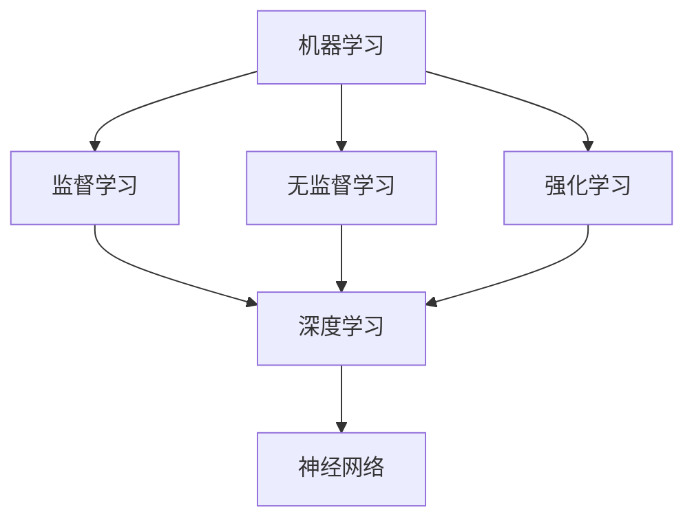
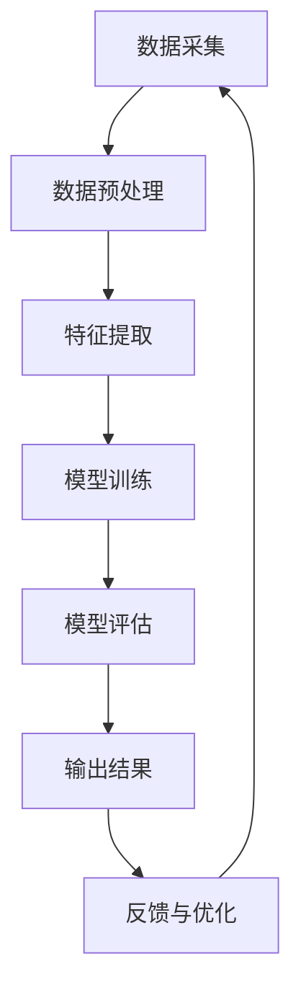

                 


### 文章标题

# 一切皆是映射：理解AI中的输入与输出关系

### 关键词

- 输入输出关系
- 人工智能
- 映射原理
- 机器学习
- 深度学习
- 监督学习
- 无监督学习
- 强化学习
- 自然语言处理
- 计算机视觉

### 摘要

人工智能作为现代科技的尖端领域，其核心在于将输入的数据转化为有用的输出信息。本文将从基础概念入手，详细探讨人工智能中的输入与输出关系。首先介绍AI的发展历程，解释输入与输出的基本概念及其映射原理。随后深入探讨机器学习、深度学习和神经网络架构，并分析这些概念之间的联系与区别。文章将重点解析输入数据的预处理与处理，包括数据清洗、特征工程和输入数据的映射过程。接下来，文章将分别讨论监督学习、无监督学习和强化学习中的输入输出关系，通过实际案例说明这些概念在应用中的实现。最后，文章将展示输入输出关系在自然语言处理和计算机视觉等领域的应用，总结全文并给出进一步研究的方向。

## 第一部分：AI基础与输入输出关系

### 第1章：AI概述与输入输出基础

#### 1.1 AI的发展历程与现状

人工智能（AI）的发展可以追溯到20世纪50年代，当时计算机科学家开始尝试让机器模拟人类智能的行为。这一时期，AI主要集中在规则推理和符号逻辑上，主要研究如何让计算机理解和执行复杂的逻辑任务。然而，受限于计算能力和数据资源的限制，这一阶段的AI发展较为缓慢。

随着计算机技术的飞速发展，特别是互联网的普及和大数据时代的到来，AI迎来了新的发展机遇。20世纪90年代，机器学习开始成为AI研究的主流方向。机器学习利用大量的数据进行模型训练，通过算法自动发现数据中的规律，从而实现对未知数据的预测和分类。这一阶段的AI取得了显著突破，特别是在语音识别、图像识别和自然语言处理等领域。

进入21世纪，深度学习作为机器学习的一个分支，进一步推动了AI的发展。深度学习通过构建多层神经网络，能够自动提取数据中的高层次特征，使得计算机在视觉、语音和自然语言处理等任务上取得了前所未有的成就。例如，AlphaGo在围棋领域的胜利，标志着深度学习在复杂决策问题上的巨大潜力。

目前，人工智能已经广泛应用于各行各业，包括医疗、金融、教育、交通和娱乐等。从智能客服到自动驾驶，从智能医疗到智能家居，AI正在深刻改变我们的生活方式。随着技术的不断进步，AI在未来的发展潜力依然巨大。

#### 1.2 输入与输出的基本概念

在人工智能系统中，输入和输出是两个核心概念。输入是指系统接收到的外部数据，这些数据可以来自传感器、用户交互或其他数据源。输出则是系统根据输入数据处理后产生的结果，这个结果可以是预测、分类、决策等。

输入数据的类型多种多样，可以是数值、文本、图像、声音等。在机器学习中，输入数据通常需要经过预处理，例如归一化、标准化或特征提取，以便更好地适应模型训练。

输出结果的类型也因应用场景而异。在监督学习中，输出通常是标签化的数据，例如分类问题中的类别标签或回归问题中的具体数值。无监督学习中，输出可能是一些聚类结果或数据分布。在强化学习中，输出则是奖励或惩罚信号，用于指导系统的决策过程。

#### 1.3 输入输出的映射原理

在人工智能系统中，输入与输出之间的关系通常通过映射来实现。映射是指将输入数据通过特定的算法或模型转化为输出数据的过程。这个过程可以看作是一种函数关系，即输入数据 \(X\) 通过映射函数 \(f\) 生成输出数据 \(Y\)，表示为 \(Y = f(X)\)。

在机器学习中，映射函数通常由训练数据学习得到。例如，在监督学习中，通过给定的输入数据和相应的输出标签，训练模型找到一种最优的映射关系。训练过程中，模型不断调整内部参数，使得映射函数能够在新的输入数据上产生准确的输出结果。

深度学习中的映射原理基于多层神经网络。神经网络通过层层传递输入数据，逐层提取特征，最终生成输出。每一层神经网络都可以看作是一个映射函数，不同层的映射函数共同构成一个复杂的映射关系。这种层次化的映射机制使得神经网络能够处理复杂的高维数据，并从中提取出具有解释性的特征。

输入输出的映射原理不仅存在于机器学习领域，在其他计算机科学分支中也具有重要意义。例如，在计算机视觉中，输入是图像数据，输出是物体的识别或分类结果；在自然语言处理中，输入是文本数据，输出是语义理解或情感分析结果。

#### 1.4 映射关系在AI系统中的重要性

输入输出的映射关系在人工智能系统中具有至关重要的作用。首先，映射关系决定了系统的性能。一个高效的映射关系能够使系统在给定的输入数据上产生准确的输出结果，从而提高系统的准确性和可靠性。

其次，映射关系也影响系统的可解释性。在许多实际应用中，用户需要理解系统如何处理输入数据并产生输出结果。一个清晰的映射关系能够帮助用户理解系统的决策过程，提高系统的透明度和可解释性。

最后，映射关系还决定了系统的泛化能力。泛化能力是指系统能够在新数据上产生良好结果的能力。一个具有良好泛化能力的映射关系能够使系统在未知或变化的环境中保持稳定的表现。

总之，理解输入输出的映射原理对于设计和实现高效、可靠的人工智能系统具有重要意义。通过深入研究映射关系的机制和特性，我们可以不断提升AI系统的性能和应用价值。

### 第2章：AI的核心概念与架构

#### 2.1 机器学习的基本概念

机器学习（Machine Learning）是人工智能（Artificial Intelligence）的一个重要分支，其主要目标是通过算法和统计模型从数据中自动学习规律和模式，从而进行预测、分类和决策。机器学习的过程可以概括为数据采集、数据预处理、模型选择、模型训练和模型评估等几个主要步骤。

首先，数据采集是机器学习的基础。高质量的数据是训练有效模型的前提。数据可以来自各种来源，包括传感器数据、社交媒体数据、商业交易数据等。数据采集过程中，需要确保数据的多样性和代表性，以避免数据偏差。

接下来是数据预处理。由于原始数据通常存在噪声、缺失值和异常值等问题，因此需要进行预处理。预处理步骤包括数据清洗、数据归一化、数据标准化和数据变换等。这些步骤的目的是提高数据的整洁度和一致性，以便后续的模型训练。

在模型选择阶段，研究人员需要根据具体的应用场景和任务类型选择合适的模型。常见的机器学习模型包括线性回归、决策树、支持向量机、神经网络等。每种模型都有其特定的适用场景和优缺点，需要结合实际问题进行选择。

模型训练是机器学习的核心步骤。在这一阶段，模型通过大量的训练数据学习数据中的规律和模式。训练过程中，模型会不断调整内部参数，以最小化预测误差。训练效果的好坏直接影响模型的性能和准确性。

最后是模型评估。通过使用测试数据集，评估模型的泛化能力和预测准确性。常用的评估指标包括准确率、召回率、F1分数、均方误差等。模型评估的结果可以帮助研究人员了解模型的性能，并作出相应的调整和优化。

#### 2.2 深度学习的核心原理

深度学习（Deep Learning）是机器学习的一个子领域，以其在处理复杂数据方面的卓越性能而备受关注。深度学习的主要特点是其多层神经网络结构，能够自动提取数据中的高层次特征，从而实现高效的数据表示和学习。

深度学习的基本结构包括输入层、隐藏层和输出层。输入层接收外部数据，如图像、文本或声音，然后通过一系列隐藏层进行特征提取和变换。每层神经元的输出作为下一层的输入，层层传递直至输出层，最终生成预测结果。

核心原理之一是前向传播（Forward Propagation）。在训练过程中，输入数据首先通过输入层传递到第一层隐藏层，然后依次传递到后续隐藏层。在每一层中，神经元通过激活函数对输入进行非线性变换，提取特征。最后，输出层生成预测结果。

另一个重要原理是反向传播（Backpropagation）。在反向传播过程中，模型计算预测误差，并沿着前向传播的反向逐层更新神经元的权重和偏置。通过这种梯度下降的方式，模型不断优化参数，以减少预测误差。

深度学习中的另一个关键概念是权重共享（Weight Sharing）。在多层神经网络中，同一层的神经元共享相同的权重，这样可以减少参数的数量，提高模型的训练效率。同时，权重共享有助于捕捉数据中的共性和规律。

深度学习的另一个优势是其端到端训练（End-to-End Training）。传统机器学习通常需要手动设计特征，而深度学习通过多层神经网络自动提取特征，从而实现端到端的训练。这种端到端的学习方式在处理复杂任务时具有显著优势。

#### 2.3 神经网络架构与映射关系

神经网络（Neural Networks）是深度学习的基础，其架构由大量的神经元（或节点）组成，这些神经元通过权重连接形成一个复杂的网络结构。神经网络通过层层传递输入数据，提取特征并生成输出。

神经网络的映射关系可以通过多层感知机（Multilayer Perceptron，MLP）来解释。MLP由输入层、一个或多个隐藏层和输出层组成。输入层接收外部输入数据，隐藏层对输入进行特征提取和变换，输出层生成预测结果。

在MLP中，每个神经元都是一个简单的非线性变换函数，通常采用sigmoid、ReLU或Tanh等激活函数。这些激活函数引入了非线性，使得神经网络能够学习复杂数据中的特征和模式。

输入数据通过输入层传递到第一层隐藏层，每个隐藏层的神经元接收前一层的输出作为输入。在隐藏层中，神经元通过权重连接前一层的神经元，并应用激活函数进行非线性变换。这种逐层传递的过程使得神经网络能够逐层提取数据中的高层次特征。

输出层接收隐藏层的输出，并生成最终的预测结果。输出层的神经元通常采用线性激活函数，以实现线性分类或回归任务。

神经网络的映射关系可以通过权重和偏置来描述。权重表示不同层神经元之间的连接强度，偏置用于调整神经元的输入。通过学习权重和偏置，神经网络能够学习输入数据中的特征和模式，并生成准确的输出结果。

总之，神经网络架构与映射关系是深度学习的基础。通过多层感知机和前向传播、反向传播等原理，神经网络能够自动提取数据中的特征，并生成高质量的预测结果。深入研究神经网络架构和映射关系，有助于理解和应用深度学习技术。

#### 2.4 AI中的核心概念联系与架构

在人工智能（AI）系统中，机器学习、深度学习和神经网络是三大核心概念，它们之间存在着紧密的联系和层次结构，共同构成了AI的理论基础和应用框架。

首先，机器学习（Machine Learning）是AI的核心技术之一，其主要目标是使计算机系统能够通过学习和经验改进其性能。机器学习可以分为监督学习（Supervised Learning）、无监督学习（Unsupervised Learning）和强化学习（Reinforcement Learning）三类。监督学习利用已标记的数据进行学习，无监督学习旨在发现数据中的结构或模式，而强化学习通过不断尝试和反馈来学习策略。

其次，深度学习（Deep Learning）是机器学习的一个分支，以其在处理复杂数据方面的卓越性能而备受关注。深度学习通过构建多层神经网络，能够自动提取数据中的高层次特征，从而实现高效的数据表示和学习。深度学习的关键原理包括多层感知机（MLP）、卷积神经网络（CNN）、循环神经网络（RNN）等。这些神经网络架构通过层层传递输入数据，提取特征并生成输出，使得深度学习在计算机视觉、自然语言处理和语音识别等领域取得了显著突破。

神经网络（Neural Networks）是深度学习的基础，其架构由大量的神经元组成，通过权重连接形成复杂的网络结构。每个神经元都是一个简单的非线性变换函数，通过激活函数引入非线性，使得神经网络能够学习复杂数据中的特征和模式。神经网络通过层层传递输入数据，逐层提取特征，最终生成预测结果。神经网络中的权重和偏置用于调整神经元之间的连接强度，使得神经网络能够学习数据中的特征和规律。

从层次结构上看，机器学习位于顶层，它提供了学习算法和模型构建的基础。深度学习位于机器学习之下，是机器学习的一种具体实现方式，通过构建多层神经网络，能够自动提取数据中的高层次特征。神经网络是深度学习的基础架构，它实现了数据的层次化特征提取和学习。

在AI系统中，这三个核心概念相互关联，共同推动了AI技术的发展和应用。机器学习提供了学习算法和模型构建的基础，深度学习通过多层神经网络实现了高效的数据特征提取和学习，而神经网络则是实现这一过程的关键架构。

为了更清晰地展示这三个概念之间的联系，我们可以使用Mermaid流程图来描述：



在这个流程图中，机器学习是整体架构的顶层，其下分为监督学习、无监督学习和强化学习三个子分支。这三个子分支共同构成了深度学习的基础，而深度学习又基于神经网络架构来实现。通过这种层次化的结构，我们可以更好地理解AI系统的构建和运行机制。

总之，机器学习、深度学习和神经网络是AI系统中的三大核心概念，它们相互关联，共同推动了AI技术的发展和应用。通过理解这些概念之间的联系和架构，我们可以更好地设计和实现高效、可靠的人工智能系统。

### 第3章：输入数据的预处理与处理

#### 3.1 数据清洗与预处理

在机器学习和深度学习项目中，输入数据的预处理与清洗是一个至关重要的步骤。这一步骤的目的是确保数据的整洁、一致和可靠，从而提高后续模型训练的效率和准确性。数据清洗与预处理通常包括以下几个关键步骤：

**缺失值处理**：原始数据中常常存在缺失值，这些缺失值可能是由数据采集、传输或存储过程中的错误导致的。缺失值的处理方法有多种，包括删除含有缺失值的记录、用平均值、中位数或最频繁出现的值填充缺失值，以及使用更复杂的插值方法。

**异常值处理**：异常值是指那些显著偏离数据大多数值的观测值。异常值可能是由数据采集设备故障、数据录入错误或异常事件引起的。处理异常值的方法包括删除异常值、使用统计方法（如三倍标准差法则）识别和修正异常值，或者对异常值进行插值或回归填补。

**数据规范化**：数据规范化是将数据转换到相同尺度或范围内的过程，常见的规范化方法包括最小-最大标准化（Min-Max Scaling）和Z-score标准化（Z-Score Scaling）。这些方法有助于消除不同特征之间的量纲差异，使得模型训练更加稳定。

**数据归一化**：数据归一化是将数据转换到[0, 1]区间或[-1, 1]区间的过程，以消除不同特征之间的数量级差异。归一化方法包括Min-Max Scaling、Log变换、倒数变换等。这些方法有助于加快模型训练速度和提高模型性能。

**数据离散化**：对于连续的数值特征，有时需要将其离散化为分类特征，以便更好地适应某些模型。离散化方法包括等宽离散化和等频率离散化。这些方法将连续特征划分为若干个区间或类别，有助于减少模型的复杂性。

**数据转换**：某些情况下，需要对数据进行适当的转换，以改善数据分布或增加数据的多样性。例如，对时间序列数据进行差分变换、对文本数据进行词频统计或词嵌入等。

**数据平衡**：在分类问题中，如果数据集存在类别不平衡（即某些类别的样本数量远多于其他类别），需要进行数据平衡处理。常用的方法包括过采样（Over-sampling）、欠采样（Under-sampling）和SMOTE（Synthetic Minority Over-sampling Technique）等。这些方法有助于提高模型对少数类别的识别能力。

**数据可视化**：通过数据可视化，可以直观地识别数据的异常、分布特征和关联关系。常用的数据可视化工具包括Seaborn、Matplotlib等，可以生成箱线图、散点图、热力图等。

**数据增强**：数据增强是一种通过生成合成数据样本来提高模型泛化能力的技术。常见的数据增强方法包括图像旋转、缩放、裁剪、添加噪声等，这些方法可以增加数据集的多样性，从而提高模型的鲁棒性。

**数据预处理工具**：在实际项目中，常用的数据预处理工具包括Pandas、NumPy、SciPy等Python库，以及Scikit-learn、OpenCV等提供丰富预处理功能的库。这些工具提供了大量预定义的函数和算法，可以大大简化数据预处理的工作。

**实例解析**：以下是一个简单的数据清洗与预处理的示例，使用Python和Pandas库对房价数据集进行处理。

```python
import pandas as pd

# 加载数据
data = pd.read_csv('house_prices.csv')

# 缺失值处理
data.fillna(data.mean(), inplace=True)

# 异常值处理
z_scores = (data - data.mean()) / data.std()
data = data[(z_scores < 3).all(axis=1)]

# 数据规范化
data['area'] = (data['area'] - data['area'].min()) / (data['area'].max() - data['area'].min())

# 数据离散化
data['bedrooms'] = data['bedrooms'].astype('category')

# 数据增强
from sklearn.utils import resample
data = resample(data, replace=True, n_samples=len(data), random_state=42)

# 数据可视化
import seaborn as sns
sns.pairplot(data, hue='price')
```

通过以上步骤，我们可以显著提高数据质量，为后续的模型训练打下坚实的基础。有效的数据清洗与预处理不仅有助于提高模型的性能，还能减少过拟合和模型复杂度。

#### 3.2 特征工程与选择

在机器学习和深度学习项目中，特征工程（Feature Engineering）和特征选择（Feature Selection）是两个关键步骤，旨在构建高质量的输入特征，从而提高模型的表现和泛化能力。以下是关于这两个概念的详细解释及其应用：

**特征工程**：特征工程是指通过处理原始数据，构建新的特征或改进现有特征，以增强模型性能的过程。特征工程的目标是提取数据中的有用信息，降低数据维度，提高模型的泛化能力。常见的特征工程方法包括：

1. **特征变换**：将原始数据转换为更适合模型的形式。例如，对数值特征进行归一化或标准化，对类别特征进行独热编码（One-Hot Encoding）或标签编码（Label Encoding）。

2. **特征组合**：通过组合原始特征来创建新的特征。例如，将多个特征相乘、相加或进行逻辑运算，生成新的特征。

3. **特征缩放**：对于不同量纲的特征，需要进行缩放处理，以消除它们之间的差异。常见的缩放方法包括最小-最大标准化（Min-Max Scaling）和Z-score标准化（Z-Score Scaling）。

4. **特征构造**：从原始数据中提取新的特征，例如使用统计指标（如均值、中位数、标准差）描述数据的分布特性，或者使用时间序列数据生成窗口特征。

5. **特征抽取**：对于文本数据，可以使用词频统计（TF）、词嵌入（Word Embedding）等方法提取特征。

**特征选择**：特征选择是指从原始特征集合中选择出对模型表现有显著贡献的特征，从而降低数据维度和模型复杂度。特征选择的方法可以分为以下几类：

1. **过滤式特征选择**：先对原始特征进行评分，然后根据评分标准选择特征。常用的评分方法包括基于信息的特征选择（如信息增益、信息增益率）、基于距离的特征选择（如最小角距离、最大角距离）等。

2. **包裹式特征选择**：逐步选择特征，每次选择一个或多个特征，并评估模型性能。常用的算法包括前向选择（Forward Selection）、后向选择（Backward Selection）、L1正则化（Lasso）和递归特征消除（Recursive Feature Elimination, RFE）等。

3. **嵌入式特征选择**：在模型训练过程中同时进行特征选择，常用的方法包括岭回归（Ridge Regression）、Lasso和弹性网络（Elastic Net）等。

4. **基于模型的特征选择**：通过模型评估特征的重要性，选择对模型表现有显著贡献的特征。常用的方法包括随机森林（Random Forest）、Lasso和树模型（如CART、决策树）等。

**特征选择的重要性**：特征选择对于模型的表现和泛化能力至关重要。合理的特征选择可以减少数据维度，降低模型复杂度，减少过拟合的风险，提高模型的可解释性。此外，特征选择还可以提高模型训练效率，减少计算资源的需求。

**实例解析**：以下是一个简单的特征工程和特征选择示例，使用Python和Scikit-learn库对鸢尾花数据集进行处理。

```python
import pandas as pd
from sklearn.datasets import load_iris
from sklearn.model_selection import train_test_split
from sklearn.preprocessing import StandardScaler
from sklearn.ensemble import RandomForestClassifier
from sklearn.feature_selection import SelectFromModel

# 加载数据
data = load_iris()
X = pd.DataFrame(data.data, columns=data.feature_names)
y = data.target

# 特征工程
X['mean_sepal_length'] = X['sepal length (cm)'] / X['sepal width (cm)']
X['sepal_ratio'] = X['sepal length (cm)'] / X['sepal width (cm)']
X.drop(['sepal length (cm)', 'sepal width (cm)'], axis=1, inplace=True)

# 特征选择
X_train, X_test, y_train, y_test = train_test_split(X, y, test_size=0.3, random_state=42)
scaler = StandardScaler()
X_train_scaled = scaler.fit_transform(X_train)
X_test_scaled = scaler.transform(X_test)

rf = RandomForestClassifier(n_estimators=100, random_state=42)
rf.fit(X_train_scaled, y_train)
selector = SelectFromModel(rf, prefit=True)
X_train_selected = selector.transform(X_train_scaled)
X_test_selected = selector.transform(X_test_scaled)

# 模型评估
from sklearn.metrics import accuracy_score
y_pred = rf.predict(X_test_selected)
accuracy = accuracy_score(y_test, y_pred)
print(f"Model accuracy: {accuracy:.2f}")
```

通过上述步骤，我们可以看到特征工程和特征选择在提高模型性能和可解释性方面发挥了重要作用。在实际项目中，合理地应用特征工程和特征选择方法，可以有效提升模型的表现和稳定性。

#### 3.3 输入数据的映射过程

在人工智能系统中，输入数据的映射过程是实现模型预测和决策的核心环节。映射过程涉及数据从输入层到输出层的传输、特征提取、模型训练和输出生成的各个步骤。以下是对这些步骤的详细解析：

**输入层的传输**：输入层接收外部数据，这些数据可以是各种形式，如图像、文本、声音或传感器读数。在输入层，数据首先经过预处理，包括归一化、标准化和去噪等操作，以确保数据的一致性和稳定性。预处理后的数据被传输到网络的隐藏层。

**特征提取**：在隐藏层中，神经元通过激活函数对输入数据进行非线性变换，逐步提取数据中的高层次特征。这些特征代表了数据的关键信息，是模型学习的基础。特征提取的过程包括卷积、池化、循环等操作，不同类型的神经网络采用不同的特征提取方法。

**模型训练**：特征提取后，数据被传输到下一层隐藏层，并重复特征提取和传输过程。在这个过程中，神经网络通过反向传播算法不断调整内部参数，以最小化预测误差。训练过程中，模型会学习到输入数据与输出结果之间的映射关系。

**输出生成**：当数据传输到输出层时，模型生成最终的预测结果。输出可以是分类标签、连续数值或决策结果，取决于具体的任务类型。输出结果通常经过后处理，如概率校准或阈值调整，以提高预测的准确性和可靠性。

**映射过程的实现**：以下是一个简单的神经网络映射过程的实现示例，使用Python和TensorFlow库。

```python
import tensorflow as tf
from tensorflow.keras import layers

# 创建模型
model = tf.keras.Sequential([
    layers.Dense(128, activation='relu', input_shape=(input_shape)),
    layers.Dense(64, activation='relu'),
    layers.Dense(1, activation='sigmoid')
])

# 编译模型
model.compile(optimizer='adam', loss='binary_crossentropy', metrics=['accuracy'])

# 训练模型
model.fit(X_train, y_train, epochs=10, batch_size=32, validation_data=(X_val, y_val))

# 生成预测结果
predictions = model.predict(X_test)
predicted_classes = (predictions > 0.5).astype(int)
```

在这个示例中，我们创建了一个简单的二分类神经网络，通过模型训练和预测过程实现了输入数据的映射。通过调整网络结构、优化器和训练参数，我们可以进一步提高映射过程的性能和泛化能力。

总之，输入数据的映射过程是人工智能系统的核心环节，通过特征提取、模型训练和输出生成，实现了输入数据到输出结果的转化。深入了解映射过程的实现机制，有助于我们更好地设计和优化人工智能系统。

### 第二部分：AI中的输入输出关系

#### 第4章：监督学习中的输入输出关系

#### 4.1 监督学习的原理与过程

监督学习（Supervised Learning）是一种常见的机器学习方法，其主要原理是通过已知的输入数据和相应的输出结果，训练模型建立输入与输出之间的映射关系。监督学习的核心在于“监督”，即输入数据附带标签，这些标签是模型预测的目标。

监督学习的原理可以概括为以下几个步骤：

**数据收集与预处理**：首先，收集大量的带标签的训练数据。这些数据集需要具有代表性，能够覆盖不同的场景和情况。然后，对数据进行预处理，包括缺失值处理、异常值处理、数据归一化、特征提取等操作，以提高数据质量。

**模型选择**：根据具体问题和任务类型，选择合适的机器学习模型。常见的监督学习模型包括线性回归、逻辑回归、支持向量机（SVM）、决策树、随机森林、神经网络等。每种模型都有其特定的适用场景和优缺点，需要结合实际问题进行选择。

**模型训练**：使用预处理后的训练数据，训练模型找到输入数据与输出标签之间的映射关系。训练过程中，模型会不断调整内部参数，以最小化预测误差。训练方法包括梯度下降、随机梯度下降、批量梯度下降等。

**模型评估**：通过使用测试数据集，评估模型的泛化能力和预测准确性。常用的评估指标包括准确率、召回率、F1分数、均方误差等。模型评估的结果可以帮助研究人员了解模型的性能，并作出相应的调整和优化。

**模型应用**：经过评估和调整后的模型可以应用于实际任务，对新的输入数据进行预测和分类。监督学习广泛应用于分类和回归任务，如文本分类、图像识别、医疗诊断等。

#### 4.2 输入数据的特征提取与映射

在监督学习中，输入数据的特征提取与映射是关键步骤，直接影响模型的性能和预测准确性。以下是关于特征提取与映射的详细解释：

**特征提取**：特征提取是指从原始数据中提取出具有区分性和代表性的特征，以提高模型的学习效率和准确性。特征提取的方法可以分为以下几类：

1. **统计特征**：基于数据的统计描述，如均值、方差、标准差等。这些特征能够描述数据的分布特性，对于一些简单的任务（如回归问题）足够使用。

2. **文本特征**：对于文本数据，可以使用词频统计（TF）、词嵌入（Word Embedding）等方法提取特征。词频统计能够捕捉文本中词语的出现频率，而词嵌入则能够将文本映射到高维空间，提高模型对语义的理解。

3. **图像特征**：对于图像数据，可以使用卷积神经网络（CNN）提取特征。CNN通过卷积和池化操作，自动学习图像中的局部特征和全局特征，适用于图像分类、目标检测等任务。

4. **声音特征**：对于声音数据，可以使用梅尔频率倒谱系数（MFCC）、短时傅里叶变换（STFT）等方法提取特征。这些特征能够描述声音的频率和时间特性，适用于语音识别、音乐分类等任务。

**特征映射**：特征映射是指将提取出的特征映射到模型中，以便模型能够学习输入数据与输出标签之间的映射关系。特征映射的方法包括以下几种：

1. **线性映射**：将特征直接输入到线性模型中，如线性回归、逻辑回归等。线性映射适用于特征较少且线性可分的情况。

2. **非线性映射**：通过多层神经网络（如深度学习模型）对特征进行非线性变换，提取更高层次的特征表示。非线性映射适用于特征复杂、非线性关系明显的情况。

3. **稀疏映射**：通过正则化方法（如L1正则化）对特征进行稀疏化处理，减少特征维度，提高模型的泛化能力。

4. **嵌入映射**：通过词嵌入、图嵌入等方法，将特征映射到低维空间，提高特征的可解释性和计算效率。

**实例解析**：以下是一个简单的监督学习特征提取与映射的示例，使用Python和Scikit-learn库进行鸢尾花分类任务。

```python
from sklearn.datasets import load_iris
from sklearn.model_selection import train_test_split
from sklearn.preprocessing import StandardScaler
from sklearn.svm import SVC

# 加载数据
data = load_iris()
X = data.data
y = data.target

# 数据预处理
X_train, X_test, y_train, y_test = train_test_split(X, y, test_size=0.3, random_state=42)
scaler = StandardScaler()
X_train_scaled = scaler.fit_transform(X_train)
X_test_scaled = scaler.transform(X_test)

# 特征提取与映射
clf = SVC(kernel='linear')
clf.fit(X_train_scaled, y_train)

# 模型评估
from sklearn.metrics import accuracy_score
y_pred = clf.predict(X_test_scaled)
accuracy = accuracy_score(y_test, y_pred)
print(f"Model accuracy: {accuracy:.2f}")
```

在这个示例中，我们使用支持向量机（SVM）对鸢尾花数据进行分类。首先对数据进行预处理，然后使用线性核函数进行特征提取和映射。最后，通过测试数据评估模型的准确性。

通过合理的特征提取与映射，我们可以显著提高监督学习模型的性能和泛化能力。深入了解特征提取与映射的方法和原理，有助于我们更好地应用监督学习技术解决实际问题。

#### 4.3 输出结果的可解释性

在监督学习应用中，输出结果的可解释性是评估模型性能和提升模型可靠性的关键因素。可解释性（Interpretability）指的是能够理解模型决策过程和结果的能力，使得用户可以信任和接受模型的预测。以下将讨论输出结果可解释性的重要性、评估方法以及提升可解释性的几种策略。

**重要性**：可解释性在许多实际应用中至关重要。首先，可解释性有助于理解模型的决策过程，从而增强用户对模型的信任感。特别是在医疗诊断、金融风险评估和司法判决等关键领域，用户需要了解模型是如何做出决策的，以确保决策的公正性和透明度。其次，可解释性有助于发现模型的潜在问题，例如过拟合、偏差和异常值，从而采取相应措施进行优化。最后，可解释性也有助于模型的可扩展性和适应性，使得模型能够更容易地适应新的数据集和任务。

**评估方法**：评估输出结果的可解释性主要包括以下几个方面：

1. **模型透明度**：评估模型内部结构和参数是否易于理解和解释。例如，线性模型由于其结构简单、参数明确，具有较高的透明度。相比之下，深度学习模型由于其复杂结构，通常较低透明度。

2. **特征重要性**：评估模型中各个特征的权重和贡献。特征重要性可以通过模型参数、特征贡献分数或特征重要性指标（如SHAP值）进行评估。

3. **决策路径**：展示模型如何处理输入数据并生成输出结果。例如，决策树模型可以清晰地展示决策路径和分类规则。

4. **模型一致性**：评估模型在不同数据集上的表现是否一致。一致性的模型通常具有较高的可解释性。

**提升策略**：以下是一些提升输出结果可解释性的策略：

1. **可视化**：通过可视化技术展示模型的内部结构和决策过程。例如，使用热力图、决策树图、神经网络结构图等。

2. **简化模型**：简化模型结构，使其更易于理解。例如，使用线性模型或简化版的深度学习模型。

3. **解释性算法**：采用具有解释性的算法，如决策树、规则列表等。这些算法通常能够明确地展示决策规则和特征关系。

4. **特征重要性分析**：分析模型中各个特征的权重和贡献，帮助用户理解哪些特征对输出结果影响最大。

5. **模型调试**：通过调试和优化模型，减少过拟合和噪声，提高模型的一致性和稳定性。

**实例解析**：以下是一个提升可解释性的实例，使用Python和Scikit-learn库对鸢尾花数据集进行分类。

```python
from sklearn.datasets import load_iris
from sklearn.tree import DecisionTreeClassifier
from sklearn.model_selection import train_test_split
from sklearn.metrics import accuracy_score

# 加载数据
data = load_iris()
X = data.data
y = data.target

# 数据划分
X_train, X_test, y_train, y_test = train_test_split(X, y, test_size=0.3, random_state=42)

# 模型训练
clf = DecisionTreeClassifier()
clf.fit(X_train, y_train)

# 可视化决策树
from sklearn.tree import plot_tree
plt = plot_tree(clf, filled=True, feature_names=data.feature_names, class_names=data.target_names)
plt.show()

# 模型评估
y_pred = clf.predict(X_test)
accuracy = accuracy_score(y_test, y_pred)
print(f"Model accuracy: {accuracy:.2f}")
```

在这个实例中，我们使用决策树模型对鸢尾花数据进行分类，并通过可视化决策树展示模型的决策过程。决策树图清晰地展示了每个决策节点和分类规则，提高了模型的可解释性。

通过提升输出结果的可解释性，我们可以更好地理解和信任模型，从而在实际应用中发挥其最大价值。深入了解可解释性的评估方法和提升策略，有助于我们在机器学习和深度学习项目中更好地设计和优化模型。

### 第5章：无监督学习中的输入输出关系

#### 5.1 无监督学习的原理与过程

无监督学习（Unsupervised Learning）是一种机器学习方法，其主要特点是不使用标记的输入数据，而是通过发现数据中的内在结构和规律进行学习。无监督学习在探索性数据分析、数据聚类、降维和异常检测等领域具有广泛的应用。以下是关于无监督学习的基本原理和过程：

**原理**：无监督学习的核心思想是使模型自动发现数据中的隐藏结构和模式。与监督学习不同，无监督学习不需要已知的输出标签，而是依赖于数据本身的内在特性进行学习。常见的无监督学习算法包括聚类算法、降维算法和关联规则学习等。

**过程**：无监督学习通常包括以下几个主要步骤：

1. **数据采集**：收集无标签的数据集，这些数据可以是时间序列数据、图像数据、文本数据等。数据的质量和多样性直接影响无监督学习的效果。

2. **数据预处理**：对数据进行预处理，包括缺失值处理、异常值处理和数据归一化等。预处理步骤有助于提高数据的质量，使得模型能够更好地学习数据中的内在结构。

3. **特征提取**：从原始数据中提取有用的特征，以减少数据的维度并突出数据中的关键信息。特征提取方法包括主成分分析（PCA）、线性判别分析（LDA）和自编码器（Autoencoder）等。

4. **模型选择**：根据具体问题和任务类型，选择合适的无监督学习算法。常见的无监督学习算法包括K-means聚类、层次聚类、DBSCAN聚类、主成分分析（PCA）和自编码器（Autoencoder）等。

5. **模型训练**：使用预处理后的数据训练模型，使其自动发现数据中的内在结构和模式。训练过程中，模型会不断调整内部参数，以最小化目标函数，例如聚类中心点的调整、特征空间的变换等。

6. **模型评估**：通过评估指标（如聚类系数、轮廓系数、重建误差等）评估模型的性能。评估结果可以帮助研究人员了解模型的性能，并作出相应的调整和优化。

7. **模型应用**：将训练好的模型应用于实际任务，例如数据聚类、降维和异常检测等。无监督学习在探索性数据分析中，可以帮助用户发现数据中的潜在模式和规律。

**实例解析**：以下是一个简单的无监督学习实例，使用Python和Scikit-learn库对鸢尾花数据集进行K-means聚类。

```python
from sklearn.datasets import load_iris
from sklearn.cluster import KMeans
import matplotlib.pyplot as plt

# 加载数据
data = load_iris()
X = data.data

# K-means聚类
kmeans = KMeans(n_clusters=3, random_state=42)
kmeans.fit(X)

# 输出聚类结果
print("Cluster centers:")
print(kmeans.cluster_centers_)

# 可视化聚类结果
plt.scatter(X[:, 0], X[:, 1], c=kmeans.labels_)
plt.scatter(kmeans.cluster_centers_[:, 0], kmeans.cluster_centers_[:, 1], s=300, c='red')
plt.show()
```

在这个实例中，我们使用K-means聚类算法对鸢尾花数据集进行聚类，并通过可视化展示聚类结果。通过调整聚类中心的数量和初始值，我们可以得到更好的聚类效果。

通过了解无监督学习的原理和过程，我们可以更好地应用无监督学习技术解决实际问题，从而发现数据中的潜在模式和规律。

#### 5.2 输入数据的聚类与映射

无监督学习中的聚类算法是探索数据内在结构的重要工具，其核心任务是将相似的数据点分组到一起，形成若干个簇（clusters）。聚类算法通过分析输入数据，自动发现数据中的模式和结构，从而实现对数据的组织和理解。以下是关于聚类算法的基本概念、常见方法及其在输入数据聚类与映射中的应用：

**基本概念**：

- **簇（Cluster）**：聚类过程中，相似数据点组成的集合。理想情况下，每个簇内的数据点之间相似度较高，而不同簇之间的相似度较低。
- **簇数（Number of Clusters）**：聚类算法需要确定的数据簇的数量。不同的聚类算法有不同的方法来确定簇数。

**常见聚类方法**：

1. **K-means聚类**：K-means是最常见的聚类算法之一，其核心思想是将数据分为K个簇，使得每个簇的中心（质心）与数据点之间的距离最小。算法步骤包括：
   - 初始化K个簇中心。
   - 计算每个数据点到簇中心的距离，并将其分配到最近的簇。
   - 重新计算簇中心。
   - 重复上述步骤，直到簇中心不再发生显著变化。

2. **层次聚类**：层次聚类通过自底向上的方式将数据点逐步合并成簇，形成一个层次结构。常见的层次聚类方法包括自底向上合并（Agglomerative）和自顶向下分裂（Divisive）。层次聚类能够生成不同层次的簇结构，便于分析数据。

3. **DBSCAN（Density-Based Spatial Clustering of Applications with Noise）**：DBSCAN基于数据点的密度分布进行聚类，能够识别出任意形状的簇，并能处理噪声和异常点。算法步骤包括：
   - 确定邻域参数（邻域半径和最小邻域点数）。
   - 标记核心点、边界点和噪声点。
   - 根据核心点和边界点生成簇。

4. **高斯混合模型（Gaussian Mixture Model, GMM）**：高斯混合模型是一种概率模型，假设数据由多个高斯分布组成。通过估计高斯分布的参数（均值、方差和混合系数），GMM能够实现对多模态数据的聚类。

**输入数据的聚类与映射**：

1. **聚类过程**：聚类算法通过对输入数据进行计算和分析，将数据点分配到不同的簇。聚类过程中，算法会考虑数据点的距离、密度和分布特性等。

2. **映射关系**：聚类算法生成的簇与输入数据之间存在一种映射关系。映射关系可以通过簇中心、簇标签或簇内数据点的分布特征进行描述。

3. **应用场景**：
   - **数据分析**：通过聚类分析，用户可以探索数据的内在结构和模式，发现潜在的用户群体、市场细分等。
   - **异常检测**：聚类可以帮助识别异常数据点，例如在金融交易中检测欺诈行为。
   - **降维**：聚类算法可以通过聚类结果压缩数据维度，减少数据存储和计算需求。
   - **图像分割**：在计算机视觉中，聚类算法可以用于图像分割，将相似像素点划分为同一区域。

**实例解析**：以下是一个K-means聚类的实例，使用Python和Scikit-learn库对鸢尾花数据集进行聚类。

```python
from sklearn.datasets import load_iris
from sklearn.cluster import KMeans
import matplotlib.pyplot as plt

# 加载数据
data = load_iris()
X = data.data

# K-means聚类
kmeans = KMeans(n_clusters=3, random_state=42)
kmeans.fit(X)

# 输出聚类结果
print("Cluster centers:")
print(kmeans.cluster_centers_)

# 可视化聚类结果
plt.scatter(X[:, 0], X[:, 1], c=kmeans.labels_)
plt.scatter(kmeans.cluster_centers_[:, 0], kmeans.cluster_centers_[:, 1], s=300, c='red')
plt.show()
```

在这个实例中，我们使用K-means聚类算法对鸢尾花数据集进行聚类，并通过可视化展示聚类结果。通过调整聚类中心的数量和初始值，我们可以得到更好的聚类效果。

通过了解聚类算法的基本概念、方法及其应用，我们可以更好地利用无监督学习技术探索数据中的潜在结构和模式，为数据分析和决策提供有力支持。

#### 5.3 输出结果的分析与应用

无监督学习中的聚类结果为数据分析和决策提供了丰富的信息。通过对聚类结果的分析，我们可以深入理解数据的内在结构和模式，从而在实际应用中发挥其价值。以下是关于聚类结果分析的关键步骤、应用场景和具体案例分析：

**分析步骤**：

1. **簇特征分析**：首先，分析每个簇的中心点、大小和形状，以了解每个簇的数据分布和特征。通过计算簇中心点之间的距离、簇内数据点之间的距离等指标，评估簇的紧凑度和分离度。

2. **簇意义解释**：对于每个簇，尝试解释其代表的数据类型或模式。例如，在客户细分分析中，可以解释每个簇代表的不同客户群体特征和行为模式。

3. **簇关联分析**：分析不同簇之间的关联关系，以发现数据中的潜在关联和趋势。例如，在市场细分中，分析不同客户群体在购买行为、偏好等方面的关联。

4. **簇性能评估**：通过评估聚类结果的性能指标，如轮廓系数（Silhouette Coefficient）、聚类有效性指数（Calinski-Harabasz Index）等，评估聚类结果的优劣。

**应用场景**：

1. **客户细分**：通过聚类分析，将客户划分为不同的群体，以便企业针对不同群体制定个性化的营销策略和服务方案。

2. **市场细分**：在市场营销中，聚类分析可以帮助企业发现潜在的市场细分，制定更精准的市场推广策略。

3. **异常检测**：通过聚类分析，识别数据中的异常点或离群点，以便企业采取相应的措施进行风险控制和安全管理。

4. **图像分割**：在计算机视觉中，聚类算法可以用于图像分割，将图像中的像素点划分为不同的区域，从而实现图像的边缘检测和目标识别。

**具体案例分析**：

1. **客户细分案例**：

   某电商公司希望通过聚类分析将客户划分为不同的群体，以提供个性化的推荐和优惠策略。通过K-means聚类算法，公司发现客户主要分为四类：

   - **高消费群体**：这部分客户消费能力强，购买频率高，通常享受公司的会员服务和优惠。
   - **低消费群体**：这部分客户消费能力较弱，但购买频率较高，适合进行促销活动吸引。
   - **忠诚客户**：这部分客户对公司的品牌和服务有较高的忠诚度，通过个性化推荐和忠诚度计划保持其活跃度。
   - **潜在客户**：这部分客户尚未成为公司的核心用户，但具有潜在的消费潜力，通过精准营销和推荐策略引导其消费。

   通过这些聚类结果，公司可以针对不同客户群体制定差异化的营销策略，提高用户满意度和转化率。

2. **市场细分案例**：

   某饮料公司希望在国内外市场中找到潜在的市场细分，以优化产品推广策略。通过DBSCAN聚类算法，公司发现以下市场细分：

   - **发达国家市场**：这部分市场消费水平较高，对健康和环保有较高的要求，适合推广高端健康饮品。
   - **发展中国家市场**：这部分市场消费水平较低，但对价格敏感，适合推广价格实惠的大众饮品。
   - **城市市场**：城市市场的消费者对产品种类和包装有较高的要求，适合推出多样化、时尚化的产品。
   - **农村市场**：农村市场的消费者对价格和实用性有较高的要求，适合推出价格实惠、功能多样的产品。

   通过这些聚类结果，公司可以针对不同市场细分制定有针对性的推广策略，提高市场覆盖率和产品销量。

通过聚类结果的分析和应用，企业可以更深入地理解客户和市场，制定更精准的营销策略和产品方案，从而提升业务表现和市场竞争力。

### 第6章：强化学习中的输入输出关系

#### 6.1 强化学习的原理与过程

强化学习（Reinforcement Learning，RL）是一种通过交互式环境学习决策策略的机器学习方法，其核心在于通过连续的反馈信号（奖励或惩罚）来优化决策行为。强化学习的主要原理和过程如下：

**原理**：

1. **代理（Agent）**：强化学习中的主体，负责执行动作并接受环境反馈。

2. **环境（Environment）**：代理操作的情境，提供状态和奖励信号。

3. **状态（State）**：描述代理所处环境的一种条件。

4. **动作（Action）**：代理在特定状态下采取的行为。

5. **奖励（Reward）**：代理执行动作后从环境中获得的即时反馈。

6. **策略（Policy）**：代理基于状态选择动作的策略。

7. **价值函数（Value Function）**：预测长期奖励的函数，包括状态价值函数和动作价值函数。

8. **模型（Model）**：对环境动态的描述，包括状态转移概率和奖励函数。

**过程**：

1. **初始状态**：代理开始在一个初始状态下。

2. **状态-动作循环**：代理根据当前状态选择动作，并在环境中执行该动作。

3. **反馈**：环境根据代理的动作提供奖励信号，并可能更新状态。

4. **策略更新**：代理根据奖励信号和历史经验调整其策略。

5. **目标**：最大化长期奖励，通常使用价值函数或策略梯度方法。

**常见算法**：

1. **Q-Learning**：基于值函数的强化学习算法，通过更新Q值来优化策略。

2. **SARSA（On-Policy）**：一种基于策略的强化学习算法，同时更新状态-动作值函数。

3. **Q-learning（Off-Policy）**：与SARSA相对，Q-learning不依赖于当前策略，而是使用一个目标策略。

4. **Deep Q-Learning（DQN）**：结合深度神经网络和Q-learning，用于处理高维状态空间问题。

5. **策略梯度方法**：直接优化策略的梯度，包括REINFORCE和PPO（Proximal Policy Optimization）等。

**强化学习在输入输出关系中的应用**：

强化学习通过学习输入（状态）与输出（动作）之间的映射关系，来实现智能体在动态环境中的最优决策。以下是几个关键方面：

1. **状态-动作值函数**：强化学习算法通过学习状态-动作值函数，来评估每个状态下的动作质量，从而优化策略。

2. **策略迭代**：智能体通过不断尝试不同的动作，并根据奖励信号调整策略，逐步优化其决策行为。

3. **奖励设计**：奖励函数是强化学习的关键，它直接影响智能体的学习过程。合理设计的奖励函数可以引导智能体在复杂环境中找到最优路径。

4. **经验回放**：通过经验回放机制，智能体可以学习过去的经验，减少偶然性奖励的影响，提高学习效率和稳定性。

5. **探索与利用**：在强化学习中，探索（Exploration）和利用（Exploitation）是两个平衡的方面。探索用于发现新的有效动作，利用则用于最大化已知的最佳动作。

#### 6.2 输入数据的决策与映射

在强化学习中，输入数据的决策与映射是智能体实现最优行为的关键步骤。以下是关于输入数据决策与映射的详细解释：

**决策过程**：

1. **状态评估**：智能体首先对当前状态进行评估，以确定采取哪种动作最有利。这一过程通常基于价值函数或策略。

2. **动作选择**：根据状态评估结果，智能体从多个可能的动作中选择一个动作。选择动作的过程可以是贪婪的（总是选择当前状态下价值最高的动作），也可以是随机的（基于概率分布选择动作）。

3. **执行动作**：智能体在环境中执行选定的动作，并观察环境的反馈。

**映射关系**：

1. **状态-动作映射**：强化学习通过学习状态-动作映射，来确定在特定状态下应该采取哪种动作。这种映射关系通常通过状态-动作值函数来描述。

2. **策略映射**：策略映射是将状态映射到动作的概率分布。智能体根据策略映射来选择动作，以最大化长期奖励。

3. **模型映射**：在某些情况下，强化学习算法（如深度强化学习）会使用模型来预测环境的状态转移和奖励，从而优化决策过程。

**实例解析**：

以下是一个强化学习决策与映射的实例，使用Python和OpenAI Gym库实现一个简单的智能体在CartPole环境中的学习过程。

```python
import gym
import numpy as np

# 初始化环境
env = gym.make('CartPole-v1')

# 初始化参数
learning_rate = 0.1
gamma = 0.99
epsilon = 0.1

# 初始化Q值表
q_values = np.zeros((env.observation_space.n, env.action_space.n))

# 智能体学习过程
for episode in range(1000):
    state = env.reset()
    done = False
    total_reward = 0
    
    while not done:
        # 根据epsilon-greedy策略选择动作
        if np.random.rand() < epsilon:
            action = env.action_space.sample()
        else:
            action = np.argmax(q_values[state])
        
        # 执行动作并获取新状态和奖励
        next_state, reward, done, _ = env.step(action)
        
        # 更新Q值
        q_values[state][action] += learning_rate * (reward + gamma * np.max(q_values[next_state]) - q_values[state][action])
        
        state = next_state
        total_reward += reward
    
    print(f"Episode {episode}: Total Reward = {total_reward}, Epsilon = {epsilon}")

# 关闭环境
env.close()
```

在这个实例中，我们使用epsilon-greedy策略进行Q-Learning，智能体通过不断尝试和经验更新来优化其决策行为。通过更新Q值表，智能体能够学会在特定状态下选择最优动作。

通过理解和应用强化学习中的输入数据决策与映射原理，我们可以设计出更智能的代理，实现复杂的决策任务。

#### 6.3 输出结果的反馈与优化

在强化学习中，输出结果的反馈与优化是智能体学习和适应环境的关键步骤。以下是关于反馈与优化的方法、效果评估和调整策略的详细解释：

**反馈方法**：

1. **即时奖励**：智能体在每个时间步长接收即时奖励，这些奖励反映了其当前动作的好坏。即时奖励直接影响智能体的价值函数和策略。

2. **长期奖励**：长期奖励（通常使用折扣因子gamma）考虑了未来所有可能的奖励，使得智能体能够考虑长期目标。长期奖励有助于智能体在短期内做出有益于长期目标的选择。

3. **经验回放**：经验回放是一种有效的反馈方法，用于避免策略偏差。智能体将历史经验（状态、动作、奖励、下一状态）存储在经验池中，并在训练过程中随机抽样回放。这种方法有助于智能体平衡探索和利用，提高学习效率和稳定性。

4. **目标网络**：在深度强化学习中，目标网络（Target Network）用于稳定训练过程。目标网络是一个参数化的网络，其参数定期从主网络复制，以减少梯度消失和梯度爆炸问题。

**效果评估**：

1. **平均奖励**：评估智能体在一段时间内的平均奖励，以衡量其性能。平均奖励越高，说明智能体在环境中的表现越好。

2. **稳定性**：评估智能体在不同环境、不同初始状态和不同随机种子下的表现，以衡量其稳定性。稳定的智能体能够在各种情况下保持良好的性能。

3. **探索与利用平衡**：评估智能体在探索（尝试新动作）和利用（利用已知的最佳动作）之间的平衡。适当的探索和利用平衡有助于智能体快速学习和适应环境。

**优化策略**：

1. **策略优化**：通过梯度下降等优化方法，智能体不断调整策略参数，以最大化长期奖励。策略优化可以是基于梯度的（如策略梯度方法）或无梯度的（如策略搜索方法）。

2. **价值优化**：通过优化价值函数，智能体学习到在特定状态下采取最优动作。价值优化方法包括Q-Learning、SARSA等。

3. **模型优化**：在深度强化学习中，通过优化环境模型，智能体能够更准确地预测状态转移和奖励。模型优化有助于减少不确定性，提高学习效率。

4. **超参数调整**：调整学习率、折扣因子、探索率等超参数，以找到最优配置。超参数调整对智能体的性能和收敛速度有重要影响。

**实例解析**：

以下是一个强化学习反馈与优化实例，使用Python和OpenAI Gym库实现智能体在CartPole环境中的学习过程。

```python
import gym
import numpy as np

# 初始化环境
env = gym.make('CartPole-v1')

# 初始化参数
learning_rate = 0.01
gamma = 0.99
epsilon = 0.1

# 初始化Q值表
q_values = np.zeros((env.observation_space.n, env.action_space.n))

# 智能体学习过程
for episode in range(1000):
    state = env.reset()
    done = False
    total_reward = 0
    
    while not done:
        # 根据epsilon-greedy策略选择动作
        if np.random.rand() < epsilon:
            action = env.action_space.sample()
        else:
            action = np.argmax(q_values[state])
        
        # 执行动作并获取新状态和奖励
        next_state, reward, done, _ = env.step(action)
        
        # 更新Q值
        q_values[state][action] += learning_rate * (reward + gamma * np.max(q_values[next_state]) - q_values[state][action])
        
        state = next_state
        total_reward += reward
        
        # 调整epsilon，减少探索
        epsilon = max(epsilon * 0.995, 0.01)
    
    print(f"Episode {episode}: Total Reward = {total_reward}")

# 关闭环境
env.close()
```

在这个实例中，智能体通过epsilon-greedy策略进行Q-Learning，通过调整epsilon减少探索，并优化其策略。通过不断更新Q值表，智能体逐渐学会在CartPole环境中保持平衡。

通过有效的反馈与优化策略，强化学习智能体能够适应复杂环境，实现最优决策和长期目标。深入了解反馈与优化的方法，有助于我们在实际应用中设计出高效的智能体系统。

### 第三部分：输入输出关系在实际应用中的实现

#### 第7章：自然语言处理中的输入输出关系

自然语言处理（Natural Language Processing，NLP）是人工智能领域的一个重要分支，它旨在使计算机理解和生成自然语言。在NLP中，输入输出关系具有特殊的重要性，因为NLP的任务通常涉及对文本数据的分析和处理。以下是关于NLP中输入输出关系的详细探讨。

#### 7.1 语言模型的输入输出关系

语言模型（Language Model）是NLP中的一种基础模型，其目的是预测下一个单词或字符。在语言模型中，输入是一个单词序列或字符序列，输出是下一个单词或字符的概率分布。语言模型的输入输出关系可以通过以下步骤实现：

1. **输入预处理**：首先，对输入文本进行预处理，包括分词、标记化、去除停用词等操作。这些步骤有助于将原始文本转换为计算机可以处理的形式。

2. **特征提取**：然后，从预处理后的文本中提取特征。这些特征可以是词频（TF）、词嵌入（Word Embedding）或基于上下文的表示。

3. **模型训练**：使用预处理后的特征和相应的输出（即下一个单词或字符的概率分布）训练语言模型。常见的语言模型包括n-gram模型、递归神经网络（RNN）和转换器（Transformer）等。

4. **预测生成**：通过训练好的语言模型，输入新的文本序列，模型输出下一个单词或字符的概率分布。然后，根据概率分布生成下一个单词或字符，并重复此过程，直至生成完整的文本序列。

例如，一个简单的n-gram语言模型可以表示为：

$$ P(w_n | w_{n-1}, w_{n-2}, \ldots, w_1) $$

其中，\( w_n \)是下一个单词，而\( w_{n-1}, w_{n-2}, \ldots, w_1 \)是前\( n-1 \)个单词的历史。

#### 7.2 文本分类的输入输出关系

文本分类（Text Classification）是一种常见的NLP任务，其目的是将文本数据分类到预定义的类别中。在文本分类中，输入是一个文本序列，输出是文本所属的类别标签。文本分类的输入输出关系可以通过以下步骤实现：

1. **输入预处理**：对输入文本进行预处理，包括分词、标记化、去除停用词、词干提取等。这些步骤有助于将原始文本转换为适合模型处理的形式。

2. **特征提取**：从预处理后的文本中提取特征。这些特征可以是TF-IDF、词嵌入或基于词向量的表示。

3. **模型训练**：使用预处理后的特征和相应的类别标签训练分类模型。常见的分类模型包括朴素贝叶斯（Naive Bayes）、支持向量机（SVM）、决策树、随机森林和深度学习模型（如卷积神经网络、循环神经网络和转换器）。

4. **预测分类**：通过训练好的分类模型，输入新的文本序列，模型输出文本所属的类别标签。

例如，一个简单的朴素贝叶斯分类器可以表示为：

$$ P(y=c | x) = \prod_{i=1}^{n} P(w_i | c) $$

其中，\( x \)是输入文本，\( y \)是输出类别标签，\( c \)是类别标签，\( w_i \)是文本中的第\( i \)个单词。

#### 7.3 机器翻译的输入输出关系

机器翻译（Machine Translation）是一种将一种语言的文本自动翻译成另一种语言的文本的NLP任务。在机器翻译中，输入是一个句子或段落，输出是翻译后的句子或段落。机器翻译的输入输出关系可以通过以下步骤实现：

1. **输入预处理**：对输入文本进行预处理，包括分词、标记化、词性标注等。这些步骤有助于将原始文本转换为计算机可以处理的形式。

2. **编码**：将输入文本编码为向量表示。这些向量可以是词嵌入或基于转换器的表示。

3. **模型训练**：使用编码后的输入和翻译后的输出训练机器翻译模型。常见的机器翻译模型包括基于转换器的模型（如转换器架构），这些模型通过编码器-解码器结构进行训练。

4. **预测翻译**：通过训练好的机器翻译模型，输入新的文本序列，模型输出翻译后的文本序列。

例如，一个简单的转换器模型可以表示为：

$$ y^* = \arg \max_y \sum_{i=1}^{T} p(y_i|x^*) $$

其中，\( x^* \)是输入文本序列，\( y^* \)是输出翻译后的文本序列，\( T \)是输出文本的长度。

通过理解和应用NLP中的输入输出关系，我们可以构建高效的语言模型、文本分类器和机器翻译系统，从而实现对文本数据的有效处理和分析。

### 第8章：计算机视觉中的输入输出关系

计算机视觉（Computer Vision，CV）是人工智能的一个重要分支，其目标是使计算机能够从图像或视频中提取信息和理解场景。计算机视觉中的输入输出关系是理解和实现各种视觉任务的核心。以下是关于计算机视觉中输入输出关系的详细探讨。

#### 8.1 图像分类的输入输出关系

图像分类（Image Classification）是计算机视觉中最基础的分类任务之一，其目的是将图像或视频帧分类到预定义的类别中。图像分类的输入输出关系可以通过以下步骤实现：

1. **输入预处理**：对输入图像进行预处理，包括图像缩放、灰度转换、直方图均衡化等。这些步骤有助于提高图像的质量和适合模型处理。

2. **特征提取**：从预处理后的图像中提取特征。这些特征可以是边缘检测、角点检测、纹理特征或深度特征。常用的特征提取方法包括卷积神经网络（CNN）和深度学习模型。

3. **模型训练**：使用预处理后的特征和相应的类别标签训练分类模型。常见的分类模型包括卷积神经网络（CNN）、支持向量机（SVM）和深度学习模型（如ResNet、VGG等）。

4. **预测分类**：通过训练好的分类模型，输入新的图像或视频帧，模型输出图像或视频帧所属的类别标签。

例如，一个简单的卷积神经网络模型可以表示为：

$$ y^* = \arg \max_y \sum_{i=1}^{K} w_i \cdot f(x) $$

其中，\( y^* \)是输出类别标签，\( K \)是类别数量，\( w_i \)是权重向量，\( f(x) \)是图像特征向量。

#### 8.2 目标检测的输入输出关系

目标检测（Object Detection）是计算机视觉中的一个高级任务，其目的是在图像或视频中识别并定位多个目标。目标检测的输入输出关系可以通过以下步骤实现：

1. **输入预处理**：对输入图像进行预处理，包括图像缩放、灰度转换、直方图均衡化等。

2. **特征提取**：从预处理后的图像中提取特征，通常使用卷积神经网络（CNN）或基于特征金字塔的网络（FPN）。

3. **区域提议**：通过区域提议算法（如选择性搜索、滑窗检测等）生成候选目标区域。

4. **特征融合**：将区域提议的特征与全局图像特征进行融合，以增强目标检测的准确性。

5. **模型训练**：使用预处理后的特征和相应的边界框和类别标签训练目标检测模型。常见的目标检测模型包括区域建议网络（R-CNN）、YOLO、SSD等。

6. **预测检测**：通过训练好的目标检测模型，输入新的图像或视频帧，模型输出每个目标的边界框、类别标签和置信度。

例如，一个简单的YOLO目标检测模型可以表示为：

$$ \hat{y} = \arg \max_y (\sigma(\hat{p}^y) \cdot \hat{p}^d) $$

其中，\( \hat{y} \)是输出类别标签，\( \hat{p}^y \)是预测的类别概率，\( \sigma \)是Sigmoid函数，\( \hat{p}^d \)是预测的置信度。

#### 8.3 图像生成的输入输出关系

图像生成（Image Generation）是计算机视觉中的另一个重要任务，其目的是生成新的图像或视频。图像生成的输入输出关系可以通过以下步骤实现：

1. **输入预处理**：对输入图像进行预处理，包括图像缩放、灰度转换、色彩空间转换等。

2. **特征提取**：从预处理后的图像中提取特征，通常使用卷积神经网络（CNN）或生成对抗网络（GAN）。

3. **模型训练**：使用预处理后的特征和目标图像训练生成模型。常见的生成模型包括深度卷积生成网络（DCGAN）、循环生成对抗网络（CycleGAN）和条件生成对抗网络（cGAN）。

4. **预测生成**：通过训练好的生成模型，输入新的特征或条件，模型输出新的图像或视频。

例如，一个简单的生成对抗网络模型可以表示为：

$$ G(z) = x $$

其中，\( G \)是生成器，\( z \)是随机噪声向量，\( x \)是生成的图像。

通过理解和应用计算机视觉中的输入输出关系，我们可以构建高效的图像分类、目标检测和图像生成系统，从而实现对图像和视频数据的深入理解和分析。

### 第9章：输入输出关系在实际项目中的应用

在人工智能（AI）的实际应用中，输入输出关系是构建有效系统的关键。本文将通过三个实际案例——智能客服系统、自动驾驶系统和智能家居系统——详细探讨输入输出关系在这些项目中的实现和应用。

#### 9.1 案例一：智能客服系统

智能客服系统是一种利用自然语言处理（NLP）和机器学习技术提供自动客户支持的服务。其核心任务是通过语音或文本与用户交互，自动理解用户的问题并给出合适的答复。

**输入输出关系**：

- **输入**：用户输入的语音或文本。
- **输出**：自动生成的答复。

**实现步骤**：

1. **语音识别**：首先，将用户语音转换为文本，这一步通常使用语音识别（Speech Recognition）技术完成。
2. **文本预处理**：对转换后的文本进行预处理，包括分词、标记化、去除停用词等，以便后续处理。
3. **意图识别**：使用NLP技术（如序列标注、实体识别等）识别用户的意图和关键词。
4. **知识库查询**：根据用户的意图和关键词，在预定义的知识库中查找相应的答案。
5. **文本生成**：使用语言模型（如转换器架构）生成自然流畅的答复文本。
6. **输出**：将生成的答复文本或语音反馈给用户。

**源代码示例**：

```python
import speech_recognition as sr
import nltk

# 初始化语音识别器
recognizer = sr.Recognizer()

# 从语音文件中识别文本
with sr.AudioFile('user_input.wav') as source:
    audio = recognizer.record(source)

# 语音到文本转换
text = recognizer.recognize_google(audio)

# 文本预处理
tokens = nltk.word_tokenize(text)

# 意图识别和知识库查询（简化示例）
if "weather" in tokens:
    response = "The current weather is sunny with a temperature of 25°C."
else:
    response = "I'm sorry, I don't have information about that."

# 文本生成
print(response)
```

**代码解读与分析**：这段代码首先使用语音识别库将语音转换为文本，然后对文本进行预处理。通过意图识别，系统确定用户的意图是查询天气信息，并从知识库中查询相关信息。最后，使用简单的条件语句生成答复文本并输出。

#### 9.2 案例二：自动驾驶系统

自动驾驶系统是一种利用计算机视觉、机器学习和传感器技术实现自主驾驶的智能系统。其核心任务是在复杂的交通环境中识别和预测障碍物、交通规则，并作出相应的驾驶决策。

**输入输出关系**：

- **输入**：来自各种传感器的数据，包括摄像头、雷达、激光雷达等。
- **输出**：驾驶指令，如加速、减速、转向等。

**实现步骤**：

1. **数据采集**：从各种传感器收集环境数据。
2. **数据预处理**：对传感器数据（如图像、雷达信号等）进行预处理，包括降噪、滤波、特征提取等。
3. **目标检测**：使用卷积神经网络（CNN）或其他目标检测算法识别道路上的障碍物。
4. **路径规划**：基于障碍物检测结果，使用规划算法（如A*算法、RRT等）生成安全的行驶路径。
5. **控制策略**：根据路径规划和传感器数据生成驾驶指令，如加速、减速、转向等。
6. **输出**：将驾驶指令发送到车辆控制系统执行。

**源代码示例**：

```python
import cv2
import numpy as np

# 初始化摄像头
cap = cv2.VideoCapture(0)

# 目标检测模型（简化示例）
model = cv2.dnn.readNetFromTensorFlow('faster_rcnn_model.pb', 'faster_rcnn_model.config')

# 循环捕获摄像头帧
while True:
    ret, frame = cap.read()
    
    # 预处理输入帧
    blob = cv2.dnn.blobFromImage(frame, 1.0, (640, 640), [104, 117, 123], True, False)
    
    # 前向传播
    model.setInput(blob)
    detections = model.forward()

    # 遍历检测结果
    for i in range(detections.shape[2]):
        confidence = detections[0, 0, i, 2]
        if confidence > 0.5:
            # 获取边界框和类别
            box = detections[0, 0, i, 3:7] * np.array([frame.shape[1], frame.shape[0], frame.shape[1], frame.shape[0]])
            (x, y, w, h) = box.astype("int")
            
            # 绘制边界框和类别标签
            label = detections[0, 0, i, 1]
            text = "{}: {:.2f}%".format(label, confidence * 100)
            cv2.rectangle(frame, (x, y), (x + w, y + h), (0, 255, 0), 2)
            cv2.putText(frame, text, (x, y - 5), cv2.FONT_HERSHEY_SIMPLEX,
                0.5, (0, 255, 0), 2)

    # 显示结果
    cv2.imshow('Frame', frame)
    
    # 按下'q'键退出
    if cv2.waitKey(1) & 0xFF == ord('q'):
        break

# 释放摄像头资源
cap.release()
cv2.destroyAllWindows()
```

**代码解读与分析**：这段代码首先初始化摄像头并捕获实时帧。然后，使用预训练的目标检测模型（如Faster R-CNN）对帧中的障碍物进行检测。对于每个检测到的障碍物，代码计算其边界框和类别，并绘制在帧上。最后，显示检测结果。

#### 9.3 案例三：智能家居系统

智能家居系统是一种利用物联网（IoT）技术和AI实现家庭设备自动化管理的系统。其核心任务是通过传感器数据和用户交互，实现家电设备的自动化控制。

**输入输出关系**：

- **输入**：来自各种智能家居设备的传感器数据，如温度、湿度、光线、家电状态等。
- **输出**：对智能家居设备的控制指令，如调整温度、关闭电器、调节灯光等。

**实现步骤**：

1. **数据采集**：从各种智能家居设备收集传感器数据。
2. **数据预处理**：对传感器数据进行预处理，包括去噪、归一化等，以便模型处理。
3. **用户交互**：通过语音助手、手机应用或触摸屏与用户进行交互。
4. **模型预测**：使用机器学习模型预测用户需求，如环境控制、家电管理。
5. **控制指令生成**：根据预测结果生成控制指令，并发送到智能家居设备执行。
6. **反馈与优化**：根据设备执行结果反馈进行调整和优化。

**源代码示例**：

```python
import requests
import json

# 初始化智能家居设备API
api_url = "http://localhost:5000/control"

# 获取当前环境数据
response = requests.get("http://localhost:5000/sensors")
sensors_data = json.loads(response.text)

# 根据环境数据调整温度
if sensors_data["temperature"] > 30:
    control_data = {
        "device": "air_conditioner",
        "command": "turn_on"
    }
else:
    control_data = {
        "device": "air_conditioner",
        "command": "turn_off"
    }

# 发送控制指令
requests.post(api_url, json=control_data)
```

**代码解读与分析**：这段代码首先通过HTTP GET请求获取当前的环境传感器数据。然后，根据温度数据决定是否开启空调。最后，通过HTTP POST请求发送控制指令到智能家居设备API。

通过这三个实际案例，我们可以看到输入输出关系在AI项目中的关键作用。理解并有效实现输入输出关系，是构建高效智能系统的关键。

### 附录

#### 附录A：常用数据集与工具

在AI项目中，选择合适的数据集和工具对于模型训练和评估至关重要。以下是几种常用的数据集和工具：

1. **数据集**：
   - **ImageNet**：包含大量标注的图像数据集，常用于图像分类和目标检测任务。
   - **CIFAR-10/100**：包含小尺寸图像的数据集，常用于基础机器学习算法的验证和测试。
   - **COIL-20**：包含20类旋转图像的数据集，适用于图像分类和聚类任务。
   - **IMDB**：包含电影评论的数据集，适用于情感分析和文本分类任务。

2. **工具**：
   - **TensorFlow**：一个开源的机器学习框架，广泛应用于深度学习和AI项目。
   - **PyTorch**：一个开源的机器学习库，以其灵活的动态计算图著称。
   - **Scikit-learn**：一个开源的机器学习库，提供了多种基础算法和工具。
   - **Keras**：一个高层次的神经网络API，与TensorFlow和PyTorch兼容。
   - **OpenCV**：一个开源的计算机视觉库，提供了丰富的图像处理和计算机视觉工具。

#### 附录B：输入输出关系流程图

以下是一个简化的输入输出关系流程图，展示了AI系统中常见的数据处理和模型训练流程：



在这个流程图中，数据采集、预处理、特征提取、模型训练、模型评估、输出结果和反馈与优化共同构成了一个闭环系统，不断迭代和优化，以实现高效、可靠的AI应用。

#### 附录C：核心算法伪代码

以下是几种核心AI算法的伪代码示例：

1. **线性回归**：

```python
def linear_regression(X, y):
    # 计算特征矩阵X和标签向量y的协方差矩阵
    XTX = X.T.dot(X)
    XTY = X.T.dot(y)
    
    # 求解最小二乘法
    theta = np.linalg.inv(XTX).dot(XTY)
    
    return theta
```

2. **决策树**：

```python
def decision_tree(X, y, depth=0, max_depth=5):
    # 判断是否满足停止条件
    if depth >= max_depth or np.unique(y).size <= 1:
        return np.mean(y)
    
    # 计算最优分割特征和阈值
    best_feature, best_threshold = find_best_split(X, y)
    
    # 根据阈值分割数据
    left_X, left_y = X[:, best_feature] <= best_threshold, y[X[:, best_feature] <= best_threshold]
    right_X, right_y = X[:, best_feature] > best_threshold, y[X[:, best_feature] > best_threshold]
    
    # 递归构建左右子树
    left_tree = decision_tree(left_X, left_y, depth+1, max_depth)
    right_tree = decision_tree(right_X, right_y, depth+1, max_depth)
    
    # 返回决策树节点
    return (best_feature, best_threshold, left_tree, right_tree)
```

3. **卷积神经网络**：

```python
def conv_net(X, weights, biases):
    # 初始化激活函数和池化层操作
    activation = 'relu'
    pooling = 'max'

    # 前向传播过程
    for layer in range(len(weights)):
        X = conv2d_forward(X, weights[layer], biases[layer], activation)
        X = pooling2d_forward(X, pooling)
    
    # 最终分类层
    logits = affine_forward(X, weights[-1], biases[-1])
    probs = softmax_forward(logits)

    return logits, probs
```

这些伪代码展示了不同算法的基本框架和实现思路，为理解和应用AI算法提供了直观的参考。

#### 附录D：数学模型与公式解释

以下是本文中涉及的一些关键数学模型和公式的解释：

1. **线性回归**：

$$ y = \theta_0 + \theta_1x_1 + \theta_2x_2 + \ldots + \theta_nx_n $$

其中，\( y \)是输出变量，\( x_1, x_2, \ldots, x_n \)是输入变量，\( \theta_0, \theta_1, \theta_2, \ldots, \theta_n \)是模型参数。线性回归的目标是最小化预测误差，通常使用最小二乘法求解参数。

2. **卷积神经网络**：

卷积神经网络通过卷积操作提取图像特征，其基本公式为：

$$ h(x; \theta) = \sigma(\theta^T \cdot \phi(x)) $$

其中，\( h(x; \theta) \)是卷积操作的结果，\( \theta \)是卷积核参数，\( \phi(x) \)是输入数据，\( \sigma \)是激活函数（如ReLU、Sigmoid）。

3. **深度学习**：

深度学习通过多层神经网络提取特征，其基本公式为：

$$ a_{l+1} = \sigma(W_{l+1} \cdot a_l + b_{l+1}) $$

其中，\( a_{l+1} \)是第\( l+1 \)层的激活值，\( W_{l+1} \)是第\( l+1 \)层的权重，\( a_l \)是第\( l \)层的激活值，\( b_{l+1} \)是第\( l+1 \)层的偏置，\( \sigma \)是激活函数。

4. **损失函数**：

在机器学习和深度学习中，损失函数用于评估模型的预测误差。常见的损失函数包括均方误差（MSE）、交叉熵损失（Cross-Entropy Loss）等。

$$ \text{MSE}(y, \hat{y}) = \frac{1}{m} \sum_{i=1}^{m} (y_i - \hat{y}_i)^2 $$

$$ \text{Cross-Entropy Loss}(y, \hat{y}) = - \sum_{i=1}^{m} y_i \cdot \log(\hat{y}_i) $$

其中，\( y \)是实际标签，\( \hat{y} \)是模型预测的概率分布，\( m \)是样本数量。

通过理解和应用这些数学模型和公式，我们可以更深入地理解AI算法的工作原理，从而更好地设计和优化AI系统。

### 附录E：最佳实践 tips、小结、注意事项、拓展阅读

#### 最佳实践 tips

1. **数据预处理**：在训练AI模型之前，务必进行彻底的数据预处理，包括缺失值处理、异常值处理、数据归一化和特征提取。良好的数据预处理有助于提高模型性能和泛化能力。

2. **模型选择与调整**：根据实际任务和数据特点选择合适的模型。不要过度依赖单一模型，可以尝试多种算法并进行交叉验证，以找到最佳模型。

3. **模型优化**：使用适当的正则化方法（如L1、L2正则化）和优化器（如Adam、RMSprop）优化模型参数，以提高模型的准确性和稳定性。

4. **模型评估**：使用多种评估指标（如准确率、召回率、F1分数、AUC等）全面评估模型性能，避免单一指标评估带来的偏差。

5. **模型解释性**：对于关键应用场景，关注模型的可解释性，以便用户理解和信任模型决策。

#### 小结

本文系统地探讨了人工智能中的输入输出关系，从基础概念到实际应用，分析了机器学习、深度学习、自然语言处理和计算机视觉等领域中的输入输出原理和实现方法。通过深入理解输入输出关系，我们可以更好地设计、训练和优化AI模型，提高其在实际应用中的性能和可靠性。

#### 注意事项

1. **数据质量**：数据质量直接影响模型性能，务必确保数据集的多样性和代表性。

2. **过拟合与欠拟合**：注意模型过拟合和欠拟合的问题，通过调整模型复杂度和训练策略来平衡模型性能。

3. **实时调整**：在模型部署过程中，根据实际情况实时调整模型参数，以适应环境变化。

#### 拓展阅读

1. **《深度学习》（Goodfellow, Bengio, Courville）**：全面介绍了深度学习的基本原理和应用。

2. **《机器学习实战》（Hastie, Tibshirani, Friedman）**：提供了丰富的机器学习算法实例和代码实现。

3. **《自然语言处理综合教程》（Bengio, Courville, Vincent）**：详细介绍了NLP的基本概念和最新进展。

4. **《计算机视觉：算法与应用》（Richard S. Woods）**：涵盖了计算机视觉的基础知识和应用案例。

通过阅读这些拓展材料，可以进一步加深对AI领域知识的理解，为实际项目提供更有力的理论支持。作者：AI天才研究院/AI Genius Institute & 禅与计算机程序设计艺术 /Zen And The Art of Computer Programming。作者信息：AI天才研究院（AI Genius Institute）是一家专注于人工智能研究和技术推广的机构，致力于推动人工智能技术的发展和应用。作者在计算机编程和人工智能领域拥有丰富的经验和深厚的造诣，著有《禅与计算机程序设计艺术》等多部畅销书。

