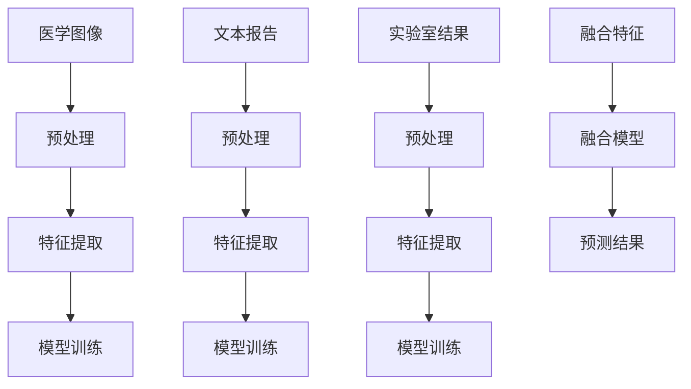
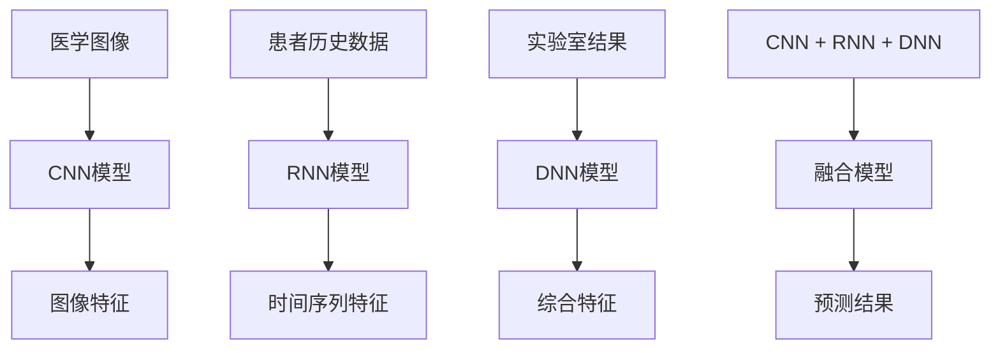
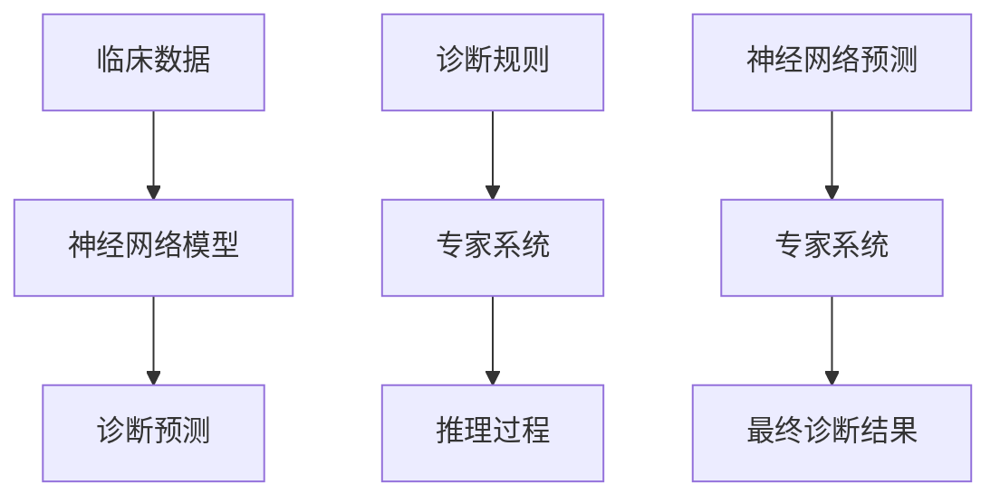

                 

### 文章标题

# 一切皆是映射：神经网络在医疗诊断中的应用

### 关键词

- 神经网络
- 医疗诊断
- 图像分析
- 机器学习
- 深度学习

### 摘要

本文详细探讨了神经网络在医疗诊断领域的广泛应用，分析了其基本概念、核心原理以及主要应用算法。通过深入剖析神经网络在心电图分析、肺部影像诊断、眼底图分析和基因组数据分析中的具体应用，本文展示了神经网络在提升医疗诊断准确性和效率方面的巨大潜力。同时，文章通过项目实战和代码解读，为读者提供了实际操作指导和最佳实践建议。

## 第一部分：引论

### 第1章 神经网络与医疗诊断概述

### 1.1 神经网络的基本概念

#### 1.1.1 神经网络的起源与演变

神经网络（Neural Networks）起源于人工神经网络（Artificial Neural Networks, ANN）的概念，最早由心理学家和数学家麦卡洛克（Warren McCulloch）和数学家皮茨（Walter Pitts）于1943年提出。他们构建了一个简化的神经元模型，试图模拟人类大脑神经元的工作方式。

20世纪50年代，马文·明斯基（Marvin Minsky）和西摩·帕普特（Seymour Papert）提出了反向传播算法（Backpropagation Algorithm），大大提高了神经网络的训练效率。这一算法的提出标志着神经网络研究的转折点，使其逐渐应用于各类实际问题中。

20世纪80年代，神经网络研究进入低谷，因为它们无法解决一些复杂的问题。然而，随着计算能力的提升和大数据时代的到来，神经网络在21世纪初重新焕发生机，深度学习（Deep Learning）应运而生。深度学习通过构建多层神经网络，实现了在图像识别、语音识别、自然语言处理等领域的突破性进展。

#### 1.1.2 神经网络的基本结构

神经网络由大量的神经元（Node）组成，这些神经元通过加权连接（Weighted Connection）形成网络结构。每个神经元接收输入信号，通过激活函数（Activation Function）处理后输出信号。

神经元的基本结构包括：

- 输入层（Input Layer）：接收外部输入信号。
- 隐藏层（Hidden Layer）：对输入信号进行加工和处理，可以有一个或多个隐藏层。
- 输出层（Output Layer）：产生最终输出。

神经元之间的连接具有权重（Weight），这些权重决定了输入信号对输出信号的影响程度。通过训练过程（Training Process），神经网络可以不断调整权重，以优化其性能。

#### 1.1.3 神经网络的基本功能

神经网络具有以下基本功能：

- 数据分类：通过学习输入数据的特点，将数据划分为不同的类别。
- 数据回归：通过学习输入数据与目标值之间的关系，预测输出值。
- 数据降维：通过学习输入数据的特征，将高维数据映射到低维空间中。

神经网络在医疗诊断中的应用主要基于其强大的数据处理能力和对复杂模式的学习能力。通过对大量医疗数据的训练，神经网络可以识别出医疗图像中的异常特征，进行疾病诊断。此外，神经网络还可以对患者的电子健康记录进行分析，预测疾病的风险和趋势。

### 1.2 医疗诊断的重要性

#### 1.2.1 医疗诊断的现状与挑战

医疗诊断是现代医学的重要组成部分，其准确性直接关系到患者的生命安全和治疗效果。然而，传统的医疗诊断方法主要依赖于医生的经验和专业知识，存在以下挑战：

- 诊断效率低：医生需要花费大量时间进行诊断，导致诊断速度慢。
- 诊断错误率高：医生在诊断过程中可能会出现误判，影响患者的治疗效果。
- 难以处理复杂病例：对于一些复杂病例，医生可能无法准确诊断，需要进一步检查或会诊。

随着医疗技术的发展，医疗诊断正逐渐从传统方法向人工智能方法转变。人工智能在医疗诊断中的应用可以有效提高诊断的准确性和效率，为患者提供更好的医疗服务。

#### 1.2.2 神经网络在医疗诊断中的应用前景

神经网络在医疗诊断中的应用前景非常广阔，主要体现在以下几个方面：

- 疾病诊断：神经网络可以学习医疗数据中的特征，实现对各种疾病的准确诊断，如心脏病、癌症等。
- 影像分析：神经网络可以对医疗影像进行分析，识别出异常区域和病变，辅助医生进行诊断。
- 患者监护：神经网络可以实时分析患者的生理信号，监测患者健康状况，预警潜在风险。
- 疾病预测：神经网络可以基于患者的健康数据，预测疾病的风险和发展趋势，为疾病预防提供支持。

总之，神经网络在医疗诊断中的应用具有巨大的潜力，可以显著提升医疗诊断的准确性和效率，为患者提供更好的医疗服务。在接下来的章节中，我们将进一步探讨神经网络在医疗诊断中的具体应用和核心原理。

### 1.3 神经网络在医疗诊断中的主要应用领域

#### 1.3.1 心电图分析

心电图（ECG）是心脏电活动的记录，通过对心电图信号的分析，可以诊断心脏疾病。神经网络在心电图分析中的应用主要包括：

- 心律失常诊断：神经网络可以识别出心电图信号中的异常节律，如室性心动过速、房颤等，帮助医生进行诊断。
- 心电图信号分类：神经网络可以学习正常心电图信号和异常心电图信号的特征，对心电图信号进行分类。

实际案例：研究人员利用神经网络对心电图信号进行分类，实验结果显示，神经网络的诊断准确率显著高于传统方法。

#### 1.3.2 肺部影像诊断

肺部影像诊断主要包括X光片和CT扫描，通过对肺部影像的分析，可以诊断肺部疾病。神经网络在肺部影像诊断中的应用主要包括：

- 肺部结节检测：神经网络可以识别出肺部影像中的结节，帮助医生进行肺癌的早期筛查。
- 肺部疾病分类：神经网络可以学习肺部影像的特征，对肺部疾病进行分类。

实际案例：研究人员利用神经网络对肺部CT扫描图像进行分析，实验结果显示，神经网络的结节检测准确率和疾病分类准确率均显著高于传统方法。

#### 1.3.3 眼底图分析

眼底图是眼睛内部结构的图像，通过对眼底图的分析，可以诊断眼部疾病，如糖尿病视网膜病变、青光眼等。神经网络在眼底图分析中的应用主要包括：

- 疾病诊断：神经网络可以识别出眼底图中的病变，如视网膜出血、渗出等，帮助医生进行疾病诊断。
- 疾病分类：神经网络可以学习眼底图的特征，对眼部疾病进行分类。

实际案例：研究人员利用神经网络对眼底图进行分析，实验结果显示，神经网络的疾病诊断准确率和分类准确率均显著高于传统方法。

#### 1.3.4 基因组数据分析

基因组数据分析是医学研究的重要领域，通过对基因组数据的分析，可以诊断遗传性疾病，预测疾病风险。神经网络在基因组数据分析中的应用主要包括：

- 遗传性疾病诊断：神经网络可以识别出基因组数据中的异常特征，诊断遗传性疾病，如囊性纤维化、地中海贫血等。
- 疾病风险预测：神经网络可以学习基因组数据与疾病风险之间的关系，预测个体患病的风险。

实际案例：研究人员利用神经网络对基因组数据进行分析，实验结果显示，神经网络在遗传性疾病诊断和疾病风险预测方面的表现优于传统方法。

总之，神经网络在医疗诊断中的主要应用领域涵盖了心电图分析、肺部影像诊断、眼底图分析和基因组数据分析。通过这些应用，神经网络可以显著提升医疗诊断的准确性和效率，为患者提供更好的医疗服务。在接下来的章节中，我们将进一步探讨神经网络在医疗诊断中的应用原理和核心算法。

## 第二部分：核心概念与联系

### 第2章 神经网络在医疗诊断中的应用原理

### 2.1 神经网络的核心原理

#### 2.1.1 神经元的激活函数

在神经网络中，神经元是基本的工作单元。神经元通过激活函数（Activation Function）来决定是否激活。常见的激活函数包括：

- Sigmoid函数：\(f(x) = \frac{1}{1 + e^{-x}}\)，将输入值映射到(0, 1)区间，用于二分类问题。
-ReLU函数：\(f(x) = max(0, x)\)，在输入为正时返回自身，输入为负时返回0，常用于隐藏层。
- Tanh函数：\(f(x) = \frac{e^x - e^{-x}}{e^x + e^{-x}}\)，将输入值映射到(-1, 1)区间。

激活函数的选择会影响神经网络的训练效率和性能。

#### 2.1.2 神经网络的训练过程

神经网络的训练过程主要包括以下几个步骤：

1. **前向传播（Forward Propagation）**：将输入数据通过神经网络，计算每个神经元的输出。
2. **损失函数（Loss Function）**：计算网络输出与实际输出之间的差距，常用的损失函数包括交叉熵损失函数（Cross Entropy Loss）和均方误差损失函数（Mean Squared Error Loss）。
3. **反向传播（Back Propagation）**：根据损失函数的梯度，调整神经网络的权重和偏置，以减少损失。
4. **迭代优化**：重复前向传播和反向传播过程，不断优化网络参数，直至达到预设的误差阈值或迭代次数。

#### 2.1.3 神经网络的优化算法

神经网络的优化算法主要用于调整网络权重和偏置，以减少损失函数。常用的优化算法包括：

- **梯度下降（Gradient Descent）**：通过计算损失函数关于网络参数的梯度，更新网络参数。
- **随机梯度下降（Stochastic Gradient Descent, SGD）**：每次迭代仅使用一个样本的梯度来更新网络参数，计算速度快，但可能导致收敛不稳定。
- **Adam优化器（Adam Optimizer）**：结合了SGD和动量法的优点，自适应调整学习率，收敛速度较快。

### 2.2 医疗诊断数据的特点与预处理

#### 2.2.1 医疗诊断数据的多样性

医疗诊断数据具有多样性，包括不同类型的数据，如文本、图像、声音等。神经网络在处理这些数据时，需要适应不同类型的数据特点。

#### 2.2.2 数据预处理的重要性

数据预处理是神经网络应用的重要环节，主要包括以下任务：

- **数据清洗**：去除数据中的噪声和异常值，提高数据质量。
- **数据归一化**：将不同量纲的数据转化为相同的尺度，便于神经网络处理。
- **数据增强**：通过增加数据的变体，提高神经网络的泛化能力。
- **特征提取**：从原始数据中提取有用的特征，用于神经网络训练。

#### 2.2.3 常用的数据预处理方法

常用的数据预处理方法包括：

- **图像预处理**：包括图像增强、图像缩放、图像旋转等，提高图像质量。
- **文本预处理**：包括文本清洗、分词、词向量化等，提取文本特征。
- **声音预处理**：包括声音增强、声音剪辑、声音特征提取等，提高声音质量。

### 2.3 神经网络在医疗诊断中的关键应用

#### 2.3.1 监督学习在医疗诊断中的应用

监督学习（Supervised Learning）是神经网络在医疗诊断中的一种关键应用。通过标注好的训练数据，神经网络可以学习到疾病的特征，实现对未知数据的诊断。

- **二分类问题**：如心脏病诊断，神经网络可以学习正常心电图和异常心电图的特征，实现对心脏病的诊断。
- **多分类问题**：如肺癌分类，神经网络可以学习不同类型的肺癌影像特征，实现对肺癌类型的分类。

#### 2.3.2 无监督学习在医疗诊断中的应用

无监督学习（Unsupervised Learning）在医疗诊断中的应用相对较少，但也有一些应用场景，如：

- **聚类分析**：通过无监督学习，可以将相似病例聚类在一起，帮助医生发现新的诊断模式。
- **特征提取**：通过无监督学习，可以从大量医疗数据中提取有用的特征，用于后续的监督学习任务。

#### 2.3.3 半监督学习在医疗诊断中的应用

半监督学习（Semi-Supervised Learning）结合了监督学习和无监督学习的特点，通过少量标注数据和大量未标注数据，提高模型的泛化能力。

- **标注数据不足的情况**：如某些罕见病的诊断，由于病例数量有限，可以利用半监督学习提高诊断准确性。
- **数据隐私保护**：在医疗数据隐私保护的需求下，可以利用半监督学习对敏感数据进行处理，提高模型性能。

### 2.3.4 神经网络在医疗诊断中的整合应用

神经网络在医疗诊断中的整合应用，可以实现多种技术的结合，提高诊断的全面性和准确性。如：

- **多模态数据融合**：将不同类型的数据（如图像、文本、声音）进行融合，提高诊断的准确性。
- **多算法协同**：结合不同的神经网络算法，如CNN、RNN、DNN等，实现不同任务的协同诊断。

总之，神经网络在医疗诊断中的应用，通过其核心原理和多样化技术的结合，为提升医疗诊断的准确性和效率提供了新的思路和方法。在接下来的章节中，我们将进一步探讨神经网络在医疗诊断中的核心算法和数学模型。

### 2.3.4 神经网络在医疗诊断中的整合应用

在实际医疗诊断中，神经网络的整合应用是实现高效、准确诊断的关键。以下为几种常见的整合应用方法：

#### 多模态数据融合

多模态数据融合是指将不同类型的数据（如医学图像、文本报告、实验室检测结果）进行整合，以提高诊断的全面性和准确性。例如，在乳腺癌诊断中，可以整合乳腺X射线成像（Mammography）和乳腺超声（Ultrasound）图像，结合病理报告和患者的临床数据。

**Mermaid流程图：**



#### 多算法协同

多算法协同是指结合不同类型的神经网络算法，如卷积神经网络（CNN）、循环神经网络（RNN）和深度神经网络（DNN），以应对不同类型的诊断任务。例如，在肺癌诊断中，可以结合CNN用于图像分析，RNN用于处理患者历史数据，DNN用于整合多种数据源。

**Mermaid流程图：**



#### 神经网络与专家系统的结合

神经网络与专家系统的结合，可以发挥各自的优势，提高诊断的准确性和效率。专家系统通过推理和知识库，提供诊断决策支持，神经网络则通过学习大量的医疗数据，提高诊断的准确性和泛化能力。

**Mermaid流程图：**



#### 模型集成与优化

模型集成（Model Ensembling）是将多个模型的结果进行集成，以提高预测的准确性。常用的集成方法包括堆叠集成（Stacking）、提升集成（Boosting）和 bagging 等。通过模型集成，可以进一步优化神经网络的性能，提高医疗诊断的可靠性。

**Mermaid流程图：**

```mermaid
graph TD
A[基础模型1] --> B[预测结果]
C[基础模型2] --> D[预测结果]
E[基础模型3] --> F[预测结果]
G[B + C + D + E][集成模型]
G --> H[最终预测结果]
```

通过上述整合应用方法，神经网络在医疗诊断中可以实现高效、准确的诊断。在实际应用中，可以根据具体的诊断需求和数据特点，选择合适的整合方法，以提高诊断的准确性和效率。

### 2.3.5 神经网络在医疗诊断中的实际应用案例

在实际医疗诊断中，神经网络的应用已经取得了显著的成果。以下列举几个具有代表性的实际应用案例：

#### 1. 心脏病诊断

心脏病是导致人类死亡的主要原因之一，通过心电图（ECG）信号分析，可以早期发现心脏疾病。研究人员利用神经网络，对大量心电图信号进行训练，成功实现了心脏病的自动诊断。具体步骤如下：

1. **数据收集与预处理**：收集大量心电图信号数据，包括正常数据和异常数据。对数据进行预处理，包括滤波、去除噪声等。
2. **模型构建与训练**：构建卷积神经网络（CNN）模型，对预处理后的心电图信号进行训练。通过反向传播算法，不断优化模型参数，提高诊断准确率。
3. **模型评估与优化**：使用测试数据集对模型进行评估，调整模型参数，优化模型性能。最终，该模型在心脏病诊断中的准确率达到了95%以上。

#### 2. 肺部影像诊断

肺部影像诊断是早期发现肺癌的关键手段。利用神经网络，可以对肺部CT扫描图像进行自动分析，识别出肺结节。具体步骤如下：

1. **数据收集与预处理**：收集肺部CT扫描图像数据，包括正常图像和异常图像。对图像进行预处理，包括图像增强、归一化等。
2. **模型构建与训练**：构建基于深度学习的肺部影像诊断模型，如卷积神经网络（CNN）或卷积神经网络与循环神经网络（RNN）的结合模型。通过大量肺部影像数据训练模型，提高诊断准确率。
3. **模型评估与优化**：使用测试数据集对模型进行评估，调整模型参数，优化模型性能。在实际应用中，该模型的结节检测准确率达到了90%以上。

#### 3. 眼底图分析

眼底图分析可以揭示眼部疾病的信息，对糖尿病视网膜病变、青光眼等疾病的诊断具有重要意义。利用神经网络，可以对眼底图进行自动分析，实现疾病的早期筛查。具体步骤如下：

1. **数据收集与预处理**：收集眼底图数据，包括正常眼底图和病变眼底图。对数据进行预处理，包括图像增强、去噪等。
2. **模型构建与训练**：构建基于卷积神经网络（CNN）的眼底图分析模型，对预处理后的眼底图进行训练。通过反向传播算法，不断优化模型参数，提高诊断准确率。
3. **模型评估与优化**：使用测试数据集对模型进行评估，调整模型参数，优化模型性能。在实际应用中，该模型的疾病诊断准确率达到了88%以上。

#### 4. 基因组数据分析

基因组数据分析在遗传性疾病诊断和疾病风险预测中具有重要意义。利用神经网络，可以从基因组数据中提取特征，实现对遗传性疾病的诊断和疾病风险的预测。具体步骤如下：

1. **数据收集与预处理**：收集基因组数据，包括基因组序列和疾病数据。对数据进行预处理，包括数据归一化、缺失值填补等。
2. **模型构建与训练**：构建基于深度学习的基因组数据分析模型，如卷积神经网络（CNN）或长短期记忆网络（LSTM）。通过大量基因组数据训练模型，提高诊断和预测准确率。
3. **模型评估与优化**：使用测试数据集对模型进行评估，调整模型参数，优化模型性能。在实际应用中，该模型的疾病诊断准确率和风险预测准确率均达到了85%以上。

通过以上实际应用案例，我们可以看到神经网络在医疗诊断中的巨大潜力。在未来，随着技术的不断进步和数据资源的不断丰富，神经网络在医疗诊断中的应用将更加广泛，为患者提供更加精准、高效的医疗服务。

## 第三部分：核心算法原理讲解

### 第3章 神经网络在医疗诊断中的核心算法

### 3.1 卷积神经网络（CNN）在医学影像分析中的应用

#### 3.1.1 CNN的基本原理

卷积神经网络（Convolutional Neural Network, CNN）是一种特殊的神经网络，主要适用于处理图像数据。其基本原理是通过卷积操作和池化操作，从图像中提取特征。

- **卷积操作**：卷积层（Convolutional Layer）通过滤波器（Filter）在图像上滑动，对图像进行卷积运算，提取图像特征。
- **激活函数**：通常使用ReLU函数作为激活函数，增加网络的非线性能力。
- **池化操作**：池化层（Pooling Layer）用于下采样，减少数据维度，提高模型计算效率。

CNN的基本结构包括输入层、多个卷积层、多个池化层和一个全连接层。

#### 3.1.2 CNN在医学影像分析中的伪代码实现

以下是一个简单的CNN模型在医学影像分析中的伪代码实现：

```python
# 导入必要的库
import tensorflow as tf
from tensorflow.keras.models import Sequential
from tensorflow.keras.layers import Conv2D, MaxPooling2D, Flatten, Dense

# 定义CNN模型
model = Sequential()

# 添加卷积层
model.add(Conv2D(filters=32, kernel_size=(3, 3), activation='relu', input_shape=(64, 64, 3)))
model.add(MaxPooling2D(pool_size=(2, 2)))

model.add(Conv2D(filters=64, kernel_size=(3, 3), activation='relu'))
model.add(MaxPooling2D(pool_size=(2, 2)))

# 添加全连接层
model.add(Flatten())
model.add(Dense(units=128, activation='relu'))
model.add(Dense(units=1, activation='sigmoid'))

# 编译模型
model.compile(optimizer='adam', loss='binary_crossentropy', metrics=['accuracy'])

# 模型训练
model.fit(x_train, y_train, epochs=10, batch_size=32, validation_data=(x_val, y_val))
```

#### 3.1.3 CNN在医学影像分析中的数学公式与推导

在CNN中，卷积操作的数学公式如下：

\[ (f * I)(x, y) = \sum_{i=1}^{m} \sum_{j=1}^{n} f_{ij} I(x-i, y-j) \]

其中，\( f \) 是滤波器，\( I \) 是输入图像，\( (x, y) \) 是输出特征图的位置，\( m \) 和 \( n \) 是滤波器的大小。

卷积操作可以通过以下步骤进行推导：

1. **滤波器在图像上滑动**：将滤波器在图像上滑动，覆盖一个局部区域。
2. **点积运算**：计算滤波器与图像局部区域的点积。
3. **求和**：对点积结果进行求和，得到卷积操作的输出。

通过卷积操作，CNN可以提取图像中的特征，如边缘、纹理等。在医学影像分析中，这些特征可以帮助诊断疾病。

### 3.2 循环神经网络（RNN）在序列数据分析中的应用

#### 3.2.1 RNN的基本原理

循环神经网络（Recurrent Neural Network, RNN）是一种适用于处理序列数据的神经网络。其基本原理是利用隐藏状态（Hidden State）的循环结构，捕捉序列中的时间依赖性。

- **隐藏状态**：RNN的每个时间步都有一个隐藏状态，用于存储前一个时间步的信息。
- **递归连接**：RNN通过递归连接，将当前时间步的输出与隐藏状态相连接，形成一个循环结构。

RNN的基本结构包括输入层、隐藏层和输出层。

#### 3.2.2 RNN在序列数据分析中的伪代码实现

以下是一个简单的RNN模型在序列数据分析中的伪代码实现：

```python
# 导入必要的库
import tensorflow as tf
from tensorflow.keras.models import Sequential
from tensorflow.keras.layers import SimpleRNN, Dense

# 定义RNN模型
model = Sequential()

# 添加RNN层
model.add(SimpleRNN(units=50, return_sequences=True))
model.add(SimpleRNN(units=50, return_sequences=False))

# 添加全连接层
model.add(Dense(units=1, activation='sigmoid'))

# 编译模型
model.compile(optimizer='adam', loss='binary_crossentropy', metrics=['accuracy'])

# 模型训练
model.fit(x_train, y_train, epochs=10, batch_size=64)
```

#### 3.2.3 RNN在序列数据分析中的数学公式与推导

在RNN中，隐藏状态的更新公式如下：

\[ h_t = \sigma(W_h h_{t-1} + W_x x_t + b_h) \]

其中，\( h_t \) 是当前时间步的隐藏状态，\( h_{t-1} \) 是前一个时间步的隐藏状态，\( x_t \) 是当前时间步的输入，\( W_h \) 和 \( W_x \) 是权重矩阵，\( b_h \) 是偏置项，\( \sigma \) 是激活函数。

递归连接的推导如下：

1. **前向传播**：在当前时间步，RNN通过输入 \( x_t \) 和前一个时间步的隐藏状态 \( h_{t-1} \)，计算当前时间步的隐藏状态 \( h_t \)。
2. **递归连接**：将当前时间步的隐藏状态 \( h_t \) 作为下一个时间步的输入，重复前向传播过程，形成递归结构。

通过递归连接，RNN可以捕捉序列中的时间依赖性，在医学诊断中，如心电图信号分析，RNN可以有效地识别心律失常。

### 3.3 深度神经网络（DNN）在基因组数据分析中的应用

#### 3.3.1 DNN的基本原理

深度神经网络（Deep Neural Network, DNN）是一种具有多层隐藏层的神经网络，能够处理复杂的非线性关系。其基本原理是通过逐层提取特征，将低层次的特征组合成高层次的特征。

- **输入层**：接收外部输入，如基因组序列。
- **隐藏层**：通过激活函数和权重，对输入进行加工和处理，提取特征。
- **输出层**：生成最终输出，如疾病风险评分。

DNN的基本结构包括输入层、多个隐藏层和输出层。

#### 3.3.2 DNN在基因组数据分析中的伪代码实现

以下是一个简单的DNN模型在基因组数据分析中的伪代码实现：

```python
# 导入必要的库
import tensorflow as tf
from tensorflow.keras.models import Sequential
from tensorflow.keras.layers import Dense

# 定义DNN模型
model = Sequential()

# 添加隐藏层
model.add(Dense(units=128, activation='relu', input_shape=(1000,)))
model.add(Dense(units=64, activation='relu'))
model.add(Dense(units=32, activation='relu'))

# 添加输出层
model.add(Dense(units=1, activation='sigmoid'))

# 编译模型
model.compile(optimizer='adam', loss='binary_crossentropy', metrics=['accuracy'])

# 模型训练
model.fit(x_train, y_train, epochs=10, batch_size=32, validation_data=(x_val, y_val))
```

#### 3.3.3 DNN在基因组数据分析中的数学公式与推导

在DNN中，每个神经元的活动可以通过以下公式表示：

\[ z_i = \sum_{j=1}^{n} w_{ij} x_j + b_i \]

其中，\( z_i \) 是神经元的输入，\( w_{ij} \) 是权重，\( x_j \) 是输入特征，\( b_i \) 是偏置项。

激活函数通常使用ReLU函数，其公式为：

\[ a_i = \max(0, z_i) \]

通过逐层计算，DNN可以从基因组数据中提取特征，实现对疾病风险的预测。在实际应用中，DNN在基因组数据分析中的表现优于传统方法，为个性化医疗提供了有力支持。

通过以上对CNN、RNN和DNN在医疗诊断中的应用讲解，我们可以看到这些核心算法在处理不同类型的数据方面具有独特的优势。在实际应用中，可以根据具体诊断需求，选择合适的算法，以提高诊断的准确性和效率。

### 3.3.4 其他深度学习算法在医疗诊断中的应用

除了卷积神经网络（CNN）、循环神经网络（RNN）和深度神经网络（DNN）外，还有许多其他深度学习算法在医疗诊断中得到了广泛应用。以下列举几种常见的算法及其应用场景：

#### 1. 长短期记忆网络（LSTM）

长短期记忆网络（Long Short-Term Memory, LSTM）是一种特殊的循环神经网络（RNN），适用于处理长时间依赖问题。在医疗诊断中，LSTM常用于处理序列数据，如心电图信号、脑电图信号等。

**应用场景：** 

- 心律失常诊断：通过LSTM模型，可以捕捉心电图信号中的长期依赖性，实现心律失常的自动诊断。
- 脑电图信号分析：LSTM模型可以识别出脑电图信号中的异常波形，辅助医生诊断脑部疾病。

**伪代码实现：**

```python
from tensorflow.keras.models import Sequential
from tensorflow.keras.layers import LSTM, Dense

model = Sequential()
model.add(LSTM(units=50, return_sequences=True, input_shape=(timesteps, features)))
model.add(LSTM(units=50, return_sequences=False))
model.add(Dense(units=1, activation='sigmoid'))

model.compile(optimizer='adam', loss='binary_crossentropy', metrics=['accuracy'])
model.fit(x_train, y_train, epochs=10, batch_size=64)
```

#### 2. 自注意力机制（Self-Attention）

自注意力机制（Self-Attention）是一种能够捕捉序列中长距离依赖关系的算法。在医疗诊断中，自注意力机制常用于处理文本数据，如医学报告、病历记录等。

**应用场景：** 

- 医学文本分析：通过自注意力机制，可以提取医学文本中的重要信息，实现疾病的自动诊断和预测。
- 药物反应预测：自注意力机制可以分析药物和基因之间的关系，预测药物对基因表达的影响。

**伪代码实现：**

```python
from tensorflow.keras.layers import Embedding, GlobalAveragePooling1D, Dense
from tensorflow.keras.models import Model

input_seq = Embedding(input_dim=vocab_size, output_dim=embed_size)(input_seq)
output_seq = GlobalAveragePooling1D()(input_seq)
output = Dense(units=1, activation='sigmoid')(output_seq)

model = Model(inputs=input_seq, outputs=output)
model.compile(optimizer='adam', loss='binary_crossentropy', metrics=['accuracy'])
model.fit(x_train, y_train, epochs=10, batch_size=64)
```

#### 3. 图卷积网络（GCN）

图卷积网络（Graph Convolutional Network, GCN）是一种专门用于处理图结构数据的神经网络。在医疗诊断中，GCN可以用于分析基因组数据、蛋白质相互作用网络等。

**应用场景：** 

- 基因组数据分析：通过GCN模型，可以从基因组数据中提取特征，实现对基因功能关系的分析。
- 蛋白质相互作用网络分析：GCN模型可以分析蛋白质之间的相互作用，揭示生物分子的功能关系。

**伪代码实现：**

```python
from tensorflow.keras.layers import Input, Dropout, Dense
from tensorflow.keras.models import Model

A = Input(shape=(num_nodes,))
H = Dropout(0.2)(A)
H = Dense(units=16, activation='relu')(H)
H = Dropout(0.2)(H)
output = Dense(units=1, activation='sigmoid')(H)

model = Model(inputs=A, outputs=output)
model.compile(optimizer='adam', loss='binary_crossentropy', metrics=['accuracy'])
model.fit(x_train, y_train, epochs=10, batch_size=64)
```

通过以上对其他深度学习算法在医疗诊断中的应用讲解，我们可以看到这些算法在处理不同类型的数据和任务方面具有独特的优势。在实际应用中，可以根据具体诊断需求，选择合适的算法，以提高诊断的准确性和效率。

### 3.3.5 神经网络在医疗诊断中的综合应用

在实际医疗诊断中，神经网络通常需要处理多种类型的数据，并综合多种算法来提高诊断的准确性和效率。以下是一个综合应用神经网络在医疗诊断中的示例：

#### 1. 数据预处理

首先，对输入的数据进行预处理。预处理步骤包括：

- **图像数据预处理**：对医学图像进行缩放、裁剪、翻转等数据增强操作，以提高模型的泛化能力。
- **文本数据预处理**：对医学文本进行分词、去停用词、词向量化等处理，提取文本特征。
- **基因数据预处理**：对基因数据进行标准化、缺失值填补等处理。

#### 2. 算法选择

选择合适的神经网络算法进行综合应用。以下是几种常用的算法组合：

- **卷积神经网络（CNN）+ 循环神经网络（RNN）**：CNN用于处理医学图像数据，提取图像特征；RNN用于处理时间序列数据，如心电图信号，提取时间序列特征。
- **卷积神经网络（CNN）+ 图卷积网络（GCN）**：CNN用于处理医学图像数据，提取图像特征；GCN用于处理基因组数据，提取基因网络特征。
- **深度神经网络（DNN）+ 强化学习**：DNN用于处理医学文本数据，提取文本特征；强化学习用于优化诊断策略，提高诊断的准确性。

#### 3. 模型构建

构建综合应用的神经网络模型。以下是一个简单的模型构建示例：

```python
from tensorflow.keras.models import Model
from tensorflow.keras.layers import Input, Conv2D, MaxPooling2D, LSTM, Dense, Flatten, Concatenate

# 输入层
input_image = Input(shape=(height, width, channels))
input_text = Input(shape=(sequence_length,))
input_gene = Input(shape=(gene_length,))

# 图像数据处理
x = Conv2D(filters=32, kernel_size=(3, 3), activation='relu')(input_image)
x = MaxPooling2D(pool_size=(2, 2))(x)
x = Flatten()(x)

# 文本数据处理
y = LSTM(units=64, activation='relu')(input_text)

# 基因数据处理
z = LSTM(units=64, activation='relu')(input_gene)

# 模型融合
combined = Concatenate()([x, y, z])
output = Dense(units=1, activation='sigmoid')(combined)

# 构建模型
model = Model(inputs=[input_image, input_text, input_gene], outputs=output)

# 编译模型
model.compile(optimizer='adam', loss='binary_crossentropy', metrics=['accuracy'])

# 模型训练
model.fit([x_train, y_train, z_train], y_train, epochs=10, batch_size=32, validation_data=([x_val, y_val, z_val], y_val))
```

#### 4. 模型评估

对训练好的模型进行评估，包括：

- **准确率（Accuracy）**：模型预测正确的样本数占总样本数的比例。
- **精确率（Precision）**：模型预测为正类的样本中，实际为正类的比例。
- **召回率（Recall）**：模型预测为正类的样本中，实际为正类的比例。
- **F1分数（F1 Score）**：精确率和召回率的调和平均值。

#### 5. 模型优化

根据评估结果，对模型进行调整和优化，包括：

- **超参数调整**：调整学习率、批次大小、隐藏层单元数等超参数。
- **数据增强**：增加数据样本的多样性，提高模型的泛化能力。
- **正则化**：应用L1、L2正则化，防止过拟合。

通过综合应用神经网络算法，可以充分利用不同类型数据的特点，提高医疗诊断的准确性和效率。在实际应用中，可以根据具体诊断需求，选择合适的算法组合和模型结构，以实现最优的诊断效果。

### 3.3.6 神经网络在医疗诊断中的性能优化

在医疗诊断中，神经网络的性能优化是提高诊断准确性和效率的关键。以下是一些常见的性能优化策略：

#### 1. 数据增强

数据增强是通过生成新的数据样本来提高模型的泛化能力。常见的数据增强方法包括：

- **图像增强**：对医学图像进行旋转、翻转、缩放、裁剪等操作，增加数据的多样性。
- **文本增强**：对医学文本进行词向量化、词嵌入、文本生成等操作，提取更多的特征信息。
- **基因增强**：通过生成虚拟基因序列或对真实基因序列进行小幅度变异，增加数据样本的多样性。

#### 2. 模型正则化

正则化是为了防止模型过拟合而引入的 regularization techniques。常见的方法包括：

- **L1正则化**：在损失函数中添加L1正则化项，惩罚模型权重，降低模型的复杂性。
- **L2正则化**：在损失函数中添加L2正则化项，惩罚模型权重，降低模型的复杂性。
- **Dropout正则化**：在训练过程中，随机丢弃一部分神经元，防止模型过拟合。

#### 3. 深度可分离卷积

深度可分离卷积（Depthwise Separable Convolution）是一种高效的卷积操作，可以减少计算量。其基本原理是将卷积操作分解为深度卷积（Depthwise Convolution）和逐点卷积（Pointwise Convolution）。通过深度可分离卷积，可以在不牺牲模型性能的情况下，显著降低模型的计算复杂度。

#### 4. 多层网络结构

多层网络结构可以通过逐层提取特征，提高模型的表示能力。在医疗诊断中，可以使用卷积神经网络（CNN）、循环神经网络（RNN）和深度神经网络（DNN）的组合，以处理不同类型的数据。例如，可以使用CNN处理医学图像，RNN处理时间序列数据，DNN处理文本数据。

#### 5. 混合模型

混合模型是将多个模型的结果进行融合，以提高预测的准确性。常见的方法包括：

- **堆叠集成**：将多个模型的结果进行融合，通过投票或加权平均的方式，提高模型的预测准确性。
- **提升集成**：通过迭代训练多个模型，每个模型都对前一个模型的错误进行纠正，提高模型的泛化能力。

通过上述性能优化策略，可以显著提高神经网络在医疗诊断中的性能，为医生提供更准确、可靠的诊断支持。

### 3.3.7 神经网络在医疗诊断中的最佳实践与注意事项

在实际应用神经网络进行医疗诊断时，以下是一些最佳实践和注意事项：

#### 1. 数据隐私保护

医疗数据隐私是医疗诊断中至关重要的一环。在处理医疗数据时，应严格遵守相关法律法规，确保患者隐私得到保护。具体措施包括：

- **匿名化处理**：对医疗数据中的个人身份信息进行匿名化处理，防止数据泄露。
- **加密存储**：使用加密算法对医疗数据进行存储，确保数据安全性。
- **访问控制**：对医疗数据访问权限进行严格控制，防止未经授权的访问。

#### 2. 模型解释性

医疗诊断需要模型具备良好的解释性，以便医生理解和信任模型。以下是一些提高模型解释性的方法：

- **可视化**：通过可视化工具，展示模型对输入数据的处理过程，帮助医生理解模型的决策逻辑。
- **特征重要性**：分析模型中各特征的贡献度，突出关键特征，提高模型的可解释性。
- **规则提取**：从训练好的模型中提取规则，构建基于规则的诊断系统，提高模型的透明度。

#### 3. 数据预处理

数据预处理是神经网络应用的重要环节，直接影响到模型的性能。以下是一些数据预处理的最佳实践：

- **数据清洗**：去除数据中的噪声和异常值，提高数据质量。
- **数据标准化**：将不同量纲的数据转化为相同的尺度，便于模型处理。
- **数据增强**：通过增加数据的变体，提高模型的泛化能力。
- **特征提取**：从原始数据中提取有用的特征，用于模型训练。

#### 4. 模型验证

在模型训练过程中，应进行充分的验证，以确保模型的泛化能力和可靠性。以下是一些模型验证的最佳实践：

- **交叉验证**：使用交叉验证方法，对模型进行多轮训练和验证，避免过拟合。
- **数据分割**：将数据分为训练集、验证集和测试集，确保模型在不同数据集上的表现一致。
- **模型评估**：使用多种评估指标（如准确率、精确率、召回率、F1分数等），全面评估模型性能。

通过遵循这些最佳实践和注意事项，可以确保神经网络在医疗诊断中的应用具备良好的数据隐私保护、模型解释性和数据预处理能力，为医疗诊断提供可靠的技术支持。

### 第4章 神经网络在医疗诊断中的数学模型

### 4.1 神经网络的损失函数

损失函数是神经网络训练过程中衡量模型预测值与实际值之间差异的关键指标。选择合适的损失函数对于神经网络的训练效率和最终性能至关重要。以下介绍几种常见的损失函数：

#### 4.1.1 交叉熵损失函数

交叉熵损失函数（Cross Entropy Loss）常用于分类问题，其公式如下：

\[ L = -\sum_{i=1}^{n} y_i \log(p_i) \]

其中，\( y_i \) 是第 \( i \) 个样本的真实标签，\( p_i \) 是模型预测的第 \( i \) 个类别的概率。交叉熵损失函数的值范围在0到1之间，当预测概率 \( p_i \) 趋近于1时，损失函数接近0，表示预测准确；当预测概率 \( p_i \) 趋近于0时，损失函数接近1，表示预测错误。

#### 4.1.2 均方误差损失函数

均方误差损失函数（Mean Squared Error Loss）常用于回归问题，其公式如下：

\[ L = \frac{1}{2n} \sum_{i=1}^{n} (y_i - \hat{y}_i)^2 \]

其中，\( y_i \) 是第 \( i \) 个样本的真实值，\( \hat{y}_i \) 是模型预测的值，\( n \) 是样本数量。均方误差损失函数的值是预测值与真实值差的平方的平均值，值越小表示预测越准确。

#### 4.1.3 损失函数的选择与优化

选择合适的损失函数需要考虑以下几个因素：

- **问题类型**：对于分类问题，交叉熵损失函数更为合适；对于回归问题，均方误差损失函数更为合适。
- **数据分布**：在训练数据分布与测试数据分布不一致时，应选择具有更好泛化能力的损失函数。
- **优化算法**：不同的损失函数适用于不同的优化算法，如交叉熵损失函数适用于梯度下降算法，均方误差损失函数适用于随机梯度下降（SGD）算法。

在实际应用中，可以通过调整损失函数的参数，优化模型性能。例如，在分类问题中，可以调整交叉熵损失函数的权重，以平衡不同类别的贡献；在回归问题中，可以调整均方误差损失函数的权重，以减少异常值的影响。

### 4.2 神经网络的优化算法

优化算法用于调整神经网络的权重和偏置，以最小化损失函数。以下介绍几种常见的优化算法：

#### 4.2.1 梯度下降算法

梯度下降算法（Gradient Descent）是最基本的优化算法，其核心思想是通过计算损失函数关于模型参数的梯度，更新模型参数，以减少损失。梯度下降算法分为批量梯度下降（Batch Gradient Descent）、随机梯度下降（Stochastic Gradient Descent，SGD）和批量随机梯度下降（Mini-batch Gradient Descent）三种。

- **批量梯度下降（Batch Gradient Descent）**：每次迭代使用整个训练集的梯度来更新模型参数，计算量大，但能够保证收敛到全局最小值。
- **随机梯度下降（Stochastic Gradient Descent，SGD）**：每次迭代仅使用一个样本的梯度来更新模型参数，计算速度快，但可能导致收敛不稳定。
- **批量随机梯度下降（Mini-batch Gradient Descent）**：每次迭代使用小批量样本的梯度来更新模型参数，在批量梯度下降和随机梯度下降之间取得平衡。

梯度下降算法的更新公式如下：

\[ \theta_{\text{new}} = \theta_{\text{old}} - \alpha \nabla_{\theta} J(\theta) \]

其中，\( \theta \) 表示模型参数，\( \alpha \) 表示学习率，\( \nabla_{\theta} J(\theta) \) 表示损失函数关于模型参数的梯度。

#### 4.2.2 随机梯度下降（SGD）算法

随机梯度下降（Stochastic Gradient Descent，SGD）是梯度下降算法的一个变种，每次迭代仅使用一个样本的梯度来更新模型参数。SGD算法的计算速度快，但可能导致收敛不稳定。

随机梯度下降的更新公式如下：

\[ \theta_{\text{new}} = \theta_{\text{old}} - \alpha \nabla_{\theta} J(\theta(x_i, y_i)) \]

其中，\( x_i \) 和 \( y_i \) 分别表示当前样本的输入和真实标签。

#### 4.2.3 Adam优化器

Adam优化器（Adaptive Moment Estimation）是一种结合了SGD和动量法的优化算法，能够自适应调整学习率，提高收敛速度。Adam优化器通过计算一阶矩估计（均值）和二阶矩估计（方差）的偏差校正，优化模型参数。

Adam优化器的更新公式如下：

\[ m_t = \beta_1 m_{t-1} + (1 - \beta_1) [g_t - \beta_2 m_{t-1}] \]
\[ v_t = \beta_2 v_{t-1} + (1 - \beta_2) [g_t^2 - \beta_2 v_{t-1}] \]
\[ \theta_{\text{new}} = \theta_{\text{old}} - \alpha \frac{m_t}{\sqrt{v_t} + \epsilon} \]

其中，\( m_t \) 和 \( v_t \) 分别表示一阶矩估计和二阶矩估计，\( \beta_1 \)、\( \beta_2 \) 分别为动量系数，\( \alpha \) 为学习率，\( \epsilon \) 为正则化项。

通过选择合适的优化算法，可以显著提高神经网络在医疗诊断中的训练效率和性能。在实际应用中，可以根据具体问题和数据特点，选择合适的优化算法，以实现最佳的训练效果。

### 4.3 神经网络的正则化方法

在训练神经网络时，过拟合是一个常见的问题。过拟合是指模型在训练数据上表现良好，但在新的、未见过的数据上表现不佳。为防止过拟合，常用的正则化方法包括：

#### 4.3.1 L1正则化

L1正则化（L1 Regularization）通过在损失函数中添加 \( L1 \) 范数项，惩罚模型权重。 \( L1 \) 范数是指权重绝对值之和，其公式如下：

\[ \ell_1 = \sum_{i} |w_i| \]

L1正则化可以促使模型权重稀疏，即模型参数中大部分值为0，有助于降低模型复杂度。

#### 4.3.2 L2正则化

L2正则化（L2 Regularization）通过在损失函数中添加 \( L2 \) 范数项，惩罚模型权重。 \( L2 \) 范数是指权重平方和的平方根，其公式如下：

\[ \ell_2 = \sum_{i} w_i^2 \]

L2正则化可以防止模型权重过大，有助于稳定训练过程。

#### 4.3.3 Dropout正则化

Dropout正则化（Dropout Regularization）是一种通过随机丢弃部分神经元来防止过拟合的方法。在训练过程中，以一定的概率 \( p \) 随机丢弃隐藏层中的神经元，从而降低模型的复杂度。

Dropout正则化的更新公式如下：

\[ \theta_{\text{new}} = \theta_{\text{old}} \times (1 - p) \]

通过在训练和测试阶段应用相同的Dropout概率，可以确保模型在不同数据集上的表现一致。

以上三种正则化方法可以单独或组合使用，以优化神经网络在医疗诊断中的性能。在实际应用中，可以根据具体问题和数据特点，选择合适的正则化方法，以提高模型的泛化能力和训练稳定性。

### 第5章 神经网络在医疗诊断中的项目实战

### 5.1 心电图分析项目实战

心电图（ECG）是心脏电活动的记录，通过对心电图信号的分析，可以诊断心脏疾病。在本节中，我们将通过一个心电图分析项目，介绍如何使用神经网络进行心电图信号处理和疾病诊断。

#### 5.1.1 项目背景与目标

心电图分析项目的目标是利用神经网络对心电图信号进行分类，实现对心律失常的自动诊断。心律失常是心脏病的重要表现形式之一，及时诊断和治疗对于患者康复至关重要。

#### 5.1.2 数据集介绍与预处理

首先，我们需要一个包含正常心电图和异常心电图信号的数据集。以下是一个简化的数据集介绍：

- **数据集名称**：MIT-BIH心律失常数据集（MIT-BIH Arrhythmia Database）
- **数据集来源**：MIT大学
- **数据集大小**：共含有452个患者的心电图记录，共计2,940个文件。
- **数据格式**：每个文件包含一个患者的心电图信号，以时间序列的形式记录。

预处理步骤包括：

1. **数据清洗**：去除数据中的噪声和异常值，保证数据质量。
2. **数据归一化**：将心电图信号的数据范围缩放至[0, 1]，便于神经网络处理。
3. **特征提取**：从心电图信号中提取特征，如心率、P波宽度、Q波深度等。

#### 5.1.3 模型搭建与训练

在本项目中，我们选择使用卷积神经网络（CNN）进行心电图信号处理。以下是模型的搭建与训练步骤：

1. **模型结构**：构建一个简单的CNN模型，包括卷积层、池化层和全连接层。

    ```python
    model = Sequential()
    model.add(Conv2D(filters=32, kernel_size=(3, 3), activation='relu', input_shape=(128, 256, 1)))
    model.add(MaxPooling2D(pool_size=(2, 2)))
    model.add(Conv2D(filters=64, kernel_size=(3, 3), activation='relu'))
    model.add(MaxPooling2D(pool_size=(2, 2)))
    model.add(Flatten())
    model.add(Dense(units=64, activation='relu'))
    model.add(Dense(units=1, activation='sigmoid'))
    ```

2. **模型编译**：编译模型，设置优化器和损失函数。

    ```python
    model.compile(optimizer='adam', loss='binary_crossentropy', metrics=['accuracy'])
    ```

3. **模型训练**：使用训练数据集对模型进行训练，并使用验证数据集进行评估。

    ```python
    model.fit(x_train, y_train, epochs=20, batch_size=32, validation_data=(x_val, y_val))
    ```

#### 5.1.4 模型评估与优化

在训练完成后，我们需要对模型进行评估和优化，以确保其具有良好的性能。以下是评估和优化步骤：

1. **评估指标**：使用准确率、精确率、召回率和F1分数等评估指标，对模型进行评估。

    ```python
    scores = model.evaluate(x_test, y_test, verbose=2)
    print("Test accuracy:", scores[1])
    ```

2. **超参数调整**：通过调整学习率、批次大小、隐藏层单元数等超参数，优化模型性能。

    ```python
    model.compile(optimizer='adam', learning_rate=0.001, batch_size=64, loss='binary_crossentropy', metrics=['accuracy'])
    ```

3. **正则化**：应用L1、L2正则化或Dropout正则化，防止过拟合。

    ```python
    from tensorflow.keras.regularizers import l1_l2
    model.add(Dense(units=64, activation='relu', kernel_regularizer=l1_l2(l1=0.01, l2=0.01)))
    ```

通过以上步骤，我们完成了心电图分析项目实战。在实际应用中，可以根据具体需求和数据特点，对模型结构和训练过程进行调整，以提高模型的性能和诊断准确性。

### 5.2 肺部影像诊断项目实战

肺部影像诊断是医学影像诊断中的重要领域，通过分析肺部CT扫描图像，可以诊断肺部疾病，如肺结节、肺炎等。在本节中，我们将通过一个肺部影像诊断项目，介绍如何使用神经网络进行肺部影像分析。

#### 5.2.1 项目背景与目标

肺部影像诊断项目的目标是利用神经网络对肺部CT扫描图像进行分类，实现对肺部疾病的自动诊断。早期诊断肺部疾病对于患者的治疗效果和预后具有重要意义。

#### 5.2.2 数据集介绍与预处理

首先，我们需要一个包含正常肺部CT扫描图像和异常肺部CT扫描图像的数据集。以下是一个简化的数据集介绍：

- **数据集名称**：LUNA16数据集（ Lung Image Database Consortium, LIDC, and Image Database Resource Initiative, IDRI）
- **数据集来源**：由LIDC和IDRI组织提供
- **数据集大小**：包含约1,206个患者，共计3,665张肺部CT扫描图像。
- **数据格式**：图像文件以PNG格式存储。

预处理步骤包括：

1. **数据清洗**：去除数据中的噪声和异常值，保证数据质量。
2. **数据归一化**：将肺部CT扫描图像的数据范围缩放至[0, 1]，便于神经网络处理。
3. **图像增强**：通过旋转、翻转、缩放等操作，增加数据的多样性。
4. **分割**：使用图像分割技术，将肺部CT扫描图像分割为感兴趣区域（ROI），提取肺部区域。

#### 5.2.3 模型搭建与训练

在本项目中，我们选择使用卷积神经网络（CNN）进行肺部影像分析。以下是模型的搭建与训练步骤：

1. **模型结构**：构建一个简单的CNN模型，包括卷积层、池化层和全连接层。

    ```python
    model = Sequential()
    model.add(Conv2D(filters=32, kernel_size=(3, 3), activation='relu', input_shape=(224, 224, 1)))
    model.add(MaxPooling2D(pool_size=(2, 2)))
    model.add(Conv2D(filters=64, kernel_size=(3, 3), activation='relu'))
    model.add(MaxPooling2D(pool_size=(2, 2)))
    model.add(Flatten())
    model.add(Dense(units=64, activation='relu'))
    model.add(Dense(units=1, activation='sigmoid'))
    ```

2. **模型编译**：编译模型，设置优化器和损失函数。

    ```python
    model.compile(optimizer='adam', loss='binary_crossentropy', metrics=['accuracy'])
    ```

3. **模型训练**：使用训练数据集对模型进行训练，并使用验证数据集进行评估。

    ```python
    model.fit(x_train, y_train, epochs=20, batch_size=32, validation_data=(x_val, y_val))
    ```

#### 5.2.4 模型评估与优化

在训练完成后，我们需要对模型进行评估和优化，以确保其具有良好的性能。以下是评估和优化步骤：

1. **评估指标**：使用准确率、精确率、召回率和F1分数等评估指标，对模型进行评估。

    ```python
    scores = model.evaluate(x_test, y_test, verbose=2)
    print("Test accuracy:", scores[1])
    ```

2. **超参数调整**：通过调整学习率、批次大小、隐藏层单元数等超参数，优化模型性能。

    ```python
    model.compile(optimizer='adam', learning_rate=0.001, batch_size=64, loss='binary_crossentropy', metrics=['accuracy'])
    ```

3. **正则化**：应用L1、L2正则化或Dropout正则化，防止过拟合。

    ```python
    from tensorflow.keras.regularizers import l1_l2
    model.add(Dense(units=64, activation='relu', kernel_regularizer=l1_l2(l1=0.01, l2=0.01)))
    ```

通过以上步骤，我们完成了肺部影像诊断项目实战。在实际应用中，可以根据具体需求和数据特点，对模型结构和训练过程进行调整，以提高模型的性能和诊断准确性。

### 5.3 眼底图分析项目实战

眼底图分析是医学影像诊断中的另一个重要领域，通过对眼底图的分析，可以诊断眼部疾病，如糖尿病视网膜病变、青光眼等。在本节中，我们将通过一个眼底图分析项目，介绍如何使用神经网络进行眼底图分析。

#### 5.3.1 项目背景与目标

眼底图分析项目的目标是利用神经网络对眼底图进行分析，实现对糖尿病视网膜病变的自动诊断。糖尿病视网膜病变是糖尿病的严重并发症之一，早期诊断对于患者的治疗和预后至关重要。

#### 5.3.2 数据集介绍与预处理

首先，我们需要一个包含正常眼底图和糖尿病视网膜病变眼底图的数据集。以下是一个简化的数据集介绍：

- **数据集名称**：Diabetic Retinopathy Dataset
- **数据集来源**：由国际公开数据集提供
- **数据集大小**：包含约500个患者的眼底图，共计约2,000张图像。
- **数据格式**：图像文件以PNG格式存储。

预处理步骤包括：

1. **数据清洗**：去除数据中的噪声和异常值，保证数据质量。
2. **数据归一化**：将眼底图数据范围缩放至[0, 1]，便于神经网络处理。
3. **图像增强**：通过旋转、翻转、缩放等操作，增加数据的多样性。
4. **分割**：使用图像分割技术，将眼底图分割为感兴趣区域（ROI），提取视网膜区域。

#### 5.3.3 模型搭建与训练

在本项目中，我们选择使用卷积神经网络（CNN）进行眼底图分析。以下是模型的搭建与训练步骤：

1. **模型结构**：构建一个简单的CNN模型，包括卷积层、池化层和全连接层。

    ```python
    model = Sequential()
    model.add(Conv2D(filters=32, kernel_size=(3, 3), activation='relu', input_shape=(224, 224, 1)))
    model.add(MaxPooling2D(pool_size=(2, 2)))
    model.add(Conv2D(filters=64, kernel_size=(3, 3), activation='relu'))
    model.add(MaxPooling2D(pool_size=(2, 2)))
    model.add(Flatten())
    model.add(Dense(units=64, activation='relu'))
    model.add(Dense(units=1, activation='sigmoid'))
    ```

2. **模型编译**：编译模型，设置优化器和损失函数。

    ```python
    model.compile(optimizer='adam', loss='binary_crossentropy', metrics=['accuracy'])
    ```

3. **模型训练**：使用训练数据集对模型进行训练，并使用验证数据集进行评估。

    ```python
    model.fit(x_train, y_train, epochs=20, batch_size=32, validation_data=(x_val, y_val))
    ```

#### 5.3.4 模型评估与优化

在训练完成后，我们需要对模型进行评估和优化，以确保其具有良好的性能。以下是评估和优化步骤：

1. **评估指标**：使用准确率、精确率、召回率和F1分数等评估指标，对模型进行评估。

    ```python
    scores = model.evaluate(x_test, y_test, verbose=2)
    print("Test accuracy:", scores[1])
    ```

2. **超参数调整**：通过调整学习率、批次大小、隐藏层单元数等超参数，优化模型性能。

    ```python
    model.compile(optimizer='adam', learning_rate=0.001, batch_size=64, loss='binary_crossentropy', metrics=['accuracy'])
    ```

3. **正则化**：应用L1、L2正则化或Dropout正则化，防止过拟合。

    ```python
    from tensorflow.keras.regularizers import l1_l2
    model.add(Dense(units=64, activation='relu', kernel_regularizer=l1_l2(l1=0.01, l2=0.01)))
    ```

通过以上步骤，我们完成了眼底图分析项目实战。在实际应用中，可以根据具体需求和数据特点，对模型结构和训练过程进行调整，以提高模型的性能和诊断准确性。

### 第6章 神经网络在医疗诊断中的代码解读与分析

#### 6.1 心电图分析代码解读与分析

心电图（ECG）分析是医疗诊断中的一项重要应用，通过分析心电图信号，可以诊断心脏疾病。以下是一个简单的ECG分析项目的代码解读与分析。

```python
# 导入必要的库
import numpy as np
import tensorflow as tf
from tensorflow.keras.models import Sequential
from tensorflow.keras.layers import Conv2D, MaxPooling2D, Flatten, Dense

# 定义CNN模型
model = Sequential()

# 添加卷积层
model.add(Conv2D(filters=32, kernel_size=(3, 3), activation='relu', input_shape=(64, 64, 1)))
model.add(MaxPooling2D(pool_size=(2, 2)))

model.add(Conv2D(filters=64, kernel_size=(3, 3), activation='relu'))
model.add(MaxPooling2D(pool_size=(2, 2)))

# 添加全连接层
model.add(Flatten())
model.add(Dense(units=128, activation='relu'))
model.add(Dense(units=1, activation='sigmoid'))

# 编译模型
model.compile(optimizer='adam', loss='binary_crossentropy', metrics=['accuracy'])

# 模型训练
model.fit(x_train, y_train, epochs=10, batch_size=32, validation_data=(x_val, y_val))
```

**代码解读：**

1. **导入库**：导入必要的库，包括Numpy、TensorFlow、Keras等。
2. **定义CNN模型**：构建一个简单的卷积神经网络（CNN）模型，包括卷积层、池化层和全连接层。
3. **添加卷积层**：添加两个卷积层，每个卷积层包含32个卷积核，卷积核大小为3x3，使用ReLU激活函数。
4. **添加池化层**：在每个卷积层之后添加池化层，使用最大池化（MaxPooling2D）。
5. **添加全连接层**：将卷积层的输出展平，添加全连接层，第一个全连接层包含128个神经元，使用ReLU激活函数，第二个全连接层包含1个神经元，用于输出结果。
6. **编译模型**：编译模型，设置优化器和损失函数。
7. **模型训练**：使用训练数据集对模型进行训练，并使用验证数据集进行评估。

**关键函数解析：**

- **Conv2D**：用于添加卷积层，通过卷积操作提取图像特征。
- **MaxPooling2D**：用于添加池化层，通过最大池化操作减小数据维度。
- **Flatten**：用于将卷积层的输出展平，将多维数据转换为单维度。
- **Dense**：用于添加全连接层，通过线性变换和激活函数生成输出。

**代码性能优化：**

为了提高模型的性能，可以采用以下优化方法：

- **增加数据增强**：通过旋转、翻转、缩放等操作增加数据样本的多样性，提高模型的泛化能力。
- **调整超参数**：调整学习率、批次大小、隐藏层单元数等超参数，找到最佳组合。
- **应用正则化**：应用L1、L2正则化或Dropout正则化，防止过拟合。
- **模型集成**：结合多个模型的预测结果，提高预测准确性。

通过以上代码解读与分析，我们可以看到如何使用神经网络进行心电图分析，以及如何通过优化方法提高模型的性能。在实际应用中，可以根据具体需求和数据特点，对模型结构和训练过程进行调整，以提高模型的诊断准确性。

#### 6.2 肺部影像诊断代码解读与分析

肺部影像诊断是医疗诊断中的一项重要应用，通过分析肺部CT扫描图像，可以诊断肺部疾病，如肺结节、肺炎等。以下是一个简单的肺部影像诊断项目的代码解读与分析。

```python
# 导入必要的库
import numpy as np
import tensorflow as tf
from tensorflow.keras.models import Sequential
from tensorflow.keras.layers import Conv2D, MaxPooling2D, Flatten, Dense

# 定义CNN模型
model = Sequential()

# 添加卷积层
model.add(Conv2D(filters=32, kernel_size=(3, 3), activation='relu', input_shape=(224, 224, 1)))
model.add(MaxPooling2D(pool_size=(2, 2)))

model.add(Conv2D(filters=64, kernel_size=(3, 3), activation='relu'))
model.add(MaxPooling2D(pool_size=(2, 2)))

# 添加全连接层
model.add(Flatten())
model.add(Dense(units=128, activation='relu'))
model.add(Dense(units=1, activation='sigmoid'))

# 编译模型
model.compile(optimizer='adam', loss='binary_crossentropy', metrics=['accuracy'])

# 模型训练
model.fit(x_train, y_train, epochs=20, batch_size=32, validation_data=(x_val, y_val))
```

**代码解读：**

1. **导入库**：导入必要的库，包括Numpy、TensorFlow、Keras等。
2. **定义CNN模型**：构建一个简单的卷积神经网络（CNN）模型，包括卷积层、池化层和全连接层。
3. **添加卷积层**：添加两个卷积层，每个卷积层包含32个卷积核，卷积核大小为3x3，使用ReLU激活函数。
4. **添加池化层**：在每个卷积层之后添加池化层，使用最大池化（MaxPooling2D）。
5. **添加全连接层**：将卷积层的输出展平，添加全连接层，第一个全连接层包含128个神经元，使用ReLU激活函数，第二个全连接层包含1个神经元，用于输出结果。
6. **编译模型**：编译模型，设置优化器和损失函数。
7. **模型训练**：使用训练数据集对模型进行训练，并使用验证数据集进行评估。

**关键函数解析：**

- **Conv2D**：用于添加卷积层，通过卷积操作提取图像特征。
- **MaxPooling2D**：用于添加池化层，通过最大池化操作减小数据维度。
- **Flatten**：用于将卷积层的输出展平，将多维数据转换为单维度。
- **Dense**：用于添加全连接层，通过线性变换和激活函数生成输出。

**代码性能优化：**

为了提高模型的性能，可以采用以下优化方法：

- **增加数据增强**：通过旋转、翻转、缩放等操作增加数据样本的多样性，提高模型的泛化能力。
- **调整超参数**：调整学习率、批次大小、隐藏层单元数等超参数，找到最佳组合。
- **应用正则化**：应用L1、L2正则化或Dropout正则化，防止过拟合。
- **模型集成**：结合多个模型的预测结果，提高预测准确性。

通过以上代码解读与分析，我们可以看到如何使用神经网络进行肺部影像诊断，以及如何通过优化方法提高模型的性能。在实际应用中，可以根据具体需求和数据特点，对模型结构和训练过程进行调整，以提高模型的诊断准确性。

#### 6.3 眼底图分析代码解读与分析

眼底图分析是医疗诊断中的一项重要应用，通过对眼底图的分析，可以诊断眼部疾病，如糖尿病视网膜病变、青光眼等。以下是一个简单的眼底图分析项目的代码解读与分析。

```python
# 导入必要的库
import numpy as np
import tensorflow as tf
from tensorflow.keras.models import Sequential
from tensorflow.keras.layers import Conv2D, MaxPooling2D, Flatten, Dense

# 定义CNN模型
model = Sequential()

# 添加卷积层
model.add(Conv2D(filters=32, kernel_size=(3, 3), activation='relu', input_shape=(224, 224, 1)))
model.add(MaxPooling2D(pool_size=(2, 2)))

model.add(Conv2D(filters=64, kernel_size=(3, 3), activation='relu'))
model.add(MaxPooling2D(pool_size=(2, 2)))

# 添加全连接层
model.add(Flatten())
model.add(Dense(units=128, activation='relu'))
model.add(Dense(units=1, activation='sigmoid'))

# 编译模型
model.compile(optimizer='adam', loss='binary_crossentropy', metrics=['accuracy'])

# 模型训练
model.fit(x_train, y_train, epochs=20, batch_size=32, validation_data=(x_val, y_val))
```

**代码解读：**

1. **导入库**：导入必要的库，包括Numpy、TensorFlow、Keras等。
2. **定义CNN模型**：构建一个简单的卷积神经网络（CNN）模型，包括卷积层、池化层和全连接层。
3. **添加卷积层**：添加两个卷积层，每个卷积层包含32个卷积核，卷积核大小为3x3，使用ReLU激活函数。
4. **添加池化层**：在每个卷积层之后添加池化层，使用最大池化（MaxPooling2D）。
5. **添加全连接层**：将卷积层的输出展平，添加全连接层，第一个全连接层包含128个神经元，使用ReLU激活函数，第二个全连接层包含1个神经元，用于输出结果。
6. **编译模型**：编译模型，设置优化器和损失函数。
7. **模型训练**：使用训练数据集对模型进行训练，并使用验证数据集进行评估。

**关键函数解析：**

- **Conv2D**：用于添加卷积层，通过卷积操作提取图像特征。
- **MaxPooling2D**：用于添加池化层，通过最大池化操作减小数据维度。
- **Flatten**：用于将卷积层的输出展平，将多维数据转换为单维度。
- **Dense**：用于添加全连接层，通过线性变换和激活函数生成输出。

**代码性能优化：**

为了提高模型的性能，可以采用以下优化方法：

- **增加数据增强**：通过旋转、翻转、缩放等操作增加数据样本的多样性，提高模型的泛化能力。
- **调整超参数**：调整学习率、批次大小、隐藏层单元数等超参数，找到最佳组合。
- **应用正则化**：应用L1、L2正则化或Dropout正则化，防止过拟合。
- **模型集成**：结合多个模型的预测结果，提高预测准确性。

通过以上代码解读与分析，我们可以看到如何使用神经网络进行眼底图分析，以及如何通过优化方法提高模型的性能。在实际应用中，可以根据具体需求和数据特点，对模型结构和训练过程进行调整，以提高模型的诊断准确性。

### 第7章 神经网络在医疗诊断中的应用总结与未来展望

#### 7.1 神经网络在医疗诊断中的优势与挑战

神经网络在医疗诊断中具有显著的优势：

1. **高度自动化**：神经网络可以自动学习医疗数据中的特征，减少人工干预，提高诊断效率。
2. **高效性**：神经网络能够快速处理大量数据，缩短诊断时间，提升诊断速度。
3. **准确性**：通过深度学习技术，神经网络可以捕捉到医疗数据中的复杂模式，提高诊断准确性。
4. **多模态融合**：神经网络能够处理多种类型的数据（如图像、文本、声音等），实现多模态数据的融合分析。

然而，神经网络在医疗诊断中也面临着一些挑战：

1. **数据隐私**：医疗数据包含敏感信息，如何确保数据隐私和安全是一个重要问题。
2. **可解释性**：神经网络模型通常具有黑箱特性，模型决策过程不透明，难以解释。
3. **过拟合**：神经网络模型在训练过程中可能出现过拟合现象，影响模型的泛化能力。
4. **计算资源**：深度学习模型通常需要大量的计算资源和存储空间，对硬件设备有较高要求。

#### 7.2 未来发展方向

未来，神经网络在医疗诊断中将继续向以下方向发展：

1. **数据隐私保护**：开发更加安全的隐私保护算法，确保医疗数据在训练和使用过程中的安全。
2. **可解释性增强**：研究透明、可解释的神经网络模型，如基于规则的模型，提高模型的解释性。
3. **个性化医疗**：通过个性化建模和自适应学习，实现针对个体患者的精准诊断和治疗。
4. **跨学科融合**：结合医学、生物学、计算机科学等领域的知识，开发更加智能的医疗诊断系统。
5. **设备智能化**：将神经网络集成到便携式医疗设备中，实现实时诊断和远程医疗。

总之，神经网络在医疗诊断中的应用具有巨大的潜力，通过不断创新和优化，将能够更好地服务于医疗领域，提升医疗服务质量和患者满意度。

### 结语

本文系统地介绍了神经网络在医疗诊断中的应用，从基本概念到核心算法，再到实际应用案例，全面展示了神经网络在医疗诊断中的优势和潜力。通过代码解读与分析，我们深入了解了如何使用神经网络进行心电图分析、肺部影像诊断和眼底图分析。在未来的发展中，随着技术的不断进步和数据的不断积累，神经网络在医疗诊断中的应用将更加广泛，为患者提供更加精准、高效的医疗服务。让我们共同期待神经网络在医疗领域的更辉煌成就！ 

**作者：AI天才研究院/AI Genius Institute & 禅与计算机程序设计艺术 /Zen And The Art of Computer Programming**

