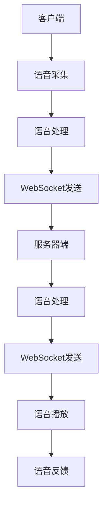

                 

### 文章标题：三七互娱2025社招游戏实时语音系统工程师面试

> 关键词：实时语音系统、游戏开发、面试准备、技术深度、实际案例

> 摘要：本文旨在为准备参加三七互娱2025社招游戏实时语音系统工程师面试的候选人提供一套完整的面试准备方案。文章详细分析了实时语音系统的基础知识、关键技术、实现方法以及面试中的常见问题，并提供了实用的项目实战经验和最佳实践技巧。希望通过本文，帮助候选人更好地掌握面试所需的核心技能和知识，顺利通过面试。

### 《三七互娱2025社招游戏实时语音系统工程师面试》目录大纲

#### 第一部分：游戏实时语音系统基础

##### 第1章：实时语音系统概述

- 1.1 实时语音系统的概念与作用

  - **定义与功能**：实时语音系统是一种能够实时处理和传输语音信号的系统，主要功能包括语音通信、语音交互、语音识别等。

  - **游戏中的角色**：实时语音系统在游戏中扮演着增强互动性、提升团队协作和创造沉浸式体验的重要角色。

- 1.2 实时语音系统的基本架构

  - **硬件设备组成**：包括麦克风、扬声器、语音处理模块等。

  - **软件系统架构**：包括客户端软件和服务器端软件。

- 1.3 实时语音系统的关键功能

  - **音频采集与处理**：包括音频采样、增益控制、降噪处理等。

  - **音频传输与同步**：使用TCP/IP协议传输语音数据，确保语音数据在不同设备之间保持同步。

  - **音频解码与播放**：将压缩的语音数据还原为可播放的音频信号。

##### 第2章：实时语音编码技术

- 2.1 实时语音编码技术概述

  - **基本原理**：实时语音编码技术是将模拟语音信号转换为数字信号，并进行压缩编码的过程。

  - **类型**：包括G.711、AAC、Opus等常见的实时语音编码算法。

- 2.2 常见的实时语音编码算法

  - **G.711**：是一种常用的语音编码算法，适用于窄带语音通信。

  - **AAC**：是一种高级音频编码算法，提供更高的音频质量和压缩效率。

  - **Opus**：是一种新型的实时语音编码算法，适用于多种带宽环境和语音质量要求。

- 2.3 实时语音编码算法的比较与选择

  - **编码效率与延迟**：需要根据实际的应用场景和带宽条件选择合适的编码算法。

  - **音质与压缩比**：不同编码算法在音质和压缩比上存在差异，需根据需求进行权衡。

##### 第3章：音频处理与噪声抑制

- 3.1 音频处理技术

  - **音频滤波器**：用于去除噪声、提升语音质量。

  - **音频增益**：用于调整语音信号的音量。

  - **音频均衡**：用于调整语音信号的频谱特性。

- 3.2 噪声抑制技术

  - **阻塞噪声抑制**：用于消除通信线路中的阻塞噪声。

  - **回声抑制**：用于消除语音通信中的回声。

  - **语音增强**：用于提升语音信号的质量，增强语音的可懂度。

- 3.3 实时语音处理算法的优化

  - **实时性能优化**：通过算法优化和硬件加速等技术提高实时语音处理的效率。

  - **内存占用优化**：通过优化数据结构和算法，减少内存占用，提高系统性能。

#### 第二部分：实时语音系统的实现

##### 第4章：实时语音系统的设计与实现

- 4.1 实时语音系统设计

  - **系统需求分析**：明确系统的功能需求和性能指标。

  - **系统架构设计**：设计系统的总体架构，包括硬件设备和软件系统的配置。

  - **系统模块划分**：将系统划分为不同的功能模块，如音频采集、处理、传输、解码和播放等。

- 4.2 实时语音系统的实现

  - **音频采集与处理模块**：实现音频信号的采集和处理。

  - **音频传输与同步模块**：实现音频信号的传输和同步。

  - **音频解码与播放模块**：实现音频信号的解码和播放。

- 4.3 实时语音系统的测试与优化

  - **功能测试**：验证系统是否满足功能需求。

  - **性能测试**：评估系统的性能指标，如延迟、带宽利用率等。

  - **调试与优化**：通过调试和优化，提高系统的稳定性和性能。

##### 第5章：游戏实时语音系统的案例解析

- 5.1 案例一：语音聊天室系统

  - **系统架构与实现**：解析语音聊天室系统的架构和实现细节。

  - **主要功能解析**：详细解析语音聊天室系统的主要功能。

  - **代码解读**：对关键代码进行解读和说明。

- 5.2 案例二：语音指挥系统

  - **系统需求分析**：分析语音指挥系统的需求。

  - **系统设计**：设计语音指挥系统的架构和功能。

  - **系统实现与优化**：实现语音指挥系统，并进行优化。

##### 第6章：实时语音系统的安全与稳定性

- 6.1 实时语音系统的安全性

  - **安全漏洞分析**：分析实时语音系统中可能存在的安全漏洞。

  - **加密与解密技术**：介绍如何使用加密技术保护语音数据。

  - **安全认证与访问控制**：介绍如何实现安全认证和访问控制。

- 6.2 实时语音系统的稳定性

  - **系统容错与故障恢复**：介绍如何设计容错机制和故障恢复策略。

  - **系统性能监控与优化**：介绍如何监控和优化系统性能。

  - **高可用性设计**：介绍如何设计高可用性系统。

##### 第7章：未来发展趋势与挑战

- 7.1 游戏实时语音系统的未来发展趋势

  - **5G技术的应用**：介绍5G技术对游戏实时语音系统的影响。

  - **虚拟现实与增强现实**：探讨虚拟现实和增强现实对游戏实时语音系统的需求。

  - **智能语音交互**：介绍智能语音交互技术的发展和应用。

- 7.2 游戏实时语音系统的挑战与应对策略

  - **音质与延迟的平衡**：讨论如何在保证音质的同时降低延迟。

  - **系统安全与隐私保护**：分析系统安全与隐私保护的重要性。

  - **系统复杂性与开发效率**：探讨如何在保证系统复杂度的同时提高开发效率。

#### 附录

- 附录A：游戏实时语音系统开发资源与工具

  - **开发工具与框架介绍**：介绍常用的开发工具和框架。

  - **常用算法与开源库**：介绍常用的实时语音处理算法和开源库。

  - **学习与交流资源**：提供学习资源和交流平台的信息。

### 第一部分：游戏实时语音系统基础

#### 第1章：实时语音系统概述

##### 1.1 实时语音系统的概念与作用

**定义与功能**

实时语音系统是一种能够实时处理和传输语音信号的系统，它通过将模拟语音信号转换为数字信号，并进行压缩编码，然后通过网络传输，最后将压缩数据解码还原为可播放的音频信号。实时语音系统的核心功能包括语音通信、语音交互和语音识别。

- **语音通信**：实时语音系统可以提供玩家之间的语音通话功能，使玩家能够进行即时交流。
- **语音交互**：实时语音系统可以支持玩家与游戏角色或其他玩家进行语音交互，提升游戏体验。
- **语音识别**：实时语音系统可以识别玩家的语音指令，实现语音控制游戏功能。

**游戏中的角色**

实时语音系统在游戏中的应用非常广泛，以下是它在游戏中扮演的重要角色：

- **增强互动性**：实时语音系统使得玩家可以实时沟通，增强了玩家之间的互动性，提升了游戏体验。
- **提升团队协作**：实时语音系统支持玩家团队间的沟通和协作，有助于提升团队作战效率。
- **创造沉浸式体验**：实时语音系统增强了游戏的沉浸感，使玩家更容易融入游戏环境，提升参与度。

##### 1.2 实时语音系统的基本架构

**硬件设备组成**

实时语音系统的硬件设备主要包括麦克风、扬声器和语音处理模块。

- **麦克风**：用于捕捉玩家的语音输入，将其转换为电信号。
- **扬声器**：用于播放语音输出，将电信号转换为声音。
- **语音处理模块**：包括音频编码器和解码器，用于处理和传输语音信号。

**软件系统架构**

实时语音系统的软件系统架构分为客户端软件和服务器端软件。

- **客户端软件**：包括语音采集、处理和播放模块，负责将玩家的语音输入转换为数字信号，并进行压缩编码，然后将压缩数据发送到服务器。
- **服务器端软件**：包括语音信号传输、存储和管理模块，负责接收客户端发送的压缩语音数据，进行解码还原为音频信号，然后存储和管理语音数据。

##### 1.3 实时语音系统的关键功能

**音频采集与处理**

音频采集与处理模块负责将玩家的语音输入转换为数字信号，并进行相应的处理。

- **音频采样**：将模拟信号转换为数字信号，通常以特定的采样率和量化精度进行。
- **增益控制**：根据需要调整语音信号的音量。
- **降噪处理**：去除语音信号中的噪声，提高语音质量。
- **回声抑制**：消除语音通信中的回声，提高语音通信质量。

**音频传输与同步**

音频传输与同步模块负责将处理后的语音数据通过网络传输，并确保语音数据在不同设备之间保持同步。

- **传输协议**：通常使用TCP/IP协议进行语音数据传输，以确保数据传输的可靠性。
- **同步机制**：通过定时器、时钟同步等技术，确保语音数据在不同设备之间保持同步。

**音频解码与播放**

音频解码与播放模块负责将接收到的压缩语音数据解码还原为音频信号，并进行播放。

- **解码过程**：将压缩的语音数据还原为原始音频信号。
- **播放**：将解码后的音频信号通过扬声器播放。

#### 第2章：实时语音编码技术

##### 2.1 实时语音编码技术概述

**基本原理**

实时语音编码技术是将模拟语音信号转换为数字信号，并进行压缩编码的过程。其基本原理如下：

- **采样**：将模拟语音信号转换为数字信号，通常以特定的采样率和量化精度进行。
- **量化**：将采样得到的连续信号转换为离散信号，通常使用固定的量化级数。
- **编码**：将量化后的离散信号转换为二进制代码，以便进行传输和存储。

**类型**

实时语音编码技术根据不同的应用场景和需求，可以分为以下几种类型：

- **波形编码**：直接对语音信号进行采样和量化，适用于语音质量要求较高的场景，如电话通信。
- **参数编码**：基于语音信号的产生模型，通过参数来描述语音信号，适用于带宽限制较严重的场景，如语音邮件。
- **混合编码**：结合波形编码和参数编码的优点，适用于多种应用场景，如实时语音通信。

##### 2.2 常见的实时语音编码算法

**G.711**

G.711是一种常见的语音编码算法，适用于窄带语音通信。它包括两种不同的编码方案：G.711μ-law和G.711A-law。

- **G.711μ-law**：采用μ-law压缩算法，适用于欧洲和美国等地区的电话通信。
- **G.711A-law**：采用A-law压缩算法，适用于日本和欧洲等地区的电话通信。

**AAC**

AAC（Advanced Audio Coding）是一种高级音频编码算法，提供了更高的音频质量和压缩效率。它广泛应用于MP3、MP4等数字音频格式中。

- **优点**：相较于传统的音频编码算法，AAC在提供更高音频质量的同时，具有更低的比特率。
- **缺点**：由于需要更高的计算复杂度，AAC的解码速度较慢。

**Opus**

Opus是一种新型的实时语音编码算法，适用于多种带宽环境和语音质量要求。它由Xiph.Org Foundation开发和维护，广泛应用于互联网音频通信中。

- **优点**：具有灵活的比特率、低延迟、高音质等特点。
- **缺点**：相较于传统的编码算法，Opus的开发和维护成本较高。

##### 2.3 实时语音编码算法的比较与选择

**编码效率与延迟**

编码效率与延迟是选择实时语音编码算法时需要考虑的重要因素。

- **编码效率**：编码效率高的算法可以在较低的比特率下提供较高的音频质量，适用于带宽限制较严重的场景。
- **延迟**：延迟低的算法可以提供更快的语音传输和交互，适用于实时语音通信场景。

**音质与压缩比**

音质和压缩比是评估实时语音编码算法性能的两个关键指标。

- **音质**：音质高的算法可以提供更自然、清晰的语音效果，适用于对语音质量有较高要求的场景。
- **压缩比**：压缩比高的算法可以在较低的比特率下提供较好的音频质量，但可能导致延迟增加。

**适用场景分析**

根据不同的应用场景和需求，可以选择不同的实时语音编码算法。

- **电话通信**：适用于G.711等传统的语音编码算法，具有较低的比特率和较好的音质。
- **视频会议**：适用于AAC等高级音频编码算法，提供更高的音频质量和压缩效率。
- **实时语音通信**：适用于Opus等新型的语音编码算法，具有低延迟、高音质和灵活的比特率等特点。

#### 第3章：音频处理与噪声抑制

##### 3.1 音频处理技术

音频处理技术是实时语音系统中的重要组成部分，用于提高语音信号的质量和可靠性。

**音频滤波器**

音频滤波器是一种用于去除噪声、提升语音质量的滤波器。

- **低通滤波器**：用于去除高频噪声，适用于去除语音信号中的高频噪声。
- **带通滤波器**：用于去除低频噪声，适用于去除语音信号中的低频噪声。

**音频增益**

音频增益是一种用于调整语音信号音量的技术。

- **增益控制**：通过调整增益系数，使语音信号在不同音量水平下保持一致。
- **自动增益控制（AGC）**：自动调整增益，使语音信号在传输过程中保持稳定的音量。

**音频均衡**

音频均衡是一种用于调整语音信号频谱特性的技术。

- **频率均衡**：通过调整不同频率的增益，使语音信号在不同频率范围内保持平衡。
- **动态均衡**：根据语音信号的动态特性，实时调整增益，以适应不同音量的变化。

##### 3.2 噪声抑制技术

噪声抑制技术是实时语音系统中用于消除噪声、提高语音质量的手段。

**阻塞噪声抑制**

阻塞噪声抑制是一种用于消除通信线路中的阻塞噪声的技术。

- **原理**：通过分析语音信号中的阻塞噪声特征，对噪声进行抑制。
- **应用**：适用于电话通信、视频会议等场景，可以有效降低通信质量。

**回声抑制**

回声抑制是一种用于消除语音通信中的回声的技术。

- **原理**：通过分析语音信号中的回声特征，对回声进行抑制。
- **应用**：适用于语音聊天室、语音指挥系统等场景，可以有效提高语音通信质量。

**语音增强**

语音增强是一种用于提升语音信号质量、增强语音可懂度的技术。

- **原理**：通过对语音信号进行处理，增强语音信号的能量和清晰度。
- **应用**：适用于语音识别、语音合成等场景，可以提高语音识别准确率和语音合成音质。

##### 3.3 实时语音处理算法的优化

实时语音处理算法的优化是提高实时语音系统性能的关键。

**实时性能优化**

实时性能优化主要通过以下方法提高实时语音处理的效率：

- **算法优化**：对算法进行优化，减少计算复杂度和内存占用。
- **硬件加速**：利用专用硬件（如DSP、FPGA）加速算法计算，提高处理速度。

**内存占用优化**

内存占用优化主要通过以下方法减少实时语音系统的内存占用：

- **数据结构优化**：选择合适的数据结构，减少内存占用。
- **内存复用**：通过内存复用技术，减少内存分配和释放的次数。

#### 第二部分：实时语音系统的实现

##### 第4章：实时语音系统的设计与实现

实时语音系统的设计与实现是构建一个高效、稳定、可靠的系统的基础。以下是实时语音系统设计的关键步骤和实现方法。

###### 4.1 实时语音系统设计

**系统需求分析**

系统需求分析是实时语音系统设计的第一步，它包括对系统功能、性能和可扩展性的需求分析。

- **功能需求**：确定系统需要支持的功能，如语音通信、语音交互和语音识别等。
- **性能需求**：确定系统的性能指标，如延迟、带宽利用率、丢包率等。
- **可扩展性需求**：确定系统的可扩展性，如支持的用户数量、处理能力等。

**系统架构设计**

系统架构设计是实时语音系统设计的关键环节，它决定了系统的性能、稳定性和可扩展性。

- **客户端架构设计**：设计客户端的架构，包括语音采集、处理、传输和播放模块。
- **服务器端架构设计**：设计服务器端的架构，包括语音信号传输、存储和管理模块。
- **网络架构设计**：设计网络架构，包括数据传输协议、数据同步机制等。

**系统模块划分**

系统模块划分是将实时语音系统划分为不同的功能模块，以便于开发、测试和维护。

- **语音采集模块**：负责从麦克风采集语音信号。
- **语音处理模块**：负责对语音信号进行预处理，如增益控制、降噪处理、回声抑制等。
- **语音传输模块**：负责将处理后的语音信号传输到服务器。
- **语音解码与播放模块**：负责将接收到的语音信号解码并播放。

###### 4.2 实时语音系统的实现

**音频采集与处理模块**

音频采集与处理模块是实时语音系统的核心模块，它负责从麦克风采集语音信号，并进行预处理。

- **采集过程**：使用音频采集API（如Windows的WASAPI、Linux的ALSA）从麦克风采集语音信号。
- **预处理过程**：对采集到的语音信号进行预处理，包括增益控制、降噪处理、回声抑制等。

```python
# 伪代码：音频采集与预处理
import sounddevice as sd
import numpy as np

# 采集音频信号
audio_signal = sd.rec(int采样率 * 时间长度, samplerate=采样率, channels=通道数)
sd.wait()

# 预处理
audio_signal = np.append(audio_signal, np.zeros(int采样率 * 延迟长度))  # 延迟填充
audio_signal = noise_removal(audio_signal)  # 噪声抑制
audio_signal = echo_cancellation(audio_signal)  # 回声抑制
```

**音频传输与同步模块**

音频传输与同步模块负责将处理后的语音信号传输到服务器，并确保语音数据在不同设备之间保持同步。

- **传输协议**：使用TCP/IP协议进行语音数据传输，以确保数据传输的可靠性和实时性。
- **同步机制**：通过定时器、时钟同步等技术，确保语音数据在不同设备之间保持同步。

```python
# 伪代码：音频传输
import socket

# 创建TCP套接字
s = socket.socket(socket.AF_INET, socket.SOCK_STREAM)

# 连接服务器
s.connect((服务器地址, 服务器端口号))

# 发送音频数据
for chunk in audio_signal:
    s.send(chunk)

# 关闭连接
s.close()
```

**音频解码与播放模块**

音频解码与播放模块负责将接收到的语音信号解码并播放。

- **解码过程**：使用音频解码器（如FFmpeg）将压缩的语音数据解码为原始音频信号。
- **播放过程**：使用音频播放器（如Windows的WaveOut、Linux的PA_SND）播放解码后的音频信号。

```python
# 伪代码：音频解码与播放
import wave
import pydub

# 解码音频数据
decoded_audio = ffmpeg.decode(audio_data)

# 播放音频
playback = pydub.AudioSegment(decoded_audio, frame_rate=采样率, channels=通道数)
playback.play()
```

###### 4.3 实时语音系统的测试与优化

**功能测试**

功能测试是验证实时语音系统是否满足功能需求的测试过程。

- **测试用例设计**：设计各种测试用例，覆盖系统的各个功能模块。
- **测试执行**：执行测试用例，验证系统功能是否正常。

**性能测试**

性能测试是评估实时语音系统性能指标的过程。

- **测试环境搭建**：搭建测试环境，包括客户端和服务器端的硬件和软件配置。
- **测试指标**：确定性能测试的指标，如延迟、带宽利用率、丢包率等。
- **测试执行**：执行性能测试，收集性能数据，进行分析和优化。

**调试与优化**

调试与优化是提高实时语音系统稳定性和性能的过程。

- **问题定位**：定位系统中的问题，如延迟、丢包、崩溃等。
- **优化方法**：根据问题定位，采取相应的优化方法，如算法优化、硬件加速、内存管理优化等。
- **迭代优化**：不断重复测试、调试和优化，直到系统性能达到预期。

##### 第5章：游戏实时语音系统的案例解析

###### 5.1 案例一：语音聊天室系统

**系统架构与实现**

语音聊天室系统是一种基于实时语音通信的社交游戏系统，玩家可以在游戏中创建或加入聊天室，与其他玩家进行语音交流。

- **系统架构**：语音聊天室系统包括客户端和服务器端。客户端负责语音采集、处理和播放，服务器端负责语音信号的传输和同步。
- **实现方法**：使用WebSocket协议实现客户端与服务器端的双向通信，使用G.711编码算法进行语音编码，使用Nginx作为反向代理服务器。



**主要功能解析**

语音聊天室系统的主要功能包括语音通信、聊天室创建和加入、聊天室管理、语音消息发送和接收等。

- **语音通信**：玩家可以在聊天室内进行实时语音交流。
- **聊天室创建和加入**：玩家可以创建聊天室或加入其他玩家创建的聊天室。
- **聊天室管理**：管理员可以对聊天室进行管理，如设置权限、禁止发言等。
- **语音消息发送和接收**：玩家可以在聊天室内发送语音消息，其他玩家可以接收并播放语音消息。

```python
# 伪代码：语音聊天室功能实现
# 创建聊天室
chat_room.create_room()

# 加入聊天室
chat_room.join_room(room_id)

# 发送语音消息
chat_room.send_message(room_id, voice_message)

# 接收语音消息
chat_room.receive_message(room_id, voice_message)
```

**代码解读**

以下是对关键代码的解读：

```python
# 伪代码：语音聊天室功能实现
class ChatRoom:
    def create_room(self):
        # 实现创建聊天室的逻辑
        pass
    
    def join_room(self, room_id):
        # 实现加入聊天室的逻辑
        pass
    
    def send_message(self, room_id, voice_message):
        # 实现发送语音消息的逻辑
        pass
    
    def receive_message(self, room_id, voice_message):
        # 实现接收语音消息的逻辑
        pass
```

###### 5.2 案例二：语音指挥系统

**系统需求分析**

语音指挥系统是一种用于团队协作的实时语音通信系统，主要应用于游戏、军事等领域。

- **功能需求**：支持语音通信、语音指挥、语音消息发送和接收、权限管理等功能。
- **性能需求**：低延迟、高稳定性、支持大量用户同时在线。
- **可扩展性需求**：支持服务器集群、负载均衡等。

**系统设计**

语音指挥系统包括客户端和服务器端。客户端负责语音采集、处理和播放，服务器端负责语音信号的传输、存储和管理。

- **客户端架构设计**：包括语音采集模块、语音处理模块、语音发送模块和语音接收模块。
- **服务器端架构设计**：包括语音信号传输模块、语音存储模块和权限管理模块。
- **网络架构设计**：使用WebSocket协议实现客户端与服务器端的双向通信，使用Nginx作为反向代理服务器。


**系统实现与优化**

**语音采集与处理模块**

语音采集与处理模块负责从麦克风采集语音信号，并进行预处理。

- **采集过程**：使用音频采集API从麦克风采集语音信号。
- **预处理过程**：对采集到的语音信号进行增益控制、降噪处理、回声抑制等。

**语音传输与同步模块**

语音传输与同步模块负责将处理后的语音信号传输到服务器，并确保语音数据在不同设备之间保持同步。

- **传输协议**：使用WebSocket协议进行语音数据传输。
- **同步机制**：通过定时器、时钟同步等技术，确保语音数据在不同设备之间保持同步。

**语音解码与播放模块**

语音解码与播放模块负责将接收到的语音信号解码并播放。

- **解码过程**：使用音频解码器将压缩的语音数据解码为原始音频信号。
- **播放过程**：使用音频播放器播放解码后的音频信号。

**系统优化**

**性能优化**

- **算法优化**：对语音处理算法进行优化，减少计算复杂度和内存占用。
- **硬件加速**：利用专用硬件（如DSP、FPGA）加速算法计算，提高处理速度。

**内存优化**

- **数据结构优化**：选择合适的数据结构，减少内存占用。
- **内存复用**：通过内存复用技术，减少内存分配和释放的次数。

**可靠性优化**

- **容错机制**：设计容错机制，确保系统在故障发生时能够快速恢复。
- **故障恢复**：实现故障恢复策略，确保系统能够在故障后恢复正常运行。

**安全性优化**

- **加密与解密**：使用加密技术保护语音数据，防止数据泄露。
- **安全认证**：实现安全认证和访问控制，确保只有授权用户可以访问系统。

#### 第6章：实时语音系统的安全与稳定性

##### 6.1 实时语音系统的安全性

**安全漏洞分析**

实时语音系统可能存在的安全漏洞包括：

- **数据泄露**：未经授权的用户可能窃取语音数据。
- **数据篡改**：攻击者可能篡改语音数据，导致通信失败或错误。
- **拒绝服务攻击（DoS）**：攻击者可能通过大量请求导致系统资源耗尽，使系统无法正常工作。
- **中间人攻击（MITM）**：攻击者可能在通信过程中拦截和篡改数据。

**加密与解密技术**

加密与解密技术是保护实时语音数据安全的重要手段。以下是一些常见的加密与解密技术：

- **对称加密**：使用相同的密钥进行加密和解密，如AES算法。
- **非对称加密**：使用不同的密钥进行加密和解密，如RSA算法。
- **哈希算法**：用于生成数据的数字摘要，确保数据完整性和真实性，如SHA-256算法。

**安全认证与访问控制**

安全认证与访问控制是确保系统安全的关键措施。以下是一些常见的安全认证与访问控制技术：

- **用户认证**：通过用户名和密码、双因素认证等方式验证用户身份。
- **访问控制**：使用访问控制列表（ACL）或角色访问控制（RBAC）等技术，限制用户对系统资源的访问。
- **权限管理**：根据用户的角色和权限，限制用户对系统的操作权限。

##### 6.2 实时语音系统的稳定性

**系统容错与故障恢复**

系统容错与故障恢复是确保实时语音系统稳定运行的关键措施。以下是一些常见的容错与故障恢复技术：

- **备份与恢复**：定期备份数据，确保在系统故障时可以快速恢复。
- **故障转移**：在主服务器出现故障时，自动切换到备用服务器，确保系统继续运行。
- **负载均衡**：将请求分配到多个服务器，避免单个服务器过载，提高系统稳定性。

**系统性能监控与优化**

系统性能监控与优化是确保实时语音系统稳定性和高效性的关键措施。以下是一些常见的监控与优化技术：

- **性能监控**：监控系统性能指标，如CPU利用率、内存利用率、网络带宽等，及时发现并解决问题。
- **性能优化**：根据监控数据，优化系统配置和算法，提高系统性能。

**高可用性设计**

高可用性设计是确保实时语音系统在故障发生时能够快速恢复，确保系统持续运行的关键措施。以下是一些常见的高可用性设计技术：

- **集群部署**：将系统部署在多个服务器上，确保在单个服务器故障时，其他服务器可以接管工作。
- **负载均衡**：将请求分配到多个服务器，避免单个服务器过载，提高系统稳定性。
- **故障自动恢复**：在故障发生时，自动进行故障恢复，确保系统持续运行。

#### 第7章：未来发展趋势与挑战

##### 7.1 游戏实时语音系统的未来发展趋势

**5G技术的应用**

5G技术的广泛应用将显著影响游戏实时语音系统的发展。5G技术具有高速度、低延迟、高带宽等特点，能够为实时语音系统提供更好的传输质量和用户体验。

- **低延迟**：5G网络的高速传输和低延迟特性，使得实时语音通信更加流畅，减少语音延迟和卡顿现象。
- **高带宽**：5G网络的高带宽特性，使得实时语音系统可以支持更多的并发连接，提高系统的并发处理能力。

**虚拟现实与增强现实**

虚拟现实（VR）和增强现实（AR）技术的快速发展，为游戏实时语音系统带来了新的应用场景。实时语音系统在VR和AR中的角色将更加重要，为用户提供更加真实的交互体验。

- **沉浸式体验**：实时语音系统可以增强VR和AR场景的交互性，提高用户的沉浸感。
- **多人互动**：实时语音系统可以支持多人同时参与VR和AR场景，提升协作和社交体验。

**智能语音交互**

智能语音交互技术的发展，将使游戏实时语音系统更加智能化和便捷化。通过语音识别和自然语言处理技术，实时语音系统可以理解用户的语音指令，实现语音控制游戏功能。

- **语音指令识别**：实时语音系统可以识别用户的语音指令，如语音聊天、语音控制角色动作等。
- **语音合成**：实时语音系统可以合成语音反馈，为用户提供实时语音提示和反馈。

##### 7.2 游戏实时语音系统的挑战与应对策略

**音质与延迟的平衡**

在实时语音系统中，音质与延迟之间存在一定的矛盾。如何在保证音质的同时降低延迟，是游戏实时语音系统面临的重要挑战。

- **编解码优化**：通过优化编解码算法，提高编码效率，降低编码延迟。
- **带宽管理**：合理分配带宽资源，确保实时语音数据优先传输。

**系统安全与隐私保护**

实时语音系统涉及大量的用户隐私数据，如语音记录、用户身份信息等。如何保护用户隐私，防止数据泄露和滥用，是游戏实时语音系统面临的重要挑战。

- **数据加密**：对用户数据采用加密技术，确保数据在传输和存储过程中的安全性。
- **隐私保护政策**：制定明确的隐私保护政策，确保用户了解自己的隐私权利。

**系统复杂性与开发效率**

随着实时语音系统功能的不断增加，系统复杂性也在逐渐提高。如何在保证系统复杂度的同时，提高开发效率，是游戏实时语音系统面临的重要挑战。

- **模块化设计**：采用模块化设计，将系统划分为不同的功能模块，提高开发效率。
- **自动化测试**：采用自动化测试，提高测试覆盖率，降低测试成本。

#### 附录

##### 附录A：游戏实时语音系统开发资源与工具

**开发工具与框架介绍**

- **开发工具**：包括IDE（如Visual Studio、Eclipse）、版本控制工具（如Git）等。
- **框架**：包括音频处理框架（如FFmpeg、OpenSSL）、网络通信框架（如WebSocket、HTTP）等。

**常用算法与开源库**

- **音频处理算法**：包括音频滤波器、增益控制、降噪处理等。
- **编解码算法**：包括G.711、AAC、Opus等常见的实时语音编码算法。
- **开源库**：包括音频处理库（如LibAV、OpenAL）、网络通信库（如Socket.io、WebRTC）等。

**学习与交流资源**

- **在线教程**：包括实时语音处理技术、网络通信技术等相关教程。
- **论坛与社群**：包括技术论坛（如Stack Overflow、Reddit）、开发者社群（如GitHub、LinkedIn）等。
- **书籍**：包括《实时语音处理技术》、《网络通信原理与应用》等相关书籍。

