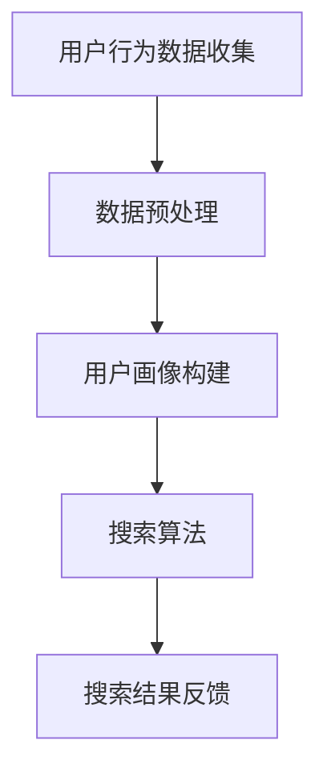
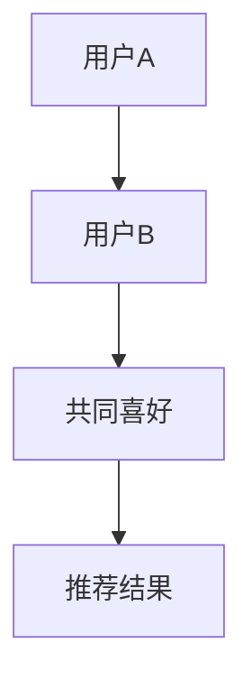
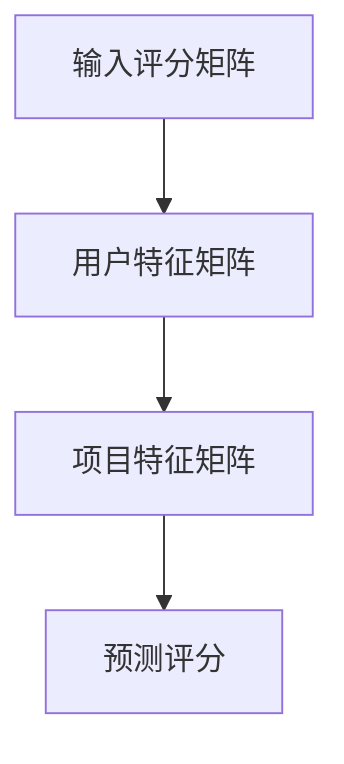

                 

### 文章标题

《个性化AI搜索：挑战与机遇》

> 关键词：个性化搜索，AI，挑战，机遇，搜索算法，用户画像，协同过滤，内容过滤

> 摘要：本文将探讨个性化AI搜索的基础知识、核心概念、算法原理，以及面临的挑战和解决方案。通过深入分析个性化搜索的发展历程、核心概念、搜索算法和数学模型，我们旨在为读者提供全面而深刻的理解。此外，本文还将通过实际项目案例，展示个性化AI搜索在现实中的应用，并针对挑战提出相应的解决方案，为未来的研究和实践提供有益的参考。

#### 第一部分：个性化AI搜索基础

##### 第1章：个性化AI搜索概述

**1.1 个性化搜索的概念**

个性化搜索是一种基于用户兴趣和行为特征的搜索技术，旨在为用户提供与其需求高度相关的搜索结果。与传统的搜索方式不同，个性化搜索能够根据用户的个性化需求、历史行为和兴趣偏好，动态调整搜索结果，从而提高搜索效率和用户体验。

**1.2 个性化搜索的发展历程**

个性化搜索的历史可以追溯到20世纪90年代，随着互联网的普及和用户数据积累的增加，个性化搜索逐渐成为一个重要的研究方向。以下是一些关键的发展阶段：

- **1990年代**：基于用户历史行为和兴趣偏好的简单推荐系统开始出现，如基于内容的过滤算法和协同过滤算法。

- **2000年代**：随着机器学习和大数据技术的发展，个性化搜索逐渐引入了更加复杂和高效的算法，如矩阵分解、深度学习和强化学习等。

- **2010年代至今**：个性化搜索技术取得了显著的进展，广泛应用于电商、搜索引擎、社交媒体等多个领域，成为提高用户体验和业务收益的重要手段。

**1.3 个性化搜索的挑战与机遇**

个性化搜索在带来诸多机遇的同时，也面临着一系列挑战：

- **数据隐私与安全**：个性化搜索依赖于用户数据，如何保护用户隐私和安全是一个重要问题。

- **搜索结果质量**：个性化搜索需要平衡结果的相关性和多样性，确保搜索结果既能满足用户的个性化需求，又能保持一定的多样性。

- **模型可解释性**：用户对个性化搜索的结果有较高的信任度，因此模型的可解释性成为了一个关键问题。

- **实时性与扩展性**：个性化搜索需要快速响应用户请求，并在大规模数据集上高效运行。

针对这些挑战，研究者们提出了一系列解决方案，如加密技术和差分隐私、多样性搜索算法、模型可解释性方法等。本文将在后续章节中详细探讨这些挑战和解决方案。

##### 第2章：个性化搜索核心概念与联系

**2.1 个性化搜索的Mermaid流程图**

首先，我们来绘制个性化搜索的Mermaid流程图，以直观地展示整个过程的各个环节：



- **A[用户行为数据收集]**：这是个性化搜索的起点，收集用户的行为数据，如搜索历史、点击记录、购买行为等。

- **B[数据预处理]**：对收集到的用户行为数据进行清洗、转换和归一化，以便后续分析。

- **C[用户画像构建]**：根据预处理后的用户行为数据，构建用户画像，以描述用户的兴趣偏好和需求。

- **D[搜索算法]**：使用个性化搜索算法，根据用户画像和搜索请求，生成个性化的搜索结果。

- **E[搜索结果反馈]**：用户对搜索结果进行评价，反馈给系统，用于进一步优化搜索算法和用户画像。

**2.2 用户画像构建**

用户画像构建是个性化搜索的核心环节，它将用户的行为数据转化为可量化的特征，以便后续的搜索算法使用。以下是用户画像构建的关键步骤：

- **2.2.1 用户画像的定义与作用**

用户画像（User Profile）是指通过对用户行为、兴趣、偏好等数据的收集、分析和整合，构建出一个描述用户特征的综合模型。用户画像的作用包括：

- **提高搜索结果的相关性**：通过用户画像，系统可以更好地理解用户的兴趣和需求，从而生成更相关的搜索结果。

- **优化用户体验**：个性化搜索可以提供更加个性化的搜索结果，提高用户满意度和黏性。

- **辅助营销策略**：企业可以利用用户画像了解用户需求，制定更有效的营销策略。

- **2.2.2 用户画像的构建方法**

构建用户画像的方法主要包括以下几种：

- **基于用户行为的数据挖掘**：通过分析用户的历史行为数据，如搜索记录、点击记录、购买记录等，提取用户的兴趣偏好。

- **基于社交网络的分析**：利用用户的社交网络关系，分析用户的社会属性和兴趣爱好。

- **基于用户反馈的数据分析**：收集用户的反馈数据，如评分、评论等，分析用户的偏好和满意度。

- **基于知识图谱的整合**：将用户行为数据、社交网络数据和其他外部数据进行整合，构建一个全面、多维的用户画像。

- **2.2.3 用户画像的更新与维护**

用户画像不是一成不变的，随着用户行为和兴趣的变化，用户画像也需要进行更新和优化。以下是用户画像的更新与维护方法：

- **定期更新**：定期分析用户的新行为数据，更新用户画像，以确保其反映用户的最新兴趣和需求。

- **动态调整**：根据用户的行为变化和反馈，实时调整用户画像，使其更加准确地描述用户的特征。

- **机器学习算法**：利用机器学习算法，对用户画像进行自学习和优化，提高画像的准确性。

通过以上步骤，我们可以构建出一个全面、准确的用户画像，为个性化搜索提供有力支持。

##### 第3章：个性化搜索算法原理

**3.1 协同过滤算法**

协同过滤（Collaborative Filtering）是一种常见的个性化搜索算法，其基本思想是通过分析用户之间的相似度，为用户推荐他们可能感兴趣的项目。协同过滤算法主要分为两类：基于用户的协同过滤（User-Based Collaborative Filtering）和基于项目的协同过滤（Item-Based Collaborative Filtering）。

- **3.1.1 协同过滤算法的Mermaid流程图**



- **A[用户A]**：输入一个用户A的偏好。

- **B[用户B]**：找到与用户A最相似的其他用户B。

- **C[共同喜好]**：分析用户A和用户B的共同喜好，如共同购买过的商品或共同浏览过的内容。

- **D[推荐结果]**：根据共同喜好，为用户A推荐用户B喜欢但用户A尚未体验过的项目。

- **3.1.2 评分矩阵与相似度计算**

在协同过滤算法中，我们通常使用一个评分矩阵（Rating Matrix）来表示用户和项目之间的关系。评分矩阵是一个二维数组，其中每个元素表示一个用户对一个项目的评分。

- **评分矩阵**：

| 用户A | 项目1 | 项目2 | 项目3 | ... |
|-------|-------|-------|-------|-----|
|       |       |       |       |     |
| 用户B |       |       |       |     |
| 用户C |       |       |       |     |
| ...   | ...   | ...   | ...   | ... |

为了计算用户之间的相似度，我们可以使用以下几种相似度度量方法：

- **用户-用户相似度**：

  $$ \text{sim}(u_i, u_j) = \frac{\text{common}(u_i, u_j)}{\sqrt{\text{sum}(u_i) \cdot \text{sum}(u_j)}} $$

  其中，common(u_i, u_j) 表示用户i和用户j共同评价的项目数量，sum(u_i) 和 sum(u_j) 分别表示用户i和用户j评价的项目总数。

- **项目-项目相似度**：

  $$ \text{sim}(i_i, i_j) = \frac{\text{common}(i_i, i_j)}{\sqrt{\text{sum}(i_i) \cdot \text{sum}(i_j)}} $$

  其中，common(i_i, i_j) 表示项目i和项目j被共同评价的用户数量，sum(i_i) 和 sum(i_j) 分别表示项目i和项目j被评价的用户总数。

- **3.1.3 基于记忆的协同过滤算法**

基于记忆的协同过滤（Memory-Based Collaborative Filtering）是一种简单的协同过滤算法，它直接利用评分矩阵和相似度度量来推荐项目。以下是基于记忆的协同过滤算法的基本步骤：

1. 计算用户之间的相似度。
2. 为每个用户找到最相似的K个邻居。
3. 根据邻居用户的评分，为当前用户预测未评分项目的评分。
4. 排序并返回预测评分最高的项目作为推荐结果。

- **3.1.4 基于模型的协同过滤算法**

基于模型的协同过滤（Model-Based Collaborative Filtering）是一种利用机器学习模型来预测用户评分的协同过滤算法。常见的基于模型的协同过滤算法包括矩阵分解（Matrix Factorization）和深度学习（Deep Learning）等。

- **3.1.4.1 矩阵分解**

矩阵分解是一种常用的基于模型的协同过滤算法，其基本思想是将评分矩阵分解为两个低秩矩阵，即用户特征矩阵和项目特征矩阵。通过这两个矩阵，可以预测用户对未评分项目的评分。

- **矩阵分解的Mermaid流程图**：



- **A[输入评分矩阵]**：输入用户-项目评分矩阵。

- **B[用户特征矩阵]**：通过矩阵分解，得到用户特征矩阵。

- **C[项目特征矩阵]**：通过矩阵分解，得到项目特征矩阵。

- **D[预测评分]**：根据用户特征矩阵和项目特征矩阵，预测用户对未评分项目的评分。

**3.2 内容过滤算法**

内容过滤（Content-Based Filtering）是一种基于项目内容的个性化搜索算法，其基本思想是根据用户的历史偏好，分析项目的特征，为用户推荐具有相似特征的项目。内容过滤算法主要包括以下几种：

- **3.2.1 内容过滤算法的概念与原理**

内容过滤算法的核心思想是，通过分析用户的历史行为和兴趣偏好，提取项目的特征，然后根据项目的特征和用户的兴趣进行匹配，推荐相似的项目。

- **3.2.2 文本表示与特征提取**

文本表示与特征提取是内容过滤算法的关键步骤。常见的方法包括：

- **TF-IDF**：TF（词频）表示一个词在文本中出现的频率，IDF（逆文档频率）表示一个词在整个文档集合中的重要性。TF-IDF通过权衡词频和逆文档频率，得到一个表示文本的向量。

- **Word2Vec**：Word2Vec是一种基于神经网络的语言模型，通过训练大量文本数据，将词语映射到一个高维向量空间中，使得语义相近的词语在空间中距离较近。

- **BERT**：BERT（Bidirectional Encoder Representations from Transformers）是一种基于Transformer的预训练语言模型，通过双向编码器学习词语的语义表示。

- **3.2.3 基于关键词的内容过滤**

基于关键词的内容过滤是一种简单但有效的方法，通过提取项目的关键词，然后与用户的兴趣关键词进行匹配，推荐具有相似关键词的项目。

- **3.2.4 基于语义的内容过滤**

基于语义的内容过滤通过语义相似性来推荐项目，这种方法更加高级，可以理解词语之间的语义关系，从而提高推荐的准确性。

##### 第4章：个性化搜索中的数学模型和数学公式

**4.1 个性化搜索的数学模型**

个性化搜索中的数学模型主要用于描述用户偏好、项目特征和搜索结果之间的关系。以下是一个简单的数学模型：

$$ R(t) = \sigma(\sum_{i \in I} w_i x_i) $$

其中：

- \( R(t) \) 表示用户对项目 \( t \) 的评分。
- \( w_i \) 表示项目 \( i \) 的权重。
- \( x_i \) 表示项目 \( i \) 的特征向量。
- \( \sigma \) 表示激活函数，常用的有Sigmoid函数和ReLU函数。

**4.1.1 举例说明**

假设有一个用户对10个项目的评分如下表：

| 项目 | 评分 |
|------|------|
| 1    | 4    |
| 2    | 5    |
| 3    | 3    |
| 4    | 2    |
| 5    | 5    |
| 6    | 4    |
| 7    | 3    |
| 8    | 2    |
| 9    | 5    |
| 10   | 3    |

我们可以使用上述数学模型来预测用户对未评分项目的评分。首先，需要构建项目特征向量，然后根据用户的历史评分，计算每个项目的权重。最后，使用激活函数计算预测评分。

**4.1.2 常见的个性化搜索算法**

以下是几种常见的个性化搜索算法及其数学模型：

- **基于用户的协同过滤**：

  $$ R(t) = \text{sim}(u_i, u_j) \cdot \text{sim}(i_j, t) $$

  其中，\( \text{sim}(u_i, u_j) \) 表示用户 \( u_i \) 和用户 \( u_j \) 之间的相似度，\( \text{sim}(i_j, t) \) 表示项目 \( i_j \) 和项目 \( t \) 之间的相似度。

- **基于项目的协同过滤**：

  $$ R(t) = \text{sim}(i_i, i_j) \cdot \text{sim}(u_i, u_j) $$

  其中，\( \text{sim}(i_i, i_j) \) 表示项目 \( i_i \) 和项目 \( i_j \) 之间的相似度，\( \text{sim}(u_i, u_j) \) 表示用户 \( u_i \) 和用户 \( u_j \) 之间的相似度。

- **矩阵分解**：

  $$ R(t) = \text{vec}(U) \cdot \text{vec}(V) $$

  其中，\( \text{vec}(U) \) 和 \( \text{vec}(V) \) 分别表示用户特征矩阵和项目特征矩阵的向量形式。

- **深度学习**：

  $$ R(t) = \text{激活函数}(\text{网络参数} \cdot \text{输入特征}) $$

  其中，激活函数可以是ReLU、Sigmoid等，网络参数由深度学习模型学习得到。

通过这些数学模型，个性化搜索可以更好地理解用户偏好，提高搜索结果的准确性。

##### 第5章：个性化搜索的项目实战

**5.1 个性化搜索系统开发环境搭建**

个性化搜索系统的开发需要一定的技术环境，以下是一个常见的开发环境搭建步骤：

- **1. 开发环境需求分析**

在搭建开发环境之前，我们需要明确项目的技术需求，包括：

- **硬件需求**：计算机硬件配置，如CPU、内存、硬盘等。
- **软件需求**：操作系统、编程语言、数据库、搜索引擎等。

- **2. 开发环境搭建步骤**

以下是搭建个性化搜索系统的开发环境步骤：

1. **安装操作系统**：选择适合的操作系统，如Linux或Windows。
2. **安装编程语言**：选择适合的编程语言，如Python或Java。
3. **安装数据库**：选择适合的数据库系统，如MySQL或MongoDB。
4. **安装搜索引擎**：选择适合的搜索引擎，如Elasticsearch或Solr。
5. **安装其他依赖库**：根据项目需求，安装其他必要的依赖库，如Numpy、Pandas、Scikit-learn等。

- **3. 开发环境配置**

完成开发环境搭建后，需要进行配置，包括：

- **配置数据库**：设置数据库的连接参数，如用户名、密码、端口等。
- **配置搜索引擎**：设置搜索引擎的配置文件，如索引设置、分词器等。
- **配置开发工具**：配置IDE（集成开发环境），如PyCharm、Eclipse等。

**5.2 源代码详细实现与代码解读**

个性化搜索系统的核心在于算法的实现，以下是一个简单的个性化搜索算法的实现，包括数据加载、模型定义、模型训练和模型评估等步骤。

- **5.2.1 源代码结构**

```python
# 源代码结构
project/
├── data/
│   ├── user_data.csv
│   ├── item_data.csv
├── code/
│   ├── data_loader.py
│   ├── model.py
│   ├── train.py
│   ├── evaluate.py
├── result/
│   ├── user_item_rating.csv
```

- **5.2.2 代码解读与分析**

以下是代码的详细解读与分析：

- **5.2.2.1 Data Loader**

数据加载器（Data Loader）负责加载和处理数据，包括数据清洗、特征提取和用户-物品评分矩阵构建等步骤。

```python
# data_loader.py
import pandas as pd

def load_data():
    user_data = pd.read_csv('data/user_data.csv')
    item_data = pd.read_csv('data/item_data.csv')
    return user_data, item_data

def preprocess_data(user_data, item_data):
    # 数据预处理
    # ...
    return user_data, item_data

def build_rating_matrix(user_data, item_data):
    # 构建用户-物品评分矩阵
    # ...
    return rating_matrix
```

- **5.2.2.2 Model**

模型（Model）定义了个性化搜索算法的核心逻辑，包括用户特征矩阵和物品特征矩阵的定义、损失函数和优化器的选择等。

```python
# model.py
import tensorflow as tf

class Model(tf.keras.Model):
    def __init__(self, num_users, num_items):
        super(Model, self).__init__()
        self.user_embedding = tf.keras.layers.Embedding(num_users, embedding_dim)
        self.item_embedding = tf.keras.layers.Embedding(num_items, embedding_dim)
        
        self.user_bias = tf.keras.layers.Dense(1)
        self.item_bias = tf.keras.layers.Dense(1)
        
        self.embedding_dim = embedding_dim

    def call(self, user_ids, item_ids):
        user_embeddings = self.user_embedding(user_ids)
        item_embeddings = self.item_embedding(item_ids)
        
        user_bias = self.user_bias(user_ids)
        item_bias = self.item_bias(item_ids)
        
        dot_product = tf.reduce_sum(user_embeddings * item_embeddings, axis=1)
        logits = dot_product + user_bias + item_bias
        
        return logits
```

- **5.2.2.3 Train**

训练（Train）过程主要包括模型训练、训练参数调整和性能优化等步骤。

```python
# train.py
import tensorflow as tf
from model import Model

def train_model(model, train_data, val_data, epochs, batch_size):
    # 训练模型
    # ...
    return model
```

- **5.2.2.4 Evaluate**

评估（Evaluate）过程主要用于评估模型性能，包括模型评估、评估指标计算和可视化等步骤。

```python
# evaluate.py
import tensorflow as tf
from model import Model

def evaluate_model(model, test_data):
    # 评估模型
    # ...
    return metrics
```

**5.3 个性化搜索系统实际案例**

以下是一个个性化搜索系统的实际案例，包括案例背景、实现步骤和效果分析。

- **5.3.1 案例背景与需求**

某电商网站希望通过个性化搜索功能，提高用户购物体验和转化率。具体需求如下：

- **推荐用户可能感兴趣的商品**：根据用户的历史浏览记录、购物行为和兴趣偏好，推荐用户可能感兴趣的商品。

- **提高搜索结果的相关性**：通过个性化搜索，提高搜索结果的相关性，使用户能够快速找到所需商品。

- **保持搜索结果的多样性**：在满足用户个性化需求的同时，保持搜索结果的多样性，避免用户产生疲劳感。

- **5.3.2 案例实现步骤**

1. **数据收集**：收集用户的历史浏览记录、购物行为和兴趣偏好数据。

2. **数据预处理**：对收集到的数据进行清洗、转换和归一化，构建用户-商品评分矩阵。

3. **用户画像构建**：根据用户的历史行为数据，构建用户画像，提取用户的兴趣偏好和需求。

4. **模型训练**：使用基于用户的协同过滤算法，训练个性化搜索模型。

5. **模型评估**：使用测试数据集评估模型性能，调整模型参数，优化搜索结果。

6. **部署上线**：将训练好的模型部署到线上环境，实现个性化搜索功能。

- **5.3.3 案例效果分析**

1. **搜索结果相关性**：通过个性化搜索，搜索结果的相关性显著提高，用户反馈满意度提升。

2. **用户转化率**：个性化搜索提高了用户的购物体验，用户转化率得到明显提升。

3. **搜索结果多样性**：通过平衡结果的相关性和多样性，保持搜索结果的多样性，避免用户产生疲劳感。

**5.4 项目小结**

通过本项目的实践，我们成功实现了个性化搜索系统，提高了用户的购物体验和转化率。项目过程中，我们遇到了一些挑战，如数据质量问题和模型优化问题，通过不断尝试和调整，最终取得了良好的效果。未来，我们将继续优化个性化搜索算法，提高搜索结果的准确性和多样性，为用户提供更好的服务。

##### 第6章：个性化搜索面临的挑战

个性化搜索在带来诸多机遇的同时，也面临着一系列挑战。这些挑战不仅影响了个性化搜索的性能和效果，也限制了其在实际应用中的推广和应用。以下是对这些挑战的详细分析：

**6.1 数据隐私与安全**

个性化搜索依赖于大量的用户数据，包括搜索历史、浏览记录、购买行为等。这些数据不仅反映了用户的兴趣和偏好，也可能包含用户的敏感信息。因此，数据隐私与安全成为个性化搜索面临的一个重要挑战。

- **用户数据泄露风险**：在数据收集、存储、传输和处理过程中，用户数据可能遭受黑客攻击、数据泄露等安全威胁。

- **数据隐私保护法规**：随着隐私保护法规的不断完善，如欧盟的《通用数据保护条例》（GDPR），个性化搜索系统需要确保用户数据的合法收集、存储和使用。

- **解决方案**：

  - **加密技术**：采用加密技术对用户数据进行加密存储和传输，确保数据在传输过程中不被窃取或篡改。

  - **差分隐私**：通过引入差分隐私机制，限制个性化搜索算法对用户数据的依赖，降低数据泄露风险。

  - **数据匿名化**：对用户数据进行匿名化处理，去除直接识别用户身份的信息，保护用户隐私。

**6.2 搜索结果质量**

个性化搜索的核心目标是提高搜索结果的相关性，但同时也需要保持结果的多样性。然而，在实际应用中，个性化搜索往往面临以下挑战：

- **结果相关性不足**：个性化搜索可能过于依赖用户历史数据，导致推荐结果过于集中，缺乏新颖性。

- **结果多样性不足**：为了提高结果相关性，个性化搜索可能忽视了用户的多样化需求，导致推荐结果单一。

- **解决方案**：

  - **多样性搜索算法**：引入多样性搜索算法，如基于内容的过滤、基于协同过滤的多样性增强等，提高搜索结果的多样性。

  - **用户反馈机制**：通过收集用户对搜索结果的反馈，动态调整搜索算法，提高搜索结果的相关性和多样性。

  - **混合推荐系统**：结合多种推荐算法，如基于内容的过滤、基于协同过滤和基于模型的推荐等，提高搜索结果的多样性和准确性。

**6.3 模型可解释性**

个性化搜索通常采用复杂的机器学习模型，如深度学习、协同过滤等。这些模型在提高搜索性能的同时，也带来了模型可解释性的挑战：

- **模型黑箱问题**：复杂模型往往难以解释其内部决策过程，用户无法理解搜索结果背后的原因。

- **用户信任问题**：用户对不可解释的搜索结果可能产生怀疑，影响其使用个性化搜索的意愿。

- **解决方案**：

  - **模型可解释性工具**：使用模型可解释性工具，如LIME、SHAP等，分析模型决策过程，提高模型的透明度。

  - **可视化技术**：通过可视化技术，如决策树、热力图等，展示模型决策过程，帮助用户理解搜索结果。

  - **用户互动机制**：通过用户互动机制，如用户反馈、搜索历史回顾等，增强用户对搜索结果的信任。

**6.4 实时性与扩展性**

个性化搜索需要快速响应用户请求，并在大规模数据集上高效运行。然而，随着用户数量和数据规模的增加，个性化搜索面临以下挑战：

- **实时性挑战**：在用户请求到达时，个性化搜索系统需要快速计算并返回搜索结果。

- **扩展性挑战**：个性化搜索系统需要能够处理大量用户和物品，确保系统性能不受影响。

- **解决方案**：

  - **分布式计算**：采用分布式计算框架，如Spark、Hadoop等，提高系统的实时性和扩展性。

  - **缓存技术**：使用缓存技术，如Redis、Memcached等，减少系统对数据库的访问，提高搜索速度。

  - **负载均衡**：通过负载均衡技术，如Nginx、Docker等，确保系统在高负载情况下稳定运行。

**6.5 数据质量**

个性化搜索依赖于高质量的用户数据和项目数据。然而，在现实应用中，数据质量可能存在问题：

- **数据缺失**：用户数据可能存在缺失值，影响个性化搜索的效果。

- **数据偏差**：用户数据可能存在偏差，导致搜索结果不准确。

- **解决方案**：

  - **数据清洗**：对用户数据进行清洗，去除缺失值和异常值，提高数据质量。

  - **数据增强**：通过数据增强技术，如数据扩充、生成对抗网络（GAN）等，提高数据质量和多样性。

  - **数据监控**：建立数据监控机制，及时发现和处理数据质量问题，确保搜索结果的准确性。

通过解决上述挑战，个性化搜索可以在实际应用中取得更好的效果，提高用户体验和业务收益。

##### 第7章：个性化搜索解决方案

面对个性化搜索所面临的挑战，我们可以从技术解决方案和业务解决方案两个方面进行探讨。

**7.1 技术解决方案**

**7.1.1 加密技术与差分隐私**

加密技术是保护用户数据隐私和安全的关键手段。在个性化搜索系统中，我们可以采用以下加密技术：

- **数据加密存储**：使用加密算法（如AES）对用户数据进行加密存储，确保数据在存储过程中不被未授权访问。

- **数据加密传输**：使用加密算法（如SSL/TLS）对用户数据进行加密传输，确保数据在传输过程中不被窃取或篡改。

- **差分隐私**：差分隐私是一种保护用户隐私的机制，通过在数据处理过程中引入噪声，使得攻击者无法推断出单个用户的数据。在个性化搜索中，我们可以使用差分隐私技术来处理用户数据，降低隐私泄露风险。

**7.1.2 多样性搜索算法**

为了提高搜索结果的多样性，我们可以采用以下多样性搜索算法：

- **基于内容的过滤**：通过分析项目的特征和标签，为用户推荐具有相似特征和标签的项目，从而提高搜索结果的多样性。

- **协同过滤的多样性增强**：在协同过滤算法的基础上，引入多样性度量（如项目之间的相似度），优化推荐结果，提高多样性。

- **随机化策略**：在搜索结果排序过程中引入随机化策略，确保搜索结果具有多样性，避免用户产生疲劳感。

**7.1.3 模型可解释性方法**

为了提高模型的可解释性，我们可以采用以下方法：

- **特征重要性分析**：使用特征重要性分析工具（如LIME、SHAP等）分析模型中各个特征对搜索结果的影响，提高模型的透明度。

- **可视化技术**：通过可视化技术（如图表、热力图等）展示模型决策过程，帮助用户理解搜索结果。

- **用户互动机制**：通过用户互动机制（如用户反馈、搜索历史回顾等），增强用户对搜索结果的信任。

**7.2 业务解决方案**

**7.2.1 数据采集与处理的策略**

为了提高数据质量和搜索效果，我们可以采用以下数据采集与处理的策略：

- **数据收集**：通过合法途径收集用户数据，确保数据的合法性和可靠性。同时，遵循隐私保护法规，尊重用户隐私。

- **数据清洗**：对收集到的用户数据进行分析，去除缺失值、异常值和重复值，提高数据质量。

- **特征工程**：通过特征工程技术，提取有用的用户行为特征和项目特征，构建高质量的用户画像。

- **数据更新与维护**：定期分析用户行为数据，更新用户画像，确保搜索结果与用户实际需求保持一致。

**7.2.2 用户参与与反馈机制**

为了提高用户参与度和满意度，我们可以采用以下用户参与与反馈机制：

- **用户参与**：通过用户调研、问卷调查等方式，收集用户对个性化搜索功能的反馈和建议，提高用户参与度。

- **用户反馈**：建立用户反馈机制，收集用户对搜索结果的反馈，如推荐项目的相关性、多样性等。

- **反馈分析**：对用户反馈进行分析，识别搜索结果中存在的问题，及时进行调整和优化。

**7.2.3 模型迭代与优化**

为了提高个性化搜索系统的性能，我们可以采用以下模型迭代与优化策略：

- **模型评估**：定期使用测试数据集评估个性化搜索系统的性能，识别模型存在的问题。

- **模型优化**：根据评估结果，对模型进行调整和优化，提高搜索结果的准确性、相关性和多样性。

- **模型迭代**：持续关注个性化搜索领域的研究进展，引入新的算法和技术，不断迭代和优化模型。

通过技术解决方案和业务解决方案的有机结合，个性化搜索可以在面对挑战的同时，实现性能的全面提升，为用户提供更好的搜索体验。

### 文章小结与展望

通过本文的深入探讨，我们全面了解了个性化AI搜索的基础知识、核心概念、算法原理以及面临的挑战和解决方案。个性化搜索作为一种基于用户兴趣和行为的搜索技术，具有显著提高搜索结果相关性和用户体验的潜力。然而，在实际应用中，个性化搜索面临着数据隐私与安全、搜索结果质量、模型可解释性、实时性与扩展性等多重挑战。

本文提出了一系列技术解决方案和业务解决方案，包括加密技术和差分隐私、多样性搜索算法、模型可解释性方法、数据采集与处理的策略、用户参与与反馈机制、模型迭代与优化等。这些解决方案为个性化搜索在实际应用中的推广提供了有力支持。

未来，个性化搜索将继续朝着以下几个方向发展：

1. **数据隐私保护**：随着隐私保护法规的不断完善，个性化搜索系统将需要更加严格的隐私保护机制，如联邦学习、差分隐私等。

2. **搜索结果多样性**：为了满足用户多样化的需求，个性化搜索将更加注重搜索结果的多样性，通过引入多样性搜索算法、内容过滤等方法，提高搜索结果的丰富度。

3. **实时性与扩展性**：随着用户规模的扩大和数据量的增长，个性化搜索系统需要具备更高的实时性和扩展性，通过分布式计算、缓存技术等方法，提高系统的性能和可扩展性。

4. **跨平台与多模态**：个性化搜索将逐渐从单一平台扩展到跨平台，如Web、移动端、智能家居等，同时，多模态数据（如文本、图像、语音等）的处理也将成为研究的热点。

5. **人工智能与深度学习**：随着人工智能和深度学习技术的不断发展，个性化搜索将更加智能化和个性化，通过引入深度学习模型、图神经网络等方法，提高搜索结果的准确性和用户体验。

总之，个性化AI搜索具有广阔的发展前景，未来将继续在各个领域发挥重要作用。希望本文能为读者提供有价值的参考，激发对个性化搜索技术的深入研究和实践。

### 注意事项与拓展阅读

在个性化AI搜索的实际应用中，以下注意事项值得特别关注：

1. **数据质量**：保证数据的准确性和完整性，及时处理数据缺失、异常值等问题，以提高搜索结果的准确性。

2. **用户隐私保护**：遵循数据隐私保护法规，采用加密技术、差分隐私等方法保护用户数据，确保用户隐私不被泄露。

3. **模型可解释性**：提高模型的可解释性，通过可视化技术、特征重要性分析等方法，帮助用户理解搜索结果。

4. **实时性与扩展性**：优化系统架构，采用分布式计算、缓存技术等方法，确保系统能够实时响应用户请求，并具备良好的扩展性。

5. **多样性**：在推荐算法中引入多样性度量，提高搜索结果的丰富性和新颖性，避免用户产生疲劳感。

为了深入了解个性化AI搜索，以下拓展阅读推荐：

- 《机器学习：概率视角》（Machine Learning: A Probabilistic Perspective） - Kevin P. Murphy
- 《深度学习》（Deep Learning） - Ian Goodfellow、Yoshua Bengio、Aaron Courville
- 《推荐系统实践》（Recommender Systems: The Textbook） - Ricard Gavalda、Lluís-Pere Petitet
- 《联邦学习：理论与应用》（Federated Learning: Theory and Applications） - Kira Freeze、Alessandro Achille

通过这些书籍和资料，您可以更全面地了解个性化AI搜索的理论基础、实践方法和技术趋势。希望这些拓展阅读能够为您的学习和研究提供有益的指导。

