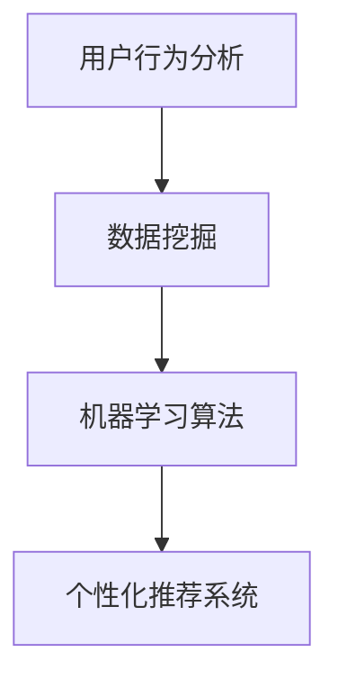
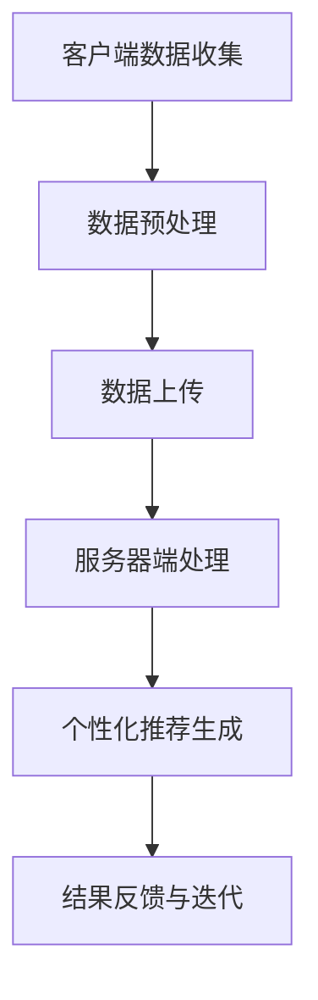

                 

# 个性化AI：适应不同用户需求的智能系统

## 关键词
- 个性化AI
- 用户需求
- 智能系统
- 机器学习
- 数据挖掘
- 推荐系统

## 摘要
随着人工智能技术的快速发展，个性化AI逐渐成为满足不同用户需求的重要工具。本文将从基础理论、应用实现和未来展望三个方面，系统探讨个性化AI的发展现状与未来趋势。通过分析个性化AI的核心技术、架构设计、数据挖掘与用户行为分析，以及其在电子商务、社交媒体、健康领域的应用，本文旨在为读者提供一个全面而深入的个性化AI理解。

## 引言
在当今数字化时代，人工智能（AI）正以前所未有的速度改变着我们的生活方式和工作方式。个性化AI作为AI的一个重要分支，旨在根据用户的特定需求和偏好，提供高度定制化的服务和体验。个性化AI的重要性在于其能够显著提升用户满意度，增强用户粘性，并为企业带来更高的商业价值。然而，实现个性化AI并非易事，它需要深入理解用户需求，掌握先进的技术手段，并解决一系列的挑战。本文将逐步分析个性化AI的基础理论、应用与实现，以及面临的挑战与未来发展方向。

## 第一部分：个性化AI的基础理论

### 第1章：个性化AI概述

#### 1.1 个性化AI的定义与背景
个性化AI是指通过分析用户的数据和行为，利用机器学习算法和其他智能技术，为用户提供高度定制化的服务和内容。其核心目标是通过理解用户的需求，提供更加精准和个性化的推荐、预测和交互。

个性化AI的发展历程可以追溯到20世纪90年代，随着互联网的普及和用户数据的积累，个性化推荐系统逐渐兴起。早期的研究主要集中在基于内容的推荐和协同过滤算法。随着机器学习技术的发展，深度学习、强化学习等算法逐渐被应用于个性化AI领域，使得系统的推荐精度和个性化程度得到了显著提升。

#### 1.2 个性化AI的核心技术与联系
个性化AI的实现依赖于多个核心技术，包括用户行为分析、数据挖掘、机器学习算法和推荐系统。这些技术之间紧密联系，共同构成了个性化AI的技术流程。

- **用户行为分析**：通过收集和分析用户的行为数据，了解用户的需求和偏好。常见的方法包括用户点击行为、搜索记录、购买历史等。

- **数据挖掘**：对用户行为数据进行分析和挖掘，提取出有用的模式和特征。常用的方法包括关联规则挖掘、聚类分析和分类算法。

- **机器学习算法**：利用机器学习算法，如决策树、支持向量机、神经网络等，对用户数据进行分析和预测。这些算法可以帮助系统识别用户的潜在需求，并生成个性化的推荐。

- **推荐系统**：根据用户的行为数据和机器学习算法的预测结果，为用户推荐相关的服务或内容。常见的推荐系统模型包括基于协同过滤的推荐系统和基于内容的推荐系统。

#### Mermaid流程图：个性化AI的技术流程

#### 1.3 个性化AI的架构设计
个性化AI的架构设计包括客户端与服务器端架构、数据处理流程和结果反馈与迭代。

- **客户端与服务器端架构**：客户端负责收集用户行为数据，并将数据上传到服务器端。服务器端负责处理数据、生成推荐结果，并将结果返回给客户端。

- **数据处理流程**：数据处理流程包括数据收集、数据预处理、数据上传和服务器端处理。数据预处理包括数据清洗、数据整合和特征提取等步骤。

- **结果反馈与迭代**：服务器端根据处理结果生成个性化推荐，并将推荐结果返回给客户端。客户端根据用户反馈对推荐结果进行评估，并将评估结果反馈给服务器端，以不断优化推荐系统。

#### Mermaid流程图：个性化AI的架构设计

### 第2章：数据挖掘与用户行为分析

#### 2.1 数据挖掘基础
数据挖掘是指从大量的数据中提取出有用的信息和知识。其基本概念包括数据源、数据预处理、数据挖掘算法和结果评估。

- **数据源**：数据挖掘的数据来源可以是结构化数据（如数据库）、半结构化数据（如XML文档）和非结构化数据（如图像和文本）。

- **数据预处理**：数据预处理包括数据清洗、数据整合和特征提取等步骤。数据清洗的目的是去除噪声和错误数据，数据整合是将来自多个数据源的数据进行整合，特征提取是将原始数据转化为能够被机器学习算法处理的特征向量。

- **数据挖掘算法**：数据挖掘算法包括关联规则挖掘、聚类分析、分类算法和异常检测等。这些算法可以帮助我们识别数据中的模式和关系。

- **结果评估**：结果评估是验证数据挖掘结果的有效性和准确性的过程。常用的评估指标包括准确率、召回率、F1分数等。

#### 2.2 用户行为分析
用户行为分析是指通过收集和分析用户的行为数据，了解用户的需求和偏好。用户行为数据包括用户的点击记录、搜索记录、购买历史等。

- **用户行为数据的收集**：用户行为数据的收集可以通过网站日志、点击流数据、应用日志等方式进行。

- **用户行为数据的预处理**：用户行为数据的预处理包括数据清洗、数据整合和特征提取等步骤。数据清洗的目的是去除噪声和错误数据，数据整合是将来自多个数据源的数据进行整合，特征提取是将原始数据转化为能够被机器学习算法处理的特征向量。

- **用户行为模式的分析**：用户行为模式的分析是通过分析用户行为数据，识别出用户的行为规律和偏好。常见的分析方法包括聚类分析和分类算法。

#### 2.3 数据可视化
数据可视化是将数据以图形化的方式展示出来，帮助人们更好地理解和分析数据。数据可视化工具的选择取决于数据类型和分析需求。

- **数据可视化工具的选择**：常见的数据可视化工具包括Tableau、Power BI、Matplotlib等。

- **数据可视化方法**：数据可视化方法包括折线图、柱状图、饼图、散点图等。

- **数据可视化案例解析**：通过具体的案例，展示如何使用数据可视化工具和方法来分析用户行为数据，识别用户行为模式。

### 第3章：机器学习算法与模型

#### 3.1 机器学习基础
机器学习是指让计算机从数据中学习和提取知识的过程。其基本概念包括监督学习、无监督学习和强化学习。

- **监督学习**：监督学习是指使用标记数据进行训练，通过预测模型来对新数据进行分类或回归。

- **无监督学习**：无监督学习是指没有标记数据，通过分析数据自身的结构和模式来进行聚类或降维。

- **强化学习**：强化学习是指通过与环境交互，学习最优策略来完成任务。

#### 3.2 常见机器学习算法
常见的机器学习算法包括决策树、支持向量机、神经网络等。

- **决策树**：决策树是一种基于树形模型的分类和回归算法。它通过一系列的决策规则，将数据划分为不同的类别或回归值。

- **支持向量机**：支持向量机是一种基于间隔最大化原理的分类算法。它通过找到一个最优的超平面，将不同类别的数据分隔开来。

- **神经网络**：神经网络是一种基于模拟人脑的神经网络结构的机器学习算法。它通过多个层级的神经元节点，对输入数据进行处理和分类。

#### 3.3 个性化推荐系统模型
个性化推荐系统模型可以分为基于协同过滤的推荐系统、基于内容的推荐系统和混合推荐系统。

- **基于协同过滤的推荐系统**：基于协同过滤的推荐系统通过分析用户的行为数据，找出相似的用户或项目，为用户推荐相似的项目。

- **基于内容的推荐系统**：基于内容的推荐系统通过分析项目的特征，为用户推荐具有相似特征的项目。

- **混合推荐系统**：混合推荐系统结合了协同过滤和基于内容的推荐系统，通过综合分析用户的行为数据和项目特征，为用户推荐更个性化的项目。

#### 3.4 模型评估与优化
模型评估与优化是确保推荐系统性能的关键。

- **模型评估指标**：常见的模型评估指标包括准确率、召回率、F1分数、精确率等。

- **模型调优方法**：模型调优方法包括参数调优、交叉验证和网格搜索等。

- **模型性能优化策略**：模型性能优化策略包括特征工程、数据预处理、模型融合和在线学习等。

### 第二部分：个性化AI的应用与实现

#### 第4章：个性化AI在电子商务中的应用

#### 4.1 个性化推荐系统在电子商务中的应用
个性化推荐系统在电子商务中的应用至关重要，它可以帮助企业提高用户满意度，增加销售额。个性化推荐系统主要通过分析用户的购物行为和历史数据，为用户推荐可能感兴趣的商品。

- **个性化推荐系统的构建**：个性化推荐系统的构建包括数据收集、数据处理、模型训练和推荐生成等步骤。

- **推荐算法的应用案例**：常见的推荐算法包括基于协同过滤的推荐系统和基于内容的推荐系统。基于协同过滤的推荐系统通过分析用户之间的相似度，为用户推荐相似的物品。基于内容的推荐系统通过分析物品的特征，为用户推荐具有相似特征的物品。

- **用户互动与反馈机制**：个性化推荐系统需要通过与用户的互动和反馈来不断优化推荐结果。用户反馈可以是显式的，如评分、评论等，也可以是隐式的，如点击、购买等。

#### 4.2 商品个性化推荐系统实现
商品个性化推荐系统的实现涉及多个方面，包括数据收集与预处理、推荐模型选择与训练、推荐结果展示与优化等。

- **数据收集与预处理**：数据收集包括用户行为数据、商品特征数据等。预处理包括数据清洗、数据整合和特征提取等步骤。

- **推荐模型选择与训练**：推荐模型的选择取决于数据和业务需求。常见的推荐模型包括基于协同过滤的推荐系统和基于内容的推荐系统。模型训练是通过将数据输入到推荐模型中，调整模型的参数，以达到最优的推荐效果。

- **推荐结果展示与优化**：推荐结果展示是将推荐结果以用户友好的方式展示给用户。优化是通过分析用户反馈和推荐效果，不断调整和改进推荐系统。

#### 4.3 案例研究：淘宝的个性化推荐系统
淘宝作为中国最大的电子商务平台，其个性化推荐系统在提升用户体验和增加销售额方面取得了显著成果。淘宝的个性化推荐系统通过分析用户的浏览历史、购买记录、搜索关键词等数据，为用户推荐个性化的商品。

- **系统架构**：淘宝的个性化推荐系统采用分布式架构，包括数据采集层、数据处理层、推荐模型层和结果展示层。

- **推荐算法**：淘宝的个性化推荐系统采用多种推荐算法，包括基于协同过滤的推荐系统和基于内容的推荐系统。同时，系统还结合了机器学习算法和深度学习算法，以提高推荐精度和个性化程度。

- **用户互动与反馈**：淘宝通过用户评价、收藏、购买等行为数据，不断优化推荐系统。同时，系统还引入了用户反馈机制，允许用户对推荐结果进行评价和反馈。

### 第5章：个性化AI在社交媒体中的应用

#### 5.1 个性化内容推荐
个性化内容推荐是社交媒体平台提高用户满意度和活跃度的重要手段。通过分析用户的行为和偏好，为用户推荐感兴趣的内容。

- **内容推荐系统的构建**：内容推荐系统包括数据收集、数据处理、模型训练和推荐生成等步骤。

- **内容推荐算法的应用**：常见的内容推荐算法包括基于协同过滤的推荐系统和基于内容的推荐系统。基于协同过滤的推荐系统通过分析用户之间的相似度，为用户推荐相似的内容。基于内容的推荐系统通过分析内容的特征，为用户推荐具有相似特征的内容。

- **用户互动与反馈机制**：用户互动与反馈机制是通过分析用户的点赞、评论、分享等行为数据，不断优化推荐系统的过程。

#### 5.2 社交网络个性化分析
社交网络个性化分析是指通过分析社交网络中的用户关系和行为数据，为用户提供个性化的社交体验。

- **社交网络数据收集与预处理**：社交网络数据收集包括用户关系数据、用户行为数据等。预处理包括数据清洗、数据整合和特征提取等步骤。

- **用户关系分析**：用户关系分析是通过分析用户之间的互动和联系，识别用户的重要关系网络。

- **个性化内容生成**：个性化内容生成是通过分析用户关系和行为数据，生成符合用户兴趣和需求的内容。

#### 5.3 案例研究：Facebook的个性化推荐系统
Facebook是全球最大的社交媒体平台之一，其个性化推荐系统在提升用户活跃度和广告效果方面取得了显著成果。Facebook的个性化推荐系统通过分析用户的浏览历史、互动行为、社交关系等数据，为用户推荐感兴趣的内容和广告。

- **系统架构**：Facebook的个性化推荐系统采用分布式架构，包括数据采集层、数据处理层、推荐模型层和结果展示层。

- **推荐算法**：Facebook的个性化推荐系统采用多种推荐算法，包括基于协同过滤的推荐系统和基于内容的推荐系统。同时，系统还结合了深度学习算法，以提高推荐精度和个性化程度。

- **用户互动与反馈**：Facebook通过用户互动行为和反馈数据，不断优化推荐系统。系统还引入了用户反馈机制，允许用户对推荐内容进行评价和反馈。

### 第6章：个性化AI在健康领域的应用

#### 6.1 个性化健康监测
个性化健康监测是指通过分析用户的健康数据，为用户提供个性化的健康评估和预测。

- **健康数据收集与处理**：健康数据收集包括生理指标数据、生活习惯数据等。数据处理包括数据清洗、数据整合和特征提取等步骤。

- **个性化健康评估**：个性化健康评估是通过分析健康数据，评估用户的健康状况和潜在风险。

- **健康预测与干预**：健康预测与干预是通过分析健康数据，预测用户的健康趋势，并提供个性化的健康干预建议。

#### 6.2 个性化健康管理系统
个性化健康管理系统是指通过分析用户的数据和行为，为用户提供个性化的健康管理和服务。

- **系统架构设计**：个性化健康管理系统包括数据采集层、数据处理层、健康评估层、预测与干预层和结果展示层。

- **数据分析与挖掘**：数据分析和挖掘是通过分析用户健康数据，识别出健康模式和风险因素。

- **用户个性化服务**：用户个性化服务是通过分析用户数据，为用户提供个性化的健康建议和干预措施。

#### 6.3 案例研究：Apple Health的个性化健康管理
Apple Health是苹果公司推出的健康管理应用程序，它通过分析用户的健康数据，为用户提供个性化的健康管理和建议。

- **系统架构**：Apple Health采用分布式架构，包括数据采集层、数据处理层、健康评估层和结果展示层。

- **健康数据收集与处理**：Apple Health通过集成多种健康设备，收集用户的健康数据，包括心率、步数、睡眠质量等。

- **个性化健康评估与预测**：Apple Health通过分析用户健康数据，评估用户的健康状况和潜在风险，并提供个性化的健康预测和建议。

### 第三部分：个性化AI的挑战与未来展望

#### 第7章：个性化AI的挑战与伦理问题

#### 7.1 数据隐私保护
数据隐私保护是个性化AI面临的重大挑战之一。个性化AI依赖于大量的用户数据，这些数据可能包含敏感信息，如个人信息、健康状况等。如何确保这些数据的安全和隐私，是个性化AI发展的重要问题。

- **数据隐私的重要性**：用户数据的隐私保护对于用户的信任和个性化AI的普及至关重要。

- **数据隐私保护的方法**：数据隐私保护的方法包括数据加密、匿名化、差分隐私等。

- **隐私法规与合规**：隐私法规与合规是确保个性化AI合法合规的重要手段，如欧盟的通用数据保护条例（GDPR）。

#### 7.2 个性化AI的伦理问题
个性化AI在带来便利和效益的同时，也可能引发一系列伦理问题，如算法偏见、隐私泄露、用户依赖等。

- **个性化AI的道德责任**：个性化AI的开发者和应用者有责任确保系统的公平性和透明度。

- **个性化AI的不公平性**：个性化AI可能导致某些群体受到不公平对待，如性别、种族、年龄等。

- **个性化AI的社会影响**：个性化AI可能对社会结构和人际关系产生深远影响，需要深入研究和关注。

#### 7.3 个性化AI的监管与规范
个性化AI的监管与规范是确保其健康发展的关键。

- **监管机构的作用**：监管机构应制定相应的法规和标准，确保个性化AI的合法合规。

- **行业自律**：个性化AI行业应建立自律机制，推动技术标准和伦理规范的制定。

- **公众参与**：公众应积极参与个性化AI的监管和规范，提高对其认知和参与度。

#### 第8章：个性化AI的未来发展趋势

#### 8.1 个性化AI技术的最新进展
个性化AI技术在不断发展，新的算法和模型不断涌现。

- **新算法与模型**：如深度强化学习、生成对抗网络（GAN）等。

- **新应用场景**：如智能医疗、智慧城市、智能家居等。

- **新技术趋势**：如物联网、区块链等新兴技术的融合。

#### 8.2 个性化AI的未来方向
个性化AI的未来发展将更加关注于技术的融合、多样性和可持续性。

- **个性化AI与物联网**：个性化AI与物联网的融合，将实现更广泛的应用场景和更精准的用户服务。

- **个性化AI与智慧城市**：个性化AI在智慧城市中的应用，将提升城市管理和服务的效率和质量。

- **个性化AI与可持续社会**：个性化AI在可持续社会中的作用，将推动社会的进步和发展。

#### 8.3 个性化AI的产业生态
个性化AI的产业生态将更加成熟和多元化。

- **产业合作**：产业链各环节的合作，将推动个性化AI的快速发展。

- **技术创新**：技术创新是推动个性化AI产业发展的关键。

- **市场推广**：个性化AI产品的市场推广，将促进其广泛应用和普及。

## 附录

### 附录A：个性化AI开发工具与资源

#### A.1 主流个性化AI开发工具
- **TensorFlow**：TensorFlow是谷歌开源的机器学习框架，广泛应用于个性化AI开发。
- **PyTorch**：PyTorch是Facebook开源的机器学习框架，以其灵活性和动态计算图而受到广泛欢迎。
- **Keras**：Keras是Python开源的深度学习库，提供了简化和高效的方式来实现个性化AI模型。

#### A.2 个性化AI数据集与资源
- **公开数据集**：如Netflix Prize、Kaggle竞赛数据集等。
- **开源代码与框架**：如scikit-learn、MLlib等。
- **个性化AI社区**：如Kaggle、AIStack Overflow等，为开发者提供了丰富的资源和交流平台。

## 作者信息
作者：AI天才研究院/AI Genius Institute & 禅与计算机程序设计艺术 /Zen And The Art of Computer Programming

