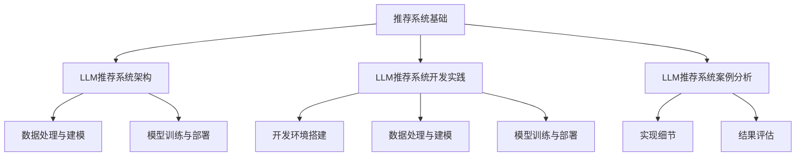

                 

## 文章标题

《为什么要在推荐系统中使用LLM》

## 关键词

- 推荐系统
- 语言模型
- LLM
- 个性化推荐
- 深度学习

## 摘要

随着互联网和大数据的迅猛发展，推荐系统已经成为提高用户体验、增加用户粘性的关键技术。近年来，基于深度学习的语言模型（LLM）在推荐系统中的应用逐渐受到关注。本文将从推荐系统概述、LLM概念及应用、LLM推荐系统设计、开发实践及案例分析等方面，系统性地探讨为什么在推荐系统中使用LLM。通过深入剖析LLM的优势、挑战及其在推荐系统中的实现与应用，本文旨在为读者提供一个全面而深刻的理解，帮助他们在实际项目中更好地应用LLM技术。

### 第一部分：推荐系统概述

#### 第1章：推荐系统基础

#### 1.1 推荐系统的定义与作用

推荐系统是一种信息过滤技术，旨在根据用户的兴趣和偏好，向用户推荐其可能感兴趣的信息或商品。推荐系统的基本原理是通过分析用户的行为数据和历史记录，构建用户与物品之间的关联模型，从而预测用户对未浏览或未购买的物品的兴趣度，并为其推荐相应的信息或商品。

推荐系统在企业中的应用非常广泛，如电子商务平台、社交媒体、新闻门户网站等。通过推荐系统，企业可以提高用户满意度，增加用户粘性，提升销售额和用户转化率。例如，Amazon的推荐系统可以基于用户的浏览历史和购买记录，为其推荐相关的商品；Netflix则可以根据用户的观看记录和偏好，推荐合适的影视内容。

#### 1.2 推荐系统的类型

推荐系统主要分为以下三种类型：

1. **内容推荐**：基于物品的属性和特征进行推荐，适用于新闻、商品、音乐等场景。例如，新闻门户可以根据文章的标题、标签和分类进行推荐。
   
2. **协同过滤推荐**：基于用户的行为和偏好，通过计算用户之间的相似度，为用户推荐相似的物品。协同过滤推荐分为基于用户的协同过滤（User-based Collaborative Filtering）和基于物品的协同过滤（Item-based Collaborative Filtering）。

3. **混合推荐系统**：结合内容推荐和协同过滤推荐，提高推荐的准确性和多样性。混合推荐系统通常采用加权方法，将不同类型推荐系统的结果进行融合，以达到更好的推荐效果。

#### 1.3 推荐系统的评价指标

推荐系统的性能评估通常涉及以下几个评价指标：

1. **精准度（Precision）**：推荐结果中真实相关的物品数量与推荐物品总数之比。
   
2. **覆盖率（Coverage）**：推荐结果中包含的物品种类与总物品种类之比。
   
3. **多样性（Diversity）**：推荐结果中不同类型或属性的物品占比。
   
4. **公平性（Fairness）**：推荐系统对所有用户都公平，不偏袒任何特定用户或物品。

### 第二部分：LLM在推荐系统中的应用

#### 第2章：LLM在推荐系统中的应用

#### 2.1 LLM的概念与特点

语言模型（Language Model，LLM）是一种深度学习模型，用于对自然语言文本进行建模和预测。LLM的核心思想是学习文本中的语言规律，从而生成或理解文本。近年来，随着深度学习技术的发展，LLM在自然语言处理领域取得了显著的进展。

LLM的主要特点包括：

1. **自适应性**：LLM可以根据输入的文本内容动态调整其生成或理解策略，从而实现更精确的语言预测和生成。
   
2. **并行计算**：LLM可以充分利用现代计算硬件（如GPU、TPU）的并行计算能力，实现高效的文本处理和预测。

3. **强大的语言表达能力**：LLM可以处理复杂和抽象的语言表达，如隐喻、双关语和诗歌等。

4. **可扩展性**：LLM可以轻松扩展到不同语言和领域，实现跨语言和跨领域的文本处理和生成。

#### 2.2 LLM在推荐系统中的角色

LLM在推荐系统中的角色主要体现在以下几个方面：

1. **生成个性化内容**：LLM可以根据用户的历史行为和偏好，生成个性化的推荐内容。例如，新闻门户可以使用LLM生成与用户兴趣相关的文章摘要或推荐标题。

2. **提高协同过滤的准确性**：LLM可以增强协同过滤算法的预测能力，减少数据稀疏性带来的问题。例如，LLM可以学习用户之间的潜在关系，从而提高推荐系统的准确性。

3. **多样性优化**：LLM可以生成具有多样性的推荐内容，提高用户满意度。例如，电子商务平台可以使用LLM为用户推荐不同类型、风格或品牌的商品。

#### 2.3 LLM在推荐系统中的实现

LLM在推荐系统中的实现通常包括以下几个步骤：

1. **预训练LMM**：使用大规模语料库对LLM进行预训练，使其具备较强的语言理解和生成能力。

2. **微调和适应特定场景**：基于预训练的LLM，对特定领域的语料库进行微调，使其能够更好地适应推荐系统的需求。

3. **生成推荐内容**：使用微调后的LLM生成个性化的推荐内容，如文章摘要、商品推荐标题等。

4. **融合多模态数据**：将LLM与其他数据（如图像、音频等）进行融合，实现更全面的用户兴趣建模和推荐。

### 第三部分：LLM推荐系统设计

#### 第3章：LLM推荐系统架构

#### 3.1 推荐系统整体架构

LLM推荐系统的整体架构主要包括以下几个模块：

1. **数据收集与预处理**：收集用户行为数据和物品属性数据，并进行预处理，如数据清洗、去重、编码等。

2. **LLM模型设计**：选择合适的LLM模型，并进行模型架构和参数设置。

3. **推荐算法与策略**：基于用户行为数据和LLM模型输出，设计推荐算法和策略，生成推荐列表。

#### 3.2 LLM模型设计

LLM模型设计主要包括以下方面：

1. **选择合适的LLM模型**：如GPT、BERT、T5等。不同模型具有不同的特点和适用场景，需要根据具体需求进行选择。

2. **模型架构与参数设置**：包括层数、隐藏层单元数、学习率等。适当的模型架构和参数设置可以提高模型的性能和稳定性。

#### 3.3 LLM训练与优化

LLM训练与优化主要包括以下步骤：

1. **数据集构建**：构建包含用户行为数据和物品属性数据的数据集。

2. **模型训练流程**：使用训练数据对LLM进行训练，包括前向传播、反向传播和优化等。

3. **评估与调优**：使用验证集对模型进行评估，并根据评估结果调整模型参数，优化模型性能。

### 第四部分：LLM推荐系统开发实践

#### 第4章：LLM推荐系统开发实践

#### 4.1 开发环境搭建

搭建LLM推荐系统开发环境主要包括以下几个方面：

1. **计算机硬件要求**：如GPU、CPU等，根据模型规模和训练需求进行选择。

2. **软件工具与框架**：如Python、TensorFlow、PyTorch等，用于实现LLM模型和推荐算法。

#### 4.2 数据处理与建模

数据处理与建模主要包括以下步骤：

1. **数据清洗与预处理**：如去除缺失值、噪声数据，进行数据归一化等。

2. **用户行为数据解析**：提取用户行为数据中的有效信息，如浏览、购买等。

3. **生成推荐列表**：基于用户行为数据和LLM模型输出，生成个性化的推荐列表。

#### 4.3 模型训练与部署

模型训练与部署主要包括以下步骤：

1. **模型训练流程**：包括数据加载、模型初始化、前向传播、反向传播和优化等。

2. **模型部署与优化**：将训练好的模型部署到生产环境，并进行性能优化和调优。

### 第五部分：LLM推荐系统案例分析

#### 第5章：LLM推荐系统案例分析

#### 5.1 案例介绍

本案例以一家电子商务平台为例，探讨如何使用LLM构建推荐系统。该平台的目标是提高用户购买转化率和销售额，通过个性化推荐为用户提供更符合其兴趣的商品。

#### 5.2 实现细节

1. **数据处理**：收集用户浏览、购买等行为数据，并进行预处理。

2. **模型设计**：选择GPT模型，对用户行为数据进行微调。

3. **推荐算法**：基于用户行为数据和GPT模型输出，采用协同过滤算法生成推荐列表。

4. **模型训练与优化**：使用验证集对模型进行训练和优化，提高推荐准确性。

#### 5.3 结果评估

1. **评价指标**：使用AUC、RMSE等评价指标评估模型性能。

2. **结果分析**：对比LLM推荐系统和传统推荐系统的性能，分析LLM的优势。

### 第六部分：LLM推荐系统面临的问题与挑战

#### 第6章：LLM推荐系统面临的问题与挑战

#### 6.1 模型解释性与透明度

LLM推荐系统的模型解释性较差，难以理解模型的决策过程。这可能导致用户对推荐结果的不信任，影响用户体验。

#### 6.2 模型偏见与公平性

LLM推荐系统可能存在模型偏见，导致对某些用户或物品的推荐不公平。例如，基于历史数据的推荐可能对某些群体产生歧视。

#### 6.3 模型安全性与隐私保护

LLM推荐系统涉及大量用户数据，可能面临安全性和隐私保护问题。如何确保用户数据的安全性和隐私性是一个重要挑战。

### 第七部分：LLM推荐系统未来展望

#### 第7章：LLM推荐系统未来展望

#### 7.1 技术发展趋势

随着深度学习和自然语言处理技术的不断发展，LLM在推荐系统中的应用将更加广泛和深入。

#### 7.2 应用前景

LLM推荐系统在电子商务、新闻推荐、社交媒体等领域具有广泛的应用前景。

#### 7.3 未来挑战与机遇

未来，LLM推荐系统将面临如何提高模型解释性、公平性和安全性等挑战。同时，随着技术的进步，LLM推荐系统也将带来更多的机遇和可能性。

## Mermaid 流程图



## 伪代码示例

```python
# LLM模型训练伪代码

# 初始化LLM模型
LLM_Model = initialize_LLM_Model()

# 模型训练循环
for epoch in range(NUM_EPOCHS):
    # 数据加载与预处理
    for batch in batches_of_training_data:
        # 前向传播
        predictions = LLM_Model(batch)

        # 计算损失
        loss = compute_loss(predictions, batch)

        # 反向传播
        gradients = backward_pass(batch, LLM_Model)

        # 梯度更新
        optimizer.step(gradients)

    # 模型评估与调优
    if epoch % EVALUATION_FREQ == 0:
        evaluate_model_performance(LLM_Model)
```

## 数学公式

### 推荐系统数学模型

$$
R_{ij} = \mu + u_i \cdot v_j + b_i + b_j + \epsilon_{ij}
$$

其中：
- \( R_{ij} \) 是用户 \( u_i \) 对物品 \( j \) 的评分预测。
- \( \mu \) 是全局平均评分。
- \( u_i \cdot v_j \) 是用户 \( u_i \) 的特征向量与物品 \( j \) 的特征向量点积。
- \( b_i \) 和 \( b_j \) 分别是用户 \( u_i \) 和物品 \( j \) 的偏置。
- \( \epsilon_{ij} \) 是误差项。

### 语言模型损失函数

$$
Loss = -\sum_{i=1}^{N} \sum_{j=1}^{M} y_{ij} \cdot \log(p_j | x_i)
$$

其中：
- \( N \) 是训练数据中用户的数量。
- \( M \) 是训练数据中物品的数量。
- \( y_{ij} \) 是用户 \( u_i \) 对物品 \( j \) 的评分。
- \( p_j | x_i \) 是模型对用户 \( u_i \) 对物品 \( j \) 的评分概率。

