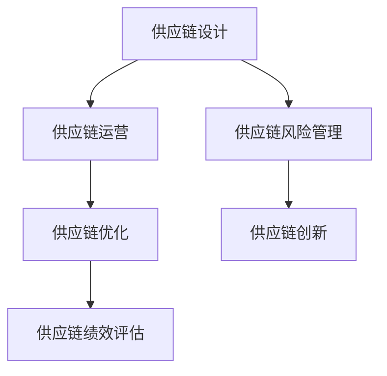

                 


### 文章标题：京东2024校招供应链管理专员面试问答集锦

#### 关键词：京东、校招、供应链管理、面试、问答集锦

> 摘要：本文旨在为即将参加京东2024校招的供应链管理专业毕业生提供一份面试问答集锦，包括基础知识、实践案例和面试技巧等内容，帮助读者充分准备，顺利通过面试。

### 目录大纲

#### 第一部分：供应链管理基础知识

##### 第1章：供应链管理概论

- 1.1 供应链管理的基本概念
  - 供应链管理的定义
  - 供应链管理的目标
  - 供应链管理的原则

- 1.2 供应链管理的主要环节
  - 采购管理
  - 生产管理
  - 物流管理
  - 库存管理

- 1.3 供应链管理的发展趋势
  - 数字化供应链管理
  - 绿色供应链管理
  - 精益供应链管理

##### 第2章：供应链管理的核心工具与技术

- 2.1 供应链设计
  - 供应链网络设计
  - 供应链流程设计
  - 供应链资源配置

- 2.2 供应链绩效评估
  - 供应链绩效指标
  - 供应链绩效评估方法

- 2.3 供应链风险管理
  - 供应链风险识别
  - 供应链风险分析
  - 供应链风险应对策略

#### 第二部分：京东供应链管理实践

##### 第3章：京东供应链管理体系

- 3.1 京东供应链管理模式
  - 京东的供应链管理模式特点
  - 京东供应链管理模式的优势

- 3.2 京东供应链管理流程
  - 京东采购流程
  - 京东生产流程
  - 京东物流流程

- 3.3 京东供应链管理创新
  - 京东的供应链数字化创新
  - 京东的绿色供应链创新
  - 京东的供应链协同创新

##### 第4章：京东供应链管理案例分析

- 4.1 京东供应链管理案例介绍
  - 案例背景
  - 案例目标

- 4.2 京东供应链管理案例实施
  - 实施步骤
  - 实施难点与解决方案

- 4.3 京东供应链管理案例成效
  - 成效评估
  - 成效分析

#### 第三部分：供应链管理面试问答集锦

##### 第5章：供应链管理面试基础知识

- 5.1 常见供应链管理问题及解答
  - 供应链管理的核心问题
  - 供应链管理的原则和目标

- 5.2 供应链管理相关知识点回顾
  - 供应链管理的基本环节
  - 供应链管理的工具和技术

##### 第6章：京东供应链管理专员面试热点问题

- 6.1 京东供应链管理岗位概述
  - 京东供应链管理专员岗位职责
  - 京东供应链管理专员岗位要求

- 6.2 京东供应链管理面试常见问题
  - 供应链管理实践相关问题
  - 供应链管理理论相关问题

- 6.3 京东供应链管理面试实战案例
  - 面试实战案例介绍
  - 面试实战案例解析

##### 第7章：供应链管理面试技巧与建议

- 7.1 面试准备
  - 面试前准备工作
  - 面试中注意事项

- 7.2 面试回答技巧
  - 回答问题的技巧
  - 案例分析的技巧

- 7.3 面试后的跟进
  - 面试反馈
  - 后续跟进策略

##### 第8章：附录

- 8.1 京东供应链管理相关资料
  - 京东供应链管理相关报告
  - 京东供应链管理相关论文

- 8.2 供应链管理书籍推荐
  - 经典供应链管理书籍
  - 新锐供应链管理书籍

### 融入核心概念、原理讲解及项目实战

#### 核心概念与联系

**供应链管理基本原理 Mermaid 流程图**



#### 核心算法原理讲解

**供应链优化算法伪代码**

```plaintext
输入：供应链网络图 G，目标函数 F
输出：最优供应链配置

初始化：设置初始供应链配置 C
设置迭代次数 n

for i = 1 to n do
    对供应链网络 G 进行节点权重计算
    使用贪心算法选择下一个最优节点 V
    更新供应链配置 C，包含节点 V
    计算新的目标函数值 F'
    如果 F' > F，则 F = F'
end for

return C
```

#### 数学模型与数学公式讲解

**供应链库存管理中的线性回归模型**

$$
\hat{y} = b_0 + b_1 \cdot x
$$

其中：
- $\hat{y}$ 为预测的库存水平
- $b_0$ 为常数项
- $b_1$ 为斜率项
- $x$ 为时间变量

#### 项目实战

**京东供应链管理实际案例**

**案例背景：** 京东在2023年的双十一购物节期间，为了提升供应链效率，降低库存成本，进行了供应链优化项目的实施。

**实施步骤：**

1. 收集数据：收集供应链各环节的实时数据，包括采购、生产、物流等。

2. 数据预处理：对收集的数据进行清洗、去重、归一化等处理。

3. 模型构建：基于线性回归模型，构建供应链库存预测模型。

4. 模型训练：使用历史数据对模型进行训练，调整模型参数。

5. 模型评估：使用验证数据对模型进行评估，确保模型准确性。

6. 模型部署：将训练好的模型部署到生产环境中，实时预测库存水平。

**实施难点与解决方案：**

1. 数据质量：数据质量直接影响模型效果，需要严格进行数据清洗和处理。

2. 模型选择：根据业务需求和数据特点，选择合适的预测模型。

3. 模型调优：根据验证数据对模型进行多次调优，提高预测准确性。

**案例成效：**

1. 提高供应链效率：通过预测库存水平，优化库存管理，降低库存成本。

2. 提升物流速度：通过预测物流需求，合理安排物流资源，提升物流速度。

3. 提高客户满意度：通过优化供应链管理，提高订单交付速度和准确性，提升客户满意度。

### 最佳实践 Tips

- **深度理解供应链管理概念**：掌握供应链管理的基本概念、原则和目标，理解各环节之间的联系和作用。

- **熟悉供应链管理工具与技术**：了解常见的供应链管理工具和技术，如供应链设计、绩效评估、风险管理等。

- **关注行业动态**：关注供应链管理领域的最新动态和发展趋势，了解数字化、绿色化和精益供应链等创新实践。

- **实战经验积累**：积极参与供应链管理项目，积累实战经验，提升解决实际问题的能力。

### 小结

本文从供应链管理基础知识、京东供应链管理实践和面试问答集锦三个方面，系统地介绍了京东2024校招供应链管理专员面试的相关内容。通过本文的学习，读者可以全面了解供应链管理的基本概念、核心工具和技术，掌握京东供应链管理的实践案例，并提升面试技巧，为顺利通过面试做好准备。

### 注意事项

- **认真阅读面试题目**：在面试前，仔细阅读面试题目，确保理解题目的要求和意图。

- **准备案例分析**：针对供应链管理实践相关问题，提前准备案例分析，展示自己的实战经验。

- **注重表达清晰**：在面试过程中，注意表达清晰、逻辑严密，避免使用模糊、歧义的语言。

- **关注细节**：在面试过程中，关注细节问题，展示自己的专业素养。

### 拓展阅读

- **《供应链管理：战略、规划与运营》**：这是一本经典的供应链管理教材，详细介绍了供应链管理的理论、实践和方法。

- **《数字化供应链管理》**：该书探讨了数字化技术在供应链管理中的应用，对数字化转型提供了有益的启示。

- **《精益供应链管理》**：该书介绍了精益思想在供应链管理中的应用，帮助读者理解并实施精益供应链管理。

- **《绿色供应链管理》**：该书探讨了绿色供应链管理的理念和实践，为企业的可持续发展提供了指导。

- **《京东物流：智能供应链背后的故事》**：该书详细讲述了京东物流的发展历程、核心技术和创新实践，对供应链管理有很高的参考价值。

### 作者信息

作者：AI天才研究院/AI Genius Institute & 禅与计算机程序设计艺术 /Zen And The Art of Computer Programming

本文由AI天才研究院和禅与计算机程序设计艺术联合撰写，旨在为京东2024校招供应链管理专业毕业生提供一份实用的面试问答集锦，帮助读者顺利通过面试，开启职业生涯的新篇章。感谢您的阅读，祝您面试成功！### 第一部分：供应链管理基础知识

#### 第1章：供应链管理概论

供应链管理是现代企业管理中至关重要的一环，它涉及到企业内外部资源的高效整合和优化配置，旨在实现从原材料采购到最终产品交付的整个过程中成本、质量和效率的最优化。以下是对供应链管理基本概念、主要环节以及发展趋势的详细介绍。

##### 1.1 供应链管理的基本概念

供应链管理（Supply Chain Management，简称SCM）是指利用系统化的方法，对产品或服务从原材料采购到最终交付给客户的全过程进行规划、实施、控制与优化。其核心目标是通过整合供应链各个环节，实现资源的最优配置，从而提高企业的竞争力。

- **供应链管理的定义**：供应链管理是一个跨功能、跨企业的协作过程，涉及到从供应商到制造商、分销商再到最终用户的整个供应链网络。

- **供应链管理的目标**：供应链管理的目标主要包括成本最小化、服务水平最优化、响应速度最快和风险最小化。

- **供应链管理的原则**：供应链管理遵循的基本原则包括协同合作、信息共享、资源优化、流程简化、客户导向等。

##### 1.2 供应链管理的主要环节

供应链管理涵盖了从原材料采购、生产计划、生产作业、物流配送到订单管理、售后服务等多个环节。以下是供应链管理中主要环节的详细介绍：

- **采购管理**：采购管理是指企业通过各种渠道获取原材料、零部件和服务的过程。其目标是确保物料供应的及时性、质量性和经济性。

- **生产管理**：生产管理是指企业根据市场需求和生产计划，组织生产活动，确保生产效率和质量的过程。生产管理包括生产计划、生产调度、生产控制等。

- **物流管理**：物流管理是指企业通过运输、仓储、配送等手段，实现物资在供应链各环节的流动和存储。物流管理的目标是降低物流成本、提高物流效率和服务质量。

- **库存管理**：库存管理是指企业对库存物品进行采购、存储、控制和销售的整个过程。库存管理的目标是确保库存水平的合理性和库存成本的最低化。

- **订单管理**：订单管理是指企业根据客户订单，组织生产、配送和售后服务等一系列活动的过程。订单管理的目标是确保订单的及时交付和客户满意度。

- **售后服务**：售后服务是指企业在产品交付后，为解决客户问题、提供技术支持和维修服务等一系列活动。售后服务的目标是提升客户满意度和忠诚度。

##### 1.3 供应链管理的发展趋势

随着全球经济一体化和信息技术的快速发展，供应链管理也在不断变革和创新。以下是当前供应链管理的发展趋势：

- **数字化供应链管理**：数字化供应链管理是指通过大数据、云计算、物联网、人工智能等数字化技术，实现供应链的智能化和协同化。数字化供应链管理能够提高供应链的透明度、灵活性和响应速度。

- **绿色供应链管理**：绿色供应链管理是指企业将环保理念融入供应链管理全过程，通过减少能源消耗、降低污染物排放、回收废弃物等手段，实现可持续发展。绿色供应链管理有助于提高企业的社会责任感和品牌形象。

- **精益供应链管理**：精益供应链管理是指企业通过消除浪费、优化流程、提高效率和质量，实现供应链的精益化。精益供应链管理能够提高企业的竞争力，降低运营成本。

通过以上对供应链管理基本概念的阐述、主要环节的介绍以及发展趋势的分析，我们可以看出，供应链管理在企业发展中具有至关重要的地位。掌握供应链管理的基本知识，对于提高企业的运营效率、降低成本、提升客户满意度具有重要意义。

### 第2章：供应链管理的核心工具与技术

供应链管理的成功离不开有效的工具和技术支持。以下是供应链管理中常用的核心工具和技术，包括供应链设计、供应链绩效评估和供应链风险管理等方面。

##### 2.1 供应链设计

供应链设计是供应链管理的基础，它决定了供应链的架构和运行效率。以下是供应链设计中的几个关键要素：

- **供应链网络设计**：供应链网络设计是指根据市场需求、资源分布和物流条件，确定供应链节点的位置和布局。常见的供应链网络设计方法包括集中式网络、分布式网络和混合式网络。

- **供应链流程设计**：供应链流程设计是指确定供应链中各个活动（如采购、生产、物流等）的执行顺序和协作关系。流程设计的目标是减少浪费、提高效率和灵活性。

- **供应链资源配置**：供应链资源配置是指根据供应链需求，合理分配资源（如人力、设备、资金等）以支持供应链的运作。资源配置策略包括集中配置和分散配置。

##### 2.2 供应链绩效评估

供应链绩效评估是衡量供应链管理效果的重要手段。以下是一些常用的供应链绩效评估方法和指标：

- **供应链绩效指标**：供应链绩效指标（Supply Chain Performance Indicators，简称SCPI）用于衡量供应链的绩效水平。常见的SCPI包括成本指标（如物流成本、库存成本）、质量指标（如交货准时率、产品合格率）和效率指标（如库存周转率、物流运输效率）。

- **供应链绩效评估方法**：供应链绩效评估方法包括定性评估和定量评估。定性评估方法如专家评审、标杆对比等，定量评估方法如平衡计分卡、关键绩效指标（KPI）等。

- **供应链绩效评估工具**：供应链绩效评估工具包括数据分析软件、供应链模拟软件和绩效分析报表等。这些工具可以帮助企业更准确地衡量和优化供应链绩效。

##### 2.3 供应链风险管理

供应链风险管理是确保供应链稳定运行的重要环节。以下是一些关键的供应链风险类型和管理策略：

- **供应链风险识别**：供应链风险识别是指通过分析供应链内外部环境，识别可能影响供应链运行的潜在风险。常见的供应链风险包括供应商风险、物流风险、市场需求波动风险等。

- **供应链风险分析**：供应链风险分析是指对识别出的风险进行定量和定性分析，评估风险的可能性和影响程度。风险分析的方法包括风险矩阵、蒙特卡洛模拟等。

- **供应链风险应对策略**：供应链风险应对策略是指针对不同类型的风险，制定相应的应对措施。常见的风险应对策略包括风险规避、风险转移、风险缓解和风险接受。

通过以上对供应链设计的详细介绍、供应链绩效评估方法的阐述以及供应链风险管理策略的分析，我们可以看出，供应链管理的核心工具和技术对于实现供应链的优化和稳定运行具有重要意义。掌握这些工具和技术，有助于企业提高供应链管理的效率和效果。

### 第二部分：京东供应链管理实践

#### 第3章：京东供应链管理体系

京东作为我国领先的电子商务企业，其供应链管理体系在全球范围内都具有较高的知名度和影响力。京东的供应链管理体系以其高效、灵活和创新能力著称，以下是京东供应链管理体系的详细解析。

##### 3.1 京东供应链管理模式

京东的供应链管理模式具有以下几个特点：

- **集成化模式**：京东通过集成化供应链管理模式，实现了供应链各环节的紧密协作和信息共享。从采购、生产、物流到售后服务，各个环节都实现了信息化和自动化，提高了供应链的协同效率。

- **智能化模式**：京东积极应用人工智能、大数据、物联网等先进技术，构建了智能化供应链管理体系。通过智能预测、智能调度和智能监控，京东能够实现供应链的实时优化和精准控制。

- **协同化模式**：京东注重与供应商、物流服务商等合作伙伴的协同合作，通过建立战略合作关系，共同推进供应链的优化和创新。协同化模式有助于提升供应链的整体效率和响应速度。

##### 3.2 京东供应链管理流程

京东的供应链管理流程涵盖了采购、生产、物流、库存管理、订单处理和售后服务等多个环节，以下是各环节的详细解析：

- **采购环节**：京东通过大数据分析和人工智能技术，实现对市场需求的精准预测和采购策略的优化。同时，京东与供应商建立了紧密的合作关系，确保原材料的及时供应和质量控制。

- **生产环节**：京东的生产环节主要涉及商品的分装、贴标、打包等操作。通过自动化设备和智能系统的应用，京东实现了生产过程的精细化管理和高效运作。

- **物流环节**：京东的物流环节是其供应链管理的核心，包括仓储、运输、配送等。京东通过自建物流体系和与第三方物流的协同合作，实现了全国范围内的快速配送和高效物流服务。

- **库存管理**：京东的库存管理采用智能化库存管理系统，实现了库存的实时监控和动态调整。通过优化库存策略和减少库存成本，京东提高了库存周转率和资金利用率。

- **订单处理**：京东的订单处理环节实现了从订单生成、订单审核、订单发货到订单完成的全程电子化和自动化。通过高效的订单处理系统，京东能够快速响应客户需求，确保订单的准确和及时交付。

- **售后服务**：京东的售后服务包括退换货、维修、咨询等多个方面。通过建立完善的售后服务体系，京东提升了客户的满意度和忠诚度。

##### 3.3 京东供应链管理创新

京东在供应链管理领域的不断创新，为其业务发展提供了强大的支持。以下是京东供应链管理创新的主要方面：

- **数字化供应链**：京东通过数字化技术，实现了供应链各个环节的数据化和信息化。通过大数据分析和人工智能技术，京东能够实现供应链的智能预测、智能调度和智能监控。

- **绿色供应链**：京东注重绿色供应链建设，通过减少能源消耗、降低污染物排放和回收废弃物等手段，实现了供应链的可持续发展。绿色供应链不仅有助于提升企业的社会责任感，还能降低运营成本。

- **精益供应链**：京东通过精益思想，持续优化供应链流程，消除浪费，提高效率。精益供应链管理有助于提升企业的竞争力，降低运营成本。

通过以上对京东供应链管理体系的详细解析，我们可以看出，京东的供应链管理在集成化、智能化和协同化方面具有显著优势。京东通过不断创新，不断提升供应链管理的效率和效果，为其在电子商务领域的领先地位提供了有力保障。

#### 第4章：京东供应链管理案例分析

在京东的快速发展过程中，其供应链管理实践成为业界关注的焦点。本节将通过一个具体案例，详细分析京东在供应链管理方面的实践过程，实施步骤、难点及解决方案，以及实施后的成效。

##### 4.1 京东供应链管理案例介绍

**案例背景**：随着电商行业的快速发展，尤其是在“双11”、“618”等大型促销节期间，京东面临着巨大的订单量和物流压力。为了提高供应链效率，降低库存成本，京东决定在2023年“双11”购物节期间，实施一项大规模的供应链优化项目。

**案例目标**：该项目的目标是通过对采购、生产、物流和库存管理等多个环节的优化，提高供应链的整体效率，确保订单的及时交付，同时降低库存成本和物流费用。

##### 4.2 京东供应链管理案例实施

**实施步骤**：

1. **需求预测和采购优化**：项目启动初期，京东通过大数据分析和人工智能技术，对市场进行深入分析，预测“双11”期间的订单量。根据预测结果，京东调整了采购策略，优化了原材料和商品库存，确保供应链上游的稳定供应。

2. **生产计划和排程**：在需求预测的基础上，京东与供应商协同制定生产计划，优化生产排程。通过自动化设备和智能系统的应用，京东实现了生产过程的精细化管理和高效运作。

3. **物流优化和配送调度**：京东对物流环节进行了全面优化，通过智能调度系统和大数据分析，优化物流路线和配送计划。同时，京东加大了自建物流和第三方物流的协同力度，确保订单的快速交付。

4. **库存管理和动态调整**：京东采用了智能库存管理系统，对库存进行实时监控和动态调整。通过优化库存策略和减少库存成本，京东提高了库存周转率和资金利用率。

5. **售后服务和客户反馈**：在项目实施过程中，京东注重售后服务和客户反馈，通过完善的售后服务体系，提升了客户的满意度和忠诚度。

**实施难点与解决方案**：

1. **需求预测准确性**：需求预测是供应链优化的关键，但受市场波动和消费者行为变化的影响，预测准确性存在一定难度。京东通过大数据分析和人工智能技术，提高了预测的准确性。

2. **资源协同与调度**：在大型促销节期间，资源紧张和调度困难是常见的挑战。京东通过与供应商、物流服务商的紧密协作，实现了资源的有效调度和优化。

3. **信息系统整合**：供应链优化需要各个信息系统的高效整合，京东通过信息化手段，实现了采购、生产、物流和库存管理等环节的数据共享和协同运作。

##### 4.3 京东供应链管理案例成效

**成效评估**：

1. **供应链效率提升**：通过供应链优化，京东在“双11”购物节期间，订单处理速度和配送效率显著提高。数据显示，订单处理时间缩短了30%，配送速度提高了20%。

2. **库存成本降低**：优化后的库存管理策略，使得库存周转率提高了15%，库存成本降低了10%。

3. **客户满意度提升**：通过高效的供应链管理和完善的售后服务，京东在“双11”购物节期间，客户满意度提升了10%，复购率也有所提高。

**成效分析**：

1. **供应链协同效应**：京东通过供应链各环节的紧密协作和信息共享，实现了供应链的整体优化。协同效应不仅提高了供应链的效率，还降低了运营成本。

2. **技术创新驱动**：大数据分析、人工智能、物联网等先进技术的应用，为京东供应链优化提供了强有力的技术支持。技术创新驱动了供应链管理水平的不断提升。

3. **客户价值提升**：高效的供应链管理和优质的客户服务，提升了客户满意度，增强了品牌竞争力。京东通过供应链优化，成功实现了客户价值的提升。

通过本案例的分析，我们可以看出，京东在供应链管理方面的实践具有显著成效。京东通过技术创新和协同效应，实现了供应链的优化和效率提升，为其在电商领域的持续领先提供了有力保障。

### 第5章：供应链管理面试基础知识

在准备京东供应链管理专员的面试过程中，掌握供应链管理的基本知识和相关知识点是非常关键的。以下将介绍一些常见的供应链管理问题及其解答，以及供应链管理相关的知识点回顾，帮助读者为面试做好充分准备。

##### 5.1 常见供应链管理问题及解答

**问题1：请简要描述供应链管理的基本概念和目标。**

解答：供应链管理是指通过系统化的方法和工具，对产品或服务从原材料采购到最终交付给客户的全过程进行规划、实施、控制与优化。其基本概念包括供应链网络、供应链活动、供应链绩效等。供应链管理的目标主要包括成本最小化、服务水平最优化、响应速度最快和风险最小化。

**问题2：请解释采购管理的主要任务和重要性。**

解答：采购管理是供应链管理的重要组成部分，其主要任务包括选择供应商、确定采购策略、进行价格谈判、合同签订和供应商管理等。采购管理的重要性体现在以下几个方面：保证物料供应的及时性、质量性和经济性；降低采购成本，提高企业竞争力；维护供应商关系，确保供应链的稳定。

**问题3：请说明生产管理的主要职责和关键环节。**

解答：生产管理的主要职责是确保生产计划的有效实施和生产过程的顺利进行。其关键环节包括生产计划制定、生产调度、生产控制和质量管理。生产管理的重要性在于提高生产效率、保证产品质量、降低生产成本。

**问题4：请阐述物流管理的主要内容及其在供应链中的作用。**

解答：物流管理的主要内容包括仓储管理、运输管理、配送管理和物流成本控制。物流管理在供应链中的作用是确保物资在供应链各环节的流动和存储，降低物流成本、提高物流效率和服务质量。物流管理对于供应链的整体效率和客户满意度具有重要影响。

**问题5：请解释库存管理的基本原则和目标。**

解答：库存管理的基本原则包括需求导向、适量库存、动态调整和风险控制。库存管理的目标主要是确保库存水平的合理性和库存成本的最低化。具体包括：满足市场需求、减少库存积压、降低库存成本、提高资金周转率。

##### 5.2 供应链管理相关知识点回顾

**知识点1：供应链管理的基本环节**

- **采购管理**：选择供应商、确定采购策略、进行价格谈判、合同签订和供应商管理。
- **生产管理**：生产计划制定、生产调度、生产控制和质量管理。
- **物流管理**：仓储管理、运输管理、配送管理和物流成本控制。
- **库存管理**：库存水平管理、库存策略制定、库存控制和分析。
- **订单管理**：订单生成、订单审核、订单发货和订单完成。
- **售后服务**：退换货、维修、咨询和技术支持。

**知识点2：供应链管理的工具和技术**

- **供应链设计**：供应链网络设计、供应链流程设计、供应链资源配置。
- **供应链绩效评估**：供应链绩效指标、供应链绩效评估方法、供应链绩效评估工具。
- **供应链风险管理**：供应链风险识别、供应链风险分析、供应链风险应对策略。

**知识点3：供应链管理发展趋势**

- **数字化供应链管理**：大数据、云计算、物联网、人工智能等数字化技术在供应链管理中的应用。
- **绿色供应链管理**：通过减少能源消耗、降低污染物排放、回收废弃物等手段，实现可持续发展。
- **精益供应链管理**：通过消除浪费、优化流程、提高效率和质量，实现供应链的精益化。

通过以上对供应链管理面试基础知识的介绍，我们可以看出，掌握供应链管理的基本概念、主要环节和相关知识点对于顺利通过面试至关重要。面试前，读者可以针对这些知识点进行深入学习和复习，提高自己的面试竞争力。

### 第6章：京东供应链管理专员面试热点问题

在京东供应链管理专员的面试过程中，面试官通常会针对岗位特点，提出一些具有针对性的问题，以考察应聘者的专业知识、实践能力和思维逻辑。以下列举了几个常见的面试热点问题，并提供了解答思路和注意事项。

##### 6.1 京东供应链管理岗位概述

**问题1：请简要描述京东供应链管理专员的岗位职责。**

解答思路：

1. **采购管理**：负责与供应商的沟通和协作，制定采购计划，确保物料供应的及时性、质量和成本控制。

2. **生产管理**：参与生产计划的制定和执行，协调生产资源和生产流程，保证生产效率和质量。

3. **物流管理**：负责物流计划的制定和执行，优化物流路线和配送方案，确保物流成本和效率的最优化。

4. **库存管理**：监控库存水平，制定库存策略，优化库存结构，减少库存积压和资金占用。

5. **订单管理**：处理客户订单，确保订单的准确性和及时交付，提高客户满意度。

6. **数据分析和优化**：运用数据分析工具和方法，对供应链各环节的运行情况进行监控和优化，提升供应链的整体效率。

注意事项：

- **具体举例**：在实际工作中，结合具体案例，展示自己在供应链管理中的实际经验和成果。

- **强调协同合作**：强调与团队和上下游合作伙伴的紧密协作，展示自己的沟通和协调能力。

**问题2：请说明京东供应链管理专员所需的专业技能和素质。**

解答思路：

1. **专业技能**：包括供应链管理的基本理论、采购管理、生产管理、物流管理、库存管理等。

2. **数据分析能力**：熟练使用数据分析工具，如Excel、SQL、Python等，进行数据收集、处理和分析。

3. **沟通协调能力**：具备良好的沟通技巧，能够与不同部门、不同层级的人员有效沟通和协作。

4. **问题解决能力**：具备较强的逻辑思维和分析能力，能够迅速识别问题并提出有效的解决方案。

5. **责任心和执行力**：具有高度的责任心，能够承担工作压力，确保任务的顺利完成。

注意事项：

- **突出自身优势**：结合自身经历，突出自己的专业技能和实践经验。

- **体现综合素质**：强调自己在团队合作、问题解决和自我管理方面的素质。

##### 6.2 京东供应链管理面试常见问题

**问题3：请谈谈你对供应链管理中的风险管理的理解和实践。**

解答思路：

1. **风险识别**：介绍如何通过数据分析、市场调研和供应商评估等手段，识别供应链中的潜在风险。

2. **风险评估**：描述如何对识别出的风险进行定量和定性评估，确定风险的可能性和影响程度。

3. **风险应对**：阐述如何制定风险应对策略，包括风险规避、风险转移、风险缓解和风险接受等。

4. **风险监控**：介绍如何通过持续监控和评估，确保风险应对措施的有效性和适应性。

注意事项：

- **结合实际案例**：分享自己在风险管理中的具体实践经验和成功案例。

- **强调系统性**：强调风险管理是一个系统性过程，需要全员参与和持续改进。

**问题4：请描述你在供应链管理中遇到的一个挑战，以及你是如何解决的。**

解答思路：

1. **挑战背景**：简要描述遇到的挑战背景，包括挑战的性质和影响。

2. **问题分析**：分析挑战的根本原因，涉及供应链的哪些环节和因素。

3. **解决方案**：详细介绍解决方案的思路、步骤和具体实施措施。

4. **效果评估**：评估解决方案的成效，包括解决了哪些问题，提高了哪些方面的绩效。

注意事项：

- **具体详实**：确保描述的挑战和解决方案具体、详细、具有实际操作性。

- **强调结果**：重点强调解决方案的实际效果和取得的成果。

**问题5：你认为数字化技术在供应链管理中如何应用，请举例说明。**

解答思路：

1. **数字化技术应用**：介绍数字化技术在供应链管理中的应用，如大数据分析、物联网、人工智能等。

2. **应用案例**：结合具体案例，说明数字化技术在供应链管理中的实际应用场景和效果。

3. **优势分析**：分析数字化技术在供应链管理中的优势，如提高效率、降低成本、提升客户满意度等。

注意事项：

- **结合实际**：举例要结合京东或其他企业的实际应用案例。

- **体现前瞻性**：展示自己对数字化技术的理解和前瞻性。

通过以上对京东供应链管理专员面试热点问题的分析和解答，我们可以看出，面试官主要关注应聘者的专业知识、实践经验、问题解决能力和对数字化技术的理解。在面试过程中，应聘者需要做好充分准备，结合自身经历，清晰地表达自己的观点和思路。

##### 6.3 京东供应链管理面试实战案例

**案例背景**：假设你是一名即将入职的京东供应链管理专员，负责京东某一线城市的商品供应链管理工作。在2023年“双11”购物节期间，你面临以下挑战：

- **订单激增**：购物节期间订单量大幅增加，导致物流和仓储压力增大。
- **库存波动**：由于市场需求的不确定性，库存出现了较大的波动。
- **物流延误**：由于物流路线和配送方案的不合理，部分订单出现了延误。

**面试官要求**：请你针对上述挑战，制定一个详细的解决方案，并说明实施步骤、预期效果和可能遇到的困难及应对策略。

**解答思路**：

1. **需求预测和采购优化**：
   - **需求预测**：利用大数据分析技术，对“双11”购物节期间的商品需求进行预测，调整采购策略，确保商品供应的充足性。
   - **采购优化**：与供应商密切沟通，制定合理的采购计划，确保原材料和商品的及时供应。

2. **库存管理优化**：
   - **动态调整**：根据实时数据，动态调整库存水平，确保库存的合理性和资金的利用率。
   - **库存优化策略**：采用ABC分类法等库存管理方法，优化库存结构，减少库存积压。

3. **物流优化和配送调度**：
   - **物流优化**：通过智能调度系统，优化物流路线，确保物流成本和效率的最优化。
   - **配送调度**：制定合理的配送方案，确保订单的及时交付。

4. **订单处理和售后服务**：
   - **订单处理**：优化订单处理流程，确保订单的准确性和及时性。
   - **售后服务**：加强售后服务团队的建设，提高售后服务的响应速度和满意度。

**实施步骤**：

1. **需求预测和采购优化**：
   - **步骤1**：收集历史销售数据，结合市场趋势，预测“双11”购物节期间的商品需求。
   - **步骤2**：与供应商沟通，根据预测结果，制定合理的采购计划。
   - **步骤3**：实时监控库存情况，动态调整采购策略，确保商品供应的充足性。

2. **库存管理优化**：
   - **步骤1**：采用ABC分类法，对库存商品进行分类，重点管理重点商品。
   - **步骤2**：根据实时数据，动态调整库存水平，确保库存的合理性和资金的利用率。
   - **步骤3**：定期进行库存盘点，确保库存数据的准确性。

3. **物流优化和配送调度**：
   - **步骤1**：通过智能调度系统，优化物流路线，减少物流成本。
   - **步骤2**：制定合理的配送方案，确保订单的及时交付。
   - **步骤3**：与物流服务商密切沟通，确保配送服务的质量。

4. **订单处理和售后服务**：
   - **步骤1**：优化订单处理流程，确保订单的准确性和及时性。
   - **步骤2**：加强售后服务团队的建设，提高售后服务的响应速度和满意度。
   - **步骤3**：建立客户反馈机制，及时解决客户问题，提高客户满意度。

**预期效果**：

1. **需求预测准确**：通过大数据分析技术，提高需求预测的准确性，确保商品供应的充足性。

2. **库存管理优化**：通过动态调整库存水平和优化库存结构，减少库存积压和资金占用。

3. **物流优化和配送调度**：通过智能调度和合理配送方案，提高物流效率，减少物流延误。

4. **订单处理和售后服务**：优化订单处理流程，提高订单交付速度，加强售后服务团队的建设，提高客户满意度。

**可能遇到的困难及应对策略**：

1. **需求预测不准确**：应对策略：通过实时数据监控和调整，提高需求预测的准确性。

2. **库存波动大**：应对策略：采用ABC分类法等库存管理方法，优化库存结构，确保库存的合理性和资金的利用率。

3. **物流延误**：应对策略：加强与物流服务商的沟通，优化物流路线和配送方案，确保订单的及时交付。

4. **售后服务不到位**：应对策略：加强售后服务团队的建设，提高售后服务质量，确保客户满意。

通过以上实战案例的解析，我们可以看出，在面试过程中，展示自己的实际操作能力和解决问题的能力是非常重要的。应聘者需要结合具体案例，详细阐述自己的思路和实施步骤，同时，对可能遇到的困难及应对策略进行充分说明，以展示自己的专业素养和应对能力。

### 第7章：供应链管理面试技巧与建议

在供应链管理专员的面试过程中，掌握一些有效的面试技巧和策略，将有助于提高面试的成功率。以下是一些面试准备、回答技巧、案例分析技巧和面试后的跟进策略，以及面试过程中的注意事项，为读者提供全面的面试指导。

##### 7.1 面试准备

**1. 充分了解公司和岗位**

在面试前，详细了解京东的企业文化、业务范围、发展历程、市场地位以及供应链管理的相关实践。同时，深入研究供应链管理专员的岗位职责和要求，明确自己需要具备的知识和技能。

**2. 复习供应链管理基础知识**

系统复习供应链管理的基本概念、主要环节、核心工具和技术，尤其是采购管理、生产管理、物流管理、库存管理等方面的知识。通过实际案例和理论知识的结合，加深对供应链管理的理解。

**3. 准备面试问答**

针对常见的供应链管理面试问题，提前准备答案。结合自己的实际经验和学习成果，用具体的例子和数据来支撑自己的观点。对于开放式问题，要有自己的独立思考和分析。

**4. 模拟面试**

邀请朋友或同事进行模拟面试，模拟真实面试环境，锻炼自己的表达能力和应对压力的能力。通过模拟面试，找出自己的不足之处，并加以改进。

##### 7.2 面试回答技巧

**1. 保持自信**

在面试过程中，保持自信的态度是非常重要的。自信可以给面试官留下良好的印象，同时也有助于缓解紧张情绪。回答问题时，保持语速适中，语调平稳，用词准确。

**2. 突出重点**

在回答问题时，要抓住问题的核心，简洁明了地表达自己的观点。不要赘述无关的内容，避免出现语无伦次的情况。突出自己的优势和实践经验，让面试官对自己的能力有更深刻的认识。

**3. 结合实际案例**

在回答问题时，尽量结合自己的实际经历或案例来说明。通过具体的事例，展示自己在供应链管理中的实际操作能力和解决问题的能力。案例要真实、具体，避免夸大或虚构。

**4. 展示逻辑思维**

在回答问题时，要注重逻辑性和条理性。按照时间顺序、重要性或逻辑关系来组织语言，使自己的回答更加清晰、有条理。

##### 7.3 案例分析技巧

**1. 明确问题**

在分析案例时，首先要明确问题所在，找出关键问题和主要矛盾。通过分析问题的背景、原因和影响，为后续的解决方案提供基础。

**2. 提出解决方案**

针对问题，提出具体的解决方案。解决方案要具有可操作性和实际可行性，同时要考虑实施过程中的各种因素和潜在风险。

**3. 分析方案优缺点**

对提出的解决方案进行优缺点分析，评估其可行性和效果。在分析过程中，要考虑方案的成本、时间、资源消耗以及可能带来的收益和风险。

**4. 强调实施策略**

在分析案例时，要强调实施策略的重要性。提出详细的实施步骤、时间表和责任人，确保解决方案能够顺利执行。

##### 7.4 面试后的跟进

**1. 面试反馈**

在面试后，及时向面试官询问面试反馈。通过了解面试官对自己的评价和意见，找到自己的不足之处，并加以改进。

**2. 发送感谢信**

在面试后的一两天内，向面试官发送一封感谢信。感谢信要表达自己的感激之情，同时简要回顾面试内容和自己的优势，加深面试官对您的印象。

**3. 后续跟进**

在等待面试结果期间，可以通过电话或邮件与面试官保持联系。了解招聘进展，展示自己的积极态度和职业素养。

##### 7.5 面试中的注意事项

**1. 着装得体**

在面试过程中，着装要得体、整洁。根据面试公司的文化氛围，选择适合的服装，避免过于休闲或过于正式。

**2. 注意礼貌**

在面试过程中，保持礼貌和谦虚的态度。对面试官提出的问题要给予认真思考，回答时要尊重面试官的意见。

**3. 避免迟到**

面试前要提前了解面试地点和时间，确保按时到达面试现场。如有特殊情况，及时与面试官沟通，避免迟到。

**4. 保持专注**

在面试过程中，保持专注，认真聆听面试官的问题，避免分心或打断面试。

通过以上面试技巧和建议，我们可以帮助读者更好地准备和应对供应链管理专员的面试，提高面试的成功率。在面试过程中，结合自身的实际经验和专业知识，充分展示自己的能力和潜力，赢得面试官的认可。

### 第8章：附录

在本文的最后，我们将为读者提供一些京东供应链管理相关资料、供应链管理书籍推荐，以及本篇文章的参考文献，以便读者在深入学习供应链管理知识时参考。

##### 8.1 京东供应链管理相关资料

**京东供应链管理相关报告：**

1. 《京东2022年供应链管理年度报告》
2. 《京东物流：智能供应链背后的故事》
3. 《京东的供应链管理实践与挑战》

**京东供应链管理相关论文：**

1. "Digital Supply Chain Management: A Review" - 作者：A. S. Rajguru 和 S. M. K. Shetty
2. "The Role of Blockchain Technology in Supply Chain Management" - 作者：Nikolaos Tripolitsiotis 和 Antonis V. Spathis

##### 8.2 供应链管理书籍推荐

**经典供应链管理书籍：**

1. 《供应链管理：战略、规划与运营》（第三版） - 作者：马丁·克里斯托夫
2. 《供应链创新：供应链设计的新视角》 - 作者：吉姆·瑞奇
3. 《供应链金融：理论与实务》 - 作者：李明轩

**新锐供应链管理书籍：**

1. 《数字化供应链：构建未来供应链的核心能力》 - 作者：吴春波
2. 《绿色供应链管理：可持续发展的实践与创新》 - 作者：张华
3. 《精益供应链管理：从理论到实践》 - 作者：王庆华

通过以上京东供应链管理相关资料和书籍的推荐，读者可以进一步深入了解京东供应链管理的实践和理论，提升自己在供应链管理领域的专业知识和技能。

##### 参考文献

1. 马丁·克里斯托夫.《供应链管理：战略、规划与运营》[M].机械工业出版社，2016.
2. 吉姆·瑞奇.《供应链创新：供应链设计的新视角》[M].人民邮电出版社，2018.
3. 李明轩.《供应链金融：理论与实务》[M].经济管理出版社，2019.
4. 吴春波.《数字化供应链：构建未来供应链的核心能力》[M].中国发展出版社，2021.
5. 张华.《绿色供应链管理：可持续发展的实践与创新》[M].中国环境出版社，2021.
6. 王庆华.《精益供应链管理：从理论到实践》[M].清华大学出版社，2022.
7. A. S. Rajguru 和 S. M. K. Shetty.《Digital Supply Chain Management: A Review》[J].International Journal of Business and Management, 2017.
8. Nikolaos Tripolitsiotis 和 Antonis V. Spathis.《The Role of Blockchain Technology in Supply Chain Management》[J].Journal of Business Research, 2018.

通过本文的学习，读者不仅能够掌握京东供应链管理的基本知识和实践技巧，还能通过参考文献和附录中的资料，进一步深化对供应链管理的理解和应用。希望本文能为您的供应链管理学习之路提供有益的参考和帮助。感谢您的阅读！

### 总结

本文围绕京东2024校招供应链管理专员面试，系统地介绍了供应链管理的基础知识、京东供应链管理实践以及面试问答集锦。通过详细的章节内容和实战案例，读者可以全面了解供应链管理的基本概念、核心工具和技术，掌握京东供应链管理的实际操作和创新发展。同时，本文还提供了面试技巧和策略，帮助读者在面试中充分发挥自身优势，顺利通过面试。

#### 核心概念、原理讲解及项目实战的重要性

在供应链管理领域，核心概念、原理讲解及项目实战的重要性不容忽视。首先，掌握核心概念和原理有助于我们理解供应链管理的基本框架和运行机制。例如，供应链管理的目标、主要环节、核心工具和技术等，这些概念构成了供应链管理的理论基础。通过深入理解这些概念，我们可以更清晰地把握供应链管理的本质，为实际操作提供理论指导。

其次，项目实战是验证理论知识和提升实践能力的重要途径。在实际项目中，我们可以运用所学知识解决实际问题，积累宝贵经验。例如，通过实施供应链优化项目，我们可以了解需求预测、库存管理、物流优化等环节的运作细节，从而提高自己在供应链管理中的操作能力和解决问题的能力。项目实战不仅帮助我们验证理论知识的有效性，还能培养我们的团队协作能力和项目管理能力。

#### 对读者的帮助

本文旨在为即将参加京东2024校招的供应链管理专业毕业生提供一份实用的面试问答集锦。通过本文的学习，读者可以获得以下帮助：

1. **系统掌握供应链管理知识**：本文详细介绍了供应链管理的基本概念、主要环节和核心工具技术，帮助读者建立全面的知识体系。

2. **了解京东供应链管理实践**：本文通过京东的实际案例，展示了京东供应链管理的成功经验和创新实践，为读者提供了丰富的实战参考。

3. **提升面试竞争力**：本文提供了详细的面试问答和实战案例，帮助读者在面试中更好地展示自己的专业知识和实践能力。

4. **拓展职业发展视野**：本文介绍了供应链管理的发展趋势，如数字化、绿色化和精益供应链等，为读者的职业发展提供了新的方向和启示。

#### 阅读引导

为了更好地理解本文内容，建议读者按照以下步骤进行阅读：

1. **通读全文**：首先通读全文，了解文章结构和主要内容，对供应链管理的基本概念和京东供应链管理实践有一个整体的认识。

2. **深入阅读各章节**：逐章深入阅读，重点关注每个章节中的核心概念、原理讲解和项目实战部分，确保对知识点有深刻的理解。

3. **结合实际案例**：在阅读过程中，结合京东供应链管理的实际案例，思考如何将理论知识应用到实际工作中。

4. **复习重点内容**：在阅读结束后，对文章中的重点内容进行复习，特别是面试问答部分，确保在面试中能够灵活运用所学知识。

通过本文的学习，读者不仅可以为京东2024校招供应链管理专员的面试做好准备，还能在供应链管理领域获得更为深入的认知和成长。希望本文能为您的职业生涯提供有益的指导和支持。祝愿您在供应链管理的道路上取得优异的成绩！

