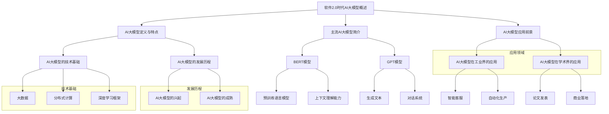

                 

### 文章标题

《2024京东数科社招面试真题汇总及其解答》

> 关键词：京东数科社招、面试真题、技术解析、行为面试、职业规划

> 摘要：本文旨在为准备2024年京东数科社招面试的应聘者提供一份全面的面试真题汇总及其解答。文章涵盖了技术面试和行为面试的各个重要领域，包括数据结构与算法、编程语言基础、数据库与SQL、计算机网络、操作系统与并发编程等，以及职业规划与职业素养等方面。通过详细的解析和实例讲解，帮助应聘者更好地应对面试挑战，提升面试成功率。

### 《2024京东数科社招面试真题汇总及其解答》目录大纲

#### 第一部分: 面试真题概述

1. 京东数科社招面试流程
    - 1.1 面试流程概述
    - 1.2 面试题型分类
    - 1.3 面试准备技巧

2. 面试真题特点
    - 2.1 题目难度分布
    - 2.2 题目类型分析
    - 2.3 真题实际应用场景

#### 第二部分: 技术面试真题解析

1. 数据结构与算法
    - 2.1.1 基本数据结构
        - 2.1.1.1 链表
        - 2.1.1.2 栈和队列
        - 2.1.1.3 树和图
    - 2.1.2 常见算法
        - 2.1.2.1 排序算法
        - 2.1.2.2 搜索算法
        - 2.1.2.3 动态规划

2. 编程语言基础
    - 2.2.1 Java
        - 2.2.1.1 基础语法
        - 2.2.1.2 面向对象编程
        - 2.2.1.3 异常处理
    - 2.2.2 Python
        - 2.2.2.1 基础语法
        - 2.2.2.2 数据类型
        - 2.2.2.3 函数与模块

3. 数据库与SQL
    - 3.3.1 关系型数据库
        - 3.3.1.1 MySQL
        - 3.3.1.2 Oracle
        - 3.3.1.3 SQL语法
    - 3.3.2 非关系型数据库
        - 3.3.2.1 MongoDB
        - 3.3.2.2 Redis

4. 计算机网络
    - 4.4.1 网络基础
        - 4.4.1.1 网络协议
        - 4.4.1.2 IP地址
        - 4.4.1.3 域名系统
    - 4.4.2 网络安全
        - 4.4.2.1 加密技术
        - 4.4.2.2 认证与授权

5. 操作系统与并发编程
    - 5.5.1 操作系统基础
        - 5.5.1.1 进程与线程
        - 5.5.1.2 内存管理
        - 5.5.1.3 文件系统
    - 5.5.2 并发编程
        - 5.5.2.1 同步与锁
        - 5.5.2.2 并发模式
        - 5.5.2.3 线程池与协程

#### 第三部分: 行为面试真题解析

1. 个人经历与技能
    - 3.1.1 项目经历
    - 3.1.2 技能展示

2. 职业规划与职业素养
    - 3.2.1 职业规划
    - 3.2.2 职业素养

#### 第四部分: 模拟面试演练

1. 面试模拟场景
    - 4.1.1 面试前准备
    - 4.1.2 面试中应对策略
    - 4.1.3 面试后复盘

#### 附录

1. 面试技巧汇总
2. 参考资源
3. Mermaid流程图

### 第一部分: 面试真题概述

在准备2024年京东数科社招面试时，了解面试流程和真题特点是非常重要的。本部分将详细介绍京东数科社招面试的流程、题型分类、真题特点，以及面试准备技巧，为您的面试之旅提供清晰的导航。

#### 1.1 京东数科社招面试流程

京东数科（京东数字科技集团）的社招面试流程一般包括以下几个阶段：

1. **在线申请**：首先，应聘者需要在京东数科的官方网站上提交在线申请，填写个人基本信息、教育背景、工作经历等。
2. **简历筛选**：人力资源部门会对申请者提交的简历进行筛选，选择符合职位要求的候选人进入下一轮面试。
3. **初步面试**：筛选通过的候选人会进行初步面试，这一阶段通常是电话或视频面试，主要考察应聘者对职位理解、技能掌握程度以及沟通表达能力。
4. **技术面试**：通过初步面试的候选人将进行技术面试，这一阶段主要考察应聘者的技术能力和实际项目经验。
5. **行为面试**：技术面试通过后，候选人将进入行为面试阶段，主要考察应聘者的职业素养、团队协作能力和职业规划。
6. **终面及HR面试**：行为面试通过后，候选人将进行最终面试，由公司高层或者HR进行面试，确定最终录用名单。
7. **背景调查**：面试通过后，公司将对候选人进行背景调查，确保其提供的个人信息和工作经历真实可靠。
8. **录用通知**：背景调查通过后，公司会向候选人发送录用通知，候选人按照要求办理入职手续。

#### 1.2 面试题型分类

京东数科社招面试的题型主要分为技术面试和行为面试两大类：

1. **技术面试**：
    - **数据结构与算法题**：这类题目主要考察应聘者对基本数据结构和算法的理解和运用能力，如链表、栈、队列、树、图等。
    - **编程语言基础题**：这类题目主要考察应聘者对编程语言的基本语法、特性、常用库和框架的掌握程度，如Java、Python等。
    - **数据库与SQL题**：这类题目主要考察应聘者对数据库的基本概念、SQL语法和数据库操作的熟练程度。
    - **计算机网络题**：这类题目主要考察应聘者对计算机网络协议、IP地址、域名系统等基础知识的掌握程度。
    - **操作系统与并发编程题**：这类题目主要考察应聘者对操作系统、进程与线程、内存管理、并发编程等知识的理解。

2. **行为面试**：
    - **个人经历与技能题**：这类题目主要考察应聘者的实际项目经验、技能掌握程度以及解决问题的能力。
    - **职业规划与职业素养题**：这类题目主要考察应聘者的职业规划、工作态度、沟通技巧、团队合作能力等。

#### 1.3 面试准备技巧

为了在京东数科的面试中脱颖而出，应聘者需要做好以下准备：

1. **熟悉公司文化和业务**：了解京东数科的企业文化、业务领域、产品和服务，有助于在面试中展示自己的兴趣和热情。
2. **回顾技术知识**：梳理自己在数据结构、算法、编程语言、数据库、计算机网络、操作系统等方面的知识，确保熟练掌握并能够灵活运用。
3. **准备面试题库**：收集历年面试真题，进行模拟练习，提高解题速度和准确率。
4. **提高沟通表达能力**：面试中，清晰、流畅、有条理的表达能力非常重要，可以通过日常练习和模拟面试来提升。
5. **着装得体**：面试时穿着得体、整洁干净，给人留下良好的第一印象。
6. **心态调整**：保持积极乐观的心态，面对面试中的压力和挑战，保持冷静和自信。

通过以上准备，应聘者可以更好地应对京东数科社招面试，提升面试成功率。在下一部分中，我们将详细解析技术面试中的常见题目，帮助大家深入了解面试要求和解题方法。

### 第二部分：技术面试真题解析

在京东数科社招面试中，技术面试是重中之重，其涵盖的领域广泛，包括数据结构与算法、编程语言基础、数据库与SQL、计算机网络、操作系统与并发编程等。本部分将详细解析这些领域的面试真题，帮助大家掌握解题思路和技巧。

#### 2.1 数据结构与算法

数据结构与算法是计算机科学的核心，面试中经常会考察应聘者对基本数据结构和算法的理解和应用能力。

##### 2.1.1 基本数据结构

**链表**：
- **题目**：实现单链表的基本操作，如添加、删除、查找、遍历等。
- **解题思路**：理解单链表的数据结构，使用指针实现链表的各种操作。
- **伪代码**：
```plaintext
class ListNode:
    def __init__(self, val=0, next=None):
        self.val = val
        self.next = next

def insert(head, val):
    new_node = ListNode(val)
    if not head:
        return new_node
    cur = head
    while cur.next:
        cur = cur.next
    cur.next = new_node
    return head

def delete(head, val):
    if not head:
        return head
    if head.val == val:
        return head.next
    cur = head
    while cur.next:
        if cur.next.val == val:
            cur.next = cur.next.next
            return head
        cur = cur.next
    return head

def search(head, val):
    cur = head
    while cur:
        if cur.val == val:
            return True
        cur = cur.next
    return False

def print_list(head):
    cur = head
    while cur:
        print(cur.val, end=" -> ")
        cur = cur.next
    print("None")
```

**栈和队列**：
- **题目**：实现栈和队列的基本操作，如入栈、出栈、入队、出队等。
- **解题思路**：理解栈和队列的数据结构，使用链表或数组实现其基本操作。
- **伪代码**：
```plaintext
class Stack:
    def __init__(self):
        self.items = []

    def push(self, item):
        self.items.append(item)

    def pop(self):
        return self.items.pop()

    def is_empty(self):
        return len(self.items) == 0

    def peek(self):
        if not self.is_empty():
            return self.items[-1]

class Queue:
    def __init__(self):
        self.items = []

    def enqueue(self, item):
        self.items.append(item)

    def dequeue(self):
        return self.items.pop(0)

    def is_empty(self):
        return len(self.items) == 0

    def front(self):
        if not self.is_empty():
            return self.items[0]
```

**树和图**：
- **题目**：实现二叉树的基本操作，如创建、遍历、查找等；实现图的邻接表或邻接矩阵表示，并实现图的遍历算法。
- **解题思路**：理解树和图的数据结构，使用递归或迭代方法实现其基本操作。
- **伪代码**：
```plaintext
class TreeNode:
    def __init__(self, val=0, left=None, right=None):
        self.val = val
        self.left = left
        self.right = right

def inorder_traversal(root):
    if root:
        inorder_traversal(root.left)
        print(root.val, end=" ")
        inorder_traversal(root.right)

def create_binary_tree():
    # 根据输入构建二叉树
    pass

class Graph:
    def __init__(self, vertices):
        self.vertices = vertices
        self.adj_matrix = [[0 for _ in range(vertices)] for _ in range(vertices)]

    def add_edge(self, u, v):
        self.adj_matrix[u][v] = 1
        self.adj_matrix[v][u] = 1

    def dfs(self, v, visited):
        visited[v] = True
        print(v, end=" ")
        for i in range(self.vertices):
            if self.adj_matrix[v][i] == 1 and not visited[i]:
                self.dfs(i, visited)

    def bfs(self, start):
        visited = [False for _ in range(self.vertices)]
        queue = []
        queue.append(start)
        visited[start] = True
        while queue:
            v = queue.pop(0)
            print(v, end=" ")
            for i in range(self.vertices):
                if self.adj_matrix[v][i] == 1 and not visited[i]:
                    queue.append(i)
                    visited[i] = True
```

##### 2.1.2 常见算法

**排序算法**：
- **题目**：实现冒泡排序、选择排序、插入排序、快速排序等排序算法。
- **解题思路**：理解每种排序算法的基本原理，使用循环或递归实现。
- **伪代码**：
```plaintext
def bubble_sort(arr):
    n = len(arr)
    for i in range(n):
        for j in range(0, n-i-1):
            if arr[j] > arr[j+1]:
                arr[j], arr[j+1] = arr[j+1], arr[j]

def selection_sort(arr):
    n = len(arr)
    for i in range(n):
        min_idx = i
        for j in range(i+1, n):
            if arr[j] < arr[min_idx]:
                min_idx = j
        arr[i], arr[min_idx] = arr[min_idx], arr[i]

def insertion_sort(arr):
    n = len(arr)
    for i in range(1, n):
        key = arr[i]
        j = i-1
        while j >= 0 and arr[j] > key:
            arr[j+1] = arr[j]
            j -= 1
        arr[j+1] = key

def quick_sort(arr, low, high):
    if low < high:
        pi = partition(arr, low, high)
        quick_sort(arr, low, pi-1)
        quick_sort(arr, pi+1, high)
```

**搜索算法**：
- **题目**：实现深度优先搜索（DFS）和广度优先搜索（BFS）算法。
- **解题思路**：理解搜索算法的基本原理，使用递归或迭代方法实现。
- **伪代码**：
```plaintext
def dfs(graph, start, visited):
    visited[start] = True
    print(start, end=" ")
    for neighbor in graph[start]:
        if not visited[neighbor]:
            dfs(graph, neighbor, visited)

def bfs(graph, start):
    visited = [False for _ in range(len(graph))]
    queue = []
    queue.append(start)
    visited[start] = True
    while queue:
        v = queue.pop(0)
        print(v, end=" ")
        for neighbor in graph[v]:
            if not visited[neighbor]:
                queue.append(neighbor)
                visited[neighbor] = True
```

**动态规划**：
- **题目**：实现背包问题、最长公共子序列（LCS）等动态规划算法。
- **解题思路**：理解动态规划的基本思想，构建状态转移方程。
- **伪代码**：
```plaintext
# 背包问题
def knapsack(weights, values, W):
    n = len(weights)
    dp = [[0 for _ in range(W+1)] for _ in range(n+1)]
    for i in range(1, n+1):
        for w in range(1, W+1):
            if weights[i-1] <= w:
                dp[i][w] = max(dp[i-1][w], dp[i-1][w-weights[i-1]] + values[i-1])
            else:
                dp[i][w] = dp[i-1][w]
    return dp[n][W]

# 最长公共子序列（LCS）
def lcs(X, Y):
    m, n = len(X), len(Y)
    dp = [[0 for _ in range(n+1)] for _ in range(m+1)]
    for i in range(1, m+1):
        for j in range(1, n+1):
            if X[i-1] == Y[j-1]:
                dp[i][j] = dp[i-1][j-1] + 1
            else:
                dp[i][j] = max(dp[i-1][j], dp[i][j-1])
    return dp[m][n]
```

通过以上对数据结构与算法的解析，我们可以看到，掌握基本的数据结构与算法是面试成功的关键。在接下来的部分，我们将深入探讨编程语言基础，帮助大家更好地应对面试挑战。

#### 2.2 编程语言基础

在京东数科社招面试中，编程语言基础是考察的重点之一。本部分将详细介绍Java和Python两种编程语言的基础知识，包括语法、面向对象编程、异常处理等，帮助大家扎实编程基础。

##### 2.2.1 Java

Java是一种广泛使用的编程语言，具有跨平台、面向对象等特点。在面试中，通常会考察以下内容：

**基础语法**：
- **变量和数据类型**：Java有八种基本数据类型，包括整型、浮点型、字符型和布尔型。每种数据类型都有其对应的变量声明方式。
  - **整型**：`int a = 10;`
  - **浮点型**：`float b = 3.14;`、`double c = 2.718;`
  - **字符型**：`char d = 'A';`
  - **布尔型**：`boolean e = true;`
- **运算符**：Java支持各种基本的算术运算符、比较运算符、逻辑运算符等。
  - **算术运算符**：`int x = 5 + 3;`、`int y = x * 2;`
  - **比较运算符**：`int z = x > y;`、`int w = x == y;`
  - **逻辑运算符**：`boolean u = (x > 0) && (y > 0);`、`boolean v = (x > 0) || (y > 0);`
- **控制结构**：Java提供了多种控制结构，如条件语句（`if-else`）、循环语句（`for`、`while`）等。
  - **条件语句**：
    ```java
    if (condition) {
        // 条件满足时执行的操作
    } else {
        // 条件不满足时执行的操作
    }
    ```
  - **循环语句**：
    ```java
    for (int i = 0; i < 10; i++) {
        // 循环体
    }
    while (condition) {
        // 循环体
    }
    ```

**面向对象编程**：
- **类和对象**：Java是一种面向对象的编程语言，类是对象的模板，对象是类的实例。
  - **定义类**：
    ```java
    class Person {
        String name;
        int age;
        
        public Person(String name, int age) {
            this.name = name;
            this.age = age;
        }
        
        public void introduce() {
            System.out.println("My name is " + name + ", and I am " + age + " years old.");
        }
    }
    ```
  - **创建对象**：
    ```java
    Person person = new Person("Alice", 30);
    person.introduce(); // 输出 "My name is Alice, and I am 30 years old."
    ```

- **继承和多态**：继承是面向对象编程的核心特性之一，多态则允许在运行时动态绑定方法调用。
  - **继承**：
    ```java
    class Employee extends Person {
        String jobTitle;
        
        public Employee(String name, int age, String jobTitle) {
            super(name, age);
            this.jobTitle = jobTitle;
        }
        
        public void introduce() {
            super.introduce();
            System.out.println("I work as a " + jobTitle + ".");
        }
    }
    ```
  - **多态**：
    ```java
    Person person = new Employee("Bob", 40, "Manager");
    person.introduce(); // 输出 "My name is Bob, and I am 40 years old. I work as a Manager."
    ```

**异常处理**：
- **异常**：异常是程序运行中发生的错误，Java提供了异常处理机制来处理这些错误。
  - **try-catch**：
    ```java
    try {
        // 可能抛出异常的代码
    } catch (ExceptionType1 e1) {
        // 处理ExceptionType1异常
    } catch (ExceptionType2 e2) {
        // 处理ExceptionType2异常
    } finally {
        // 无论是否发生异常，都会执行的代码
    }
    ```

**集合框架**：
- **集合**：Java提供了丰富的集合类，包括List、Set、Map等。
  - **List**：`ArrayList`、`LinkedList`
  - **Set**：`HashSet`、`LinkedHashSet`、`TreeSet`
  - **Map**：`HashMap`、`LinkedHashMap`、`TreeMap`

##### 2.2.2 Python

Python是一种流行的高层次编程语言，以其简洁明了的语法和强大的库支持而著称。在面试中，通常会考察以下内容：

**基础语法**：
- **变量和数据类型**：Python使用动态类型系统，变量不需要显式声明类型。
  - **整数**：`a = 10`
  - **浮点数**：`b = 3.14`
  - **字符串**：`c = "Hello, World!"`
  - **布尔值**：`d = True`、`e = False`
- **运算符**：Python支持各种基本的算术运算符、比较运算符、逻辑运算符等。
  - **算术运算符**：`x = 5 + 3`、`y = x * 2`
  - **比较运算符**：`z = x > y`、`w = x == y`
  - **逻辑运算符**：`u = (x > 0) and (y > 0)`、`v = (x > 0) or (y > 0)`

**控制结构**：
- **条件语句**：Python使用`if-elif-else`结构进行条件判断。
  ```python
  if condition:
      # 条件满足时执行的操作
  elif condition:
      # 另一个条件满足时执行的操作
  else:
      # 以上条件都不满足时执行的操作
  ```

- **循环语句**：Python支持`for`和`while`循环。
  ```python
  for i in range(10):
      # 循环体

  while condition:
      # 循环体
  ```

**函数与模块**：
- **定义函数**：Python使用`def`关键字定义函数。
  ```python
  def greet(name):
      print("Hello, " + name + "!")
  greet("Alice") # 输出 "Hello, Alice!"
  ```

- **导入模块**：Python使用`import`语句导入模块。
  ```python
  import math
  print(math.sqrt(16)) # 输出 4.0
  ```

**集合**：
- **列表**：Python的列表（List）是动态数组，支持插入、删除、查找等操作。
  ```python
  fruits = ["apple", "banana", "cherry"]
  fruits.append("date")
  print(fruits) # 输出 ["apple", "banana", "cherry", "date"]
  ```

- **集合**：Python的集合（Set）是元素无序且不重复的集合。
  ```python
  animals = {"dog", "cat", "mouse"}
  animals.add("bird")
  print(animals) # 输出 {"dog", "cat", "mouse", "bird"}
  ```

- **字典**：Python的字典（Dict）是键值对的集合。
  ```python
  person = {"name": "Alice", "age": 30}
  print(person["name"]) # 输出 "Alice"
  ```

通过以上对Java和Python编程语言基础的解析，我们可以看到，掌握编程语言的基础语法、面向对象编程和异常处理等是面试成功的关键。在接下来的部分，我们将深入探讨数据库与SQL相关的内容，帮助大家更好地应对面试挑战。

#### 2.3 数据库与SQL

数据库是京东数科社招面试中的一个重要技术领域，SQL（结构化查询语言）是数据库操作的核心工具。本部分将详细介绍关系型数据库和非关系型数据库的基本概念、SQL语法，以及在实际应用中的常见操作。

##### 2.3.1 关系型数据库

关系型数据库（RDBMS）是一种广泛使用的数据库类型，以表格的形式组织数据。常用的关系型数据库包括MySQL、Oracle和PostgreSQL。

**MySQL**：
MySQL是一种开源的关系型数据库管理系统，被广泛用于网站和应用后端。

- **基本概念**：
  - **表**：表是数据库中的数据集合，由行（记录）和列（字段）组成。
  - **字段**：字段是表中的数据列，用于存储特定类型的数据。
  - **记录**：记录是表中的数据行，表示一个具体的数据实例。
  - **索引**：索引是数据库表中一种特殊的结构，用于快速查找数据。

- **SQL语法**：
  - **创建表**：
    ```sql
    CREATE TABLE students (
        id INT PRIMARY KEY,
        name VARCHAR(50),
        age INT,
        gender ENUM('male', 'female')
    );
    ```
  - **插入数据**：
    ```sql
    INSERT INTO students (id, name, age, gender) VALUES (1, 'Alice', 20, 'female');
    ```
  - **查询数据**：
    ```sql
    SELECT * FROM students;
    ```
  - **更新数据**：
    ```sql
    UPDATE students SET age = 21 WHERE id = 1;
    ```
  - **删除数据**：
    ```sql
    DELETE FROM students WHERE id = 1;
    ```

**Oracle**：
Oracle数据库是一种高可靠性和高性能的关系型数据库，广泛应用于企业级应用。

- **基本概念**：
  - **模式**：模式是数据库中一组相关表、视图和存储过程的集合。
  - **表空间**：表空间是数据库中存储数据的物理区域。
  - **用户**：用户是数据库中的数据访问实体。

- **SQL语法**：
  - **创建表**：
    ```sql
    CREATE TABLE students (
        id NUMBER PRIMARY KEY,
        name VARCHAR2(50),
        age NUMBER,
        gender VARCHAR2(10)
    );
    ```
  - **插入数据**：
    ```sql
    INSERT INTO students (id, name, age, gender) VALUES (1, 'Alice', 20, 'F');
    ```
  - **查询数据**：
    ```sql
    SELECT * FROM students;
    ```
  - **更新数据**：
    ```sql
    UPDATE students SET age = 21 WHERE id = 1;
    ```
  - **删除数据**：
    ```sql
    DELETE FROM students WHERE id = 1;
    ```

**PostgreSQL**：
PostgreSQL是一种开源的关系型数据库，具有高度灵活性和扩展性。

- **基本概念**：
  - **表**：表是数据库中的数据集合，由行和列组成。
  - **索引**：索引是数据库表中一种特殊的结构，用于快速查找数据。
  - **视图**：视图是一个虚拟表，基于一个或多个表的数据查询结果。

- **SQL语法**：
  - **创建表**：
    ```sql
    CREATE TABLE students (
        id SERIAL PRIMARY KEY,
        name VARCHAR(50),
        age INT,
        gender CHAR(1)
    );
    ```
  - **插入数据**：
    ```sql
    INSERT INTO students (name, age, gender) VALUES ('Alice', 20, 'F');
    ```
  - **查询数据**：
    ```sql
    SELECT * FROM students;
    ```
  - **更新数据**：
    ```sql
    UPDATE students SET age = 21 WHERE name = 'Alice';
    ```
  - **删除数据**：
    ```sql
    DELETE FROM students WHERE name = 'Alice';
    ```

##### 2.3.2 非关系型数据库

非关系型数据库（NoSQL）是一种不同于关系型数据库的数据库类型，适用于大规模数据存储和高并发访问。常用的非关系型数据库包括MongoDB和Redis。

**MongoDB**：
MongoDB是一种文档型数据库，以JSON格式存储数据。

- **基本概念**：
  - **集合**：集合是数据库中的数据表。
  - **文档**：文档是集合中的数据记录，类似于关系型数据库的行。
  - **索引**：索引是数据库表中一种特殊的结构，用于快速查找数据。

- **SQL语法**：
  - **创建集合**：
    ```sql
    db.createCollection("students");
    ```
  - **插入文档**：
    ```sql
    db.students.insert({
        "name": "Alice",
        "age": 20,
        "gender": "female"
    });
    ```
  - **查询文档**：
    ```sql
    db.students.find();
    ```
  - **更新文档**：
    ```sql
    db.students.updateOne(
        {"name": "Alice"},
        {"$set": {"age": 21}}
    );
    ```
  - **删除文档**：
    ```sql
    db.students.deleteOne({"name": "Alice"});
    ```

**Redis**：
Redis是一种基于内存的键值型数据库，适用于高速缓存和数据存储。

- **基本概念**：
  - **键**：键是Redis中存储数据的标识。
  - **值**：值是Redis中存储的数据。

- **SQL语法**：
  - **设置键值**：
    ```sql
    SET name "Alice"
    ```
  - **获取键值**：
    ```sql
    GET name
    ```
  - **更新键值**：
    ```sql
    SET age 21
    ```
  - **删除键值**：
    ```sql
    DEL name
    ```

通过以上对关系型数据库和非关系型数据库的解析，我们可以看到，掌握数据库的基本概念、SQL语法以及在实际应用中的操作是面试成功的关键。在接下来的部分，我们将深入探讨计算机网络的相关内容，帮助大家更好地应对面试挑战。

#### 2.4 计算机网络

计算机网络是京东数科社招面试中的一个重要技术领域，它涉及网络协议、IP地址、域名系统等基础知识，以及网络安全方面的内容。本部分将详细介绍计算机网络的基础知识和实际应用，帮助大家更好地理解这一领域。

##### 2.4.1 网络基础

计算机网络的基础知识是理解互联网运作机制的关键。

**网络协议**：
网络协议是计算机网络中用于数据通信的规则集合，确保数据能够在不同的计算机系统之间正确传输。以下是一些重要的网络协议：

- **TCP/IP协议**：TCP/IP是互联网最基础的协议栈，包括TCP（传输控制协议）和IP（互联网协议）。TCP负责确保数据包的可靠传输，IP负责数据包的寻址和路由。
  - **TCP**：提供可靠的、面向连接的传输服务，通过三次握手和四次挥手机制实现。
    ```plaintext
    1. 客户端发送SYN报文到服务器，并进入SYN_SENT状态。
    2. 服务器接收到SYN报文后，发送SYN + ACK报文到客户端，并进入SYN_RCVD状态。
    3. 客户端接收到SYN + ACK报文后，发送ACK报文到服务器，并进入ESTABLISHED状态。
    4. 服务器接收到ACK报文后，也进入ESTABLISHED状态。
    ```
  - **IP**：负责数据包的寻址和路由，通过IP地址确定数据包的源和目的地。

- **HTTP协议**：HTTP（超文本传输协议）是用于万维网数据传输的协议，定义了客户端和服务器之间的请求和响应机制。

- **DNS协议**：DNS（域名系统）是一种将域名转换为IP地址的服务，确保用户可以通过易记的域名访问网站。

**IP地址**：
IP地址是标识互联网上每个设备的唯一地址，分为IPv4和IPv6两种类型。

- **IPv4地址**：由32位二进制数表示，通常使用点分十进制表示，如`192.168.1.1`。
- **IPv6地址**：由128位二进制数表示，使用冒号分隔的十六进制表示，如`2001:0db8:85a3:0000:0000:8a2e:0370:7334`。

**域名系统**：
域名系统（DNS）是一种分布式数据库系统，用于将域名转换为IP地址。DNS解析过程包括以下步骤：

1. **递归查询**：客户端向本地DNS服务器发送查询请求，DNS服务器如果无法解析，会向根DNS服务器发起递归查询。
2. **迭代查询**：根DNS服务器返回权威DNS服务器的IP地址，本地DNS服务器向权威DNS服务器发起迭代查询，直到获取到IP地址。
3. **缓存**：本地DNS服务器将解析结果缓存一段时间，以加快后续查询速度。

##### 2.4.2 网络安全

网络安全是保护计算机网络免受未授权访问、数据泄露和恶意攻击的关键领域。

**加密技术**：
加密技术用于保护数据在传输过程中的隐私和完整性。

- **对称加密**：使用相同的密钥进行加密和解密，如AES、DES。
- **非对称加密**：使用一对密钥进行加密和解密，一个用于加密，一个用于解密，如RSA、ECC。

**认证与授权**：
认证与授权是确保只有授权用户可以访问受保护资源的机制。

- **认证**：验证用户的身份，如用户名和密码、证书、生物识别。
- **授权**：确定用户对资源的访问权限，如访问控制列表（ACL）、角色权限（RBAC）。

通过以上对计算机网络基础和网络安全方面的解析，我们可以看到，掌握网络协议、IP地址、域名系统以及网络安全的基本知识是面试成功的关键。在接下来的部分，我们将深入探讨操作系统与并发编程的相关内容，帮助大家更好地应对面试挑战。

#### 2.5 操作系统与并发编程

操作系统和并发编程是京东数科社招面试中的重点领域，涉及操作系统的基础概念、进程与线程、内存管理、文件系统，以及并发编程的同步与锁、并发模式、线程池与协程等内容。本部分将详细解析这些知识点，帮助大家更好地理解并掌握这些技术。

##### 2.5.1 操作系统基础

操作系统是计算机系统的核心软件，负责管理计算机硬件和软件资源，为应用程序提供运行环境。

**进程与线程**：
- **进程**：进程是计算机中正在运行的程序的实例，具有独立的内存空间、系统资源等。进程是操作系统的基本执行单元。
- **线程**：线程是进程中的执行流，是轻量级的基本调度单位。一个进程可以包含多个线程，它们共享进程的内存空间和其他资源。

- **进程与线程的区别**：
  - **资源占用**：进程占用资源较多，如内存、文件句柄等；线程占用资源较少，但多个线程共享进程的资源。
  - **创建与销毁**：进程创建和销毁需要较长的时间；线程创建和销毁较快。
  - **并发性**：进程之间的切换需要操作系统调度，开销较大；线程之间可以更快地进行切换。

- **进程管理**：
  - **创建进程**：在操作系统中，可以通过`fork()`、`exec()`等方法创建进程。
  - **终止进程**：进程可以通过`exit()`、`kill()`等方法终止。

- **线程管理**：
  - **创建线程**：在Java中，可以通过`Thread`类创建线程；在C++中，可以通过`std::thread`创建线程。
  - **线程池**：线程池是一种管理线程的机制，用于减少线程创建和销毁的开销，提高程序性能。

**内存管理**：
内存管理是操作系统的重要功能之一，负责分配和回收内存资源。

- **内存分配策略**：
  - **静态分配**：程序在编译时确定内存需求，操作系统为程序分配固定大小的内存空间。
  - **动态分配**：程序在运行时根据需要动态申请和释放内存空间，如C语言的`malloc()`和`free()`函数。

- **内存回收策略**：
  - **垃圾回收**：操作系统自动检测并回收不再使用的内存空间，减少内存泄漏。
  - **引用计数**：通过跟踪内存对象的引用次数来回收内存，当引用次数为0时，回收内存。
  - **标记-清除**：通过标记和清除算法回收不再使用的内存空间。

**文件系统**：
文件系统是操作系统用于管理和存储文件的机制。

- **文件存储结构**：
  - **目录结构**：文件系统使用目录结构来组织文件，如Windows的文件目录、Unix的文件目录。
  - **文件分配表**：记录文件在磁盘上的存储位置。

- **文件操作**：
  - **创建文件**：使用`open()`函数创建新的文件。
  - **读写文件**：使用`read()`和`write()`函数读写文件内容。
  - **关闭文件**：使用`close()`函数关闭文件。

##### 2.5.2 并发编程

并发编程是现代计算机系统中的关键技术，它允许多个任务同时执行，提高程序性能和响应速度。

**同步与锁**：
同步是协调多个并发执行的任务，确保它们按照正确的顺序执行。锁是实现同步的一种机制。

- **互斥锁（Mutex）**：确保同一时刻只有一个线程能够访问共享资源。
- **读写锁（Read-Write Lock）**：允许多个线程读取共享资源，但写入时需要独占访问。

- **信号量（Semaphore）**：用于控制对共享资源的访问，允许线程之间的同步和通信。
- **条件变量（Condition Variable）**：用于线程之间的同步，线程可以根据某些条件等待或通知其他线程。

**并发模式**：
并发模式是一组用于实现并发程序的规则和策略。

- **生产者-消费者模式**：一个生产者线程生成数据，多个消费者线程消费数据。
- **单例模式**：确保一个类只有一个实例，并提供一个全局访问点。
- **线程池模式**：使用线程池管理线程，提高程序的性能和可伸缩性。

**线程池与协程**：
线程池是一种管理线程的机制，用于减少线程创建和销毁的开销。协程是一种轻量级的并发编程模型，允许程序在单个线程内实现并发。

- **线程池**：线程池通过预分配一定数量的线程，并在任务队列中管理这些线程，避免频繁创建和销毁线程的开销。
- **协程**：协程是一种轻量级的线程，通过用户级调度实现并发，避免了线程切换的开销。

通过以上对操作系统与并发编程的解析，我们可以看到，掌握操作系统的基础知识、进程与线程管理、内存管理和文件系统，以及并发编程的同步与锁、并发模式、线程池与协程等内容，是面试成功的关键。在接下来的部分，我们将深入解析行为面试真题，帮助大家更好地应对面试挑战。

### 第三部分：行为面试真题解析

在京东数科社招面试中，行为面试是考察应聘者实际工作经验、解决问题的能力、职业素养和团队协作能力的重要环节。本部分将详细解析个人经历与技能、职业规划与职业素养等行为面试真题，帮助应聘者更好地准备面试。

#### 3.1 个人经历与技能

**3.1.1 项目经历**

项目经历是行为面试中常见的问题，主要考察应聘者的实际工作经验、解决问题的能力和团队合作能力。

- **问题**：请简要描述你在过去的工作中参与过的最重要的项目，以及你在项目中的角色和贡献。
- **解题思路**：

  1. **项目背景**：简要介绍项目的背景和目标。
  2. **项目角色**：说明你在项目中的具体角色，例如项目经理、开发人员、测试人员等。
  3. **项目难点**：描述项目过程中遇到的主要难点，以及你如何解决这些难点。
  4. **项目成果**：介绍项目取得的成果，例如缩短了开发周期、提高了系统性能、降低了成本等。
  5. **个人贡献**：详细阐述你在项目中的具体贡献，包括技术实现、团队协作、问题解决等方面。

- **实例**：

  ```plaintext
  在过去的工作中，我参与了一个企业级电商平台的开发项目。我担任项目开发组的核心成员，负责前端开发和性能优化。

  项目背景：该电商平台是一家大型企业的线上销售平台，用户量巨大，需要进行高性能和高可用的系统架构设计。

  项目角色：我在项目中的角色是前端开发工程师，负责实现电商平台的用户界面和交互功能。

  项目难点：项目中遇到的主要难点包括高性能要求、复杂的用户权限管理和高并发处理。

  解决方案：为了应对高性能要求，我采用了异步加载和懒加载技术，优化了页面加载速度。对于用户权限管理，我设计了一套基于角色和权限的访问控制机制，确保系统的安全性。在高并发处理方面，我使用了缓存和分布式数据库技术，提高了系统的响应速度和处理能力。

  项目成果：通过我们的努力，该电商平台实现了快速部署、高效运行和高并发处理能力，用户满意度大幅提升。

  个人贡献：在项目中，我负责前端开发工作，通过优化页面结构和代码，提高了系统的性能和用户体验。我还积极参与团队讨论，提供了很多有价值的意见和建议，为项目的顺利进行做出了贡献。
  ```

**3.1.2 技能展示**

技能展示是行为面试中考察应聘者技术能力的环节，主要关注编程技能、语言表达能力、团队协作能力等方面。

- **问题**：请简要描述你在编程方面的技能，并给出一个展示你编程技能的实际项目或案例。
- **解题思路**：

  1. **编程技能**：列举你在编程方面的主要技能，如编程语言、框架、工具等。
  2. **实际项目或案例**：选择一个具有代表性的项目或案例，描述项目背景、你的角色、技术实现和成果。
  3. **具体贡献**：详细阐述你在项目中的具体贡献，包括技术实现、问题解决、团队协作等方面。

- **实例**：

  ```plaintext
  我的编程技能主要包括Java、Python、Web开发框架（如Spring、Django）和数据库技术（如MySQL、MongoDB）。

  实际项目案例：我曾参与开发一个社交网络平台，该项目使用Java和Spring框架实现。

  项目背景：该社交网络平台是一个面向用户的在线社交平台，需要支持大量用户的并发访问和复杂的数据处理。

  我的角色：我在项目中担任后端开发工程师，负责设计并实现平台的核心业务逻辑和接口。

  技术实现：
  - 使用Spring Boot搭建后端项目框架，实现了RESTful API接口。
  - 采用MySQL数据库存储用户数据，并设计了合理的数据库表结构。
  - 使用Redis缓存技术，提高数据访问速度和系统性能。

  项目成果：通过我们的努力，该社交网络平台实现了快速部署、高效运行和高并发处理能力，用户量持续增长。

  具体贡献：
  - 在项目中，我负责设计和实现用户权限管理和数据验证功能，确保系统的安全性和数据一致性。
  - 我还参与了团队的技术讨论，提供了很多有价值的建议和优化方案，为项目的顺利进行做出了贡献。
  ```

通过以上对项目经历和技能展示的解析，我们可以看到，在行为面试中，展示实际工作经验和技术能力是非常重要的。在接下来的部分，我们将深入探讨职业规划与职业素养等面试真题，帮助应聘者更好地准备面试。

#### 3.2 职业规划与职业素养

职业规划与职业素养是行为面试中重要的考察方向，主要评估应聘者的职业目标、发展规划、工作态度、沟通技巧以及团队协作能力。以下是针对这些问题的详细解析。

**3.2.1 职业规划**

职业规划是行为面试中常出现的问题，旨在了解应聘者的职业目标和发展路径。

- **问题**：请简要描述您的职业规划，包括短期和长期的目标。
- **解题思路**：

  1. **短期目标**：描述近期想要达成的职业目标，例如提升某一技术技能、完成某一项目、达到某一职位等。
  2. **长期目标**：描述长期职业规划，例如在5年内成为某一领域的专家、实现职业晋升等。
  3. **实现路径**：阐述为实现这些目标所需采取的行动步骤，包括学习计划、工作机会选择、职业发展路径等。

- **实例**：

  ```plaintext
  我的短期职业规划是在未来两年内，通过不断学习和实践，提升我的编程能力和系统架构设计能力，成为一名高级软件工程师。

  短期目标：
  - 在编程技能方面，我计划深入学习Java、Python等编程语言，熟悉常用的Web开发框架（如Spring、Django），并掌握MySQL、MongoDB等数据库技术。
  - 在系统架构设计方面，我计划通过参与更多的企业级项目，积累系统架构设计经验，提升我的系统架构设计和优化能力。

  长期目标：
  - 在未来5年内，我希望能够成为企业级系统架构师，负责大型系统的设计和优化，为公司的业务发展提供技术支持。

  实现路径：
  - 我计划通过参加在线课程、阅读专业书籍和博客、参与技术社区等方式，不断学习和更新我的技术知识。
  - 我会积极寻找参与企业级项目的机会，通过实践提升我的系统架构设计能力。
  - 我还会关注行业动态和新技术趋势，及时调整我的学习方向和职业规划。
  ```

**3.2.2 职业素养**

职业素养是衡量应聘者职业行为和职业态度的重要指标，包括工作态度、沟通技巧、团队协作能力等方面。

- **工作态度**：
  - **问题**：请简要描述您的工作态度。
  - **解题思路**：阐述自己的工作态度，例如积极主动、认真负责、耐心细致、追求卓越等。

- **沟通技巧**：
  - **问题**：请举例说明您如何处理与同事或上级之间的沟通问题。
  - **解题思路**：描述一个实际案例，说明您在沟通中的做法，例如倾听对方意见、清晰表达自己的想法、寻求共识等。

- **团队协作能力**：
  - **问题**：请简要描述您在团队协作中的角色和贡献。
  - **解题思路**：说明您在团队中的角色，例如领导者、协调者、执行者等，并阐述您的具体贡献，例如组织团队活动、解决团队问题、推动项目进展等。

- **实例**：

  ```plaintext
  工作态度：
  我的工作态度是积极主动，认真负责，追求卓越。我认为工作不仅仅是为了完成任务，更是一种对自我价值的实现和对团队贡献的体现。

  沟通技巧：
  在处理与同事或上级之间的沟通问题时，我会保持开放和倾听的态度，充分理解对方的意见和需求。我会清晰、有条理地表达自己的想法，确保信息的准确传达。同时，我会寻求共识，尽量找到双方都能接受的解决方案。

  团队协作能力：
  在团队协作中，我通常扮演协调者和执行者的角色。我会积极组织团队活动，确保团队成员之间的沟通畅通，及时解决团队中的问题。在项目中，我会认真完成自己的任务，同时关注团队的整体进展，主动协调资源，推动项目顺利进行。
  ```

通过以上对职业规划与职业素养的解析，我们可以看到，明确自己的职业目标、展示良好的工作态度和沟通技巧、以及展现团队协作能力，是行为面试中取得成功的关键。在接下来的部分，我们将提供面试模拟演练的方法和技巧，帮助应聘者更好地准备面试。

### 第四部分：模拟面试演练

为了帮助应聘者更好地准备京东数科社招面试，本部分将提供面试模拟演练的方法和技巧，包括面试前的准备工作、面试中的应对策略以及面试后的复盘方法。通过这些模拟演练，应聘者可以提升自己的面试表现和应对能力。

#### 4.1.1 面试前准备

面试前的准备工作对于面试的成功至关重要。以下是一些关键的准备步骤：

1. **个人形象准备**：
   - **着装**：选择适合职业的正式着装，保持整洁干净。男性应聘者建议穿着西装、打领带；女性应聘者则可以选择职业套装或优雅的连衣裙。
   - **仪容**：确保头发整洁，面部干净，不留胡子或涂口红。
   - **发型**：男士的头发不宜过长，女士的发型应简洁大方。

2. **面试资料准备**：
   - **简历**：确保简历内容完整、准确，重点突出项目经验和技能。
   - **作品集**：如有相关项目经验或个人作品，提前准备好展示材料，如代码、设计图纸、PPT等。
   - **证书**：携带相关证书的原件或复印件，以证明自己的专业能力。

3. **心态调整**：
   - **自信心**：保持自信，相信自己有能力胜任该职位。
   - **放松**：面试前适当放松，进行深呼吸或做一些轻松的运动，以缓解紧张情绪。
   - **模拟练习**：与朋友或家人进行模拟面试，提升自己的表达能力和应变能力。

#### 4.1.2 面试中应对策略

面试中的应对策略对于展现自己的专业能力和个性特点至关重要。以下是一些建议：

1. **应对面试官提问**：
   - **倾听问题**：仔细倾听面试官的问题，确保理解问题的核心。
   - **有条理回答**：回答问题时要条理清晰，先回答问题的核心内容，然后再详细展开。
   - **举例说明**：使用实际项目或经历中的例子来支持自己的回答，增加说服力。

2. **应对压力**：
   - **深呼吸**：在回答问题时，如果感到紧张，可以深呼吸来缓解压力。
   - **转移注意力**：将注意力集中在面试官的问题上，而不是自己的紧张情绪上。
   - **积极心态**：相信自己已经做好了充分的准备，无论结果如何，都是一次宝贵的经验。

3. **提问环节技巧**：
   - **提前准备问题**：准备一些有深度的问题，如对公司的业务、团队文化、职业发展等方面的问题，展示自己的主动性和思考能力。
   - **注意提问时机**：在面试官提问完毕后，稍作思考再提出问题，确保问题的质量和专业性。

#### 4.1.3 面试后复盘

面试后复盘是总结经验、发现不足、提升面试技巧的重要环节。以下是一些建议：

1. **面试反馈分析**：
   - **自我评估**：回顾面试过程中的表现，分析自己的优势和不足，如表达是否清晰、回答是否充分等。
   - **倾听反馈**：如果公司提供了面试反馈，仔细倾听并理解反馈内容，特别是关于改进的建议。

2. **面试经验总结**：
   - **记录反思**：将面试过程中的重要信息和反思记录下来，形成总结文档。
   - **经验分享**：与同事或朋友分享面试经验，互相学习和借鉴。

3. **改进方向**：
   - **技能提升**：根据面试反馈，针对性地提升自己的技术能力和知识储备。
   - **沟通技巧**：通过模拟练习和实战经验，提高自己的沟通表达能力和应对压力的能力。
   - **心理准备**：调整心态，为下一次面试做好充分的心理准备。

通过以上模拟面试演练的方法和技巧，应聘者可以更好地准备京东数科社招面试，提升自己的面试成功率。在面试过程中，保持积极的心态、清晰的表达和专业的态度，将有助于取得优异的面试表现。

### 附录

#### 附录 A: 面试技巧汇总

面试技巧对于成功面试至关重要，以下是一些常见面试技巧的汇总，帮助应聘者更好地准备面试。

**A.1 面试常见问题**

- **自我介绍**：
  - 准备一份简洁明了的自我介绍，包括姓名、学历、工作经历、专业特长等。

- **工作经历**：
  - 提前梳理自己的工作经历，重点突出项目经验、技术能力、业绩成果。

- **技能展示**：
  - 准备一些实际项目或案例，展示自己的技术能力和解决问题的能力。

**A.2 面试礼仪**

- **着装要求**：
  - 着装应得体、整洁，符合职业形象。

- **面试举止**：
  - 保持良好的姿态，避免紧张、拘谨的表现。

- **面试沟通技巧**：
  - 保持眼神交流，注意倾听面试官的问题，并清晰、有条理地回答。

#### 附录 B: 参考资源

以下是一些有助于面试准备的技术资源和行为面试资源，为应聘者提供全面的参考。

**B.1 技术资源**

- **编程资源**：
  - LeetCode（https://leetcode.com/）：提供大量编程面试题目及解答。
  - GeeksforGeeks（https://www.geeksforgeeks.org/）：提供丰富的编程资源和算法教程。

- **数据库资源**：
  - MySQL教程（https://www.w3schools.com/sql/）：MySQL基础教程。
  - MongoDB教程（https://www.mongodb.com/learn）：MongoDB基础教程。

- **算法资源**：
  - 算法导论（https://mit.edu/6.006/）：MIT提供的算法课程资源。

**B.2 行为面试资源**

- **职业规划资源**：
  - 职业规划指南（https://www.careershifters.org/）：提供职业规划工具和资源。

- **沟通技巧资源**：
  - 有效沟通技巧（https://www.smart(inspired)communities.org/tools/effective-communication/）：提供有效的沟通技巧和策略。

- **团队协作资源**：
  - 团队协作指南（https://www.agilealliance.org/resources/agile-team-roles/）：介绍团队协作的角色和最佳实践。

通过以上参考资源和面试技巧的汇总，应聘者可以更加系统地准备面试，提高面试成功率。

### 附录 C: Mermaid 流程图

以下是一个使用Mermaid语法绘制的示例流程图，用于描述软件2.0时代AI大模型的基本架构。



通过这个流程图，我们可以清晰地看到软件2.0时代AI大模型的基本架构，包括其定义、特点、技术基础、发展历程以及应用领域。这有助于我们更好地理解和分析AI大模型的发展趋势和应用前景。

