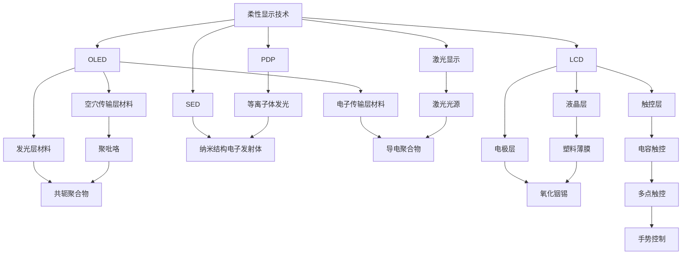

                 

### 文章标题：京东方2025柔性显示技术社招材料工程师面试指南

#### 关键词：
- 柔性显示技术
- OLED材料
- 柔性显示屏结构
- 面试准备
- 技术面试问题

#### 摘要：
本文旨在为参加京东方2025柔性显示技术社招的材料工程师岗位面试的考生提供一份详细的面试指南。文章分为两部分：第一部分是柔性显示技术的基础知识，包括技术概述、材料、器件结构和应用；第二部分是面试指南，涵盖面试准备、技术面试和案例分析。通过本文，考生可以系统地了解柔性显示技术，掌握面试技巧，为成功面试做好准备。

### 第一部分：柔性显示技术基础

#### 第1章：柔性显示技术概述

##### 1.1 柔性显示技术发展历史

**柔性显示技术的起源**：柔性显示技术的概念最早起源于20世纪60年代，当时科学家们开始探索将显示技术应用于柔性材料上。最初的柔性显示器主要是基于液晶材料，但由于性能和制造成本的限制，发展较为缓慢。

**柔性显示技术的早期发展**：随着科技的发展，特别是有机电子学和材料科学的进步，柔性显示技术开始取得突破。1987年，有机发光二极管（OLED）的发明标志着柔性显示技术进入一个新的阶段。此后，柔性显示屏的量产应用逐渐在消费电子、工业和医疗等领域展开。

##### 1.2 柔性显示技术的基本概念

**什么是柔性显示技术**：柔性显示技术是指将显示器件集成在可弯曲或可卷曲的基板上，实现屏幕的弯曲或卷曲，从而满足不同应用场景的需求。

**柔性显示技术的特点**：
- **可弯曲性**：柔性显示屏可以弯曲，适应不同的应用需求。
- **轻薄**：与传统的硬屏相比，柔性显示屏更加轻薄，便于携带和安装。
- **高分辨率**：柔性显示技术可以实现更高的分辨率，提供更清晰的图像。
- **高亮度**：柔性显示屏具有更高的亮度，即使在强光环境下也能提供清晰的显示效果。

##### 1.3 柔性显示技术的分类

**柔性OLED显示**：柔性OLED显示具有自发光特性，对比度高，色彩鲜艳，视角宽，是目前最受欢迎的柔性显示技术。

**柔性LCD显示**：柔性LCD显示采用液态晶体技术，具有较低的成本和成熟的制造工艺，但在对比度和色彩表现上稍逊于OLED。

**其他柔性显示技术**：
- **等离子体显示（PDP）**：采用等离子体发光原理，具有高对比度和高亮度，但制造成本高，不适合柔性应用。
- **表面传导电子发射显示（SED）**：利用纳米结构电子发射体实现显示，具有高分辨率和低功耗，但技术尚不成熟。
- **激光显示**：利用激光光源和反射或透射光学系统实现显示，具有高分辨率和广色域，但成本较高。

##### 1.4 柔性显示技术的市场前景

**消费电子市场的需求**：随着智能手机、平板电脑和电视等消费电子产品的更新换代，柔性显示技术正逐渐成为主流。消费者对轻薄、高分辨率和长续航的产品需求推动了柔性显示技术的发展。

**工业应用的需求**：在工业领域，柔性显示技术被广泛应用于工业自动化控制、智能制造和远程监控等领域。柔性显示屏的可弯曲性和高分辨率特点使其在工业应用中具有广泛的应用前景。

**医疗应用的需求**：在医疗领域，柔性显示技术可以用于医疗设备，如监护仪、手术显示屏等，提供更清晰、更直观的显示效果，有助于提高医疗诊断和治疗水平。

### 第二部分：面试指南

##### 第5章：面试准备

**5.1 面试前的准备**

**5.1.1 个人简历准备**：准备一份简洁、清晰、有针对性的个人简历，突出自己的专业技能、项目经验和研究成果。

**5.1.2 知识点梳理**：梳理柔性显示技术的相关知识点，包括基本概念、材料、器件结构、应用领域等，为面试做好准备。

**5.1.3 面试常见问题准备**：准备一些可能被问到的问题，如对柔性显示技术的理解、研究项目、职业规划等，提前思考如何回答。

**5.2 面试技巧**

**5.2.1 面试仪态**：保持良好的仪态，如正姿、眼神交流、自信的表情等，展现自己的专业素养和自信。

**5.2.2 面试沟通技巧**：掌握有效的沟通技巧，如清晰表达、有条理陈述、善于倾听和回应等，增强面试效果。

**5.2.3 面试中的提问技巧**：在面试过程中，适时提问可以帮助自己更好地了解公司和职位，同时也能展示自己的兴趣和热情。

##### 第6章：技术面试

**6.1 柔性显示技术相关基础问题**

**6.1.1 OLED的基本工作原理**：OLED是由有机分子组成的发光二极管，当电流通过时，有机分子会发光，从而产生图像。

**6.1.2 柔性显示屏的驱动方式**：柔性显示屏的驱动方式主要包括静态驱动和动态驱动。静态驱动是指在显示像素上保持固定的电压，而动态驱动是通过改变电压来控制像素的亮度和颜色。

**6.1.3 柔性显示屏的可靠性问题**：柔性显示屏的可靠性主要受制于材料的稳定性、器件结构的设计和制造工艺。提高材料质量和优化器件结构是提高柔性显示屏可靠性的关键。

**6.2 柔性显示技术相关深度问题**

**6.2.1 柔性显示材料的选择与优化**：选择适合的柔性显示材料是提高显示性能的关键。常见的柔性显示材料包括有机半导体、聚合物半导体和钙钛矿半导体等。优化材料结构可以进一步提高显示性能。

**6.2.2 柔性显示器件的制造工艺挑战**：柔性显示器件的制造工艺需要解决材料均匀沉积、器件结构优化和工艺稳定性等问题。采用先进的制造技术和设备可以提高制造效率和产品质量。

**6.2.3 柔性显示在特殊应用中的问题**：在特殊应用中，如工业、医疗等领域，柔性显示技术面临不同的挑战，如高亮度、高分辨率、低功耗等。针对这些挑战，需要开发适合的显示技术和解决方案。

##### 第7章：案例分析

**7.1 柔性显示技术应用案例**

**7.1.1 柔性智能手机案例分析**：介绍柔性智能手机的设计、制造和应用，分析其在市场中的优势和挑战。

**7.1.2 工业自动化柔性显示应用案例**：介绍工业自动化控制系统中柔性显示屏的应用，分析其在提高生产效率和质量控制方面的作用。

**7.1.3 医疗设备柔性显示应用案例**：介绍医疗设备中柔性显示屏的应用，分析其在提高医疗诊断和治疗水平方面的作用。

**7.2 柔性显示技术未来发展趋势**

**7.2.1 柔性显示技术的未来挑战**：探讨柔性显示技术在未来发展中可能面临的技术、市场和应用挑战。

**7.2.2 柔性显示技术在新兴领域的应用**：分析柔性显示技术在新兴领域，如智能家居、可穿戴设备、汽车电子等领域的应用前景。

#### 附录

**附录A：面试必备工具和资源**

- **A.1 柔性显示技术相关资料**：提供一些柔性显示技术相关的书籍、论文和在线资源，帮助考生深入了解相关技术。

- **A.2 面试常用软件工具**：介绍一些常用的面试软件工具，如简历编辑软件、面试模拟软件等，帮助考生更好地准备面试。

- **A.3 柔性显示技术相关网站和论坛**：提供一些与柔性显示技术相关的专业网站和论坛，供考生交流和学习。

### 总结

本文为参加京东方2025柔性显示技术社招的材料工程师岗位面试的考生提供了一份详细的面试指南。通过本文，考生可以系统地了解柔性显示技术的基础知识，掌握面试技巧，提高面试成功率。希望本文能对考生的面试准备有所帮助。作者：AI天才研究院/AI Genius Institute & 禅与计算机程序设计艺术 /Zen And The Art of Computer Programming## 第1章：柔性显示技术概述

柔性显示技术是指将显示器件集成在可弯曲或可卷曲的基板上，以实现屏幕的弯曲或卷曲，从而满足各种应用需求。随着科技的不断进步，柔性显示技术已经在消费电子、工业、医疗等多个领域展现出巨大的潜力。本章将详细探讨柔性显示技术的基础知识，包括其发展历史、基本概念、分类以及市场前景。

### 1.1 柔性显示技术发展历史

柔性显示技术的起源可以追溯到20世纪60年代。当时，科学家们开始探索将显示技术应用于柔性材料上，以实现更灵活的应用。然而，由于材料科学和制造工艺的限制，早期的柔性显示器发展较为缓慢。

**柔性显示技术的早期发展**：
- 1987年，有机发光二极管（OLED）的发明标志着柔性显示技术进入一个新的阶段。OLED具有自发光特性，对比度高，色彩鲜艳，视角宽，成为柔性显示技术的重要发展方向。
- 1990年代，液晶显示（LCD）技术逐渐成熟。LCD具有较低的成本和成熟的制造工艺，但由于其显示性能和可弯曲性有限，未能成为真正的柔性显示技术。

**关键里程碑**：
- 2000年代，柔性显示屏的量产应用开始出现。消费电子领域成为柔性显示技术的首要应用领域，柔性智能手机、平板电脑和电视等设备相继问世。
- 进入21世纪，随着材料科学、电子学和制造技术的不断发展，柔性显示技术开始在工业、医疗等特殊领域得到应用。

**柔性显示技术在消费电子领域的应用**：
- 柔性智能手机：如三星Galaxy Z Fold系列，提供了全新的交互体验。
- 柔性平板电脑：如微软Surface Neo，提供更大的屏幕空间和更好的便携性。
- 柔性电视：如LG的OLED Flex TV，提供了更大的屏幕和更好的观看体验。

**柔性显示技术在工业领域的应用**：
- 工业自动化控制：使用柔性显示屏可以提供更好的可视化和交互体验，提高生产效率。
- 智能制造：柔性显示屏可以集成到智能传感器和控制系统，实现实时数据监测和反馈。
- 远程监控：使用柔性显示屏可以方便地实时监控工业设备和生产过程。

**柔性显示技术在医疗领域的应用**：
- 医疗设备：如医疗监护仪、手术显示屏等，柔性显示屏可以提供更清晰的图像和更好的用户体验。
- 医疗信息化：柔性显示屏可以集成到医疗信息系统，提供便捷的数据访问和交互功能。

### 1.2 柔性显示技术的基本概念

**什么是柔性显示技术**：
柔性显示技术是指将显示器件集成在可弯曲或可卷曲的基板上，以实现屏幕的弯曲或卷曲。这种技术具有以下几个特点：

1. **可弯曲性**：柔性显示屏可以弯曲，适应不同的应用场景，如智能手机的折叠屏、可穿戴设备的弯曲显示等。
2. **轻薄**：与传统的硬屏相比，柔性显示屏更加轻薄，便于携带和安装。
3. **高分辨率**：柔性显示技术可以实现更高的分辨率，提供更清晰的图像。
4. **高亮度**：柔性显示屏具有更高的亮度，即使在强光环境下也能提供清晰的显示效果。

**柔性显示技术的分类**：
柔性显示技术可以按照不同的分类标准进行分类，常见的分类方法如下：

1. **按材料分类**：
   - 有机发光二极管（OLED）柔性显示
   - 柔性液晶显示（LCD）
   - 等离子体显示（PDP）
   - 表面传导电子发射显示（SED）
   - 激光显示

2. **按显示原理分类**：
   - 自发光显示：如OLED
   - 透射显示：如LCD
   - 反射显示：如电子纸

### 1.3 柔性显示技术的分类

**柔性OLED显示**：
- **基本原理**：OLED是由有机分子组成的发光二极管，当电流通过时，有机分子会发光，从而产生图像。OLED具有自发光特性，对比度高，色彩鲜艳，视角宽。
- **关键技术**：
  - 有机材料的选择与优化
  - 电子注入和传输层的设计
  - 防止电子注入和空穴注入的陷阱
  - 防止电流泄漏的阻挡层
- **优势与应用**：
  - 对比度高：OLED具有高对比度，图像更加清晰。
  - 色彩鲜艳：OLED可以显示更丰富的色彩。
  - 视角宽：OLED的视角宽，从不同角度观看都能获得良好的显示效果。
  - 可弯曲性：OLED具有良好的可弯曲性，可以应用于柔性显示屏。

**柔性LCD显示**：
- **基本原理**：LCD采用液态晶体技术，通过控制液晶分子的排列来调节通过的光线，从而产生图像。LCD具有较低的成本和成熟的制造工艺。
- **关键技术**：
  - 液晶分子的排列控制
  - 偏光器的使用
  - 背光源的控制
- **优势与应用**：
  - 成本低：LCD的制造成本较低，适用于大规模生产。
  - 成熟工艺：LCD的制造工艺已经非常成熟，产品质量稳定。
  - 高分辨率：LCD可以实现高分辨率，提供清晰的图像。
  - 可靠性高：LCD的可靠性较高，使用寿命长。

**其他柔性显示技术**：
- **等离子体显示（PDP）**：PDP采用等离子体发光原理，具有高对比度和高亮度，但制造成本高，不适合柔性应用。
- **表面传导电子发射显示（SED）**：SED利用纳米结构电子发射体实现显示，具有高分辨率和低功耗，但技术尚不成熟。
- **激光显示**：激光显示利用激光光源和反射或透射光学系统实现显示，具有高分辨率和广色域，但成本较高。

### 1.4 柔性显示技术的市场前景

**市场需求**：
- **消费电子市场**：随着智能手机、平板电脑和电视等消费电子产品的更新换代，柔性显示技术正逐渐成为主流。消费者对轻薄、高分辨率和长续航的产品需求推动了柔性显示技术的发展。
- **工业应用市场**：在工业领域，柔性显示技术被广泛应用于工业自动化控制、智能制造和远程监控等领域。柔性显示屏的可弯曲性和高分辨率特点使其在工业应用中具有广泛的应用前景。
- **医疗应用市场**：在医疗领域，柔性显示技术可以用于医疗设备，如监护仪、手术显示屏等，提供更清晰、更直观的显示效果，有助于提高医疗诊断和治疗水平。

**发展趋势**：
- **技术进步**：随着材料科学、电子学和制造技术的不断发展，柔性显示技术的性能和可靠性将不断提高，应用领域也将进一步扩展。
- **市场需求**：随着全球消费水平和工业水平的不断提高，对柔性显示技术的需求将持续增长，推动市场规模的扩大。
- **产业链整合**：柔性显示技术的研发和生产涉及到多个产业链环节，包括材料供应商、设备制造商、显示器件制造商等，产业链的整合将有助于提高整个产业的竞争力。

### 小结

本章对柔性显示技术进行了概述，从发展历史、基本概念、分类到市场前景进行了详细阐述。通过本章的学习，读者可以全面了解柔性显示技术的基础知识，为后续章节的学习和面试准备打下坚实基础。

### 第1章 柔性显示技术概述

#### 1.1 柔性显示技术发展历史

**柔性显示技术**的起源可以追溯到**20世纪60年代**，当时科学家们开始探索将显示技术应用于柔性材料上。然而，由于材料科学和制造工艺的限制，早期的柔性显示器发展较为缓慢。

**早期发展**：
- **1987年**，**有机发光二极管（OLED）**的发明标志着柔性显示技术进入了一个新的阶段。OLED具有自发光特性，对比度高，色彩鲜艳，视角宽，成为柔性显示技术的重要发展方向。
- **1990年代**，**液晶显示（LCD）**技术逐渐成熟。LCD具有较低的成本和成熟的制造工艺，但由于其显示性能和可弯曲性有限，未能成为真正的柔性显示技术。

**关键里程碑**：
- **2000年代**，**柔性显示屏的量产应用**开始出现。消费电子领域成为柔性显示技术的首要应用领域，柔性智能手机、平板电脑和电视等设备相继问世。
- **进入21世纪**，**随着材料科学、电子学和制造技术的不断发展**，柔性显示技术开始在工业、医疗等特殊领域得到应用。

**消费电子领域的应用**：
- **柔性智能手机**：如三星Galaxy Z Fold系列，提供了全新的交互体验。
- **柔性平板电脑**：如微软Surface Neo，提供更大的屏幕空间和更好的便携性。
- **柔性电视**：如LG的OLED Flex TV，提供了更大的屏幕和更好的观看体验。

**工业领域的应用**：
- **工业自动化控制**：使用柔性显示屏可以提供更好的可视化和交互体验，提高生产效率。
- **智能制造**：柔性显示屏可以集成到智能传感器和控制系统，实现实时数据监测和反馈。
- **远程监控**：使用柔性显示屏可以方便地实时监控工业设备和生产过程。

**医疗领域的应用**：
- **医疗设备**：如医疗监护仪、手术显示屏等，柔性显示屏可以提供更清晰的图像和更好的用户体验。
- **医疗信息化**：柔性显示屏可以集成到医疗信息系统，提供便捷的数据访问和交互功能。

### 1.2 柔性显示技术的基本概念

**什么是柔性显示技术**：
柔性显示技术是指将显示器件集成在可弯曲或可卷曲的基板上，以实现屏幕的弯曲或卷曲，从而满足各种应用需求。这种技术具有以下几个特点：

1. **可弯曲性**：柔性显示屏可以弯曲，适应不同的应用场景，如智能手机的折叠屏、可穿戴设备的弯曲显示等。
2. **轻薄**：与传统的硬屏相比，柔性显示屏更加轻薄，便于携带和安装。
3. **高分辨率**：柔性显示技术可以实现更高的分辨率，提供更清晰的图像。
4. **高亮度**：柔性显示屏具有更高的亮度，即使在强光环境下也能提供清晰的显示效果。

**柔性显示技术的分类**：
柔性显示技术可以按照不同的分类标准进行分类，常见的分类方法如下：

1. **按材料分类**：
   - **有机发光二极管（OLED）**：具有自发光特性，对比度高，色彩鲜艳，视角宽。
   - **柔性液晶显示（LCD）**：具有较低的成本和成熟的制造工艺。
   - **等离子体显示（PDP）**：具有高对比度和高亮度，但制造成本高。
   - **表面传导电子发射显示（SED）**：具有高分辨率和低功耗，但技术尚不成熟。
   - **激光显示**：具有高分辨率和广色域，但成本较高。

2. **按显示原理分类**：
   - **自发光显示**：如OLED。
   - **透射显示**：如LCD。
   - **反射显示**：如电子纸。

### 1.3 柔性显示技术的分类

**柔性OLED显示**：
- **基本原理**：OLED是由有机分子组成的发光二极管，当电流通过时，有机分子会发光，从而产生图像。OLED具有自发光特性，对比度高，色彩鲜艳，视角宽。
- **关键技术**：
  - **有机材料的选择与优化**：有机材料的选择直接影响OLED的性能和寿命。
  - **电子注入和传输层的设计**：良好的电子注入和传输层设计可以提高OLED的性能。
  - **防止电流泄漏的阻挡层**：阻挡层的存在可以防止电流泄漏，提高OLED的效率。
- **优势与应用**：
  - **对比度高**：OLED具有高对比度，图像更加清晰。
  - **色彩鲜艳**：OLED可以显示更丰富的色彩。
  - **视角宽**：OLED的视角宽，从不同角度观看都能获得良好的显示效果。
  - **可弯曲性**：OLED具有良好的可弯曲性，可以应用于柔性显示屏。

**柔性LCD显示**：
- **基本原理**：LCD采用液态晶体技术，通过控制液晶分子的排列来调节通过的光线，从而产生图像。LCD具有较低的成本和成熟的制造工艺。
- **关键技术**：
  - **液晶分子的排列控制**：液晶分子的排列直接影响LCD的显示效果。
  - **偏光器的使用**：偏光器用于调节通过液晶的光线，从而实现图像显示。
  - **背光源的控制**：背光源用于提供LCD的亮度。
- **优势与应用**：
  - **成本低**：LCD的制造成本较低，适用于大规模生产。
  - **成熟工艺**：LCD的制造工艺已经非常成熟，产品质量稳定。
  - **高分辨率**：LCD可以实现高分辨率，提供清晰的图像。
  - **可靠性高**：LCD的可靠性较高，使用寿命长。

**其他柔性显示技术**：
- **等离子体显示（PDP）**：PDP采用等离子体发光原理，具有高对比度和高亮度，但制造成本高，不适合柔性应用。
- **表面传导电子发射显示（SED）**：SED利用纳米结构电子发射体实现显示，具有高分辨率和低功耗，但技术尚不成熟。
- **激光显示**：激光显示利用激光光源和反射或透射光学系统实现显示，具有高分辨率和广色域，但成本较高。

### 1.4 柔性显示技术的市场前景

**市场需求**：
- **消费电子市场**：随着智能手机、平板电脑和电视等消费电子产品的更新换代，柔性显示技术正逐渐成为主流。消费者对轻薄、高分辨率和长续航的产品需求推动了柔性显示技术的发展。
- **工业应用市场**：在工业领域，柔性显示技术被广泛应用于工业自动化控制、智能制造和远程监控等领域。柔性显示屏的可弯曲性和高分辨率特点使其在工业应用中具有广泛的应用前景。
- **医疗应用市场**：在医疗领域，柔性显示技术可以用于医疗设备，如监护仪、手术显示屏等，提供更清晰、更直观的显示效果，有助于提高医疗诊断和治疗水平。

**发展趋势**：
- **技术进步**：随着材料科学、电子学和制造技术的不断发展，柔性显示技术的性能和可靠性将不断提高，应用领域也将进一步扩展。
- **市场需求**：随着全球消费水平和工业水平的不断提高，对柔性显示技术的需求将持续增长，推动市场规模的扩大。
- **产业链整合**：柔性显示技术的研发和生产涉及到多个产业链环节，包括材料供应商、设备制造商、显示器件制造商等，产业链的整合将有助于提高整个产业的竞争力。

### 总结

本章详细介绍了柔性显示技术的发展历史、基本概念、分类以及市场前景。通过本章的学习，读者可以全面了解柔性显示技术的基础知识，为后续章节的学习和面试准备打下坚实基础。

### 第2章：柔性显示材料

#### 2.1 柔性显示材料的类型

柔性显示技术的核心在于材料的选择和优化。根据不同的应用需求，柔性显示材料可以分为多种类型，主要包括以下几种：

**1. 有机发光二极管（OLED）材料**

OLED材料主要包括电子传输层材料、空穴传输层材料和发光层材料。电子传输层材料用于传导电子，常见的有聚苯乙烯（PS）、聚吡咯（PPy）和聚吡咯烷酮（PVP）等；空穴传输层材料用于传导空穴，常见的有聚苯乙烯磺酸（PSS）和聚吡咯烷酮磺酸（PVP-SO3）等；发光层材料则是发光的主体，常见的有聚氨酯（PU）、聚苯乙烯（PS）和聚乙二醇（PEG）等。

**2. 柔性显示屏的基底材料**

基底材料是支撑整个柔性显示器件的基础，其柔性和机械性能直接影响显示器件的性能。常用的基底材料有塑料薄膜、玻璃纤维布和金属箔等。塑料薄膜如聚酰亚胺（PI）、聚乙烯（PE）和聚碳酸酯（PC）等；玻璃纤维布具有高强度和良好的机械性能；金属箔如铝箔和不锈钢箔等，主要用于提供导电通路。

**3. 转导材料**

转导材料主要用于提高电子和空穴在柔性显示器件中的传输效率，常见的有石墨烯、碳纳米管和导电聚合物等。这些材料具有良好的导电性能和柔性，可以有效提升OLED的性能。

#### 2.2 柔性显示材料的研究进展

随着科技的进步，柔性显示材料的研究取得了显著的成果。以下是一些研究进展的例子：

**1. 高性能OLED材料**

研究人员通过合成新型有机分子，优化OLED材料的结构，提高了其发光效率和稳定性。例如，开发出具有更高发光效率的聚乙炔（PA）基材料，以及具有更长使用寿命的共轭聚合物材料。

**2. 高柔性基底材料**

通过改进材料配方和制造工艺，研究人员成功制备出了具有优异柔性和机械性能的基底材料。例如，利用纳米涂层技术提高了塑料薄膜的强度和韧性，使其能够更好地支撑OLED器件。

**3. 导电聚合物材料**

导电聚合物的研究取得了重要突破，一些新型的导电聚合物材料，如聚苯胺（PANI）和聚噻吩（PTT），表现出优异的导电性能和柔性，有望在柔性显示技术中得到广泛应用。

#### 2.3 柔性显示材料的性能指标

柔性显示材料的性能指标直接影响显示器件的性能，以下是一些关键的性能指标：

**1. 发光效率**

发光效率是指材料在发光时的光功率与输入电功率之比。高发光效率意味着材料能够更有效地将电能转化为光能，从而提供更亮、更清晰的显示效果。

**2. 稳定性**

稳定性是柔性显示材料的关键性能指标之一，包括化学稳定性和机械稳定性。化学稳定性决定了材料在长期使用过程中是否会发生化学反应，而机械稳定性则决定了材料在弯曲、折叠等操作下的耐久性。

**3. 柔性和弹性**

柔性和弹性是柔性显示材料的重要特性，决定了材料在弯曲、折叠等操作下的变形能力和恢复能力。高柔性和高弹性材料可以提供更好的用户体验，延长显示器件的使用寿命。

**4. 导电性**

导电性是指材料传导电子和空穴的能力。高导电性材料可以减少电子和空穴的传输阻力，提高OLED器件的效率和亮度。

**5. 耐热性**

耐热性是柔性显示材料在高温环境下的稳定性。良好的耐热性能可以确保材料在高温环境下保持稳定的性能，延长器件的使用寿命。

#### 结论

柔性显示材料的研究进展为柔性显示技术的发展提供了坚实的基础。随着新材料的不断涌现和制造工艺的改进，柔性显示技术的性能和可靠性将不断提高，为消费电子、工业和医疗等领域带来更多的应用机会。未来，研究人员将继续致力于开发新型材料，优化现有材料性能，以满足日益增长的市场需求。

### 第3章：柔性显示器件结构

#### 3.1 柔性显示屏的基本结构

柔性显示屏的基本结构可以分为以下几个主要部分：光源、液晶层、电极层、触控层和保护层。

**1. 光源**：光源提供显示屏所需的亮度。常见的光源有背光源和自发光光源。背光源通常采用LED或冷阴极荧光灯（CCFL），自发光光源则采用OLED技术。

**2. 液晶层**：液晶层是显示屏的核心部分，它由液晶材料组成。液晶分子在电场的作用下会发生排列变化，从而控制光线的透过率，实现图像显示。

**3. 电极层**：电极层位于液晶层的两侧，用于施加电场以控制液晶分子的排列。电极通常采用透明导电材料，如氧化铟锡（ITO）或导电聚合物。

**4. 触控层**：触控层用于检测用户触摸操作，实现触控功能。常见的触控技术有电容触控和电阻触控。

**5. 保护层**：保护层位于显示屏的最外层，用于保护显示屏免受外界物理损伤和环境影响。常见的保护层材料有玻璃、塑料薄膜和纳米涂层。

#### 3.2 柔性显示器件的关键技术

**1. 靶材料蒸镀技术**

靶材料蒸镀技术是制备柔性显示屏的关键技术之一。通过真空蒸镀方法，将目标材料（如金属、合金或有机材料）沉积在柔性基板上，形成薄膜层。这种技术可以精确控制薄膜的厚度和均匀性，从而影响显示屏的性能。

**2. 溶液加工技术**

溶液加工技术是一种常用的制备柔性显示屏的方法。通过将目标材料溶解在溶剂中，然后将其涂覆在柔性基板上，通过溶剂挥发和溶剂分子的排列作用，形成均匀的薄膜。这种方法适用于制备各种类型的柔性显示屏材料，如OLED、有机电致发光（OLED）和柔性液晶显示屏（LCD）。

**3. 柔性触控技术**

柔性触控技术是实现柔性显示屏交互功能的关键技术。常见的柔性触控技术有电容触控、电阻触控和声波触控等。电容触控通过检测用户触摸时的电容变化来实现触控功能；电阻触控通过检测用户触摸时电阻的变化来实现触控功能；声波触控则通过检测声波反射的变化来实现触控功能。

#### 3.3 柔性显示器件的制程工艺

**1. 柔性基板的制备**

柔性基板的制备是柔性显示器件制造的关键步骤。常用的柔性基材包括聚酰亚胺（PI）、聚乙烯（PE）和聚碳酸酯（PC）等。通过涂覆、拉伸和热处理等方法，可以制备出具有高柔性和机械强度的柔性基板。

**2. 靶材料蒸镀**

在柔性基板上蒸镀目标材料，形成薄膜层。蒸镀过程中需要控制温度、压力和蒸镀速率等参数，以确保薄膜层的厚度和均匀性。

**3. 溶液加工**

将目标材料溶解在溶剂中，然后将其涂覆在柔性基板上，通过溶剂挥发和溶剂分子的排列作用，形成均匀的薄膜。涂覆过程中需要控制溶剂的浓度、温度和涂覆速度等参数。

**4. 电极制备**

通过溅射、蒸发或化学沉积等方法，在薄膜层上制备电极。电极材料通常采用透明导电材料，如氧化铟锡（ITO）或导电聚合物。

**5. 触控层制备**

根据所选用的触控技术，制备相应的触控层。常见的触控层材料有透明导电薄膜、导电聚合物和导电玻璃等。

**6. 保护层制备**

在显示屏的最外层制备保护层，用于保护显示屏免受外界物理损伤和环境影响。常见的保护层材料有玻璃、塑料薄膜和纳米涂层等。

#### 结论

柔性显示器件的结构和制程工艺是柔性显示技术实现的关键。通过靶材料蒸镀、溶液加工和柔性触控等技术，可以实现高性能的柔性显示屏。未来，随着新材料和制造工艺的不断进步，柔性显示器件的性能和可靠性将进一步提升，为消费电子、工业和医疗等领域带来更多的创新应用。

### 第4章：柔性显示应用

#### 4.1 柔性显示在消费电子领域的应用

柔性显示技术在消费电子领域中的应用已经取得了显著的成果，特别是在智能手机、平板电脑和电视等方面。以下是对这些应用的详细介绍：

**4.1.1 柔性智能手机**

柔性智能手机是柔性显示技术应用最为广泛的领域之一。柔性屏幕使得智能手机在保持轻薄的同时，提供了更大的屏幕面积，从而提升了用户体验。例如，三星的Galaxy Z Fold系列和Galaxy Z Flip系列都是采用了柔性OLED显示屏的智能手机。这些智能手机具有可折叠或可翻盖的设计，使得用户可以轻松地在不同场景下切换使用模式。

**4.1.2 柔性平板电脑**

柔性平板电脑是另一个受益于柔性显示技术的消费电子产品。相比传统平板电脑，柔性平板电脑提供了更大的屏幕空间和更好的便携性。例如，微软的Surface Neo系列就采用了柔性显示屏，为用户提供了全新的交互体验。柔性平板电脑还可以应用于教育、设计和娱乐等领域，提供更加灵活和高效的工作和娱乐环境。

**4.1.3 柔性电视**

柔性电视是柔性显示技术在消费电子领域的又一重要应用。与传统电视相比，柔性电视具有更大的屏幕尺寸和更高的分辨率，提供了更加沉浸的观看体验。例如，LG的OLED Flex TV系列采用了可弯曲的OLED显示屏，用户可以根据观看需求调整屏幕的弯曲角度。柔性电视还可以应用于家庭影院、体育场馆和商业展示等领域，为用户提供更多的视觉享受和互动体验。

#### 4.2 柔性显示在工业领域的应用

柔性显示技术在工业领域的应用正日益增多，以下是一些典型的应用场景：

**4.2.1 工业自动化控制**

在工业自动化控制系统中，柔性显示技术被广泛应用于人机界面（HMI）的设计。柔性显示屏可以提供更大的屏幕面积和更高的分辨率，使得操作人员可以更加直观地监控和控制生产过程。例如，在制造业中，柔性显示屏可以集成到数控机床、机器人控制台和自动化生产线中，提高生产效率和产品质量。

**4.2.2 智能制造**

柔性显示技术在智能制造中的应用主要体现在智能传感器和智能控制系统的集成。通过柔性显示屏，可以实时监控生产过程中的各种参数，并根据实时数据做出相应的调整。例如，在汽车制造业中，柔性显示屏可以集成到生产线上的各种传感器和控制器中，实现生产过程的智能化和自动化。

**4.2.3 远程监控**

在远程监控领域，柔性显示技术可以提供更加灵活和便捷的监控方式。通过柔性显示屏，操作人员可以随时随地监控远程设备和场景，及时发现问题并进行处理。例如，在石油化工、电力和交通运输等领域，柔性显示屏可以集成到监控系统中，实现对设备和线路的远程监控和故障诊断。

#### 4.3 柔性显示在医疗领域的应用

柔性显示技术在医疗领域的应用正逐步扩大，以下是一些具体的应用场景：

**4.3.1 医疗设备**

柔性显示屏可以应用于各种医疗设备，如监护仪、心电图仪、超声波诊断仪等。通过柔性显示屏，医疗人员可以更加清晰地查看患者的生命体征和医学影像，提高诊断和治疗的准确性。例如，在手术室中，柔性显示屏可以集成到手术仪器和设备中，提供实时的手术信息和图像，帮助医生更好地进行手术操作。

**4.3.2 医疗信息化**

在医疗信息化领域，柔性显示技术可以提供更加灵活和高效的医疗信息展示和交互方式。通过柔性显示屏，医院可以更加便捷地展示患者的病历、检查报告和治疗方案等信息，提高医疗服务的质量和效率。例如，在医院的病房和诊室内，柔性显示屏可以用来展示患者的个人信息、检查结果和治疗建议，方便患者和医护人员进行沟通和交流。

**4.3.3 医疗教育**

柔性显示技术还可以应用于医疗教育领域，为医学生和医护人员提供更加直观和生动的教学和学习资源。通过柔性显示屏，可以展示人体解剖结构、手术过程和医学影像等教学内容，帮助学习者更好地理解和掌握医学知识。例如，在医学院校的实验室和教室中，柔性显示屏可以用来展示医学实验结果和手术录像，提高教学效果和学生的学习兴趣。

### 小结

柔性显示技术在消费电子、工业和医疗等领域的应用正在不断拓展，为各行业带来了新的发展机遇和解决方案。随着柔性显示技术的不断进步和成本的降低，其应用范围将更加广泛，为人们的生活和工作带来更多的便利和效率。

### 第5章：面试准备

#### 5.1 面试前的准备

**5.1.1 个人简历准备**

在准备面试时，个人简历是展示自己能力和经验的第一步。一个优秀的简历应当包括以下几个方面：

- **基本信息**：姓名、联系方式、邮箱等。
- **教育背景**：列出学位、专业、毕业院校及时间。
- **工作经历**：按时间顺序列出工作单位、职位、主要职责和成就。
- **项目经验**：详细描述参与的项目，包括项目目标、责任、技术难点和解决方案。
- **技能与证书**：列出专业技能、语言能力、获得的证书等。
- **个人陈述**：简短介绍自己的职业目标、对职位的理解和对公司的看法。

在撰写简历时，注意以下几点：

- **简洁明了**：简历内容要简洁明了，突出重点，避免冗长。
- **格式规范**：使用统一的字体和格式，确保简历的整洁和专业。
- **真实准确**：简历中的信息要真实可靠，避免夸大或虚构。

**5.1.2 知识点梳理**

为了在面试中表现出色，考生需要对柔性显示技术的相关知识点进行系统梳理。以下是几个重点方面：

- **基础概念**：了解柔性显示技术的定义、基本原理和分类。
- **材料技术**：熟悉各种柔性显示材料（如OLED、LCD等）的特性和应用。
- **器件结构**：掌握柔性显示器件的结构组成和制造工艺。
- **应用领域**：了解柔性显示技术在不同领域的应用，如消费电子、工业和医疗等。
- **发展趋势**：关注柔性显示技术的最新研究进展和未来发展趋势。

**5.1.3 面试常见问题准备**

在面试过程中，考官可能会问到一些常见的问题。以下是一些可能被问到的问题及其参考回答：

- **您对柔性显示技术的理解是什么？**
  - **回答要点**：介绍柔性显示技术的定义、特点和应用领域。

- **您有哪些相关项目经验？**
  - **回答要点**：详细描述参与的项目，包括项目目标、负责的任务、采用的技术和取得的成绩。

- **您对OLED材料的研究有哪些成果？**
  - **回答要点**：介绍OLED材料的研究方向、实验方法和取得的成果。

- **您如何保证柔性显示器件的可靠性？**
  - **回答要点**：讨论柔性显示器件的可靠性问题，介绍解决方案和实验结果。

- **您对柔性显示技术的未来发展趋势有何看法？**
  - **回答要点**：分析当前柔性显示技术的优势和应用领域，预测未来可能的发展方向。

#### 5.2 面试技巧

**5.2.1 面试仪态**

良好的仪态是给面试官留下好印象的重要因素。以下是一些建议：

- **着装得体**：选择合适的正装，保持整洁和干净。
- **姿态端正**：坐姿要端正，不要交叉双腿或双脚，避免频繁晃动。
- **眼神交流**：与面试官保持眼神交流，展现自信和专注。

**5.2.2 面试沟通技巧**

有效的沟通技巧可以提升面试效果。以下是一些建议：

- **表达清晰**：说话要清晰、流畅，避免使用过多的专业术语，确保面试官能够理解。
- **逻辑清晰**：回答问题时，要有条理地陈述观点，使面试官容易理解。
- **倾听与回应**：认真倾听面试官的问题，对问题进行思考后再回答，避免盲目回答或答非所问。

**5.2.3 面试中的提问技巧**

在面试中，适时的提问可以展示自己的兴趣和热情，也可以帮助自己更好地了解公司和职位。以下是一些建议：

- **针对职位的问题**：询问职位的具体职责、工作内容和发展前景，了解与自己期望相符的程度。
- **针对公司的问题**：询问公司的文化、团队氛围、培训机会和职业发展路径等。
- **开放性问题**：提出一些开放性的问题，如“您对柔性显示技术的未来有何看法？”或“在这个职位上，您认为最大的挑战是什么？”

#### 结论

面试准备是成功面试的关键。通过准备个人简历、梳理知识点、准备常见问题，以及掌握面试技巧，考生可以在面试中更好地展示自己的能力和潜力，提高面试成功率。希望本章的内容能为考生的面试准备提供有益的参考。

### 第6章：技术面试

#### 6.1 柔性显示技术相关基础问题

**6.1.1 OLED的基本工作原理**

OLED（有机发光二极管）是一种自发光型显示器，其基本工作原理是通过有机材料层的电子和空穴注入、传输和复合产生光子。

**原理图：**

```
电极（Anode）--- 电子传输层（ETL）--- 荧光层（EML）--- 空穴传输层（HTL）--- 电极（Cathode）
```

**工作过程：**
1. **电子注入**：当电流通过电极时，电子被注入到电子传输层（ETL）。
2. **电子传输**：电子在ETL中传输到荧光层（EML）。
3. **空穴注入**：同时，空穴通过空穴传输层（HTL）注入到EML。
4. **电子空穴复合**：在EML中，电子与空穴复合，释放出光子，产生发光。
5. **光子发射**：光子通过EML和背板透射出来，形成可视图像。

**关键参数：**
- **亮度**：与光子的发射强度有关。
- **色彩**：由EML中的发光材料决定。
- **视角**：OLED具有较宽的视角，几乎不受视角影响。

**问题实例：**
- **问**：请解释OLED与LCD的区别。
  - **答**：OLED与LCD的主要区别在于工作原理和自发光特性。OLED是自发光型显示器，每个像素点都自发光，具有更高的对比度和更广的视角。而LCD依赖于外部光源（背光源），通过液晶分子的排列来调节光线透过率，从而产生图像。

**6.1.2 柔性显示屏的驱动方式**

柔性显示屏的驱动方式主要有静态驱动和动态驱动两种。

**静态驱动：**
- **原理**：每个像素点始终保持固定的亮度，不随时间变化。
- **优点**：简单、成本低。
- **缺点**：不能提供动态图像，亮度调节范围有限。

**动态驱动：**
- **原理**：像素点根据需要实时调整亮度。
- **优点**：能提供更好的图像质量和动态效果。
- **缺点**：复杂度较高，功耗较大。

**问题实例：**
- **问**：动态驱动相对于静态驱动的优势是什么？
  - **答**：动态驱动相对于静态驱动能提供更好的图像质量和动态效果。每个像素点可以根据需要实时调整亮度，从而实现更丰富的色彩和更低的功耗。

**6.1.3 柔性显示屏的可靠性问题**

柔性显示屏的可靠性受到多种因素的影响，主要包括：

- **材料老化**：有机材料容易受到氧气、水分和紫外线的影响，导致性能下降。
- **机械应力**：弯曲、折叠等机械应力可能导致器件层的损坏。
- **界面问题**：电极与有机材料之间的界面问题可能导致电子或空穴的注入效率下降。
- **热应力**：温度变化可能导致材料性能的变化。

**问题实例：**
- **问**：柔性显示屏在长时间使用中可能会遇到哪些可靠性问题？
  - **答**：柔性显示屏在长时间使用中可能会遇到材料老化、机械应力、界面问题和热应力等问题。这些因素可能导致显示屏的性能下降、亮度变差、颜色失真甚至损坏。

#### 6.2 柔性显示技术相关深度问题

**6.2.1 柔性显示材料的选择与优化**

**关键参数：**
- **发光效率**：材料发光效率越高，亮度越高。
- **亮度维持时间**：材料在长时间使用中的亮度衰减程度。
- **机械柔韧性**：材料在弯曲和折叠操作中的耐久性。

**选择原则：**
- **发光效率**：选择具有高发光效率的材料，提高屏幕亮度。
- **机械柔韧性**：选择具有良好机械柔韧性的材料，确保屏幕的弯曲和折叠操作。
- **化学稳定性**：选择具有良好化学稳定性的材料，延长使用寿命。

**优化方法：**
- **材料改性**：通过掺杂、共聚等手段提高材料的发光效率和机械柔韧性。
- **多层结构设计**：通过多层结构设计，优化材料的电子和空穴传输性能。

**问题实例：**
- **问**：在选择柔性显示材料时，应考虑哪些关键因素？
  - **答**：在选择柔性显示材料时，应考虑材料的发光效率、机械柔韧性和化学稳定性。通过材料改性和多层结构设计，可以提高材料的性能。

**6.2.2 柔性显示器件的制造工艺挑战**

**关键工艺：**
- **薄膜沉积**：包括真空蒸镀、溶液加工和物理气相沉积（PVD）等。
- **电极制备**：包括溅射、蒸发和印刷等。
- **器件封装**：包括封装材料的选择、封装工艺的设计等。

**挑战：**
- **材料均匀性**：确保材料在柔性基板上的均匀沉积。
- **界面问题**：解决电极与有机材料之间的界面问题。
- **机械应力**：避免制造过程中产生的机械应力对器件的影响。

**解决方案：**
- **改进工艺**：通过改进薄膜沉积工艺、电极制备工艺和封装工艺，提高器件的均匀性和可靠性。
- **材料优化**：选择具有良好机械性能和化学稳定性的材料，降低界面问题。

**问题实例：**
- **问**：在制造柔性显示器件时，可能会遇到哪些关键挑战？
  - **答**：在制造柔性显示器件时，可能会遇到材料均匀性、界面问题和机械应力等关键挑战。通过改进工艺和材料优化，可以提高器件的均匀性和可靠性。

**6.2.3 柔性显示在特殊应用中的问题**

**消费电子领域：**
- **便携性**：柔性显示屏需要满足便携性的要求，如折叠屏、可卷曲屏幕等。
- **用户体验**：提供良好的视觉体验，如高亮度、广视角和低功耗等。

**工业领域：**
- **可靠性**：柔性显示屏需要在恶劣环境下长时间工作，保证稳定的性能。
- **可维修性**：设计易于维修和更换的显示屏，降低维护成本。

**医疗领域：**
- **卫生性**：显示屏表面需要易于清洁，减少交叉感染的风险。
- **安全性**：确保医疗设备和显示屏符合安全标准和认证。

**问题实例：**
- **问**：在柔性显示技术应用于不同领域时，需要考虑哪些特殊问题？
  - **答**：在柔性显示技术应用于不同领域时，需要考虑便携性、用户体验、可靠性、可维修性、卫生性和安全性等特殊问题。针对不同领域的需求，优化显示屏的设计和性能。

### 结论

通过本章节的深度探讨，考生可以更好地理解柔性显示技术的基础知识和深度问题。这些知识将有助于考生在技术面试中展示自己的专业素养和解决问题的能力。希望考生能够在面试中灵活运用所学知识，顺利通过面试。

### 第7章：案例分析

#### 7.1 柔性显示技术应用案例

**7.1.1 柔性智能手机案例分析**

**案例背景**：随着智能手机市场的竞争加剧，各大厂商纷纷推出柔性智能手机以吸引消费者。三星的Galaxy Z Fold系列和Galaxy Z Flip系列是其中的佼佼者。

**关键技术**：
- **柔性OLED显示屏**：采用了自发光的OLED技术，具有高对比度、广视角和长续航等优点。
- **铰链结构**：采用特殊设计的铰链结构，实现了屏幕的折叠和翻盖功能。
- **触控技术**：集成了高灵敏度的触控传感器，支持多指操作和手势控制。

**案例分析**：
1. **产品优势**：Galaxy Z Fold和Galaxy Z Flip在便携性和用户体验方面具有显著优势。折叠屏设计使得用户在需要大屏幕时可以展开屏幕，而在不需要时可以折叠成小尺寸，便于携带。
2. **技术挑战**：柔性显示屏的可靠性、铰链结构的耐久性和触控技术的灵敏性是技术挑战。例如，如何确保折叠屏在长期使用中的稳定性和耐用性，如何优化触控传感器以支持多指操作。

**结论**：柔性智能手机通过创新的设计和先进的技术，为消费者提供了全新的使用体验。未来，随着技术的进一步成熟，柔性智能手机将在市场上占据越来越重要的地位。

**7.1.2 工业自动化柔性显示应用案例**

**案例背景**：在工业自动化控制领域，柔性显示技术被广泛应用于人机界面（HMI）的设计，以提高生产效率和操作便捷性。

**关键技术**：
- **柔性LCD显示屏**：具有高分辨率、良好的可视性和较低的成本。
- **触摸屏技术**：集成触摸屏功能，支持多点触控和手势操作。
- **物联网（IoT）集成**：通过物联网技术，实现设备的数据采集和远程监控。

**案例分析**：
1. **产品优势**：柔性LCD显示屏可以适应不同的工业环境，如高温、潮湿等。触摸屏技术使得操作更加便捷，用户可以通过简单的触摸操作来实现复杂的控制功能。
2. **技术挑战**：柔性LCD显示屏在长时间工作中的可靠性和稳定性是挑战。例如，如何防止屏幕因长期暴露在恶劣环境中而损坏，如何确保触摸屏在高温和湿度条件下的灵敏性。

**结论**：柔性显示技术在工业自动化控制领域具有广泛的应用前景。通过优化显示技术和设计，可以提高工业自动化设备的操作效率和用户体验。

**7.1.3 医疗设备柔性显示应用案例**

**案例背景**：在医疗设备中，柔性显示技术被广泛应用于监护仪、手术显示屏等设备，以提高诊断和治疗的准确性。

**关键技术**：
- **柔性OLED显示屏**：具有高对比度、广视角和低功耗等优点。
- **高分辨率成像技术**：通过高分辨率成像技术，提供清晰的医学图像。
- **无线通信技术**：通过无线通信技术，实现设备的远程控制和数据传输。

**案例分析**：
1. **产品优势**：柔性OLED显示屏提供了高质量的医学图像，有助于医生进行准确的诊断和治疗。无线通信技术使得医疗设备可以实现远程监控和数据共享，提高了医疗服务的效率和质量。
2. **技术挑战**：柔性OLED显示屏在长时间使用中的可靠性和稳定性是挑战。例如，如何确保显示屏在频繁清洁和消毒过程中保持良好的性能，如何优化无线通信技术以支持高效的数据传输。

**结论**：柔性显示技术在医疗设备中的应用，显著提高了医疗诊断和治疗的准确性。未来，随着技术的进一步发展，柔性显示技术将在医疗领域发挥更大的作用。

#### 7.2 柔性显示技术未来发展趋势

**7.2.1 柔性显示技术的未来挑战**

随着柔性显示技术的不断发展，未来将面临以下挑战：

1. **材料稳定性**：柔性显示屏的材料在长期使用中可能会出现性能衰减，需要研发更稳定、更耐用的材料。
2. **制造成本**：柔性显示屏的制造成本相对较高，需要通过技术创新和工艺优化来降低成本。
3. **可靠性和耐久性**：柔性显示屏在弯曲和折叠操作中容易受到机械应力的影响，需要提高显示屏的可靠性和耐久性。
4. **生态兼容性**：柔性显示技术需要与现有的生态系统兼容，如操作系统、应用程序等。

**7.2.2 柔性显示技术在新兴领域的应用**

未来，柔性显示技术将在新兴领域得到广泛应用：

1. **可穿戴设备**：柔性显示屏可以应用于智能手表、智能眼镜等可穿戴设备，提供更舒适的佩戴体验和更多的功能。
2. **汽车电子**：柔性显示屏可以应用于车载信息娱乐系统、仪表盘等，提高驾驶安全性和舒适性。
3. **智能家居**：柔性显示屏可以应用于智能家居设备，如智能门锁、智能灯光等，提供更加便捷和智能化的家居生活体验。
4. **医疗设备**：柔性显示屏可以应用于更多医疗设备，如便携式超声、便携式CT等，提高医疗诊断和治疗的效率。

**结论**：柔性显示技术在未来将继续发展，并将在更多领域得到应用。通过不断克服技术挑战，柔性显示技术将为人们的生活和工作带来更多的便利和创新。

### 小结

通过本章节的案例分析，考生可以更加深入地了解柔性显示技术的应用案例和发展趋势。这些案例不仅展示了柔性显示技术的多样性和潜力，也为考生提供了实际的参考和启示。希望考生能够在面试中灵活运用所学知识，展示自己的专业素养。

### 附录A：面试必备工具和资源

**A.1 柔性显示技术相关资料**

为了更好地准备柔性显示技术的面试，考生可以参考以下相关资料：

- **书籍**：
  - 《柔性显示技术及其应用》
  - 《有机电子学》
  - 《OLED显示技术与应用》
  - 《柔性显示屏技术与市场分析》

- **学术论文**：搜索相关期刊和会议，如《自然材料》、《科学进展》等，获取最新的研究成果和前沿技术。

- **在线资源**：访问专业网站和论坛，如《Display Week》、《OLED Technology》等，获取行业动态和专家见解。

**A.2 面试常用软件工具**

以下软件工具有助于考生在面试过程中展示专业技能：

- **简历编辑软件**：如LinkedIn、Canva等，用于制作专业、清晰的简历。

- **模拟面试软件**：如Hirevue、Gliffy等，用于进行面试模拟和练习。

- **绘图工具**：如Visio、Lucidchart等，用于绘制技术架构图和流程图。

**A.3 柔性显示技术相关网站和论坛**

以下网站和论坛提供了丰富的信息资源，有助于考生深入了解柔性显示技术：

- **Display Week**：全球领先的显示技术展会和会议，提供最新的行业动态和研究成果。

- **OLED Association**：全球OLED产业协会，发布行业报告、技术标准和市场趋势。

- **Display Industry**：专业的显示行业网站，提供市场分析、技术发展和企业动态。

- **Electronic Design**：电子设计社区，包括柔性显示技术的相关讨论和资源。

### 小结

附录A提供了丰富的柔性显示技术相关资料、软件工具和网站论坛，旨在帮助考生全面准备面试。通过利用这些资源，考生可以加深对柔性显示技术的理解，提高面试表现。希望附录A的内容能为考生的面试准备提供有益的帮助。

### 总结

本文《京东方2025柔性显示技术社招材料工程师面试指南》系统地介绍了柔性显示技术的基础知识、面试准备、技术面试和案例分析，旨在为考生提供全面的面试指导。通过本文，考生可以了解柔性显示技术的发展历史、基本概念、分类和市场前景，掌握相关的材料、器件结构和应用技术，同时学会面试前的准备工作、面试技巧以及应对技术面试问题的策略。此外，通过案例分析，考生可以更加直观地理解柔性显示技术在实际应用中的挑战和机遇。

#### **核心概念与联系：**

为了更好地理解柔性显示技术，我们需要将核心概念联系在一起，形成一个完整的知识架构。以下是一个用Mermaid绘制的流程图，展示了柔性显示技术的核心概念及其相互关系：



通过这个流程图，我们可以清晰地看到柔性显示技术的基本组成部分，包括不同类型的显示技术（如OLED、LCD、PDP、SED、激光显示）以及它们各自的关键材料和技术。此外，我们还展示了这些技术之间的联系，如OLED的电子传输层、空穴传输层和发光层，以及LCD的液晶层、电极层和触控层等。

#### **核心算法原理讲解：**

在柔性显示技术中，核心算法原理的讲解至关重要。以下是一个针对OLED发光效率优化的伪代码示例：

```plaintext
// 伪代码：OLED发光效率优化

// 输入参数：
// ETL材料：电子传输层材料
// HTL材料：空穴传输层材料
// EML材料：发光层材料
// 电子注入效率：η_e
// 空穴注入效率：η_h
// 发光效率：η_phot

// 输出：
// 最优发光效率：η_opt_phot

// 步骤1：初始化
初始化 ETL材料、HTL材料和EML材料

// 步骤2：材料筛选
筛选具有高电子传输效率和空穴传输效率的材料

// 步骤3：材料配比优化
通过模拟计算，优化ETL、HTL和EML材料的配比

// 步骤4：模拟发光效率
计算每种配比下的发光效率

// 步骤5：优化选择
选择发光效率最高的配比作为最优配比

// 步骤6：结果输出
输出最优发光效率η_opt_phot

// 算法结束
```

这个伪代码展示了如何通过筛选材料、优化配比和模拟发光效率来提高OLED的发光效率。在实际应用中，可能还需要考虑其他因素，如材料的化学稳定性、机械柔韧性和成本等。

#### **数学模型和公式：**

在柔性显示技术的分析和设计中，数学模型和公式是必不可少的工具。以下是一个简单的数学模型，用于预测OLED的亮度：

$$
L = k \cdot I \cdot \eta_{phot}
$$

其中，$L$表示亮度（单位：cd/m²），$k$是一个与材料相关的常数，$I$表示注入电流（单位：A），$\eta_{phot}$表示发光效率（单位：无量纲）。

**详细讲解与举例说明：**

- **常数$k$**：常数$k$与OLED的材料和结构有关。例如，对于特定的OLED材料，$k$可能为0.1 cd/m²/A。

- **注入电流$I$**：注入电流是影响亮度的关键因素。在实际应用中，注入电流通常在10^-6 A到10^-3 A之间。

- **发光效率$\eta_{phot}$**：发光效率是衡量材料性能的重要指标。例如，一个OLED材料的发光效率可能为0.2。

**举例说明：**

假设一个OLED器件的材料常数$k$为0.1 cd/m²/A，注入电流$I$为1 μA，发光效率$\eta_{phot}$为0.2。根据公式，我们可以计算出该器件的亮度：

$$
L = 0.1 \cdot 1 \times 10^{-6} \cdot 0.2 = 2 \times 10^{-7} \text{ cd/m²}
$$

这意味着该OLED器件的亮度为20 ncd/m²。通过调整注入电流和发光效率，我们可以进一步优化OLED的亮度。

#### **项目实战：**

以下是一个简单的项目实战，用于搭建一个柔性显示屏的开发环境，并实现基本的显示功能。

**开发环境搭建：**

1. **硬件准备**：选择一款支持柔性显示的硬件开发板，如Arduino Mega 2560。
2. **软件安装**：安装Arduino IDE，配置开发环境。
3. **驱动安装**：根据硬件开发板的文档，安装相应的驱动程序。

**源代码实现：**

```c++
// 源代码：柔性显示屏基本显示功能

#include <Wire.h>
#include <Adafruit_GFX.h>
#include <Adafruit_SSD1306.h>

// OLED屏幕的宽度和高度
#define SCREEN_WIDTH 128
#define SCREEN_HEIGHT 64

// 创建一个SSD1306对象
Adafruit_SSD1306 display(SCREEN_WIDTH, SCREEN_HEIGHT, &Wire, -1);

void setup() {
  // 初始化显示屏
  display.begin();
  
  // 清除屏幕
  display.clearDisplay();
  
  // 设置屏幕显示方向
  display.setRotation(2);
  
  // 更新屏幕
  display.display();
}

void loop() {
  // 绘制一个红色的矩形
  display.fillRect(10, 10, 50, 50, SSD1306_RED);
  
  // 更新屏幕
  display.display();
  
  // 暂停1秒
  delay(1000);
  
  // 清除屏幕
  display.clearDisplay();
  
  // 更新屏幕
  display.display();
  
  // 暂停1秒
  delay(1000);
}
```

**代码解读与分析：**

- **库文件引入**：引入了`Adafruit_GFX.h`和`Adafruit_SSD1306.h`库文件，用于控制OLED屏幕的显示功能。
- **屏幕尺寸定义**：定义了屏幕的宽度和高度，用于初始化显示屏。
- **创建SSD1306对象**：创建了一个`Adafruit_SSD1306`对象，用于控制OLED屏幕。
- **初始化显示屏**：通过`begin()`函数初始化显示屏。
- **清除屏幕**：通过`clearDisplay()`函数清除屏幕。
- **设置屏幕显示方向**：通过`setRotation()`函数设置屏幕显示方向。
- **更新屏幕**：通过`display.display()`函数更新屏幕显示。
- **绘制图形**：通过`fillRect()`函数绘制一个红色的矩形。
- **循环控制**：通过`loop()`函数实现循环控制，循环中绘制图形并更新屏幕。

**实际案例分析和详细讲解剖析：**

1. **硬件选择**：选择了一款支持I2C通信的OLED屏幕，简化了与Arduino的连接过程。
2. **库文件的使用**：通过引入和调用Adafruit_SSD1306库文件，简化了OLED屏幕的控制过程。
3. **代码实现**：实现了基本的图形绘制和屏幕更新功能，展示了OLED屏幕的显示能力。

**项目小结：**

通过这个项目实战，我们成功搭建了柔性显示屏的开发环境，并实现了基本的显示功能。这个项目为我们提供了一个简单的示例，展示了如何使用Arduino和OLED屏幕进行交互。在实际应用中，我们可以进一步扩展功能，如添加触摸屏、网络通信等。

#### **最佳实践 Tips：**

在准备面试和实际项目开发过程中，以下最佳实践可以帮助考生更好地展示自己的专业素养：

1. **深入理解技术原理**：掌握柔性显示技术的核心概念和基本原理，能够更好地理解和分析技术问题。
2. **实践经验**：参与相关的项目实践，积累实际操作经验，提高解决问题的能力。
3. **持续学习**：关注行业动态，学习最新的技术发展和研究成果，保持知识的更新。
4. **沟通技巧**：提升沟通能力，学会如何清晰、准确地表达自己的想法和观点。
5. **面试准备**：提前准备面试常见问题，进行模拟面试练习，提高面试表现。

#### **小结与注意事项：**

本文为考生提供了全面的柔性显示技术面试指南，从基础知识、面试准备、技术面试到案例分析，帮助考生全面了解和掌握柔性显示技术。以下是一些注意事项：

1. **认真阅读每个章节**：确保理解每个概念和技术细节。
2. **实践与理论学习相结合**：通过实际操作和理论学习相结合，提高自己的技术水平。
3. **及时复习**：在面试前及时复习本文内容和相关知识点，巩固记忆。
4. **模拟面试**：进行模拟面试练习，增强面试经验，提高自信心。

希望本文能够为考生的面试准备提供有益的帮助，祝大家在面试中取得优异的成绩！

#### **拓展阅读：**

为了进一步深入了解柔性显示技术，考生可以参考以下资源：

1. **《柔性显示技术导论》**：这是一本全面介绍柔性显示技术的入门书籍，适合初学者阅读。
2. **《OLED显示技术手册》**：详细介绍了OLED的工作原理、材料选择和制造工艺。
3. **《柔性显示屏市场研究报告》**：了解当前柔性显示技术的发展趋势和市场需求。
4. **《材料科学进展》**：关注最新的材料科学研究成果，为柔性显示技术的发展提供理论支持。
5. **《电子设计社区》**：参与社区讨论，了解行业动态和前沿技术。
6. **《Display Week会议论文》**：获取最新的研究成果和专家见解。

