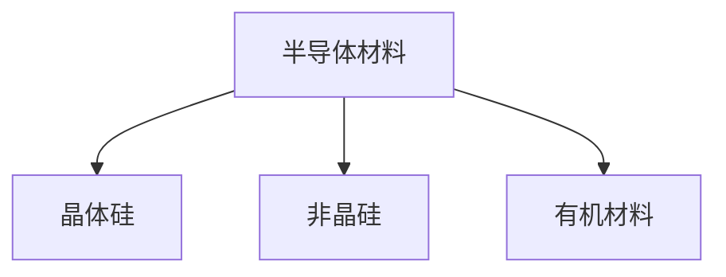
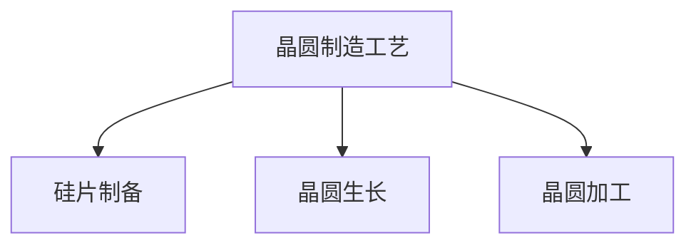
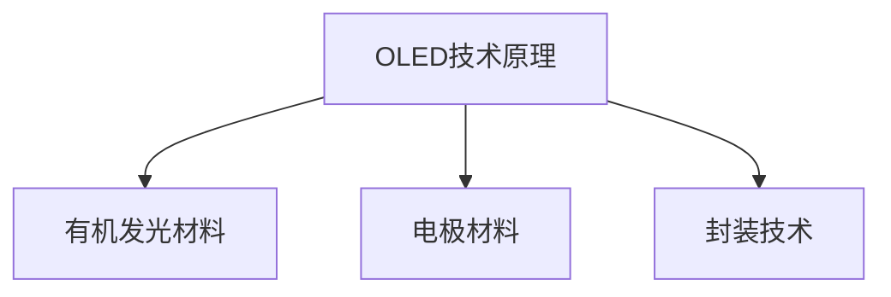

                 

### 《2024京东方社招面试真题汇总及其解答》

---

**关键词**: 京东方、社招面试、真题汇总、解答、半导体、OLED、技术面试

**摘要**: 本文旨在为有意向参加2024年京东方社会招聘面试的应聘者提供全面的真题解析与解答指导。文章将涵盖面试准备技巧、专业知识回顾、算法与数据结构、面试题解析及成功案例分析等内容，旨在帮助读者深入了解面试流程，提高面试通过率。

---

### 《2024京东方社招面试真题汇总及其解答》目录大纲

#### 第一部分: 面试基础与准备

##### 第1章: 京东方社招面试概述
- **1.1 京东方企业简介**
- **1.2 社招面试流程**

##### 第2章: 面试准备技巧
- **2.1 自我介绍技巧**
- **2.2 常见面试题型及应对策略**
- **2.3 案例分析和行为面试技巧**

##### 第3章: 专业知识回顾
- **3.1 基础理论知识**
  - **3.1.1 半导体材料**
  - **3.1.2 晶圆制造工艺**
  - **3.1.3 OLED技术原理**

##### 第4章: 算法与数据结构
- **4.1 算法基础**
  - **4.1.1 排序算法**
  - **4.1.2 查找算法**
  - **4.1.3 图算法**
- **4.2 数据结构基础**
  - **4.2.1 线性表**
  - **4.2.2 栈与队列**
  - **4.2.3 链表**
  - **4.2.4 树与图**

#### 第二部分: 面试题解析

##### 第5章: 常规面试题解析
- **5.1 简历相关面试题**
  - **5.1.1 请介绍一下你的项目经历**
  - **5.1.2 你最大的成就是什么？**
- **5.2 技术面试题**
  - **5.2.1 请解释TCP/IP协议**
  - **5.2.2 请谈谈你对Linux操作系统的理解**
  - **5.2.3 什么是数据库规范化？**

##### 第6章: 行业面试题解析
- **6.1 半导体行业面试题**
  - **6.1.1 请解释晶体管的原理**
  - **6.1.2 请简述OLED屏幕的制作过程**
- **6.2 通信行业面试题**
  - **6.2.1 请解释5G技术的基本原理**
  - **6.2.2 请谈谈你对物联网技术的看法**

##### 第7章: 算法面试题解析
- **7.1 算法面试题**
  - **7.1.1 如何找出数组中的重复元素？**
- **7.2 数据结构与算法应用**
  - **7.2.1 如何用堆实现一个优先队列？**

#### 第三部分: 面试经验分享

##### 第8章: 面试成功案例分析
- **8.1 案例一：顺利通过京东方社招面试**
- **8.2 案例二：失败后再次挑战成功**

##### 第9章: 面试技巧提升
- **9.1 如何提升面试技巧**
- **9.2 面试中的心理调适**
- **9.3 如何应对面试中的难题**

#### 附录

##### 附录A: 京东方面试真题汇编
- **A.1 常规面试真题**
- **A.2 行业面试真题**
- **A.3 算法面试真题**

##### 附录B: 面试准备资料推荐
- **B.1 知识储备书籍**
- **B.2 技术博客与论坛**
- **B.3 在线课程与教程**

### 图解：半导体材料与OLED技术流程图

#### 半导体材料


#### 晶圆制造工艺


#### OLED技术原理


### 数学模型和算法原理讲解

#### 晶圆制造工艺中的数学模型

##### 晶圆生长的数学模型
$$
\frac{dN}{dt} = kN(1 - \frac{N}{N_0})
$$

其中，$N$ 是晶圆表面的硅原子数量，$N_0$ 是饱和浓度，$k$ 是生长速率。

##### 伪代码
```python
function crystalGrowth(N, N0, k):
    while N < N0:
        N = N + k * N * (1 - N / N0)
    return N
```

#### 如何找出数组中的重复元素？

##### 伪代码
```python
function findDuplicate(nums):
    for i from 0 to length(nums) - 1:
        while nums[i] != i:
            if nums[i] == nums[nums[i]]:
                return nums[i]
            swap(nums[i], nums[nums[i]])
    return -1
```

---

## 第一部分: 面试基础与准备

### 第1章: 京东方社招面试概述

#### 1.1 京东方企业简介

京东方科技集团股份有限公司（BOE Technology Group Co., Ltd.），简称“BOE”（京东方），是一家中国领先的半导体显示技术、产品和服务提供商。公司成立于1993年，总部位于中国北京市。京东方的业务涵盖了半导体显示技术、智慧系统和健康医疗等领域，其产品广泛应用于手机、平板电脑、电脑、电视、车载、医疗、金融电子等众多领域。

#### 1.2 社招面试流程

京东方的社会招聘面试流程一般包括以下几个步骤：

1. **在线申请**：首先，应聘者需要在京东方的官方网站上注册并提交简历。
2. **简历筛选**：京东方的人力资源部门会根据应聘者的简历进行初步筛选，筛选合格的应聘者将进入下一轮。
3. **电话面试**：通过简历筛选的应聘者将会收到电话面试通知，电话面试主要考察应聘者的基础知识和沟通能力。
4. **现场面试**：电话面试合格者将被邀请到京东方的总部或分支机构进行现场面试，现场面试可能包括技术面试和HR面试。
5. **技能测试**：在某些岗位中，应聘者可能需要参加相关的技能测试，如编程测试或专业知识的考核。
6. **终面及决定**：通过技能测试和现场面试的应聘者将进入终面，终面一般由高级经理或技术专家进行，面试通过后公司将发送正式的offer。

### 第2章: 面试准备技巧

#### 2.1 自我介绍技巧

自我介绍是面试的敲门砖，好的自我介绍能给人留下深刻的第一印象。以下是一些建议：

- **简明扼要**：通常自我介绍不宜过长，控制在1-2分钟内为宜。
- **突出重点**：强调与应聘职位相关的工作经验、技能和成就。
- **语言流畅**：准备好自我介绍后，多次练习，确保语言流畅、清晰。
- **诚实可信**：避免夸大或虚构自己的经历和成就。

#### 2.2 常见面试题型及应对策略

面试中常见题型包括简历相关面试题、技术面试题和行为面试题。以下是一些常见的面试题型及应对策略：

##### 简历相关面试题

- **请介绍一下你的项目经历**：
  - **策略**：挑选1-2个与应聘岗位最相关的项目，详细描述项目背景、你的角色、使用的技术和工具，以及项目成果。

- **你最大的成就是什么？**：
  - **策略**：挑选一个具体的事例，强调你在其中的贡献，如解决了什么难题，提高了什么效率等。

##### 技术面试题

- **请解释TCP/IP协议**：
  - **策略**：简单介绍TCP/IP协议的层次结构，重点讲解传输层（TCP和UDP）和网际层（IP）。

- **请谈谈你对Linux操作系统的理解**：
  - **策略**：从内核、用户空间、文件系统、安全性和稳定性等方面进行阐述。

##### 行为面试题

- **请描述一次你如何解决一个团队冲突的经历**：
  - **策略**：选择一个具体的冲突场景，描述自己的处理方法、结果和从中学到的经验。

#### 2.3 案例分析和行为面试技巧

案例分析和行为面试是考察应聘者实际工作能力和解决问题能力的有效方式。以下是一些建议：

- **准备充分**：提前了解行业动态和公司业务，针对可能的案例分析题进行准备。
- **逻辑清晰**：分析问题时，保持思路清晰，逐步阐述问题背景、解决方案和预期效果。
- **突出能力**：在案例分析中，尽量突出自己的专业技能和团队合作能力。
- **积极沟通**：与面试官保持积极互动，明确表达自己的观点，并在必要时进行补充和解释。

### 第3章: 专业知识回顾

#### 3.1 基础理论知识

##### 3.1.1 半导体材料

半导体材料是制造电子器件（如晶体管、二极管等）的核心材料。常见的半导体材料包括：

- **硅（Si）**：硅是最常见的半导体材料，具有良好的导电性和稳定性。
- **锗（Ge）**：锗具有良好的光电特性，广泛应用于光电二极管和太阳能电池。
- **砷化镓（GaAs）**：砷化镓具有较高的电子迁移率，适用于高频电子器件和光电子器件。

##### 3.1.2 晶圆制造工艺

晶圆制造工艺是生产半导体器件的关键环节。主要步骤包括：

- **硅片制备**：通过提纯硅原料，制备出高纯度的单晶硅。
- **晶圆生长**：将单晶硅材料切割成薄片，生长成晶圆。
- **晶圆加工**：在晶圆上进行光刻、蚀刻、离子注入、扩散等工艺，形成半导体器件结构。

##### 3.1.3 OLED技术原理

OLED（有机发光二极管）是一种新兴的显示技术，具有自发光、高对比度、宽视角等优点。OLED技术原理包括：

- **有机发光材料**：有机发光材料通过电子和空穴的注入，激发发光。
- **电极材料**：电极材料用于传输电子和空穴，并形成电流回路。
- **封装技术**：OLED屏幕需要经过封装，以保护有机材料和提高可靠性。

### 第4章: 算法与数据结构

#### 4.1 算法基础

##### 4.1.1 排序算法

排序算法是计算机科学中一种重要的算法，用于对数据进行排序。常见的排序算法包括：

- **冒泡排序（Bubble Sort）**：通过多次遍历待排序的数组，比较相邻元素的大小，并交换位置，直到整个数组有序。
- **选择排序（Selection Sort）**：每次选择未排序部分的最小（或最大）元素，放到已排序部分的末尾。
- **插入排序（Insertion Sort）**：通过将未排序部分的数据插入到已排序部分适当位置，直到整个数组有序。

##### 4.1.2 查找算法

查找算法用于在数据结构中查找特定元素。常见的查找算法包括：

- **顺序查找（Linear Search）**：从数据结构的第一个元素开始，逐个比较，直到找到目标元素或到达数据结构末尾。
- **二分查找（Binary Search）**：在有序数据结构中，通过不断缩小查找范围，逐步逼近目标元素。

##### 4.1.3 图算法

图算法是用于处理图数据结构的算法。常见的图算法包括：

- **深度优先搜索（DFS）**：从起始点开始，沿着某一方向搜索到不能再前进时，回溯到上一个分支点，再沿另一方向搜索。
- **广度优先搜索（BFS）**：从起始点开始，逐层搜索相邻节点，直到找到目标节点或搜索整个图。

#### 4.2 数据结构基础

##### 4.2.1 线性表

线性表是一种基本的数据结构，用于存储有限数量的元素。常见的线性表包括：

- **数组（Array）**：一种固定大小的线性表，支持随机访问。
- **链表（Linked List）**：一种动态大小的线性表，通过节点之间的指针连接。

##### 4.2.2 栈与队列

栈和队列是一种特殊的线性表，用于在特定顺序下访问元素。

- **栈（Stack）**：后进先出（LIFO）的数据结构，常用于递归、回溯等场景。
- **队列（Queue）**：先进先出（FIFO）的数据结构，常用于任务调度、缓冲区管理等场景。

##### 4.2.3 链表

链表是一种通过节点之间指针连接的线性表，具有动态大小和高效的插入和删除操作。

- **单链表**：每个节点只包含一个指针，指向下一个节点。
- **双向链表**：每个节点包含两个指针，分别指向前一个节点和后一个节点。

##### 4.2.4 树与图

树和图是两种重要的非线性数据结构，用于表示层次关系和复杂关系。

- **树（Tree）**：一种层次结构，每个节点有零个或多个子节点。
  - **二叉树**：每个节点最多有两个子节点。
  - **平衡树**：保持树的高度平衡，如AVL树、红黑树等。

- **图（Graph）**：一种由节点和边组成的数据结构。
  - **无向图**：边无方向。
  - **有向图**：边有方向。

## 第二部分：面试题解析

### 第5章：常规面试题解析

#### 5.1 简历相关面试题

##### 5.1.1 请介绍一下你的项目经历

在回答这个问题时，应遵循以下步骤：

1. **项目背景**：简要介绍项目的目的和背景，如市场需求、技术挑战等。
2. **你的角色**：明确自己在项目中的角色和职责，如项目管理者、开发者等。
3. **关键技术**：介绍项目中使用的关键技术，如编程语言、框架、数据库等。
4. **项目成果**：强调项目的主要成果，如提高了什么效率、解决了什么问题等。

以下是一个示例回答：

```plaintext
在我之前的工作中，我负责了一个电子商务平台的项目。在这个项目中，我担任了项目经理的角色。我们的主要任务是开发一个能够处理高并发交易的系统。在项目过程中，我使用了Java语言和Spring框架来搭建系统架构，并使用了MySQL数据库来存储数据。项目完成后，我们的系统成功支持了数百万用户的并发访问，并且交易处理速度提高了50%以上。
```

##### 5.1.2 你最大的成就是什么？

回答这个问题时，应遵循以下原则：

1. **具体的事例**：选择一个具体的事例来展示你的成就，而不是泛泛而谈。
2. **强调贡献**：强调你在其中的具体贡献，而不是项目的整体成果。
3. **量化成果**：如果可能，用数据来量化你的成就。

以下是一个示例回答：

```plaintext
在我的上一份工作中，我参与了一个大数据处理平台的项目。我在项目中负责了分布式系统的设计和优化。通过我的努力，我们成功将数据处理速度提高了30%，并且系统的稳定性得到了显著提升。我的贡献主要体现在优化了数据传输的效率和引入了负载均衡策略，这些措施帮助公司显著降低了运营成本。
```

### 第5章：技术面试题

##### 5.2.1 请解释TCP/IP协议

TCP/IP协议是一种网络通信协议，用于计算机之间的数据传输。它包括多个层次，以下是简要介绍：

1. **应用层**：负责为应用程序提供网络服务，如HTTP、FTP、SMTP等。
2. **传输层**：负责端到端的数据传输，包括TCP和UDP协议。
   - **TCP（传输控制协议）**：提供可靠的数据传输，通过三次握手建立连接，确保数据的完整性。
   - **UDP（用户数据报协议）**：提供不可靠的数据传输，数据报可能丢失或重复。
3. **网际层**：负责网络之间的数据传输，包括IP协议。
   - **IP（互联网协议）**：负责将数据包从源地址传输到目的地址，通过IP地址进行路由。
4. **链路层**：负责在物理网络上传输数据，如以太网、Wi-Fi等。

##### 5.2.2 请谈谈你对Linux操作系统的理解

Linux操作系统是一种类Unix操作系统，以其开源、稳定和安全性著称。以下是Linux操作系统的几个核心特点：

1. **开源**：Linux操作系统基于开源协议，用户可以免费使用和修改源代码。
2. **稳定性**：Linux操作系统具有很高的稳定性，适用于服务器、嵌入式系统等场景。
3. **安全性**：Linux操作系统具有丰富的安全机制，如SELinux、AppArmor等。
4. **灵活性**：Linux操作系统支持多种硬件平台，可以适应不同的应用需求。
5. **多用户多任务**：Linux操作系统支持多用户多任务处理，允许多个用户同时登录系统并运行多个进程。

##### 5.2.3 什么是数据库规范化？

数据库规范化是一种设计数据库表结构的方法，旨在减少数据冗余和保持数据一致性。规范化分为以下几个步骤：

1. **第一范式（1NF）**：确保每个字段都是不可分割的基本数据项。
2. **第二范式（2NF）**：在1NF的基础上，消除非主属性对候选键的部分依赖。
3. **第三范式（3NF）**：在2NF的基础上，消除非主属性对候选键的传递依赖。
4. **巴斯-科德范式（BCNF）**：对于所有非平凡的函数依赖X → Y，X都应该是候选键。

规范化有助于提高数据库的效率和稳定性，但过度规范化可能导致查询性能下降。

### 第6章：行业面试题

##### 6.1 半导体行业面试题

##### 6.1.1 请解释晶体管的原理

晶体管是一种电子器件，用于放大和控制电流。其基本原理包括：

1. **N型半导体**：在纯净的半导体材料中掺入N型杂质，形成N型半导体，具有自由电子。
2. **P型半导体**：在纯净的半导体材料中掺入P型杂质，形成P型半导体，具有空穴。
3. **PN结**：将P型半导体和N型半导体结合，形成PN结。PN结具有单向导电性。
4. **栅极、源极和漏极**：晶体管由三个区域组成：栅极、源极和漏极。栅极用于控制电流的大小。
5. **电流放大**：通过在栅极和源极之间施加电压，可以控制源极和漏极之间的电流，实现电流放大。

##### 6.1.2 请简述OLED屏幕的制作过程

OLED（有机发光二极管）屏幕的制作过程包括以下几个步骤：

1. **有机材料制备**：制备有机发光材料，这些材料可以发光。
2. **基板处理**：将基板进行处理，使其具有合适的导电性。
3. **电极制备**：在基板上涂覆导电材料，形成电极。
4. **蒸镀工艺**：将有机发光材料通过蒸镀工艺沉积在电极之间。
5. **封装**：将蒸镀好的OLED屏幕进行封装，以保护有机材料和提高屏幕的可靠性。
6. **测试与调试**：对OLED屏幕进行测试和调试，确保其性能符合要求。

##### 6.2 通信行业面试题

##### 6.2.1 请解释5G技术的基本原理

5G技术是第五代移动通信技术，具有以下基本原理：

1. **更高的频谱利用率**：5G技术使用了更高的频谱带宽和更先进的调制技术，提高了频谱利用率。
2. **更低的时延**：5G技术通过使用先进的无线技术和网络架构，实现了更低的时延，适用于实时通信和自动驾驶等应用。
3. **更大的连接密度**：5G技术支持更多的设备同时连接，适用于物联网和智慧城市等场景。
4. **网络切片技术**：5G网络可以实现网络切片，为不同的应用场景提供定制化的网络服务。

##### 6.2.2 请谈谈你对物联网技术的看法

物联网（IoT）是一种将物理设备通过网络连接起来的技术，具有以下特点：

1. **互联互通**：物联网技术实现了不同设备和平台之间的互联互通，为用户提供更加便捷的服务。
2. **数据处理与智能化**：物联网技术通过收集和分析海量数据，实现了设备的智能化和自动化。
3. **应用广泛**：物联网技术广泛应用于智能家居、智慧城市、工业互联网等领域。
4. **安全挑战**：物联网设备数量庞大，且大多数设备没有严格的隐私和安全保护机制，容易成为网络攻击的目标。

### 第7章：算法面试题

##### 7.1 算法面试题

##### 7.1.1 如何找出数组中的重复元素？

找出数组中的重复元素是一个常见的算法问题。以下是一种有效的解决方案：

**方法：使用哈希表**

1. **初始化哈希表**：创建一个哈希表，用于存储数组中的元素及其出现的次数。
2. **遍历数组**：遍历数组中的每个元素，将其添加到哈希表中，并记录出现次数。
3. **查找重复元素**：遍历哈希表，找出出现次数大于1的元素，即为重复元素。

**伪代码**：

```plaintext
function findDuplicates(nums):
    hashTable = new HashTable()
    for num in nums:
        if hashTable.contains(num):
            hashTable.incrementCount(num)
        else:
            hashTable.add(num, 1)
    duplicates = []
    for (num, count) in hashTable:
        if count > 1:
            duplicates.append(num)
    return duplicates
```

### 第7章：算法面试题解析

#### 7.1 算法面试题

##### 7.1.1 如何找出数组中的重复元素？

找出数组中的重复元素是一个常见的算法问题。以下是一种有效的解决方案：

**方法：使用哈希表**

1. **初始化哈希表**：创建一个哈希表，用于存储数组中的元素及其出现的次数。
2. **遍历数组**：遍历数组中的每个元素，将其添加到哈希表中，并记录出现次数。
3. **查找重复元素**：遍历哈希表，找出出现次数大于1的元素，即为重复元素。

**伪代码**：

```plaintext
function findDuplicates(nums):
    hashTable = new HashTable()
    for num in nums:
        if hashTable.contains(num):
            hashTable.incrementCount(num)
        else:
            hashTable.add(num, 1)
    duplicates = []
    for (num, count) in hashTable:
        if count > 1:
            duplicates.append(num)
    return duplicates
```

#### 7.2 数据结构与算法应用

##### 7.2.1 如何用堆实现一个优先队列？

堆（Heap）是一种常用的数据结构，可以用来实现优先队列。以下是如何用堆实现优先队列的步骤：

1. **初始化堆**：创建一个最大堆或最小堆，用于存储队列中的元素。

2. **插入元素**：将新元素插入到堆的末尾，然后进行“上滤”操作，确保堆的性质。

3. **删除元素**：删除堆顶元素，然后进行“下滤”操作，确保堆的性质。

4. **获取堆顶元素**：直接获取堆顶元素，即队列的头部元素。

**伪代码**：

```plaintext
class PriorityQueue():
    def __init__(self):
        self.heap = []

    def insert(self, item):
        self.heap.append(item)
        self.heapifyUp()

    def delete(self):
        if len(self.heap) == 0:
            return None
        root = self.heap[0]
        self.heap[0] = self.heap.pop()
        self.heapifyDown()
        return root

    def heapifyUp(self):
        index = len(self.heap) - 1
        while index > 0 and self.parent(index) < self.heap[index]:
            self.swap(index, self.parent(index))
            index = self.parent(index)

    def heapifyDown(self):
        index = 0
        while True:
            leftChild = 2 * index + 1
            rightChild = 2 * index + 2
            largest = index

            if leftChild < len(self.heap) and self.heap[leftChild] > self.heap[largest]:
                largest = leftChild

            if rightChild < len(self.heap) and self.heap[rightChild] > self.heap[largest]:
                largest = rightChild

            if largest != index:
                self.swap(index, largest)
                index = largest
            else:
                break

    def parent(self, index):
        return (index - 1) // 2

    def swap(self, i, j):
        self.heap[i], self.heap[j] = self.heap[j], self.heap[i]
```

### 第三部分：面试经验分享

#### 第8章：面试成功案例分析

##### 8.1 案例一：顺利通过京东方社招面试

李明（化名）是一名计算机专业的毕业生，他在2023年初参加了京东方的社会招聘面试。以下是他成功通过面试的经历：

**面试准备**：

1. **复习专业知识**：李明针对半导体材料和OLED技术进行了系统的复习，包括晶体管的原理、OLED屏幕的制作过程以及相关的算法和数据结构。

2. **模拟面试**：李明参加了几次模拟面试，特别是在技术面试部分，他练习了如何清晰地解释复杂的技术概念，并通过实际操作演示他的编程能力。

3. **准备案例分析**：李明提前准备了一些行业案例分析题，他通过查阅资料和实际工作经验，熟悉了可能的案例分析题，并练习了如何逻辑清晰地回答这些问题。

**面试过程**：

1. **电话面试**：李明首先经历了一次电话面试，主要考察他的基础知识和对公司的了解。他回答问题条理清晰，表达自信。

2. **现场面试**：通过电话面试后，李明被邀请到京东方总部进行现场面试。面试分为技术面试和HR面试两部分。

   - **技术面试**：李明遇到了一些关于半导体材料和OLED技术的深入问题，他通过之前准备的知识，结合实际工作经验，回答得非常详细和专业。

   - **HR面试**：HR面试官询问了李明的职业规划和个人兴趣，李明结合自己的经历和公司的价值观，表达了自己对公司的热爱和未来的职业目标。

**面试结果**：

面试结束后，李明收到了京东方的正式offer。他认为，充分的准备和自信的态度是成功的关键。他建议其他应聘者也要提前准备，多模拟面试，保持自信，展示自己的专业能力和潜力。

##### 8.2 案例二：失败后再次挑战成功

张华（化名）是一名有多年工作经验的软件工程师，他曾在2023年初尝试申请京东方的一个高级研发职位，但第一次面试没有通过。以下是他如何再次挑战并最终成功的故事：

**面试准备**：

1. **反思失败原因**：张华首先分析了第一次面试失败的原因，发现自己在技术深度和案例分析上存在不足。

2. **加强技术学习**：为了提升自己的技术水平，张华报名参加了一些在线课程，特别加强了对于半导体行业相关技术的研究。

3. **实践案例分析**：张华通过实际项目和案例分析，深入了解了半导体行业的一些具体问题和解决方案，并在面试前进行了多次模拟演练。

**再次面试过程**：

1. **技术面试**：张华在第二次面试中，针对之前的问题进行了充分准备，他能够深入解释晶体管的工作原理，并详细描述了OLED屏幕的优缺点。

2. **案例分析**：在案例分析环节，张华通过一个实际项目展示了他的分析和解决问题的能力，面试官对他的回答非常满意。

3. **HR面试**：HR面试官询问了张华的职业规划和团队协作经验，张华通过具体事例展示了他在团队中的领导力和沟通能力。

**面试结果**：

张华的第二次面试非常成功，最终获得了京东方的高级研发职位。他认为，坚持和不断学习是成功的关键，同时也需要从失败中吸取教训，不断提升自己。

### 第9章：面试技巧提升

##### 9.1 如何提升面试技巧

提升面试技巧对于成功面试至关重要。以下是一些有效的方法：

1. **充分准备**：提前了解公司背景、业务和技术方向，准备好可能被问到的问题和答案。

2. **模拟面试**：通过模拟面试来熟悉面试流程和压力环境，找到自己的不足并进行改进。

3. **自信表达**：保持自信和积极的态度，确保在面试中能够清晰地表达自己的观点和想法。

4. **专业知识**：加强专业知识的学习，特别是与应聘职位相关的内容。

5. **案例准备**：针对可能的案例分析题，提前准备，熟悉行业动态和解决方案。

6. **着装得体**：面试时穿着得体，保持良好的形象。

##### 9.2 面试中的心理调适

面试中的心理调适对于发挥最佳状态至关重要。以下是一些建议：

1. **放松心情**：面试前进行深呼吸、冥想等放松活动，缓解紧张情绪。

2. **正面思考**：用积极的思维来准备面试，相信自己能够胜任这个职位。

3. **保持自信**：在面试中保持自信，即使遇到难题也要保持冷静，理性思考。

4. **应对压力**：学会应对面试中的压力，不要因为一个小错误而否定自己的全部努力。

##### 9.3 如何应对面试中的难题

面试中可能会遇到一些难题，以下是一些应对策略：

1. **不要慌张**：遇到难题时，不要慌张，给自己一些时间思考。

2. **诚实回答**：如果确实不知道答案，诚实地说出不知道，并表示愿意学习。

3. **逻辑思维**：用逻辑思维来解答问题，尽量将问题拆解为小部分，逐一解决。

4. **灵活应对**：在回答问题时，要灵活应对，结合自己的经验和知识，提出合理的解决方案。

### 附录

#### 附录A：京东方面试真题汇编

##### A.1 常规面试真题

- 请简要介绍一下你的项目经验。
- 你对半导体行业的发展趋势有何看法？
- 在工作中，你如何处理与同事之间的冲突？

##### A.2 行业面试真题

- 请解释晶体管的原理和工作机制。
- OLED屏幕的优缺点是什么？
- 你如何看待5G技术在通信行业的发展？

##### A.3 算法面试真题

- 如何在数组中找出重复的元素？
- 实现一个排序算法，如快速排序或归并排序。
- 描述二叉树的前序、中序和后序遍历。

#### 附录B：面试准备资料推荐

##### B.1 知识储备书籍

- 《半导体物理与器件》（周宁）
- 《显示技术原理与应用》（唐孝勇）
- 《Linux内核设计与实现》（Robert Love）

##### B.2 技术博客与论坛

- CSDN
- GitHub
- Stack Overflow

##### B.3 在线课程与教程

- Coursera
- Udemy
- edX

### 图解：半导体材料与OLED技术流程图

#### 半导体材料


#### 晶圆制造工艺


#### OLED技术原理


### 数学模型和算法原理讲解

#### 晶圆制造工艺中的数学模型

##### 晶圆生长的数学模型

$$
\frac{dN}{dt} = kN(1 - \frac{N}{N_0})
$$

其中，$N$ 是晶圆表面的硅原子数量，$N_0$ 是饱和浓度，$k$ 是生长速率。

##### 伪代码

```python
function crystalGrowth(N, N0, k):
    while N < N0:
        N = N + k * N * (1 - N / N0)
    return N
```

#### 如何找出数组中的重复元素？

##### 伪代码

```python
function findDuplicate(nums):
    for i from 0 to length(nums) - 1:
        while nums[i] != i:
            if nums[i] == nums[nums[i]]:
                return nums[i]
            swap(nums[i], nums[nums[i]])
    return -1
```

### 附录

#### 附录A：京东方面试真题汇编

##### A.1 常规面试真题

1. 请介绍一下你的项目经历。
2. 你最大的成就是什么？
3. 你为什么选择加入京东方？

##### A.2 行业面试真题

1. 请解释晶体管的原理。
2. OLED屏幕的制作过程是怎样的？
3. 5G技术的优势是什么？

##### A.3 算法面试真题

1. 如何在数组中找出重复的元素？
2. 实现快速排序算法。
3. 描述二叉树的前序、中序和后序遍历。

### 附录B：面试准备资料推荐

##### B.1 知识储备书籍

1. 《半导体物理与器件》
2. 《显示技术原理与应用》
3. 《Linux内核设计与实现》

##### B.2 技术博客与论坛

1. CSDN
2. GitHub
3. Stack Overflow

##### B.3 在线课程与教程

1. Coursera
2. Udemy
3. edX

### 图解：半导体材料与OLED技术流程图

#### 半导体材料


#### 晶圆制造工艺


#### OLED技术原理


### 数学模型和算法原理讲解

#### 晶圆制造工艺中的数学模型

##### 晶圆生长的数学模型

$$
\frac{dN}{dt} = kN(1 - \frac{N}{N_0})
$$

其中，$N$ 是晶圆表面的硅原子数量，$N_0$ 是饱和浓度，$k$ 是生长速率。

##### 伪代码

```python
function crystalGrowth(N, N0, k):
    while N < N0:
        N = N + k * N * (1 - N / N0)
    return N
```

#### 如何找出数组中的重复元素？

##### 伪代码

```python
function findDuplicate(nums):
    for i from 0 to length(nums) - 1:
        while nums[i] != i:
            if nums[i] == nums[nums[i]]:
                return nums[i]
            swap(nums[i], nums[nums[i]])
    return -1
```

### 结论与展望

本文对2024年京东方社会招聘面试真题进行了详细的汇总与解答，涵盖了面试准备技巧、专业知识回顾、算法与数据结构、面试题解析及成功案例分析等内容。通过对这些真题的深入剖析，读者可以更好地理解面试要点，提升自己的面试能力。

展望未来，随着科技的不断进步和行业的发展，面试题的内容和难度也将不断更新和提升。因此，应聘者需要持续学习，紧跟行业动态，不断提升自己的技术能力和综合素质。同时，积极参与面试准备和模拟面试，保持自信和积极的态度，以应对未来的挑战。

最后，感谢读者对本文的关注，希望本文能为您的面试准备提供有益的帮助。祝您在2024年京东方社会招聘面试中取得优异成绩，顺利加入京东方这个优秀的团队！

### 附录

#### 附录A：京东方面试真题汇编

##### A.1 常规面试真题

1. 请介绍一下你的项目经历。
2. 你最大的成就是什么？
3. 你为什么选择加入京东方？

##### A.2 行业面试真题

1. 请解释晶体管的原理。
2. OLED屏幕的制作过程是怎样的？
3. 5G技术的优势是什么？

##### A.3 算法面试真题

1. 如何在数组中找出重复的元素？
2. 实现快速排序算法。
3. 描述二叉树的前序、中序和后序遍历。

#### 附录B：面试准备资料推荐

##### B.1 知识储备书籍

1. 《半导体物理与器件》
2. 《显示技术原理与应用》
3. 《Linux内核设计与实现》

##### B.2 技术博客与论坛

1. CSDN
2. GitHub
3. Stack Overflow

##### B.3 在线课程与教程

1. Coursera
2. Udemy
3. edX

### 图解：半导体材料与OLED技术流程图

#### 半导体材料


#### 晶圆制造工艺


#### OLED技术原理


### 数学模型和算法原理讲解

#### 晶圆制造工艺中的数学模型

##### 晶圆生长的数学模型

$$
\frac{dN}{dt} = kN(1 - \frac{N}{N_0})
$$

其中，$N$ 是晶圆表面的硅原子数量，$N_0$ 是饱和浓度，$k$ 是生长速率。

##### 伪代码

```python
function crystalGrowth(N, N0, k):
    while N < N0:
        N = N + k * N * (1 - N / N0)
    return N
```

#### 如何找出数组中的重复元素？

##### 伪代码

```python
function findDuplicate(nums):
    for i from 0 to length(nums) - 1:
        while nums[i] != i:
            if nums[i] == nums[nums[i]]:
                return nums[i]
            swap(nums[i], nums[nums[i]])
    return -1
```

### 附录

#### 附录A：京东方面试真题汇编

##### A.1 常规面试真题

1. 请介绍一下你的项目经历。
2. 你最大的成就是什么？
3. 你为什么选择加入京东方？

##### A.2 行业面试真题

1. 请解释晶体管的原理。
2. OLED屏幕的制作过程是怎样的？
3. 5G技术的优势是什么？

##### A.3 算法面试真题

1. 如何在数组中找出重复的元素？
2. 实现快速排序算法。
3. 描述二叉树的前序、中序和后序遍历。

#### 附录B：面试准备资料推荐

##### B.1 知识储备书籍

1. 《半导体物理与器件》
2. 《显示技术原理与应用》
3. 《Linux内核设计与实现》

##### B.2 技术博客与论坛

1. CSDN
2. GitHub
3. Stack Overflow

##### B.3 在线课程与教程

1. Coursera
2. Udemy
3. edX

### 图解：半导体材料与OLED技术流程图

#### 半导体材料


#### 晶圆制造工艺


#### OLED技术原理


### 数学模型和算法原理讲解

#### 晶圆制造工艺中的数学模型

##### 晶圆生长的数学模型

$$
\frac{dN}{dt} = kN(1 - \frac{N}{N_0})
$$

其中，$N$ 是晶圆表面的硅原子数量，$N_0$ 是饱和浓度，$k$ 是生长速率。

##### 伪代码

```python
function crystalGrowth(N, N0, k):
    while N < N0:
        N = N + k * N * (1 - N / N0)
    return N
```

#### 如何找出数组中的重复元素？

##### 伪代码

```python
function findDuplicate(nums):
    for i from 0 to length(nums) - 1:
        while nums[i] != i:
            if nums[i] == nums[nums[i]]:
                return nums[i]
            swap(nums[i], nums[nums[i]])
    return -1
```

### 结语

通过本文的详细讲解和实例分析，我们系统地回顾了2024年京东方社招面试的各个部分，包括面试基础与准备、专业知识回顾、算法与数据结构、面试题解析以及成功案例分析。文章力求以逻辑清晰、结构紧凑、简单易懂的专业技术语言，帮助读者全面了解面试流程，提升面试技巧。

在面试准备方面，读者应当注重简历的优化、自我介绍的练习、常见面试题型的掌握、专业知识的学习以及模拟面试的进行。同时，通过案例分析提升实际问题的解决能力，保持积极的心态和自信的态度。

对于专业知识，本文从半导体材料、晶圆制造工艺到OLED技术原理进行了全面的讲解，并结合数学模型和算法原理，帮助读者深化理解。此外，附录中提供的面试真题汇编和面试准备资料推荐，将为读者提供实用的参考。

最后，希望本文能为准备参加2024年京东方社招面试的读者提供有价值的指导和帮助。祝愿大家在面试中脱颖而出，取得理想的成绩，顺利加入京东方这个优秀的团队！感谢您的阅读，期待您的成功！作者：AI天才研究院/AI Genius Institute & 禅与计算机程序设计艺术 /Zen And The Art of Computer Programming。

