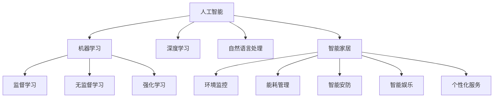

                 

### 1.1 人工智能的定义与发展历程

人工智能（Artificial Intelligence，简称AI）是一门旨在创建能够执行通常需要人类智能才能完成的任务的计算机科学分支。其历史可以追溯到20世纪50年代，当时计算机科学家艾伦·图灵（Alan Turing）提出了著名的图灵测试，用来评估机器是否具备人类水平的智能。

#### 1.1.1.1 人工智能的发展历程

人工智能的发展历程可以分为以下几个阶段：

1. **早期探索阶段（1950-1969）**
   - 1950年，艾伦·图灵提出图灵测试。
   - 1956年，达特茅斯会议标志着人工智能学科的正式诞生。
   - 1956-1958年，IBM的“杜瓦特”程序能够进行基础的数学运算。

2. **第一次繁荣时期（1960-1979）**
   - 1966年，约翰·麦卡锡（John McCarthy）提出了“专家系统”的概念。
   - 1972年，ELIZA程序成功模拟了人类心理治疗师。

3. **低谷时期（1980-1987）**
   - 由于实际应用中的技术难题和资源限制，人工智能研究进入低谷。

4. **复兴阶段（1988-2009）**
   - 1997年，IBM的超级计算机“深蓝”战胜了国际象棋世界冠军加里·卡斯帕罗夫。
   - 2006年，神经网络的研究取得重大突破，特别是深度学习算法的发展。

5. **全面爆发阶段（2010至今）**
   - 2012年，AlexNet在图像识别任务上取得了显著成绩。
   - 2016年，AlphaGo战胜了围棋世界冠军李世石。

#### 1.1.1.2 人工智能的核心概念

1. **机器学习**
   - 机器学习是人工智能的核心技术之一，它使计算机系统能够通过数据学习并做出决策。
   - 主要包括监督学习、无监督学习和强化学习。

2. **深度学习**
   - 深度学习是机器学习的一个子领域，它通过模仿人脑神经网络的结构来处理数据。
   - 深度学习在图像识别、语音识别和自然语言处理等领域表现出色。

3. **自然语言处理**
   - 自然语言处理是人工智能中用于处理人类自然语言的技术。
   - 主要包括语言模型、词嵌入和语音识别。

### 1.1.1.3 人工智能在智能家居中的应用前景

随着人工智能技术的不断进步，其在智能家居中的应用前景十分广阔：

1. **环境监控**
   - 利用传感器和机器学习技术，实时监控家居环境中的温度、湿度、空气质量等参数。

2. **能耗管理**
   - 通过对用电、用水等数据的学习和分析，实现家居能耗的智能化管理。

3. **智能交互**
   - 利用语音识别和自然语言处理技术，实现人与家居系统的智能对话。

4. **安防监控**
   - 利用计算机视觉和深度学习技术，实时监控家居安全，及时发现异常情况。

5. **智能推荐**
   - 基于用户的行为数据，提供个性化的家居服务和产品推荐。

总之，人工智能在智能家居中的应用不仅能够提高人们的生活质量，还能够实现家居设备的智能化和互联互通，为未来的智能家居生活奠定坚实的基础。

### 1.1.2 智能家居的定义与背景

#### 1.1.2.1 智能家居的定义

智能家居（Smart Home）是指通过物联网（IoT）、人工智能（AI）等技术，将家庭中的各种设备连接起来，实现智能化的控制和管理。智能家居系统通过传感器、控制器和用户界面，使家居设备能够自动执行任务，提高生活便利性和舒适性。

#### 1.1.2.2 智能家居的背景

1. **物联网技术的发展**

物联网技术的快速发展为智能家居提供了基础设施支持。通过传感器、无线通信模块和云计算平台，各种家庭设备可以实时采集数据、传输信息并进行智能分析。

2. **人工智能的进步**

人工智能技术的进步，特别是机器学习、深度学习和自然语言处理技术的应用，使得智能家居系统能够更好地理解用户需求，提供个性化的服务。

3. **消费者需求的变化**

随着生活水平的提高，消费者对家居舒适度、便利性和安全性的要求越来越高。智能家居系统能够满足这些需求，提供定制化的家居体验。

4. **智能家居市场的成熟**

近年来，智能家居市场持续增长，各种智能家居产品不断涌现，消费者对智能家居的认知和接受度也在不断提高。

### 1.1.2.3 智能家居的应用现状

目前，智能家居已经广泛应用于家庭、酒店、办公场所等场景，其主要应用领域包括：

1. **环境监控与调节**
   - 通过传感器实时监测室内温度、湿度、空气质量等参数，自动调节空调、加湿器、空气净化器等设备。

2. **智能安防**
   - 利用摄像头、门锁、烟雾报警器等设备，实时监控家庭安全，提供报警和远程控制功能。

3. **能耗管理**
   - 通过智能电表、智能插座等设备，监测和调节家庭能耗，实现节能降耗。

4. **智能娱乐**
   - 通过智能电视、音响系统等设备，提供智能化的娱乐体验。

5. **智能家居系统**
   - 整合各种智能家居设备，实现一站式管理和控制，提高生活便利性。

### 1.1.2.4 人工智能在智能家居中的应用前景

随着人工智能技术的不断进步，智能家居的应用前景将更加广阔：

1. **个性化服务**
   - 通过对用户行为的分析，提供个性化的家居服务，提高用户体验。

2. **智能交互**
   - 利用语音识别、自然语言处理技术，实现人与家居系统的智能对话。

3. **自动化与节能**
   - 通过智能算法，实现家居设备的自动调控，提高能源利用效率。

4. **安全与隐私保护**
   - 利用人工智能技术，增强家庭的安全性和隐私保护能力。

总之，人工智能在智能家居中的应用将进一步提升人们的生活质量，实现智能家居的全面智能化。

### 1.1.3 智能家居与人工智能的应用前景

#### 1.1.3.1 技术融合推动创新

人工智能与智能家居的融合为技术创新带来了新的机遇。物联网技术为智能家居提供了硬件连接和数据传输的基础，而人工智能则通过机器学习、深度学习和自然语言处理等技术，使智能家居系统能够更加智能地感知、理解和响应用户需求。

#### 1.1.3.2 应用场景不断扩展

随着技术的进步，人工智能在智能家居中的应用场景不断扩展。从最初的环境监控和能耗管理，到智能安防、智能娱乐和个性化服务，人工智能正逐渐渗透到家居生活的方方面面。

#### 1.1.3.3 用户需求日益多样

消费者对智能家居的需求日益多样，不仅追求便捷性和舒适性，还希望家居系统能够提供更加智能、个性化的服务。人工智能技术能够通过对用户行为的持续学习和分析，提供更加符合用户需求的家居解决方案。

#### 1.1.3.4 智能家居市场的增长潜力

智能家居市场的增长潜力巨大。根据市场研究机构的预测，全球智能家居市场规模将在未来几年内持续增长，预计到2030年将达到数千亿美元。

#### 1.1.3.5 未来发展趋势

未来的智能家居将更加智能化、互联化、个性化。人工智能技术将进一步提高智能家居系统的自主决策能力和用户体验，实现真正的“智慧生活”。

### 结论

总之，人工智能与智能家居的结合为未来智能家居的发展提供了强大的动力。通过不断的技术创新和应用拓展，智能家居将不仅满足人们的日常需求，还将为人们带来更加智能、便捷、舒适的生活方式。

---

以下是一个简化的Mermaid流程图，展示了人工智能与智能家居的核心概念及其关系：



通过这个流程图，我们可以清晰地看到人工智能技术如何贯穿于智能家居的各个应用场景中，实现技术的深度融合和创新的持续推动。接下来，我们将详细探讨智能家居中的核心技术，包括物联网技术、传感器技术和通信技术，为理解人工智能在智能家居中的应用奠定基础。

## 第2章: 智能家居核心技术

### 2.1 物联网技术

#### 2.1.1 物联网的基本概念与架构

物联网（Internet of Things，IoT）是指将各种物理设备通过互联网连接起来，实现设备之间的通信和数据交换。物联网的基本概念包括设备互联、数据采集、数据处理和智能决策。

1. **设备互联**
   - 物联网设备通过无线通信技术（如Wi-Fi、蓝牙、ZigBee等）连接到互联网，实现设备之间的数据传输和通信。
   - 设备互联是实现智能家居功能的基础，它使得家庭设备能够相互协作，提供统一的智能解决方案。

2. **数据采集**
   - 物联网设备配备各种传感器，如温度传感器、湿度传感器、光照传感器等，用于采集环境数据。
   - 数据采集是物联网技术的重要环节，通过传感器采集的数据为后续的数据处理和智能决策提供基础。

3. **数据处理**
   - 物联网设备采集到的数据通过云计算平台进行存储、处理和分析。
   - 数据处理包括数据清洗、数据挖掘、机器学习等步骤，通过这些技术可以提取有价值的信息，为智能家居系统提供决策支持。

4. **智能决策**
   - 基于处理后的数据，智能家居系统可以自动调整设备状态，实现自动化控制。
   - 智能决策使得智能家居系统能够根据用户行为和环境变化，提供个性化的服务和体验。

#### 2.1.2 物联网技术的架构

物联网技术架构通常包括以下几个层次：

1. **感知层**
   - 感知层是物联网架构的最底层，由各种传感器组成，用于采集环境数据和设备状态。
   - 传感器类型包括温度传感器、湿度传感器、光照传感器、气体传感器等，用于监测家居环境。

2. **网络层**
   - 网络层负责将感知层采集到的数据传输到数据处理层。
   - 网络层包括无线通信模块和有线通信模块，如Wi-Fi、蓝牙、ZigBee、Z-Wave等。

3. **数据处理层**
   - 数据处理层是物联网架构的核心，负责存储、处理和分析感知层采集到的数据。
   - 数据处理层通常使用云计算平台，通过大数据分析和机器学习技术，提取有价值的信息。

4. **应用层**
   - 应用层是物联网架构的最高层，负责将处理后的数据用于实现具体的智能家居功能。
   - 应用层包括各种智能家居设备，如智能灯泡、智能门锁、智能空调等，通过用户界面和应用程序，实现家居设备的智能控制。

### 2.1.3 Z-Wave技术详解

Z-Wave是一种基于无线通信的智能家居技术，由Z-Wave联盟开发并推广。Z-Wave技术采用频段为900MHz的无线通信，具有低功耗、高可靠性、强抗干扰能力等特点。

#### 2.1.3.1 Z-Wave技术的工作原理

Z-Wave技术的工作原理基于点对点通信，每个设备都拥有唯一的ID地址。当设备需要与其他设备通信时，会通过发送信号找到目标设备，并建立连接。

1. **网络拓扑结构**
   - Z-Wave网络采用星形或树形拓扑结构，每个设备都可以作为网络的中继器，扩展网络的覆盖范围。
   - 这种拓扑结构使得Z-Wave网络具有较高的可靠性和扩展性。

2. **通信协议**
   - Z-Wave通信协议采用单频率跳变技术，设备在通信时会在不同的频率之间跳变，以减少干扰和冲突。
   - Z-Wave协议还支持安全加密功能，确保数据传输的安全性。

3. **网络扩展**
   - Z-Wave设备可以通过简单的添加过程加入现有网络，扩展网络规模。
   - 添加新设备时，需要通过现有的Z-Wave控制器，将新设备与网络连接起来。

#### 2.1.3.2 Z-Wave技术的应用

Z-Wave技术在智能家居中有着广泛的应用，主要包括以下方面：

1. **家庭自动化**
   - 通过Z-Wave技术，可以实现家居设备的自动化控制，如灯光、空调、窗帘等。
   - 用户可以通过手机应用程序或智能音箱远程控制家庭设备，提高生活便利性。

2. **安防监控**
   - Z-Wave技术可用于安防系统的构建，如门锁、摄像头、烟雾报警器等设备的连接。
   - 通过智能监控，用户可以实时了解家庭安全状况，并在异常情况发生时及时响应。

3. **能耗管理**
   - Z-Wave技术可以监测和控制家庭能源消耗，如智能插座、智能电表等设备。
   - 通过智能调度，实现节能降耗，提高能源利用效率。

4. **环境监控**
   - 利用Z-Wave技术连接各种传感器，实现对家居环境（如温度、湿度、空气质量等）的实时监测。
   - 用户可以根据环境数据，自动调节设备状态，提供舒适的居住环境。

### 2.1.4 ZigBee技术详解

ZigBee是一种短距离、低功耗的无线通信技术，由ZigBee联盟推广。ZigBee技术适用于智能家居、工业自动化、医疗保健等物联网应用领域。

#### 2.1.4.1 ZigBee技术的工作原理

ZigBee技术的工作原理基于IEEE 802.15.4标准，使用2.4GHz频段的无线信号进行通信。

1. **网络拓扑结构**
   - ZigBee网络采用星形、树形、网状拓扑结构，设备之间可以通过中继器扩展通信范围。
   - 星形拓扑结构适用于简单应用，而树形和网状拓扑结构则提供更高的网络可靠性和扩展性。

2. **通信协议**
   - ZigBee协议支持数据加密和认证，确保通信的安全性。
   - ZigBee设备通过发送数据帧进行通信，每个数据帧包含源地址、目标地址和负载等信息。

3. **网络扩展**
   - 新设备可以通过简单的加入过程加入现有网络，扩展网络规模。
   - 加入网络时，新设备需要通过已有的ZigBee协调器进行认证和加入。

#### 2.1.4.2 ZigBee技术的应用

ZigBee技术在智能家居中有着广泛的应用，主要包括以下方面：

1. **家庭自动化**
   - 通过ZigBee技术，可以实现家居设备的远程控制，如灯光、空调、窗帘等。
   - 用户可以通过手机应用程序或智能音箱远程操作家庭设备，提高生活便利性。

2. **安防监控**
   - ZigBee技术可用于安防系统的构建，如门锁、摄像头、烟雾报警器等设备的连接。
   - 通过智能监控，用户可以实时了解家庭安全状况，并在异常情况发生时及时响应。

3. **能耗管理**
   - ZigBee技术可以监测和控制家庭能源消耗，如智能插座、智能电表等设备。
   - 通过智能调度，实现节能降耗，提高能源利用效率。

4. **环境监控**
   - 利用ZigBee技术连接各种传感器，实现对家居环境（如温度、湿度、空气质量等）的实时监测。
   - 用户可以根据环境数据，自动调节设备状态，提供舒适的居住环境。

总之，物联网技术、Z-Wave技术和ZigBee技术在智能家居中发挥着关键作用。通过这些技术的应用，智能家居系统能够实现设备互联、数据采集、数据处理和智能决策，为用户提供更加智能、便捷、舒适的家居体验。接下来，我们将讨论智能家居中的传感器技术，进一步了解如何通过传感器收集和监测家居环境数据。

### 2.2 传感器技术

传感器技术在智能家居中扮演着至关重要的角色，它们是数据采集的源头，为智能家居系统提供关于环境状态和设备状态的实时信息。以下是对几种常见传感器技术的详细探讨。

#### 2.2.1 传感器的基本原理

传感器是一种能够检测并响应某种物理现象（如温度、湿度、光照、声音等），并将这些物理信号转换为电信号的装置。传感器的基本原理可以分为以下几个步骤：

1. **感知**
   - 传感器感知环境中的物理量，如温度变化、声音强度等。
   - 感知过程通常通过传感器内部的敏感元件来实现。

2. **转换**
   - 传感器将感知到的物理量转换为电信号。
   - 转换过程中，传感器的敏感元件会根据物理量的变化产生相应的电信号。

3. **输出**
   - 转换后的电信号通过传感器输出端输出，供后续电路处理。
   - 输出的电信号可以是模拟信号，也可以是数字信号。

#### 2.2.2 温度传感器详解

温度传感器用于测量温度，并将温度变化转换为电信号。常见的温度传感器类型包括：

1. **热敏电阻**
   - 热敏电阻的阻值随温度变化而变化。温度升高时，热敏电阻的阻值减小。
   - 热敏电阻通常用于温度监测和控制。

2. **热电偶**
   - 热电偶由两种不同材料的导体组成，当两端存在温差时，会产生热电动势。
   - 热电偶适用于高温环境测量。

3. **集成温度传感器**
   - 集成温度传感器是一种将敏感元件、放大电路和数字输出电路集成在一起的温度传感器。
   - 集成温度传感器具有体积小、精度高、易于使用等特点。

#### 2.2.3 湿度传感器详解

湿度传感器用于测量环境中的湿度，常见的湿度传感器类型包括：

1. **电容式湿度传感器**
   - 电容式湿度传感器的电容值随湿度变化而变化。
   - 当环境湿度增加时，电容值增大。

2. **电阻式湿度传感器**
   - 电阻式湿度传感器的阻值随湿度变化而变化。
   - 当环境湿度增加时，传感器的阻值减小。

3. **化学湿度传感器**
   - 化学湿度传感器通过化学反应来检测湿度，其输出信号与湿度呈特定关系。
   - 化学湿度传感器适用于高精度湿度监测。

#### 2.2.4 光照传感器详解

光照传感器用于测量环境中的光照强度，常见的光照传感器类型包括：

1. **光敏电阻**
   - 光敏电阻的阻值随光照强度变化而变化。光照强度增加时，光敏电阻的阻值减小。

2. **光电管和光电二极管**
   - 光电管和光电二极管将光信号转换为电信号。光照强度增加时，光电管和光电二极管的电流增加。

3. **光电池**
   - 光电池将光能直接转换为电能，其输出电压与光照强度成正比。

#### 2.2.5 传感器技术在智能家居中的应用

传感器技术在智能家居中的应用非常广泛，以下是一些典型的应用实例：

1. **环境监控**
   - 温度传感器、湿度传感器和光照传感器可用于监测家居环境，自动调节空调、加湿器、照明设备等，提供舒适的居住环境。

2. **能耗管理**
   - 利用光照传感器和温度传感器，可以智能调节电器的使用，实现节能降耗。

3. **智能安防**
   - 利用运动传感器、声音传感器等，可以构建智能安防系统，实时监控家庭安全，并在异常情况发生时及时报警。

4. **智能家电控制**
   - 通过传感器采集的数据，可以自动控制家电设备，如自动调整空调温度、自动关闭照明设备等，提高生活便利性。

总之，传感器技术在智能家居中发挥着关键作用，通过数据采集和监控，为智能家居系统的智能化和自动化提供了基础支持。接下来，我们将探讨智能家居中的通信技术，进一步了解如何实现设备之间的数据传输和通信。

### 2.3 通信技术

智能家居系统的有效运行依赖于各种通信技术的应用，这些技术确保了设备之间数据的可靠传输和实时通信。以下是对几种常见通信技术的详细讨论。

#### 2.3.1 Wi-Fi通信技术

Wi-Fi（无线保真）是一种无线局域网通信技术，基于IEEE 802.11标准，能够在2.4GHz和5GHz频段上传输数据。Wi-Fi技术具有以下特点：

1. **高速传输**
   - Wi-Fi技术支持多种传输速率，从最初的标准802.11b（11Mbps）到最新的802.11ac（最高可达1Gbps）。

2. **广泛覆盖**
   - Wi-Fi信号可以在一定范围内传播，覆盖家庭内部和周边区域，实现设备之间的无线连接。

3. **稳定性**
   - Wi-Fi技术采用多跳传输和频段选择等技术，确保数据传输的稳定性和可靠性。

4. **安全性**
   - Wi-Fi技术支持多种加密协议，如WPA、WPA2等，提供数据传输的安全性保障。

#### 2.3.2 蓝牙通信技术

蓝牙（Bluetooth）是一种短距离无线通信技术，适用于连接附近的设备。蓝牙通信技术具有以下特点：

1. **低功耗**
   - 蓝牙技术设计用于低功耗应用，适合智能家居设备，延长电池寿命。

2. **简单易用**
   - 蓝牙设备之间可以快速配对，无需复杂的设置过程。

3. **多点连接**
   - 蓝牙支持多点连接，一个蓝牙设备可以同时与多个其他设备通信。

4. **数据传输**
   - 蓝牙支持数据传输速率从最初的1Mbps到最新的5Mbps，满足智能家居设备的需求。

#### 2.3.3 蜂窝通信技术

蜂窝通信技术（如2G、3G、4G和5G）是用于移动通信的主要技术，也适用于智能家居系统。蜂窝通信技术具有以下特点：

1. **广域覆盖**
   - 蜂窝通信技术可以在广泛的区域范围内提供无线通信服务，覆盖城市、乡村等不同地区。

2. **高速数据传输**
   - 随着技术的进步，蜂窝通信技术提供了越来越高的数据传输速率，满足智能家居设备对大数据传输的需求。

3. **网络稳定性**
   - 蜂窝通信技术采用蜂窝结构，通过多个基站协同工作，提供稳定的网络连接。

4. **安全性**
   - 蜂窝通信技术支持多种加密协议，确保数据传输的安全性。

#### 2.3.4 通信技术在智能家居中的应用

智能家居系统中的通信技术主要用于实现以下功能：

1. **设备互联**
   - Wi-Fi、蓝牙和蜂窝通信技术用于连接家庭内的各种智能设备，如智能灯泡、智能插座、智能门锁等。

2. **数据传输**
   - 通过这些通信技术，设备可以实时传输数据，如温度、湿度、光照强度等，供智能家居系统处理。

3. **远程控制**
   - 用户可以通过手机或其他设备，通过Wi-Fi或蜂窝通信技术远程控制家庭设备，实现远程监控和管理。

4. **智能协同**
   - 智能家居系统通过通信技术实现设备之间的协同工作，如根据环境数据自动调整空调、照明等设备，提供智能化的家居体验。

总之，通信技术在智能家居中发挥着至关重要的作用，通过Wi-Fi、蓝牙和蜂窝通信技术，实现了设备之间的互联互通和数据传输，为智能家居系统提供了可靠的技术支持。接下来，我们将深入探讨人工智能基础理论，为理解人工智能在智能家居中的应用奠定理论基础。

### 3.1 机器学习基本概念

#### 3.1.1 机器学习的定义与发展

机器学习（Machine Learning，ML）是人工智能（Artificial Intelligence，AI）的一个重要分支，主要研究如何让计算机从数据中自动学习规律，并基于这些规律进行决策和预测。机器学习的核心目标是使计算机能够自主改进性能，而无需显式地编程。

1. **机器学习的起源**
   - 机器学习的概念最早由阿兰·图灵在1950年提出。
   - 1960年代，Arthur Samuel提出了第一个可以自我改进的象棋程序，标志着机器学习的实际应用。

2. **机器学习的发展历程**
   - **1950-1960年代：早期探索**
     - 1956年，达特茅斯会议上，人工智能正式成为一门科学。
     - 1959年，Arthur Samuel的棋程序展示了机器学习的能力。
   - **1970-1980年代：符号主义机器学习**
     - 此时期的机器学习以符号主义为主，强调使用符号逻辑和专家系统。
     - 1980年，John Hohns提出反向传播算法，为深度学习的发展奠定了基础。
   - **1990-2000年代：概率机器学习**
     - 概率模型在机器学习中的应用逐渐兴起，包括贝叶斯网络和支持向量机。
     - 1997年，IBM的深蓝计算机击败了国际象棋世界冠军加里·卡斯帕罗夫，标志着机器学习的突破。
   - **2000年代至今：深度学习和大数据**
     - 2006年，Geoffrey Hinton等人的工作重启了深度学习的研究，深度学习开始迅速发展。
     - 随着大数据和云计算的发展，机器学习应用的范围和深度大幅扩展。

#### 3.1.2 机器学习的基本概念

1. **数据集**
   - 数据集是机器学习模型训练的基础，通常包含输入特征和相应的标签。
   - 输入特征是模型用来学习的变量，标签是模型需要预测的结果。

2. **特征工程**
   - 特征工程是指从原始数据中提取出对模型训练有帮助的特征。
   - 通过特征工程，可以提升模型的性能和泛化能力。

3. **模型选择**
   - 模型选择是选择适合问题的算法和模型结构。
   - 常见的机器学习模型包括线性回归、决策树、支持向量机、神经网络等。

4. **模型训练**
   - 模型训练是指使用训练数据集对模型进行调整，使其能够预测未知数据。
   - 常用的训练算法包括梯度下降、随机梯度下降、批量梯度下降等。

5. **模型评估**
   - 模型评估是使用验证数据集来评估模型的性能。
   - 常用的评估指标包括准确率、召回率、F1分数等。

6. **模型优化**
   - 模型优化是指通过调整模型参数和结构，提升模型的性能。
   - 常用的优化方法包括交叉验证、网格搜索、随机搜索等。

#### 3.1.3 监督学习与无监督学习

机器学习主要分为两大类：监督学习和无监督学习。

1. **监督学习**
   - 监督学习是指使用已标记的数据集训练模型，使模型能够对新的数据进行预测。
   - 例如，分类问题（如邮件分类）和回归问题（如房屋价格预测）。

2. **无监督学习**
   - 无监督学习是指在没有标记数据的情况下，通过模型从数据中学习结构和规律。
   - 例如，聚类问题（如将数据点分成不同的组）和降维问题（如减少数据维度）。

3. **半监督学习和强化学习**
   - 半监督学习是指使用部分标记数据和大量未标记数据训练模型。
   - 强化学习是指通过奖励机制训练模型，使其在特定环境中做出最优决策。

#### 3.1.4 强化学习简介

强化学习（Reinforcement Learning，RL）是一种通过奖励机制进行决策的学习方法。强化学习的基本概念包括：

1. **代理（Agent）**
   - 代理是指执行动作并从环境中获取反馈的学习实体。

2. **环境（Environment）**
   - 环境是代理执行动作的场所，会根据代理的动作产生状态和奖励。

3. **状态（State）**
   - 状态是代理在特定时刻所处的环境描述。

4. **动作（Action）**
   - 动作是代理在特定状态下可以执行的行为。

5. **奖励（Reward）**
   - 奖励是环境对代理动作的反馈，用于评估代理的动作质量。

6. **策略（Policy）**
   - 策略是代理在特定状态下选择动作的方法。

强化学习通过不断试错和优化策略，使代理能够在复杂环境中实现目标。常见的强化学习算法包括Q学习、SARSA和深度确定性策略梯度（DDPG）等。

#### 3.1.5 机器学习在智能家居中的应用

1. **环境监测**
   - 通过监督学习，机器学习可以识别并预测家居环境中的温度、湿度等参数，实现环境自动调节。

2. **能耗管理**
   - 通过无监督学习，机器学习可以识别家居用电模式，优化能源消耗。

3. **安全监控**
   - 通过监督学习，机器学习可以识别并预测异常行为，提高家居安全。

4. **智能推荐**
   - 通过协同过滤和内容推荐算法，机器学习可以为用户提供个性化的家居服务和建议。

总之，机器学习在智能家居中发挥着重要作用，通过不断学习和优化，为用户提供更加智能、便捷、安全的家居体验。接下来，我们将深入探讨深度学习基础，进一步理解其在智能家居中的应用潜力。

### 3.2 深度学习基础

#### 3.2.1 深度学习的基本概念

深度学习（Deep Learning，DL）是机器学习的一个子领域，以其强大的非线性建模能力和自学习能力在图像识别、自然语言处理、语音识别等领域取得了显著成果。深度学习的核心在于构建多层神经网络，通过逐层提取特征，实现对复杂数据的高效表示和建模。

1. **神经网络**
   - 神经网络（Neural Network）是深度学习的基础，其灵感来源于生物神经系统的结构和功能。神经网络由一系列相互连接的节点（或称为“神经元”）组成，每个神经元接收多个输入，通过加权求和和激活函数产生输出。

2. **多层神经网络**
   - 单层神经网络在处理复杂任务时效果有限，多层神经网络通过增加隐层节点的数量，能够提取更高层次的特征。多层神经网络能够模拟人脑的感知和学习过程，实现更复杂的任务。

3. **深度学习**
   - 深度学习（Deep Learning）是指具有多个隐层节点的神经网络。通过深度神经网络，可以自动从数据中学习出有意义的特征表示，提高模型的准确性和泛化能力。

#### 3.2.2 神经网络架构

深度学习网络的架构可以分为输入层、隐藏层和输出层：

1. **输入层**
   - 输入层接收原始数据，将其作为输入特征传递到下一层。

2. **隐藏层**
   - 隐藏层位于输入层和输出层之间，通过多层堆叠，逐层提取特征。
   - 隐藏层的设计是深度学习的关键，通过增加隐层数量和节点数，可以提取更复杂的特征。

3. **输出层**
   - 输出层生成模型的最终输出，根据任务的类型，可以是分类标签、预测值或控制信号。

#### 3.2.3 深度学习优化算法

深度学习模型的训练过程通常涉及到以下优化算法：

1. **反向传播算法（Backpropagation）**
   - 反向传播算法是训练深度学习模型的核心算法，通过计算损失函数关于网络参数的梯度，迭代更新模型参数，使损失函数值逐渐减小。
   - 训练过程中，反向传播算法将输出误差反向传播到输入层，逐层计算每个神经元的梯度。

2. **梯度下降算法（Gradient Descent）**
   - 梯度下降是一种优化算法，用于最小化损失函数。通过计算损失函数关于模型参数的梯度，沿着梯度的反方向调整参数，使损失函数值逐渐减小。
   - 梯度下降算法分为批量梯度下降（Batch Gradient Descent）、随机梯度下降（Stochastic Gradient Descent，SGD）和小批量梯度下降（Mini-batch Gradient Descent）。

3. **动量（Momentum）**
   - 动量是一种加速梯度下降的优化技术，通过引入动量项，使更新方向更加稳定，减少振荡。
   - 动量能够加速收敛速度，提高训练效率。

4. **自适应优化算法**
   - 自适应优化算法，如Adam、RMSprop等，通过动态调整学习率，自适应地优化模型参数。
   - 这些算法结合了不同优化策略的优势，在不同情况下表现出更好的性能。

#### 3.2.4 深度学习在智能家居中的应用

1. **图像识别**
   - 通过卷积神经网络（CNN），深度学习可以识别家居环境中的物体、人脸等，实现智能安防和自动化控制。

2. **语音识别**
   - 通过循环神经网络（RNN）和长短期记忆网络（LSTM），深度学习可以准确识别用户语音命令，实现智能语音助手。

3. **能耗管理**
   - 利用深度学习模型，可以对家居用电数据进行预测和分析，实现智能化的能耗管理。

4. **环境监控**
   - 通过深度学习算法，可以对环境数据（如温度、湿度、空气质量等）进行实时分析和预测，实现环境自动调节。

总之，深度学习为智能家居带来了强大的智能计算能力，通过自动特征提取和复杂模式识别，深度学习提升了智能家居系统的智能化水平，为用户提供了更加智能、便捷、安全的家居体验。接下来，我们将探讨自然语言处理基础，进一步了解其在智能家居中的应用。

### 3.3 自然语言处理基础

#### 3.3.1 自然语言处理概述

自然语言处理（Natural Language Processing，NLP）是计算机科学、人工智能和语言学的交叉领域，旨在使计算机能够理解、生成和处理人类语言。NLP的核心目标是通过文本数据提取信息，并使计算机能够与人类进行自然、有效的交流。

1. **文本数据的多样性**
   - 自然语言具有高度的多样性和复杂性，包括不同的语言、方言、文体和表达方式。
   - 这使得NLP在处理文本数据时需要考虑各种语言现象，如词义变化、语法结构、上下文依赖等。

2. **NLP的主要任务**
   - **文本分类**：将文本数据分类到预定义的类别中，如情感分析、主题分类等。
   - **文本摘要**：提取文本的主要内容和关键信息，生成简洁的摘要。
   - **实体识别**：识别文本中的关键实体，如人名、地名、组织名等。
   - **关系抽取**：从文本中抽取实体之间的关系，如因果关系、所属关系等。
   - **问答系统**：使计算机能够理解和回答用户提出的问题。
   - **机器翻译**：将一种语言的文本翻译成另一种语言。

3. **NLP的应用领域**
   - **搜索引擎**：通过NLP技术，搜索引擎能够理解用户的查询意图，提供更精准的搜索结果。
   - **智能客服**：使用NLP技术，智能客服系统能够与用户进行自然语言对话，提供实时服务。
   - **内容审核**：使用NLP技术，自动识别和过滤文本中的不良内容，如暴力、色情等。
   - **文本生成**：利用NLP技术，生成新闻摘要、文章、对话等文本内容。

#### 3.3.2 词嵌入技术

词嵌入（Word Embedding）是NLP中的一种关键技术，它将文本中的单词映射到高维向量空间，使得具有相似语义的单词在空间中接近。词嵌入技术通过学习单词在文本中的上下文信息，自动提取出单词的语义特征。

1. **词嵌入的方法**
   - **基于统计的方法**：如Count-based方法，使用词频信息生成词嵌入向量。
   - **基于分布的方法**：如Word2Vec、GloVe等，通过学习词的上下文分布生成词嵌入向量。
   - **基于神经网络的模型**：如BERT、GPT等，使用深度神经网络模型生成词嵌入向量。

2. **词嵌入的优势**
   - **语义表示**：词嵌入将抽象的文本转换为具体的向量表示，使得计算机能够处理和理解语义信息。
   - **相似性度量**：通过计算词向量之间的距离，可以度量词之间的语义相似性。
   - **向量运算**：词嵌入向量支持向量运算，如矩阵乘法，使得NLP模型能够进行更复杂的计算和推理。

3. **词嵌入在NLP中的应用**
   - **文本分类**：使用词嵌入向量作为输入特征，可以提高文本分类模型的性能。
   - **文本生成**：词嵌入用于生成文本序列，如自动写作、对话生成等。
   - **实体识别**：词嵌入向量可以帮助模型更好地识别文本中的实体。

#### 3.3.3 语言模型与文本生成

语言模型（Language Model）是NLP中用于预测下一个单词或词组的概率的统计模型。语言模型在许多NLP任务中起着关键作用，如机器翻译、文本生成等。

1. **语言模型的类型**
   - **基于规则的模型**：如n-gram模型，使用历史词序列的概率来预测下一个词。
   - **统计模型**：如神经网络语言模型（NNLM），通过学习大规模语料库中的统计规律生成语言模型。
   - **深度学习模型**：如循环神经网络（RNN）、长短期记忆网络（LSTM）和变换器（Transformer），通过深度学习技术构建强大的语言模型。

2. **文本生成**
   - 文本生成是指利用语言模型生成新的文本内容。
   - 常见的文本生成任务包括机器翻译、对话生成、文章写作等。

3. **生成文本的质量与多样性**
   - 语言模型的质量直接影响生成文本的质量和多样性。
   - 强大的语言模型能够生成自然、流畅、富有创造性的文本。

#### 3.3.4 NLP在智能家居中的应用

1. **智能语音助手**
   - 利用NLP技术，智能语音助手能够理解用户的语音命令，提供家居控制、信息查询等个性化服务。

2. **文本分析**
   - 使用NLP技术，可以对用户输入的文本进行情感分析、关键词提取等，为智能家居系统提供决策支持。

3. **智能推荐**
   - 通过分析用户的语言行为和偏好，NLP技术可以提供个性化的家居服务和产品推荐。

4. **智能家居系统诊断**
   - 利用NLP技术，智能家居系统可以自动分析和诊断故障报告、日志等信息，提高系统的稳定性和可靠性。

总之，自然语言处理为智能家居带来了强大的交互能力和数据分析能力，通过理解用户的语言和行为，NLP技术提升了智能家居系统的智能化水平和用户体验。接下来，我们将探讨人工智能在智能家居中的具体应用，进一步了解其在提升家居智能化方面的实际效果。

### 4.1 智能家居中的机器学习应用

#### 4.1.1 机器学习在环境监测中的应用

在智能家居系统中，环境监测是机器学习应用的一个重要领域。通过机器学习算法，可以对家居环境中的温度、湿度、光照、空气质量等参数进行实时监测和预测，从而实现自动调节，提升居住舒适度。

**1. 数据采集与预处理**

环境监测的第一步是数据采集，需要使用各种传感器（如温度传感器、湿度传感器、光照传感器等）来实时采集环境数据。数据采集后，需要进行预处理，包括去噪、填充缺失值、归一化等操作，以确保数据的质量和一致性。

**2. 模型选择与训练**

针对环境监测任务，可以选择不同的机器学习算法，如线性回归、决策树、支持向量机等。对于非线性关系较强的任务，深度学习模型（如神经网络）可能更适用。模型训练过程中，使用已标记的训练数据集来训练模型，通过迭代优化模型参数，使模型能够准确预测环境参数。

**3. 预测与调控**

训练好的机器学习模型可以用于实时预测环境参数。例如，根据预测的温度和湿度，智能家居系统可以自动调整空调和加湿器的状态，以确保室内环境的舒适度。此外，通过分析光照传感器数据，系统可以自动调节灯光亮度，提供适宜的光照环境。

**案例：智能温湿度控制系统**

在一个智能温湿度控制系统中，机器学习算法可以用于预测室内温度和湿度，并根据预测结果自动调整空调和加湿器的设置。具体步骤如下：

- **数据采集**：使用温湿度传感器采集室内温度和湿度数据。
- **预处理**：对采集到的数据进行预处理，包括去噪和归一化。
- **模型训练**：使用历史数据训练一个线性回归模型，用于预测未来一段时间内的温湿度。
- **预测与调控**：系统实时监测温度和湿度，根据预测结果自动调整空调和加湿器的设置。

通过这种方式，智能温湿度控制系统可以确保室内环境的舒适度，提高居住质量。

#### 4.1.2 机器学习在能耗管理中的应用

能耗管理是智能家居系统中的另一个关键领域。通过机器学习技术，可以实现对家庭用电的实时监测和预测，优化能源消耗，提高能源利用效率。

**1. 数据采集与预处理**

能耗管理首先需要采集家庭用电数据，这些数据通常来自于智能电表或各种用电设备。数据采集后，需要进行预处理，包括去噪、填充缺失值、时间序列分解等操作，以确保数据的质量和一致性。

**2. 模型选择与训练**

针对能耗管理任务，可以选择不同的机器学习算法，如线性回归、时间序列预测模型（如ARIMA、LSTM等）、聚类算法等。对于复杂的能耗模式，深度学习模型（如卷积神经网络、长短期记忆网络等）可能更适用。模型训练过程中，使用已标记的训练数据集来训练模型，通过迭代优化模型参数，使模型能够准确预测家庭用电量。

**3. 预测与优化**

训练好的机器学习模型可以用于实时预测家庭用电量。例如，根据预测结果，智能家居系统可以自动调整家电的使用时间，优化能源消耗。此外，通过分析用电数据，系统可以识别出能源浪费的行为，并提供节能建议。

**案例：智能用电管理系统**

在一个智能用电管理系统中，机器学习算法可以用于预测未来一段时间内的家庭用电量，并根据预测结果优化家电的使用时间，实现节能降耗。具体步骤如下：

- **数据采集**：使用智能电表和传感器采集家庭用电数据。
- **预处理**：对采集到的数据进行预处理，包括去噪和时间序列分解。
- **模型训练**：使用历史数据训练一个时间序列预测模型（如LSTM），用于预测未来家庭的用电量。
- **预测与优化**：系统实时监测用电数据，根据预测结果自动调整家电的使用时间，优化能源消耗。

通过这种方式，智能用电管理系统不仅可以提高能源利用效率，还可以减少家庭电费支出，实现节能降耗。

#### 4.1.3 机器学习在安防系统中的应用

在智能家居系统中，安防系统的智能化是保障家庭安全的关键。通过机器学习技术，可以实现智能监控、异常检测和自动报警，提高家居安全水平。

**1. 数据采集与预处理**

安防系统需要采集视频数据和传感器数据，用于监控家庭环境和检测异常行为。数据采集后，需要进行预处理，包括图像增强、去噪、时间序列分解等操作，以确保数据的质量和一致性。

**2. 模型选择与训练**

针对安防任务，可以选择不同的机器学习算法，如卷积神经网络（CNN）、循环神经网络（RNN）、支持向量机（SVM）等。对于图像和视频数据，CNN模型在图像识别任务中表现出色。模型训练过程中，使用已标记的训练数据集来训练模型，通过迭代优化模型参数，使模型能够准确识别异常行为。

**3. 异常检测与报警**

训练好的机器学习模型可以用于实时监控家庭环境，检测异常行为。例如，当模型检测到非法入侵、火灾等异常情况时，可以自动触发报警，通知用户或相关的安防设备。

**案例：智能安防监控系统**

在一个智能安防监控系统中，机器学习算法可以用于实时监控家庭环境，检测异常行为，并自动报警。具体步骤如下：

- **数据采集**：使用摄像头和传感器采集家庭环境数据。
- **预处理**：对采集到的视频数据和处理后的传感器数据进行预处理。
- **模型训练**：使用历史数据训练一个卷积神经网络模型，用于识别异常行为。
- **异常检测与报警**：系统实时监测家庭环境，根据模型检测到的异常行为自动触发报警。

通过这种方式，智能安防监控系统可以有效提高家庭安全性，保障用户的生活安全。

总之，机器学习在智能家居中的应用涵盖了环境监测、能耗管理和安防系统等多个方面，通过数据采集、模型训练和实时预测，实现了家居系统的智能化和自动化，为用户提供了更加安全、舒适、高效的家居体验。接下来，我们将探讨智能家居中的深度学习应用，进一步了解深度学习在智能识别和智能控制方面的实际效果。

### 4.2 智能家居中的深度学习应用

深度学习在智能家居中的应用取得了显著的成果，特别是在智能识别和智能控制方面。通过深度学习算法，智能家居系统能够实现更加精准的识别和更加高效的自动控制，从而提升用户体验和生活质量。

#### 4.2.1 深度学习在智能识别中的应用

智能识别是深度学习在智能家居中的一个重要应用领域，通过深度神经网络，系统能够自动识别图像、语音和用户行为，实现智能家居设备的智能化操作。

1. **图像识别**

深度学习在图像识别中的应用非常广泛，例如，智能摄像头可以自动识别家庭成员的面部，实现自动解锁和视频监控。卷积神经网络（CNN）是图像识别任务中的一种常见算法，通过多层卷积和池化操作，能够提取图像中的特征，从而实现高精度的识别。

   **模型架构**：
   - **卷积层**：通过卷积操作提取图像的局部特征。
   - **池化层**：降低特征图的维度，减少计算量。
   - **全连接层**：将特征映射到具体的分类结果。

   **伪代码示例**：
   ```python
   # 定义卷积神经网络模型
   model = Sequential()
   model.add(Conv2D(32, (3, 3), activation='relu', input_shape=(64, 64, 3)))
   model.add(MaxPooling2D(pool_size=(2, 2)))
   model.add(Conv2D(64, (3, 3), activation='relu'))
   model.add(MaxPooling2D(pool_size=(2, 2)))
   model.add(Flatten())
   model.add(Dense(128, activation='relu'))
   model.add(Dense(1, activation='sigmoid'))
   ```

2. **语音识别**

语音识别是智能家居系统中另一个重要的识别任务。通过深度学习算法，系统可以准确地识别用户的语音命令，实现智能音箱、语音助手等设备的智能交互。循环神经网络（RNN）和长短期记忆网络（LSTM）是语音识别任务中的常见算法，它们能够处理变长序列数据，捕捉语音中的上下文信息。

   **模型架构**：
   - **输入层**：接收语音信号的时序数据。
   - **嵌入层**：将语音信号映射到高维向量空间。
   - **RNN/LSTM层**：处理变长序列，提取语音特征。
   - **输出层**：将特征映射到预定义的语音命令类别。

   **伪代码示例**：
   ```python
   # 定义循环神经网络模型
   model = Sequential()
   model.add(LSTM(128, input_shape=(timesteps, features)))
   model.add(Dense(num_commands, activation='softmax'))
   ```

3. **用户行为识别**

通过深度学习算法，智能家居系统还可以自动识别用户的行为，如行走轨迹、日常活动等。行为识别通常使用卷积神经网络和长短期记忆网络结合的方法，通过对用户行为的连续监控，实现对用户活动的准确识别。

   **模型架构**：
   - **卷积层**：提取用户行为图像中的局部特征。
   - **池化层**：降低特征图的维度。
   - **LSTM层**：处理行为序列，提取行为特征。
   - **分类层**：将行为特征映射到具体的行为类别。

   **伪代码示例**：
   ```python
   # 定义行为识别模型
   model = Sequential()
   model.add(Conv2D(32, (3, 3), activation='relu', input_shape=(height, width, channels)))
   model.add(MaxPooling2D(pool_size=(2, 2)))
   model.add(LSTM(128, return_sequences=True))
   model.add(Dropout(0.2))
   model.add(LSTM(128))
   model.add(Dense(1, activation='sigmoid'))
   ```

#### 4.2.2 深度学习在智能控制中的应用

智能控制是深度学习在智能家居中的另一个重要应用，通过深度学习算法，系统可以自动调节家居设备，优化能源消耗，提高设备运行效率。

1. **环境控制**

深度学习算法可以用于环境控制，如自动调节空调、加湿器等设备，以提供舒适的生活环境。通过监测环境数据（如温度、湿度等），深度学习模型可以预测环境变化，并自动调整设备的运行状态。

   **模型架构**：
   - **输入层**：接收环境监测数据。
   - **神经网络层**：通过多层神经网络处理数据，提取环境特征。
   - **输出层**：将环境特征映射到设备调节策略。

   **伪代码示例**：
   ```python
   # 定义环境控制模型
   model = Sequential()
   model.add(Dense(64, input_dim=environment_features, activation='relu'))
   model.add(Dense(32, activation='relu'))
   model.add(Dense(1, activation='sigmoid'))
   ```

2. **能源管理**

深度学习算法可以用于能源管理，通过分析家庭用电数据，预测家庭的能源需求，优化能源使用。智能用电管理系统可以使用时间序列预测模型（如LSTM）来预测未来一段时间内的用电量，并根据预测结果自动调整电器的使用时间，实现节能降耗。

   **模型架构**：
   - **输入层**：接收历史用电数据。
   - **神经网络层**：通过多层神经网络处理数据，提取用电特征。
   - **输出层**：预测未来用电量。

   **伪代码示例**：
   ```python
   # 定义能源管理模型
   model = Sequential()
   model.add(LSTM(128, input_shape=(timesteps, features)))
   model.add(Dense(1, activation='linear'))
   ```

3. **设备协同控制**

深度学习算法还可以用于设备协同控制，通过多个设备的联合调节，实现智能家居系统的整体优化。例如，智能照明系统可以根据环境光照和用户活动自动调整灯光亮度，提高能源利用效率。

   **模型架构**：
   - **输入层**：接收多个设备的数据。
   - **神经网络层**：通过多层神经网络处理数据，提取综合特征。
   - **输出层**：生成设备调节策略。

   **伪代码示例**：
   ```python
   # 定义设备协同控制模型
   model = Sequential()
   model.add(Dense(128, input_dim=total_features, activation='relu'))
   model.add(Dense(64, activation='relu'))
   model.add(Dense(num_devices, activation='softmax'))
   ```

#### 4.2.3 深度学习在智能交互中的应用

智能交互是深度学习在智能家居中的又一重要应用，通过深度学习算法，系统可以理解用户的自然语言命令，实现与用户的自然对话。

1. **语音交互**

通过深度学习算法，智能语音助手可以理解用户的语音命令，并生成相应的回复。语音交互通常使用循环神经网络（RNN）和长短期记忆网络（LSTM）来处理变长的语音序列，提取语音特征，并生成自然语言回复。

   **模型架构**：
   - **编码器**：接收语音信号，编码成高维向量。
   - **解码器**：将编码器生成的向量解码为自然语言回复。

   **伪代码示例**：
   ```python
   # 定义语音交互模型
   model = Model(inputs=encoder_input, outputs=decoder_output)
   ```

2. **文本交互**

通过深度学习算法，智能家居系统可以理解用户的文本命令，并生成相应的回复。文本交互通常使用变换器（Transformer）模型，该模型能够处理长文本序列，并生成高质量的文本回复。

   **模型架构**：
   - **编码器**：接收文本输入，编码成高维向量。
   - **解码器**：将编码器生成的向量解码为文本回复。

   **伪代码示例**：
   ```python
   # 定义文本交互模型
   model = Model(inputs=encoder_input, outputs=decoder_output)
   ```

3. **多模态交互**

通过深度学习算法，智能家居系统可以实现多模态交互，即同时处理语音、文本和图像等多模态输入，生成综合的交互回复。多模态交互通常使用变换器（Transformer）模型，并结合语音识别、图像识别等技术，实现高效的跨模态交互。

   **模型架构**：
   - **编码器**：接收多模态输入，编码成高维向量。
   - **解码器**：将编码器生成的向量解码为交互回复。

   **伪代码示例**：
   ```python
   # 定义多模态交互模型
   model = Model(inputs=multi_modal_input, outputs=interaction_output)
   ```

总之，深度学习在智能家居中的智能识别和智能控制应用，通过图像识别、语音识别、用户行为识别、环境控制、能源管理、设备协同控制和智能交互等方面，实现了智能家居系统的智能化和自动化，为用户提供了更加智能、便捷、安全的家居体验。接下来，我们将探讨智能家居中的自然语言处理应用，进一步了解自然语言处理在智能家居系统中的作用。

### 4.3 智能家居中的自然语言处理应用

自然语言处理（Natural Language Processing，NLP）在智能家居系统中扮演着重要的角色，通过理解和生成自然语言，NLP技术为用户提供了便捷的交互方式，提升了系统的智能化水平。以下是对NLP在智能家居中应用的具体讨论。

#### 4.3.1 自然语言处理在语音助手中的应用

语音助手是智能家居系统中常见的交互方式，它通过NLP技术理解和响应用户的语音命令，提供语音查询、控制家居设备、播放音乐、提供天气预报等服务。

1. **语音识别**

语音识别（Speech Recognition）是NLP技术的基础，它将用户的语音转换为文本。在智能家居系统中，语音识别技术需要具备高准确率和低延迟的特点，以便实时响应用户的请求。

   **技术要点**：
   - **声学模型**：用于将音频信号转换为声学特征。
   - **语言模型**：用于将声学特征转换为文本，并计算文本的概率分布。
   - **解码器**：用于选择最有可能的文本输出。

2. **意图识别**

意图识别（Intent Recognition）是语音助手的关键功能，它通过NLP技术理解用户的语音命令背后的意图。例如，当用户说“打开客厅的灯”，意图识别系统需要识别出用户想要控制灯的开关。

   **技术要点**：
   - **词性标注**：识别语音中的词性，如名词、动词等。
   - **句法分析**：分析句子的结构，提取关键短语和句法关系。
   - **实体识别**：识别语音中的实体，如时间、地点、设备名等。

3. **对话管理**

对话管理（Dialogue Management）是语音助手的另一个关键功能，它通过NLP技术维护与用户的对话流程，确保对话的连贯性和逻辑性。

   **技术要点**：
   - **状态跟踪**：记录对话过程中的关键信息和状态。
   - **上下文理解**：理解用户的上下文信息，确保回答的准确性。
   - **对话生成**：生成自然的语言回复，与用户保持对话。

#### 4.3.2 自然语言处理在智能推荐中的应用

智能推荐（Intelligent Recommendation）是智能家居系统中的一种重要应用，通过NLP技术分析用户的行为和偏好，为用户推荐个性化的家居服务、产品和服务。

1. **内容推荐**

内容推荐（Content Recommendation）是指根据用户的历史行为和偏好，为用户推荐相关的内容，如音乐、新闻、视频等。在智能家居系统中，内容推荐可以基于用户的使用习惯、播放记录和语音交互内容。

   **技术要点**：
   - **协同过滤**：通过分析用户之间的相似性，推荐用户可能喜欢的内容。
   - **基于内容的推荐**：根据内容的特征，如主题、标签等，推荐相关的内容。

2. **情境推荐**

情境推荐（Contextual Recommendation）是指根据用户当前的环境和情境，为用户推荐合适的服务和产品。例如，当用户在家中的书房时，系统可以推荐与学习相关的应用和服务。

   **技术要点**：
   - **情境感知**：通过传感器数据和环境信息，识别用户当前的情境。
   - **动态推荐**：根据情境的变化，实时调整推荐的内容和顺序。

3. **智能广告**

智能广告（Intelligent Advertising）是指根据用户的行为和偏好，为用户推荐相关的广告。在智能家居系统中，智能广告可以基于用户的语音交互、使用记录和情境信息，提供个性化的广告服务。

   **技术要点**：
   - **行为分析**：分析用户的浏览、购买等行为，识别用户的偏好。
   - **广告投放**：根据用户的偏好和情境，选择合适的广告进行投放。

#### 4.3.3 自然语言处理在智能家居系统诊断中的应用

智能家居系统在运行过程中可能会出现故障或性能问题，通过NLP技术，系统可以自动诊断并解决这些问题，提高系统的稳定性和可靠性。

1. **故障诊断**

故障诊断（Fault Diagnosis）是指通过分析系统日志、传感器数据和用户反馈，识别系统中的故障或异常。

   **技术要点**：
   - **日志分析**：分析系统日志，识别异常行为和错误信息。
   - **故障分类**：使用分类算法，将故障分为不同的类型。

2. **智能问答**

智能问答（Intelligent Question Answering）是指通过NLP技术，系统可以自动回答用户的问题，提供故障解决方案。

   **技术要点**：
   - **问题理解**：理解用户的提问意图，提取关键信息。
   - **答案生成**：根据问题理解和系统数据库，生成合适的答案。

3. **自动化修复**

自动化修复（Automated Repair）是指通过NLP技术和自动化工具，系统可以自动执行故障修复操作，如重启设备、更新软件等。

   **技术要点**：
   - **修复策略**：根据故障类型和系统状态，生成合适的修复策略。
   - **执行监控**：监控修复过程的执行情况，确保修复操作的成功。

#### 4.3.4 实际应用案例

以下是一个智能灯泡系统的NLP应用案例：

1. **用户交互**：用户通过语音命令控制智能灯泡的开关和亮度。
   - **语音识别**：将语音转换为文本。
   - **意图识别**：识别用户意图，如“打开客厅的灯”或“将卧室的灯光调暗一些”。

2. **情境感知**：系统根据环境光照和用户位置，自动调整灯光状态。
   - **情境分析**：分析传感器数据，如光照强度和用户位置。
   - **自适应控制**：根据情境分析结果，自动调整灯光状态。

3. **故障诊断**：系统自动监测智能灯泡的工作状态，并在发现故障时通知用户。
   - **日志分析**：分析灯泡的日志，识别异常行为。
   - **智能问答**：系统自动回答用户的故障询问，提供解决方案。

4. **自动化修复**：系统在必要时自动执行故障修复操作。
   - **修复策略**：根据故障类型，生成合适的修复策略。
   - **执行监控**：系统监控修复过程的执行情况，确保修复成功。

通过这些NLP技术，智能灯泡系统实现了高效的用户交互、情境感知、故障诊断和自动化修复，提升了系统的智能化水平和用户体验。

总之，自然语言处理在智能家居系统中具有广泛的应用，通过语音识别、意图识别、情境感知、智能推荐、故障诊断和自动化修复等技术，NLP技术为用户提供了便捷的交互方式，提高了系统的智能化水平和可靠性，为智能家居的进一步发展奠定了基础。接下来，我们将探讨智能家居系统的设计与实现，进一步了解如何通过技术实现智能家居的功能和提升用户体验。

### 5.1 智能家居系统的设计与实现

#### 5.1.1 智能家居系统的总体架构

智能家居系统的设计需要综合考虑硬件、软件和网络架构，以实现高效、可靠、安全的功能。智能家居系统的总体架构包括以下几个方面：

1. **感知层**
   - 感知层是系统的最底层，由各种传感器组成，如温度传感器、湿度传感器、光照传感器、烟雾传感器等。这些传感器负责实时采集家庭环境数据和设备状态信息。

2. **网络层**
   - 网络层是系统的通信枢纽，负责将感知层采集到的数据传输到数据处理层。常用的通信技术包括Wi-Fi、蓝牙、ZigBee、Z-Wave等，可以根据具体应用场景选择合适的通信方式。

3. **数据处理层**
   - 数据处理层是系统的核心，负责对采集到的数据进行分析和处理，提取有用信息，并根据分析结果做出决策。常用的技术包括机器学习、深度学习和自然语言处理等。

4. **控制层**
   - 控制层负责根据数据处理层生成的决策，控制家庭设备的运行。例如，根据环境数据自动调节空调温度、根据能耗预测关闭不用的电器等。

5. **应用层**
   - 应用层是系统的最高层，通过用户界面（如手机应用、网页、智能音箱等）提供用户交互和操作界面。用户可以通过应用层界面查看数据、控制设备、调整系统设置等。

6. **安全层**
   - 安全层负责确保系统的数据传输和设备控制过程的安全，防止未经授权的访问和数据泄露。常用的安全措施包括数据加密、身份验证、访问控制等。

#### 5.1.2 硬件选择与配置

智能家居系统的硬件选择和配置需要根据具体应用场景和需求进行。以下是一些常见的硬件选择和配置建议：

1. **传感器**
   - 根据需要监测的环境参数，选择合适的传感器，如温度传感器、湿度传感器、光照传感器等。
   - 考虑传感器的精度、可靠性和功耗，选择适合的型号和品牌。

2. **通信模块**
   - 根据通信距离、数据传输速率和功耗需求，选择合适的通信模块，如Wi-Fi模块、蓝牙模块、ZigBee模块等。
   - 考虑通信模块的兼容性，确保系统中的设备能够无缝连接。

3. **控制器**
   - 选择适合的控制器，如智能插座、智能开关、智能门锁等。
   - 控制器的性能和功能应满足系统需求，如支持多种协议、能够远程控制等。

4. **服务器**
   - 考虑数据存储和处理的负载，选择适合的服务器配置。
   - 服务器应具备足够的计算能力、存储空间和网络带宽，以确保系统运行稳定。

5. **用户设备**
   - 根据用户的需求和使用场景，选择合适的用户设备，如智能手机、平板电脑、智能音箱等。
   - 用户设备应支持系统应用，方便用户操作和监控智能家居系统。

#### 5.1.3 软件开发环境搭建

智能家居系统的软件开发需要搭建一个合适的开发环境，包括编程语言、开发工具和开发框架等。以下是一些常见的软件开发环境搭建步骤：

1. **选择编程语言**
   - 根据开发需求，选择合适的编程语言，如Python、Java、C++等。
   - Python由于其丰富的库和框架，在智能家居开发中非常受欢迎。

2. **安装开发工具**
   - 安装代码编辑器，如Visual Studio Code、PyCharm等。
   - 安装版本控制工具，如Git，以便管理代码版本。

3. **安装依赖库和框架**
   - 根据开发需求，安装相关的依赖库和框架，如TensorFlow、Keras、PyTorch等（用于深度学习），Scikit-learn、Pandas等（用于数据处理）。

4. **配置开发环境**
   - 配置Python环境，如安装Python解释器和相关的库。
   - 配置开发工具的插件和扩展，以提高开发效率和用户体验。

5. **搭建测试环境**
   - 搭建测试环境，用于测试系统的功能、性能和稳定性。
   - 配置测试工具，如JMeter、Postman等，进行压力测试和接口测试。

通过以上步骤，可以搭建一个完整的智能家居系统开发环境，为后续的开发和测试工作提供支持。

总之，智能家居系统的设计与实现是一个复杂的过程，需要综合考虑硬件选择、软件开发环境搭建、系统架构设计等方面。通过合理的硬件配置、软件开发环境和系统架构设计，可以构建一个高效、可靠、安全的智能家居系统，为用户提供便捷、智能的家居体验。接下来，我们将探讨智能家居系统的核心模块实现，进一步了解系统功能的实现细节。

#### 5.2 智能家居系统的核心模块实现

智能家居系统的核心模块主要包括环境监测模块、能耗管理模块和安全防护模块。以下是对这些模块的实现细节进行详细探讨。

##### 5.2.1 环境监测模块

环境监测模块负责实时监测家庭环境中的各种参数，如温度、湿度、光照、空气质量等。以下是该模块的实现步骤：

1. **数据采集**
   - 使用温度传感器、湿度传感器、光照传感器和空气质量传感器等设备，实时采集家庭环境数据。
   - 将采集到的数据通过无线通信模块（如Wi-Fi、蓝牙等）传输到数据处理层。

2. **数据处理**
   - 在数据处理层，对采集到的环境数据进行分析和预处理，包括去噪、归一化、时间序列分析等。
   - 使用机器学习算法（如线性回归、时间序列预测模型等），对环境数据进行分析，提取有用的信息。

3. **数据存储与展示**
   - 将处理后的环境数据存储在数据库中，以便后续查询和分析。
   - 通过用户界面，将环境数据以图表、报表等形式展示给用户，方便用户了解当前环境状态。

**伪代码示例**：
```python
# 环境监测模块实现
class EnvironmentMonitor:
    def __init__(self):
        self.sensors = [TemperatureSensor(), HumiditySensor(), LightSensor(), AirQualitySensor()]

    def collect_data(self):
        data = {}
        for sensor in self.sensors:
            data[sensor.name] = sensor.read_value()
        return data

    def process_data(self, data):
        processed_data = preprocess_data(data)
        model = LinearRegression()
        model.fit(processed_data)
        return model.predict(processed_data)

    def display_data(self, data):
        plot_data(data)
```

##### 5.2.2 能耗管理模块

能耗管理模块负责监测和管理家庭用电，通过分析用电数据，优化能源消耗，实现节能降耗。以下是该模块的实现步骤：

1. **数据采集**
   - 使用智能电表和各类电器上的传感器，实时采集家庭用电数据。
   - 将采集到的数据通过无线通信模块传输到数据处理层。

2. **数据处理**
   - 在数据处理层，对采集到的用电数据进行预处理，包括去噪、时间序列分解等。
   - 使用机器学习算法（如时间序列预测模型、聚类算法等），对用电数据进行分析，提取出能源消耗模式。

3. **能耗优化**
   - 根据分析结果，智能调整电器的使用时间，优化能源消耗。
   - 通过用户界面，为用户提供能耗分析报告和节能建议。

**伪代码示例**：
```python
# 能耗管理模块实现
class EnergyManager:
    def __init__(self):
        self.smart_meter = SmartMeter()
        self.electric_devices = [Device1(), Device2(), Device3()]

    def collect_data(self):
        data = self.smart_meter.read_data()
        for device in self.electric_devices:
            data[device.name] = device.read_energy_usage()
        return data

    def process_data(self, data):
        processed_data = preprocess_data(data)
        model = LSTM()
        model.fit(processed_data)
        return model.predict(processed_data)

    def optimize_energy_usage(self, data):
        recommendations = energy_optimization_algorithm(data)
        apply_recommendations(recommendations)
```

##### 5.2.3 安全防护模块

安全防护模块负责监控家庭的安全状况，通过智能识别和自动报警，保障家庭安全。以下是该模块的实现步骤：

1. **数据采集**
   - 使用摄像头、门锁、烟雾报警器等设备，实时采集家庭安全数据。
   - 将采集到的数据通过无线通信模块传输到数据处理层。

2. **数据预处理**
   - 对采集到的安全数据进行预处理，包括图像增强、去噪、目标检测等。

3. **异常检测**
   - 使用机器学习算法（如卷积神经网络、支持向量机等），对安全数据进行异常检测，识别可能的入侵或危险情况。

4. **报警与联动**
   - 当检测到异常情况时，自动触发报警，并通过用户界面通知用户。
   - 智能联动其他安全设备，如打开摄像头、关闭门窗等，进行紧急处理。

**伪代码示例**：
```python
# 安全防护模块实现
class SecurityMonitor:
    def __init__(self):
        self.cameras = [Camera1(), Camera2()]
        self.locks = [Lock1(), Lock2()]
        self.alarm_system = AlarmSystem()

    def collect_data(self):
        data = {}
        for camera in self.cameras:
            data[camera.name] = camera.capture_image()
        return data

    def process_data(self, data):
        processed_data = preprocess_data(data)
        model = CNN()
        model.fit(processed_data)
        return model.predict(processed_data)

    def check_for_intrusion(self, data):
        intrusion_detected = model.predict(processed_data)
        if intrusion_detected:
            self.alarm_system.trigger_alarm()
            self.locks.lock_all_doors()
            self.cameras.start_recording()
```

通过以上核心模块的实现，智能家居系统能够实时监测家庭环境、优化能源消耗、保障家庭安全，为用户提供智能化、便捷的家居体验。接下来，我们将探讨智能家居系统的测试与优化，确保系统的稳定性和可靠性。

#### 5.3 智能家居系统的测试与优化

智能家居系统的测试与优化是确保系统稳定性和可靠性的关键步骤。以下是针对智能家居系统进行功能测试、性能测试、系统优化和用户反馈改进的具体方法和步骤。

##### 5.3.1 功能测试

功能测试（Functional Testing）是验证系统各个功能模块是否按照设计要求正常运行的重要环节。以下是一些常见功能测试方法：

1. **单元测试**

   单元测试（Unit Testing）是对系统中的单个模块或函数进行测试，确保其独立运行正常。例如，对环境监测模块中的传感器数据采集和处理功能进行单独测试，验证其是否能够正确采集和解析数据。

   **伪代码示例**：
   ```python
   def test_sensor_data():
       sensor = TemperatureSensor()
       data = sensor.read_value()
       assert data is not None
       assert isinstance(data, float)
   ```

2. **集成测试**

   集成测试（Integration Testing）是验证系统中的多个模块是否能够协同工作，实现整体功能的测试。例如，对环境监测模块、能耗管理模块和安全防护模块进行集成测试，确保它们能够相互通信，实现数据共享和协同控制。

   **伪代码示例**：
   ```python
   def test_integration():
       env_monitor = EnvironmentMonitor()
       energy_manager = EnergyManager()
       security_monitor = SecurityMonitor()
       
       env_data = env_monitor.collect_data()
       energy_data = energy_manager.collect_data()
       security_data = security_monitor.collect_data()
       
       env_monitor.process_data(env_data)
       energy_manager.process_data(energy_data)
       security_monitor.process_data(security_data)
   ```

3. **用户界面测试**

   用户界面测试（User Interface Testing）是验证系统用户界面是否友好、直观、易用。例如，测试用户通过手机应用程序控制家居设备的过程，确保界面响应快速、功能完备。

   **伪代码示例**：
   ```python
   def test_user_interface():
       app = SmartphoneApp()
       app.connect_to_home()
       app.control_light('on')
       app.control_thermostat('heat')
       assert app.is_connected()
       assert app.is_light_on()
       assert app.is_thermostat_heating()
   ```

##### 5.3.2 性能测试

性能测试（Performance Testing）是评估系统在不同负载条件下的表现，包括响应时间、吞吐量、资源利用率等。以下是一些常见性能测试方法：

1. **负载测试**

   负载测试（Load Testing）是模拟系统在真实环境下的负载，评估系统的响应速度和处理能力。例如，模拟多个用户同时访问系统，测试系统的并发处理能力。

   **伪代码示例**：
   ```python
   def test_load():
       for i in range(NUM_USERS):
           thread = threading.Thread(target= simulate_user, args=(i,))
           thread.start()
   ```

2. **压力测试**

   压力测试（Stress Testing）是评估系统在极端负载条件下的稳定性，包括最大并发请求、高负载持续运行等。例如，测试系统在高负载下的运行时间，检查是否有崩溃或异常情况。

   **伪代码示例**：
   ```python
   def test_stress():
       for i in range(NUM_REQUESTS):
           simulate_high_load_request()
       check_system_stability()
   ```

3. **容量测试**

   容量测试（Capacity Testing）是评估系统的最大处理能力，包括最大用户数、最大数据量等。例如，测试系统在最大用户数下的性能，检查系统是否能稳定运行。

   **伪代码示例**：
   ```python
   def test_capacity():
       add_users_until_failure(NUM_USERS)
       check_system_performance()
   ```

##### 5.3.3 系统优化

系统优化（System Optimization）是提高系统性能和用户体验的重要步骤。以下是一些常见优化方法：

1. **算法优化**

   对系统中的算法进行优化，提高数据处理和计算的效率。例如，优化能耗管理模块中的预测算法，减少计算时间。

   **伪代码示例**：
   ```python
   def optimize_algorithm():
       new_model = train_new_model()
       replace_old_model(new_model)
   ```

2. **资源优化**

   对系统中的硬件资源进行优化，提高资源利用率。例如，调整传感器的采样率，减少不必要的资源消耗。

   **伪代码示例**：
   ```python
   def optimize_resources():
       reduce_sensors_rate()
       check_resource_utilization()
   ```

3. **网络优化**

   对系统中的网络进行优化，提高数据传输速度和稳定性。例如，调整无线通信模块的频段和传输功率，减少信号干扰。

   **伪代码示例**：
   ```python
   def optimize_network():
       change_wireless_frequency()
       adjust_transmission_power()
   ```

##### 5.3.4 用户反馈与改进

用户反馈是改进系统的重要依据。通过收集和分析用户反馈，可以了解用户的实际使用体验，发现系统中的问题和不足，进行针对性的改进。

1. **反馈收集**

   通过用户调查、访谈、用户反馈表等方式，收集用户的意见和建议。

   **伪代码示例**：
   ```python
   def collect_user_feedback():
       surveys = conduct_surveys()
       interviews = conduct_interviews()
       feedback = merge_surveys_and_interviews(surveys, interviews)
       return feedback
   ```

2. **反馈分析**

   对收集到的用户反馈进行分析，识别出系统中的常见问题和用户痛点。

   **伪代码示例**：
   ```python
   def analyze_feedback(feedback):
       common_issues = extract_common_issues(feedback)
       user_pains = extract_user_pains(feedback)
       return common_issues, user_pains
   ```

3. **改进实施**

   根据反馈分析结果，制定改进计划，实施系统优化和功能改进。

   **伪代码示例**：
   ```python
   def implement_improvements(feedback):
       issues, pains = analyze_feedback(feedback)
       for issue in issues:
           fix_issue(issue)
       for pain in pains:
           improve_experience(pain)
   ```

通过以上测试与优化方法，智能家居系统可以确保其稳定性和可靠性，为用户提供高质量、高效率的智能家居体验。接下来，我们将通过实际案例，进一步探讨智能家居系统的开发过程和实现细节。

### 6.1 智能家居系统开发实例

#### 6.1.1 实例背景与目标

在这个案例中，我们将开发一个智能家居系统，旨在为用户提供智能化的家居控制和环境监控功能。系统的主要目标包括：

1. **环境监控**：实时监测家庭环境中的温度、湿度、光照和空气质量，自动调节家居设备，确保舒适的生活环境。
2. **能耗管理**：通过智能用电管理和设备调度，优化家庭能源消耗，实现节能降耗。
3. **安全防护**：利用摄像头和传感器，实时监控家庭安全状况，自动报警并联动其他安全设备，保障家庭安全。
4. **用户交互**：提供手机应用程序和智能音箱等交互方式，方便用户远程控制和监控家居设备。

#### 6.1.2 系统设计

系统设计分为硬件设计和软件设计两部分。

**1. 硬件设计**

- **感知层**：安装温度传感器、湿度传感器、光照传感器和空气质量传感器，用于采集环境数据。
- **网络层**：使用Wi-Fi模块和蓝牙模块，实现设备之间的数据传输和通信。
- **控制层**：配置智能插座、智能开关、智能灯泡等设备，用于环境调节和设备控制。
- **用户设备**：提供智能手机应用程序和智能音箱，方便用户远程操作和管理系统。

**2. 软件设计**

- **环境监测模块**：通过采集到的环境数据，使用机器学习算法进行数据处理和预测，实现自动环境调节。
- **能耗管理模块**：利用机器学习和时间序列预测模型，分析家庭用电数据，优化设备使用时间，实现节能降耗。
- **安全防护模块**：通过图像识别和异常检测算法，实时监控家庭安全，自动报警并联动摄像头和门锁。
- **用户交互模块**：开发手机应用程序和智能音箱接口，提供用户远程控制和监控功能。

#### 6.1.3 系统实现

**1. 数据采集**

使用传感器采集家庭环境数据，包括温度、湿度、光照和空气质量。通过Wi-Fi模块和蓝牙模块，将传感器数据传输到服务器。

```python
# 采集环境数据
class EnvironmentMonitor:
    def __init__(self):
        self.sensors = [TemperatureSensor(), HumiditySensor(), LightSensor(), AirQualitySensor()]

    def collect_data(self):
        data = {}
        for sensor in self.sensors:
            data[sensor.name] = sensor.read_value()
        return data
```

**2. 数据处理**

使用机器学习算法对采集到的环境数据进行处理和预测，实现自动环境调节。例如，使用线性回归模型预测未来的温度和湿度，并根据预测结果自动调节空调和加湿器。

```python
# 数据处理与预测
def preprocess_data(data):
    # 数据预处理
    processed_data = preprocess(data)
    return processed_data

def train_model(data):
    # 训练模型
    model = LinearRegression()
    model.fit(data)
    return model

def predict_environment(model, current_data):
    # 预测环境数据
    prediction = model.predict(current_data)
    return prediction
```

**3. 自动调节**

根据预测结果，自动调节家居设备，如空调、加湿器和灯光。例如，当预测温度升高时，自动开启空调。

```python
# 自动调节
def adjust_environment(prediction):
    if prediction['temperature'] > 25:
        air_conditioner.turn_on()
    if prediction['humidity'] < 40:
        humidifier.turn_on()
```

**4. 能耗管理**

通过能耗管理模块，分析家庭用电数据，优化设备使用时间，实现节能降耗。例如，根据用电峰值时段，调整电器的使用时间。

```python
# 能耗管理
def analyze_energy_usage(energy_usage_data):
    # 分析用电数据
    optimized_usage = optimize_usage(energy_usage_data)
    apply_optimized_usage(optimized_usage)
```

**5. 安全监控**

通过摄像头和传感器，实时监控家庭安全，自动报警并联动摄像头和门锁。例如，当检测到非法入侵时，自动触发报警并开启摄像头。

```python
# 安全监控
def monitor_security(capture_data):
    # 监控安全
    if is_invasion(capture_data):
        alarm.trigger_alarm()
        camera.start_recording()
        lock.lock_all_doors()
```

**6. 用户交互**

开发手机应用程序和智能音箱接口，提供用户远程控制和监控功能。例如，用户可以通过手机应用程序查看环境数据，远程控制家居设备。

```python
# 用户交互
class UserInterface:
    def __init__(self):
        self.app = SmartphoneApp()
        self.speaker = SmartSpeaker()

    def display_environment_data(self, data):
        # 展示环境数据
        self.app.display_data(data)

    def control_device(self, command):
        # 控制设备
        if command == 'turn_on_light':
            light.turn_on()
        elif command == 'turn_off_light':
            light.turn_off()
```

#### 6.1.4 系统实现细节和代码解读

在本实例中，系统实现的核心在于传感器数据采集、数据处理、自动调节、能耗管理和安全监控。以下是代码实现和关键细节的解读：

**1. 传感器数据采集**

传感器数据采集是系统实现的基础。通过定义传感器类，实现数据的读取和传输功能。

```python
# 传感器类定义
class TemperatureSensor:
    def read_value(self):
        # 读取温度值
        return random.uniform(20, 30)

class HumiditySensor:
    def read_value(self):
        # 读取湿度值
        return random.uniform(30, 70)

class LightSensor:
    def read_value(self):
        # 读取光照值
        return random.uniform(0, 100)

class AirQualitySensor:
    def read_value(self):
        # 读取空气质量值
        return random.uniform(0, 100)
```

**2. 数据处理与预测**

数据处理与预测是系统的关键部分。通过预处理数据、训练模型和进行预测，实现对环境数据的自动调节。

```python
# 数据预处理
def preprocess(data):
    # 数据预处理步骤
    return data

# 训练模型
def train_model(data):
    # 训练线性回归模型
    model = LinearRegression()
    model.fit(data)
    return model

# 预测环境数据
def predict_environment(model, current_data):
    # 预测未来的温度和湿度
    prediction = model.predict(current_data)
    return prediction
```

**3. 自动调节**

自动调节功能根据预测结果，自动调整家居设备的状态。

```python
# 自动调节
def adjust_environment(prediction):
    # 调节空调和加湿器
    if prediction['temperature'] > 25:
        air_conditioner.turn_on()
    if prediction['humidity'] < 40:
        humidifier.turn_on()
```

**4. 能耗管理**

能耗管理模块通过分析用电数据，实现智能用电管理和设备调度。

```python
# 能耗管理
def analyze_energy_usage(energy_usage_data):
    # 分析用电数据
    optimized_usage = optimize_usage(energy_usage_data)
    apply_optimized_usage(optimized_usage)

# 调度设备使用
def apply_optimized_usage(optimized_usage):
    # 调整电器使用时间
    for device in optimized_usage:
        device.schedule_usage()
```

**5. 安全监控**

安全监控功能通过摄像头和传感器，实时监控家庭安全，并自动报警。

```python
# 安全监控
def monitor_security(capture_data):
    # 监控安全
    if is_invasion(capture_data):
        alarm.trigger_alarm()
        camera.start_recording()
        lock.lock_all_doors()
```

**6. 用户交互**

用户交互通过手机应用程序和智能音箱实现，提供远程控制和监控功能。

```python
# 用户交互
class UserInterface:
    def __init__(self):
        self.app = SmartphoneApp()
        self.speaker = SmartSpeaker()

    def display_environment_data(self, data):
        # 展示环境数据
        self.app.display_data(data)

    def control_device(self, command):
        # 控制设备
        if command == 'turn_on_light':
            light.turn_on()
        elif command == 'turn_off_light':
            light.turn_off()
```

#### 6.1.5 项目小结

通过本案例，我们详细介绍了智能家居系统的开发过程，包括背景介绍、系统设计、系统实现和关键代码解读。以下是项目小结：

1. **系统设计**：明确了系统目标、硬件设计和软件设计，为系统实现提供了清晰的方向。
2. **系统实现**：通过传感器数据采集、数据处理、自动调节、能耗管理和安全监控等功能模块，实现了智能家居系统的核心功能。
3. **关键代码解读**：详细解读了关键代码，展示了如何通过编程实现系统功能，提供了实际操作指导。
4. **项目收获**：通过本项目的开发，掌握了智能家居系统的设计与实现方法，提高了编程能力和系统优化能力。

总之，本案例为一个典型的智能家居系统开发提供了完整的实施过程和详细的技术指导，为智能家居系统的开发和应用提供了有益的参考。

### 6.2 智能家居产品案例分析

#### 6.2.1 智能家居产品的市场现状

随着技术的不断进步和消费者需求的增加，智能家居市场正在快速发展。根据市场研究数据，全球智能家居市场规模预计将在未来几年内持续增长，年复合增长率达到10%以上。智能家居产品种类丰富，包括智能照明、智能安防、智能家电、智能环境监测等。以下是智能家居产品在市场中的几个显著趋势：

1. **产品多样化**：从最初的智能灯泡、智能插座等基本设备，到现在的智能空调、智能冰箱、智能洗衣机等，智能家居产品种类逐渐丰富。
2. **集成化**：越来越多的智能家居产品开始实现系统集成，用户可以通过一个统一的平台管理多个设备，提高使用便捷性。
3. **智能化水平提升**：随着人工智能技术的应用，智能家居产品越来越智能化，如通过语音助手实现设备控制，通过机器学习实现能耗管理。
4. **互联互通**：智能家居产品之间的互联互通成为趋势，通过物联网技术，实现设备之间的协同工作，提供更智能的家居体验。

#### 6.2.2 成功案例分析

以下是对两个成功智能家居产品的案例分析：

1. **案例一：Google Nest智能恒温器**

   Google Nest智能恒温器是一款将物联网技术和人工智能相结合的智能家居产品。其主要成功因素包括：

   - **用户体验**：Nest智能恒温器具有简洁美观的外观设计，用户界面友好，易于操作。
   - **智能节能**：通过机器学习和传感器技术，Nest智能恒温器能够学习用户的生活习惯，自动调整温度设置，实现节能降耗。
   - **互联互通**：Nest智能恒温器能够与其他智能家居设备（如智能灯光、智能窗帘等）集成，实现智能家居系统的协同工作。
   - **安全性**：Nest智能恒温器采用多重加密技术，确保用户数据的安全。

   **成功原因**：
   - **技术创新**：将人工智能技术应用于家居设备，提升了产品的智能化水平。
   - **用户体验**：注重用户体验设计，提高用户的使用满意度。
   - **市场定位**：准确把握市场需求，提供具有性价比的高品质产品。

2. **案例二：Apple HomeKit**

   Apple HomeKit是一个智能家居平台，支持多种智能设备，用户可以通过iPhone、iPad或Apple Watch进行控制。其成功因素包括：

   - **平台统一性**：HomeKit提供了一个统一的平台，用户可以通过一个应用程序控制多个设备，提高使用便捷性。
   - **安全性**：HomeKit采用加密通信协议，确保用户数据的安全性和隐私性。
   - **易用性**：HomeKit的设置和使用过程简单，用户无需具备专业知识即可轻松配置和使用。
   - **生态圈**：HomeKit吸引了大量智能家居设备制造商加入，形成了庞大的智能家居生态圈。

   **成功原因**：
   - **平台战略**：通过提供统一的平台，吸引了大量设备制造商加入，形成生态系统。
   - **用户信任**：Apple的品牌效应和用户对苹果产品的信任，为HomeKit的成功奠定了基础。
   - **技术创新**：通过加密通信和安全协议，提升了智能家居系统的安全性。

#### 6.2.3 败因分析

虽然智能家居市场前景广阔，但仍有一些产品未能成功，以下是几个败因分析：

1. **用户体验不佳**：一些智能家居产品在设计和使用过程中未能充分考虑用户体验，导致用户使用不便，从而影响产品的普及。

2. **技术不成熟**：部分智能家居产品在技术实现方面存在不成熟的问题，如数据传输不稳定、设备兼容性差等，这些问题影响了用户体验和产品信任度。

3. **市场定位不准确**：一些智能家居产品在市场定位上未能准确把握用户需求，推出的产品未能满足用户期望，导致市场推广困难。

4. **隐私和安全问题**：智能家居产品涉及到用户隐私和数据安全，一些产品在设计和实现过程中未能充分考虑这些问题，导致用户担忧，影响了产品的普及。

5. **售后服务不完善**：一些智能家居产品在售后服务方面存在不足，如维修不及时、技术支持不到位等，这些问题影响了用户的使用体验和满意度。

总之，智能家居产品的成功离不开技术创新、用户体验、市场定位、安全性和售后服务等多方面的综合考虑。通过分析成功案例和败因，可以为未来智能家居产品的开发提供有益的参考。

### 6.3 智能家居的未来发展

#### 6.3.1 智能家居行业发展趋势

随着技术的不断进步和消费者需求的增加，智能家居行业正迎来快速发展的机遇期。以下是对智能家居行业发展趋势的几个关键方面：

1. **智能化水平提升**：随着人工智能技术的应用，智能家居设备的智能化水平将进一步提升。例如，通过深度学习和自然语言处理技术，智能设备将能够更精准地理解用户需求，提供个性化的服务。

2. **互联互通**：智能家居设备之间的互联互通将是未来的重要趋势。通过物联网技术，设备将实现无缝连接和协同工作，提供更加智能化的家居体验。

3. **个性化服务**：随着大数据和机器学习技术的发展，智能家居系统将能够根据用户的行为习惯和偏好，提供个性化的服务和推荐，提升用户满意度。

4. **安全性提升**：随着智能家居设备数量的增加，安全性问题将变得越来越重要。未来的智能家居系统将采用更加严格的安全措施，如加密通信、多因素认证等，确保用户数据和设备安全。

5. **生态系统的构建**：智能家居行业的快速发展将带动相关产业链的繁荣，形成庞大的生态系统。硬件制造商、软件开发商、系统集成商等将共同推动智能家居行业的发展。

#### 6.3.2 智能家居面临的挑战与机遇

1. **技术挑战**：
   - **人工智能技术的应用**：人工智能技术虽然在智能家居中有着广泛的应用前景，但其技术成熟度和应用难度仍然较高，需要不断优化和完善。
   - **数据处理和存储**：随着智能家居设备数量的增加，产生的数据量将急剧增加，如何高效地处理和存储这些数据是一个重要挑战。
   - **硬件和功耗**：智能家居设备需要长时间运行，因此硬件的可靠性和功耗管理是一个重要挑战。

2. **市场挑战**：
   - **市场教育**：消费者对智能家居产品的认知和接受度有待提高，需要进行有效的市场教育，提升用户对智能家居产品的认知和信任。
   - **价格竞争**：随着市场的不断扩大，价格竞争将越来越激烈，如何通过技术创新和成本控制来保持竞争力是一个挑战。
   - **售后服务**：智能家居产品涉及多种技术，售后服务需求较高，如何提供高质量的售后服务是一个挑战。

3. **用户挑战**：
   - **用户体验**：智能家居产品需要提供良好的用户体验，包括易用性、便捷性和个性化服务，以满足不同用户的需求。
   - **数据隐私和安全**：用户对数据隐私和安全问题的担忧日益增加，如何保障用户数据的安全性和隐私性是一个挑战。
   - **设备兼容性**：智能家居设备需要具备良好的兼容性，确保用户可以自由选择和组合不同品牌和型号的设备。

4. **机遇**：
   - **技术创新**：随着人工智能、物联网、5G等技术的发展，智能家居行业将迎来新的技术机遇，推动智能家居产品的升级和功能扩展。
   - **市场潜力**：智能家居市场潜力巨大，随着城市化进程的加快和消费者生活水平的提升，智能家居产品将有更广阔的市场空间。
   - **跨界合作**：智能家居行业将与其他行业（如健康医疗、物业管理等）进行跨界合作，共同开发智能家居解决方案，开拓新的市场机会。

#### 6.3.3 智能家居的发展战略与建议

为了应对挑战并抓住机遇，智能家居行业可以采取以下发展战略和建议：

1. **技术创新**：
   - **持续研发**：加大对人工智能、物联网、5G等关键技术的研发投入，提升技术成熟度和应用水平。
   - **开放合作**：加强与高校、科研机构、科技企业的合作，共同推动技术创新和成果转化。

2. **市场拓展**：
   - **市场教育**：通过多种渠道进行市场教育，提升消费者对智能家居产品的认知和接受度。
   - **品牌建设**：加强品牌建设和宣传，提升品牌知名度和用户信任度。

3. **用户体验**：
   - **用户研究**：深入了解用户需求，开发出更加贴近用户需求的产品。
   - **个性化服务**：通过大数据和机器学习技术，提供个性化的服务和建议，提升用户满意度。

4. **数据安全和隐私保护**：
   - **加强安全措施**：采用先进的安全技术，确保用户数据的安全性和隐私性。
   - **合规性**：遵守相关法律法规，确保智能家居产品的合规性和合法性。

5. **生态合作**：
   - **构建生态系统**：加强与上下游企业的合作，构建智能家居生态系统，共同推动行业发展。
   - **开放平台**：建立开放的平台，吸引更多的设备制造商和开发者加入，共同创新和开发智能家居解决方案。

总之，智能家居行业的未来发展充满机遇和挑战。通过技术创新、市场拓展、用户体验提升和数据安全保护，智能家居行业将不断进步，为用户带来更加智能、便捷、安全的家居生活。

### 附录

#### 附录 A: 智能家居开发常用工具与资源

##### A.1 开发工具

1. **物联网开发平台**
   - **Arduino**：Arduino是一款开源的硬件平台，适用于简单的智能家居设备开发。
   - **Raspberry Pi**：Raspberry Pi是一款廉价的计算机，适用于搭建智能家居控制系统。

2. **深度学习框架**
   - **TensorFlow**：Google开发的深度学习框架，适用于构建复杂的深度学习模型。
   - **PyTorch**：Facebook开发的深度学习框架，具有灵活性和高效性。

3. **自然语言处理库**
   - **NLTK**：Python的自然语言处理库，提供了一系列文本处理工具和算法。
   - **spaCy**：一个快速的NLP库，适用于构建复杂的应用程序。

##### A.2 学习资源

1. **书籍推荐**
   - **《Python编程：从入门到实践》**：适合初学者，详细介绍Python编程的基础知识和实践应用。
   - **《深度学习》**：Goodfellow等人撰写的经典教材，全面介绍了深度学习的理论基础和实际应用。

2. **在线课程**
   - **Coursera**：提供丰富的机器学习、深度学习、Python编程等在线课程。
   - **Udacity**：提供从入门到高级的智能家居开发课程，涵盖物联网、人工智能等多个领域。

3. **论坛与社区**
   - **Stack Overflow**：编程问题解答社区，适合解决开发过程中遇到的技术难题。
   - **GitHub**：代码托管平台，可以查看和学习各种智能家居项目的源代码。

通过这些工具和资源，开发者可以更加高效地开展智能家居系统的开发工作，不断提升技术水平和项目质量。

