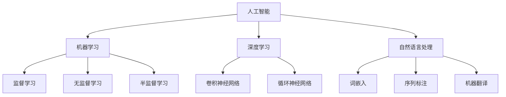

                 

### 文章标题：人工智能的探索之路

### 关键词：人工智能、机器学习、深度学习、自然语言处理、应用领域、算法原理、未来展望

> 摘要：本文旨在探讨人工智能的起源与发展，核心概念与联系，以及其在工业、医疗、金融等领域的广泛应用。同时，我们将深入解析人工智能的核心算法原理，包括机器学习、深度学习和自然语言处理，并提供具体的应用案例分析。最后，本文将展望人工智能的未来发展趋势及其潜在影响。

---

## 第一部分：人工智能概述

### 第1章：人工智能的起源与发展

### 1.1 人工智能的定义与范畴

#### 1.1.1 人工智能的定义

人工智能（Artificial Intelligence，简称AI）是指通过计算机程序模拟人类智能的一种技术。人工智能的目标是使机器能够执行通常需要人类智能才能完成的任务，如视觉识别、语音识别、决策制定等。

#### 1.1.2 人工智能的分类

人工智能可以根据其实现方式分为两种类型：弱人工智能和强人工智能。

- **弱人工智能**：指专门为解决特定问题而设计的智能系统，如语音助手、自动驾驶汽车等。
- **强人工智能**：指具有广泛认知能力的智能系统，能够像人类一样思考和学习，目前尚未实现。

#### 1.1.3 人工智能的核心范畴

人工智能的核心范畴包括以下几个方面：

- **机器学习**：通过数据训练模型，使计算机能够自动学习和改进性能。
- **深度学习**：基于人工神经网络的一种机器学习技术，用于解决复杂的问题。
- **自然语言处理**：使计算机能够理解和生成人类语言，用于语音识别、机器翻译等应用。

### 1.2 人工智能的发展历程

#### 1.2.1 人工智能的早期探索

人工智能的概念最早可以追溯到20世纪50年代。当时，计算机科学家和心理学家开始研究如何使计算机模拟人类的思维过程。

#### 1.2.2 人工智能的黄金时代

20世纪80年代，人工智能进入了一个快速发展期。这一时期，计算机硬件性能的提升和算法的进步为人工智能的发展奠定了基础。

#### 1.2.3 人工智能的现代发展

近年来，人工智能取得了显著的进展。深度学习、自然语言处理等技术的突破，使人工智能在各个领域得到了广泛应用。

### 1.3 人工智能的核心技术

#### 1.3.1 机器学习

机器学习是人工智能的核心技术之一。它通过算法从数据中学习规律，使计算机能够自动做出决策。

#### 1.3.2 深度学习

深度学习是机器学习的一种形式，通过多层神经网络模拟人脑的学习过程，具有强大的特征提取能力。

#### 1.3.3 自然语言处理

自然语言处理是使计算机理解和生成人类语言的技术。它广泛应用于语音识别、机器翻译、文本分析等领域。

### 1.4 人工智能的应用领域

#### 1.4.1 工业4.0

人工智能在工业自动化、智能工厂等方面有广泛的应用，推动了工业4.0的发展。

#### 1.4.2 金融科技

人工智能在金融领域的应用包括风险控制、量化交易、智能投顾等，提高了金融服务的效率。

#### 1.4.3 医疗健康

人工智能在医疗诊断、健康管理等方面有重要作用，有助于提高医疗水平和质量。

#### 1.4.4 娱乐传媒

人工智能在智能推荐、虚拟助手等方面为娱乐传媒带来了新的发展机遇。

#### 1.4.5 智能交通

人工智能在自动驾驶、智能交通管理等方面有广泛应用，有助于提高交通安全和效率。

### 1.5 人工智能的未来展望

#### 1.5.1 人工智能的潜在影响

人工智能的发展将对社会、经济、伦理等方面产生深远影响。

#### 1.5.2 人工智能的伦理与法律问题

人工智能的发展带来了伦理和法律问题，如隐私保护、算法偏见等。

#### 1.5.3 人工智能的未来趋势

随着技术的进步，人工智能将继续在各个领域发挥重要作用，推动社会的进步。

### Mermaid 流程图：人工智能核心概念与联系



### 1.6 人工智能的应用案例分析

#### 1.6.1 人工智能在工业自动化中的应用

人工智能在工业自动化中的应用主要包括生产线的智能监控、机器人的自主导航等。例如，通过机器学习算法，可以对生产过程中的数据进行实时分析，预测设备故障，提高生产效率。

#### 1.6.2 人工智能在医疗诊断中的应用

人工智能在医疗诊断中的应用主要包括疾病预测、病理分析等。例如，通过深度学习算法，可以对医学影像进行自动分析，帮助医生快速、准确地诊断疾病。

#### 1.6.3 人工智能在金融风控中的应用

人工智能在金融风控中的应用主要包括信用评估、风险预测等。例如，通过机器学习算法，可以对客户的数据进行挖掘和分析，预测其信用风险，降低金融风险。

#### 1.6.4 人工智能在自动驾驶中的应用

人工智能在自动驾驶中的应用主要包括车辆控制、环境感知等。例如，通过深度学习算法，可以实现对交通标志、行人等目标的自动识别，提高自动驾驶的安全性和可靠性。

#### 1.6.5 人工智能在智能客服中的应用

人工智能在智能客服中的应用主要包括语音识别、文本分析等。例如，通过自然语言处理技术，可以实现与用户的智能对话，提高客服的效率和用户体验。

### 1.7 人工智能的技术创新与未来方向

#### 1.7.1 强化学习的发展与应用

强化学习是人工智能的一个重要分支，通过试错和奖励机制，使智能体能够在复杂环境中学习。未来，强化学习将在更多领域得到应用，如自动驾驶、游戏等。

#### 1.7.2 生成对抗网络的技术突破

生成对抗网络（GAN）是一种能够生成高质量数据的机器学习技术。未来，GAN将在图像生成、数据增强等领域发挥重要作用。

#### 1.7.3 跨学科融合与创新

人工智能的发展离不开跨学科的融合与创新。未来，人工智能将与其他领域（如生物、物理等）相结合，推动人工智能技术的进一步发展。

---

## 第二部分：人工智能核心算法原理

### 第2章：人工智能核心算法原理

### 2.1 机器学习算法原理

机器学习是人工智能的核心技术之一，它使计算机能够从数据中学习并做出预测或决策。

#### 2.1.1 监督学习算法

监督学习算法是一种有明确标签的机器学习算法，其目标是通过输入数据和对应的标签，学习出一个函数，用于对新数据进行预测。

##### 2.1.1.1 线性回归

线性回归是一种最简单的监督学习算法，用于预测一个连续的输出值。其数学模型如下：

$$
y = w_0 + w_1 \cdot x
$$

其中，$y$ 是预测值，$x$ 是输入值，$w_0$ 和 $w_1$ 是权重参数。

为了找到最佳的权重参数，我们可以使用最小二乘法进行求解。

```python
import numpy as np

# 假设我们有如下数据集
X = np.array([1, 2, 3, 4, 5])
y = np.array([2, 4, 5, 4, 5])

# 求解权重参数
w = np.linalg.inv(X.T.dot(X)).dot(X.T).dot(y)

# 预测新数据
x_new = np.array([6])
y_pred = w[0] + w[1] * x_new
print(y_pred)
```

##### 2.1.1.2 决策树

决策树是一种树形结构的监督学习算法，用于分类和回归任务。决策树的构建过程是通过一系列二分选择来划分数据集，每个节点表示一个特征，每个分支表示一个特征取值。

```python
from sklearn.tree import DecisionTreeClassifier

# 创建决策树分类器
clf = DecisionTreeClassifier()

# 训练模型
clf.fit(X, y)

# 预测新数据
x_new = np.array([6])
y_pred = clf.predict(x_new)
print(y_pred)
```

#### 2.1.2 无监督学习算法

无监督学习算法是一种没有明确标签的机器学习算法，其目标是从未标记的数据中发现模式和结构。

##### 2.1.2.1 K-均值聚类

K-均值聚类是一种基于距离的聚类算法，其目标是将数据划分为 $K$ 个簇，每个簇由其质心表示。

```python
from sklearn.cluster import KMeans

# 创建K-均值聚类模型
kmeans = KMeans(n_clusters=K).fit(X)

# 获取聚类结果
labels = kmeans.predict(X)

# 获取质心
centroids = kmeans.cluster_centers_
```

##### 2.1.2.2 主成分分析（PCA）

主成分分析（PCA）是一种降维技术，其目标是通过线性变换将数据投影到新的坐标系中，从而减少数据维度，同时保留最重要的特征。

```python
from sklearn.decomposition import PCA

# 创建PCA模型
pca = PCA(n_components=2)

# 运行PCA
X_pca = pca.fit_transform(X)

# 可视化
plt.scatter(X_pca[:, 0], X_pca[:, 1])
plt.xlabel('First Principal Component')
plt.ylabel('Second Principal Component')
plt.title('PCA of the Data')
plt.show()
```

#### 2.1.3 强化学习算法

强化学习算法是一种通过试错和奖励机制进行学习的方法。其核心思想是智能体通过与环境交互，学习最优策略，从而最大化累积奖励。

##### 2.1.3.1 Q-Learning

Q-Learning是一种基于值函数的强化学习算法，其目标是通过学习状态-动作值函数，找到最优策略。

```python
class QLearningAgent():
    def __init__(self, alpha, gamma):
        self.alpha = alpha
        self.gamma = gamma
        self.Q = {}

    def update_q_value(self, state, action, reward, next_state):
        # 更新 Q 值
        Q_value = self.Q.get((state, action), 0)
        next_q_value = max(self.Q.get((next_state, a), 0) for a in self.actions)
        self.Q[(state, action)] = Q_value + self.alpha * (reward + self.gamma * next_q_value - Q_value)

    def choose_action(self, state):
        # 选择动作
        return max(self.Q.get((state, a), 0) for a in self.actions)

# 创建Q-Learning智能体
agent = QLearningAgent(alpha=0.1, gamma=0.9)

# 运行Q-Learning
for episode in range(num_episodes):
    state = env.reset()
    done = False
    while not done:
        action = agent.choose_action(state)
        next_state, reward, done, _ = env.step(action)
        agent.update_q_value(state, action, reward, next_state)
        state = next_state
```

### 2.2 深度学习算法原理

深度学习是一种基于多层神经网络的学习方法，其目标是自动提取数据中的层次化特征。

#### 2.2.1 深度前向传播算法

深度前向传播算法是深度学习中最基本的方法，其核心思想是逐步计算网络的输入和输出。

##### 2.2.1.1 前向传播步骤

深度前向传播算法的前向传播步骤如下：

1. **输入层**：将输入数据输入到网络的输入层。
2. **隐藏层**：将输入层传递给隐藏层，通过激活函数计算输出。
3. **输出层**：将隐藏层传递给输出层，得到最终输出。

前向传播的数学表示如下：

$$
z^{(l)} = W^{(l)} \cdot a^{(l-1)} + b^{(l)}
$$

$$
a^{(l)} = \sigma(z^{(l)})
$$

其中，$z^{(l)}$ 是第 $l$ 层的输入，$a^{(l)}$ 是第 $l$ 层的输出，$W^{(l)}$ 是第 $l$ 层的权重，$b^{(l)}$ 是第 $l$ 层的偏置，$\sigma$ 是激活函数。

##### 2.2.1.2 反向传播步骤

深度前向传播算法的反向传播步骤如下：

1. **计算损失函数**：计算输出层与标签之间的损失函数。
2. **计算梯度**：计算网络中每个权重和偏置的梯度。
3. **更新权重**：使用梯度下降算法更新权重和偏置。

反向传播的数学表示如下：

$$
\delta^{(l)} = (1 - \sigma'(z^{(l)})) \cdot \frac{\partial L}{\partial z^{(l+1)}}
$$

$$
\frac{\partial L}{\partial W^{(l)}} = a^{(l-1)} \cdot \delta^{(l+1)}
$$

$$
\frac{\partial L}{\partial b^{(l)}} = \delta^{(l+1)}
$$

其中，$\delta^{(l)}$ 是第 $l$ 层的误差，$L$ 是损失函数。

##### 2.2.1.3 梯度下降算法

梯度下降算法是一种用于更新神经网络权重的优化方法。其基本思想是沿着损失函数的梯度方向更新权重，以最小化损失函数。

梯度下降算法的数学表示如下：

$$
W^{(l)} = W^{(l)} - \alpha \cdot \frac{\partial L}{\partial W^{(l)}}
$$

$$
b^{(l)} = b^{(l)} - \alpha \cdot \frac{\partial L}{\partial b^{(l)}}
$$

其中，$\alpha$ 是学习率。

#### 2.2.2 深度学习模型架构

深度学习模型架构包括输入层、隐藏层和输出层。每种层有不同的功能。

- **输入层**：接收外部数据。
- **隐藏层**：通过非线性变换提取数据特征。
- **输出层**：生成预测结果。

常见的深度学习模型架构包括：

- **卷积神经网络（CNN）**：用于图像和视频处理。
- **循环神经网络（RNN）**：用于序列数据处理。
- **生成对抗网络（GAN）**：用于生成高质量数据。

### 2.3 自然语言处理算法原理

自然语言处理（NLP）是人工智能的一个重要分支，其目标是使计算机能够理解和生成人类语言。

#### 2.3.1 词嵌入

词嵌入是一种将词汇映射到高维向量空间的方法。词嵌入有助于提高神经网络在处理语言数据时的性能。

常见的词嵌入模型包括：

- **Word2Vec**：基于神经网络的词嵌入模型。
- **GloVe**：基于全局平均的词嵌入模型。

#### 2.3.2 序列标注

序列标注是一种用于标注文本序列的算法，其目标是将文本序列中的每个单词或字符标注为特定的类别。

常见的序列标注算法包括：

- **CRF**：条件随机场。
- **BiLSTM-CRF**：双向循环神经网络结合CRF。

#### 2.3.3 机器翻译

机器翻译是一种将一种语言的文本翻译为另一种语言的方法。深度学习在机器翻译领域取得了显著进展。

常见的机器翻译模型包括：

- **Seq2Seq**：序列到序列模型。
- **Attention Mechanism**：注意力机制。

---

## 第三部分：人工智能的实际应用

### 第3章：人工智能在各个领域的应用

人工智能的应用领域非常广泛，涵盖了工业、医疗、金融、交通等多个行业。下面我们将分别介绍人工智能在这些领域的实际应用。

#### 3.1 人工智能在工业中的应用

人工智能在工业领域有广泛的应用，主要表现在工业自动化、智能监控、生产优化等方面。

- **工业自动化**：通过机器人和自动化设备，实现生产过程的自动化，提高生产效率和产品质量。
- **智能监控**：利用计算机视觉和图像识别技术，对生产过程进行实时监控，提高生产安全和质量。
- **生产优化**：通过数据分析和预测模型，优化生产计划和资源配置，降低生产成本。

#### 3.2 人工智能在医疗中的应用

人工智能在医疗领域的应用主要包括疾病诊断、健康监测、药物研发等方面。

- **疾病诊断**：通过图像识别和深度学习技术，对医学影像进行分析，辅助医生进行疾病诊断。
- **健康监测**：通过可穿戴设备和物联网技术，实时监测患者的生理指标，提供个性化的健康管理服务。
- **药物研发**：通过计算化学和人工智能技术，加速新药的研发和筛选，提高药物的研发效率。

#### 3.3 人工智能在金融中的应用

人工智能在金融领域的应用主要包括风险管理、量化交易、智能投顾等方面。

- **风险管理**：通过机器学习算法，对金融市场的数据进行挖掘和分析，预测市场风险，制定风险管理策略。
- **量化交易**：通过算法模型，实现高频交易、量化投资等，提高交易的效率和收益。
- **智能投顾**：通过大数据和人工智能技术，为投资者提供个性化的投资建议，提高投资决策的准确性。

#### 3.4 人工智能在交通中的应用

人工智能在交通领域的应用主要包括自动驾驶、智能交通管理、出行服务等方面。

- **自动驾驶**：通过计算机视觉、深度学习和传感器技术，实现车辆的自动驾驶，提高交通安全和效率。
- **智能交通管理**：通过大数据分析和人工智能技术，优化交通信号控制、交通流量管理，提高交通运行效率。
- **出行服务**：通过人工智能技术，提供智能化的出行服务，如路线规划、实时导航等，提高出行体验。

#### 3.5 人工智能在零售业中的应用

人工智能在零售业的应用主要包括客户关系管理、供应链优化、智能推荐等方面。

- **客户关系管理**：通过大数据分析和人工智能技术，了解客户需求，提供个性化的购物体验，提高客户满意度。
- **供应链优化**：通过数据分析和预测模型，优化供应链管理，降低库存成本，提高供应链效率。
- **智能推荐**：通过用户行为分析和人工智能技术，为用户推荐感兴趣的商品和服务，提高销售额。

#### 3.6 人工智能在娱乐传媒中的应用

人工智能在娱乐传媒领域的应用主要包括内容创作、用户推荐、互动体验等方面。

- **内容创作**：通过人工智能技术，自动化生成视频、音乐等内容，提高内容创作的效率和质量。
- **用户推荐**：通过用户行为分析和人工智能技术，为用户推荐感兴趣的内容，提高用户黏性和活跃度。
- **互动体验**：通过虚拟现实、增强现实等技术，提供沉浸式的互动体验，提高用户满意度。

---

## 第四部分：人工智能的未来趋势与挑战

### 第4章：人工智能的未来发展与影响

人工智能作为当前科技领域的前沿技术，其发展速度之快，影响之深远，已经引起了全球范围内的广泛关注。在未来，人工智能将继续推动社会进步，带来诸多机遇与挑战。

#### 4.1 人工智能的未来趋势

随着技术的不断进步，人工智能在未来将呈现出以下趋势：

- **更强大的算法和模型**：随着计算能力的提升，人工智能算法和模型将变得更加复杂和高效，能够处理更大量、更复杂的数据。
- **跨学科融合**：人工智能与其他领域（如生物、物理、化学等）的融合将带来新的突破，推动技术的进步。
- **边缘计算**：随着物联网和5G技术的发展，边缘计算将成为人工智能的重要发展方向，使数据处理更加高效、实时。
- **人机协同**：人工智能将更好地与人类协同工作，提高工作效率，创造新的价值。

#### 4.2 人工智能的潜在影响

人工智能的快速发展将对社会、经济、伦理等方面产生深远影响：

- **社会经济影响**：人工智能将改变劳动力市场，提高生产效率，推动经济增长。但同时也可能引发失业、收入分配不均等问题。
- **伦理和法律问题**：人工智能的自主决策能力引发了伦理和法律问题，如隐私保护、算法偏见、责任归属等，需要制定相应的法律法规。
- **社会结构变革**：人工智能将改变人类社会的生活方式，提高生活质量，但同时也可能加剧社会分化，影响社会稳定。

#### 4.3 人工智能的挑战与对策

尽管人工智能发展迅速，但仍面临诸多挑战：

- **技术挑战**：人工智能算法和模型的复杂度不断提高，对计算能力、数据质量、算法优化等方面提出了更高的要求。
- **数据隐私**：人工智能系统需要大量数据训练，但数据隐私保护成为一个重要问题，如何确保数据安全成为一大挑战。
- **人机协作**：人工智能与人类协同工作的效率和质量有待提高，如何实现人机协同成为关键问题。
- **教育体系**：人工智能的发展对教育体系提出了新的要求，如何培养具备人工智能知识的人才成为教育领域的重要课题。

为了应对这些挑战，我们需要采取以下对策：

- **加强技术创新**：持续投入研发，提高人工智能算法和模型的性能和可靠性。
- **完善法律法规**：制定相关法律法规，保护数据隐私，规范人工智能的应用。
- **推动人机协同**：加强人工智能与人类协同工作的研究，提高人机协作的效率和质量。
- **教育培训**：加强人工智能教育，培养具备人工智能知识和技术能力的人才。

总之，人工智能的发展具有巨大的潜力，但也面临诸多挑战。只有通过技术创新、政策引导、社会协作，才能充分发挥人工智能的优势，实现其可持续发展。

---

## 总结与展望

人工智能作为当代科技领域的璀璨明珠，正以前所未有的速度和规模影响着社会的方方面面。本文从人工智能的起源与发展、核心算法原理、实际应用以及未来趋势等多个角度，对其进行了全面的探讨。

首先，我们回顾了人工智能的起源与发展历程，了解了其从早期探索到现代应用的演变过程。接着，我们深入分析了人工智能的核心算法原理，包括机器学习、深度学习和自然语言处理，并通过具体的算法模型和数学公式进行了详细讲解。

在人工智能的实际应用部分，我们探讨了其在工业、医疗、金融、交通等领域的广泛应用，展示了人工智能如何改变我们的生活方式和工作方式。最后，我们展望了人工智能的未来发展趋势，分析了其潜在的影响和面临的挑战。

人工智能的发展离不开技术创新和社会协作。在未来的道路上，我们需要继续加强人工智能技术的研发，完善相关法律法规，推动人工智能与人类协同工作，实现其可持续发展。同时，我们也需要关注人工智能带来的伦理和法律问题，确保其在合规、安全、公正的框架下发展。

总之，人工智能的未来充满希望，同时也充满挑战。让我们共同关注人工智能的发展，共同探索其无限可能，为人类社会的发展贡献力量。在人工智能的探索之路上，我们期待更多的突破和奇迹。

---

### 作者信息：

作者：AI天才研究院/AI Genius Institute & 禅与计算机程序设计艺术 /Zen And The Art of Computer Programming

