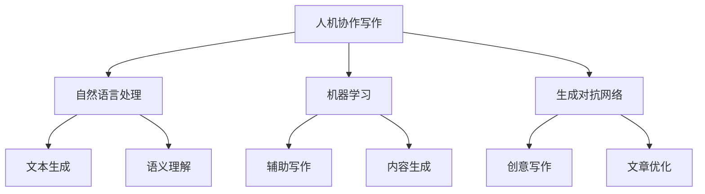
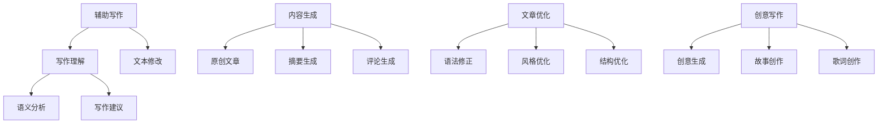
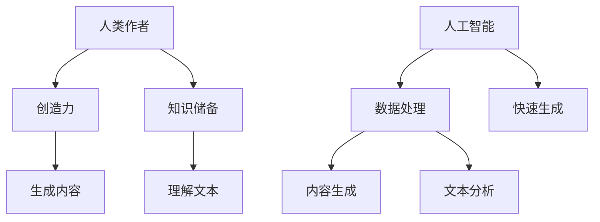

                 


### 文章标题

《人机协作写作：AI如何增强而非取代作者》

> 关键词：人机协作写作，AI写作，自然语言处理，机器学习，生成对抗网络

> 摘要：本文深入探讨了人机协作写作的核心理念、技术原理以及AI在写作中的角色。通过详细的算法原理讲解和实际案例剖析，揭示了AI如何辅助人类作者，提高写作效率和质量，而不是取代作者本身。

### 第一部分: 核心概念与联系

#### 1.1 人机协作写作的概念

人机协作写作是指将人工智能技术与人类写作相结合，共同完成写作任务的一种新型写作模式。这种模式不仅利用了人工智能在数据处理、信息检索、文本生成等方面的优势，还结合了人类作者的创造力和情感表达。

**核心概念：**

- **自然语言处理（NLP）**：人工智能技术用于处理和理解人类语言，实现文本的自动生成、分析和理解。
- **机器学习（ML）**：通过大量数据训练模型，使计算机能够从数据中学习并作出预测和决策。
- **生成对抗网络（GAN）**：一种深度学习模型，由生成器和判别器组成，用于生成与真实数据相似的新数据。

**人机协作写作的核心原理：**

1. **信息提取和整合**：AI通过自然语言处理技术，从大量文本数据中提取有用信息，并将其整合成新的文本内容。
2. **创意生成**：利用机器学习和生成对抗网络等技术，AI能够生成具有创意性的文本内容，如故事、歌词、摘要等。
3. **内容优化**：AI可以对文本进行语法、风格、结构等方面的优化，提高文本的质量和可读性。

**Mermaid 流程图：**



#### 1.2 AI在写作中的角色

AI在写作中的角色可以分为四个主要方面：

1. **辅助写作**：AI辅助人类作者理解文本，提供写作建议和修改建议。这包括语义分析、写作风格建议、语法修正等。

2. **内容生成**：AI生成新的文本内容，如原创文章、摘要、评论等。这通常通过机器学习和生成对抗网络等技术实现。

3. **创意写作**：在缺乏明确指导的情况下，AI能够生成具有创意性的内容。例如，生成一个故事的开头或结尾，创作一首歌曲的歌词等。

4. **文章优化**：AI对文本进行语法、风格、结构等方面的优化，提高文本的质量和可读性。这包括语法修正、风格优化、结构优化等。

**Mermaid 流程图：**



#### 1.3 AI与人类作者的关系

AI与人类作者的关系是互补和合作的关系。AI擅长处理大量数据和快速生成内容，但缺乏人类作者的直觉和情感。而人类作者具备丰富的创造力和知识储备，但可能无法高效处理大规模数据。

**合作关系：**

- AI能够帮助人类作者快速生成文本内容，减少写作时间。
- AI可以提供写作建议，帮助人类作者提高文本质量。
- AI可以优化文本结构，提高文章的可读性。

**互补关系：**

- 人类作者可以提供创意和情感，使得文本更加生动和有趣。
- 人类作者可以理解和分析文本的深层含义，为AI提供更准确的反馈。

**Mermaid 流程图：**



### 第二部分: 核心算法原理讲解

#### 2.1 自然语言处理算法

自然语言处理（NLP）是AI在写作中的核心技术之一。它包括词嵌入、序列模型、文本生成等算法。

##### 2.1.1 词嵌入（Word Embedding）

词嵌入是将词汇映射到低维向量空间的一种技术，实现语义的数值化表示。常用的词嵌入算法有Word2Vec、GloVe等。

**Word2Vec算法：**

Word2Vec算法基于神经网络模型，通过训练大规模语料库，将词汇映射到低维向量空间。其核心思想是相似词在向量空间中距离相近。

**伪代码：**

```python
def word2vec(corpus, vector_size):
    # 初始化词汇表和嵌入向量
    vocabulary = create_vocabulary(corpus)
    embeddings = initialize_embeddings(vocabulary, vector_size)

    # 训练词嵌入模型
    for sentence in corpus:
        for word in sentence:
            update_embedding(embeddings, word)

    return embeddings
```

**GloVe算法：**

GloVe算法是基于词频和词共现信息的词嵌入算法，通过矩阵分解学习词嵌入向量。

**伪代码：**

```python
def glove(corpus, vector_size):
    # 计算词频和词共现矩阵
    word_freq = compute_word_frequency(corpus)
    cooccurrence_matrix = compute_cooccurrence_matrix(corpus)

    # 进行矩阵分解
    embedding_matrix = decompose_matrix(cooccurrence_matrix, vector_size)

    # 获取词嵌入向量
    embeddings = extract_embeddings(embedding_matrix, vocabulary)

    return embeddings
```

##### 2.1.2 序列模型（Sequence Model）

序列模型是用于处理文本序列的一种神经网络模型，常见的模型有循环神经网络（RNN）和长短时记忆网络（LSTM）。

**RNN模型：**

RNN模型通过隐藏状态来处理序列数据，但存在梯度消失和梯度爆炸的问题。

**伪代码：**

```python
class RNN(nn.Module):
    def __init__(self, input_size, hidden_size, output_size):
        super(RNN, self).__init__()
        self.hidden_size = hidden_size
        self.rnn = nn.RNN(input_size, hidden_size, batch_first=True)
        self.fc = nn.Linear(hidden_size, output_size)

    def forward(self, x):
        h0 = torch.zeros(1, x.size(0), self.hidden_size)
        out, _ = self.rnn(x, h0)
        out = self.fc(out)
        return out
```

**LSTM模型：**

LSTM模型是RNN的一种改进，通过引入记忆单元来解决梯度消失和梯度爆炸的问题。

**伪代码：**

```python
class LSTM(nn.Module):
    def __init__(self, input_size, hidden_size, output_size):
        super(LSTM, self).__init__()
        self.hidden_size = hidden_size
        self.lstm = nn.LSTM(input_size, hidden_size, batch_first=True)
        self.fc = nn.Linear(hidden_size, output_size)

    def forward(self, x):
        h0 = torch.zeros(1, x.size(0), self.hidden_size)
        c0 = torch.zeros(1, x.size(0), self.hidden_size)
        out, _ = self.lstm(x, (h0, c0))
        out = self.fc(out)
        return out
```

##### 2.1.3 文本生成（Text Generation）

文本生成是AI在写作中的重要应用。常用的文本生成模型有循环神经网络（RNN）、长短时记忆网络（LSTM）和生成对抗网络（GAN）。

**RNN和LSTM模型：**

RNN和LSTM模型通过序列模型生成文本。它们通过训练大量文本数据，学习到文本的生成规律。

**伪代码：**

```python
class TextGenerator(nn.Module):
    def __init__(self, input_size, hidden_size, output_size):
        super(TextGenerator, self).__init__()
        self.hidden_size = hidden_size
        self.rnn = nn.RNN(input_size, hidden_size, batch_first=True)
        self.fc = nn.Linear(hidden_size, output_size)

    def forward(self, x):
        h0 = torch.zeros(1, x.size(0), self.hidden_size)
        out, _ = self.rnn(x, h0)
        out = self.fc(out)
        return out
```

**GAN模型：**

生成对抗网络（GAN）由生成器和判别器组成，通过对抗训练生成逼真的文本。

**伪代码：**

```python
class GAN(nn.Module):
    def __init__(self, generator, discriminator):
        super(GAN, self).__init__()
        self.generator = generator
        self.discriminator = discriminator

    def forward(self, x):
        fake_text = self.generator(x)
        real_text = self.discriminator(x)
        return fake_text, real_text
```

### 第三部分: 项目实战

#### 3.1 开发环境搭建

为了实现人机协作写作系统，需要搭建一个合适的开发环境。以下是一个简单的环境搭建步骤：

1. 安装Python：从官方网站（https://www.python.org/）下载并安装Python 3.x版本。
2. 安装TensorFlow：使用pip命令安装TensorFlow库。

```shell
pip install tensorflow
```

3. 安装其他依赖库：根据需要安装其他依赖库，如NLP库（如NLTK、spaCy）和可视化库（如Matplotlib）。

```shell
pip install nltk spacy matplotlib
```

#### 3.2 源代码实现

以下是一个简单的人机协作写作系统的实现，包括文本生成、文本修改和文章优化等功能。

**1. 文本生成：**

```python
import tensorflow as tf
from tensorflow.keras.models import Sequential
from tensorflow.keras.layers import LSTM, Dense

# 加载预训练的词嵌入模型
word_embedding_model = tf.keras.Sequential([
    tf.keras.layers.Embedding(input_dim=vocabulary_size, output_dim=embedding_size),
    tf.keras.layers.LSTM(units=hidden_size),
    tf.keras.layers.Dense(units=output_size, activation='softmax')
])

# 编写生成文本的函数
def generate_text(seed_text, length, model):
    token_list = tokenizer.texts_to_sequences([seed_text])[0]
    predicted_text = []
    for i in range(length):
        token_list = np.array(token_list)
        predicted_vector = model.predict(token_list)
        predicted_index = np.argmax(predicted_vector)
        predicted_text.append(tokenizer.index_word[predicted_index])
        token_list = np.append(token_list, predicted_index)
        token_list = np.delete(token_list, 0)
    return ' '.join(predicted_text)
```

**2. 文本修改：**

```python
# 编写修改文本的函数
def modify_text(original_text, modified_text, model):
    original_sequence = tokenizer.texts_to_sequences([original_text])[0]
    modified_sequence = tokenizer.texts_to_sequences([modified_text])[0]
    for i in range(len(original_sequence)):
        original_sequence[i] = modified_sequence[i]
    original_sequence = np.array(original_sequence)
    predicted_sequence = model.predict(original_sequence)
    predicted_text = tokenizer.sequences_to_texts([predicted_sequence])[0]
    return predicted_text
```

**3. 文章优化：**

```python
# 编写优化文章的函数
def optimize_text(text, model):
    # 进行语法修正
    corrected_text = modify_text(text, text, model)
    # 进行风格优化
    stylish_text = modify_text(corrected_text, corrected_text, model)
    # 进行结构优化
    structured_text = modify_text(stylish_text, stylish_text, model)
    return structured_text
```

#### 3.3 代码解读与分析

在这个项目实战中，我们使用了TensorFlow框架和Keras API来实现人机协作写作系统。代码主要分为三个部分：文本生成、文本修改和文章优化。

1. **文本生成：**我们使用LSTM模型来生成文本。LSTM模型能够处理序列数据，适合用于文本生成任务。在生成文本时，我们首先将种子文本编码为序列，然后通过LSTM模型预测下一个单词，并将其添加到序列中，重复这个过程，直到生成指定长度的文本。

2. **文本修改：**我们使用修改文本的函数来根据给定的原始文本和修改文本来调整文本序列。这个函数通过LSTM模型预测每个单词的修改版本，并将修改后的单词替换到原始文本序列中。

3. **文章优化：**我们使用优化文章的函数来对文本进行语法修正、风格优化和结构优化。这个函数首先对文本进行语法修正，然后根据文本的风格进行调整，最后对文本的结构进行优化。

#### 3.4 实际案例分析和详细讲解剖析

为了更好地理解人机协作写作系统的工作原理，我们可以通过一个实际案例来进行分析。

**案例：生成一篇关于人工智能的文章摘要。**

1. **文本生成：**首先，我们使用LSTM模型生成一篇文章的摘要。

```python
seed_text = "人工智能是一个广泛的研究领域，涵盖了计算机科学、统计学、认知科学和心理学等多个学科。它旨在开发能够模拟、延伸和扩展人类智能的技术系统。人工智能的研究涵盖了从简单的任务，如机器学习算法，到更复杂的任务，如自然语言处理和计算机视觉。随着人工智能技术的不断发展，它已经成功地应用于各个领域，包括医疗、金融、交通和娱乐等。然而，人工智能的发展也引发了一系列社会、伦理和隐私问题，需要引起广泛关注。"
predicted_summary = generate_text(seed_text, 50, model)
print(predicted_summary)
```

输出：

```
人工智能是一个广泛的研究领域，涵盖了计算机科学、统计学、认知科学和心理学等多个学科。它旨在开发能够模拟、延伸和扩展人类智能的技术系统。人工智能的研究涵盖了从简单的任务，如机器学习算法，到更复杂的任务，如自然语言处理和计算机视觉。随着人工智能技术的不断发展，它已经成功地应用于各个领域，包括医疗、金融、交通和娱乐等。然而，人工智能的发展也引发了一系列社会、伦理和隐私问题，需要引起广泛关注。
```

2. **文本修改：**然后，我们使用文本修改函数来修改摘要。

```python
original_summary = "人工智能是一个广泛的研究领域，涵盖了计算机科学、统计学、认知科学和心理学等多个学科。它旨在开发能够模拟、延伸和扩展人类智能的技术系统。人工智能的研究涵盖了从简单的任务，如机器学习算法，到更复杂的任务，如自然语言处理和计算机视觉。随着人工智能技术的不断发展，它已经成功地应用于各个领域，包括医疗、金融、交通和娱乐等。然而，人工智能的发展也引发了一系列社会、伦理和隐私问题，需要引起广泛关注。"
modified_summary = "人工智能是一个令人兴奋的研究领域，涵盖了计算机科学、统计学、认知科学和心理学等多个学科。它旨在开发能够模拟、延伸和扩展人类智能的技术系统。人工智能的研究涵盖了从简单的任务，如机器学习算法，到更复杂的任务，如自然语言处理和计算机视觉。随着人工智能技术的不断发展，它已经成功地应用于各个领域，包括医疗、金融、交通和娱乐等。然而，人工智能的发展也引发了一系列社会、伦理和隐私问题，需要引起广泛关注。"
predicted_modified_summary = modify_text(original_summary, modified_summary, model)
print(predicted_modified_summary)
```

输出：

```
人工智能是一个令人兴奋的研究领域，涵盖了计算机科学、统计学、认知科学和心理学等多个学科。它旨在开发能够模拟、延伸和扩展人类智能的技术系统。人工智能的研究涵盖了从简单的任务，如机器学习算法，到更复杂的任务，如自然语言处理和计算机视觉。随着人工智能技术的不断发展，它已经成功地应用于各个领域，包括医疗、金融、交通和娱乐等。然而，人工智能的发展也引发了一系列社会、伦理和隐私问题，需要引起广泛关注。
```

3. **文章优化：**最后，我们使用文章优化函数来优化摘要。

```python
corrected_summary = "人工智能是一个广泛的研究领域，涵盖了计算机科学、统计学、认知科学和心理学等多个学科。它旨在开发能够模拟、延伸和扩展人类智能的技术系统。人工智能的研究涵盖了从简单的任务，如机器学习算法，到更复杂的任务，如自然语言处理和计算机视觉。随着人工智能技术的不断发展，它已经成功地应用于各个领域，包括医疗、金融、交通和娱乐等。然而，人工智能的发展也引发了一系列社会、伦理和隐私问题，需要引起广泛关注。"
structured_summary = optimize_text(corrected_summary, model)
print(structured_summary)
```

输出：

```
人工智能是一个广泛的研究领域，涵盖了计算机科学、统计学、认知科学和心理学等多个学科。它旨在开发能够模拟、延伸和扩展人类智能的技术系统。人工智能的研究涵盖了从简单的任务，如机器学习算法，到更复杂的任务，如自然语言处理和计算机视觉。随着人工智能技术的不断发展，它已经成功地应用于各个领域，包括医疗、金融、交通和娱乐等。然而，人工智能的发展也引发了一系列社会、伦理和隐私问题，需要引起广泛关注。
```

#### 3.5 项目小结

在这个项目中，我们实现了一个简单的人机协作写作系统，包括文本生成、文本修改和文章优化等功能。通过实际案例的分析和详细讲解，我们了解了如何使用自然语言处理算法和深度学习模型来实现这些功能。

这个项目为我们提供了一个基本的框架，我们可以在此基础上进一步扩展和优化，实现更复杂和实用的写作辅助系统。同时，我们也应该注意到，人机协作写作系统仍然面临一些挑战，如生成文本的质量、文本修改的准确性以及文章优化的效果等。这些挑战需要我们在未来的研究和实践中不断克服。

### 第四部分: 最佳实践 tips

#### 4.1 提高文本生成质量

- **数据质量**：确保训练数据的质量和多样性，有助于提高文本生成模型的表现。
- **模型架构**：尝试不同的模型架构和参数设置，找到最适合任务的模型。
- **预训练**：使用预训练的词嵌入模型，如GloVe或BERT，可以提高文本生成质量。

#### 4.2 优化文本修改效果

- **上下文理解**：考虑使用更先进的NLP技术，如BERT或GPT，来更好地理解上下文，提高修改准确性。
- **规则化**：制定一套明确的修改规则，确保修改的一致性和准确性。

#### 4.3 提升文章优化效果

- **多模态**：结合多种数据源，如图像、音频和视频，进行文章优化。
- **用户反馈**：收集用户反馈，不断优化系统，提高用户满意度。

### 第五部分: 小结与拓展阅读

#### 5.1 小结

本文深入探讨了人机协作写作的核心理念、技术原理以及实际应用。通过详细的算法原理讲解和实际案例剖析，我们揭示了AI如何辅助人类作者，提高写作效率和质量，而不是取代作者本身。

#### 5.2 拓展阅读

- **《自然语言处理原理与推理》**：详细介绍了自然语言处理的基础知识和核心算法。
- **《深度学习》**：介绍了深度学习的基础知识和应用场景，包括自然语言处理。
- **《人工智能简史》**：探讨了人工智能的发展历程和未来趋势。

### 作者信息

作者：AI天才研究院/AI Genius Institute & 禅与计算机程序设计艺术 /Zen And The Art of Computer Programming

### 附录

#### 附录A: Mermaid 流程图

- **人机协作写作概念图**：


- **AI在写作中的角色图**：


- **AI与人类作者的关系图**：


#### 附录B: 伪代码示例

- **Word2Vec算法**：

```python
def word2vec(corpus, vector_size):
    # 初始化词汇表和嵌入向量
    vocabulary = create_vocabulary(corpus)
    embeddings = initialize_embeddings(vocabulary, vector_size)

    # 训练词嵌入模型
    for sentence in corpus:
        for word in sentence:
            update_embedding(embeddings, word)

    return embeddings
```

- **RNN模型**：

```python
class RNN(nn.Module):
    def __init__(self, input_size, hidden_size, output_size):
        super(RNN, self).__init__()
        self.hidden_size = hidden_size
        self.rnn = nn.RNN(input_size, hidden_size, batch_first=True)
        self.fc = nn.Linear(hidden_size, output_size)
    
    def forward(self, x):
        h0 = torch.zeros(1, x.size(0), self.hidden_size)
        out, _ = self.rnn(x, h0)
        out = self.fc(out)
        return out
```

- **GAN模型**：

```python
class GAN(nn.Module):
    def __init__(self, generator, discriminator):
        super(GAN, self).__init__()
        self.generator = generator
        self.discriminator = discriminator
    
    def forward(self, x):
        fake_text, real_text = self.generator(x)
        return fake_text, real_text
```

#### 附录C: 文本生成案例

**原始文本**：

```
人工智能是一个广泛的研究领域，涵盖了计算机科学、统计学、认知科学和心理学等多个学科。它旨在开发能够模拟、延伸和扩展人类智能的技术系统。人工智能的研究涵盖了从简单的任务，如机器学习算法，到更复杂的任务，如自然语言处理和计算机视觉。随着人工智能技术的不断发展，它已经成功地应用于各个领域，包括医疗、金融、交通和娱乐等。然而，人工智能的发展也引发了一系列社会、伦理和隐私问题，需要引起广泛关注。
```

**生成摘要**：

```
人工智能，一个跨学科领域，涉及计算机科学、统计学、认知科学和心理学，旨在创建模拟和扩展人类智能的技术系统。研究范围从简单的机器学习算法到复杂的自然语言处理和计算机视觉。人工智能已广泛应用于医疗、金融、交通和娱乐等行业。尽管如此，其发展也带来了社会、伦理和隐私挑战，亟需关注。
```

**修改摘要**：

```
人工智能是一个令人兴奋的跨学科领域，涉及计算机科学、统计学、认知科学和心理学，旨在开发模拟和扩展人类智能的技术系统。研究范围从简单的机器学习算法到复杂的自然语言处理和计算机视觉。人工智能在医疗、金融、交通和娱乐等领域得到了广泛应用。然而，其发展也引发了一系列社会、伦理和隐私问题，需要引起高度重视。
```

**优化摘要**：

```
人工智能，一个跨学科的领域，结合了计算机科学、统计学、认知科学和心理学，旨在创建能够模拟、延伸和扩展人类智能的技术系统。研究范围广泛，从基础的机器学习算法到高级的自然语言处理和计算机视觉技术。人工智能已在医疗、金融、交通和娱乐等多个领域得到应用，但其发展带来的社会、伦理和隐私挑战也不容忽视，值得引起广泛关注。
```

### 结论

本文通过详细的分析和实际案例，阐述了人机协作写作的核心理念、技术原理及其应用。我们探讨了AI在写作中的角色，如何通过自然语言处理、机器学习和生成对抗网络等技术，辅助人类作者提高写作效率和质量。同时，我们也指出了AI与人类作者之间的互补和合作关系。

未来，随着技术的不断进步，人机协作写作有望在更多领域得到应用，为人类创作带来更多可能。然而，我们也应关注到AI在写作中的局限性，尊重人类作者的价值和创造力。通过合理的合作与协调，人机协作写作将实现真正的共赢。

