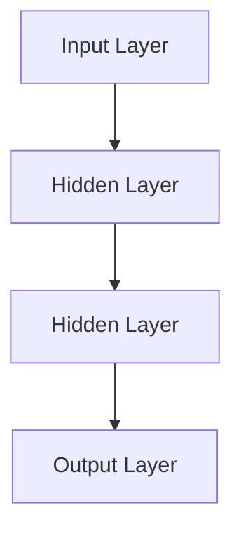
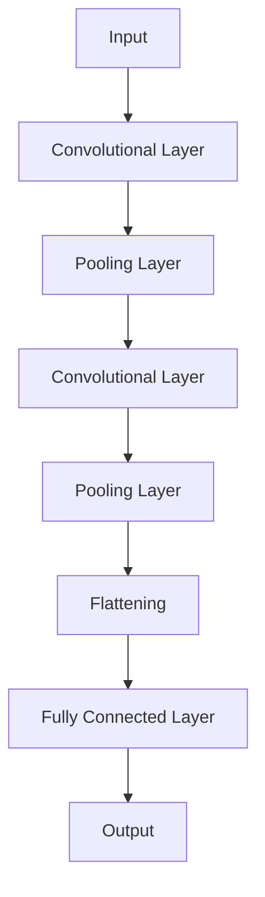
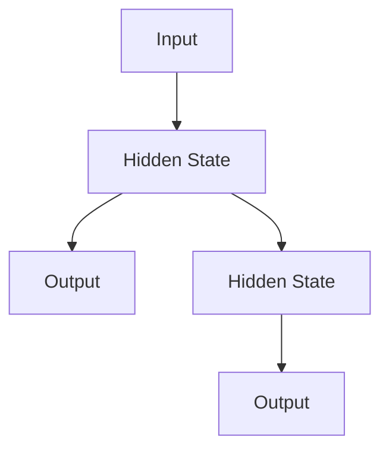
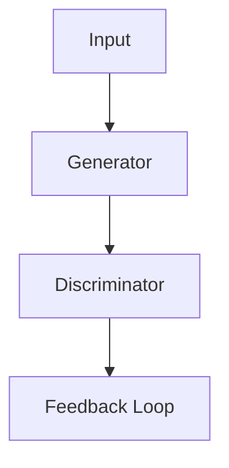
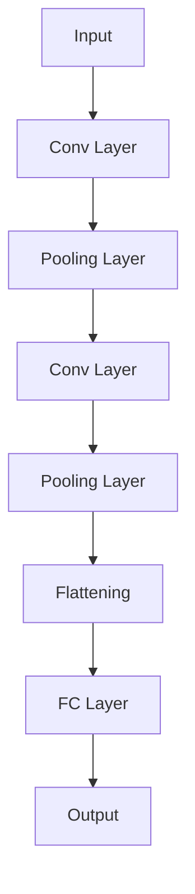

                 

### 文章标题

# 人机协作新时代：共同创造更智能的未来

### 关键词

- 人机协作
- 人工智能
- 机器学习
- 虚拟现实
- 自然语言处理
- 安全与伦理

### 摘要

本文深入探讨了人机协作新时代的背景、意义、现状与未来展望。首先，分析了技术进步与社会需求推动人机协作的兴起，以及人机协作的定义、要素和分类。随后，介绍了人工智能与机器学习的基础知识，包括监督学习、无监督学习和深度学习算法。重点探讨了自然语言处理、智能交互技术和虚拟现实技术在人机协作中的应用，并详细分析了数据管理与分析技术。此外，文章还讨论了人机协作中的安全与伦理问题，并通过多个成功案例分析，展示了人机协作的实践成果。最后，展望了人机协作的未来发展趋势，提出了在新兴应用领域的潜在机会和挑战。本文旨在为读者提供一个全面、系统的理解，以应对人机协作新时代带来的机遇与挑战。

## 第一部分: 人机协作新时代的概述

### 第1章: 人机协作新时代的概述

#### 1.1 人机协作新时代的背景

##### 1.1.1 技术进步与社会需求

近年来，随着信息技术的飞速发展，人工智能（AI）、机器学习（ML）、大数据、物联网（IoT）等前沿技术不断取得突破。这些技术不仅改变了传统产业的生产方式，还极大地丰富了人们的日常生活。同时，社会对高效、智能的服务和产品的需求日益增长，推动了人机协作的兴起。

##### 1.1.2 人机协作的意义

人机协作是指机器和人类共同完成任务，互相补充优势，提高工作效率。人机协作不仅能够释放人类的创造力和智慧，还能解决人类难以处理的大量数据和复杂问题。在人机协作中，机器承担数据处理、模式识别和自动执行等任务，而人类则负责决策、创造和监督等高级任务。

##### 1.1.3 人机协作的现状

目前，人机协作已经在多个领域取得了显著成果。例如，在医疗领域，智能诊断系统结合医生的判断，提高了诊断准确率和效率；在工业领域，智能机器人与人类工人共同工作，提升了生产效率和质量；在金融服务领域，智能客服系统为用户提供便捷的服务，减少了人力成本。

#### 1.2 人机协作的基本概念

##### 1.2.1 人机协作的定义

人机协作是指人类与机器通过合作，共同完成特定任务的过程。在这个过程中，人类提供决策和创造力，机器则负责数据处理和自动化执行。

##### 1.2.2 人机协作的要素

人机协作的要素包括：

1. 人类参与者：具备决策、创造和监督能力。
2. 机器参与者：具备数据处理、模式和任务执行能力。
3. 界面：实现人类与机器之间的信息交互和协作。
4. 环境和任务：协作的具体场景和目标。

##### 1.2.3 人机协作的分类

根据不同的应用场景和任务，人机协作可以分为以下几类：

1. **辅助型协作**：机器为人类提供辅助，帮助人类完成任务，如智能客服系统。
2. **协同型协作**：人类和机器共同完成任务，如智能医疗诊断系统。
3. **增强型协作**：通过机器的辅助，提高人类的认知和决策能力，如智能分析系统。
4. **人机共融**：人类与机器共同工作，实现高度融合，如工业机器人与人类工人的合作。

#### 1.3 人机协作的发展趋势

##### 1.3.1 技术发展趋势

随着人工智能技术的不断发展，人机协作将朝着更智能化、更高效化的方向发展。未来的技术趋势包括：

1. **增强现实（AR）与虚拟现实（VR）技术的融合**：为用户提供更加沉浸式的体验，提升人机协作的效果。
2. **多模态交互**：结合语音、图像、文本等多种模态，实现更自然、更高效的人机交互。
3. **自适应协作**：机器能够根据人类的行为和需求，自动调整协作方式和策略。
4. **边缘计算**：将计算能力扩展到网络边缘，提高人机协作的实时性和响应速度。

##### 1.3.2 应用领域扩展

人机协作的应用领域将不断扩展，涉及工业、医疗、教育、金融、交通等多个领域。例如：

1. **智能制造**：通过人机协作，提高生产效率和质量。
2. **智能医疗**：利用人机协作，实现精准诊断和个性化治疗。
3. **智能教育**：通过人机协作，提供个性化的学习体验。
4. **智能交通**：利用人机协作，实现智能交通管理和自动驾驶。

##### 1.3.3 未来展望

在未来，人机协作有望实现以下突破：

1. **高度智能化**：机器将具备更高的智能水平，能够与人类进行更复杂的协作。
2. **人机共融**：人类与机器将在更多领域实现深度融合，共同创造更美好的未来。

#### 1.4 人机协作中的挑战与机遇

##### 1.4.1 技术挑战

人机协作面临着以下技术挑战：

1. **人工智能的局限性**：目前的人工智能技术还无法完全替代人类的智能。
2. **数据质量和隐私**：大量高质量的数据是机器学习的基础，但数据的收集和处理过程中涉及隐私问题。
3. **人机交互**：目前的人机交互技术还不能完全满足用户的需求。

##### 1.4.2 社会挑战

人机协作还面临着以下社会挑战：

1. **伦理和法律问题**：人机协作带来的伦理和法律问题，如责任归属、隐私保护等，需要得到解决。
2. **就业影响**：人机协作可能导致部分岗位的减少，需要关注就业转型和社会稳定。
3. **技能要求**：随着人机协作的发展，人们需要具备更高的技术能力和跨学科知识。

##### 1.4.3 机遇与应对策略

人机协作带来的机遇包括：

1. **提高生产效率**：通过人机协作，可以大幅提高生产效率和质量。
2. **创新和服务**：人机协作可以推动产业创新和服务模式的变革。
3. **个性化体验**：人机协作可以为用户提供更加个性化、便捷的服务。

应对策略包括：

1. **技术创新**：不断推动人工智能、大数据等技术的创新。
2. **法律和伦理规范**：建立健全的法律和伦理规范，保障人机协作的健康发展。
3. **教育和培训**：加强相关领域的人才培养，提高人们的技能和素养。

#### 1.5 本书内容概述

##### 1.5.1 主要内容框架

本书主要分为以下几部分：

1. 人机协作新时代的概述
2. 人机协作技术基础
3. 人机协作的核心技术
4. 人机协作中的智能交互技术
5. 人机协作中的虚拟现实技术
6. 人机协作中的数据管理与分析
7. 人机协作中的安全与伦理
8. 人机协作案例分析
9. 未来展望与总结

##### 1.5.2 阅读指南与建议

本书适合对人工智能和机器学习有兴趣的读者，以及从事相关领域的研究人员和工程师。在阅读过程中，建议：

1. 关注各章节的核心概念和原理，理解人机协作的基本框架。
2. 结合实际案例，思考人机协作在不同领域的应用和挑战。
3. 关注未来发展趋势，为未来的工作和发展做好准备。

通过本书的阅读，读者将能够对人机协作有全面、深入的理解，为实际应用和创新提供有力支持。

### 1.2 人机协作的基本概念

#### 1.2.1 人机协作的定义

人机协作是指人类和机器通过合作，共同完成特定任务的过程。在这个过程中，机器承担数据处理、模式识别和自动执行等任务，而人类则负责决策、创造和监督等高级任务。人机协作的核心在于实现机器和人类的优势互补，提高任务完成效率和效果。

##### 1.2.1.1 人机协作的发展历程

人机协作的概念可以追溯到20世纪中叶，随着计算机技术的发展，人类开始探索机器在辅助人类工作方面的潜力。从早期的自动化生产线到如今的智能系统，人机协作经历了以下几个发展阶段：

1. **自动化阶段**：机器代替人类完成简单的重复性工作。
2. **协同阶段**：机器和人类共同完成复杂任务，实现优势互补。
3. **智能化阶段**：机器具备一定的自主决策能力，与人类进行更高效的协作。

##### 1.2.1.2 人机协作的核心目标

人机协作的核心目标是提高任务完成效率和效果，实现以下目标：

1. **提高工作效率**：通过机器的辅助，减少人类完成任务的耗时。
2. **提升工作质量**：机器能够在特定领域内提供精确的数据处理和分析，提高工作质量。
3. **降低人力成本**：通过自动化和智能化，减少对人类劳动力的依赖，降低人力成本。
4. **拓展人类能力**：通过人机协作，人类能够在更广泛的领域内发挥作用，实现能力的拓展。

#### 1.2.2 人机协作的要素

人机协作的要素包括以下几个关键组成部分：

1. **人类参与者**：人类参与者在人机协作中扮演决策者、创造者和监督者的角色。他们负责制定任务目标、提供创意和监督任务执行过程。

2. **机器参与者**：机器参与者在人机协作中承担数据处理、模式识别和自动执行等任务。它们可以是计算机程序、机器人、传感器等。

3. **界面**：界面是人机协作的重要组成部分，实现人类与机器之间的信息交互和协作。界面可以包括图形用户界面（GUI）、命令行界面（CLI）以及语音、手势等交互方式。

4. **环境和任务**：环境和任务是人机协作的具体场景和目标。人机协作可以在不同的环境和任务中应用，如工业生产、医疗诊断、金融服务等。

##### 1.2.2.1 人类参与者的角色

人类参与者在人机协作中具有以下几个关键角色：

1. **任务制定**：人类参与者根据任务需求和目标，制定具体的任务计划，确定任务的优先级和关键节点。
2. **创意提供**：人类参与者具有独特的创造力和想象力，能够提出新的解决方案和创新思路。
3. **监督与评估**：人类参与者对任务执行过程进行监督和评估，确保任务按计划进行，及时调整策略以应对潜在问题。

##### 1.2.2.2 机器参与者的角色

机器参与者在人机协作中具有以下几个关键角色：

1. **数据处理**：机器参与者能够高效地处理大量数据，提取关键信息，为人类参与者提供数据支持。
2. **模式识别**：机器参与者利用机器学习算法和人工智能技术，识别数据中的模式和规律，为人类参与者提供决策依据。
3. **自动化执行**：机器参与者能够根据预设的规则和算法，自动执行任务，减少人类参与者的工作负担。

##### 1.2.2.3 界面的作用

界面在人机协作中扮演着重要的桥梁角色，实现人类与机器之间的信息交互和协作。界面可以包括以下几个方面：

1. **图形用户界面（GUI）**：通过图形界面，人类参与者可以直观地与机器进行交互，执行任务操作，查看任务进展和结果。
2. **命令行界面（CLI）**：通过命令行界面，人类参与者可以以文本形式与机器进行交互，执行更复杂的任务。
3. **语音、手势等交互方式**：随着人工智能技术的发展，语音识别、手势识别等技术逐渐应用于人机协作，为用户提供更加自然和便捷的交互方式。

##### 1.2.2.4 环境和任务的影响

环境和任务是人机协作的具体场景和目标，对协作效果具有直接影响。不同环境和任务的需求和特点不同，人机协作的方案和策略也需要相应调整。例如：

1. **工业生产**：在工业生产中，人机协作的目标是提高生产效率和产品质量。机器可以负责执行重复性、高精度的任务，而人类参与者则负责监督和调整生产过程。
2. **医疗诊断**：在医疗诊断中，人机协作的目标是提高诊断准确率和效率。机器可以分析医学图像、病历数据等，为医生提供诊断建议，而医生则负责最终决策和治疗方案制定。
3. **金融服务**：在金融服务中，人机协作的目标是提供更高效、精准的服务。机器可以分析客户数据、市场趋势等，为金融服务提供商提供决策支持，而人类参与者则负责客户关系管理和风险控制。

#### 1.2.3 人机协作的分类

根据不同的应用场景和任务，人机协作可以分为以下几类：

1. **辅助型协作**：机器为人类提供辅助，帮助人类完成任务，如智能客服系统。在这种情况下，机器主要承担数据处理、信息提取和任务执行等任务，而人类参与者则负责决策和创造。
2. **协同型协作**：人类和机器共同完成任务，实现优势互补。在这种情况下，机器和人类参与者共同负责任务的不同方面，通过协作实现整体目标的优化。
3. **增强型协作**：通过机器的辅助，提高人类的认知和决策能力，如智能分析系统。在这种情况下，机器提供的数据分析和决策支持帮助人类参与者更好地理解和处理复杂问题。
4. **人机共融**：人类与机器共同工作，实现高度融合。在这种情况下，人类与机器之间界限模糊，共同完成复杂的任务，如工业机器人与人类工人的合作。

不同类型的人机协作具有不同的特点和应用场景，需要根据具体需求选择合适的协作模式。

### 1.3 人机协作的发展趋势

#### 1.3.1 技术发展趋势

随着人工智能和机器学习技术的不断进步，人机协作也在不断演变和发展。以下是人机协作技术发展的几个主要趋势：

##### 1.3.1.1 增强现实（AR）与虚拟现实（VR）技术的融合

增强现实（AR）和虚拟现实（VR）技术为人机协作提供了更加沉浸式和互动性的体验。在未来，这些技术将进一步融合，为人机协作带来更多的可能性。例如，在医疗领域，医生可以通过AR技术进行远程手术指导，而在教育领域，学生可以通过VR技术进行虚拟实验和探索。

##### 1.3.1.2 多模态交互

多模态交互是指结合多种感官模态（如视觉、听觉、触觉等）进行人机交互。在未来，多模态交互技术将变得更加成熟和普及，为人机协作提供更加自然和高效的交互方式。例如，智能客服系统可以通过语音、文本和图像等多种方式与用户进行交互，提供更加个性化和便捷的服务。

##### 1.3.1.3 自适应协作

自适应协作是指机器能够根据人类的行为和需求，自动调整协作方式和策略。在未来，随着人工智能技术的进步，机器将具备更高的自适应能力，能够更好地理解人类的需求，提供更加个性化和服务化的协作体验。

##### 1.3.1.4 边缘计算

边缘计算是将计算能力扩展到网络边缘，实现实时数据分析和处理。在未来，边缘计算技术将在人机协作中发挥重要作用，特别是在实时性和响应速度要求较高的场景中，如自动驾驶和智能医疗等。

#### 1.3.2 应用领域扩展

人机协作的应用领域将不断扩展，涉及工业、医疗、教育、金融、交通等多个领域。以下是几个典型的应用领域：

##### 1.3.2.1 智能制造

智能制造是工业 4.0 的核心概念，通过人机协作实现生产过程的自动化和智能化。在未来，随着人工智能和机器人技术的不断进步，智能制造将更加普及和高效，提高生产效率和质量。

##### 1.3.2.2 智能医疗

智能医疗是医疗领域的创新方向，通过人机协作实现疾病的精准诊断和个性化治疗。在未来，智能医疗将利用人工智能技术，对大量医疗数据进行深度分析，为医生提供更加准确的诊断建议和治疗方案。

##### 1.3.2.3 智能教育

智能教育是通过人工智能技术为教育提供个性化、智能化的服务。在未来，智能教育将利用人机协作，为学生提供更加灵活和有趣的学习体验，提高学习效果。

##### 1.3.2.4 智能交通

智能交通是通过人机协作实现交通管理的智能化和高效化。在未来，智能交通将利用人工智能技术，对交通数据进行实时分析和预测，优化交通流量，提高交通效率，减少交通事故。

#### 1.3.3 未来展望

在未来，人机协作有望实现以下突破：

##### 1.3.3.1 高度智能化

随着人工智能技术的不断发展，机器将具备更高的智能水平，能够更好地理解人类的需求，提供更加智能化的协作服务。

##### 1.3.3.2 人机共融

人类与机器将在更多领域实现深度融合，共同创造更美好的未来。例如，在智能家居、智能城市等场景中，人类与机器将共同生活和工作，实现人机共融。

##### 1.3.3.3 更广泛的应用

人机协作将在更广泛的领域得到应用，不仅局限于工业、医疗和教育等领域，还将渗透到金融、法律、艺术等各个领域，为社会发展和人类生活带来更多便利。

总的来说，人机协作新时代将为人类带来前所未有的机遇和挑战。通过不断推动技术进步和应用创新，人类将能够更好地利用机器的优势，实现人与机器的协同发展，共同创造更智能的未来。

#### 1.4 人机协作中的挑战与机遇

##### 1.4.1 技术挑战

在推动人机协作发展的过程中，技术方面的挑战不容忽视。以下是几个主要的技术挑战：

1. **人工智能的局限性**：尽管人工智能在许多领域取得了显著进展，但仍然存在局限性。例如，人工智能系统在某些情况下可能无法理解复杂的情境或处理非常规任务，需要人类提供指导。

2. **数据质量和隐私**：高质量的数据是人机协作的基础，但在数据收集、处理和共享过程中，隐私保护成为一个重要问题。如何在确保数据隐私的同时，充分利用数据价值，是一个亟待解决的问题。

3. **人机交互**：目前的人机交互技术还不够完善，用户界面和交互设计需要进一步优化，以提高人机协作的自然性和便捷性。

##### 1.4.2 社会挑战

人机协作的发展不仅带来了技术挑战，还对社会产生了深远的影响。以下是几个主要的社会挑战：

1. **伦理和法律问题**：人机协作涉及到伦理和法律问题，如责任归属、隐私保护、透明度等。需要建立相应的法律和伦理框架，确保人机协作的健康发展。

2. **就业影响**：人机协作可能导致部分岗位的减少，对就业市场产生冲击。需要关注就业转型和社会稳定，为受影响的劳动力提供培训和再就业机会。

3. **技能要求**：随着人机协作的普及，对人才的要求也在提高。未来的人才需要具备跨学科的知识和技能，能够适应不断变化的工作环境。

##### 1.4.3 机遇与应对策略

尽管面临诸多挑战，人机协作也带来了许多机遇。以下是几个方面的机遇以及应对策略：

1. **提高生产效率**：通过人机协作，可以大幅提高生产效率和质量，降低运营成本。

2. **创新和服务**：人机协作可以推动产业创新和服务模式的变革，提供更加个性化、高效的服务。

3. **个性化体验**：人机协作可以根据用户的需求和行为，提供个性化的服务体验，提升用户满意度。

应对策略包括：

1. **技术创新**：不断推动人工智能、大数据等技术的创新，提高人机协作的技术水平和应用广度。

2. **法律和伦理规范**：建立健全的法律和伦理规范，明确责任归属和隐私保护，确保人机协作的合法性和道德性。

3. **教育和培训**：加强相关领域的人才培养，提高人们的技能和素养，为未来的工作和发展做好准备。

4. **跨学科合作**：鼓励不同领域的专家和学者合作，共同解决人机协作面临的技术和社会挑战。

通过技术创新、法律和伦理规范的建立、教育和培训的加强以及跨学科合作，可以充分发挥人机协作的机遇，应对挑战，实现人机协作的可持续发展。

#### 1.5 本书内容概述

##### 1.5.1 主要内容框架

本书主要分为以下几个部分：

1. **人机协作新时代的概述**：介绍人机协作的背景、意义、现状和发展趋势。
2. **人机协作技术基础**：讲解人工智能与机器学习的基础知识，包括监督学习、无监督学习和深度学习算法。
3. **人机协作的核心技术**：探讨自然语言处理、智能交互技术和虚拟现实技术在人机协作中的应用。
4. **人机协作中的智能交互技术**：深入分析智能语音交互技术、智能对话系统等。
5. **人机协作中的虚拟现实技术**：介绍虚拟现实技术的概念、硬件和软件技术。
6. **人机协作中的数据管理与分析**：讲解数据管理与分析技术，包括数据库系统、数据分析方法和大数据处理框架。
7. **人机协作中的安全与伦理**：讨论人机协作中的安全挑战、隐私保护和伦理问题。
8. **人机协作案例分析**：通过实际案例展示人机协作的应用和实践成果。
9. **未来展望与总结**：展望人机协作的未来发展趋势，总结本书的核心内容。

##### 1.5.2 阅读指南与建议

本书旨在为读者提供全面、系统的人机协作知识，适合以下读者群体：

1. **人工智能和机器学习爱好者**：希望通过本书深入了解人机协作技术，以及其在实际应用中的实现方法和挑战。
2. **技术研究人员**：从事人工智能、机器学习、自然语言处理、虚拟现实等领域的科研人员，需要了解人机协作的最新进展和应用案例。
3. **工程师和开发者**：负责开发和实施人机协作系统的工程师，需要了解相关技术的实现细节和实践经验。

在阅读本书时，建议读者：

1. **注重理解核心概念和原理**：本书涵盖了人机协作的核心概念和技术，建议读者在阅读过程中注重理解这些概念和原理，以便在实际应用中更好地运用。
2. **结合实际案例**：本书通过多个实际案例，展示了人机协作在不同领域的应用和实践成果。建议读者结合实际案例，深入思考人机协作的解决方案和优化方向。
3. **持续学习和实践**：人机协作是一个快速发展的领域，建议读者持续关注最新技术和研究成果，并通过实践项目不断提升自己的技术能力和实践经验。

通过本书的阅读，读者将能够对人机协作有全面、深入的理解，为实际应用和创新提供有力支持。

### 1.2 人机协作的基本概念

##### 1.2.1 人机协作的定义

人机协作（Human-Robot Collaboration，HRC）是指人类与机器人通过合作，共同完成特定任务的过程。在这个过程中，机器人承担数据处理、任务执行等任务，而人类则负责决策、创造和监督等高级任务。人机协作的核心在于实现机器和人类的优势互补，提高任务完成效率和效果。

##### 1.2.2 人机协作的要素

人机协作的要素包括以下几个方面：

1. **人类参与者**：在协作过程中，人类参与者通常负责制定任务目标、提供创意和决策，发挥智慧、经验和创造力。
2. **机器人参与者**：机器人参与者负责执行具体的任务，如数据采集、操作执行和模式识别等，具有高效、稳定和精确的特点。
3. **协作界面**：协作界面是人机交互的重要组成部分，通过图形用户界面（GUI）、语音识别、自然语言处理等技术实现人类与机器人之间的信息传递和协作。
4. **环境和任务**：环境和任务是人机协作的具体场景和目标，不同的环境和任务要求人机协作方案和策略的灵活调整。

##### 1.2.3 人机协作的分类

根据协作方式和应用场景，人机协作可以分为以下几种类型：

1. **辅助型协作**：机器人作为人类工作的辅助，完成重复性、高精度或危险的任务，如工业生产、医疗辅助等。
2. **协同型协作**：人类与机器人共同完成任务，各自负责不同的部分，如手术辅助、协作设计等。
3. **人机共融**：人类与机器人实现深度融合，共同完成复杂的任务，如智能驾驶、智能家居等。

##### 1.2.3.1 辅助型协作

辅助型协作是指机器人在人类指导下完成辅助性任务。在这种模式中，机器人执行具体的操作，而人类负责监控、调整和优化任务。辅助型协作的特点是任务明确、操作简单，适用于工业生产、医疗护理等场景。

##### 1.2.3.2 协同型协作

协同型协作是指人类与机器人在平等地位下共同完成任务。在这种模式中，机器人与人类相互协作，各自发挥优势。协同型协作适用于需要复杂决策和高度灵活性的场景，如无人驾驶、远程手术等。

##### 1.2.3.3 人机共融

人机共融是指人类与机器人通过技术手段实现深度融合，共同完成复杂任务。在这种模式中，机器人与人类之间界限模糊，机器人成为人类身体的延伸。人机共融适用于高度智能化、复杂环境的应用场景，如智能城市、智能工厂等。

##### 1.2.4 人机协作的优势

人机协作具有以下优势：

1. **提高效率**：机器人可以高速、准确地完成重复性、高精度任务，减少人类劳动负担。
2. **降低成本**：通过人机协作，企业可以降低人力成本，提高生产效率和产品质量。
3. **增强安全性**：机器人可以在危险环境中执行任务，保护人类免受伤害。
4. **创新与拓展**：人机协作促进技术创新和产业变革，拓展人类能力和认知边界。

##### 1.2.5 人机协作的挑战

尽管人机协作具有显著优势，但在实际应用中仍面临以下挑战：

1. **技术局限**：机器人智能水平和适应性有限，难以应对复杂、不确定的任务。
2. **安全风险**：机器人与人类共处环境，存在安全风险，如碰撞、误操作等。
3. **交互难题**：人机交互界面和技术尚不完善，影响协作效率和用户体验。
4. **伦理问题**：人机协作涉及责任归属、隐私保护等伦理问题，需要制定相应法规和规范。

### 1.3 人机协作的发展趋势

随着人工智能和机器人技术的不断发展，人机协作也呈现出以下发展趋势：

##### 1.3.1 技术进步

1. **人工智能**：深度学习和强化学习等人工智能技术在不断进步，使机器人具备更强的智能水平和自主学习能力。
2. **机器人技术**：机器人硬件和软件技术持续更新，提高了机器人的机动性、灵活性和适应能力。
3. **传感器技术**：高精度传感器技术的应用，使机器人能够更好地感知和理解环境。

##### 1.3.2 应用扩展

1. **智能制造**：人机协作在制造业中的应用日益广泛，提高了生产效率和质量。
2. **医疗保健**：医疗机器人用于手术辅助、康复训练等，提高了医疗服务的水平。
3. **家庭服务**：智能家居机器人提供家庭清洁、看护等便捷服务，提高了生活质量。

##### 1.3.3 人机交互改进

1. **自然语言处理**：语音识别和自然语言处理技术的应用，使人机交互更加自然和高效。
2. **多模态交互**：结合语音、视觉、触觉等多模态交互方式，提高人机协作的便利性和体验。
3. **虚拟现实**：虚拟现实技术在人机协作中的应用，提供了更加沉浸式和互动性的协作体验。

##### 1.3.4 伦理和法律规范

1. **责任归属**：明确人机协作中责任归属，确保各方权益。
2. **隐私保护**：制定隐私保护法规，确保个人隐私不被侵犯。
3. **安全规范**：制定安全规范，降低人机协作的安全风险。

##### 1.3.5 教育与培训

1. **跨学科教育**：加强跨学科教育，培养具备人工智能、机器人技术、人机交互等多方面知识的人才。
2. **技能培训**：为现有员工提供技能培训，提升其在人机协作环境下的工作能力。

人机协作的发展趋势表明，未来人机协作将在技术、应用、交互和伦理等方面持续创新和进步，为人类社会带来更多便利和效益。

### 1.4 人机协作中的挑战与机遇

#### 1.4.1 挑战

尽管人机协作具有巨大潜力，但在实际应用中仍面临诸多挑战：

1. **技术挑战**：当前的人机协作技术尚不完善，特别是在复杂环境中的自适应能力和智能水平有限。机器人在感知、决策和执行方面仍需提升。
   
2. **安全风险**：人机协作可能导致安全风险，例如机器人误操作或人类操作失误可能引发事故。需要开发更可靠的安全防护机制。

3. **伦理问题**：人机协作涉及到责任归属、隐私保护和道德责任等伦理问题。例如，当机器人造成损害时，应由谁负责赔偿？

4. **法律框架**：目前缺乏明确的法律框架来规范人机协作，可能导致法律纠纷和责任不明。

5. **社会接受度**：公众对机器人的接受度可能影响人机协作的推广和应用。需要通过教育和宣传提高社会对机器人的认知和接受度。

6. **技能转型**：随着机器人在各行业的应用增加，部分岗位可能被取代，对劳动力的技能转型提出了挑战。

#### 1.4.2 机遇

人机协作也带来了诸多机遇：

1. **提高生产效率**：机器人可以在重复性、高精度任务中替代人类，提高生产效率和质量。

2. **增强人类能力**：通过人机协作，人类可以获得机器人的辅助，解决复杂问题，拓展自身能力。

3. **创新服务模式**：人机协作可以推动服务业的创新，提供更个性化和高效的服务。

4. **改善生活质量**：在家居、医疗等领域中，机器人可以提供便捷的服务，提高人类的生活质量。

5. **促进可持续发展**：通过人机协作，可以实现资源的合理利用和环境保护，促进可持续发展。

#### 1.4.3 应对策略

为了充分利用人机协作的机遇，应对挑战，以下策略可以提供参考：

1. **技术创新**：不断推进人工智能、机器人技术等关键技术的研究和应用，提升人机协作的智能化水平和可靠性。

2. **安全防护**：建立完善的安全防护机制，确保人机协作系统的稳定性和安全性。

3. **伦理和法律框架**：制定明确的伦理和法律规范，确保人机协作的合法性和道德性。

4. **教育与培训**：加强相关领域的教育和培训，提高劳动力的技能水平和适应能力。

5. **跨学科合作**：鼓励不同领域的专家和机构合作，共同解决人机协作面临的复杂问题。

6. **公众宣传**：通过教育和宣传，提高公众对人机协作的认知和接受度，促进人机协作的普及和应用。

通过技术创新、安全防护、伦理和法律框架的建立、教育与培训的加强以及跨学科合作，人机协作有望实现更广泛的应用和更深远的社会影响。

### 1.5 本书内容概述

#### 1.5.1 主要内容框架

本书旨在系统地介绍人机协作的技术原理、应用领域、挑战与机遇，以及未来的发展趋势。具体内容框架如下：

1. **人机协作的背景和意义**：阐述人机协作的兴起背景、技术发展和社会需求，以及人机协作对人类社会的重要意义。
2. **人机协作的基本概念**：详细解释人机协作的定义、要素和分类，并分析不同类型的人机协作模式。
3. **人机协作技术基础**：介绍人工智能、机器学习等基础技术，包括监督学习、无监督学习和深度学习算法。
4. **人机协作的核心技术**：探讨自然语言处理、智能交互技术和虚拟现实技术在人机协作中的应用。
5. **人机协作中的智能交互技术**：深入分析智能语音交互技术、智能对话系统等具体技术。
6. **人机协作中的虚拟现实技术**：介绍虚拟现实技术的概念、硬件和软件技术，以及其在人机协作中的应用。
7. **人机协作中的数据管理与分析**：讲解数据管理与分析技术，包括数据库系统、数据分析方法和大数据处理框架。
8. **人机协作中的安全与伦理**：讨论人机协作中的安全挑战、隐私保护和伦理问题，以及相关法规和规范。
9. **人机协作案例分析**：通过实际案例展示人机协作的应用和实践成果。
10. **未来展望与总结**：展望人机协作的未来发展趋势，总结本书的核心内容，并提出未来研究方向。

#### 1.5.2 阅读指南与建议

为了更好地理解和掌握人机协作的相关知识，以下是本书的阅读指南与建议：

1. **系统阅读与重点分析**：建议读者按照书中的内容框架系统阅读，对每个章节的核心概念和技术进行深入分析，结合实际案例进行思考。
2. **结合实际案例学习**：书中包含多个实际案例，读者可以结合案例进行学习，了解人机协作在不同领域的应用和实践效果。
3. **关注最新研究动态**：人机协作是一个快速发展的领域，读者可以通过查阅最新的学术论文、技术报告和行业动态，了解该领域的前沿研究和技术进展。
4. **实践与实验**：如果条件允许，读者可以尝试自己进行相关的实践和实验，加深对技术原理和应用的理解。
5. **讨论与交流**：与同行和专家进行讨论和交流，可以拓宽视野，获得新的观点和灵感。

通过以上阅读指南与建议，读者可以更好地掌握人机协作的知识，为未来的研究和应用打下坚实基础。

### 第二部分: 人机协作技术基础

### 第二部分: 人机协作技术基础

#### 第2章: 人工智能与机器学习基础

随着信息技术和计算能力的飞速发展，人工智能（Artificial Intelligence, AI）和机器学习（Machine Learning, ML）已经成为人机协作的重要技术基础。本章将介绍人工智能与机器学习的基本概念、原理和应用，包括监督学习、无监督学习和深度学习算法。

#### 2.1 人工智能概述

##### 2.1.1 人工智能的定义

人工智能是指使计算机系统具备人类智能的特性，能够模拟、延伸和扩展人类的认知能力。人工智能的目标是实现智能机器，使其能够感知环境、学习知识、推理决策和执行任务。

##### 2.1.2 人工智能的发展历史

人工智能的研究始于20世纪50年代，经历了多个发展阶段。早期的人工智能研究主要集中在规则推理和知识表示上。随着计算能力和算法的进步，人工智能逐渐从基于规则的系统发展到基于数据和统计方法的机器学习系统。

##### 2.1.3 人工智能的核心领域

人工智能的核心领域包括：

1. **机器学习**：通过训练模型，使计算机具备学习和适应数据的能力。
2. **自然语言处理**：使计算机能够理解和生成自然语言。
3. **计算机视觉**：使计算机能够理解和处理图像和视频。
4. **智能规划**：使计算机能够自动规划行动路径。
5. **智能代理**：使计算机能够在复杂环境中自主决策。

#### 2.2 机器学习基础

##### 2.2.1 机器学习的定义

机器学习是指通过数据训练计算机模型，使其能够对未知数据进行预测或分类。机器学习的过程可以分为三个主要阶段：数据准备、模型训练和模型评估。

##### 2.2.2 机器学习的基本原理

机器学习的基本原理是基于统计学和概率论，通过算法来从数据中提取特征和模式。常见的机器学习算法包括监督学习、无监督学习和强化学习。

##### 2.2.3 机器学习的分类

机器学习可以分为以下几类：

1. **监督学习**：通过标注数据进行训练，模型能够对新的数据进行预测或分类。
2. **无监督学习**：没有标注数据，模型通过分析数据结构来发现数据中的模式。
3. **强化学习**：通过试错法学习如何在给定环境中做出最佳决策。

#### 2.3 机器学习算法

##### 2.3.1 监督学习算法

监督学习算法是机器学习中最常用的算法之一，包括以下几种：

1. **线性回归**：通过拟合数据中的线性关系来进行预测。
   - 伪代码：
     ```python
     def linear_regression(x, y):
         w = (x'x)^(-1)x'y
         return w
     ```

2. **逻辑回归**：用于二分类问题，通过拟合概率分布来进行预测。
   - 伪代码：
     ```python
     def logistic_regression(x, y):
         w = (x'x)^(-1)x'y
         return sigmoid(w'x)
     ```

3. **决策树**：通过构建树形结构来进行分类或回归。
   - 伪代码：
     ```python
     def build_decision_tree(data, features):
         if data is pure:
             return majority_class(data)
         else:
             best_feature = select_best_feature(data, features)
             tree = {}
             for value in feature_values(best_feature, data):
                 sub_data = split_data(data, best_feature, value)
                 tree[value] = build_decision_tree(sub_data, remaining_features)
             return tree
     ```

4. **随机森林**：通过构建多棵决策树并进行集成学习来提高预测性能。
   - 伪代码：
     ```python
     def random_forest(data, n_trees):
         forests = []
         for _ in range(n_trees):
             trees = [build_decision_tree(data, features) for _ in range(n_trees)]
         return forests
     ```

5. **支持向量机**：通过构建超平面来分隔数据，实现分类或回归。
   - 伪代码：
     ```python
     def support_vector_machine(x, y):
         w = (x'x)^(-1)x'y
         return w
     ```

##### 2.3.2 无监督学习算法

无监督学习算法主要分为以下几类：

1. **聚类算法**：将数据分成多个簇，每个簇内的数据相似度较高，簇间数据相似度较低。
   - 伪代码：
     ```python
     def k_means(data, k):
         centroids = initialize_centroids(data, k)
         while True:
             assign_data_to_clusters(data, centroids)
             new_centroids = calculate_new_centroids(data, clusters)
             if centroids == new_centroids:
                 break
             centroids = new_centroids
         return centroids
     ```

2. **维度约减算法**：通过降低数据维度，保持数据的主要特征，用于高维数据的降维。
   - 伪代码：
     ```python
     def pca(data):
         covariance_matrix = calculate_covariance_matrix(data)
         eigenvalues, eigenvectors = eig(covariance_matrix)
         sorted_eigenvalues = sort(eigenvalues, descending=True)
         sorted_eigenvectors = sort(eigenvectors, descending=True)
         return project_data(data, sorted_eigenvectors[:n_components])
     ```

##### 2.3.3 深度学习基础

深度学习是机器学习的一个重要分支，通过构建多层神经网络来模拟人脑的学习机制。以下是深度学习的一些基本概念：

1. **神经网络**：神经网络由多个神经元组成，每个神经元接收多个输入，并通过激活函数产生输出。
   - 伪代码：
     ```python
     def forward_pass(inputs, weights, biases, activation_function):
         z = sum(inputs * weights) + biases
         return activation_function(z)
     ```

2. **前向传播与反向传播**：前向传播是将输入数据通过神经网络进行计算，得到输出；反向传播是通过计算输出与真实值之间的误差，更新网络的权重和偏置。

3. **卷积神经网络（CNN）**：通过卷积层、池化层和全连接层来处理图像数据。
   - 伪代码：
     ```python
     def conv2d(input, filter, stride, padding):
         output = []
         for x in range(0, input.shape[0] - filter.shape[0] + stride, stride):
             for y in range(0, input.shape[1] - filter.shape[1] + stride, stride):
                 feature_map = sum(input[x:x+filter.shape[0], y:y+filter.shape[1]] * filter) + biases
                 output.append(activation_function(feature_map))
         return output
     ```

4. **循环神经网络（RNN）**：通过循环结构来处理序列数据，如时间序列分析、语音识别等。
   - 伪代码：
     ```python
     def rnn(input, hidden_state, weights, biases, activation_function):
         input_gate = sigmoid(sum(input * input_gate_weights) + biases)
         forget_gate = sigmoid(sum(input * forget_gate_weights) + biases)
         input_to_cell = sigmoid(sum(input * input_to_cell_weights) + biases)
         output_gate = sigmoid(sum(hidden_state * output_gate_weights) + biases)
         
         new_hidden_state = (1 - forget_gate) * hidden_state + input_gate * input_to_cell
         output = output_gate * activation_function(new_hidden_state)
         
         return output, new_hidden_state
     ```

##### 2.3.4 深度学习算法

深度学习算法主要包括以下几种：

1. **卷积神经网络（CNN）**：用于图像识别、物体检测等。
   - 伪代码：
     ```python
     def cnn(input_image, filters, biases, activation_function):
         conv_output = conv2d(input_image, filters, stride, padding)
         pool_output = max_pooling(conv_output, pool_size)
         return forward_pass(pool_output, weights, biases, activation_function)
     ```

2. **循环神经网络（RNN）**：用于自然语言处理、语音识别等。
   - 伪代码：
     ```python
     def rnn(input_sequence, hidden_state, weights, biases, activation_function):
         outputs = []
         for input in input_sequence:
             output, hidden_state = rnn(input, hidden_state, weights, biases, activation_function)
             outputs.append(output)
         return outputs, hidden_state
     ```

3. **生成对抗网络（GAN）**：用于图像生成、风格迁移等。
   - 伪代码：
     ```python
     def gan(input_image, generator, discriminator, generator_weights, discriminator_weights, activation_function):
         generated_image = generator(input_image, generator_weights)
         real_labels = create_labels(batch_size)
         fake_labels = create_labels(batch_size, fake=True)
         
         discriminator_loss = compute_loss(discriminator(generated_image, discriminator_weights), fake_labels)
         generator_loss = compute_loss(discriminator(generator(input_image, generator_weights)), real_labels)
         
         return generator_loss, discriminator_loss
     ```

##### 2.3.5 人工智能与机器学习的联系与区别

人工智能和机器学习密切相关，但又有区别：

1. **联系**：机器学习是人工智能的核心技术之一，通过算法实现计算机对数据的自动学习和处理。

2. **区别**：人工智能是更广泛的概念，包括机器学习、自然语言处理、计算机视觉等多个领域。机器学习则是实现人工智能的一种方法。

##### 2.3.6 人工智能与机器学习的发展趋势

随着技术的进步和应用场景的扩展，人工智能和机器学习呈现出以下发展趋势：

1. **深度学习的普及**：深度学习在图像识别、自然语言处理等领域取得了显著成果，其应用将更加广泛。

2. **强化学习的突破**：强化学习在智能决策、自动驾驶等领域具有巨大潜力，未来将取得更多突破。

3. **多模态学习的发展**：结合多种数据模态（如文本、图像、语音等）进行学习，实现更复杂的任务。

4. **可解释性研究**：提高模型的解释性，增强人工智能系统的透明度和可靠性。

5. **跨学科融合**：与心理学、认知科学、神经科学等领域的交叉研究，推动人工智能的理论创新和应用拓展。

通过不断的技术创新和应用拓展，人工智能和机器学习将在人机协作中发挥更加重要的作用，推动人类社会的发展。

### 2.1 人工智能概述

#### 2.1.1 人工智能的定义

人工智能（Artificial Intelligence，简称AI）是计算机科学的一个分支，旨在研究和开发用于模拟、扩展和扩展人类智能的理论、算法和技术。人工智能的核心目标是通过机器学习和计算模型，使计算机具备理解、学习、推理、规划和解决问题的能力，从而实现自动化决策和智能行为。

##### 2.1.2 人工智能的发展历史

人工智能的发展历程可以分为以下几个阶段：

1. **初期探索（1956年以前）**：人工智能的概念最早由艾伦·图灵在1950年提出的“图灵测试”中提出。1956年，达特茅斯会议上，人工智能正式成为一个独立的研究领域。

2. **黄金时代（1956-1974年）**：在这个时期，人工智能领域取得了一系列重要的理论突破和技术进展。然而，由于技术限制和理论基础不完善，人工智能在1974年经历了第一次寒冬。

3. **复苏期（1980-1987年）**：随着计算机性能的提高和算法的进步，人工智能开始复苏。专家系统成为这一时期的重要研究方向。

4. **第二次寒冬（1987-1993年）**：由于专家系统在实际应用中的局限性，人工智能再次遭遇低谷。

5. **复兴期（1993年至今）**：随着互联网、大数据和计算能力的快速发展，人工智能迎来了新的发展机遇。深度学习、强化学习等先进算法的应用，使人工智能取得了显著的成果。

##### 2.1.3 人工智能的核心领域

人工智能的核心领域包括：

1. **机器学习**：通过训练模型，使计算机具备学习和适应数据的能力。机器学习可以分为监督学习、无监督学习和强化学习。

2. **自然语言处理**：使计算机能够理解和生成自然语言，包括文本分类、机器翻译、情感分析等。

3. **计算机视觉**：使计算机能够理解和处理图像和视频，包括图像识别、物体检测、图像生成等。

4. **智能规划**：使计算机能够自动规划行动路径，包括路径规划、任务调度等。

5. **智能代理**：使计算机能够在复杂环境中自主决策，包括自主导航、人机交互等。

##### 2.1.4 人工智能的应用领域

人工智能在多个领域取得了显著的应用成果，包括：

1. **工业自动化**：通过机器人、自动化生产线等提高生产效率和质量。

2. **医疗健康**：通过智能诊断系统、个性化治疗方案等提高医疗水平。

3. **金融服务**：通过智能投顾、风险控制等提高金融服务效率。

4. **智能交通**：通过智能交通管理系统、自动驾驶等提高交通效率。

5. **智能家居**：通过智能家电、智能安防等提高生活质量。

6. **教育**：通过智能教育系统、个性化学习等提高教育质量。

7. **娱乐**：通过虚拟现实、游戏等提供更加丰富的娱乐体验。

##### 2.1.5 人工智能的优势和挑战

人工智能的优势包括：

1. **高效性**：能够快速处理大量数据，提供准确的预测和决策。

2. **自动化**：能够实现自动化操作，提高生产效率和降低成本。

3. **精确性**：通过机器学习和深度学习，能够实现高精度的图像识别、语音识别等。

4. **创新性**：通过模拟和扩展人类智能，能够推动产业创新和服务模式变革。

人工智能面临的挑战包括：

1. **数据隐私**：大量数据收集和处理过程中，涉及个人隐私保护问题。

2. **伦理问题**：人工智能决策的透明度和责任归属等问题尚需解决。

3. **技术局限**：当前人工智能技术尚无法完全模拟人类智能，存在局限性。

4. **人机协作**：需要研究如何更好地实现人与机器的协作，提高人机交互的效率。

通过不断的技术创新和应用探索，人工智能将在更多领域发挥重要作用，推动人类社会的发展和进步。

### 2.2 机器学习基础

#### 2.2.1 机器学习的定义

机器学习（Machine Learning，ML）是人工智能（Artificial Intelligence，AI）的一个子领域，主要研究如何通过数据训练计算机模型，使其能够对未知数据进行预测或分类。机器学习的核心目标是让计算机从数据中自动学习和发现规律，无需显式编程。

##### 2.2.2 机器学习的基本原理

机器学习的基本原理基于统计学和概率论，主要分为以下三个阶段：

1. **数据准备**：收集、清洗和预处理数据，确保数据的质量和完整性。数据准备是机器学习成功的关键步骤，包括数据收集、数据清洗和数据归一化等。

2. **模型训练**：通过训练数据集，使用算法调整模型参数，使模型能够对训练数据进行良好的拟合。模型训练过程包括选择合适的算法、初始化参数、迭代更新参数等。

3. **模型评估**：使用验证集或测试集评估模型的性能，选择最优模型。模型评估方法包括准确率、召回率、F1值等。

##### 2.2.3 机器学习的分类

机器学习可以分为以下几类：

1. **监督学习（Supervised Learning）**：通过标注数据进行训练，模型能够对新的数据进行预测或分类。监督学习包括线性回归、逻辑回归、决策树、随机森林、支持向量机等算法。

2. **无监督学习（Unsupervised Learning）**：没有标注数据，模型通过分析数据结构来发现数据中的模式。无监督学习包括聚类、维度约减等算法。

3. **强化学习（Reinforcement Learning）**：通过试错法学习如何在给定环境中做出最佳决策。强化学习包括Q学习、SARSA、DQN等算法。

##### 2.2.4 监督学习算法

监督学习算法是机器学习中最常用的算法之一，包括以下几种：

1. **线性回归（Linear Regression）**：通过拟合数据中的线性关系来进行预测。

2. **逻辑回归（Logistic Regression）**：用于二分类问题，通过拟合概率分布来进行预测。

3. **决策树（Decision Tree）**：通过构建树形结构来进行分类或回归。

4. **随机森林（Random Forest）**：通过构建多棵决策树并进行集成学习来提高预测性能。

5. **支持向量机（Support Vector Machine，SVM）**：通过构建超平面来分隔数据，实现分类或回归。

以下是线性回归和逻辑回归的伪代码示例：

**线性回归伪代码：**
```python
def linear_regression(x, y):
    w = (x'x)^(-1)x'y
    return w
```

**逻辑回归伪代码：**
```python
def logistic_regression(x, y):
    w = (x'x)^(-1)x'y
    return sigmoid(w'x)
```

##### 2.2.5 无监督学习算法

无监督学习算法主要分为以下几类：

1. **聚类算法（Clustering）**：将数据分成多个簇，每个簇内的数据相似度较高，簇间数据相似度较低。

2. **维度约减算法（Dimensionality Reduction）**：通过降低数据维度，保持数据的主要特征，用于高维数据的降维。

以下是K-means聚类和主成分分析（PCA）的伪代码示例：

**K-means聚类伪代码：**
```python
def k_means(data, k):
    centroids = initialize_centroids(data, k)
    while True:
        assign_data_to_clusters(data, centroids)
        new_centroids = calculate_new_centroids(data, clusters)
        if centroids == new_centroids:
            break
        centroids = new_centroids
    return centroids
```

**PCA伪代码：**
```python
def pca(data):
    covariance_matrix = calculate_covariance_matrix(data)
    eigenvalues, eigenvectors = eig(covariance_matrix)
    sorted_eigenvalues = sort(eigenvalues, descending=True)
    sorted_eigenvectors = sort(eigenvectors, descending=True)
    return project_data(data, sorted_eigenvectors[:n_components])
```

##### 2.2.6 深度学习基础

深度学习（Deep Learning，DL）是机器学习的一个重要分支，通过构建多层神经网络来模拟人脑的学习机制。以下是深度学习的一些基本概念：

1. **神经网络（Neural Network）**：神经网络由多个神经元组成，每个神经元接收多个输入，并通过激活函数产生输出。

2. **前向传播（Forward Propagation）**：前向传播是将输入数据通过神经网络进行计算，得到输出。

3. **反向传播（Backpropagation）**：反向传播是通过计算输出与真实值之间的误差，更新网络的权重和偏置。

以下是神经网络和反向传播的伪代码示例：

**神经网络伪代码：**
```python
def forward_pass(inputs, weights, biases, activation_function):
    z = sum(inputs * weights) + biases
    return activation_function(z)
```

**反向传播伪代码：**
```python
def backward_propagation(inputs, targets, weights, biases, activation_function):
    output_error = targets - outputs
    dinputs = output_error * activation_function_derivative(outputs)
    dweights = dinputs * inputs
    dbiases = dinputs
    return dinputs, dweights, dbiases
```

##### 2.2.7 深度学习算法

深度学习算法主要包括以下几种：

1. **卷积神经网络（Convolutional Neural Network，CNN）**：用于图像识别、物体检测等。

2. **循环神经网络（Recurrent Neural Network，RNN）**：用于自然语言处理、语音识别等。

3. **生成对抗网络（Generative Adversarial Network，GAN）**：用于图像生成、风格迁移等。

以下是CNN、RNN和GAN的简要介绍：

**卷积神经网络（CNN）**：CNN通过卷积层、池化层和全连接层来处理图像数据。卷积层用于提取图像的特征，池化层用于减少数据维度，全连接层用于分类。

**循环神经网络（RNN）**：RNN通过循环结构来处理序列数据，如时间序列分析、语音识别等。RNN能够处理变长的序列数据，并保持序列信息。

**生成对抗网络（GAN）**：GAN由生成器和判别器两个神经网络组成。生成器生成数据，判别器判断生成数据与真实数据之间的相似度。通过对抗训练，生成器能够生成越来越真实的数据。

##### 2.2.8 人工智能与机器学习的联系与区别

人工智能和机器学习密切相关，但又有区别：

1. **联系**：机器学习是人工智能的核心技术之一，通过算法实现计算机对数据的自动学习和处理。

2. **区别**：人工智能是更广泛的概念，包括机器学习、自然语言处理、计算机视觉等多个领域。机器学习则是实现人工智能的一种方法。

##### 2.2.9 人工智能与机器学习的发展趋势

随着技术的进步和应用场景的扩展，人工智能和机器学习呈现出以下发展趋势：

1. **深度学习的普及**：深度学习在图像识别、自然语言处理等领域取得了显著成果，其应用将更加广泛。

2. **强化学习的突破**：强化学习在智能决策、自动驾驶等领域具有巨大潜力，未来将取得更多突破。

3. **多模态学习的发展**：结合多种数据模态（如文本、图像、语音等）进行学习，实现更复杂的任务。

4. **可解释性研究**：提高模型的解释性，增强人工智能系统的透明度和可靠性。

5. **跨学科融合**：与心理学、认知科学、神经科学等领域的交叉研究，推动人工智能的理论创新和应用拓展。

通过不断的技术创新和应用拓展，人工智能和机器学习将在人机协作中发挥更加重要的作用，推动人类社会的发展和进步。

### 2.3 机器学习算法

#### 2.3.1 监督学习算法

监督学习（Supervised Learning）是机器学习中最常用的算法之一，其核心思想是通过已知标注数据的训练，建立模型来对新的数据进行预测或分类。监督学习算法可以分为以下几类：

1. **线性回归（Linear Regression）**

线性回归是最简单的监督学习算法，用于拟合数据中的线性关系。其目标是最小化预测值与真实值之间的误差。线性回归可以分为简单线性回归和多元线性回归。

**简单线性回归伪代码：**
```python
# 模型初始化
theta = [0, 0]

# 梯度下降算法
for epoch in range(num_epochs):
    theta = theta - learning_rate * (2/m) * (X * theta - y)
    
# 预测
def predict(x, theta):
    return theta[0] * x + theta[1]
```

**多元线性回归伪代码：**
```python
# 模型初始化
theta = [0] * n_features

# 梯度下降算法
for epoch in range(num_epochs):
    predictions = X * theta
    errors = predictions - y
    theta = theta - learning_rate * (1/m) * (X.T * errors)
    
# 预测
def predict(x, theta):
    return theta.dot(x)
```

2. **逻辑回归（Logistic Regression）**

逻辑回归用于解决二分类问题，其核心思想是使用逻辑函数（Logistic Function）将线性模型转换为概率模型。逻辑回归的目标是最小化损失函数（例如对数损失函数）。

**逻辑回归伪代码：**
```python
# 模型初始化
theta = [0] * n_features

# 梯度下降算法
for epoch in range(num_epochs):
    predictions = sigmoid(X * theta)
    errors = predictions - y
    theta = theta - learning_rate * (1/m) * (X.T * errors * (1 - predictions))
    
# 预测
def predict(x, theta):
    return sigmoid(x.dot(theta))
```

3. **决策树（Decision Tree）**

决策树是一种树形结构模型，通过一系列规则来对数据进行分类或回归。决策树的构建过程是基于信息增益或基尼不纯度来选择最佳分割特征。

**决策树构建伪代码：**
```python
def build_decision_tree(data, features, target):
    if data is pure:
        return majority_class(data)
    else:
        best_feature = select_best_feature(data, features)
        tree = {}
        for value in feature_values(best_feature, data):
            sub_data = split_data(data, best_feature, value)
            tree[value] = build_decision_tree(sub_data, remaining_features)
        return tree
```

4. **随机森林（Random Forest）**

随机森林是通过构建多棵决策树并进行集成学习来提高预测性能。随机森林中的每棵树都是随机选择特征和样本子集构建的。

**随机森林构建伪代码：**
```python
def random_forest(data, n_trees):
    forests = []
    for _ in range(n_trees):
        trees = [build_decision_tree(data, features, target) for _ in range(n_trees)]
    return forests
```

5. **支持向量机（Support Vector Machine，SVM）**

支持向量机是一种基于优化方法的监督学习算法，其目标是在高维空间中找到一个超平面，将不同类别的数据点分隔得尽可能开。

**线性SVM伪代码：**
```python
# 模型初始化
w = [0] * n_features
b = 0

# 梯度下降算法
for epoch in range(num_epochs):
    for x, y in data:
        if (y - (w.dot(x) + b)) * (2/m) < learning_rate:
            w = w - learning_rate * (y - (w.dot(x) + b)) * x
            b = b - learning_rate * (y - (w.dot(x) + b))
            
# 预测
def predict(x, w, b):
    return sign(w.dot(x) + b)
```

#### 2.3.2 无监督学习算法

无监督学习（Unsupervised Learning）是指在没有标注数据的情况下，通过分析数据结构来发现数据中的隐藏规律或模式。无监督学习算法可以分为以下几类：

1. **聚类算法（Clustering）**

聚类算法将数据分成多个簇，使得同一簇内的数据相似度较高，而不同簇的数据相似度较低。常见的聚类算法包括K-means、层次聚类等。

**K-means聚类伪代码：**
```python
def k_means(data, k):
    centroids = initialize_centroids(data, k)
    while True:
        assign_data_to_clusters(data, centroids)
        new_centroids = calculate_new_centroids(data, clusters)
        if centroids == new_centroids:
            break
        centroids = new_centroids
    return centroids

def assign_data_to_clusters(data, centroids):
    clusters = {}
    for x in data:
        closest_centroid = find_closest_centroid(x, centroids)
        if closest_centroid not in clusters:
            clusters[closest_centroid] = []
        clusters[closest_centroid].append(x)
    return clusters

def find_closest_centroid(x, centroids):
    min_distance = float('inf')
    min_index = None
    for i, centroid in enumerate(centroids):
        distance = euclidean_distance(x, centroid)
        if distance < min_distance:
            min_distance = distance
            min_index = i
    return min_index

def calculate_new_centroids(data, clusters):
    new_centroids = {}
    for centroid, points in clusters.items():
        new_centroid = calculate_mean(points)
        new_centroids[centroid] = new_centroid
    return new_centroids

def calculate_mean(points):
    sum = [0] * len(points[0])
    for point in points:
        for i, value in enumerate(point):
            sum[i] += value
    return [x / len(points) for x in sum]
```

2. **维度约减算法（Dimensionality Reduction）**

维度约减算法通过降低数据维度，同时保持数据的主要特征，用于高维数据的降维。常见的维度约减算法包括主成分分析（PCA）、线性判别分析（LDA）等。

**PCA伪代码：**
```python
def pca(data):
    covariance_matrix = calculate_covariance_matrix(data)
    eigenvalues, eigenvectors = eig(covariance_matrix)
    sorted_eigenvalues = sort(eigenvalues, descending=True)
    sorted_eigenvectors = sort(eigenvectors, descending=True)
    return project_data(data, sorted_eigenvectors[:n_components])

def calculate_covariance_matrix(data):
    mean = np.mean(data, axis=0)
    covariance_matrix = (data - mean).T.dot((data - mean)) / (data.shape[0] - 1)
    return covariance_matrix

def eig(covariance_matrix):
    eigenvalues, eigenvectors = np.linalg.eigh(covariance_matrix)
    return eigenvalues, eigenvectors

def project_data(data, eigenvectors):
    return data.dot(eigenvectors)
```

通过上述监督学习和无监督学习算法，我们可以有效地对数据进行预测、分类、聚类和降维，为人机协作提供了强大的技术支持。

#### 2.3.3 深度学习基础

深度学习（Deep Learning）是机器学习的一个子领域，通过构建多层神经网络来模拟人脑的学习机制。深度学习在图像识别、自然语言处理、语音识别等领域取得了显著的成果。以下是深度学习的一些基础概念和算法：

##### 2.3.3.1 神经网络

神经网络（Neural Network）是一种由大量相互连接的神经元组成的计算模型。每个神经元接收多个输入，通过激活函数产生输出。神经网络的基本结构包括输入层、隐藏层和输出层。

**神经网络结构图：**


**神经网络伪代码：**
```python
import numpy as np

def sigmoid(x):
    return 1 / (1 + np.exp(-x))

def forward_pass(inputs, weights, biases):
    outputs = []
    for layer in range(num_layers):
        if layer == 0:
            z = np.dot(inputs, weights[layer]) + biases[layer]
        else:
            z = np.dot(outputs[-1], weights[layer]) + biases[layer]
        outputs.append(sigmoid(z))
    return outputs

def backward_pass(inputs, targets, weights, biases, learning_rate):
    deltas = [targets[-1] - outputs[-1]]
    for layer in reversed(range(num_layers - 1)):
        if layer == num_layers - 2:
            delta = deltas[-1] * sigmoid_derivative(outputs[layer])
        else:
            delta = deltas[-1] * sigmoid_derivative(outputs[layer])
        weights[layer] = weights[layer] - learning_rate * (np.dot(inputs[layer].T, delta))
        biases[layer] = biases[layer] - learning_rate * delta
        inputs[layer] = delta
```

##### 2.3.3.2 深度学习算法

深度学习算法可以分为卷积神经网络（CNN）、循环神经网络（RNN）和生成对抗网络（GAN）等。

1. **卷积神经网络（CNN）**

卷积神经网络是一种专门用于图像识别和物体检测的深度学习算法。CNN的核心是卷积层和池化层，通过卷积操作提取图像特征，并通过池化层减少数据维度。

**CNN结构图：**


**CNN伪代码：**
```python
def conv2d(input, filter, stride, padding):
    output = []
    for x in range(0, input.shape[0] - filter.shape[0] + stride, stride):
        for y in range(0, input.shape[1] - filter.shape[1] + stride, stride):
            feature_map = sum(input[x:x+filter.shape[0], y:y+filter.shape[1]] * filter) + biases
            output.append(activation_function(feature_map))
    return output

def max_pooling(feature_map, pool_size):
    output = []
    for x in range(0, feature_map.shape[0] - pool_size + 1, pool_size):
        for y in range(0, feature_map.shape[1] - pool_size + 1, pool_size):
            patch = feature_map[x:x+pool_size, y:y+pool_size]
            max_value = np.max(patch)
            output.append(max_value)
    return output
```

2. **循环神经网络（RNN）**

循环神经网络是一种用于处理序列数据的深度学习算法。RNN通过循环结构来处理序列数据，并保持序列信息。

**RNN结构图：**


**RNN伪代码：**
```python
def forward_pass(inputs, hidden_state, weights, biases, activation_function):
    outputs = []
    for input in inputs:
        hidden_state = sigmoid(np.dot(hidden_state, weights[0]) + biases[0])
        output = activation_function(np.dot(hidden_state, weights[1]) + biases[1])
        outputs.append(output)
    return outputs

def backward_pass(inputs, targets, hidden_states, weights, biases, learning_rate):
    deltas = [targets[-1] - outputs[-1]]
    for layer in reversed(range(num_layers - 1)):
        if layer == num_layers - 2:
            delta = deltas[-1] * sigmoid_derivative(outputs[layer])
        else:
            delta = deltas[-1] * sigmoid_derivative(hidden_states[layer])
        weights[layer] = weights[layer] - learning_rate * (np.dot(inputs[layer].T, delta))
        biases[layer] = biases[layer] - learning_rate * delta
        deltas.append(delta)
```

3. **生成对抗网络（GAN）**

生成对抗网络是一种由生成器和判别器组成的深度学习算法。生成器生成数据，判别器判断生成数据与真实数据之间的相似度。通过对抗训练，生成器能够生成越来越真实的数据。

**GAN结构图：**


**GAN伪代码：**
```python
def generate_data(generator_inputs, generator_weights, generator_biases):
    generated_data = generator(generator_inputs, generator_weights, generator_biases)
    return generated_data

def discriminate_data(discriminator_inputs, discriminator_weights, discriminator_biases):
    discriminator_output = discriminator(discriminator_inputs, discriminator_weights, discriminator_biases)
    return discriminator_output

def train_gan(generator_inputs, generator_weights, generator_biases, discriminator_weights, discriminator_biases, learning_rate):
    for epoch in range(num_epochs):
        for batch in range(num_batches):
            real_data = get_real_data(batch)
            generated_data = generate_data(generator_inputs, generator_weights, generator_biases)
            real_output = discriminate_data(real_data, discriminator_weights, discriminator_biases)
            generated_output = discriminate_data(generated_data, discriminator_weights, discriminator_biases)
            
            # Train Discriminator
            discriminator_weights = train_discriminator(real_data, generated_data, discriminator_weights, discriminator_biases, learning_rate)
            
            # Train Generator
            generator_weights = train_generator(generator_inputs, generator_weights, generator_biases, learning_rate)
```

通过这些深度学习算法，我们可以有效地处理复杂的图像、语音和文本数据，为人机协作提供强大的技术支持。

#### 2.5.2 深度学习算法：神经网络（Neural Networks）

##### 2.5.2.1 前向传播与反向传播

神经网络（Neural Networks）是深度学习的基础，由多层神经元组成，每个神经元接收多个输入并通过权重与偏置进行计算，最后通过激活函数输出。神经网络的核心是前向传播（Forward Propagation）和反向传播（Backpropagation）。

**前向传播**：

1. **初始化权重和偏置**：随机初始化网络的权重（weights）和偏置（biases）。
2. **计算输入与权重的乘积**：将输入（inputs）与权重（weights）相乘，再加上偏置（biases）。
3. **应用激活函数**：将前一步的结果通过激活函数（activation function）处理，如Sigmoid函数、ReLU函数等。

**前向传播伪代码**：
```python
def forward_pass(inputs, weights, biases, activation_function):
    outputs = []
    for layer in range(num_layers):
        if layer == 0:
            z = np.dot(inputs, weights[layer]) + biases[layer]
        else:
            z = np.dot(outputs[-1], weights[layer]) + biases[layer]
        outputs.append(activation_function(z))
    return outputs
```

**反向传播**：

1. **计算输出误差**：计算实际输出（predicted outputs）与目标输出（targets）之间的误差。
2. **计算误差梯度**：使用链式法则计算每个权重和偏置的误差梯度。
3. **更新权重和偏置**：根据误差梯度调整权重和偏置。

**反向传播伪代码**：
```python
def backward_propagation(inputs, targets, weights, biases, learning_rate, activation_function):
    deltas = [targets[-1] - outputs[-1]]
    for layer in reversed(range(num_layers - 1)):
        if layer == num_layers - 2:
            delta = deltas[-1] * activation_function_derivative(outputs[layer])
        else:
            delta = deltas[-1] * activation_function_derivative(outputs[layer])
        weights[layer] = weights[layer] - learning_rate * (np.dot(inputs[layer].T, delta))
        biases[layer] = biases[layer] - learning_rate * delta
        deltas.append(delta)
    return deltas
```

**综合伪代码**：
```python
def train_model(inputs, targets, weights, biases, learning_rate, activation_function):
    outputs = forward_pass(inputs, weights, biases, activation_function)
    deltas = backward_propagation(inputs, targets, weights, biases, learning_rate, activation_function)
    weights = update_weights(weights, deltas, learning_rate)
    biases = update_biases(biases, deltas, learning_rate)
    return weights, biases
```

##### 2.5.2.2 卷积神经网络（Convolutional Neural Networks，CNN）

卷积神经网络是一种专门用于图像识别的神经网络，通过卷积层（Convolutional Layers）、池化层（Pooling Layers）和全连接层（Fully Connected Layers）进行处理。

**卷积层**：卷积层通过卷积操作提取图像特征，每个卷积核（filter）提取图像的不同部分。

**池化层**：池化层用于减少数据维度，常用的池化操作有最大池化（Max Pooling）和平均池化（Average Pooling）。

**全连接层**：全连接层将卷积层和池化层提取的特征进行融合，输出分类结果。

**CNN结构图**：


**CNN伪代码**：
```python
def conv2d(input, filter, stride, padding):
    output = []
    for x in range(0, input.shape[0] - filter.shape[0] + stride, stride):
        for y in range(0, input.shape[1] - filter.shape[1] + stride, stride):
            feature_map = sum(input[x:x+filter.shape[0], y:y+filter.shape[1]] * filter) + biases
            output.append(activation_function(feature_map))
    return output

def max_pooling(feature_map, pool_size):
    output = []
    for x in range(0, feature_map.shape[0] - pool_size + 1, pool_size):
        for y in range(0, feature_map.shape[1] - pool_size + 1, pool_size):
            patch = feature_map[x:x+pool_size, y:y+pool_size]
            max_value = np.max(patch)
            output.append(max_value)
    return output
```

##### 2.5.2.3 循环神经网络（Recurrent Neural Networks，RNN）

循环神经网络是一种用于处理序列数据的神经网络，通过循环结构保持序列信息。

**RNN结构图**：


**RNN伪代码**：
```python
def forward_pass(inputs, hidden_state, weights, biases, activation_function):
    outputs = []
    for input in inputs:
        hidden_state = sigmoid(np.dot(hidden_state, weights[0]) + biases[0])
        output = activation_function(np.dot(hidden_state, weights[1]) + biases[1])
        outputs.append(output)
    return outputs

def backward_pass(inputs, targets, hidden_states, weights, biases, learning_rate):
    deltas = [targets[-1] - outputs[-1]]
    for layer in reversed(range(num_layers - 1)):
        if layer == num_layers - 2:
            delta = deltas[-1] * activation_function_derivative(outputs[layer])
        else:
            delta = deltas[-1] * activation_function_derivative(hidden_states[layer])
        weights[layer] = weights[layer] - learning_rate * (np.dot(inputs[layer].T, delta))
        biases[layer] = biases[layer] - learning_rate * delta
        deltas.append(delta)
    return deltas
```

通过这些神经网络和深度学习算法，我们可以对图像、语音和文本数据进行有效处理，为人机协作提供了强大的技术支持。

#### 2.5.2.4 生成对抗网络（Generative Adversarial Network，GAN）

生成对抗网络（GAN）是由生成器（Generator）和判别器（Discriminator）组成的深度学习模型，主要用于生成数据。GAN的工作原理是生成器和判别器之间进行博弈，生成器试图生成足够真实的数据以欺骗判别器，而判别器则试图区分生成数据和真实数据。

**GAN的基本结构**：

1. **生成器（Generator）**：生成器的目标是生成类似于真实数据的假数据。生成器通常是一个全连接的神经网络，输入为随机噪声（Random Noise），输出为假数据。

2. **判别器（Discriminator）**：判别器的目标是判断输入数据是真实数据还是生成数据。判别器也是一个全连接的神经网络，输入为数据，输出为概率值，表示输入数据的真实性。

**GAN的博弈过程**：

- **训练判别器**：首先训练判别器，使其能够准确地区分真实数据和生成数据。在训练过程中，生成器生成假数据，判别器接收生成数据和真实数据，并更新其参数以最大化其准确率。

- **训练生成器**：当判别器有一定的准确率后，开始训练生成器。生成器的目标是生成足够真实的数据以欺骗判别器。在训练过程中，生成器不断优化其生成数据的质量，使其更接近真实数据。

**GAN的伪代码**：

```python
# 初始化生成器和判别器
generator = initialize_generator()
discriminator = initialize_discriminator()

# 训练GAN
for epoch in range(num_epochs):
    for batch in range(num_batches):
        # 训练判别器
        real_data = get_real_data(batch)
        generated_data = generator(noise)
        discriminator_loss_real = compute_loss(discriminator(real_data), 1.0)
        discriminator_loss_fake = compute_loss(discriminator(generated_data), 0.0)
        discriminator_loss = 0.5 * (discriminator_loss_real + discriminator_loss_fake)
        
        # 反向传播和更新判别器参数
        d_optimizer.zero_grad()
        discriminator_loss.backward()
        d_optimizer.step()
        
        # 训练生成器
        generated_data = generator(noise)
        generator_loss = compute_loss(discriminator(generated_data), 1.0)
        
        # 反向传播和更新生成器参数
        g_optimizer.zero_grad()
        generator_loss.backward()
        g_optimizer.step()

# 生成数据
generated_images = generator(noise)
```

**GAN的应用场景**：

- **图像生成**：GAN可以生成高质量的图像，如人脸、风景等。
- **图像修复**：GAN可以用于修复损坏的图像，如去除照片中的污点、噪声等。
- **风格迁移**：GAN可以用于图像风格迁移，如将普通照片转换为艺术画作风格。
- **数据增强**：GAN可以用于生成数据增强样本，提高模型的泛化能力。

通过GAN，我们可以生成与真实数据非常相似的数据，为人机协作提供丰富的数据资源，同时也为图像处理、数据增强等领域带来了新的应用可能。

### 2.5.3 人工智能与机器学习的联系与区别

人工智能（Artificial Intelligence，AI）和机器学习（Machine Learning，ML）是紧密相关的两个概念，但它们在某些方面又有区别。以下是人工智能与机器学习之间的联系与区别：

##### 2.5.3.1 联系

1. **共同目标**：人工智能和机器学习都旨在使计算机具备类似人类的智能能力，如学习、推理、决策和解决问题。

2. **技术基础**：机器学习是人工智能的核心技术之一，通过算法让计算机从数据中自动学习和发现规律。人工智能则依赖于多种技术，包括机器学习、自然语言处理、计算机视觉等。

3. **应用领域**：人工智能和机器学习在许多领域都有广泛应用，如医疗、金融、工业、教育等。

##### 2.5.3.2 区别

1. **定义范围**：人工智能是一个更广泛的概念，包括机器学习、自然语言处理、计算机视觉等多个领域。机器学习则是人工智能的一个子领域，专注于通过数据训练模型，使计算机具备学习和预测能力。

2. **目标定位**：人工智能的目标是模拟和扩展人类智能，而机器学习的目标是实现数据驱动的决策和预测。

3. **实现方法**：人工智能通过多种技术实现，包括机器学习、深度学习、强化学习等。机器学习则是通过算法从数据中提取模式和规律，用于构建预测模型。

##### 2.5.3.3 关联性

人工智能和机器学习之间存在密切的关联性：

1. **技术融合**：人工智能的发展离不开机器学习的支持。机器学习算法是人工智能实现智能化的关键工具。

2. **互补作用**：人工智能和机器学习相辅相成，人工智能为机器学习提供了应用场景，而机器学习则为人工智能提供了技术手段。

3. **共同发展**：随着人工智能和机器学习技术的不断进步，两者将共同推动人类社会的创新和发展。

总之，人工智能和机器学习是相互依存、共同发展的两个领域。通过深入理解和应用这些技术，我们可以实现更加智能和高效的人机协作系统，为社会带来更多价值和便利。

### 2.5.4 人工智能与机器学习的发展趋势

随着技术的不断进步，人工智能（AI）和机器学习（ML）正朝着更加智能化、多样化和高效化的方向发展。以下是人工智能与机器学习的一些发展趋势：

##### 2.5.4.1 深度学习的普及

深度学习作为人工智能的一个重要分支，已经在图像识别、自然语言处理和语音识别等领域取得了显著的成果。未来，深度学习将继续普及，并在更多领域得到应用，如医疗诊断、自动驾驶、智能制造等。

##### 2.5.4.2 强化学习的突破

强化学习（Reinforcement Learning，RL）是一种通过试错法学习如何在特定环境中做出最佳决策的机器学习技术。未来，强化学习有望在智能决策、推荐系统、游戏和自动驾驶等领域取得重大突破。

##### 2.5.4.3 多模态学习的发展

多模态学习是指结合多种数据模态（如文本、图像、语音等）进行学习的机器学习技术。随着传感器技术的进步和跨领域应用的兴起，多模态学习将在智能家居、智能医疗和智能交通等领域发挥重要作用。

##### 2.5.4.4 自适应系统的兴起

自适应系统是指能够根据环境变化和用户需求自动调整其行为的系统。未来，自适应系统将在人机协作、智能推荐和个性化服务等领域得到广泛应用，提供更加智能和高效的服务。

##### 2.5.4.5 量子计算的潜力

量子计算是一种利用量子力学原理进行计算的全新计算范式。虽然目前量子计算仍处于初级阶段，但未来量子计算有望在机器学习和人工智能领域发挥巨大的潜力，特别是对于复杂问题和大数据处理的加速。

##### 2.5.4.6 可解释性研究

随着人工智能和机器学习技术的广泛应用，模型的可解释性成为一个重要议题。未来，研究人员将致力于提高模型的可解释性，使人工智能系统更加透明和可靠，减少算法黑箱现象。

##### 2.5.4.7 跨学科融合

人工智能和机器学习的发展将促进跨学科的融合，如心理学、认知科学、神经科学等。这种跨学科研究将有助于更好地理解人类智能，推动人工智能技术的进步。

##### 2.5.4.8 法律和伦理规范

随着人工智能和机器学习的广泛应用，相关法律和伦理规范将成为重要议题。未来，将建立更加完善的法律和伦理框架，确保人工智能和机器学习的合法性和道德性。

总之，人工智能与机器学习的发展趋势表明，这些技术将在未来继续推动人类社会的进步。通过不断的技术创新和应用探索，人工智能和机器学习将为人类带来更多便利和智慧。

### 2.5.5 人工智能与机器学习的技术创新与应用

随着人工智能（AI）和机器学习（ML）技术的不断进步，其在各行业中的应用场景也越来越广泛。以下将介绍人工智能与机器学习的几个技术创新，以及它们在实际应用中的例子和效果。

##### 2.5.5.1 深度学习在图像识别中的应用

深度学习在图像识别领域取得了显著成果。通过卷积神经网络（CNN）等深度学习算法，计算机能够自动从图像中提取特征并进行分类。例如，深度学习被广泛应用于人脸识别、物体检测和图像分类等场景。以人脸识别为例，深度学习模型可以准确识别和验证个人身份，被应用于门禁系统、手机解锁和监控系统等。实际效果显示，深度学习模型在人脸识别准确率上已经接近甚至超过了人类识别水平。

##### 2.5.5.2 自然语言处理在智能客服中的应用

自然语言处理（NLP）技术使得计算机能够理解和生成自然语言，广泛应用于智能客服系统。通过训练语言模型和对话管理模型，智能客服系统能够与用户进行自然对话，回答用户的问题或提供解决方案。例如，在电商行业，智能客服系统能够快速响应用户的查询，提供商品推荐、订单查询和售后服务等。实际应用中，智能客服系统不仅提高了客户满意度，还降低了人力成本。

##### 2.5.5.3 机器学习在金融风控中的应用

机器学习在金融风控领域发挥着重要作用。通过分析历史数据和实时数据，机器学习模型可以识别异常交易、预测信用风险和欺诈行为。例如，在信用卡支付领域，机器学习模型可以实时监测交易行为，识别潜在的欺诈行为，并及时采取措施。实际效果表明，机器学习技术显著提高了金融风控的准确性和响应速度，降低了金融风险。

##### 2.5.5.4 人工智能在医疗诊断中的应用

人工智能技术在医疗诊断中具有巨大潜力。通过分析医学图像、患者病历和基因数据，人工智能模型可以帮助医生进行疾病诊断和治疗方案制定。例如，在癌症诊断中，深度学习模型可以分析医学影像，准确识别癌症病灶。实际应用中，人工智能技术提高了诊断准确率，缩短了诊断时间，为患者提供了更精准的治疗方案。

##### 2.5.5.5 强化学习在自动驾驶中的应用

强化学习在自动驾驶领域表现出强大的潜力。通过不断试错和学习，自动驾驶系统能够在复杂交通环境中做出最优决策。例如，在自动驾驶车辆中，强化学习模型可以学会如何避让行人、应对突发情况等。实际应用中，自动驾驶车辆已经在一些特定场景中实现了自主行驶，展示了人工智能技术在自动驾驶领域的应用前景。

##### 2.5.5.6 大数据与机器学习在智慧城市中的应用

大数据与机器学习的结合为智慧城市的建设提供了强有力的技术支持。通过分析城市数据，如交通流量、环境监测、公共安全等，智慧城市系统能够实现智能管理和服务。例如，通过机器学习分析交通数据，智慧交通系统可以实时优化交通信号灯，减少交通拥堵。实际应用中，智慧城市提高了居民的生活质量，增强了城市的可持续发展能力。

综上所述，人工智能与机器学习的创新技术已经在各个行业取得了显著的应用成果，提升了效率和准确性，为人类带来了更多的便利和进步。随着技术的不断发展和应用场景的扩展，人工智能和机器学习将在更多领域发挥重要作用，推动社会的智能化发展。

### 2.6 深度学习算法

#### 2.6.1 深度学习的定义与基本原理

深度学习（Deep Learning，DL）是一种机器学习技术，通过构建多层神经网络（Neural Networks）来模拟人类大脑的学习过程，从而实现对复杂数据的处理和分析。深度学习的核心思想是利用大量数据进行训练，通过多层神经元的互联和激活函数，逐步提取数据中的特征，实现高层次的抽象和表示。

深度学习的基本原理包括以下几个关键点：

1. **层次化特征提取**：深度学习通过多层神经网络结构，将输入数据逐步转化为高层次的抽象表示。每一层神经网络都能从原始数据中提取更复杂和更抽象的特征，从而实现从简单到复杂的特征提取过程。

2. **反向传播算法**：深度学习使用反向传播算法（Backpropagation）来训练网络。反向传播算法通过计算输出与目标之间的误差，反向传播误差，更新网络的权重和偏置，使网络能够逐步逼近最优解。

3. **非线性激活函数**：深度学习中的每一层神经元都通过激活函数（Activation Function）进行非线性变换，如Sigmoid、ReLU等，这有助于增加网络的复杂性和表达能力。

4. **大数据训练**：深度学习模型的训练依赖于大量高质量的数据。通过大规模数据训练，深度学习模型能够学习到更加通用和鲁棒的特征表示，从而提高模型的泛化能力。

#### 2.6.2 深度学习的发展历史

深度学习的发展历程可以分为以下几个阶段：

1. **早期探索（1980s-1990s）**：在20世纪80年代，Rumelhart、Hinton和Williams等人提出了反向传播算法，使得多层神经网络开始受到关注。然而，由于计算能力和数据量的限制，深度学习在90年代遇到了瓶颈。

2. **复兴期（2006-2012年）**：2006年，Hinton提出了“深度置信网络”（Deep Belief Networks），重新点燃了深度学习的研究热情。随着计算机性能的提升和大数据的普及，深度学习开始复兴。

3. **突破期（2012-2016年）**：2012年，AlexNet在ImageNet竞赛中取得了突破性的成绩，标志着深度学习在图像识别领域的崛起。此后，卷积神经网络（CNN）成为深度学习的主流架构，并在多个领域取得了显著的成果。

4. **多样化发展（2016年至今）**：随着深度学习技术的不断成熟，深度学习在自然语言处理、语音识别、强化学习等众多领域取得了重要突破。同时，深度学习也在医疗、金融、工业等多个行业得到广泛应用。

#### 2.6.3 深度学习的分类与应用

深度学习可以分为以下几类，并在不同的应用领域中发挥作用：

1. **卷积神经网络（CNN）**：CNN是用于图像识别、物体检测和计算机视觉的主要深度学习算法。通过卷积层、池化层和全连接层，CNN能够提取图像的层次化特征，实现高精度的图像处理。

2. **循环神经网络（RNN）**：RNN适用于处理序列数据，如时间序列分析、语音识别和自然语言处理。通过循环结构，RNN能够保留序列信息，并生成对应的序列输出。

3. **长短时记忆网络（LSTM）**：LSTM是RNN的一种变体，能够有效地解决长序列依赖问题，被广泛应用于语音识别、机器翻译和时间序列预测等场景。

4. **生成对抗网络（GAN）**：GAN是一种由生成器和判别器组成的深度学习模型，主要用于图像生成、风格迁移和图像修复等任务。通过生成器和判别器的对抗训练，GAN能够生成高质量、逼真的图像。

5. **自动编码器（Autoencoder）**：自动编码器是一种无监督学习的深度学习模型，主要用于数据降维和特征提取。通过编码器和解码器，自动编码器能够将输入数据压缩为低维表示，并

