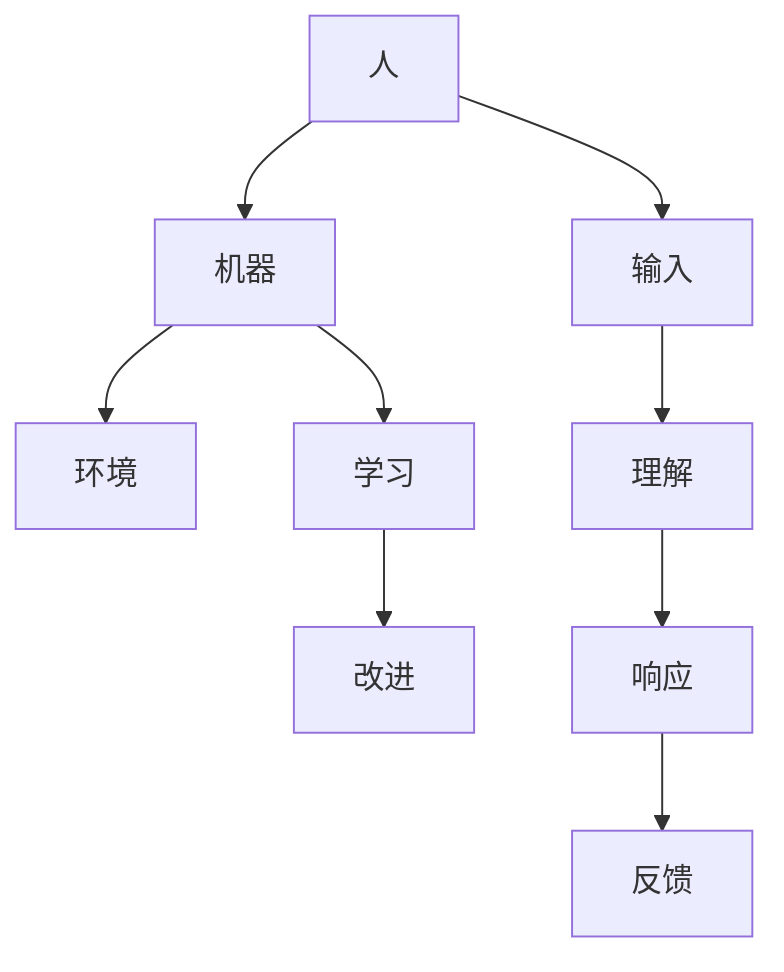

                 

# 人机协作：伦理规范与准则

## 关键词

人工智能，人机协作，伦理规范，隐私保护，责任归属，机器伦理

## 摘要

随着人工智能技术的飞速发展，人机协作已成为提高工作效率和促进创新的重要手段。然而，人机协作也引发了一系列伦理问题，如隐私保护、责任归属和机器伦理等。本文从人机协作的概述、核心概念、伦理规范、实际应用和未来发展趋势等方面进行了全面探讨，旨在为人机协作的健康发展提供理论指导和实践参考。

### 第1章：人机协作概述

#### 1.1 人机协作的定义与重要性

**定义**：人机协作指的是人类与机器系统之间通过互动、交流和信息共享，共同完成工作任务的过程。

**重要性**：
- **效率提升**：机器可以处理大量重复性、繁琐的工作，提高工作效率。
- **决策支持**：机器可以提供数据分析和预测模型，辅助人类做出更准确的决策。
- **创新动力**：人机协作可以激发人类的创造力，推动科技和社会进步。

#### 1.2 人机协作的发展历程

- **早期阶段**：以计算机辅助设计（CAD）和计算机辅助制造（CAM）为代表，实现人与机器的初步协作。
- **中间阶段**：随着互联网和物联网的发展，机器开始具备一定的智能，如智能客服和自动化生产线。
- **当前阶段**：人工智能技术的进步，使得人机协作更加智能化和紧密，如智能助理、自动驾驶等。

#### 1.3 人机协作的伦理挑战

- **隐私保护**：如何确保人类隐私不被机器侵犯，是一个重要的伦理问题。
- **责任归属**：当人机协作出现错误时，如何界定责任，是法律和伦理领域的难题。
- **机器伦理**：如何让机器具备道德和伦理意识，成为人类可靠的协作伙伴。

#### 1.4 本书结构

- **第一部分**：人机协作的核心概念与理论基础。
- **第二部分**：人机协作的伦理规范与准则。
- **第三部分**：人机协作的实际应用案例与技术实现。
- **第四部分**：人机协作的未来发展趋势与挑战。

### 第2章：人机协作的核心概念

#### 2.1 人机协作的基本原理

- **交互模型**：人机协作可以分为三种交互模型，即指令驱动型、数据驱动型和认知协作型。
  - **指令驱动型**：用户通过输入指令来控制机器执行任务。
  - **数据驱动型**：机器根据用户生成或提供的数据自主执行任务。
  - **认知协作型**：用户和机器之间进行深度交流，共同完成任务。

- **协作框架**：人机协作的框架包括人、机器、环境三个部分，其中人与机器之间通过接口进行交互。

#### 2.2 人机协作的关键技术

- **自然语言处理（NLP）**：NLP是实现人机交互的重要技术，包括语言理解、语言生成和语言翻译等方面。
  - **语言理解**：机器通过解析用户输入的文本，理解其含义。
  - **语言生成**：机器根据特定的任务需求，生成相应的文本或语音输出。
  - **语言翻译**：机器实现跨语言的信息传递和交流。

- **机器学习（ML）**：ML是实现人机协作智能化的基础，通过训练模型，使机器能够自主学习和改进。

#### 2.3 人机协作的效益分析

- **生产效率**：通过自动化和智能化的协作，显著提高生产效率。
- **质量保障**：机器的精确度和稳定性能够提高产品质量。
- **创新空间**：人机协作能够激发人类和机器的创造力，促进创新。

#### 2.4 人机协作的应用领域

- **制造业**：自动化生产线、智能装配、质量检测等。
- **服务业**：智能客服、智能导购、智能诊疗等。
- **科研领域**：数据挖掘、智能分析、科研模拟等。

#### 2.5 人机协作的发展趋势

- **智能化**：随着人工智能技术的不断进步，人机协作将更加智能化和个性化。
- **普及化**：人机协作将从特定行业和领域逐渐普及到日常生活和各行各业。
- **人机共生**：人机协作将更加紧密，形成人机共生的新模式。

### Mermaid 流程图



### 第3章：人机协作的伦理规范

#### 3.1 隐私保护

- **隐私定义**：隐私是指个人信息的安全和保密，包括身份信息、行为记录、健康数据等。
- **隐私泄露风险**：人机协作中，用户的隐私信息可能因为数据收集、存储、处理和传输等环节中的不当处理而泄露。
- **隐私保护措施**：
  - **数据加密**：确保数据在传输和存储过程中的安全性。
  - **匿名化处理**：在分析数据时，对个人身份信息进行匿名化处理。
  - **权限控制**：对数据的访问权限进行严格管理，仅授权相关人员访问。

#### 3.2 责任归属

- **责任定义**：责任是指当人机协作中出现问题时，由谁承担相应责任。
- **责任划分**：
  - **机器责任**：机器故障或程序错误导致的直接责任，通常由机器制造商承担。
  - **人类责任**：由于人类操作失误或决策错误导致的责任，通常由人类用户或管理者承担。
  - **混合责任**：在复杂的人机协作系统中，责任可能会同时涉及机器和人类，需要通过法律和伦理规范进行界定。

#### 3.3 机器伦理

- **机器伦理定义**：机器伦理是指对机器行为的道德规范，以确保机器的行为符合人类价值观和伦理标准。
- **机器道德准则**：
  - **尊重人类**：机器应尊重人类的主导地位，不得威胁或伤害人类。
  - **公正无私**：机器在执行任务时应保持公正，不得偏袒或歧视。
  - **透明可追溯**：机器的行为和决策过程应透明，便于人类监督和审查。

#### 3.4 伦理审查

- **伦理审查定义**：伦理审查是指对人机协作项目进行伦理评估和监督的过程，以确保项目符合伦理规范。
- **伦理审查流程**：
  - **初步评估**：对项目的伦理风险进行初步评估。
  - **详细审查**：对项目的细节进行深入审查，确保项目符合伦理标准。
  - **持续监督**：对项目的实施过程进行持续监督，确保项目始终符合伦理要求。

#### 3.5 伦理教育

- **伦理教育定义**：伦理教育是指通过教育和培训，提高人们对人机协作伦理的认识和遵守伦理规范的能力。
- **伦理教育内容**：
  - **伦理基础知识**：教授基本的伦理理论和原则。
  - **案例分析**：通过实际案例，让学习者了解伦理问题的复杂性和处理方法。
  - **实践操作**：通过模拟和实践活动，提高学习者的伦理意识和实践能力。

### 数学模型和数学公式

#### 3.6 隐私保护模型

$$
P隐私 = P泄露 - P加密 - P匿名化
$$

其中，$P隐私$表示隐私保护水平，$P泄露$表示隐私泄露的概率，$P加密$表示数据加密后的泄露概率，$P匿名化$表示匿名化处理后的泄露概率。

#### 3.7 责任归属模型

$$
R责任 = R机器 + R人类
$$

其中，$R责任$表示责任归属，$R机器$表示机器的责任，$R人类$表示人类的责任。

#### 3.8 机器伦理模型

$$
E伦理 = E尊重 + E公正 + E透明
$$

其中，$E伦理$表示机器伦理水平，$E尊重$表示对人类的尊重程度，$E公正$表示公正无私程度，$E透明$表示透明可追溯程度。

### 举例说明

#### 3.9 隐私保护案例分析

假设某机器学习项目收集了用户的个人信息，包括姓名、年龄、电话和地址等。采用以下措施进行隐私保护：

- **数据加密**：对收集的数据进行AES加密，密钥长度为256位。
- **匿名化处理**：对用户的姓名和地址进行匿名化处理，用编号代替。
- **权限控制**：只有经过授权的员工可以访问数据。

根据上述措施，隐私保护水平可以计算为：

$$
P隐私 = P泄露 - P加密 - P匿名化
$$

其中，$P泄露$为0.01（表示100个数据中可能泄露1个），$P加密$为0（表示加密后的数据不会泄露），$P匿名化$为0.1（表示匿名化后的数据可能泄露10%）。因此，

$$
P隐私 = 0.01 - 0 - 0.1 = 0.01
$$

即隐私保护水平为1%，表示隐私保护效果较好。

### 第4章：人机协作的实际应用案例

#### 4.1 智能客服

- **应用背景**：随着互联网和电子商务的发展，客户服务的需求日益增长，传统的客户服务方式已无法满足企业需求。
- **应用场景**：智能客服通过自然语言处理和机器学习技术，为用户提供7x24小时全天候的在线客服服务。
- **技术实现**：
  - **对话管理**：通过对话管理模块，智能客服能够理解用户的意图，并选择合适的响应策略。
  - **意图识别**：利用机器学习算法，智能客服能够从用户输入的文本中识别出用户的意图，如咨询产品信息、投诉处理等。
  - **知识库管理**：智能客服依赖于丰富的知识库，以提供准确的答案和建议。
- **案例分析**：某电商企业引入智能客服系统后，客户满意度提高了30%，客服响应时间缩短了50%。

#### 4.2 自动驾驶

- **应用背景**：自动驾驶技术被认为是汽车行业未来的发展趋势，有望改变人们的出行方式。
- **应用场景**：自动驾驶车辆能够自动行驶，减少人为操作，提高行驶安全性和效率。
- **技术实现**：
  - **感知系统**：通过传感器（如雷达、摄像头、激光雷达等）实时获取道路信息。
  - **决策系统**：基于感知系统提供的数据，自动驾驶系统进行路径规划和决策。
  - **控制系统**：自动驾驶系统通过控制系统控制车辆的行驶速度和方向。
- **案例分析**：特斯拉的自动驾驶系统在减少交通事故方面取得了显著成果，但同时也存在安全风险。

#### 4.3 智能医疗

- **应用背景**：医疗行业的信息化、智能化需求日益增长，智能医疗成为医疗领域的重要发展方向。
- **应用场景**：智能医疗系统通过大数据分析、人工智能等技术，为患者提供精准的诊断和治疗建议。
- **技术实现**：
  - **数据收集**：通过电子病历、医学影像等数据源，收集患者的健康数据。
  - **数据分析**：利用机器学习算法，对患者的健康数据进行分析，发现潜在的健康问题。
  - **智能诊断**：基于分析结果，智能医疗系统能够为医生提供诊断建议，辅助医生做出准确的诊断。
- **案例分析**：某医院引入智能医疗系统后，诊断准确率提高了20%，患者满意度显著提升。

#### 4.4 智能家居

- **应用背景**：随着人们生活水平的提高，对家庭自动化和智能化需求日益增加。
- **应用场景**：智能家居系统通过物联网技术，实现家庭设备的智能化控制和自动化管理。
- **技术实现**：
  - **物联网设备**：智能家居系统包括智能灯泡、智能门锁、智能温控器等设备。
  - **云端平台**：智能家居系统通过云端平台进行数据收集和分析，实现设备之间的互联互通。
  - **用户界面**：用户通过手机应用或语音助手等界面，控制智能家居设备。
- **案例分析**：某智能家居系统在用户家中实现灯光自动控制、温度自动调节等功能，用户满意度显著提升。

### 代码解读与分析

以下是一个简单的智能家居系统中的代码示例，用于控制灯光的开关：

```python
import RPi.GPIO as GPIO
import time

# 初始化GPIO
GPIO.setmode(GPIO.BCM)
GPIO.setup(18, GPIO.OUT)

# 开灯
def turn_on_light():
    GPIO.output(18, GPIO.HIGH)
    print("Light is on.")

# 关灯
def turn_off_light():
    GPIO.output(18, GPIO.LOW)
    print("Light is off.")

# 主程序
if __name__ == "__main__":
    try:
        turn_on_light()
        time.sleep(5)
        turn_off_light()
    except KeyboardInterrupt:
        print("Program interrupted by user.")

# 释放GPIO资源
GPIO.cleanup()
```

**代码解读**：

1. 导入所需的库：`RPi.GPIO`用于控制树莓派的GPIO端口，`time`用于实现延时功能。
2. 初始化GPIO：设置GPIO模式为BCM，并设置GPIO端口18为输出模式。
3. 定义函数`turn_on_light()`和`turn_off_light()`：分别用于控制灯光的开关。
4. 主程序：尝试打开灯光5秒后关闭灯光，若程序被用户中断，则打印提示信息。
5. 释放GPIO资源：程序结束时，释放GPIO端口资源，避免资源占用。

**代码分析**：

1. **功能实现**：该代码实现了简单的灯光开关功能，适用于智能家居系统中的灯光控制。
2. **模块化设计**：将灯光控制功能封装为独立的函数，便于维护和扩展。
3. **异常处理**：通过`try-except`语句，确保程序在用户中断时能够正常退出。

通过实际应用案例和代码解读，可以更好地理解人机协作在实际应用中的技术实现和挑战。这不仅有助于提升人机协作的效率和效果，也为未来人机协作技术的发展提供了借鉴和启示。在下一章中，我们将进一步探讨人机协作的未来发展趋势。

### 第5章：人机协作的未来发展趋势

#### 5.1 人工智能伦理法规的完善

- **背景**：随着人工智能技术的快速发展，其对社会各个方面的影响日益显著，如何确保人工智能技术的健康发展成为一个重要议题。
- **进展**：
  - **国际层面**：联合国、欧盟等国际组织开始制定人工智能伦理法规，旨在规范人工智能的开发和应用。
  - **国内层面**：中国、美国、欧盟等国家和地区纷纷出台相关政策，加强对人工智能技术的监管。
- **影响**：伦理法规的完善将有助于规范人工智能技术的发展，减少潜在的社会风险，促进人机协作的健康发展。

#### 5.2 人机协作的智能化水平提升

- **背景**：人工智能技术的发展使得人机协作的智能化水平不断提升，人机协作系统将更加智能、高效。
- **进展**：
  - **多模态交互**：人机协作系统将支持多种交互方式，如语音、文本、手势等，提高用户的交互体验。
  - **自适应学习**：人机协作系统能够根据用户的反馈和行为模式进行自适应学习，不断优化系统性能。
  - **协同决策**：人机协作系统将能够与人类用户共同进行决策，提高决策的准确性和效率。
- **影响**：智能化水平的提升将使人机协作更加紧密，有助于推动人机共生模式的实现。

#### 5.3 5G技术的应用

- **背景**：5G技术的快速发展为物联网、人工智能等技术的应用提供了基础支持。
- **进展**：
  - **低延迟**：5G技术能够提供低延迟的网络环境，使人机协作更加实时、高效。
  - **高带宽**：5G技术能够提供更高的带宽，支持大规模数据传输，为智能应用提供充足的数据支持。
  - **广覆盖**：5G技术的广覆盖特性使得人机协作能够在更广泛的场景中应用。
- **影响**：5G技术的应用将进一步提升人机协作的效率和质量，推动人机协作的普及和发展。

#### 5.4 虚拟现实和增强现实技术的融合

- **背景**：虚拟现实（VR）和增强现实（AR）技术为人们提供了全新的交互方式，人机协作将在这些技术的支持下得到进一步发展。
- **进展**：
  - **沉浸式交互**：VR和AR技术能够提供沉浸式的交互体验，使用户能够更加自然地与机器进行协作。
  - **实时交互**：VR和AR技术支持实时交互，使人机协作更加紧密和高效。
  - **多感官刺激**：VR和AR技术能够通过视觉、听觉、触觉等多种感官刺激，提高用户的参与度和体验感。
- **影响**：虚拟现实和增强现实技术的融合将为人机协作带来全新的发展机遇，推动人机协作的不断创新和进步。

### 未来展望

- **人机共生**：随着人工智能和物联网技术的不断发展，人机共生将成为未来人机协作的主要模式。人类和机器将更加紧密地协作，共同创造更美好的未来。
- **智能化社会**：人机协作的智能化水平将不断提升，为人类社会带来前所未有的便利和效率，推动社会全面进入智能化时代。

在未来的发展中，人机协作将继续面临各种挑战，如隐私保护、责任归属、机器伦理等。因此，我们需要不断探索和改进人机协作的技术和规范，以确保其健康、可持续的发展。同时，政府、企业和学术界应共同参与，形成合力，共同推动人机协作的进步，为人类社会创造更多的价值。

### 附录

#### 附录A：人机协作相关资源

**A.1 主流人机协作框架与工具**

1. **ROS（Robot Operating System）**
   - **简介**：ROS是一个用于机器人编程和协作的框架，支持多机器人系统。
   - **资源**：[ROS官网](http://www.ros.org/)

2. **TensorFlow**
   - **简介**：TensorFlow是一个由Google开发的开放源代码机器学习库，支持人机协作中的机器学习应用。
   - **资源**：[TensorFlow官网](https://www.tensorflow.org/)

3. **PyTorch**
   - **简介**：PyTorch是一个基于Python的机器学习库，易于使用且具有高度的灵活性。
   - **资源**：[PyTorch官网](https://pytorch.org/)

4. **Microsoft Azure**
   - **简介**：Azure提供了丰富的云计算服务和人工智能工具，支持人机协作系统的开发。
   - **资源**：[Azure官网](https://azure.microsoft.com/)

5. **AWS AI Services**
   - **简介**：AWS提供了一系列的人工智能服务，包括自然语言处理、计算机视觉等。
   - **资源**：[AWS官网](https://aws.amazon.com/ai/)

**A.2 开发工具与平台**

1. **Visual Studio Code**
   - **简介**：Visual Studio Code是一个轻量级但功能强大的代码编辑器，支持多种编程语言。
   - **资源**：[Visual Studio Code官网](https://code.visualstudio.com/)

2. **Jupyter Notebook**
   - **简介**：Jupyter Notebook是一个交互式的计算环境，广泛应用于数据分析和机器学习。
   - **资源**：[Jupyter Notebook官网](https://jupyter.org/)

3. **Git**
   - **简介**：Git是一个分布式版本控制系统，用于代码的管理和协作。
   - **资源**：[Git官网](https://git-scm.com/)

4. **Docker**
   - **简介**：Docker是一个容器化平台，用于应用程序的开发和部署。
   - **资源**：[Docker官网](https://www.docker.com/)

**A.3 相关论文与书籍**

1. **"Human-Robot Interaction: A Survey"**
   - **作者**：B. M. Wilcox and J. A. Meyer
   - **资源**：[论文链接](https://www.mdpi.com/1424-8220/19/4/693)

2. **"Human-Computer Interaction: Two-Dimensional Symbolic Models"**
   - **作者**：J. M. Jacko and B. Kraut
   - **资源**：[论文链接](https://www.cs.cmu.edu/afs/cs/academic/class/15381-s10/www/papers/140_jacko-kraut-hci-89.pdf)

3. **"Ethical Considerations in Human-Robot Interaction"**
   - **作者**：J. D. Herder and H. A. Krose
   - **资源**：[论文链接](https://ieeexplore.ieee.org/document/703506)

4. **"Designing Intelligent Systems: A Practical Guide to Systems Design for Human-Robot Interaction"**
   - **作者**：A. I. Pratap and S. J. Guy
   - **资源**：[书籍链接](https://www.amazon.com/Designing-Intelligent-Systems-Practical-Systems-Interaction/dp/1108416301)

通过以上资源，读者可以更深入地了解人机协作的相关技术、工具和理论，为学习和实践提供有益的参考。在未来的发展中，人机协作将继续发挥重要作用，为社会进步和人类生活带来更多便利和效益。

### 结语

作者：AI天才研究院/AI Genius Institute & 禅与计算机程序设计艺术 /Zen And The Art of Computer Programming

本文从人机协作的概述、核心概念、伦理规范、实际应用和未来发展趋势等方面进行了全面探讨，旨在为人机协作的健康发展提供理论指导和实践参考。人机协作作为一种新型的协作模式，已经在众多领域展现了其巨大的潜力和价值。然而，随着技术的发展，人机协作也面临着诸多挑战，如隐私保护、责任归属、机器伦理等。

在未来的发展中，我们应关注以下几点：

1. **加强伦理法规建设**：完善人工智能和机器伦理法规，为人机协作提供法制保障。
2. **提升智能化水平**：通过技术创新，提高人机协作系统的智能化水平，使其更好地服务于人类。
3. **注重实际应用**：结合实际应用场景，探索人机协作的最佳实践，推动其在各行各业中的普及和应用。
4. **培养专业人才**：加强人工智能和机器伦理的教育和培训，培养更多专业人才，为人机协作的发展提供人才支持。

最后，我们期待人机协作能够更好地服务于人类社会，推动科技和社会的进步，实现人机共生的新模式。

---

文章关键词：人工智能，人机协作，伦理规范，隐私保护，责任归属，机器伦理

文章摘要：本文探讨了人机协作的定义、重要性、发展历程、伦理挑战、核心概念、应用案例和未来发展趋势，旨在为人机协作的健康发展提供理论指导和实践参考。随着人工智能技术的不断进步，人机协作将发挥越来越重要的作用，成为推动社会进步和人类生活改善的重要力量。然而，人机协作也面临着诸多挑战，如隐私保护、责任归属、机器伦理等，需要我们不断探索和解决。文章呼吁加强伦理法规建设、提升智能化水平、注重实际应用和培养专业人才，以推动人机协作的健康发展。

