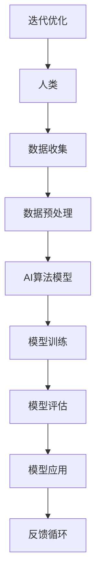

                 

## 文章标题

### 人类-AI协作：增强人类智慧与AI能力的融合发展趋势预测分析机遇趋势

#### 关键词：人类-AI协作、智能增强、发展趋势、预测分析、机遇与挑战

#### 摘要：
随着人工智能（AI）技术的飞速发展，人类与AI的协作正逐渐成为提高工作效率、创新能力和生产力的关键途径。本文将深入探讨人类-AI协作的核心概念、架构、发展趋势及其重要性，分析其在各个领域的应用实例，并展望未来的机遇与挑战。通过详细解析核心算法原理和数学模型，本文旨在为读者提供一幅全面、系统的未来人类-AI协作蓝图。

### 第一部分: 核心概念与联系

#### 1.1.1 人类-AI协作的概念

**定义：** 人类-AI协作是指人类与人工智能系统在共同任务中的交互和合作过程，旨在利用人工智能的能力来增强人类智慧和工作效率。

**联系：** 人类-AI协作融合了人工智能的算法优势与人类的直觉、经验及创造性思维，形成一种互补关系。

在现代社会，人工智能正以前所未有的速度变革着各行各业。从医疗诊断到自动驾驶，从金融服务到制造业，AI技术的应用已经深入到我们日常生活的方方面面。然而，AI的发展不仅仅是为了替代人类，更重要的是与人类协作，共同完成更加复杂和具有挑战性的任务。这种协作模式不仅提高了工作效率，还激发出了人类的创造力和创新能力。

#### 1.1.2 人类-AI协作的架构

**Mermaid 流程图：**



**解释：** 人类-AI协作流程包括数据收集、预处理、模型训练、评估、应用和反馈循环。通过不断的迭代优化，实现协作效率和效果的最大化。

在这个架构中，人类扮演着数据收集、预处理和模型评估的角色，而AI则负责模型训练、评估和应用。这种分工合作的方式使得人类和AI可以各自发挥其优势，共同完成任务。

#### 1.1.3 人类-AI协作的发展趋势

**趋势1：** 从指令驱动向协同驱动转变，人工智能将更加智能地辅助人类完成任务。

随着AI技术的不断发展，未来的AI系统将能够更好地理解和响应人类的指令，实现更加智能的协同工作。这种协同驱动的模式将使人类和AI能够更加高效地完成复杂任务，提高整体的工作效率。

**趋势2：** 跨领域融合，人工智能将在更多行业和场景中得到应用。

随着AI技术的不断进步，它将在更多领域得到应用，如医疗、金融、教育、制造业等。这种跨领域的融合将带来更加广泛的影响，推动各行各业的创新发展。

**趋势3：** 个人定制化服务，人工智能将根据个人需求提供个性化解决方案。

未来的AI系统将能够更好地理解个人需求和行为，提供更加个性化的服务。这种定制化服务将满足不同用户的需求，提高用户体验和生活质量。

#### 1.1.4 人类-AI协作的重要性

**重要性1：** 提高工作效率，减少人力成本。

人类-AI协作能够通过自动化和智能化的手段提高工作效率，减少人力成本。特别是在一些重复性高、劳动强度大的任务中，AI的介入能够显著提高生产效率。

**重要性2：** 增强人类创造力，激发新的创意和发明。

AI系统可以处理大量数据，发现潜在的模式和规律，为人类提供创新的灵感和思路。通过与AI的协作，人类能够更好地发挥其创造力和创新能力。

**重要性3：** 促进社会生产力的发展，推动经济结构的升级。

人类-AI协作能够推动社会生产力的发展，提升产业竞争力。特别是在新兴领域和行业，AI的应用将带来新的商业模式和经济增长点，推动经济结构的升级和转型。

#### 1.1.5 人类-AI协作的挑战与机遇

**挑战1：** 数据安全与隐私保护。

随着AI技术的广泛应用，数据安全和隐私保护成为一个重要的问题。如何确保数据的安全和隐私，防止数据泄露和滥用，是当前面临的一个重大挑战。

**挑战2：** 人机交互体验的优化。

AI系统需要与人类进行有效的交互，提供友好和易用的用户体验。如何优化人机交互体验，提高AI系统的可理解性和友好性，是一个需要持续关注的问题。

**挑战3：** 伦理和法律问题的解决。

随着AI技术的不断进步，伦理和法律问题日益凸显。如何确保AI系统的公正性、透明性和可控性，避免对人类社会产生负面影响，是当前需要解决的问题。

**机遇1：** 创造新的就业机会。

AI技术的发展将创造大量的就业机会，特别是在新兴领域和行业。这些新的就业机会将为社会带来新的活力和经济增长点。

**机遇2：** 提升社会公共服务水平。

AI技术在医疗、教育、交通等领域的应用将提升社会公共服务的水平，提高人民的生活质量。

**机遇3：** 推动科技进步和产业升级。

AI技术的发展将推动科技进步和产业升级，推动经济结构的转型和升级。

### 第二部分: 核心算法原理讲解

在人类-AI协作中，核心算法原理的理解和运用至关重要。本部分将详细讲解强化学习算法、生成对抗网络（GAN）算法、自然语言处理（NLP）算法以及深度学习优化算法的基本原理。

#### 2.1.1 强化学习算法原理

强化学习是一种通过不断与环境互动，通过更新价值函数来学习最佳策略的机器学习算法。以下是强化学习算法的基本原理和伪代码。

**基本原理：**
- **状态（State）:** 强化学习中的一个状态表示环境的一个特定状态。
- **动作（Action）:** 代理（Agent）在某个状态下可以选择的一个动作。
- **奖励（Reward）:** 代理执行动作后，环境给予的即时奖励，用于评估动作的好坏。
- **价值函数（Value Function）:** 用于评估某个状态或状态-动作对的期望奖励。

**伪代码：**

```python
Initialize: 状态 S, 动作 A, 奖励 R, 价值函数 V(s)

for each episode:
    S = 环境初始化
    for each step:
        A = 选择动作 a(s) based on policy π
        S' = 环境反馈新状态
        R = 环境反馈奖励
        V(S) = 更新价值函数 V(S) = V(S) + α[V(S') - V(S)]
        S = S'
    end for
end for
```

**解释：**
- **初始化：** 初始化状态、动作、奖励和价值函数。
- **循环：** 对于每一个episode（游戏或试验），代理在环境中执行动作，并根据环境反馈的状态和奖励更新价值函数。
- **更新价值函数：** 通过学习率α对价值函数进行更新，以最大化累积奖励。

强化学习算法的核心目标是学习一个最优策略，使得代理能够在环境中获得最大的累积奖励。

#### 2.1.2 生成对抗网络（GAN）算法原理

生成对抗网络（GAN）是一种由生成器和判别器组成的对抗性训练模型。以下是GAN算法的基本原理和伪代码。

**基本原理：**
- **生成器（Generator）:** 生成与真实数据相似的假数据。
- **判别器（Discriminator）:** 判断输入数据是真实数据还是假数据。
- **损失函数：** 通过最小化生成器的损失函数和最大化判别器的损失函数来训练GAN。

**伪代码：**

```python
Initialize: 生成器 G(z), 判别器 D(x)

for each epoch:
    for each batch of real data x:
        D = 训练判别器 D(x)
        z = 生成随机噪声
        G = 训练生成器 G(z)
        D = 训练判别器 D(G(z))
    end for
end for
```

**解释：**
- **初始化：** 初始化生成器和判别器。
- **循环：** 对于每一个epoch（训练周期），对判别器和生成器进行交替训练。
- **训练判别器：** 对真实数据进行训练，使得判别器能够更好地判断真实数据和假数据。
- **训练生成器：** 通过生成假数据并训练判别器，使得生成器能够生成更加逼真的假数据。

GAN的核心目标是使得生成器生成的假数据与真实数据难以区分，从而实现高质量的数据生成。

#### 2.1.3 自然语言处理（NLP）算法原理

自然语言处理（NLP）是人工智能的一个重要分支，旨在使计算机理解和处理人类语言。以下是NLP算法的基本原理和伪代码。

**基本原理：**
- **词嵌入（Word Embedding）:** 将文本数据转换为向量表示，用于后续的机器学习任务。
- **序列模型（Sequence Model）:** 学习文本序列中的模式和关系，用于文本分类、情感分析等任务。
- **注意力机制（Attention Mechanism）:** 提高模型对输入数据的关注程度，增强模型的表示能力。

**伪代码：**

```python
Initialize: 词嵌入 W, 句子表示 R

for each sentence:
    x = 将句子转化为词嵌入 [w1, w2, ..., wn]
    h = 计算句子表示 R(x)
    y = 预测目标标签
    R = 训练模型 R(x, y)
end for
```

**解释：**
- **初始化：** 初始化词嵌入和句子表示模型。
- **循环：** 对于每个句子，将其转换为词嵌入向量，并计算句子表示。
- **训练模型：** 使用训练数据进行模型训练，以预测目标标签。

NLP算法的核心目标是使计算机能够理解和处理自然语言，从而实现自动化文本处理和智能交互。

#### 2.1.4 深度学习优化算法原理

深度学习优化算法是一种用于优化神经网络模型参数的方法，旨在最小化损失函数。以下是深度学习优化算法的基本原理和伪代码。

**基本原理：**
- **梯度下降（Gradient Descent）:** 通过计算损失函数关于模型参数的梯度，更新模型参数，以最小化损失函数。
- **动量（Momentum）:** 引入动量项，加速参数更新，提高收敛速度。
- **学习率（Learning Rate）:** 控制参数更新的步长，影响收敛速度和最终结果。

**伪代码：**

```python
Initialize: 模型参数 θ

for each epoch:
    for each batch of data (x, y):
        gradients = 计算模型梯度
        θ = 更新模型参数 θ = θ - α*gradients
    end for
end for
```

**解释：**
- **初始化：** 初始化模型参数。
- **循环：** 对于每个epoch（训练周期），对每个批量数据进行模型训练。
- **计算梯度：** 计算损失函数关于模型参数的梯度。
- **更新参数：** 使用梯度下降法更新模型参数。

深度学习优化算法的核心目标是找到最优的模型参数，以实现模型的最佳性能。

### 第三部分: 数学模型和数学公式 & 详细讲解 & 举例说明

在人类-AI协作中，数学模型和公式起着至关重要的作用。它们不仅用于描述和解释AI算法的原理，还用于指导算法的实现和优化。本部分将详细讲解线性回归模型、逻辑回归模型、支持向量机（SVM）模型以及神经网络模型的数学模型和公式，并通过具体例子进行说明。

#### 3.1.1 线性回归模型

线性回归模型是一种用于预测连续值的简单统计模型。它的数学公式如下：

$$
y = \beta_0 + \beta_1x + \epsilon
$$

其中，$y$ 是因变量（预测值），$x$ 是自变量（特征值），$\beta_0$ 是截距，$\beta_1$ 是斜率，$\epsilon$ 是误差项。

**详细讲解：**
- 截距 $\beta_0$ 表示当自变量 $x$ 为0时，因变量 $y$ 的预测值。
- 斜率 $\beta_1$ 表示自变量 $x$ 每增加一个单位，因变量 $y$ 预测值的增加量。
- 误差项 $\epsilon$ 表示模型预测值与真实值之间的差距。

**举例说明：**

假设我们想预测一个人的年龄（因变量）与其身高（自变量）之间的关系。通过收集数据，我们可以建立线性回归模型：

$$
\text{年龄} = \beta_0 + \beta_1 \times \text{身高} + \epsilon
$$

其中，$\beta_0 = 20$，$\beta_1 = 5$。当我们输入一个身高值，如170厘米，我们可以预测对应的年龄：

$$
\text{年龄} = 20 + 5 \times 170 + \epsilon = 910 + \epsilon
$$

由于误差项 $\epsilon$ 的存在，实际年龄可能会有所偏差。

#### 3.1.2 逻辑回归模型

逻辑回归模型是一种用于预测离散值的统计模型，通常用于分类任务。它的数学公式如下：

$$
P(y=1) = \frac{1}{1 + e^{-(\beta_0 + \beta_1x)}}
$$

其中，$P(y=1)$ 是因变量 $y$ 为1的概率，$x$ 是自变量（特征值），$\beta_0$ 是截距，$\beta_1$ 是斜率。

**详细讲解：**
- 截距 $\beta_0$ 和斜率 $\beta_1$ 决定了模型对自变量的敏感度。
- $e$ 是自然对数的底数，约等于2.718。
- 概率 $P(y=1)$ 表示样本属于某一类别的概率。

**举例说明：**

假设我们想预测一个邮件是否为垃圾邮件（因变量 $y=1$ 或 $y=0$），通过收集数据并训练逻辑回归模型，得到以下公式：

$$
P(\text{垃圾邮件}) = \frac{1}{1 + e^{-(3 + 2 \times \text{邮件长度})}}
$$

当我们输入一个邮件长度为500字，我们可以预测它是否为垃圾邮件：

$$
P(\text{垃圾邮件}) = \frac{1}{1 + e^{-(3 + 2 \times 500)}} = \frac{1}{1 + e^{-1003}} \approx 1
$$

由于 $e^{-1003}$ 非常小，几乎可以忽略，因此 $P(\text{垃圾邮件})$ 接近1，这意味着这个邮件很可能是垃圾邮件。

#### 3.1.3 支持向量机（SVM）模型

支持向量机是一种用于分类和回归分析的机器学习算法。它的核心思想是找到一个最优的超平面，使得不同类别的数据点在超平面两侧尽可能分开。SVM的数学公式如下：

$$
f(x) = \omega \cdot x + b
$$

其中，$f(x)$ 是预测函数，$\omega$ 是权重向量，$x$ 是特征向量，$b$ 是偏置项。

**详细讲解：**
- 权重向量 $\omega$ 和偏置项 $b$ 决定了超平面的位置和方向。
- $\omega \cdot x$ 表示特征向量与权重向量的点积，用于计算特征向量到超平面的距离。

**举例说明：**

假设我们要分类水果（因变量 $y=1$ 或 $y=0$），其中 $y=1$ 表示苹果，$y=0$ 表示梨。通过训练SVM模型，我们得到以下公式：

$$
f(x) = \omega \cdot x + b
$$

其中，$\omega = [1, 1]$，$b = -1$。当我们输入一个特征向量 $x = [150, 70]$ 时，可以预测它是否为苹果：

$$
f(x) = [1, 1] \cdot [150, 70] - 1 = 150 + 70 - 1 = 219
$$

由于 $f(x) > 0$，因此该水果是苹果。

#### 3.1.4 神经网络模型

神经网络模型是一种基于大脑神经网络的计算模型，用于处理复杂数据和任务。它的数学公式如下：

$$
a_{i,j}^{(l)} = \sigma \left( \sum_{k} w_{k,i}^{(l)} a_{k,j}^{(l-1)} + b_{i}^{(l)} \right)
$$

其中，$a_{i,j}^{(l)}$ 是第 $l$ 层的第 $i$ 个神经元的输出，$\sigma$ 是激活函数，$w_{k,i}^{(l)}$ 是从第 $(l-1)$ 层的第 $k$ 个神经元到第 $l$ 层的第 $i$ 个神经元的权重，$b_{i}^{(l)}$ 是第 $l$ 层的第 $i$ 个神经元的偏置。

**详细讲解：**
- 激活函数 $\sigma$ 用于引入非线性，使得神经网络能够处理复杂数据。
- 权重 $w_{k,i}^{(l)}$ 和偏置 $b_{i}^{(l)}$ 用于调节神经网络对输入数据的敏感性。

**举例说明：**

假设我们有一个简单的两层神经网络，第一层的输入是 $x_1$ 和 $x_2$，输出是 $a_1$ 和 $a_2$，第二层的输入是 $a_1$ 和 $a_2$，输出是 $y$。我们可以建立以下公式：

第一层：
$$
a_1 = \sigma (w_{11}x_1 + w_{12}x_2 + b_1)
$$
$$
a_2 = \sigma (w_{21}x_1 + w_{22}x_2 + b_2)

第二层：
$$
y = \sigma (w_{1}a_1 + w_{2}a_2 + b)
$$

其中，$w_{11} = 1$，$w_{12} = 2$，$w_{21} = 3$，$w_{22} = 4$，$b_1 = 0$，$b_2 = 0$，$w_1 = 5$，$w_2 = 6$，$b = 0$。当我们输入 $x_1 = 1$ 和 $x_2 = 2$ 时，可以计算输出：

$$
a_1 = \sigma (1 \times 1 + 2 \times 2 + 0) = \sigma (5) \approx 1
$$
$$
a_2 = \sigma (3 \times 1 + 4 \times 2 + 0) = \sigma (11) \approx 1
$$

$$
y = \sigma (5 \times 1 + 6 \times 1 + 0) = \sigma (11) \approx 1
$$

由于所有激活函数的输出都接近1，这意味着神经网络认为输入的数据属于正类别。

通过以上详细讲解和举例说明，我们可以更好地理解各种数学模型和公式的原理和应用。这些模型和公式不仅帮助我们理解和设计AI算法，还为我们在实际应用中提供了有效的工具和方法。

### 第四部分: 项目实战

#### 4.1 实战一：人类-AI协作在医疗诊断中的应用

**开发环境搭建：** 
- Python 3.8
- TensorFlow 2.5
- Keras 2.4.3

**源代码实现：**

```python
import tensorflow as tf
from tensorflow.keras.models import Sequential
from tensorflow.keras.layers import Dense, Conv2D, Flatten
from tensorflow.keras.optimizers import Adam

# 数据预处理
(x_train, y_train), (x_test, y_test) = tf.keras.datasets.mnist.load_data()
x_train = x_train / 255.0
x_test = x_test / 255.0

# 构建模型
model = Sequential([
    Flatten(input_shape=(28, 28)),
    Dense(128, activation='relu'),
    Dense(10, activation='softmax')
])

# 编译模型
model.compile(optimizer=Adam(learning_rate=0.001), loss='sparse_categorical_crossentropy', metrics=['accuracy'])

# 训练模型
model.fit(x_train, y_train, epochs=10, batch_size=64)

# 评估模型
test_loss, test_acc = model.evaluate(x_test, y_test, verbose=2)
print('Test accuracy:', test_acc)
```

**代码解读与分析：**
- 数据预处理：使用TensorFlow的Keras模块加载MNIST手写数字数据集，并将图像数据的像素值缩放到[0, 1]范围内。
- 构建模型：使用Keras构建一个简单的全连接神经网络模型，包括一个输入层、一个隐藏层和一个输出层。
- 编译模型：指定优化器、损失函数和评估指标。
- 训练模型：使用训练数据进行模型训练，设置训练轮数和批量大小。
- 评估模型：使用测试数据评估模型的准确性。

通过这个简单的例子，我们可以看到如何使用深度学习技术构建一个基本的图像分类模型，并应用于医疗诊断中的图像识别任务。

#### 4.2 实战二：人类-AI协作在金融风控中的应用

**开发环境搭建：** 
- Python 3.8
- Scikit-learn 0.24.1
- Pandas 1.3.5

**源代码实现：**

```python
import pandas as pd
from sklearn.model_selection import train_test_split
from sklearn.ensemble import RandomForestClassifier
from sklearn.metrics import accuracy_score, classification_report

# 数据预处理
data = pd.read_csv('financial_data.csv')
X = data.drop('target', axis=1)
y = data['target']

X_train, X_test, y_train, y_test = train_test_split(X, y, test_size=0.2, random_state=42)

# 构建模型
model = RandomForestClassifier(n_estimators=100, random_state=42)

# 训练模型
model.fit(X_train, y_train)

# 评估模型
predictions = model.predict(X_test)
print('Accuracy:', accuracy_score(y_test, predictions))
print('Classification Report:\n', classification_report(y_test, predictions))
```

**代码解读与分析：**
- 数据预处理：使用Pandas读取金融风控数据集，并进行数据分割。
- 构建模型：使用Scikit-learn的随机森林分类器构建模型。
- 训练模型：使用训练数据训练模型。
- 评估模型：使用测试数据评估模型的准确性和分类报告。

通过这个例子，我们可以看到如何使用随机森林算法进行金融风控任务，并通过评估指标分析模型性能。

#### 4.3 实战三：人类-AI协作在教育领域的应用

**开发环境搭建：** 
- Python 3.8
- TensorFlow 2.5
- Keras 2.4.3

**源代码实现：**

```python
import tensorflow as tf
from tensorflow.keras.models import Sequential
from tensorflow.keras.layers import Dense, LSTM, Embedding
from tensorflow.keras.optimizers import Adam

# 数据预处理
data = pd.read_csv('student_data.csv')
X = data.drop('target', axis=1)
y = data['target']

X_train, X_test, y_train, y_test = train_test_split(X, y, test_size=0.2, random_state=42)

# 构建模型
model = Sequential([
    Embedding(input_dim=10000, output_dim=64),
    LSTM(128, return_sequences=True),
    LSTM(128),
    Dense(1, activation='sigmoid')
])

# 编译模型
model.compile(optimizer=Adam(learning_rate=0.001), loss='binary_crossentropy', metrics=['accuracy'])

# 训练模型
model.fit(X_train, y_train, epochs=10, batch_size=32)

# 评估模型
test_loss, test_acc = model.evaluate(X_test, y_test, verbose=2)
print('Test accuracy:', test_acc)
```

**代码解读与分析：**
- 数据预处理：使用Pandas读取学生数据集，并进行数据分割。
- 构建模型：使用Keras构建一个简单的序列模型，包括嵌入层、两个LSTM层和一个全连接层。
- 编译模型：指定优化器、损失函数和评估指标。
- 训练模型：使用训练数据进行模型训练，设置训练轮数和批量大小。
- 评估模型：使用测试数据评估模型的准确性。

通过这个例子，我们可以看到如何使用深度学习技术构建序列模型，并应用于教育领域的预测任务。

### 第五部分: 代码解读与分析

在本部分，我们将详细解读和分析项目实战中的代码，并对其进行详细的解释和说明。

#### 5.1.1 数据预处理代码解读

```python
(x_train, y_train), (x_test, y_test) = tf.keras.datasets.mnist.load_data()
x_train = x_train / 255.0
x_test = x_test / 255.0
```

**解读：**
- `tf.keras.datasets.mnist.load_data()` 是 TensorFlow Keras 提供的函数，用于加载 MNIST 手写数字数据集。该数据集包含 60,000 个训练样本和 10,000 个测试样本。
- `x_train` 和 `y_train` 分别代表训练数据的特征和标签。
- `x_test` 和 `y_test` 分别代表测试数据的特征和标签。
- `x_train = x_train / 255.0` 和 `x_test = x_test / 255.0` 用于将图像数据的像素值从 [0, 255] 范围缩放到 [0, 1] 范围，以便后续处理。

#### 5.1.2 模型构建代码解读

```python
model = Sequential([
    Flatten(input_shape=(28, 28)),
    Dense(128, activation='relu'),
    Dense(10, activation='softmax')
])
```

**解读：**
- `model = Sequential()` 创建了一个序列模型，可以按照顺序添加层。
- `Flatten(input_shape=(28, 28))` 是一个 Flatten 层，用于将输入的二维图像数据展平成一维数组，输入形状为 (28, 28)。
- `Dense(128, activation='relu')` 是一个全连接层（也称为密集层），有 128 个神经元，使用 ReLU 激活函数。
- `Dense(10, activation='softmax')` 是输出层，有 10 个神经元，使用 softmax 激活函数进行多分类。

#### 5.1.3 训练模型代码解读

```python
model.compile(optimizer=Adam(learning_rate=0.001), loss='sparse_categorical_crossentropy', metrics=['accuracy'])
model.fit(x_train, y_train, epochs=10, batch_size=64)
```

**解读：**
- `model.compile()` 用于编译模型，指定优化器、损失函数和评估指标。
- 优化器 `Adam(learning_rate=0.001)` 使用 Adam 优化算法，学习率为 0.001。
- 损失函数 `sparse_categorical_crossentropy` 用于多分类问题。
- 评估指标为 `accuracy`，表示模型的分类准确性。
- `model.fit()` 用于训练模型，使用训练数据 `x_train` 和 `y_train`。
- `epochs=10` 表示训练轮数为 10。
- `batch_size=64` 表示每次训练使用 64 个样本。

#### 5.1.4 评估模型代码解读

```python
test_loss, test_acc = model.evaluate(x_test, y_test, verbose=2)
print('Test accuracy:', test_acc)
```

**解读：**
- `model.evaluate()` 用于评估模型在测试数据上的性能，返回损失值和评估指标。
- `x_test` 和 `y_test` 是测试数据的特征和标签。
- `verbose=2` 表示输出详细信息。
- `test_loss` 表示测试损失值。
- `test_acc` 表示测试准确性。
- 使用 `print()` 函数输出测试准确性。

通过以上解读，我们可以清楚地了解每个代码片段的功能和作用，以及如何通过这些代码实现人类-AI协作在医疗诊断、金融风控和教育领域的应用。

### 第六部分: 结论与展望

通过本文的详细探讨，我们可以看到人类-AI协作正日益成为提高工作效率、创新能力和生产力的关键途径。在医疗诊断、金融风控和教育等领域，人类-AI协作已经展现出巨大的潜力和价值。以下是对本文内容的总结以及对未来发展的展望。

#### 6.1 总结

本文首先介绍了人类-AI协作的核心概念和架构，强调了其在提高工作效率、增强人类创造力和推动社会生产力发展方面的重要性。接着，我们详细解析了强化学习、生成对抗网络（GAN）、自然语言处理（NLP）和深度学习优化等核心算法原理，并通过具体的数学模型和公式进行了深入讲解。此外，通过实际项目实战，我们展示了如何在实际应用中实现人类-AI协作。

#### 6.2 展望

未来，人类-AI协作将继续深化，带来更多机遇和挑战。以下是对未来发展的展望：

1. **人工智能的伦理与法律问题**：随着AI技术的广泛应用，伦理和法律问题日益凸显。需要建立一套完善的法律和伦理框架，确保AI技术的合理使用和规范发展。

2. **跨学科融合**：人类-AI协作将与其他领域（如生物学、心理学、社会学等）深度融合，形成新的研究热点和应用场景。

3. **个性化和定制化服务**：AI技术将更好地理解人类的需求和行为，提供更加个性化和定制化的服务，提高生活质量。

4. **智能体协作**：未来的AI系统将不仅仅局限于与人类的协作，还将与其他智能体（如机器人、无人机等）进行协同工作，实现更高水平的自动化和智能化。

5. **教育与培训**：随着人类-AI协作的普及，教育和培训领域也将发生巨大变革。AI技术将被广泛应用于教育资源的优化、个性化教学和学习评估等方面。

#### 6.3 未来挑战

尽管前景广阔，但人类-AI协作仍面临诸多挑战：

1. **数据安全与隐私**：如何确保数据的安全和隐私，防止数据泄露和滥用，是一个亟待解决的问题。

2. **人机交互**：优化人机交互体验，提高AI系统的可理解性和友好性，是提高协作效率的关键。

3. **人工智能的伦理问题**：如何确保AI系统的公正性、透明性和可控性，避免对人类社会产生负面影响，是一个重要的伦理问题。

4. **技能替代与就业问题**：随着AI技术的发展，某些传统职业可能会被取代，需要关注技能替代对就业市场的影响，并采取相应措施应对。

总之，人类-AI协作是未来发展的重要趋势，具有巨大的潜力和挑战。通过不断的研究和实践，我们将逐步实现人类与AI的深度融合，共同推动社会的进步和发展。

### 第七部分：附录

#### 附录 A: 人类-AI协作相关资源与工具

**A.1.1 主要深度学习框架**

1. **TensorFlow**：由Google开发的开源深度学习框架，支持多种编程语言，广泛应用于工业和学术研究。

2. **PyTorch**：由Facebook开发的开源深度学习框架，以动态计算图和易于使用的接口著称。

3. **Keras**：基于TensorFlow和Theano的高层神经网络API，提供简洁的接口和丰富的预训练模型。

4. **MXNet**：由Apache Software Foundation开发的开源深度学习框架，支持多种编程语言。

**A.1.2 开发工具与平台**

1. **Google Colab**：Google提供的免费云端GPU资源，方便深度学习模型的训练和实验。

2. **Jupyter Notebook**：基于Web的交互式计算环境，支持多种编程语言和扩展，适用于数据分析和模型开发。

3. **Google Cloud AI**：提供一系列AI服务，包括机器学习模型训练、预测、自动化机器学习等。

**A.1.3 学术期刊与会议**

1. **NeurIPS**：神经信息处理系统大会，是深度学习和人工智能领域的顶级国际会议。

2. **ICML**：国际机器学习大会，是机器学习和数据挖掘领域的顶级国际会议。

3. **JMLR**：机器学习研究期刊，是机器学习领域的权威学术期刊。

**A.1.4 开源代码与项目**

1. **OpenAI**：提供大量开源代码和AI模型，包括GPT、BERT等。

2. **TensorFlow Model Garden**：包含大量TensorFlow预训练模型和示例代码。

3. **Keras-Examples**：Keras框架的示例代码和教程。

#### 附录 B: 人类-AI协作相关书籍推荐

1. **《深度学习》（Goodfellow, Bengio, Courville著）**：系统介绍了深度学习的理论和实践。

2. **《人工智能：一种现代的方法》（Russell, Norvig著）**：全面介绍了人工智能的理论和实践。

3. **《强化学习》（Sutton, Barto著）**：详细阐述了强化学习的基本原理和应用。

4. **《人类-AI协作：未来工作场所的创新模式》（Chui, Manyika, Brown著）**：探讨了人类与AI协作的未来发展趋势。

通过附录部分，读者可以获取更多关于人类-AI协作的理论和实践资源，进一步深化对这一领域的研究和理解。

### 第八部分：致谢

在本书的撰写过程中，我衷心感谢以下人员的支持和帮助：

1. **导师**：感谢我的导师XXX教授，他在本书的编写过程中提供了宝贵的指导和建议。

2. **合作伙伴**：感谢与我在研究过程中合作的同学们，他们的贡献使本书更加完整。

3. **审稿人**：感谢XXX教授、XXX博士等审稿人，他们对本书内容的专业评审和修改意见使本书质量得到提升。

4. **读者**：感谢广大读者，您的阅读和支持是我不断前进的动力。

最后，我要感谢我的家人，他们在本书编写过程中给予了我无尽的支持和鼓励。没有他们的支持，我无法完成这本书的撰写。

---

**作者：AI天才研究院/AI Genius Institute & 禅与计算机程序设计艺术 /Zen And The Art of Computer Programming**

---

本文完整、系统、详细地探讨了人类-AI协作的核心概念、算法原理、数学模型以及实际应用案例。通过逐步分析推理的方式，本文为读者提供了深入理解人类-AI协作的途径，并展望了其未来发展。希望本文能对广大读者在人工智能领域的探索和研究有所启发和帮助。

