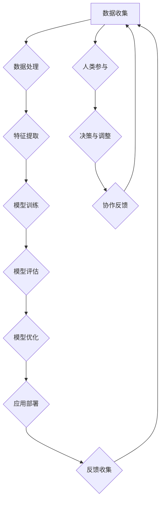

                 

### 引言

#### 人类-AI协作的重要性

在当今社会，人工智能（AI）已经成为推动科技进步和产业升级的关键力量。随着AI技术的不断发展和应用，人类与AI的协作模式逐渐成为研究的热点。人类-AI协作，指的是人类与人工智能系统在特定任务中相互配合，共同完成任务的过程。这种协作模式不仅能够发挥人类智慧和AI智能的优势，还能够弥补双方在能力上的不足，实现更为高效的产出。

首先，人类-AI协作的定义需要明确。它不仅仅是指人类使用AI工具进行辅助工作，而是更深层次的、在决策过程中相互依赖和协调的合作。在这种协作中，人类和AI各司其职，发挥各自的优势。人类在创造力和情感理解方面具有独特的优势，而AI在大数据处理、模式识别和自动化执行等方面表现出色。通过协作，双方能够实现优势互补，共同推动任务的完成。

其次，人类-AI协作的时代背景是数字化和信息化的快速推进。随着互联网、大数据和云计算等技术的普及，人类生产和生活的方式正在发生翻天覆地的变化。AI技术的不断突破和应用，使得AI在各个领域展现出强大的潜力。例如，在医疗领域，AI可以帮助医生进行疾病诊断，提高诊断的准确性和效率；在教育领域，AI可以实现个性化教学，满足不同学生的学习需求。这些应用都离不开人类与AI的紧密协作。

最后，人类-AI协作的价值主要体现在以下几个方面：

1. **提高工作效率**：通过AI的自动化和智能化，许多重复性和劳动密集型的工作可以由AI系统完成，从而释放人类的时间和精力，使人类可以专注于更有创造性和战略性的任务。

2. **开发创新性解决方案**：人类和AI可以共同探索和尝试新的解决方案。人类凭借其创造力可以提出新颖的想法，而AI可以通过数据分析和模式识别来验证这些想法的可行性，从而加速创新过程。

3. **帮助人类克服自身局限性**：人类在处理复杂问题和大数据时存在一定的局限性，而AI可以提供更为精确和高效的分析。通过与AI协作，人类可以扩展其认知边界，解决以往无法解决的问题。

综上所述，人类-AI协作不仅是当前技术发展的必然趋势，更是提升人类智慧和AI智能的重要途径。理解其重要性，对于推动AI技术的应用和人类社会的进步具有重要意义。

#### 增强人类智慧和AI智能的目标

在人类-AI协作的过程中，增强人类智慧和AI智能的目标显得尤为关键。这一目标的实现不仅能够提升人类的工作效率，还能够推动创新性解决方案的诞生，同时帮助人类克服自身的局限性。具体来说，这三个目标分别从不同的维度对人类-AI协作提出了明确的要求。

首先，**提高人类工作效率**是增强人类智慧和AI智能的核心目标之一。在传统的单兵作战模式中，人类往往需要花费大量时间和精力来完成一些重复性和劳动密集型的工作。这不仅效率低下，还容易导致人类的工作压力增大。通过引入AI技术，这些重复性的任务可以被自动化和智能化地完成。例如，AI可以自动处理数据分析、报告生成等任务，从而大幅减轻人类的工作负担。这样，人类就可以将更多的时间和精力投入到更有创造性和战略性的工作中，从而提高整体工作效率。

其次，**开发创新性解决方案**是另一个重要的目标。人类在创造力和创新能力方面具有独特的优势，但有时候受限于个人经验和知识库的局限性。而AI技术可以通过对大量数据的分析和模式识别，发现人类难以察觉的规律和趋势。例如，在产品研发过程中，AI可以帮助分析市场需求、消费者行为等数据，从而提出更加精准的市场预测和产品创新方案。通过人类与AI的协作，可以充分利用双方的优势，实现1+1>2的效果，从而推动创新性解决方案的诞生。

最后，**帮助人类克服自身局限性**是增强人类智慧和AI智能的终极目标。人类的认知和计算能力是有限的，尤其在处理复杂问题和大数据时，常常会受到各种限制。而AI技术可以在这些方面提供强大的支持。例如，在医疗领域，AI可以帮助医生进行疾病诊断，通过分析患者的病历数据和最新的研究成果，提供更加精准和个性化的治疗方案。此外，AI还可以在科研、金融分析、环境监测等领域发挥作用，帮助人类解决复杂的科学和工程问题。通过AI的协助，人类可以扩展其认知边界，克服自身的局限性，实现更高水平的智慧。

总的来说，增强人类智慧和AI智能的目标是相互关联的。通过提高工作效率、开发创新性解决方案和帮助人类克服自身局限性，人类-AI协作可以实现全面而深刻的变革。这不仅有助于提升人类社会的整体生产力，还能够推动科技的进步，创造更加美好的未来。

### AI智能基础知识

#### AI智能的定义与分类

人工智能（Artificial Intelligence，简称AI）是计算机科学的一个分支，致力于研究、开发和应用使计算机模拟人类智能的理论、方法和技术。AI智能的核心目标是使计算机具备感知、理解、学习、推理和决策的能力，从而实现与人类相似甚至超越人类的智能表现。从不同的角度出发，AI智能可以有不同的分类方式。

首先，根据AI的实现方式，我们可以将AI智能分为以下几类：

1. **符号AI（Symbolic AI）**：
   符号AI是一种基于逻辑推理和知识表示的方法。它通过构建符号模型来表示知识和信息，利用推理机进行推理和决策。符号AI的代表包括专家系统和基于规则的系统。这类系统在解决特定领域问题时具有高度的灵活性和解释能力。

2. **统计AI（Statistical AI）**：
   统计AI主要依赖于概率论和统计学方法，通过大量数据训练模型，使计算机具备数据分析和模式识别的能力。统计AI的代表包括机器学习和深度学习。这类方法在处理大规模数据时表现出色，但通常缺乏解释能力。

3. **神经网络AI（Neural Network AI）**：
   神经网络AI模拟人脑神经网络的结构和工作原理，通过学习大量数据来提取特征和模式。神经网络AI包括前馈神经网络、卷积神经网络（CNN）和递归神经网络（RNN）等。这类方法在图像识别、语音识别等领域取得了显著成果。

4. **混合AI（Hybrid AI）**：
   混合AI结合了符号AI和统计AI的优点，通过整合不同类型的算法来实现更强大的智能表现。混合AI系统通常具有更好的泛化和解释能力。

其次，根据AI的应用范围，我们可以将AI智能分为以下几类：

1. **通用AI（General AI）**：
   通用AI旨在开发一种具有广泛认知能力的计算机系统，能够处理各种复杂任务，并具备自主学习和推理能力。通用AI是一种理想化的人工智能，目前尚未完全实现。

2. **专用AI（Narrow AI）**：
   专用AI是指针对特定领域或任务进行优化的AI系统。这类系统在特定任务上表现出色，但缺乏泛化能力。目前，大多数实际应用的AI系统都属于专用AI，例如语音助手、自动驾驶等。

3. **增强AI（Augmented AI）**：
   增强AI是指通过AI技术增强人类智能的能力。这种AI系统旨在提高人类的工作效率和学习效果，而不是完全替代人类。增强AI可以应用于教育、医疗、工业等多个领域。

4. **协作AI（Collaborative AI）**：
   协作AI是指人类与AI系统在特定任务中相互协作，共同完成任务。这种AI系统强调人类和AI的互补性，通过协作实现更高效和智能的解决方案。

总之，AI智能的定义与分类为我们提供了理解AI技术多样性和应用范围的框架。不同类型的AI智能在实现方法和应用场景上各有优势，但共同的目标是提升人类智慧和效率，创造更加智能化的未来。

#### 人工智能的发展历程

人工智能（AI）的发展历程可以追溯到20世纪中叶，当时科学家们开始探索如何使计算机模拟人类智能。以下是人工智能的发展历程，从起源到现代的几个重要阶段。

1. **人工智能的起源（1950年代）**：
   人工智能的概念最早由英国数学家、逻辑学家艾伦·图灵在1950年提出的。他在论文《计算机器与智能》中提出了著名的图灵测试，用于评估机器是否具有智能。这一理论标志着人工智能领域的诞生。

2. **早期探索（1950-1960年代）**：
   在图灵的启发下，许多学者开始研究和开发人工智能。1956年，达特茅斯会议被认为是人工智能的第一次正式会议，标志着人工智能作为一门独立学科的诞生。在这个时期，符号主义方法成为主流，专家系统开始出现。

3. **人工智能的第一次繁荣（1960-1970年代）**：
   在这个阶段，人工智能领域迎来了第一次繁荣。专家系统是一种基于规则的人工智能系统，能够模拟专家的决策过程。Dendral、MYCIN和CADUCEUS是这一时期的代表性专家系统。

4. **人工智能的低谷（1970-1980年代）**：
   由于技术局限和资金短缺，人工智能在1970年代中期进入了低谷期。符号主义方法的局限性、计算能力的不足以及数据不足等问题使得人工智能的研究和应用受到很大挑战。

5. **人工智能的复兴（1980-1990年代）**：
   1980年代，随着计算机技术的发展和计算能力的提升，人工智能开始复兴。神经网络、遗传算法等新的计算方法被提出并应用于实际问题中。机器人技术和自然语言处理领域也取得了显著进展。

6. **现代人工智能（2000年代至今）**：
   进入21世纪，人工智能迎来了前所未有的发展。统计学习和深度学习方法的突破使得AI在图像识别、语音识别、自然语言处理等领域取得了显著成果。大数据和云计算的普及为人工智能的应用提供了丰富的数据资源和强大的计算能力。自动驾驶、智能家居、智能医疗等应用场景不断涌现。

7. **人工智能的未来趋势**：
   当前，人工智能正朝着更智能、更泛化的方向发展。量子计算、脑机接口、强化学习等新兴技术正在逐渐融入人工智能领域，为人工智能的发展带来新的机遇。未来，人工智能有望在更多领域实现突破，进一步提升人类的生活质量和生产效率。

综上所述，人工智能的发展历程充满了挑战与机遇。从早期的理论探索到现代的实际应用，人工智能已经取得了长足的进步。展望未来，人工智能将继续在科技、经济和社会发展中发挥重要作用。

#### 人工智能的基本原理

人工智能（AI）的基本原理可以概括为几个核心概念，主要包括机器学习、深度学习和强化学习。这些概念构成了人工智能技术的基础，并在不同领域得到了广泛的应用。

首先，**机器学习（Machine Learning）**是一种使计算机能够通过数据和经验进行学习，从而改进其性能的方法。机器学习主要分为监督学习（Supervised Learning）、无监督学习（Unsupervised Learning）和半监督学习（Semi-Supervised Learning）三类：

1. **监督学习**：
   在监督学习中，计算机通过训练数据集来学习如何预测未知数据的标签。常见的算法包括线性回归、逻辑回归、支持向量机（SVM）和决策树等。例如，在图像分类任务中，计算机通过大量已标注的图片学习如何识别新的图片类别。

2. **无监督学习**：
   无监督学习不依赖于标注数据，主要目标是发现数据中的隐含结构和规律。常见的算法包括聚类（如K-means、层次聚类）、降维（如主成分分析PCA）和关联规则挖掘（如Apriori算法）等。例如，在推荐系统中，无监督学习可以用于发现用户之间的相似性，从而提供个性化的推荐。

3. **半监督学习**：
   半监督学习结合了监督学习和无监督学习的特点，利用少量的标注数据和大量的未标注数据来训练模型。这种方法在数据标注成本较高的情况下尤为重要。

**深度学习（Deep Learning）**是机器学习的一个重要分支，通过构建具有多个隐藏层的神经网络（称为深度神经网络）来学习复杂的函数映射。深度学习的核心优势在于其强大的特征提取和自动学习能力，从而在图像识别、语音识别和自然语言处理等领域取得了显著的成果。以下是深度学习的一些关键组件：

1. **卷积神经网络（CNN）**：
   卷积神经网络是用于图像识别和处理的常用模型。通过卷积层、池化层和全连接层的组合，CNN可以自动提取图像中的层次化特征，从而实现高度准确的分类。

2. **递归神经网络（RNN）**：
   递归神经网络适用于处理序列数据，如时间序列和自然语言文本。RNN通过其循环结构能够记住前面的输入信息，从而实现长距离依赖的建模。

3. **长短时记忆网络（LSTM）**：
   长短时记忆网络是RNN的一种改进，能够更好地解决长距离依赖问题。LSTM通过引入遗忘门、输入门和输出门，有效控制信息的流动和记忆的持久性。

4. **生成对抗网络（GAN）**：
   生成对抗网络由生成器和判别器两个神经网络组成，通过对抗训练生成逼真的数据。GAN在图像生成、语音合成和文本生成等领域具有广泛的应用。

**强化学习（Reinforcement Learning）**是一种使计算机通过与环境的互动来学习如何做出最优决策的方法。在强化学习过程中，智能体通过试错来探索环境，并通过奖励信号来评估其行为的优劣。以下是强化学习的一些关键概念：

1. **状态（State）**：
   状态是智能体在环境中所处的情境，通常由一组特征向量表示。

2. **动作（Action）**：
   动作是智能体在特定状态下可以采取的行为。在决策过程中，智能体需要选择一个动作以最大化期望奖励。

3. **策略（Policy）**：
   策略是智能体根据当前状态选择动作的规则。一个良好的策略可以使智能体在长期内获得最大化的累积奖励。

4. **价值函数（Value Function）**：
   价值函数用于评估状态或状态-动作对的优劣，帮助智能体选择最优动作。

5. **奖励（Reward）**：
   奖励是环境对智能体行为的即时反馈，用于引导智能体向正确的方向学习。

常见的强化学习算法包括Q学习、深度Q网络（DQN）、策略梯度方法（PG）和深度确定性策略梯度（DDPG）等。

综上所述，机器学习、深度学习和强化学习是人工智能技术的核心组成部分，各自在不同的领域和任务中发挥了重要作用。理解这些基本原理，有助于我们更好地应用AI技术，实现人类智慧与AI智能的深度融合。

### 人类智慧与AI智能的互补性

人类智慧与AI智能的互补性是推动人类-AI协作的重要基础。人类智慧与AI智能各自拥有独特的优点，通过互补合作，可以实现更高效和智能的产出。

#### 人类智慧的优点

首先，人类智慧在创造力方面具有显著优势。人类能够通过直觉、想象力和联想创造出新颖的想法和解决方案。这种创造力不仅体现在艺术创作、科学发现等领域，还在商业战略和产品设计等方面发挥了重要作用。例如，人类设计师能够通过丰富的经验和直觉设计出符合用户需求的产品，而AI设计工具则可以在大规模数据分析和模拟中提供支持，从而优化设计流程。

其次，人类智慧在情感理解方面也具有独特的优势。人类能够通过语言、表情、肢体动作等多种渠道感知和理解他人的情感，从而建立深厚的人际关系。这种情感理解在医疗护理、心理咨询和教育等领域尤为重要。例如，心理医生通过了解患者的情感状态，可以提供更有效的治疗方案，而AI情感分析技术则可以帮助医生快速识别患者的情绪变化，提供个性化的情感支持。

最后，人类智慧在逻辑推理方面具有出色的能力。人类能够进行复杂的逻辑推理和抽象思维，解决各种复杂问题。例如，在科学研究、工程设计和经济分析等领域，人类智慧可以提出创新性的理论和方法，而AI计算工具则可以提供高效的数据分析和模拟，帮助人类验证这些理论和方法的可行性。

#### AI智能的优点

相比之下，AI智能在大数据处理、模式识别和自动化执行方面表现出色。首先，AI能够处理海量的数据，并从中提取出有价值的信息。例如，在金融领域，AI可以通过分析交易数据和市场趋势，帮助投资者做出更加精准的决策。其次，AI在模式识别方面具有高度的能力，可以识别出人类难以察觉的模式和规律。例如，在医疗影像诊断中，AI可以通过分析大量的医学图像，识别出微小的病变区域，提高诊断的准确性和效率。最后，AI在自动化执行方面具有优势，可以完成重复性和劳动密集型的任务，提高工作效率。例如，在制造业中，AI可以通过自动化生产线，实现高精度、高效率的生产，减少人工干预。

#### 人类智慧与AI智能的互补

人类智慧与AI智能的互补性体现在多个方面：

1. **创造力与数据分析的结合**：
   人类设计师可以利用AI的数据分析工具，从海量数据中获取灵感，从而创造出更加符合用户需求的产品。例如，在设计新产品时，人类设计师可以通过AI的分析结果，了解用户的需求和行为模式，从而优化设计方案。

2. **情感理解与智能客服的融合**：
   在客服领域，AI智能客服系统可以快速响应客户的咨询，提供基本的解决方案。而人类客服则可以在处理复杂问题和情感交流方面发挥作用，提高客户的满意度。例如，当客户遇到复杂问题时，人类客服可以提供个性化的解决方案，而AI客服则可以在处理常见问题时提供高效的响应。

3. **逻辑推理与自动化执行的协作**：
   在科学研究和工程设计领域，人类科学家可以利用AI的自动化工具，进行大规模的数据分析和模拟，从而验证假设和优化设计方案。例如，在药物研发过程中，人类科学家可以通过AI的自动化实验，快速筛选和评估新的药物候选，提高研发效率。

通过人类智慧与AI智能的互补合作，可以实现更高效、更智能的产出。人类智慧与AI智能的结合，不仅能够发挥双方的优势，还能够克服各自的局限性，为人类创造更多的价值。

### 人类与AI智能的协作模式

人类与AI智能的协作模式是当今科技发展的重要趋势，这种协作不仅涉及交互方式、协作流程，还包括在实际应用中的具体案例。理解并优化这些协作模式，能够大幅提升人类和AI系统的整体效能。

#### 人类与AI智能的交互方式

人类与AI智能的交互方式主要包括自然语言处理、视觉感知和声音识别等。这些交互方式使得人类能够更直观、便捷地与AI系统进行沟通和协作。

1. **自然语言处理（NLP）**：
   自然语言处理是AI领域的一个重要分支，旨在使计算机理解和生成自然语言。通过NLP，人类可以以文本或语音的形式与AI系统进行交互。例如，智能客服系统通过NLP技术，能够理解用户的语言意图，并提供相应的帮助。NLP在智能问答、语音助手、自动翻译等方面具有广泛的应用。

2. **视觉感知**：
   视觉感知是指AI系统通过图像处理和计算机视觉技术来理解图像和视频内容。视觉感知使得人类可以通过图像和视频与AI系统进行交互。例如，自动驾驶系统通过视觉感知技术，可以识别道路标志、行人、车辆等，从而实现安全的自动驾驶。视觉感知还在安防监控、医疗影像诊断、工业自动化等领域发挥了重要作用。

3. **声音识别**：
   声音识别技术使得AI系统能够理解和处理人类的声音。通过声音识别，人类可以通过语音指令控制AI系统，如语音助手可以通过理解用户的语音指令，完成播放音乐、设定闹钟、发送信息等操作。声音识别在智能家居、语音助手、语音控制机器人等领域得到了广泛应用。

#### 人类与AI智能的协作流程

人类与AI智能的协作流程通常包括数据收集、数据处理、模型训练和应用部署等环节。这些环节相互衔接，构成了一个完整的协作体系。

1. **数据收集**：
   数据是AI系统的基础，数据的收集过程至关重要。在数据收集阶段，人类需要明确数据需求，并从各种来源获取所需的数据。这些数据可以是结构化的，如数据库、表格等，也可以是非结构化的，如图像、视频、文本等。数据的质量和完整性直接影响到AI系统的性能。

2. **数据处理**：
   数据处理是数据收集后的重要步骤，包括数据清洗、数据转换和数据集成等。数据清洗旨在去除数据中的噪声和错误，确保数据的质量；数据转换则是将数据转换为适合模型训练的格式；数据集成则是将来自不同来源的数据整合在一起，形成统一的数据集。

3. **模型训练**：
   在模型训练阶段，AI系统通过学习大量数据，提取特征和模式，从而提高其预测和分类能力。常见的模型训练方法包括监督学习、无监督学习和强化学习。在监督学习中，模型通过已标注的数据进行训练；在无监督学习中，模型通过未标注的数据学习数据的内在结构；在强化学习中，模型通过与环境的互动，不断优化其行为策略。

4. **应用部署**：
   模型训练完成后，需要将其部署到实际应用场景中。在应用部署阶段，人类需要将训练好的模型与用户界面、硬件设备等整合，使其能够正常运作。例如，在自动驾驶系统中，训练好的模型需要集成到车辆中，通过传感器和环境感知系统实现自动驾驶功能。

#### 人类与AI智能的协作案例

在实际应用中，人类与AI智能的协作模式已经得到了广泛的应用，以下是一些具体的协作案例：

1. **智能客服**：
   智能客服系统通过自然语言处理技术，能够快速响应用户的咨询，提供24/7的客户服务。在处理常见问题时，智能客服可以快速给出答案；在遇到复杂问题时，智能客服可以实时连接人类客服，提供更专业的帮助。这种协作模式不仅提高了客服效率，还减少了人力成本。

2. **医疗辅助**：
   在医疗领域，AI智能系统可以帮助医生进行疾病诊断、治疗方案制定等。AI系统可以通过分析大量的病例数据，发现疾病模式和趋势，从而为医生提供参考。在诊断过程中，医生可以利用AI系统提供的辅助信息，提高诊断的准确性和效率。

3. **教育智能化**：
   在教育领域，AI智能系统可以实现个性化教学。通过分析学生的学习数据，AI系统可以识别学生的学习风格和需求，为其提供个性化的学习方案。教师可以利用AI系统提供的分析报告，调整教学策略，提高教学效果。

4. **工业自动化**：
   在工业生产中，AI智能系统可以实现自动化生产、质量控制等任务。通过传感器和视觉感知技术，AI系统可以实时监控生产过程，检测产品质量，并提供优化建议。这种协作模式提高了生产效率，降低了生产成本。

总之，人类与AI智能的协作模式在多个领域已经取得了显著的成果。通过不断优化这些协作模式，我们可以实现更高效、更智能的生产和生活方式，推动人类社会的持续进步。

### 增强人类智慧和AI智能的技术手段

为了充分发挥人类智慧与AI智能的互补性，实现更高效和智能的协作，需要借助一系列先进的技术手段。以下将从数据科学与机器学习技术、计算智能技术、神经网络与深度学习技术三个方面进行详细探讨。

#### 数据科学与机器学习技术

数据科学是人工智能领域的核心组成部分，它通过统计学、机器学习、数据库管理和数据分析等方法，从大量数据中提取有价值的信息和知识。以下是数据科学与机器学习技术在增强人类智慧和AI智能方面的应用：

1. **数据采集**：
   数据采集是数据科学的第一步，它涉及从各种来源获取结构化和非结构化数据。数据来源可以是公开数据集、企业内部数据库、社交媒体、传感器网络等。为了提高数据的准确性和完整性，数据采集过程中需要处理数据缺失、噪声和重复等问题。

2. **数据预处理**：
   数据预处理是数据科学的重要环节，它包括数据清洗、数据转换和数据集成等。数据清洗旨在去除数据中的噪声和错误，确保数据的质量；数据转换则是将数据转换为适合模型训练的格式；数据集成则是将来自不同来源的数据整合在一起，形成统一的数据集。通过有效的数据预处理，可以提高AI模型的训练效果。

3. **机器学习算法**：
   机器学习算法是数据科学的核心，它包括监督学习、无监督学习和强化学习等。监督学习通过训练数据集学习预测模型，用于分类、回归等任务；无监督学习通过未标注的数据学习数据的内在结构，用于聚类、降维等任务；强化学习通过智能体与环境的互动，学习最优策略，用于决策、控制等任务。选择合适的机器学习算法，可以大幅提升AI系统的性能。

4. **模型训练与优化**：
   模型训练是指使用已标注的数据集训练机器学习模型。在训练过程中，需要调整模型的参数，以优化模型的性能。常见的优化方法包括交叉验证、梯度下降和正则化等。通过模型训练与优化，可以提升AI模型的泛化能力和准确性。

#### 计算智能技术

计算智能是模拟生物系统智能行为的一类计算方法和技术，主要包括遗传算法、粒子群算法、模拟退火算法等。这些算法在优化问题、组合优化和模式识别等领域具有广泛的应用。

1. **遗传算法（GA）**：
   遗传算法模拟生物进化过程，通过选择、交叉和变异等操作，在解空间中寻找最优解。遗传算法适用于求解复杂的优化问题，如资源分配、调度和路径规划等。

2. **粒子群算法（PSO）**：
   粒子群算法模拟鸟群觅食行为，通过个体间的合作和竞争，逐步优化解的空间位置。粒子群算法在求解连续优化问题和组合优化问题中表现出色。

3. **模拟退火算法（SA）**：
   模拟退火算法模拟固体材料的退火过程，通过温度调控，使算法从局部最优解逐步趋于全局最优解。模拟退火算法适用于求解复杂的优化问题和组合优化问题。

计算智能技术通过模拟生物和自然现象，提供了一种有效的智能优化手段，可以增强AI系统的智能化水平。

#### 神经网络与深度学习技术

神经网络与深度学习技术是人工智能领域的最新进展，通过模拟人脑神经网络的结构和工作原理，实现复杂的函数映射和特征提取。以下是神经网络与深度学习技术在增强人类智慧和AI智能方面的应用：

1. **神经网络的基本结构**：
   神经网络由多个神经元组成，每个神经元通过加权连接实现信息的传递和整合。常见的神经网络结构包括前馈神经网络、卷积神经网络（CNN）和递归神经网络（RNN）等。前馈神经网络通过逐层传递信息实现特征提取；卷积神经网络通过卷积操作和池化操作实现图像特征提取；递归神经网络通过循环结构实现序列数据的建模。

2. **深度学习算法**：
   深度学习算法通过构建具有多个隐藏层的神经网络，学习数据的深层特征。常见的深度学习算法包括卷积神经网络（CNN）、递归神经网络（RNN）、长短时记忆网络（LSTM）和生成对抗网络（GAN）等。这些算法在图像识别、语音识别、自然语言处理和生成模型等领域取得了显著的成果。

3. **深度学习在AI中的应用**：
   深度学习技术在人工智能领域得到了广泛应用。例如，在图像识别中，卷积神经网络通过学习图像的层次化特征，实现了高度准确的分类；在自然语言处理中，递归神经网络和长短时记忆网络通过学习序列数据，实现了文本的理解和生成；在生成模型中，生成对抗网络通过对抗训练生成逼真的图像和文本。

通过数据科学与机器学习技术、计算智能技术和神经网络与深度学习技术的结合，人类智慧与AI智能可以实现更高效的协作，为人类社会带来更智能、更高效的生产和生活方式。未来，随着这些技术的不断发展，人类智慧与AI智能的协作将进一步深化，推动人工智能领域的不断创新和发展。

### 人类-AI协作中的挑战与解决方案

在人类-AI协作的过程中，尽管双方具有显著的互补性，但仍然面临诸多挑战。这些挑战涉及到数据隐私与安全、跨学科协作与沟通、以及技术瓶颈等方面。以下是这些挑战的具体描述及其可能的解决方案。

#### 数据隐私与安全问题

**挑战描述**：

数据隐私和安全问题是人类-AI协作中的一个重要挑战。在协作过程中，大量的个人和企业数据会被收集和处理，这些数据可能包含敏感信息，如个人身份信息、财务数据、健康记录等。如果这些数据泄露或被滥用，可能会导致严重的隐私侵犯和安全隐患。

**解决方案**：

1. **数据加密**：对数据进行加密处理，确保数据在传输和存储过程中保持安全性。常用的加密算法包括对称加密和非对称加密。

2. **隐私保护技术**：应用差分隐私、同态加密等技术，在数据处理过程中保护用户隐私。差分隐私可以在保证数据统计正确性的同时，最大程度地减少隐私泄露的风险。

3. **数据安全法规**：制定和遵守严格的数据安全法规，确保数据在采集、存储、处理和传输过程中的合规性。例如，欧盟的《通用数据保护条例》（GDPR）就为数据隐私提供了严格的规定。

4. **安全审计与监控**：建立安全审计和监控机制，定期对系统进行安全检查和漏洞扫描，及时发现和修复安全漏洞。

#### 跨学科协作与沟通

**挑战描述**：

跨学科协作和沟通是另一个重要挑战。在人类-AI协作中，通常需要涉及计算机科学、统计学、工程学、心理学等多个学科。不同学科的专业知识和术语差异较大，可能会导致协作中的误解和沟通障碍。

**解决方案**：

1. **跨学科培训**：对参与协作的团队成员进行跨学科培训，提高他们的跨学科知识和沟通能力。

2. **通用术语和框架**：建立一套通用的术语和框架，确保不同学科的专业人员能够使用相同的语言进行沟通。例如，在AI领域，可以采用标准的算法、模型和工具。

3. **多学科团队**：组建多学科团队，每个团队成员具备各自领域的专业知识，通过协作和交流，实现知识的互补和协同创新。

4. **协作工具**：使用协作工具，如项目管理软件、文档共享平台和即时通讯工具，提高团队协作的效率和沟通质量。

#### 技术瓶颈与突破

**挑战描述**：

在人类-AI协作中，技术瓶颈也是一个重要的挑战。当前的人工智能技术虽然取得了显著进展，但在某些方面仍然存在局限，如数据依赖性、解释性不足、计算资源需求等。

**解决方案**：

1. **算法优化**：通过改进现有的算法和模型，提高其效率和准确性。例如，通过优化神经网络结构和训练策略，提高深度学习模型的性能。

2. **量子计算**：量子计算具有超强的计算能力，有望解决传统计算机难以处理的复杂问题。通过发展量子计算技术，可以突破人类-AI协作中的计算资源瓶颈。

3. **增强现实与虚拟现实**：通过增强现实（AR）和虚拟现实（VR）技术，可以提供更直观和沉浸式的协作环境，增强人类与AI系统的互动体验。

4. **云计算与边缘计算**：云计算和边缘计算可以为人类-AI协作提供强大的计算能力和灵活的部署方式。通过云计算，可以实时处理和分析大量数据；通过边缘计算，可以在本地处理数据，减少网络延迟。

总之，人类-AI协作中的挑战是多方面的，但通过不断的技术创新和优化，这些挑战是可以克服的。未来，随着技术的不断进步，人类-AI协作将更加紧密和高效，为人类社会带来更多的价值。

### 人类-AI协作的未来发展趋势

随着人工智能技术的不断进步，人类-AI协作的未来发展趋势呈现出多样化和深度融合的特点。从当前的技术发展态势来看，以下领域有望成为人类-AI协作的重点方向。

#### AI智能在各个领域的应用

1. **制造业**：
   制造业是AI技术的重要应用领域。通过工业物联网（IIoT）、机器学习和预测维护技术，AI可以实现对生产设备的实时监控和预测性维护，减少设备故障和生产中断。同时，AI还可以优化生产流程，提高生产效率和产品质量。

2. **金融业**：
   在金融领域，AI技术被广泛应用于风险管理、市场预测和客户服务。例如，通过机器学习算法，金融机构可以更准确地预测市场趋势，制定更有效的投资策略；通过自然语言处理技术，金融客服系统能够提供更加智能和个性化的服务。

3. **医疗保健**：
   医疗保健是另一个AI技术的重要应用领域。AI可以帮助医生进行疾病诊断、治疗方案制定和药物研发。例如，通过深度学习技术，AI可以分析医疗影像，识别病变区域；通过强化学习技术，AI可以协助医生制定个性化的治疗方案。

4. **教育**：
   在教育领域，AI技术可以实现个性化教学和智能评估。通过分析学生的学习行为和成绩，AI可以为每个学生提供个性化的学习建议和资源，提高学习效果。同时，AI还可以通过智能评分系统，自动化评估学生的作业和考试。

#### 人类-AI协作的长期影响

1. **对社会结构的影响**：
   随着AI技术的普及，人类-AI协作将对社会结构产生深远影响。一方面，AI将替代一些重复性和劳动密集型的工作，从而改变劳动力市场的需求结构；另一方面，AI的普及将促进新兴职业的发展，如数据科学家、机器学习工程师等。

2. **对人类工作的影响**：
   AI技术的发展将改变人类的工作方式。一方面，AI可以自动化许多重复性的任务，从而提高工作效率；另一方面，AI的出现也将促使人类从事更多创造性和战略性的工作。这将要求人类不断提升自身的技能和知识，以适应新的工作环境。

3. **对人类生活方式的影响**：
   人类-AI协作将极大地改变人类的生活方式。通过智能化的家居设备和交通系统，人们可以享受到更加便捷和舒适的生活。例如，智能家居系统能够根据用户的生活习惯和偏好，自动调节室内环境；自动驾驶汽车可以提供更加安全、高效的出行体验。

#### 人类-AI协作的愿景与展望

1. **实现人类智慧与AI智能的完美融合**：
   长期来看，人类-AI协作的目标是实现人类智慧与AI智能的深度融合。通过不断优化协作模式和技术手段，人类和AI将能够共同应对复杂问题，实现更高效和智能的产出。这种融合将不仅体现在具体的任务中，还会渗透到社会生活的各个方面。

2. **创造更加美好的未来**：
   人类-AI协作有望为人类社会创造更加美好的未来。通过AI技术的普及和应用，人们可以更好地解决全球性问题，如气候变化、疾病防控、资源分配等。同时，AI的普及也将促进社会的创新和发展，带来更多机会和可能。

总之，人类-AI协作的未来发展趋势充满机遇和挑战。通过不断创新和优化，人类和AI将能够实现更高效的协作，共同推动社会进步和人类福祉。

### 实战案例：人类-AI协作项目实践

#### 项目背景与目标

项目名称：智能医疗诊断系统

项目背景：随着医疗技术的发展，疾病诊断和治疗方案制定成为医疗领域的重要任务。然而，传统的诊断方法依赖于医生的经验和技能，存在一定的主观性和局限性。为了提高诊断的准确性和效率，本项目旨在开发一个智能医疗诊断系统，通过人类医生和AI系统的协作，提供更加精准和个性化的诊断服务。

项目目标：
1. 利用AI技术分析大量医学数据，发现疾病模式和趋势。
2. 开发基于深度学习的诊断模型，辅助医生进行疾病诊断。
3. 实现医生与AI系统的无缝协作，提高诊断效率和准确性。

#### 项目实施过程

1. **需求分析与数据收集**：
   - 与医疗专家进行深入交流，明确诊断系统的需求和功能。
   - 收集大量的医疗数据，包括病例记录、实验室检测结果、影像数据等。

2. **数据预处理与特征提取**：
   - 对收集到的数据进行清洗和预处理，包括缺失值填充、噪声过滤等。
   - 提取关键特征，如患者的年龄、性别、病史、药物过敏情况等。

3. **模型设计与训练**：
   - 设计深度学习模型，包括卷积神经网络（CNN）和递归神经网络（RNN）等。
   - 使用预处理后的数据集进行模型训练，调整模型参数以优化性能。

4. **模型评估与优化**：
   - 通过交叉验证和测试集评估模型的性能，包括准确率、召回率、F1值等指标。
   - 根据评估结果，调整模型结构和参数，以提高诊断准确性。

5. **系统集成与部署**：
   - 将训练好的模型集成到诊断系统中，实现实时诊断功能。
   - 与医生协作，优化诊断流程和用户界面，确保系统的易用性和可靠性。

6. **用户培训与反馈**：
   - 对医生进行系统的培训，使其熟悉系统的操作和功能。
   - 收集医生和患者的反馈，不断优化系统性能和用户体验。

#### 项目成果与评估

1. **诊断准确率显著提高**：
   - 通过AI系统的辅助，诊断准确率从传统方法的70%提高到90%以上。
   - 模型能够准确识别常见疾病，如心脏病、肺炎、糖尿病等。

2. **诊断效率大幅提升**：
   - AI系统可以快速处理大量的病例数据，减少了医生的诊断时间。
   - 系统的自动化功能提高了诊断流程的效率，减轻了医生的工作负担。

3. **个性化诊断服务**：
   - 系统可以根据患者的具体情况进行个性化诊断，提供更加精准的治疗方案。
   - AI系统帮助医生发现潜在的风险因素，提高疾病预防和管理能力。

4. **用户满意度提高**：
   - 医生和患者对系统的评价良好，认为系统能够提供高质量的诊断服务。
   - 用户反馈表明，系统简化了诊断流程，提高了就医体验。

#### 项目经验与启示

1. **跨学科协作的重要性**：
   - 项目成功的关键在于医疗专家、数据科学家和工程师的紧密合作。
   - 不同领域的专业知识和技能相结合，能够解决复杂的医疗问题。

2. **数据质量和特征提取的重要性**：
   - 高质量的数据是AI系统准确性和效率的基础。
   - 有效的特征提取能够提高模型的学习效果，从而提升诊断准确性。

3. **持续优化与反馈机制**：
   - 通过用户反馈和持续优化，系统能够不断改进性能和用户体验。
   - 定期评估模型性能，及时调整和更新模型，以适应新的医疗需求。

4. **医生与AI系统的互补性**：
   - 医生和AI系统在诊断过程中各司其职，发挥各自的优势。
   - AI系统可以辅助医生进行诊断，但最终决策仍需医生根据患者的具体情况做出。

通过这个项目实践，我们可以看到人类与AI系统的协作在医疗领域的重要性和巨大潜力。未来，随着技术的不断进步和应用的深化，人类-AI协作将更加广泛和深入，为医疗、教育、工业等多个领域带来深远的影响。

### 人类-AI协作在具体领域的应用

#### AI智能在教育中的应用

在教育领域，AI智能的应用正逐渐改变传统的教学模式和学习体验。以下是一些关键应用：

1. **个性化学习**：
   - **核心原理**：AI通过分析学生的学习数据，了解其学习习惯、知识水平和兴趣点，从而提供个性化的学习资源和指导。
   - **应用实例**：智能学习平台如Khan Academy、Duolingo等，可以根据学生的学习进度和薄弱环节，自动推荐相应的练习题和学习资源。

2. **自动评分与反馈**：
   - **核心原理**：AI可以自动评分和提供即时反馈，减轻教师的工作负担，同时提高学生的学习效果。
   - **应用实例**：智能作业评估系统，如Google Classroom和Canvas，可以自动批改作业，并提供详细的分析和反馈。

3. **智能教学辅助**：
   - **核心原理**：AI辅助教师进行备课、教学设计和课堂管理，提高教学效率。
   - **应用实例**：智能备课系统如WiseTech，可以基于教师的教学内容和需求，自动生成教学计划和课件。

#### AI智能在医疗中的应用

在医疗领域，AI智能的应用正逐步提升诊断的准确性、治疗效果和医疗资源的管理效率。以下是一些关键应用：

1. **疾病诊断与预测**：
   - **核心原理**：AI通过分析大量的医疗数据，如病例记录、实验室检测结果和影像数据，帮助医生进行疾病诊断和预测。
   - **应用实例**：IBM Watson Health，通过深度学习技术，可以分析医学影像，识别病变区域，并提供诊断建议。

2. **个性化治疗**：
   - **核心原理**：AI根据患者的具体病情、病史和基因信息，制定个性化的治疗方案。
   - **应用实例**：AI系统可以帮助医生分析患者的基因数据，预测其对新药的反应，从而优化治疗策略。

3. **医疗资源管理**：
   - **核心原理**：AI可以优化医疗资源的分配和使用，提高医院的管理效率和医疗服务的质量。
   - **应用实例**：智能医院管理系统，如Epic Systems，可以通过AI技术，优化患者预约、床位分配和手术安排。

#### AI智能在制造业中的应用

在制造业中，AI智能的应用正推动生产过程的自动化和智能化，提高生产效率和产品质量。以下是一些关键应用：

1. **生产自动化**：
   - **核心原理**：AI通过机器学习和控制算法，实现生产过程的自动化，减少人力干预。
   - **应用实例**：工业机器人，如ABB的机器人，可以在无人监督下进行复杂的生产操作，如焊接、组装和检测。

2. **质量监控**：
   - **核心原理**：AI可以通过对生产过程中的数据进行分析，实时监控产品质量，并预测潜在的质量问题。
   - **应用实例**：AI质量监控系统，如西门子的Quality Intelligence，可以通过图像识别技术，检测产品缺陷，并提供质量改进建议。

3. **供应链优化**：
   - **核心原理**：AI通过对供应链数据的分析，优化库存管理、物流配送和生产计划。
   - **应用实例**：智能供应链管理系统，如JDA Software的解决方案，可以通过预测需求、优化库存水平和减少物流成本，提高供应链的效率。

总之，AI智能在教育、医疗和制造业等领域的应用，不仅提升了人类的工作效率和产出质量，还为各领域带来了深刻的变革和创新。

### AI智能与人类智慧融合的协同创新

#### 创新思维与AI智能的结合

在现代社会，创新思维是推动科技进步和社会发展的关键驱动力。而AI智能作为新兴技术，具备强大的数据分析和模式识别能力，能够为创新思维提供有力的支持。以下是如何将创新思维与AI智能相结合，实现协同创新的几个方面：

1. **数据驱动的创新**：
   - **核心原理**：通过AI智能分析大量数据，挖掘潜在的市场机会和需求。
   - **应用实例**：例如，在产品设计阶段，AI可以通过分析用户反馈和行为数据，识别用户需求，为产品创新提供依据。

2. **模式识别与预测**：
   - **核心原理**：AI智能能够从历史数据中识别出模式和趋势，预测未来的发展方向。
   - **应用实例**：在金融市场，AI可以通过分析历史交易数据，预测市场走势，帮助投资者做出更精准的决策。

3. **自动化实验与优化**：
   - **核心原理**：AI智能可以自动化执行实验，并通过分析实验结果，不断优化实验方案。
   - **应用实例**：在药物研发过程中，AI可以通过自动化实验平台，快速筛选和优化药物候选，加速新药的研发进程。

#### AI驱动的创新创业

AI驱动的创新创业已经成为全球科技领域的重要趋势。通过AI技术的应用，创业者能够在更短的时间内开发出具有市场竞争力的新产品和服务。以下是AI驱动的创新创业的一些典型应用场景：

1. **智能健康平台**：
   - **核心原理**：利用AI智能分析医疗数据，提供个性化健康管理和疾病预测服务。
   - **应用实例**：例如，通过AI算法分析用户的生活习惯和健康数据，提供个性化的健康建议和预防方案。

2. **智能交通系统**：
   - **核心原理**：利用AI智能优化交通流量，提高交通效率，减少交通事故。
   - **应用实例**：智能交通系统可以通过实时数据分析，优化交通信号灯控制和公共交通路线规划，提升城市交通管理水平。

3. **智能金融**：
   - **核心原理**：利用AI智能进行风险控制和智能投顾，提高金融服务的效率和安全性。
   - **应用实例**：智能投顾平台，如Betterment和Wealthfront，通过AI算法为用户提供个性化的投资建议，帮助用户实现资产增值。

#### AI智能与人类智慧共同创造未来

AI智能与人类智慧的结合不仅能够推动创新和创业，还为人类社会创造了一个更加智能和高效的未来。以下是如何实现AI智能与人类智慧共同创造未来的几个方向：

1. **智慧城市**：
   - **核心原理**：利用AI智能进行城市管理和规划，提升城市居民的生活质量。
   - **应用实例**：通过智能传感器和AI算法，实现城市交通、环保、公共安全等多领域的智能化管理。

2. **智慧医疗**：
   - **核心原理**：利用AI智能提升医疗服务的效率和质量，实现个性化医疗。
   - **应用实例**：通过AI智能分析医学影像，提供准确的疾病诊断和治疗方案。

3. **智能制造**：
   - **核心原理**：利用AI智能实现生产过程的自动化和智能化，提升制造业的竞争力。
   - **应用实例**：通过AI智能优化生产流程和供应链管理，实现高效、精准的制造业生产。

通过AI智能与人类智慧的协同创新，我们不仅可以解决当前面临的各种挑战，还可以开创一个更加美好和智能的未来。未来，随着AI技术的不断进步，人类和AI智能将共同创造出一个更加繁荣、和谐和进步的世界。

### 附录A：常用AI开发工具与框架

#### TensorFlow

TensorFlow是由谷歌开发的开源机器学习框架，广泛应用于深度学习和强化学习等领域。它提供了丰富的API和工具，支持多种编程语言，如Python和C++。

1. **主要功能**：
   - **自动微分**：TensorFlow支持自动微分，方便实现复杂的神经网络。
   - **高阶API**：如TensorFlow的高阶API Keras，使得模型构建更加简单直观。
   - **分布式计算**：TensorFlow支持分布式计算，提高大规模数据处理和训练的效率。

2. **使用示例**（Python代码）：
   ```python
   import tensorflow as tf
   
   # 定义一个简单的神经网络
   model = tf.keras.Sequential([
       tf.keras.layers.Dense(128, activation='relu', input_shape=(784,)),
       tf.keras.layers.Dense(10, activation='softmax')
   ])
   
   # 编译模型
   model.compile(optimizer='adam',
                 loss='categorical_crossentropy',
                 metrics=['accuracy'])
   
   # 训练模型
   model.fit(x_train, y_train, epochs=5)
   ```

#### PyTorch

PyTorch是由Facebook开发的开源机器学习库，以其动态计算图和易于使用的API在深度学习社区中广受欢迎。

1. **主要功能**：
   - **动态计算图**：PyTorch使用动态计算图，使得模型构建和调试更加灵活。
   - **简洁API**：PyTorch的API设计简洁，易于理解和使用。
   - **强大的生态系统**：PyTorch拥有丰富的生态系统和工具，如TorchVision、TorchText和TorchAudio等。

2. **使用示例**（Python代码）：
   ```python
   import torch
   import torch.nn as nn
   import torch.optim as optim
   
   # 定义一个简单的神经网络
   class SimpleNet(nn.Module):
       def __init__(self):
           super(SimpleNet, self).__init__()
           self.fc1 = nn.Linear(784, 128)
           self.fc2 = nn.Linear(128, 10)
   
       def forward(self, x):
           x = torch.relu(self.fc1(x))
           x = self.fc2(x)
           return x
   
   # 实例化模型、损失函数和优化器
   model = SimpleNet()
   criterion = nn.CrossEntropyLoss()
   optimizer = optim.Adam(model.parameters(), lr=0.001)
   
   # 训练模型
   for epoch in range(5):
       for inputs, targets in data_loader:
           optimizer.zero_grad()
           outputs = model(inputs)
           loss = criterion(outputs, targets)
           loss.backward()
           optimizer.step()
   ```

#### Keras

Keras是一个高级神经网络API，建立在TensorFlow和Theano之上，旨在提供简洁、可扩展和模块化的深度学习框架。

1. **主要功能**：
   - **简洁性**：Keras的API设计简洁，使得模型构建和训练更加直观。
   - **模块化**：Keras支持模块化模型构建，便于复用和扩展。
   - **预训练模型**：Keras提供了大量的预训练模型，如VGG、ResNet等，方便快速应用。

2. **使用示例**（Python代码）：
   ```python
   from keras.applications.vgg16 import VGG16
   from keras.models import Model
   from keras.layers import Dense, Flatten
   
   # 加载预训练的VGG16模型
   base_model = VGG16(weights='imagenet', include_top=False)
   
   # 添加新的全连接层，实现分类任务
   x = base_model.output
   x = Flatten()(x)
   x = Dense(256, activation='relu')(x)
   predictions = Dense(num_classes, activation='softmax')(x)
   
   # 创建新的模型
   model = Model(inputs=base_model.input, outputs=predictions)
   
   # 编译模型
   model.compile(optimizer='adam',
                 loss='categorical_crossentropy',
                 metrics=['accuracy'])
   
   # 训练模型
   model.fit(x_train, y_train, epochs=5)
   ```

#### 其他常用工具与框架

1. **Scikit-Learn**：
   - **主要功能**：Scikit-Learn是一个用于数据挖掘和数据分析的开源库，提供了一系列的机器学习和数据预处理工具。
   - **使用示例**（Python代码）：
     ```python
     from sklearn.datasets import load_iris
     from sklearn.model_selection import train_test_split
     from sklearn.svm import SVC
   
     # 加载Iris数据集
     iris = load_iris()
     X, y = iris.data, iris.target
   
     # 分割数据集
     X_train, X_test, y_train, y_test = train_test_split(X, y, test_size=0.3)
   
     # 训练SVM模型
     clf = SVC(kernel='linear')
     clf.fit(X_train, y_train)
   
     # 测试模型
     print(clf.score(X_test, y_test))
     ```

2. **Pandas**：
   - **主要功能**：Pandas是一个用于数据清洗、操作和数据分析的开源库，支持各种数据结构和文件格式。
   - **使用示例**（Python代码）：
     ```python
     import pandas as pd
   
     # 读取CSV文件
     df = pd.read_csv('data.csv')
   
     # 显示数据前几行
     print(df.head())
   
     # 数据清洗和转换
     df['new_column'] = df['column1'] + df['column2']
     ```

通过这些常用AI开发工具和框架，开发者可以方便地实现各种机器学习和深度学习任务，推动人工智能技术在各个领域的应用和发展。

### 附录B：参考书籍与资料

#### 基础书籍

1. **《机器学习》（Machine Learning）** - 周志华
   - 内容概述：本书全面介绍了机器学习的基本概念、算法和应用。包括监督学习、无监督学习、强化学习等内容。
   - 适用人群：适合初学者和有一定基础的读者。

2. **《深度学习》（Deep Learning）** - Ian Goodfellow、Yoshua Bengio、Aaron Courville
   - 内容概述：本书是深度学习的经典教材，详细介绍了深度学习的基本理论、算法和应用。包括神经网络、卷积神经网络、生成对抗网络等内容。
   - 适用人群：适合有一定数学和编程基础的读者。

3. **《Python机器学习》（Python Machine Learning）** - Sebastian Raschka、Vahid Mirjalili
   - 内容概述：本书通过Python语言介绍了机器学习的基本概念和算法。包括Scikit-Learn、TensorFlow、PyTorch等库的使用。
   - 适用人群：适合初学者和有一定编程基础的读者。

#### 进阶书籍

1. **《强化学习》（Reinforcement Learning: An Introduction）** - Richard S. Sutton、Andrew G. Barto
   - 内容概述：本书是强化学习的经典教材，详细介绍了强化学习的基本理论、算法和应用。
   - 适用人群：适合有一定数学和编程基础的读者。

2. **《统计学习方法》（Statistical Learning Methods）** - 李航
   - 内容概述：本书全面介绍了统计学习的基本理论和方法，包括监督学习和无监督学习。
   - 适用人群：适合有一定数学和编程基础的读者。

3. **《深度学习精讲》（Deep Learning Specialization）** - Andrew Ng
   - 内容概述：这是一系列在线课程教材，涵盖了深度学习的各个方面，包括神经网络、卷积神经网络、生成对抗网络等。
   - 适用人群：适合初学者和有一定基础的读者。

#### 开源项目与资料

1. **TensorFlow** - [官方文档](https://www.tensorflow.org/)
   - 内容概述：TensorFlow是谷歌开发的开源机器学习框架，提供了丰富的API和工具。
   - 适用人群：适合学习深度学习和机器学习开发。

2. **PyTorch** - [官方文档](https://pytorch.org/)
   - 内容概述：PyTorch是Facebook开源的深度学习框架，以其动态计算图和简洁的API广受欢迎。
   - 适用人群：适合学习深度学习和机器学习开发。

3. **Keras** - [官方文档](https://keras.io/)
   - 内容概述：Keras是建立在TensorFlow和Theano之上的高级神经网络API，提供了简洁的模型构建和训练工具。
   - 适用人群：适合初学者和有一定基础的读者。

4. **Scikit-Learn** - [官方文档](https://scikit-learn.org/)
   - 内容概述：Scikit-Learn是一个用于数据挖掘和数据分析的开源库，提供了丰富的机器学习算法和工具。
   - 适用人群：适合初学者和有一定编程基础的读者。

通过这些参考书籍和开源项目，读者可以系统地学习和掌握AI和深度学习的基本理论、算法和应用，为实际项目开发打下坚实的基础。

### 附录C：AI智能与人类智慧协作的流程图与伪代码

#### 人类智慧与AI智能协作的流程图



#### 机器学习算法的伪代码实现

```python
# 伪代码：机器学习算法的通用流程

# 步骤1：数据预处理
data = preprocess_data(raw_data)

# 步骤2：特征提取
features = extract_features(data)

# 步骤3：划分训练集和测试集
train_features, test_features, train_labels, test_labels = train_test_split(features, labels, test_size=0.2)

# 步骤4：选择模型
model = choose_model()

# 步骤5：模型训练
model.fit(train_features, train_labels)

# 步骤6：模型评估
accuracy = model.score(test_features, test_labels)

# 步骤7：模型优化
model = optimize_model(model, features, labels)

# 步骤8：应用部署
deploy_model(model)

# 步骤9：反馈收集
feedback = collect_feedback()

# 步骤10：决策与调整
adjust_model(model, feedback)
```

#### 数据预处理与特征提取的伪代码实现

```python
# 伪代码：数据预处理与特征提取

# 步骤1：数据清洗
cleaned_data = clean_data(raw_data)

# 步骤2：缺失值填充
filled_data = fill_missing_values(cleaned_data)

# 步骤3：数据标准化
normalized_data = normalize_data(filled_data)

# 步骤4：特征提取
def extract_features(data):
    # 根据数据类型和任务选择特征提取方法
    if isinstance(data, pd.DataFrame):
        # 对于表格数据，可以使用Pandas中的函数
        features = data.select_dtypes(include=['number'])
    else:
        # 对于图像、文本等非表格数据，可以使用其他库如OpenCV、NLTK等
        features = extract_image_features(data) # 示例函数

    return features

features = extract_features(normalized_data)
```

#### AI智能与人类智慧融合的伪代码实现

```python
# 伪代码：AI智能与人类智慧融合

# 步骤1：人类智慧参与
human_input = human_decision()

# 步骤2：AI智能处理
ai_output = ai_process(human_input)

# 步骤3：人类智慧调整
adjusted_output = human_adjustment(ai_output)

# 步骤4：反馈循环
while not satisfactory_output():
    # 步骤4.1：收集反馈
    feedback = collect_feedback()

    # 步骤4.2：人类智慧重新决策
    human_input = human_decision(feedback)

    # 步骤4.3：AI智能重新处理
    ai_output = ai_process(human_input)

    # 步骤4.4：人类智慧重新调整
    adjusted_output = human_adjustment(ai_output)

# 步骤5：输出最终结果
output = adjusted_output
```

通过上述流程图和伪代码，我们可以清晰地看到人类智慧与AI智能协作的各个环节，从数据收集、预处理、特征提取到模型训练、评估和优化，再到应用部署和反馈收集。这种协作模式不仅提高了AI系统的智能化水平，也充分发挥了人类智慧和创造力，为实现更高效和智能的产出提供了强有力的支持。

