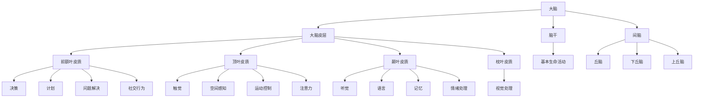

                 


### 《人类大脑的奥秘：解锁知识和理解的关键》

#### 关键词：大脑，神经科学，认知，学习，健康

> 摘要：本文旨在深入探讨人类大脑的奥秘，通过逻辑清晰、结构紧凑的篇章，揭示大脑的基础知识、核心功能、特殊功能、健康与疾病等方面，从而帮助我们更好地理解知识和提高自身认知能力。本文不仅提供了丰富的背景介绍和核心概念，还通过Mermaid流程图、伪代码、数学模型和公式等手段，全面解析大脑的各个层面。最终，本文将对大脑的未来进行展望，并提出一系列有益的建议和拓展阅读。

#### 目录

## 第一部分：大脑的基础知识

### 第1章：大脑的简介

#### 1.1 大脑的基本结构

#### 1.2 大脑的功能分区

#### 1.3 大脑的发育与成长

### 第2章：大脑的基本原理

#### 2.1 神经元与突触

#### 2.2 神经传递物质

#### 2.3 大脑的学习与记忆

## 第二部分：大脑的核心功能

### 第3章：感知与认知

#### 3.1 视觉感知

#### 3.2 听觉感知

#### 3.3 触觉感知

#### 3.4 认知功能

### 第4章：情绪与行为

#### 4.1 情绪的生物学基础

#### 4.2 情绪的类型与调节

#### 4.3 行为的控制与调节

### 第5章：语言与沟通

#### 5.1 语言的结构与功能

#### 5.2 语言的学习与开发

#### 5.3 语言障碍与治疗

## 第三部分：大脑的特殊功能

### 第6章：创造力与想象力

#### 6.1 创造力的本质

#### 6.2 想象力的作用

#### 6.3 创造力与想象力的培养

### 第7章：学习与思维

#### 7.1 学习的机制

#### 7.2 思维的类型与过程

#### 7.3 学习策略与思维训练

### 第8章：大脑与意识

#### 8.1 意识的本质

#### 8.2 意识的类型与作用

#### 8.3 意识的科学与哲学探讨

## 第四部分：大脑的健康与疾病

### 第9章：大脑的健康维护

#### 9.1 大脑健康的指标

#### 9.2 健康生活方式

#### 9.3 脑功能训练

### 第10章：大脑疾病与治疗

#### 10.1 脑部常见疾病

#### 10.2 脑疾病的诊断与治疗

#### 10.3 脑疾病的预防

### 第11章：大脑的未来

#### 11.1 大脑研究的前沿

#### 11.2 大脑技术的应用

#### 11.3 大脑科学的未来发展趋势

## 附录

### 附录A：大脑研究资源与工具

### 附录B：大脑相关书籍推荐

### 附录C：大脑研究实验室介绍

## 第一部分：大脑的基础知识

### 第1章：大脑的简介

#### 1.1 大脑的基本结构

大脑是人体的中枢神经系统的主要部分，它是负责接收、处理和传输信息的器官。从解剖学的角度来看，大脑可以分为三个主要的组成部分：大脑皮层、脑干和间脑。

- **大脑皮层**：大脑皮层是大脑的最外层，由灰色物质组成，是大脑信息处理和高级认知功能的主要区域。大脑皮层又可以分为四个主要的大脑叶，分别是：额叶、顶叶、颞叶和枕叶。每个叶都有特定的功能，例如额叶与决策和规划有关，顶叶与空间感知和运动控制有关。

- **脑干**：脑干是连接大脑和脊髓的结构，它控制着人体的基本生命活动，如呼吸、心跳和消化等。

- **间脑**：间脑位于大脑和脑干之间，包括丘脑、下丘脑和上丘脑。间脑负责调节体温、食欲、睡眠和情绪等基本生理过程。

#### 1.2 大脑的功能分区

大脑的不同区域执行着不同的功能。为了更好地理解大脑的工作原理，科学家们通常将大脑分为几个功能区域。

- **前额叶皮质**：与前计划、决策、问题解决和社交行为有关。

- **顶叶皮质**：与触觉、空间感知、运动控制和注意力有关。

- **颞叶皮质**：与听觉、语言、记忆和情绪处理有关。

- **枕叶皮质**：与视觉处理有关。

#### 1.3 大脑的发育与成长

大脑的发育和成长是一个复杂的过程，受到遗传、环境和经验的多重影响。

- **遗传因素**：遗传基因对大脑的发育有重要影响，包括大脑的体积、结构和功能。

- **环境因素**：环境刺激，如教育、营养、锻炼和社交互动等，对大脑的发育和功能也有显著影响。

- **经验**：经验在大脑的发育中起着至关重要的作用，通过学习和实践，大脑会形成新的神经连接和结构，从而提高认知能力和技能。

## 第二章：大脑的基本原理

### 2.1 神经元与突触

神经元是大脑的基本单元，它通过电化学信号进行通信。神经元由细胞体、树突和轴突组成。

- **细胞体**：包含细胞核，是神经元的核心。

- **树突**：接收其他神经元的信号。

- **轴突**：传递信号到其他神经元。

神经元之间的连接称为突触。突触由突触前神经元、突触间隙和突触后神经元组成。信号通过突触前神经元释放神经递质，穿过突触间隙，作用于突触后神经元。

### 2.2 神经传递物质

神经传递物质（神经递质）是神经元之间通信的化学信使。常见的神经递质包括：

- **多巴胺**：与奖励、动机和情绪调节有关。

- **乙酰胆碱**：与记忆、学习和觉醒水平有关。

- **谷氨酸**：与大多数大脑功能有关，特别是学习、记忆和运动控制。

### 2.3 大脑的学习与记忆

学习是大脑不断适应新环境和情况的过程。记忆是学习的结果，它使我们能够记住信息并回忆起过去的事件。

- **短期记忆**：用于暂时存储和处理信息。

- **长期记忆**：用于长期存储和回忆信息。

大脑的学习和记忆过程涉及到：

- **突触可塑性**：突触连接的强度可以随着时间和经验而改变。

- **神经可塑性**：神经元的结构和功能可以随着时间和经验而改变。

- **神经元回声**：重复刺激可以加强神经连接。

#### 核心概念与联系

让我们通过一个Mermaid流程图来描述大脑的基本结构和功能。



#### 核心算法原理讲解

为了更好地理解大脑的基本原理，我们可以使用伪代码来描述神经元与突触的工作过程。

```python
# 定义神经元类
class Neuron:
    def __init__(self):
        self.cell_body = "Cell body"
        self.dendrites = "Dendrites"
        self.axon = "Axon"
        
    def receive_signal(self, signal):
        # 接收信号
        print("Receiving signal:", signal)
        
    def transmit_signal(self):
        # 传递信号
        print("Transmitting signal through axon")
        
# 定义突触类
class Synapse:
    def __init__(self, pre_neuron, post_neuron):
        self.pre_neuron = pre_neuron
        self.post_neuron = post_neuron
        self.synaptic_cleft = "Synaptic cleft"
        
    def release_neurotransmitter(self):
        # 释放神经递质
        print("Releasing neurotransmitter into synaptic cleft")
        
    def bind_to_receptor(self):
        # 神经递质与受体结合
        print("Neurotransmitter binding to receptor on post_neuron")
        
# 创建神经元和突触
neuron1 = Neuron()
neuron2 = Neuron()
synapse = Synapse(neuron1, neuron2)

# 接收信号并传递
neuron1.receive_signal("Signal from neuron1")
neuron1.transmit_signal()

# 突触释放神经递质
synapse.release_neurotransmitter()

# 神经递质与受体结合
synapse.bind_to_receptor()
```

#### 数学模型和公式

为了量化神经元之间的信号传递过程，我们可以使用以下数学模型：

$$
E = \sum_{i=1}^{n} w_i \cdot x_i
$$

其中，$E$ 是总电势，$w_i$ 是权重，$x_i$ 是输入信号。权重反映了神经元之间的连接强度。

#### 详细讲解和举例说明

让我们通过一个简单的例子来理解神经元和突触的工作原理。

假设有两个神经元 $A$ 和 $B$，它们通过一个突触连接。神经元 $A$ 接收到一个输入信号 $x_1 = 1$，神经元 $B$ 接收到一个输入信号 $x_2 = 0$。假设权重 $w_1 = 0.5$，$w_2 = 0.3$。

使用上述数学模型，我们可以计算总电势：

$$
E = w_1 \cdot x_1 + w_2 \cdot x_2 = 0.5 \cdot 1 + 0.3 \cdot 0 = 0.5
$$

如果总电势 $E$ 超过某个阈值（例如 $0.6$），神经元 $B$ 将会激活，并传递信号。

这个例子展示了神经元和突触的基本工作原理，它为我们理解大脑的复杂计算过程奠定了基础。

### 小结

在本章节中，我们介绍了大脑的基本结构、功能分区以及发育过程。通过Mermaid流程图和伪代码，我们更好地理解了神经元与突触的工作原理。接下来，我们将继续探讨大脑的核心功能和特殊功能。敬请期待！

