                 


### 文章标题：人类计算：AI时代的未来就业趋势

### 关键词：人工智能，就业趋势，技能需求，职业规划，AI应用案例

### 摘要：
本文旨在深入探讨人工智能（AI）时代对就业市场的影响，分析AI时代的关键技能需求，并提供职业规划与就业指导。通过详细解读AI在不同行业的应用，探讨AI时代的未来就业趋势，本文为读者提供了全面的AI时代职业发展蓝图。

---

### 第一部分：AI时代的就业背景

#### 第1章：人工智能与就业

##### 1.1 人工智能对就业市场的影响

随着人工智能技术的飞速发展，传统职业面临着巨大的变革。一方面，人工智能正在替代一些重复性高、危险性大的工作，如制造业中的装配工、建筑业中的焊接工等。另一方面，AI也在创造新的就业机会，如数据科学家、机器学习工程师、自然语言处理专家等。

**Mermaid流程图：**
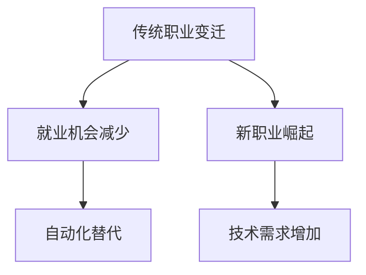

##### 1.2 AI时代的就业机会与挑战

AI时代的就业机会主要集中在以下领域：

- **数据处理与分析**：随着数据量的爆发式增长，数据科学家和分析师的需求不断增加。
- **算法研发与优化**：深度学习、强化学习等算法的研发和应用需要大量具备算法能力的工程师。
- **人机交互**：自然语言处理和计算机视觉等技术的发展，需要更多的人机交互设计师和开发人员。

然而，AI时代的就业也面临着挑战，如技能要求提高、职业转型压力等。

##### 1.3 职业转型与技能更新

在AI时代，职业转型和技能更新成为职业发展的重要议题。传统的职业可能被AI取代，而新兴的职业则需要新的技能。因此，持续学习和技能更新成为职业发展的关键。

**Mermaid流程图：**
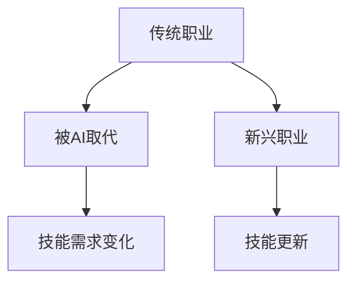

---

#### 第2章：AI驱动行业的变迁

##### 2.1 人工智能在主要行业的应用

人工智能已经在多个行业得到广泛应用，包括医疗、金融、制造业等。

- **医疗**：AI在医疗领域的应用包括疾病诊断、个性化医疗和智能药物研发。
- **金融**：AI在金融领域的应用包括风险评估、智能投顾和智能客服。
- **制造业**：AI在制造业的应用包括智能制造、设备预测性维护和质量检测。

**Mermaid流程图：**
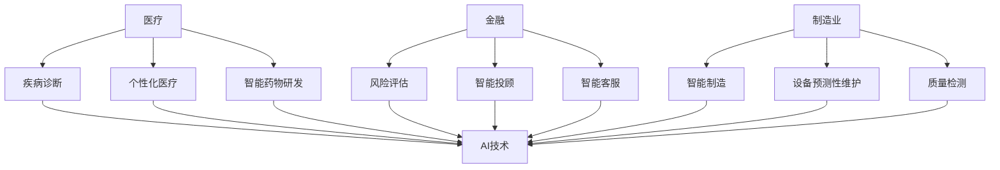

##### 2.2 新兴职业的崛起

随着AI技术的应用，一些新兴职业逐渐崛起，如数据工程师、AI产品经理、AI伦理专家等。这些职业需要跨学科的知识和技能，对于求职者的要求更高。

**Mermaid流程图：**
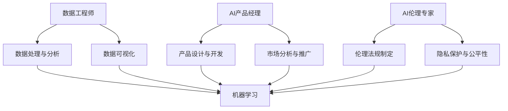

##### 2.3 传统职业的转型与消失

传统职业在AI时代面临着转型的压力，一些职业可能会消失，而另一些职业可能会得到升级。例如，制造业中的操作工可能需要转型为AI维护工程师，金融分析师可能需要学习数据科学技能。

**Mermaid流程图：**
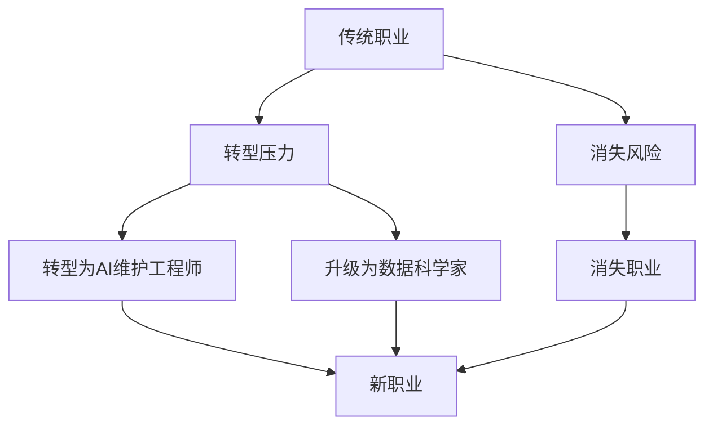

---

### 第二部分：AI时代的技能需求

#### 第3章：AI时代的核心技能

##### 3.1 编程与算法能力

编程和算法能力是AI时代的核心技能。程序员需要掌握多种编程语言，如Python、Java、C++等，同时需要熟悉算法和数据结构，能够编写高效的代码。

**核心概念与联系：** 编程能力是算法实现的基础，算法能力是AI应用的核心。两者相辅相成，共同推动AI技术的发展。

**Mermaid流程图：**
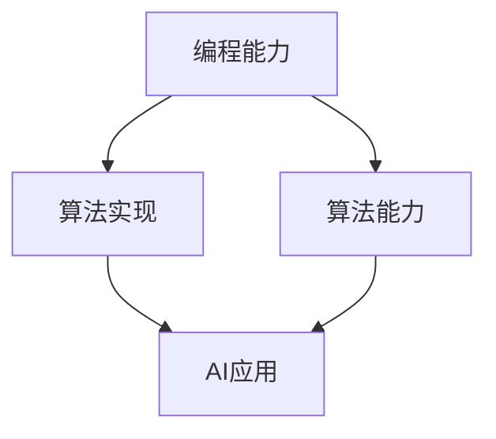

**伪代码示例：** 
```python
# 简单的线性回归算法
def linear_regression(x, y):
    n = len(x)
    sum_x = sum(x)
    sum_y = sum(y)
    sum_xy = sum([a * b for a, b in zip(x, y)])
    sum_xx = sum([a * a for a in x])
    
    # 计算斜率和截距
    slope = (n * sum_xy - sum_x * sum_y) / (n * sum_xx - sum_x * sum_x)
    intercept = (sum_y - slope * sum_x) / n
    
    return slope, intercept
```

##### 3.2 数据分析与处理

数据分析与处理是AI时代的重要技能。数据科学家需要掌握数据清洗、数据可视化、特征工程等技术，能够从海量数据中提取有价值的信息。

**核心概念与联系：** 数据是AI的基础，数据分析与处理能力决定了AI模型的效果。

**Mermaid流程图：**
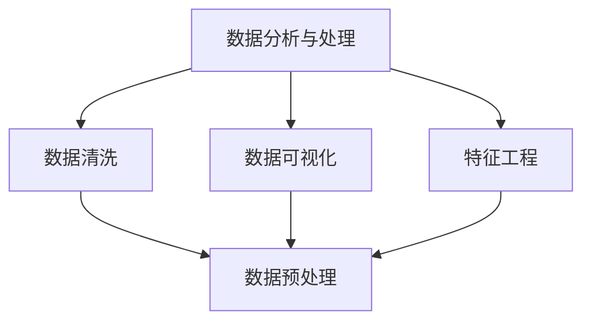

**数学模型与公式：**
$$
\text{特征工程} = f(\text{数据预处理}, \text{业务理解})
$$

**举例说明：** 
假设我们有一份数据集，包含年龄、收入、教育程度等特征。通过数据预处理，我们可以将这些特征转换为适合模型训练的形式。接着，通过特征工程，我们可以提取出更有助于预测目标变量的特征，如收入与年龄的比值、教育程度的二进制编码等。

##### 3.3 机器学习与深度学习

机器学习和深度学习是AI时代的核心技术。机器学习工程师需要掌握各类算法，如线性回归、决策树、支持向量机等。深度学习工程师需要熟悉神经网络架构，如卷积神经网络（CNN）、循环神经网络（RNN）等。

**核心概念与联系：** 机器学习是AI的基础，深度学习是AI的核心。两者相互促进，共同推动AI技术的发展。

**Mermaid流程图：**
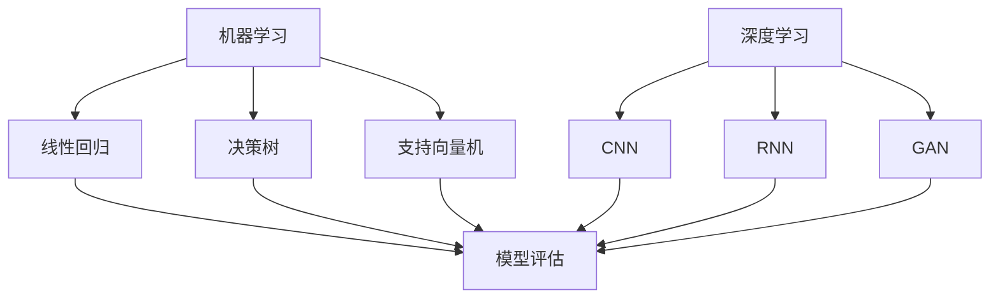

**数学模型与公式：**
$$
\text{神经网络} = \frac{1}{1 + \text{sigmoid}(\text{weights} \cdot \text{input} + \text{bias})}
$$

**举例说明：** 
以卷积神经网络为例，我们可以通过多层卷积和池化操作提取图像的特征。接着，通过全连接层进行分类。例如，在图像分类任务中，输入是一个三维的张量（高度、宽度、通道数），输出是一个一维的向量（类别概率分布）。

---

### 第三部分：AI时代的就业实践

#### 第4章：跨领域技能的培养

##### 4.1 人工智能伦理与社会责任

随着AI技术的应用，人工智能伦理和社会责任成为一个重要议题。AI伦理专家需要关注隐私保护、算法偏见、公平性等问题。

**核心概念与联系：** 人工智能伦理是AI应用的重要保障，社会责任是AI发展的必要条件。

**Mermaid流程图：**
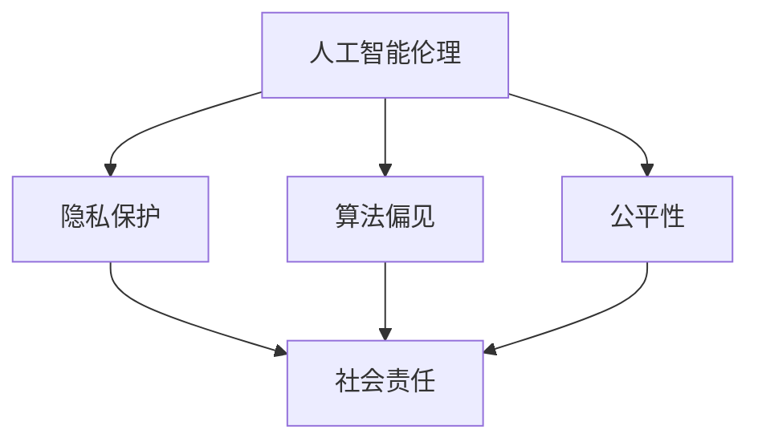

**举例说明：** 
在人脸识别技术中，我们需要关注用户的隐私保护。例如，可以通过加密算法保护用户数据，避免数据泄露。同时，我们需要确保算法的公平性，避免对特定群体产生歧视。

##### 4.2 项目管理与沟通能力

在AI项目中，项目管理和沟通能力至关重要。项目经理需要协调团队成员、确保项目进度，而沟通能力则是项目成功的关键。

**核心概念与联系：** 项目管理是确保项目按时、按质量完成，沟通能力是项目信息传递的有效工具。

**Mermaid流程图：**
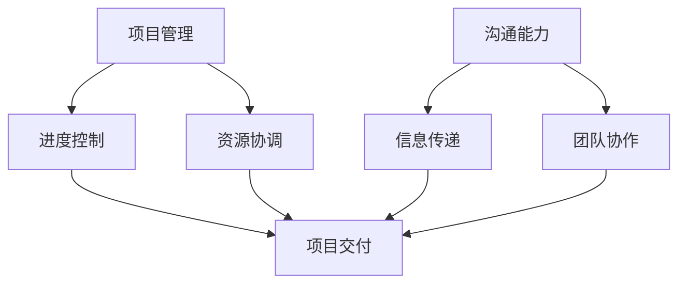

**举例说明：** 
在开发一个AI项目时，项目经理需要确保团队成员了解项目的目标和进展。通过定期的团队会议和进度报告，项目经理可以及时发现并解决问题，确保项目顺利进行。

##### 4.3 创新思维与问题解决能力

在AI时代，创新思维和问题解决能力成为重要的职业素养。创新思维可以帮助我们找到新的解决方案，而问题解决能力则让我们能够有效应对各种挑战。

**核心概念与联系：** 创新思维是推动技术进步的动力，问题解决能力是应对实际问题的基本技能。

**Mermaid流程图：**
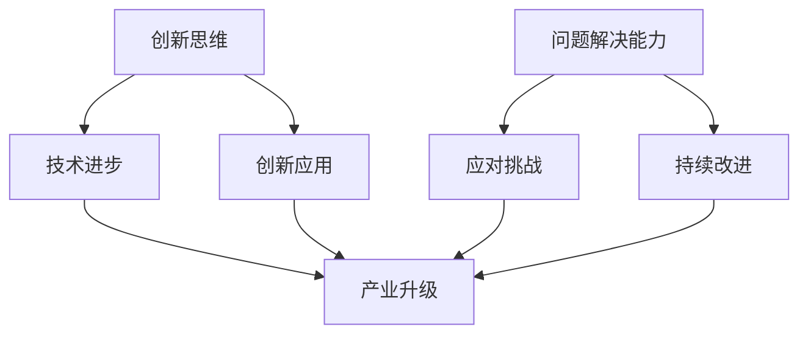

**举例说明：** 
在开发一个智能客服系统时，创新思维可以帮助我们设计出更自然的对话体验。而问题解决能力则让我们能够处理用户的各种复杂问题，确保系统的稳定性和用户满意度。

---

#### 第5章：职业规划与就业指导

##### 5.1 职业发展的路径选择

在AI时代，职业发展的路径选择变得尤为重要。不同领域的职业路径有所不同，但都需要持续学习和技能更新。

**核心概念与联系：** 职业路径是个人职业发展的方向，持续学习是职业发展的动力。

**Mermaid流程图：**
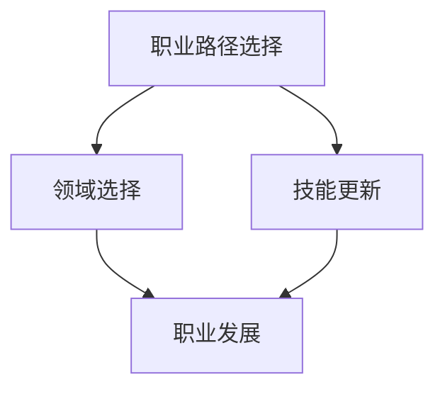

**举例说明：** 
在医疗领域，一个数据科学家的职业路径可能是从数据分析师开始，逐渐成长为数据科学家，最终成为医疗AI项目主管。在这个过程中，持续学习新的技能和知识是必不可少的。

##### 5.2 职业培训与教育资源的获取

职业培训和教育资源对于职业发展至关重要。通过参加在线课程、参加研讨会和实习，可以快速提升自己的技能和知识。

**核心概念与联系：** 职业培训是技能提升的途径，教育资源是知识积累的基础。

**Mermaid流程图：**
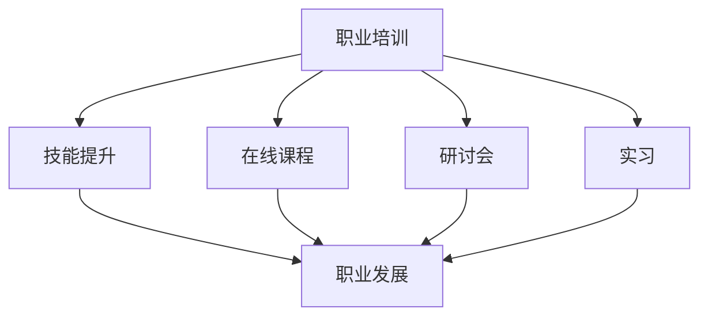

**举例说明：** 
参加Coursera上的《机器学习》课程，不仅可以学习到机器学习的理论知识，还可以通过项目实战提升实际操作能力。类似的在线课程为职业发展提供了丰富的教育资源。

##### 5.3 跨行业就业的策略与方法

跨行业就业在AI时代变得越来越普遍。通过了解不同行业的需求和特点，可以更好地进行跨行业就业规划。

**核心概念与联系：** 跨行业就业是职业发展的灵活性体现，策略与方法是成功跨行业就业的关键。

**Mermaid流程图：**
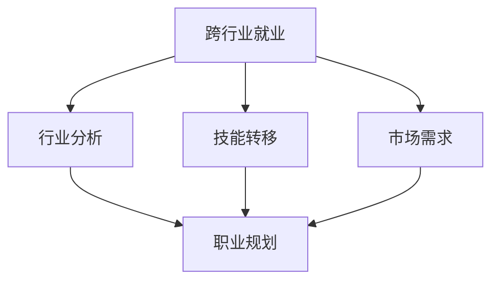

**举例说明：** 
一个有编程背景的数据科学家，可以通过了解金融行业的需求，将自己的技能转移到金融数据分析领域。通过学习金融知识，他可以更好地适应新的工作环境，实现跨行业就业。

---

### 第四部分：未来展望

#### 第6章：AI时代的未来就业趋势

##### 6.1 AI对就业市场的长期影响

AI技术的不断发展将对就业市场产生深远影响。一方面，AI将取代一些重复性高、危险性大的工作，另一方面，AI也将创造新的就业机会，如AI工程师、数据科学家等。

**核心概念与联系：** AI对就业市场的影响是长期的，需要我们从多个角度进行综合分析。

**Mermaid流程图：**
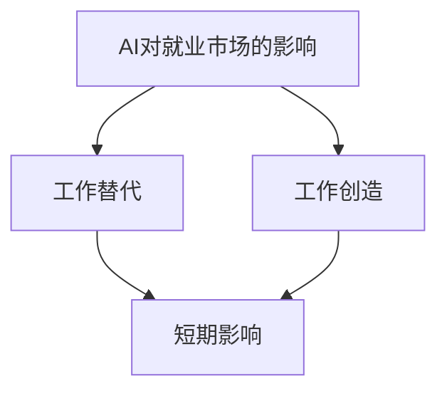

**举例说明：** 
在制造业中，机器人已经逐渐替代了传统的生产线工人。然而，这也催生了新的职业，如机器人维护工程师和AI算法工程师。

##### 6.2 未来就业机会与挑战的预测

未来就业机会主要集中在以下领域：

- **AI研发与应用**：随着AI技术的不断成熟，对AI研发与应用人才的需求将持续增长。
- **数据科学与分析**：数据量的爆发式增长，对数据科学家和分析师的需求也将持续增长。
- **人机交互与界面设计**：随着AI技术的普及，对界面设计和人机交互设计师的需求也将增加。

然而，未来就业也面临着挑战，如技能需求的变化、职业转型的压力等。

**核心概念与联系：** 预测未来就业机会与挑战，需要从技术发展、市场需求等多个角度进行分析。

**Mermaid流程图：**
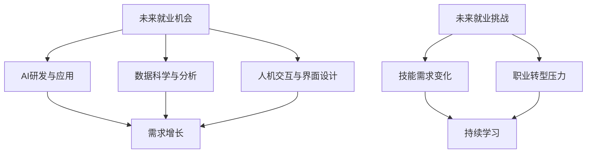

**举例说明：** 
随着AI技术的进步，对于具备AI研发与应用能力的人才需求将大幅增长。然而，这也意味着从业者需要不断学习新的技能，以适应市场的变化。

##### 6.3 职业教育与培训的未来方向

未来职业教育与培训将更加注重实践能力、创新思维和跨学科知识的培养。通过校企合作、在线教育等模式，职业教育将更好地满足市场需求。

**核心概念与联系：** 职业教育与培训的未来方向是培养适应AI时代需求的高素质人才。

**Mermaid流程图：**
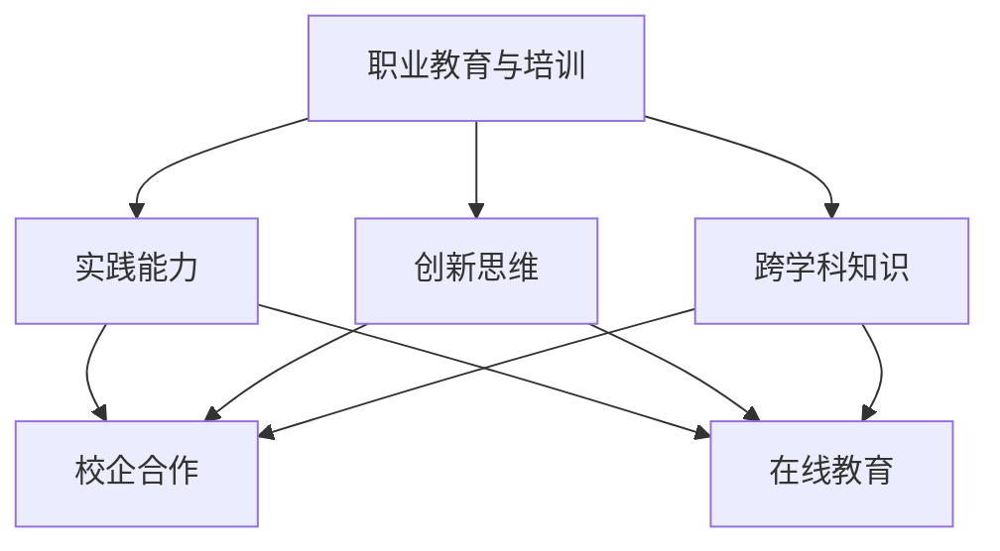

**举例说明：** 
通过校企合作，学生可以在实际项目中积累经验，提高实践能力。在线教育平台则为学生提供了丰富的学习资源，方便他们随时学习新的知识。

---

#### 第7章：人类与人工智能的共存

##### 7.1 人机协作与互补

在AI时代，人类与人工智能的协作将越来越重要。通过人机协作，我们可以充分发挥人类和人工智能的优势，实现更高效的工作。

**核心概念与联系：** 人机协作是人类与人工智能共存的重要方式，互补是协作的关键。

**Mermaid流程图：**
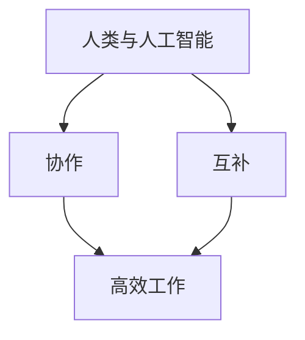

**举例说明：** 
在医疗领域，医生可以利用人工智能进行疾病诊断，而人工智能则可以辅助医生处理大量的病例数据，提高诊断效率。

##### 7.2 AI伦理与社会责任

随着AI技术的应用，AI伦理和社会责任成为人类与人工智能共存的重要议题。我们需要关注隐私保护、算法偏见、公平性等问题，确保AI技术的可持续发展。

**核心概念与联系：** AI伦理与社会责任是人类与人工智能共存的基本原则。

**Mermaid流程图：**
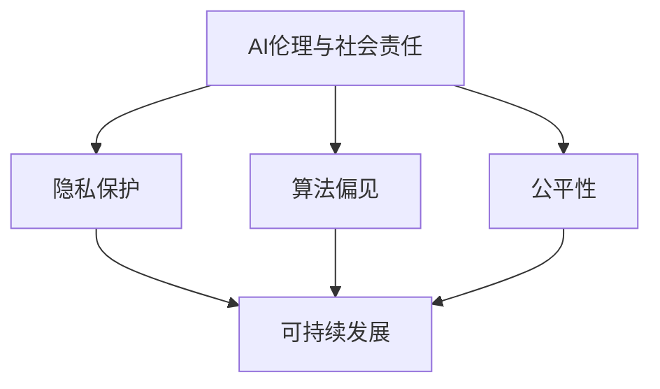

**举例说明：** 
在开发AI系统时，我们需要确保用户数据的隐私保护。例如，可以通过数据加密和匿名化等技术，防止用户数据泄露。

##### 7.3 未来社会的平衡与和谐

在未来社会，人类与人工智能的共存需要我们寻求平衡与和谐。通过政策引导、法律法规的完善，我们可以确保AI技术的健康、有序发展。

**核心概念与联系：** 平衡与和谐是未来社会发展的目标，政策引导和法律法规是实现目标的保障。

**Mermaid流程图：**
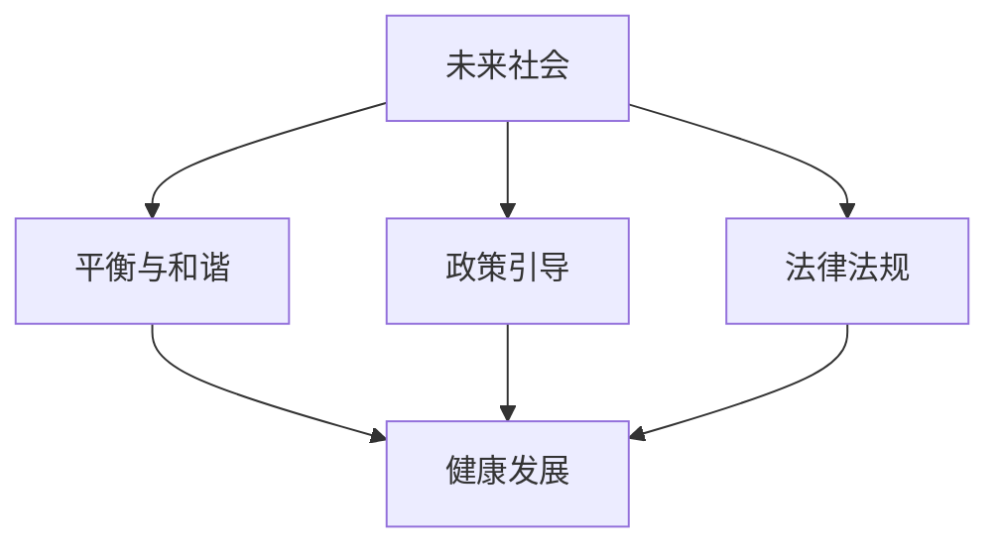

**举例说明：** 
政府可以通过制定相关的政策和法规，规范AI技术的研发和应用，确保AI技术的健康、有序发展。

---

### 附录

#### 附录A：AI学习资源推荐

**A.1 学术论文与研究报告**

- **《人工智能：一种现代方法》**：这是一本经典的AI教材，详细介绍了各种AI算法和应用。

- **《深度学习》**：由Ian Goodfellow等作者撰写的这本书是深度学习领域的权威著作，适合希望深入了解深度学习原理的读者。

**A.2 开源项目与工具**

- **TensorFlow**：Google开发的开源深度学习框架，适合初学者和专业人士使用。

- **PyTorch**：由Facebook开发的开源深度学习框架，具有灵活的动态计算图，适合研究者和开发者。

**A.3 在线课程与教材**

- **Coursera**：提供丰富的AI和深度学习在线课程，包括《深度学习专

