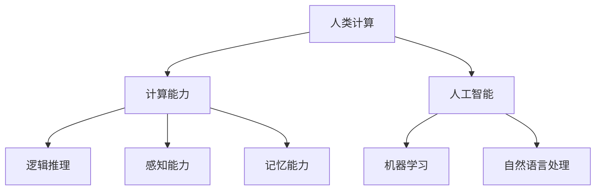
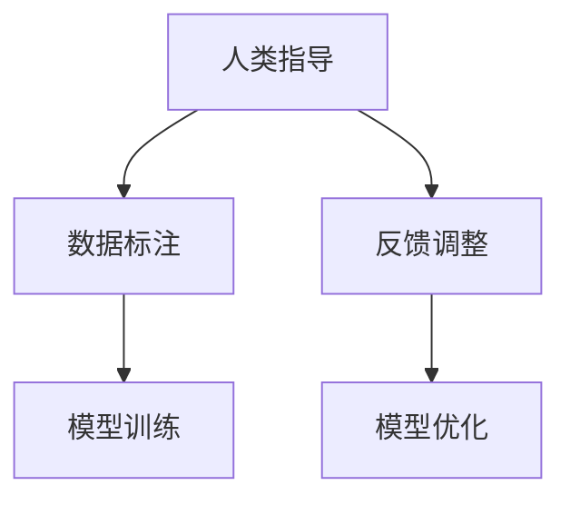

                 

# 文章标题：人类计算：AI时代的社会影响和责任

> 关键词：人类计算，AI时代，社会影响，责任，技术博客

> 摘要：本文深入探讨了AI时代下的人类计算，分析了人类计算与人工智能的互动机制，探讨了AI时代的社会影响和责任。通过详细的案例分析和技术原理剖析，为读者提供了对AI时代的全面理解。

### 第一部分: 人类计算的基础理解

#### 第1章: 人类计算的概念与范畴

**核心概念与联系**

人类计算是指人类运用逻辑思维、感知能力、记忆能力等方式进行信息处理的过程。人类计算与人工智能有着密切的联系，人工智能是模仿和扩展人类计算能力的一种技术手段。

- **人类计算的定义**：人类计算是指人类运用逻辑思维、感知能力、记忆能力等方式进行信息处理的过程。
- **人类计算与人工智能的关系**：人工智能是模仿和扩展人类计算能力的一种技术手段，它依赖于人类计算的原理和方法。
- **人类计算能力的拓展与局限性**：人类计算能力可以通过工具和技术手段进行拓展，但人类计算存在一定的局限性，如处理速度、数据量等方面的限制。

**人类计算与人工智能的 Mermaid 流程图**



**人类计算的核心算法原理**

```plaintext
// 人类逻辑推理算法原理伪代码
function humanLogicReasoning(input, knowledgeBase) {
  if (knowledgeBase.contains(input)) {
    return knowledgeBase.get(input);
  } else {
    // 使用记忆和感知能力进行推理
    return infer(input, knowledgeBase);
  }
}

function infer(input, knowledgeBase) {
  // 这里可以用贝叶斯网络、决策树等算法进行推理
  // 伪代码示意
  for (eachPattern in knowledgeBase) {
    if (patternMatches(input, eachPattern)) {
      return knowledgeBase.get(eachPattern);
    }
  }
  return "未知";
}
```

**数学模型和数学公式**

$$ 
P(A|B) = \frac{P(B|A)P(A)}{P(B)}
$$

**举例说明**

假设已知事件A表示“今天下雨”，事件B表示“地面湿”。根据贝叶斯定理，可以计算出在地面湿的条件下下雨的概率。

$$ 
P(下雨|地面湿) = \frac{P(地面湿|下雨)P(下雨)}{P(地面湿)}
$$

**项目实战**

- **开发环境搭建**

  - 安装Python环境
  - 安装TensorFlow或PyTorch等深度学习库

- **代码实际案例和详细解释说明**

  ```python
  import tensorflow as tf

  # 加载预训练模型
  model = tf.keras.applications.VGG16(weights='imagenet')

  # 准备输入图像
  img = tf.keras.preprocessing.image.load_img('cat.jpg', target_size=(224, 224))
  img_array = tf.keras.preprocessing.image.img_to_array(img)
  img_array = tf.expand_dims(img_array, 0)  # Create a batch

  # 使用模型进行预测
  predictions = model.predict(img_array)
  predicted_class = predictions.argmax(axis=-1)

  # 输出预测结果
  print(f'Predicted class: {predicted_class}')
  ```

- **代码解读与分析**

  代码首先加载了预训练的VGG16模型，这是一种常用的卷积神经网络模型。接着，准备了一幅输入图像，并将其调整为模型所需的尺寸。然后使用模型进行预测，得到图像的类别概率分布。最后输出预测结果。

### 第2章: 人类计算与AI的互动机制

**核心概念与联系**

人类与AI的互动机制是指人类如何引导AI学习、如何与AI协作、以及AI如何辅助人类决策。这种互动机制是AI时代的重要研究课题。

- **人类与AI协作的模型**：人类与AI的协作可以基于数据标注、模型训练、反馈调整等步骤进行。
- **人类引导AI学习的方法**：人类可以通过提供数据、设定目标、调整参数等方式引导AI学习。
- **AI辅助人类决策的机制**：AI可以通过提供数据分析、预测结果、决策建议等方式辅助人类决策。

**人类引导AI学习的 Mermaid 流程图**



**人类引导AI学习的案例实战**

- **数据标注**

  数据标注是AI模型训练的重要步骤。以下是一个数据标注的案例：

  ```python
  # 加载标签数据
  labels = ['cat', 'dog', 'bird']

  # 标注数据
  for label in labels:
      img_path = f"{label}.jpg"
      img = Image.open(img_path)
      img = img.resize((224, 224))
      img_array = img.toarray()
      # 将img_array传入标注函数进行标注
      annotate(img_array, label)
  ```

- **模型训练**

  模型训练是AI学习的核心步骤。以下是一个模型训练的案例：

  ```python
  # 加载训练数据
  train_data = load_train_data()

  # 训练模型
  model = build_model()
  model.fit(train_data, epochs=10, batch_size=32)
  ```

- **反馈调整**

  反馈调整是模型优化的关键步骤。以下是一个反馈调整的案例：

  ```python
  # 进行预测
  predictions = model.predict(test_data)

  # 计算预测准确率
  accuracy = calculate_accuracy(predictions, test_labels)

  # 如果准确率低于预期，则调整模型参数
  if accuracy < desired_accuracy:
      adjust_model_parameters(model)
  ```

**小结**

人类计算与AI的互动机制是AI时代的重要研究课题。通过数据标注、模型训练、反馈调整等步骤，人类可以引导AI学习，并使其更好地服务于人类。

### 结论

人类计算是AI时代的基础，它为AI的发展提供了理论支持和实践指导。在AI时代，人类计算与AI的互动机制将不断优化，为社会带来更多的价值。同时，人类也需要承担相应的责任，确保AI技术的发展符合伦理和道德标准，为人类社会带来积极的影响。

**作者：AI天才研究院/AI Genius Institute & 禅与计算机程序设计艺术 /Zen And The Art of Computer Programming**

