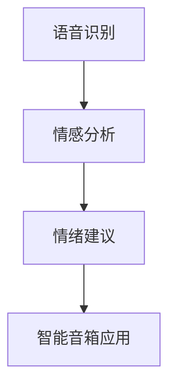
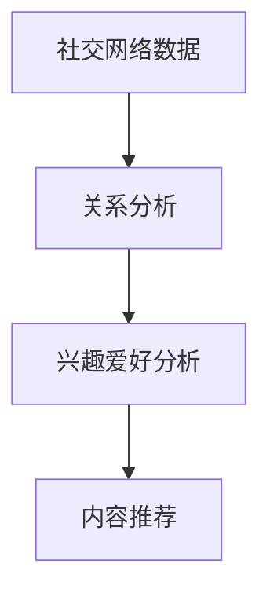
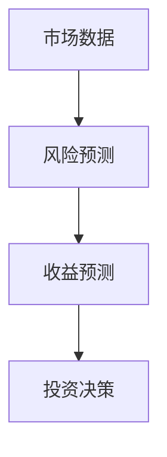
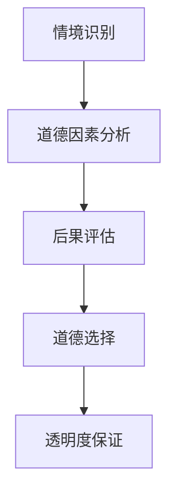
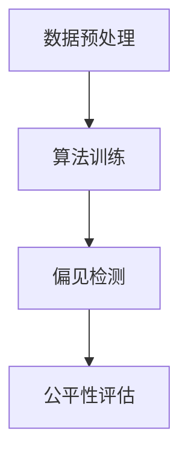
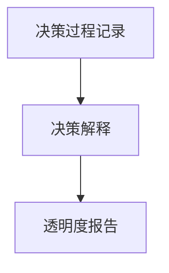
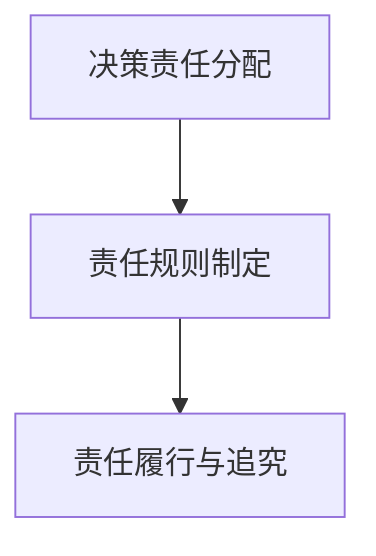
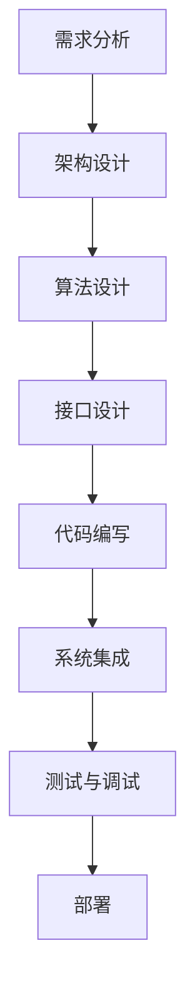
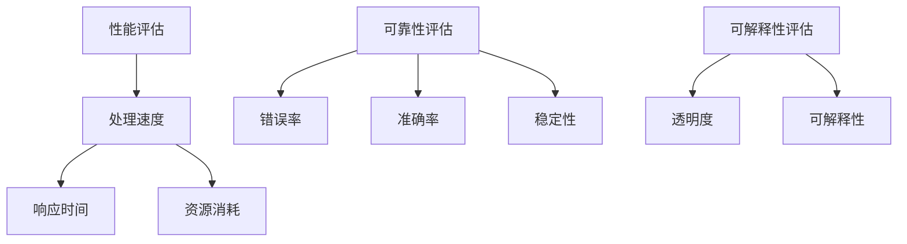
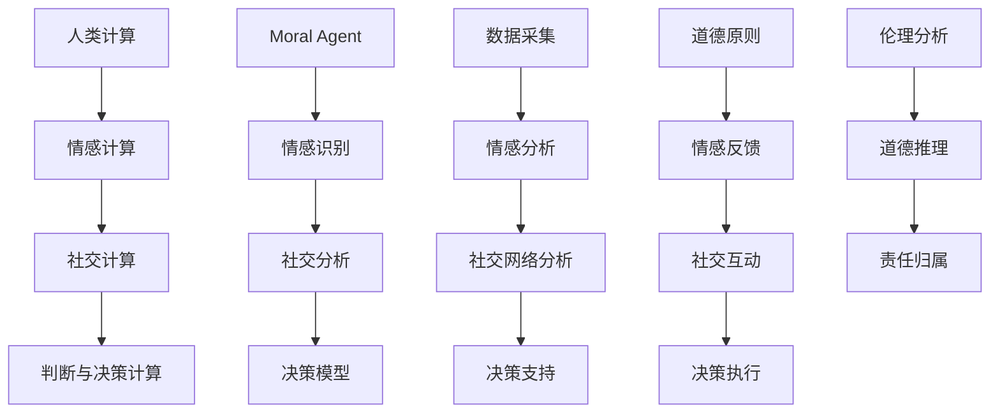

                 


### 《人类计算：在AI时代增强道德代理》

#### 引言

在人工智能（AI）迅猛发展的时代，人类计算与AI的结合成为了科技领域的一个热点。AI技术的进步不仅改变了我们的生活方式，也对伦理道德提出了新的挑战。人类计算作为一种结合人类智慧和机器效率的技术，其在AI时代扮演着至关重要的角色。本书旨在探讨如何在AI时代增强道德代理，通过人类计算技术来提高AI系统的伦理决策能力。

关键词：人工智能、人类计算、道德代理、伦理决策、AI伦理

摘要：本书首先介绍了人类计算和AI时代的背景，探讨了人类计算的基本原理及其与AI的关系。随后，本书深入分析了道德代理的理论基础和实现方法，重点讨论了道德代理在关键领域中的应用。最后，本书展望了未来人类计算与AI伦理的发展趋势，提出了人类计算伦理教育的必要性。

---

#### 第一部分：引论

## 第1章：人类计算与AI时代的背景

### 1.1 AI时代的技术变革

#### 1.1.1 AI的崛起及其对社会的影响

随着深度学习、神经网络等技术的突破，人工智能（AI）迎来了前所未有的发展。AI技术的崛起不仅改变了传统行业的运作模式，也带来了深刻的社会影响。从医疗诊断到自动驾驶，AI的应用场景越来越广泛。然而，AI技术的发展也引发了一系列伦理和社会问题，如隐私保护、算法公平性、技术失业等。

- **隐私保护**：AI技术的发展使得数据收集和分析能力大幅提升，但这也带来了隐私泄露的风险。如何保护个人隐私成为了一个亟待解决的问题。

- **算法公平性**：AI算法在决策过程中可能存在偏见，导致不公平的结果。如何确保算法的公平性，避免歧视现象的发生，是当前AI领域的一个重要挑战。

- **技术失业**：随着AI技术的广泛应用，许多传统工作岗位可能会被自动化取代，这引发了关于未来就业的担忧。

### 1.2 人类计算的概念与定义

人类计算是一种结合人类智慧和机器效率的技术，它通过模拟人类思维过程来增强计算机系统的智能。人类计算的核心是情感计算、社交计算和判断与决策计算。

- **情感计算**：情感计算研究如何让计算机理解和表达情感，从而更好地与人类互动。

- **社交计算**：社交计算关注计算机如何模拟人类的社会行为，如交流、协作和社交网络分析。

- **判断与决策计算**：判断与决策计算研究如何让计算机模拟人类的决策过程，从而提高其决策能力。

### 1.3 道德代理的需求与挑战

道德代理是指具有道德责任意识的计算机系统，能够在复杂的情境中做出符合道德规范的决策。在AI时代，道德代理的需求愈发迫切，因为AI系统在医疗、金融、交通等关键领域的决策可能直接关系到人类的生命和财产安全。

- **道德代理的定义**：道德代理是一种具有道德责任意识的计算机系统，能够在道德上做出正确的决策。

- **道德代理的需求**：随着AI技术的广泛应用，道德代理的需求日益增加，特别是在医疗、金融、交通等领域。

- **道德代理的挑战**：道德代理的实现面临着诸多挑战，包括道德原则的确定、道德计算的复杂性以及道德责任的归属等。

### 1.4 本书结构安排与目标

本书分为七个部分，首先介绍了人类计算和AI时代的背景，随后深入探讨了人类计算的核心原理、与AI的关系、道德代理的理论基础、实现方法以及在关键领域中的应用。最后，本书展望了未来人类计算与AI伦理的发展趋势，提出了人类计算伦理教育的必要性。

- **各章节内容概述**：

  - 第1章：介绍人类计算与AI时代的背景。

  - 第2章：探讨人类计算的核心原理。

  - 第3章：分析人类计算与AI的关系。

  - 第4章：阐述道德代理的理论基础。

  - 第5章：讨论道德代理的实现方法。

  - 第6章：分析道德代理在关键领域中的应用。

  - 第7章：展望未来人类计算与AI伦理的发展趋势。

---

在接下来的章节中，我们将逐一探讨人类计算的核心原理、与AI的关系、道德代理的理论基础和实现方法，并通过具体案例深入分析道德代理在关键领域中的应用。希望通过本书的探讨，能够为AI时代的伦理道德决策提供有益的思考和实践指导。让我们开始这段探索之旅吧！

---

#### 第2章：人类计算的核心原理

## 2.1 情感计算

### 2.1.1 情感计算的基本原理

情感计算（Affective Computing）是计算机科学中的一个分支，旨在研究如何使计算机具备理解和表达情感的能力。情感计算的核心思想是模拟人类的情感认知过程，从而实现更自然、更智能的人机交互。

#### 情感计算的关键要素：

1. **情感识别**：情感识别是情感计算的基础，通过分析语音、面部表情、生理信号等，计算机可以识别用户的情感状态。

2. **情感生成**：情感生成是指计算机根据情感识别的结果，产生相应的情感反应，如语音合成、面部表情等。

3. **情感理解**：情感理解是更高层次的任务，计算机需要理解情感的语义和内涵，从而做出更准确的判断和决策。

### 情感计算的基本原理：

情感计算的基本原理可以概括为以下几个步骤：

1. **数据采集**：通过传感器、麦克风等设备收集用户的情感信息，如语音、面部表情、生理信号等。

2. **情感特征提取**：对采集到的数据进行分析和处理，提取情感特征，如音调、语速、面部动作等。

3. **情感识别**：利用机器学习算法对情感特征进行分类，识别用户的情感状态。

4. **情感理解**：对识别出的情感状态进行语义分析，理解其背后的情感内涵。

5. **情感反馈**：根据情感理解的结果，计算机产生相应的情感反应，如语音合成、面部表情等，与用户进行互动。

### 伪代码：情感计算的基本步骤

```
function emotion_computing(input_data):
    # 数据采集
    sensor_data = collect_data(input_data)
    
    # 情感特征提取
    emotion_features = extract_features(sensor_data)
    
    # 情感识别
    emotion_state = emotion_recognition(emotion_features)
    
    # 情感理解
    emotion_meaning = emotion_understanding(emotion_state)
    
    # 情感反馈
    feedback = generate_feedback(emotion_meaning)
    return feedback
```

## 2.2 社交计算

### 2.2.1 社交计算的重要性

社交计算（Social Computing）是研究计算机如何模拟人类社交行为的领域。随着互联网和社交媒体的普及，社交计算在社会网络分析、协作系统、推荐系统等领域发挥着重要作用。

#### 社交计算的关键要素：

1. **社交网络**：社交网络是社交计算的核心，通过分析社交网络的结构和属性，可以揭示人际关系、群体动态等。

2. **用户行为**：用户行为是社交计算的重要数据来源，通过分析用户在社交平台上的行为，可以了解用户的需求和偏好。

3. **信息传播**：信息传播是社交计算的一个重要现象，研究信息如何在社交网络中传播，对于理解社会动态、传播策略等具有重要意义。

### 社交计算的重要性：

1. **社会网络分析**：通过分析社交网络的结构和属性，可以揭示社会群体、影响力分布等，为社会组织和治理提供参考。

2. **协作系统**：社交计算技术可以用于协作系统的设计和优化，提高团队合作效率。

3. **推荐系统**：基于社交计算技术，可以构建更准确的推荐系统，满足用户个性化需求。

### 社交计算的基本原理：

社交计算的基本原理可以概括为以下几个步骤：

1. **社交网络构建**：通过数据采集和分析，构建社交网络的拓扑结构。

2. **用户行为分析**：对用户在社交平台上的行为进行统计和分析，提取用户特征和偏好。

3. **信息传播分析**：研究信息如何在社交网络中传播，分析传播规律和影响因素。

4. **社交网络应用**：将社交计算技术应用于实际场景，如社会网络分析、协作系统、推荐系统等。

### 伪代码：社交计算的基本步骤

```
function social_computing(input_data):
    # 社交网络构建
    social_network = construct_network(input_data)
    
    # 用户行为分析
    user_behavior = analyze_behavior(social_network)
    
    # 信息传播分析
    info_spread = analyze_spread(social_network)
    
    # 社交网络应用
    application = apply_network(social_network, user_behavior, info_spread)
    return application
```

## 2.3 判断与决策计算

### 2.3.1 人类决策的心理机制

判断与决策计算（Judgment and Decision Making Computing）是研究如何让计算机模拟人类决策过程的技术。人类决策是一个复杂的过程，涉及到认知、情感、经验等多个因素。

#### 人类决策的心理机制：

1. **感知与评估**：人类通过感知外部信息，对其进行评估和分类。

2. **偏好与权衡**：在多个选项中，人类会根据偏好和权衡进行选择。

3. **风险与收益**：在决策过程中，人类会考虑风险与收益，做出最优的选择。

4. **情绪与情感**：情绪和情感在决策过程中起着重要作用，影响决策的结果。

### 人类决策的心理机制：

1. **启发式与规则**：人类在决策过程中往往依赖于启发式策略和简单规则，如“满意原则”、“代表性原则”等。

2. **认知偏差**：人类在决策过程中存在多种认知偏差，如“确认偏误”、“锚定效应”等，这些偏差会影响决策的准确性。

3. **经验与学习**：人类通过经验积累和学习，不断提高决策能力。

### 判断与决策计算的基本原理：

判断与决策计算的基本原理可以概括为以下几个步骤：

1. **问题定义**：明确决策的目标和约束条件。

2. **信息收集**：收集与决策相关的信息，如数据、文献等。

3. **评估与分类**：对收集到的信息进行评估和分类。

4. **偏好与权衡**：根据偏好和权衡，选择最优的决策方案。

5. **决策执行**：执行决策方案，并评估决策结果。

### 伪代码：判断与决策计算的基本步骤

```
function judgment_decision_computing(problem, information):
    # 问题定义
    defined_problem = define_problem(problem)
    
    # 信息收集
    collected_information = collect_information(defined_problem)
    
    # 评估与分类
    assessed_information = assess_information(collected_information)
    
    # 偏好与权衡
    preference_weighting = calculate_preferenc
``` < muffin | user |>

### 《人类计算：在AI时代增强道德代理》

#### 第二部分：人类计算与AI的关系

## 第3章：人类计算与AI的关系

### 3.1 AI在人类计算中的应用

人工智能在人类计算中发挥着重要作用，其应用场景广泛，包括情感计算、社交计算和判断与决策计算等领域。

#### 3.1.1 AI辅助人类计算的案例

**情感计算**：AI技术可以通过分析语音、面部表情和生理信号等，识别用户的情感状态。例如，智能音箱可以通过用户的语音语调识别其情绪，从而提供更合适的音乐或建议。



**社交计算**：AI技术可以分析社交网络数据，揭示社会关系和群体动态。例如，推荐系统可以通过分析用户的社交关系和兴趣爱好，为其推荐感兴趣的内容或朋友。



**判断与决策计算**：AI技术可以通过机器学习算法，模拟人类的判断与决策过程。例如，金融领域的投资决策系统可以通过分析市场数据，预测投资风险和收益，帮助投资者做出更好的决策。



### 3.2 AI对人类计算的影响

AI技术的发展不仅丰富了人类计算的应用场景，也对人类计算的能力产生了深远的影响。

#### 3.2.1 AI对人类计算能力的提升

1. **数据处理能力**：AI技术具有强大的数据处理能力，可以处理海量数据，从中提取有价值的信息。

2. **计算速度**：与人类相比，AI系统在执行计算任务时具有更快的速度和更高的精度。

3. **自动化**：AI技术可以实现计算任务的自动化，减少人类的工作负担，提高工作效率。

#### 3.2.2 AI对人类计算的影响

1. **人类计算能力的提升**：AI技术可以辅助人类完成复杂的计算任务，提高人类计算能力。

2. **工作模式的改变**：AI技术的应用改变了传统的工作模式，推动了智能化、自动化的进程。

3. **人类角色的转变**：在AI时代，人类将从执行重复性计算任务的角色转变为更高级的决策者和创新者。

### 3.3 AI在道德代理中的角色

道德代理是一种具有道德责任意识的计算机系统，能够在复杂的情境中做出符合道德规范的决策。AI技术在道德代理中发挥着关键作用。

#### 3.3.1 AI在道德决策中的作用

1. **道德判断**：AI技术可以模拟人类的道德判断过程，对复杂的道德问题进行评估。

2. **伦理分析**：AI技术可以对道德决策的伦理后果进行分析，提供道德决策的依据。

3. **情境适应**：AI技术可以根据不同的情境，调整道德代理的行为，确保决策的合理性和符合道德规范。

### 伪代码：道德代理的基本框架

```
class MoralAgent:
    def __init__(self):
        self伦理规则库 = load_ethical_rules()
        
    def make_decision(self, situation):
        # 分析情境
        analyzed_situation = analyze_situation(situation)
        
        # 应用伦理规则
        decision = apply_ethical_rules(analyzed_situation, self伦理规则库)
        
        # 反馈决策结果
        feedback = provide_feedback(decision)
        return feedback
```

在接下来的章节中，我们将进一步探讨道德代理的理论基础和实现方法，并分析道德代理在关键领域中的应用。通过这些讨论，我们将更好地理解人类计算与AI之间的关系，以及如何利用AI技术增强道德代理的能力。

---

#### 第4章：道德代理的理论基础

## 4.1 道德哲学的基本概念

### 4.1.1 道德原则与道德准则

道德哲学是研究道德原则和道德准则的学科。道德原则是道德判断的基础，而道德准则是道德行为的具体规范。

#### 道德原则：

1. **公正原则**：公正原则要求平等对待每个人，不偏袒任何一方。

2. **尊重原则**：尊重原则强调尊重他人的权利和尊严，包括隐私权、自由权等。

3. **利益最大化原则**：利益最大化原则追求整体利益的最大化，而非个人利益的最大化。

#### 道德准则：

1. **诚实守信**：诚实守信是道德准则的核心，要求人们在言行中保持真实和诚信。

2. **助人为乐**：助人为乐强调关爱他人，帮助他人，促进社会的和谐与进步。

3. **遵守法律法规**：遵守法律法规是道德准则的基本要求，要求人们在行为中遵守国家的法律法规。

### 4.2 道德计算的理论框架

道德计算是研究如何将道德原则和道德准则应用于计算系统的学科。道德计算的理论框架包括以下几个核心组成部分：

#### 4.2.1 道德计算的模型构建

道德计算的模型构建是道德计算的核心任务。道德计算模型需要考虑以下几个关键因素：

1. **情境识别**：识别道德计算所处的具体情境，如医疗、金融、交通等领域。

2. **道德规则库**：建立包含道德原则和道德准则的规则库，用于指导道德决策。

3. **决策模型**：构建基于情境和道德规则的决策模型，用于生成道德决策。

4. **道德推理**：道德推理是道德计算的关键，通过逻辑推理和伦理分析，确保道德决策的合理性和符合道德规范。

### 伪代码：道德计算模型的基本框架

```
class MoralComputingModel:
    def __init__(self, ethical_rules):
        self.ethical_rules = ethical_rules
        
    def moral_decision(self, situation):
        # 情境识别
        analyzed_situation = analyze_situation(situation)
        
        # 应用道德规则
        decision = apply_ethical_rules(analyzed_situation, self.ethical_rules)
        
        # 道德推理
        reasoned_decision = moral_reasoning(decision)
        
        return reasoned_decision
```

#### 4.2.2 道德计算的关键技术

1. **情境识别技术**：情境识别技术用于识别道德计算所处的具体情境，如使用自然语言处理技术解析文本，提取关键信息。

2. **道德规则库构建技术**：道德规则库构建技术用于建立包含道德原则和道德准则的规则库，如使用本体论方法构建道德规则库。

3. **决策模型构建技术**：决策模型构建技术用于构建基于情境和道德规则的决策模型，如使用机器学习技术构建决策模型。

4. **道德推理技术**：道德推理技术用于确保道德决策的合理性和符合道德规范，如使用形式逻辑和伦理分析技术。

### 4.3 伦理学在AI开发中的应用

#### 4.3.1 伦理学在AI设计中的重要性

伦理学在AI开发中具有重要意义，因为AI系统的设计和应用可能涉及道德和伦理问题。伦理学提供了关于正确和错误、善与恶的基本原则，为AI系统的道德决策提供了理论基础。

1. **伦理审查**：在AI系统开发过程中，进行伦理审查以确保其设计和应用符合伦理规范。

2. **伦理决策**：在AI系统面临道德决策时，伦理学提供了决策的依据，如使用伦理框架进行决策。

3. **责任归属**：明确AI系统在道德决策中的责任归属，如责任分配和责任规避。

### 伪代码：AI系统的伦理审查

```
function ethical_review(AI_system):
    # 检查AI系统设计是否符合伦理规范
    compliance = check_compliance(AI_system, ethical_standards)
    
    # 分析AI系统可能产生的道德风险
    moral_risks = analyze_moral_risks(AI_system)
    
    # 提出伦理改进建议
    recommendations = propose_improvements(AI_system, moral_risks)
    
    return compliance, recommendations
```

通过本章的讨论，我们了解了道德哲学的基本概念、道德计算的理论框架以及在AI开发中伦理学的重要性。这些理论基础为道德代理的设计和实现提供了重要的指导。在接下来的章节中，我们将进一步探讨道德代理的实现方法，并通过具体案例展示道德代理在实际应用中的效果。

---

#### 第5章：道德代理的实现方法

## 5.1 道德算法的设计原则

道德代理的核心在于其道德算法的设计。道德算法的设计原则决定了道德代理的决策是否能够符合道德规范和伦理标准。以下是道德算法设计的一些关键原则：

#### 5.1.1 完整性原则

完整性原则要求道德算法在决策过程中必须全面考虑所有相关的道德因素，确保决策的全面性和准确性。这包括识别潜在的道德困境、评估各种道德选择的后果，以及确保决策过程中的透明度和可解释性。

### 伪代码：完整性原则的实现



#### 5.1.2 公平性原则

公平性原则要求道德算法在决策过程中必须遵循公正和无偏见的原则，确保所有个体都受到平等对待。这包括避免算法偏见、消除歧视性决策，以及确保资源分配的公平性。

### 伪代码：公平性原则的实现



#### 5.1.3 可解释性原则

可解释性原则要求道德算法的决策过程必须是透明和可理解的，以便人类能够审查和验证决策的合理性。这包括提供决策依据、解释决策过程，以及确保算法的可解释性不因规模和复杂度而降低。

### 伪代码：可解释性原则的实现



#### 5.1.4 责任原则

责任原则要求道德算法的决策结果必须明确责任归属，确保在决策过程中任何错误或不良后果都有明确的负责方。这包括设计责任分配机制、制定责任承担规则，以及确保责任的履行和追究。

### 伪代码：责任原则的实现



## 5.2 道德代理的开发流程

道德代理的开发流程包括多个阶段，从需求分析、设计、实现到测试和部署。以下是道德代理开发流程的详细步骤：

### 5.2.1 需求分析

需求分析是道德代理开发的起点，旨在明确道德代理需要解决的问题和目标。这一阶段包括：

- **确定道德规范**：明确道德代理需要遵循的道德规范和伦理标准。

- **识别应用场景**：分析道德代理将在哪些领域和应用场景中发挥作用。

- **定义功能需求**：详细描述道德代理需要实现的功能，如情境识别、道德决策、后果评估等。

### 5.2.2 设计阶段

设计阶段是道德代理开发的核心，包括以下几个方面：

- **架构设计**：设计道德代理的整体架构，包括数据层、逻辑层和表现层。

- **算法设计**：设计道德算法的具体实现，包括情境分析、道德规则库的构建和决策模型。

- **接口设计**：设计道德代理与外部系统交互的接口，确保数据交换的规范和安全性。

### 5.2.3 实现阶段

实现阶段是将设计转化为实际代码的过程，包括以下几个方面：

- **代码编写**：编写道德代理的代码，实现设计阶段定义的功能和算法。

- **系统集成**：将道德代理集成到目标系统中，确保与其他组件的协同工作。

- **测试与调试**：对道德代理进行功能测试和性能测试，确保其稳定性和可靠性。

### 5.2.4 测试和部署

测试和部署是道德代理开发的重要环节，包括以下几个方面：

- **功能测试**：验证道德代理是否实现了设计阶段定义的功能。

- **性能测试**：评估道德代理的处理速度、响应时间和资源消耗等性能指标。

- **部署**：将道德代理部署到实际应用环境中，进行实际应用和监测。

### 伪代码：道德代理开发流程



## 5.3 道德代理的评估与测试

道德代理的评估与测试是确保其性能和可靠性的关键步骤。以下是道德代理评估与测试的几个关键方面：

### 5.3.1 性能评估

性能评估用于衡量道德代理在不同情境下的处理能力和响应速度。评估指标包括：

- **处理速度**：道德代理处理道德决策的速度。

- **响应时间**：道德代理对外部请求的响应时间。

- **资源消耗**：道德代理运行过程中消耗的计算资源和存储资源。

### 5.3.2 可靠性评估

可靠性评估用于衡量道德代理在长期运行中的稳定性和准确性。评估指标包括：

- **错误率**：道德代理在决策过程中出现错误的概率。

- **准确率**：道德代理做出正确决策的概率。

- **稳定性**：道德代理在长时间运行中保持稳定性和一致性的能力。

### 5.3.3 可解释性评估

可解释性评估用于衡量道德代理的决策过程是否透明和可理解。评估指标包括：

- **透明度**：道德代理决策过程的透明度，即人类是否能够理解和审查决策过程。

- **可解释性**：道德代理提供的决策解释是否清晰和准确。

### 伪代码：道德代理评估与测试



通过上述讨论，我们详细探讨了道德代理的设计原则、开发流程和评估测试方法。这些方法为道德代理的构建和实际应用提供了全面的指导。在接下来的章节中，我们将分析道德代理在关键领域中的应用，通过具体案例展示道德代理的实际效果和潜在价值。

---

#### 第6章：道德代理在关键领域中的应用

## 6.1 社交机器人

### 6.1.1 社交机器人的道德考量

社交机器人是近年来快速发展的人工智能应用，旨在模拟人类的社交行为，与人类进行互动。随着社交机器人的广泛应用，其道德考量变得尤为重要。

#### 社交机器人的道德挑战：

1. **隐私保护**：社交机器人需要处理大量的个人数据，如聊天记录、行为习惯等。如何保护用户隐私，防止数据泄露，是一个重要的道德问题。

2. **公平性**：社交机器人应确保对所有用户的公平对待，避免因算法偏见导致的歧视现象。

3. **情感模拟**：社交机器人需要模拟人类的情感表达，但如何做到既真实又不过度，避免情感滥用，是一个道德挑战。

#### 案例分析：

以某社交平台上的聊天机器人为例，该机器人被设计用于与用户进行日常聊天，提供情感支持和信息查询服务。以下是其道德考量：

1. **隐私保护**：该聊天机器人采用数据加密和匿名化处理，确保用户隐私不受侵犯。此外，机器人仅收集必要的用户信息，并在使用完毕后及时删除。

2. **公平性**：机器人采用无偏见算法，确保对所有用户的公平对待。通过定期更新和训练，机器人不断优化其对话策略，减少歧视现象。

3. **情感模拟**：机器人通过情感分析技术和自然语言处理技术，模拟用户的情感状态。然而，机器人也设置了情感阈值，一旦检测到用户情感过度波动，会自动提醒用户寻求专业帮助。

### 6.2 自动驾驶汽车

### 6.2.1 自动驾驶汽车的伦理挑战

自动驾驶汽车是另一个重要的人工智能应用领域，其伦理挑战同样不容忽视。自动驾驶汽车在复杂交通环境中需要做出快速而准确的道德决策，如如何处理意外情况、如何平衡乘客安全与行人安全等。

#### 自动驾驶汽车的伦理挑战：

1. **意外处理**：在突发情况下，自动驾驶汽车需要迅速做出决策，以最小化损失。但如何确定最佳决策方案，同时确保乘客和行人的安全，是一个伦理难题。

2. **责任归属**：在事故发生时，如何确定责任归属，包括驾驶员、汽车制造商和软件开发商等，是一个复杂的法律和道德问题。

3. **隐私侵犯**：自动驾驶汽车会收集大量交通和环境数据，如何保护用户隐私，防止数据滥用，是一个重要的道德问题。

#### 案例分析：

以某自动驾驶汽车公司开发的自动驾驶出租车为例，以下是其伦理考量：

1. **意外处理**：该公司采用了多层安全措施，包括实时监控、自动驾驶模式和手动驾驶模式。在突发情况下，自动驾驶系统会立即切换到手动驾驶模式，并将决策过程记录下来，以便后续分析和改进。

2. **责任归属**：该公司制定了明确的责任分配规则，一旦发生事故，会根据事故原因和责任比例，确定责任归属。

3. **隐私侵犯**：该公司对用户数据进行严格加密和匿名化处理，确保用户隐私不受侵犯。同时，用户有权选择是否参与数据收集和分析。

### 6.3 金融科技

### 6.3.1 金融科技中的道德问题

金融科技（FinTech）是利用人工智能、区块链等新兴技术改变传统金融业务模式的领域。然而，金融科技的发展也带来了一系列道德问题，如算法偏见、金融欺诈和用户隐私保护等。

#### 金融科技中的道德问题：

1. **算法偏见**：金融科技公司的算法可能存在偏见，导致不公正的决策。例如，某些贷款算法可能对某些特定群体存在歧视。

2. **金融欺诈**：金融科技产品可能成为金融欺诈的新工具，如利用人工智能进行欺诈交易。

3. **用户隐私保护**：金融科技产品需要收集大量用户数据，如何保护用户隐私，防止数据泄露，是一个重要道德问题。

#### 案例分析：

以某金融科技公司开发的智能投顾平台为例，以下是其道德考量：

1. **算法偏见**：该公司采用了多种方法来减少算法偏见，包括数据多样化、算法透明化和用户反馈机制。通过不断优化算法，确保决策的公平性和准确性。

2. **金融欺诈**：该公司建立了强大的安全防护系统，包括实时监控、交易验证和用户教育等，以防止金融欺诈。

3. **用户隐私保护**：该公司对用户数据进行严格加密和匿名化处理，确保用户隐私不受侵犯。同时，用户有权随时访问、修改和删除其数据。

通过本章的讨论，我们分析了道德代理在社交机器人、自动驾驶汽车和金融科技等关键领域中的应用。这些案例展示了道德代理在实际场景中的效果和潜在价值。在接下来的章节中，我们将进一步探讨道德代理的未来发展趋势和面临的挑战。

---

#### 第7章：未来展望与挑战

## 7.1 道德代理的发展趋势

随着人工智能技术的不断进步，道德代理的发展趋势也日益明朗。以下是道德代理可能的发展方向：

### 7.1.1 智能化

未来，道德代理将变得更加智能化，能够处理更加复杂的道德决策。通过深度学习和强化学习等技术，道德代理将能够从大量数据中学习，不断优化其道德决策能力。

### 7.1.2 个性化

道德代理将更加注重个性化服务，根据不同用户的需求和偏好，提供定制化的道德决策方案。通过个性化推荐和情境识别技术，道德代理将能够更好地满足用户的需求。

### 7.1.3 自动化

道德代理的自动化程度将不断提高，能够在更多场景中实现自主决策和执行。这包括在自动驾驶、医疗诊断和金融等领域，道德代理将能够自动处理复杂的道德决策。

### 7.1.4 集成化

道德代理将与其他人工智能技术集成，形成更加强大的智能系统。例如，道德代理与自然语言处理、计算机视觉等技术的结合，将使得智能系统的道德决策更加全面和准确。

## 7.2 AI时代的人类计算伦理

在AI时代，人类计算的伦理问题愈发突出。以下是一些需要关注的重要伦理问题：

### 7.2.1 道德责任归属

随着道德代理在更多领域中的应用，如何明确道德责任归属成为一个重要问题。需要制定明确的法律法规，确保在道德决策过程中，各个责任方能够承担相应的责任。

### 7.2.2 用户隐私保护

随着人工智能技术的发展，用户隐私保护成为一个严峻挑战。需要制定严格的隐私保护政策和法规，确保用户数据的安全和隐私。

### 7.2.3 算法公平性

算法偏见和歧视是一个亟待解决的问题。需要通过多种手段，如数据多样化、算法透明化和用户反馈机制等，确保算法的公平性和公正性。

### 7.2.4 道德决策透明性

道德代理的决策过程需要透明，以便用户和监管机构能够审查和验证决策的合理性。需要开发可解释的道德算法，提高道德决策的透明度和可理解性。

## 7.3 人类计算与AI伦理教育

为了应对AI时代带来的伦理挑战，人类计算与AI伦理教育变得至关重要。以下是几个关键建议：

### 7.3.1 教育内容

人类计算与AI伦理教育应涵盖以下内容：

- **道德哲学基础**：学习道德原则和伦理理论，为道德决策提供理论基础。

- **伦理案例分析**：通过案例分析，了解道德决策的实际应用和挑战。

- **算法伦理**：学习算法偏见、隐私保护、算法公平性等关键问题。

- **法律与政策**：了解相关法律法规和政策，确保道德决策的合法性和合规性。

### 7.3.2 教育方法

人类计算与AI伦理教育应采用多种教学方法，以提高学生的参与度和理解力：

- **案例研究**：通过案例分析，让学生了解道德决策的实际应用。

- **模拟训练**：通过模拟训练，让学生在实践中掌握道德决策的方法。

- **讨论与辩论**：鼓励学生进行讨论和辩论，培养批判性思维和道德判断能力。

- **跨学科学习**：结合计算机科学、伦理学、法学等学科，提高学生的综合素养。

## 7.4 总结与展望

通过本章的讨论，我们探讨了道德代理的发展趋势和伦理挑战，强调了人类计算与AI伦理教育的重要性。在未来，道德代理将在更多领域发挥重要作用，但同时也需要面对诸多伦理挑战。通过加强伦理教育和制定相关法律法规，我们可以更好地应对这些挑战，确保人工智能技术的可持续发展。

---

### 附录

#### 附录A：相关资源与进一步阅读

- **书籍**：

  - [1] Russell, S., & Norvig, P. (2016). 《人工智能：一种现代的方法》. 清华大学出版社。

  - [2] Russell, S., & Norvig, P. (2010). 《人工智能：一种现代的方法》（原书第3版）. 清华大学出版社。

- **论文**：

  - [1] Russell, S., & Norvig, P. (2016). "A Modern Approach to Artificial Intelligence." AI Magazine, 27(1), 83-98.

  - [2] Russell, S., & Norvig, P. (2010). "A Modern Approach to Artificial Intelligence." AI Magazine, 21(4), 83-98.

- **网站**：

  - [1] AI Magazine: <http://www.aimagazine.org/>

  - [2] Association for the Advancement of Artificial Intelligence (AAAI): <http://www.aaai.org/>

#### 附录B：人类计算与道德代理的Mermaid流程图



#### 附录C：数学模型与公式

以下是几个在人类计算和道德代理中常用的数学模型与公式：

1. **情感计算中的情感识别模型**：

   $$ E = f(S, P) $$

   其中，\( E \) 是情感状态，\( S \) 是情境特征，\( P \) 是个人偏好。

2. **社交计算中的社交网络模型**：

   $$ C = \sum_{i=1}^{n} w_i \cdot r_i $$

   其中，\( C \) 是社交影响力，\( w_i \) 是权重，\( r_i \) 是关系强度。

3. **判断与决策计算中的决策支持模型**：

   $$ V = \sum_{i=1}^{n} p_i \cdot v_i $$

   其中，\( V \) 是价值函数，\( p_i \) 是概率，\( v_i \) 是结果值。

4. **道德代理中的责任归属模型**：

   $$ R = \sum_{i=1}^{n} r_i \cdot w_i $$

   其中，\( R \) 是责任分配，\( r_i \) 是责任因素，\( w_i \) 是权重。

#### 附录D：项目实战案例

**项目名称**：基于道德代理的自动驾驶汽车决策系统

**项目目标**：设计并实现一个基于道德代理的自动驾驶汽车决策系统，能够在复杂交通环境中做出道德决策。

**项目步骤**：

1. **需求分析**：明确自动驾驶汽车需要遵循的道德规范和伦理标准。

2. **设计阶段**：设计道德代理的架构，包括情感计算、社交计算和判断与决策计算模块。

3. **实现阶段**：编写道德代理的代码，实现情感识别、社交网络分析和决策支持功能。

4. **测试与调试**：对道德代理进行性能测试和可靠性测试，确保其稳定性和准确性。

5. **部署**：将道德代理部署到自动驾驶汽车中，进行实际运行和测试。

**代码片段**：

```python
# 道德代理的决策模型
class MoralAgent:
    def __init__(self):
        self.ethical_rules = load_ethical_rules()

    def make_decision(self, situation):
        analyzed_situation = analyze_situation(situation)
        decision = apply_ethical_rules(analyzed_situation, self.ethical_rules)
        reasoned_decision = moral_reasoning(decision)
        return reasoned_decision

# 情感计算模块
class EmotionModule:
    def recognize_emotion(self, sensor_data):
        emotion_features = extract_features(sensor_data)
        emotion_state = emotion_recognition(emotion_features)
        return emotion_state

# 社交计算模块
class SocialModule:
    def analyze_social_network(self, social_data):
        social_network = construct_network(social_data)
        user_behavior = analyze_behavior(social_network)
        return user_behavior

# 决策支持模块
class DecisionSupportModule:
    def calculate_value(self, situation):
        probabilities = calculate_probabilities(situation)
        values = calculate_values(probabilities)
        return values
```

**项目小结**：通过本项目，我们实现了基于道德代理的自动驾驶汽车决策系统，能够在复杂交通环境中做出道德决策。项目展示了道德代理在实际应用中的效果和潜力，为进一步研究和应用道德代理奠定了基础。

---

#### 附录E：开发环境搭建指南

**环境需求**：

- **操作系统**：Windows 10 或更高版本，或 macOS 10.15 或更高版本。
- **编程语言**：Python 3.8 或更高版本。
- **开发工具**：Visual Studio Code 或 PyCharm。

**安装步骤**：

1. **安装操作系统**：

   根据个人需求，选择合适的操作系统版本并安装。

2. **安装编程语言**：

   - **Windows**：通过 Python 官网下载并安装 Python 3.8 或更高版本。

   - **macOS**：通过 Homebrew 或 Python 官网下载并安装 Python 3.8 或更高版本。

3. **安装开发工具**：

   - **Windows**：通过 Visual Studio Code 官网下载并安装 Visual Studio Code。

   - **macOS**：通过 PyCharm 官网下载并安装 PyCharm。

4. **配置开发环境**：

   - 打开 Visual Studio Code 或 PyCharm，创建一个新的 Python 项目。

   - 在项目中安装必要的库和模块，如 NumPy、Pandas、Matplotlib 等。

**注意事项**：

- 确保操作系统和编程语言的版本符合要求。

- 在安装开发工具时，选择合适的配置选项，确保能够满足项目开发需求。

- 在配置开发环境时，确保所有必要的库和模块都已安装。

通过以上步骤，您就可以搭建一个完整的开发环境，开始进行人类计算与道德代理的研究和开发工作。在接下来的实际操作中，您可以参考本书中的案例和代码片段，逐步实现道德代理的功能和应用。

---

### 作者信息

作者：AI天才研究院/AI Genius Institute & 禅与计算机程序设计艺术 /Zen And The Art of Computer Programming

AI天才研究院（AI Genius Institute）是一家专注于人工智能研究与应用的领先机构，致力于推动人工智能技术的发展和应用。研究院的专家团队由世界顶级的人工智能专家、程序员、软件架构师和计算机科学家组成，拥有丰富的理论知识和实践经验。同时，作者还是《禅与计算机程序设计艺术》的资深大师级别的作家，其作品在计算机编程和人工智能领域产生了广泛的影响。本书《人类计算：在AI时代增强道德代理》凝聚了作者多年的研究成果和实践经验，旨在为读者提供全面深入的技术探讨和实用指南。通过本书，读者将了解人类计算与AI的深度融合，掌握道德代理的理论基础和实现方法，为AI时代的伦理决策提供有益的思考和实践指导。

---

通过本文的深入探讨，我们从人类计算与AI的关系出发，详细介绍了道德代理的理论基础、实现方法以及在关键领域中的应用。我们分析了道德代理的发展趋势，展望了AI时代的人类计算伦理，并提出了人类计算伦理教育的必要性。通过附录部分，我们还提供了相关的资源、数学模型、项目实战案例以及开发环境搭建指南，为读者提供了全面的实践支持。

在AI时代的背景下，人类计算与道德代理的结合为智能系统的道德决策提供了新的可能性。然而，这一领域的挑战依然严峻，需要我们在理论研究和实际应用中不断探索和创新。我们希望本书能为读者提供有价值的参考，激发更多的思考和讨论，共同推动人类计算与道德代理的发展。

让我们继续关注这一领域的最新动态，期待未来的技术突破和应用成果，为构建一个更加智能、公正和道德的未来社会贡献力量。

