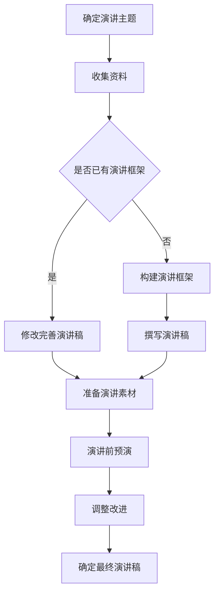

                 

### 文章标题

《从技术分享到付费研讨会：程序员的演讲之路》

### 关键词

程序员，演讲，技术分享，付费研讨会，职业发展，个人品牌

### 摘要

本文旨在探讨程序员从技术分享到付费研讨会的发展之路。文章首先介绍了技术分享的价值，以及如何通过演讲技能的培养来提升自我。随后，文章详细阐述了内容创作与准备、第一次公开演讲的经验教训，以及如何打造个人品牌和设计运营付费研讨会。最后，文章提出了演讲能力提升的方法和持续学习的动力，并提供了常用演讲工具与资源的附录。

## 第一部分：准备阶段

在程序员的世界里，技术分享和演讲不仅是一种个人能力的展示，更是职业发展的有力工具。从技术分享到付费研讨会，这一过程充满了挑战与机遇。本文将分阶段详细探讨这一转变，帮助程序员们更好地准备和实现这一目标。

### 第1章：技术分享的重要性

#### 1.1 技术分享的价值

技术分享在程序员的职业发展中扮演着不可或缺的角色。首先，它有助于个人的知识积累与巩固。通过将自己的经验与知识分享给他人，程序员能够更深刻地理解技术原理，并在实践中不断完善和优化。其次，技术分享能够帮助程序员建立自己的专业形象。一篇高质量的技术文章或一次精彩的演讲，往往能够吸引同行的关注，提升个人的影响力。

此外，技术分享还能促进社区的合作与交流。在一个技术社区中，程序员们通过分享和讨论，能够共同解决技术难题，推动整个行业的发展。这种合作精神不仅有助于个人的成长，也有助于建立一个更加开放、包容和创新的生态系统。

#### 1.2 技术分享的形式

技术分享的形式多种多样，程序员可以根据自己的兴趣和特长选择最适合自己的方式。以下是几种常见的技术分享形式：

1. **博客写作**：博客是一种非常灵活且易于使用的分享方式。程序员可以通过撰写技术博客，记录自己的学习心得、工作经验和技术见解。这不仅有助于自己知识的积累，也能为他人提供有价值的参考。

2. **技术文章发表**：在一些专业的技术媒体或平台上发表技术文章，能够扩大程序员的影响力。这些平台往往拥有大量的读者群体，能够为程序员带来更多的关注和机会。

3. **在线课程制作**：随着在线教育的兴起，越来越多的程序员开始制作在线课程，将自己的知识传授给更多的人。这种形式不仅能够帮助他人学习，也能为程序员带来额外的收入。

#### 1.3 技术社区的贡献与影响力

技术社区是程序员们分享与交流的重要场所。在技术社区中，程序员们可以自由地分享自己的技术见解、讨论技术难题，并从他人那里获取灵感和帮助。这种互动不仅有助于个人技能的提升，也有助于整个社区的知识积累和进步。

此外，技术社区对程序员的影响力也不可小觑。在一个活跃的技术社区中，程序员能够结识到许多志同道合的人，拓宽自己的视野，找到更多的合作机会。同时，技术社区也往往是发现和培养优秀程序员的地方，许多知名的技术公司和开源项目都来自于技术社区的交流与合作。

### 总结

技术分享不仅是程序员个人成长的助推器，也是推动整个技术行业发展的关键因素。通过技术分享，程序员能够不断提升自己的技能和影响力，同时为社区和行业做出贡献。在这一过程中，程序员也将逐渐认识到技术分享的重要性和价值，为下一步的发展奠定基础。

### 第2章：演讲技能的培养

演讲技能是程序员从技术分享向付费研讨会发展过程中不可或缺的一部分。一个优秀的演讲者不仅能够清晰、准确地传达技术知识，还能激发听众的兴趣和思考。以下我们将详细探讨演讲的基本要素和技巧，以及如何提升这些技能。

#### 2.1 演讲的基本要素

一场成功的演讲需要具备以下几个基本要素：

1. **引人入胜的演讲框架**：一个清晰的框架能够帮助演讲者有条理地组织内容，使听众更容易理解和记忆。通常，一个演讲框架可以分为引言、主体和总结三个部分。

   - **引言**：引言部分应简要介绍演讲主题，引发听众的兴趣和关注。可以通过一个有趣的故事、一个引人入胜的问题或一个令人惊讶的事实来开场。
   - **主体**：主体部分是演讲的核心，应详细阐述技术内容，并运用案例、数据和图表等辅助手段来增强说服力。主体部分的结构可以采用“问题-解决方案-结果”的模式，使内容更加紧凑和有条理。
   - **总结**：总结部分应概括演讲的主要内容，强调关键点，并给出一个明确的结论或建议。

2. **清晰表达核心观点**：在演讲过程中，清晰表达核心观点至关重要。演讲者应确保每个观点都明确、具体，避免使用模糊或模棱两可的语言。此外，演讲者还可以通过重复关键观点、使用强调词等方式来加强听众的印象。

3. **合理的演讲节奏**：演讲节奏的掌握是衡量演讲者经验的重要指标。一个优秀的演讲者应能够根据听众的反应和演讲内容的重要程度，灵活调整演讲速度和停顿时间。一般来说，演讲速度不宜过快，以便听众能够跟上演讲者的思路；同时，适当的停顿和休息能够使演讲更加生动有趣。

4. **良好的互动与反馈**：演讲不仅是单向的信息传递，更是与听众的互动过程。演讲者可以通过提问、回答问题、邀请互动等方式，增强与听众的互动，提高演讲的吸引力和参与度。同时，演讲者应善于倾听听众的反馈，根据反馈调整演讲内容和方式，使演讲更加贴合听众的需求。

#### 2.2 演讲技巧的提升

提升演讲技巧是一个长期的过程，需要不断练习和反思。以下是一些有效的提升方法：

1. **演讲稿的撰写与修改**：演讲稿是演讲的基础，一篇好的演讲稿应具备逻辑清晰、语言简洁、内容充实的特点。在撰写演讲稿时，演讲者可以从以下几个方面入手：

   - **明确主题**：确保演讲稿围绕一个明确的主题展开，避免内容分散和逻辑混乱。
   - **简化语言**：使用简单、易懂的语言，避免使用专业术语和复杂的句式，使听众更容易理解。
   - **增加案例和数据**：通过具体的案例和数据来支持观点，增强演讲的说服力。
   - **多次修改**：演讲稿完成后，应多次进行修改和润色，确保语言流畅、逻辑清晰。

2. **演讲者的形象与仪态**：演讲者的形象和仪态对演讲效果具有重要影响。一个自信、专业的形象能够增强演讲的吸引力，提升演讲者的说服力。以下是一些提升演讲形象和仪态的建议：

   - **着装得体**：根据演讲场合选择合适的着装，保持整洁、专业的形象。
   - **姿态端庄**：保持良好的身体姿态，避免驼背、晃动等不专业的动作。
   - **面部表情**：保持自信、友好的面部表情，通过眼神交流和微笑与听众建立联系。

3. **互动与提问环节的处理**：在演讲过程中，互动与提问环节是增强演讲吸引力和参与度的重要手段。以下是一些处理互动与提问环节的建议：

   - **准备提问环节**：在演讲前，准备一些与演讲主题相关的问题，鼓励听众提问，并提前准备回答。
   - **积极回应**：对听众的问题给予积极回应，即使问题难以回答，也可以表示感谢并提供相关资源或建议。
   - **灵活处理突发情况**：在演讲过程中，可能会遇到各种突发情况，如设备故障、时间紧迫等。演讲者应保持冷静，灵活应对，确保演讲的顺利进行。

4. **视频录制与反馈**：通过录制自己的演讲视频，演讲者可以更客观地评估自己的演讲效果，发现需要改进的地方。同时，可以邀请同事或朋友观看视频，并收集他们的反馈意见，以便进一步优化演讲技巧。

#### 2.3 演讲技巧的提升

提升演讲技巧是一个长期的过程，需要不断练习和反思。以下是一些有效的提升方法：

1. **模拟演讲**：通过模拟演讲，演讲者可以在一个相对安全的环境中练习演讲技巧，减少紧张和焦虑。模拟演讲可以邀请同事、朋友或家人作为听众，也可以在镜子前自我练习。

2. **参加演讲培训**：参加专业的演讲培训课程，学习系统的演讲知识和技巧。这些课程通常由经验丰富的讲师授课，能够为演讲者提供实用的建议和指导。

3. **观看经典演讲**：观看经典演讲视频，学习优秀的演讲者如何构建演讲框架、运用语言和技巧来吸引听众。可以通过分析经典演讲的元素，吸收其中的精华，并尝试应用到自己的演讲中。

4. **持续练习**：演讲技巧的提升离不开不断的练习。演讲者可以定期进行演讲练习，例如参加技术社区的分享活动、参加演讲比赛等。通过不断的实践，演讲者能够逐渐提升自己的演讲水平。

#### 2.4 演讲素材的积累

演讲素材的积累是提升演讲质量的重要环节。以下是一些积累演讲素材的方法：

1. **阅读与学习**：阅读相关的技术书籍、论文和博客，了解最新的技术动态和行业趋势。通过阅读，演讲者可以积累丰富的知识储备，为演讲提供有力的支持。

2. **实践经验**：通过实际的项目经验和实践，演讲者可以积累宝贵的实战经验。这些经验不仅能够为演讲提供真实的案例和数据，还能帮助演讲者更好地理解和阐述技术概念。

3. **讲座与培训**：参加各类技术讲座和培训课程，与讲师和同行进行交流和学习。这些活动不仅可以为演讲者提供新的思路和灵感，还能帮助演讲者了解听众的需求和兴趣点。

4. **收集反馈**：在演讲过程中，收集听众的反馈意见，了解他们的需求和兴趣点。通过分析反馈，演讲者可以不断优化自己的演讲内容和技巧。

### 总结

演讲技能是程序员从技术分享向付费研讨会发展过程中必不可少的一部分。通过培养演讲的基本要素和技巧，程序员可以更好地传达技术知识，提升个人影响力。同时，持续的学习和练习，以及积累演讲素材，也是提升演讲能力的重要途径。在这一过程中，程序员将逐渐掌握演讲的艺术，为自己的职业发展开辟更广阔的道路。

### 第3章：内容创作与准备

在从技术分享到付费研讨会的发展过程中，内容创作和准备是关键的一步。一个高质量、内容丰富的演讲，不仅能够吸引听众，还能提升演讲者的个人品牌和专业形象。以下我们将详细探讨如何选择合适的话题、内容创作的方法，以及准备过程中的注意事项。

#### 3.1 选择合适的话题

选择合适的话题是内容创作和准备的首要任务。一个有吸引力和价值的话题，不仅能够满足听众的需求，还能为演讲者提供丰富的素材。以下是一些建议：

1. **挖掘熟悉的领域**：选择自己熟悉和擅长的领域，可以更好地把握话题的深度和广度。通过深入研究和实践，演讲者能够为听众提供更有价值的见解和经验。

2. **关注行业动态**：紧跟行业动态，关注新兴技术和热门话题。这些话题往往具有更高的关注度，能够吸引更多的听众。同时，通过研究这些话题，演讲者也能提升自己的专业知识和视野。

3. **了解听众需求**：了解目标听众的需求和兴趣点，选择他们感兴趣的话题。可以通过问卷调查、访谈、社交媒体分析等方式，收集听众的意见和反馈，从而选择更受欢迎和有需求的话题。

4. **市场调研**：进行市场调研，分析同类型演讲的内容、形式和效果。通过对比分析，可以找到自己独特的角度和切入点，使演讲更具竞争力。

#### 3.2 内容创作的方法

内容创作是演讲的核心环节，以下是一些有效的内容创作方法：

1. **构建逻辑严密的内容结构**：一个逻辑严密的内容结构能够使演讲更加有条理和易于理解。通常，可以将内容分为引言、主体和总结三个部分。

   - **引言**：引言部分应简要介绍演讲主题，引发听众的兴趣和关注。可以通过一个有趣的故事、一个引人入胜的问题或一个令人惊讶的事实来开场。
   - **主体**：主体部分是演讲的核心，应详细阐述技术内容，并运用案例、数据和图表等辅助手段来增强说服力。主体部分的结构可以采用“问题-解决方案-结果”的模式，使内容更加紧凑和有条理。
   - **总结**：总结部分应概括演讲的主要内容，强调关键点，并给出一个明确的结论或建议。

2. **利用数据增强说服力**：在演讲中，合理使用数据能够增强说服力，使观点更加有力和可信。可以从以下几个方面获取数据：

   - **行业数据**：从行业报告、研究论文和技术调查中获取相关数据，支持演讲的观点。
   - **实际案例**：通过具体的项目案例和数据，展示技术的实际效果和应用价值。
   - **对比数据**：通过对比不同方法、技术或产品的数据，突出演讲者所提倡的方法或产品的优势。

3. **结合自身经验**：在内容创作中，结合自身的实际经验和案例，能够使演讲更加真实和有说服力。可以分享自己在项目中的挑战、解决方案和心得体会，为听众提供有价值的参考。

4. **借鉴他人经验**：参考其他优秀演讲的内容和形式，可以借鉴他们的经验和技巧，为自己的演讲提供灵感。同时，也可以通过分析他人演讲的成功和不足，找到自己的改进方向。

#### 3.3 准备过程中的注意事项

在内容创作和准备过程中，需要注意以下事项，以确保演讲的质量和效果：

1. **时间管理**：合理规划演讲时间，确保内容充实且不超时。可以通过预先设置时间限制，或在实际演讲中观察时间进度，来确保演讲的节奏和效果。

2. **技术细节的验证**：在演讲中，涉及到的技术细节和代码实现需要经过严格的验证和测试。可以提前编写测试用例，确保技术的正确性和稳定性。同时，也可以邀请同事或朋友提前审查和测试，以发现和解决潜在的问题。

3. **视觉辅助材料**：制作高质量的视觉辅助材料，如幻灯片、图表和视频等，可以增强演讲的吸引力和效果。视觉材料应简洁、直观，与演讲内容紧密相关。

4. **演讲稿的撰写与修改**：演讲稿是演讲的核心，需要经过多次的撰写和修改。可以通过以下几个方面来优化演讲稿：

   - **逻辑梳理**：确保演讲稿的逻辑清晰、结构严谨，避免内容重复和逻辑混乱。
   - **语言简洁**：使用简单、易懂的语言，避免使用过于复杂的术语和句式。
   - **强调重点**：通过重复、强调和视觉手段，突出演讲的重点内容。
   - **情感投入**：在演讲稿中融入情感元素，使演讲更加生动、有感染力。

5. **预演与反馈**：在正式演讲前，进行多次预演和模拟演讲，可以帮助演讲者熟悉演讲内容和流程，发现和解决潜在的问题。同时，可以邀请同事或朋友观看预演，收集他们的反馈意见，进一步优化演讲。

#### 3.4 演讲素材的积累

演讲素材的积累是内容创作和准备的重要环节。以下是一些积累演讲素材的方法：

1. **阅读与学习**：阅读相关的技术书籍、论文和博客，了解最新的技术动态和行业趋势。通过阅读，可以积累丰富的知识储备，为演讲提供有力的支持。

2. **实践经验**：通过实际的项目经验和实践，可以积累宝贵的实战经验。这些经验不仅能够为演讲提供真实的案例和数据，还能帮助演讲者更好地理解和阐述技术概念。

3. **讲座与培训**：参加各类技术讲座和培训课程，与讲师和同行进行交流和学习。这些活动不仅可以为演讲者提供新的思路和灵感，还能帮助演讲者了解听众的需求和兴趣点。

4. **收集反馈**：在演讲过程中，收集听众的反馈意见，了解他们的需求和兴趣点。通过分析反馈，可以不断优化演讲内容和技巧。

#### 3.5 演讲准备的关键步骤

演讲准备是一个系统性的过程，以下是一些关键步骤：

1. **确定演讲主题**：明确演讲的主题和目标，确保内容聚焦和有价值。

2. **收集资料和素材**：通过阅读、调研和实践，积累丰富的知识和素材。

3. **构建内容框架**：根据主题和素材，构建逻辑严密的内容框架。

4. **撰写演讲稿**：撰写演讲稿，确保内容简洁、易懂、有逻辑。

5. **视觉辅助材料**：制作高质量的视觉辅助材料，如幻灯片、图表和视频等。

6. **预演与反馈**：进行多次预演和模拟演讲，收集反馈意见，优化演讲内容和形式。

7. **技术验证与测试**：对涉及到的技术细节和代码实现进行验证和测试。

8. **时间管理**：合理安排演讲时间，确保内容充实且不超时。

#### 总结

内容创作和准备是程序员从技术分享到付费研讨会的重要一环。通过选择合适的话题、构建逻辑严密的内容结构和利用数据增强说服力，演讲者能够为听众提供有价值的信息和见解。同时，在准备过程中，注重细节和反馈，以及积累演讲素材，也是提升演讲质量的重要途径。只有做好充分的准备，程序员才能在演讲中展现出最佳状态，赢得听众的认可和尊重。

## 第二部分：实战演练

### 第4章：第一次公开演讲

第一次公开演讲对许多程序员来说是一次重要的挑战，同时也是迈向成功的重要一步。在这一章中，我们将探讨如何在第一次公开演讲前做好充分准备，如何在演讲过程中运用技巧，以及演讲结束后如何进行反思和总结。

#### 4.1 演讲前的准备

充分的准备是确保演讲成功的关键。以下是一些演讲前的准备工作：

1. **确定演讲主题**：明确演讲的主题，确保内容聚焦和有价值。可以选择一个自己熟悉且感兴趣的话题，这样在演讲过程中会更有信心和动力。

2. **了解听众**：了解目标听众的背景、需求和兴趣点，以便在演讲中针对他们的关注点进行内容调整。可以通过问卷调查、社交媒体互动或与组织者交流等方式收集听众信息。

3. **撰写演讲稿**：撰写演讲稿，确保内容简洁、易懂、有逻辑。演讲稿应包括引言、主体和总结三个部分，每个部分都要有明确的重点和逻辑联系。

4. **制作视觉辅助材料**：制作高质量的视觉辅助材料，如幻灯片、图表和视频等，以增强演讲的吸引力和效果。视觉材料应简洁、直观，与演讲内容紧密相关。

5. **预演与练习**：在正式演讲前进行多次预演和练习，可以帮助演讲者熟悉演讲内容和流程，发现和解决潜在的问题。可以邀请同事或朋友观看预演，收集他们的反馈意见，进一步优化演讲。

6. **技术验证与测试**：对涉及到的技术细节和代码实现进行验证和测试，确保技术的正确性和稳定性。可以提前编写测试用例，或在预演过程中进行实际操作验证。

7. **时间管理**：合理安排演讲时间，确保内容充实且不超时。可以通过预先设置时间限制，或在演讲过程中观察时间进度，来确保演讲的节奏和效果。

#### 4.2 演讲过程中的技巧

演讲过程中，运用一些技巧可以提升演讲的效果和吸引力。以下是一些建议：

1. **控制演讲节奏**：演讲节奏的掌握对演讲效果至关重要。一个合适的演讲节奏应使听众能够跟上演讲者的思路，同时避免过于单调或过于快速。可以适当调整演讲速度，保持适度的停顿和休息。

2. **处理突发情况**：在演讲过程中，可能会遇到各种突发情况，如设备故障、忘词等。演讲者应保持冷静，灵活应对，确保演讲的顺利进行。以下是一些建议：

   - **设备故障**：提前检查设备，确保幻灯片、音频和视频等辅助材料正常运行。如果出现设备故障，可以快速切换到备用设备或使用纸笔记录关键内容。
   - **忘词**：如果忘词，可以暂停并思考，或者利用已有的信息继续演讲。如果实在无法回忆起内容，可以坦诚地告诉听众，并迅速调整演讲方向。

3. **互动与提问环节**：在演讲过程中，互动与提问环节是增强演讲吸引力和参与度的重要手段。以下是一些建议：

   - **准备问题**：在演讲前，准备一些与演讲主题相关的问题，鼓励听众提问。这些问题应覆盖演讲的主要内容，以便在互动环节中更好地引导讨论。
   - **积极回应**：对听众的问题给予积极回应，即使问题难以回答，也可以表示感谢并提供相关资源或建议。
   - **灵活处理**：在互动环节中，应保持灵活和开放的态度，根据听众的反应和需求，调整演讲内容和方式。

4. **情感投入**：演讲不仅是知识的传递，更是情感的交流。演讲者应投入情感，使演讲更加生动、有感染力。可以通过语调、表情、手势等非语言手段，增强演讲的情感表达。

5. **关注听众反应**：在演讲过程中，关注听众的反应，了解他们对演讲内容的态度和兴趣。可以通过观察听众的表情、姿势和互动，及时调整演讲内容和方式，使演讲更贴合听众的需求。

#### 4.3 演讲后的反思

演讲结束后，进行反思和总结是提升演讲能力的重要步骤。以下是一些建议：

1. **收集反馈意见**：演讲结束后，主动收集听众的反馈意见，了解他们的感受和建议。可以通过问卷调查、访谈或社交媒体互动等方式收集反馈。

2. **分析反馈**：对收集到的反馈进行详细分析，识别优点和不足之处。可以从以下几个方面进行分析：

   - **内容质量**：分析演讲内容是否丰富、有逻辑，是否能够满足听众的需求。
   - **演讲技巧**：分析演讲技巧的运用是否得当，如语速、停顿、互动等。
   - **视觉辅助材料**：分析视觉辅助材料的质量和效果，是否有助于增强演讲的吸引力和说服力。

3. **总结经验教训**：根据反馈分析，总结演讲过程中的经验和教训，找出需要改进的地方。可以从以下几个方面进行总结：

   - **演讲内容**：总结演讲内容的优点和不足，如逻辑结构、重点突出等。
   - **演讲技巧**：总结演讲技巧的运用效果，如语调、表情、手势等。
   - **互动与反馈**：总结互动与反馈环节的处理方式，如问题的准备和回答等。

4. **制定改进计划**：根据总结的经验教训，制定具体的改进计划，为下一次演讲做好准备。可以从以下几个方面制定改进计划：

   - **内容优化**：针对反馈中的问题，对演讲内容进行优化和改进，确保逻辑清晰、重点突出。
   - **技巧提升**：针对演讲技巧的不足，进行有针对性的训练和提升，如语调控制、情感表达等。
   - **材料准备**：改进视觉辅助材料的制作方式，确保质量更高、效果更好。

#### 总结

第一次公开演讲是一次重要的实践和锻炼机会。通过充分的准备、有效的技巧运用和演讲后的反思，程序员可以不断提升自己的演讲能力，为未来的职业发展打下坚实的基础。在这一过程中，程序员不仅能够提升自己的专业形象和影响力，还能为社区和行业做出更大的贡献。

### 第5章：打造个人品牌

在技术领域，个人品牌的重要性不言而喻。一个强大的个人品牌不仅能提升程序员的知名度，还能带来更多的职业机会和收入。在这一章中，我们将探讨如何定义和构建个人品牌，以及如何利用社交媒体扩大影响力。

#### 5.1 个人品牌的定义

个人品牌是指个人在特定领域内的声誉、知名度和专业形象。它是一个综合的、多维度的概念，包括以下几个方面：

1. **专业能力**：个人品牌的基础是专业能力。一个强大的个人品牌应具备深厚的专业知识和丰富的实践经验，能够在技术领域内独当一面。

2. **声誉**：个人品牌还体现在良好的声誉上。一个有良好声誉的个人，往往能够赢得他人的信任和尊重，从而在职业发展中取得优势。

3. **影响力**：个人品牌的影响力体现在个人在技术社区和行业内的影响程度。一个有影响力的个人品牌能够吸引更多的关注和参与，推动技术发展和交流。

4. **独特性**：每个个人品牌都有其独特性。一个成功的个人品牌应具备鲜明的个性特点，使自己在众多竞争者中脱颖而出。

#### 5.2 个人品牌的构建方法

构建个人品牌是一个长期而系统的过程，以下是一些有效的方法：

1. **专业知识的积累**：建立个人品牌的基础是专业知识的积累。程序员应不断学习新知识、掌握新技术，提升自己的专业能力。可以通过以下方式积累专业知识：

   - **学习新技术**：关注技术发展趋势，学习新兴技术和工具，提升自己的技术视野。
   - **阅读和研究**：阅读技术书籍、论文和博客，深入研究技术领域的理论和实践。
   - **项目经验**：通过实际项目经验，积累丰富的实战经验和案例。

2. **积极参与社区活动**：技术社区是建立个人品牌的重要场所。程序员应积极参与社区活动，如技术讲座、研讨会、开源项目等，与他人交流和分享知识。以下是一些参与社区活动的建议：

   - **分享经验**：在社区中分享自己的技术经验和见解，撰写博客文章、发表技术文章，为他人提供帮助。
   - **参与开源项目**：参与开源项目，贡献自己的代码和想法，提升技术影响力。
   - **组织活动**：组织或参与技术讲座、研讨会等活动，扩大自己在社区中的影响力。

3. **社交媒体应用**：社交媒体是构建个人品牌的重要工具。程序员应充分利用社交媒体平台，如微博、知乎、Twitter等，发布有价值的内容，扩大自己的影响力。以下是一些社交媒体应用的技巧：

   - **内容策划**：制定内容策划方案，确保发布的内容有计划、有节奏，避免内容散乱无章。
   - **互动交流**：与粉丝和同行保持互动，回复评论和私信，建立良好的互动关系。
   - **品牌形象**：维护良好的个人形象，避免发布不当言论或行为，确保个人品牌的正面形象。

4. **演讲与培训**：通过演讲和培训，程序员可以将自己的知识和经验传授给更多的人，提升自己的知名度和影响力。以下是一些演讲与培训的建议：

   - **准备充分**：在演讲和培训前，充分准备，确保内容的充实和有逻辑性。
   - **善于互动**：在演讲和培训过程中，注重与听众的互动，鼓励提问和讨论，增强听众的参与度。
   - **持续改进**：根据听众的反馈和实际效果，不断改进演讲和培训的内容和方式，提升效果。

5. **个人品牌的定位**：在构建个人品牌的过程中，明确个人品牌的定位至关重要。以下是一些定位建议：

   - **聚焦领域**：选择一个自己擅长且感兴趣的领域，聚焦在该领域内建立专业形象。
   - **独特性**：突出个人的独特性，如技术专长、个人风格等，使个人品牌更具吸引力。
   - **长期规划**：制定长期规划，明确个人品牌的发展方向和目标，持续优化和提升。

#### 5.3 社交媒体的应用

社交媒体是构建个人品牌的重要工具，以下是一些社交媒体应用的技巧：

1. **内容发布策略**：制定内容发布策略，确保发布的内容有计划、有节奏。可以通过以下方式制定策略：

   - **定期发布**：制定每周或每月的内容发布计划，确保有规律地发布有价值的内容。
   - **多样化内容**：发布不同类型的内容，如技术文章、视频、案例分享等，吸引更多的关注。
   - **热点话题**：关注热点话题，及时发布相关内容，提高内容的曝光率和关注度。

2. **互动与交流**：与粉丝和同行保持互动，回复评论和私信，建立良好的互动关系。以下是一些互动技巧：

   - **积极回应**：对粉丝的评论和私信给予积极回应，展现自己的亲和力和关注。
   - **提供帮助**：主动帮助他人解决问题，展现自己的专业能力和善良品质。
   - **分享资源**：分享有价值的技术资源、书籍和课程，为他人提供学习和成长的机会。

3. **扩大影响力**：通过社交媒体平台，扩大自己的影响力。以下是一些扩大影响力的方法：

   - **转发与分享**：转发和分享其他优秀的内容，为自己带来更多的关注和流量。
   - **合作与互助**：与其他领域内的知名人士合作，共同创作和分享内容，提升自己的知名度。
   - **在线活动**：组织在线活动，如讲座、研讨会、问答等，吸引更多粉丝和参与。

4. **品牌形象维护**：维护良好的个人形象，避免发布不当言论或行为，确保个人品牌的正面形象。以下是一些形象维护的建议：

   - **言行一致**：在社交媒体上展现出的形象应与实际相符，避免言行不一致。
   - **关注反馈**：关注粉丝和同行的反馈，及时调整自己的言行，确保符合个人品牌定位。
   - **积极应对**：面对负面反馈，保持冷静和理智，积极应对，展现自己的处理能力和态度。

#### 5.4 个人品牌影响力的提升

个人品牌影响力的提升是一个持续的过程，需要不断地努力和优化。以下是一些提升个人品牌影响力的方法：

1. **参与社区活动**：积极参与技术社区的活动，如技术讲座、研讨会、开源项目等，与他人交流和分享知识，扩大自己的影响力。

2. **发布高质量内容**：发布高质量的内容，如技术文章、博客、视频等，展现自己的专业能力和独特视角，吸引更多的关注。

3. **树立榜样**：树立良好的个人形象和品牌，成为他人学习的榜样，提升自己的影响力。

4. **持续学习与成长**：不断学习新知识和技能，提升自己的专业能力和综合素质，为个人品牌的发展奠定基础。

5. **宣传与推广**：利用社交媒体和其他渠道，宣传和推广自己的个人品牌，扩大自己的知名度和影响力。

### 总结

打造个人品牌是程序员在职业发展中的一项重要任务。通过积累专业知识、积极参与社区活动、利用社交媒体扩大影响力，程序员可以不断提升自己的知名度和影响力。一个强大的个人品牌不仅能带来更多的职业机会和收入，还能为技术社区和行业做出更大的贡献。在这一过程中，程序员将逐渐掌握个人品牌建设的方法和技巧，为自己的职业发展开辟更广阔的道路。

### 第6章：付费研讨会的设计与运营

在成功进行公开演讲和建立个人品牌之后，程序员可以进一步探索付费研讨会这一收入来源。付费研讨会不仅能为程序员带来直接的经济收益，还能进一步增强其在行业内的专业影响力和话语权。本章节将详细探讨如何设计和管理付费研讨会，包括研讨会的类型、设计流程和运营策略。

#### 6.1 付费研讨会的类型

付费研讨会可以根据不同的需求和目标，划分为以下几种类型：

1. **专题研讨会**：专题研讨会通常围绕一个特定主题进行深入探讨，内容涵盖理论讲解、案例分析、实践操作等多个方面。这种研讨会适合于技术深度较高或特定领域的问题，能够为听众提供系统化的知识和技能培训。

2. **工作坊**：工作坊是一种互动性较强的研讨会形式，通常包括动手实践、小组讨论和角色扮演等环节。这种研讨会注重实践操作，能够帮助听众在实际项目中应用所学知识，提高实际操作能力。

3. **线上研讨会**：随着互联网技术的发展，线上研讨会逐渐成为一种流行的研讨会形式。线上研讨会通过直播或录播的方式，让听众能够随时随地参与学习。这种研讨会形式灵活，参与成本低，适合覆盖更广泛的听众群体。

#### 6.2 付费研讨会的设计

设计一场成功的付费研讨会，需要考虑以下几个方面：

1. **主题选择**：选择一个有吸引力和实际应用价值的主题是设计研讨会的重要一步。主题应结合听众的需求和当前行业的热点话题，确保研讨会的受众面和参与度。

2. **内容规划**：在确定主题后，需要详细规划研讨会的内容。内容应包括理论讲解、实践操作、案例分析和互动环节等，确保研讨会内容丰富且具有系统性。

3. **讲师选择**：选择合适的讲师是研讨会成功的关键。讲师应具备丰富的专业知识、良好的沟通能力和丰富的教学经验。如果可能，选择多名讲师，可以增加研讨会的多样性和深度。

4. **互动设计**：互动设计是提升研讨会吸引力和参与度的重要手段。可以设置问答环节、小组讨论、角色扮演等互动环节，使听众能够积极参与到研讨会中。

5. **时间安排**：合理安排研讨会的时长和议程，确保每个环节都能顺利进行。一般来说，研讨会的时长不宜过长，以避免听众疲劳和注意力分散。

#### 6.3 付费研讨会的运营

运营一场成功的付费研讨会，需要有效的宣传、推广和管理。以下是一些关键步骤：

1. **宣传与推广**：通过多种渠道宣传和推广研讨会，包括社交媒体、电子邮件营销、合作伙伴推广等。制作宣传材料，如海报、宣传册和视频等，吸引潜在听众的关注。

2. **报名管理**：建立报名系统，方便听众报名和支付。报名系统应包括报名表格、支付方式、发票开具等环节，确保报名过程顺利和便捷。

3. **研讨会准备**：在研讨会前，进行充分的准备工作，包括场地布置、设备检查、讲师培训等。确保研讨会现场一切准备就绪，避免突发情况影响研讨会的顺利进行。

4. **现场管理**：在研讨会现场，安排专门的人员负责签到、接待、场地管理等，确保研讨会现场秩序井然。同时，提供必要的技术支持，如音响设备、投影仪等，确保演讲和互动环节顺利。

5. **反馈收集**：研讨会结束后，及时收集听众的反馈意见，了解他们对研讨会的满意度和建议。这些反馈可以为下一次研讨会提供改进方向和依据。

6. **后续跟进**：研讨会结束后，对听众进行后续跟进，包括发送研讨会资料、邀请参加后续活动等。通过后续跟进，可以巩固听众对研讨会的记忆和兴趣，提高听众的满意度和忠诚度。

#### 6.4 付费研讨会的收益与风险

开展付费研讨会可以带来直接的经济收益，但同时也存在一定的风险。以下是一些收益和风险的考虑因素：

1. **收益**：

   - **学费收入**：通过收取学费，研讨会可以直接带来经济收益。学费可以根据研讨会的类型、时长和讲师知名度等因素进行调整。
   - **品牌提升**：通过举办高质量的研讨会，可以提升个人和企业的品牌形象，增强在行业内的知名度和影响力。
   - **合作机会**：研讨会可以吸引潜在的合作者和客户，为个人和企业带来更多的商业机会。

2. **风险**：

   - **市场风险**：研讨会的内容和形式需要符合市场需求，否则可能面临报名不足的风险。需要通过市场调研和反馈，及时调整研讨会的内容和形式。
   - **讲师风险**：讲师的水平直接影响研讨会的效果。如果讲师经验不足或准备不充分，可能导致研讨会质量不高，影响听众满意度。
   - **运营风险**：研讨会运营过程中可能出现设备故障、场地安排不当等突发情况，影响研讨会顺利进行。需要提前制定应急预案，确保研讨会安全、顺利。

#### 总结

付费研讨会是程序员从技术分享到商业变现的重要一步。通过精心设计和管理，程序员可以举办高质量的研讨会，提升个人和企业的品牌形象，同时获得经济收益。在这一过程中，程序员需要充分考虑市场、讲师和运营等方面的因素，确保研讨会的成功。不断学习和优化，程序员将在付费研讨会领域取得更大的成就。

### 第7章：演讲能力的提升

演讲能力是程序员从技术分享到付费研讨会的核心技能之一。提升演讲能力不仅有助于个人品牌的建立，还能为职业发展带来更多的机会。在这一章中，我们将探讨如何通过积累演讲素材、塑造演讲风格和有效运用反馈来提升演讲能力。

#### 7.1 演讲素材的积累

演讲素材是演讲成功的关键。以下是一些积累演讲素材的方法：

1. **阅读与学习**：

   - **专业书籍和论文**：通过阅读专业书籍和论文，可以深入了解技术领域的最新动态和前沿知识，为演讲提供丰富的理论依据。
   - **技术博客和教程**：阅读技术博客和教程，了解不同作者对同一技术主题的不同见解和经验，拓宽自己的视野。
   - **行业报告和调查**：关注行业报告和调查，了解市场趋势和用户需求，为自己的演讲内容提供实用数据。

2. **实践经验**：

   - **实际项目**：通过实际项目，可以积累宝贵的实战经验。在项目中遇到的问题和解决方案，可以作为演讲的案例，为听众提供有价值的参考。
   - **技术分享**：参与技术社区的活动，如技术讲座、研讨会等，通过分享自己的经验和见解，积累演讲素材。

3. **讲座与培训**：

   - **参加讲座和培训**：参加各类技术讲座和培训，学习其他讲师的演讲技巧和内容组织方法，为自己提供灵感。
   - **做讲座和培训**：通过自己组织和举办讲座或培训，可以将自己的知识系统化，同时积累演讲经验。

4. **收集与整理**：

   - **笔记和总结**：在阅读和学习过程中，做好笔记和总结，将关键知识点和经验整理成文档，方便后续查阅和使用。
   - **素材库**：建立一个个人素材库，将各类素材分类整理，如理论、案例、数据、图表等，便于演讲时快速查找和引用。

#### 7.2 演讲风格的塑造

演讲风格是个人品牌的体现，塑造独特的演讲风格有助于在听众中留下深刻印象。以下是一些塑造演讲风格的方法：

1. **个人特色**：

   - **语言风格**：在演讲中，可以使用自己的语言风格，如幽默、严肃、亲切等，使演讲更具个性和魅力。
   - **语调变化**：通过语调的变化，如音量的高低、语速的快慢、语气的强弱等，使演讲更加生动和吸引人。

2. **内容组织**：

   - **逻辑清晰**：确保演讲内容逻辑清晰，层次分明，使听众能够轻松跟随演讲者的思路。
   - **故事化**：通过讲述故事，将技术概念和知识融入到有趣的故事情节中，使演讲更加生动和吸引人。

3. **视觉辅助**：

   - **幻灯片设计**：设计简洁、直观的幻灯片，使用图片、图表、动画等元素，增强演讲的视觉吸引力。
   - **演示工具**：使用演示工具，如Keynote、PowerPoint等，制作高质量的演示文稿，使演讲内容更加丰富和有说服力。

4. **互动环节**：

   - **提问与回答**：在演讲过程中，设置提问和回答环节，与听众互动，提高听众的参与度和兴趣。
   - **互动活动**：在演讲前后，组织互动活动，如小游戏、讨论环节等，增强听众的互动体验。

5. **个性化**：

   - **个人故事**：在演讲中分享个人故事，如职业经历、项目案例等，使演讲更具真实感和亲和力。
   - **独特视角**：从独特的角度分析问题，提出自己的见解，使演讲内容更具深度和思考性。

#### 7.3 演讲反馈的运用

演讲反馈是提升演讲能力的重要途径。以下是如何有效收集和运用反馈的方法：

1. **收集反馈**：

   - **现场反馈**：在演讲结束后，邀请听众填写反馈表，收集他们对演讲内容的意见和建议。
   - **社交媒体**：通过社交媒体平台，如微博、知乎等，收集听众的在线反馈，了解他们的感受和建议。
   - **邮件调查**：发送邮件给听众，进行问卷调查，获取更详细的反馈信息。

2. **分析反馈**：

   - **内容分析**：分析反馈中关于演讲内容的部分，了解听众对演讲主题、结构、深度等方面的看法，找出需要改进的地方。
   - **技巧分析**：分析反馈中关于演讲技巧的部分，了解自己在语速、语调、互动等方面的表现，找出需要提升的方面。

3. **改进演讲**：

   - **内容调整**：根据反馈，对演讲内容进行修改和优化，确保逻辑清晰、重点突出。
   - **技巧提升**：根据反馈，有针对性地提升演讲技巧，如语调控制、互动设计等。

4. **持续反馈**：

   - **定期反馈**：定期收集和反馈，持续优化演讲内容和技巧。
   - **个人反思**：在每次演讲后，进行自我反思，总结经验教训，不断提升自己的演讲能力。

#### 7.4 演讲素材积累与风格塑造的结合

积累演讲素材和塑造演讲风格是相辅相成的过程。以下是一些结合的方法：

1. **素材驱动的风格**：

   - **以素材为核心**：在积累素材的过程中，思考如何将这些素材融入到演讲中，形成独特的风格。
   - **风格化素材**：将素材进行加工和转化，使其符合自己的演讲风格，增强演讲的个性和魅力。

2. **风格化的素材积累**：

   - **风格化阅读**：在阅读过程中，注重风格化素材的积累，如独特观点、经典案例等，将这些素材作为演讲的内容基础。
   - **风格化实践**：在项目中，注重风格化素材的积累，通过实际操作和案例分析，提升自己的实战能力和演讲素材。

3. **结合个人经历**：

   - **个人经历融入风格**：在演讲中，结合个人经历和见解，使演讲内容更加生动和真实，同时体现个人的风格。
   - **个人风格塑造经历**：通过分享自己的成长经历和心路历程，展示自己的风格和魅力，吸引听众的关注。

4. **持续优化**：

   - **反馈优化**：根据听众的反馈，不断优化演讲内容和风格，使其更加符合听众的需求和期望。
   - **实践优化**：通过实际演讲和实践，不断积累经验，逐步塑造和优化自己的演讲风格。

### 总结

演讲能力的提升是程序员职业发展的关键一步。通过积累演讲素材、塑造演讲风格和有效运用反馈，程序员可以不断提升自己的演讲水平，为职业发展打下坚实的基础。在这一过程中，程序员不仅能够提升自己的专业形象和影响力，还能为技术社区和行业做出更大的贡献。

### 第8章：持续学习的动力

持续学习是程序员职业发展的重要推动力。在技术日新月异的时代，保持学习的动力和习惯，不仅能够不断提升个人的专业能力，还能在竞争激烈的职场中脱颖而出。在这一章中，我们将探讨如何通过职业规划、选择合适的资源和培养学习习惯来保持持续学习的动力。

#### 8.1 职业发展的规划

职业规划是持续学习的重要基础。一个明确的职业目标可以为我们提供清晰的学习方向和动力。以下是一些制定职业规划的建议：

1. **设定长期和短期目标**：首先，我们需要设定长期和短期的职业目标。长期目标可以是成为某个技术领域的专家，短期目标可以是掌握一项新的技术或技能。这些目标应具有可行性和挑战性，能够激发我们的学习热情。

2. **评估自身优势与不足**：了解自己的优势和不足，有助于我们制定更有针对性的学习计划。可以通过自我反思、评估工具或与同事、导师交流，识别自己在技术、沟通、管理等方面的优势与不足。

3. **制定学习计划**：根据设定的目标，制定详细的学习计划。计划应包括学习的内容、时间安排和学习方法。例如，每周学习2小时新技能，每月阅读1-2本专业书籍，每季度参加1-2次技术讲座等。

4. **设定里程碑和奖励**：在计划中设定里程碑和奖励，可以增加学习的动力。每完成一个里程碑，可以给予自己一些奖励，如休息一天、享受一顿美食等，以保持学习的热情。

5. **定期评估和调整**：职业规划不是一成不变的，应定期评估和调整。通过定期的自我评估和外部反馈，了解自己的学习进度和效果，及时调整学习计划，确保职业目标的实现。

#### 8.2 选择合适的资源

选择合适的资源是持续学习的重要环节。以下是一些选择学习资源的建议：

1. **专业书籍**：专业书籍是学习技术知识的重要资源。可以选择一些经典的技术书籍，如《代码大全》、《设计模式：可复用面向对象软件的基础》等。同时，也可以关注新书和畅销书，了解最新的技术动态和趋势。

2. **在线课程**：在线课程提供了灵活的学习时间和丰富的课程内容。可以选择一些知名的平台，如Coursera、edX、Udemy等，根据自己的需求和学习目标选择合适的课程。在线课程通常包含视频、文本、作业和讨论区，能够提供全面的学习体验。

3. **技术博客和论坛**：技术博客和论坛是获取最新技术信息和交流经验的平台。可以关注一些知名的技术博客，如Stack Overflow、GitHub、Reddit等，了解最新的技术动态和行业趋势。同时，也可以参与技术论坛的讨论，与其他开发者交流心得，解决问题。

4. **开源项目**：参与开源项目是提升技术能力和积累实战经验的有效途径。可以通过GitHub等平台，找到感兴趣的开源项目，参与其中，学习项目的架构和实现方法。同时，也可以通过贡献代码，提升自己的编程能力。

5. **同行交流和讲座**：与同行交流和学习是获取新知识和经验的快捷方式。可以参加行业内的讲座、研讨会和交流会，与专家和同行面对面交流，了解最新的技术趋势和实战经验。同时，也可以参加技术社区的活动，如Meetup、Hackathon等，扩大自己的技术圈子。

#### 8.3 培养学习习惯

培养学习习惯是持续学习的关键。以下是一些培养学习习惯的建议：

1. **设定学习时间**：为了培养学习习惯，我们需要设定固定的学习时间。可以选择每天早晨、晚上或周末的某个时间段，确保每天有足够的时间进行学习。

2. **制定学习计划**：制定详细的学习计划，明确每天或每周的学习任务和目标。计划应包括学习的内容、时间安排和学习方法。例如，每天晚上学习1小时编程，每周阅读1-2章专业书籍等。

3. **跟踪学习进度**：使用学习跟踪工具，如日历、学习管理软件等，记录自己的学习进度和成果。通过跟踪学习进度，可以了解自己的学习效果，及时调整学习计划。

4. **保持学习动力**：保持学习动力是培养学习习惯的关键。可以通过设定奖励、参加学习小组、与他人分享学习成果等方式，激发学习兴趣和动力。

5. **定期复习和总结**：定期复习和总结所学知识，巩固记忆，提高学习效果。可以每周或每月进行一次复习和总结，回顾所学内容，发现问题并解决。

6. **克服学习困难**：在学习过程中，难免会遇到困难和挑战。需要保持积极的心态，勇敢面对困难，寻找解决问题的方法和途径。可以通过请教他人、查阅资料、参加培训等方式，克服学习中的困难。

#### 8.4 持续学习的实践与反思

持续学习不仅需要理论指导，更需要实践和反思。以下是一些实践和反思的建议：

1. **实践操作**：将所学知识应用到实际项目中，通过实践操作，加深对知识的理解和掌握。可以参与开源项目、编写代码、搭建系统等，提升实际操作能力。

2. **反思与总结**：在学习过程中，不断反思和总结所学内容。通过反思，可以发现问题、吸取经验，提高学习效果。可以定期写学习笔记、总结学习心得，与他人分享学习经验。

3. **参与讨论和交流**：通过参与技术社区和论坛的讨论，与他人交流学习心得和经验，获取新的观点和思路。可以参加技术讲座、研讨会、工作坊等，扩大自己的知识面和视野。

4. **调整学习策略**：根据实践和反思的结果，调整学习策略和方法。如果发现某个学习方式效果不佳，可以尝试其他方法，找到适合自己的学习方式。

5. **保持好奇心和求知欲**：保持好奇心和求知欲是持续学习的重要动力。对新技术、新知识保持好奇，积极寻找学习的机会和资源，不断提升自己的知识水平和能力。

#### 总结

持续学习是程序员职业发展的重要保障。通过制定职业规划、选择合适的资源、培养学习习惯和不断实践反思，程序员可以不断提升自己的专业能力和竞争力。保持持续学习的动力，不仅有助于个人的职业发展，还能为技术社区和行业做出更大的贡献。

### 附录：常用演讲工具与资源

在准备和进行演讲的过程中，使用适当的工具和资源能够显著提升演讲的效果。以下是一些常用的演讲工具与资源，包括演讲工具的介绍、演讲资源推荐，以及技术社区和演讲爱好者社群的介绍。

#### A.1 演讲工具介绍

1. **幻灯片制作工具**：

   - **PowerPoint**：Microsoft PowerPoint 是最常用的幻灯片制作工具之一，具有丰富的模板和设计元素，能够帮助用户快速创建专业的演示文稿。
   - **Keynote**：Keynote 是苹果公司开发的幻灯片制作软件，具有简洁美观的界面和强大的动画效果，适用于Mac用户。
   - **Google Slides**：Google Slides 是一款在线幻灯片制作工具，支持多人协作，适用于团队协作和远程演讲。

2. **录音与视频制作工具**：

   - **OBS Studio**：OBS Studio 是一款开源的视频录制和直播软件，支持多摄像头流和音频混合，适用于需要多设备录制的演讲者。
   - **Camtasia**：Camtasia 是一款功能强大的视频编辑软件，能够帮助用户轻松剪辑、添加特效和音频，适合制作高质量的演讲视频。
   - **Loom**：Loom 是一款在线视频录制工具，支持屏幕录制和视频分享，适合制作简短的视频演讲和教程。

3. **演示辅助工具**：

   - **Miro**：Miro 是一款在线协作白板工具，支持绘图、文字和视频嵌入，适用于需要互动演示的研讨会和工作坊。
   - **Explain Everything**：Explain Everything 是一款适合教学和演示的交互式演示工具，能够创建动态的演示文稿和互动式培训材料。

#### A.2 演讲资源推荐

1. **经典演讲案例**：

   - **TED**：TED 是一个全球知名的演讲平台，包含大量高质量、有启发性的演讲视频。通过观看TED演讲，可以学习到优秀的演讲技巧和内容组织方法。
   - **TEDx**：TEDx 是 TED 的延伸，是一个由独立组织者和志愿者举办的演讲活动。TEDx 演讲涵盖了各个领域，为观众提供了丰富的学习资源。

2. **专业演讲培训资源**：

   - **Toastmasters**：Toastmasters 是一个全球性的演讲和领导力培训组织，提供一系列的演讲课程和活动，帮助会员提升演讲技巧。
   - **Public Speaking Coach**：Public Speaking Coach 是一个在线资源，提供大量的演讲技巧文章、视频教程和实践练习，适用于不同水平的演讲者。

3. **技术社区与论坛**：

   - **Stack Overflow**：Stack Overflow 是一个广泛使用的技术问答社区，程序员可以在这里提问和解答技术问题，获取实用的技术知识。
   - **GitHub**：GitHub 是一个代码托管和协作平台，程序员可以通过参与开源项目，学习先进的技术和编程技巧。

#### A.3 社区与社群介绍

1. **技术社区**：

   - **GitHub Community**：GitHub Community 是 GitHub 官方推出的一个技术社区，用户可以在这里创建和加入技术小组，分享代码和知识。
   - **InfoQ**：InfoQ 是一个专注于软件开发和 IT 行业的知识分享平台，提供大量的技术文章、视频和会议记录。

2. **演讲爱好者社群**：

   - **Toastmasters International**：Toastmasters International 是一个全球性的演讲爱好者社群，提供各种演讲课程和活动，帮助会员提升演讲技巧。
   - **Speechwriting Association of America**：Speechwriting Association of America 是一个专注于演讲写作的社群，为会员提供演讲写作的资源和支持。

通过使用这些演讲工具和资源，程序员可以更好地准备和进行演讲，提升自己的演讲能力和影响力。同时，参与技术社区和演讲爱好者社群，也能为程序员提供更多的学习和交流机会，促进个人成长和职业发展。

## 附录：流程图与伪代码

在演讲准备过程中，使用流程图和伪代码可以帮助我们更好地理解和实现演讲内容。以下是一个演讲准备流程的Mermaid流程图和构建演讲框架的伪代码示例。

### Mermaid 流程图：演讲准备流程



### 伪代码：构建演讲框架

```python
# 初始化演讲框架
frame = {}

# 设置演讲主题
frame["title"] = "技术分享与演讲之路"

# 添加演讲结构
frame["structure"] = [
    "引言",
    "核心内容",
    "案例分析",
    "总结与展望"
]

# 添加引言部分
frame["content"]["introduction"] = {
    "topic": "技术分享的重要性",
    "content": "..."
}

# 添加核心内容部分
frame["content"]["core_content"] = {
    "topic": "演讲技巧的培养",
    "content": "..."
}

# 添加案例分析部分
frame["content"]["case_analysis"] = {
    "topic": "实际案例分享",
    "content": "..."
}

# 添加总结与展望部分
frame["content"]["summary_and展望"] = {
    "topic": "演讲之路的未来",
    "content": "..."
}
```

通过流程图和伪代码，我们可以清晰地看到演讲准备的过程和步骤，有助于我们系统地组织和实施演讲内容。同时，这些工具也为我们的演讲提供了一种结构化的思维方式，使演讲更加有条理和易于理解。

### 附录总结

附录部分为演讲准备提供了实用的工具和资源，包括Mermaid流程图用于展示演讲准备流程，以及伪代码示例用于构建演讲框架。这些工具不仅有助于我们更好地理解和实施演讲内容，还能提升我们的演讲组织和逻辑能力。通过运用这些工具，我们可以更高效地准备演讲，提高演讲的质量和效果。同时，附录中的常用演讲工具和资源推荐，以及技术社区和演讲爱好者社群的介绍，为我们的学习和交流提供了丰富的选择和平台，进一步促进了我们的个人成长和职业发展。希望这些资源能够帮助各位程序员在演讲之路上取得更好的成果。

