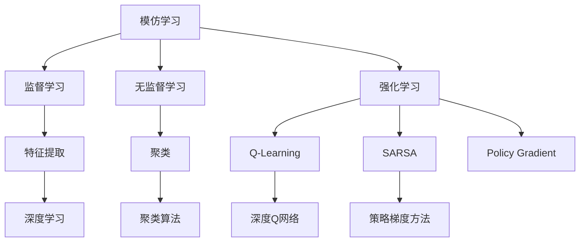

                 

# 从模仿学习到强化学习：AI发展的下一个里程碑

## 关键词
- 模仿学习
- 强化学习
- AI发展
- 机器学习算法
- 深度学习
- 机器人控制
- 游戏AI
- 推荐系统

## 摘要
本文将探讨人工智能（AI）发展过程中两个关键阶段：模仿学习和强化学习。首先，我们将回顾AI的起源和模仿学习的核心原理及其应用。随后，深入介绍强化学习的基本概念、算法原理及其在实际项目中的应用。最后，我们将探讨从模仿学习到强化学习的发展，展望AI未来的发展趋势，并分享相关的工具与资源。

## 目录

### 第一部分：AI基础概念

#### 1.1 AI发展历程与模仿学习
1.1.1 AI的定义与发展历程
1.1.2 模仿学习的原理与实现
1.1.3 模仿学习的优势与应用
1.2 模仿学习算法详解
1.2.1 监督学习
1.2.2 无监督学习
1.2.3 强化学习的基本概念
1.2.4 模仿学习与监督学习的比较
1.3 模仿学习的应用实例
1.3.1 自然语言处理中的应用
1.3.2 图像识别中的应用
1.3.3 自动驾驶技术中的应用

### 第二部分：强化学习原理

#### 2.1 强化学习的基本原理
2.1.1 强化学习的定义与特征
2.1.2 强化学习中的主要术语
2.1.3 强化学习的基本模型
#### 2.2 强化学习算法介绍
2.2.1 Q-Learning算法
2.2.2 SARSA算法
2.2.3 Deep Q-Networks算法
2.2.4 Policy Gradient算法
#### 2.3 强化学习算法的比较与选择
2.3.1 各算法的优缺点分析
2.3.2 选择强化学习算法的考虑因素
2.3.3 强化学习算法在实际项目中的应用案例

### 第三部分：强化学习应用实战

#### 3.1 强化学习在机器人控制中的应用
3.1.1 机器人控制问题简介
3.1.2 强化学习算法在机器人控制中的应用
3.1.3 机器人控制应用的案例分析
#### 3.2 强化学习在游戏中的应用
3.2.1 游戏问题的介绍
3.2.2 强化学习算法在游戏中的应用
3.2.3 游戏应用的案例分析
#### 3.3 强化学习在推荐系统中的应用
3.3.1 推荐系统问题简介
3.3.2 强化学习算法在推荐系统中的应用
3.3.3 推荐系统应用的案例分析

### 第四部分：从模仿学习到强化学习的发展

#### 4.1 模仿学习与强化学习的融合
4.1.1 融合学习的概念与原理
4.1.2 融合学习算法介绍
4.1.3 融合学习在AI中的应用案例
#### 4.2 AI发展的下一个里程碑
4.2.1 AI技术的未来发展趋势
4.2.2 强化学习在AI未来发展中的角色
4.2.3 强化学习带来的挑战与解决方案

### 第五部分：附录

#### 5.1 强化学习工具与资源介绍
5.1.1 OpenAI Gym
5.1.2 Stable Baselines
5.1.3 TensorFlow Agents
5.1.4 其他强化学习工具与资源介绍
#### 5.2 习题与案例分析
5.2.1 模仿学习习题与案例分析
5.2.2 强化学习习题与案例分析
5.2.3 融合学习习题与案例分析
#### 附录 A：参考文献

### Mermaid 流�程图
以下是一个简化的Mermaid流程图示例，展示了模仿学习和强化学习的关系：



### 第一部分：AI基础概念

#### 1.1 AI发展历程与模仿学习

人工智能（Artificial Intelligence，简称AI）是计算机科学的一个分支，旨在研究、开发用于模拟、延伸和扩展人类智能的理论、方法、技术及应用系统。AI的发展历程可以追溯到20世纪50年代，当时计算机科学家首次提出了“人工智能”这一概念，并开始探索如何让计算机表现出类似人类智能的行为。

**1.1.1 AI的定义与发展历程**

AI的定义多种多样，但可以简单概括为：模拟、延伸和扩展人类智能的理论、方法、技术及应用系统。AI的发展历程可以分为以下几个阶段：

1. **启蒙阶段（1950s-1960s）**：这个时期，人工智能首次被提出，并开始探索如何让计算机解决复杂问题。
2. **繁荣阶段（1970s-1980s）**：人工智能的研究得到了广泛关注和资助，算法如专家系统和知识表示技术得到了快速发展。
3. **低谷阶段（1990s）**：由于实际应用困难和技术瓶颈，人工智能的研究进入了一个相对低潮期。
4. **复兴阶段（2000s至今）**：随着计算机性能的提升、数据量的爆炸性增长以及深度学习等新算法的出现，人工智能再次迎来了快速发展。

**1.1.2 模仿学习的原理与实现**

模仿学习（Model-based Learning）是一种机器学习技术，它通过模仿人类或其他智能体在特定环境下的行为来学习。模仿学习的主要原理包括：

1. **环境感知**：智能体通过传感器获取环境信息，如视觉、听觉等。
2. **行为模仿**：智能体根据感知到的环境信息，模仿已知的最佳行为策略。
3. **奖励机制**：智能体在执行行为后，会接收到环境给予的奖励或惩罚，以此来调整和优化行为。

在实现方面，模仿学习通常需要以下几个步骤：

1. **数据收集**：收集大量关于环境和行为的样本数据。
2. **模型构建**：构建一个模型来表示环境和行为之间的关系。
3. **行为预测**：使用模型来预测在给定环境下执行特定行为的结果。
4. **行为优化**：根据预测结果，调整行为策略，以最大化奖励。

**1.1.3 模仿学习的优势与应用**

模仿学习的优势在于其简单性和高效性。通过模仿已有的成功策略，智能体可以快速适应新环境，避免了繁琐的手动编程过程。模仿学习在多个领域都有广泛的应用，包括：

1. **自然语言处理**：模仿人类的语言模式，用于自动文本生成和机器翻译。
2. **图像识别**：模仿人类视觉系统，用于物体识别和图像分类。
3. **自动驾驶**：模仿人类驾驶行为，用于实时环境感知和路径规划。
4. **机器人控制**：模仿人类操作员的动作，用于自动化任务执行。

#### 1.2 模仿学习算法详解

模仿学习算法可以分为两类：监督学习和无监督学习。这两类算法各有其特点和适用场景。

**1.2.1 监督学习**

监督学习（Supervised Learning）是一种模仿学习算法，它通过学习输入和输出之间的映射关系来预测新数据的结果。监督学习可以分为以下几种类型：

1. **回归分析**：用于预测连续值的输出，如房价预测。
2. **分类**：用于预测离散值的输出，如邮件分类。
3. **决策树**：通过构建树形结构，对数据进行分类或回归。
4. **神经网络**：通过多层神经网络，学习输入和输出之间的复杂映射关系。

**1.2.2 无监督学习**

无监督学习（Unsupervised Learning）是一种不依赖于外部监督信号的学习算法，它主要通过分析输入数据，寻找数据内在的结构和模式。无监督学习可以分为以下几种类型：

1. **聚类分析**：将相似的数据点归为一类，用于数据分群和异常检测。
2. **降维**：将高维数据映射到低维空间，用于数据可视化和去噪。
3. **关联规则学习**：发现数据之间的关联规则，用于推荐系统和市场细分。

**1.2.3 强化学习的基本概念**

强化学习（Reinforcement Learning，简称RL）是一种基于奖励机制的学习算法，它通过智能体在环境中采取行动，并根据行动的结果来调整其行为策略。强化学习的主要概念包括：

1. **智能体（Agent）**：执行行动的主体，如机器人或计算机程序。
2. **环境（Environment）**：智能体所处的环境，如游戏世界或现实世界。
3. **状态（State）**：描述智能体在环境中的情况，如棋盘上的棋子位置。
4. **行动（Action）**：智能体在特定状态下可以采取的行动，如走棋。
5. **奖励（Reward）**：智能体采取行动后，环境给出的奖励或惩罚，用于评价行动的好坏。
6. **策略（Policy）**：智能体在特定状态下采取的行动规则，如走棋的策略。

**1.2.4 模仿学习与监督学习的比较**

模仿学习和监督学习都是模仿学习算法的一部分，但它们在应用场景和实现方法上有所不同：

1. **应用场景**：模仿学习适用于有明确目标和结果的场景，如自动驾驶和游戏AI。监督学习适用于有监督信号的数据集，如图片分类和文本分类。
2. **实现方法**：模仿学习通常需要大量的数据来训练模型，并使用奖励机制来调整行为。监督学习则依赖于输入和输出之间的明确映射关系。

#### 1.3 模仿学习的应用实例

模仿学习在多个领域都有成功应用，以下列举了几个典型的应用实例：

**1.3.1 自然语言处理中的应用**

在自然语言处理（Natural Language Processing，简称NLP）领域，模仿学习被广泛应用于文本生成和语言翻译。例如，通过模仿人类作者的写作风格，可以生成高质量的文本。在机器翻译中，模仿学习算法通过分析大量的双语语料库，学习源语言和目标语言之间的对应关系，从而实现高效的机器翻译。

**1.3.2 图像识别中的应用**

在图像识别领域，模仿学习算法通过模仿人类的视觉系统，可以识别和分类图像中的物体。例如，通过模仿人类视觉神经元的工作方式，可以构建卷积神经网络（Convolutional Neural Networks，简称CNN）来实现图像分类。模仿学习算法在人脸识别、物体检测和自动驾驶等场景中都有广泛应用。

**1.3.3 自动驾驶技术中的应用**

在自动驾驶技术中，模仿学习算法被用于环境感知和路径规划。自动驾驶系统通过模仿人类驾驶员的观察和行为，学习如何在复杂交通环境中做出正确的决策。例如，通过模仿人类驾驶员在特定路况下的行为，可以训练自动驾驶系统在高速路上自动行驶。

### 第二部分：强化学习原理

#### 2.1 强化学习的基本原理

强化学习（Reinforcement Learning，简称RL）是一种机器学习范式，它通过智能体（Agent）与环境（Environment）的交互来学习最优策略。与监督学习和无监督学习不同，强化学习不依赖于标记数据，而是通过探索（Exploration）和利用（Exploitation）的平衡来逐步优化行为。

**2.1.1 强化学习的定义与特征**

强化学习的基本定义可以概括为：一个智能体在一个环境中，通过选择行动并接收奖励信号，以最大化累积奖励的过程。

强化学习具有以下几个特征：

1. **交互性**：智能体与环境之间进行动态的交互。
2. **奖励机制**：环境通过奖励信号反馈智能体的行动效果。
3. **不确定性**：智能体需要处理环境中的不确定性。
4. **策略优化**：通过不断调整策略，智能体试图达到最大化累积奖励的目标。

**2.1.2 强化学习中的主要术语**

在强化学习中，有一些关键的术语需要理解：

1. **状态（State）**：智能体当前所处的环境条件。
2. **行动（Action）**：智能体在特定状态下可以采取的行为。
3. **奖励（Reward）**：环境对智能体采取行动后给予的即时反馈，可以是正奖励或负奖励。
4. **策略（Policy）**：智能体在特定状态下采取的行动规则，可以是一个函数，从状态空间映射到动作空间。
5. **价值函数（Value Function）**：预测在特定状态下采取特定行动所能获得的长期奖励，包括状态-价值函数（State-Value Function）和动作-价值函数（Action-Value Function）。
6. **模型（Model）**：描述环境动态和奖励分布的数学模型。
7. **探索（Exploration）**：在未知环境中，智能体采取随机行动以获取更多信息的策略。
8. **利用（Exploitation）**：在已知信息下，智能体选择能够最大化当前预期奖励的行动。

**2.1.3 强化学习的基本模型**

强化学习的基本模型通常包括以下几个部分：

1. **智能体（Agent）**：执行行动并学习策略的主体。
2. **环境（Environment）**：智能体所处的动态环境，提供状态、行动和奖励。
3. **状态空间（State Space）**：所有可能的状态集合。
4. **动作空间（Action Space）**：所有可能的行动集合。
5. **策略（Policy）**：智能体的行为规则，通常表示为概率分布。
6. **价值函数（Value Function）**：评估状态或状态-行动对的预期奖励。
7. **奖励函数（Reward Function）**：根据智能体的行动提供即时奖励。

强化学习过程可以概括为以下几个步骤：

1. **初始化**：智能体随机选择初始状态。
2. **采取行动**：根据当前状态和策略选择行动。
3. **接收奖励**：环境根据行动提供即时奖励。
4. **更新状态**：智能体更新当前状态。
5. **策略迭代**：通过反馈调整策略，以最大化累积奖励。

#### 2.2 强化学习算法介绍

强化学习算法种类繁多，不同的算法适用于不同的应用场景。以下是几种常见的强化学习算法及其原理。

**2.2.1 Q-Learning算法**

Q-Learning算法是一种基于值函数的强化学习算法，它通过迭代更新状态-动作值函数（Q值）来学习最优策略。

**算法原理：**

1. **初始化Q值**：对所有的状态-动作对初始化Q值。
2. **选择动作**：根据ε-贪心策略选择动作，ε为探索概率。
3. **更新Q值**：根据接收的奖励和下一个状态-动作值函数更新当前状态-动作值。
4. **重复步骤2和3**：不断重复选择动作和更新Q值，直到策略收敛。

**伪代码：**

```python
# 初始化Q值
Q = 初始化Q值矩阵

# 设置参数
ε = 探索概率
α = 学习率
γ = 折扣因子

# 强化学习循环
while 未收敛：
    # 选择动作
    if 随机数 < ε：
        a = 随机选择动作
    else：
        a = 选择最大化Q值的动作

    # 执行动作
    s, r, s' = 环境执行动作a

    # 更新Q值
    Q[s][a] = Q[s][a] + α * (r + γ * max(Q[s'][a']) - Q[s][a])
```

**2.2.2 SARSA算法**

SARSA（同步优势估计）算法是一种基于策略的强化学习算法，它同时更新当前状态和下一个状态的动作值。

**算法原理：**

1. **初始化Q值**：对所有的状态-动作对初始化Q值。
2. **选择动作**：根据当前状态和策略选择动作。
3. **执行动作**：执行选定的动作，并接收奖励。
4. **更新Q值**：根据当前状态、动作、接收的奖励和下一个状态-动作值函数更新当前状态-动作值。

**伪代码：**

```python
# 初始化Q值
Q = 初始化Q值矩阵

# 设置参数
ε = 探索概率
α = 学习率
γ = 折扣因子

# 强化学习循环
while 未收敛：
    # 选择动作
    if 随机数 < ε：
        a = 随机选择动作
    else：
        a = 选择最大化Q值的动作

    # 执行动作
    s, r, s' = 环境执行动作a

    # 更新Q值
    Q[s][a] = Q[s][a] + α * (r + γ * Q[s'][a'])
```

**2.2.3 Deep Q-Networks算法**

Deep Q-Networks（DQN）算法是一种基于深度学习的强化学习算法，它使用神经网络来近似状态-动作值函数。

**算法原理：**

1. **初始化**：初始化深度神经网络和目标网络。
2. **选择动作**：使用ε-贪心策略选择动作。
3. **执行动作**：执行选定的动作，并接收奖励。
4. **经验回放**：将经验数据存储在经验回放池中，以避免策略偏差。
5. **更新目标网络**：定期更新目标网络以减少梯度消失问题。
6. **更新Q值**：使用反向传播算法更新神经网络参数。

**伪代码：**

```python
# 初始化神经网络和目标网络
target_network = 初始化神经网络
Q_network = 初始化神经网络

# 设置参数
ε = 探索概率
α = 学习率
γ = 折扣因子
经验回放池 = 初始化经验回放池

# 强化学习循环
while 未收敛：
    # 选择动作
    if 随机数 < ε：
        a = 随机选择动作
    else：
        a = Q_network(s)

    # 执行动作
    s', r = 环境执行动作a

    # 存储经验
    经验回放池存储((s, a, r, s'))

    # 从经验回放池中随机抽样
    s', a', r, s = 随机抽样经验回放池

    # 计算目标Q值
    target_q = r + γ * max(Q_network(s'))

    # 更新Q值
    Q_network(s, a) = Q_network(s, a) + α * (target_q - Q_network(s, a))
```

**2.2.4 Policy Gradient算法**

Policy Gradient（PG）算法是一种基于策略的强化学习算法，它直接优化策略概率分布。

**算法原理：**

1. **初始化**：初始化策略网络。
2. **选择动作**：根据策略网络选择动作。
3. **执行动作**：执行选定的动作，并接收奖励。
4. **计算策略梯度**：根据奖励和策略概率计算策略梯度。
5. **更新策略网络**：使用梯度下降更新策略网络参数。

**伪代码：**

```python
# 初始化策略网络
policy_network = 初始化神经网络

# 设置参数
α = 学习率
θ = 策略网络参数

# 强化学习循环
while 未收敛：
    # 选择动作
    a = policy_network(s)

    # 执行动作
    s', r = 环境执行动作a

    # 计算策略梯度
    gradient = 计算策略梯度(s, a, r)

    # 更新策略网络
    policy_network更新参数(θ, α, gradient)
```

#### 2.3 强化学习算法的比较与选择

强化学习算法种类繁多，每种算法都有其优缺点和适用场景。以下是对几种常见强化学习算法的比较和选择因素：

**2.3.1 各算法的优缺点分析**

1. **Q-Learning算法**：
   - 优点：简单易懂，适用于静态环境。
   - 缺点：在动态环境中表现较差，容易陷入局部最优。

2. **SARSA算法**：
   - 优点：同时更新当前和下一个状态的动作值，更稳健。
   - 缺点：在连续动作空间中性能较差。

3. **Deep Q-Networks算法**：
   - 优点：使用深度神经网络，适用于复杂状态和动作空间。
   - 缺点：训练过程较慢，容易出现过拟合。

4. **Policy Gradient算法**：
   - 优点：直接优化策略，适用于高维状态空间。
   - 缺点：容易出现梯度消失和梯度爆炸问题。

**2.3.2 选择强化学习算法的考虑因素**

选择合适的强化学习算法需要考虑以下几个因素：

1. **环境类型**：静态环境适合Q-Learning算法，动态环境适合SARSA算法和DQN算法。
2. **状态和动作空间**：状态和动作空间较简单时，可以选择Q-Learning算法；状态和动作空间较复杂时，可以选择DQN算法或Policy Gradient算法。
3. **学习效率和稳定性**：需要考虑算法的学习效率和高

