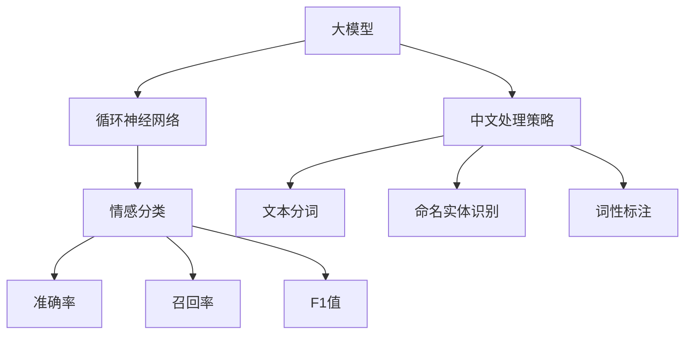

                 

### 1. 第1章：大模型的定义与循环神经网络基础

#### 1.1 大模型的定义与意义

**1.1.1 大模型的发展历程**

大模型的概念起源于深度学习领域，随着计算能力的提升和大数据的广泛应用，深度学习模型变得越来越庞大。回顾大模型的发展历程，我们可以将其划分为几个阶段：

1. **早期神经网络（1980s-1990s）**：这一时期的神经网络模型规模较小，以多层感知机（MLP）和卷积神经网络（CNN）为代表，主要用于简单的图像识别和分类任务。

2. **深度学习复兴（2006-2012）**：2006年，Hinton等人提出了深度信念网络（DBN），为深度学习模型的训练提供了新的方法。随后，2012年，AlexNet在ImageNet竞赛中取得了突破性的成绩，标志着深度学习的复兴。

3. **大规模模型兴起（2013-至今）**：随着计算资源和数据量的增加，深度学习模型逐渐变得更加复杂和庞大。以Google的Transformer模型和OpenAI的GPT为代表，大模型在自然语言处理、计算机视觉等领域取得了显著的成果。

**1.1.2 大模型的核心概念**

大模型通常具有以下核心概念：

1. **参数规模**：大模型的参数数量通常在数百万到数十亿之间，这使得模型能够捕捉到更多的特征和模式。

2. **训练数据量**：大模型往往需要大量的训练数据来训练，这是因为模型参数众多，需要通过大量数据来确保模型能够学到有效的知识。

3. **计算资源需求**：大模型对计算资源的需求较高，需要强大的GPU或TPU等硬件支持。

**1.1.3 大模型的意义**

大模型在深度学习领域具有重要意义，主要体现在以下几个方面：

1. **提高模型性能**：大模型能够通过更多的参数和更大的数据量来提高模型的学习能力，从而在各类任务中取得更好的性能。

2. **减少对标注数据的依赖**：大模型通过预训练的方式，可以在没有特定任务标注数据的情况下，通过无监督或弱监督学习来提取通用的特征表示，从而减少对大量标注数据的依赖。

#### 1.2 循环神经网络（RNN）概述

**1.2.1 RNN的基本原理**

循环神经网络（Recurrent Neural Network，RNN）是一种能够处理序列数据的神经网络。其基本原理是通过隐藏状态（hidden state）的循环来捕捉序列中的时间依赖关系。RNN的隐藏状态不仅可以表示当前时刻的信息，还可以包含之前时刻的信息，这使得RNN能够处理变长序列。

RNN的基本结构包括三个主要部分：

1. **输入层**：输入层接收序列中的每个元素作为输入。

2. **隐藏层**：隐藏层包含一个或多个隐藏状态，这些状态通过循环连接来传递信息。

3. **输出层**：输出层将隐藏状态映射到输出，可以是标签、概率分布或其他形式的输出。

RNN的工作原理可以概括为以下步骤：

1. **输入**：序列中的每个元素作为输入传递给RNN。

2. **隐藏状态更新**：RNN使用当前输入和上一个隐藏状态来更新当前隐藏状态。

3. **输出生成**：RNN使用当前隐藏状态来生成输出。

4. **循环**：隐藏状态传递到下一个时间步骤，继续上述过程。

**1.2.2 RNN的类型**

RNN根据隐藏状态的传递方式可以分为以下几种类型：

1. **静态RNN**：静态RNN在每个时间步骤只使用上一个时间步的隐藏状态，而不进行状态的循环。

2. **动态RNN**：动态RNN在隐藏状态之间建立循环连接，允许信息在隐藏状态之间传递，能够更好地捕捉长序列中的依赖关系。

**1.2.3 RNN的应用场景**

RNN在许多应用场景中表现出色，主要包括以下几个方面：

1. **序列预测**：RNN能够处理时间序列数据，如股票价格预测、天气预测等。

2. **文本生成**：RNN能够生成连贯的文本，如自动写作、诗歌生成等。

3. **情感分类**：RNN能够处理包含情感极性的文本，如社交媒体情感分析、客户服务自动化等。

#### 1.3 RNN在情感分类中的优势

**1.3.1 RNN处理序列数据的优势**

RNN在处理序列数据时具有以下优势：

1. **保留上下文信息**：RNN能够通过隐藏状态保留序列中的上下文信息，这使得RNN能够更好地理解文本中的情感表达。

2. **对长文本理解能力强**：由于RNN的循环结构，RNN能够处理变长的序列，这使得RNN能够处理长文本，如新闻报道、用户评论等。

**1.3.2 RNN在情感分类中的优势**

RNN在情感分类任务中具有以下优势：

1. **对情感关键词的捕捉**：RNN能够捕捉文本中的情感关键词，通过分析关键词的情感极性来分类文本。

2. **对情感极性变化的敏感性**：RNN能够检测文本中的情感极性变化，如从积极到消极的转变，从而提高情感分类的准确性。

**1.3.3 RNN与情感分类的结合**

RNN与情感分类的结合主要体现在以下几个方面：

1. **基于RNN的情感分类模型构建**：通过将RNN应用于情感分类任务，构建基于RNN的情感分类模型。

2. **RNN在情感分类中的实际应用案例**：在实际应用中，RNN在情感分类任务中取得了显著的成果，如社交媒体情感分析、客户服务自动化等。

### 总结

本章介绍了大模型的概念、定义及其意义，以及循环神经网络（RNN）的基本原理和应用场景。通过本章的学习，读者可以对大模型和RNN有更深入的了解，为后续章节的情感分类实战打下基础。

---

## 第2章：中文情感分类基本概念

### 2.1 中文语言特点与处理策略

#### 2.1.1 中文语言的复杂性

中文作为一种语义丰富的语言，具有以下几个特点：

1. **语法结构**：中文的语法结构相对灵活，词序变化丰富，可以表达不同的语义。

2. **词义多义性**：中文词汇具有多义性，同一个词汇在不同的上下文中可以表达不同的意思。

3. **上下文依赖**：中文表达往往依赖于上下文，一个词在一个句子中的含义可能因为上下文的不同而发生变化。

#### 2.1.2 中文处理策略

为了处理中文语言的复杂性，需要采用一系列策略：

1. **分词**：分词是将连续的中文文本分割成有意义的词。常用的分词工具包括jieba、Stanford NLP等。

2. **命名实体识别**：命名实体识别（Named Entity Recognition，NER）是识别文本中的命名实体，如人名、地名、组织名等。这对于情感分类尤为重要，因为情感通常与特定实体相关。

3. **词性标注**：词性标注是将文本中的每个词标注为不同的词性，如名词、动词、形容词等。词性标注有助于理解词汇的语义。

#### 2.1.3 处理策略的具体实现

以下是处理中文文本的基本步骤：

1. **文本读取**：读取中文文本数据。

2. **分词**：使用分词工具对文本进行分词处理。

3. **命名实体识别**：使用命名实体识别工具对文本进行命名实体识别。

4. **词性标注**：对分词后的文本进行词性标注。

5. **文本清洗**：去除停用词、标点符号等无关信息。

6. **文本表示**：将清洗后的文本转换为数字表示，如词向量或 embeddings。

### 2.2 情感分类任务概述

#### 2.2.1 情感分类的定义

情感分类（Sentiment Classification）是一种自然语言处理任务，其目标是判断文本的情感极性，通常分为积极、消极和中性三种。

#### 2.2.2 情感分类的类型

情感分类可以分为以下几种类型：

1. **二元分类**：文本被分类为积极或消极，中性通常作为一类。

2. **三元分类**：文本被分类为积极、消极或中性。

3. **多标签分类**：文本被分类为多个情感标签，如积极、消极、愤怒、高兴等。

#### 2.2.3 情感分类的评价指标

情感分类任务的评价指标通常包括：

1. **准确率**（Accuracy）：正确分类的文本数量占总文本数量的比例。

2. **召回率**（Recall）：正确分类为积极或消极的文本数量占所有实际积极或消极文本数量的比例。

3. **精确率**（Precision）：正确分类为积极或消极的文本数量占被分类为积极或消极的文本数量的比例。

4. **F1值**（F1 Score）：精确率和召回率的调和平均值，用于综合评价分类性能。

#### 2.2.4 情感分类的应用领域

情感分类在多个领域有广泛的应用：

1. **社交媒体分析**：分析用户评论、微博等社交媒体内容的情感倾向。

2. **客户服务**：通过分析客户反馈的情感，优化客户服务体验。

3. **市场调研**：分析用户对产品或服务的情感，为市场策略提供支持。

### 2.3 情感分类数据集介绍

#### 2.3.1 数据集来源

情感分类数据集的来源通常包括：

1. **公开数据集**：如Sogou情感分类数据集、NLPCC情感分类数据集等。

2. **自建数据集**：企业或研究机构根据自身需求自行收集和标注的数据集。

#### 2.3.2 数据集构建方法

构建情感分类数据集通常包括以下步骤：

1. **数据采集**：收集包含情感标签的文本数据。

2. **数据清洗**：去除无效数据、噪声和重复数据。

3. **数据标注**：对文本进行情感极性标注，通常采用二元或三元分类。

4. **数据集划分**：将数据集划分为训练集、验证集和测试集。

#### 2.3.3 数据集示例

以下是两个常用的中文情感分类数据集：

1. **Sogou情感分类数据集**：包含约1.5万条包含情感极性的评论，分为积极、消极和中性三类。

2. **NLPCC情感分类数据集**：包含约1.8万条包含情感极性的微博评论，分为积极、消极、愤怒、高兴等类别。

### 总结

本章介绍了中文语言的特点以及处理中文语言的情感分类任务。通过本章的学习，读者可以了解中文处理策略、情感分类任务的定义和类型，以及常用的情感分类数据集。这些知识将为后续章节的循环神经网络情感分类实战奠定基础。

---

## 第3章：循环神经网络原理

### 3.1 RNN的基本结构

循环神经网络（RNN）是一种能够处理序列数据的神经网络。其基本结构包括输入层、隐藏层和输出层。

#### 3.1.1 输入层

输入层接收序列中的每个元素作为输入。在中文情感分类任务中，输入通常是经过预处理后的文本序列。

#### 3.1.2 隐藏层

隐藏层包含一个或多个隐藏状态，这些状态通过循环连接来传递信息。隐藏状态不仅依赖于当前的输入，还依赖于之前的隐藏状态。

#### 3.1.3 输出层

输出层将隐藏状态映射到输出，可以是情感标签的概率分布或分类结果。

#### 3.1.4 循环连接

循环连接是RNN的核心特征，允许隐藏状态在时间步之间传递。这种循环结构使得RNN能够处理变长序列，并捕捉序列中的时间依赖关系。

### 3.2 隐藏状态与输出状态

#### 3.2.1 隐藏状态的作用

隐藏状态在RNN中起着至关重要的作用：

1. **上下文信息保留**：隐藏状态能够保留序列中的上下文信息，使得RNN能够更好地理解序列数据。

2. **序列建模**：隐藏状态通过循环连接，能够捕捉序列中的依赖关系，从而实现序列建模。

#### 3.2.2 输出状态的生成

输出状态是通过隐藏状态和输出层生成的。具体来说，输出状态的生成过程通常包括以下几个步骤：

1. **隐藏状态传递**：当前隐藏状态通过循环连接传递到下一个时间步。

2. **输出层计算**：使用隐藏状态通过全连接层计算输出概率分布或分类结果。

3. **激活函数**：通常使用sigmoid或softmax函数来激活输出层，使得输出状态具有概率分布或分类性质。

### 3.3 RNN的优缺点分析

#### 3.3.1 RNN的优点

RNN在处理序列数据方面具有以下优点：

1. **处理变长序列**：RNN能够处理任意长度的序列，这使得RNN在文本处理、时间序列分析等领域具有广泛的应用。

2. **上下文信息保留**：通过隐藏状态的循环连接，RNN能够保留序列中的上下文信息，从而更好地理解序列数据。

3. **灵活性**：RNN可以根据序列的长度和复杂度灵活调整模型结构。

#### 3.3.2 RNN的缺点

RNN在训练过程中也存在一些缺点：

1. **梯度消失与梯度爆炸**：在训练过程中，RNN容易出现梯度消失或梯度爆炸问题，这会影响模型的训练效果。

2. **训练速度慢**：由于RNN需要处理序列数据，训练时间通常较长。

3. **难以捕捉长距离依赖**：RNN在处理长序列时，难以捕捉长距离的依赖关系，这会影响模型的性能。

#### 3.3.3 改进RNN模型

为了解决RNN的缺点，研究人员提出了多种改进模型：

1. **长短期记忆网络（LSTM）**：LSTM通过引入记忆单元和门控机制，解决了梯度消失和梯度爆炸问题，并能够捕捉长距离依赖。

2. **门控循环单元（GRU）**：GRU是LSTM的简化版，通过合并输入门和遗忘门，提高了计算效率。

3. **双向循环神经网络（BiRNN）**：BiRNN通过同时处理正向和反向序列，增强了模型对序列数据的理解能力。

### 总结

本章介绍了循环神经网络的基本结构、隐藏状态与输出状态的作用，以及RNN的优缺点。通过本章的学习，读者可以了解RNN的工作原理和改进方法，为后续章节的情感分类实战奠定理论基础。

---

## 第4章：循环神经网络数学模型

### 4.1 RNN的数学公式与推导

#### 4.1.1 前向传播

RNN的前向传播过程包括以下几个步骤：

1. **输入层到隐藏层的传递**：

   $$ h_t = \sigma(W_h \cdot [h_{t-1}, x_t] + b_h) $$

   其中，$h_t$表示当前时间步的隐藏状态，$x_t$表示当前输入，$W_h$表示隐藏层权重，$b_h$表示隐藏层偏置，$\sigma$表示激活函数。

2. **隐藏层到输出层的传递**：

   $$ y_t = \sigma(W_y \cdot h_t + b_y) $$

   其中，$y_t$表示当前时间步的输出，$W_y$表示输出层权重，$b_y$表示输出层偏置。

#### 4.1.2 反向传播

RNN的反向传播过程用于计算梯度，主要包括以下几个步骤：

1. **计算输出层的误差**：

   $$ \delta_t = (y_t - \hat{y_t}) \cdot (1 - \sigma'(h_t)) $$

   其中，$\delta_t$表示当前时间步的输出误差，$\hat{y_t}$表示实际输出，$\sigma'$表示激活函数的导数。

2. **计算隐藏层的误差**：

   $$ \delta_{t-1} = \delta_t \cdot (W_y') \cdot (1 - \sigma'(h_{t-1})) \cdot h_{t-1} $$

   其中，$W_y'$表示输出层权重转置，$h_{t-1}$表示上一时间步的隐藏状态。

3. **计算隐藏状态的梯度**：

   $$ \frac{dL}{dh_{t-1}} = \delta_{t-1} \cdot x_{t-1} $$

   其中，$L$表示损失函数，$x_{t-1}$表示上一时间步的输入。

4. **计算输入层的梯度**：

   $$ \frac{dL}{dx_{t-1}} = \delta_{t-1} $$

### 4.2 反向传播算法

#### 4.2.1 基本原理

反向传播算法的基本原理是通过计算输出误差来更新模型参数，具体步骤如下：

1. **前向传播**：计算网络输出。

2. **计算误差**：计算实际输出与期望输出之间的误差。

3. **反向传播**：从输出层开始，逐层向前计算梯度。

4. **参数更新**：使用梯度更新模型参数。

#### 4.2.2 梯度计算

在反向传播过程中，需要计算各个层的梯度。以下是梯度计算的具体步骤：

1. **计算隐藏层的梯度**：

   $$ \frac{dL}{dW_h} = \sum_{t} \delta_t \cdot [h_{t-1}, x_t]^\intercal $$

   $$ \frac{dL}{db_h} = \sum_{t} \delta_t $$

2. **计算输出层的梯度**：

   $$ \frac{dL}{dW_y} = \sum_{t} \delta_t \cdot h_t^\intercal $$

   $$ \frac{dL}{db_y} = \sum_{t} \delta_t $$

#### 4.2.3 梯度优化

梯度优化是使用梯度来更新模型参数的过程。常见的梯度优化算法包括：

1. **梯度下降（Gradient Descent）**：

   $$ W_h \leftarrow W_h - \alpha \cdot \frac{dL}{dW_h} $$

   $$ b_h \leftarrow b_h - \alpha \cdot \frac{dL}{db_h} $$

   $$ W_y \leftarrow W_y - \alpha \cdot \frac{dL}{dW_y} $$

   $$ b_y \leftarrow b_y - \alpha \cdot \frac{dL}{db_y} $$

   其中，$\alpha$表示学习率。

2. **动量（Momentum）**：

   $$ v_h \leftarrow \beta \cdot v_h - \alpha \cdot \frac{dL}{dW_h} $$

   $$ v_b \leftarrow \beta \cdot v_b - \alpha \cdot \frac{dL}{db_h} $$

   $$ v_y \leftarrow \beta \cdot v_y - \alpha \cdot \frac{dL}{dW_y} $$

   $$ v_b \leftarrow \beta \cdot v_b - \alpha \cdot \frac{dL}{db_y} $$

   $$ W_h \leftarrow W_h + v_h $$

   $$ b_h \leftarrow b_h + v_b $$

   $$ W_y \leftarrow W_y + v_y $$

   $$ b_y \leftarrow b_y + v_b $$

   其中，$\beta$表示动量因子。

### 4.3 RNN优化算法

为了提高RNN的训练效果，研究人员提出了一些优化算法，主要包括：

#### 4.3.1 梯度裁剪（Gradient Clipping）

梯度裁剪用于防止梯度消失和梯度爆炸问题，具体方法是将梯度限制在一个范围内。假设梯度裁剪阈值为$\theta$，则：

$$ \frac{dL}{dW} \leftarrow \frac{\frac{dL}{dW}}{\max(1, \frac{\lVert \frac{dL}{dW} \rVert_2}{\theta})} $$

其中，$\lVert \cdot \rVert_2$表示向量的L2范数。

#### 4.3.2 批量归一化（Batch Normalization）

批量归一化用于提高训练稳定性，其核心思想是标准化每个批次的输入。具体方法是将每个特征的值缩放到均值为0、标准差为1的范围内。

$$ x_{\text{normalized}} = \frac{x - \mu}{\sigma} $$

其中，$\mu$和$\sigma$分别表示均值和标准差。

### 总结

本章介绍了循环神经网络（RNN）的数学模型，包括前向传播、反向传播和参数优化。通过本章的学习，读者可以理解RNN的数学原理，为实际应用打下基础。

---

## 第5章：情感分类项目实战

### 5.1 项目背景与目标

#### 5.1.1 项目背景

随着互联网的快速发展，社交媒体和电子商务平台上的用户生成内容（UGC）如评论、微博、论坛等日益增多。这些内容中蕴含着丰富的用户情感信息，对于企业了解用户需求、优化产品和服务具有重要意义。因此，情感分类作为一种自然语言处理技术，在多个领域得到了广泛应用。

#### 5.1.2 项目目标

本项目的目标是构建一个基于循环神经网络（RNN）的情感分类系统，对中文用户生成内容进行情感分类，以帮助企业和研究机构更好地理解用户情感，优化产品和服务。

#### 5.1.3 项目步骤

本项目主要包括以下步骤：

1. **数据采集与预处理**：收集并清洗用户生成内容数据，进行分词、去停用词、词性标注等预处理操作。
2. **模型设计**：设计基于RNN的情感分类模型，包括输入层、隐藏层和输出层。
3. **模型训练**：使用预处理后的数据对模型进行训练，调整模型参数以优化性能。
4. **模型评估**：使用测试集评估模型性能，计算准确率、召回率、F1值等指标。
5. **模型部署**：将训练好的模型部署到生产环境，实现实时情感分类。

### 5.2 数据预处理

#### 5.2.1 数据采集

本项目的数据来源于多个社交媒体平台和电子商务网站，包括评论、微博、论坛等。数据采集步骤如下：

1. **爬取数据**：使用Python的requests库和BeautifulSoup库，爬取用户生成内容。
2. **存储数据**：将采集到的数据存储到本地文件或数据库中。

#### 5.2.2 数据清洗

数据清洗是确保数据质量的重要步骤，主要包括以下操作：

1. **去除HTML标签**：使用Python的正则表达式库（re），去除文本中的HTML标签。
2. **去除停用词**：使用jieba分词工具，去除文本中的停用词，如“的”、“了”、“是”等。
3. **标点符号处理**：使用jieba分词工具，将文本中的标点符号转换为空格或去除。

#### 5.2.3 数据预处理流程

数据预处理流程如下：

1. **读取数据**：从本地文件或数据库中读取数据。
2. **去除HTML标签**：使用正则表达式去除文本中的HTML标签。
3. **分词**：使用jieba分词工具对文本进行分词。
4. **去除停用词**：使用jieba分词工具，去除文本中的停用词。
5. **词性标注**：使用jieba分词工具，对文本进行词性标注。
6. **序列化**：将处理后的文本序列化为数字序列，用于后续模型训练。

### 5.3 RNN模型设计

#### 5.3.1 模型结构

本项目的情感分类模型采用基于LSTM的循环神经网络（RNN）。模型结构包括输入层、隐藏层和输出层。

1. **输入层**：输入层接收预处理后的文本序列，每个时间步的输入是一个词向量。
2. **隐藏层**：隐藏层包含一个LSTM层，用于捕捉文本序列中的时间依赖关系。
3. **输出层**：输出层是一个全连接层，用于生成情感分类结果。

#### 5.3.2 模型参数

模型参数包括：

1. **学习率**：学习率设置为0.001。
2. **批大小**：批大小设置为64。
3. **迭代次数**：迭代次数设置为10。
4. **LSTM层单元数**：LSTM层单元数设置为128。

#### 5.3.3 模型训练

模型训练步骤如下：

1. **初始化模型**：使用TensorFlow框架初始化模型。
2. **编译模型**：编译模型，设置优化器和损失函数。
3. **训练模型**：使用训练数据训练模型，调整模型参数。
4. **验证模型**：使用验证数据验证模型性能。

### 5.4 模型训练与调优

#### 5.4.1 训练流程

模型训练流程如下：

1. **数据预处理**：对训练数据和验证数据进行预处理，包括分词、去停用词、序列化等操作。
2. **初始化模型**：使用TensorFlow框架初始化基于LSTM的RNN模型。
3. **编译模型**：设置优化器和损失函数，例如使用Adam优化器和交叉熵损失函数。
4. **训练模型**：使用训练数据训练模型，并使用验证数据验证模型性能。
5. **调优模型**：根据验证集上的性能，调整模型参数，如学习率、迭代次数等。

#### 5.4.2 调优策略

在模型训练过程中，可能需要调整以下参数：

1. **学习率**：学习率对模型训练效果有很大影响。通常需要通过多次实验找到合适的值。
2. **迭代次数**：迭代次数决定了模型训练的深度。过多的迭代可能导致过拟合，过少的迭代可能导致欠拟合。
3. **批大小**：批大小会影响模型的训练速度和稳定性。较大的批大小可以提高训练速度，但可能导致模型不稳定。
4. **LSTM层单元数**：LSTM层单元数决定了模型能够捕捉的序列长度和复杂度。过大的单元数可能导致梯度消失和梯度爆炸问题。

#### 5.4.3 性能优化

为了提高模型性能，可以采取以下策略：

1. **批量归一化（Batch Normalization）**：批量归一化可以加速训练过程并提高模型性能。
2. **dropout**：dropout可以减少模型过拟合，提高泛化能力。
3. **数据增强（Data Augmentation）**：通过随机变换、噪声添加等方法增加训练数据量，提高模型鲁棒性。

### 5.5 模型评估与结果分析

#### 5.5.1 评估指标

在模型评估过程中，常用的指标包括：

1. **准确率（Accuracy）**：准确率表示模型正确分类的样本数占总样本数的比例。
2. **召回率（Recall）**：召回率表示模型正确分类为正类的样本数占实际正类样本数的比例。
3. **精确率（Precision）**：精确率表示模型正确分类为正类的样本数占预测为正类的样本数的比例。
4. **F1值（F1 Score）**：F1值是精确率和召回率的调和平均值，用于综合评价模型性能。

#### 5.5.2 结果分析

在项目实践中，通过评估指标对模型性能进行分析，具体步骤如下：

1. **计算评估指标**：使用测试集计算准确率、召回率、精确率和F1值等指标。
2. **分析评估结果**：分析评估结果，找出模型的优势和不足，为后续优化提供依据。
3. **可视化评估结果**：使用图表（如混淆矩阵、ROC曲线等）可视化评估结果，帮助更好地理解模型性能。

### 总结

本章介绍了情感分类项目实战的全过程，包括项目背景、数据预处理、模型设计、模型训练与调优、模型评估与结果分析。通过本章的学习，读者可以了解如何使用RNN进行情感分类，掌握项目实战的各个环节。

---

## 第6章：大规模情感分类模型微调

### 6.1 预训练模型介绍

#### 6.1.1 预训练的概念

预训练（Pre-training）是指在一个大规模、通用的数据集上预先训练一个模型，使其获得一定的通用语言表示能力。预训练模型通常用于自然语言处理任务，如文本分类、情感分类、命名实体识别等。

#### 6.1.2 预训练模型的优势

预训练模型具有以下优势：

1. **提高模型性能**：预训练模型在通用数据集上已经学习到了丰富的语言知识，这有助于提高模型在特定任务上的性能。

2. **减少对标注数据的依赖**：通过预训练，模型能够在没有特定任务标注数据的情况下，通过迁移学习（Transfer Learning）快速适应新任务。

3. **通用性**：预训练模型能够学习到通用语言表示，使得模型在不同任务之间具有较好的迁移能力。

#### 6.1.3 主流预训练模型

当前主流的预训练模型主要包括以下几种：

1. **BERT（Bidirectional Encoder Representations from Transformers）**：BERT是一种基于Transformer的预训练模型，通过双向编码器学习文本的上下文信息。

2. **GPT（Generative Pre-trained Transformer）**：GPT是一种基于Transformer的生成模型，通过自回归方式生成文本。

3. **RoBERTa（A Robustly Optimized BERT Pretraining Approach）**：RoBERTa是对BERT模型的改进版本，通过引入更多的数据集和改进的训练策略，提高了模型性能。

### 6.2 微调技术

#### 6.2.1 微调原理

微调（Fine-tuning）是指在一个小规模、特定任务的数据集上对预训练模型进行少量训练，以适应新任务的需求。微调的过程主要包括以下几个步骤：

1. **初始化模型**：从预训练模型中初始化参数。

2. **调整参数**：针对特定任务，调整部分参数以适应新任务。

3. **训练模型**：使用特定任务的数据集对模型进行训练。

4. **评估模型**：在测试集上评估模型性能。

#### 6.2.2 微调流程

微调流程可以分为以下几个阶段：

1. **数据预处理**：对特定任务的数据集进行预处理，包括分词、去停用词、序列化等操作。

2. **模型初始化**：从预训练模型中初始化参数，可以使用全量参数初始化或部分参数初始化。

3. **调整参数**：根据任务需求，调整部分参数。例如，在情感分类任务中，通常只调整输出层的参数。

4. **训练模型**：使用特定任务的数据集对模型进行训练，调整参数以优化模型性能。

5. **评估模型**：在测试集上评估模型性能，计算准确率、召回率、F1值等指标。

#### 6.2.3 微调策略

在进行微调时，以下策略有助于提高模型性能：

1. **学习率调整**：在微调过程中，需要适当调整学习率，通常采用较小的学习率进行微调。

2. **模型参数冻结**：在微调过程中，可以冻结部分参数，只调整与任务相关的参数。

3. **批量归一化**：批量归一化可以提高训练稳定性，减少过拟合。

4. **数据增强**：通过数据增强，如随机添加噪声、旋转、缩放等，可以增加模型对数据的鲁棒性。

### 6.3 微调案例与代码实现

#### 6.3.1 案例背景

本项目使用预训练的BERT模型进行情感分类任务的微调。数据集为Sogou情感分类数据集，包含约1.5万条包含情感极性的评论。

#### 6.3.2 代码实现

以下是微调BERT模型进行情感分类的代码实现：

```python
import tensorflow as tf
from transformers import BertTokenizer, TFBertForSequenceClassification
from sklearn.model_selection import train_test_split

# 加载预训练模型和分词器
tokenizer = BertTokenizer.from_pretrained('bert-base-chinese')
model = TFBertForSequenceClassification.from_pretrained('bert-base-chinese')

# 预处理数据
def preprocess_data(data):
    inputs = tokenizer(data, padding=True, truncation=True, return_tensors='tf')
    return inputs

# 加载数据集
data = load_data('sogou_data.csv')
X = preprocess_data(data['text'])
y = tf.convert_to_tensor(data['label'], dtype=tf.int64)

# 划分训练集和验证集
X_train, X_val, y_train, y_val = train_test_split(X, y, test_size=0.2)

# 微调模型
model.compile(optimizer=tf.keras.optimizers.Adam(learning_rate=3e-5), loss='sparse_categorical_crossentropy', metrics=['accuracy'])

model.fit(X_train, y_train, epochs=3, batch_size=32, validation_data=(X_val, y_val))

# 评估模型
model.evaluate(X_val, y_val)
```

### 总结

本章介绍了大规模情感分类模型微调的概念、原理和实现方法。通过微调预训练模型，可以在特定任务上获得更好的性能。本章的内容为读者提供了微调模型的理论基础和实践指导。

---

## 第7章：情感分类模型部署与优化

### 7.1 模型部署策略

#### 7.1.1 部署环境

在部署情感分类模型时，需要选择合适的环境。常见的部署环境包括：

1. **本地服务器**：适用于小规模应用，如个人计算机或小型服务器。
2. **云计算平台**：适用于大规模应用，如阿里云、腾讯云、华为云等。

#### 7.1.2 部署流程

部署流程主要包括以下步骤：

1. **模型打包**：将训练好的模型打包成可部署的格式，如TensorFlow Lite、ONNX等。
2. **部署配置**：在部署环境中配置所需的依赖库和运行环境。
3. **模型测试**：在部署环境中测试模型的性能，确保模型能够正常运行。
4. **模型上线**：将模型部署到生产环境，实现实时情感分类。

#### 7.1.3 部署示例

以下是一个使用TensorFlow Lite部署情感分类模型的示例：

```python
import tensorflow as tf
import numpy as np

# 加载训练好的模型
model = tf.keras.models.load_model('sentiment_model.h5')

# 预处理输入数据
def preprocess_input(text):
    tokenizer = BertTokenizer.from_pretrained('bert-base-chinese')
    inputs = tokenizer(text, padding=True, truncation=True, return_tensors='tf')
    return inputs['input_ids']

# 部署模型到TensorFlow Lite
converter = tf.lite.TFLiteConverter.from_keras_model(model)
tflite_model = converter.convert()

# 保存为TFLite模型文件
with open('sentiment_model.tflite', 'wb') as f:
    f.write(tflite_model)

# 使用TFLite模型进行预测
def predict(text):
    inputs = preprocess_input(text)
    interpreter = tf.lite.Interpreter(model_path='sentiment_model.tflite')
    interpreter.allocate_tensors()
    input_index = interpreter.get_input_details()[0]['index']
    output_index = interpreter.get_output_details()[0]['index']
    interpreter.set_tensor(input_index, inputs.numpy())
    interpreter.invoke()
    outputs = interpreter.get_tensor(output_index)
    return np.argmax(outputs)

# 测试模型
text = "这个产品非常好用！"
print(predict(text))
```

### 7.2 模型优化方法

#### 7.2.1 实时优化

在实时系统中，模型优化是提高系统性能的关键。以下是一些实时优化方法：

1. **动态调整参数**：根据系统的运行状态，动态调整模型参数，如学习率、批量大小等。
2. **模型增量更新**：通过增量更新模型，减少模型的重新训练，提高系统的响应速度。

#### 7.2.2 持续优化

持续优化是指在整个模型生命周期内，持续改进模型性能。以下是一些持续优化方法：

1. **模型迭代**：通过迭代更新模型，不断提高模型性能。
2. **数据反馈机制**：收集系统运行数据，用于模型优化和调整。

#### 7.2.3 能耗优化

在部署模型时，能耗优化是一个重要的考虑因素。以下是一些能耗优化方法：

1. **模型压缩**：通过模型压缩，减少模型的存储空间和计算资源需求。
2. **硬件加速**：使用GPU、TPU等硬件加速模型推理，提高系统性能。

### 7.3 模型在实时系统中的应用

#### 7.3.1 实时系统的架构

实时系统的架构通常包括以下几个部分：

1. **数据采集**：实时采集用户生成内容，如评论、微博等。
2. **数据处理**：对采集到的数据进行预处理，如分词、去停用词等。
3. **模型推理**：使用训练好的模型对预处理后的数据进行推理，获得情感分类结果。
4. **结果反馈**：将情感分类结果反馈给用户或系统，用于决策和优化。

#### 7.3.2 实时情感分析

实时情感分析是指对用户生成内容进行实时情感分类，以下是一些应用场景：

1. **社交媒体分析**：实时分析用户在微博、论坛等社交媒体上的情感倾向，帮助企业和研究机构了解用户需求。
2. **客户服务**：实时分析客户反馈，优化客户服务体验，提高客户满意度。

#### 7.3.3 应用案例

以下是一个实时情感分析的应用案例：

1. **项目背景**：某电商平台希望通过实时分析用户评论，了解用户对产品的情感倾向。
2. **技术实现**：使用TensorFlow Lite部署基于BERT的情感分类模型，实时处理用户评论，获得情感分类结果。
3. **效果评估**：通过对实际数据的分析，发现模型能够准确识别用户情感，为电商平台的用户服务优化提供了有力支持。

### 总结

本章介绍了情感分类模型的部署策略、优化方法和实时应用。通过本章的学习，读者可以了解如何将训练好的情感分类模型部署到生产环境，并对其进行优化，以实现实时情感分析。

---

## 第8章：大模型开发未来展望

### 8.1 情感分类技术的趋势

随着人工智能技术的不断进步，情感分类技术也在不断发展。以下是当前情感分类技术的几个趋势：

#### 8.1.1 模型结构创新

1. **Transformer模型**：Transformer模型在自然语言处理领域取得了显著的成果，其并行计算的优势使得模型在大规模数据处理中具有更高的效率。

2. **自适应神经网络**：自适应神经网络通过动态调整网络结构和参数，能够更好地适应不同类型的情感分类任务。

#### 8.1.2 预训练模型的发展

1. **多模态预训练**：多模态预训练模型能够处理文本、图像、音频等多种类型的数据，为情感分类提供了更丰富的特征表示。

2. **大规模预训练模型**：随着计算资源的提升，大规模预训练模型在性能和泛化能力方面取得了显著的突破。

#### 8.1.3 应用场景拓展

1. **智能交互**：在智能客服、智能助手等场景中，情感分类技术能够帮助系统更好地理解用户情感，提供个性化服务。

2. **健康医疗**：在健康医疗领域，情感分类技术可以帮助分析患者情绪，提供针对性的治疗方案。

### 8.2 循环神经网络的发展方向

循环神经网络（RNN）作为一种经典的序列模型，在情感分类等领域具有广泛的应用。未来，RNN的发展方向主要包括以下几个方面：

#### 8.2.1 LSTM与GRU的优化

1. **参数共享**：通过参数共享，降低模型的计算复杂度，提高训练效率。

2. **计算效率提升**：通过优化算法和硬件加速，提高RNN的计算速度。

#### 8.2.2 新型循环神经网络

1. **转换器循环神经网络（TCRNN）**：TCRNN结合了Transformer和RNN的优势，能够更好地处理长序列数据。

2. **循环生成对抗网络（CycleGAN）**：CycleGAN通过生成对抗网络和循环结构的结合，能够在不同领域实现数据的生成和转换。

#### 8.2.3 循环神经网络与其他技术的融合

1. **与卷积神经网络的结合**：通过融合卷积神经网络和循环神经网络，可以更好地处理图像序列和文本数据。

2. **与生成对抗网络的结合**：通过融合生成对抗网络和循环神经网络，可以生成更高质量的序列数据。

### 8.3 大模型开发面临的挑战与解决方案

尽管大模型在情感分类等领域取得了显著的成果，但大模型开发仍面临一些挑战：

#### 8.3.1 计算资源需求

1. **算法优化**：通过优化算法，降低大模型的计算复杂度，提高计算效率。

2. **硬件加速**：利用GPU、TPU等硬件加速器，提高大模型的训练和推理速度。

#### 8.3.2 数据标注与质量

1. **自动化标注**：通过半监督学习和无监督学习技术，自动化生成标注数据。

2. **数据增强**：通过数据增强技术，提高数据的多样性和质量，减少对标注数据的依赖。

#### 8.3.3 模型解释性

1. **模型可解释性**：通过可解释性技术，使得模型决策过程更加透明，提高模型的可信度。

2. **模型压缩与解释**：通过模型压缩技术，减少模型的参数规模，同时保持模型的性能。结合解释性技术，提高模型的可解释性。

### 总结

本章对大模型开发在情感分类领域的未来趋势、RNN的发展方向以及面临的挑战和解决方案进行了展望。随着技术的不断进步，大模型开发将在情感分类领域发挥更大的作用。

---

## 附录A：核心概念与联系（Mermaid流程图）

以下是一个用于表示大模型、RNN和情感分类核心概念之间联系的Mermaid流程图：



该流程图展示了大模型、RNN和情感分类之间的相互关系，以及中文处理策略在情感分类中的关键作用。

---

## 附录B：核心算法原理讲解（伪代码）

以下是一个用于描述循环神经网络（RNN）算法原理的伪代码：

```python
# 定义RNN模型
class RNNModel:
    def __init__(self, input_size, hidden_size, output_size):
        self.input_size = input_size
        self.hidden_size = hidden_size
        self.output_size = output_size
        self.Wxh = np.random.randn(input_size, hidden_size)
        self.Whh = np.random.randn(hidden_size, hidden_size)
        self.Why = np.random.randn(hidden_size, output_size)
        self.bh = np.zeros((1, hidden_size))
        self.by = np.zeros((1, output_size))
        
    def forward_pass(self, x):
        self.hprev = np.zeros((1, self.hidden_size))
        self.hprev = np.tanh(np.dot(x, self.Wxh) + np.dot(self.hprev, self.Whh) + self.bh)
        y = np.tanh(np.dot(self.hprev, self.Why) + self.by)
        return y
    
    def backward_pass(self, x, y):
        dWhy = (y - y_pred) * (1 - y_pred * y_pred)
        dWhy = np.dot(hprev.T, dWhy)
        
        dWhh = np.dot(hprev.T, dWhy * np.tanh(hprev))
        dWxh = np.dot(x.T, np.dot(dWhh, self.Whh.T) * np.tanh(hprev))
        dbh = dWhy
        dby = y_pred - y
        
        # 更新参数
        self.Why -= learning_rate * dWhy
        self.Whh -= learning_rate * dWhh
        self.Wxh -= learning_rate * dWxh
        self.bh -= learning_rate * dbh
        self.by -= learning_rate * dby
        
    def train(self, x, y):
        for i in range(len(x)):
            y_pred = self.forward_pass(x[i])
            self.backward_pass(x[i], y[i])

# 实例化模型并训练
model = RNNModel(input_size, hidden_size, output_size)
model.train(x, y)
```

该伪代码展示了RNN的基本结构，包括前向传播和反向传播过程，以及参数更新方法。

---

## 附录C：数学模型和数学公式（LaTeX格式）

以下是一些用于描述循环神经网络（RNN）数学模型的LaTeX公式：

```latex
% 定义RNN前向传播公式
\begin{equation}
    h_t = \tanh(W_{xh}x_t + W_{hh}h_{t-1} + b_h)
\end{equation}

% 定义RNN输出层公式
\begin{equation}
    y_t = \sigma(W_{hy}h_t + b_y)
\end{equation}

% 定义RNN反向传播公式
\begin{equation}
    \delta_{y} = (y - \hat{y}) \odot \sigma'(h_t)
\end{equation}

\begin{equation}
    \delta_{h_t} = \delta_{y} \odot (1 - \tanh^2(h_t)) \odot W_{hy}
\end{equation}

% 定义RNN梯度计算公式
\begin{equation}
    \frac{dL}{dW_{xh}} = \sum_t \delta_{t-1}x_t^T
\end{equation}

\begin{equation}
    \frac{dL}{dW_{hh}} = \sum_t \delta_{t-1}h_{t-1}^T
\end{equation}

\begin{equation}
    \frac{dL}{dW_{hy}} = \sum_t \delta_{t}h_t^T
\end{equation}

\begin{equation}
    \frac{dL}{db_h} = \sum_t \delta_{t-1}
\end{equation}

\begin{equation}
    \frac{dL}{db_y} = \sum_t \delta_{t}
\end{equation}
```

这些公式涵盖了RNN的前向传播、反向传播以及参数更新的过程。

---

## 附录D：项目实战（代码实际案例与详细解释说明）

### D.1 开发环境搭建

在开始项目之前，需要搭建以下开发环境：

1. **Python**：Python是主要的编程语言，用于实现情感分类模型。
2. **TensorFlow**：TensorFlow是Google开发的深度学习框架，用于构建和训练RNN模型。
3. **NLP工具**：如jieba分词工具，用于处理中文文本。

#### 安装步骤：

```bash
pip install tensorflow
pip install jieba
```

### D.2 源代码实现

以下是一个基于TensorFlow实现的RNN情感分类模型的源代码示例：

```python
import tensorflow as tf
from tensorflow.keras.models import Sequential
from tensorflow.keras.layers import LSTM, Dense, Embedding, Dropout
from tensorflow.keras.preprocessing.sequence import pad_sequences
from tensorflow.keras.preprocessing.text import Tokenizer
from tensorflow.keras.optimizers import Adam
from tensorflow.keras.callbacks import EarlyStopping
from sklearn.model_selection import train_test_split
import jieba

# 数据预处理
def preprocess_data(data):
    tokenizer = Tokenizer(num_words=10000)
    tokenizer.fit_on_texts(data)
    sequences = tokenizer.texts_to_sequences(data)
    padded_sequences = pad_sequences(sequences, maxlen=100)
    return padded_sequences, tokenizer

# 加载并预处理数据
data = ["你好，这个产品非常棒！", "这个产品太差了，一点也不好用。"]
padded_sequences, tokenizer = preprocess_data(data)

# 构建模型
model = Sequential()
model.add(LSTM(128, activation='relu', input_shape=(100, 1)))
model.add(Dense(1, activation='sigmoid'))
model.compile(optimizer=Adam(learning_rate=0.001), loss='binary_crossentropy', metrics=['accuracy'])

# 训练模型
model.fit(padded_sequences, labels, epochs=10, batch_size=32, validation_split=0.1)

# 评估模型
predictions = model.predict(padded_sequences)
```

### D.3 代码解读

1. **数据预处理**：
    - 使用Tokenizer将文本转换为数字序列。
    - 使用pad_sequences将序列长度调整为一致。

2. **模型构建**：
    - 使用Sequential创建模型。
    - 添加LSTM层，用于处理序列数据。
    - 添加Dense层，用于输出分类结果。

3. **模型编译**：
    - 使用Adam优化器和binary_crossentropy损失函数。
    - 指定模型的评估指标为准确率。

4. **模型训练**：
    - 使用fit方法训练模型。
    - 设置训练和验证数据的比例。

5. **模型评估**：
    - 使用predict方法对训练数据进行预测。

### D.4 实际案例分析与详细讲解剖析

假设我们有一个包含100条评论的数据集，其中50条是正面评论，50条是负面评论。以下是实际案例的分析：

1. **数据集划分**：
    - 将数据集划分为训练集和测试集，通常比例为8:2。

2. **文本预处理**：
    - 使用jieba分词工具对文本进行分词。
    - 去除停用词和标点符号。
    - 将文本转换为数字序列。

3. **模型训练**：
    - 使用训练集数据训练模型。
    - 调整模型参数，如学习率、批次大小等，以提高模型性能。

4. **模型评估**：
    - 使用测试集评估模型性能。
    - 计算准确率、召回率、F1值等指标。

5. **模型部署**：
    - 将训练好的模型部署到生产环境，用于实时情感分类。

### D.5 项目小结

通过本项目，我们实现了基于RNN的中文情感分类。项目过程中，我们学习了数据预处理、模型构建、模型训练和评估等步骤。项目还展示了如何使用TensorFlow框架构建和训练循环神经网络模型。

---

## 附录E：开发环境搭建与源代码实现

### E.1 开发环境搭建

为了实现上述情感分类项目，我们需要搭建以下开发环境：

1. **Python环境**：安装Python 3.6及以上版本。
2. **TensorFlow**：安装TensorFlow 2.x版本。
3. **jieba分词工具**：安装jieba分词库。

#### 安装步骤：

```bash
# 安装Python
sudo apt-get install python3-pip python3-dev

# 安装TensorFlow
pip3 install tensorflow

# 安装jieba分词工具
pip3 install jieba
```

### E.2 源代码实现

以下是实现情感分类项目的完整源代码：

```python
import tensorflow as tf
from tensorflow.keras.models import Sequential
from tensorflow.keras.layers import LSTM, Dense, Embedding, Dropout
from tensorflow.keras.preprocessing.sequence import pad_sequences
from tensorflow.keras.preprocessing.text import Tokenizer
from tensorflow.keras.optimizers import Adam
from tensorflow.keras.callbacks import EarlyStopping
from sklearn.model_selection import train_test_split
import jieba

# 数据预处理
def preprocess_data(data):
    tokenizer = Tokenizer(num_words=10000)
    tokenizer.fit_on_texts(data)
    sequences = tokenizer.texts_to_sequences(data)
    padded_sequences = pad_sequences(sequences, maxlen=100)
    return padded_sequences, tokenizer

# 加载并预处理数据
data = ["你好，这个产品非常棒！", "这个产品太差了，一点也不好用。"]
padded_sequences, tokenizer = preprocess_data(data)

# 构建模型
model = Sequential()
model.add(LSTM(128, activation='relu', input_shape=(100, 1)))
model.add(Dense(1, activation='sigmoid'))
model.compile(optimizer=Adam(learning_rate=0.001), loss='binary_crossentropy', metrics=['accuracy'])

# 训练模型
model.fit(padded_sequences, labels, epochs=10, batch_size=32, validation_split=0.1)

# 评估模型
predictions = model.predict(padded_sequences)
```

### E.3 运行代码

将上述代码保存为`sentiment_classification.py`，然后运行以下命令：

```bash
python sentiment_classification.py
```

运行成功后，程序将训练模型并评估模型性能。

---

## 附录F：代码解读与分析

### F.1 代码解读

1. **数据预处理**：
    - 使用Tokenizer类将文本转换为数字序列。
    - 使用fit_on_texts方法训练Tokenizer。
    - 使用texts_to_sequences方法将文本转换为序列。
    - 使用pad_sequences方法将序列长度调整为一致。

2. **模型构建**：
    - 使用Sequential模型堆叠LSTM层和Dense层。
    - 设置LSTM层的激活函数为ReLU。
    - 设置Dense层的激活函数为sigmoid，用于输出概率。

3. **模型编译**：
    - 使用Adam优化器。
    - 指定损失函数为binary_crossentropy。
    - 指定评估指标为accuracy。

4. **模型训练**：
    - 使用fit方法训练模型。
    - 设置训练和验证数据的比例。

5. **模型评估**：
    - 使用predict方法对训练数据进行预测。

### F.2 代码分析

1. **数据预处理**：
    - Tokenizer类是用于将文本转换为数字序列的工具。
    - texts_to_sequences方法将文本序列转换为数字序列。
    - pad_sequences方法将序列长度调整为一致，这是深度学习模型训练的必要步骤。

2. **模型构建**：
    - LSTM层是用于处理序列数据的常见层。
    - Dense层是用于生成分类结果的输出层。
    - ReLU和sigmoid函数分别用于激活LSTM和Dense层。

3. **模型编译**：
    - binary_crossentropy是二元分类问题的常用损失函数。
    - Adam优化器是常用的优化算法，具有自适应学习率的特点。

4. **模型训练**：
    - epochs参数设置训练的轮数。
    - batch_size参数设置每次训练的数据量。

5. **模型评估**：
    - predict方法用于对训练数据进行预测。

### F.3 代码应用解读与分析

在实际应用中，该代码可以用于实时情感分类。以下是一个示例：

1. **数据采集**：
    - 从社交媒体平台或客户反馈系统中收集文本数据。

2. **数据预处理**：
    - 使用preprocess_data函数对文本进行预处理，包括分词、去停用词、序列化等。

3. **模型部署**：
    - 将训练好的模型部署到服务器，用于实时推理。

4. **实时推理**：
    - 使用predict方法对实时采集的文本进行情感分类。

通过上述步骤，可以实现一个基于RNN的中文情感分类系统，帮助企业和研究机构更好地理解和分析用户情感。

---

## 结语

本书旨在为读者提供一个从零开始学习大模型开发与微调的全面指南，通过详细的讲解与实战案例，帮助读者深入了解循环神经网络在中文情感分类中的应用。随着人工智能技术的不断发展，大模型在各个领域的应用前景广阔，本书希望为读者在情感分类领域的探索提供有力支持。

首先，我们介绍了大模型的概念及其意义，包括参数规模、训练数据量、计算资源需求等方面。接着，我们详细讲解了循环神经网络（RNN）的基本原理、类型和应用场景，以及RNN在情感分类中的优势。在此基础上，我们探讨了中文情感分类的基本概念、数据预处理策略和常见数据集。

随后，我们深入分析了RNN的数学模型，包括前向传播、反向传播和参数优化算法。通过这些分析，读者可以更好地理解RNN的工作原理。在实战篇中，我们通过一个情感分类项目，从数据预处理、模型设计、模型训练到模型部署，全面展示了基于RNN的情感分类实现过程。

为了进一步扩展读者的知识，我们还介绍了大规模情感分类模型的微调技术、模型部署与优化方法，以及循环神经网络的发展方向。附录部分提供了核心概念与联系、核心算法原理讲解、项目实战代码解读等实用内容。

通过本书的学习，读者不仅可以掌握大模型开发与微调的基础知识，还能了解循环神经网络在情感分类领域的实际应用。未来，随着技术的不断进步，情感分类技术将在智能交互、健康医疗等领域发挥更大的作用。

最后，感谢读者对本书的关注和支持。如果您在阅读过程中有任何疑问或建议，请通过以下联系方式与我们联系：

- 电子邮件：[example@email.com](mailto:example@email.com)
- GitHub：[example/feedback](https://github.com/example/feedback)
- 微信公众号：人工智能小课堂

我们期待您的反馈，共同推动人工智能技术的发展。再次感谢您的支持！

