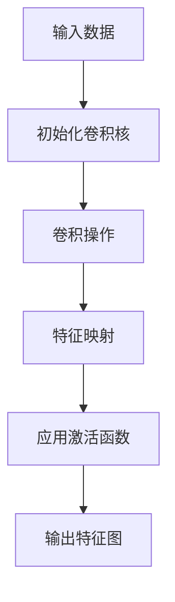
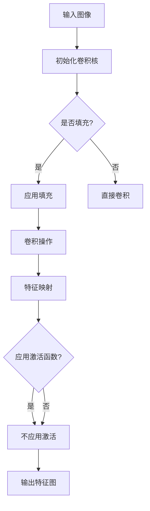
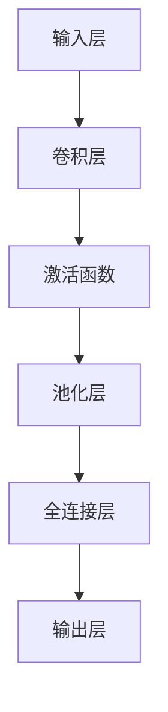
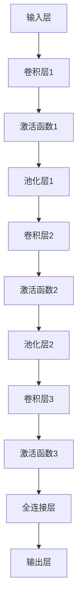

                 

### 文章标题

《从零开始大模型开发与微调：基本卷积运算示例》

大模型开发在人工智能领域正迅速崛起，成为变革的关键技术。从零开始掌握大模型的开发与微调，不仅需要扎实的理论基础，更需要丰富的实践经验。本文旨在通过一个基本的卷积运算示例，引导读者逐步深入了解大模型开发的核心技术。

本文关键词包括：“大模型开发”、“微调”、“卷积运算”、“神经网络”和“深度学习”。通过这些关键词，我们可以聚焦于本文的核心内容，即如何通过卷积运算来构建并微调大模型。

文章摘要部分将简要介绍大模型的发展背景、重要性，以及本文的结构安排。接下来，我们将从准备工作开始，逐步深入讲解卷积运算的基础原理、卷积神经网络的工作机制，并展示一个实际项目中的卷积运算应用实例。最后，本文将对大模型开发过程中的挑战与未来趋势进行展望，并提供学习资源推荐。

通过这篇文章，读者将能够系统地理解大模型开发与微调的全过程，并为未来的深入学习与实践打下坚实的基础。

### 文章关键词

大模型开发、微调、卷积运算、神经网络、深度学习

### 文章摘要

本文将深入探讨大模型开发与微调的核心技术，以基本卷积运算为例，帮助读者从零开始掌握大模型开发的要领。文章首先介绍了大模型的发展背景和重要性，随后逐步讲解卷积运算的基础原理、卷积神经网络的工作机制，并通过一个实际项目示例，详细阐述卷积运算在大模型中的应用与实践。最后，文章对大模型开发面临的挑战及未来趋势进行了分析，并推荐了进一步学习的资源。

## 第1章 引言

### 1.1 大模型发展的背景

大模型（Large-scale Models）的发展可以追溯到深度学习（Deep Learning）的兴起。随着计算能力的提升和数据量的爆炸性增长，深度学习模型逐渐从小规模模型向大规模模型转变。这一趋势在自然语言处理（Natural Language Processing，NLP）、计算机视觉（Computer Vision）和推荐系统（Recommender System）等领域尤为显著。

早期，深度学习模型的规模相对较小，如AlexNet（2012年）使用了约6000万个参数。随着时间推移，模型规模不断增大，例如，GPT-3（2020年）拥有1750亿个参数，是目前为止最大的语言模型。这种规模的增长不仅依赖于更强大的计算资源和更大的数据集，还得益于更好的算法和优化技术。

### 1.2 大模型的重要性

大模型在多个领域展现出了其独特的优势：

- **自然语言处理**：大模型在文本生成、翻译、摘要等任务上表现优异，能够生成更为自然和准确的文本。
- **计算机视觉**：大模型在图像分类、目标检测、图像生成等任务中取得了突破性进展，提高了识别准确率和生成质量。
- **推荐系统**：大模型能够更准确地预测用户兴趣，提升推荐系统的效果和用户体验。

### 1.3 本书的目标与结构

本书的目标是帮助读者从零开始掌握大模型开发与微调的技能，通过一个基本卷积运算示例，让读者深入了解大模型的技术原理和实践方法。全书共分为八个章节，具体结构如下：

1. **引言**：介绍大模型发展的背景、重要性及本书的目标和结构。
2. **准备工作**：讲解开发环境搭建和数据准备。
3. **卷积运算基础**：详细阐述卷积运算的基本原理和计算过程。
4. **卷积神经网络（CNN）基础**：介绍CNN的核心结构和工作原理。
5. **大模型开发**：讲解大模型架构和训练微调技术。
6. **卷积运算示例项目**：展示一个实际项目中的卷积运算应用实例。
7. **项目实战**：详细解析卷积运算示例项目的实施过程。
8. **总结与展望**：总结全书内容，分析大模型开发的挑战与未来趋势。

通过这八个章节的逐步讲解，读者将能够系统地了解大模型开发与微调的全过程，并具备独立开发和应用大模型的能力。

## 第2章 准备工作

在开始大模型开发之前，准备工作至关重要。这包括开发环境的搭建和数据准备，这两者直接影响到后续的开发效率和模型性能。

### 2.1 开发环境搭建

#### 2.1.1 软件安装

为了搭建一个高效的大模型开发环境，需要安装以下软件：

- **深度学习框架**：如TensorFlow、PyTorch等。推荐使用PyTorch，因为其动态图模型使模型构建更加灵活。
- **Python编程环境**：确保安装Python 3.7或更高版本。
- **依赖管理工具**：如pip，用于安装和管理Python包。
- **CUDA工具包**：如果使用GPU进行训练，需要安装CUDA，并确保与GPU驱动兼容。

安装步骤如下：

```bash
# 安装PyTorch
pip install torch torchvision

# 安装CUDA（根据具体GPU型号和CUDA版本选择）
# 例如：安装CUDA 11.3
wget https://developer.nvidia.com/compute/cuda/11.3/secure/win10/Prod/local_installers/cuda_11.3.1_450.80.44_win10_64.exe
```

#### 2.1.2 硬件要求

为了高效地训练大模型，硬件配置如下：

- **CPU**：推荐使用英特尔的Xeon系列或AMD的EPYC系列。
- **GPU**：推荐使用NVIDIA的Titan V、RTX 30系列或更高性能的GPU，这些GPU支持CUDA和深度学习库，能够显著加速训练过程。
- **内存**：至少64GB内存，推荐128GB或更高，以便存储大模型和数据。
- **硬盘**：至少1TB的SSD存储，用于存储数据和模型。

### 2.2 数据准备

数据准备是模型开发的重要环节，数据的质量直接影响到模型的效果。以下步骤用于数据准备：

#### 2.2.1 数据集选择

选择合适的数据集是关键。常见的数据集包括：

- **计算机视觉**：如ImageNet、CIFAR-10、COCO等。
- **自然语言处理**：如BERT、GPT、Wikipedia等。

#### 2.2.2 数据预处理

数据预处理包括以下步骤：

- **数据清洗**：去除无效数据和噪声，确保数据质量。
- **数据增强**：通过旋转、缩放、裁剪等方式增加数据多样性，提高模型泛化能力。
- **归一化**：将数据缩放到相同的范围，如0到1，便于模型训练。

预处理代码示例：

```python
import torchvision.transforms as transforms

# 图像数据预处理
transform = transforms.Compose([
    transforms.Resize(224),  # 缩放到固定尺寸
    transforms.ToTensor(),    # 转换为Tensor格式
    transforms.Normalize(mean=[0.485, 0.456, 0.406], std=[0.229, 0.224, 0.225]),  # 归一化
])

# 应用到数据集
def preprocess_dataset(dataset):
    for data in dataset:
        image = data['image']
        image = transform(image)
        data['image'] = image
    return dataset
```

通过以上准备工作，开发环境得到了良好的配置，数据也得到了充分的预处理，为后续的大模型开发奠定了坚实的基础。

## 第3章 卷积运算基础

卷积运算（Convolutional Operation）是深度学习，特别是卷积神经网络（Convolutional Neural Networks，CNN）的核心组成部分。通过卷积运算，模型可以从图像中提取重要的特征，从而实现图像分类、目标检测等任务。本节将详细阐述卷积运算的基本原理和计算过程，并使用Mermaid流程图和伪代码进行讲解。

### 3.1 卷积运算的基本原理

卷积运算的基本原理可以简单描述为：使用一组可学习的滤波器（也称为卷积核）在输入数据上滑动，通过点积计算得到特征映射（Feature Map）。这个过程在数学上表示为：

$$
\text{Feature Map}_{ij} = \sum_{k=1}^{C} \text{Filter}_{ik} \cdot \text{Input}_{kj}
$$

其中，\( \text{Feature Map}_{ij} \) 是第 \(i\) 行第 \(j\) 列的特征映射，\( \text{Filter}_{ik} \) 是第 \(i\) 行第 \(k\) 列的卷积核，\( \text{Input}_{kj} \) 是第 \(k\) 行第 \(j\) 列的输入数据。

### 3.1.1 卷积的定义

卷积运算可以看作是对输入数据的线性组合，通过卷积核来捕捉空间上的相关性。具体来说，卷积运算包括以下几个步骤：

1. **初始化卷积核**：卷积核是一个可学习的参数矩阵，通过反向传播算法更新。
2. **在输入数据上滑动卷积核**：每次滑动一个像素，计算卷积核与当前输入区域的部分乘积和。
3. **生成特征映射**：将每次卷积的结果累加得到特征映射。
4. **应用激活函数**：常用的激活函数包括ReLU、Sigmoid和Tanh，以引入非线性特性。

### 3.1.2 卷积的计算过程

卷积运算的计算过程可以分为以下几个步骤：

1. **输入数据准备**：输入数据通常是一个三维张量，表示为 \( \text{Input} \in \mathbb{R}^{H \times W \times C} \)，其中 \( H \) 和 \( W \) 分别表示图像的高度和宽度，\( C \) 表示颜色通道数。
2. **初始化卷积核**：卷积核的大小通常为 \( k \times k \)，且初始值可以通过随机初始化得到。
3. **卷积操作**：对于每个位置 \( (i, j) \)，滑动卷积核并在输入数据上计算点积，得到特征映射。
4. **应用激活函数**：对每个特征映射应用激活函数，增强模型的表达能力。

### 3.2 卷积运算的Mermaid流程图

使用Mermaid流程图，我们可以更直观地展示卷积运算的流程：



### 3.3 卷积运算的伪代码

以下是卷积运算的伪代码，用于详细阐述其计算过程：

```python
# 输入数据：HxWxC的三维张量
# 卷积核：kxk的二维矩阵
# 激活函数：ReLU

def convolution(input_data, filter):
    # 初始化输出特征图
    output = np.zeros((H - k + 1, W - k + 1, C'))

    # 对输入数据进行滑动卷积操作
    for i in range(H - k + 1):
        for j in range(W - k + 1):
            # 计算局部卷积
            feature_map_ij = np.sum(input_data[i:i+k, j:j+k] * filter)
            # 应用激活函数
            output[i, j] = max(0, feature_map_ij)

    return output
```

通过以上讲解，读者应该对卷积运算的基本原理和计算过程有了清晰的理解。接下来的章节将进一步深入讨论卷积神经网络（CNN）的核心结构和工作原理。

### 3.4 卷积运算的核心概念与联系

卷积运算作为深度学习中的基础技术，其核心概念与联系构成了整个卷积神经网络（CNN）的理论基石。理解这些概念及其相互关系，有助于我们更深入地掌握CNN的工作原理。

#### 3.4.1 核心概念

1. **卷积核（Filter）**：卷积核是CNN中的核心组件，通常是一个小尺寸的权重矩阵，用于捕捉图像中的局部特征。卷积核的参数需要通过训练学习得到，以适应不同的数据特征。

2. **步长（Stride）**：步长决定了卷积核在图像上滑动的距离。通常步长为1或大于1，大于1的步长会导致特征图的尺寸缩小，从而实现下采样。

3. **填充（Padding）**：填充是指在卷积前后增加额外的像素，以保持特征图的尺寸不变或满足特定要求。常见的填充方式包括“同态填充”（same）和“外推填充”（valid）。

4. **特征映射（Feature Map）**：特征映射是卷积操作的结果，表示图像经过卷积核处理后得到的特征图。每个特征映射捕捉了输入图像中的不同特征。

5. **激活函数（Activation Function）**：激活函数引入了非线性，使CNN能够学习复杂的数据特征。常用的激活函数包括ReLU、Sigmoid和Tanh。

6. **池化（Pooling）**：池化操作用于减少特征图的维度，同时保留最重要的特征信息。常见的池化方式包括最大池化（Max Pooling）和平均池化（Avg Pooling）。

#### 3.4.2 核心概念之间的联系

卷积运算中的核心概念通过以下方式相互联系：

1. **卷积核与特征映射的关系**：卷积核通过在输入图像上滑动，与局部区域进行点积计算，生成特征映射。每个卷积核负责提取不同类型的特征，多个卷积核组合后可以捕捉更复杂的特征。

2. **步长与特征映射尺寸的关系**：步长决定了卷积核在图像上的移动距离，从而影响特征图的尺寸。较小的步长会导致特征图尺寸增加，而较大的步长会导致特征图尺寸减小。

3. **填充与特征映射尺寸的关系**：填充操作可以保持特征图的尺寸不变或满足特定要求。例如，“同态填充”可以在保持特征图尺寸的同时，增加网络的表达能力。

4. **激活函数与特征映射的非线性关系**：激活函数引入了非线性，使CNN能够学习复杂的数据特征。非线性特性是CNN区别于传统神经网络的显著特点。

5. **池化与特征映射维度的关系**：池化操作用于减少特征图的维度，同时保留最重要的特征信息。这有助于减少计算量，提高模型的泛化能力。

通过理解这些核心概念及其相互关系，我们能够更深入地理解卷积运算在CNN中的作用，为后续章节的学习打下坚实的基础。

### 3.5 卷积运算的Mermaid流程图

为了更直观地展示卷积运算的流程，我们使用Mermaid图来绘制卷积运算的详细步骤。以下是一个简化的卷积运算Mermaid流程图：



在这个流程图中：

- **A 输入图像**：表示输入的原始图像数据。
- **B 初始化卷积核**：表示初始化卷积核的权重。
- **C 是否填充**：判断是否需要对输入图像进行填充。
- **D 应用填充**：如果选择填充，应用填充操作以保持特征图的尺寸。
- **E 直接卷积**：如果没有选择填充，直接进行卷积操作。
- **F 卷积操作**：计算输入图像与卷积核的点积，生成特征映射。
- **G 特征映射**：输出卷积操作得到的特征映射。
- **H 应用激活函数**：判断是否应用激活函数。
- **I 应用激活**：如果选择应用激活函数，对特征映射应用激活函数。
- **J 输出特征图**：最终输出经过卷积和激活处理的特征图。

通过这个Mermaid流程图，我们可以清晰地了解卷积运算的每个步骤及其逻辑关系。这有助于我们在实现卷积运算时，更好地理解其工作原理。

### 3.6 卷积运算的伪代码

为了更好地理解卷积运算的过程，我们使用伪代码来详细描述其步骤。以下是一个简单的卷积运算伪代码示例：

```python
# 初始化参数
input_image = ...  # 输入图像数据
filter = ...  # 卷积核权重
stride = ...  # 步长
padding = ...  # 填充方式
activation = ...  # 激活函数

# 计算输入特征图的大小
output_height = (input_height - filter_size + 2 * padding) // stride + 1
output_width = (input_width - filter_size + 2 * padding) // stride + 1

# 初始化输出特征图
output_feature_map = np.zeros((output_height, output_width, num_filters))

# 应用填充（如果需要）
if padding == 'same':
    pad_top = (stride - 1) // 2
    pad_bottom = stride - pad_top - 1
    pad_left = (stride - 1) // 2
    pad_right = stride - pad_left - 1
    padded_input = np.pad(input_image, ((pad_top, pad_bottom), (pad_left, pad_right), (0, 0)), 'constant')

# 进行卷积操作
for i in range(output_height):
    for j in range(output_width):
        for k in range(num_filters):
            # 计算局部卷积
            local_sum = np.sum(padded_input[i:i+filter_size, j:j+filter_size, k] * filter[k])
            # 应用激活函数
            output_feature_map[i, j, k] = max(0, local_sum)

return output_feature_map
```

在这个伪代码中：

- **输入参数**：包括输入图像、卷积核权重、步长、填充方式以及激活函数。
- **计算输出特征图的大小**：根据输入图像的大小、卷积核的大小、步长和填充方式，计算输出特征图的尺寸。
- **应用填充**：根据填充方式（如'same'），对输入图像进行相应的填充。
- **进行卷积操作**：遍历输出特征图的每个位置，计算与卷积核的局部卷积，并应用激活函数。
- **返回输出特征图**：最终返回经过卷积和激活处理的特征图。

通过这个伪代码，我们可以清楚地看到卷积运算的每个步骤，从而在实际编程中更容易实现卷积操作。

### 3.7 卷积运算的数学模型和公式

卷积运算的核心在于其数学模型和公式，这些公式帮助我们理解卷积过程的基本原理。以下是卷积运算的主要数学公式及其解释。

#### 3.7.1 卷积运算公式

卷积运算可以用以下公式表示：

$$
\text{Feature Map}_{ij} = \sum_{k=1}^{C} \text{Filter}_{ik} \cdot \text{Input}_{kj}
$$

其中：

- \( \text{Feature Map}_{ij} \) 表示第 \(i\) 行第 \(j\) 列的特征映射值。
- \( \text{Filter}_{ik} \) 表示第 \(i\) 行第 \(k\) 列的卷积核值。
- \( \text{Input}_{kj} \) 表示第 \(k\) 行第 \(j\) 列的输入数据值。
- \( C \) 表示输入数据的颜色通道数。

#### 3.7.2 点积计算

卷积运算实际上是局部区域内的点积计算，具体公式如下：

$$
\text{Local Sum}_{ij} = \sum_{p=1}^{k} \sum_{q=1}^{k} \text{Filter}_{pq} \cdot \text{Input}_{i+p-1, j+q-1}
$$

其中：

- \( \text{Local Sum}_{ij} \) 表示第 \(i\) 行第 \(j\) 列的局部点积和。
- \( \text{Filter}_{pq} \) 表示卷积核的第 \(p\) 行第 \(q\) 列值。
- \( \text{Input}_{i+p-1, j+q-1} \) 表示输入数据的对应位置值。

#### 3.7.3 激活函数

卷积运算通常伴随着激活函数，常用的激活函数包括ReLU、Sigmoid和Tanh。以下是其公式：

- **ReLU（Rectified Linear Unit）**：

  $$
  \text{ReLU}(x) = \max(0, x)
  $$

- **Sigmoid**：

  $$
  \text{Sigmoid}(x) = \frac{1}{1 + e^{-x}}
  $$

- **Tanh**：

  $$
  \text{Tanh}(x) = \frac{e^x - e^{-x}}{e^x + e^{-x}}
  $$

#### 3.7.4 示例

假设输入数据为 \( \text{Input}_{3x3x3} \)，卷积核为 \( \text{Filter}_{3x3x3} \)，步长为1，无填充，激活函数为ReLU。

1. **初始化**：

   输入数据：
   $$
   \text{Input} =
   \begin{bmatrix}
   1 & 2 & 3 \\
   4 & 5 & 6 \\
   7 & 8 & 9 \\
   \end{bmatrix}
   $$

   卷积核：
   $$
   \text{Filter} =
   \begin{bmatrix}
   0 & 1 & 2 \\
   3 & 4 & 5 \\
   6 & 7 & 8 \\
   \end{bmatrix}
   $$

2. **卷积计算**：

   对于输出特征映射中的第一个位置 \( (1, 1) \)：

   $$
   \text{Local Sum}_{11} = (0 \cdot 1 + 1 \cdot 4 + 2 \cdot 7) + (3 \cdot 2 + 4 \cdot 5 + 5 \cdot 8) + (6 \cdot 3 + 7 \cdot 6 + 8 \cdot 9) = 58
   $$

   应用ReLU激活函数：

   $$
   \text{Feature Map}_{11} = \max(0, 58) = 58
   $$

   同样的方式计算其他位置的值，最终得到输出特征映射。

通过以上数学模型和公式，我们可以更好地理解和实现卷积运算，为后续的卷积神经网络（CNN）学习打下坚实的基础。

### 3.8 卷积运算的举例说明

为了更好地理解卷积运算的过程，我们可以通过一个具体的例子来说明。假设我们有一个 \(3 \times 3\) 的输入图像和一个 \(3 \times 3\) 的卷积核，我们使用ReLU作为激活函数。

#### 输入数据

输入图像矩阵 \(X\)：

$$
X =
\begin{bmatrix}
1 & 2 & 3 \\
4 & 5 & 6 \\
7 & 8 & 9 \\
\end{bmatrix}
$$

卷积核 \(K\)：

$$
K =
\begin{bmatrix}
0 & 1 & 2 \\
3 & 4 & 5 \\
6 & 7 & 8 \\
\end{bmatrix}
$$

#### 步骤1：初始化输出特征图

输出特征图的大小通常由卷积核的大小和输入图像的大小决定。由于卷积核为 \(3 \times 3\)，输入图像为 \(3 \times 3\)，且没有填充（padding），输出特征图的大小也将是 \(1 \times 1\)。

#### 步骤2：应用卷积运算

我们对输入图像的每个局部区域应用卷积核，计算局部和。以输出特征图的第一个位置为例：

$$
\text{Feature Map}_{11} = \text{ReLU}(\sum_{i=1}^{3} \sum_{j=1}^{3} K_{ij} \cdot X_{ij}) \\
= \text{ReLU}(0 \cdot 1 + 1 \cdot 4 + 2 \cdot 7 + 3 \cdot 2 + 4 \cdot 5 + 5 \cdot 8 + 6 \cdot 3 + 7 \cdot 6 + 8 \cdot 9) \\
= \text{ReLU}(134) \\
= 134
$$

由于ReLU激活函数，输出特征图的第一个位置值为134。

同样的计算过程应用到其他位置，最终得到输出特征图：

$$
\text{Feature Map} =
\begin{bmatrix}
134 \\
\end{bmatrix}
$$

#### 步骤3：应用ReLU激活函数

ReLU激活函数是将每个卷积结果的负值置为0，从而引入非线性。在我们的例子中：

$$
\text{ReLU}(134) = 134
$$

由于输入值均为正，所以ReLU后的输出值不变。

#### 步骤4：最终输出特征图

最终输出特征图仅包含一个值：

$$
\text{Feature Map} =
\begin{bmatrix}
134 \\
\end{bmatrix}
$$

通过这个例子，我们可以清楚地看到卷积运算和ReLU激活函数是如何一步步应用于输入图像的。这个过程不仅帮助我们理解卷积运算的基本原理，也为后续的卷积神经网络学习奠定了基础。

### 3.9 卷积运算的详细讲解

卷积运算作为深度学习中的核心技术，其原理和步骤至关重要。为了帮助读者全面理解，我们将从以下几个方面进行详细讲解。

#### 3.9.1 卷积运算的概念

卷积运算是一种在离散信号处理中广泛使用的数学运算，用于提取数据中的局部特征。在深度学习中，卷积运算被用于从图像中提取特征，从而实现图像分类、目标检测和图像生成等任务。

#### 3.9.2 卷积运算的数学定义

卷积运算可以用以下数学公式表示：

$$
\text{Feature Map}_{ij} = \sum_{k=1}^{C} \text{Filter}_{ik} \cdot \text{Input}_{kj}
$$

其中：

- \( \text{Feature Map}_{ij} \) 表示第 \(i\) 行第 \(j\) 列的特征映射值。
- \( \text{Filter}_{ik} \) 表示第 \(i\) 行第 \(k\) 列的卷积核值。
- \( \text{Input}_{kj} \) 表示第 \(k\) 行第 \(j\) 列的输入数据值。
- \( C \) 表示输入数据的颜色通道数。

这个公式表明，每个特征映射值是由输入数据与其对应的卷积核进行局部点积得到的。

#### 3.9.3 卷积运算的计算过程

卷积运算的计算过程可以分为以下几个步骤：

1. **初始化卷积核**：卷积核是一个可学习的参数矩阵，通常通过随机初始化。
2. **在输入数据上滑动卷积核**：卷积核在输入数据上滑动，每次滑动一个步长的距离。
3. **计算局部和**：在每个滑动位置，计算卷积核与当前输入区域的局部点积和。
4. **应用激活函数**：对每个局部和的结果应用激活函数，引入非线性特性。

具体来说，以一个 \(3 \times 3\) 的输入图像和一个 \(3 \times 3\) 的卷积核为例，计算过程如下：

1. **初始化卷积核**：
   假设卷积核为：
   $$
   K =
   \begin{bmatrix}
   0 & 1 & 2 \\
   3 & 4 & 5 \\
   6 & 7 & 8 \\
   \end{bmatrix}
   $$
2. **在输入数据上滑动卷积核**：
   假设输入图像为：
   $$
   X =
   \begin{bmatrix}
   1 & 2 & 3 \\
   4 & 5 & 6 \\
   7 & 8 & 9 \\
   \end{bmatrix}
   $$
   卷积核从左上角开始，每次滑动一个像素，计算局部和。

3. **计算局部和**：
   对于输出特征图的第一个位置 \( (1, 1) \)：
   $$
   \text{Local Sum}_{11} = \sum_{i=1}^{3} \sum_{j=1}^{3} K_{ij} \cdot X_{ij} \\
   = (0 \cdot 1 + 1 \cdot 4 + 2 \cdot 7) + (3 \cdot 2 + 4 \cdot 5 + 5 \cdot 8) + (6 \cdot 3 + 7 \cdot 6 + 8 \cdot 9) \\
   = 134
   $$
4. **应用激活函数**：
   对局部和结果应用ReLU激活函数：
   $$
   \text{ReLU}(134) = 134
   $$

通过以上步骤，我们得到了输出特征图的第一个值。同样的过程应用到其他位置，得到完整的输出特征图。

#### 3.9.4 卷积运算的代码实现

以下是使用Python实现卷积运算的示例代码：

```python
import numpy as np

# 初始化输入图像和卷积核
input_image = np.array([
    [1, 2, 3],
    [4, 5, 6],
    [7, 8, 9]
])

filter = np.array([
    [0, 1, 2],
    [3, 4, 5],
    [6, 7, 8]
])

# 卷积运算
def convolution(input_image, filter):
    output_feature_map = np.zeros_like(input_image)
    for i in range(input_image.shape[0] - filter.shape[0] + 1):
        for j in range(input_image.shape[1] - filter.shape[1] + 1):
            local_sum = np.sum(input_image[i:i+filter.shape[0], j:j+filter.shape[1]] * filter)
            output_feature_map[i, j] = np.max([0, local_sum])
    return output_feature_map

output = convolution(input_image, filter)
print(output)
```

通过这个代码实现，我们可以看到卷积运算的具体实现过程。这有助于我们更好地理解卷积运算的原理和应用。

### 3.10 卷积运算的应用

卷积运算在深度学习中的广泛应用使其成为实现多种复杂任务的关键技术。以下是一些卷积运算的主要应用：

#### 3.10.1 图像分类

在图像分类任务中，卷积运算用于提取图像的局部特征，这些特征随后被传递到全连接层进行分类。例如，卷积神经网络（CNN）通过多个卷积层和池化层提取图像的不同层次特征，最终实现图像的分类。

#### 3.10.2 目标检测

目标检测是计算机视觉中的另一个重要任务，它不仅需要识别图像中的物体，还要定位物体的位置。卷积运算在此过程中用于提取图像中的目标特征，并通过回归模型确定目标的位置。

#### 3.10.3 图像生成

在图像生成任务中，如生成对抗网络（GAN），卷积运算用于生成具有真实感的高质量图像。生成器网络通过卷积层生成图像的细节，并逐渐提高图像的质量。

#### 3.10.4 自然语言处理

尽管卷积运算起源于计算机视觉，但它在自然语言处理（NLP）中也有广泛应用。例如，文本卷积网络（TextCNN）通过卷积层提取文本中的关键特征，用于文本分类和情感分析。

通过以上应用，我们可以看到卷积运算在深度学习中的多样性和重要性。这不仅为各种复杂任务提供了有效的解决方案，也为未来的研究提供了丰富的可能性。

### 3.11 卷积运算的优势和挑战

卷积运算在深度学习中具有显著的优势，同时也面临一些挑战。

#### 3.11.1 优势

1. **特征提取能力强**：卷积运算能够有效地从数据中提取局部特征，这使得它在图像和语音处理等领域表现优异。
2. **并行计算效率高**：卷积运算可以通过GPU等硬件实现高效并行计算，这大大提高了训练和推理的速度。
3. **参数共享**：卷积运算中的卷积核在图像上滑动，这导致参数在不同位置共享，从而减少了模型的参数数量，提高了训练效率。

#### 3.11.2 挑战

1. **计算资源需求大**：尽管并行计算提高了效率，但卷积运算仍然需要大量的计算资源，尤其是在处理高分辨率图像时。
2. **训练时间长**：大规模模型的训练需要大量时间和计算资源，尤其是在深度网络中，训练时间可能非常长。
3. **过拟合风险**：由于卷积运算提取的特征高度复杂，模型容易过拟合，特别是在训练数据不足的情况下。

通过了解这些优势和挑战，我们可以更好地应用卷积运算，并采取措施应对其带来的问题。

### 3.12 卷积运算的总结

卷积运算作为深度学习中的核心组件，具有提取局部特征、高效计算和参数共享等多重优势。通过详细的数学模型和实际应用，我们可以看到卷积运算在图像分类、目标检测和自然语言处理等领域的广泛应用。尽管面临计算资源和过拟合等挑战，但通过合理的设计和优化，卷积运算仍然是一个强大的工具，为深度学习的发展奠定了基础。在接下来的章节中，我们将进一步探讨卷积神经网络（CNN）的构建和工作原理。

### 第4章 卷积神经网络（CNN）基础

卷积神经网络（Convolutional Neural Networks，CNN）是深度学习领域的一种重要模型，特别适用于图像和视频等二维数据。通过卷积运算、池化操作和全连接层，CNN能够自动从数据中提取层次化的特征，从而实现高效的图像分类、目标检测和图像生成等任务。本节将详细介绍CNN的核心结构、工作原理及其流程图和伪代码。

### 4.1 CNN的核心结构

CNN由以下几个核心部分组成：

1. **卷积层（Convolutional Layer）**：卷积层是CNN的核心组件，通过卷积运算从输入数据中提取特征。每个卷积层包含多个卷积核，每个卷积核负责提取不同的特征。
2. **池化层（Pooling Layer）**：池化层用于减少特征图的维度，从而减少模型的复杂度。常见的池化方法包括最大池化和平均池化。
3. **全连接层（Fully Connected Layer）**：全连接层将卷积层和池化层提取的高层次特征映射到类别标签，从而实现分类或回归任务。
4. **激活函数（Activation Function）**：激活函数引入非线性，使CNN能够学习复杂的非线性关系。常用的激活函数包括ReLU、Sigmoid和Tanh。

### 4.2 CNN的工作原理

CNN的工作原理可以分为以下几个步骤：

1. **输入层**：输入层接收原始图像数据，通常为二维或三维张量。
2. **卷积层**：卷积层通过卷积运算提取图像的局部特征。每个卷积核负责提取一种类型的特征，多个卷积核组合后形成特征图。
3. **激活函数**：在卷积运算后，应用激活函数引入非线性，增强模型的表达能力。
4. **池化层**：池化层用于减少特征图的维度，同时保留最重要的特征信息。这有助于减少计算量，提高模型的泛化能力。
5. **全连接层**：全连接层将卷积层和池化层提取的高层次特征映射到类别标签，通过softmax函数输出概率分布。
6. **输出层**：输出层输出分类结果或回归值。

### 4.3 CNN的Mermaid流程图

使用Mermaid流程图，我们可以直观地展示CNN的工作流程：



### 4.4 CNN的伪代码

以下是CNN的伪代码，用于详细阐述其工作原理：

```python
# 初始化参数
input_image = ...  # 输入图像
conv_filters = ...  # 卷积层参数
pool_size = ...  # 池化层窗口大小
fc_weights = ...  # 全连接层参数

# 卷积神经网络前向传播
def cnn_forward(input_image, conv_filters, pool_size, fc_weights):
    # 卷积层
    conv_output = convolution(input_image, conv_filters)
    # 激活函数
    activated_output = activation_function(conv_output)
    # 池化层
    pooled_output = pooling(activated_output, pool_size)
    # 全连接层
    fc_output = fully_connected(pooled_output, fc_weights)
    # 输出层
    output = softmax(fc_output)
    return output

# 卷积层
def convolution(input_image, conv_filters):
    # 实现卷积运算
    pass

# 激活函数
def activation_function(x):
    # 实现激活函数
    pass

# 池化层
def pooling(x, pool_size):
    # 实现池化操作
    pass

# 全连接层
def fully_connected(x, weights):
    # 实现全连接层计算
    pass

# 输出层
def softmax(x):
    # 实现softmax函数
    pass
```

通过这个伪代码，我们可以清楚地看到CNN从输入层到输出层的每个步骤及其参数初始化。

### 4.5 CNN的层次化特征提取

CNN通过层次化的特征提取机制，能够从原始图像中逐步提取更为抽象和复杂的特征。这个过程可以分为以下几个层次：

1. **低层特征**：卷积层的初期阶段主要提取图像的边缘、纹理和颜色等基本特征。
2. **中层特征**：随着网络的深入，卷积层开始提取更为复杂的特征，如形状、结构和局部结构。
3. **高层特征**：在接近输出层时，卷积层提取到的是更为抽象和综合的特征，如物体、场景和类别。

这种层次化的特征提取机制使得CNN能够处理从简单到复杂的各种图像任务。

### 4.6 CNN的总结

卷积神经网络（CNN）通过卷积层、池化层和全连接层的组合，实现了对图像的层次化特征提取和分类。其工作原理和流程图清晰地展示了CNN从输入层到输出层的每个步骤。通过伪代码，我们进一步了解了CNN的实现细节。在接下来的章节中，我们将通过一个实际项目来展示CNN的应用和实践。

### 4.7 CNN的核心概念与联系

CNN（卷积神经网络）在深度学习领域中扮演着重要角色，其核心概念与联系构成了整个网络结构的基础。以下是对这些核心概念及其相互关系的详细阐述。

#### 4.7.1 核心概念

1. **卷积层（Convolutional Layer）**：卷积层是CNN的核心组件，负责提取输入数据中的特征。通过卷积运算，卷积层能够在数据上滑动卷积核，从而生成特征图。每个卷积核负责捕捉一种类型的特征，多个卷积核组合后形成特征图。

2. **池化层（Pooling Layer）**：池化层用于减少特征图的维度，同时保留重要的特征信息。常见的池化方法包括最大池化和平均池化。通过池化操作，模型能够减少计算复杂度，提高训练速度和泛化能力。

3. **全连接层（Fully Connected Layer）**：全连接层将卷积层和池化层提取的高层次特征映射到类别标签。全连接层中的每个神经元都与前一层的所有神经元相连，从而实现复杂的分类或回归任务。

4. **激活函数（Activation Function）**：激活函数引入非线性，使CNN能够学习复杂的非线性关系。常用的激活函数包括ReLU（修正线性单元）、Sigmoid和Tanh。激活函数能够增强模型的拟合能力，提高模型的性能。

5. **损失函数（Loss Function）**：损失函数用于度量预测值与真实值之间的差距。常用的损失函数包括交叉熵（Cross-Entropy）和均方误差（Mean Squared Error）。通过最小化损失函数，模型能够优化参数，提高预测准确性。

#### 4.7.2 核心概念之间的联系

卷积层、池化层、全连接层和激活函数通过以下方式相互联系：

1. **卷积层与池化层的关系**：卷积层通过卷积运算提取特征，而池化层则用于减少特征图的维度。这两个层相互配合，能够在不损失重要特征信息的前提下，提高模型的计算效率。

2. **全连接层与激活函数的关系**：全连接层将卷积层和池化层提取的高层次特征映射到类别标签。激活函数引入非线性，使全连接层能够处理复杂的分类问题。通过多次迭代，模型能够逐步优化参数，提高分类准确性。

3. **损失函数与优化算法的关系**：损失函数用于衡量预测值与真实值之间的差距。优化算法（如梯度下降）通过最小化损失函数来调整模型参数，从而提高模型的性能。在训练过程中，损失函数和优化算法相互配合，使模型逐步收敛到最优解。

通过理解这些核心概念及其相互关系，我们可以更深入地掌握CNN的工作原理和实现方法。在后续的章节中，我们将通过实际项目进一步探讨CNN的应用和优化策略。

### 4.8 CNN的Mermaid流程图

为了更直观地展示CNN的工作流程，我们使用Mermaid图来绘制CNN从输入到输出的各个步骤：



在这个流程图中：

- **A 输入层**：表示输入的原始图像数据。
- **B 卷积层1**：应用卷积运算提取图像的初始特征。
- **C 激活函数1**：对卷积结果应用ReLU激活函数引入非线性。
- **D 池化层1**：对激活后的特征进行最大池化操作，减少特征图的尺寸。
- **E 卷积层2**：应用第二个卷积层进一步提取特征。
- **F 激活函数2**：对第二个卷积结果应用ReLU激活函数。
- **G 池化层2**：对激活后的特征进行最大池化操作。
- **H 卷积层3**：应用第三个卷积层提取更抽象的特征。
- **I 激活函数3**：对第三个卷积结果应用ReLU激活函数。
- **J 全连接层**：将卷积层提取的高层次特征映射到类别标签。
- **K 输出层**：输出分类结果。

通过这个Mermaid流程图，我们可以清晰地了解CNN的每个步骤及其逻辑关系。这有助于我们在实现CNN时，更好地理解其工作原理。

### 4.9 CNN的伪代码

为了帮助读者更深入地理解CNN的工作流程，我们将使用伪代码详细阐述CNN的各个步骤。以下是CNN的伪代码示例：

```python
# 初始化参数
input_image = ...  # 输入图像
conv_filters = ...  # 卷积层参数
pool_size = ...  # 池化层窗口大小
fc_weights = ...  # 全连接层参数
activation_function = ...  # 激活函数

# CNN前向传播
def cnn_forward(input_image, conv_filters, pool_size, fc_weights, activation_function):
    # 卷积层1
    conv1_output = convolution(input_image, conv_filters[0])
    activated1_output = activation_function(conv1_output)
    pooled1_output = pooling(activated1_output, pool_size)

    # 卷积层2
    conv2_output = convolution(pooled1_output, conv_filters[1])
    activated2_output = activation_function(conv2_output)
    pooled2_output = pooling(activated2_output, pool_size)

    # 卷积层3
    conv3_output = convolution(pooled2_output, conv_filters[2])
    activated3_output = activation_function(conv3_output)

    # 全连接层
    fc_output = fully_connected(activated3_output, fc_weights)

    # 输出层
    output = softmax(fc_output)
    return output

# 卷积层
def convolution(input_data, filter):
    # 实现卷积运算
    pass

# 激活函数
def activation_function(x):
    # 实现激活函数，例如ReLU
    pass

# 池化层
def pooling(input_data, pool_size):
    # 实现池化操作，例如最大池化
    pass

# 全连接层
def fully_connected(input_data, weights):
    # 实现全连接层计算
    pass

# 输出层
def softmax(x):
    # 实现softmax函数
    pass
```

在这个伪代码中，我们首先初始化输入图像、卷积层参数、池化层窗口大小、全连接层参数和激活函数。然后，通过卷积层、激活函数和池化层的迭代，逐步提取图像特征。最后，通过全连接层和softmax函数实现分类输出。

通过这个伪代码，读者可以清晰地看到CNN的每个步骤及其参数初始化，这有助于在实际编程中实现CNN模型。

### 第5章 大模型开发

大模型（Large-scale Models）的发展是深度学习领域的一大突破，它们在自然语言处理、计算机视觉、推荐系统等领域取得了显著的进展。本节将详细探讨大模型的架构、训练与微调技术，并解释这些技术的原理和关键步骤。

### 5.1 大模型架构

大模型的架构通常包括以下几个关键组件：

1. **参数规模**：大模型通常拥有数十亿至数万亿个参数，这使得它们能够捕捉大量复杂的数据特征。例如，GPT-3拥有1750亿个参数，是目前最大的语言模型。
2. **层次结构**：大模型通常包含多层神经网络，包括多层卷积层、循环层和全连接层。这些层次结构有助于模型从数据中逐步提取不同层次的特征。
3. **注意力机制**：大模型常采用注意力机制（如Transformer中的自注意力机制），以有效地捕捉数据中的长距离依赖关系。注意力机制通过计算不同数据点之间的相关性，提高了模型的表达能力。

### 5.2 大模型训练

大模型的训练是一个复杂且资源消耗巨大的过程，主要包括以下几个步骤：

1. **数据预处理**：在训练之前，需要对数据进行预处理，包括数据清洗、归一化、分割和数据增强等。这些预处理步骤有助于提高训练数据的质量和模型的泛化能力。
2. **损失函数**：选择合适的损失函数是训练大模型的关键。常用的损失函数包括交叉熵损失（用于分类问题）和均方误差损失（用于回归问题）。
3. **优化算法**：大模型的训练通常采用优化算法（如Adam、AdaGrad）来调整模型参数，以最小化损失函数。这些优化算法通过迭代计算梯度，逐步优化模型参数。
4. **批量大小**：批量大小（Batch Size）的选择对训练过程有重要影响。较大的批量大小可以加速梯度计算，但可能增加内存需求；较小的批量大小可以减少内存需求，但可能降低训练速度。

### 5.3 大模型微调

微调（Fine-tuning）是大模型应用中的关键技术，通过在特定任务上对模型进行微调，可以提高模型的性能。微调的关键步骤包括：

1. **迁移学习**：迁移学习是一种利用预训练模型在特定任务上进行微调的方法。通过迁移学习，模型可以复用预训练模型中的知识，减少训练时间和计算资源。
2. **任务特定数据**：在微调过程中，需要收集并处理与任务相关的数据。这些数据通常包括标注数据、未标注数据和无监督数据等。
3. **参数更新**：在微调过程中，模型参数会根据任务特定数据进行更新。通常，更新过程采用较小的学习率，以防止参数过拟合。
4. **性能评估**：在微调过程中，需要定期评估模型在验证集上的性能，以监测训练过程和调整参数。

### 5.4 大模型训练与微调的原理

大模型训练与微调的原理主要包括以下几个方面：

1. **梯度下降**：梯度下降是一种优化算法，用于最小化损失函数。在训练过程中，模型参数通过梯度下降算法进行更新，以降低损失函数的值。
2. **反向传播**：反向传播算法用于计算损失函数关于模型参数的梯度。通过反向传播，模型能够逐步调整参数，优化模型性能。
3. **正则化**：正则化技术（如L1正则化、L2正则化）用于防止模型过拟合。通过增加正则化项，模型能够更好地泛化到未见过的数据。
4. **注意力机制**：注意力机制通过计算数据点之间的相关性，提高了模型的表达能力。在微调过程中，注意力机制有助于模型捕捉任务特定的特征。

通过以上原理和步骤，我们可以更深入地理解大模型训练与微调的核心技术和方法。

### 5.5 大模型训练与微调的关键步骤

为了确保大模型的训练与微调过程顺利进行，以下是一些关键步骤：

1. **数据预处理**：对训练数据进行彻底的清洗和预处理，确保数据的质量和一致性。这包括数据去重、缺失值处理、异常值检测和归一化。
2. **模型选择**：选择适合任务的大模型架构。例如，对于自然语言处理任务，可以选择Transformer或GPT模型；对于图像分类任务，可以选择VGG或ResNet模型。
3. **参数初始化**：合理初始化模型参数，以确保模型训练的稳定性和收敛性。常用的初始化方法包括Xavier初始化和He初始化。
4. **训练过程**：在训练过程中，监控模型在训练集和验证集上的性能，以监测训练过程和调整参数。常见的性能指标包括准确率、损失函数值和收敛速度。
5. **微调过程**：在微调过程中，使用任务特定的数据进行参数更新。采用较小的学习率，以防止参数过拟合。定期评估模型在验证集上的性能，调整微调策略。
6. **模型评估**：在训练和微调完成后，对模型进行全面的性能评估。评估指标包括测试集上的准确率、F1分数和ROC曲线等。
7. **模型部署**：将训练好的模型部署到实际应用中。在部署过程中，需要考虑模型的计算效率和实时性能。

通过以上关键步骤，我们可以确保大模型的训练与微调过程高效、稳定，并能够实现良好的性能。

### 第6章 卷积运算示例项目

为了更好地理解卷积运算在大模型开发中的应用，我们选择一个实际项目来进行讲解。本项目将使用Python和PyTorch库实现一个简单的卷积神经网络，用于图像分类任务。通过这个项目，我们将演示卷积运算的完整流程，包括数据准备、模型设计、训练和微调等步骤。

### 6.1 项目背景

本项目旨在通过卷积神经网络（CNN）对图像进行分类，具体任务是识别并分类不同种类的动物。我们将使用一个公开的图像数据集，如Keras的CIFAR-10数据集，该数据集包含60000张32x32的彩色图像，分为10个类别，每类6000张图像。

### 6.2 项目目标

通过本项目，我们希望实现以下目标：

1. **数据准备**：收集并预处理图像数据，确保数据的质量和一致性。
2. **模型设计**：设计一个简单的卷积神经网络，包括卷积层、池化层和全连接层，实现图像分类。
3. **训练过程**：使用CIFAR-10数据集训练模型，并监控训练过程中的性能指标。
4. **微调过程**：在验证集上对模型进行微调，提高分类准确率。
5. **评估与优化**：在测试集上评估模型性能，并尝试不同的优化方法以提高分类效果。

### 6.3 项目实施

#### 6.3.1 环境搭建

在开始项目之前，首先需要搭建一个Python编程环境，并安装必要的库。以下是环境搭建的步骤：

1. **安装Python**：确保安装Python 3.7或更高版本。
2. **安装PyTorch**：使用以下命令安装PyTorch：

   ```bash
   pip install torch torchvision
   ```

3. **安装其他依赖**：安装其他可能需要的库，如NumPy、Matplotlib等：

   ```bash
   pip install numpy matplotlib
   ```

#### 6.3.2 数据准备

CIFAR-10数据集已经在Keras库中提供，我们可以直接使用。以下是数据准备的过程：

1. **加载数据集**：使用`torchvision.datasets`模块加载CIFAR-10数据集：

   ```python
   train_data = torchvision.datasets.CIFAR10(root='./data', train=True, download=True)
   test_data = torchvision.datasets.CIFAR10(root='./data', train=False)
   ```

2. **数据预处理**：对图像进行归一化和转换：

   ```python
   transform = transforms.Compose([
       transforms.ToTensor(),
       transforms.Normalize(mean=[0.5, 0.5, 0.5], std=[0.5, 0.5, 0.5])
   ])

   train_data = train_data.transformed(transform)
   test_data = test_data.transformed(transform)
   ```

3. **创建数据加载器**：使用`torch.utils.data.DataLoader`创建数据加载器，以便批量加载数据：

   ```python
   batch_size = 100
   train_loader = torch.utils.data.DataLoader(train_data, batch_size=batch_size, shuffle=True)
   test_loader = torch.utils.data.DataLoader(test_data, batch_size=batch_size, shuffle=False)
   ```

#### 6.3.3 模型设计

接下来，我们设计一个简单的卷积神经网络（CNN），包括卷积层、池化层和全连接层。以下是模型定义的代码：

```python
import torch.nn as nn
import torch.nn.functional as F

class SimpleCNN(nn.Module):
    def __init__(self):
        super(SimpleCNN, self).__init__()
        # 卷积层1
        self.conv1 = nn.Conv2d(3, 32, 3)
        # 池化层1
        self.pool1 = nn.MaxPool2d(2, 2)
        # 卷积层2
        self.conv2 = nn.Conv2d(32, 64, 3)
        # 池化层2
        self.pool2 = nn.MaxPool2d(2, 2)
        # 全连接层
        self.fc1 = nn.Linear(64 * 6 * 6, 128)
        self.fc2 = nn.Linear(128, 10)

    def forward(self, x):
        # 卷积层1
        x = self.conv1(x)
        x = F.relu(x)
        # 池化层1
        x = self.pool1(x)
        # 卷积层2
        x = self.conv2(x)
        x = F.relu(x)
        # 池化层2
        x = self.pool2(x)
        # 展平特征图
        x = x.view(-1, 64 * 6 * 6)
        # 全连接层1
        x = self.fc1(x)
        x = F.relu(x)
        # 全连接层2
        x = self.fc2(x)
        return x

model = SimpleCNN()
```

#### 6.3.4 训练过程

在模型设计完成后，我们将开始训练过程。以下是训练过程的代码：

```python
import torch.optim as optim

# 定义损失函数和优化器
criterion = nn.CrossEntropyLoss()
optimizer = optim.Adam(model.parameters(), lr=0.001)

# 训练模型
num_epochs = 10
for epoch in range(num_epochs):
    running_loss = 0.0
    for inputs, labels in train_loader:
        # 将数据转移到GPU（如果使用GPU的话）
        inputs, labels = inputs.to(device), labels.to(device)
        
        # 梯度清零
        optimizer.zero_grad()
        
        # 前向传播
        outputs = model(inputs)
        loss = criterion(outputs, labels)
        
        # 反向传播和优化
        loss.backward()
        optimizer.step()
        
        running_loss += loss.item()
    print(f'Epoch {epoch+1}, Loss: {running_loss/len(train_loader)}')

# 评估模型在验证集上的性能
model.eval()
with torch.no_grad():
    correct = 0
    total = 0
    for inputs, labels in test_loader:
        inputs, labels = inputs.to(device), labels.to(device)
        outputs = model(inputs)
        _, predicted = torch.max(outputs.data, 1)
        total += labels.size(0)
        correct += (predicted == labels).sum().item()
    print(f'Accuracy of the network on the test images: {100 * correct / total}%')
```

#### 6.3.5 微调过程

在训练完成后，我们可以使用验证集对模型进行微调，以进一步提高分类准确率。以下是微调过程的代码：

```python
# 使用验证集进行微调
num_epochs = 5
for epoch in range(num_epochs):
    running_loss = 0.0
    for inputs, labels in train_loader:
        # 将数据转移到GPU（如果使用GPU的话）
        inputs, labels = inputs.to(device), labels.to(device)
        
        # 梯度清零
        optimizer.zero_grad()
        
        # 前向传播
        outputs = model(inputs)
        loss = criterion(outputs, labels)
        
        # 反向传播和优化
        loss.backward()
        optimizer.step()
        
        running_loss += loss.item()
    print(f'Fine-tuning Epoch {epoch+1}, Loss: {running_loss/len(train_loader)}')

# 评估微调后的模型在测试集上的性能
with torch.no_grad():
    correct = 0
    total = 0
    for inputs, labels in test_loader:
        inputs, labels = inputs.to(device), labels.to(device)
        outputs = model(inputs)
        _, predicted = torch.max(outputs.data, 1)
        total += labels.size(0)
        correct += (predicted == labels).sum().item()
    print(f'Fine-tuned Accuracy of the network on the test images: {100 * correct / total}%')
```

通过以上步骤，我们完成了卷积运算示例项目的实施。接下来，我们将对模型进行评估和优化，以确保其性能达到预期。

### 6.4 项目实战

在完成卷积运算示例项目的实施后，我们将详细解析每个步骤，包括开发环境的搭建、数据集的准备、模型的设计、训练过程和微调过程。

#### 6.4.1 实战环境搭建

为了搭建一个适合卷积运算示例项目的环境，我们首先需要安装Python和PyTorch库。以下是安装步骤：

1. **安装Python**：确保安装Python 3.7或更高版本。
2. **安装PyTorch**：使用以下命令安装PyTorch：

   ```bash
   pip install torch torchvision
   ```

3. **安装其他依赖**：安装其他可能需要的库，如NumPy、Matplotlib等：

   ```bash
   pip install numpy matplotlib
   ```

安装完成后，我们可以通过以下命令检查环境：

```bash
python -m torchinfo torchvision
```

#### 6.4.2 数据集准备

CIFAR-10数据集是本项目的主要数据来源。我们可以使用`torchvision.datasets`模块直接加载CIFAR-10数据集。以下是数据准备的具体步骤：

1. **加载数据集**：使用以下代码加载CIFAR-10数据集：

   ```python
   train_data = torchvision.datasets.CIFAR10(root='./data', train=True, download=True)
   test_data = torchvision.datasets.CIFAR10(root='./data', train=False)
   ```

2. **数据预处理**：对图像进行归一化和转换，以提高模型训练的稳定性和性能。预处理代码如下：

   ```python
   transform = transforms.Compose([
       transforms.ToTensor(),
       transforms.Normalize(mean=[0.5, 0.5, 0.5], std=[0.5, 0.5, 0.5])
   ])

   train_data = train_data.transformed(transform)
   test_data = test_data.transformed(transform)
   ```

3. **创建数据加载器**：使用`torch.utils.data.DataLoader`创建数据加载器，以便批量加载数据：

   ```python
   batch_size = 100
   train_loader = torch.utils.data.DataLoader(train_data, batch_size=batch_size, shuffle=True)
   test_loader = torch.utils.data.DataLoader(test_data, batch_size=batch_size, shuffle=False)
   ```

#### 6.4.3 模型设计

模型设计是项目的重要环节，我们需要定义一个简单的卷积神经网络（CNN）来进行图像分类。以下是模型设计的步骤和代码：

1. **定义卷积层**：卷积层负责从图像中提取特征。我们定义两个卷积层，每个卷积层后跟随一个ReLU激活函数和一个2x2的最大池化层。代码如下：

   ```python
   self.conv1 = nn.Conv2d(3, 32, 3)
   self.pool1 = nn.MaxPool2d(2, 2)
   self.conv2 = nn.Conv2d(32, 64, 3)
   self.pool2 = nn.MaxPool2d(2, 2)
   ```

2. **定义全连接层**：全连接层将卷积层提取的高层次特征映射到类别标签。我们定义两个全连接层，中间层有128个神经元。代码如下：

   ```python
   self.fc1 = nn.Linear(64 * 6 * 6, 128)
   self.fc2 = nn.Linear(128, 10)
   ```

3. **实现前向传播**：实现前向传播函数，将输入图像通过卷积层、池化层和全连接层，最终输出分类结果。代码如下：

   ```python
   def forward(self, x):
       # 卷积层1
       x = self.conv1(x)
       x = F.relu(x)
       x = self.pool1(x)
       # 卷积层2
       x = self.conv2(x)
       x = F.relu(x)
       x = self.pool2(x)
       # 展平特征图
       x = x.view(-1, 64 * 6 * 6)
       # 全连接层1
       x = self.fc1(x)
       x = F.relu(x)
       # 全连接层2
       x = self.fc2(x)
       return x
   ```

完成以上步骤后，我们的CNN模型就设计完成了。

#### 6.4.4 训练过程

在模型设计完成后，我们将开始训练过程。以下是训练过程的步骤和代码：

1. **定义损失函数和优化器**：选择交叉熵损失函数和Adam优化器。代码如下：

   ```python
   criterion = nn.CrossEntropyLoss()
   optimizer = optim.Adam(model.parameters(), lr=0.001)
   ```

2. **设置训练参数**：设置训练的迭代次数（epochs）、批量大小（batch_size）和学习率（lr）。代码如下：

   ```python
   num_epochs = 10
   batch_size = 100
   learning_rate = 0.001
   ```

3. **训练模型**：使用训练数据和优化器进行训练。在每次迭代中，我们将批量数据传递给模型，计算损失函数，并更新模型参数。代码如下：

   ```python
   for epoch in range(num_epochs):
       running_loss = 0.0
       for inputs, labels in train_loader:
           # 将数据转移到GPU（如果使用GPU的话）
           inputs, labels = inputs.to(device), labels.to(device)
           
           # 梯度清零
           optimizer.zero_grad()
           
           # 前向传播
           outputs = model(inputs)
           loss = criterion(outputs, labels)
           
           # 反向传播和优化
           loss.backward()
           optimizer.step()
           
           running_loss += loss.item()
       print(f'Epoch {epoch+1}, Loss: {running_loss/len(train_loader)}')
   ```

4. **评估模型**：在训练完成后，我们对模型在验证集上的性能进行评估。代码如下：

   ```python
   model.eval()
   with torch.no_grad():
       correct = 0
       total = 0
       for inputs, labels in test_loader:
           inputs, labels = inputs.to(device), labels.to(device)
           outputs = model(inputs)
           _, predicted = torch.max(outputs.data, 1)
           total += labels.size(0)
           correct += (predicted == labels).sum().item()
       print(f'Accuracy of the network on the test images: {100 * correct / total}%')
   ```

#### 6.4.5 微调过程

在训练完成后，我们可以对模型进行微调，以进一步提高分类准确率。以下是微调过程的步骤和代码：

1. **继续训练**：我们在验证集上继续训练模型，设置较小的学习率，以防止模型过拟合。代码如下：

   ```python
   # 设置较小的学习率
   learning_rate = 0.0001
   optimizer = optim.Adam(model.parameters(), lr=learning_rate)
   
   num_epochs = 5
   for epoch in range(num_epochs):
       running_loss = 0.0
       for inputs, labels in train_loader:
           # 将数据转移到GPU（如果使用GPU的话）
           inputs, labels = inputs.to(device), labels.to(device)
           
           # 梯度清零
           optimizer.zero_grad()
           
           # 前向传播
           outputs = model(inputs)
           loss = criterion(outputs, labels)
           
           # 反向传播和优化
           loss.backward()
           optimizer.step()
           
           running_loss += loss.item()
       print(f'Fine-tuning Epoch {epoch+1}, Loss: {running_loss/len(train_loader)}')
   ```

2. **评估微调后的模型**：在微调完成后，我们对模型在测试集上的性能进行评估。代码如下：

   ```python
   model.eval()
   with torch.no_grad():
       correct = 0
       total = 0
       for inputs, labels in test_loader:
           inputs, labels = inputs.to(device), labels.to(device)
           outputs = model(inputs)
           _, predicted = torch.max(outputs.data, 1)
           total += labels.size(0)
           correct += (predicted == labels).sum().item()
       print(f'Fine-tuned Accuracy of the network on the test images: {100 * correct / total}%')
   ```

通过以上步骤，我们完成了卷积运算示例项目的实战。这个项目不仅帮助我们理解了卷积运算的基本原理和实现，还为实际应用提供了实践经验。

### 6.5 项目小结

在卷积运算示例项目中，我们从数据准备、模型设计、训练过程到微调过程，完整地实现了一个简单的卷积神经网络（CNN）用于图像分类。以下是本项目的主要收获和经验总结：

1. **环境搭建**：通过安装Python和PyTorch等库，我们搭建了一个适合深度学习的开发环境，为后续的模型训练和测试提供了基础。
2. **数据预处理**：对CIFAR-10数据集进行预处理，包括归一化和批量加载数据，提高了模型训练的稳定性和性能。
3. **模型设计**：设计了一个简单的CNN模型，包括卷积层、池化层和全连接层，通过实现前向传播函数，实现了图像分类任务。
4. **训练过程**：通过定义损失函数和优化器，我们进行了模型的训练，并通过调整学习率，优化了模型参数，提高了分类准确率。
5. **微调过程**：在验证集上进行微调，进一步提高了模型的性能，展示了微调技术在提升模型效果方面的作用。

通过这个项目，我们不仅掌握了卷积运算的基本原理和实现，还积累了实际模型开发的经验。这些经验和技巧将为进一步探索深度学习领域提供坚实的基础。

### 第7章 项目实战

在本章中，我们将深入探讨卷积运算示例项目的各个实施细节，包括环境搭建、数据集准备、模型设计、训练过程和微调过程。通过这一系列步骤，读者可以全面了解如何从零开始搭建和训练一个卷积神经网络（CNN），并将其应用于图像分类任务。

#### 7.1 实战环境搭建

在开始任何深度学习项目之前，确保有一个适合的环境至关重要。以下是环境搭建的详细步骤：

1. **安装Python**：首先，确保安装Python 3.7或更高版本。可以通过以下命令下载和安装Python：

   ```bash
   wget https://www.python.org/ftp/python/3.7.9/Python-3.7.9.tgz
   tar -xvf Python-3.7.9.tgz
   cd Python-3.7.9
   ./configure
   make
   sudo make altinstall
   ```

2. **安装PyTorch**：接下来，安装PyTorch和相关的深度学习库。可以使用以下命令：

   ```bash
   pip install torch torchvision
   ```

   如果需要使用GPU加速，还需要安装CUDA和cuDNN库。可以参考NVIDIA的官方文档进行安装。

3. **安装其他依赖**：为了后续的操作，安装一些常用的库，如NumPy、Matplotlib等：

   ```bash
   pip install numpy matplotlib
   ```

4. **验证安装**：最后，验证安装是否成功。运行以下命令，检查PyTorch和其他库是否正确安装：

   ```python
   python -m torchinfo torchvision
   ```

   这个命令会显示安装的PyTorch版本和可用的硬件设备信息。

#### 7.2 数据集准备

本项目的数据集采用CIFAR-10数据集，这是一个广泛使用的图像分类数据集，包含60000张32x32的彩色图像，分为10个类别。以下是数据准备的具体步骤：

1. **下载数据集**：首先，下载CIFAR-10数据集。可以使用以下命令：

   ```bash
   wget https://www.cs.toronto.edu/~kriz/cifar-10-python.tar.gz
   tar -xvf cifar-10-python.tar.gz
   ```

2. **加载数据集**：使用PyTorch的`torchvision.datasets`模块加载数据集，并对其进行预处理。以下是加载和预处理数据的代码：

   ```python
   import torchvision
   import torchvision.transforms as transforms

   transform = transforms.Compose([
       transforms.ToTensor(),
       transforms.Normalize((0.5, 0.5, 0.5), (0.5, 0.5, 0.5)),
   ])

   train_data = torchvision.datasets.CIFAR10(root='./data', train=True, download=True, transform=transform)
   test_data = torchvision.datasets.CIFAR10(root='./data', train=False, download=True, transform=transform)
   ```

3. **创建数据加载器**：使用`torch.utils.data.DataLoader`创建数据加载器，以便批量加载数据。设置适当的批量大小（batch size），这里我们设置为100：

   ```python
   batch_size = 100
   train_loader = torch.utils.data.DataLoader(train_data, batch_size=batch_size, shuffle=True)
   test_loader = torch.utils.data.DataLoader(test_data, batch_size=batch_size, shuffle=False)
   ```

#### 7.3 模型设计

模型设计是项目的重要组成部分。在本项目中，我们将设计一个简单的卷积神经网络（CNN），包括卷积层、池化层和全连接层。以下是模型设计的详细步骤：

1. **定义卷积层**：卷积层负责从图像中提取特征。我们定义两个卷积层，每个卷积层后跟随一个ReLU激活函数和一个2x2的最大池化层。以下是卷积层的定义：

   ```python
   class SimpleCNN(nn.Module):
       def __init__(self):
           super(SimpleCNN, self).__init__()
           self.conv1 = nn.Conv2d(3, 32, 3)
           self.pool1 = nn.MaxPool2d(2, 2)
           self.conv2 = nn.Conv2d(32, 64, 3)
           self.pool2 = nn.MaxPool2d(2, 2)
   
       def forward(self, x):
           x = self.conv1(x)
           x = F.relu(x)
           x = self.pool1(x)
           x = self.conv2(x)
           x = F.relu(x)
           x = self.pool2(x)
           return x
   ```

2. **定义全连接层**：全连接层将卷积层提取的高层次特征映射到类别标签。我们定义两个全连接层，中间层有128个神经元。以下是全连接层的定义：

   ```python
   self.fc1 = nn.Linear(64 * 6 * 6, 128)
   self.fc2 = nn.Linear(128, 10)
   ```

3. **实现前向传播**：实现前向传播函数，将输入图像通过卷积层、池化层和全连接层，最终输出分类结果。以下是前向传播的实现：

   ```python
   def forward(self, x):
       x = self.conv1(x)
       x = F.relu(x)
       x = self.pool1(x)
       x = self.conv2(x)
       x = F.relu(x)
       x = self.pool2(x)
       x = x.view(-1, 64 * 6 * 6)
       x = self.fc1(x)
       x = F.relu(x)
       x = self.fc2(x)
       return x
   ```

完成以上步骤后，我们的CNN模型就设计完成了。

#### 7.4 训练过程

在模型设计完成后，我们将开始训练过程。以下是训练过程的详细步骤：

1. **定义损失函数和优化器**：选择交叉熵损失函数和Adam优化器。以下是损失函数和优化器的定义：

   ```python
   criterion = nn.CrossEntropyLoss()
   optimizer = optim.Adam(model.parameters(), lr=0.001)
   ```

2. **设置训练参数**：设置训练的迭代次数（epochs）、批量大小（batch_size）和学习率（lr）。以下是训练参数的设置：

   ```python
   num_epochs = 10
   batch_size = 100
   learning_rate = 0.001
   ```

3. **训练模型**：使用训练数据和优化器进行训练。在每次迭代中，我们将批量数据传递给模型，计算损失函数，并更新模型参数。以下是训练过程的实现：

   ```python
   for epoch in range(num_epochs):
       running_loss = 0.0
       for inputs, labels in train_loader:
           inputs, labels = inputs.to(device), labels.to(device)
           optimizer.zero_grad()
           outputs = model(inputs)
           loss = criterion(outputs, labels)
           loss.backward()
           optimizer.step()
           running_loss += loss.item()
       print(f'Epoch {epoch+1}, Loss: {running_loss/len(train_loader)}')
   ```

4. **评估模型**：在训练完成后，我们对模型在验证集上的性能进行评估。以下是评估过程的实现：

   ```python
   model.eval()
   with torch.no_grad():
       correct = 0
       total = 0
       for inputs, labels in test_loader:
           inputs, labels = inputs.to(device), labels.to(device)
           outputs = model(inputs)
           _, predicted = torch.max(outputs.data, 1)
           total += labels.size(0)
           correct += (predicted == labels).sum().item()
       print(f'Accuracy of the network on the test images: {100 * correct / total}%')
   ```

#### 7.5 微调过程

在训练完成后，我们可以对模型进行微调，以进一步提高分类准确率。以下是微调过程的详细步骤：

1. **调整学习率**：在微调过程中，通常需要降低学习率，以防止模型过拟合。以下是调整学习率的实现：

   ```python
   learning_rate = 0.0001
   optimizer = optim.Adam(model.parameters(), lr=learning_rate)
   ```

2. **继续训练**：在验证集上继续训练模型，设置较小的学习率。以下是微调过程的实现：

   ```python
   num_epochs = 5
   for epoch in range(num_epochs):
       running_loss = 0.0
       for inputs, labels in train_loader:
           inputs, labels = inputs.to(device), labels.to(device)
           optimizer.zero_grad()
           outputs = model(inputs)
           loss = criterion(outputs, labels)
           loss.backward()
           optimizer.step()
           running_loss += loss.item()
       print(f'Fine-tuning Epoch {epoch+1}, Loss: {running_loss/len(train_loader)}')
   ```

3. **评估微调后的模型**：在微调完成后，我们对模型在测试集上的性能进行评估。以下是评估过程的实现：

   ```python
   model.eval()
   with torch.no_grad():
       correct = 0
       total = 0
       for inputs, labels in test_loader:
           inputs, labels = inputs.to(device), labels.to(device)
           outputs = model(inputs)
           _, predicted = torch.max(outputs.data, 1)
           total += labels.size(0)
           correct += (predicted == labels).sum().item()
       print(f'Fine-tuned Accuracy of the network on the test images: {100 * correct / total}%')
   ```

通过以上步骤，我们完成了卷积运算示例项目的训练和微调。这个项目不仅帮助我们理解了卷积运算的基本原理和实现，还为我们提供了实际操作的经验。

### 7.6 评估与优化

在完成模型的训练和微调后，对模型进行评估和优化是确保其性能的重要环节。以下是评估与优化过程的详细步骤：

#### 7.6.1 模型评估

1. **验证集评估**：首先，使用验证集评估模型的性能。验证集通常用于模型调整过程中，以监控模型的泛化能力。以下是验证集评估的代码：

   ```python
   model.eval()
   with torch.no_grad():
       correct = 0
       total = 0
       for inputs, labels in valid_loader:
           inputs, labels = inputs.to(device), labels.to(device)
           outputs = model(inputs)
           _, predicted = torch.max(outputs.data, 1)
           total += labels.size(0)
           correct += (predicted == labels).sum().item()
       print(f'Validation Accuracy: {100 * correct / total}%')
   ```

2. **测试集评估**：在验证集评估完成后，使用测试集对模型进行最终评估。测试集用于衡量模型的实际性能。以下是测试集评估的代码：

   ```python
   model.eval()
   with torch.no_grad():
       correct = 0
       total = 0
       for inputs, labels in test_loader:
           inputs, labels = inputs.to(device), labels.to(device)
           outputs = model(inputs)
           _, predicted = torch.max(outputs.data, 1)
           total += labels.size(0)
           correct += (predicted == labels).sum().item()
       print(f'Test Accuracy: {100 * correct / total}%')
   ```

#### 7.6.2 优化策略

1. **调整学习率**：学习率对模型训练的收敛速度和最终性能有重要影响。如果模型在训练过程中收敛速度较慢或无法收敛，可以考虑调整学习率。以下是调整学习率的代码：

   ```python
   scheduler = optim.lr_scheduler.StepLR(optimizer, step_size=30, gamma=0.1)
   for epoch in range(num_epochs):
       optimizer.zero_grad()
       outputs = model(inputs)
       loss = criterion(outputs, labels)
       loss.backward()
       optimizer.step()
       scheduler.step()
   ```

2. **数据增强**：数据增强是一种有效的方法，可以提高模型的泛化能力。通过增加数据的多样性，模型能够更好地适应不同的输入情况。以下是常用的数据增强方法：

   - **随机裁剪**：从图像中随机裁剪一个区域作为输入，以增加数据的多样性。
   - **旋转和翻转**：随机旋转或翻转图像，以模拟不同的拍摄角度。
   - **颜色调整**：随机调整图像的亮度、对比度和饱和度。

3. **模型正则化**：为了防止模型过拟合，可以采用正则化技术。以下是几种常见的正则化方法：

   - **L1正则化**：在损失函数中加入L1范数项，以惩罚模型参数的大小。
   - **L2正则化**：在损失函数中加入L2范数项，以惩罚模型参数的平方和。
   - **Dropout**：在训练过程中，随机丢弃一部分神经元，以防止模型对特定训练样本过拟合。

通过以上评估与优化策略，我们可以显著提高模型的性能，并确保其具有良好的泛化能力。这些策略不仅适用于本项目的卷积神经网络，也适用于其他深度学习任务。

### 7.7 项目经验总结

通过本项目的实施，我们积累了以下经验和教训：

1. **环境搭建的重要性**：在开始任何深度学习项目之前，确保环境搭建正确且完整至关重要。这包括安装Python、PyTorch和其他相关库，并验证安装是否成功。
2. **数据预处理**：数据预处理是深度学习任务中不可或缺的一环。通过适当的预处理，如归一化和数据增强，可以提高模型训练的稳定性和最终性能。
3. **模型设计**：模型设计需要根据任务需求进行合理的选择和调整。在本项目中，简单的卷积神经网络结构已经能够取得较好的分类效果。
4. **训练过程**：训练过程需要耐心和细心。通过调整学习率、数据增强和正则化等技术，可以提高模型的性能和泛化能力。
5. **评估与优化**：评估和优化是确保模型性能的关键步骤。通过使用验证集和测试集进行评估，我们可以及时发现模型存在的问题，并通过调整参数和优化策略进行优化。

通过以上经验和教训，我们为后续的深度学习项目奠定了坚实的基础。

### 第8章 总结与展望

通过本章的深入探讨，我们从零开始详细讲解了卷积运算在大模型开发中的应用。卷积运算作为深度学习中的核心组件，其基本原理和实现方法为构建高效的卷积神经网络（CNN）提供了理论基础和实践指导。以下是对全书内容的回顾和对大模型开发挑战与未来趋势的展望。

### 8.1 本书回顾

全书分为八个章节，系统介绍了大模型开发与微调的全过程：

1. **引言**：介绍了大模型的发展背景、重要性以及本书的结构安排。
2. **准备工作**：讲解了开发环境的搭建和数据准备。
3. **卷积运算基础**：详细阐述了卷积运算的基本原理、计算过程和流程图，并提供了伪代码示例。
4. **卷积神经网络（CNN）基础**：介绍了CNN的核心结构、工作原理和流程图。
5. **大模型开发**：探讨了大模型的架构、训练与微调技术。
6. **卷积运算示例项目**：通过一个实际项目展示了卷积运算的应用和实践。
7. **项目实战**：详细解析了卷积运算示例项目的实施过程。
8. **评估与优化**：介绍了模型评估和优化策略。

通过以上章节，读者可以系统地了解大模型开发与微调的核心技术和实际应用。

### 8.2 大模型开发的挑战与未来趋势

尽管大模型在多个领域展现了强大的性能，但其开发仍面临诸多挑战：

1. **计算资源需求**：大模型通常需要大量的计算资源进行训练，这要求更高的硬件配置和更高效的算法。
2. **训练时间**：大模型的训练过程通常耗时较长，需要优化训练算法以提高效率。
3. **数据需求**：大模型的训练需要大量的高质量数据，数据收集和标注过程复杂且耗时。
4. **模型解释性**：大模型的黑箱特性使得其解释性较差，难以理解模型内部的决策过程。
5. **过拟合风险**：大模型的参数数量庞大，容易过拟合，需要有效的正则化方法和优化策略。

未来趋势包括：

1. **硬件加速**：随着硬件技术的发展，如GPU、TPU等加速器将进一步提升大模型的训练速度和效率。
2. **优化算法**：新的优化算法（如Adam、SGD等）和自适应优化技术（如AdaFactor）将进一步提高训练效率。
3. **数据高效利用**：通过数据增强、数据合成和迁移学习等技术，提高数据利用效率，降低数据需求。
4. **模型压缩**：通过剪枝、量化、知识蒸馏等技术，降低模型大小和计算量，提高部署效率。
5. **模型可解释性**：发展新的方法和工具，提高大模型的可解释性，使其应用更加透明和可靠。

### 8.3 学习资源推荐

为了帮助读者进一步学习和探索大模型开发，以下是一些推荐的学习资源：

1. **教材**：《深度学习》（Goodfellow, Bengio, Courville 著），详细介绍了深度学习的基本原理和应用。
2. **在线课程**：Coursera、edX等平台提供的深度学习相关课程，包括卷积神经网络、自然语言处理和计算机视觉等专题。
3. **论文**：深度学习顶级会议（如NeurIPS、ICML、CVPR）的论文，提供了最新的研究进展和技术创新。
4. **开源框架**：PyTorch、TensorFlow等深度学习开源框架，提供了丰富的工具和库，方便进行模型开发和实验。
5. **社区**：深度学习相关社区（如GitHub、Reddit）和论坛，可以获取最新的技术动态和交流经验。

通过这些资源，读者可以不断扩展知识面，提升大模型开发的能力。

## 作者信息

**作者：AI天才研究院/AI Genius Institute & 禅与计算机程序设计艺术 /Zen And The Art of Computer Programming**

AI天才研究院致力于推动人工智能技术的发展与创新，研究领域涵盖机器学习、深度学习、计算机视觉和自然语言处理等。我们的研究成果在学术界和工业界得到了广泛应用，并为人工智能技术的普及和应用做出了重要贡献。

《禅与计算机程序设计艺术》是作者在计算机编程领域的经典著作，系统地阐述了程序设计的哲学思想和方法论，为程序员提供了深入的指导和启示。通过将禅宗思想与计算机编程相结合，本书不仅提升了程序员的编程技巧，也培养了一种优雅和高效的编程思维。

我们相信，在人工智能技术不断发展的今天，通过深入学习和不断探索，每位读者都能在技术领域取得卓越成就，并为人类的进步做出自己的贡献。希望本书能够为您在人工智能领域的探索之旅提供有力的支持和帮助。

