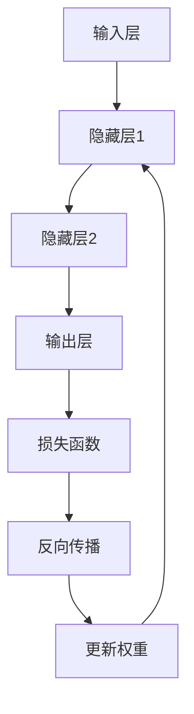

                 

### 文章标题

《从零开始大模型开发与微调：数据集的获取与处理》

### 关键词

大模型，深度学习，数据集，获取，处理，微调

### 摘要

本文旨在介绍大模型开发与微调过程中，数据集的获取与处理的关键步骤。通过深入探讨数据集的来源、预处理方法、划分策略及数据加载与管理等内容，帮助读者理解数据集在大模型开发中的重要性，掌握有效的数据集处理技术，从而提升模型的训练效果与应用价值。

## 目录大纲

### 第一部分：大模型开发基础

#### 第1章：大模型概述

##### 1.1 大模型的定义与特点

- **大模型的定义**：大模型是指具有数十亿甚至数千亿参数的神经网络模型，其规模远超传统模型。
- **大模型的核心特点**：高参数量、强大的表征能力、较高的计算需求。
- **大模型与传统模型的区别**：传统模型通常具有数千到数万个参数，而大模型则具有数十亿甚至更多的参数。

##### 1.2 大模型的技术背景

- **深度学习的演进**：从简单的多层感知机到复杂的卷积神经网络、循环神经网络和变换器模型。
- **大模型的发展历程**：从早期的ReLU神经网络到现代的BERT、GPT等大型预训练模型。

##### 1.3 大模型的应用领域

- **语言处理**：自然语言理解、机器翻译、文本生成等。
- **图像识别**：物体检测、图像分类、图像分割等。
- **计算机视觉**：自动驾驶、安防监控、医疗影像分析等。
- **自然语言生成**：自动写作、对话系统、聊天机器人等。

##### 1.4 大模型的未来发展趋势

- **大模型技术的创新方向**：高效训练算法、模型压缩与量化、自适应学习等。
- **大模型在各个领域的潜在应用**：从工业界到学术界，大模型的应用场景越来越广泛。

### 第二部分：大模型的数学原理

#### 第2章：大模型的数学原理

##### 2.1 神经网络基础

- **神经网络的基本结构**：输入层、隐藏层、输出层。
- **激活函数**：ReLU、Sigmoid、Tanh等。
- **前向传播与反向传播**：计算输出值和梯度，用于模型训练。

##### 2.2 深度学习算法

- **梯度下降算法**：最常用的优化算法，用于更新模型参数。
- **动量优化**：结合历史梯度信息，提高优化效率。
- **Adam优化器**：自适应的学习率优化算法，具有较好的收敛性能。

##### 2.3 注意力机制

- **注意力机制的基本原理**：通过加权的方式对输入信息进行选择和整合。
- **注意力机制的实现方法**：点积注意力、缩放点积注意力、多头注意力等。

### 第三部分：大模型架构

#### 第3章：大模型架构

##### 3.1 深层神经网络架构

- **卷积神经网络（CNN）**：适用于图像处理。
- **循环神经网络（RNN）**：适用于序列数据。
- **长短期记忆网络（LSTM）**：RNN的改进版本，能够更好地处理长序列数据。

##### 3.2 特定领域的网络架构

- **生成对抗网络（GAN）**：用于生成式任务。
- **Transformer模型**：适用于序列建模。
- **多层感知机（MLP）**：适用于非线性分类任务。

##### 3.3 大模型架构优化

- **并行计算**：利用多GPU、TPU等硬件加速训练过程。
- **分布式训练**：将数据集分布在多台机器上进行训练。
- **模型压缩与剪枝**：减少模型参数量，降低计算需求。

### 第四部分：数据集的获取与处理

#### 第4章：数据集的获取与处理

##### 4.1 数据集的来源

- **开源数据集**：如ImageNet、CIFAR-10、COCO等。
- **自定义数据集**：根据特定应用需求自行收集和整理。
- **数据采集与爬取**：通过网络爬虫等技术获取数据。

##### 4.2 数据预处理

- **数据清洗**：去除噪声、缺失值等。
- **数据归一化**：将数据缩放到同一范围内。
- **数据增强**：通过变换增加数据多样性。

##### 4.3 数据集划分

- **训练集**：用于模型训练。
- **验证集**：用于模型调优。
- **测试集**：用于模型评估。

##### 4.4 数据加载与管理

- **数据加载器**：高效地加载和处理数据。
- **多线程数据加载**：利用多线程技术加快数据加载速度。
- **数据并行处理**：将数据分布在多个计算单元上进行处理。

### 第五部分：大模型的训练与微调

#### 第5章：大模型的训练与微调

##### 5.1 大模型训练流程

- **模型初始化**：随机初始化模型参数。
- **模型训练**：通过前向传播和反向传播更新模型参数。
- **模型评估**：使用验证集评估模型性能。

##### 5.2 训练策略与技巧

- **学习率调整**：选择合适的学习率以避免过拟合和欠拟合。
- **批处理大小**：确定每次训练使用的样本数量。
- **预训练与微调**：在大规模数据集上预训练模型，然后在特定任务上进行微调。

##### 5.3 模型微调

- **微调策略**：调整模型参数以适应特定任务。
- **微调中的挑战**：如参数更新、模型稳定性等。
- **微调案例**：示例微调过程和效果。

### 第六部分：大模型的部署与优化

#### 第6章：大模型的部署与优化

##### 6.1 大模型部署

- **部署环境搭建**：搭建适合部署的环境。
- **部署架构设计**：设计合理的部署架构。
- **部署流程**：描述模型部署的步骤。

##### 6.2 模型优化

- **模型压缩**：减少模型参数量，降低计算需求。
- **模型量化**：将浮点模型转换为低精度模型。
- **模型迁移**：将训练好的模型迁移到不同的硬件或平台上。

##### 6.3 性能优化

- **内存优化**：减少模型在内存中的占用。
- **计算优化**：使用更高效的算法和硬件加速。
- **网络优化**：优化数据传输和模型部署的网络架构。

### 第七部分：大模型开发实战

#### 第7章：大模型开发实战

##### 7.1 实战项目一：文本分类

- **项目概述**：介绍文本分类项目的背景和目标。
- **数据集处理**：描述数据集的下载、预处理和划分过程。
- **模型选择与训练**：选择合适的文本分类模型，描述模型训练过程。
- **模型评估与优化**：使用测试集评估模型性能，进行模型调优。

##### 7.2 实战项目二：图像识别

- **项目概述**：介绍图像识别项目的背景和目标。
- **数据集处理**：描述数据集的下载、预处理和划分过程。
- **模型选择与训练**：选择合适的图像分类模型，描述模型训练过程。
- **模型评估与优化**：使用测试集评估模型性能，进行模型调优。

## 附录

### 附录A：常用工具与资源

- **深度学习框架**：TensorFlow、PyTorch、Keras
- **数据集下载地址**：Kaggle、ImageNet、OpenImage
- **模型训练与部署工具**：Docker、TensorFlow Serving、PyTorch Lightning

### 附录B：参考文献

- Goodfellow, I., Bengio, Y., & Courville, A. (2016). **Deep Learning**. MIT Press.
- LeCun, Y., Bengio, Y., & Hinton, G. (2015). **Deep Learning**. Nature.
- Russell, S., & Norvig, P. (2010). **Artificial Intelligence: A Modern Approach**. Prentice Hall.
- Simonyan, K., & Zisserman, A. (2014). **Very Deep Convolutional Networks for Large-Scale Image Recognition**. arXiv preprint arXiv:1409.1556.
- Vaswani, A., Shazeer, N., Parmar, N., Uszkoreit, J., Jones, L., Gomez, A. N., ... & Polosukhin, I. (2017). **Attention is All You Need**. Advances in Neural Information Processing Systems, 30, 5998-6008.

## 大模型架构原理 Mermaid 流程图



## 卷积神经网络（CNN）算法伪代码

```python
# 初始化模型参数
weights = initialize_weights()

# 前向传播
outputs = forward_pass(inputs, weights)

# 计算损失
loss = compute_loss(outputs, labels)

# 反向传播
deltas = backward_pass(loss, outputs, inputs, weights)

# 更新权重
update_weights(weights, deltas)
```

## 数据增强技术讲解与示例

#### 数据增强技术讲解

- **数据增强技术**是指在模型训练之前，对原始数据集进行一系列变换，以增加数据的多样性，从而提高模型的泛化能力。
- **常见的数据增强技术**包括：
  - **随机裁剪（Random Crop）**：从原始图像中随机裁剪出一个区域作为样本。
  - **随机旋转（Random Rotate）**：将图像随机旋转一定角度。
  - **翻转（Flip）**：水平或垂直翻转图像。
  - **光照变换（Lighting Transform）**：对图像进行光照变换。
  - **颜色变换（Color Transform）**：对图像进行颜色变换。

#### 示例

```python
import cv2
import numpy as np

# 读取原始图像
img = cv2.imread("original_image.jpg")

# 随机裁剪
crop_img = img[100:200, 100:200]

# 随机旋转
angle = np.random.uniform(-30, 30)
rotated_img = cv2.rotate(img, cv2.ROTATE_90_CLOCKWISE)

# 水平翻转
flipped_img = cv2.flip(img, 1)

# 光照变换
brightness = np.random.uniform(0.5, 1.5)
contrast = np.random.uniform(0.5, 1.5)
altered_img = cv2.convertScaleAbs(img, alpha=contrast, beta=brightness)
```

### 实战项目一：文本分类

#### 项目概述

文本分类是将文本数据按照特定的类别进行分类的过程。本项目将使用大模型对新闻文章进行分类，分为体育、财经、娱乐等类别。

#### 数据集处理

1. **数据集下载与预处理**：
   - 下载新闻文章数据集，如20 Newsgroups。
   - 将文本转换为统一格式的词袋表示。

2. **数据清洗**：
   - 去除HTML标签、特殊字符和停用词。
   - 将文本转换为小写，统一文本格式。

3. **数据划分**：
   - 将数据集划分为训练集、验证集和测试集，通常比例为60%、20%和20%。

#### 模型选择与训练

1. **模型选择**：
   - 选择合适的文本分类模型，如TextCNN或BERT。

2. **模型训练**：
   - 使用训练集对模型进行训练。
   - 使用验证集调整模型参数，如学习率和批处理大小。

#### 模型评估与优化

1. **模型评估**：
   - 使用测试集评估模型性能，计算准确率、召回率、F1分数等指标。

2. **模型优化**：
   - 根据评估结果调整模型参数。
   - 优化模型结构，如增加隐藏层或调整激活函数。

### 实战项目二：图像识别

#### 项目概述

图像识别是将图像中的内容分类到特定的类别中的过程。本项目将使用大模型对图像进行分类，分为猫、狗、鸟等类别。

#### 数据集处理

1. **数据集下载与预处理**：
   - 下载图像分类数据集，如Kaggle的Dogs vs. Cats。
   - 对图像进行缩放、裁剪和归一化处理。

2. **数据清洗**：
   - 去除具有噪声或质量差的图像。
   - 标记图像的类别。

3. **数据划分**：
   - 将数据集划分为训练集、验证集和测试集。

#### 模型选择与训练

1. **模型选择**：
   - 选择合适的图像分类模型，如ResNet或Inception。

2. **模型训练**：
   - 使用训练集对模型进行训练。
   - 使用验证集调整模型参数。

#### 模型评估与优化

1. **模型评估**：
   - 使用测试集评估模型性能，计算准确率、召回率、F1分数等指标。

2. **模型优化**：
   - 根据评估结果调整模型参数。
   - 优化模型结构，如增加卷积层或调整池化层。

### 附录A：常用工具与资源

#### 深度学习框架

- **TensorFlow**：Google开源的深度学习框架，支持多种模型架构。
- **PyTorch**：Facebook开源的深度学习框架，具有动态计算图和易用性。
- **Keras**：Python的深度学习库，基于TensorFlow和Theano。

#### 数据集下载地址

- **Kaggle**：提供各种数据集下载，适合竞赛和项目使用。
- **ImageNet**：提供大量图像分类数据集，用于图像识别任务。
- **OpenImage**：提供大规模开放图像数据集，用于计算机视觉研究。

#### 模型训练与部署工具

- **Docker**：容器化技术，用于构建和管理训练环境。
- **TensorFlow Serving**：Google开源的服务器，用于部署TensorFlow模型。
- **PyTorch Lightning**：PyTorch的增强库，用于模型训练和部署。

### 附录B：参考文献

- Goodfellow, I., Bengio, Y., & Courville, A. (2016). **Deep Learning**. MIT Press.
- LeCun, Y., Bengio, Y., & Hinton, G. (2015). **Deep Learning**. Nature.
- Russell, S., & Norvig, P. (2010). **Artificial Intelligence: A Modern Approach**. Prentice Hall.
- Simonyan, K., & Zisserman, A. (2014). **Very Deep Convolutional Networks for Large-Scale Image Recognition**. arXiv preprint arXiv:1409.1556.
- Vaswani, A., Shazeer, N., Parmar, N., Uszkoreit, J., Jones, L., Gomez, A. N., ... & Polosukhin, I. (2017). **Attention is All You Need**. Advances in Neural Information Processing Systems, 30, 5998-6008.

