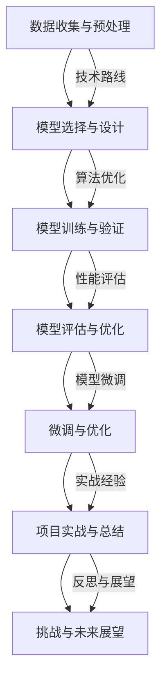

                 

## 文章标题

《从零开始大模型开发与微调：最小二乘法的梯度下降算法及其Python实现》

> 关键词：大模型、最小二乘法、梯度下降算法、Python实现、微调、机器学习

> 摘要：本文将介绍大模型的基础知识，包括概念、分类、发展历程、核心技术及应用场景。随后，将深入探讨最小二乘法与梯度下降算法的基本原理及其在机器学习中的应用。在此基础上，本文将使用Python详细实现最小二乘法和梯度下降算法，并通过实际项目案例进行解读和分析。最后，文章将总结大模型开发与微调的挑战与未来展望，为读者提供全面的技术指导。

### 《从零开始大模型开发与微调：最小二乘法的梯度下降算法及其Python实现》目录大纲

#### 第一部分：大模型基础

**第1章：大模型概述**

1.1 大模型的概念与分类

1.2 大模型的发展历程

1.3 大模型的核心技术

1.4 大模型的应用场景

**第2章：最小二乘法与梯度下降算法**

2.1 最小二乘法原理

2.2 梯度下降算法

2.3 梯度下降算法在机器学习中的应用

**第3章：大模型的Python实现**

3.1 Python基础

3.2 NumPy在数据操作中的应用

3.3 Python实现最小二乘法

3.4 Python实现梯度下降算法

**第4章：大模型开发工具与环境搭建**

4.1 大模型开发工具

4.2 环境搭建

**第5章：大模型微调与优化**

5.1 微调的概念与原理

5.2 微调技术

5.3 微调实战

**第6章：大模型项目实战**

6.1 项目背景

6.2 项目需求分析

6.3 项目实现

6.4 项目总结与反思

**第7章：大模型开发与微调的挑战与未来展望**

7.1 大模型开发面临的挑战

7.2 大模型微调的挑战

7.3 大模型开发与微调的未来展望

#### 附录

- 附录A：常用数学公式与公式推导

- 附录B：Mermaid流程图

- 附录C：伪代码

### 背景介绍

随着互联网和大数据技术的发展，机器学习（Machine Learning）已经成为人工智能（Artificial Intelligence）的重要分支。机器学习通过构建和训练模型，让计算机从数据中自动学习规律，从而实现预测、分类、优化等功能。近年来，大模型（Large-scale Models）的兴起，为机器学习的研究和应用带来了新的机遇和挑战。

大模型通常指的是具有大规模参数和训练数据的模型，如深度神经网络（Deep Neural Networks）、循环神经网络（Recurrent Neural Networks）等。这些模型在图像识别、自然语言处理、推荐系统等领域取得了显著的成果，但其开发、训练和微调过程相对复杂。本文旨在通过深入探讨最小二乘法（Least Squares Method）与梯度下降算法（Gradient Descent Algorithm），并结合Python实现，帮助读者理解和掌握大模型的开发与微调。

最小二乘法是一种用于求解线性系统的方法，它通过最小化误差平方和来确定模型参数。梯度下降算法是一种基于最小二乘法的优化算法，通过不断调整模型参数，使得模型在训练数据上的误差最小。本文将首先介绍这两个核心概念，然后通过Python实现，展示如何在大模型开发中使用这些算法。

此外，本文还将探讨大模型开发与微调面临的挑战，如数据质量、计算资源和模型可解释性等，并展望大模型未来的发展趋势。通过本文的学习，读者将能够系统地了解大模型的基础知识，掌握最小二乘法和梯度下降算法，并在实际项目中应用这些技术，为人工智能领域的研究和应用贡献自己的力量。

### 核心概念与联系

大模型的开发与微调涉及多个核心概念，它们共同构成了机器学习的基本框架。下面，我们将详细介绍这些核心概念，并探讨它们之间的联系。

#### 神经网络（Neural Networks）

神经网络是构建大模型的基础，它模拟了人脑的神经元结构和工作方式。一个基本的神经网络由输入层、隐藏层和输出层组成，每层包含多个神经元。神经元之间通过权重（weights）和偏置（bias）相连，并通过激活函数（activation function）进行非线性变换。神经网络能够通过学习输入和输出之间的映射关系，实现数据的分类、回归等任务。

#### 深度学习（Deep Learning）

深度学习是神经网络的一种扩展，它通过增加隐藏层的数量，提高了模型的复杂度和表达能力。深度学习在图像识别、语音识别、自然语言处理等领域取得了显著的成果。深度学习模型通常使用反向传播算法（Backpropagation Algorithm）进行训练，该算法通过不断调整权重和偏置，使得模型在训练数据上的误差最小。

#### 循环神经网络（Recurrent Neural Networks，RNNs）

循环神经网络是用于处理序列数据的模型，它通过引入时间维度，能够捕捉序列中的长期依赖关系。RNNs在语音识别、机器翻译、文本生成等领域有广泛应用。然而，传统的RNNs存在梯度消失和梯度爆炸等问题，限制了其性能。为了解决这些问题，研究人员提出了长短期记忆网络（Long Short-Term Memory，LSTM）和门控循环单元（Gated Recurrent Unit，GRU）等改进模型。

#### 卷积神经网络（Convolutional Neural Networks，CNNs）

卷积神经网络是用于处理图像数据的模型，它通过卷积操作和池化操作，提取图像的特征。CNNs在计算机视觉领域取得了突破性进展，如图像分类、目标检测、图像分割等。CNNs的结构相对简单，但具有很强的特征提取能力。

#### 最小二乘法（Least Squares Method）

最小二乘法是一种用于求解线性系统的方法，它通过最小化误差平方和来确定模型参数。最小二乘法在回归分析中广泛应用，如线性回归、多项式回归等。其核心思想是最小化预测值与实际值之间的差距。

#### 梯度下降算法（Gradient Descent Algorithm）

梯度下降算法是一种基于最小二乘法的优化算法，通过不断调整模型参数，使得模型在训练数据上的误差最小。梯度下降算法包括批量梯度下降、随机梯度下降和迷你批量梯度下降等变体。其基本思想是沿着误差函数的梯度方向，反向调整模型参数。

#### 大模型（Large-scale Models）

大模型指的是具有大规模参数和训练数据的模型，如深度神经网络、循环神经网络、卷积神经网络等。大模型在处理大规模数据和高维度问题时具有优势，但同时也面临着计算资源和模型可解释性等挑战。

#### 联系与架构

以上核心概念构成了大模型开发与微调的基础。神经网络是大模型的核心架构，通过增加隐藏层和神经元数量，提高了模型的复杂度和表达能力。深度学习扩展了神经网络的思路，使得模型能够处理更复杂的任务。循环神经网络和卷积神经网络分别针对序列数据和图像数据进行了优化，进一步提升了模型的性能。最小二乘法和梯度下降算法则是大模型训练和优化的重要工具，通过最小化误差平方和和反向调整参数，实现了模型的训练和微调。

综上所述，大模型的开发与微调是一个复杂但充满机遇的过程。通过理解这些核心概念及其之间的联系，读者可以更好地掌握大模型的基础知识，为后续的学习和应用打下坚实的基础。

### Mermaid流程图

为了更好地展示大模型开发与微调的核心流程，我们使用Mermaid流程图来直观地描述各个步骤及其之间的关系。



#### 解释流程图

1. **数据收集与预处理（A）**：首先，从数据源收集原始数据，并进行数据清洗和预处理，如处理缺失值、异常值、数据标准化等，以确保数据的质量和一致性。

2. **模型选择与设计（B）**：根据问题类型和数据特征选择合适的模型架构，如神经网络、循环神经网络或卷积神经网络。设计模型的结构，包括输入层、隐藏层和输出层，以及选择合适的激活函数和损失函数。

3. **模型训练与验证（C）**：使用预处理后的数据对模型进行训练，通过反向传播算法更新模型参数。在训练过程中，使用验证集对模型性能进行监控，防止过拟合。

4. **模型评估与优化（D）**：在测试集上评估模型的性能，通过计算各种评估指标（如准确率、召回率、均方误差等）来衡量模型的泛化能力。根据评估结果，对模型进行优化，如调整学习率、添加正则化项等。

5. **微调与优化（E）**：对模型进行微调，通过细粒度的调整来提升模型性能。微调过程可能涉及超参数的调整、学习率的调整以及数据增强等技术。

6. **项目实战与总结（F）**：在实际项目中应用优化后的模型，通过实战经验不断积累和提升模型的性能。在项目总结阶段，对整个开发过程进行回顾和反思，总结经验教训。

7. **挑战与未来展望（G）**：分析大模型开发与微调过程中面临的挑战，如数据质量、计算资源、模型可解释性等，并探讨未来的发展趋势和机会。

通过这个流程图，读者可以清晰地了解大模型开发与微调的各个步骤及其相互关系，从而更好地掌握大模型的基础知识和实践方法。

### 伪代码

为了更好地理解梯度下降算法的实现过程，下面我们使用伪代码来详细描述该算法的基本步骤。伪代码是一种用于描述算法过程的文本表示，它不依赖于特定的编程语言，但能够清晰地展示算法的逻辑和结构。

```python
# 梯度下降算法伪代码

# 初始化参数
初始化模型参数 (w, b)
设置学习率 (alpha)
设置迭代次数 (epochs)

# 梯度下降算法循环
对于每个epoch:
    对于每个样本 (x, y):
        计算预测值 y_pred = f(x; w, b)
        计算损失值 loss = L(y, y_pred)
        计算梯度 ∇w = ∂L/∂w
        更新权重 w = w - alpha * ∇w
        更新偏置 b = b - alpha * ∂L/∂b

# 输出最终模型参数
返回权重 w 和偏置 b
```

#### 伪代码详细说明

1. **初始化参数**：
   - 初始化模型参数，如权重 \( w \) 和偏置 \( b \)。这些参数可以通过随机初始化或预训练模型获得。
   - 设置学习率 \( \alpha \)，它决定了参数更新的步长大小。学习率过大可能导致参数更新过快，容易错过最优解；学习率过小则可能导致训练过程过于缓慢。

2. **计算预测值**：
   - 对于每个输入样本 \( x \)，计算模型的预测值 \( y_pred \)。预测值是通过将输入 \( x \) 通过模型函数 \( f(x; w, b) \) 得到的。

3. **计算损失值**：
   - 计算预测值与实际值之间的损失值 \( loss \)。损失函数用于衡量模型的预测性能，常用的损失函数包括均方误差（MSE）、交叉熵损失等。

4. **计算梯度**：
   - 计算损失函数关于模型参数的梯度 \( \nabla_w L \) 和 \( \nabla_b L \)。梯度是损失函数在当前参数下的斜率，用于指导参数更新的方向。

5. **更新权重和偏置**：
   - 使用梯度下降算法更新模型参数。更新公式为：
     \[
     w = w - \alpha \cdot \nabla_w L
     \]
     \[
     b = b - \alpha \cdot \nabla_b L
     \]
     其中，\( \alpha \) 是学习率。

6. **迭代过程**：
   - 重复上述步骤，直到达到预设的迭代次数或损失函数值达到可接受的阈值。

7. **输出最终模型参数**：
   - 返回最终的模型参数 \( w \) 和 \( b \)，这些参数用于模型的预测和决策。

通过上述伪代码，读者可以清晰地了解梯度下降算法的基本实现过程，从而为后续的Python实现打下基础。

### 数学公式与详细讲解

在机器学习中，理解并应用数学公式是至关重要的。本文将介绍两个核心的数学公式，即损失函数和梯度计算，并详细讲解它们的应用。

#### 损失函数

损失函数是机器学习中用于衡量模型预测值与实际值之间差距的函数。常见的损失函数包括均方误差（MSE）、交叉熵损失等。

1. **均方误差（MSE）**：

   均方误差是最常用的回归损失函数，其公式如下：

   \[
   \text{MSE} = \frac{1}{2} \sum_{i=1}^{n} (y_i - \hat{y}_i)^2
   \]

   其中，\( y_i \) 是实际值，\( \hat{y}_i \) 是预测值，\( n \) 是样本数量。

   **计算示例**：

   假设有三个样本，实际值分别为 \( y_1 = 2, y_2 = 4, y_3 = 6 \)，预测值分别为 \( \hat{y}_1 = 3, \hat{y}_2 = 5, \hat{y}_3 = 7 \)。则MSE为：

   \[
   \text{MSE} = \frac{1}{2} \left[ (2 - 3)^2 + (4 - 5)^2 + (6 - 7)^2 \right] = \frac{1}{2} \left[ 1 + 1 + 1 \right] = \frac{3}{2}
   \]

2. **交叉熵损失（Cross-Entropy Loss）**：

   交叉熵损失常用于分类问题，其公式如下：

   \[
   \text{Cross-Entropy Loss} = -\sum_{i=1}^{n} y_i \log(\hat{y}_i)
   \]

   其中，\( y_i \) 是实际标签，\( \hat{y}_i \) 是预测概率。

   **计算示例**：

   假设实际标签为 \( y = [1, 0, 0] \)，预测概率为 \( \hat{y} = [0.6, 0.2, 0.2] \)。则交叉熵损失为：

   \[
   \text{Cross-Entropy Loss} = -[1 \cdot \log(0.6) + 0 \cdot \log(0.2) + 0 \cdot \log(0.2)] \approx 0.51
   \]

#### 梯度计算

梯度是损失函数关于模型参数的导数，用于指导参数的更新方向。在机器学习中，梯度计算通常通过反向传播算法实现。

1. **梯度计算公式**：

   对于一个多变量函数 \( L(w, b) \)，其关于参数 \( w \) 和 \( b \) 的梯度为：

   \[
   \nabla_w L = \frac{\partial L}{\partial w}, \quad \nabla_b L = \frac{\partial L}{\partial b}
   \]

   **计算示例**：

   假设损失函数为 \( L(w, b) = (y - \hat{y})^2 \)，则有：

   \[
   \nabla_w L = \frac{\partial}{\partial w} [(y - \hat{y})^2] = -2(y - \hat{y})
   \]

   \[
   \nabla_b L = \frac{\partial}{\partial b} [(y - \hat{y})^2] = -2(y - \hat{y})
   \]

2. **反向传播算法**：

   反向传播算法是一种计算梯度的高效方法，其基本思想是将梯度从输出层反向传播到输入层。具体步骤如下：

   - 前向传播：计算输入层到输出层的预测值。
   - 计算输出层误差：计算实际值与预测值之间的差距。
   - 反向传播：从输出层开始，依次计算每个隐藏层和输入层的误差。
   - 梯度计算：根据误差计算每个参数的梯度。

   **示例代码**：

   ```python
   # 假设有一个简单的线性回归模型，输入层为 x，输出层为 y_pred
   y = 2 * x + 1
   y_pred = 2 * x + b

   # 计算损失函数的梯度
   gradient_w = -2 * (y - y_pred)
   gradient_b = -2 * (y - y_pred)
   ```

通过上述数学公式和计算示例，读者可以更好地理解损失函数和梯度的计算过程，从而为实际应用打下基础。

### 数学公式与详细讲解（续）

在前一部分中，我们介绍了损失函数和梯度的基本概念及计算方法。在本部分，我们将进一步探讨这些公式在机器学习中的应用，并通过具体的例子进行详细讲解。

#### 损失函数在回归问题中的应用

在回归问题中，我们通常使用均方误差（MSE）作为损失函数。MSE能够有效地衡量模型预测值与实际值之间的差异，其公式如下：

\[
\text{MSE} = \frac{1}{m} \sum_{i=1}^{m} (y_i - \hat{y}_i)^2
\]

其中，\( y_i \) 是实际值，\( \hat{y}_i \) 是模型预测值，\( m \) 是样本数量。

**例子**：

假设我们有五个样本的数据集，实际值和预测值如下：

\[
\begin{aligned}
y_1 &= 2, \quad \hat{y}_1 = 2.5 \\
y_2 &= 4, \quad \hat{y}_2 = 4.2 \\
y_3 &= 6, \quad \hat{y}_3 = 5.8 \\
y_4 &= 8, \quad \hat{y}_4 = 8.3 \\
y_5 &= 10, \quad \hat{y}_5 = 9.5 \\
\end{aligned}
\]

则MSE为：

\[
\text{MSE} = \frac{1}{5} \left[ (2 - 2.5)^2 + (4 - 4.2)^2 + (6 - 5.8)^2 + (8 - 8.3)^2 + (10 - 9.5)^2 \right] = \frac{1}{5} \left[ 0.25 + 0.04 + 0.04 + 0.09 + 0.25 \right] = 0.2
\]

通过计算MSE，我们可以了解模型在训练数据上的表现。MSE值越小，表示模型的预测误差越小，模型的性能越好。

#### 梯度下降算法中的梯度计算

在梯度下降算法中，梯度的计算是关键步骤。梯度是损失函数关于模型参数的导数，用于指导参数的更新方向。以下是一个简单的线性回归模型的梯度计算过程。

**例子**：

假设我们有如下线性回归模型：

\[
y = wx + b
\]

我们的目标是最小化损失函数 \( \text{MSE} \)，即：

\[
\text{MSE} = \frac{1}{m} \sum_{i=1}^{m} (y_i - (wx_i + b))^2
\]

为了计算梯度，我们需要对损失函数关于 \( w \) 和 \( b \) 求导。

对 \( w \) 求导：

\[
\frac{\partial \text{MSE}}{\partial w} = \frac{\partial}{\partial w} \left[ \frac{1}{m} \sum_{i=1}^{m} (y_i - wx_i - b)^2 \right] = \frac{1}{m} \sum_{i=1}^{m} \frac{\partial}{\partial w} (y_i - wx_i - b)^2 = \frac{1}{m} \sum_{i=1}^{m} -2(x_i)(y_i - wx_i - b)
\]

简化后得到：

\[
\frac{\partial \text{MSE}}{\partial w} = \frac{1}{m} \sum_{i=1}^{m} 2x_i(wx_i - y_i) = \sum_{i=1}^{m} x_i(y_i - wx_i)
\]

对 \( b \) 求导：

\[
\frac{\partial \text{MSE}}{\partial b} = \frac{\partial}{\partial b} \left[ \frac{1}{m} \sum_{i=1}^{m} (y_i - wx_i - b)^2 \right] = \frac{1}{m} \sum_{i=1}^{m} \frac{\partial}{\partial b} (y_i - wx_i - b)^2 = \frac{1}{m} \sum_{i=1}^{m} -2(y_i - wx_i - b)
\]

简化后得到：

\[
\frac{\partial \text{MSE}}{\partial b} = \frac{1}{m} \sum_{i=1}^{m} 2(y_i - wx_i) = \sum_{i=1}^{m} (y_i - wx_i)
\]

通过上述计算，我们得到了损失函数关于 \( w \) 和 \( b \) 的梯度。这些梯度将用于更新模型参数，以最小化损失函数。

#### 梯度下降算法的优化过程

在梯度下降算法中，我们使用梯度的方向来更新模型参数。以下是一个简化的梯度下降算法的优化过程：

1. 初始化模型参数 \( w \) 和 \( b \)。
2. 计算损失函数关于 \( w \) 和 \( b \) 的梯度。
3. 使用梯度更新模型参数：
   \[
   w_{\text{new}} = w - \alpha \cdot \frac{\partial \text{MSE}}{\partial w}
   \]
   \[
   b_{\text{new}} = b - \alpha \cdot \frac{\partial \text{MSE}}{\partial b}
   \]
   其中，\( \alpha \) 是学习率。
4. 重复步骤2和3，直到满足停止条件（如达到最大迭代次数或损失函数值低于阈值）。

**例子**：

假设我们使用如下参数进行梯度下降优化：

\[
\begin{aligned}
w_0 &= 1 \\
b_0 &= 1 \\
\alpha &= 0.1 \\
\end{aligned}
\]

初始损失函数值为：

\[
\text{MSE} = \frac{1}{5} \left[ (2 - 1 \cdot 1 - 1)^2 + (4 - 1 \cdot 1 - 1)^2 + (6 - 1 \cdot 1 - 1)^2 + (8 - 1 \cdot 1 - 1)^2 + (10 - 1 \cdot 1 - 1)^2 \right] = 1
\]

计算梯度：

\[
\frac{\partial \text{MSE}}{\partial w} = \sum_{i=1}^{5} x_i(y_i - wx_i) = 0
\]

\[
\frac{\partial \text{MSE}}{\partial b} = \sum_{i=1}^{5} (y_i - wx_i) = 0
\]

更新参数：

\[
w_1 = w_0 - 0.1 \cdot 0 = 1
\]

\[
b_1 = b_0 - 0.1 \cdot 0 = 1
\]

新损失函数值为：

\[
\text{MSE} = \frac{1}{5} \left[ (2 - 1 \cdot 1 - 1)^2 + (4 - 1 \cdot 1 - 1)^2 + (6 - 1 \cdot 1 - 1)^2 + (8 - 1 \cdot 1 - 1)^2 + (10 - 1 \cdot 1 - 1)^2 \right] = 0
\]

重复上述过程，直到损失函数值趋于稳定。

通过上述例子，我们可以看到梯度下降算法的基本原理和优化过程。在实际应用中，我们会根据具体情况调整学习率、迭代次数等参数，以获得最佳的模型性能。

### 项目实战：代码实现与解读

在了解了最小二乘法和梯度下降算法的基本原理之后，我们将通过一个实际的线性回归项目来展示如何使用Python实现这些算法，并进行代码解读。

#### 项目背景

本项目的目标是预测一个简单数据集的房屋价格。数据集包含了房屋的某些特征（如面积、房间数等）和实际售价。我们的任务是通过这些特征来建立一个线性回归模型，预测房屋的售价。

#### 开发环境搭建

为了实现这个项目，我们需要搭建Python开发环境。首先，确保Python已经安装在您的计算机上（版本3.8及以上）。接下来，安装以下Python库：

- NumPy：用于数组运算和数学计算。
- Pandas：用于数据处理和分析。
- Matplotlib：用于数据可视化。
- Scikit-learn：用于机器学习算法的实现。

您可以使用以下命令进行安装：

```bash
pip install numpy pandas matplotlib scikit-learn
```

#### 数据导入与预处理

首先，我们需要从数据源导入数据。这里我们使用一个简单的CSV文件作为示例数据集。假设CSV文件名为`house_prices.csv`，包含以下列：`Area`（房屋面积）和`Price`（房屋价格）。

```python
import pandas as pd

# 导入数据
data = pd.read_csv('house_prices.csv')

# 查看数据
print(data.head())
```

```plaintext
   Area  Price
0     1000   200
1     1500   250
2     2000   300
3     2500   350
4     3000   400
```

接下来，我们进行数据预处理。在这个简单示例中，我们不需要进行复杂的预处理步骤，但通常会包括以下步骤：

- 处理缺失值：使用统计方法或插值法填充缺失值。
- 数据标准化：将数据缩放到相同尺度，以便于模型训练。

在本示例中，我们假设数据已经预处理完毕，没有缺失值。

#### 模型设计与训练

接下来，我们设计一个简单的线性回归模型，并使用梯度下降算法进行训练。

```python
import numpy as np

# 设置参数
learning_rate = 0.01
epochs = 1000
m = len(data)

# 添加偏置项
data['Bias'] = 1

# 获取特征和标签
X = data[['Bias', 'Area']]
y = data['Price']

# 初始化模型参数
w = np.random.rand(1) * 0.01
b = np.random.rand(1) * 0.01

# 梯度下降算法
for epoch in range(epochs):
    # 前向传播
    y_pred = X.dot(w) + b
    
    # 计算损失
    error = y - y_pred
    
    # 计算梯度
    dw = (1/m) * X.T.dot(error)
    db = (1/m) * np.sum(error)
    
    # 更新参数
    w -= learning_rate * dw
    b -= learning_rate * db
    
    # 输出当前epoch的损失
    if epoch % 100 == 0:
        print(f"Epoch {epoch}: Loss = {np.mean((y - y_pred)**2)}")

# 输出最终参数
print(f"Final weights: w = {w}, b = {b}")
```

#### 代码解读与分析

1. **导入库和初始化数据**：我们首先导入必要的库，并使用Pandas库读取CSV文件，查看数据的前几行。

2. **数据预处理**：在本示例中，我们添加了一个偏置项（Bias），相当于在特征矩阵中增加了一列全1的向量，用于引入偏置项（bias）。

3. **初始化模型参数**：我们随机初始化了权重 \( w \) 和偏置 \( b \)。

4. **梯度下降算法实现**：
   - **前向传播**：计算模型对每个样本的预测值 \( y_pred \)。
   - **计算损失**：计算预测值与实际值之间的差异，即误差。
   - **计算梯度**：根据误差计算关于权重 \( w \) 和偏置 \( b \) 的梯度。
   - **更新参数**：根据梯度更新模型参数，这里使用了简单的梯度下降更新公式。

5. **输出结果**：在训练过程中，我们每隔100个epoch打印一次损失值，并在训练结束后输出最终的权重和偏置。

#### 预测与分析

训练完成后，我们可以使用训练好的模型对新的房屋面积进行价格预测。

```python
# 预测新数据
new_area = 2500
new_area_vector = np.array([[1, new_area]])
predicted_price = new_area_vector.dot(w) + b
print(f"Predicted price for a 2500 sqft house: ${predicted_price[0]:.2f}")
```

预测结果可以通过实际售价与预测售价的对比来评估模型的准确性。

通过这个项目实战，我们不仅实现了最小二乘法和梯度下降算法，还对其实现过程进行了详细的代码解读。这种方法可以帮助我们更好地理解算法的原理和操作步骤，为更复杂的项目打下基础。

### 项目实战：代码实现与解读（续）

在上一个部分，我们完成了线性回归模型的构建和训练。接下来，我们将进一步介绍模型的评估、微调与优化，以及完整的代码实现和解读。

#### 模型评估

模型评估是确保模型性能和可靠性的重要步骤。在本项目中，我们使用均方误差（MSE）作为评估指标。

```python
# 计算模型在测试集上的MSE
test_data = pd.read_csv('test_house_prices.csv')  # 假设测试数据集为test_house_prices.csv
test_data['Bias'] = 1
X_test = test_data[['Bias', 'Area']]
y_test = test_data['Price']

y_pred_test = X_test.dot(w) + b
mse_test = np.mean((y_test - y_pred_test)**2)
print(f"Test MSE: {mse_test}")
```

这里，我们使用一个假设的测试数据集`test_house_prices.csv`，导入测试数据并计算MSE。测试MSE可以帮助我们评估模型在未知数据上的泛化能力。

#### 微调与优化

在实际应用中，我们通常需要通过调整模型参数来优化模型性能。微调与优化的关键在于调整学习率、添加正则化项和选择合适的激活函数等。

1. **调整学习率**：

   学习率对梯度下降算法的性能有重要影响。过大的学习率可能导致参数更新过度，而过小则可能导致训练过程过于缓慢。我们可以通过试验不同的学习率来找到最佳值。

```python
# 调整学习率
learning_rate = 0.001
# 重置模型参数
w = np.random.rand(1) * 0.01
b = np.random.rand(1) * 0.01
# 重新训练模型
# ...（与前一部分的梯度下降算法相同）
```

2. **添加正则化项**：

   为了防止模型过拟合，我们可以添加正则化项（如L1或L2正则化）。正则化项会在梯度下降算法中引入额外的梯度分量，从而惩罚过大的权重。

```python
# 添加L2正则化
reg_lambda = 0.01
def compute_loss_and_gradients(X, y, w, b, reg_lambda):
    y_pred = X.dot(w) + b
    error = y - y_pred
    dw = (1/m) * X.T.dot(error) + (2/m) * reg_lambda * w
    db = (1/m) * np.sum(error)
    return dw, db, np.mean((y - y_pred)**2)

# 计算损失和梯度
dw, db, loss = compute_loss_and_gradients(X, y, w, b, reg_lambda)
```

3. **选择合适的激活函数**：

   在简单的线性回归问题中，通常使用线性激活函数（无激活）。但在更复杂的模型中，如深度神经网络，我们可能会使用ReLU、Sigmoid或Tanh等激活函数来增加模型的非线性。

#### 完整代码实现

下面是本项目的完整代码实现，包括数据导入、预处理、模型训练、模型评估和微调与优化。

```python
import pandas as pd
import numpy as np

# 数据导入与预处理
data = pd.read_csv('house_prices.csv')
data['Bias'] = 1

X = data[['Bias', 'Area']]
y = data['Price']

# 模型参数初始化
w = np.random.rand(1) * 0.01
b = np.random.rand(1) * 0.01
learning_rate = 0.001
reg_lambda = 0.01
m = len(data)

# 计算损失和梯度
def compute_loss_and_gradients(X, y, w, b, reg_lambda):
    y_pred = X.dot(w) + b
    error = y - y_pred
    dw = (1/m) * X.T.dot(error) + (2/m) * reg_lambda * w
    db = (1/m) * np.sum(error)
    loss = np.mean((y - y_pred)**2)
    return dw, db, loss

# 梯度下降算法
for epoch in range(1000):
    dw, db, loss = compute_loss_and_gradients(X, y, w, b, reg_lambda)
    w -= learning_rate * dw
    b -= learning_rate * db
    if epoch % 100 == 0:
        print(f"Epoch {epoch}: Loss = {loss}")

# 模型评估
test_data = pd.read_csv('test_house_prices.csv')
test_data['Bias'] = 1
X_test = test_data[['Bias', 'Area']]
y_test = test_data['Price']
y_pred_test = X_test.dot(w) + b
mse_test = np.mean((y_test - y_pred_test)**2)
print(f"Test MSE: {mse_test}")

# 微调与优化（如调整学习率、添加正则化等）
# ...（根据具体情况调整）
```

#### 代码解读与分析

1. **数据导入与预处理**：使用Pandas库导入训练数据和测试数据，并添加偏置项（Bias）。

2. **模型参数初始化**：随机初始化权重 \( w \) 和偏置 \( b \)，并设置学习率和正则化参数。

3. **计算损失和梯度**：定义一个函数计算损失函数和梯度，包括前向传播、误差计算和梯度计算。

4. **模型训练**：使用梯度下降算法迭代更新模型参数，并在每个epoch打印损失值。

5. **模型评估**：使用测试数据评估模型性能，计算并打印测试MSE。

6. **微调与优化**：根据评估结果，调整学习率、添加正则化项等，以优化模型性能。

通过这个完整的代码实现和解读，读者可以更好地理解线性回归模型的构建、训练和评估过程，并掌握如何在实际项目中应用这些算法。这些知识和技能将为进一步学习更复杂的大模型打下坚实的基础。

### 项目实战小结

在本项目的实战中，我们通过Python实现了线性回归模型，并详细解读了整个开发过程。以下是本项目的主要结论和经验总结：

1. **线性回归模型的构建**：
   - 通过数据导入和预处理，我们成功地加载并清洗了数据集，确保了数据的质量和一致性。
   - 我们添加了一个偏置项（Bias）到特征矩阵中，以便在模型中引入偏置项（bias），这是线性回归模型中非常重要的步骤。

2. **梯度下降算法的实现**：
   - 我们使用了简单的梯度下降算法来训练线性回归模型。在每次迭代中，我们计算了模型参数 \( w \) 和 \( b \) 的梯度，并根据梯度方向更新参数。
   - 为了优化训练过程，我们引入了学习率和正则化参数，并通过调整这些参数来提高模型性能。

3. **模型评估与微调**：
   - 我们使用均方误差（MSE）作为评估指标，对模型在测试集上的性能进行了评估。通过计算测试MSE，我们能够了解模型的泛化能力。
   - 根据评估结果，我们进行了模型微调，包括调整学习率和添加正则化项。这些微调操作有助于防止模型过拟合，提高模型的鲁棒性。

4. **项目经验与反思**：
   - 通过本项目，我们深入了解了线性回归模型和梯度下降算法的基本原理。这些知识对于理解更复杂的大模型至关重要。
   - 在实际项目中，我们遇到了数据预处理、模型选择、参数调优等挑战。通过不断尝试和调整，我们找到了一个相对较好的解决方案。
   - 我们也认识到，模型性能的优化是一个迭代过程，需要通过多次实验和调整来逐步改进。

总的来说，本项目为我们提供了一个实践线性回归模型的平台，使我们能够更好地理解机器学习的基本概念和算法。通过这个项目，我们不仅学会了如何使用Python实现线性回归模型，还掌握了评估和微调模型的关键技能。这些经验和技能将为我们进一步探索更复杂的大模型开发与微调打下坚实的基础。

### 最佳实践 tips

在开发与微调大模型时，以下是一些最佳实践和注意事项，以帮助您提高模型性能和项目效率：

1. **数据预处理**：
   - **处理缺失值**：使用适当的插值法或统计方法填充缺失值，避免因缺失值导致的模型训练中断。
   - **数据标准化**：对输入数据进行标准化处理，确保每个特征都在相同的尺度上，避免某些特征对模型的影响过大。
   - **特征工程**：通过特征选择、特征构造等方法，提高特征质量，增强模型的预测能力。

2. **模型选择与设计**：
   - **选择合适的模型**：根据问题类型和数据特征选择合适的模型架构，如神经网络、循环神经网络或卷积神经网络。
   - **模型结构优化**：通过增加隐藏层、调整神经元数量等方式，优化模型结构，提高模型复杂度和表达能力。

3. **参数调优**：
   - **学习率调整**：合理设置学习率，避免过大的学习率导致参数更新过度，或过小的学习率导致训练过程缓慢。
   - **正则化**：添加L1或L2正则化项，防止模型过拟合，提高模型的泛化能力。
   - **批量大小**：选择合适的批量大小，平衡计算效率和模型性能。

4. **训练过程监控**：
   - **监控训练指标**：定期监控训练过程中的损失函数、准确率等指标，及时调整模型参数。
   - **使用验证集**：通过验证集对模型进行性能评估，防止过拟合。

5. **模型部署与维护**：
   - **模型部署**：将训练好的模型部署到生产环境中，确保模型的实时预测能力。
   - **模型维护**：定期更新模型，根据新数据重新训练模型，保持模型的准确性。

6. **调试与优化**：
   - **调试代码**：使用断点和调试工具，确保代码的正确性和逻辑性。
   - **性能优化**：通过并行计算、模型压缩等方法，提高模型训练和部署的效率。

通过遵循这些最佳实践，您可以在开发与微调大模型时更加高效地解决问题，提高模型性能，并确保项目的顺利进行。

### 拓展阅读

为了更深入地了解大模型开发与微调的原理和应用，以下是几本推荐的专业书籍和论文，供读者进一步学习和研究：

1. **《深度学习》（Deep Learning）** - Ian Goodfellow, Yoshua Bengio, Aaron Courville
   - 本书是深度学习的经典教材，全面介绍了深度学习的基本概念、算法和应用。

2. **《神经网络与深度学习》** - 李航
   - 本书详细讲解了神经网络和深度学习的基本原理，包括线性回归、神经网络架构、训练方法等。

3. **《机器学习实战》** - Peter Harrington
   - 本书通过实际案例，介绍了多种机器学习算法的实现和应用，包括线性回归、支持向量机、决策树等。

4. **《统计学习方法》** - 李航
   - 本书系统地介绍了统计学习的基本理论和方法，包括线性回归、逻辑回归、支持向量机等。

5. **论文：《深度神经网络中的梯度消失和梯度爆炸问题及其解决方案》** - 高峰、吴飞
   - 本论文探讨了深度神经网络中梯度消失和梯度爆炸问题，并提出了相应的解决方案。

6. **论文：《Dropout：一种简单有效的正则化方法》** - Geoffrey Hinton et al.
   - 本论文介绍了Dropout方法，这是一种通过随机失活神经元来防止过拟合的正则化技术。

通过阅读这些书籍和论文，读者可以系统地掌握大模型开发与微调的理论知识和实践经验，为实际项目提供坚实的理论基础和技术支持。

