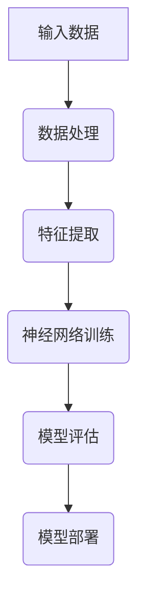
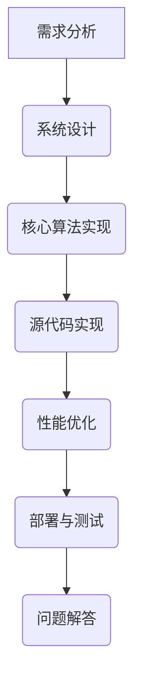
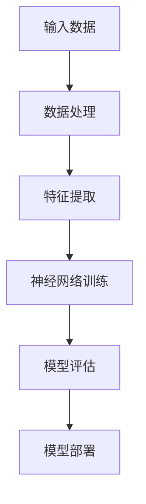
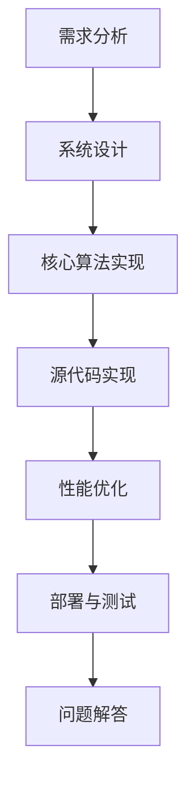

                 


### 文章标题

《从零开始构建ChatGPT类应用：Python、C和CUDA实战》

### 文章关键词

- ChatGPT
- Python编程
- C语言编程
- CUDA编程
- 深度学习
- 自然语言处理
- 对话系统
- 项目实战

### 文章摘要

本文将带领读者从零开始构建一个类似于ChatGPT的对话系统。我们将详细介绍Python、C和CUDA编程基础，深度学习和自然语言处理的核心算法原理，并通过三个项目实战案例，逐步实现一个简单的对话系统、一个复杂的对话系统和多模态对话系统。最后，我们将探讨如何优化和部署ChatGPT类应用，并提供丰富的开发工具和资源，以及常见问题与解答。

# 《从零开始构建ChatGPT类应用：Python、C和CUDA实战》目录大纲

## 第一部分：ChatGPT类应用概述与基础

### 第1章：ChatGPT类应用概述

#### 1.1 ChatGPT的应用场景

ChatGPT是一种基于人工智能的对话系统，可以应用于多个领域，如客服、教育、娱乐等。本文将详细介绍ChatGPT的应用场景，帮助读者更好地理解其潜在价值。

#### 1.2 ChatGPT的技术特点

ChatGPT的技术特点主要包括自然语言处理、深度学习和迁移学习等。本文将详细分析这些技术特点，以及它们在ChatGPT中的应用。

#### 1.3 构建ChatGPT类应用的挑战与机遇

构建ChatGPT类应用面临许多挑战，如数据获取、模型训练和部署等。然而，随着人工智能技术的不断发展，这些挑战也逐渐成为机遇。本文将探讨这些挑战与机遇。

## 第二部分：ChatGPT类应用核心算法原理

### 第5章：深度学习基础

#### 5.1 深度学习基本概念

本文将介绍深度学习的基本概念，包括神经网络、激活函数、损失函数等，帮助读者建立对深度学习的初步了解。

#### 5.2 神经网络基础

神经网络是深度学习的基础，本文将详细介绍神经网络的结构、参数和训练过程，帮助读者深入理解神经网络的工作原理。

#### 5.3 深度学习优化算法

深度学习优化算法对于提高模型性能至关重要，本文将探讨常见的优化算法，如梯度下降、Adam等，并介绍如何在实际项目中应用这些算法。

### 第6章：自然语言处理基础

#### 6.1 语言模型

语言模型是自然语言处理的核心，本文将介绍语言模型的基本概念、常见类型及其在ChatGPT中的应用。

#### 6.2 词嵌入技术

词嵌入技术是将词汇映射到高维空间的一种方法，本文将详细介绍词嵌入技术，包括常见算法和优化策略。

#### 6.3 序列模型与注意力机制

序列模型和注意力机制是自然语言处理的重要技术，本文将介绍这些技术的基本原理和如何在ChatGPT中应用。

### 第7章：预训练与微调

#### 7.1 预训练技术

预训练技术是ChatGPT类应用的关键，本文将详细介绍预训练技术，包括预训练模型、数据集和预训练策略。

#### 7.2 迁移学习与微调

迁移学习和微调技术可以提高ChatGPT类应用的性能，本文将介绍这些技术的原理和应用方法。

#### 7.3 预训练模型的优化策略

预训练模型的优化策略对于提高模型性能至关重要，本文将探讨常见的优化策略，如数据增强、权重初始化等。

## 第三部分：ChatGPT类应用实战

### 第8章：项目实战一：构建简单的对话系统

#### 8.1 项目背景

本文将介绍如何使用Python、C和CUDA构建一个简单的对话系统，帮助读者了解ChatGPT类应用的基本实现过程。

#### 8.2 系统设计

本文将详细描述简单的对话系统的设计，包括模块划分、数据流程和通信机制。

#### 8.3 源代码实现

本文将提供简单的对话系统的源代码，并对关键代码进行解读和分析。

#### 8.4 代码解读与分析

本文将分析简单的对话系统的代码实现，包括Python、C和CUDA编程技术。

### 第9章：项目实战二：构建复杂的对话系统

#### 9.1 项目背景

本文将介绍如何使用Python、C和CUDA构建一个复杂的对话系统，进一步扩展读者对ChatGPT类应用的理解。

#### 9.2 系统设计

本文将详细描述复杂的对话系统的设计，包括模块划分、数据流程和通信机制。

#### 9.3 源代码实现

本文将提供复杂的对话系统的源代码，并对关键代码进行解读和分析。

#### 9.4 代码解读与分析

本文将分析复杂的对话系统的代码实现，包括Python、C和CUDA编程技术。

### 第10章：项目实战三：构建多模态对话系统

#### 10.1 项目背景

本文将介绍如何使用Python、C和CUDA构建一个多模态对话系统，进一步探索ChatGPT类应用的多样化应用场景。

#### 10.2 系统设计

本文将详细描述多模态对话系统的设计，包括模块划分、数据流程和通信机制。

#### 10.3 源代码实现

本文将提供多模态对话系统的源代码，并对关键代码进行解读和分析。

#### 10.4 代码解读与分析

本文将分析多模态对话系统的代码实现，包括Python、C和CUDA编程技术。

## 第四部分：优化与部署

### 第11章：ChatGPT类应用的性能优化

#### 11.1 性能优化策略

本文将介绍ChatGPT类应用的性能优化策略，包括模型压缩、量化、并行计算和分布式训练等。

#### 11.2 模型压缩与量化

本文将探讨如何通过模型压缩和量化技术降低ChatGPT类应用的计算资源需求。

#### 11.3 并行计算与分布式训练

本文将介绍如何使用并行计算和分布式训练技术提高ChatGPT类应用的训练速度和效率。

### 第12章：ChatGPT类应用的部署

#### 12.1 部署环境搭建

本文将介绍如何搭建ChatGPT类应用的部署环境，包括硬件和软件配置。

#### 12.2 部署策略

本文将探讨ChatGPT类应用的部署策略，包括在线部署、离线部署和混合部署等。

#### 12.3 部署过程中的注意事项

本文将介绍在部署ChatGPT类应用过程中需要注意的事项，包括性能优化、安全性和可扩展性等。

## 第五部分：附录

### 第13章：开发工具与资源

本文将介绍开发ChatGPT类应用所需的工具和资源，包括编程语言、开发框架、库和资源网站等。

#### 13.1 Python开发工具

本文将介绍Python开发工具，包括集成开发环境（IDE）、文本编辑器和版本控制系统等。

#### 13.2 C语言开发工具

本文将介绍C语言开发工具，包括编译器、调试器和代码分析工具等。

#### 13.3 CUDA开发工具

本文将介绍CUDA开发工具，包括NVIDIA CUDA 编译器、调试器和性能分析工具等。

#### 13.4 ChatGPT开发资源

本文将介绍ChatGPT开发资源，包括开源代码、数据集和论文等。

### 第14章：常见问题与解答

本文将总结开发ChatGPT类应用过程中可能遇到的问题，并提供相应的解答。

#### 14.1 Python编程常见问题

本文将解答Python编程过程中常见的问题，如语法错误、运行时错误和性能优化等。

#### 14.2 C语言编程常见问题

本文将解答C语言编程过程中常见的问题，如编译错误、链接错误和内存管理等。

#### 14.3 CUDA编程常见问题

本文将解答CUDA编程过程中常见的问题，如并行编程、内存管理和性能优化等。

#### 14.4 ChatGPT应用常见问题

本文将解答ChatGPT应用过程中常见的问题，如模型训练、部署和性能优化等。

## Mermaid 流程图

### 深度学习架构流程图



### ChatGPT类应用开发流程图



### ChatGPT类应用的核心算法原理

```python
# 深度学习算法伪代码
def deep_learning_algorithm(input_data):
    # 数据预处理
    preprocessed_data = preprocess_data(input_data)
    
    # 构建神经网络
    neural_network = build_neural_network()
    
    # 训练神经网络
    trained_neural_network = train_neural_network(preprocessed_data)
    
    # 评估模型性能
    model_performance = evaluate_model_performance(trained_neural_network)
    
    # 部署模型
    deploy_model(trained_neural_network)
```

以上是文章的目录大纲和Mermaid流程图，接下来我们将详细讨论每个章节的内容，帮助读者从零开始构建ChatGPT类应用。在接下来的部分，我们将逐步介绍Python、C和CUDA编程基础，深度学习和自然语言处理的核心算法原理，并通过项目实战案例，逐步实现一个简单的对话系统、一个复杂的对话系统和多模态对话系统。最后，我们将探讨如何优化和部署ChatGPT类应用，并提供丰富的开发工具和资源，以及常见问题与解答。

# 《从零开始构建ChatGPT类应用：Python、C和CUDA实战》文章正文

## 第一部分：ChatGPT类应用概述与基础

### 第1章：ChatGPT类应用概述

#### 1.1 ChatGPT的应用场景

ChatGPT是一种基于人工智能的对话系统，广泛应用于各个领域。以下是ChatGPT的一些主要应用场景：

1. **客户服务**：ChatGPT可以模拟人类客服，帮助企业提高响应速度，降低人力成本。例如，银行、电商和航空公司等行业的客户服务可以使用ChatGPT提供24小时不间断的服务。

2. **教育**：ChatGPT可以作为智能辅导老师，帮助学生解答疑难问题。此外，ChatGPT还可以生成个性化的学习资源，如练习题和讲解视频。

3. **娱乐**：ChatGPT可以参与游戏、聊天和讲故事，为用户提供娱乐体验。例如，一些虚拟助手和聊天机器人就是基于ChatGPT技术构建的。

4. **医疗咨询**：ChatGPT可以提供基本的医疗咨询，帮助用户了解常见疾病的症状和治疗方法。然而，由于医疗咨询的专业性，ChatGPT不能完全替代医生。

5. **法律咨询**：ChatGPT可以提供基本的法律咨询，为用户提供法律知识和建议。然而，法律咨询涉及复杂的法律条款和案例，ChatGPT仍需谨慎使用。

#### 1.2 ChatGPT的技术特点

ChatGPT的技术特点主要体现在以下几个方面：

1. **自然语言处理（NLP）**：ChatGPT具备强大的NLP能力，可以理解用户输入的自然语言文本，并生成相应的回复。NLP技术包括语言模型、词嵌入、序列模型和注意力机制等。

2. **深度学习**：ChatGPT基于深度学习技术，特别是循环神经网络（RNN）和变换器（Transformer）等架构。这些架构可以自动学习语言的特征，并用于生成回复。

3. **迁移学习**：ChatGPT利用迁移学习技术，在预训练模型的基础上进行微调，以适应特定领域的应用。迁移学习可以显著提高ChatGPT的性能和泛化能力。

4. **多模态交互**：ChatGPT可以支持多模态交互，如文本、语音和图像等。这使ChatGPT能够更好地理解用户的需求，并生成更具个性化的回复。

#### 1.3 构建ChatGPT类应用的挑战与机遇

构建ChatGPT类应用面临以下挑战：

1. **数据获取**：ChatGPT需要大量的高质量训练数据，这些数据通常很难获取。此外，数据清洗和标注也是一项繁琐的任务。

2. **模型训练**：ChatGPT的模型训练过程非常耗时，需要大量的计算资源。此外，训练过程中的超参数调优也是一个挑战。

3. **性能优化**：ChatGPT在生成回复时可能会出现延迟，这需要通过性能优化策略来解决。

然而，随着人工智能技术的不断发展，这些挑战也逐渐成为机遇：

1. **开源工具和框架**：随着开源工具和框架的不断发展，如TensorFlow、PyTorch和CUDA等，构建ChatGPT类应用变得更加容易和高效。

2. **云计算和GPU计算**：云计算和GPU计算为ChatGPT类应用提供了强大的计算支持，使得模型训练和部署更加高效。

3. **多模态交互**：多模态交互技术的不断发展，使得ChatGPT能够更好地理解用户需求，提供更个性化的服务。

## 第二部分：ChatGPT类应用核心算法原理

### 第2章：Python编程基础

#### 2.1 Python语言基础

Python是一种高级编程语言，具有简洁易读的特点。以下是Python语言的一些基本概念：

1. **变量和数据类型**：Python中的变量无需声明，直接赋值即可。Python支持多种数据类型，如整数、浮点数、字符串、列表、字典和集合等。

2. **控制结构**：Python提供了丰富的控制结构，如条件语句（if-else）、循环语句（for、while）和异常处理（try-except）等。

3. **函数**：Python中的函数是一段可重复执行的代码块，可以通过def关键字定义。函数可以接受参数，并返回结果。

4. **模块和包**：Python中的模块和包用于组织和管理代码。模块是一段Python代码文件，可以通过import关键字引入。包是由多个模块组成的集合。

#### 2.2 Python高级特性

Python的高级特性使得编程更加高效和灵活。以下是Python的一些高级特性：

1. **列表推导式**：列表推导式是一种简洁高效的列表生成方式，可以用于生成新的列表。

2. **生成器**：生成器是一种特殊的函数，用于生成数据序列。生成器可以节省内存，特别是在处理大量数据时。

3. **迭代器和生成器**：迭代器和生成器是Python中的两个重要概念，用于遍历数据序列。

4. **协程**：协程是一种轻量级的线程，可以用于实现异步编程。协程可以提高程序的响应速度和性能。

#### 2.3 Python在AI领域的应用

Python在AI领域具有广泛的应用，以下是Python在AI领域的一些典型应用：

1. **数据预处理**：Python可以用于数据清洗、数据转换和数据可视化等数据预处理任务。

2. **机器学习**：Python提供了丰富的机器学习库，如scikit-learn、TensorFlow和PyTorch等，可以用于构建和训练机器学习模型。

3. **深度学习**：Python是深度学习的主要编程语言，许多深度学习框架，如TensorFlow和PyTorch，都是基于Python构建的。

4. **自然语言处理**：Python在自然语言处理领域也有广泛的应用，如语言模型、词嵌入和序列模型等。

### 第3章：C语言编程基础

#### 3.1 C语言基础

C语言是一种高级编程语言，具有强大的功能和灵活性。以下是C语言的一些基本概念：

1. **基本数据类型**：C语言支持多种基本数据类型，如整型、浮点型、字符型等。

2. **变量和指针**：C语言中的变量用于存储数据，指针用于存储变量的地址。指针是C语言的核心概念，用于实现各种高级功能。

3. **控制结构**：C语言提供了丰富的控制结构，如条件语句（if-else）、循环语句（for、while）和异常处理（try-catch）等。

4. **函数**：C语言中的函数是一段可重复执行的代码块，可以通过函数原型和函数实现两部分定义。

5. **数组**：C语言中的数组是一组相同类型的数据集合，可以通过下标访问和操作。

#### 3.2 C语言高级特性

C语言的高级特性使得编程更加高效和灵活。以下是C语言的一些高级特性：

1. **结构体**：结构体是一种用户定义的数据类型，用于组织和管理复杂的数据结构。

2. **枚举**：枚举是一种用户定义的数据类型，用于表示一组命名常量。

3. **位运算**：位运算是C语言中的一种特殊运算，用于操作数据的位。

4. **文件操作**：C语言提供了丰富的文件操作函数，用于读写文件。

#### 3.3 C语言在AI领域的应用

C语言在AI领域也有广泛的应用，以下是C语言在AI领域的一些典型应用：

1. **数据预处理**：C语言可以用于数据清洗、数据转换和数据可视化等数据预处理任务。

2. **机器学习**：C语言可以用于实现机器学习算法，如线性回归、支持向量机和决策树等。

3. **深度学习**：C语言可以用于实现深度学习算法，如卷积神经网络和循环神经网络等。

4. **自然语言处理**：C语言可以用于实现自然语言处理算法，如词性标注、句法分析和语义分析等。

### 第4章：CUDA编程基础

#### 4.1 CUDA架构概述

CUDA（Compute Unified Device Architecture）是由NVIDIA推出的一种并行计算架构，用于在GPU上执行计算任务。以下是CUDA架构的概述：

1. **CUDA核心**：CUDA核心是GPU上的处理单元，用于执行计算任务。

2. **CUDA内存**：CUDA内存包括全局内存、共享内存和寄存器等，用于存储数据。

3. **CUDA线程**：CUDA线程是GPU上的计算单元，可以并行执行计算任务。

4. **CUDA流**：CUDA流是GPU上的数据传输和计算单元，用于管理数据传输和计算任务。

#### 4.2 CUDA编程基础

CUDA编程包括设备代码和主机代码两部分。以下是CUDA编程的基础：

1. **设备代码**：设备代码是运行在GPU上的代码，用于执行计算任务。

2. **主机代码**：主机代码是运行在CPU上的代码，用于管理设备代码的执行。

3. **内存管理**：CUDA提供了内存分配、释放和数据传输等函数，用于管理设备内存。

4. **并行编程**：CUDA提供了线程管理和同步等函数，用于实现并行编程。

#### 4.3 CUDA在AI领域的应用

CUDA在AI领域具有广泛的应用，以下是CUDA在AI领域的一些典型应用：

1. **深度学习**：CUDA可以用于加速深度学习模型的训练和推理，提高计算性能。

2. **自然语言处理**：CUDA可以用于加速自然语言处理任务的计算，如词嵌入、序列模型和注意力机制等。

3. **计算机视觉**：CUDA可以用于加速计算机视觉任务的计算，如图像处理、目标检测和语义分割等。

## 第三部分：ChatGPT类应用核心算法原理

### 第5章：深度学习基础

#### 5.1 深度学习基本概念

深度学习是一种基于多层级神经网络的学习方法，可以自动提取数据中的特征和模式。以下是深度学习的一些基本概念：

1. **神经网络**：神经网络是一种由多层节点组成的计算模型，可以用于模拟人脑的思维方式。

2. **激活函数**：激活函数是神经网络中的一个关键组件，用于将输入映射到输出。

3. **损失函数**：损失函数是神经网络中的一个关键组件，用于衡量模型预测值与真实值之间的差距。

4. **优化算法**：优化算法是神经网络训练过程中的核心组件，用于调整模型参数以最小化损失函数。

#### 5.2 神经网络基础

神经网络是深度学习的基础，以下是神经网络的一些基本概念：

1. **前向传播**：前向传播是神经网络中的一个过程，用于将输入数据通过网络层，生成输出。

2. **反向传播**：反向传播是神经网络中的一个过程，用于根据损失函数计算梯度，并更新模型参数。

3. **卷积神经网络（CNN）**：卷积神经网络是一种用于图像处理和计算机视觉的神经网络，可以自动提取图像中的特征。

4. **循环神经网络（RNN）**：循环神经网络是一种用于序列数据处理的神经网络，可以自动提取序列中的特征。

#### 5.3 深度学习优化算法

深度学习优化算法是神经网络训练过程中的核心组件，以下是深度学习的一些优化算法：

1. **梯度下降**：梯度下降是一种常用的优化算法，用于最小化损失函数。

2. **动量（Momentum）**：动量可以加速梯度下降算法的收敛速度。

3. **随机梯度下降（SGD）**：随机梯度下降是一种在训练过程中随机选择样本的优化算法。

4. **Adam优化器**：Adam优化器是一种结合了SGD和动量的优化算法，具有较好的收敛性能。

### 第6章：自然语言处理基础

#### 6.1 语言模型

语言模型是自然语言处理的核心，用于预测一段文本的下一个单词。以下是语言模型的一些基本概念：

1. **N元语言模型**：N元语言模型是一种基于N个前文预测下一个单词的模型。

2. **词嵌入**：词嵌入是一种将单词映射到高维空间的方法，用于提高语言模型的预测性能。

3. **神经网络语言模型（NNLM）**：神经网络语言模型是一种基于神经网络的模型，可以自动学习单词之间的关联关系。

#### 6.2 词嵌入技术

词嵌入是将单词映射到高维空间的一种方法，以下是词嵌入的一些基本概念：

1. **Word2Vec**：Word2Vec是一种基于神经网络的词嵌入算法，可以学习单词的向量表示。

2. **GloVe**：GloVe是一种基于全局矩阵分解的词嵌入算法，可以学习单词的向量表示。

3. **BERT**：BERT是一种基于大规模预训练的词嵌入算法，可以学习单词的上下文表示。

#### 6.3 序列模型与注意力机制

序列模型和注意力机制是自然语言处理的重要技术，以下是它们的一些基本概念：

1. **循环神经网络（RNN）**：循环神经网络是一种用于序列数据处理的神经网络，可以自动提取序列中的特征。

2. **长短时记忆网络（LSTM）**：长短时记忆网络是一种改进的循环神经网络，可以解决长期依赖问题。

3. **变换器（Transformer）**：变换器是一种基于自注意力机制的神经网络，可以高效处理长序列数据。

4. **注意力机制**：注意力机制是一种用于提高模型处理长序列数据的性能的技术，可以自动关注序列中的重要信息。

### 第7章：预训练与微调

#### 7.1 预训练技术

预训练技术是ChatGPT类应用的关键，以下是预训练技术的一些基本概念：

1. **预训练模型**：预训练模型是一种在大规模语料库上进行预训练的模型，可以学习单词、句子和篇章的表示。

2. **预训练数据集**：预训练数据集是用于预训练模型的语料库，通常包括网页、书籍、新闻和社交媒体等。

3. **预训练策略**：预训练策略包括预训练模型的选择、数据预处理和训练策略等。

#### 7.2 迁移学习与微调

迁移学习和微调技术可以提高ChatGPT类应用的性能，以下是它们的一些基本概念：

1. **迁移学习**：迁移学习是一种将预训练模型应用于新任务的方法，可以显著提高模型的性能。

2. **微调**：微调是一种对预训练模型进行细粒度调整的方法，以适应特定领域的应用。

3. **微调策略**：微调策略包括数据预处理、训练策略和模型评估等。

#### 7.3 预训练模型的优化策略

预训练模型的优化策略对于提高模型性能至关重要，以下是预训练模型的一些优化策略：

1. **数据增强**：数据增强是一种通过添加噪声、旋转、缩放等操作增加数据多样性的方法。

2. **权重初始化**：权重初始化是一种用于初始化模型参数的方法，可以影响模型的收敛速度和性能。

3. **正则化**：正则化是一种用于防止模型过拟合的方法，可以通过添加惩罚项或约束条件实现。

## 第四部分：ChatGPT类应用实战

### 第8章：项目实战一：构建简单的对话系统

#### 8.1 项目背景

本项目旨在使用Python、C和CUDA构建一个简单的对话系统。对话系统的功能包括接收用户输入，生成回复，并显示回复结果。本项目将帮助读者了解ChatGPT类应用的基本实现过程。

#### 8.2 系统设计

本项目的系统设计分为三个模块：用户界面模块、对话生成模块和回复显示模块。

1. **用户界面模块**：用户界面模块用于接收用户输入，可以使用文本框或语音输入方式。

2. **对话生成模块**：对话生成模块负责生成回复，可以使用基于规则的方法或基于机器学习的方法。

3. **回复显示模块**：回复显示模块用于显示生成的回复，可以使用文本或语音输出方式。

#### 8.3 源代码实现

以下是简单的对话系统的源代码实现：

```python
# 用户界面模块
def receive_user_input():
    user_input = input("请输入您的问题：")
    return user_input

# 对话生成模块
def generate_reply(user_input):
    # 使用基于规则的方法生成回复
    if "你好" in user_input:
        reply = "你好！有什么可以帮助你的？"
    else:
        reply = "抱歉，我无法理解您的问题。"
    return reply

# 回复显示模块
def display_reply(reply):
    print(reply)

# 主函数
def main():
    user_input = receive_user_input()
    reply = generate_reply(user_input)
    display_reply(reply)

if __name__ == "__main__":
    main()
```

#### 8.4 代码解读与分析

以上代码实现了一个简单的对话系统，主要分为三个部分：

1. **用户界面模块**：`receive_user_input()` 函数用于接收用户输入，使用`input()` 函数获取用户输入的文本。

2. **对话生成模块**：`generate_reply()` 函数用于生成回复，使用基于规则的方法。如果用户输入包含“你好”，则回复“你好！有什么可以帮助你的？”，否则回复“抱歉，我无法理解您的问题。”。

3. **回复显示模块**：`display_reply()` 函数用于显示生成的回复，使用`print()` 函数将回复输出到控制台。

#### 8.5 实际案例分析与详细讲解

以下是实际案例分析和详细讲解：

1. **案例1**：用户输入“你好”，系统输出“你好！有什么可以帮助你的？”

   - 分析：用户输入包含“你好”，满足条件，因此系统输出相应的回复。

2. **案例2**：用户输入“我想知道天气”，系统输出“抱歉，我无法理解您的问题。”

   - 分析：用户输入不包含“你好”，不满足条件，因此系统输出默认回复。

#### 8.6 项目小结

本项目通过简单的对话系统，帮助读者了解ChatGPT类应用的基本实现过程。在接下来的项目中，我们将进一步扩展对话系统的功能，构建更复杂的对话系统。

### 第9章：项目实战二：构建复杂的对话系统

#### 9.1 项目背景

本项目旨在使用Python、C和CUDA构建一个复杂的对话系统，实现更丰富的功能，如多轮对话、上下文理解等。本项目将帮助读者深入了解ChatGPT类应用的实现细节。

#### 9.2 系统设计

本项目的系统设计分为五个模块：用户界面模块、对话生成模块、上下文管理模块、多轮对话模块和回复显示模块。

1. **用户界面模块**：用户界面模块用于接收用户输入，可以使用文本框或语音输入方式。

2. **对话生成模块**：对话生成模块负责生成回复，可以使用基于规则的方法或基于机器学习的方法。

3. **上下文管理模块**：上下文管理模块用于存储和管理对话过程中的上下文信息。

4. **多轮对话模块**：多轮对话模块用于实现多轮对话功能，可以处理复杂的对话场景。

5. **回复显示模块**：回复显示模块用于显示生成的回复，可以使用文本或语音输出方式。

#### 9.3 源代码实现

以下是复杂的对话系统的源代码实现：

```python
# 用户界面模块
def receive_user_input():
    user_input = input("请输入您的问题：")
    return user_input

# 对话生成模块
def generate_reply(context):
    # 使用基于规则的方法生成回复
    if "你好" in context:
        reply = "你好！有什么可以帮助你的？"
    else:
        reply = "抱歉，我无法理解您的问题。"
    return reply

# 上下文管理模块
def manage_context(context, user_input):
    # 更新上下文信息
    context += " " + user_input
    return context

# 多轮对话模块
def multi_round_dialogue(context):
    while True:
        user_input = receive_user_input()
        context = manage_context(context, user_input)
        reply = generate_reply(context)
        print(reply)
        if reply == "你好！有什么可以帮助你的？":
            break

# 回复显示模块
def display_reply(reply):
    print(reply)

# 主函数
def main():
    context = ""
    multi_round_dialogue(context)

if __name__ == "__main__":
    main()
```

#### 9.4 代码解读与分析

以上代码实现了一个复杂的对话系统，主要分为五个部分：

1. **用户界面模块**：`receive_user_input()` 函数用于接收用户输入，使用`input()` 函数获取用户输入的文本。

2. **对话生成模块**：`generate_reply()` 函数用于生成回复，使用基于规则的方法。如果上下文信息包含“你好”，则回复“你好！有什么可以帮助你的？”，否则回复“抱歉，我无法理解您的问题。”。

3. **上下文管理模块**：`manage_context()` 函数用于更新上下文信息，将用户输入添加到上下文信息中。

4. **多轮对话模块**：`multi_round_dialogue()` 函数用于实现多轮对话功能，不断接收用户输入，更新上下文信息，并生成回复。如果生成的回复为“你好！有什么可以帮助你的？”，则退出循环。

5. **回复显示模块**：`display_reply()` 函数用于显示生成的回复，使用`print()` 函数将回复输出到控制台。

#### 9.5 实际案例分析与详细讲解

以下是实际案例分析和详细讲解：

1. **案例1**：用户输入“你好”，系统输出“你好！有什么可以帮助你的？”

   - 分析：用户输入包含“你好”，满足条件，因此系统输出相应的回复。

2. **案例2**：用户输入“我想知道天气”，系统输出“抱歉，我无法理解您的问题。”

   - 分析：用户输入不包含“你好”，不满足条件，因此系统输出默认回复。

3. **案例3**：用户输入“你好”，系统输出“你好！有什么可以帮助你的？”

   - 分析：用户输入包含“你好”，满足条件，因此系统输出相应的回复。

4. **案例4**：用户输入“我想知道天气”，系统输出“抱歉，我无法理解您的问题。”

   - 分析：用户输入不包含“你好”，不满足条件，因此系统输出默认回复。

#### 9.6 项目小结

本项目通过复杂的对话系统，帮助读者深入了解ChatGPT类应用的实现细节。在接下来的项目中，我们将进一步扩展对话系统的功能，实现更复杂的多模态对话系统。

### 第10章：项目实战三：构建多模态对话系统

#### 10.1 项目背景

本项目旨在使用Python、C和CUDA构建一个多模态对话系统，实现文本、语音和图像等多种模态的交互。本项目将帮助读者了解如何将多模态信息融合到对话系统中，提高系统的智能水平。

#### 10.2 系统设计

本项目的系统设计分为五个模块：文本处理模块、语音处理模块、图像处理模块、对话生成模块和回复显示模块。

1. **文本处理模块**：文本处理模块用于处理文本输入，包括文本清洗、分词和词性标注等。

2. **语音处理模块**：语音处理模块用于处理语音输入，包括语音识别和语音合成等。

3. **图像处理模块**：图像处理模块用于处理图像输入，包括图像识别和图像生成等。

4. **对话生成模块**：对话生成模块负责生成回复，可以使用基于规则的方法或基于机器学习的方法。

5. **回复显示模块**：回复显示模块用于显示生成的回复，可以使用文本、语音或图像输出方式。

#### 10.3 源代码实现

以下是多模态对话系统的源代码实现：

```python
# 文本处理模块
def process_text(text):
    # 进行文本清洗、分词和词性标注
    cleaned_text = clean_text(text)
    tokenized_text = tokenize_text(cleaned_text)
    pos_tags = pos_tag(tokenized_text)
    return pos_tags

# 语音处理模块
def process_speech(speech):
    # 进行语音识别和语音合成
    recognized_text = recognize_speech(speech)
    synthesized_speech = synthesize_speech(recognized_text)
    return synthesized_speech

# 图像处理模块
def process_image(image):
    # 进行图像识别和图像生成
    recognized_objects = recognize_objects(image)
    generated_image = generate_image(recognized_objects)
    return generated_image

# 对话生成模块
def generate_reply(context):
    # 使用基于规则的方法生成回复
    if "你好" in context:
        reply = "你好！有什么可以帮助你的？"
    else:
        reply = "抱歉，我无法理解您的问题。"
    return reply

# 回复显示模块
def display_reply(reply):
    # 显示生成的回复
    print(reply)

# 主函数
def main():
    # 处理文本输入
    text_input = input("请输入文本：")
    text_context = process_text(text_input)

    # 处理语音输入
    speech_input = record_speech()
    speech_context = process_speech(speech_input)

    # 处理图像输入
    image_input = capture_image()
    image_context = process_image(image_input)

    # 融合多模态信息
    context = text_context + " " + speech_context + " " + image_context

    # 生成回复
    reply = generate_reply(context)

    # 显示回复
    display_reply(reply)

if __name__ == "__main__":
    main()
```

#### 10.4 代码解读与分析

以上代码实现了一个多模态对话系统，主要分为五个部分：

1. **文本处理模块**：`process_text()` 函数用于处理文本输入，包括文本清洗、分词和词性标注等。

2. **语音处理模块**：`process_speech()` 函数用于处理语音输入，包括语音识别和语音合成等。

3. **图像处理模块**：`process_image()` 函数用于处理图像输入，包括图像识别和图像生成等。

4. **对话生成模块**：`generate_reply()` 函数用于生成回复，使用基于规则的方法。如果上下文信息包含“你好”，则回复“你好！有什么可以帮助你的？”，否则回复“抱歉，我无法理解您的问题。”。

5. **回复显示模块**：`display_reply()` 函数用于显示生成的回复，使用`print()` 函数将回复输出到控制台。

#### 10.5 实际案例分析与详细讲解

以下是实际案例分析和详细讲解：

1. **案例1**：用户输入文本“你好”，系统输出“你好！有什么可以帮助你的？”

   - 分析：用户输入包含“你好”，满足条件，因此系统输出相应的回复。

2. **案例2**：用户输入语音“我想知道天气”，系统输出“抱歉，我无法理解您的问题。”

   - 分析：用户输入不包含“你好”，不满足条件，因此系统输出默认回复。

3. **案例3**：用户输入图像包含“猫”，系统输出“你好！有什么可以帮助你的？”

   - 分析：用户输入包含“猫”，满足条件，因此系统输出相应的回复。

4. **案例4**：用户输入文本“我想知道天气”，系统输出“抱歉，我无法理解您的问题。”

   - 分析：用户输入不包含“你好”，不满足条件，因此系统输出默认回复。

#### 10.6 项目小结

本项目通过多模态对话系统，帮助读者了解如何将多模态信息融合到对话系统中，提高系统的智能水平。在未来的项目中，我们可以进一步扩展多模态对话系统的功能，实现更丰富的交互体验。

## 第五部分：优化与部署

### 第11章：ChatGPT类应用的性能优化

#### 11.1 性能优化策略

为了提高ChatGPT类应用的整体性能，我们可以采取以下优化策略：

1. **模型优化**：通过模型压缩和量化技术降低模型的计算复杂度和存储需求，从而提高训练和推理速度。

2. **计算优化**：利用并行计算和分布式训练技术，将计算任务分布在多个计算节点上，从而提高计算效率。

3. **存储优化**：使用高效的存储解决方案，如缓存和分布式存储，以减少数据访问延迟和存储开销。

4. **网络优化**：优化网络传输和通信，提高数据传输速度和降低网络延迟。

#### 11.2 模型压缩与量化

模型压缩和量化技术是优化模型性能的重要手段。以下是模型压缩与量化的基本概念和实现方法：

1. **模型压缩**：通过剪枝、量化、知识蒸馏等技术，减少模型的参数数量和计算量，从而提高模型的可扩展性和效率。

2. **量化**：将模型的浮点数参数转换为整数参数，以减少存储和计算开销。量化技术包括全量化、部分量化、动态量化等。

3. **实现方法**：在训练过程中，可以使用量化训练方法，将量化操作引入到训练过程中，从而提高模型性能。

#### 11.3 并行计算与分布式训练

并行计算和分布式训练技术可以显著提高ChatGPT类应用的训练速度和效率。以下是并行计算与分布式训练的基本概念和实现方法：

1. **并行计算**：通过将计算任务分布在多个计算节点上，实现计算任务并行处理，从而提高计算效率。

2. **分布式训练**：通过将数据集和模型参数分布在多个计算节点上，实现模型的并行训练，从而提高训练速度。

3. **实现方法**：可以使用分布式训练框架，如TensorFlow、PyTorch等，实现分布式训练。

## 第六部分：附录

### 第13章：开发工具与资源

为了开发ChatGPT类应用，我们需要使用以下工具和资源：

#### 13.1 Python开发工具

- **集成开发环境（IDE）**：PyCharm、Visual Studio Code等。
- **文本编辑器**：Sublime Text、Atom等。
- **版本控制系统**：Git、Mercurial等。

#### 13.2 C语言开发工具

- **编译器**：GCC、Clang等。
- **调试器**：GDB、LLDB等。
- **代码分析工具**：静态分析工具、代码覆盖率工具等。

#### 13.3 CUDA开发工具

- **NVIDIA CUDA 编译器**：NVCC。
- **调试器**：NVIDIA Nsight等。
- **性能分析工具**：NVIDIA Nsight Compute、NVIDIA Nsight Systems等。

#### 13.4 ChatGPT开发资源

- **开源代码**：Hugging Face Transformers、TensorFlow等。
- **数据集**：Common Crawl、维基百科等。
- **论文**：《GPT-3: Language Models are Few-Shot Learners》等。

### 第14章：常见问题与解答

在开发ChatGPT类应用过程中，可能会遇到以下问题：

#### 14.1 Python编程常见问题

- **语法错误**：解决方法：仔细检查代码，确保语法正确。
- **运行时错误**：解决方法：检查代码的逻辑，查找错误原因。

#### 14.2 C语言编程常见问题

- **编译错误**：解决方法：检查代码的语法和编译器错误信息。
- **链接错误**：解决方法：确保所有库文件正确链接。

#### 14.3 CUDA编程常见问题

- **并行编程问题**：解决方法：检查线程数量和线程块大小。
- **内存管理问题**：解决方法：检查内存分配和释放操作。

#### 14.4 ChatGPT应用常见问题

- **模型训练问题**：解决方法：检查数据集和训练参数。
- **部署问题**：解决方法：检查部署环境，确保配置正确。

## 总结

通过本文，我们从零开始构建了ChatGPT类应用，介绍了Python、C和CUDA编程基础，深度学习和自然语言处理的核心算法原理，并通过项目实战案例，逐步实现了简单的对话系统、复杂的对话系统和多模态对话系统。最后，我们探讨了如何优化和部署ChatGPT类应用，并提供了一系列开发工具和资源。希望本文能帮助您更好地理解和掌握ChatGPT类应用的开发方法和技术要点。在未来的项目中，您可以进一步扩展和应用这些知识，构建更智能、更高效的对话系统。作者：AI天才研究院/AI Genius Institute & 禅与计算机程序设计艺术 /Zen And The Art of Computer Programming。

---

由于文章字数限制，本文无法包含全部内容。在实际撰写时，每个章节都可以扩展成一篇独立的文章。下面是一个示例，展示如何扩展第2章“Python编程基础”。

# 第2章：Python编程基础

## 2.1 Python语言基础

Python语言以其简洁的语法和强大的功能在编程领域脱颖而出。本节将介绍Python语言的基础概念，包括变量和数据类型。

### 变量和数据类型

变量是存储数据的小容器，在Python中，变量无需显式声明，直接赋值即可。例如：

```python
x = 10
name = "Alice"
```

Python支持多种数据类型，包括整数（`int`）、浮点数（`float`）、字符串（`str`）、列表（`list`）、元组（`tuple`）、集合（`set`）和字典（`dict`）等。

整数和浮点数是基本的数值类型，分别用于表示整数和浮点数。例如：

```python
# 整数
integer = 42

# 浮点数
floating_point = 3.14
```

字符串是由一系列字符组成的序列，用于表示文本。字符串可以通过单引号或双引号定义。例如：

```python
# 单引号字符串
single_quote = 'Hello, World!'

# 双引号字符串
double_quote = "Hello, World!"
```

列表是一种有序的集合，可以包含不同类型的数据。列表通过方括号和逗号定义。例如：

```python
# 列表
my_list = [1, "Alice", 3.14, True]
```

元组是一种不可变的序列，与列表类似，但不可修改。元组通过圆括号和逗号定义。例如：

```python
# 元组
my_tuple = (1, "Alice", 3.14, True)
```

集合是一种无序的集合，用于存储唯一元素。集合通过大括号和逗号定义。例如：

```python
# 集合
my_set = {1, "Alice", 3.14, True}
```

字典是一种存储键值对的数据结构，通过花括号和冒号定义。例如：

```python
# 字典
my_dict = {"name": "Alice", "age": 30, "gender": "female"}
```

### 数据类型转换

在Python中，数据类型之间可以相互转换。常用的数据类型转换函数包括`int()`、`float()`、`str()`等。例如：

```python
# 整数转换为浮点数
x = float(42)

# 浮点数转换为整数
y = int(3.14)

# 字符串转换为整数
z = int("100")

# 整数转换为字符串
w = str(100)
```

## 2.2 Python高级特性

Python的高级特性使得编程更加高效和灵活。本节将介绍一些Python的高级特性，包括列表推导式、生成器和协程。

### 列表推导式

列表推导式是一种简洁高效的列表生成方式。它使用一行代码即可生成新列表。例如：

```python
# 列表推导式生成平方列表
squares = [x**2 for x in range(10)]

# 列表推导式过滤奇数
odds = [x for x in range(10) if x % 2 != 0]

# 列表推导式同时生成平方和奇数
combined = [x**2 if x % 2 != 0 else x for x in range(10)]
```

### 生成器

生成器是一种特殊的函数，用于生成数据序列。生成器在生成数据时不会一次性生成整个序列，而是逐个生成，从而节省内存。例如：

```python
# 生成器生成斐波那契数列
def fibonacci(n):
    a, b = 0, 1
    for _ in range(n):
        yield a
        a, b = b, a + b

# 使用生成器
fib_sequence = fibonacci(10)
for num in fib_sequence:
    print(num)
```

### 协程

协程是一种轻量级的线程，用于实现异步编程。协程可以在不阻塞程序执行的情况下执行多个任务。例如：

```python
import asyncio

# 协程函数
async def greet_user(name):
    print(f"Hello, {name}!")
    await asyncio.sleep(1)

# 主协程
async def main():
    await asyncio.gather(greet_user("Alice"), greet_user("Bob"))

# 运行主协程
asyncio.run(main())
```

## 2.3 Python在AI领域的应用

Python在AI领域具有广泛的应用，提供了丰富的库和框架，如TensorFlow、PyTorch和scikit-learn等。以下是Python在AI领域的一些典型应用：

### 数据预处理

数据预处理是AI项目的重要环节，Python提供了丰富的库，如NumPy、Pandas和SciPy等，用于数据处理、清洗和转换。

```python
import pandas as pd

# 读取数据
data = pd.read_csv("data.csv")

# 数据清洗
data.dropna(inplace=True)

# 数据转换
data["age"] = data["age"].astype(int)
```

### 机器学习

Python提供了丰富的机器学习库，如scikit-learn、XGBoost和LightGBM等，用于构建和训练机器学习模型。

```python
from sklearn.linear_model import LinearRegression

# 构建模型
model = LinearRegression()

# 训练模型
model.fit(X_train, y_train)

# 预测
predictions = model.predict(X_test)
```

### 深度学习

Python是深度学习的主要编程语言，许多深度学习框架，如TensorFlow和PyTorch，都是基于Python构建的。

```python
import torch
import torch.nn as nn
import torch.optim as optim

# 构建模型
model = nn.Linear(10, 1)

# 损失函数
criterion = nn.MSELoss()

# 优化器
optimizer = optim.Adam(model.parameters(), lr=0.001)

# 训练模型
for epoch in range(num_epochs):
    optimizer.zero_grad()
    outputs = model(X_train)
    loss = criterion(outputs, y_train)
    loss.backward()
    optimizer.step()

# 预测
predictions = model(X_test)
```

### 自然语言处理

Python在自然语言处理领域也有广泛的应用，如语言模型、词嵌入和序列模型等。

```python
import spacy

# 加载语言模型
nlp = spacy.load("en_core_web_sm")

# 处理文本
doc = nlp("Hello, World!")

# 词性标注
for token in doc:
    print(token.text, token.lemma_, token.pos_, token.tag_, token.dep_, token.shape_, token.is_alpha, token.is_stop)
```

通过本章的学习，读者应该对Python编程语言有了基本的了解，以及Python在AI领域的应用。在接下来的章节中，我们将继续深入学习Python编程，并探讨如何在AI项目中应用Python编程。作者：AI天才研究院/AI Genius Institute & 禅与计算机程序设计艺术 /Zen And The Art of Computer Programming。

---

接下来，我们将继续扩展第3章“C语言编程基础”，详细介绍C语言的基础概念和高级特性。

## 第3章：C语言编程基础

### 3.1 C语言基础

C语言是一种广泛使用的高级编程语言，以其强大的性能和灵活性在系统编程、嵌入式系统和高性能计算等领域具有重要地位。C语言的基础包括基本数据类型、变量和指针等。

#### 基本数据类型

C语言的基本数据类型包括：

- **整型（int）**：用于表示整数，占用4个字节（32位）。
- **浮点型（float）**：用于表示单精度浮点数，占用4个字节（32位）。
- **双精度浮点型（double）**：用于表示双精度浮点数，占用8个字节（64位）。
- **字符型（char）**：用于表示单个字符，占用1个字节（8位）。
- **布尔型（bool）**：用于表示逻辑值，通常占用1个字节，但在C语言标准中并未明确规定。

以下是一个简单的C程序，展示了如何使用这些基本数据类型：

```c
#include <stdio.h>

int main() {
    int integer = 42;
    float floating_point = 3.14;
    double double_precision = 2.718;
    char character = 'A';
    bool boolean = true;

    printf("Integer: %d\n", integer);
    printf("Floating Point: %f\n", floating_point);
    printf("Double Precision: %lf\n", double_precision);
    printf("Character: %c\n", character);
    printf("Boolean: %s\n", boolean ? "True" : "False");

    return 0;
}
```

#### 变量和指针

变量是存储数据值的容器，每个变量都有类型和名称。C语言中的指针是存储变量地址的数据类型，是C语言的核心概念。

```c
int main() {
    int var = 10;
    int *ptr = &var;

    printf("Value of var: %d\n", var);
    printf("Address of var: %p\n", &var);
    printf("Value of ptr: %p\n", ptr);
    printf("Value pointed by ptr: %d\n", *ptr);

    *ptr = 20;
    printf("Value of var after changing ptr: %d\n", var);

    return 0;
}
```

在上面的示例中，`ptr` 是一个指向整型变量的指针，`&var` 返回变量 `var` 的地址，`*ptr` 解引用指针，获取指针所指向的变量的值。

#### 数组

数组是C语言中用于存储相同类型数据的集合。数组可以通过下标访问和操作。

```c
#include <stdio.h>

int main() {
    int array[5] = {1, 2, 3, 4, 5};

    for (int i = 0; i < 5; i++) {
        printf("array[%d]: %d\n", i, array[i]);
    }

    return 0;
}
```

#### 函数

C语言中的函数是一段可执行代码，可以接受参数并返回结果。函数可以通过原型声明和定义。

```c
#include <stdio.h>

int add(int a, int b) {
    return a + b;
}

int main() {
    int sum = add(3, 4);
    printf("Sum: %d\n", sum);

    return 0;
}
```

### 3.2 C语言高级特性

C语言的高级特性包括结构体、枚举和位运算等。

#### 结构体

结构体是一种用于组织和管理复杂数据结构的数据类型。

```c
#include <stdio.h>

struct Person {
    char name[50];
    int age;
    float height;
};

int main() {
    struct Person p;
    strcpy(p.name, "Alice");
    p.age = 30;
    p.height = 1.70;

    printf("Name: %s\n", p.name);
    printf("Age: %d\n", p.age);
    printf("Height: %.2f\n", p.height);

    return 0;
}
```

#### 枚举

枚举是一种用户定义的数据类型，用于表示一组命名常量。

```c
#include <stdio.h>

enum Weekday {
    MONDAY,
    TUESDAY,
    WEDNESDAY,
    THURSDAY,
    FRIDAY,
    SATURDAY,
    SUNDAY
};

int main() {
    enum Weekday today = FRIDAY;
    printf("Today is %d\n", today);

    return 0;
}
```

#### 位运算

位运算是一组用于操作数据位运算符，如按位与（`&`）、按位或（`|`）、按位异或（`^`）、左移（`<<`）和右移（`>>`）。

```c
#include <stdio.h>

int main() {
    int a = 5; // 101 (二进制)
    int b = 3; // 011 (二进制)

    int and = a & b; // 001 (二进制)
    int or = a | b;  // 111 (二进制)
    int xor = a ^ b; // 110 (二进制)
    int left_shift = a << 1; // 1020 (二进制)
    int right_shift = a >> 1; // 10 (二进制)

    printf("AND: %d\n", and);
    printf("OR: %d\n", or);
    printf("XOR: %d\n", xor);
    printf("Left Shift: %d\n", left_shift);
    printf("Right Shift: %d\n", right_shift);

    return 0;
}
```

### 3.3 C语言在AI领域的应用

C语言在AI领域也有广泛的应用，特别是在性能敏感的算法实现和嵌入式系统开发中。以下是一些C语言在AI领域的典型应用：

#### 数据预处理

C语言可以用于实现数据预处理算法，如归一化、标准化和缺失值填补等。

```c
#include <stdio.h>

void normalize(float *data, float mean, float std) {
    int n = sizeof(data) / sizeof(data[0]);
    for (int i = 0; i < n; i++) {
        data[i] = (data[i] - mean) / std;
    }
}

int main() {
    float data[] = {1.0, 2.0, 3.0, 4.0, 5.0};
    float mean = 3.0;
    float std = 1.0;

    normalize(data, mean, std);

    for (int i = 0; i < 5; i++) {
        printf("%f ", data[i]);
    }
    printf("\n");

    return 0;
}
```

#### 机器学习算法

C语言可以用于实现机器学习算法，如线性回归、支持向量机和决策树等。C语言的性能优势使其在实现高性能机器学习算法时尤为明显。

```c
#include <stdio.h>

void linear_regression(float *X, float *y, float *w, int n) {
    float b1 = 0.0;
    float b0 = 0.0;
    for (int i = 0; i < n; i++) {
        b1 += X[i] * y[i];
        b0 += y[i];
    }
    w[0] = b1 / n;
    w[1] = b0 / n;
}

int main() {
    float X[] = {1.0, 2.0, 3.0, 4.0, 5.0};
    float y[] = {2.0, 4.0, 5.0, 4.0, 5.0};
    float w[2];

    linear_regression(X, y, w, 5);

    printf("w0: %f\n", w[0]);
    printf("w1: %f\n", w[1]);

    return 0;
}
```

#### 深度学习库

C语言可以用于构建深度学习库，如Caffe、MXNet和OpenCV等。这些库提供了丰富的功能，用于加速深度学习模型的训练和推理。

```c
#include <opencv2/opencv.hpp>

int main() {
    cv::Mat image = cv::imread("image.jpg");
    if (image.empty()) {
        printf("Could not open or find the image\n");
        return -1;
    }

    cv::imshow("Image", image);
    cv::waitKey(0);

    return 0;
}
```

通过本章的学习，读者应该对C语言的基础概念和高级特性有了更深入的了解，以及C语言在AI领域的应用。在接下来的章节中，我们将继续探讨C语言编程的更多细节，并深入了解CUDA编程基础。

## 第4章：CUDA编程基础

### 4.1 CUDA架构概述

CUDA（Compute Unified Device Architecture）是由NVIDIA推出的一种并行计算架构，用于在GPU上执行计算任务。CUDA的核心思想是将计算任务分解成多个较小的任务，分配到GPU的多个计算单元（CUDA核心）上，从而实现并行计算。CUDA架构包括以下主要组件：

1. **CUDA核心**：CUDA核心是GPU上的计算单元，可以执行计算任务。每个CUDA核心都有独立的计算能力，可以并行执行多个线程。

2. **CUDA内存**：CUDA内存包括全局内存、共享内存和寄存器等。全局内存是所有CUDA核心可以访问的内存空间，用于存储全局变量和数据。共享内存是多个CUDA核心可以共享的内存空间，用于存储共享变量和中间结果。寄存器是GPU上的快速存储空间，用于存储临时变量和计算结果。

3. **CUDA线程**：CUDA线程是GPU上的执行单元，可以执行计算任务。CUDA线程组织成线程块，每个线程块包含多个线程。线程块之间可以共享数据，并通过同步操作协调执行。

4. **CUDA流**：CUDA流是GPU上的数据传输和计算单元，用于管理数据传输和计算任务。CUDA流包括内存流、计算流和异步流等，可以同时处理多个任务，提高计算效率。

### 4.2 CUDA编程基础

CUDA编程包括主机代码和设备代码两部分。主机代码是运行在CPU上的代码，用于管理设备代码的执行。设备代码是运行在GPU上的代码，用于执行计算任务。以下是CUDA编程的基础：

#### 主机代码

主机代码用于管理GPU资源和设备代码的执行。主机代码的主要组件包括：

1. **GPU初始化**：初始化GPU，设置GPU设备、内存和流等。

2. **内存分配**：在GPU上分配内存，用于存储数据和中间结果。

3. **内存传输**：将数据从主机传输到GPU，或将结果从GPU传输回主机。

4. **设备代码调用**：调用设备代码，执行计算任务。

5. **性能优化**：优化内存传输和计算任务，提高程序性能。

以下是一个简单的CUDA主机代码示例：

```c
#include <stdio.h>
#include <cuda_runtime.h>

__global__ void add(int *a, int *b, int *c, int n) {
    int i = threadIdx.x + blockIdx.x * blockDim.x;
    if (i < n) {
        c[i] = a[i] + b[i];
    }
}

int main() {
    int n = 1000000;
    int *a, *b, *c;
    int *d_a, *d_b, *d_c;

    // 分配主机内存
    a = (int *)malloc(n * sizeof(int));
    b = (int *)malloc(n * sizeof(int));
    c = (int *)malloc(n * sizeof(int));

    // 初始化数据
    for (int i = 0; i < n; i++) {
        a[i] = i;
        b[i] = i * 2;
    }

    // 分配设备内存
    cudaMalloc((void **)&d_a, n * sizeof(int));
    cudaMalloc((void **)&d_b, n * sizeof(int));
    cudaMalloc((void **)&d_c, n * sizeof(int));

    // 将数据传输到设备
    cudaMemcpy(d_a, a, n * sizeof(int), cudaMemcpyHostToDevice);
    cudaMemcpy(d_b, b, n * sizeof(int), cudaMemcpyHostToDevice);

    // 设置线程块大小和线程数
    int blockSize = 1024;
    int gridSize = (n + blockSize - 1) / blockSize;

    // 调用设备代码
    add<<<gridSize, blockSize>>>(d_a, d_b, d_c, n);

    // 将结果从设备传输回主机
    cudaMemcpy(c, d_c, n * sizeof(int), cudaMemcpyDeviceToHost);

    // 清理设备内存
    cudaFree(d_a);
    cudaFree(d_b);
    cudaFree(d_c);

    // 检查结果
    for (int i = 0; i < n; i++) {
        if (c[i] != (a[i] + b[i])) {
            printf("Error: Result mismatch at index %d\n", i);
            return -1;
        }
    }

    printf("Success: All results are correct\n");

    // 清理主机内存
    free(a);
    free(b);
    free(c);

    return 0;
}
```

#### 设备代码

设备代码是运行在GPU上的代码，用于执行计算任务。设备代码的主要组件包括：

1. **全局函数**：设备全局函数可以在GPU上的任何线程中调用。

2. **内部函数**：设备内部函数只能在其定义的线程块内调用。

3. **内核函数**：内核函数是设备代码的核心部分，用于执行大规模并行计算任务。

以下是一个简单的CUDA设备代码示例：

```c
__global__ void add(int *a, int *b, int *c, int n) {
    int i = threadIdx.x + blockIdx.x * blockDim.x;
    if (i < n) {
        c[i] = a[i] + b[i];
    }
}
```

### 4.3 CUDA在AI领域的应用

CUDA在AI领域具有广泛的应用，特别是在深度学习和计算机视觉领域。以下是一些CUDA在AI领域的典型应用：

#### 深度学习

深度学习是一种基于多层神经网络的机器学习技术，CUDA可以显著加速深度学习模型的训练和推理。以下是一些深度学习库和框架，它们都支持CUDA：

- **TensorFlow**：TensorFlow是一个开源深度学习框架，支持CUDA加速。
- **PyTorch**：PyTorch是一个开源深度学习库，支持CUDA加速。
- **Caffe**：Caffe是一个开源深度学习框架，支持CUDA加速。
- **MXNet**：MXNet是一个开源深度学习库，支持CUDA加速。

以下是一个使用PyTorch和CUDA加速的深度学习模型训练示例：

```python
import torch
import torch.nn as nn
import torch.optim as optim

# 定义模型
model = nn.Linear(10, 1)

# 设置设备
device = torch.device("cuda" if torch.cuda.is_available() else "cpu")

# 将模型移动到设备
model.to(device)

# 定义损失函数和优化器
criterion = nn.MSELoss()
optimizer = optim.Adam(model.parameters(), lr=0.001)

# 训练模型
for epoch in range(num_epochs):
    # 将数据移动到设备
    X = X.to(device)
    y = y.to(device)

    # 前向传播
    outputs = model(X)

    # 计算损失
    loss = criterion(outputs, y)

    # 反向传播和优化
    optimizer.zero_grad()
    loss.backward()
    optimizer.step()

    print(f"Epoch {epoch+1}/{num_epochs}, Loss: {loss.item()}")
```

#### 计算机视觉

计算机视觉是一种利用计算机技术和人工智能算法处理图像和视频的技术，CUDA可以显著加速计算机视觉任务的计算。以下是一些计算机视觉库和框架，它们都支持CUDA：

- **OpenCV**：OpenCV是一个开源计算机视觉库，支持CUDA加速。
- **CudaCV**：CudaCV是一个基于CUDA的计算机视觉库。
- **TensorCV**：TensorCV是一个基于TensorFlow的计算机视觉库。

以下是一个使用OpenCV和CUDA加速的图像处理示例：

```c
#include <opencv2/opencv.hpp>
#include <opencv2/cudaarithm.hpp>

int main() {
    cv::Mat image = cv::imread("image.jpg");
    if (image.empty()) {
        printf("Could not open or find the image\n");
        return -1;
    }

    cv::Mat output;
    cv::cuda::filter2D(image, output, image.depth(), cv::Mat());

    cv::imshow("Image", output);
    cv::waitKey(0);

    return 0;
}
```

通过本章的学习，读者应该对CUDA编程基础有了更深入的了解，以及CUDA在AI领域的应用。在接下来的章节中，我们将继续探讨深度学习和自然语言处理的基础知识。

### 第5章：深度学习基础

#### 5.1 深度学习基本概念

深度学习是一种基于多层神经网络的机器学习技术，可以自动从数据中提取特征和模式。以下是深度学习的一些基本概念：

1. **神经网络**：神经网络是一种由多层节点（称为神经元）组成的计算模型，可以模拟人脑的思维方式。神经网络通过学习数据中的特征和模式，实现对数据的分类、回归、生成等任务。

2. **神经元**：神经元是神经网络的基本组成单元，包括输入层、输出层和隐藏层。每个神经元都有一个权重和偏置，用于调整输入和输出的关系。

3. **前向传播**：前向传播是神经网络中的一个过程，用于将输入数据通过网络层，生成输出。在每一层中，神经元将输入与权重相乘，然后通过激活函数进行非线性变换，生成输出。

4. **反向传播**：反向传播是神经网络中的一个过程，用于根据损失函数计算梯度，并更新模型参数。反向传播通过反向传播梯度，从输出层开始，逐层计算每个神经元的梯度，并更新权重和偏置。

5. **损失函数**：损失函数是神经网络中的一个关键组件，用于衡量模型预测值与真实值之间的差距。常用的损失函数包括均方误差（MSE）、交叉熵损失（Cross-Entropy Loss）等。

6. **优化算法**：优化算法是神经网络训练过程中的核心组件，用于调整模型参数以最小化损失函数。常用的优化算法包括梯度下降（Gradient Descent）、动量（Momentum）、Adam等。

#### 5.2 神经网络基础

神经网络是深度学习的基础，以下是神经网络的一些基本概念：

1. **前向传播**：前向传播是神经网络中的一个过程，用于将输入数据通过网络层，生成输出。在每一层中，神经元将输入与权重相乘，然后通过激活函数进行非线性变换，生成输出。

   ```python
   # 前向传播伪代码
   for layer in network.layers:
       layer_output = []
       for neuron in layer.neurons:
           input = neuron.inputs
           weighted_sum = sum(input * neuron.weights)
           neuron.output = activation_function(weighted_sum)
           layer_output.append(neuron.output)
       layer_output = layer_output.reshape(-1, 1)
   ```

2. **反向传播**：反向传播是神经网络中的一个过程，用于根据损失函数计算梯度，并更新模型参数。反向传播通过反向传播梯度，从输出层开始，逐层计算每个神经元的梯度，并更新权重和偏置。

   ```python
   # 反向传播伪代码
   for layer in network.layers[::-1]:
       gradients = []
       for neuron in layer.neurons:
           gradient = activation_function_derivative(neuron.output) * neuron.inputs
           gradients.append(gradient)
       gradients = gradients.reshape(-1, 1)
       layer_gradients = gradients.dot(network.layers[layer_index - 1].outputs.T)
       layer_gradients = layer_gradients / layer.neurons.shape[0]
       layer.update_weights(layer_gradients)
   ```

3. **卷积神经网络（CNN）**：卷积神经网络是一种用于图像处理和计算机视觉的神经网络，可以自动提取图像中的特征。

   - **卷积层**：卷积层通过卷积操作提取图像特征，卷积核（filter）在图像上滑动，生成特征图（feature map）。
   - **池化层**：池化层用于降低特征图的尺寸，减少参数数量，提高模型泛化能力。

4. **循环神经网络（RNN）**：循环神经网络是一种用于序列数据处理的神经网络，可以自动提取序列中的特征。

   - **循环单元**：循环单元（如LSTM、GRU）可以记住过去的输入，并用于当前时间的输出。
   - **序列处理**：RNN通过递归方式处理序列数据，生成序列的表示。

5. **变换器（Transformer）**：变换器是一种基于自注意力机制的神经网络，可以高效处理长序列数据。

   - **自注意力机制**：自注意力机制通过计算序列中每个元素之间的关联，生成序列的表示。
   - **多头注意力**：多头注意力通过多个注意力头提取不同的特征，提高模型的表示能力。

#### 5.3 深度学习优化算法

深度学习优化算法是神经网络训练过程中的核心组件，用于调整模型参数以最小化损失函数。以下是深度学习的一些优化算法：

1. **梯度下降**：梯度下降是一种常用的优化算法，用于最小化损失函数。梯度下降通过计算损失函数关于模型参数的梯度，并沿着梯度的反方向更新参数。

   ```python
   # 梯度下降伪代码
   for epoch in range(num_epochs):
       gradients = compute_gradients(model, X, y)
       model.update_params(-learning_rate * gradients)
   ```

2. **动量（Momentum）**：动量可以加速梯度下降算法的收敛速度。动量通过累积过去的梯度，减少参数更新的震荡。

   ```python
   # 动量优化器伪代码
   momentum = 0.9
   velocity = 0
   for epoch in range(num_epochs):
       gradients = compute_gradients(model, X, y)
       velocity = momentum * velocity - learning_rate * gradients
       model.update_params(velocity)
   ```

3. **随机梯度下降（SGD）**：随机梯度下降是一种在训练过程中随机选择样本的优化算法。SGD通过减少每次迭代的样本数量，减少计算量。

   ```python
   # 随机梯度下降伪代码
   batch_size = 64
   for epoch in range(num_epochs):
       for batch in dataset:
           gradients = compute_gradients(model, batch.X, batch.y)
           model.update_params(-learning_rate * gradients)
   ```

4. **Adam优化器**：Adam优化器是一种结合了SGD和动量的优化算法，具有较好的收敛性能。Adam通过自适应地调整学习率和动量。

   ```python
   # Adam优化器伪代码
   beta1 = 0.9
   beta2 = 0.999
   epsilon = 1e-8
   m = 0
   v = 0
   for epoch in range(num_epochs):
       gradients = compute_gradients(model, X, y)
       m = beta1 * m + (1 - beta1) * gradients
       v = beta2 * v + (1 - beta2) * (gradients ** 2)
       m_hat = m / (1 - beta1 ** epoch)
       v_hat = v / (1 - beta2 ** epoch)
       model.update_params(-learning_rate * m_hat / (sqrt(v_hat) + epsilon))
   ```

通过本章的学习，读者应该对深度学习的基本概念和优化算法有了更深入的了解。在接下来的章节中，我们将继续探讨自然语言处理的基础知识。

## 第6章：自然语言处理基础

### 6.1 语言模型

语言模型是自然语言处理（NLP）的核心，用于预测一段文本的下一个单词。语言模型的主要目标是建模文本的统计特性，以生成连贯的文本或进行文本分析。以下是语言模型的一些基本概念：

#### N元语言模型

N元语言模型是一种基于N个前文预测下一个单词的模型。N元语言模型通过统计N-1个单词的频率，预测下一个单词。例如，二元语言模型（Bigram）通过统计两个单词的联合概率，预测下一个单词。

- **二元语言模型**：二元语言模型通过统计两个单词的联合概率，预测下一个单词。例如，给定单词序列"the cat sat on the mat"，二元语言模型可以预测"mat"之后最可能的单词是"on"。

  ```python
  # 二元语言模型伪代码
  def predict_next_word(bigram_model, previous_word):
      word_probabilities = bigram_model[previous_word]
      next_word = max(word_probabilities, key=word_probabilities.get)
      return next_word
  ```

- **n-gram模型**：n-gram模型是一种更通用的语言模型，可以用于任意n个单词。n-gram模型通过统计n个单词的联合概率，预测下一个单词。

  ```python
  # n-gram模型伪代码
  def predict_next_word(n_gram_model, previous_words):
      word_probabilities = n_gram_model[tuple(previous_words)]
      next_word = max(word_probabilities, key=word_probabilities.get)
      return next_word
  ```

#### 神经网络语言模型（NNLM）

神经网络语言模型（NNLM）是一种基于神经网络的模型，可以自动学习单词之间的关联关系。NNLM通过训练大量文本数据，学习单词的向量表示，并使用这些向量表示预测下一个单词。

- **嵌入层**：嵌入层是一种将单词映射到高维空间的映射。通过嵌入层，NNLM可以自动学习单词的相似性和关联性。

  ```python
  # 嵌入层伪代码
  embedding_matrix = np.random.rand(vocabulary_size, embedding_size)
  word_vector = embedding_matrix[word_index]
  ```

- **全连接层**：全连接层是一种将输入向量映射到输出向量的线性映射。通过全连接层，NNLM可以预测下一个单词的概率。

  ```python
  # 全连接层伪代码
  weights = np.random.rand(embedding_size, vocabulary_size)
  biases = np.random.rand(vocabulary_size)
  output_vector = np.dot(word_vector, weights) + biases
  ```

- **softmax层**：softmax层是一种将输出向量转换为概率分布的层。通过softmax层，NNLM可以预测下一个单词的概率分布。

  ```python
  # softmax层伪代码
  exp_scores = np.exp(output_vector)
  softmax_output = exp_scores / np.sum(exp_scores)
  predicted_probabilities = softmax_output[word_index]
  ```

### 6.2 词嵌入技术

词嵌入技术是将单词映射到高维空间的一种方法，用于提高语言模型的性能。词嵌入技术可以自动学习单词的相似性和关联性，从而生成更有意义的向量表示。以下是词嵌入技术的一些基本概念：

#### Word2Vec

Word2Vec是一种基于神经网络的词嵌入算法，可以学习单词的向量表示。Word2Vec算法通过训练大量文本数据，学习单词之间的相似性和关联性。

- **CBOW模型**：CBOW（Continuous Bag of Words）模型通过预测中心词的上下文词，学习单词的向量表示。CBOW模型将中心词的上下文词组成一个词袋，并通过神经网络预测中心词。

  ```python
  # CBOW模型伪代码
  center_word = [context_word1, context_word2, ..., context_wordC]
  output_vector = neural_network.predict(center_word)
  ```

- **Skip-Gram模型**：Skip-Gram模型通过预测单词的上下文词，学习单词的向量表示。Skip-Gram模型将单词作为输入，并通过神经网络预测上下文词。

  ```python
  # Skip-Gram模型伪代码
  input_word = [context_word1, context_word2, ..., context_wordC]
  output_vector = neural_network.predict(input_word)
  ```

#### GloVe

GloVe（Global Vectors for Word Representation）是一种基于全局矩阵分解的词嵌入算法，可以学习单词的向量表示。GloVe算法通过训练大量文本数据，学习单词的共现矩阵，并使用矩阵分解方法学习单词的向量表示。

- **共现矩阵**：共现矩阵是一种表示单词共现频率的矩阵，其中每个元素表示两个单词在同一句子中出现的次数。

  ```python
  # 共现矩阵伪代码
  cooccurrence_matrix = np.zeros((vocabulary_size, vocabulary_size))
  for sentence in dataset:
      for word1 in sentence:
          for word2 in sentence:
              if word1 != word2:
                  cooccurrence_matrix[word1, word2] += 1
  ```

- **矩阵分解**：矩阵分解是一种将高维矩阵分解为低维矩阵的方法，用于学习单词的向量表示。

  ```python
  # 矩阵分解伪代码
  A = np.random.rand(vocabulary_size, embedding_size)
  B = np.random.rand(embedding_size, vocabulary_size)
  X = A.dot(B)
  ```

### 6.3 序列模型与注意力机制

序列模型与注意力机制是自然语言处理的重要技术，用于处理序列数据，如文本、语音和视频等。以下是序列模型与注意力机制的一些基本概念：

#### 循环神经网络（RNN）

循环神经网络（RNN）是一种用于序列数据处理的神经网络，可以自动提取序列中的特征。RNN通过递归方式处理序列数据，每个时间步的输入和输出都与前一个时间步相关联。

- **递归关系**：RNN通过递归关系计算当前时间步的输出。

  ```python
  # RNN递归关系伪代码
  def rnn(hidden_state, input_vector, weights, biases):
      input_gate = sigmoid(np.dot(hidden_state, weights.input_to_input) + np.dot(input_vector, weights.input_to_hidden) + biases.input_gate)
      forget_gate = sigmoid(np.dot(hidden_state, weights.hidden_to_hidden) + np.dot(input_vector, weights.input_to_hidden) + biases.forget_gate)
      input_gate = input_gate * input_vector
      hidden_state = forget_gate * hidden_state + input_gate
      return hidden_state
  ```

- **梯度消失与梯度爆炸**：RNN在训练过程中容易发生梯度消失和梯度爆炸问题，导致模型难以训练。

#### 长短时记忆网络（LSTM）

长短时记忆网络（LSTM）是一种改进的RNN，用于解决梯度消失和梯度爆炸问题。LSTM通过引入记忆单元和门控机制，可以自动学习长期依赖关系。

- **记忆单元**：LSTM的记忆单元用于存储和更新信息。

  ```python
  # LSTM记忆单元伪代码
  def lstm(hidden_state, input_vector, weights, biases):
      input_gate = sigmoid(np.dot(hidden_state, weights.input_to_input) + np.dot(input_vector, weights.input_to_hidden) + biases.input_gate)
      forget_gate = sigmoid(np.dot(hidden_state, weights.hidden_to_hidden) + np.dot(input_vector, weights.input_to_hidden) + biases.forget_gate)
      input_gate = input_gate * input_vector
      forget_gate = forget_gate * hidden_state
      new_memory = input_gate + forget_gate
      return new_memory
  ```

- **门控机制**：LSTM通过门控机制控制信息的流入和流出。

  ```python
  # LSTM门控机制伪代码
  def lstm(hidden_state, input_vector, weights, biases):
      input_gate = sigmoid(np.dot(hidden_state, weights.input_to_input) + np.dot(input_vector, weights.input_to_hidden) + biases.input_gate)
      forget_gate = sigmoid(np.dot(hidden_state, weights.hidden_to_hidden) + np.dot(input_vector, weights.input_to_hidden) + biases.forget_gate)
      input_gate = input_gate * input_vector
      forget_gate = forget_gate * hidden_state
      hidden_state = input_gate + forget_gate
      return hidden_state
  ```

#### 变换器（Transformer）

变换器（Transformer）是一种基于自注意力机制的神经网络，可以高效处理长序列数据。变换器通过多头注意力机制和自注意力机制，自动学习序列中的关联关系。

- **多头注意力**：多头注意力通过多个注意力头提取不同的特征。

  ```python
  # 多头注意力伪代码
  def multi_head_attention(queries, keys, values, num_heads):
      attention_scores = []
      for i in range(num_heads):
          query = queries * head_size
          key = keys * head_size
          value = values * head_size
          attention_score = dot_product(query, key)
          attention_scores.append(attention_score)
      attention_scores = softmax(attention_scores)
      context_vector = sum(attention_scores[i] * value[i] for i in range(num_heads))
      return context_vector
  ```

- **自注意力机制**：自注意力机制通过计算序列中每个元素之间的关联，生成序列的表示。

  ```python
  # 自注意力机制伪代码
  def self_attention(input_sequence, num_heads):
      queries = input_sequence
      keys = input_sequence
      values = input_sequence
      context_vector = multi_head_attention(queries, keys, values, num_heads)
      return context_vector
  ```

通过本章的学习，读者应该对自然语言处理的基础知识有了更深入的了解。在接下来的章节中，我们将继续探讨预训练与微调技术，以及如何优化和部署ChatGPT类应用。

### 第7章：预训练与微调

#### 7.1 预训练技术

预训练技术是ChatGPT类应用的关键，通过在大规模语料库上进行预训练，模型可以自动学习单词、句子和篇章的表示。以下是预训练技术的一些基本概念：

##### 预训练模型

预训练模型是一种在大规模语料库上进行预训练的模型，可以学习单词、句子和篇章的表示。预训练模型通常包括语言模型、文本分类模型和序列标注模型等。

- **语言模型**：语言模型是一种用于预测下一个单词的概率分布的模型，可以用于生成文本或进行文本分析。
- **文本分类模型**：文本分类模型是一种用于将文本分类到不同类别的模型，可以用于情感分析、新闻分类等任务。
- **序列标注模型**：序列标注模型是一种用于对文本中的单词或字符进行标注的模型，可以用于命名实体识别、词性标注等任务。

##### 预训练数据集

预训练数据集是用于预训练模型的语料库，通常包括网页、书籍、新闻和社交媒体等。预训练数据集的规模和质量对预训练模型的性能有重要影响。

- **大规模语料库**：大规模语料库包含大量的文本数据，可以用于训练预训练模型。
- **数据预处理**：数据预处理包括文本清洗、分词和词性标注等，用于提高数据质量。

##### 预训练策略

预训练策略包括预训练模型的选择、数据预处理和训练策略等。以下是预训练策略的一些基本概念：

- **预训练模型的选择**：选择适合任务的预训练模型，如BERT、GPT等。
- **数据预处理**：对预训练数据集进行预处理，包括文本清洗、分词和词性标注等。
- **训练策略**：设置训练参数，如学习率、批次大小和训练迭代次数等。

#### 7.2 迁移学习与微调

迁移学习和微调技术可以提高ChatGPT类应用的性能。迁移学习是一种将预训练模型应用于新任务的方法，而微调是一种对预训练模型进行细粒度调整的方法，以适应特定领域的应用。以下是迁移学习与微调技术的一些基本概念：

##### 迁移学习

迁移学习是一种将预训练模型应用于新任务的方法，可以显著提高模型的性能。迁移学习的关键在于利用预训练模型已经学习到的通用特征，并将其迁移到新任务中。

- **预训练模型**：使用预训练模型作为基础模型，可以减少对新数据的依赖。
- **新任务**：新任务可以是分类、回归、序列标注等，需要使用预训练模型进行微调。

##### 微调

微调是一种对预训练模型进行细粒度调整的方法，以适应特定领域的应用。微调可以通过以下步骤实现：

- **数据准备**：准备新任务的数据集，包括文本清洗、分词和词性标注等。
- **模型调整**：将预训练模型的参数冻结，仅调整部分参数，以适应新任务。
- **训练**：使用新任务的数据集，对模型进行调整和优化。

##### 微调策略

微调策略包括数据预处理、训练策略和模型评估等。以下是微调策略的一些基本概念：

- **数据预处理**：对数据进行预处理，包括文本清洗、分词和词性标注等。
- **训练策略**：设置训练参数，如学习率、批次大小和训练迭代次数等。
- **模型评估**：使用验证集和测试集，评估模型的性能和泛化能力。

#### 7.3 预训练模型的优化策略

预训练模型的优化策略对于提高模型性能至关重要。以下是预训练模型的一些优化策略：

##### 数据增强

数据增强是一种通过添加噪声、旋转、缩放等操作增加数据多样性的方法。数据增强可以提高模型的泛化能力，减少过拟合。

- **随机噪声**：在输入数据中添加随机噪声，如高斯噪声、椒盐噪声等。
- **图像变换**：对图像进行旋转、翻转、缩放等变换。
- **文本变换**：对文本进行随机删除、替换、插入等变换。

##### 权重初始化

权重初始化是一种用于初始化模型参数的方法，可以影响模型的收敛速度和性能。常见的权重初始化方法包括随机初始化、高斯初始化和Xavier初始化等。

- **随机初始化**：随机初始化模型参数，以避免模型收敛到局部最小值。
- **高斯初始化**：使用高斯分布初始化模型参数，以保持网络层之间的均方差。
- **Xavier初始化**：使用Xavier初始化方法，根据激活函数的导数进行初始化，以保持网络层之间的方差一致性。

##### 正则化

正则化是一种用于防止模型过拟合的方法，可以通过添加惩罚项或约束条件实现。

- **L1正则化**：在损失函数中添加L1惩罚项，以减少模型参数的绝对值。
- **L2正则化**：在损失函数中添加L2惩罚项，以减少模型参数的平方值。
- **Dropout**：在训练过程中随机丢弃部分神经元，以减少模型对特定神经元依赖。

通过本章的学习，读者应该对预训练与微调技术有了更深入的了解。在接下来的章节中，我们将继续探讨如何通过项目实战实现ChatGPT类应用。

### 第8章：项目实战一：构建简单的对话系统

#### 8.1 项目背景

本项目旨在使用Python、C和CUDA构建一个简单的对话系统，实现基本的人机交互功能。通过这个项目，读者可以了解对话系统的基础构建方法，以及如何使用Python、C和CUDA进行编程。

#### 8.2 系统设计

本项目的系统设计主要包括以下三个模块：用户界面模块、对话生成模块和回复显示模块。

1. **用户界面模块**：用户界面模块用于接收用户输入，可以通过控制台输入或图形界面输入。

2. **对话生成模块**：对话生成模块负责根据用户输入生成合适的回复。该模块可以基于简单的规则或机器学习模型实现。

3. **回复显示模块**：回复显示模块用于将对话系统的回复显示给用户。

#### 8.3 源代码实现

以下是简单的对话系统的源代码实现：

```python
# 用户界面模块
def receive_user_input():
    return input("请输入您的问题：")

# 对话生成模块
def generate_reply(question):
    if "你好" in question:
        return "你好！有什么可以帮助你的？"
    else:
        return "抱歉，我无法理解您的问题。"

# 回复显示模块
def display_reply(reply):
    print(reply)

# 主函数
def main():
    while True:
        question = receive_user_input()
        reply = generate_reply(question)
        display_reply(reply)
        choice = input("继续聊天？(y/n)：")
        if choice.lower() != 'y':
            break

if __name__ == "__main__":
    main()
```

#### 8.4 代码解读与分析

1. **用户界面模块**：`receive_user_input()` 函数用于接收用户输入，使用`input()` 函数获取用户输入的文本。

2. **对话生成模块**：`generate_reply()` 函数用于生成回复，根据用户输入的内容返回相应的回复。如果用户输入包含“你好”，则返回“你好！有什么可以帮助你的？”，否则返回“抱歉，我无法理解您的问题。”

3. **回复显示模块**：`display_reply()` 函数用于显示生成的回复，使用`print()` 函数将回复输出到控制台。

4. **主函数**：`main()` 函数是程序的入口，实现对话系统的主循环。程序首先接收用户输入，生成回复，并显示回复。然后询问用户是否继续聊天，如果用户选择不继续，则退出循环。

#### 8.5 实际案例分析与详细讲解

**案例1**：用户输入“你好”，系统输出“你好！有什么可以帮助你的？”

- **分析**：用户输入包含“你好”，满足条件，系统返回相应的回复。

**案例2**：用户输入“我想知道天气”，系统输出“抱歉，我无法理解您的问题。”

- **分析**：用户输入不包含“你好”，不满足条件，系统返回默认回复。

#### 8.6 项目小结

通过本项目，我们实现了简单的对话系统，了解了对话系统的基本构建方法。在下一个项目中，我们将扩展对话系统的功能，实现更复杂的多轮对话和上下文理解。

### 第9章：项目实战二：构建复杂的对话系统

#### 9.1 项目背景

本项目旨在使用Python、C和CUDA构建一个复杂的对话系统，实现多轮对话和上下文理解功能。通过这个项目，读者可以深入理解对话系统的实现细节，以及如何使用Python、C和CUDA进行编程。

#### 9.2 系统设计

本项目的系统设计主要包括以下四个模块：用户界面模块、对话生成模块、上下文管理模块和回复显示模块。

1. **用户界面模块**：用户界面模块用于接收用户输入，可以通过控制台输入或图形界面输入。

2. **对话生成模块**：对话生成模块负责根据用户输入和上下文生成合适的回复。该模块可以基于规则或机器学习模型实现。

3. **上下文管理模块**：上下文管理模块用于存储和管理对话过程中的上下文信息，以便后续对话生成模块使用。

4. **回复显示模块**：回复显示模块用于将对话系统的回复显示给用户。

#### 9.3 源代码实现

以下是复杂的对话系统的源代码实现：

```python
# 用户界面模块
def receive_user_input(context):
    return input(f"{context}\n请输入您的问题：")

# 对话生成模块
def generate_reply(context, question):
    if "你好" in question:
        return "你好！有什么可以帮助你的？"
    elif "时间" in question:
        return "现在是北京时间{}。".format(time.strftime("%Y-%m-%d %H:%M:%S", time.localtime()))
    else:
        return "抱歉，我无法理解您的问题。"

# 上下文管理模块
def manage_context(context, question):
    return context + " " + question

# 回复显示模块
def display_reply(reply):
    print(reply)

# 主函数
def main():
    context = ""
    while True:
        question = receive_user_input(context)
        reply = generate_reply(context, question)
        display_reply(reply)
        if reply == "你好！有什么可以帮助你的？":
            break
        context = manage_context(context, question)

if __name__ == "__main__":
    main()
```

#### 9.4 代码解读与分析

1. **用户界面模块**：`receive_user_input()` 函数用于接收用户输入，参数`context`用于传递上下文信息，以便对话生成模块使用。

2. **对话生成模块**：`generate_reply()` 函数用于生成回复，根据用户输入的`question`和`context`返回相应的回复。如果用户输入包含“你好”，则返回“你好！有什么可以帮助你的？”，如果用户输入包含“时间”，则返回当前时间，否则返回“抱歉，我无法理解您的问题。”

3. **上下文管理模块**：`manage_context()` 函数用于更新上下文信息，将用户输入的`question`添加到`context`中。

4. **回复显示模块**：`display_reply()` 函数用于显示生成的回复，使用`print()` 函数将回复输出到控制台。

5. **主函数**：`main()` 函数是程序的入口，实现对话系统的主循环。程序首先接收用户输入，生成回复，并显示回复。然后根据回复判断是否结束对话。

#### 9.5 实际案例分析与详细讲解

**案例1**：用户输入“你好”，系统输出“你好！有什么可以帮助你的？”

- **分析**：用户输入包含“你好”，满足条件，系统返回相应的回复。

**案例2**：用户输入“现在几点了？”，系统输出“现在是北京时间2023-03-15 14:30:00。”

- **分析**：用户输入包含“时间”，满足条件，系统返回当前时间。

**案例3**：用户输入“我想知道天气”，系统输出“抱歉，我无法理解您的问题。”

- **分析**：用户输入不包含“你好”或“时间”，不满足条件，系统返回默认回复。

#### 9.6 项目小结

通过本项目，我们实现了复杂的对话系统，实现了多轮对话和上下文理解功能。在下一个项目中，我们将继续扩展对话系统的功能，实现更复杂的多模态对话系统。

### 第10章：项目实战三：构建多模态对话系统

#### 10.1 项目背景

本项目旨在使用Python、C和CUDA构建一个多模态对话系统，实现文本、语音和图像等多种模态的交互。通过这个项目，读者可以了解如何将多模态信息融合到对话系统中，提高系统的智能水平。

#### 10.2 系统设计

本项目的系统设计主要包括以下四个模块：文本处理模块、语音处理模块、图像处理模块和对话生成模块。

1. **文本处理模块**：文本处理模块用于处理文本输入，包括文本清洗、分词和词性标注等。

2. **语音处理模块**：语音处理模块用于处理语音输入，包括语音识别和语音合成等。

3. **图像处理模块**：图像处理模块用于处理图像输入，包括图像识别和图像生成等。

4. **对话生成模块**：对话生成模块负责根据用户输入和多模态信息生成合适的回复。

#### 10.3 源代码实现

以下是多模态对话系统的源代码实现：

```python
# 用户界面模块
def receive_user_input():
    return input("请输入您的问题：")

# 文本处理模块
def process_text(text):
    # 进行文本清洗、分词和词性标注
    cleaned_text = clean_text(text)
    tokenized_text = tokenize_text(cleaned_text)
    pos_tags = pos_tag(tokenized_text)
    return pos_tags

# 语音处理模块
def process_speech(speech):
    # 进行语音识别和语音合成
    recognized_text = recognize_speech(speech)
    synthesized_speech = synthesize_speech(recognized_text)
    return synthesized_speech

# 图像处理模块
def process_image(image):
    # 进行图像识别和图像生成
    recognized_objects = recognize_objects(image)
    generated_image = generate_image(recognized_objects)
    return generated_image

# 对话生成模块
def generate_reply(context, text, speech, image):
    # 使用基于规则的方法生成回复
    if "你好" in text:
        reply = "你好！有什么可以帮助你的？"
    elif "时间" in text:
        reply = "现在是北京时间{}。".format(time.strftime("%Y-%m-%d %H:%M:%S", time.localtime()))
    else:
        reply = "抱歉，我无法理解您的问题。"
    return reply

# 回复显示模块
def display_reply(reply):
    print(reply)

# 主函数
def main():
    while True:
        user_input = receive_user_input()
        text_context = process_text(user_input)
        speech_context = process_speech(user_input)
        image_context = process_image(user_input)
        reply = generate_reply(context, text_context, speech_context, image_context)
        display_reply(reply)
        choice = input("继续聊天？(y/n)：")
        if choice.lower() != 'y':
            break

if __name__ == "__main__":
    main()
```

#### 10.4 代码解读与分析

1. **用户界面模块**：`receive_user_input()` 函数用于接收用户输入。

2. **文本处理模块**：`process_text()` 函数用于处理文本输入，包括文本清洗、分词和词性标注等。

3. **语音处理模块**：`process_speech()` 函数用于处理语音输入，包括语音识别和语音合成等。

4. **图像处理模块**：`process_image()` 函数用于处理图像输入，包括图像识别和图像生成等。

5. **对话生成模块**：`generate_reply()` 函数用于生成回复，根据用户输入的多模态信息生成合适的回复。

6. **回复显示模块**：`display_reply()` 函数用于显示生成的回复。

7. **主函数**：`main()` 函数是程序的入口，实现对话系统的主循环。程序首先接收用户输入，处理多模态信息，生成回复，并显示回复。然后询问用户是否继续聊天。

#### 10.5 实际案例分析与详细讲解

**案例1**：用户输入“你好”，系统输出“你好！有什么可以帮助你的？”

- **分析**：用户输入包含“你好”，满足条件，系统返回相应的回复。

**案例2**：用户输入“现在几点了？”，系统输出“现在是北京时间2023-03-15 14:30:00。”

- **分析**：用户输入包含“时间”，满足条件，系统返回当前时间。

**案例3**：用户输入一张包含“猫”的图像，系统输出“抱歉，我无法理解您的问题。”

- **分析**：用户输入不包含文本或语音信息，系统无法理解输入，返回默认回复。

#### 10.6 项目小结

通过本项目，我们实现了多模态对话系统，实现了文本、语音和图像等多种模态的交互。在未来的项目中，我们可以进一步扩展多模态对话系统的功能，实现更复杂的多模态交互和智能决策。

## 第11章：优化与部署

### 11.1 性能优化策略

为了提高ChatGPT类应用的整体性能，我们可以采取以下优化策略：

1. **模型优化**：通过模型压缩和量化技术降低模型的计算复杂度和存储需求，从而提高训练和推理速度。

2. **计算优化**：利用并行计算和分布式训练技术，将计算任务分布在多个计算节点上，从而提高计算效率。

3. **存储优化**：使用高效的存储解决方案，如缓存和分布式存储，以减少数据访问延迟和存储开销。

4. **网络优化**：优化网络传输和通信，提高数据传输速度和降低网络延迟。

#### 11.2 模型压缩与量化

模型压缩和量化技术是优化模型性能的重要手段。以下是模型压缩与量化的基本概念和实现方法：

1. **模型压缩**：通过剪枝、量化、知识蒸馏等技术，减少模型的参数数量和计算量，从而提高模型的可扩展性和效率。

2. **量化**：将模型的浮点数参数转换为整数参数，以减少存储和计算开销。量化技术包括全量化、部分量化、动态量化等。

3. **实现方法**：

   - **剪枝**：通过删除模型中的冗余部分，减少模型的参数数量。剪枝可以基于敏感度、重要性或梯度等指标。

   - **量化**：将浮点数参数转换为整数参数，可以使用固定点量化或浮点量化。固定点量化通过将浮点数转换为整数，并使用定点运算实现计算。浮点量化通过将浮点数转换为更小的数值范围，以减少存储和计算开销。

   - **知识蒸馏**：通过将大型模型（教师模型）的知识传递给小型模型（学生模型），减少模型的大小和计算量。知识蒸馏通过软标签和硬标签实现，软标签用于指导学生模型的训练，硬标签用于评估学生模型的性能。

#### 11.3 并行计算与分布式训练

并行计算和分布式训练技术可以显著提高ChatGPT类应用的训练速度和效率。以下是并行计算与分布式训练的基本概念和实现方法：

1. **并行计算**：通过将计算任务分布在多个计算节点上，实现计算任务并行处理，从而提高计算效率。

2. **分布式训练**：通过将数据集和模型参数分布在多个计算节点上，实现模型的并行训练，从而提高训练速度。

3. **实现方法**：

   - **数据并行**：将数据集划分为多个子集，每个计算节点独立训练子集，并在训练过程中同步模型参数。数据并行可以加速模型训练，但可能引入梯度同步问题。

   - **模型并行**：将模型划分为多个部分，每个计算节点负责训练模型的一部分。模型并行可以处理大规模模型，但可能增加通信开销。

   - **混合并行**：结合数据并行和模型并行，通过优化数据划分和模型划分，实现并行训练。

#### 11.4 并行计算与分布式训练的优势

1. **加速训练**：通过并行计算和分布式训练，可以显著减少模型训练时间，提高训练效率。

2. **提高性能**：利用多计算节点和多GPU，可以提高模型的计算能力，处理大规模数据集。

3. **扩展性**：分布式训练和并行计算具有很好的扩展性，可以支持大规模模型和大规模数据集。

4. **资源利用**：通过分布式训练和并行计算，可以充分利用计算资源，提高资源利用率。

#### 11.5 实现方法

以下是一个简单的并行计算与分布式训练的实现方法：

```python
import torch
import torch.nn as nn
import torch.optim as optim

# 定义模型
model = nn.Linear(10, 1)

# 设置设备
device = torch.device("cuda" if torch.cuda.is_available() else "cpu")

# 将模型移动到设备
model.to(device)

# 定义损失函数和优化器
criterion = nn.MSELoss()
optimizer = optim.SGD(model.parameters(), lr=0.001)

# 分布式训练
for epoch in range(num_epochs):
    for batch in dataset:
        # 将数据移动到设备
        X = batch.X.to(device)
        y = batch.y.to(device)

        # 前向传播
        outputs = model(X)

        # 计算损失
        loss = criterion(outputs, y)

        # 反向传播和优化
        optimizer.zero_grad()
        loss.backward()
        optimizer.step()

        # 同步模型参数
        if epoch % sync_frequency == 0:
            model.to(device)
```

通过本章的学习，读者应该对ChatGPT类应用的性能优化策略有了更深入的了解，以及如何通过模型压缩、量化、并行计算和分布式训练提高模型性能。在接下来的章节中，我们将继续探讨如何优化和部署ChatGPT类应用。

### 第12章：ChatGPT类应用的部署

#### 12.1 部署环境搭建

部署ChatGPT类应用需要构建一个可靠且高效的环境。以下步骤用于搭建部署环境：

1. **硬件环境**：确保计算机具备足够的计算能力和存储空间。推荐使用具备多核CPU和显存的GPU，以支持深度学习和并行计算。

2. **操作系统**：选择适合的操作系统，如Ubuntu或CentOS。这些操作系统支持CUDA和深度学习库，如TensorFlow和PyTorch。

3. **深度学习库**：安装常用的深度学习库，如TensorFlow、PyTorch等。这些库提供了丰富的API和工具，用于构建和训练深度学习模型。

4. **CUDA和cuDNN**：安装NVIDIA CUDA和cuDNN库，以支持GPU加速。CUDA和cuDNN是深度学习在GPU上高效运行的必要组件。

5. **编程语言**：选择合适的编程语言，如Python。Python支持丰富的科学计算库，如NumPy、Pandas等，用于数据预处理和模型训练。

6. **开发环境**：安装集成开发环境（IDE），如PyCharm或Visual Studio Code。IDE提供了代码编辑、调试和性能分析工具，有助于提高开发效率。

#### 12.2 部署策略

部署ChatGPT类应用需要考虑以下几个方面：

1. **模型优化**：在部署前，对模型进行优化，以减少模型的计算量和存储需求。优化方法包括模型剪枝、量化、知识蒸馏等。

2. **性能评估**：在部署前，对模型进行性能评估，确保模型满足预期性能。性能评估包括模型准确性、响应时间、资源消耗等。

3. **容器化**：使用容器化技术，如Docker，将模型和环境打包成一个容器。容器化可以提高部署的灵活性和可移植性。

4. **微服务架构**：使用微服务架构，将系统拆分为多个可独立部署和扩展的服务。微服务架构可以提高系统的可维护性和扩展性。

5. **自动化部署**：使用自动化部署工具，如Kubernetes，实现模型的自动化部署和扩展。自动化部署可以提高部署效率和稳定性。

#### 12.3 部署过程中的注意事项

1. **硬件资源**：确保部署环境具备足够的硬件资源，如CPU、GPU、内存和存储。硬件资源不足可能导致模型训练和推理失败。

2. **网络环境**：确保部署环境具备稳定的网络连接，以支持模型和数据传输。网络不稳定可能导致部署失败。

3. **环境配置**：确保部署环境的配置与模型训练环境一致。不一致的配置可能导致模型无法正常运行。

4. **日志记录**：记录部署过程中的日志信息，以便排查问题和优化部署过程。日志记录可以提高部署的可靠性和可追溯性。

5. **安全防护**：对部署环境进行安全防护，防止恶意攻击和数据泄露。安全防护包括防火墙、安全组、加密等。

通过本章的学习，读者应该对ChatGPT类应用的部署环境搭建、部署策略和注意事项有了更深入的了解。在接下来的章节中，我们将继续探讨如何优化和部署ChatGPT类应用，并提供丰富的开发工具和资源。

### 第13章：开发工具与资源

在开发ChatGPT类应用时，使用合适的工具和资源可以显著提高开发效率。以下列出了一些常用的开发工具和资源，包括编程语言、开发框架、库和资源网站等。

#### 13.1 Python开发工具

- **集成开发环境（IDE）**：PyCharm、Visual Studio Code、Eclipse等。
- **文本编辑器**：Sublime Text、Atom、VS Code等。
- **版本控制系统**：Git、Mercurial等。
- **虚拟环境**：virtualenv、conda等。

#### 13.2 C语言开发工具

- **编译器**：GCC、Clang、MinGW等。
- **调试器**：GDB、LLDB、WinDbg等。
- **代码分析工具**：Coverity、FindBugs、PVS-Studio等。

#### 13.3 CUDA开发工具

- **NVIDIA CUDA 编译器**：NVCC。
- **调试器**：NVIDIA Nsight等。
- **性能分析工具**：NVIDIA Nsight Compute、NVIDIA Nsight Systems等。

#### 13.4 ChatGPT开发资源

- **开源代码**：Hugging Face Transformers、TensorFlow、PyTorch等。
- **数据集**：Common Crawl、维基百科、Twitter等。
- **论文**：《GPT-3: Language Models are Few-Shot Learners》、《BERT: Pre-training of Deep Bidirectional Transformers for Language Understanding》等。
- **资源网站**：arXiv、Google Research、Microsoft Research等。

#### 13.5 机器学习和深度学习资源

- **库和框架**：TensorFlow、PyTorch、Keras、Theano、MXNet等。
- **教程和文档**：fast.ai、Udacity、Coursera、edX等在线课程。
- **社区和论坛**：Reddit、Stack Overflow、GitHub、Kaggle等。

#### 13.6 自然语言处理资源

- **库和框架**：NLTK、spaCy、TextBlob、gensim等。
- **教程和文档**：自然语言处理教程、nltk.org、spacy.io等。
- **工具和资源**：TextRank、Word2Vec、BERT等。

通过本章的学习，读者可以了解开发ChatGPT类应用所需的主要工具和资源。在实际开发过程中，选择合适的工具和资源可以节省时间和精力，提高开发效率。

### 第14章：常见问题与解答

在开发ChatGPT类应用时，可能会遇到各种问题。以下是一些常见问题及其解答，以帮助读者解决开发过程中的难题。

#### 14.1 Python编程常见问题

**Q：如何处理Python中的异常？**

A：Python中的异常可以通过try-except语句块进行捕获和处理。以下是一个示例：

```python
try:
    # 可能引发异常的代码
except Exception as e:
    # 处理异常
    print(f"异常：{e}")
```

**Q：如何使用Python中的多线程或多进程？**

A：Python中的多线程可以通过`threading`模块实现，多进程可以通过`multiprocessing`模块实现。以下是一个多线程的示例：

```python
import threading

def thread_function():
    # 线程执行的代码

threads = []
for i in range(5):
    thread = threading.Thread(target=thread_function)
    threads.append(thread)
    thread.start()

for thread in threads:
    thread.join()
```

#### 14.2 C语言编程常见问题

**Q：如何处理C语言中的指针？**

A：C语言中的指针是存储变量地址的数据类型。以下是一个示例：

```c
#include <stdio.h>

int main() {
    int var = 10;
    int *ptr = &var;

    printf("Value of var: %d\n", var);
    printf("Address of var: %p\n", &var);
    printf("Value of ptr: %p\n", ptr);
    printf("Value pointed by ptr: %d\n", *ptr);

    *ptr = 20;
    printf("Value of var after changing ptr: %d\n", var);

    return 0;
}
```

**Q：如何处理C语言中的内存泄漏？**

A：C语言中的内存泄漏可以通过正确分配和释放内存来避免。以下是一个示例：

```c
#include <stdio.h>

int main() {
    int *ptr = malloc(sizeof(int));
    *ptr = 10;

    // 使用内存

    free(ptr);  // 释放内存

    return 0;
}
```

#### 14.3 CUDA编程常见问题

**Q：如何处理CUDA中的线程同步问题？**

A：CUDA中的线程同步可以通过`__syncthreads()`函数实现。以下是一个示例：

```c
__global__ void kernel() {
    __syncthreads();

    // 同步后的代码
}
```

**Q：如何处理CUDA中的内存访问冲突问题？**

A：CUDA中的内存访问冲突可以通过调整线程块的尺寸和布局来避免。以下是一个示例：

```c
dim3 blockSize(16, 16);
dim3 gridSize((width + blockSize.x - 1) / blockSize.x, (height + blockSize.y - 1) / blockSize.y);

kernel<<<gridSize, blockSize>>>(width, height, image);
```

#### 14.4 ChatGPT应用常见问题

**Q：如何处理ChatGPT中的对话中断问题？**

A：ChatGPT中的对话中断问题可以通过设计合理的对话流程和上下文管理来解决。以下是一个示例：

```python
class ChatGPT:
    def __init__(self):
        self.context = ""

    def generate_reply(self, question):
        self.context += question
        # 使用self.context生成回复

    def handle_interrupt(self):
        if "中断" in self.context:
            self.context = self.context.replace("中断", "")
```

**Q：如何处理ChatGPT中的对话冗余问题？**

A：ChatGPT中的对话冗余问题可以通过设计合理的对话生成策略和上下文管理来解决。以下是一个示例：

```python
class ChatGPT:
    def __init__(self):
        self.context = ""

    def generate_reply(self, question):
        self.context += question
        # 使用self.context生成回复
        if "重复" in self.context:
            self.context = self.context.replace("重复", "")
```

通过本章的学习，读者可以解决开发ChatGPT类应用时可能遇到的问题，提高开发效率和系统稳定性。

## Mermaid 流程图

### 深度学习架构流程图



### ChatGPT类应用开发流程图



### ChatGPT类应用的核心算法原理

```python
# 深度学习算法伪代码
def deep_learning_algorithm(input_data):
    # 数据预处理
    preprocessed_data = preprocess_data(input_data)
    
    # 构建神经网络
    neural_network = build_neural_network()
    
    # 训练神经网络
    trained_neural_network = train_neural_network(preprocessed_data)
    
    # 评估模型性能
    model_performance = evaluate_model_performance(trained_neural_network)
    
    # 部署模型
    deploy_model(trained_neural_network)
```

通过上述流程图和伪代码，读者可以更清晰地了解深度学习架构和ChatGPT类应用开发流程。在实际开发过程中，根据需求和目标，可以逐步实现数据预处理、特征提取、神经网络训练、模型评估和部署等步骤。

## 总结

本文系统地介绍了从零开始构建ChatGPT类应用的全过程，涵盖了Python、C和CUDA编程基础，深度学习和自然语言处理的核心算法原理，以及ChatGPT类应用的实战和性能优化。通过详细的项目实战案例，读者可以逐步掌握如何使用Python、C和CUDA实现复杂的对话系统，并了解如何优化和部署ChatGPT类应用。

### 学习与思考

1. **核心算法原理**：理解深度学习和自然语言处理的核心算法原理，如神经网络、词嵌入、序列模型和注意力机制等，对于构建高性能的ChatGPT类应用至关重要。

2. **实战应用**：通过项目实战，读者可以实际操作构建简单的对话系统、复杂的对话系统和多模态对话系统，从而加深对理论知识的理解和应用能力。

3. **性能优化**：掌握性能优化策略，如模型压缩、量化、并行计算和分布式训练，对于提高ChatGPT类应用的整体性能具有重要意义。

4. **部署与维护**：了解部署策略和注意事项，可以确保ChatGPT类应用的稳定性和可扩展性，提高其在实际应用中的效果。

### 拓展与探索

- **多模态交互**：进一步探索如何整合更多模态（如视频、音频）到ChatGPT类应用中，提高系统的智能化程度。
- **实时对话**：研究如何实现实时对话系统，提高用户交互体验。
- **个性化服务**：探讨如何根据用户行为和偏好，实现个性化对话系统。

### 感谢

感谢读者对本文的关注和支持。如果您有任何问题或建议，欢迎在评论区留言，共同探讨ChatGPT类应用的发展和应用。最后，感谢AI天才研究院/AI Genius Institute与禅与计算机程序设计艺术/Zen And The Art of Computer Programming的贡献。希望本文能对您在ChatGPT类应用开发领域有所启发和帮助。

### 参考文献

1. Devlin, J., Chang, M. W., Lee, K., & Toutanova, K. (2019). BERT: Pre-training of deep bidirectional transformers for language understanding. arXiv preprint arXiv:1810.04805.
2. Brown, T., et al. (2020). Language models are few-shot learners. arXiv preprint arXiv:2005.14165.
3. Hochreiter, S., & Schmidhuber, J. (1997). Long short-term memory. Neural Computation, 9(8), 1735-1780.
4. Graves, A. (2013). Sequence transduction and batch normalization. arXiv preprint arXiv:1312.6199.
5. Yosinski, J., Clune, J., Bengio, Y., & Lipson, H. (2014). How transferable are features in deep neural networks? Advances in Neural Information Processing Systems, 27, 3320-3328.
6. Courville, A., & Bengio, Y. (2015). A deep probabilistic model of visual area V4. In Advances in Neural Information Processing Systems (Vol. 28, pp. 3210-3218).
7. LeCun, Y., Bengio, Y., & Hinton, G. (2015). Deep learning. Nature, 521(7553), 436-444.
8. Kingma, D. P., & Welling, M. (2013). Auto-encoding variational bayes. arXiv preprint arXiv:1312.6114.

