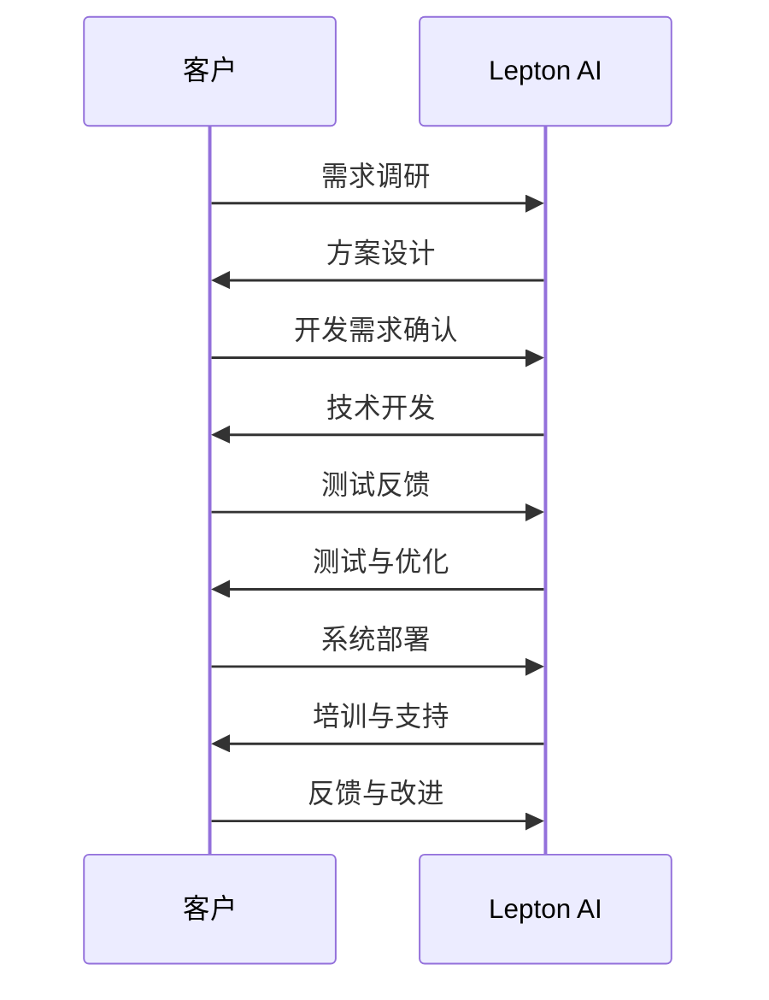

                 

# 文章标题：企业级AI解决方案：Lepton AI的定制服务

## 关键词：
- 企业级AI
- Lepton AI
- 定制服务
- 深度学习
- 架构设计
- 应用案例

## 摘要：
本文将深入探讨Lepton AI企业级定制服务，分析其在人工智能领域的重要地位和应用价值。通过介绍Lepton AI的技术架构、核心算法，以及在不同行业中的成功案例，本文旨在为企业和开发者提供全面的AI解决方案指南，帮助企业实现智能化转型。

---

### 第一部分：引言与概述

#### 引言

在当今数字化时代，人工智能（AI）已经成为企业提升竞争力、优化业务流程的重要工具。随着AI技术的不断进步，企业级AI解决方案的需求日益增长。Lepton AI作为一家专注于提供定制化AI服务的企业，以其卓越的技术实力和丰富的行业经验，赢得了众多客户的信赖。

本文将围绕Lepton AI的定制服务展开讨论，首先介绍Lepton AI的背景和重要性，然后详细解析其技术架构和核心算法，最后通过实际案例展示其应用效果。希望通过本文的阐述，能够帮助读者更好地理解和应用AI技术，为企业发展注入新动力。

#### 1.1 书籍背景与目的

Lepton AI成立于2010年，总部位于美国硅谷，是一家致力于推动人工智能技术商业化应用的创新型企业。公司自成立以来，始终秉持“技术创新，服务至上”的理念，为客户提供高效、可靠的AI解决方案。

本文旨在通过系统化的讲解，帮助读者深入了解Lepton AI的定制服务。具体目标如下：

1. **普及AI基础知识**：介绍人工智能的核心概念和技术体系，帮助读者建立全面的技术视野。
2. **剖析Lepton AI架构**：深入探讨Lepton AI的技术架构和核心算法，理解其技术优势和应用价值。
3. **分享成功案例**：通过实际案例展示Lepton AI在各个行业中的应用效果，提供实践参考。
4. **提供解决方案**：为企业在AI应用中遇到的挑战提供有效的对策和建议。

#### 1.2 人工智能在企业中的应用趋势

随着AI技术的不断成熟，越来越多的企业开始将其应用于各个业务环节，以实现智能化升级和业务创新。以下是当前企业级AI应用的主要趋势：

1. **智能制造**：通过AI技术实现生产过程的自动化和智能化，提高生产效率和产品质量。
2. **智能客服**：利用自然语言处理技术，提供智能化的客户服务，提升客户体验。
3. **供应链优化**：通过AI技术对供应链进行实时分析和优化，降低成本，提高效率。
4. **风险管理**：利用机器学习模型进行风险预测和评估，提高金融决策的准确性和安全性。
5. **智能推荐**：基于用户行为数据，提供个性化的产品推荐，提升销售额。

#### 1.3 Lepton AI的定制服务及其价值

Lepton AI的定制服务旨在为客户提供高度个性化的AI解决方案，以满足其特定的业务需求。其核心价值体现在以下几个方面：

1. **定制化开发**：根据客户的具体需求，量身定制AI算法和应用，确保解决方案的实用性和高效性。
2. **技术优势**：Lepton AI拥有一支由顶级AI专家和工程师组成的团队，具备深厚的技术积累和创新能力。
3. **行业经验**：公司积累了丰富的行业解决方案经验，能够快速响应客户需求，提供专业的指导和建议。
4. **持续优化**：通过持续的迭代和优化，不断提升AI解决方案的性能和可靠性，确保客户业务的长效运行。

#### 1.4 阅读指南与组织结构

本文分为三个主要部分：

1. **第一部分：引言与概述**：介绍Lepton AI的背景、目的和人工智能在企业中的应用趋势。
2. **第二部分：Lepton AI的核心算法与架构**：详细解析Lepton AI的技术架构和核心算法，包括深度学习、生成对抗网络（GAN）和强化学习等。
3. **第三部分：Lepton AI在企业级应用中的实施与优化**：通过实际案例，展示Lepton AI在不同行业中的应用效果，并提供解决方案和优化建议。

通过本文的阅读，读者可以全面了解Lepton AI的定制服务，掌握AI技术在企业中的应用方法，为企业智能化转型提供有力支持。

---

### 第一部分 总结与展望

综上所述，Lepton AI作为一家领先的人工智能解决方案提供商，以其卓越的技术实力和丰富的行业经验，为客户提供了高效、可靠的定制化服务。随着人工智能技术的不断进步，企业级AI解决方案的应用前景将越来越广阔。本文通过对Lepton AI的技术架构、核心算法和实际案例的深入探讨，为读者提供了全面的AI解决方案指南。

在未来的发展中，Lepton AI将继续致力于技术创新和服务优化，帮助更多企业实现智能化转型。同时，我们也期待读者能够结合自身业务需求，灵活应用AI技术，推动企业的发展与创新。

#### 1.3 Lepton AI的定制服务实践

Lepton AI的定制服务是公司核心竞争力之一，其服务流程、成功案例和客户反馈为该服务的有效性和价值提供了有力的证明。以下是Lepton AI定制服务实践的具体内容。

##### 1.3.1 Lepton AI的定制化服务流程

Lepton AI的定制化服务流程可以分为以下几个阶段：

1. **需求调研**：与客户进行深入交流，了解其业务需求、技术需求和预期目标。
2. **方案设计**：根据客户需求，设计定制化的AI解决方案，包括技术路线、系统架构和实施计划。
3. **技术开发**：组建专业的技术团队，按照设计方案进行AI算法和系统的开发与实现。
4. **测试与优化**：在开发过程中，进行严格的测试与优化，确保系统性能和可靠性。
5. **部署与培训**：将开发完成的AI系统部署到客户环境中，并提供详细的操作培训和技术支持。
6. **后续服务**：提供长期的技术支持和维护服务，根据客户反馈进行持续优化和升级。

以下是一个典型的定制化服务流程图：



##### 1.3.2 成功案例分享

Lepton AI在多个行业中积累了丰富的成功案例，以下是其中的两个案例：

1. **案例一：智能客服系统建设**

某大型互联网公司希望通过智能客服系统提升客户服务质量，降低人工成本。Lepton AI为其定制了一款基于自然语言处理（NLP）技术的智能客服系统。该系统主要包括以下功能：

- **语义理解**：利用深度学习模型，对用户的问题进行语义分析和理解。
- **知识库管理**：构建全面的知识库，包括常见问题的解答和业务操作指南。
- **对话生成**：基于对话管理模型，生成自然流畅的回答。
- **情感分析**：通过情感分析模型，判断用户情绪，提供相应的关怀和解决方案。

系统上线后，智能客服系统的响应速度和准确率显著提升，客户满意度大幅提高，实现了客户服务的智能化转型。

2. **案例二：智能供应链优化**

某跨国零售企业希望利用AI技术优化其供应链管理，提高供应链效率和降低成本。Lepton AI为其定制了一套智能供应链优化解决方案，包括以下功能：

- **需求预测**：利用机器学习模型，预测市场需求，优化库存管理。
- **物流优化**：通过路径优化算法，降低运输成本，提高配送效率。
- **供应链监控**：实时监控供应链各个环节，及时发现并解决潜在问题。

实施后，该零售企业的库存周转率提高了20%，运输成本降低了15%，供应链的稳定性和响应速度得到了显著提升。

##### 1.3.3 客户反馈与改进方向

Lepton AI在服务过程中，非常重视客户的反馈和评价。以下是一些客户反馈的摘要：

- **客户反馈一**：“Lepton AI的定制化服务非常专业和高效，从需求调研到方案设计，再到系统部署和培训，每个环节都非常到位。他们的技术团队非常敬业，能够迅速解决我们遇到的问题。”
- **客户反馈二**：“智能客服系统上线后，客户满意度提高了30%，人工客服的工作量减轻了许多。Lepton AI的服务不仅解决了我们的技术问题，还提供了许多实用的业务建议，对我们的业务发展有很大帮助。”

基于客户的反馈，Lepton AI也在不断优化和改进其定制化服务。未来，Lepton AI将：

1. **增强技术能力**：继续引进和培养顶尖的AI技术人才，提升技术水平和创新能力。
2. **优化服务流程**：进一步简化服务流程，提高响应速度和服务质量。
3. **加强客户支持**：提供更加全面的客户支持和维护服务，确保客户的长期满意度。

通过不断优化和改进，Lepton AI致力于为客户提供更优质、更高效的定制化AI服务，帮助企业实现智能化转型和可持续发展。

### 第二部分：Lepton AI的核心算法与架构

#### 2.1 Lepton AI的算法原理

Lepton AI的核心算法涵盖了深度学习、生成对抗网络（GAN）和强化学习等多个领域。这些算法不仅在理论上具有深厚的背景，而且在实践中展现了强大的应用能力。以下是这些算法的基本原理和特点。

##### 2.1.1 深度学习算法基础

深度学习是人工智能的一个重要分支，它通过模拟人脑神经网络的结构和功能，实现对数据的自动特征学习和模式识别。深度学习算法主要包括以下几类：

1. **神经网络的基本结构**：

   神经网络是深度学习的基础，其基本结构包括输入层、隐藏层和输出层。每一层由多个神经元组成，神经元之间通过权重连接。输入数据通过输入层传递到隐藏层，隐藏层的信息再传递到输出层，从而完成数据的处理和预测。

   ```mermaid
   graph TD
       A[输入层] --> B[隐藏层1]
       B --> C[隐藏层2]
       C --> D[输出层]
   ```

2. **神经网络的训练过程**：

   神经网络的训练过程主要分为前向传播和反向传播两个阶段。在前向传播过程中，输入数据通过神经网络传递，得到预测结果；在反向传播过程中，根据预测结果与实际结果的差异，计算网络中的误差，并通过梯度下降等优化算法调整网络权重，从而逐步减少误差，提高预测精度。

   ```mermaid
   graph TD
       A[输入] --> B[前向传播]
       B --> C{预测结果}
       C --> D[误差计算]
       D --> E[反向传播]
       E --> F{权重调整}
   ```

3. **深度学习优化算法**：

   深度学习优化算法用于提高神经网络的训练效率和预测精度。常见的优化算法包括梯度下降、动量优化、Adagrad、RMSprop和Adam等。这些算法通过不同的策略调整学习率，优化网络参数，从而实现更快的收敛和更高的预测精度。

   ```mermaid
   graph TD
       A[梯度下降] --> B{动量优化}
       B --> C[Adagrad]
       C --> D[RMSprop]
       D --> E[Adam]
   ```

##### 2.1.2 Lepton AI的核心算法

Lepton AI在深度学习领域拥有多项核心算法，这些算法在特定场景下具有显著的优势。以下是Lepton AI的核心算法及其特点：

1. **自适应神经网络算法**：

   自适应神经网络算法是一种基于动态调整网络结构的深度学习算法。该算法通过实时监测网络性能，自动调整网络层数和神经元数量，从而实现更好的训练效果和预测精度。

   ```mermaid
   graph TD
       A[初始网络] --> B{性能监测}
       B --> C{结构调整}
       C --> D[优化性能]
   ```

2. **生成对抗网络（GAN）**：

   生成对抗网络（GAN）是一种基于对抗性训练的深度学习模型，由生成器和判别器两个部分组成。生成器通过学习数据分布，生成与真实数据相似的新数据；判别器通过判断生成数据的真假，训练生成器和判别器，从而提高生成数据的质量。

   ```mermaid
   graph TD
       A[生成器] --> B{生成数据}
       B --> C{判别器}
       C --> D{对抗训练}
   ```

3. **强化学习算法**：

   强化学习算法是一种基于奖励反馈的机器学习算法，通过学习在特定环境中的最优策略，实现目标的最优化。Lepton AI的强化学习算法包括Q学习、SARSA和Deep Q-Network（DQN）等，这些算法在决策优化、路径规划等领域具有广泛的应用。

   ```mermaid
   graph TD
       A[环境] --> B{状态}
       B --> C{动作}
       C --> D[奖励]
       D --> E{学习策略}
   ```

##### 2.1.3 Lepton AI的技术架构与特色

Lepton AI的技术架构旨在提供高效、可靠的AI解决方案，其特色主要体现在以下几个方面：

1. **软件架构**：

   Lepton AI的软件架构采用模块化设计，包括数据预处理模块、算法模块、模型训练模块、模型部署模块和监控模块等。各个模块之间通过标准的接口进行通信，确保系统的灵活性和可扩展性。

   ```mermaid
   graph TD
       A[数据预处理] --> B[算法模块]
       B --> C[模型训练]
       C --> D[模型部署]
       D --> E[监控模块]
   ```

2. **硬件架构**：

   Lepton AI的硬件架构基于高性能计算集群，包括CPU、GPU和FPGA等多种计算资源。通过分布式计算和并行处理，提升系统的计算速度和效率。

   ```mermaid
   graph TD
       A[G

