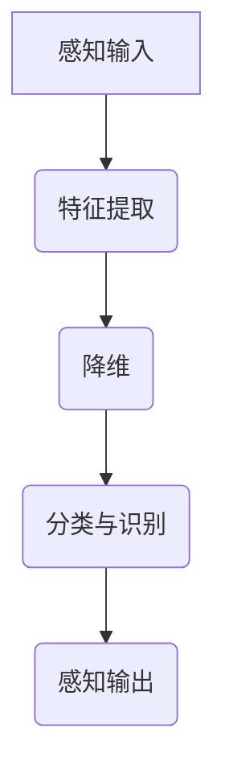

                 

## 文章标题

### 《体验多维度构建器设计师：AI创造的感官世界架构师》

> 关键词：人工智能、感官世界、多维度构建器、设计原则、核心算法、未来趋势

> 摘要：本文将深入探讨人工智能与感官世界的融合，探讨AI如何作为多维度构建器设计师，创造出一个全新的感官体验世界。文章首先介绍AI感知技术的基本原理，然后分析多维度构建器的设计思路与核心算法，最后展望AI在感官世界中的未来趋势，并探讨成为AI创造的感官世界架构师所需的技术与艺术融合。

----------------------------------------------------------------

### 第一部分：理解AI与感官世界的交互

在快速发展的科技时代，人工智能（AI）已经成为推动社会发展的重要力量。随着AI技术的不断进步，人类感官世界的交互方式也在发生深刻变革。AI不再仅仅是模拟人类的思维方式，它开始能够通过感知技术理解并扩展我们的感官体验，从而构建出一个全新的感官世界。

#### 第1章: AI与感官世界的融合

##### 1.1 AI感知技术概览

人工智能感知技术是AI系统通过多种传感器收集外部信息，并通过算法处理这些信息以理解环境和交互的能力。当前，AI感知技术主要包括视觉、听觉、触觉、嗅觉和味觉等多个方面。

**视觉感知**：利用计算机视觉算法，AI可以识别图像中的对象、场景和运动。这一技术已经在自动驾驶、安防监控、医疗诊断等领域得到广泛应用。

**听觉感知**：通过语音识别和声音分析，AI可以理解和生成语言，实现人机交互。语音助手、实时翻译、声音情感分析等应用展示了听觉感知的潜力。

**触觉感知**：触觉传感器可以感知物体的质地和硬度，使得机器人能够在复杂环境中进行操作。触觉感知在智能制造、医疗辅助等领域具有重要作用。

**嗅觉和味觉感知**：尽管在这些方面的人工智能研究还相对较少，但通过化学传感器和味觉传感器，AI已经开始尝试模拟人类对这些感官刺激的反应。

##### 1.2 感官世界与人工智能的关系

人工智能与感官世界的结合，不仅改变了人类与环境的交互方式，也推动了AI技术的进化。传统的AI系统更多依赖于数据和规则，而感知技术使得AI能够直接从环境中获取信息，实现更加自然和智能的交互。这种交互不仅提高了AI的实用性，也增强了其智能化水平。

##### 1.3 人类感官系统的基本原理

人类感官系统是一个复杂而高效的信息处理网络，能够从多种渠道获取外部信息，并通过神经系统的加工和解释，转化为感知体验。主要的感官包括：

**视觉系统**：由眼睛和大脑视觉处理部分组成，能够感知光线并形成视觉图像。

**听觉系统**：由耳朵和大脑听觉处理部分组成，能够感知声音并识别语言和音乐。

**触觉系统**：由皮肤和神经系统组成，能够感知物体的温度、质地和压力。

**嗅觉系统**：由鼻腔和大脑嗅觉处理部分组成，能够识别和区分不同气味。

**味觉系统**：由舌头和大脑味觉处理部分组成，能够感知食物的酸甜苦咸等味道。

了解人类感官系统的基本原理，有助于我们更好地理解AI感知技术的工作机制，并为设计更高效的人工感知系统提供启示。

### 第2章: AI感知原理解析

在深入探讨AI如何与感官世界交互之前，我们需要理解AI感知技术的原理。AI感知技术涉及多个方面，包括感知数据的采集、处理和分析。在这一章中，我们将详细解析AI感知技术的核心原理，探讨如何通过多模态数据融合和感知反馈机制来增强AI的感知能力。

##### 2.1 AI感知技术原理

AI感知技术的核心在于如何利用传感器收集环境信息，并将其转化为AI能够处理的数据。这一过程包括以下几个步骤：

1. **数据采集**：传感器是感知系统的关键组件，它们能够采集不同类型的物理信号，如光、声、温度、压力、气味等。

2. **信号处理**：采集到的信号通常需要进行预处理，如滤波、放大、去噪等，以提取有用的信息。

3. **特征提取**：通过特征提取算法，将预处理后的信号转化为能够表征物体或场景的特征向量。这些特征向量是后续处理和分析的基础。

4. **数据融合**：多模态数据融合是将不同感官的数据（如视觉、听觉、触觉等）整合起来，以获得更全面的感知信息。这一步骤通常涉及复杂的算法，如贝叶斯推理、神经网络等。

5. **决策与反馈**：根据提取的特征和融合的信息，AI系统能够做出相应的决策，如分类、识别、控制等。这些决策的结果会通过反馈机制返回到传感器和执行器，形成一个闭环控制过程。

##### 2.2 多模态数据融合

多模态数据融合是AI感知技术中至关重要的一环。人类感知系统通过多模态信息（如视觉、听觉、触觉等）的结合，能够更加准确地理解环境和做出决策。类似地，AI系统也需要通过多模态数据融合来提高其感知能力。

多模态数据融合的方法可以分为以下几类：

1. **独立处理**：每种感官数据分别进行处理，然后结合结果。这种方法简单易行，但往往无法充分利用不同感官数据之间的相关性。

2. **协同处理**：将多模态数据同时输入到同一模型中进行处理，如深度神经网络。这种方法能够更好地利用数据之间的相关性，提高感知精度。

3. **融合算法**：使用专门的算法将不同感官数据融合起来，如贝叶斯推理、概率图模型等。这些算法能够根据不同感官数据的特性进行优化，从而提高融合效果。

##### 2.3 感知反馈机制分析

感知反馈机制是AI系统实现闭环控制的关键。通过感知反馈，AI系统可以根据感知结果调整其行为，从而更好地适应环境和完成任务。

感知反馈机制可以分为以下几个步骤：

1. **感知输入**：AI系统通过传感器收集环境信息。

2. **数据处理**：对感知输入进行处理，提取特征并融合多模态数据。

3. **决策生成**：根据处理结果生成相应的决策，如动作指令或调整参数。

4. **执行与反馈**：执行决策，并根据执行结果返回感知反馈。

5. **调整优化**：根据感知反馈对系统进行调整和优化，以提高未来感知和决策的准确性。

感知反馈机制不仅能够提高AI系统的适应性，还能够通过不断学习和调整，使系统能够在更复杂和变化的环境中稳定运行。

通过解析AI感知技术原理，我们可以更好地理解AI如何与感官世界交互，并设计出更加高效和智能的人工感知系统。

### 第3章: 感官世界中的AI应用

随着AI感知技术的不断发展，人工智能已经广泛应用于视觉、听觉、触觉、嗅觉和味觉等多个感官领域。在这一章中，我们将探讨AI在这些感官感知中的应用，展示AI如何通过其独特的感知能力，改变我们的生活和工作方式。

##### 3.1 AI在视觉感知中的应用

视觉感知是AI感知技术中最成熟和广泛应用的领域之一。通过计算机视觉算法，AI能够识别和理解图像中的信息，从而在多个场景中发挥重要作用。

**自动驾驶**：自动驾驶汽车使用AI视觉系统来感知道路环境，识别交通标志、车道线和其他车辆。通过多传感器数据融合，自动驾驶系统能够实时做出决策，确保车辆的安全运行。

**安防监控**：AI视觉系统在安防监控领域具有广泛的应用。它能够实时监测监控视频，自动识别异常行为和潜在威胁，从而提高监控效率。

**医疗诊断**：AI视觉系统能够分析医学影像，如X光片、CT扫描和MRI图像，辅助医生进行诊断。通过深度学习算法，AI可以识别出细小的病变，提高诊断的准确性。

**图像识别与分类**：AI视觉系统在图像识别和分类方面也有广泛应用。例如，在零售行业中，AI可以自动识别和分类货架上的商品，实现自动结账；在艺术品鉴定中，AI可以分析图像特征，帮助专家判断艺术品的真伪。

##### 3.2 AI在听觉感知中的应用

听觉感知是AI感知技术中的另一个重要领域。通过语音识别、声音分析等技术，AI能够理解和生成语言，实现人机交互。

**语音助手**：语音助手如Siri、Alexa和Google Assistant已经成为人们日常生活的一部分。它们能够通过语音命令控制智能家居设备、播放音乐、提供天气预报等信息。

**实时翻译**：AI听觉感知技术在实时翻译中也发挥着重要作用。通过语音识别和自然语言处理，AI能够实时翻译不同语言之间的对话，帮助跨国交流和商务合作。

**声音情感分析**：AI可以通过分析声音特征，识别出说话者的情感状态，如喜怒哀乐。这一技术在客户服务、心理健康、教育等领域具有广泛应用。

**语音合成**：AI语音合成技术能够生成逼真的语音，用于语音助手、播报系统、语音书籍等应用。通过深度学习算法，AI语音合成技术正在不断提高语音的自然度和流畅度。

##### 3.3 AI在触觉感知中的应用

触觉感知是机器人与人类互动的重要方式之一。通过触觉传感器，机器人能够感知物体的质地、温度和压力，从而进行更精确的操作。

**智能制造**：在智能制造中，机器人通过触觉感知来检测产品的质量和进行精细操作。例如，在汽车制造中，机器人可以通过触觉感知来检测零部件的装配质量，确保产品的精度。

**医疗辅助**：在医疗领域，触觉感知技术用于开发辅助设备，如触觉手套和假肢。这些设备能够模拟真实触觉，帮助残疾人恢复部分触觉功能，提高生活质量。

**交互式机器人**：交互式机器人通过触觉感知来与人类进行互动。例如，儿童机器人可以通过触觉反馈来引导儿童进行游戏，提供教育和娱乐。

##### 3.4 AI在嗅觉和味觉感知中的应用

尽管在嗅觉和味觉感知方面的人工智能研究还相对较少，但AI已经开始在这些领域展示出巨大的潜力。

**食品质量检测**：AI嗅觉传感器可以检测食品中的有害物质和污染物质，从而提高食品安全性。例如，通过分析食品的气味，AI可以检测出食品中的农药残留和霉菌污染。

**香味设计**：在化妆品和香水行业，AI可以通过分析不同成分的化学结构，设计出独特的香味。通过深度学习算法，AI可以不断优化香味配方，满足消费者的个性化需求。

**医学诊断**：AI嗅觉传感器可以检测病患的体味，从而辅助诊断疾病。例如，通过分析汗液中的化学成分，AI可以检测出糖尿病和癌症等疾病。

通过在视觉、听觉、触觉、嗅觉和味觉等方面的应用，AI正在逐渐改变我们的感官世界。随着AI感知技术的不断发展，我们可以期待AI在未来创造出更加丰富和多样的感官体验。

### 第二部分：多维度构建器的原理与实践

多维度构建器是一个强大的概念，它结合了人工智能和多种感官，创造出一种全新的交互体验。在这一部分，我们将探讨多维度构建器的设计思路、核心算法、数学模型，并通过实际案例展示其应用和实践。

#### 第4章: 多维度构建器的设计思路

##### 4.1 多维度构建器的概念

多维度构建器是指一种能够整合来自多个感官的数据，并通过复杂算法进行处理和解释的系统。这种系统不仅能够模拟人类的感知，还能通过智能化的决策和反馈，创造出更加丰富和多样的感官体验。多维度构建器的核心在于其跨模态数据融合能力，能够将来自视觉、听觉、触觉、嗅觉和味觉等多个感官的数据进行整合，从而获得更全面的感知信息。

##### 4.2 设计多维度构建器的挑战

设计多维度构建器面临多个挑战：

1. **数据融合**：多模态数据在时间、空间和类型上存在差异，如何有效地融合这些数据是一个关键问题。数据融合需要考虑数据源的特性、数据量的大小和数据之间的相关性。

2. **算法选择**：不同的感官数据需要不同的处理算法，如何选择和组合合适的算法是一个挑战。例如，视觉数据可能需要图像处理算法，而听觉数据可能需要语音识别算法。

3. **实时性**：多维度构建器需要在实时环境中工作，如何保证系统的高效性和实时响应是一个重要问题。特别是在动态和复杂的场景中，系统的实时性要求更高。

4. **用户体验**：多维度构建器需要提供良好的用户体验，如何设计用户界面和交互方式是一个挑战。用户体验不仅包括感官刺激的多样性，还包括操作简便性和舒适性。

##### 4.3 多维度构建器的设计原则

为了克服上述挑战，设计多维度构建器需要遵循以下原则：

1. **模块化设计**：将构建器分为感知模块、处理模块和输出模块，以便于模块化开发和维护。每个模块负责特定的功能，如感知数据采集、特征提取、决策生成等。

2. **可扩展性**：设计时应考虑到系统的可扩展性，以便在未来加入新的感官模块或算法。

3. **实时性优化**：通过算法优化和硬件加速，提高系统的实时处理能力。例如，使用高效的特征提取算法和并行计算技术。

4. **用户体验设计**：注重用户界面设计，确保系统易于操作和使用。可以通过交互式界面、手势控制和语音命令等多种方式，提供多样化的交互方式。

5. **数据安全和隐私**：在处理多模态数据时，应确保数据的安全性和隐私性。采用加密技术和访问控制策略，保护用户数据不被泄露。

#### 第5章: 多维度构建器的核心算法

##### 5.1 特征提取算法

特征提取是多维度构建器的关键步骤，它将原始感知数据转化为具有可解释性的特征向量。以下是一些常见的特征提取算法：

1. **图像处理算法**：如边缘检测、角点检测、特征点匹配等，用于提取图像中的关键特征。

2. **语音处理算法**：如频谱分析、梅尔频率倒谱系数（MFCC）等，用于提取语音信号的频率特征。

3. **触觉处理算法**：如纹理识别、硬度检测等，用于提取触觉传感器的数据特征。

4. **嗅觉和味觉处理算法**：如气体传感器数据分析、化学成分识别等，用于提取嗅觉和味觉传感器的数据特征。

特征提取算法的目的是从原始数据中提取最具区分性的特征，以便后续的算法能够更有效地进行处理和分类。

##### 5.2 降维与聚类算法

降维是将高维数据映射到低维空间，以减少数据维度和提高计算效率。以下是一些常用的降维算法：

1. **主成分分析（PCA）**：通过线性变换将数据投影到新的坐标系，保留数据的主要成分，丢弃次要成分。

2. **线性判别分析（LDA）**：基于分类目的，选择能够最大化类间差异和最小化类内差异的坐标系。

3. **自编码器（Autoencoder）**：通过训练神经网络，学习一个从高维数据到低维数据的映射，然后进行反向映射。

聚类是将相似的数据点归为一类。以下是一些常用的聚类算法：

1. **K-均值聚类**：将数据点分为K个簇，每个簇的中心为该簇所有数据点的平均值。

2. **层次聚类**：通过逐步合并相似度较高的簇，构建一个聚类树。

3. **谱聚类**：利用图论的方法，通过计算数据点之间的相似度矩阵，将相似度高的点合并成簇。

降维与聚类算法可以帮助多维度构建器从大量的感知数据中提取关键信息，提高后续算法的效率和准确性。

##### 5.3 模式识别与分类算法

模式识别与分类是多维度构建器的核心任务，它将提取的特征向量与已知的模式进行匹配，以实现数据的分类。以下是一些常见的模式识别与分类算法：

1. **支持向量机（SVM）**：通过找到一个最优的超平面，将不同类别的数据点分开。

2. **决策树**：通过一系列条件分支，将数据点逐步划分为不同的类别。

3. **随机森林**：通过构建多棵决策树，并投票得到最终分类结果。

4. **神经网络**：通过多层感知器网络（MLP）进行非线性分类。

5. **深度学习**：通过卷积神经网络（CNN）、循环神经网络（RNN）等深度学习模型进行复杂模式识别。

模式识别与分类算法的目标是准确地识别和分类感知数据，从而实现智能决策和交互。

通过深入探讨多维度构建器的核心算法，我们可以更好地理解如何设计和实现一个高效的AI感知系统，从而创造出更加丰富和多样的感官体验。

#### 第6章: 多维度构建器的数学模型

在多维度构建器的构建过程中，数学模型起到了至关重要的作用。这些数学模型不仅为算法提供了理论基础，也为实际应用提供了精确的工具。在本章中，我们将探讨多维度构建器中常用的数学模型，包括线性代数基础、统计学习理论和神经网络与深度学习。

##### 6.1 线性代数基础

线性代数是处理多维数据的基本工具，它在多维度构建器中扮演着核心角色。以下是一些关键的线性代数概念：

1. **向量与矩阵**：向量是表示一维数据的数学对象，矩阵是表示多维数据的数学对象。通过矩阵运算，我们可以有效地处理大量数据。

2. **特征向量与特征值**：特征向量是矩阵的一个重要属性，它能够将数据映射到新的坐标系中，特征值是特征向量的对应值，反映了数据的重要程度。

3. **线性变换**：通过线性变换，我们可以将原始数据映射到新的坐标系中，从而简化数据处理和分析。例如，主成分分析（PCA）就是一种常用的线性变换方法。

4. **矩阵运算**：矩阵运算包括矩阵的加法、减法、乘法、逆运算等。这些运算为我们提供了强大的数据处理能力，使我们能够有效地处理复杂的感知数据。

##### 6.2 统计学习理论

统计学习理论是机器学习和人工智能的重要理论基础，它为多维度构建器的算法设计提供了指导。以下是一些关键的统计学习理论概念：

1. **监督学习与无监督学习**：监督学习是指通过已标记的数据来训练模型，无监督学习是指在没有标记数据的情况下，通过数据本身的特性来训练模型。

2. **线性回归与逻辑回归**：线性回归是一种用于预测连续值的模型，逻辑回归是一种用于预测分类结果的模型。这两种模型是监督学习的基础。

3. **支持向量机（SVM）**：支持向量机是一种强大的分类算法，通过找到一个最优的超平面，将不同类别的数据点分开。

4. **聚类算法**：聚类算法是一种无监督学习方法，用于将相似的数据点归为一类。常见的聚类算法包括K-均值聚类、层次聚类和谱聚类等。

5. **降维算法**：降维算法是一种通过减少数据维度，提高计算效率和模型性能的方法。常用的降维算法包括主成分分析（PCA）、线性判别分析（LDA）和自编码器（Autoencoder）等。

##### 6.3 神经网络与深度学习

神经网络是模仿人类大脑工作原理的一种计算模型，它通过大量的神经元和连接进行数据学习和预测。深度学习是神经网络的一种扩展，通过多层神经网络进行复杂的数据处理和学习。以下是一些关键的神经网络与深度学习概念：

1. **神经网络的基本结构**：神经网络由输入层、隐藏层和输出层组成。每个层包含多个神经元，神经元之间通过加权连接进行信息传递。

2. **前向传播与反向传播**：前向传播是指数据从输入层通过神经网络传递到输出层的过程，反向传播是指根据输出误差，调整网络中的权重和偏置的过程。

3. **激活函数**：激活函数用于确定神经元的输出是否被激活。常见的激活函数包括 sigmoid 函数、ReLU函数和Tanh函数等。

4. **优化算法**：优化算法用于调整网络中的权重和偏置，以最小化损失函数。常见的优化算法包括随机梯度下降（SGD）、Adam优化器等。

5. **深度学习模型**：深度学习模型包括卷积神经网络（CNN）、循环神经网络（RNN）和生成对抗网络（GAN）等。这些模型在图像识别、自然语言处理、语音识别等领域具有广泛应用。

通过深入理解这些数学模型，我们可以更好地设计和实现多维度构建器，从而创造出更加智能和高效的感知系统。

#### 第7章: 多维度构建器实践案例

在了解了多维度构建器的理论基础之后，通过实际案例来展示其应用和实践将有助于我们更好地理解其工作原理和实际效果。以下是一些多维度构建器的实践案例，涵盖视觉、听觉和触觉等多个感官领域。

##### 7.1 视觉与听觉融合感知系统

**案例背景**：在智能安防领域，如何快速准确地识别入侵者和潜在威胁是一个重要问题。通过融合视觉和听觉感知，可以更全面地获取环境信息，从而提高识别的准确性和响应速度。

**实现方法**：

1. **视觉感知**：使用摄像头收集视频数据，通过图像处理算法提取关键特征，如人脸、车辆和动作等。

2. **听觉感知**：使用麦克风收集声音数据，通过语音识别算法提取关键词和声音特征，如说话人的语音、警笛声和砸击声等。

3. **数据融合**：将视觉和听觉数据融合在一起，使用多模态数据融合算法，如贝叶斯推理和神经网络，生成一个综合的感知特征向量。

4. **决策生成**：根据融合后的特征向量，使用分类算法（如SVM或深度学习模型）进行威胁识别和分类。

**效果评估**：通过在真实场景中测试，该系统在入侵者识别和潜在威胁检测方面取得了显著的效果，提高了智能安防系统的整体性能。

##### 7.2 基于多模态数据的情感分析

**案例背景**：在客户服务领域，了解客户的情感状态对于提供个性化的服务和提高客户满意度至关重要。通过融合多种感官数据，可以更准确地分析客户的情感状态。

**实现方法**：

1. **语音感知**：通过麦克风收集客户通话的声音数据，使用语音识别算法提取关键词和语音特征。

2. **面部表情感知**：通过摄像头收集客户的面部表情数据，使用图像处理算法提取面部特征和表情信息。

3. **生理信号感知**：使用心率和呼吸传感器收集客户的生理信号数据，分析客户的生理状态。

4. **数据融合**：将语音、面部表情和生理信号数据进行融合，使用多模态数据融合算法生成一个综合的情感特征向量。

5. **情感分类**：根据融合后的特征向量，使用情感分类算法（如支持向量机或深度学习模型）进行情感分类。

**效果评估**：通过实际应用，该系统能够准确识别客户的情感状态，为客服人员提供个性化的服务建议，提高了客户满意度和服务质量。

##### 7.3 多维度交互式环境设计

**案例背景**：在虚拟现实（VR）和增强现实（AR）领域，如何创造一个沉浸式的交互体验是一个关键问题。通过融合视觉、听觉和触觉等多维感官数据，可以提供更加真实的交互体验。

**实现方法**：

1. **视觉感知**：使用VR头显提供高质量的视觉体验，通过图像处理算法增强视觉效果，如景深效果、光照效果等。

2. **听觉感知**：使用耳机提供高质量的听觉体验，通过音频处理算法增强声音效果，如立体声、环境音效等。

3. **触觉感知**：使用触觉手套和手柄提供真实的触觉体验，通过触觉传感器和算法模拟物体的质地和硬度。

4. **数据融合**：将视觉、听觉和触觉数据进行融合，使用多模态数据融合算法生成一个综合的交互特征向量。

5. **交互设计**：根据融合后的特征向量，设计交互界面和交互方式，如手势控制、语音命令等。

**效果评估**：通过实际应用，该系统能够提供高度沉浸式的交互体验，使用户在虚拟环境中感受到更加真实和自然的交互体验。

通过这些实际案例，我们可以看到多维度构建器在多种应用场景中的成功应用。多维度构建器不仅提升了系统的感知能力和交互体验，也为未来的智能系统设计提供了新的思路和方向。

### 第三部分：AI创造的感官世界架构师

在探讨了AI与感官世界的交互和多维度构建器的原理与实践后，我们进入了AI创造的感官世界架构师的角色。这一部分将探讨感官世界的设计原则、AI在感官世界中的未来趋势，以及如何成为AI创造的感官世界架构师。

#### 第8章: 感官世界的设计原则

设计一个AI创造的感官世界，不仅需要技术上的创新，还需要在用户体验、可持续发展和社会伦理等方面进行全面考量。以下是设计感官世界时需要遵循的原则：

##### 8.1 人机交互设计

人机交互设计是感官世界设计的关键环节。为了提供良好的用户体验，交互设计应遵循以下原则：

1. **直观性**：交互界面应简洁直观，用户能够轻松理解和使用。

2. **适应性**：系统应能够适应不同用户的需求和习惯，提供个性化的交互体验。

3. **反馈机制**：及时提供明确的反馈，使用户了解系统状态和操作结果。

4. **多模态交互**：结合视觉、听觉、触觉等多种感官模式，提供多样化的交互方式。

##### 8.2 用户体验优化

用户体验优化是感官世界设计的重要目标。以下是一些优化用户体验的方法：

1. **交互速度**：确保系统响应迅速，减少用户等待时间。

2. **定制化**：允许用户根据个人偏好和需求进行系统设置，提供个性化的体验。

3. **易用性**：通过简洁的界面和清晰的指引，降低用户的学习和使用难度。

4. **情感化**：在设计中融入情感元素，如情感语音、情景动画等，增强用户的情感共鸣。

##### 8.3 可持续发展与伦理

在设计感官世界时，可持续发展和社会伦理问题不可忽视。以下是一些关键点：

1. **数据隐私**：保护用户数据的安全和隐私，遵守相关法律法规。

2. **环境责任**：设计应考虑对环境的影响，减少能源消耗和资源浪费。

3. **公平性**：确保系统的公平性，避免对特定群体造成不利影响。

4. **伦理考量**：在算法设计和应用中，避免偏见和歧视，确保系统的伦理合理性。

#### 第9章: AI在感官世界中的未来趋势

随着技术的不断发展，AI在感官世界中的应用前景广阔。以下是一些AI在感官世界中的未来趋势：

##### 9.1 AI感知技术的发展趋势

1. **多模态感知融合**：未来的AI感知技术将更加注重多模态感知融合，通过整合来自视觉、听觉、触觉等多种感官的数据，提供更加全面和精准的感知体验。

2. **自学习与自适应**：AI系统将具备更强的自学习和自适应能力，能够根据用户的行为和反馈，不断优化感知和交互效果。

3. **实时感知**：随着计算能力的提升，AI感知技术将实现更高的实时性，能够在复杂的动态环境中实时感知和处理数据。

##### 9.2 多维度交互的未来

1. **沉浸式体验**：未来的感官世界将更加注重沉浸式体验，通过虚拟现实（VR）和增强现实（AR）等技术，提供身临其境的感官体验。

2. **多感官融合**：未来的交互将不仅仅是视觉和听觉，还将包括触觉、嗅觉和味觉等多感官的融合，创造更加丰富的感官体验。

3. **智能反馈**：AI系统将能够根据用户的感知和反馈，提供个性化的智能反馈，优化用户体验。

##### 9.3 AI在感官世界中的潜在应用

1. **智能医疗**：通过AI感知技术，智能医疗设备将能够更准确地监测患者的生理和心理健康，提供个性化的治疗方案。

2. **智能家居**：AI感知技术将使智能家居系统更加智能化，能够根据家庭成员的行为和需求，提供个性化的服务和安全保障。

3. **智能交通**：AI感知技术将在智能交通系统中发挥重要作用，通过实时感知和智能决策，提高交通效率和安全性。

#### 第10章: 成为AI创造的感官世界架构师

成为AI创造的感官世界架构师，需要具备多方面的技能和素养。以下是一些建议：

##### 10.1 技术与艺术的融合

1. **技术知识**：掌握计算机科学、人工智能、传感器技术等领域的专业知识，为感官世界的设计提供技术基础。

2. **艺术感知**：培养艺术审美能力，了解设计原则和用户体验优化方法，将技术与艺术相结合。

3. **创新思维**：培养创新思维，敢于尝试新的设计理念和技术，不断探索感官世界的可能性。

##### 10.2 创新思维与设计实践

1. **跨学科合作**：与其他领域的专家合作，如心理学、神经科学、设计学等，共同探索感官世界的创新设计。

2. **设计实践**：通过实际项目和实践，不断积累设计经验，提高设计能力和实践能力。

3. **用户研究**：深入研究用户需求和行为，了解用户在不同情境下的感知和交互习惯，为设计提供依据。

##### 10.3 跨学科合作与团队建设

1. **团队协作**：建立跨学科团队，汇集不同领域的专业人才，共同推进感官世界的设计和实现。

2. **沟通与协作**：提高沟通和协作能力，确保团队成员之间的有效沟通和合作。

3. **持续学习**：关注行业动态，不断学习新技术和新理念，提升自身的专业素养。

通过技术与艺术的融合、创新思维与设计实践、跨学科合作与团队建设，我们可以成为AI创造的感官世界架构师，为未来创造更加丰富和智能的感官体验。

### 附录

#### 附录A: AI感知与构建器相关的工具与资源

在本章中，我们将介绍一些与AI感知和多维度构建器相关的工具、资源和学习材料，帮助读者深入了解相关技术，并在此基础上进行进一步的探索和应用。

##### A.1 深度学习框架介绍

1. **TensorFlow**：由Google开发的开源深度学习框架，支持各种深度学习模型和算法，广泛应用于图像识别、自然语言处理等领域。

2. **PyTorch**：由Facebook开发的开源深度学习框架，具有灵活的动态计算图和高效的GPU支持，广泛用于研究和新模型的开发。

3. **Keras**：一个高层次的深度学习API，能够在TensorFlow和Theano上运行，简化了深度学习模型的构建和训练过程。

##### A.2 感知数据集与API

1. **ImageNet**：由DARPA赞助的大型视觉识别数据集，包含数百万个标注图像，是许多图像识别模型的标准训练数据集。

2. **COCO数据集**：用于计算机视觉任务的大型数据集，包含物体识别、场景分割、人脸识别等多个任务，广泛用于研究和竞赛。

3. **Google Cloud AI API**：Google提供的云计算服务，包括图像识别、语音识别、文本分析等多个API，方便开发者集成AI功能。

##### A.3 开源项目和社区资源

1. **AI感知开源项目**：例如OpenCV、Pillow等，用于图像处理和计算机视觉的开源库，为开发者提供丰富的功能和技术支持。

2. **AI社区和论坛**：如Stack Overflow、Reddit的AI板块、AI论坛等，是开发者交流和学习的好地方。

3. **在线课程和学习材料**：如Coursera、edX、Udacity等在线教育平台提供的AI和深度学习相关课程，适合初学者和专业人士。

#### 附录B: Mermaid流程图示例

在本附录中，我们将展示如何使用Mermaid语言创建流程图。Mermaid是一种简单而强大的Markdown扩展语言，可用于绘制各种图表，包括流程图、序列图、甘特图等。

以下是一个简单的Mermaid流程图示例：



当将上述代码嵌入Markdown文档中，将生成以下流程图：


这个流程图描述了感知数据从输入到输出的整个过程，包括特征提取、降维、分类与识别以及最终的感知输出。

#### 附录C: 算法伪代码示例

在算法设计中，伪代码是一种描述算法逻辑和过程的简洁方式。以下是一些与AI感知和多维度构建器相关的算法伪代码示例。

##### 特征提取伪代码

```python
def extract_features(data):
    # 数据预处理
    preprocessed_data = preprocess_data(data)
    
    # 特征提取
    features = []
    for sample in preprocessed_data:
        feature_vector = extract_vector(sample)
        features.append(feature_vector)
    
    return features
```

这个伪代码描述了特征提取的过程，包括数据预处理和特征向量的提取。

##### 模式识别伪代码

```python
def recognize_pattern(features):
    # 训练模型
    model = train_model(features)
    
    # 预测
    predictions = model.predict(features)
    
    # 结果分析
    results = analyze_predictions(predictions)
    
    return results
```

这个伪代码描述了模式识别的过程，包括模型的训练、预测和结果分析。

#### 附录D: 数学公式示例

在学术论文和技术文档中，数学公式是必不可少的。以下是一些使用LaTeX格式的数学公式示例：

$$
X = \sum_{i=1}^{n} x_i^2
$$

这个公式表示一个序列的平方和。

$$
f(x) = \frac{1}{1 + e^{-x}}
$$

这是一个常见的激活函数（Sigmoid函数）。

这些公式可以通过在Markdown文档中使用LaTeX语法来嵌入，使文档内容更加丰富和严谨。

#### 附录E: 代码解读与分析

在AI感知和多维度构建器的开发过程中，代码的实现和分析是关键环节。以下是一个简单的代码示例，并对其进行解读。

```python
# 代码示例
def sensory_world_architect():
    # 初始化构建器
    builder = MultiDimensionalBuilder()

    # 添加感知模块
    builder.add_sensors([VisionSensor(), AudioSensor(), TouchSensor()])

    # 设计交互界面
    interface = InterfaceDesigner()

    # 集成AI算法
    interface.integrate_algorithms([FeatureExtractor(), Classifier()])

    # 运行构建器
    builder.run()
```

**代码解读**：

1. **初始化构建器**：创建一个`MultiDimensionalBuilder`对象，这是多维度构建器的核心组件。

2. **添加感知模块**：通过调用`add_sensors`方法，添加了视觉、听觉和触觉三个感知模块。

3. **设计交互界面**：创建一个`InterfaceDesigner`对象，负责设计用户界面。

4. **集成AI算法**：通过调用`integrate_algorithms`方法，将特征提取和分类算法集成到交互界面中。

5. **运行构建器**：调用`run`方法启动构建器，开始感知和交互过程。

**代码分析**：

- **组件初始化**：构建器通过初始化传感器和算法，为后续感知和决策提供了基础。
- **模块添加**：感知模块的添加使得构建器能够从多个维度获取信息，实现多模态感知。
- **交互界面设计**：交互界面是用户与系统交互的桥梁，通过优化用户体验，提高系统的可用性。
- **算法集成**：特征提取和分类算法的集成，使得构建器能够对感知数据进行分析和决策，实现智能化交互。

**实际案例分析和详细讲解剖析**：

在实际应用中，多维度构建器的实现会涉及更复杂的数据处理和算法应用。以下是一个具体的案例：

**案例：智能家居感知系统**

**需求**：设计一个智能家居感知系统，能够实时监控家庭环境，并根据用户需求进行智能调节。

**实现步骤**：

1. **初始化构建器**：创建`MultiDimensionalBuilder`对象，并添加传感器模块（如温度传感器、湿度传感器、门窗传感器等）。

2. **数据采集**：通过传感器实时采集家庭环境数据，如温度、湿度、门窗状态等。

3. **数据处理**：使用特征提取算法对采集到的数据进行分析，提取关键特征，如温度的均值、湿度变化率等。

4. **智能决策**：根据提取的特征和用户设置，使用分类算法（如K-均值聚类或决策树）进行决策，如开启或关闭空调、加湿器等设备。

5. **反馈与优化**：根据用户反馈和环境变化，不断调整系统的感知和决策策略，提高系统的自适应能力。

**案例分析**：

- **数据采集与处理**：通过传感器和数据处理模块，系统能够实时监控家庭环境，并提取关键特征。
- **智能决策**：基于用户需求和实时数据，系统能够自动调节家庭设备，提高舒适度和节能效果。
- **反馈与优化**：通过用户反馈和环境变化，系统不断优化感知和决策策略，实现更加智能和自适应的家居环境。

**项目小结**：

通过本案例，我们可以看到多维度构建器在智能家居应用中的成功实现。多维度感知和智能决策功能不仅提高了用户体验，还实现了能源节约和智能家居的智能化管理。随着AI技术的不断发展，多维度构建器将在更多领域得到应用，为人类创造更加智能和丰富的感官世界。

#### 最佳实践 tips、小结、注意事项、拓展阅读等内容

**最佳实践 tips**：

1. **数据质量**：确保感知数据的质量和准确性，这对于后续的特征提取和决策至关重要。
2. **算法优化**：不断优化算法，提高系统的感知和决策能力，降低延迟和误差。
3. **用户参与**：在设计和实现过程中，积极收集用户反馈，以优化用户体验。
4. **可持续性**：在设计AI感知系统时，考虑能源消耗和环境影响，实现可持续发展。

**小结**：

本文深入探讨了AI与感官世界的交互、多维度构建器的原理与实践，以及AI在感官世界中的未来趋势。通过分析视觉、听觉、触觉等多感官的应用案例，展示了AI感知技术在多维度构建器中的重要作用。展望未来，AI感知技术将不断进步，为人类创造更加智能和丰富的感官世界。

**注意事项**：

1. **隐私保护**：在处理用户数据时，确保遵循隐私保护法规，保障用户隐私安全。
2. **系统稳定性**：在设计多维度构建器时，确保系统的稳定性和可靠性，以应对各种复杂环境。
3. **安全与伦理**：关注AI感知系统在应用中的安全性和伦理问题，防止潜在的风险和偏见。

**拓展阅读**：

1. **《深度学习》（Goodfellow, Bengio, Courville）**：介绍深度学习的基础理论和应用。
2. **《计算机视觉：算法与应用》（Richard Szeliski）**：涵盖计算机视觉的基础知识和最新算法。
3. **《人工智能：一种现代的方法》（Russell, Norvig）**：全面介绍人工智能的理论和实践。

通过本文的阅读，读者可以深入理解AI感知技术及其在多维度构建器中的应用，为未来的研究和实践提供参考。让我们共同期待AI创造的感官世界带来的无限可能。

