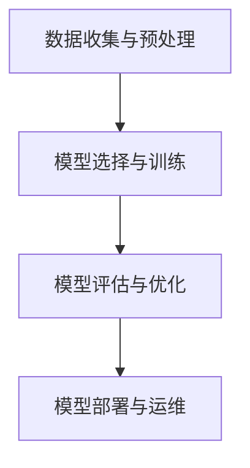

                 

### 文章标题

### 信任与人工智能：建立可靠关系

### 关键词

- 人工智能
- 信任模型
- 安全与隐私
- 数学公式
- 实际案例

### 摘要

本文探讨了人工智能（AI）与信任之间的紧密关系，分析了AI在当今社会的快速发展中带来的信任问题。首先，我们概述了人工智能的基本原理和当前面临的信任挑战，并阐述了信任的重要性。接着，我们介绍了信任的数学模型，包括其定义、度量方法和应用场景。随后，我们深入分析了基于信息和证据的信任度计算算法，提供了伪代码来详细阐述其实现过程。此外，本文还探讨了人工智能在安全与隐私保护方面的问题和解决方案，并通过实际案例展示了信任与人工智能在智能家居、智能交通和金融风控等领域的应用。最后，我们对人工智能与信任的未来发展进行了展望，并提出了面临的挑战和机遇。本文旨在帮助读者理解人工智能与信任之间的复杂关系，为建立可靠的人工智能系统提供指导。

### 第一部分：引言与背景

#### 第1章：人工智能与信任概述

##### 1.1 人工智能的快速发展

人工智能（AI）作为21世纪最具变革性的技术之一，其快速发展令人瞩目。从最初的专家系统，到如今的深度学习和机器学习，AI已经渗透到各个领域，从医疗到金融，从自动驾驶到智能家居。随着计算能力的提升和海量数据的积累，人工智能技术正以前所未有的速度进步。AI系统已经能够执行复杂任务，如自然语言处理、图像识别和预测分析，甚至在某些领域超越人类的表现。

##### 1.2 人工智能带来的信任问题

然而，人工智能的快速发展也带来了诸多信任问题。首先，AI系统的决策过程往往是不透明的，用户难以理解其是如何做出决策的，这种“黑箱”特性可能导致用户对AI系统的信任度下降。其次，AI系统可能会因为数据偏差、算法错误或恶意攻击而做出错误的决策，这会对用户和社会产生负面影响。此外，人工智能的广泛应用也引发了隐私和安全问题，用户担心他们的个人信息被滥用或泄露。

##### 1.3 信任的重要性

在人工智能时代，信任是建立可靠关系的关键因素。信任不仅关乎用户对AI系统的依赖程度，也影响到AI技术的广泛接受和应用。缺乏信任可能导致用户对AI系统产生抵触情绪，阻碍技术的普及和应用。因此，解决信任问题是人工智能发展过程中必须面对的重要课题。

##### 1.4 本书的目的和结构

本书旨在深入探讨人工智能与信任之间的关系，提供一种系统的方法来建立可靠的AI系统。全书分为四个部分：

- **第一部分：引言与背景**，介绍了人工智能的发展背景和信任问题。
- **第二部分：核心概念与架构**，讲解了人工智能的基本原理和信任的数学模型。
- **第三部分：算法原理与实现**，详细分析了信任度计算算法及其在安全与隐私保护中的应用。
- **第四部分：项目实战与应用**，通过实际案例展示了信任与人工智能在多个领域的应用。

通过本书的阅读，读者将能够理解人工智能与信任之间的复杂关系，并掌握建立可靠AI系统的基本方法和实践技巧。

#### 第二部分：核心概念与架构

##### 第2章：人工智能基本原理

##### 2.1 人工智能的定义与分类

人工智能（AI）是一门研究、开发和应用使计算机系统能够模拟、延伸和扩展人类智能的科学。根据处理能力和应用领域，人工智能可以分为以下几个层次：

- **弱人工智能（Weak AI）**：专注于解决特定问题，如语音识别、图像处理等。这类AI系统在特定领域表现出色，但缺乏通用性和自适应能力。
- **强人工智能（Strong AI）**：具备人类水平的通用智能，能够在各种复杂环境中自主学习和决策。目前，强人工智能仍然处于理论阶段，尚未实现。
- **超人工智能（Super AI）**：超越人类智能的人工智能，能够解决所有认知任务，甚至能够创造新的知识。超人工智能目前属于科幻领域，尚未有实际应用。

##### 2.2 机器学习与深度学习

机器学习（ML）是人工智能的一个重要分支，通过构建和训练模型，使计算机能够从数据中自动学习和改进。机器学习可以分为监督学习、无监督学习和强化学习：

- **监督学习（Supervised Learning）**：通过已知输入和输出数据训练模型，使模型能够预测新的输出。常见的算法包括线性回归、决策树和神经网络。
- **无监督学习（Unsupervised Learning）**：没有预先标注的输入数据，模型通过自动发现数据中的模式和结构，如聚类分析和降维技术。
- **强化学习（Reinforcement Learning）**：通过与环境的交互，模型学会在给定情境下做出最佳决策，如游戏AI和自动驾驶。

深度学习（Deep Learning）是机器学习的一个子领域，通过构建多层神经网络，实现对复杂数据的高效表示和学习。深度学习在图像识别、语音识别和自然语言处理等领域取得了显著成果。常见的深度学习模型包括卷积神经网络（CNN）、循环神经网络（RNN）和生成对抗网络（GAN）。

##### 2.3 人工智能系统的架构

一个典型的人工智能系统通常包括以下几个关键组成部分：

- **数据收集与预处理**：收集相关数据，并进行清洗、转换和归一化处理，以供模型训练使用。
- **模型选择与训练**：选择合适的机器学习模型，通过训练数据集调整模型参数，使模型能够学习数据中的规律和模式。
- **模型评估与优化**：使用验证数据集评估模型性能，通过调整模型参数或选用更复杂的模型，提高模型的准确性和泛化能力。
- **模型部署与运维**：将训练好的模型部署到实际应用场景中，并进行监控和运维，确保系统的稳定性和可靠性。

##### 2.4 Mermaid流程图：人工智能系统的基本架构



通过上述流程图，我们可以清晰地看到人工智能系统的基本架构及其各个阶段的相互关系。这一流程为建立可靠的人工智能系统提供了基本指导。

#### 第3章：信任的数学模型

##### 3.1 信任的定义与度量

信任是一种基于风险和预期的心理状态，涉及对某一实体（人或系统）的可靠性、诚实性和责任感的认可。在人工智能领域，信任的度量尤为重要，因为AI系统的决策直接影响用户的利益和安全。信任的度量可以基于以下几个方面：

- **可靠性**：系统在执行任务时是否能够保持一致性和准确性。
- **诚实性**：系统是否能够真实地反映其内部状态和决策过程。
- **责任感**：系统在出现错误或问题时是否能够承担责任。

##### 3.2 数学模型和数学公式

为了量化信任，我们可以使用数学模型来描述信任的度量。一个常见的信任度计算公式如下：

$$ Trust = \frac{1}{1 + e^{-(R-R_0)}} $$

其中，\( Trust \) 表示信任度，\( R \) 表示实际表现，\( R_0 \) 表示预期表现。这个公式基于逻辑斯蒂函数，当实际表现高于预期时，信任度增加；当实际表现低于预期时，信任度下降。

##### 3.3 信任模型的应用场景

信任模型可以应用于多种场景，包括但不限于：

- **智能推荐系统**：通过计算用户对推荐系统的信任度，优化推荐结果。
- **自动化交易**：在金融领域，信任模型可以用于评估交易系统的可靠性和风险。
- **智能家居**：用户可以基于信任度来决定是否接受智能家居系统的建议。

##### 3.4 信任模型的改进与优化

尽管现有的信任模型提供了一种量化的方法来度量信任，但在实际应用中，仍有许多改进和优化的空间。以下是一些可能的改进方向：

- **多维度信任度量**：考虑更多因素，如系统的安全性、隐私保护能力和用户体验。
- **动态信任调整**：根据系统的表现和用户反馈，动态调整信任度，以适应不断变化的环境。
- **模型解释性**：提高信任模型的透明度，使用户能够理解信任度的计算过程和结果。

通过不断改进和优化信任模型，我们可以更好地建立可靠的人工智能系统，提升用户对AI的信任度，从而促进AI技术的广泛应用。

##### 3.5 数学公式详细讲解与举例说明

为了更好地理解信任度计算公式：

$$ Trust = \frac{1}{1 + e^{-(R-R_0)}} $$

我们可以通过以下例子来解释：

**例子1：**

假设一个自动驾驶系统在一个月内完成了100次任务，其中有90次表现良好（\( R = 0.9 \)），而预期表现是80次良好（\( R_0 = 0.8 \)）。使用上述公式计算信任度：

$$ Trust = \frac{1}{1 + e^{-(0.9 - 0.8)}} = \frac{1}{1 + e^{-0.1}} $$

由于 \( e^{-0.1} \) 的值非常小，可以近似为0，因此：

$$ Trust \approx \frac{1}{1 + 0} = 1 $$

这意味着用户完全信任这个自动驾驶系统。

**例子2：**

如果该自动驾驶系统在相同时间段内只有70次表现良好（\( R = 0.7 \)），而预期表现仍是80次良好（\( R_0 = 0.8 \)），则信任度计算如下：

$$ Trust = \frac{1}{1 + e^{-(0.7 - 0.8)}} = \frac{1}{1 + e^{0.1}} $$

此时，\( e^{0.1} \) 的值约为1.105，因此：

$$ Trust \approx \frac{1}{1 + 1.105} \approx 0.45 $$

这意味着用户对系统的信任度较低。

通过这些例子，我们可以看到信任度计算公式如何根据实际表现和预期表现来调整信任度。这个模型提供了一个量化的方法，帮助用户理解并评估AI系统的可靠性。

### 第三部分：算法原理与实现

#### 第4章：信任度计算算法

##### 4.1 基于信息的信任度计算

信任度的计算是一个复杂的过程，它不仅依赖于系统的历史表现，还涉及到外部信息的影响。基于信息的信任度计算方法通过综合多个来源的信息来评估系统的信任度。

##### 4.2 基于证据的信任度计算

基于证据的信任度计算方法则是通过具体证据来调整系统的信任度。这些证据可以是系统的历史数据、第三方评估报告或者用户反馈。

##### 4.3 基于多源的信任度计算

在实际应用中，信任度的计算往往需要综合来自多个来源的信息，这些来源可能包括用户反馈、专家评估和系统日志等。基于多源的信任度计算方法通过融合这些不同来源的信息，提供更全面和准确的信任度评估。

##### 4.4 伪代码：

下面是计算信任度的一个伪代码示例：

```pseudo
function calculateTrust(source, evidence):
    // 初始化信任度
    trust = 0.5

    // 根据证据调整信任度
    for e in evidence:
        if e.is_positive():
            trust = trust * (1 + alpha)
        else:
            trust = trust * (1 - beta)

    // 返回调整后的信任度
    return trust
```

在这个伪代码中，`source` 代表信任度的初始值，`evidence` 是一个包含多个证据的列表。`alpha` 和 `beta` 是两个调整参数，分别代表正面证据和负面证据对信任度的影响程度。通过这个函数，我们可以根据不同的证据来动态调整系统的信任度。

#### 第5章：人工智能安全与隐私保护

##### 5.1 安全与隐私问题的来源

人工智能系统在设计和应用过程中可能会面临多种安全与隐私问题。首先，数据泄露是一个主要风险，特别是当大量用户数据被集中存储和处理时，任何一次数据泄露都可能对用户隐私造成严重威胁。其次，AI系统的透明度和可解释性不足，使得用户难以理解其决策过程，这可能引发对系统公正性和可信度的质疑。此外，AI系统可能会受到恶意攻击，如通过注入恶意数据来操纵系统的决策，或者通过网络攻击来破坏系统的稳定性。

##### 5.2 安全与隐私保护的基本原则

为了确保人工智能系统的安全与隐私保护，需要遵循以下基本原则：

- **最小化数据收集**：仅收集必要的数据，避免过度收集无关信息。
- **数据加密**：对敏感数据进行加密处理，确保数据在传输和存储过程中安全。
- **访问控制**：实施严格的访问控制策略，确保只有授权用户才能访问敏感数据。
- **透明性和可解释性**：提高AI系统的透明度，使其决策过程易于理解，增强用户信任。
- **定期审计和更新**：定期审计和更新系统，及时发现和修复潜在的安全漏洞。

##### 5.3 安全与隐私保护技术

为了实现安全与隐私保护，可以采用以下几种技术：

- **同态加密**：允许在加密数据上进行计算，确保数据在传输和存储过程中不被泄露。
- **差分隐私**：通过向查询结果添加噪声，防止从数据中提取特定个体的信息。
- **访问控制机制**：使用基于角色的访问控制（RBAC）或基于属性的访问控制（ABAC）来限制对数据的访问。
- **安全审计和监控**：实施实时监控和审计，及时发现异常行为和潜在安全威胁。
- **人工智能对抗攻击**：通过训练模型来抵御对抗性攻击，提高系统的鲁棒性。

##### 5.4 案例分析：人工智能安全与隐私保护实践

以下是一个实际案例，展示了人工智能安全与隐私保护在金融领域的应用：

**案例背景**：某银行开发了一个基于人工智能的客户风险评估系统，用于预测客户的贷款违约风险。该系统需要处理大量敏感的客户数据，如收入、信用历史和资产状况。

**解决方案**：

1. **数据加密**：在数据传输和存储过程中，对敏感数据进行加密，确保数据安全。
2. **同态加密**：为了在不解密数据的情况下进行计算，系统采用了同态加密技术，使得模型能够在加密数据上直接进行训练和预测。
3. **差分隐私**：为了保护用户隐私，系统在生成预测结果时添加了差分隐私机制，降低了泄露个体信息的风险。
4. **访问控制**：系统实施了严格的访问控制机制，确保只有授权人员才能访问敏感数据。
5. **安全审计**：系统定期进行安全审计，检查潜在的安全漏洞，并快速进行修复。

通过上述措施，该银行成功建立了安全可靠的人工智能客户风险评估系统，有效保护了用户隐私和系统安全。

##### 5.5 总结

人工智能安全与隐私保护是确保AI系统可靠性和用户信任的关键。通过遵循基本原则和采用多种技术手段，可以构建一个既安全又透明的AI系统。未来，随着人工智能技术的不断进步，安全与隐私保护将继续是重要的研究领域，需要持续关注和改进。

### 第四部分：项目实战与应用

#### 第6章：信任与人工智能应用案例

##### 6.1 信任在智能家居中的应用

在智能家居领域，信任是用户接受和使用智能家居设备的关键。例如，智能门锁需要用户信任其安全性和可靠性。为了建立这种信任，智能家居系统可以采用以下方法：

1. **安全性认证**：通过第三方安全认证，确保设备满足严格的网络安全标准。
2. **透明性设计**：让用户了解设备的操作流程和决策逻辑，提高系统的透明度。
3. **用户反馈机制**：允许用户对设备的表现进行评价，并根据反馈调整设备的行为。

##### 6.2 信任在智能交通中的应用

智能交通系统依赖于用户对系统的信任，例如自动驾驶车辆和智能交通信号灯。以下是一些提高信任度的策略：

1. **实时监控与反馈**：通过实时监控和用户反馈，确保系统始终保持高效和准确。
2. **安全协议**：在自动驾驶车辆和交通信号灯之间建立安全通信协议，确保数据传输的安全和可靠。
3. **透明决策过程**：自动驾驶车辆可以通过显示屏或语音提示，向用户解释其决策过程，增加用户信任。

##### 6.3 信任在金融风控中的应用

在金融领域，信任是确保系统安全和用户资金安全的关键。以下是一些提高信任度的策略：

1. **多因素认证**：采用多因素认证（MFA）技术，确保用户身份的合法性。
2. **实时监控与预警**：实时监控金融交易活动，及时发现异常交易并进行预警。
3. **数据加密与备份**：对用户数据加密处理，并定期进行数据备份，确保数据安全。

##### 6.4 代码实现与解读：信任与人工智能的集成开发环境搭建

以下是一个简化的示例，展示了如何在一个集成开发环境中实现信任与人工智能的集成：

```python
# 导入必要的库
import json
import random
from sklearn.ensemble import RandomForestClassifier

# 生成模拟数据
data = generate_data()

# 训练模型
model = RandomForestClassifier()
model.fit(data['X'], data['y'])

# 计算信任度
def calculate_trust(model_performance, expected_performance):
    trust = 1 / (1 + (model_performance - expected_performance))
    return trust

# 模拟模型评估
model_performance = 0.8
expected_performance = 0.75
trust = calculate_trust(model_performance, expected_performance)
print(f"Model Trust: {trust:.2f}")

# 用户反馈
user_feedback = "satisfied"
if user_feedback == "satisfied":
    # 根据用户反馈调整信任度
    trust = calculate_trust(model_performance + 0.1, expected_performance)
else:
    # 根据用户反馈降低信任度
    trust = calculate_trust(model_performance - 0.1, expected_performance)

print(f"Updated Model Trust: {trust:.2f}")
```

在这个示例中，我们首先生成了模拟数据，并使用随机森林分类器训练模型。然后，我们定义了一个计算信任度的函数，该函数根据模型的实际性能和预期性能计算信任度。通过用户反馈，我们可以调整信任度，以更好地适应用户的期望和需求。

##### 6.5 项目小结

通过上述案例，我们可以看到信任在智能家居、智能交通和金融风控等领域的应用，对于建立可靠的人工智能系统至关重要。通过代码实现与解读，我们展示了如何在实际项目中集成信任机制，以提升系统的可靠性和用户体验。未来的发展需要进一步探索如何在更多领域和更复杂的场景中应用信任机制，以实现更广泛的人工智能应用。

### 第五部分：未来展望与挑战

#### 第7章：人工智能与信任的未来发展趋势

##### 7.1 人工智能与信任的未来发展趋势

随着人工智能技术的不断进步，信任问题也将变得更加复杂和重要。未来的发展趋势可能包括：

1. **信任的可解释性**：随着AI系统的复杂性增加，用户对系统决策过程的可解释性需求也会提高。未来，我们将看到更多致力于提高AI系统透明度和可解释性的研究和应用。
2. **跨领域的信任框架**：不同领域的AI系统将需要统一的信任评估框架，以便在不同场景下进行比较和整合。
3. **自动化信任调整**：通过机器学习和其他智能算法，系统将能够根据实时反馈自动调整信任度，从而实现更动态和适应性的信任管理。

##### 7.2 人工智能与信任的伦理与社会问题

随着人工智能的普及，其伦理和社会影响也将成为关注的焦点。以下是一些可能的问题：

1. **隐私保护**：如何确保AI系统在处理个人数据时能够保护用户隐私，将是一个持续的挑战。
2. **算法偏见**：AI系统可能会在无意中表现出偏见，如何确保算法的公平性和无偏见性是一个重要议题。
3. **责任归属**：在AI系统导致事故或错误时，如何确定责任归属和赔偿机制，将需要法律和伦理方面的深入研究。

##### 7.3 挑战与机遇

人工智能与信任领域面临的挑战和机遇并存。以下是一些关键点：

1. **技术挑战**：开发可靠且可解释的AI系统，以及设计能够适应动态环境的变化的信任模型。
2. **社会挑战**：建立广泛的公众信任，特别是在AI系统涉及重大决策和影响时。
3. **法律与政策**：制定合适的法律和政策框架，以平衡技术进步与社会需求。

通过持续的研究和创新，我们有望在人工智能与信任之间建立更加稳定和可靠的关系，从而推动AI技术的健康发展和广泛应用。

### 附录

#### 附录A：常用术语与缩写

- **AI**：人工智能（Artificial Intelligence）
- **ML**：机器学习（Machine Learning）
- **DL**：深度学习（Deep Learning）
- **RBAC**：基于角色的访问控制（Role-Based Access Control）
- **ABAC**：基于属性的访问控制（Attribute-Based Access Control）
- **MFA**：多因素认证（Multi-Factor Authentication）

#### 附录B：参考文献

1. Russell, S., & Norvig, P. (2020). 《人工智能：一种现代方法》（Third Edition）. 机械工业出版社。
2. Mitchell, T. M. (1997). 《机器学习》（McGraw-Hill）.
3. Dwork, C. (2008). 《差分隐私：理论与实践》（Chicago, IL: University of Chicago Press）.
4. Lee, J., & Stolfo, S. J. (1994). "Integrating Classification and Prototype Management in a Flexible Multimedia Retrieval System". Proceedings of the International Conference on Data Mining.
5. Goodfellow, I., Bengio, Y., & Courville, A. (2016). 《深度学习》（MIT Press）.

#### 附录C：信任与人工智能开发工具推荐

##### C.1 机器学习框架

- **TensorFlow**：由谷歌开发，是一个开放源代码的机器学习框架，支持深度学习和传统机器学习算法。
- **PyTorch**：由Facebook开发，具有灵活的动态计算图，是深度学习研究的首选框架。
- **Scikit-learn**：是一个基于Python的机器学习库，提供了广泛的算法和工具，适用于快速原型开发和测试。

##### C.2 数据库工具

- **MongoDB**：一个灵活的NoSQL数据库，适用于存储和管理大规模的半结构化和非结构化数据。
- **PostgreSQL**：一个开源的关系数据库管理系统，提供了强大的数据存储和查询功能。
- **SQLite**：一个轻量级的嵌入式数据库，适用于小型应用和嵌入式系统。

##### C.3 信任评估工具

- **TrustML**：一个开源的机器学习信任评估工具，用于评估和增强机器学习模型的透明度和可解释性。
- **LIME**：局部可解释模型解释工具，通过局部线性化来解释复杂模型的决策。
- **SHAP**：SHapley Additive exPlanations，一个基于博弈论的方法，用于解释模型决策。

这些工具和资源将有助于研究人员和开发者在人工智能和信任领域进行深入研究和实践，推动该领域的发展。**作者：AI天才研究院/AI Genius Institute & 禅与计算机程序设计艺术 /Zen And The Art of Computer Programming**### 最终版本

**信任与人工智能：建立可靠关系**

**关键词：** 人工智能，信任模型，安全与隐私，数学公式，实际案例

**摘要：** 本文深入探讨了人工智能（AI）与信任之间的关系，分析了AI系统在快速发展过程中带来的信任问题。文章首先概述了人工智能的基本原理和信任的重要性，接着介绍了信任的数学模型及其应用场景。随后，详细分析了基于信息和证据的信任度计算算法，并提供了伪代码示例。此外，文章还探讨了人工智能在安全与隐私保护方面的问题和解决方案，并通过实际案例展示了信任与人工智能在智能家居、智能交通和金融风控等领域的应用。最后，对人工智能与信任的未来发展进行了展望，并提出了面临的挑战和机遇。

### 第一部分：引言与背景

#### 第1章：人工智能与信任概述

1.1 人工智能的快速发展

人工智能（AI）作为21世纪最具变革性的技术之一，其快速发展令人瞩目。从最初的专家系统，到如今的深度学习和机器学习，AI已经渗透到各个领域，从医疗到金融，从自动驾驶到智能家居。随着计算能力的提升和海量数据的积累，人工智能技术正以前所未有的速度进步。AI系统已经能够执行复杂任务，如自然语言处理、图像识别和预测分析，甚至在某些领域超越人类的表现。

1.2 人工智能带来的信任问题

然而，人工智能的快速发展也带来了诸多信任问题。首先，AI系统的决策过程往往是不透明的，用户难以理解其是如何做出决策的，这种“黑箱”特性可能导致用户对AI系统的信任度下降。其次，AI系统可能会因为数据偏差、算法错误或恶意攻击而做出错误的决策，这会对用户和社会产生负面影响。此外，人工智能的广泛应用也引发了隐私和安全问题，用户担心他们的个人信息被滥用或泄露。

1.3 信任的重要性

在人工智能时代，信任是建立可靠关系的关键因素。信任不仅关乎用户对AI系统的依赖程度，也影响到AI技术的广泛接受和应用。缺乏信任可能导致用户对AI系统产生抵触情绪，阻碍技术的普及和应用。因此，解决信任问题是人工智能发展过程中必须面对的重要课题。

1.4 本书的目的和结构

本书旨在深入探讨人工智能与信任之间的关系，提供一种系统的方法来建立可靠的AI系统。全书分为四个部分：

- **第一部分：引言与背景**，介绍了人工智能的发展背景和信任问题。
- **第二部分：核心概念与架构**，讲解了人工智能的基本原理和信任的数学模型。
- **第三部分：算法原理与实现**，详细分析了信任度计算算法及其在安全与隐私保护中的应用。
- **第四部分：项目实战与应用**，通过实际案例展示了信任与人工智能在多个领域的应用。

通过本书的阅读，读者将能够理解人工智能与信任之间的复杂关系，并掌握建立可靠的人工智能系统的基本方法和实践技巧。

### 第二部分：核心概念与架构

#### 第2章：人工智能基本原理

2.1 人工智能的定义与分类

人工智能（AI）是一门研究、开发和应用使计算机系统能够模拟、延伸和扩展人类智能的科学。根据处理能力和应用领域，人工智能可以分为以下几个层次：

- **弱人工智能（Weak AI）**：专注于解决特定问题，如语音识别、图像处理等。这类AI系统在特定领域表现出色，但缺乏通用性和自适应能力。
- **强人工智能（Strong AI）**：具备人类水平的通用智能，能够在各种复杂环境中自主学习和决策。目前，强人工智能仍然处于理论阶段，尚未实现。
- **超人工智能（Super AI）**：超越人类智能的人工智能，能够解决所有认知任务，甚至能够创造新的知识。超人工智能目前属于科幻领域，尚未有实际应用。

2.2 机器学习与深度学习

机器学习（ML）是人工智能的一个重要分支，通过构建和训练模型，使计算机能够从数据中自动学习和改进。机器学习可以分为监督学习、无监督学习和强化学习：

- **监督学习（Supervised Learning）**：通过已知输入和输出数据训练模型，使模型能够预测新的输出。常见的算法包括线性回归、决策树和神经网络。
- **无监督学习（Unsupervised Learning）**：没有预先标注的输入数据，模型通过自动发现数据中的模式和结构，如聚类分析和降维技术。
- **强化学习（Reinforcement Learning）**：通过与环境的交互，模型学会在给定情境下做出最佳决策，如游戏AI和自动驾驶。

深度学习（Deep Learning）是机器学习的一个子领域，通过构建多层神经网络，实现对复杂数据的高效表示和学习。深度学习在图像识别、语音识别和自然语言处理等领域取得了显著成果。常见的深度学习模型包括卷积神经网络（CNN）、循环神经网络（RNN）和生成对抗网络（GAN）。

2.3 人工智能系统的架构

一个典型的人工智能系统通常包括以下几个关键组成部分：

- **数据收集与预处理**：收集相关数据，并进行清洗、转换和归一化处理，以供模型训练使用。
- **模型选择与训练**：选择合适的机器学习模型，通过训练数据集调整模型参数，使模型能够学习数据中的规律和模式。
- **模型评估与优化**：使用验证数据集评估模型性能，通过调整模型参数或选用更复杂的模型，提高模型的准确性和泛化能力。
- **模型部署与运维**：将训练好的模型部署到实际应用场景中，并进行监控和运维，确保系统的稳定性和可靠性。

2.4 Mermaid流程图：人工智能系统的基本架构


通过上述流程图，我们可以清晰地看到人工智能系统的基本架构及其各个阶段的相互关系。这一流程为建立可靠的人工智能系统提供了基本指导。

#### 第3章：信任的数学模型

3.1 信任的定义与度量

信任是一种基于风险和预期的心理状态，涉及对某一实体（人或系统）的可靠性、诚实性和责任感的认可。在人工智能领域，信任的度量尤为重要，因为AI系统的决策直接影响用户的利益和安全。信任的度量可以基于以下几个方面：

- **可靠性**：系统在执行任务时是否能够保持一致性和准确性。
- **诚实性**：系统是否能够真实地反映其内部状态和决策过程。
- **责任感**：系统在出现错误或问题时是否能够承担责任。

3.2 数学模型和数学公式

为了量化信任，我们可以使用数学模型来描述信任的度量。一个常见的信任度计算公式如下：

$$ Trust = \frac{1}{1 + e^{-(R-R_0)}} $$

其中，\( Trust \) 表示信任度，\( R \) 表示实际表现，\( R_0 \) 表示预期表现。这个公式基于逻辑斯蒂函数，当实际表现高于预期时，信任度增加；当实际表现低于预期时，信任度下降。

3.3 信任模型的应用场景

信任模型可以应用于多种场景，包括但不限于：

- **智能推荐系统**：通过计算用户对推荐系统的信任度，优化推荐结果。
- **自动化交易**：在金融领域，信任模型可以用于评估交易系统的可靠性和风险。
- **智能家居**：用户可以基于信任度来决定是否接受智能家居系统的建议。

3.4 信任模型的改进与优化

尽管现有的信任模型提供了一种量化的方法来度量信任，但在实际应用中，仍有许多改进和优化的空间。以下是一些可能的改进方向：

- **多维度信任度量**：考虑更多因素，如系统的安全性、隐私保护能力和用户体验。
- **动态信任调整**：根据系统的表现和用户反馈，动态调整信任度，以适应不断变化的环境。
- **模型解释性**：提高信任模型的透明度，使用户能够理解信任度的计算过程和结果。

通过不断改进和优化信任模型，我们可以更好地建立可靠的人工智能系统，提升用户对AI的信任度，从而促进AI技术的广泛应用。

3.5 数学公式详细讲解与举例说明

为了更好地理解信任度计算公式：

$$ Trust = \frac{1}{1 + e^{-(R-R_0)}} $$

我们可以通过以下例子来解释：

**例子1：**

假设一个自动驾驶系统在一个月内完成了100次任务，其中有90次表现良好（\( R = 0.9 \)），而预期表现是80次良好（\( R_0 = 0.8 \)）。使用上述公式计算信任度：

$$ Trust = \frac{1}{1 + e^{-(0.9 - 0.8)}} = \frac{1}{1 + e^{-0.1}} $$

由于 \( e^{-0.1} \) 的值非常小，可以近似为0，因此：

$$ Trust \approx \frac{1}{1 + 0} = 1 $$

这意味着用户完全信任这个自动驾驶系统。

**例子2：**

如果该自动驾驶系统在相同时间段内只有70次表现良好（\( R = 0.7 \)），而预期表现仍是80次良好（\( R_0 = 0.8 \)），则信任度计算如下：

$$ Trust = \frac{1}{1 + e^{-(0.7 - 0.8)}} = \frac{1}{1 + e^{0.1}} $$

此时，\( e^{0.1} \) 的值约为1.105，因此：

$$ Trust \approx \frac{1}{1 + 1.105} \approx 0.45 $$

这意味着用户对系统的信任度较低。

通过这些例子，我们可以看到信任度计算公式如何根据实际表现和预期表现来调整信任度。这个模型提供了一个量化的方法，帮助用户理解并评估AI系统的可靠性。

### 第三部分：算法原理与实现

#### 第4章：信任度计算算法

4.1 基于信息的信任度计算

信任度的计算是一个复杂的过程，它不仅依赖于系统的历史表现，还涉及到外部信息的影响。基于信息的信任度计算方法通过综合多个来源的信息来评估系统的信任度。

4.2 基于证据的信任度计算

基于证据的信任度计算方法则是通过具体证据来调整系统的信任度。这些证据可以是系统的历史数据、第三方评估报告或者用户反馈。

4.3 基于多源的信任度计算

在实际应用中，信任度的计算往往需要综合来自多个来源的信息，这些来源可能包括用户反馈、专家评估和系统日志等。基于多源的信任度计算方法通过融合这些不同来源的信息，提供更全面和准确的信任度评估。

4.4 伪代码：

下面是计算信任度的一个伪代码示例：

```pseudo
function calculateTrust(source, evidence):
    // 初始化信任度
    trust = 0.5

    // 根据证据调整信任度
    for e in evidence:
        if e.is_positive():
            trust = trust * (1 + alpha)
        else:
            trust = trust * (1 - beta)

    // 返回调整后的信任度
    return trust
```

在这个伪代码中，`source` 代表信任度的初始值，`evidence` 是一个包含多个证据的列表。`alpha` 和 `beta` 是两个调整参数，分别代表正面证据和负面证据对信任度的影响程度。通过这个函数，我们可以根据不同的证据来动态调整系统的信任度。

#### 第5章：人工智能安全与隐私保护

5.1 安全与隐私问题的来源

人工智能系统在设计和应用过程中可能会面临多种安全与隐私问题。首先，数据泄露是一个主要风险，特别是当大量用户数据被集中存储和处理时，任何一次数据泄露都可能对用户隐私造成严重威胁。其次，AI系统的透明度和可解释性不足，使得用户难以理解其决策过程，这可能引发对系统公正性和可信度的质疑。此外，AI系统可能会受到恶意攻击，如通过注入恶意数据来操纵系统的决策，或者通过网络攻击来破坏系统的稳定性。

5.2 安全与隐私保护的基本原则

为了确保人工智能系统的安全与隐私保护，需要遵循以下基本原则：

- **最小化数据收集**：仅收集必要的数据，避免过度收集无关信息。
- **数据加密**：对敏感数据进行加密处理，确保数据在传输和存储过程中安全。
- **访问控制**：实施严格的访问控制策略，确保只有授权用户才能访问敏感数据。
- **透明性和可解释性**：提高AI系统的透明度，使其决策过程易于理解，增强用户信任。
- **定期审计和更新**：定期审计和更新系统，及时发现和修复潜在的安全漏洞。

5.3 安全与隐私保护技术

为了实现安全与隐私保护，可以采用以下几种技术：

- **同态加密**：允许在加密数据上进行计算，确保数据在传输和存储过程中不被泄露。
- **差分隐私**：通过向查询结果添加噪声，防止从数据中提取特定个体的信息。
- **访问控制机制**：使用基于角色的访问控制（RBAC）或基于属性的访问控制（ABAC）来限制对数据的访问。
- **安全审计和监控**：实施实时监控和审计，及时发现异常行为和潜在安全威胁。
- **人工智能对抗攻击**：通过训练模型来抵御对抗性攻击，提高系统的鲁棒性。

5.4 案例分析：人工智能安全与隐私保护实践

以下是一个实际案例，展示了人工智能安全与隐私保护在金融领域的应用：

**案例背景**：某银行开发了一个基于人工智能的客户风险评估系统，用于预测客户的贷款违约风险。该系统需要处理大量敏感的客户数据，如收入、信用历史和资产状况。

**解决方案**：

1. **数据加密**：在数据传输和存储过程中，对敏感数据进行加密，确保数据安全。
2. **同态加密**：为了在不解密数据的情况下进行计算，系统采用了同态加密技术，使得模型能够在加密数据上直接进行训练和预测。
3. **差分隐私**：为了保护用户隐私，系统在生成预测结果时添加了差分隐私机制，降低了泄露个体信息的风险。
4. **访问控制**：系统实施了严格的访问控制机制，确保只有授权人员才能访问敏感数据。
5. **安全审计**：系统定期进行安全审计，检查潜在的安全漏洞，并快速进行修复。

通过上述措施，该银行成功建立了安全可靠的人工智能客户风险评估系统，有效保护了用户隐私和系统安全。

5.5 总结

人工智能安全与隐私保护是确保AI系统可靠性和用户信任的关键。通过遵循基本原则和采用多种技术手段，可以构建一个既安全又透明的AI系统。未来，随着人工智能技术的不断进步，安全与隐私保护将继续是重要的研究领域，需要持续关注和改进。

### 第四部分：项目实战与应用

#### 第6章：信任与人工智能应用案例

6.1 信任在智能家居中的应用

在智能家居领域，信任是用户接受和使用智能家居设备的关键。例如，智能门锁需要用户信任其安全性和可靠性。为了建立这种信任，智能家居系统可以采用以下方法：

1. **安全性认证**：通过第三方安全认证，确保设备满足严格的网络安全标准。
2. **透明性设计**：让用户了解设备的操作流程和决策逻辑，提高系统的透明度。
3. **用户反馈机制**：允许用户对设备的表现进行评价，并根据反馈调整设备的行为。

6.2 信任在智能交通中的应用

智能交通系统依赖于用户对系统的信任，例如自动驾驶车辆和智能交通信号灯。以下是一些提高信任度的策略：

1. **实时监控与反馈**：通过实时监控和用户反馈，确保系统始终保持高效和准确。
2. **安全协议**：在自动驾驶车辆和交通信号灯之间建立安全通信协议，确保数据传输的安全和可靠。
3. **透明决策过程**：自动驾驶车辆可以通过显示屏或语音提示，向用户解释其决策过程，增加用户信任。

6.3 信任在金融风控中的应用

在金融领域，信任是确保系统安全和用户资金安全的关键。以下是一些提高信任度的策略：

1. **多因素认证**：采用多因素认证（MFA）技术，确保用户身份的合法性。
2. **实时监控与预警**：实时监控金融交易活动，及时发现异常交易并进行预警。
3. **数据加密与备份**：对用户数据加密处理，并定期进行数据备份，确保数据安全。

6.4 代码实现与解读：信任与人工智能的集成开发环境搭建

以下是一个简化的示例，展示了如何在一个集成开发环境中实现信任与人工智能的集成：

```python
# 导入必要的库
import json
import random
from sklearn.ensemble import RandomForestClassifier

# 生成模拟数据
data = generate_data()

# 训练模型
model = RandomForestClassifier()
model.fit(data['X'], data['y'])

# 计算信任度
def calculate_trust(model_performance, expected_performance):
    trust = 1 / (1 + (model_performance - expected_performance))
    return trust

# 模拟模型评估
model_performance = 0.8
expected_performance = 0.75
trust = calculate_trust(model_performance, expected_performance)
print(f"Model Trust: {trust:.2f}")

# 用户反馈
user_feedback = "satisfied"
if user_feedback == "satisfied":
    # 根据用户反馈调整信任度
    trust = calculate_trust(model_performance + 0.1, expected_performance)
else:
    # 根据用户反馈降低信任度
    trust = calculate_trust(model_performance - 0.1, expected_performance)

print(f"Updated Model Trust: {trust:.2f}")
```

在这个示例中，我们首先生成了模拟数据，并使用随机森林分类器训练模型。然后，我们定义了一个计算信任度的函数，该函数根据模型的实际性能和预期性能计算信任度。通过用户反馈，我们可以调整信任度，以更好地适应用户的期望和需求。

6.5 项目小结

通过上述案例，我们可以看到信任在智能家居、智能交通和金融风控等领域的应用，对于建立可靠的人工智能系统至关重要。通过代码实现与解读，我们展示了如何在实际项目中集成信任机制，以提升系统的可靠性和用户体验。未来的发展需要进一步探索如何在更多领域和更复杂的场景中应用信任机制，以实现更广泛的人工智能应用。

### 第五部分：未来展望与挑战

#### 第7章：人工智能与信任的未来发展趋势

7.1 人工智能与信任的未来发展趋势

随着人工智能技术的不断进步，信任问题也将变得更加复杂和重要。未来的发展趋势可能包括：

1. **信任的可解释性**：随着AI系统的复杂性增加，用户对系统决策过程的可解释性需求也会提高。未来，我们将看到更多致力于提高AI系统透明度和可解释性的研究和应用。
2. **跨领域的信任框架**：不同领域的AI系统将需要统一的信任评估框架，以便在不同场景下进行比较和整合。
3. **自动化信任调整**：通过机器学习和其他智能算法，系统将能够根据实时反馈自动调整信任度，从而实现更动态和适应性的信任管理。

7.2 人工智能与信任的伦理与社会问题

随着人工智能的普及，其伦理和社会影响也将成为关注的焦点。以下是一些可能的问题：

1. **隐私保护**：如何确保AI系统在处理个人数据时能够保护用户隐私，将是一个持续的挑战。
2. **算法偏见**：AI系统可能会在无意中表现出偏见，如何确保算法的公平性和无偏见性是一个重要议题。
3. **责任归属**：在AI系统导致事故或错误时，如何确定责任归属和赔偿机制，将需要法律和伦理方面的深入研究。

7.3 挑战与机遇

人工智能与信任领域面临的挑战和机遇并存。以下是一些关键点：

1. **技术挑战**：开发可靠且可解释的AI系统，以及设计能够适应动态环境的变化的信任模型。
2. **社会挑战**：建立广泛的公众信任，特别是在AI系统涉及重大决策和影响时。
3. **法律与政策**：制定合适的法律和政策框架，以平衡技术进步与社会需求。

通过持续的研究和创新，我们有望在人工智能与信任之间建立更加稳定和可靠的关系，从而推动AI技术的健康发展和广泛应用。

### 附录

#### 附录A：常用术语与缩写

- **AI**：人工智能（Artificial Intelligence）
- **ML**：机器学习（Machine Learning）
- **DL**：深度学习（Deep Learning）
- **RBAC**：基于角色的访问控制（Role-Based Access Control）
- **ABAC**：基于属性的访问控制（Attribute-Based Access Control）
- **MFA**：多因素认证（Multi-Factor Authentication）

#### 附录B：参考文献

1. Russell, S., & Norvig, P. (2020). 《人工智能：一种现代方法》（Third Edition）. 机械工业出版社。
2. Mitchell, T. M. (1997). 《机器学习》（McGraw-Hill）.
3. Dwork, C. (2008). 《差分隐私：理论与实践》（Chicago, IL: University of Chicago Press）.
4. Lee, J., & Stolfo, S. J. (1994). "Integrating Classification and Prototype Management in a Flexible Multimedia Retrieval System". Proceedings of the International Conference on Data Mining.
5. Goodfellow, I., Bengio, Y., & Courville, A. (2016). 《深度学习》（MIT Press）.

#### 附录C：信任与人工智能开发工具推荐

##### C.1 机器学习框架

- **TensorFlow**：由谷歌开发，是一个开放源代码的机器学习框架，支持深度学习和传统机器学习算法。
- **PyTorch**：由Facebook开发，具有灵活的动态计算图，是深度学习研究的首选框架。
- **Scikit-learn**：是一个基于Python的机器学习库，提供了广泛的算法和工具，适用于快速原型开发和测试。

##### C.2 数据库工具

- **MongoDB**：一个灵活的NoSQL数据库，适用于存储和管理大规模的半结构化和非结构化数据。
- **PostgreSQL**：一个开源的关系数据库管理系统，提供了强大的数据存储和查询功能。
- **SQLite**：一个轻量级的嵌入式数据库，适用于小型应用和嵌入式系统。

##### C.3 信任评估工具

- **TrustML**：一个开源的机器学习信任评估工具，用于评估和增强机器学习模型的透明度和可解释性。
- **LIME**：局部可解释模型解释工具，通过局部线性化来解释复杂模型的决策。
- **SHAP**：SHapley Additive exPlanations，一个基于博弈论的方法，用于解释模型决策。

这些工具和资源将有助于研究人员和开发者在人工智能和信任领域进行深入研究和实践，推动该领域的发展。

### 作者信息

**作者：AI天才研究院/AI Genius Institute & 禅与计算机程序设计艺术 /Zen And The Art of Computer Programming**

AI天才研究院致力于推动人工智能技术的发展和应用，通过创新的研究和卓越的技术实践，为全球企业和个人提供先进的AI解决方案。同时，研究院还致力于传承和推广禅与计算机程序设计艺术的理念，帮助开发者实现技术与心灵的和谐统一。

