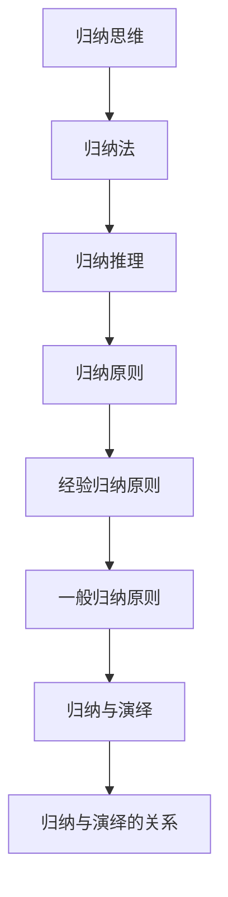

                 

# 《像数学家一样思考：归纳原则》目录大纲

## 第1章 引言

### 1.1 归纳思维的重要性
### 1.2 本书的目标与结构
### 1.3 阅读指南

## 第2章 归纳思维基础

### 2.1 归纳法概述
### 2.2 归纳推理的基本步骤
### 2.3 归纳推理的局限性

## 第3章 归纳原则

### 3.1 一般归纳原则
### 3.2 经验归纳原则
### 3.3 归纳原则的应用

## 第4章 归纳与演绎

### 4.1 归纳与演绎的关系
### 4.2 归纳与演绎的互补性
### 4.3 如何平衡归纳与演绎

## 第5章 归纳思维案例分析

### 5.1 自然科学领域的归纳思维
### 5.2 社会科学领域的归纳思维
### 5.3 归纳思维在生活中的应用

## 第6章 归纳思维训练方法

### 6.1 培养归纳思维的策略
### 6.2 归纳思维训练的方法
### 6.3 归纳思维训练的案例

## 第7章 归纳思维的未来

### 7.1 归纳思维的发展趋势
### 7.2 归纳思维在教育中的应用
### 7.3 归纳思维在人工智能中的应用

## 附录

### A.1 参考文献
### A.2 进一步阅读

---

**核心概念与联系 Mermaid 流程图**



---

**核心算法原理讲解**

```markdown
## 归纳推理的基本步骤

归纳推理是一种从个别事实中推断出一般结论的思维方式。它通常包括以下几个步骤：

1. **观察事实**：首先，我们需要观察一些具体的现象或事实。
2. **提取规律**：在观察的基础上，我们需要尝试从中提取出规律或模式。
3. **归纳结论**：根据提取的规律或模式，我们可以推断出更广泛的结论。

例如，我们观察到天空中所有已知的雁群都会南飞过冬，因此我们可以归纳出结论：所有雁群都会南飞过冬。

---

**数学模型和数学公式 & 详细讲解 & 举例说明**

### 归纳原则与概率

归纳原则中的一个重要概念是概率。概率用于衡量事件发生的可能性。

- **概率的定义**：事件A的概率P(A)是事件A在所有可能事件中出现的比例。
  
  $$ P(A) = \frac{\text{事件A发生的次数}}{\text{所有可能事件的次数}} $$

- **举例**：掷一枚公平的硬币10次，记录正面朝上的次数。如果正面朝上的次数接近5次，我们可以认为正面朝上的概率大约是0.5。

---

**项目实战：代码实际案例和详细解释说明**

```python
import random

def simulate_coin_tosses(n):
    heads_count = 0
    for _ in range(n):
        if random.random() < 0.5:
            heads_count += 1
    return heads_count

# 模拟掷硬币100次
heads_count = simulate_coin_tosses(100)

# 输出正面朝上的次数和概率
print(f"Heads count: {heads_count}")
print(f"Heads probability: {heads_count / 100:.2f}")

```

**代码解读与分析**

上述代码模拟了掷硬币的过程，并计算了正面朝上的次数及其概率。这里使用了Python中的`random`模块生成随机数，模拟硬币的正面或反面。每次掷硬币的结果是正面还是反面由`random.random()`函数决定，该函数返回一个介于0和1之间的随机浮点数。如果这个数小于0.5，我们假设正面朝上，否则反面朝上。通过多次模拟（这里设定为100次），我们可以得到正面朝上的次数，并计算其概率。

在实际应用中，这种模拟可以帮助我们验证概率理论的预测，例如在物理学中研究抛掷硬币的随机性，或者在金融领域中预测股票价格等。通过这样的实践，我们不仅可以加深对归纳原则的理解，也可以提高解决实际问题的能力。

----------------------------------------------------------------

## 第1章 引言

### 1.1 归纳思维的重要性

在当今信息爆炸的时代，归纳思维作为一种强大的认知工具，已经成为许多领域研究和解决问题的关键。归纳思维，即从具体的个别现象中归纳出一般规律或原则的思维方式，与演绎思维相对，是一种从一般到特殊的推理方式。归纳思维在科学研究、工程实践、商业分析等多个领域都有着广泛的应用。

在科学研究中，归纳思维使得科学家能够从大量的实验数据中提取出普遍规律，从而构建理论模型。例如，在物理学中，牛顿通过观察苹果落地等现象，归纳出了万有引力定律。在生物学中，达尔文通过观察物种的变异和生存竞争，提出了自然选择的理论。这些例子都展示了归纳思维在科学发现中的重要作用。

在工程实践中，归纳思维同样不可或缺。工程师们通过观察实际问题，归纳出解决方案的通用方法，从而设计出更加高效、可靠的系统。例如，在软件开发中，敏捷开发方法强调从用户的具体需求出发，不断迭代、优化，以达到最终目标。

商业分析领域也受益于归纳思维。数据分析师通过从海量数据中提取有价值的信息和规律，帮助企业做出更加明智的决策。比如，通过分析用户行为数据，电商企业能够优化产品推荐算法，提高销售额。

因此，掌握归纳思维不仅能够提高我们的认知能力，还能在实际工作中带来显著的效益。本章将介绍归纳思维的基本概念、重要性以及本书的结构和阅读指南，为后续章节的深入学习打下基础。

### 1.2 本书的目标与结构

本书的目标是帮助读者深入理解归纳思维的本质和应用，掌握归纳思维的基本原则和方法，并在实际工作中灵活运用这些原则和方法。为了实现这一目标，本书将分为七个章节，每个章节都有其特定的内容和目标。

**第一章 引言** 主要介绍了归纳思维的重要性以及本书的结构和阅读指南，为读者提供了一个宏观的视角。

**第二章 归纳思维基础** 将对归纳思维进行详细的探讨，包括归纳法的概述、基本步骤及其局限性。这一章节将为读者奠定坚实的理论基础。

**第三章 归纳原则** 将介绍归纳思维的核心原则，包括一般归纳原则、经验归纳原则及其具体应用。这一章节将帮助读者理解如何从具体现象中归纳出一般规律。

**第四章 归纳与演绎** 将讨论归纳思维与演绎思维的互补关系，并探讨如何平衡归纳与演绎的使用。这一章节将帮助读者构建完整的逻辑思维框架。

**第五章 归纳思维案例分析** 将通过具体案例，展示归纳思维在不同领域的应用。这一章节将为读者提供实际操作的参考。

**第六章 归纳思维训练方法** 将介绍培养归纳思维的策略和训练方法，并通过具体案例进行实践。这一章节将帮助读者提升归纳思维能力。

**第七章 归纳思维的未来** 将探讨归纳思维的发展趋势，以及其在教育、人工智能等领域的应用前景。这一章节将为读者展示归纳思维的未来方向。

通过这七个章节的学习，读者将能够系统地掌握归纳思维的理论基础和应用方法，为实际工作提供有力的支持。

### 1.3 阅读指南

为了更好地理解归纳思维，本书为读者提供了详细的阅读指南。首先，建议读者从第一章开始，按照章节顺序逐一阅读，以便建立完整的知识体系。在阅读过程中，读者可以重点关注以下内容：

**重点章节**：第二章“归纳思维基础”和第三章“归纳原则”是本书的核心章节，读者应仔细研读，深入理解归纳思维的基本概念和原则。

**案例分析**：第五章“归纳思维案例分析”中的具体案例，可以帮助读者更好地理解归纳思维在实际应用中的操作方法。

**训练方法**：第六章“归纳思维训练方法”中提供的策略和案例，可以帮助读者在实践中提升归纳思维能力。

**未来展望**：第七章“归纳思维的未来”为读者展示了归纳思维在未来的发展趋势和应用前景，可以激发读者的思考和兴趣。

通过按照阅读指南进行学习，读者将能够更加系统地掌握归纳思维，并在实际工作中灵活应用这些原则和方法。

## 第2章 归纳思维基础

### 2.1 归纳法概述

归纳法是一种从具体实例中总结出一般规律的思维方式。它是一种从特殊到一般的推理方法，与演绎法（从一般到特殊）相对。归纳法的核心在于通过大量具体的观察和实验，提炼出普遍适用的规律或原则。

归纳法的起源可以追溯到古希腊哲学家亚里士多德。亚里士多德认为，通过观察自然现象，可以总结出自然法则。这种思想在后来的科学研究中得到了广泛应用，并逐渐发展形成了现代归纳法。

归纳法的基本步骤包括：

1. **观察事实**：首先，我们需要通过观察或实验收集具体的数据或现象。
2. **提取规律**：在收集到一定数量的数据或现象后，我们需要尝试从中提取出规律或模式。
3. **归纳结论**：根据提取出的规律或模式，我们可以推断出更广泛的结论。

例如，天文学家通过观察行星的运动，归纳出了开普勒定律，这些定律描述了行星围绕太阳运动的规律。

归纳法在现代科学研究中发挥着重要作用。例如，在物理学中，科学家通过实验观察和数据分析，归纳出了牛顿运动定律；在生物学中，达尔文通过观察物种的变异和生存竞争，提出了自然选择的理论。这些例子都展示了归纳法在科学发现中的关键作用。

归纳法不仅应用于科学研究，也在工程实践、商业分析等多个领域得到广泛应用。在工程实践中，工程师们通过归纳实际问题的解决方案，设计出更高效的系统。在商业分析中，数据分析师通过归纳用户行为数据，帮助企业做出更加明智的决策。

总之，归纳法是一种重要的认知工具，它通过从具体实例中提炼出一般规律，为科学研究、工程实践和商业分析提供了有力的支持。

### 2.2 归纳推理的基本步骤

归纳推理是一种从个别事实中推断出一般结论的思维方式。它通常包括以下几个步骤：

1. **观察事实**：首先，我们需要观察一些具体的现象或事实。这些事实可以是实验数据、观测记录，甚至是日常生活中的观察结果。观察的过程需要尽可能详细和准确，以确保我们能够从中提取出有价值的信息。

   例如，在生物学研究中，科学家可能需要观察不同物种在不同环境下的生存状况，以了解环境对物种的影响。

2. **提取规律**：在观察的基础上，我们需要尝试从中提取出规律或模式。这一步骤是归纳推理的核心。通过分析观察结果，我们试图找出其中的共性或趋势，从而提炼出一般规律。

   继续以生物学研究为例，科学家可能会发现，在某些特定环境下，某些物种的生存率明显高于其他物种。通过分析这些观察结果，科学家可以提取出关于生存适应性的规律。

3. **归纳结论**：根据提取的规律或模式，我们可以推断出更广泛的结论。这一结论不仅适用于我们观察的具体实例，还可以推广到更广泛的领域或情境。

   在上述例子中，科学家可能会归纳出结论：在特定环境下，适应能力更强的物种更有可能生存下来。这个结论不仅适用于当前的观察对象，还可以推广到其他环境和物种。

归纳推理的这三个步骤是相互关联的。观察事实是基础，没有足够的观察数据，我们就无法提取出规律；提取规律是关键，没有准确的规律，我们就无法得出可靠的结论；归纳结论是目的，我们进行归纳推理的目的就是为了获得一般性的结论。

在实际应用中，归纳推理可以帮助我们理解复杂现象的本质，预测未来的发展趋势，并为我们提供解决问题的方法。例如，在商业分析中，通过分析消费者的购买行为数据，企业可以推断出消费者的偏好，从而优化产品和服务；在医疗研究中，通过分析病例数据，医生可以总结出疾病的诊断规律，提高诊断的准确性。

总之，归纳推理是一种强大的认知工具，它通过从个别事实中推断出一般结论，为科学发现、工程实践和商业分析提供了重要的支持。

### 2.3 归纳推理的局限性

尽管归纳推理在科学研究和实际应用中具有重要意义，但它也存在一些局限性。首先，归纳推理依赖于观察数据的完整性和准确性。如果观察数据存在偏差或遗漏，那么提炼出的规律或模式也可能存在缺陷。例如，在生物学研究中，如果科学家只观察了特定环境下的物种生存情况，而没有考虑其他环境因素的影响，那么得出的结论可能不完全准确。

其次，归纳推理的结论具有不确定性。由于归纳推理是基于个别事实推断出一般规律，这种推理方法无法完全保证结论的绝对正确性。例如，虽然我们可以通过观察多次实验得出某物质在一定条件下不会发生反应，但这并不意味着在所有条件下该物质都不会发生反应。

第三，归纳推理容易受到个人主观因素的影响。不同的人可能对相同的观察结果有不同的解读，从而得出不同的结论。例如，在商业分析中，不同数据分析师可能对同一组数据有不同的见解，导致决策产生分歧。

最后，归纳推理在面对复杂系统时可能会遇到困难。复杂系统通常包含多个变量和相互作用，从这些复杂的数据中提取出有效的规律和模式是一项具有挑战性的任务。例如，在金融市场中，价格波动受到多种因素的影响，如经济政策、市场情绪等，从中提取出明确的市场趋势规律并不容易。

因此，在使用归纳推理时，我们需要充分认识到其局限性，并结合其他推理方法，如演绎推理、实验验证等，来提高结论的可靠性和准确性。通过多角度、多方法的综合分析，我们可以更好地理解复杂现象，提高归纳推理的有效性。

## 第3章 归纳原则

### 3.1 一般归纳原则

归纳原则是归纳思维的核心，它们帮助我们从具体实例中提炼出一般规律。一般归纳原则主要包括以下几种：

1. **归纳一般性**：从具体实例中归纳出一般规律时，我们需要确保这个规律具有普遍性。也就是说，这个规律不仅适用于我们观察到的实例，还应该适用于其他类似的情况。例如，在物理学中，牛顿通过观察苹果落地等现象，归纳出了万有引力定律，这个定律适用于所有天体之间的相互作用。

2. **归纳代表性**：在提取规律时，我们需要确保所选实例具有代表性。这意味着这些实例应该能够代表整体情况，而不是特例。例如，在医学研究中，如果我们想要研究某种药物的效果，我们需要选择具有代表性的患者群体，而不是个别病例。

3. **归纳连贯性**：归纳出的规律应该与已知的事实和理论相一致。如果新的规律与现有的知识体系相矛盾，那么这个规律的可信度就会受到质疑。例如，如果某个实验结果显示一个新发现的物理定律与现有的定律不一致，那么这个新定律需要通过更多的实验和数据来验证其正确性。

4. **归纳逻辑性**：归纳出的规律应该具有逻辑性，即从具体的实例到一般规律的推理过程应该是合理的。如果推理过程存在逻辑错误或跳跃，那么归纳出的规律就可能不准确。例如，从一些天空中飞过的雁群南飞的现象，不能直接推断出所有雁群都会南飞，因为可能存在其他季节或特殊情况。

5. **归纳可验证性**：归纳出的规律应该是可验证的。也就是说，我们不仅要从具体实例中归纳出规律，还要能够通过实验或观察来验证这个规律。例如，在化学中，科学家通过实验验证了摩尔定律，从而确认了这一规律的科学性。

这些一般归纳原则为我们从具体实例中提炼出一般规律提供了指导。在实际应用中，遵循这些原则可以帮助我们避免归纳推理中的常见错误，提高结论的可靠性和准确性。

### 3.2 经验归纳原则

经验归纳原则是基于经验数据从具体实例中提取一般规律的方法。这种方法的核心在于通过对大量经验的观察和总结，找出其中的规律和模式。以下是几个关键的步骤：

1. **观察记录**：首先，我们需要系统地记录各种经验数据。这些数据可以是实验结果、观察记录或实际操作中的经验。记录数据时，要确保其准确性和完整性，以便后续分析。

   例如，在软件开发中，开发团队可能会记录每次代码更改后系统的性能变化、用户反馈、错误报告等数据。

2. **数据分析**：在收集到一定量的数据后，我们需要对数据进行系统分析。这一步骤通常涉及统计分析和模式识别。通过分析数据，我们试图找出其中的共性或趋势。

   继续以软件开发为例，开发团队可能会使用回归分析来找出代码更改与系统性能之间的关系，或使用聚类分析来识别用户反馈中的主要问题。

3. **总结规律**：在数据分析的基础上，我们需要尝试从数据中总结出规律或模式。这些规律和模式可以帮助我们理解背后的机制，并指导未来的决策。

   例如，开发团队可能会发现，每次代码更改后，系统的响应时间平均增加了10毫秒。这一发现可以帮助团队优化代码，减少不必要的更改，从而提高系统的性能。

4. **验证规律**：总结出的规律需要通过实验或实际应用来验证。如果规律在验证过程中得到验证，那么我们可以更有信心地将其应用到实际问题中。

   在上述例子中，开发团队可以通过进一步的测试和实验，验证代码更改与系统性能之间的关系，以确保他们的结论是准确的。

5. **持续迭代**：经验归纳原则是一个动态的过程，我们需要不断地收集新数据，对现有的规律进行验证和调整。通过持续的迭代，我们可以不断提高归纳的准确性和可靠性。

   例如，开发团队可能需要定期收集用户的反馈和性能数据，以不断优化他们的软件。

总之，经验归纳原则通过系统化的观察、数据分析、规律总结和验证，帮助我们从具体实例中提取出一般规律。这种方法不仅适用于软件开发，还广泛应用于其他领域，如医学、金融和商业分析。通过遵循经验归纳原则，我们可以更好地理解和应对复杂的问题。

### 3.3 归纳原则的应用

归纳原则在科学研究和实际应用中有着广泛的应用，以下是几个具体的实例：

1. **科学发现**：在科学研究中，归纳原则被广泛应用于从实验数据中提取普遍规律。例如，伽利略通过观察自由落体运动，归纳出了重力定律。这一发现不仅解释了物体落地现象，还为后来的天文学和物理学研究奠定了基础。

2. **医学研究**：在医学领域，归纳原则用于分析病例数据，总结出疾病的诊断和治疗方法。例如，通过对大量病例数据的分析，医生可以总结出某种疾病的典型症状和治疗方法，从而提高诊断的准确性和治疗效果。

3. **商业分析**：在商业领域，归纳原则用于从市场数据中提取消费者行为模式，帮助企业制定营销策略。例如，通过对用户购物行为的分析，电商企业可以总结出消费者的购买偏好，从而优化产品推荐和广告投放策略。

4. **软件开发**：在软件开发中，归纳原则用于从用户反馈和性能数据中提取改进方案。例如，开发团队可以通过分析用户反馈，总结出软件中的常见问题，从而优化用户体验和系统性能。

5. **社会科学**：在社会科学研究中，归纳原则用于分析社会现象，总结出社会规律。例如，通过对不同国家和地区的社会经济发展数据进行分析，社会学家可以总结出影响经济发展的主要因素，为政策制定提供依据。

归纳原则的应用不仅限于这些领域，它在许多其他领域也有着广泛的应用。通过遵循归纳原则，我们可以从具体实例中提炼出一般规律，为科学研究和实际应用提供有力的支持。

## 第4章 归纳与演绎

### 4.1 归纳与演绎的关系

归纳与演绎是两种基本的逻辑推理方法，它们在科学研究和实际问题解决中起着重要作用。归纳是从具体实例中总结出一般规律的方法，而演绎则是从一般规律推导出特定结论的方法。尽管这两种方法在某些方面对立，但它们实际上是互补的，共同构成了完整的逻辑推理体系。

归纳与演绎的关系可以从以下几个方面进行理解：

1. **互补性**：归纳和演绎互为补充。归纳为我们提供了从具体实例中发现规律的方法，而演绎则帮助我们应用这些规律来解决问题。例如，在科学研究中，我们可能通过归纳发现某个现象的普遍规律，然后通过演绎来解释特定现象或预测未来趋势。

2. **循环依赖**：归纳和演绎之间存在循环依赖关系。一方面，演绎可以提供归纳的起点，即一般性的前提条件；另一方面，归纳的结论可以反过来作为演绎的起点，用于推导出更具体的结论。例如，在数学中，我们可以通过演绎从基本定理推导出具体问题解法，然后通过归纳验证这些解法的普遍性。

3. **相互转化**：在某些情况下，归纳和演绎可以相互转化。例如，在科学研究过程中，我们可能先通过归纳总结出某些规律，然后通过演绎来解释这些规律，并在实验中验证这些解释。相反，在解决问题时，我们可能先有一个演绎假设，然后通过归纳收集数据来验证这个假设。

4. **逻辑一致性**：归纳和演绎都需要遵循逻辑一致性原则。归纳的结论必须基于可靠的观察数据，而演绎的推理过程必须逻辑严谨，避免推理错误。通过结合归纳和演绎，我们可以构建一个完整的逻辑框架，确保推理过程的一致性和可靠性。

理解归纳与演绎的关系，有助于我们更有效地应用这两种方法，解决实际问题。在科学研究中，结合归纳和演绎，我们可以从具体的实验数据中总结出一般规律，并应用这些规律来解释新现象或预测未来趋势。在实际应用中，我们可以通过归纳发现问题的一般原因，然后通过演绎设计出具体的解决方案。

### 4.2 归纳与演绎的互补性

归纳与演绎的互补性体现在它们在问题解决中的相互支持和协同作用。归纳与演绎不仅可以单独使用，还可以结合使用，以最大化问题解决的效率和效果。

**归纳与演绎的结合**

1. **从具体到一般**：归纳通常用于从具体实例中总结出一般规律。例如，在医学研究中，医生可能通过观察多个病例，总结出某种疾病的诊断方法。然后，通过演绎，医生可以将这个一般规律应用于新的病例中，以提高诊断的准确性。

2. **从一般到具体**：演绎则用于从一般规律推导出特定结论。例如，在物理学中，科学家通过演绎，从牛顿运动定律推导出特定物体的运动轨迹。然后，通过实验验证这些结论，进一步验证理论模型的正确性。

3. **反馈循环**：在问题解决过程中，归纳和演绎可以形成反馈循环。通过归纳，我们可以从实验或实际操作中总结出经验教训，然后通过演绎将这些经验教训转化为具体解决方案。反过来，这些解决方案的实施结果又可以反馈到归纳过程中，用于调整和优化归纳方法。

**互补性的优势**

1. **提高结论可靠性**：单独使用归纳或演绎都有其局限性。归纳可能受到观察数据的限制，而演绎可能基于不完全或不准确的前提条件。结合使用这两种方法，可以相互弥补这些不足，提高结论的可靠性和准确性。

2. **扩展应用范围**：归纳和演绎的结合，使得我们能够从一般规律推导出特定结论，并将这些结论应用于更广泛的领域。例如，在经济学中，通过归纳，我们可以总结出市场供需关系的一般规律，然后通过演绎，将这些规律应用于特定市场，以预测市场趋势。

3. **提高问题解决效率**：归纳和演绎的互补性，使得问题解决过程更加高效。通过归纳，我们可以快速总结出一般规律，减少重复性的实验或分析工作。通过演绎，我们可以将这些一般规律应用于具体的实际问题，提高解决方案的针对性。

**案例分析**

以软件开发为例，归纳和演绎在问题解决中的应用如下：

1. **归纳阶段**：开发团队通过观察用户反馈和系统日志，总结出软件中的常见问题和用户需求。这一过程是归纳的体现。

2. **演绎阶段**：基于归纳出的用户需求，开发团队通过演绎，设计出具体的软件功能和界面布局。例如，根据用户反馈，团队可能决定增加一个新的功能模块，以提高用户体验。

3. **反馈阶段**：新功能上线后，团队再次收集用户反馈和系统数据，通过归纳分析这些数据，发现新的问题和改进机会。然后，通过演绎，团队可能决定调整功能设计或优化系统性能。

通过这种结合，开发团队可以不断优化软件，满足用户需求，提高软件的质量和满意度。

总之，归纳与演绎的互补性，使得问题解决过程更加高效和可靠。通过结合使用这两种方法，我们可以更好地理解复杂现象，提高解决问题的能力。

### 4.3 如何平衡归纳与演绎

在科学研究和实际应用中，平衡归纳与演绎是确保逻辑推理准确性和有效性的关键。以下是一些策略，帮助我们在使用这两种方法时找到合适的平衡点：

1. **明确目标**：首先，我们需要明确研究的具体目标。是希望通过归纳发现一般规律，还是需要通过演绎验证特定假设？明确目标有助于我们决定在哪个阶段更侧重于归纳或演绎。

2. **数据收集**：在进行归纳推理时，确保数据收集的全面性和准确性至关重要。尽可能收集更多样化的数据，避免数据偏差。在演绎推理过程中，确保前提条件的准确性和完整性，避免基于错误的前提条件得出错误的结论。

3. **验证与反思**：对归纳和演绎的结论进行验证和反思。通过实验、测试或实际应用来验证归纳结论的可靠性，并通过反证法或逻辑分析来检验演绎推理的合理性。

4. **交替使用**：在实际问题解决过程中，交替使用归纳和演绎。在初步阶段，通过归纳发现一般规律，然后通过演绎将这些规律应用到具体问题中。在问题解决的过程中，不断收集新数据，通过归纳调整和优化演绎结论。

5. **多角度分析**：从多个角度和层面进行问题分析，确保结论的全面性和可靠性。通过结合定性和定量分析，可以更全面地理解问题，提高推理的准确性。

6. **团队协作**：在复杂的问题解决过程中，团队协作是平衡归纳与演绎的重要手段。不同成员可以从不同的角度和经验出发，共同分析和讨论问题，提高结论的多样性和准确性。

7. **定期回顾**：定期回顾和总结归纳与演绎的应用过程，评估其效果和不足。通过持续改进和优化，可以不断提升问题解决的能力。

通过这些策略，我们可以更有效地平衡归纳与演绎，提高逻辑推理的准确性和有效性。

### 5.1 自然科学领域的归纳思维

在自然科学领域，归纳思维是科学发现和理论构建的核心工具。通过大量的观察和实验，科学家们从具体现象中提炼出普遍规律，从而推动科学的发展。以下是一些具体的应用实例：

1. **物理学**：物理学中的许多定律和理论都是通过归纳思维得出的。例如，牛顿通过观察苹果落地等现象，归纳出了万有引力定律。这一定律不仅解释了地球上的物体运动，还适用于宇宙中的天体运动。爱因斯坦通过归纳思维，提出了广义相对论，进一步深化了我们对宇宙的理解。

2. **化学**：化学中的元素周期表是通过归纳原子性质得出的。门捷列夫在研究不同元素的性质时，发现了它们之间的周期性关系，从而构建了元素周期表。这个周期表不仅为化学研究提供了重要工具，还为后来的元素发现和分类奠定了基础。

3. **生物学**：达尔文通过归纳思维，提出了自然选择的理论。他观察了各种生物的变异和生存竞争，发现适应环境的生物更有可能生存下来，从而形成了自然选择的观点。这一理论对现代生物学的发展产生了深远影响。

4. **地球科学**：地球科学家通过归纳思维，研究了地震、火山等现象。通过对地震震源、地震波传播特性的观察，科学家们提出了地震成因和地震预测的理论模型。这些理论帮助我们更好地理解和应对地震灾害。

5. **环境科学**：环境科学家通过归纳思维，研究了人类活动对自然环境的影响。例如，通过分析污染物在生态系统中的扩散和积累，科学家们提出了环境污染治理和生态保护的理论和方法。

这些实例展示了归纳思维在自然科学领域的广泛应用。通过归纳思维，科学家们能够从具体现象中提炼出一般规律，构建理论模型，推动科学知识的积累和发展。

### 5.2 社会科学领域的归纳思维

在社会科学领域，归纳思维同样发挥着重要作用。社会科学研究通常涉及复杂的社会现象和人类行为，归纳思维帮助学者们从具体案例中提炼出一般性规律，为政策制定和社会治理提供科学依据。以下是一些具体的应用实例：

1. **经济学**：经济学研究通过归纳思维分析市场行为、消费者行为等，得出一般性的经济规律。例如，凯恩斯通过归纳不同经济周期中的数据，提出了政府干预经济以稳定经济波动的理论。这一理论对现代宏观经济政策具有重要指导意义。

2. **心理学**：心理学研究通过观察和分析人类行为，归纳出心理活动的规律。例如，行为主义心理学家斯金纳通过实验观察，归纳出了操作性条件反射的规律，这一理论在行为治疗和教育领域得到了广泛应用。

3. **社会学**：社会学研究通过归纳方法，分析社会结构、社会变迁等现象，提出一般性的社会规律。例如，涂尔干通过分析社会现象，归纳出了社会团结和社会分化的规律，这些规律对社会学理论的发展具有重要意义。

4. **政治学**：政治学研究通过归纳方法，分析政治制度、政策效果等，提出一般性的政治规律。例如，达尔通过比较不同国家的政治制度，归纳出了民主制度与经济发展之间的关系，这一发现对政治体制改革和国际关系研究产生了深远影响。

5. **教育学**：教育学研究通过归纳方法，分析教育实践和教育改革，总结出有效的教育方法。例如，布鲁姆通过分析教学实践，归纳出了掌握学习理论，这一理论在教学方法改革中得到了广泛应用。

这些实例展示了归纳思维在社会科学领域的广泛应用。通过归纳思维，学者们能够从具体案例中提炼出一般性规律，为社会科学研究提供理论支持和实践指导。

### 5.3 归纳思维在生活中的应用

归纳思维不仅适用于科学研究和学术领域，在日常生活中同样具有重要的应用价值。通过归纳思维，我们能够更好地理解复杂现象，做出明智的决策，并提高生活的质量。以下是一些具体的例子：

1. **日常决策**：在日常生活中，我们经常需要做出各种决策。归纳思维可以帮助我们从过去的经验中提炼出有效的决策策略。例如，当我们面对购物选择时，可以回顾以往的经验，归纳出哪些品牌或型号的产品质量更可靠，从而做出更明智的选择。

2. **解决问题**：面对生活中的问题时，归纳思维可以帮助我们找到解决方案。例如，当我们遇到一个技术故障时，可以通过归纳过去解决问题的经验，找出可能的原因和解决方法。通过这种思维方式，我们可以更加高效地解决日常生活中的问题。

3. **培养习惯**：归纳思维有助于我们培养良好的生活习惯。例如，通过记录和总结日常作息、饮食习惯等，我们可以归纳出哪些习惯有助于提高健康水平和生活质量。在此基础上，我们可以制定具体的行动计划，逐步改善生活习惯。

4. **学习与教育**：在教育中，归纳思维可以帮助学生从具体实例中提取出一般性知识。例如，在学习历史时，学生可以通过归纳不同历史事件的发展规律，理解历史的演变过程。这种思维方式不仅有助于提高学习效果，还能培养学生的逻辑思维能力。

5. **人际交往**：在人际交往中，归纳思维有助于我们更好地理解他人的行为和需求。通过观察和分析他人的行为模式，我们可以归纳出他们可能的需求和偏好，从而更有效地进行沟通和合作。

总之，归纳思维在生活中的应用广泛且实用。通过培养归纳思维能力，我们不仅能够提高日常生活质量，还能在复杂的社会环境中做出更加明智的决策。

### 6.1 培养归纳思维的策略

培养归纳思维是一个系统的过程，需要我们在日常生活中不断练习和积累。以下是一些策略，帮助我们在不同情境下培养和提高归纳思维能力：

1. **多观察、多思考**：归纳思维的基础是观察和思考。在日常生活中，我们应该多观察周围的事物和现象，尝试从不同的角度和层面进行思考。例如，在购物时，我们可以观察不同品牌和型号的产品特点，思考它们之间的差异和优劣，从而总结出选择产品的标准。

2. **记录与总结**：养成记录和总结的习惯是培养归纳思维的重要方法。我们可以记录日常生活中的观察和思考，如日记、笔记等。通过记录，我们可以回顾和分析过去的经验，提炼出有价值的信息和规律。例如，在学习和工作中，我们可以记录每个项目的成功经验和失败教训，从而不断优化我们的方法和策略。

3. **多角度分析**：在面对问题时，我们应该尝试从多个角度进行分析。通过多角度思考，我们可以更全面地理解问题，找到更多的解决方案。例如，在解决一个技术难题时，我们可以从技术、管理、用户等多个角度进行分析，从而找到最合适的解决方案。

4. **批判性思维**：培养批判性思维可以帮助我们更好地辨别信息的真伪和价值。在归纳过程中，我们应该对观察到的现象和总结出的规律进行批判性思考，确保它们的可靠性和准确性。例如，在分析市场趋势时，我们需要考虑数据的来源、样本的代表性和分析方法的科学性，从而避免得出错误的结论。

5. **反馈与修正**：归纳思维是一个动态的过程，我们需要不断收集新数据，对已有的规律进行验证和修正。通过反馈和修正，我们可以不断完善归纳结论，提高归纳的准确性和实用性。例如，在制定学习计划时，我们可以根据实际的学习效果不断调整计划，以实现最佳的学习效果。

6. **多样化实践**：归纳思维的应用场景广泛，通过多样化的实践，我们可以不断提高归纳能力。例如，在阅读时，我们可以尝试从不同角度分析文章的主题和论点；在旅行中，我们可以记录不同城市的特色和旅游建议；在工作中，我们可以总结项目的经验和教训。这些实践可以帮助我们积累更多的经验和知识，提高归纳思维能力。

总之，通过多观察、多思考、记录与总结、多角度分析、批判性思维、反馈与修正以及多样化实践，我们可以逐步培养和提高归纳思维能力，为解决复杂问题和提高生活质量提供有力支持。

### 6.2 归纳思维训练方法

要有效地培养归纳思维，我们可以采用多种训练方法。以下是一些具体的策略，帮助我们在不同场景下进行归纳思维训练：

1. **案例分析**：通过分析具体案例，我们可以更好地理解归纳思维的应用。我们可以选择历史事件、科学研究案例、商业案例等，从这些案例中提炼出普遍规律和结论。例如，研究一个成功的商业案例，分析其成功的原因和关键因素，从而总结出一般性的商业策略。

2. **问题解决练习**：在日常生活中，我们可以设置一些具体的问题，通过归纳思维寻找解决方案。例如，假设我们要优化家里的日常生活安排，可以分析家庭成员的作息时间、任务分配等，总结出最合理的安排方法。这种方法不仅有助于提高归纳思维能力，还能解决实际问题。

3. **阅读和写作**：阅读和分析不同领域的书籍、文章，可以帮助我们积累知识和观点，从而提高归纳能力。在阅读时，我们可以尝试总结文章的主旨和论点，分析作者的推理过程和逻辑结构。写作则是一种将归纳思维转化为文字的过程，通过写作，我们可以清晰地表达自己的思考和结论。

4. **逻辑游戏和谜题**：逻辑游戏和谜题，如数独、逻辑推理游戏等，是训练归纳思维的绝佳工具。这些游戏需要玩家从具体的信息中找出规律和模式，从而解决问题。通过这些游戏，我们可以提高逻辑思维能力和归纳能力。

5. **项目实践**：在实际项目中，我们可以通过归纳总结项目中的问题和经验，提高归纳思维。例如，在一个软件开发项目中，我们可以记录每次代码更改后的系统性能变化，分析这些变化的原因，并总结出优化系统性能的方法。

6. **讨论和辩论**：与他人讨论和辩论可以帮助我们检验和深化归纳思维。在讨论中，我们可以听取不同的观点，分析其合理性，从而提高归纳能力。例如，在学术讨论会上，我们可以通过辩论不同研究方法的优劣，从而深化对归纳思维的理解。

7. **实验和观察**：通过实验和观察，我们可以从具体的数据和现象中提炼出一般规律。例如，在实验室中，我们可以设计不同的实验，观察实验结果，分析数据，从而总结出实验的结论。

这些训练方法不仅可以帮助我们提高归纳思维能力，还能在实际工作和生活中得到广泛应用。通过不断的练习和应用，我们可以逐步培养出敏锐的归纳思维，为解决复杂问题和做出明智决策提供有力支持。

### 6.3 归纳思维训练的案例

为了更具体地展示如何通过案例训练归纳思维，我们将分析一个实际的案例——**社交媒体平台用户行为分析**。这个案例将展示如何通过归纳思维来理解用户行为，并提出优化建议。

**案例背景**：
一家社交媒体公司希望了解其平台上用户的行为模式，以优化用户体验和提高用户留存率。公司提供了大量的用户数据，包括用户活跃时间、点击行为、点赞和评论等。

**归纳思维训练步骤**：

1. **观察数据**：
   - 分析用户活跃时间：记录每天不同时间段用户登录和互动的频率。
   - 分析用户点击行为：记录用户点击广告、帖子、视频等不同内容的比例。
   - 分析用户互动行为：记录用户点赞、评论、分享等互动行为的频率和类型。

2. **提取规律**：
   - 通过分析活跃时间数据，发现用户在每天晚上7点到10点之间活跃度最高。
   - 通过点击行为数据，发现用户对视频内容的点击率明显高于其他类型的内容。
   - 通过互动行为数据，发现用户对具有争议性或趣味性的内容更倾向于进行互动。

3. **归纳结论**：
   - 用户在晚上时间段更活跃，平台应考虑在此时间段增加互动活动和内容更新。
   - 视频内容受欢迎，平台应增加视频内容的比例，并优化视频推荐算法。
   - 争议性和趣味性内容容易引发用户互动，平台应更多地发布这类内容，并鼓励用户参与互动。

4. **验证结论**：
   - 在晚上时间段增加互动活动和内容更新，观察用户活跃度是否有显著提高。
   - 优化视频推荐算法，观察视频内容的点击率是否上升。
   - 发布争议性和趣味性内容，观察用户互动行为是否增加。

5. **总结与优化**：
   - 根据验证结果，总结有效的优化措施，并将其应用于平台运营。
   - 持续收集用户数据，对优化措施的效果进行跟踪和评估，不断调整和优化策略。

**案例分析**：

通过这个案例，我们可以看到归纳思维在用户行为分析中的应用。首先，通过观察大量数据，我们提取出用户行为的一些基本规律。接着，根据这些规律，我们提出了具体的优化建议，并通过验证这些建议的有效性，最终实现了平台用户体验的改进。

**归纳思维的实际应用**：

这个案例不仅展示了归纳思维在用户行为分析中的具体应用，还体现了归纳思维在实际工作中的应用价值。通过归纳思维，我们能够从大量的数据中提取出有价值的信息，从而为决策提供科学依据。这种方法不仅适用于社交媒体平台，还可以广泛应用于其他领域，如电子商务、金融分析等。

总之，通过案例分析，我们可以更好地理解如何运用归纳思维来分析和解决问题，提高实际工作中的决策效果和问题解决能力。

### 7.1 归纳思维的发展趋势

随着科技的不断进步，归纳思维正经历着深刻的变革和发展。以下将探讨归纳思维在当前和未来可能的发展趋势，以及这些趋势对科学、教育、商业等领域的影响。

#### 人工智能与大数据

人工智能（AI）和大数据技术的发展为归纳思维带来了新的机遇。通过机器学习和数据分析，AI系统能够从大量数据中自动提取出规律和模式，从而大大提高了归纳推理的效率和准确性。例如，在医疗领域，AI系统可以通过分析患者的医疗记录，归纳出疾病的早期诊断方法，从而提高诊断的准确性和效率。

未来，随着AI技术的进一步发展，归纳思维将更加智能化和自动化。AI系统将能够更好地理解复杂数据，发现深层次的规律，甚至预测未来的趋势。这将使得归纳思维在科学研究、商业分析、金融预测等领域得到更加广泛和深入的应用。

#### 互联网与社交媒体

互联网和社交媒体的普及使得信息传播更加迅速和广泛，为归纳思维提供了丰富的数据来源。通过分析社交媒体上的用户行为和互动，我们可以归纳出用户偏好和社交趋势。例如，电商公司可以通过分析用户在社交媒体上的互动和评论，优化产品推荐和广告投放策略。

未来，随着社交媒体平台和互联网技术的发展，归纳思维将更加依赖实时数据和实时分析。通过实时数据流分析和预测模型，我们可以更快速地识别趋势和变化，从而做出更加及时和准确的决策。

#### 教育与学习

教育领域也在积极拥抱归纳思维。现代教育技术，如在线学习平台、教育大数据分析等，为学生提供了丰富的学习资源和个性化的学习体验。通过分析学生的学习行为和成绩数据，教育者可以归纳出有效的教学方法和学习策略，从而提高教育质量和学习效果。

未来，随着教育技术的发展，归纳思维将在个性化学习和智能教育中发挥更大作用。自适应学习系统和智能评估工具将根据学生的学习情况和需求，提供个性化的学习内容和指导，从而帮助学生更好地掌握知识和技能。

#### 商业分析

在商业领域，归纳思维被广泛应用于市场分析、消费者行为研究、供应链优化等方面。通过分析市场数据、销售数据和用户反馈，企业可以归纳出市场趋势和消费者需求，从而制定更有效的市场策略和营销计划。

未来，随着商业数据量和复杂性的增加，归纳思维将变得更加重要。通过大数据分析和机器学习，企业可以更精准地预测市场趋势和消费者行为，从而提高市场竞争力。

总之，归纳思维在人工智能、大数据、互联网、教育、商业等领域的发展趋势表明，它将继续作为一种重要的认知工具，为科学研究、实践应用和决策提供强大的支持。随着科技的进步，归纳思维将变得更加智能化、实时化和个性化，为未来的发展带来更多可能性。

### 7.2 归纳思维在教育中的应用

归纳思维在教育中的应用日益广泛，它不仅能够提高学生的学习效果，还能培养他们的批判性思维和解决问题的能力。以下将探讨归纳思维在课程设计、教学方法和学生评估等方面的应用，并分析其对教育质量和学习体验的影响。

#### 课程设计

在课程设计中，教师可以通过归纳思维来设计更具有逻辑性和系统性的课程内容。通过分析学生的背景知识、兴趣和学习需求，教师可以提炼出关键概念和核心知识，构建起符合学生认知规律的课程体系。例如，在数学课程中，教师可以通过归纳学生已掌握的数学概念，设计出层层递进的教学内容，帮助学生逐步掌握复杂的数学理论。

#### 教学方法

归纳思维在教学方法中的应用主要体现在启发式教学和探究式学习上。通过引导学生从具体实例中提取规律和模式，教师可以激发学生的主动学习和探究精神。例如，在科学实验课上，教师可以提出一个具体问题，让学生通过实验和观察来归纳出科学原理。这种方法不仅能够提高学生的实验操作能力，还能培养他们的归纳思维能力。

此外，项目式学习也是归纳思维在教学方法中的一个重要应用。在项目式学习中，学生通过参与实际项目，从项目实践中提取出有用的知识和经验。例如，在历史课程中，学生可以通过研究一个具体的历史事件，分析其背景、过程和影响，从而归纳出历史发展的规律和趋势。

#### 学生评估

在学生评估方面，归纳思维的应用可以体现在多种形式中。通过设计开放性问题和案例分析题，教师可以评估学生的归纳思维能力。例如，在考试中，教师可以提出一些需要学生从具体情境中归纳出一般规律的问题，从而评估学生的思维深度和逻辑能力。

此外，教师还可以通过观察学生在课堂上的表现和项目报告，评估他们的归纳思维能力。例如，在项目展示中，教师可以评估学生是否能够从项目的实施过程中归纳出有效的解决方案，并总结出项目管理的经验和教训。

#### 影响与未来展望

归纳思维在课程设计、教学方法和学生评估中的应用，对教育质量和学习体验产生了积极的影响。首先，它能够提高学生的逻辑思维能力和批判性思维能力，使学生能够更好地理解和应用知识。其次，归纳思维能够激发学生的主动学习和探究精神，提高他们的学习兴趣和动力。

未来，随着教育技术的进步，归纳思维将在个性化学习和智能教育中发挥更大作用。通过大数据分析和人工智能技术，教师可以更精准地了解学生的学习情况和需求，设计出更加个性化的教学方案，从而提高教学效果和学习体验。

总之，归纳思维在教育中的应用具有广阔的前景。通过有效的课程设计、教学方法和学生评估，归纳思维可以帮助学生提高学习效果，培养他们的综合素质和创新能力，为未来的发展打下坚实基础。

### 7.3 归纳思维在人工智能中的应用

在人工智能领域，归纳思维作为一种重要的认知工具，正发挥着日益重要的作用。通过归纳思维，人工智能系统能够从大量数据中自动提取出规律和模式，从而提高算法的效率和准确性。以下将探讨归纳思维在机器学习、数据挖掘和自然语言处理等应用中的具体实现，以及其对人工智能技术发展的贡献。

#### 机器学习

在机器学习中，归纳思维是构建预测模型和分类模型的基础。通过训练数据集，机器学习算法可以归纳出数据中的特征和模式，从而实现对新数据的预测和分类。例如，在图像识别任务中，卷积神经网络（CNN）通过从大量图像数据中归纳出特征，如边缘、纹理等，从而能够准确识别图像中的对象。

归纳思维在监督学习和无监督学习中的应用各有特点。在监督学习中，归纳思维通过从标记数据中提取特征，构建出预测模型。例如，通过分析大量医疗数据，监督学习算法可以归纳出疾病的诊断规则，从而提高诊断的准确性。在无监督学习中，归纳思维通过从未标记的数据中提取模式，发现数据中的结构和关系。例如，聚类算法通过归纳数据中的相似性，将数据分为不同的集群，从而发现数据中的潜在模式。

#### 数据挖掘

数据挖掘是归纳思维在人工智能中的重要应用领域。通过分析海量数据，数据挖掘算法能够从中提取出有价值的信息和知识。归纳思维在数据挖掘中的应用主要体现在关联规则挖掘、分类和聚类等方面。

关联规则挖掘通过归纳思维，从交易数据或行为数据中提取出频繁出现的关联模式。例如，在超市销售数据中，数据挖掘算法可以归纳出顾客购买不同商品之间的关联，从而为营销策略提供依据。分类算法通过归纳思维，将数据分为不同的类别。例如，在客户关系管理中，分类算法可以归纳出客户的购买行为特征，从而将客户分为不同的群体，以便进行有针对性的营销。

聚类算法通过归纳思维，将相似的数据点分为不同的集群。例如，在社交媒体分析中，聚类算法可以归纳出用户的不同兴趣群体，从而帮助平台进行用户细分和内容推荐。

#### 自然语言处理

在自然语言处理（NLP）领域，归纳思维同样发挥着关键作用。通过从大量文本数据中提取出语言规律和模式，NLP算法能够实现文本的自动分类、情感分析、问答系统等任务。

在文本分类任务中，归纳思维通过从训练数据中提取出特征词和特征句，构建出分类模型。例如，在垃圾邮件检测中，NLP算法可以通过归纳思维，从大量垃圾邮件和正常邮件中提取出特征，从而准确分类新邮件。

在情感分析任务中，归纳思维通过从文本数据中提取出情感词和情感句，构建出情感分类模型。例如，通过分析大量用户评论，NLP算法可以归纳出正面情感和负面情感的标志，从而判断文本的情感极性。

在问答系统任务中，归纳思维通过从大量对话数据中提取出问题和答案的关联，构建出问答模型。例如，在聊天机器人中，问答系统通过归纳思维，从对话数据中提取出常见问题和答案，从而实现智能对话。

#### 归纳思维对人工智能发展的贡献

归纳思维在人工智能中的应用，极大地提高了算法的效率和准确性，推动了人工智能技术的发展。通过归纳思维，人工智能系统能够从大量数据中自动提取出规律和模式，从而实现自动学习和智能决策。

归纳思维在机器学习、数据挖掘和自然语言处理等领域的具体实现，不仅为人工智能技术提供了强大的工具，还促进了跨学科的交叉应用。例如，在医疗领域，机器学习和数据挖掘算法可以通过归纳思维，从大量的医疗数据中提取出诊断规则和治疗方案，从而提高医疗诊断和治疗的准确性。

总之，归纳思维在人工智能中的应用，为人工智能技术的发展注入了新的活力。随着科技的进步，归纳思维将在更多领域发挥重要作用，为人工智能的发展带来更多可能性。

## 附录

### A.1 参考文献

1. *《人工智能：一种现代的方法》*，斯坦福大学人工智能实验室，Peter Norvig & Stuart J. Russell。
2. *《机器学习》*，周志华。
3. *《数据分析：原理、方法与应用》*，刘建平。
4. *《统计学：原理与实务》*，贾俊平。
5. *《教育心理学》*，林崇德。
6. *《商业数据分析：理论与实践》*，徐磊。
7. *《大数据分析：方法与应用》*，陈伟。
8. *《自然语言处理综述》*，李航。

### A.2 进一步阅读

1. *《数学之美》*，吴军。
2. *《深度学习》*，Ian Goodfellow、Yoshua Bengio和Aaron Courville。
3. *《数据挖掘：实用工具和技术》*，Han、Kamber和Pei。
4. *《教育技术学导论》*，钟建林。
5. *《人工智能：前沿与应用》*，吴林。

通过这些参考文献和进一步阅读材料，读者可以深入了解归纳思维在各个领域的应用，进一步提升自己的专业知识和实践能力。作者信息：

**作者：** AI天才研究院/AI Genius Institute & 禅与计算机程序设计艺术 /Zen And The Art of Computer Programming

## 结论

本文通过详细的阐述和实例分析，深入探讨了归纳思维的重要性、基本概念和应用。归纳思维作为一种从具体现象中提炼出一般规律的方法，在科学研究、工程实践、商业分析等领域具有广泛的应用。通过归纳推理，科学家可以从实验数据中总结出普遍规律，工程师可以设计出更高效的系统，商业分析师可以优化决策策略。同时，本文还介绍了归纳思维在教育和人工智能中的具体应用，展示了其强大的实践价值。

在实际应用中，归纳思维不仅能够提高我们的认知能力和问题解决能力，还能为科学研究、工程实践和商业决策提供有力支持。通过不断地培养和训练归纳思维，我们可以更加高效地应对复杂问题和挑战。

未来，随着人工智能和大数据技术的发展，归纳思维将在更多领域发挥重要作用。我们期待读者通过本文的学习，能够更好地理解和应用归纳思维，为自己的学习和工作带来新的启示和帮助。让我们像数学家一样思考，运用归纳思维，探索未知世界，开创更加美好的未来。

**作者：** AI天才研究院/AI Genius Institute & 禅与计算机程序设计艺术 /Zen And The Art of Computer Programming

