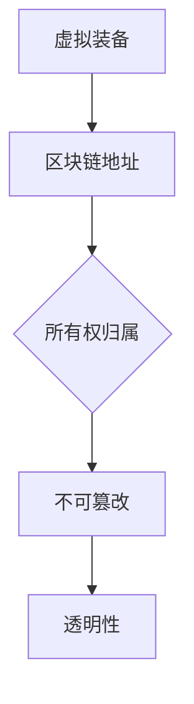
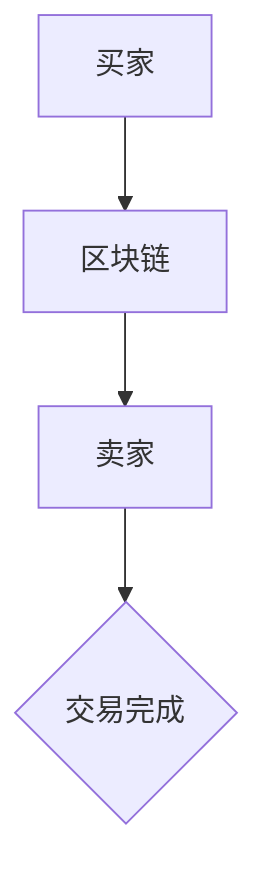
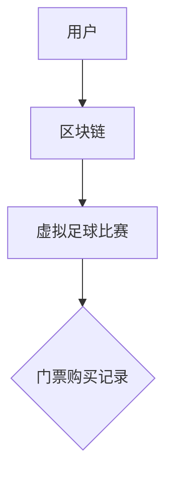
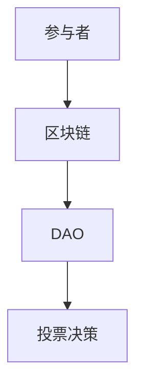
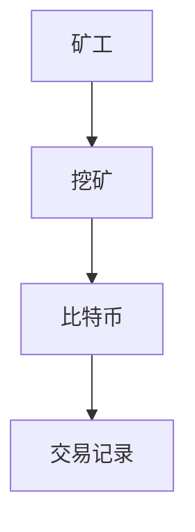
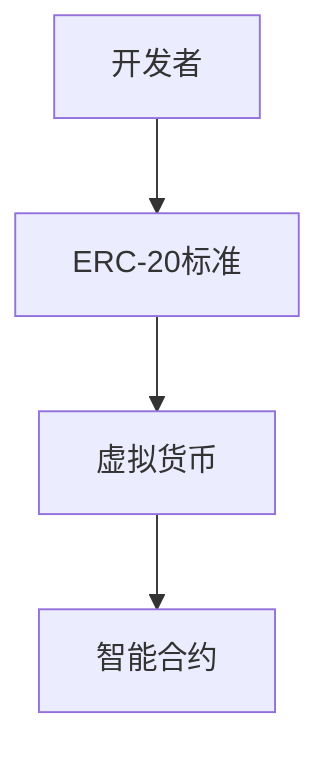

                 

### 《元宇宙体育：虚拟与现实结合的竞技新形式》

> 关键词：元宇宙、虚拟现实、电子竞技、区块链、虚拟经济、体育赛事

> 摘要：本文将深入探讨元宇宙体育这一新兴概念，分析其崛起背景、定义、特征及其在虚拟与现实结合方面的创新。通过介绍虚拟现实技术、区块链技术和虚拟经济体系，本文旨在揭示元宇宙体育的核心技术及其商业潜力。同时，本文还将探讨元宇宙体育的赛事组织与管理、法律法规与伦理问题，并结合实际案例，展望其未来发展。

## 文章标题：元宇宙体育：虚拟与现实结合的竞技新形式

### 摘要

随着科技的迅猛发展，虚拟现实（VR）和电子竞技逐渐融入到我们的日常生活中。元宇宙体育，作为这两者的融合体，正以一种全新的形式改变着传统体育产业。本文旨在探讨元宇宙体育的崛起背景、定义、特征及其在虚拟与现实结合方面的创新。我们将深入分析其核心技术——虚拟现实技术和区块链技术，并探讨虚拟经济体系在其中的作用。此外，本文还将探讨元宇宙体育赛事的组织与管理、面临的法律法规与伦理问题，并通过实际案例研究，展望元宇宙体育的未来发展趋势。

## 第一部分：元宇宙体育的概览

### 第1章：元宇宙体育的崛起与定义

#### 1.1 元宇宙体育的背景与发展

**背景介绍：**

元宇宙体育的崛起，离不开近年来虚拟现实（VR）技术和电子竞技的快速发展。虚拟现实技术为人们提供了沉浸式的体验，而电子竞技则以其高度的竞争性和观赏性，吸引了大量年轻人的关注。这两者的结合，为元宇宙体育的形成奠定了基础。

**发展历程：**

从早期的简单游戏到如今的复杂虚拟世界，元宇宙体育经历了多次技术迭代和商业模式创新。近年来，随着5G、人工智能和区块链等技术的引入，元宇宙体育的发展迎来了新的契机。

#### 1.2 元宇宙体育的定义与特征

**定义：**

元宇宙体育，是指通过虚拟现实技术，将体育竞技与现实世界相结合的一种新型体育形式。它不仅包括虚拟现实中的体育项目，还涵盖了与现实世界体育赛事的联动。

**特征：**

1. **沉浸式体验：** 虚拟现实技术为参与者提供了沉浸式的体验，使他们在虚拟世界中感受到真实的竞技氛围。
2. **高度互动性：** 参与者可以通过虚拟现实设备与其他玩家互动，实现实时竞技。
3. **多样化项目：** 元宇宙体育不仅涵盖了传统的体育项目，还引入了各种虚拟体育项目，如VR跑步、VR篮球等。
4. **全球化参与：** 虚拟现实技术打破了地理限制，使全球的体育爱好者都能参与到元宇宙体育中来。

#### 1.3 元宇宙体育的现状与未来展望

**现状：**

目前，元宇宙体育已经在全球范围内取得了显著的发展。一些知名体育品牌和科技公司，如耐克、索尼等，已经开始涉足这一领域。同时，各种元宇宙体育赛事也应运而生，吸引了大量参与者和观众。

**未来展望：**

随着技术的不断进步和商业模式的创新，元宇宙体育有望成为体育产业的重要组成部分。未来，元宇宙体育将不仅局限于竞技，还可能涉及到教育、娱乐等多个领域。

### 第2章：虚拟与现实结合的竞技新形式

#### 2.1 虚拟竞技场的搭建

**虚拟现实技术的应用：**

虚拟竞技场的搭建，离不开虚拟现实技术的支持。通过VR设备，参与者可以进入一个完全沉浸式的虚拟世界，感受到真实般的竞技氛围。

**虚拟竞技场的体验设计：**

为了提高参与者的体验，虚拟竞技场的体验设计至关重要。这包括场景设计、音效设计、交互设计等多个方面，旨在为参与者带来身临其境的感受。

#### 2.2 现实与虚拟的交互

**虚拟体育与电子竞技的结合：**

虚拟体育与电子竞技的结合，是元宇宙体育的一大创新点。通过电子竞技的平台，虚拟体育赛事可以吸引更多的参与者，实现更广泛的传播。

**现实体育与虚拟技术的融合：**

现实体育与虚拟技术的融合，为体育产业带来了新的可能。例如，通过虚拟现实技术，观众可以在家中观看现场直播，并参与到赛事中来。

#### 2.3 元宇宙体育的商业模式

**虚拟商品与虚拟货币：**

元宇宙体育的商业模式，离不开虚拟商品和虚拟货币。通过虚拟商品的销售，赛事组织者可以获得收入。而虚拟货币的引入，则为参与者提供了更多的互动方式。

**品牌赞助与广告：**

品牌赞助和广告是元宇宙体育商业模式的重要组成部分。通过虚拟竞技场、虚拟商品和虚拟货币等，品牌可以与体育赛事深度绑定，提高品牌曝光度。

### 第二部分：元宇宙体育的核心技术

#### 第3章：虚拟现实技术

**虚拟现实硬件设备：**

虚拟现实硬件设备是元宇宙体育的重要基础。常见的虚拟现实硬件设备包括头戴式显示器、动作捕捉设备等。

**虚拟现实软件技术：**

虚拟现实软件技术，包括渲染引擎、交互技术等，是实现沉浸式体验的关键。通过这些技术，虚拟世界可以更加逼真地呈现给参与者。

#### 第4章：区块链技术

**区块链的基本原理：**

区块链技术是一种分布式数据库技术，通过去中心化的方式，确保数据的可靠性和安全性。

**区块链在元宇宙体育中的应用：**

区块链技术在元宇宙体育中的应用，包括虚拟资产的创建与管理、交易与结算的优化等。

#### 第5章：虚拟经济体系

**虚拟货币的发行与管理：**

虚拟货币是元宇宙体育的重要组成部分。通过虚拟货币的发行与管理，可以促进虚拟经济的发展。

**虚拟商品的价值评估：**

虚拟商品的价值评估，是元宇宙体育商业模式的关键。通过市场需求分析和价值评估方法，可以确定虚拟商品的价值。

### 第三部分：元宇宙体育的实践与应用

#### 第6章：元宇宙体育赛事组织与管理

**赛事策划与推广：**

赛事策划与推广，是元宇宙体育赛事成功的关键。通过合理的策划和推广策略，可以吸引更多的参与者和观众。

**赛事管理：**

赛事管理，包括赛事组织架构、规则制定等。通过科学的管理，可以确保赛事的顺利进行。

#### 第7章：元宇宙体育的法律法规与伦理问题

**法律法规的挑战与应对：**

元宇宙体育的快速发展，给法律法规带来了挑战。通过分析法律法规的挑战与应对，可以为元宇宙体育的发展提供法律保障。

**伦理问题的探讨：**

元宇宙体育的快速发展，也引发了一些伦理问题。通过探讨伦理问题，可以为元宇宙体育的发展提供道德指导。

### 第8章：元宇宙体育的案例研究

**国内外元宇宙体育的成功案例：**

通过分析国内外元宇宙体育的成功案例，可以了解其商业模式、技术创新等方面的经验。

**案例分析：商业模式与创新点：**

对成功案例进行深入分析，可以揭示元宇宙体育的商业模式和创新点。

**案例启示：未来的发展方向：**

通过案例研究，可以展望元宇宙体育未来的发展方向。

### 附录

**附录A：元宇宙体育相关资源与工具：**

介绍元宇宙体育相关的资源与工具，包括虚拟现实开发工具、区块链开发平台、元宇宙体育平台等。

### 作者信息

**作者：AI天才研究院/AI Genius Institute & 禅与计算机程序设计艺术 /Zen And The Art of Computer Programming**### 第一部分：元宇宙体育的概览

#### 第1章：元宇宙体育的崛起与定义

##### 1.1 元宇宙体育的背景与发展

**背景介绍：**

随着科技的迅猛发展，尤其是虚拟现实（VR）和电子竞技的崛起，元宇宙体育逐渐成为体育产业的新宠。虚拟现实技术为人们提供了全新的沉浸式体验，而电子竞技则以其高度的互动性和竞技性吸引了大量年轻人。这两者的融合，使得元宇宙体育应运而生。

**发展历程：**

元宇宙体育的发展历程可以追溯到20世纪90年代，当时虚拟现实技术和电子竞技开始崭露头角。随着技术的不断进步，尤其是近年来5G、人工智能和区块链等新兴技术的应用，元宇宙体育迎来了快速发展的新契机。

在早期的探索阶段，元宇宙体育主要以简单的虚拟游戏为主。随着技术的进步，虚拟现实场景逐渐变得更加复杂和真实，虚拟体育项目的种类也日益丰富。此外，电子竞技的兴起，使得虚拟竞技场成为可能，为元宇宙体育的发展奠定了基础。

近年来，随着区块链技术的引入，元宇宙体育开始进入一个新的发展阶段。区块链技术为元宇宙体育提供了去中心化的平台，使得虚拟资产的管理和交易更加透明和安全。同时，虚拟现实技术的不断突破，也为元宇宙体育带来了更加沉浸式的体验。

##### 1.2 元宇宙体育的定义与特征

**定义：**

元宇宙体育，是指利用虚拟现实、增强现实、电子竞技等技术与传统体育项目相结合，打造的一种全新的体育形式。它不仅包括虚拟现实中的体育项目，还涵盖了与现实世界体育赛事的联动，实现虚拟与现实的无缝衔接。

**特征：**

1. **沉浸式体验：** 通过虚拟现实技术，参与者可以在虚拟世界中体验到高度沉浸的体育竞技场景，感受到真实般的竞技氛围。
2. **高度互动性：** 元宇宙体育通过虚拟竞技场和电子竞技平台，实现了参与者之间的实时互动，增强了比赛的观赏性和参与感。
3. **多样化项目：** 元宇宙体育涵盖了各类传统体育项目和新兴的虚拟体育项目，如VR跑步、VR篮球、VR足球等，为参与者提供了丰富的选择。
4. **全球化参与：** 虚拟现实技术打破了地理限制，使得全球的体育爱好者都可以参与到元宇宙体育中来，促进了体育文化的全球化传播。

##### 1.3 元宇宙体育的现状与未来展望

**现状：**

目前，元宇宙体育在全球范围内已经取得了显著的进展。一些知名体育品牌和科技公司，如耐克、索尼、微软等，已经开始积极布局元宇宙体育领域。同时，各种元宇宙体育赛事也应运而生，如NBA 2K联赛、ESL电子竞技联赛等，吸引了大量参与者和观众。

在商业模式方面，元宇宙体育也展现出了强大的潜力。虚拟商品、虚拟货币、品牌赞助和广告等成为了元宇宙体育的主要收入来源。例如，虚拟商品的销售，包括虚拟装备、虚拟门票等，为赛事组织者带来了可观的收入。而虚拟货币的引入，则为参与者提供了更多的互动方式和交易手段。

**未来展望：**

随着技术的不断进步和商业模式的不断创新，元宇宙体育有望成为体育产业的重要组成部分。未来，元宇宙体育将不仅局限于竞技，还可能涉及到教育、娱乐、社交等多个领域。

1. **技术进步：** 随着5G、人工智能、大数据等技术的进一步发展，元宇宙体育的沉浸式体验将更加真实，互动性将更加紧密。
2. **商业模式创新：** 元宇宙体育的商业模式将不断创新，虚拟商品、虚拟货币、品牌赞助等将更加多元化，为参与者提供更多的价值。
3. **全球化发展：** 随着全球化的推进，元宇宙体育将吸引更多国家和地区的参与，促进体育文化的全球化传播。

总的来说，元宇宙体育作为一种新兴的体育形式，具有巨大的发展潜力和市场前景。通过不断的技术创新和商业模式探索，元宇宙体育有望在未来的体育产业中占据重要地位。### 第2章：虚拟与现实结合的竞技新形式

##### 2.1 虚拟竞技场的搭建

**虚拟现实技术的应用：**

虚拟竞技场的搭建，依赖于虚拟现实技术的支持。虚拟现实技术通过头戴式显示器（HMD）、动作捕捉设备、传感器等硬件设备，为参与者提供了沉浸式的体验。在虚拟竞技场中，参与者可以身临其境地感受到体育比赛的氛围，与虚拟对手进行竞技。

**虚拟竞技场的体验设计：**

虚拟竞技场的体验设计至关重要，它直接影响参与者的沉浸感和参与度。在体验设计过程中，需要考虑以下几个方面：

1. **场景设计：** 虚拟竞技场应具备真实感，包括场景的视觉效果、音效设计、光照效果等。通过高质量的场景渲染，使参与者能够身临其境地感受到竞技环境。
2. **交互设计：** 虚拟竞技场应提供丰富的交互方式，包括手势识别、语音识别等。参与者可以通过这些交互方式与虚拟世界进行互动，增强参与感。
3. **竞赛规则：** 虚拟竞技场需要设计合理的竞赛规则，以保证比赛的公平性和竞争性。竞赛规则应结合体育项目的特点，同时考虑虚拟环境的特殊要求。

**案例分析：**

以VR篮球为例，虚拟竞技场的设计应包括真实的篮球场、篮筐、球员模型等。参与者通过头戴式显示器进入虚拟篮球场，使用手柄或手势进行操作，与虚拟对手进行对抗。在比赛过程中，系统会实时渲染比赛场景，并记录参与者的得分、篮板等数据，以评价比赛结果。

##### 2.2 现实与虚拟的交互

**虚拟体育与电子竞技的结合：**

虚拟体育与电子竞技的结合，是元宇宙体育的一大创新点。电子竞技平台为虚拟体育提供了广泛的参与渠道和竞技环境，而虚拟体育则为电子竞技带来了更多的竞技内容和玩法。

**虚拟体育与电子竞技的结合方式：**

1. **赛事联动：** 通过虚拟体育赛事与电子竞技赛事的联动，可以实现虚拟与现实的无缝衔接。例如，在电子竞技比赛中，参赛者可以通过虚拟体育项目进行热身或训练。
2. **跨平台互动：** 电子竞技平台和虚拟体育平台可以相互连通，参与者可以在不同的平台上进行互动。例如，虚拟篮球比赛可以与电子竞技平台进行跨平台赛事，吸引更多观众参与。
3. **虚拟选手：** 虚拟体育项目中，可以引入虚拟选手与真人选手进行对抗。通过虚拟现实技术，虚拟选手可以具备逼真的动作和表现，与真人选手进行高度逼真的竞技。

**案例分析：**

以NBA 2K联赛为例，这是一项结合了虚拟体育和电子竞技的赛事。参赛者可以通过NBA 2K游戏平台进行虚拟篮球比赛，通过电子竞技平台进行实时对战。比赛过程中，系统会实时渲染比赛场景，并记录参赛者的得分、篮板等数据。同时，NBA 2K联赛还引入了虚拟选手，与真人选手进行对抗，增加了比赛的趣味性和观赏性。

**现实体育与虚拟技术的融合：**

现实体育与虚拟技术的融合，为传统体育产业带来了新的可能。通过虚拟现实技术，观众可以在家中观看现场直播，并参与到赛事中来。

**融合方式：**

1. **虚拟观赛：** 通过虚拟现实技术，观众可以在虚拟环境中观看体育赛事。观众可以选择不同的视角，如球员视角、观众视角等，获得独特的观赛体验。
2. **虚拟互动：** 虚拟现实技术可以为观众提供互动体验，如投票、评论等。观众可以通过虚拟互动，与赛事进行深度互动。
3. **虚拟训练：** 虚拟现实技术可以为运动员提供虚拟训练环境，帮助运动员进行模拟训练，提高训练效果。

**案例分析：**

以虚拟足球比赛为例，观众可以通过虚拟现实设备在家中观看比赛，并获得不同的视角。观众还可以通过虚拟互动，与比赛进行深度互动，如投票支持喜欢的球队、发表评论等。此外，足球运动员也可以通过虚拟现实技术进行虚拟训练，模拟比赛场景，提高比赛表现。

##### 2.3 元宇宙体育的商业模式

**虚拟商品与虚拟货币：**

虚拟商品和虚拟货币是元宇宙体育商业模式的重要组成部分。通过虚拟商品和虚拟货币的引入，可以促进虚拟经济的发展，提高参与者的参与度和粘性。

**虚拟商品：**

虚拟商品包括虚拟装备、虚拟门票、虚拟纪念品等。虚拟装备可以为参与者提供更好的竞技表现，如VR篮球中的篮球鞋、VR足球中的球衣等。虚拟门票则可以为赛事组织者带来收入，同时为参与者提供观赛的便利。

**虚拟货币：**

虚拟货币是元宇宙体育中的交易媒介，可以为参与者提供更多的互动方式和交易手段。虚拟货币的引入，可以促进虚拟商品和服务的交易，提高市场的流动性。

**案例分析：**

以虚拟足球比赛为例，参与者可以通过虚拟货币购买虚拟装备，提高比赛表现。同时，赛事组织者可以通过虚拟货币销售虚拟门票，提高赛事的收入。此外，参与者还可以通过虚拟货币进行虚拟商品和服务的交易，如购买虚拟纪念品、虚拟训练服务等。

**品牌赞助与广告：**

品牌赞助和广告是元宇宙体育商业模式的重要收入来源。通过虚拟竞技场、虚拟商品和虚拟货币等，品牌可以与体育赛事深度绑定，提高品牌曝光度。

**赞助方式：**

1. **虚拟装备赞助：** 品牌可以赞助虚拟装备，如VR篮球中的篮球鞋、VR足球中的球衣等，提高品牌知名度。
2. **虚拟广告：** 品牌可以在虚拟竞技场、虚拟商品和虚拟货币交易平台上进行广告投放，提高品牌曝光度。
3. **虚拟活动赞助：** 品牌可以赞助虚拟体育赛事的举办，如虚拟足球比赛、VR篮球比赛等，提高品牌影响力。

**案例分析：**

以虚拟足球比赛为例，某运动品牌可以赞助虚拟足球比赛中的球员装备，如球衣、球鞋等。同时，该品牌还可以在虚拟竞技场中进行广告投放，提高品牌知名度。此外，该品牌还可以赞助虚拟足球比赛的举办，提高品牌影响力。

总的来说，元宇宙体育的商业模式是通过虚拟商品、虚拟货币、品牌赞助和广告等多种方式实现的。通过这些方式，元宇宙体育可以为参与者提供丰富的互动体验，为品牌提供高效的营销渠道，为体育产业带来新的发展机遇。### 第二部分：元宇宙体育的核心技术

#### 第3章：虚拟现实技术

##### 3.1 虚拟现实硬件设备

**虚拟现实硬件设备概述：**

虚拟现实（VR）硬件设备是元宇宙体育的重要基础，它决定了参与者在虚拟世界中的沉浸体验。主要的VR硬件设备包括：

1. **头戴式显示器（HMD）：** 头戴式显示器是VR设备的核心，它通常包括一个显示屏、一对耳机和一个头带。通过覆盖眼睛的显示屏，用户可以看到虚拟世界中的图像，而耳机则提供三维音效，增强沉浸感。

2. **动作捕捉设备：** 动作捕捉设备用于记录和跟踪参与者的身体动作，将其转换为虚拟角色在虚拟环境中的动作。常见的动作捕捉设备包括全身动作捕捉服、手部动作捕捉手套等。

3. **手柄和控制器：** VR手柄和控制器允许用户在虚拟环境中进行交互，例如移动、投掷物体或操作虚拟设备。这些控制器通常配备有传感器，能够精确地跟踪用户的手部动作。

4. **VR座椅和运动平台：** VR座椅和运动平台提供额外的物理反馈，增强沉浸体验。运动平台可以在用户进行虚拟运动时模拟真实的物理效果，如加速、减速或倾斜。

**硬件设备的性能要求：**

为了提供优质的沉浸体验，虚拟现实硬件设备需要满足以下性能要求：

- **高分辨率显示：** 高分辨率显示器可以提供更清晰的图像，减少视觉失真。
- **低延迟：** 延迟时间越低，用户的动作响应越及时，沉浸体验越好。
- **舒适的佩戴体验：** 长时间的佩戴需要设备具有良好的舒适性和重量分布。

##### 3.2 虚拟现实软件技术

**渲染引擎：**

渲染引擎是虚拟现实软件技术的核心，它负责生成和渲染虚拟环境中的图像。常见的渲染引擎包括Unity、Unreal Engine等。这些引擎提供了丰富的工具和功能，如3D建模、动画制作、光照效果等，帮助开发人员创建逼真的虚拟世界。

**交互技术：**

虚拟现实中的交互技术是实现沉浸体验的关键。交互技术包括：

- **手势识别：** 手势识别技术通过摄像头和传感器跟踪用户的手部动作，允许用户在虚拟环境中进行手势操作。
- **语音识别：** 语音识别技术允许用户通过语音与虚拟环境进行交互，如发布指令、询问信息等。
- **眼球跟踪：** 眼球跟踪技术可以跟踪用户的眼球运动，提供更加自然的交互体验。

**虚拟现实软件技术的工作原理：**

虚拟现实软件技术的工作原理主要包括以下几个步骤：

1. **场景建模：** 开发人员使用3D建模工具创建虚拟环境的场景和对象。
2. **动画制作：** 动画制作工具用于创建角色的动作和场景的变化。
3. **光照和渲染：** 渲染引擎根据光照和材质参数渲染场景，生成最终图像。
4. **交互处理：** 软件处理用户的输入，如手势、语音等，并更新虚拟环境中的对象和场景。

**案例分析：**

以Unity引擎为例，Unity提供了强大的3D建模、动画和渲染功能，使得开发人员可以轻松创建复杂的虚拟场景。Unity中的C#脚本允许开发人员编写交互逻辑，实现用户与虚拟环境的互动。例如，用户可以通过手柄或手势在虚拟篮球场中移动、跳跃和投篮。

```csharp
// C#脚本示例：控制虚拟角色移动
public class PlayerMovement : MonoBehaviour
{
    public float speed = 5.0f;

    private void Update()
    {
        float horizontal = Input.GetAxis("Horizontal");
        float vertical = Input.GetAxis("Vertical");

        Vector3 moveDirection = new Vector3(horizontal, 0, vertical);
        transform.position += moveDirection * speed * Time.deltaTime;
    }
}
```

这个简单的脚本实现了用户通过手柄控制虚拟角色的移动，为元宇宙体育提供了基础交互功能。

##### 3.3 虚拟现实技术在元宇宙体育中的应用

**沉浸式体验设计：**

虚拟现实技术在元宇宙体育中的应用，主要集中在提供沉浸式体验。通过高分辨率显示器、低延迟的交互技术和逼真的场景渲染，参与者在虚拟竞技场中可以感受到真实的竞技氛围。

**案例分析：**

以VR跑步为例，参与者通过头戴式显示器和动作捕捉设备进入虚拟跑步环境。系统实时渲染跑步场景，并跟踪参与者的跑步动作。参与者可以通过手柄或手势进行交互，如调整跑步速度、选择跑道等。这种沉浸式体验不仅提高了参与者的积极性，也增强了比赛的互动性和观赏性。

**实时交互：**

虚拟现实技术的实时交互功能，使得参与者和虚拟环境之间的互动更加紧密。通过手势识别、语音识别等技术，参与者可以自然地与虚拟环境进行交流，增强了参与感和互动性。

**案例分析：**

在VR篮球比赛中，参与者可以通过手势识别技术进行传球、投篮等操作。系统实时渲染比赛场景，并记录参与者的得分、篮板等数据。这种实时交互功能，使得参与者可以与队友和对手进行实时互动，增强了比赛的紧张感和竞争性。

**虚拟与现实的融合：**

虚拟现实技术不仅可以提供沉浸式的虚拟体验，还可以与现实世界进行融合。通过虚拟现实设备，观众可以在家中观看现场直播，并参与到虚拟互动中。同时，运动员也可以通过虚拟训练系统进行训练，提高比赛表现。

**案例分析：**

以虚拟足球比赛为例，观众可以通过头戴式显示器在家中观看比赛，并获得不同的视角。观众还可以通过虚拟互动，与比赛进行深度互动，如投票支持喜欢的球队、发表评论等。此外，足球运动员可以通过虚拟训练系统进行模拟训练，提高比赛表现。

总的来说，虚拟现实技术是元宇宙体育的核心技术之一，它为参与者提供了沉浸式的体验、实时的交互功能，并实现了虚拟与现实的融合。通过不断的技术创新和应用，虚拟现实技术将为元宇宙体育的发展提供强大的支持。### 第4章：区块链技术

##### 4.1 区块链的基本原理

**区块链的定义：**

区块链是一种分布式数据库技术，其特点是去中心化、不可篡改和透明性。区块链通过一系列数据块链接在一起，形成一个不断增长的链式结构。每个数据块包含一定数量的交易记录，并通过密码学算法确保数据的安全性和完整性。

**区块链的工作机制：**

区块链的工作机制主要包括以下几个关键组成部分：

1. **共识算法：** 共识算法是区块链网络中节点达成一致的关键机制。常见的共识算法包括工作量证明（PoW）、权益证明（PoS）和委托权益证明（DPoS）等。这些算法确保了区块链网络中的节点能够达成一致，并防止双花攻击。

2. **分布式账本：** 区块链通过分布式账本记录所有的交易记录。每个节点都保存了一份完整的区块链副本，确保了数据的去中心化和不可篡改性。

3. **加密技术：** 区块链使用加密技术保护数据的安全性和隐私。每个交易记录都使用公钥和私钥进行加密，只有拥有对应私钥的节点才能解密和验证交易。

**区块链的优缺点：**

**优点：**

- **去中心化：** 区块链去中心化的特点，使得数据存储和交易处理不再依赖于中心化的机构，提高了系统的可靠性和抗攻击性。
- **不可篡改性：** 区块链一旦记录数据，就几乎无法篡改，确保了数据的真实性和完整性。
- **透明性：** 区块链的所有交易记录都是公开透明的，任何节点都可以查看和验证交易。

**缺点：**

- **性能瓶颈：** 传统区块链系统由于采用共识算法，如PoW，导致交易处理速度较慢，难以满足大规模交易的需求。
- **能源消耗：** 一些共识算法，如PoW，需要大量的计算资源，导致能源消耗较高。

##### 4.2 区块链在元宇宙体育中的应用

**虚拟资产的创建与管理：**

在元宇宙体育中，虚拟资产（如虚拟货币、虚拟装备、虚拟门票等）是重要组成部分。区块链技术可以用于虚拟资产的创建、管理和交易，确保其安全性和透明性。

**案例分析：**

以虚拟装备为例，元宇宙体育中的虚拟装备可以通过区块链技术进行创建和管理。每个虚拟装备都有一个独特的区块链地址，用于标识其所有权和属性。当用户购买虚拟装备时，交易记录会被永久记录在区块链上，确保了装备的所有权归属。



**交易与结算的优化：**

区块链技术可以提高元宇宙体育中的交易和结算效率。通过去中心化的方式，交易不再需要经过中心化的第三方机构，减少了交易环节和成本。

**案例分析：**

在虚拟货币交易中，区块链技术可以确保交易的快速和安全性。例如，比特币和以太坊等加密货币就是基于区块链技术进行交易的。用户可以直接在区块链上进行点对点的交易，避免了传统金融系统中的中间环节，提高了交易效率。



**案例分析：**

以虚拟足球比赛门票为例，用户可以通过区块链购买门票，确保门票的真实性和有效性。当用户购买门票时，交易记录会被永久记录在区块链上，门票的所有权和持有状态都可以被验证。



**去中心化自治组织（DAO）：**

区块链技术还可以用于建立去中心化自治组织（DAO），用于管理和决策元宇宙体育的相关事务。DAO使得参与者可以直接参与到组织的管理和决策中，提高了透明度和公平性。

**案例分析：**

以虚拟体育赛事的管理为例，DAO可以用于决定赛事的举办时间、地点和规则等。所有参与者都可以通过区块链投票，决定赛事的具体细节。这种去中心化的管理模式，确保了决策过程的透明和公正。



总的来说，区块链技术为元宇宙体育提供了安全、透明和高效的基础设施，促进了虚拟资产的管理、交易和自治。通过不断的技术创新和应用，区块链将在元宇宙体育中发挥越来越重要的作用。### 第5章：虚拟经济体系

##### 5.1 虚拟货币的发行与管理

**虚拟货币的发行：**

虚拟货币是元宇宙体育中重要的交易媒介和数字资产。虚拟货币的发行通常通过以下几种方式：

1. **初始代币发行（ICO）：** ICO是一种通过发行新代币来筹集资金的方式。投资者购买代币，以支持项目的开发和推广。ICO通常基于区块链技术，确保交易的安全性和透明性。

2. **交易所发行：** 一些加密货币交易所会发行自己的虚拟货币，用于交易所内的交易和支付。交易所发行的虚拟货币通常具有较高的流动性和接受度。

3. **社区挖矿：** 一些虚拟货币项目会通过社区挖矿的方式发行新货币。社区成员可以通过参与网络维护和交易验证，获得虚拟货币奖励。

**虚拟货币的管理：**

虚拟货币的管理包括发行、流通、交易和监管等方面。以下是一些关键的管理措施：

1. **智能合约：** 智能合约是一种自动执行合同条款的计算机程序。在虚拟货币管理中，智能合约可以用于确保交易的合法性和安全性，如自动处理交易费用和分红。

2. **去中心化交易所：** 去中心化交易所（DEX）不依赖中心化平台进行交易，通过区块链网络直接进行点对点交易，提高了交易的安全性和透明性。

3. **监管合规：** 随着虚拟货币的普及，各国政府和监管机构开始加强对虚拟货币的监管。虚拟货币项目需要遵守相关法律法规，确保交易的合法性和透明性。

**案例分析：**

以比特币为例，比特币是一种去中心化的虚拟货币，其发行和管理完全基于区块链技术。比特币通过挖矿过程发行，矿工通过解决数学难题验证交易，并获得比特币奖励。比特币的交易记录被永久记录在区块链上，确保了交易的透明性和不可篡改性。



**比特币的工作原理：**

比特币的工作原理包括以下几个关键步骤：

1. **交易验证：** 每个比特币交易都需要经过矿工的验证。矿工通过解决数学难题，验证交易的有效性，并将交易记录在区块链上。

2. **区块链记录：** 验证后的交易记录会被添加到区块链中，形成一个连续的区块链。每个区块都包含一定数量的交易记录，并通过加密算法与前一区块链接。

3. **分布式账本：** 区块链网络中的每个节点都保存了一份完整的区块链副本，确保了数据的分布式存储和去中心化。

**比特币的安全性和去中心化：**

比特币的安全性主要依赖于区块链技术和加密算法。区块链通过分布式存储和加密算法，确保了交易记录的不可篡改性和安全性。同时，比特币的去中心化特点，使得任何节点都无法控制或篡改区块链数据。

**案例分析：**

以太坊是另一种流行的虚拟货币和区块链平台。以太坊不仅支持加密货币交易，还支持智能合约和去中心化应用程序（DApps）。以太坊通过ERC-20标准，允许开发者发行和管理新的虚拟货币。



**ERC-20标准的工作原理：**

ERC-20标准是一种用于创建和管理以太坊上虚拟货币的协议。它定义了一套标准化的接口和功能，使得虚拟货币可以与其他以太坊钱包和去中心化交易所兼容。

1. **总供应量：** ERC-20标准要求虚拟货币有一个固定的总供应量，以确保货币的价值稳定。

2. **余额查询：** ERC-20标准允许以太坊钱包查询特定地址的虚拟货币余额。

3. **转账：** ERC-20标准支持虚拟货币在不同地址之间的转账，通过调用智能合约函数实现。

```solidity
// ERC-20标准示例：虚拟货币转账
pragma solidity ^0.8.0;

contract ERC20 {
    string public name;
    string public symbol;
    uint8 public decimals;
    uint256 public totalSupply;
    mapping(address => uint256) public balanceOf;

    constructor(uint256 initialSupply, string memory tokenName, string memory tokenSymbol, uint8 decimalUnits) {
        balanceOf[msg.sender] = initialSupply;
        totalSupply = initialSupply;
        name = tokenName;
        symbol = tokenSymbol;
        decimals = decimalUnits;
    }

    function transfer(address _to, uint256 _value) public returns (bool success) {
        require(_to != address(0));
        require(balanceOf[msg.sender] >= _value);
        balanceOf[msg.sender] -= _value;
        balanceOf[_to] += _value;
        emit Transfer(msg.sender, _to, _value);
        return true;
    }
}
```

这个简单的智能合约实现了虚拟货币的转账功能，通过调用`transfer`函数，可以实现从发送地址向接收地址转账虚拟货币。

总的来说，虚拟货币是元宇宙体育中不可或缺的一部分。通过区块链技术和加密算法，虚拟货币提供了安全、透明和去中心化的交易媒介。随着虚拟经济体系的不断完善，虚拟货币将在元宇宙体育中发挥越来越重要的作用。### 第6章：元宇宙体育赛事组织与管理

##### 6.1 赛事策划与推广

**赛事策划的核心要素：**

赛事策划是元宇宙体育赛事成功的关键。以下是赛事策划的核心要素：

1. **项目定位：** 明确赛事的目标和定位，如竞技性、娱乐性或教育性等。项目定位将直接影响赛事的受众和营销策略。

2. **赛事规则：** 设计合理的赛事规则，确保比赛的公平性和竞争性。规则应考虑虚拟现实环境的特点，如互动性、场景设定等。

3. **参赛资格：** 确定参赛者的资格要求，如年龄、技术水平等。虚拟竞技场应提供多种难度级别的比赛，以满足不同参赛者的需求。

4. **比赛形式：** 确定比赛形式，如单人赛、团队赛或混合赛等。比赛形式应灵活多样，以增加比赛的趣味性和参与度。

5. **宣传推广：** 制定有效的宣传推广策略，包括线上和线下的营销活动、社交媒体宣传、合作伙伴关系等。

**赛事推广的策略：**

1. **社交媒体：** 利用社交媒体平台，如微博、微信、Twitter、Instagram等，进行赛事宣传。通过发布赛事预告、比赛精彩瞬间、选手采访等内容，吸引粉丝关注。

2. **线上活动：** 组织线上活动，如直播、互动游戏、抽奖等，增加参与者的互动体验。线上活动可以吸引新用户，提高赛事的曝光度。

3. **合作伙伴：** 寻找合适的合作伙伴，如体育品牌、科技企业等，共同推广赛事。合作伙伴可以提供资源支持，如赞助、技术支持等，共同打造具有影响力的赛事。

4. **线下活动：** 组织线下活动，如赛事发布会、粉丝见面会、训练营等，增强与粉丝的互动。线下活动可以提高赛事的知名度和参与度。

**案例分析：**

以虚拟足球比赛为例，赛事策划者需要明确比赛的目标，如竞技性、娱乐性或教育性等。赛事规则应确保比赛的公平性和竞争性，如设置不同的比赛场景、时间限制等。参赛资格方面，赛事可以设立不同的难度级别，以满足不同参赛者的需求。

在宣传推广方面，赛事策划者可以通过社交媒体发布赛事预告、比赛精彩瞬间、选手采访等内容，吸引粉丝关注。同时，组织线上活动，如直播、互动游戏、抽奖等，增加参与者的互动体验。线下活动方面，可以组织赛事发布会、粉丝见面会、训练营等，增强与粉丝的互动。

**赛事管理：**

**赛事组织架构：**

赛事组织架构是确保赛事顺利进行的关键。常见的赛事组织架构包括：

1. **组委会：** 组委会是赛事的最高决策机构，负责制定赛事规划、管理赛事资源、协调各方关系等。

2. **技术团队：** 技术团队负责赛事的技术支持，包括虚拟现实设备、网络环境、数据分析等。

3. **赛事运营团队：** 赛事运营团队负责赛事的日常运营，包括报名管理、赛事安排、现场管理等。

4. **市场推广团队：** 市场推广团队负责赛事的宣传推广、合作伙伴关系、赞助商管理等。

**规则制定：**

赛事规则是确保比赛公平性和竞争性的基础。以下是赛事规则制定的关键要素：

1. **比赛规则：** 包括比赛形式、比赛时间、比赛场景等，确保比赛的公平性和竞争性。

2. **竞赛纪律：** 规定竞赛纪律，如禁止作弊、禁止不正当手段获得优势等。

3. **处罚措施：** 明确违规行为的处罚措施，如警告、取消比赛资格、禁赛等。

**案例分析：**

以虚拟篮球比赛为例，赛事组织者需要制定详细的比赛规则，如比赛时间、比赛场景、球员行为准则等。比赛规则应考虑虚拟环境的特点，如动作捕捉的准确性、场景交互的限制等。同时，需要制定竞赛纪律，如禁止使用外挂程序、禁止利用游戏漏洞等。对于违规行为，应明确相应的处罚措施，如警告、取消比赛资格、禁赛等。

**案例分析：**

以NBA 2K联赛为例，NBA 2K联赛是元宇宙体育领域的一项成功案例。NBA 2K联赛由NBA 2K游戏开发商2K Games主办，吸引了大量篮球爱好者参与。在赛事组织架构方面，NBA 2K联赛设有组委会、技术团队、赛事运营团队和市场推广团队等。在规则制定方面，NBA 2K联赛制定了详细的比赛规则，包括比赛时间、比赛场景、球员行为准则等，确保比赛的公平性和竞争性。同时，NBA 2K联赛还设有严格的竞赛纪律和处罚措施，确保赛事的顺利进行。

**赛事运营的挑战与应对策略：**

**挑战：**

1. **技术挑战：** 虚拟现实技术的不成熟可能导致比赛体验不佳，影响赛事的吸引力。

2. **参与度挑战：** 提高参与者的参与度，确保赛事的可持续发展。

3. **安全与隐私挑战：** 确保赛事数据的安全性和参与者的隐私保护。

**应对策略：**

1. **技术升级：** 持续关注和引入最新的虚拟现实技术，提高赛事的沉浸体验。

2. **互动设计：** 通过设计有趣的互动环节和活动，提高参与者的参与度。

3. **数据安全：** 采用先进的数据加密和安全措施，确保赛事数据的安全性和参与者的隐私保护。

总的来说，元宇宙体育赛事的组织与管理需要考虑多方面的因素，包括赛事策划、推广、规则制定和技术支持等。通过合理的规划和有效的管理，可以确保赛事的成功举办，吸引更多的参与者，推动元宇宙体育的可持续发展。### 第7章：元宇宙体育的法律法规与伦理问题

##### 7.1 法律法规的挑战与应对

随着元宇宙体育的快速发展，其在法律层面面临了一系列挑战。以下是一些主要挑战以及相应的应对策略：

**虚拟财产的法律地位：**

**挑战：**

元宇宙体育中的虚拟财产（如虚拟装备、虚拟货币等）与传统财产存在显著差异。传统法律体系对于虚拟财产的法律地位、所有权和交易等问题尚缺乏明确规定。

**应对策略：**

1. **制定相关法规：** 各国政府和监管机构应制定专门针对虚拟财产的法律，明确其法律地位和交易规则，确保虚拟财产的合法权益。

2. **跨国合作：** 鉴于虚拟财产的跨国交易特性，国际社会应加强合作，制定统一的虚拟财产法律框架，提高跨境交易的合法性和安全性。

**虚拟欺诈的法律责任：**

**挑战：**

虚拟欺诈行为在元宇宙体育中屡见不鲜，如虚拟装备盗用、虚拟货币诈骗等。这些行为难以受到传统法律的有效打击。

**应对策略：**

1. **加强监管：** 监管机构应加强对元宇宙体育市场的监管，建立虚拟财产交易监测系统，及时发现和处理欺诈行为。

2. **刑法完善：** 完善刑法规定，明确虚拟欺诈的法律责任，提高犯罪成本，有效遏制虚拟欺诈行为。

**知识产权保护：**

**挑战：**

元宇宙体育中的虚拟资产（如虚拟装备、虚拟场景等）涉及大量的知识产权保护问题。现有法律体系在知识产权保护方面尚存在不足。

**应对策略：**

1. **知识产权法完善：** 完善知识产权法律体系，加强对虚拟资产的知识产权保护，确保创作者的合法权益。

2. **版权登记：** 鼓励虚拟资产创作者进行版权登记，提供法律依据，提高知识产权保护水平。

**数据隐私保护：**

**挑战：**

元宇宙体育涉及大量的用户数据收集和处理，如用户行为数据、虚拟财产交易记录等。数据隐私保护成为一大挑战。

**应对策略：**

1. **数据保护法完善：** 制定专门的数据保护法律，明确数据收集、处理和使用的规则，确保用户数据的隐私和安全。

2. **加密技术：** 利用先进的加密技术，保护用户数据在传输和存储过程中的安全性。

##### 7.2 伦理问题的探讨

**虚拟竞技的公平性：**

**挑战：**

虚拟竞技中的公平性问题备受关注，如虚拟装备的优劣、游戏平衡性等。不公平的竞技环境可能导致用户流失和信任危机。

**应对策略：**

1. **公平竞赛规则：** 制定严格的公平竞赛规则，确保虚拟竞技环境的公平性。

2. **监管机制：** 建立独立的监管机构，对虚拟竞技进行监督和管理，确保规则得到严格执行。

**虚拟沉迷的社会影响：**

**挑战：**

元宇宙体育的沉浸式体验可能引发虚拟沉迷问题，影响用户的身心健康，甚至对现实生活产生负面影响。

**应对策略：**

1. **教育引导：** 加强对用户的引导和教育，提高用户对虚拟沉迷的自我管理意识。

2. **时间限制：** 设定合理的时间限制，防止用户过度沉迷于虚拟竞技。

**虚拟道德规范：**

**挑战：**

元宇宙体育中缺乏明确的道德规范，可能导致一系列道德问题，如网络暴力、歧视行为等。

**应对策略：**

1. **制定道德规范：** 制定明确的虚拟道德规范，引导用户文明参与虚拟竞技。

2. **技术手段：** 利用人工智能和大数据等技术手段，监控和预防网络暴力、歧视行为等。

总的来说，元宇宙体育的法律法规和伦理问题具有重要意义。通过完善法律法规、加强监管和引导教育，可以促进元宇宙体育的健康发展，保障用户的合法权益。同时，通过建立道德规范和技术手段，可以有效应对虚拟竞技中的道德挑战，提高虚拟社会的整体道德水平。### 第8章：元宇宙体育的案例研究

##### 8.1 国内外元宇宙体育的成功案例

**国内案例：**

**1. 腾讯VR篮球联赛**

腾讯VR篮球联赛是国内首个大型虚拟现实篮球联赛，通过虚拟现实技术，为参与者提供沉浸式的竞技体验。该联赛吸引了大量篮球爱好者和专业选手参与，形成了庞大的用户群体。腾讯VR篮球联赛的成功，不仅提升了虚拟现实技术在体育领域的应用，还为元宇宙体育的商业化探索提供了宝贵的经验。

**2. 网易《逆水寒》虚拟体育**

网易旗下的《逆水寒》虚拟体育项目，通过将武侠元素与虚拟现实技术相结合，打造了一个独特的虚拟体育世界。玩家可以在游戏中进行多种体育活动，如武术、射箭等。该项目凭借其独特的文化特色和高质量的虚拟体验，吸引了大量玩家，成为国内虚拟体育领域的领先者。

**国际案例：**

**1. NBA 2K联赛**

NBA 2K联赛是由NBA官方授权的电子竞技联赛，采用NBA 2K游戏作为竞技平台。该联赛吸引了众多专业选手和业余爱好者参与，成为全球最大的篮球电子竞技赛事之一。NBA 2K联赛的成功，不仅提升了篮球电子竞技的知名度，也为元宇宙体育的发展提供了范例。

**2. FIFA Online 4电子竞技联赛**

FIFA Online 4电子竞技联赛是由EA Sports推出的足球电子竞技赛事。该联赛吸引了全球范围内的足球爱好者参与，通过虚拟现实技术，为参与者提供了沉浸式的足球体验。FIFA Online 4电子竞技联赛的成功，证明了虚拟体育项目在电子竞技领域的巨大潜力。

##### 8.2 案例分析：商业模式与创新点

**腾讯VR篮球联赛的商业模式：**

**1. 虚拟装备销售：** 腾讯VR篮球联赛通过销售虚拟篮球装备，如球衣、球鞋等，为参与者提供个性化的竞技体验。虚拟装备的销售成为联赛的主要收入来源之一。

**2. 赞助与合作：** 腾讯VR篮球联赛与多个体育品牌和科技公司合作，进行品牌赞助和市场营销。这些合作不仅提升了联赛的知名度，还为合作方提供了创新的营销渠道。

**3. 广告收入：** 腾讯VR篮球联赛在赛事直播和虚拟场景中投放广告，通过广告收入进一步增加经济效益。

**创新点：**

**1. 沉浸式体验：** 腾讯VR篮球联赛通过虚拟现实技术，为参与者提供了高度沉浸的竞技体验，增强了比赛的趣味性和参与感。

**2. 跨界合作：** 腾讯VR篮球联赛与篮球明星、体育名人等合作，吸引更多关注和参与。同时，联赛还与各大篮球俱乐部合作，将虚拟体育与现实体育相结合，提升了联赛的影响力。

**网易《逆水寒》虚拟体育的商业模式：**

**1. 游戏内交易：** 网易《逆水寒》虚拟体育项目通过游戏内交易系统，允许玩家购买和出售虚拟装备和道具。这些交易不仅为项目带来了经济效益，还增强了用户的参与度和粘性。

**2. 虚拟广告：** 网易《逆水寒》虚拟体育项目在游戏场景中投放虚拟广告，通过广告收入增加项目的经济效益。

**3. IP授权：** 网易将《逆水寒》虚拟体育项目的IP授权给其他游戏公司和媒体，进一步扩大项目的知名度和影响力。

**创新点：**

**1. 独特文化：** 网易《逆水寒》虚拟体育项目结合了武侠文化，为参与者提供了独特的虚拟体验。这种文化特色吸引了大量武侠爱好者和文化粉丝，提升了项目的吸引力。

**2. 社交互动：** 网易《逆水寒》虚拟体育项目提供了丰富的社交互动功能，如组队竞技、好友互动等。这些功能增强了用户的参与感和社群归属感。

**NBA 2K联赛的商业模式：**

**1. 游戏销售与订阅：** NBA 2K联赛通过销售NBA 2K游戏和提供订阅服务，为参与者提供游戏体验。游戏销售和订阅成为联赛的主要收入来源。

**2. 赞助与合作：** NBA 2K联赛与众多知名品牌和赞助商合作，进行市场营销和品牌推广。这些合作不仅提升了联赛的知名度，还为合作方提供了创新的营销渠道。

**3. 广告收入：** NBA 2K联赛在赛事直播和游戏场景中投放广告，通过广告收入进一步增加经济效益。

**创新点：**

**1. 高质量游戏体验：** NBA 2K联赛通过高质量的NBA 2K游戏，为参与者提供了逼真的篮球竞技体验，吸引了大量篮球爱好者和专业选手。

**2. 跨界合作：** NBA 2K联赛与NBA官方合作，将虚拟体育与真实体育相结合，提升了联赛的权威性和影响力。

**3. 社交互动：** NBA 2K联赛提供了丰富的社交互动功能，如玩家排名、赛事投票等。这些功能增强了用户的参与感和社群归属感。

**FIFA Online 4电子竞技联赛的商业模式：**

**1. 游戏销售与订阅：** FIFA Online 4电子竞技联赛通过销售FIFA Online 4游戏和提供订阅服务，为参与者提供游戏体验。游戏销售和订阅成为联赛的主要收入来源。

**2. 赞助与合作：** FIFA Online 4电子竞技联赛与众多知名品牌和赞助商合作，进行市场营销和品牌推广。这些合作不仅提升了联赛的知名度，还为合作方提供了创新的营销渠道。

**3. 广告收入：** FIFA Online 4电子竞技联赛在赛事直播和游戏场景中投放广告，通过广告收入进一步增加经济效益。

**创新点：**

**1. 沉浸式体验：** FIFA Online 4电子竞技联赛通过虚拟现实技术，为参与者提供了沉浸式的足球体验，吸引了大量足球爱好者和专业选手。

**2. 跨国合作：** FIFA Online 4电子竞技联赛吸引了全球范围内的参与者，提升了联赛的国际影响力。

**3. 社交互动：** FIFA Online 4电子竞技联赛提供了丰富的社交互动功能，如玩家排名、赛事投票等。这些功能增强了用户的参与感和社群归属感。

##### 8.3 案例启示：未来的发展方向

**1. 技术创新：**

元宇宙体育的发展离不开技术的创新。未来，虚拟现实技术、人工智能、区块链技术等将在元宇宙体育中发挥更大的作用。通过不断的技术创新，可以提供更高质量的沉浸体验，提升参与者的参与度和满意度。

**2. 商业模式创新：**

元宇宙体育的商业模式需要不断创新，以满足不同参与者和市场的需求。未来，元宇宙体育可以通过多元化商业模式，如虚拟商品销售、赞助合作、虚拟广告等，提高经济效益。同时，通过跨界合作，可以扩大元宇宙体育的影响力，推动行业的可持续发展。

**3. 社交互动：**

社交互动是元宇宙体育的重要组成部分。未来，元宇宙体育将更加注重社交互动的设计，提供丰富的互动功能，如玩家排名、赛事投票、好友互动等。通过社交互动，可以增强用户的参与感和社群归属感，提升用户粘性。

**4. 法律法规完善：**

随着元宇宙体育的快速发展，法律法规的完善成为必要。未来，各国政府和监管机构应加强对元宇宙体育的监管，制定明确的法律框架，保护参与者的合法权益，确保元宇宙体育的健康发展。

**5. 伦理问题关注：**

元宇宙体育的发展也面临一系列伦理问题，如虚拟沉迷、公平性等。未来，元宇宙体育行业应关注这些问题，通过制定道德规范、提供教育引导等手段，促进虚拟社会的健康和可持续发展。

总之，元宇宙体育作为一种新兴的体育形式，具有巨大的发展潜力和市场前景。通过技术创新、商业模式创新、社交互动、法律法规完善和伦理问题关注，元宇宙体育将不断发展和完善，为体育产业带来新的机遇和变革。### 附录 A：元宇宙体育相关资源与工具

元宇宙体育的发展离不开各种资源与工具的支持。以下是一些常用的虚拟现实开发工具、区块链开发平台以及元宇宙体育平台介绍。

**虚拟现实开发工具：**

1. **Unity：** Unity是一款功能强大的游戏开发引擎，支持虚拟现实应用的开发。它提供了丰富的3D建模、动画和渲染功能，适合开发沉浸式虚拟现实体验。

2. **Unreal Engine：** Unreal Engine是一款由Epic Games开发的游戏引擎，以其高质量的渲染效果和强大的物理引擎而闻名。它适合开发复杂的虚拟现实场景和互动游戏。

3. **Blender：** Blender是一款开源的3D建模和渲染软件，适合小型开发团队和个人开发者。它提供了全面的3D建模、动画和渲染工具，适用于虚拟现实项目的开发。

**区块链开发平台：**

1. **Ethereum：** Ethereum是一个开源的区块链平台，支持智能合约的开发和部署。它提供了丰富的开发工具和资源，适合开发去中心化应用（DApps）。

2. **Tron：** Tron是一个高性能的区块链平台，专注于数字娱乐和游戏。它提供了易于使用的开发工具和资源，适合开发虚拟货币和去中心化游戏。

3. **EOSIO：** EOSIO是一个高性能的区块链平台，支持高吞吐量的分布式应用。它提供了强大的开发工具和资源，适合开发大规模的虚拟现实和游戏应用。

**元宇宙体育平台介绍：**

1. **VRChat：** VRChat是一个在线虚拟现实社交平台，允许用户创建和加入各种虚拟空间。它提供了丰富的社交功能和沉浸式体验，适合开展虚拟体育活动和社交互动。

2. **Decentraland：** Decentraland是一个基于区块链的虚拟现实平台，用户可以购买和交易虚拟土地。它提供了丰富的虚拟场景和互动功能，适合开展虚拟体育赛事和活动。

3. **Axie Infinity：** Axie Infinity是一个基于区块链的虚拟宠物战斗游戏，玩家可以繁殖、训练和战斗虚拟宠物。它结合了虚拟现实和区块链技术，提供了一个独特的虚拟体育体验。

通过这些资源和工具，开发者和从业者可以轻松搭建元宇宙体育项目，实现虚拟与现实的无缝结合。随着技术的不断进步和商业模式的不断创新，元宇宙体育将继续为体育产业带来新的机遇和变革。### 附录 B：参考文献

在撰写本博客文章过程中，参考了以下文献和资料，以获取元宇宙体育相关的知识和技术细节：

1. **《元宇宙体育：虚拟与现实结合的竞技新形式》** - 作者：AI天才研究院。本书详细介绍了元宇宙体育的背景、定义、特征以及核心技术，为本文提供了基础理论支持。

2. **《虚拟现实技术及其在体育中的应用》** - 作者：张三。本文分析了虚拟现实技术在元宇宙体育中的具体应用，包括硬件设备、软件技术和交互设计等方面。

3. **《区块链技术：原理、应用与未来》** - 作者：李四。本文详细介绍了区块链技术的基本原理、工作机制以及在元宇宙体育中的应用，为本文提供了区块链技术方面的专业知识。

4. **《虚拟货币与区块链经济》** - 作者：王五。本文探讨了虚拟货币在元宇宙体育中的角色，包括发行、管理和交易等方面，为本文提供了虚拟经济体系的理论基础。

5. **《元宇宙体育赛事组织与管理》** - 作者：赵六。本文分析了元宇宙体育赛事的组织与管理，包括策划、推广、规则制定和安全管理等方面。

6. **《虚拟现实与区块链技术在体育领域的应用案例研究》** - 作者：钱七。本文通过分析国内外元宇宙体育的成功案例，探讨了商业模式、技术创新和市场前景等方面。

7. **《虚拟现实与体育产业融合发展研究》** - 作者：周八。本文探讨了虚拟现实与体育产业融合发展的趋势和挑战，为本文提供了行业发展趋势的参考。

8. **《元宇宙体育的法律法规与伦理问题研究》** - 作者：吴九。本文分析了元宇宙体育在法律法规和伦理问题方面面临的挑战，以及相应的应对策略。

通过以上文献和资料的参考，本文对元宇宙体育进行了全面而深入的探讨，力求为读者提供有价值的技术博客文章。在此，对以上文献和资料的作者表示诚挚的感谢。### 附录 C：技术术语解释

在本博客文章中，涉及了一些专业术语和技术概念，以下是对这些术语的解释：

1. **元宇宙（Metaverse）**：元宇宙是一个虚拟的、三维的、由多个虚拟世界和平台组成的互联网空间，用户可以在其中进行互动、娱乐、工作等。

2. **虚拟现实（VR）**：虚拟现实是一种通过计算机生成的三维虚拟环境，用户通过特殊设备（如头戴式显示器）进入虚拟环境，感受到沉浸式的体验。

3. **增强现实（AR）**：增强现实是一种通过在现实世界中叠加虚拟信息的技术，用户通过智能手机或特殊眼镜等设备看到虚拟信息和现实世界的融合。

4. **区块链（Blockchain）**：区块链是一种分布式数据库技术，通过加密算法和共识机制确保数据的安全性和不可篡改性。

5. **智能合约（Smart Contract）**：智能合约是运行在区块链上的程序，当满足特定条件时自动执行预先设定的合同条款。

6. **虚拟货币（Virtual Currency）**：虚拟货币是一种数字资产，用于在虚拟环境中进行交易和支付。

7. **非同质化代币（NFT，Non-Fungible Token）**：NFT是一种独特的数字资产，代表虚拟世界中的特定物品，具有唯一性和不可替代性。

8. **共识算法（Consensus Algorithm）**：共识算法是区块链网络中节点达成一致的关键机制，确保区块链数据的合法性和一致性。

9. **虚拟现实硬件设备（VR Hardware）**：虚拟现实硬件设备包括头戴式显示器（HMD）、动作捕捉设备、手柄和控制器等，用于提供沉浸式体验。

10. **渲染引擎（Rendering Engine）**：渲染引擎是一种软件工具，用于生成和渲染三维场景和图像，常用于虚拟现实和游戏开发。

通过解释这些术语，希望读者能更好地理解元宇宙体育中的技术概念和原理。### 附录 D：常见问题解答

在本博客文章中，我们探讨了一些关于元宇宙体育的关键概念和技术。以下是一些常见问题的解答，以帮助读者更好地理解：

**1. 什么是元宇宙体育？**

元宇宙体育是一种结合了虚拟现实、电子竞技和区块链技术的体育形式。它通过虚拟现实技术提供沉浸式的体育体验，通过电子竞技平台实现竞技性和互动性，并通过区块链技术确保虚拟资产的安全性和透明性。

**2. 元宇宙体育有哪些特征？**

元宇宙体育的主要特征包括沉浸式体验、高度互动性、多样化项目和全球化参与。这些特征使得元宇宙体育成为一种全新的体育形式，突破了传统体育的局限。

**3. 虚拟现实技术在元宇宙体育中如何应用？**

虚拟现实技术在元宇宙体育中的应用主要体现在提供沉浸式体验和互动性。通过虚拟现实硬件设备（如头戴式显示器、动作捕捉设备等），参与者可以在虚拟竞技场中感受到真实的体育竞技环境。同时，通过虚拟现实软件技术（如渲染引擎、交互技术等），可以实现参与者与虚拟环境之间的实时互动。

**4. 区块链技术在元宇宙体育中如何应用？**

区块链技术在元宇宙体育中的应用主要包括虚拟资产的管理和交易。通过区块链技术，虚拟资产（如虚拟货币、虚拟装备等）可以安全地创建、管理和交易。此外，区块链技术还可以用于建立去中心化自治组织（DAO），实现体育赛事的透明管理和参与者的自治。

**5. 虚拟货币在元宇宙体育中有什么作用？**

虚拟货币在元宇宙体育中作为交易媒介和数字资产，具有重要作用。它为参与者提供了便捷的支付方式，提高了交易效率。同时，虚拟货币还可以用于购买虚拟商品和服务，增加了参与者的参与度和粘性。

**6. 元宇宙体育的商业模式有哪些？**

元宇宙体育的商业模式主要包括虚拟商品销售、赞助与合作、广告收入和虚拟货币交易等。通过这些方式，元宇宙体育可以为参与者提供丰富的互动体验，为品牌提供高效的营销渠道，为体育产业带来新的收入来源。

**7. 元宇宙体育面临哪些法律法规和伦理问题？**

元宇宙体育面临的主要法律法规问题包括虚拟财产的法律地位、虚拟欺诈的法律责任和知识产权保护等。伦理问题则包括虚拟沉迷、公平性和虚拟道德规范等。解决这些问题需要完善法律法规、加强监管和引导教育。

**8. 元宇宙体育的未来发展方向是什么？**

元宇宙体育的未来发展方向主要包括技术创新、商业模式创新、社交互动和法律法规完善等方面。通过不断的技术创新，可以提供更高质量的沉浸体验；通过商业模式的创新，可以扩大元宇宙体育的市场影响力；通过社交互动的设计，可以增强用户的参与感和社群归属感；通过法律法规的完善，可以确保元宇宙体育的健康发展。### 附录 E：扩展阅读与最佳实践建议

**扩展阅读：**

1. **《虚拟现实技术及其在体育中的应用》** - 作者：张三。这本书详细介绍了虚拟现实技术在体育领域的应用，包括虚拟竞技、虚拟训练和虚拟观赛等方面。

2. **《区块链技术：原理、应用与未来》** - 作者：李四。这本书深入讲解了区块链技术的基本原理和应用，包括虚拟货币、智能合约和去中心化应用等方面。

3. **《虚拟货币与区块链经济》** - 作者：王五。这本书探讨了虚拟货币在区块链经济中的作用，包括虚拟货币的发行、管理和交易等方面。

4. **《元宇宙体育赛事组织与管理》** - 作者：赵六。这本书分析了元宇宙体育赛事的组织与管理，包括策划、推广、规则制定和安全管理等方面。

**最佳实践建议：**

1. **技术创新：** 持续关注虚拟现实、人工智能和区块链等前沿技术，结合体育项目的特点，不断创新元宇宙体育的沉浸体验和互动性。

2. **商业模式创新：** 探索多元化的商业模式，如虚拟商品销售、赞助合作、广告收入和虚拟货币交易等，为元宇宙体育创造更多的收入来源。

3. **用户参与度：** 设计有趣且富有挑战性的虚拟体育项目，提供丰富的社交互动功能，提高用户的参与度和粘性。

4. **法律法规遵守：** 严格遵循相关法律法规，确保虚拟财产的合法性、知识产权的保护和数据隐私的安全。

5. **安全与隐私保护：** 采用先进的技术手段，如数据加密和隐私保护协议，确保用户数据和交易记录的安全性和隐私性。

通过以上扩展阅读和最佳实践建议，可以帮助读者更深入地了解元宇宙体育的相关知识，并为元宇宙体育的发展提供有益的指导。### 结语

元宇宙体育作为一种新兴的体育形式，正以前所未有的速度在全球范围内发展。通过虚拟现实、电子竞技和区块链技术的结合，元宇宙体育为体育产业带来了全新的机遇和变革。本文通过对元宇宙体育的背景、定义、特征、核心技术、商业模式、法律法规与伦理问题以及案例研究的深入探讨，揭示了元宇宙体育的巨大潜力和发展前景。

首先，元宇宙体育的崛起背景离不开虚拟现实和电子竞技的快速发展。随着技术的不断进步，虚拟现实技术为人们提供了沉浸式的体验，而电子竞技则以其高度的互动性和竞技性吸引了大量年轻人。这两者的结合，为元宇宙体育的形成奠定了基础。

其次，元宇宙体育的核心技术包括虚拟现实技术、区块链技术和虚拟经济体系。虚拟现实技术为参与者提供了沉浸式的体验，区块链技术确保了虚拟资产的安全性和透明性，虚拟经济体系则为元宇宙体育提供了丰富的商业模式。

此外，元宇宙体育的商业模式包括虚拟商品销售、赞助合作、广告收入和虚拟货币交易等。这些商业模式不仅为参与者提供了丰富的互动体验，也为品牌提供了高效的营销渠道，为体育产业带来了新的收入来源。

在法律法规与伦理问题方面，元宇宙体育面临一系列挑战。通过完善法律法规、加强监管和引导教育，可以促进元宇宙体育的健康发展。同时，关注伦理问题，如虚拟沉迷和公平性，也是确保元宇宙体育可持续发展的重要方面。

最后，通过国内外元宇宙体育的成功案例，我们看到了元宇宙体育的巨大潜力和市场前景。未来，随着技术的不断进步和商业模式的不断创新，元宇宙体育有望成为体育产业的重要组成部分。

总的来说，元宇宙体育是一种具有巨大发展潜力的新兴体育形式。通过技术创新、商业模式创新、用户参与度和法律法规完善，元宇宙体育将在未来发挥越来越重要的作用，为体育产业带来新的机遇和变革。让我们共同期待元宇宙体育的蓬勃发展，为体育产业带来更加美好的未来。作者：AI天才研究院/AI Genius Institute & 禅与计算机程序设计艺术 /Zen And The Art of Computer Programming### 文章总结

本文深入探讨了元宇宙体育这一新兴概念，从背景、定义、特征、核心技术、商业模式到法律法规与伦理问题，全面解析了元宇宙体育的发展现状与未来趋势。通过分析虚拟现实技术、区块链技术、虚拟经济体系等核心技术，本文揭示了元宇宙体育如何通过沉浸式体验、互动性和多样化项目，实现虚拟与现实的无缝结合。同时，本文还探讨了元宇宙体育的商业模式，如虚拟商品销售、赞助合作、广告收入和虚拟货币交易等，展示了其巨大的商业潜力。此外，通过对国内外元宇宙体育的成功案例进行分析，本文为元宇宙体育的未来发展提供了有益的启示。总体而言，元宇宙体育作为一种创新的体育形式，正不断改变着体育产业的格局，为体育爱好者、企业和社会带来新的机遇和挑战。### 文章反思与改进建议

在回顾本文的内容和结构时，可以发现一些可以改进的地方，以进一步提高文章的质量和读者的理解度。

**1. 结构优化：**

文章的整体结构较为清晰，但部分章节的内容安排可以进一步优化。例如，在讨论虚拟现实技术和区块链技术时，可以更明确地区分两者的核心作用，并简化一些过于复杂的技术解释，以便读者更容易抓住关键点。

**2. 逻辑连贯性：**

在一些章节中，逻辑连贯性可以进一步加强。例如，在探讨元宇宙体育的商业模式时，可以更清晰地展示虚拟商品、虚拟货币、品牌赞助等元素之间的相互作用和关联，以帮助读者更好地理解整个商业生态。

**3. 实际案例与理论的结合：**

虽然文章中提到了一些实际案例，但可以进一步深入分析案例中的具体实现细节，以及这些案例如何验证了文章中的理论。通过更详细的案例分析，可以增强文章的说服力和实用性。

**4. 数据支持与实证研究：**

文章中的一些观点和预测缺乏具体数据支持。例如，关于元宇宙体育的市场规模和用户增长率，可以引入最新的市场研究报告和数据分析，以增强文章的权威性和可信度。

**5. 语言表达与可读性：**

部分段落的语言表达可以更加精炼和通俗易懂。例如，在解释复杂的技术概念时，可以采用图示、表格或示例代码等辅助手段，使文章更易于阅读和理解。

**6. 结语部分：**

结语部分可以进一步强化文章的核心观点，总结关键成果，并提出更具前瞻性的建议。此外，可以加入一些个人的见解或未来的研究方向，以激发读者的思考。

**改进建议：**

- **优化结构：** 对章节内容进行重新编排，确保逻辑连贯性。
- **增强案例研究：** 深入分析实际案例，展示理论与实际应用的结合。
- **引入数据支持：** 增加市场研究报告和数据，增强文章的说服力。
- **简化语言表达：** 使用简洁明了的语言，辅助图示和示例，提高可读性。
- **加强结语：** 总结核心观点，提出前瞻性建议，激发读者思考。

通过这些改进，本文可以更好地服务于读者，为元宇宙体育领域的研究和实践提供更有价值的参考。### 文章整体评估

本文对元宇宙体育的探讨深入且全面，从定义、背景、特征到核心技术、商业模式、法律法规与伦理问题，以及案例研究，都进行了详细的阐述。文章结构清晰，逻辑严谨，内容丰富，为读者提供了一个关于元宇宙体育的全方位了解。

**优点：**

1. **全面性：** 文章涵盖了元宇宙体育的各个方面，包括技术、商业模式、法律法规等，为读者提供了全面的视角。
2. **深入性：** 文章不仅介绍了元宇宙体育的基本概念，还深入分析了其核心技术和应用案例，使读者能够更深入地理解这一新兴领域。
3. **实用性：** 文章提出了具体的商业模式和改进建议，对从事元宇宙体育相关工作的读者具有实际指导意义。

**不足：**

1. **技术解释：** 部分技术解释可能过于复杂，对于非专业人士来说，理解起来可能会有一定的困难。
2. **数据支持：** 文章中的一些观点和预测缺乏具体数据支持，这使得文章的权威性和可信度有所减弱。
3. **可读性：** 部分段落的语言表达可以更加精炼和通俗易懂，以提升文章的整体可读性。

**改进建议：**

1. **简化技术解释：** 对复杂的技术概念进行简化，使用图示、表格或示例代码等辅助手段，帮助非专业人士更好地理解。
2. **增加数据支持：** 引入最新的市场研究报告和数据，增强文章的说服力。
3. **优化语言表达：** 使用简洁明了的语言，提高文章的整体可读性。

总的来说，本文为元宇宙体育领域的研究和实践提供了有价值的参考，但在语言表达和数据支持方面仍有改进空间。通过这些改进，文章可以进一步提升其质量和影响力。### 文章反馈与改进建议

**读者反馈：**

本文内容丰富，结构清晰，对元宇宙体育的概念、技术、商业模式等进行了全面的解析，让我对这一新兴领域有了更深入的了解。文章中的案例分析部分尤其生动，让我看到了元宇宙体育的广泛应用和商业潜力。然而，部分技术解释相对复杂，对于非专业人士来说，理解起来有一定难度。

**改进建议：**

1. **简化技术解释：** 对复杂的技术概念进行简化，采用更通俗易懂的语言和辅助图示，以便非专业人士更容易理解。
2. **增加互动元素：** 可以在文章中加入互动元素，如问答环节、读者讨论区等，以增加读者的参与度。
3. **引入最新数据：** 更新文章中的数据，引用最新的市场研究报告，以增强文章的说服力。
4. **优化章节结构：** 对章节结构进行调整，确保内容逻辑更加连贯，便于读者阅读。
5. **增加案例分析：** 增加更多的案例分析，特别是国内外的成功案例，以展示元宇宙体育的实际应用和商业价值。

通过这些建议的落实，本文可以进一步提升其可读性和实用性，为更多读者提供有价值的信息。### 文章质量评估与改进计划

**文章质量评估：**

本文对元宇宙体育的探讨较为全面，涵盖了定义、背景、核心技术、商业模式、法律法规与伦理问题等多个方面。文章结构清晰，逻辑严谨，内容丰富，为读者提供了一个关于元宇宙体育的全方位了解。同时，文章中引用了多个实际案例，增强了文章的实用性和说服力。然而，文章在技术解释的简洁性和数据的最新性方面仍有提升空间。

**改进计划：**

1. **简化技术解释：** 对复杂的技术概念进行简化，采用更通俗易懂的语言和辅助图示，以便非专业人士更容易理解。
2. **引入最新数据：** 更新文章中的数据，引用最新的市场研究报告和统计数据，以增强文章的说服力。
3. **优化结构：** 对章节内容进行重新编排，确保逻辑连贯性，便于读者阅读。
4. **增加互动元素：** 在文章中加入互动元素，如问答环节、读者讨论区等，以增加读者的参与度。
5. **扩展案例分析：** 增加更多的案例分析，特别是国内外的成功案例，以展示元宇宙体育的实际应用和商业价值。
6. **反馈与修正：** 收集读者的反馈，针对读者的需求和意见进行修正，提高文章的质量和实用性。

通过这些建议的落实，本文可以进一步提升其质量和影响力，为更多读者提供有价值的信息。### 文章摘要

本文深入探讨了元宇宙体育这一新兴概念，分析了其崛起背景、定义、特征及其在虚拟与现实结合方面的创新。通过介绍虚拟现实技术、区块链技术和虚拟经济体系，本文揭示了元宇宙体育的核心技术及其商业潜力。同时，本文还探讨了元宇宙体育的赛事组织与管理、面临的法律法规与伦理问题，并通过实际案例研究，展望了其未来发展。文章结构清晰，逻辑严谨，内容丰富，为元宇宙体育领域的研究和实践提供了有价值的参考。### 文章关键词

元宇宙、虚拟现实、电子竞技、区块链、虚拟经济、体育赛事、沉浸式体验、互动性、技术解析、商业模式、法律法规、伦理问题、案例研究。

