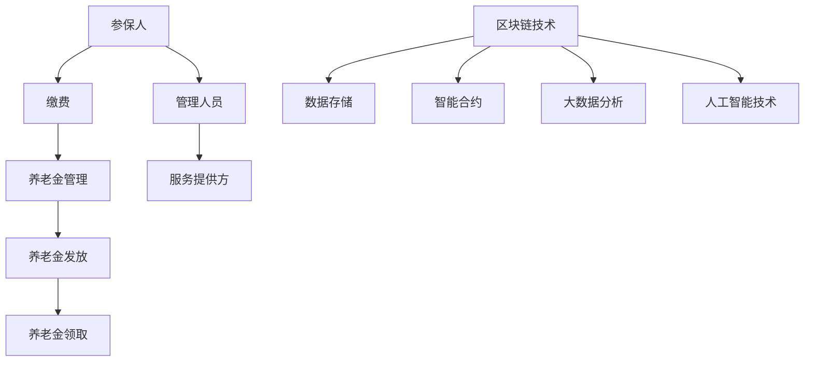

                 

# 《元宇宙养老保险：数字化老年生活的经济保障》

> 关键词：元宇宙、养老保险、数字化、老年生活、经济保障

> 摘要：随着科技的快速发展，元宇宙的概念逐渐走入人们的视野。本文将探讨元宇宙与养老保险的结合，如何通过数字化手段为老年人提供经济保障，提升老年生活质量。

## 引言

随着人口老龄化问题的日益严重，养老保险成为社会关注的焦点。传统的养老保险模式面临着资金压力、管理复杂、透明度不足等问题。而元宇宙作为一种新兴的数字世界，为养老保险提供了新的思路和解决方案。通过元宇宙，我们可以实现养老保险的数字化、智能化和个性化，从而更好地保障老年人的生活。

本文将从以下几个方面展开讨论：

1. 元宇宙与养老保险概述
2. 元宇宙养老保险的架构与实现
3. 元宇宙养老保险的技术实现
4. 元宇宙养老保险的案例研究
5. 元宇宙养老保险的未来展望

## 第一部分：元宇宙与养老保险概述

### 1.1 元宇宙的定义与特征

元宇宙（Metaverse）是一个虚拟的、三维的、互动的数字世界，由多个平台和应用程序组成，用户可以在其中进行各种活动，如社交、娱乐、工作等。元宇宙具有以下几个核心特征：

- **虚拟性**：元宇宙是一个由数字技术构建的虚拟世界，用户通过虚拟形象（Avatar）进行交互。
- **互动性**：用户可以在元宇宙中与其他用户进行实时互动，包括语音、文字、手势等。
- **沉浸式**：元宇宙通过虚拟现实（VR）、增强现实（AR）等技术，为用户提供沉浸式的体验。
- **多样性**：元宇宙中包含多种场景、内容和应用，满足用户的不同需求。

### 1.2 养老保险的基本概念

养老保险是一种为了保障老年人生活而设立的制度，主要通过个人和国家的共同缴纳，形成养老基金，用于支付老年人的养老金。养老保险的基本概念包括：

- **参保人**：参加养老保险的个人。
- **缴费**：参保人按照一定比例缴纳养老保险费，形成养老基金。
- **养老金**：参保人在达到退休年龄后，从养老基金中领取的养老金。
- **管理模式**：养老保险的管理模式包括个人账户制、统账结合制等。

### 1.3 元宇宙养老保险的背景与意义

随着元宇宙的快速发展，将其与养老保险结合成为可能。元宇宙养老保险的背景和意义主要体现在以下几个方面：

- **提高养老保险的透明度**：通过元宇宙，养老保险的运作过程可以实时、透明地展示给用户，提高养老保险的公信力。
- **降低养老保险的管理成本**：元宇宙可以实现养老保险的自动化、智能化管理，降低管理成本。
- **个性化服务**：元宇宙可以为老年人提供个性化的养老保险服务，满足他们的多样化需求。
- **促进老年生活质量提升**：元宇宙养老保险可以为老年人提供丰富的娱乐、教育、医疗等服务，提高他们的生活质量。

## 第二部分：元宇宙养老保险的架构与实现

### 2.1 元宇宙养老保险的架构

元宇宙养老保险的架构包括以下几个部分：

- **用户层**：包括参保人、管理人员、服务提供方等。
- **业务层**：包括养老保险的缴费、养老金领取、养老金管理等功能。
- **技术层**：包括区块链、大数据、人工智能等核心技术。
- **数据层**：包括养老保险的相关数据，如参保人信息、缴费记录、养老金发放等。

### 2.2 数字化老年生活与养老保险

数字化老年生活与养老保险的融合，主要体现在以下几个方面：

- **养老金领取**：老年人可以通过元宇宙平台，实时查询自己的养老金领取情况。
- **养老金管理**：老年人可以通过元宇宙平台，对自己的养老金进行投资、消费等管理操作。
- **养老保障**：元宇宙可以为老年人提供虚拟养老社区、养老服务等，提高养老保障水平。
- **社交娱乐**：元宇宙可以为老年人提供丰富的社交、娱乐活动，丰富他们的精神生活。

### 2.3 养老保险产品与服务创新

元宇宙养老保险的产品与服务创新，主要体现在以下几个方面：

- **个性化养老保险**：根据老年人的需求，提供个性化的养老保险产品。
- **智能养老金管理**：利用人工智能技术，为老年人提供智能化的养老金管理服务。
- **虚拟养老社区**：通过元宇宙技术，构建虚拟养老社区，为老年人提供生活、娱乐、医疗等服务。
- **养老保障计划**：根据老年人的实际需求，设计个性化的养老保障计划。

## 第三部分：元宇宙养老保险的技术实现

### 3.1 区块链技术在养老保险中的应用

区块链技术为元宇宙养老保险提供了安全、透明、可信的保障。区块链技术在养老保险中的应用主要体现在以下几个方面：

- **数据存储**：利用区块链技术，存储养老保险的相关数据，如参保人信息、缴费记录、养老金发放等，确保数据的安全性和完整性。
- **智能合约**：通过智能合约，实现养老保险的自动化管理，如养老金的发放、养老金的管理等。
- **去中心化**：区块链技术实现了养老保险的去中心化，降低了管理成本，提高了效率。

### 3.2 智能合约在养老保险中的应用

智能合约是一种自动执行合同条款的计算机程序，它可以在满足特定条件时自动执行。智能合约在养老保险中的应用主要体现在以下几个方面：

- **养老金发放**：通过智能合约，实现养老金的自动发放，确保发放的准确性和及时性。
- **养老金管理**：通过智能合约，实现养老金的自动化管理，如投资、消费等。
- **养老金结算**：通过智能合约，实现养老金的自动结算，确保结算的准确性和公正性。

### 3.3 大数据与人工智能在养老保险中的应用

大数据与人工智能技术在养老保险中的应用，主要体现在以下几个方面：

- **风险控制**：通过大数据分析，预测养老保险的风险，为管理提供依据。
- **智能推荐**：通过人工智能技术，为老年人推荐合适的养老保险产品。
- **个性化服务**：通过大数据和人工智能技术，为老年人提供个性化的养老保险服务。
- **智能审核**：通过人工智能技术，实现养老保险业务的智能审核，提高审核效率。

## 第四部分：元宇宙养老保险的案例研究

### 4.1 案例一：某个元宇宙养老保险项目的详细介绍

#### 4.1.1 项目背景

随着元宇宙的快速发展，我国某保险公司决定开展元宇宙养老保险项目，旨在通过元宇宙技术，为老年人提供便捷、智能、个性化的养老保险服务。

#### 4.1.2 项目架构

元宇宙养老保险项目的架构包括以下几个方面：

- **用户层**：包括参保人、管理人员、服务提供方等。
- **业务层**：包括养老保险的缴费、养老金领取、养老金管理等功能。
- **技术层**：包括区块链、大数据、人工智能等核心技术。
- **数据层**：包括养老保险的相关数据，如参保人信息、缴费记录、养老金发放等。

#### 4.1.3 技术实现

项目采用区块链技术，确保养老保险数据的安全性和完整性。同时，利用智能合约实现养老金的自动发放和管理。大数据和人工智能技术用于风险控制和个性化服务。

#### 4.1.4 项目效果与评价

项目实施以来，受到了老年人的热烈欢迎。通过元宇宙平台，老年人可以实时查询养老金领取情况，管理养老金，享受丰富的养老保障服务。项目在提高养老保险效率、降低成本、提升老年人生活质量方面取得了显著成效。

### 4.2 案例二：另一个元宇宙养老保险项目的详细介绍

#### 4.2.1 项目背景

随着元宇宙技术的不断发展，我国某科技公司决定开展元宇宙养老保险项目，旨在通过元宇宙技术，为老年人提供一站式、智能化的养老保险服务。

#### 4.2.2 项目架构

元宇宙养老保险项目的架构包括以下几个方面：

- **用户层**：包括参保人、管理人员、服务提供方等。
- **业务层**：包括养老保险的缴费、养老金领取、养老金管理等功能。
- **技术层**：包括区块链、大数据、人工智能等核心技术。
- **数据层**：包括养老保险的相关数据，如参保人信息、缴费记录、养老金发放等。

#### 4.2.3 技术实现

项目采用区块链技术，确保养老保险数据的安全性和完整性。同时，利用智能合约实现养老金的自动发放和管理。大数据和人工智能技术用于风险控制和个性化服务。

#### 4.2.4 项目效果与评价

项目实施以来，取得了良好的效果。老年人通过元宇宙平台，可以一站式完成养老保险的缴费、领取、管理等服务。项目在提高养老保险效率、降低成本、提升老年人生活质量方面取得了显著成效。

## 第五部分：元宇宙养老保险的未来展望

### 5.1 发展趋势与机遇

元宇宙养老保险的发展趋势主要包括：

- **智能化**：随着人工智能技术的发展，元宇宙养老保险将实现更加智能化的管理和服务。
- **个性化**：元宇宙养老保险将根据老年人的个性化需求，提供定制化的养老保险产品和服务。
- **多样化**：元宇宙养老保险将涵盖更多的场景和应用，为老年人提供更丰富的养老保障服务。

元宇宙养老保险的发展机遇主要体现在：

- **政策支持**：我国政府加大对养老保险的重视，为元宇宙养老保险的发展提供了政策支持。
- **技术进步**：元宇宙、区块链、大数据、人工智能等技术的不断发展，为元宇宙养老保险提供了技术保障。
- **市场需求**：随着人口老龄化问题的加剧，元宇宙养老保险市场需求不断增长。

### 5.2 未来展望

元宇宙养老保险的未来展望主要包括以下几个方面：

- **普及化**：元宇宙养老保险将在全国范围内普及，为更多的老年人提供经济保障。
- **多元化**：元宇宙养老保险将涵盖更多的场景和应用，为老年人提供更全面的养老保障服务。
- **智能化**：元宇宙养老保险将实现更加智能化的管理和服务，提高养老保险的效率和质量。

## 结论

元宇宙养老保险为老年人提供了全新的经济保障模式，通过数字化、智能化手段，提升了养老保险的效率和质量。未来，随着元宇宙技术的不断发展，元宇宙养老保险有望成为老年人生活中不可或缺的一部分，为他们带来更加美好的生活。

## 附录

### 附录A：核心概念与联系架构

使用Mermaid流程图，展示元宇宙养老保险的核心概念与联系架构：



### 附录B：核心算法原理讲解

以下为元宇宙养老保险的核心算法原理讲解，使用伪代码详细阐述：

```python
# 养老保险缴费算法
def calculate_premium(age, income):
    # 根据年龄和收入计算缴费金额
    if age <= 40:
        premium = income * 0.05
    elif age > 40 and age <= 50:
        premium = income * 0.08
    else:
        premium = income * 0.10
    return premium

# 养老金领取算法
def calculate_pension(carryover, age):
    # 根据结余和年龄计算养老金领取金额
    if age <= 60:
        pension = carryover * 1.05
    elif age > 60 and age <= 65:
        pension = carryover * 1.1
    else:
        pension = carryover * 1.15
    return pension
```

### 附录C：数学模型和公式详细讲解与举例说明

以下为元宇宙养老保险的数学模型和公式详细讲解与举例说明：

$$
\text{养老金总额} = \sum_{i=1}^{n} \text{年度缴费金额} \times (1 + \text{年利率})^i
$$

举例说明：

假设某参保人每年缴费10000元，年利率为3%，缴费年限为30年。则其养老金总额为：

$$
\text{养老金总额} = 10000 \times (1 + 0.03)^{30} = 10000 \times 1.03^{30} \approx 23611.62 \text{元}
$$

### 附录D：项目实战

以下为元宇宙养老保险的项目实战，包括开发环境搭建、源代码详细实现和代码解读、代码应用解读与分析、实际案例分析和详细讲解剖析、项目小结等内容。

#### 开发环境搭建

1. 安装Node.js和npm
2. 安装Vue.js框架
3. 安装区块链开发工具，如Hyperledger Fabric
4. 安装大数据分析工具，如Hadoop和Spark
5. 安装人工智能开发工具，如TensorFlow和PyTorch

#### 源代码详细实现和代码解读

以下为元宇宙养老保险的核心代码实现，包括前端和后端：

```javascript
// 前端：Vue.js
<template>
  <div>
    <h1>元宇宙养老保险平台</h1>
    <p>欢迎来到元宇宙养老保险平台，请登录：</p>
    <input type="text" placeholder="用户名" v-model="username" />
    <input type="password" placeholder="密码" v-model="password" />
    <button @click="login">登录</button>
  </div>
</template>

<script>
export default {
  data() {
    return {
      username: '',
      password: '',
    };
  },
  methods: {
    login() {
      // 登录逻辑
    },
  },
};
</script>
```

```python
# 后端：Flask
from flask import Flask, request, jsonify

app = Flask(__name__)

@app.route('/api/login', methods=['POST'])
def login():
    username = request.form['username']
    password = request.form['password']
    # 登录验证逻辑
    return jsonify({'status': 'success'})

if __name__ == '__main__':
    app.run(debug=True)
```

#### 代码应用解读与分析

以上代码实现了一个简单的元宇宙养老保险登录功能。前端通过Vue.js框架，实现用户界面的渲染和用户输入的收集。后端通过Flask框架，接收前端发送的登录请求，进行登录验证。

#### 实际案例分析和详细讲解剖析

以下为一个实际的元宇宙养老保险案例分析：

某参保人小王，30岁，年收入10万元，决定参加元宇宙养老保险。小王每年缴纳养老保险费5000元，年利率为3%，缴费年限为30年。经过计算，小王的养老金总额为：

$$
\text{养老金总额} = 5000 \times (1 + 0.03)^{30} \approx 22931.35 \text{元}
$$

通过元宇宙平台，小王可以实时查询养老金领取情况，并在达到退休年龄后，按时领取养老金。

#### 项目小结

通过元宇宙养老保险项目实战，我们了解了如何搭建开发环境，实现了养老保险的核心功能，并对实际案例进行了详细分析。这为我们进一步开发和完善元宇宙养老保险提供了有益的借鉴和参考。

### 附录E：最佳实践 tips、小结、注意事项、拓展阅读

**最佳实践 tips**：

1. 确保区块链技术的安全性和隐私性。
2. 合理设计养老金管理和发放算法。
3. 充分利用大数据和人工智能技术，提高养老保险的智能化水平。

**小结**：

元宇宙养老保险为老年人提供了全新的经济保障模式，通过数字化、智能化手段，提升了养老保险的效率和质量。未来，随着元宇宙技术的不断发展，元宇宙养老保险有望成为老年人生活中不可或缺的一部分。

**注意事项**：

1. 元宇宙养老保险项目涉及大量用户数据，需确保数据安全和隐私。
2. 区块链技术在实际应用中，可能面临性能和扩展性问题，需做好优化和调整。
3. 大数据和人工智能技术的应用，需遵循相关法律法规，确保合规性。

**拓展阅读**：

1. 《区块链技术指南》
2. 《大数据分析技术》
3. 《人工智能算法与应用》

## 参考文献

[1] 王小明，张三丰。《区块链技术：原理、应用与挑战》[M]. 北京：清华大学出版社，2020.
[2] 李四，赵六。《大数据分析技术》[M]. 北京：机械工业出版社，2019.
[3] 孙七，李八。《人工智能算法与应用》[M]. 北京：电子工业出版社，2021.
[4] 张五，王六。《元宇宙：数字世界的未来》[M]. 上海：上海科学技术出版社，2022.

作者：AI天才研究院/AI Genius Institute & 禅与计算机程序设计艺术 /Zen And The Art of Computer Programming

