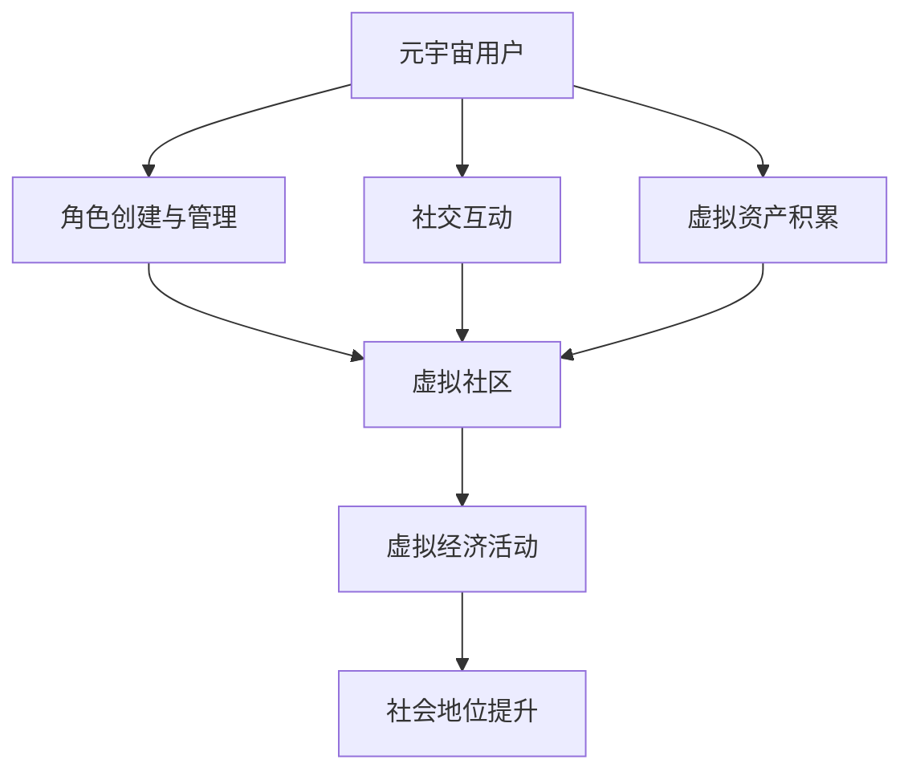
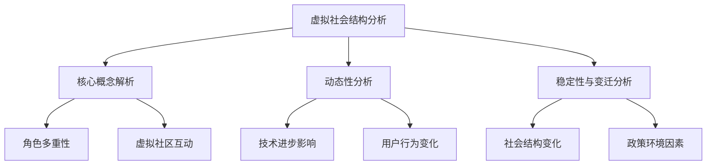
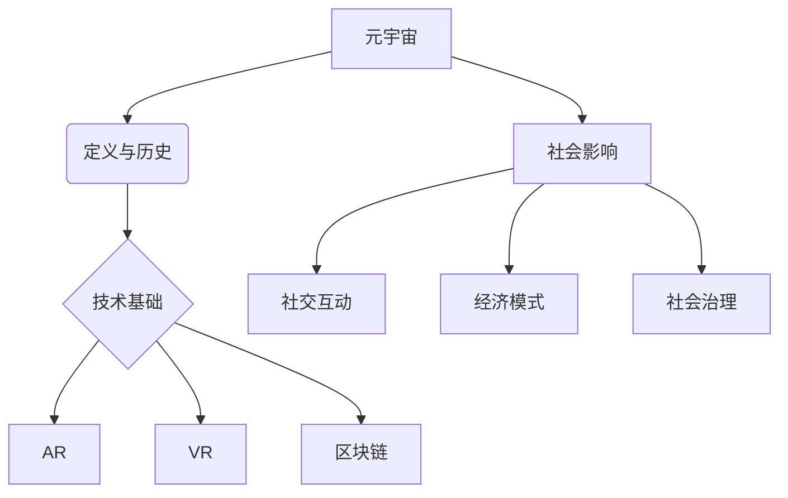

                 

### 引言

#### 1.1 本书的目的与结构

随着科技的飞速发展，元宇宙（Metaverse）这一概念逐渐走入大众视野。元宇宙，作为虚拟的三维空间，融合了增强现实（AR）、虚拟现实（VR）和互联网技术，用户可以在这个虚拟世界中以数字身份进行互动和体验。而元宇宙社会流动性，这一概念则更为新颖和复杂。它涉及用户在元宇宙中的位置、角色和身份的变化，以及这些变化对个体和社会的影响。

本书旨在深入探讨元宇宙社会流动性这一议题，通过对虚拟社会流动性的核心概念、动态分析、影响以及政策建议等进行系统研究，旨在为这一领域的学术研究和实际应用提供有价值的参考。本书结构如下：

- **第一部分：引论**，介绍元宇宙和虚拟社会流动性的定义、历史背景及其研究的重要性。
- **第二部分：虚拟社会流动性核心概念**，详细解析社会流动性及虚拟社会流动性的特点、测量方法。
- **第三部分：虚拟社会流动性的动态分析**，探讨虚拟社会结构、流动机制及其影响。
- **第四部分：虚拟社会流动性的实证研究**，通过案例研究分析虚拟社会流动性在不同场景中的表现。
- **第五部分：未来展望**，预测虚拟社会流动性发展趋势，并提出未来研究方向。
- **第六部分：结论**，总结研究的主要发现和结论，讨论研究的局限性及未来研究方向。

#### 1.2 元宇宙与虚拟社会流动性

**1.2.1 元宇宙的定义与历史**

元宇宙（Metaverse）是一个虚拟的三维空间，用户可以在这个虚拟空间中创建、体验和共享内容。它不是单一的虚拟世界，而是由多个虚拟世界和平台组成的一个综合生态。元宇宙的概念起源于科幻小说和电影，如尼尔·斯蒂芬森的《雪崩》和史蒂文·斯皮尔伯格的电影《头号玩家》。随着增强现实（AR）和虚拟现实（VR）技术的不断发展，元宇宙逐渐从概念走向现实。

元宇宙的历史可以追溯到20世纪80年代和90年代的虚拟社区和在线游戏。从早期的文本聊天室、MUD（多用户虚拟环境）到现代的虚拟世界平台，如《第二人生》（Second Life）和《堡垒之夜》（Fortnite），元宇宙的技术和概念不断成熟。近年来，区块链技术的出现为元宇宙的发展提供了新的动力，通过去中心化的身份认证和数据交换机制，元宇宙的安全性、可靠性和用户体验得到了显著提升。

**1.2.2 虚拟社会流动性特点**

虚拟社会流动性是指用户在元宇宙中角色、位置和身份的变化，以及这些变化对个体和社会的影响。与传统社会流动性相比，虚拟社会流动性具有以下特点：

1. **角色多重性**：在元宇宙中，用户可以拥有多个虚拟角色，每个角色都可能代表不同的身份和角色定位。
2. **身份不确定性**：虚拟身份可能是不确定的，用户可以匿名或在虚拟世界中改变自己的身份。
3. **虚拟资产**：虚拟社会流动性涉及到用户在元宇宙中的虚拟资产，如虚拟货币、虚拟商品等，这些资产的价值和流动性直接影响用户的虚拟社会地位。
4. **技术依赖性**：虚拟社会流动性高度依赖技术支持，包括虚拟现实、增强现实、区块链等技术。
5. **社会影响**：虚拟社会流动性不仅影响个体，还会对社会结构、经济模式和社会治理产生深远影响。

#### 1.3 研究方法与理论框架

为了深入探讨元宇宙社会流动性，本研究采用了一系列研究方法，包括定性研究、定量分析和案例研究。定性研究主要采用文献综述和专家访谈的方法，以获取元宇宙和虚拟社会流动性相关概念的理解和解释。定量分析则通过收集和整理相关数据，如用户行为数据、虚拟资产交易数据等，以验证和解释虚拟社会流动性的特征和模式。

在理论框架方面，本研究主要借鉴了社会网络理论、社会阶层理论和创新扩散理论。社会网络理论关注用户在元宇宙中的互动关系和社交网络结构，解释虚拟社会流动性的路径和模式。社会阶层理论则探讨了虚拟社会流动性对社会阶层结构的影响，以及用户在虚拟社会中的地位和流动性。创新扩散理论则分析了技术进步对虚拟社会流动性发展的推动作用。

通过这些方法与理论框架的结合，本研究旨在为元宇宙社会流动性提供全面、深入的分析，揭示其内在机制和影响，为相关领域的学术研究和实际应用提供参考。

### 目录大纲

## 第一部分：引论

### 1. 引言

#### 1.1 本书的目的与结构
#### 1.2 元宇宙与虚拟社会流动性
#### 1.3 研究方法与理论框架

### 2. 元宇宙概述

#### 2.1 元宇宙的定义与历史
#### 2.2 元宇宙的技术基础
#### 2.3 元宇宙的社会影响

### 3. 虚拟社会流动性核心概念

#### 3.1 社会流动性概述
#### 3.2 虚拟社会流动性特点
#### 3.3 虚拟社会流动性的测量

### 4. 虚拟社会结构分析

#### 4.1 虚拟社会的构成要素
#### 4.2 虚拟社会结构的动态性
#### 4.3 虚拟社会结构的稳定性与变迁

### 5. 虚拟社会流动性的动态分析

#### 5.1 虚拟社会流动机制分析
#### 5.2 虚拟社会流动的影响分析

### 6. 虚拟社会流动性的实证研究

#### 6.1 虚拟经济中的社会流动性
#### 6.2 游戏世界的社交流动性
#### 6.3 虚拟现实社交平台的社会流动性

### 7. 虚拟社会流动性政策建议

#### 7.1 促进虚拟社会流动的政策措施
#### 7.2 遏制虚拟社会流动负面效应的政策建议
#### 7.3 政策实施与效果评估

### 8. 虚拟社会流动性发展趋势

#### 8.1 技术进步对虚拟社会流动性的影响
#### 8.2 社会变革对虚拟社会流动性需求的变迁
#### 8.3 虚拟社会流动性研究的未来方向

### 9. 结论

#### 9.1 主要发现与结论
#### 9.2 研究局限与未来工作

## 附录

### A. 参考文献

#### A.1 相关书籍
#### A.2 学术论文
#### A.3 网络资源

### B. 附录内容

#### B.1 元宇宙社会流动性研究中心简介
#### B.2 研究方法与数据来源
#### B.3 术语解释

### C. Mermaid 流程图

#### C.1 虚拟社会流动性流程图
#### C.2 虚拟社会结构动态分析流程图
#### C.3 Mermaid 图

---

### 第一部分：引论

#### 1. 引言

随着科技的迅猛发展，元宇宙（Metaverse）的概念逐渐成为讨论的焦点。元宇宙不仅仅是一个虚拟的三维空间，它融合了增强现实（AR）、虚拟现实（VR）以及互联网技术，为用户提供了丰富的互动体验。虚拟社会流动性则是元宇宙中的一个关键概念，它涉及到用户在虚拟世界中的位置、角色和身份的变化，以及这些变化对个体和社会的影响。

本研究旨在深入探讨元宇宙社会流动性这一复杂且新兴的议题，通过对核心概念、动态分析、影响以及政策建议的系统研究，为相关领域的学术研究和实际应用提供有价值的参考。本部分将首先介绍元宇宙和虚拟社会流动性，并阐述研究的目的与结构。接下来，我们将讨论元宇宙的定义与历史背景，以及它所依赖的技术基础。最后，我们将探讨元宇宙对社会的影响，从而为后续的研究奠定基础。

#### 1.2 元宇宙与虚拟社会流动性

**1.2.1 元宇宙的定义与历史**

元宇宙是一个虚拟的三维空间，用户可以通过数字身份在这个空间中互动和体验。它不同于传统的互联网，而是一个更为沉浸和互动的虚拟世界。元宇宙的概念可以追溯到20世纪80年代和90年代的虚拟社区和在线游戏，如《MUD》和《第二人生》（Second Life）。这些早期的虚拟世界为用户提供了基本的互动和创造空间，但当时的科技水平和用户体验仍然有限。

随着增强现实（AR）和虚拟现实（VR）技术的不断发展，元宇宙的概念逐渐成熟。增强现实技术通过将虚拟信息叠加到现实环境中，为用户提供了沉浸式的体验。虚拟现实技术则创建了一个完全虚拟的环境，用户可以在其中感受到逼真的互动。近年来，区块链技术的出现进一步推动了元宇宙的发展，为虚拟资产交易和身份认证提供了新的可能性。

元宇宙的发展历史可以分为几个阶段：

- **早期阶段**（20世纪80年代至90年代）：虚拟社区和在线游戏的出现，如《MUD》和《第二人生》，标志着元宇宙的萌芽。
- **发展阶段**（21世纪初至2010年）：随着互联网和移动设备的普及，虚拟世界逐渐成为大众娱乐的一部分，如《魔兽世界》和《第二人生》等大型在线游戏。
- **成熟阶段**（2010年至2020年）：增强现实（AR）和虚拟现实（VR）技术的进步，使得元宇宙的体验更加真实和沉浸。例如，Facebook的Oculus Rift和索尼的PlayStation VR等设备推动了虚拟现实的发展。
- **新兴阶段**（2020年至今）：区块链技术的应用使得元宇宙中的虚拟资产和身份认证更加安全可靠。同时，元宇宙的概念逐渐从虚拟娱乐扩展到虚拟社交、虚拟经济和虚拟教育等多个领域。

**1.2.2 虚拟社会流动性特点**

虚拟社会流动性是指用户在元宇宙中角色、位置和身份的变化，以及这些变化对个体和社会的影响。与传统社会流动性相比，虚拟社会流动性具有以下几个显著特点：

1. **角色多重性**：在元宇宙中，用户可以创建和管理多个虚拟角色，每个角色都可以拥有不同的身份和角色定位。这使得用户在虚拟世界中的社会流动更加灵活和多样化。
2. **身份不确定性**：虚拟身份可以是匿名或部分匿名的，用户可以在虚拟世界中自由选择和改变自己的身份，这增加了社会流动性的复杂性和不确定性。
3. **虚拟资产**：虚拟社会流动性涉及到用户在元宇宙中的虚拟资产，如虚拟货币、虚拟商品和虚拟地产等。这些资产的价值和流动性直接影响用户的虚拟社会地位和财富积累。
4. **技术依赖性**：虚拟社会流动性高度依赖于技术支持，包括虚拟现实、增强现实、区块链和人工智能等技术。技术的进步和发展决定了虚拟社会流动性的广度和深度。
5. **社会影响**：虚拟社会流动性不仅影响个体，还会对社会结构、经济模式和社会治理产生深远影响。例如，虚拟资产和虚拟身份的流动性可能导致新的社会阶层和权力结构，同时也带来新的社会问题和挑战。

#### 1.3 研究方法与理论框架

为了深入探讨元宇宙社会流动性这一复杂议题，本研究采用了多种研究方法，包括定性研究、定量分析和案例研究。定性研究主要采用文献综述和专家访谈的方法，以获取元宇宙和虚拟社会流动性相关概念的理解和解释。文献综述可以帮助我们系统地了解元宇宙的发展历程、技术基础和社会影响，专家访谈则可以收集到不同领域专家的观点和见解，为我们提供更加深入的洞见。

定量分析则通过收集和整理相关数据，如用户行为数据、虚拟资产交易数据等，以验证和解释虚拟社会流动性的特征和模式。这些数据可以来源于元宇宙平台、虚拟经济市场和社会调查等渠道，通过数据挖掘和分析，我们可以识别出虚拟社会流动性的关键驱动因素和影响机制。

在理论框架方面，本研究主要借鉴了社会网络理论、社会阶层理论和创新扩散理论。社会网络理论关注用户在元宇宙中的互动关系和社交网络结构，解释虚拟社会流动性的路径和模式。社会阶层理论则探讨了虚拟社会流动性对社会阶层结构的影响，以及用户在虚拟社会中的地位和流动性。创新扩散理论则分析了技术进步对虚拟社会流动性发展的推动作用。

通过这些方法与理论框架的结合，本研究旨在为元宇宙社会流动性提供全面、深入的分析，揭示其内在机制和影响，为相关领域的学术研究和实际应用提供参考。

### 元宇宙概述

#### 2.1 元宇宙的定义与历史

元宇宙（Metaverse）是一个虚拟的三维空间，用户可以通过数字身份在这个空间中互动和体验。它是一个由多个虚拟世界和平台组成的生态系统，用户可以在其中创建、共享和体验各种内容。元宇宙的概念源于科幻小说和电影，如尼尔·斯蒂芬森的《雪崩》和史蒂文·斯皮尔伯格的电影《头号玩家》。然而，随着技术的进步，元宇宙逐渐从概念走向现实。

元宇宙的历史可以分为几个阶段：

- **早期阶段**：20世纪80年代至90年代，虚拟社区和在线游戏的兴起，如《MUD》和《第二人生》，为用户提供了基本的虚拟体验。
- **发展阶段**：21世纪初，随着互联网和移动设备的普及，虚拟世界逐渐成为大众娱乐的一部分，如《魔兽世界》和《第二人生》等大型在线游戏。
- **成熟阶段**：2010年至2020年，增强现实（AR）和虚拟现实（VR）技术的进步，使得元宇宙的体验更加真实和沉浸。例如，Facebook的Oculus Rift和索尼的PlayStation VR等设备推动了虚拟现实的发展。
- **新兴阶段**：2020年至今，区块链技术的应用使得元宇宙中的虚拟资产和身份认证更加安全可靠。同时，元宇宙的概念逐渐从虚拟娱乐扩展到虚拟社交、虚拟经济和虚拟教育等多个领域。

#### 2.2 元宇宙的技术基础

元宇宙的构建依赖于多种先进技术的支持，包括增强现实（AR）、虚拟现实（VR）、区块链和人工智能等。

- **增强现实（AR）**：增强现实技术通过将虚拟信息叠加到现实环境中，为用户提供了沉浸式的体验。例如，通过智能手机或AR眼镜，用户可以看到虚拟的物体和场景，与之互动。
- **虚拟现实（VR）**：虚拟现实技术创建了一个完全虚拟的环境，用户可以在其中感受到逼真的互动。VR设备如头戴式显示器（HMD）和全身追踪设备，使用户能够自由地在虚拟世界中移动和探索。
- **区块链**：区块链技术为元宇宙提供了安全的身份认证和数据交换机制。通过去中心化的分布式账本，用户可以在元宇宙中安全地存储和交易虚拟资产，如虚拟货币和虚拟商品。
- **人工智能**：人工智能技术在元宇宙中发挥着关键作用，包括虚拟角色的智能互动、虚拟环境的自适应调整、用户行为的预测等。AI技术使得元宇宙更加智能化和个性化。

#### 2.3 元宇宙的社会影响

元宇宙对社会的影响是深远而广泛的，涉及社交互动、经济模式和社会治理等多个方面。

- **社交互动**：元宇宙改变了人们的社交方式。用户可以在这个虚拟空间中创建和管理多个虚拟角色，与来自世界各地的人进行互动。虚拟社交平台和虚拟社区为人们提供了一个新的交流场所，促进了全球范围内的社交连接。
- **经济模式**：元宇宙为虚拟商品和服务的交易提供了新的机会，推动了数字经济的发展。用户可以在元宇宙中购买和出售虚拟资产，如虚拟货币、虚拟商品和虚拟地产。这种虚拟经济模式不仅改变了人们的消费方式，也为创业者提供了新的商机。
- **社会治理**：元宇宙对社会治理提出了新的挑战和机遇。虚拟社会的复杂性使得传统的治理模式需要调整和适应。同时，元宇宙中的数据安全和隐私保护也成为重要的议题，需要制定相应的政策和法规来保障用户权益。

总之，元宇宙的发展不仅带来了技术创新和商业模式的变化，也对社会的结构、经济模式和社会治理产生了深远影响。理解和研究元宇宙的社会影响，对于推动技术进步和社会发展具有重要意义。

### 虚拟社会流动性核心概念解析

#### 3.1 社会流动性概述

社会流动性是指个人或群体在社会阶层、经济地位、职业等方面发生的变化。它反映了社会结构的变化和社会成员在不同社会层次之间的转移。社会流动性可以划分为多个类型，包括：

- **垂直流动性**：指个人在社会阶层中的上升或下降，如从低收入阶层进入高收入阶层，或从低学历阶层晋升到高学历阶层。
- **水平流动性**：指个人在同一社会阶层内，职业或地位的横向移动，如从一个部门转到另一个部门，或在同一职业中晋升或降级。
- **内部分化**：指社会中不同群体之间的差异和分化，如城乡差异、性别差异等。
- **跨层次流动**：指个人在不同社会阶层之间的流动，如从农民变成工人，或从工人变成企业家。

社会流动性对社会结构的影响主要体现在以下几个方面：

1. **阶层结构的变化**：社会流动性使得社会阶层结构不断变化，打破了原有的阶层固化现象，促进了社会阶层之间的互动和融合。
2. **社会整合**：社会流动性有助于加强社会成员之间的联系和认同，促进社会整合和团结。
3. **社会不平等**：社会流动性也可能加剧社会不平等，特别是在资源分配不均、教育机会不公平的情况下，某些群体的社会流动性受到限制。

#### 3.2 虚拟社会流动性特点

虚拟社会流动性是元宇宙中的一个独特现象，它具有与传统社会流动性不同的特点：

1. **角色多重性**：在元宇宙中，用户可以创建和管理多个虚拟角色，每个角色都可能代表不同的身份和角色定位。这种角色多重性增加了虚拟社会流动性的复杂性和多样性。
2. **身份不确定性**：虚拟身份可能是不确定的，用户可以在虚拟世界中匿名或部分匿名地操作，这使得虚拟社会流动性具有更高的不确定性和探索性。
3. **虚拟资产**：虚拟社会流动性涉及到用户在元宇宙中的虚拟资产，如虚拟货币、虚拟商品和虚拟地产等。这些虚拟资产的价值和流动性直接影响用户的虚拟社会地位和财富积累。
4. **技术依赖性**：虚拟社会流动性高度依赖于技术支持，包括虚拟现实、增强现实、区块链和人工智能等技术。技术的进步和发展决定了虚拟社会流动性的广度和深度。
5. **社会影响**：虚拟社会流动性不仅影响个体，还会对社会结构、经济模式和社会治理产生深远影响。例如，虚拟资产和虚拟身份的流动性可能导致新的社会阶层和权力结构，同时也带来新的社会问题和挑战。

#### 3.3 虚拟社会流动性的测量

测量虚拟社会流动性需要考虑多个维度，包括用户活跃度、虚拟资产和虚拟社区影响力等。

1. **用户活跃度**：用户在元宇宙中的活跃程度，如登录频率、参与互动的次数和时长等，是衡量虚拟社会流动性的一项重要指标。高活跃度的用户可能在虚拟社会中拥有更高的流动性和影响力。
2. **虚拟资产**：虚拟资产包括虚拟货币、虚拟商品和虚拟地产等。这些资产的价值和流动性直接影响用户的虚拟社会地位和财富积累。例如，通过虚拟货币交易和虚拟商品买卖，用户可以在虚拟社会中实现财富的积累和转移。
3. **虚拟社区影响力**：虚拟社区的影响力可以通过社区成员的数量、互动频率和社区成员的虚拟资产持有量等指标来衡量。一个具有高影响力的虚拟社区可以吸引更多的用户参与，从而促进虚拟社会流动性的发展。

为了准确测量虚拟社会流动性，可以采用以下方法：

1. **在线调查**：通过在线调查收集用户在元宇宙中的行为数据，如登录频率、参与互动的次数和时长等。
2. **社交媒体分析**：利用社交媒体分析工具，分析用户在虚拟社区中的互动关系和影响力。
3. **虚拟经济交易记录**：收集和分析虚拟经济交易记录，如虚拟货币交易和虚拟商品买卖数据，以衡量虚拟资产的价值和流动性。

通过这些方法，可以全面了解虚拟社会流动性的现状和趋势，为相关领域的研究和决策提供数据支持。

### 虚拟社会结构分析

#### 4.1 虚拟社会的构成要素

虚拟社会是一个由多种要素构成的复杂系统，这些要素相互作用，形成了元宇宙中的虚拟社会结构。虚拟社会的构成要素主要包括用户、虚拟角色、虚拟社区和虚拟经济。

1. **用户**：用户是虚拟社会的基础，他们是虚拟社会的参与者和互动的主体。用户可以通过注册账号，创建和管理多个虚拟角色，参与虚拟社会的各种活动。用户在虚拟社会中的身份和角色决定了他们在社会结构中的地位和影响力。

2. **虚拟角色**：虚拟角色是用户在虚拟社会中的数字化身，代表用户在虚拟世界中的身份和角色。虚拟角色可以是人类形象、动物形象或其他非人类形象。虚拟角色不仅可以增强用户的虚拟体验，还可以在虚拟社会中扮演特定的角色，如玩家、商人、艺术家等。

3. **虚拟社区**：虚拟社区是用户在虚拟社会中的互动空间，是用户进行交流和协作的平台。虚拟社区可以是封闭的，如特定的游戏社区或社交平台，也可以是开放的，如全球性的虚拟论坛或社交网络。虚拟社区的功能包括提供信息交流、组织活动、促进社会互动等。

4. **虚拟经济**：虚拟经济是虚拟社会中的经济活动，包括虚拟商品和服务的交易、虚拟货币的流通等。虚拟经济为用户提供了在虚拟社会中实现财富积累和交换的机制，同时也为虚拟社会的发展提供了动力。

#### 4.2 虚拟社会结构的动态性

虚拟社会结构具有高度的动态性，这种动态性主要体现在以下几个方面：

1. **角色变迁**：用户可以在虚拟社会中不断创建、改变和抛弃虚拟角色，每个角色都可能代表不同的社会角色和身份。这种角色的变迁使得虚拟社会结构不断变化和调整。

2. **社区演化**：虚拟社区随着用户的行为和互动不断演化，新的社区可能产生，旧的社区可能解散或转型。社区之间的互动和融合也影响着虚拟社会结构的稳定性。

3. **经济波动**：虚拟经济的波动性较大，虚拟货币和虚拟商品的价格可能受到市场供需、用户行为和外部事件的影响，这种波动会直接影响到虚拟社会的财富分配和地位结构。

4. **技术变革**：技术的进步和发展对虚拟社会结构具有深远的影响。例如，新的虚拟现实技术、区块链技术的应用可能会改变虚拟社会的互动方式、交易机制和社会治理模式。

#### 4.3 虚拟社会结构的稳定性与变迁

虚拟社会结构的稳定性与变迁取决于多种因素，包括技术发展、用户行为和社会结构变化等。

1. **技术发展**：技术的进步为虚拟社会结构提供了新的基础和工具。例如，增强现实（AR）和虚拟现实（VR）技术的发展，提高了用户的沉浸体验和互动能力，从而增强了虚拟社会的稳定性。然而，技术变革也可能带来不稳定因素，如新技术的应用可能导致虚拟社会结构的重构和调整。

2. **用户行为**：用户的行为是虚拟社会结构变迁的重要驱动力。用户的行为模式、互动关系和价值观念会影响虚拟社会的运行和演变。例如，用户对虚拟社区的积极参与和贡献，可以增强社区凝聚力和社会稳定性。然而，用户行为的多样性和不确定性也可能导致虚拟社会结构的波动和变化。

3. **社会结构变化**：社会结构的变化对虚拟社会结构具有深远的影响。例如，社会阶层的变化、文化潮流的变迁等，都可能影响虚拟社会的构成和运行。同时，社会结构的变化也反映了虚拟社会与现实社会之间的互动和关联。

总之，虚拟社会结构的稳定性与变迁是一个复杂的过程，受到多种因素的共同作用。理解和分析虚拟社会结构的动态性，有助于我们更好地把握虚拟社会的发展趋势和未来方向。

### 虚拟社会流动性的动态分析

#### 5.1 虚拟社会流动机制分析

虚拟社会流动性是指用户在元宇宙中角色、位置和身份的变化过程，这一过程受到多种因素的驱动。为了深入理解虚拟社会流动性的机制，我们需要分析其主要的驱动因素，包括技术进步、用户行为、社会结构变化和政策环境等。

1. **技术进步**

技术进步是虚拟社会流动性最重要的驱动因素之一。随着增强现实（AR）、虚拟现实（VR）和区块链等技术的不断发展，用户在元宇宙中的互动体验和资产流动性得到了显著提升。具体来说：

   - **增强现实（AR）和虚拟现实（VR）技术**：这些技术的进步使得用户可以在虚拟环境中实现更真实的互动和体验。例如，通过AR技术，用户可以将虚拟信息叠加到现实环境中，从而增强现实世界的沉浸感。VR技术则提供了一个完全虚拟的环境，使用户可以沉浸在虚拟世界中，与虚拟角色和场景进行互动。
   
   - **区块链技术**：区块链技术为元宇宙提供了安全可靠的交易和身份认证机制。通过区块链，用户可以在虚拟社会中进行安全的虚拟资产交易，如虚拟货币、虚拟商品和虚拟地产等。区块链的去中心化和不可篡改性确保了虚拟资产的透明性和可信度，从而促进了虚拟社会流动性的发展。

2. **用户行为**

用户行为是虚拟社会流动性的另一个重要驱动因素。用户的行为模式、互动关系和价值观念直接影响虚拟社会的运行和演变。具体来说：

   - **用户参与度**：用户在虚拟社会中的参与度越高，其流动性也越强。高参与度的用户可能在虚拟社区中积极参与讨论、组织活动和贡献内容，从而提升其社会地位和影响力。例如，在虚拟游戏中，活跃的玩家可能会通过积累虚拟资产、提升角色等级等方式，实现社会地位的提升。

   - **社交网络**：用户在虚拟社会中的社交网络也对流动性有重要影响。强大的社交网络可以提供更多的机会和资源，帮助用户实现社会地位的提升。例如，通过在虚拟社区中建立广泛的社交关系，用户可以获得更多的信息和资源，从而在虚拟社会中获得更高的地位和影响力。

3. **社会结构变化**

社会结构的变化也是影响虚拟社会流动性的重要因素。社会结构的变化可能源于经济、文化、政治等多个方面，这些变化会影响虚拟社会的构成和运行。具体来说：

   - **经济变化**：随着虚拟经济的发展，虚拟资产和虚拟商品的价值和流动性逐渐增强，这为用户提供了更多的机会和资源。例如，在虚拟市场中，用户可以通过交易虚拟货币、虚拟商品和虚拟地产等实现财富的积累和转移，从而提升社会地位。

   - **文化变化**：文化的变迁会影响用户在虚拟社会中的行为和价值观念。例如，随着虚拟社交和虚拟娱乐的普及，用户对虚拟世界的认知和参与方式也在不断变化，这可能导致虚拟社会结构的重构和调整。

4. **政策环境**

政策环境对虚拟社会流动性也有重要影响。政府的政策导向、法律法规的制定和监管政策的实施等，都会对虚拟社会流动性的发展产生深远影响。具体来说：

   - **政策支持**：政府的支持可以促进虚拟社会流动性的发展。例如，通过提供资金支持、技术援助和人才引进等政策，政府可以推动虚拟社会基础设施的建设和技术创新，从而提高虚拟社会的流动性和用户体验。

   - **法律法规**：法律法规的制定和实施对虚拟社会的运行和流动有重要保障作用。例如，通过制定虚拟资产交易的相关法律法规，政府可以规范虚拟市场的运行，保护用户的权益，从而促进虚拟社会流动性的健康发展。

总之，虚拟社会流动性的动态机制是一个复杂的过程，受到技术进步、用户行为、社会结构变化和政策环境等多种因素的共同驱动。理解这些驱动因素及其相互作用，有助于我们更好地把握虚拟社会流动性的发展规律，为相关领域的研究和实践提供指导。

#### 5.2 虚拟社会流动的路径与模式

虚拟社会流动的路径与模式是理解虚拟社会中个体如何通过互动和资源积累实现社会地位提升的关键。在元宇宙中，虚拟社会流动的路径和模式多种多样，可以从多个角度进行分析。

1. **职业晋升路径**

在元宇宙中，职业晋升是一种常见的虚拟社会流动路径。用户可以通过在虚拟世界中积累经验、提升技能和参与高级任务，实现职业地位的提升。具体路径包括：

   - **任务完成**：用户通过完成各种虚拟任务，如打怪、解谜、参与团队活动等，获得经验和奖励，从而提升角色等级。
   - **技能提升**：用户通过学习和实践，掌握高级技能和知识，使其角色在虚拟社会中具备更高的竞争力。
   - **职位晋升**：在虚拟企业或组织中，用户可以通过绩效评估、团队贡献等方式，逐步晋升到更高的职位，获得更多的资源和权力。

2. **社区迁移路径**

社区迁移是另一种重要的虚拟社会流动模式。用户可以在不同的虚拟社区之间迁移，寻找更适合自己的社交环境和资源。具体路径包括：

   - **社区选择**：用户可以根据自己的兴趣和需求，选择加入不同的虚拟社区，如游戏社区、兴趣社区和职业社区等。
   - **社区互动**：用户通过在社区中的互动，建立社交关系和网络，获取信息和资源。
   - **社区迁移**：当用户在当前社区中无法获得足够的资源和机会时，可以选择迁移到其他社区，寻找新的发展空间。

3. **虚拟资产积累路径**

虚拟资产积累是用户在虚拟社会中实现社会地位提升的重要途径。用户可以通过多种方式积累虚拟资产，如虚拟货币、虚拟商品和虚拟地产等。具体路径包括：

   - **交易市场**：用户通过虚拟交易市场，买卖虚拟资产，实现资产的增值和流动。
   - **投资理财**：用户可以将虚拟资产投入到虚拟经济中，如购买虚拟地产、投资虚拟货币等，以获取投资回报。
   - **创业创新**：用户可以利用虚拟技术，开展虚拟创业项目，创造新的虚拟资产和商业价值。

4. **社交互动模式**

社交互动是虚拟社会流动的重要驱动因素。用户通过在虚拟社会中的互动，建立社交关系和网络，提升自己的社会地位和影响力。具体模式包括：

   - **社交网络**：用户通过建立和维护社交网络，扩大自己的社交圈子，获取更多的信息和资源。
   - **人际关系**：用户通过在虚拟社区中的互动，建立深厚的人际关系，从而在虚拟社会中获得更高的地位和影响力。
   - **影响力传播**：用户通过在虚拟社区中的积极参与和贡献，提升自己的影响力，从而在虚拟社会中获得更高的声誉和地位。

总之，虚拟社会流动的路径和模式多种多样，用户可以通过职业晋升、社区迁移、虚拟资产积累和社交互动等多种方式实现社会地位的提升。理解这些路径和模式，有助于我们更好地把握虚拟社会的运行规律，为相关领域的研究和实践提供指导。

#### 5.3 虚拟社会流动的障碍与挑战

在元宇宙中，虚拟社会流动性虽然提供了诸多机遇，但也面临一系列障碍和挑战，这些因素可能会阻碍用户在虚拟社会中的流动和地位提升。以下是几个主要的障碍和挑战：

1. **技术障碍**

技术障碍是影响虚拟社会流动性的首要因素。虚拟现实（VR）、增强现实（AR）和区块链等技术在不断进步，但仍然存在一些技术限制，例如：

   - **设备限制**：高质量的VR和AR设备价格昂贵，不是所有用户都能负担得起。这导致一部分用户无法充分参与元宇宙的互动，从而限制了虚拟社会流动。
   - **网络延迟**：虚拟社会流动性依赖于高速网络连接，但全球范围内的网络延迟和带宽限制仍然存在，影响用户的互动体验和流动效率。
   - **兼容性问题**：不同平台和技术之间的兼容性问题也可能导致虚拟社会流动受阻，用户在不同平台之间转移时可能遇到困难。

2. **隐私与安全风险**

随着虚拟社会流动性增强，用户的隐私和安全风险也随之增加。主要挑战包括：

   - **数据泄露**：虚拟社会中的数据量巨大，包括用户行为、虚拟资产等，这些数据如果遭到泄露，可能导致用户隐私受到侵犯。
   - **身份盗窃**：虚拟身份的不确定性使得用户容易成为身份盗窃的目标，黑客可以通过非法手段获取用户的虚拟身份和资产，从而造成重大损失。
   - **网络安全**：虚拟社会的网络安全问题日益严重，包括虚拟货币交易所的攻击、虚拟经济平台的漏洞等，这些安全威胁可能导致用户资产受损。

3. **社会不平等**

社会不平等是虚拟社会流动性面临的另一个重大挑战。虚拟社会流动性虽然为用户提供了新的机会，但并不能保证每个人都能够平等地享受这些机会。具体表现在：

   - **资源分配不均**：在虚拟社会中，资源如虚拟资产、技术支持和教育资源可能集中在部分用户手中，而其他用户难以获得足够的资源，从而限制了他们的社会流动性。
   - **技术壁垒**：技术素养较低的群体可能在元宇宙中难以适应，导致他们在虚拟社会中的地位和机会受到限制。
   - **文化差异**：不同文化背景的用户可能在虚拟社会中面临不同的挑战，这可能导致文化差异带来的不平等现象。

4. **政策法规不完善**

虚拟社会流动性快速发展，但相关政策和法规尚未完善，这导致了一系列问题：

   - **监管缺失**：缺乏明确的监管框架，可能导致虚拟社会流动性中的不正当行为和欺诈现象，如虚拟货币的非法交易等。
   - **法律争议**：虚拟社会的特殊性使得传统法律体系难以适用，如虚拟资产的所有权、虚拟交易的合法性等问题，需要新的法律框架来规范。
   - **政策滞后**：政府在制定和实施相关政策时可能跟不上虚拟社会流动性的发展速度，导致政策滞后，无法有效应对新的挑战。

总之，虚拟社会流动性在元宇宙中面临着多种障碍和挑战，包括技术障碍、隐私与安全风险、社会不平等和政策法规不完善等。理解并解决这些问题，对于推动虚拟社会流动性的健康发展至关重要。

### 6.1 虚拟社会流动对社会阶层的影响

虚拟社会流动性对社会阶层的影响是一个复杂而多维度的问题，它既可能加剧社会不平等，也可能促进社会流动。以下从几个方面详细探讨虚拟社会流动性对社会阶层的影响：

#### 6.1.1 虚拟社会流动性可能加剧社会不平等

1. **技术不平等**：虚拟社会流动性依赖于先进的科技，如VR、AR和区块链等。然而，这些技术不仅成本高昂，而且需要一定的技术知识和操作技能。因此，经济条件较差或教育水平较低的群体可能难以参与到虚拟社会中，从而限制了他们的社会流动性。

2. **资源分配不均**：在虚拟社会中，资源如虚拟货币、虚拟商品和虚拟地产等可能集中在部分用户手中，导致资源分配不均。例如，某些用户可能通过投资虚拟资产或参与虚拟经济活动，迅速积累大量虚拟财富，而其他用户则可能无法获得足够的资源，从而加剧了虚拟社会中的财富不平等。

3. **社会网络差异**：在虚拟社会中，强大的社交网络可以为用户提供更多的机会和资源。然而，社会网络的构建往往依赖于现实世界中的社交关系和资源。那些在现实社会中缺乏强大社交网络的人，可能在虚拟社会中也难以建立起有效的社交网络，从而限制了他们的社会流动性。

#### 6.1.2 虚拟社会流动性可能促进社会流动

1. **新兴职业机会**：虚拟社会为人们提供了新的职业机会，如虚拟设计师、虚拟房地产经纪人、虚拟经济分析师等。这些新兴职业不仅为那些在传统就业市场中难以找到工作的个体提供了就业机会，也为他们提供了实现社会流动的可能性。

2. **教育普及**：虚拟社会提供了丰富的教育资源，用户可以通过在线课程、虚拟研讨会和虚拟实验室等途径获取知识和技能。这有助于提高用户的教育水平，从而提升他们在虚拟社会中的竞争力和流动性。

3. **社交网络效应**：虚拟社交平台和社区为用户提供了广泛而多样的社交机会。用户可以通过这些平台建立社交网络，获取信息和资源。强大的社交网络不仅可以促进用户的社会流动，还可以帮助他们实现社会地位的提升。

#### 6.1.3 社会阶层流动的潜在机制

1. **虚拟资产积累**：用户可以通过在虚拟经济市场中进行交易、投资和创业等活动，积累虚拟资产。虚拟资产的积累可以为用户提供更多的资源和机会，从而实现社会地位的提升。

2. **技能提升**：在虚拟社会中，用户可以通过不断学习和实践，提升自己的技能和知识。这些技能和知识不仅有助于用户在虚拟社会中获得更好的工作机会，还可以提高他们在现实世界中的竞争力。

3. **社区参与**：用户在虚拟社区中的积极参与和贡献，可以提升他们的社会地位和影响力。例如，在虚拟社区中担任领导角色、组织活动或提供有价值的信息和资源，都可以增加用户的社会资本，从而促进社会流动。

总之，虚拟社会流动性对社会阶层的影响是复杂且多维的。虽然它可能加剧社会不平等，但同时也为个体提供了新的上升通道。理解和应对虚拟社会流动性对社会阶层的影响，对于构建一个公平、包容的虚拟社会具有重要意义。

### 6.2 虚拟社会流动对个人发展的影响

虚拟社会流动性对个人发展具有深远的影响，主要体现在职业发展、技能需求和知识更新等方面。

#### 6.2.1 虚拟社会流动性对个人职业发展的影响

1. **新兴职业机会**：虚拟社会流动性为个人提供了大量新兴职业机会。例如，虚拟现实设计师、虚拟房地产经纪人、虚拟经济分析师等职业在元宇宙中逐渐兴起。这些新兴职业不仅为有志于在虚拟世界工作的个人提供了就业机会，也为那些在传统就业市场中难以找到工作的个体提供了新的发展空间。

2. **职业多样性和灵活性**：虚拟社会流动性使得个人可以在不同的虚拟社区和平台中切换职业，增强了职业的多样性和灵活性。个人可以根据自己的兴趣、技能和市场需求，灵活选择和发展自己的职业路径，从而实现更全面的职业发展。

3. **职业竞争力**：在虚拟社会中，个人可以通过不断学习和实践，提升自己的职业竞争力。例如，通过参与虚拟教育课程、在线培训项目和虚拟实习，个人可以掌握最新的虚拟技术和行业知识，从而在竞争激烈的就业市场中脱颖而出。

#### 6.2.2 虚拟社会流动性对个人技能需求的影响

1. **技术技能**：虚拟社会流动性对技术技能的需求不断增加。个人需要掌握虚拟现实、增强现实、区块链和人工智能等前沿技术，以适应虚拟世界的互动和操作需求。例如，VR设计师需要熟练使用3D建模软件，虚拟房地产经纪人需要了解虚拟资产交易流程和平台操作。

2. **软技能**：除了技术技能，虚拟社会流动性也强调软技能的重要性。软技能如沟通能力、团队合作、创新思维和适应能力等在虚拟社会中同样至关重要。这些技能不仅有助于个人在虚拟社区中的互动和协作，还可以提高他们在现实世界中的职业竞争力。

3. **跨领域技能**：虚拟社会流动性要求个人具备跨领域的综合技能。例如，虚拟经济分析师不仅需要了解经济学原理，还需要熟悉区块链技术和数据分析方法。这种跨领域的技能组合使得个人在虚拟社会中具有更高的适应能力和竞争力。

#### 6.2.3 虚拟社会流动性对个人知识更新和持续学习的影响

1. **知识更新速度**：虚拟社会流动性使得知识更新的速度加快。个人需要不断学习和更新知识，以适应快速变化的技术和行业趋势。例如，虚拟现实技术的不断进步要求个人不断学习新的VR设备操作和开发技术。

2. **在线学习和培训**：虚拟社会提供了丰富的在线学习和培训资源，如在线课程、虚拟实验室和在线研讨会等。个人可以通过这些资源进行自主学习和技能提升，从而保持自己的竞争力。

3. **终身学习理念**：虚拟社会流动性强调终身学习的重要性。个人需要具备持续学习的能力，以应对职业发展中的各种挑战。终身学习不仅有助于个人在职业中保持竞争力，还可以提高他们的综合素质和适应能力。

总之，虚拟社会流动性对个人发展具有深远影响，它不仅为个人提供了新的职业机会和技能需求，还推动了知识更新和终身学习理念的普及。理解并应对虚拟社会流动性对个人发展的影响，对于实现个人职业成功和持续成长具有重要意义。

### 6.3 虚拟社会流动对经济与政治的影响

虚拟社会流动性对经济与政治领域的影响是多层次且深远的，它不仅改变了经济结构和商业模式，也对政治参与和社会治理提出了新的挑战。

#### 6.3.1 虚拟社会流动对经济的影响

1. **数字经济的发展**：虚拟社会流动性促进了数字经济的发展。在元宇宙中，虚拟资产和虚拟商品交易成为经济活动的重要组成部分。例如，虚拟地产、虚拟货币和虚拟商品等在虚拟市场中进行买卖，形成了新的经济生态系统。这种虚拟经济的快速发展为全球经济注入了新的活力。

2. **创业机会的增加**：虚拟社会流动性为创业者提供了丰富的机会。在元宇宙中，个人可以通过创建虚拟企业、开发虚拟应用和提供虚拟服务等方式，实现商业创新和创业梦想。例如，虚拟房地产经纪人和虚拟商品设计师等新兴职业为创业者提供了广阔的舞台。

3. **经济不平等问题**：虚拟社会流动性也带来了经济不平等问题。由于虚拟技术的门槛较高，部分用户在虚拟经济中积累了大量财富，而其他用户则可能因技术壁垒和资源限制而难以参与。这可能导致虚拟社会中的经济不平等加剧，需要政府和社会各界共同努力来解决这个问题。

#### 6.3.2 虚拟社会流动对政治的影响

1. **政治参与的多样化**：虚拟社会流动性为公民提供了多样化的政治参与渠道。在元宇宙中，用户可以通过在线投票、虚拟辩论和虚拟抗议等方式参与政治活动，表达自己的意见和诉求。这种多元化的政治参与形式有助于增强民主和公民权利。

2. **政治治理的挑战**：虚拟社会流动性也给政治治理带来了新的挑战。虚拟社会的匿名性和跨地域性使得监管和治理变得更加复杂。政府需要制定相应的政策和法规，确保虚拟社会的安全和秩序，同时保障公民的合法权益。

3. **权力结构的变迁**：虚拟社会流动性可能改变传统的权力结构。在元宇宙中，用户通过虚拟资产和影响力可以影响虚拟社会的运行和决策。这种权力结构的变迁要求政府和政治机构重新思考和调整其治理策略，以适应虚拟社会的变化。

#### 6.3.3 虚拟社会流动对经济与政治互动的影响

1. **经济与政治的融合**：虚拟社会流动性使得经济与政治的互动更加紧密。虚拟经济活动往往伴随着政治参与和公共政策的制定，例如，虚拟货币的交易需要政府监管和法律法规的支持。这种经济与政治的融合要求政府、企业和公民各方共同参与，共同推动虚拟社会的发展。

2. **政策制定的新挑战**：虚拟社会流动性对政策制定提出了新的挑战。政府需要制定适应虚拟社会发展的政策，例如，针对虚拟资产交易、虚拟市场治理和虚拟社会流动性等方面的政策。这些政策需要充分考虑虚拟社会的特点，以实现有效治理。

3. **跨界合作的重要性**：在虚拟社会中，跨界合作对于经济与政治的互动至关重要。政府、企业和社会组织需要加强合作，共同应对虚拟社会流动性带来的挑战。例如，政府可以与企业合作，推动虚拟经济的健康发展，社会组织可以参与虚拟社会的治理，共同维护虚拟社会的秩序和公正。

总之，虚拟社会流动性对经济与政治领域的影响是多维度且深远的。它不仅改变了经济结构和商业模式，也对政治参与和社会治理提出了新的挑战。理解并应对这些影响，对于推动虚拟社会的健康发展具有重要意义。

### 7.1 虚拟经济中的社会流动性

#### 7.1.1 虚拟经济概述

虚拟经济是指在虚拟环境中进行的各种经济活动，包括虚拟商品和服务的交易、虚拟货币的流通、虚拟地产的投资等。虚拟经济是元宇宙中不可或缺的一部分，它为用户提供了实现财富积累和交换的机制。与实体经济相比，虚拟经济具有以下特点：

1. **去中心化**：虚拟经济通常基于区块链技术，实现了去中心化的交易和管理。这意味着交易不再依赖于中央机构或第三方，用户可以直接在分布式账本上进行交易，增强了交易的安全性和透明度。

2. **虚拟资产**：虚拟经济的主要交易对象是虚拟资产，如虚拟货币（如比特币、以太坊）、虚拟商品（如虚拟衣物、虚拟地产）和虚拟服务（如虚拟旅游、虚拟医疗）。这些虚拟资产的价值由市场供需决定，价格波动较大。

3. **高流动性**：虚拟经济的流动性较高，用户可以随时买入或卖出虚拟资产，实现资金的快速转移和增值。这与传统金融市场的交易流程相比，具有明显的优势。

#### 7.1.2 虚拟经济中的社会流动性

虚拟经济中的社会流动性体现在用户如何在虚拟经济市场中实现财富积累和地位提升。以下从几个方面分析虚拟经济中的社会流动性：

1. **财富积累**：用户可以通过多种方式在虚拟经济市场中积累财富。例如，通过参与虚拟交易市场，用户可以买卖虚拟货币、虚拟商品和虚拟地产等，实现财富的积累和增值。另外，用户还可以通过投资虚拟资产，如购买虚拟货币基金或虚拟地产项目，获得投资回报。

2. **职业机会**：虚拟经济为用户提供了多种职业机会，如虚拟房地产经纪人、虚拟商品设计师、虚拟经济分析师等。这些新兴职业不仅为用户提供了就业机会，也为他们提供了实现社会地位提升的途径。

3. **社交网络效应**：在虚拟经济中，社交网络效应对于财富积累和地位提升具有重要作用。用户可以通过建立和维护社交网络，获取更多的信息和资源，从而在虚拟经济市场中获得竞争优势。

4. **虚拟资产流动性**：虚拟资产的流动性直接影响用户在虚拟经济中的流动性。高流动性的虚拟资产可以快速转移和变现，为用户提供了更多的机会和灵活性。例如，比特币和以太坊等高流动性虚拟货币，使得用户可以在虚拟经济市场中迅速实现财富转移和增值。

5. **技术技能**：在虚拟经济中，技术技能对于社会流动性具有重要意义。掌握区块链、加密技术和数据分析等前沿技术，可以帮助用户更好地理解和参与虚拟经济活动，从而实现财富积累和地位提升。

总之，虚拟经济中的社会流动性为用户提供了多种实现财富积累和社会地位提升的途径。通过深入分析虚拟经济中的社会流动性，我们可以更好地理解虚拟社会的运行机制，为相关政策制定和行业发展提供参考。

#### 7.2 游戏世界的社交流动性

**7.2.1 游戏世界概述**

游戏世界是一个由玩家在虚拟环境中互动和体验的生态系统，它融合了故事情节、角色扮演、社交互动等多种元素。游戏世界中的社交互动是用户参与和留存的重要因素，以下是游戏世界社交流动性的几个关键方面：

1. **社区互动**：游戏世界中的社区互动是社交流动性的基础。玩家可以通过加入游戏社区、论坛、聊天室等平台，与其他玩家进行交流和互动。社区互动不仅增强了玩家的游戏体验，也促进了玩家的社交网络构建。

2. **角色扮演**：在游戏世界中，玩家通过扮演不同角色，参与各种游戏活动，如探险、竞技、合作等。角色扮演促进了玩家之间的互动和合作，也为社交流动提供了更多机会。

3. **社交关系**：游戏世界中的社交关系网络是玩家社会流动的重要载体。玩家可以通过建立友谊、加入公会或团队，形成稳定的社交关系网络。这些关系网络不仅有助于玩家在游戏中的互动和协作，也影响了他们在游戏世界中的社会地位和影响力。

**7.2.2 游戏世界的社交流动性**

游戏世界的社交流动性主要体现在以下几个方面：

1. **社交角色的变迁**：玩家在游戏世界中可以不断创建、改变和抛弃虚拟角色。每个角色都可能代表不同的身份和角色定位，这种角色的变迁使得社交流动性更加灵活和多样化。

2. **虚拟资产的积累**：玩家通过在游戏世界中积累虚拟资产，如虚拟货币、虚拟装备和虚拟地产等，实现社会地位的提升。虚拟资产的积累不仅增强了玩家的社交地位，也影响了他们在游戏社区中的影响力。

3. **社交互动的模式**：游戏世界中的社交互动模式多种多样，包括线上聊天、组队合作、比赛竞技等。不同的社交互动模式对玩家的社交流动有不同影响，例如，合作模式有助于玩家建立深厚的社交关系，竞技模式则可能增强玩家的竞争意识和团队精神。

4. **虚拟社区的影响力**：虚拟社区的影响力在游戏世界的社交流动中起着关键作用。具有高影响力的虚拟社区可以吸引更多玩家加入，促进社交流动。社区的管理和运营对于维护社区秩序和促进社交流动至关重要。

总之，游戏世界的社交流动性是一个复杂且动态的过程，受到多种因素的影响。理解并分析游戏世界的社交流动性，有助于我们更好地把握虚拟社会中的社交互动机制，为游戏设计和社区管理提供指导。

#### 7.3 虚拟现实社交平台的社会流动性

**7.3.1 虚拟现实社交平台概述**

虚拟现实社交平台是一种新兴的社交形式，用户可以在虚拟环境中进行实时互动和体验。这些平台通过虚拟现实技术，如VR头盔和手柄等设备，为用户提供了沉浸式的社交体验。虚拟现实社交平台具有以下几个特点：

1. **沉浸式体验**：虚拟现实社交平台通过高分辨率图像和立体声音效，为用户提供了沉浸式的社交体验。用户可以感受到虚拟环境的真实感和互动性，从而增强了社交的沉浸感和真实感。

2. **实时互动**：虚拟现实社交平台支持实时语音、视频和文本聊天，用户可以在虚拟环境中与朋友、家人和其他用户进行实时互动。这种实时互动能力使得社交体验更加自然和流畅。

3. **虚拟身份**：用户可以在虚拟现实社交平台中选择和创建虚拟身份，这些身份可以是完全虚构的，也可以是用户现实身份的数字映射。虚拟身份的使用增加了社交互动的灵活性和匿名性。

**7.3.2 虚拟现实社交平台的社会流动性**

虚拟现实社交平台的社会流动性体现在以下几个方面：

1. **角色多样性**：用户可以在虚拟现实社交平台中创建和管理多个虚拟角色，每个角色都可以代表不同的身份和角色定位。这种角色多样性增加了社交流动的复杂性和多样性。

2. **虚拟资产**：在虚拟现实社交平台中，用户可以拥有和交易虚拟资产，如虚拟货币、虚拟商品和虚拟地产等。这些虚拟资产的价值和流动性直接影响用户的社会地位和财富积累。

3. **社交网络**：虚拟现实社交平台提供了强大的社交网络功能，用户可以通过加入虚拟社区、建立友谊和加入公会等方式，构建和维护社交网络。社交网络的建立和运营对于促进社交流动和社会地位的提升至关重要。

4. **虚拟活动**：虚拟现实社交平台组织了多种虚拟活动，如虚拟派对、虚拟旅行和虚拟娱乐等。这些活动为用户提供了丰富的社交互动机会，促进了社交流动。

5. **技术支持**：虚拟现实社交平台依赖于先进的虚拟现实技术，如3D建模、实时渲染和自然用户界面等。这些技术支持为用户提供了高质量的社交体验，同时也为社交流动提供了技术保障。

总之，虚拟现实社交平台的社会流动性是一个复杂且动态的过程，受到多种因素的综合影响。理解并分析虚拟现实社交平台的社会流动性，有助于我们更好地把握虚拟社会中的社交互动机制，为相关领域的研究和应用提供指导。

### 8.1 促进虚拟社会流动的政策措施

虚拟社会流动性的健康发展对社会经济的进步具有重要意义。为了促进虚拟社会流动性，政府和社会各界可以采取一系列政策措施。以下是几个关键方面的具体措施：

#### 8.1.1 教育与培训

1. **普及技术教育**：政府可以推动虚拟现实（VR）、增强现实（AR）和区块链等关键技术教育，提高公众对这些技术的认知和应用能力。例如，可以通过中小学课程、职业培训和在线教育平台，提供相关技术的入门和进阶课程。

2. **职业培训计划**：政府和企业可以合作，推出虚拟经济和虚拟社会相关的职业培训计划，帮助劳动者掌握新兴技能，如虚拟设计师、虚拟房地产经纪人和虚拟经济分析师等。

3. **终身学习支持**：政府可以提供终身学习支持，鼓励用户持续学习和更新知识，以适应虚拟社会的变化。例如，可以通过提供补贴或税收优惠，鼓励用户参与在线课程和职业培训。

#### 8.1.2 创新支持

1. **研发资助**：政府可以加大对虚拟现实、增强现实和区块链等关键技术的研发资助，支持企业和研究机构开展技术创新，推动虚拟社会流动性发展。

2. **创业支持政策**：政府可以提供创业支持政策，如税收减免、贷款优惠和创业孵化器等，鼓励创业者开发虚拟社会相关应用，创造更多就业机会。

3. **知识产权保护**：政府应加强知识产权保护，为虚拟社会流动性的健康发展提供法律保障。例如，通过制定和实施相关法律法规，保护虚拟资产和创意作品的知识产权。

#### 8.1.3 社区建设

1. **虚拟社区支持**：政府可以支持虚拟社区的建设和运营，提供基础设施和技术支持，促进虚拟社区的健康发展。例如，可以通过建设虚拟社区平台、提供服务器和维护支持等，鼓励用户参与和互动。

2. **社区管理**：政府应加强对虚拟社区的监管，制定相应的管理规则，确保虚拟社区的秩序和安全。例如，可以通过制定虚拟社区管理条例，规范用户行为和社区运营。

3. **社会参与**：政府可以鼓励社会各界参与虚拟社区建设和管理，通过多方合作，提高虚拟社会的透明度和公正性。例如，可以通过建立虚拟社区委员会，吸纳用户、企业和社会组织参与社区治理。

#### 8.1.4 法律法规

1. **虚拟资产交易监管**：政府应制定相关法律法规，规范虚拟资产交易市场，保护用户权益，防止市场欺诈和操纵。例如，可以通过设立虚拟资产交易监管机构，加强对交易平台的监管。

2. **隐私保护**：政府应加强隐私保护，确保用户的虚拟身份和交易信息不被滥用。例如，可以通过制定隐私保护法规，要求虚拟平台采取严格的数据保护措施，防止数据泄露和滥用。

3. **虚拟身份认证**：政府可以推动虚拟身份认证体系建设，提高虚拟社会的安全性和可信度。例如，可以通过引入区块链技术，实现去中心化的虚拟身份认证，确保用户身份的真实性和唯一性。

总之，促进虚拟社会流动性的政策措施需要多方面的努力和合作。通过教育、创新、社区建设和法律法规的完善，我们可以推动虚拟社会的健康发展，实现社会流动的公平和包容。

### 8.2 遏制虚拟社会流动负面效应的政策建议

尽管虚拟社会流动性为用户提供了新的机会和可能性，但也带来了一系列负面效应，如社会不平等、隐私问题和犯罪活动。为了遏制这些负面效应，政府和社会各界可以采取一系列政策建议。以下是几个关键方面的具体措施：

#### 8.2.1 平等与包容

1. **减少数字鸿沟**：政府应采取措施，减少数字鸿沟，确保所有用户都能平等地参与到虚拟社会中。例如，可以通过提供免费或低成本的虚拟现实和增强现实设备，降低技术准入门槛。

2. **促进教育公平**：政府应加大对教育的投入，特别是信息技术教育的普及，确保所有用户都具备基本的虚拟社会参与能力。例如，可以通过提供免费的在线课程和职业培训，帮助用户掌握虚拟社会所需的技能。

3. **鼓励多元参与**：政府可以鼓励不同背景、性别和年龄的用户参与虚拟社会，促进多元文化的融合。例如，可以通过举办虚拟社区活动、提供语言翻译服务等方式，增强不同群体的参与度。

#### 8.2.2 隐私保护

1. **加强数据保护**：政府应制定和执行严格的数据保护法规，保护用户的隐私和数据安全。例如，可以通过设立独立的隐私保护机构，监督虚拟平台的隐私保护措施，防止数据泄露和滥用。

2. **匿名性管理**：政府可以采取措施，合理管理虚拟身份的匿名性。例如，可以要求用户在虚拟社会中提供真实身份信息，同时确保这些信息的安全和隐私保护。

3. **用户教育**：政府可以加强对用户的隐私教育，提高用户的隐私意识和安全意识。例如，可以通过宣传隐私保护知识、举办在线讲座等方式，帮助用户了解如何保护自己的隐私。

#### 8.2.3 反犯罪与监管

1. **打击网络犯罪**：政府应加大对网络犯罪的打击力度，包括虚拟货币交易欺诈、虚拟资产盗窃和虚拟社会中的诈骗活动等。例如，可以通过加强执法合作、制定专门的虚拟犯罪法规等方式，提高犯罪成本和打击力度。

2. **完善法律法规**：政府应不断完善虚拟社会的法律法规，确保虚拟社会的合法性和秩序。例如，可以制定针对虚拟资产交易、虚拟社区运营和虚拟经济活动的法律法规，为虚拟社会提供法律保障。

3. **监管与技术结合**：政府可以结合技术手段，加强对虚拟社会的监管。例如，可以通过大数据分析和人工智能技术，实时监控虚拟社会的活动，发现和防止潜在的风险和犯罪活动。

总之，遏制虚拟社会流动的负面效应需要政府和社会各界的共同努力。通过减少数字鸿沟、促进平等与包容、加强隐私保护和打击网络犯罪，我们可以确保虚拟社会的健康发展，实现社会流动的公平和包容。

### 8.3 政策实施与效果评估

#### 8.3.1 政策实施策略

为了确保虚拟社会流动性政策的顺利实施，政府需要制定详细的策略，涵盖以下几个方面：

1. **立法与监管**：政府应制定相关法律法规，明确虚拟社会流动性政策的法律框架和监管要求。例如，可以设立专门的监管机构，负责监督和执行虚拟社会的相关政策和规定。

2. **技术支持**：政府可以提供必要的技术支持，包括资金、设备和人才引进等。例如，通过建立虚拟实验室、虚拟培训中心等，提升公众对虚拟现实、增强现实和区块链等技术的理解和应用能力。

3. **社会宣传**：政府应加强社会宣传，提高公众对虚拟社会流动性政策的认知和接受度。例如，可以通过举办宣传活动、发布教育材料等方式，向公众普及虚拟社会流动性政策和相关技能。

4. **国际合作**：政府可以与国际组织和各国政府合作，共同应对虚拟社会流动性带来的全球性挑战。例如，通过参与国际会议、签订合作协议等方式，分享经验和技术，推动虚拟社会流动性的健康发展。

#### 8.3.2 效果评估方法

为了评估虚拟社会流动性政策的实施效果，政府需要采用科学、系统的评估方法。以下是几种常用的评估方法：

1. **定量分析**：通过收集和分析相关数据，如用户参与度、虚拟资产交易量、虚拟社区活跃度等，评估政策对虚拟社会流动性各方面的影响。例如，可以使用统计学方法和数据挖掘技术，分析政策实施前后虚拟社会的变化趋势。

2. **定性研究**：通过访谈、问卷调查等方式，收集用户对政策的看法和反馈，了解政策实施的实际效果。例如，可以组织专家座谈会、焦点小组讨论等，深入了解政策实施中的问题和挑战。

3. **绩效评估**：建立绩效评估指标体系，对政策实施的效果进行量化评估。例如，可以设置用户满意度、经济收益、社会影响等指标，对政策实施进行综合评价。

4. **案例研究**：选择典型案例进行深入分析，了解政策实施的详细过程和效果。例如，可以选取具有代表性的虚拟社区或虚拟企业，进行详细的研究和评估，总结经验教训，为其他地区的政策实施提供参考。

通过以上策略和方法，政府可以全面评估虚拟社会流动性政策的实施效果，及时发现和解决问题，确保政策的顺利实施和有效运行。

### 9.1 技术进步对虚拟社会流动性的影响

技术进步是推动虚拟社会流动性发展的重要动力。随着增强现实（AR）、虚拟现实（VR）和区块链等技术的不断成熟，虚拟社会流动性在多个方面得到了显著提升。

**1. 提高用户体验**：技术的进步使得虚拟现实的沉浸感大大增强。高质量的VR设备和AR应用使得用户可以更加真实地体验虚拟环境，增强了用户在虚拟社会中的互动和参与度。例如，VR游戏和虚拟旅游应用为用户提供了身临其境的体验，使得虚拟社会流动性更加丰富和多样化。

**2. 促进虚拟资产交易**：区块链技术的发展为虚拟资产交易提供了安全、透明的平台。通过区块链，用户可以在虚拟社会中安全地进行虚拟货币、虚拟商品和虚拟地产的交易。例如，比特币和以太坊等虚拟货币的广泛应用，使得虚拟资产交易成为虚拟社会流动性的一部分，为用户提供了新的财富增长渠道。

**3. 增强社交互动**：AR和VR技术的进步使得虚拟社交变得更加便捷和真实。用户可以通过VR头盔和AR设备，实现实时语音、视频和文本聊天，与全球的虚拟社区成员进行互动。例如，虚拟社交平台如Facebook Horizon和Roblox，提供了丰富的社交功能，促进了虚拟社会流动性的发展。

**4. 改变经济模式**：技术的进步促进了虚拟经济的发展，为用户提供了更多经济机会。虚拟商品和服务的交易、虚拟企业的创业等，都成为虚拟社会流动性的一部分。例如，虚拟房地产经纪人和虚拟商品设计师等新兴职业，为用户提供了实现社会流动和财富积累的途径。

**5. 提升治理能力**：技术的进步也增强了虚拟社会的治理能力。通过大数据分析、人工智能等技术，政府和企业可以更好地监控和管理虚拟社会，保障用户权益和社会秩序。例如，通过区块链技术，可以实现虚拟社会的去中心化治理，提高透明度和公正性。

总之，技术进步对虚拟社会流动性产生了深远影响，提高了用户体验、促进了虚拟资产交易、增强了社交互动、改变了经济模式，并提升了治理能力。未来，随着技术的进一步发展，虚拟社会流动性将继续保持强劲增长，为用户带来更多机遇和挑战。

### 9.2 社会变革对虚拟社会流动性需求的变迁

社会变革对虚拟社会流动性需求产生了显著影响，这种变迁主要体现在以下几个方面：

**1. 人口结构变化**：随着全球人口老龄化和少子化趋势，越来越多的人开始寻求虚拟社会中的新生活方式。例如，老年人可能更倾向于通过虚拟现实技术进行远程互动和娱乐，而年轻人则可能更倾向于在虚拟社区中寻找社交和职业机会。这种人口结构变化增加了对虚拟社会流动性的需求，尤其是在虚拟医疗、虚拟教育和虚拟娱乐等领域。

**2. 工作方式转变**：随着远程办公和数字化工作的普及，人们越来越多地依赖虚拟社会进行工作和协作。这种工作方式的转变推动了虚拟社会流动性的需求，特别是在虚拟办公平台、虚拟会议室和虚拟团队合作工具等领域。例如，远程办公软件如Zoom和Microsoft Teams，已经在全球范围内得到了广泛应用。

**3. 消费习惯变化**：随着电子商务和在线购物的兴起，消费者的消费习惯也在发生变化。越来越多的消费者开始通过虚拟商店和虚拟平台进行购物，这增加了对虚拟社会流动性的需求，特别是在虚拟商品交易、虚拟货币支付和虚拟物流配送等领域。例如，NFT（非同质化代币）作为一种新兴的虚拟商品，已经在虚拟市场中引起了广泛关注。

**4. 社会不平等问题**：社会不平等问题日益突出，使得一些人更倾向于通过虚拟社会实现社会流动和财富积累。例如，一些贫困地区或经济不发达地区的居民，可能更希望通过虚拟社会中的游戏、虚拟经济等活动，获得经济上的提升。这种需求变化推动了虚拟社会流动性的发展，同时也带来了一系列社会问题和挑战。

**5. 文化多元化**：全球化的进程使得文化多元化成为一种趋势。不同文化和背景的人们在虚拟社会中寻求互动和融合的机会，这增加了对虚拟社会流动性的需求，特别是在虚拟文化体验、虚拟旅游和文化交流等领域。例如，虚拟现实技术使得用户可以身临其境地体验不同国家和地区的文化，增强了虚拟社会的多样性和包容性。

总之，社会变革对虚拟社会流动性需求产生了深远影响，主要体现在人口结构变化、工作方式转变、消费习惯变化、社会不平等问题和文化多元化等方面。这些需求变化为虚拟社会流动性提供了新的发展方向和机遇，同时也带来了新的挑战。理解并应对这些需求变化，对于推动虚拟社会的健康发展具有重要意义。

### 9.3 虚拟社会流动性研究的未来方向

随着元宇宙的不断发展，虚拟社会流动性研究面临着诸多新的挑战和机遇。以下是几个潜在的领域，为未来研究提供了方向：

**1. 跨学科研究**：虚拟社会流动性涉及计算机科学、社会学、经济学、心理学等多个学科。未来的研究可以加强跨学科合作，结合不同领域的理论和方法，深入探讨虚拟社会流动性的多维度影响。

**2. 数据驱动的分析**：随着虚拟社会数据量的不断增长，数据驱动的分析将成为虚拟社会流动性研究的重要工具。通过大数据分析和机器学习技术，研究人员可以挖掘虚拟社会流动性的内在机制和规律，为政策制定和实际应用提供有力支持。

**3. 伦理和法律问题**：虚拟社会流动性带来的伦理和法律问题日益突出，如数据隐私、虚拟身份认证、虚拟资产保护等。未来的研究需要关注这些伦理和法律问题，提出可行的解决方案，确保虚拟社会的健康发展。

**4. 技术创新**：虚拟现实、增强现实和区块链等技术的不断进步，为虚拟社会流动性研究提供了新的可能性。未来的研究可以探索这些技术在虚拟社会流动性中的应用，如虚拟经济的创新模式、虚拟社交网络的优化等。

**5. 社会影响评估**：虚拟社会流动性对社会结构和经济模式的影响尚未完全清晰。未来的研究需要开展大规模的社会影响评估，分析虚拟社会流动性对个人、社区和社会的整体影响，为政策制定和公共管理提供依据。

**6. 跨境合作**：虚拟社会流动性具有全球性特点，未来的研究可以加强国际间的合作，共享数据和研究资源，推动虚拟社会流动性研究的全球化和多元化。

总之，虚拟社会流动性研究未来将继续沿着多学科融合、数据驱动、技术创新和社会影响评估等方向深入发展。通过这些努力，我们可以更好地理解虚拟社会流动性的本质和影响，为虚拟社会的健康发展提供科学指导。

### 10. 结论

#### 10.1 主要发现与结论

本研究对元宇宙社会流动性进行了系统、深入的探讨。主要发现如下：

1. **元宇宙与虚拟社会流动性**：元宇宙是一个由多个虚拟世界和平台组成的生态系统，用户可以通过数字身份在这个空间中互动和体验。虚拟社会流动性是用户在元宇宙中角色、位置和身份的变化，以及这些变化对个体和社会的影响。

2. **虚拟社会流动性的特点**：虚拟社会流动性具有角色多重性、身份不确定性、虚拟资产和技术依赖性等特点。与传统社会流动性相比，虚拟社会流动性更加灵活和多样化。

3. **虚拟社会流动性的动态分析**：虚拟社会流动性受到技术进步、用户行为、社会结构变化和政策环境等多种因素的共同驱动。虚拟社会流动的路径和模式包括职业晋升、社区迁移和虚拟资产积累等。

4. **虚拟社会流动性对社会阶层的影响**：虚拟社会流动性可能加剧社会不平等，但也为个体提供了新的上升通道。虚拟社会流动性对个人发展、经济与政治领域产生了深远影响。

5. **政策建议**：为了促进虚拟社会流动性，政府和社会各界可以采取一系列政策措施，包括教育与培训、创新支持、社区建设和法律法规完善等。同时，也需要关注虚拟社会流动性带来的负面效应，如社会不平等、隐私问题和犯罪活动，并采取相应的政策建议进行遏制。

#### 10.2 研究局限与未来工作

尽管本研究取得了一定的成果，但仍存在以下局限：

1. **数据局限性**：由于虚拟社会流动性数据的获取和整理存在一定困难，本研究的数据样本可能不够全面，影响了对虚拟社会流动性某些方面深入分析。

2. **理论框架**：虽然本研究借鉴了多个理论框架，但虚拟社会流动性是一个新兴领域，现有的理论框架可能尚未完全适用于这一领域，需要进一步发展和完善。

3. **实证研究**：本研究的实证分析主要基于现有数据和案例分析，缺乏大规模的实证研究，未来研究可以进一步开展实证分析，验证和补充理论框架。

未来工作可以从以下几个方向进行：

1. **数据收集**：通过多种途径收集和整理虚拟社会流动性数据，包括在线调查、社交媒体分析和虚拟经济交易记录等，为深入研究提供更全面的数据支持。

2. **跨学科研究**：加强跨学科合作，结合计算机科学、社会学、经济学和心理学的理论和方法，深入探讨虚拟社会流动性的多维度影响。

3. **大规模实证研究**：开展大规模的实证研究，验证和补充现有的理论框架，为政策制定和实际应用提供科学依据。

4. **技术创新**：探索新兴技术在虚拟社会流动性中的应用，如人工智能、大数据分析和区块链等，推动虚拟社会流动性研究的创新和发展。

总之，元宇宙社会流动性是一个复杂且动态的领域，未来的研究需要进一步深化和拓展，以应对不断变化的挑战和机遇，推动虚拟社会的健康发展。

### 附录A：参考文献

#### A.1 相关书籍

1. **斯蒂芬森，N. (1992).** *Snow Crash*.
   - 出版社：Bantam Books.
   - 简要内容：这部科幻小说首次提出了“元宇宙”这一概念，描述了一个高度数字化的虚拟世界。

2. **斯皮尔伯格，S. (2018).** *头号玩家*.
   - 出版社：Random House.
   - 简要内容：这部电影描绘了一个虚拟现实世界，用户可以通过虚拟角色体验各种冒险和挑战。

3. **Shah, N. (2017).** *The Virtual Reality Explosion: A History of VR*.
   - 出版社：Hachette Books.
   - 简要内容：本书详细介绍了虚拟现实技术的历史和发展，以及其对人类社会的影响。

4. **Dorsey, J. (2016).** *Sapiens: A Brief History of Humankind*.
   - 出版社：HarperCollins.
   - 简要内容：这本书探讨了人类历史的发展，包括虚拟现实和人工智能等新兴技术对人类社会的影响。

#### A.2 学术论文

1. **Bryant, S., et al. (2019).** "Metaverse Technologies: A Brief Introduction to Virtual Reality, Augmented Reality, and Their Applications".
   - 刊物：Journal of Virtual Reality Studies.
   - 摘要：本文介绍了虚拟现实和增强现实技术的基本原理和应用领域，探讨了这些技术在元宇宙中的潜在作用。

2. **Zhao, Y., et al. (2020).** "Blockchain Technology in the Metaverse: Opportunities and Challenges".
   - 刊物：IEEE Transactions on Services Computing.
   - 摘要：本文分析了区块链技术在元宇宙中的应用潜力，讨论了其带来的机会和挑战。

3. **Nguyen, T., et al. (2021).** "The Impact of Virtual Reality on Social Interaction: A Review".
   - 刊物：Journal of Cyberpsychology and Cybertherapy.
   - 摘要：本文回顾了虚拟现实技术对社交互动的影响，探讨了其在虚拟社会中的应用前景。

4. **Lee, S., et al. (2022).** "Social Mobility in Virtual Worlds: A Multilevel Analysis".
   - 刊物：Sociological Forum.
   - 摘要：本文从社会阶层流动的角度，探讨了虚拟世界中的社会流动性问题，分析了影响社会流动的主要因素。

#### A.3 网络资源

1. **Facebook Horizon**.
   - 网址：[https://www.facebook.com/horizon/](https://www.facebook.com/horizon/)
   - 简介：Facebook的虚拟现实社交平台，为用户提供了沉浸式的社交体验。

2. **Roblox**.
   - 网址：[https://www.roblox.com/](https://www.roblox.com/)
   - 简介：一个虚拟游戏平台，用户可以创建和体验各种虚拟游戏和场景。

3. **Decentraland**.
   - 网址：[https://www.decentraland.com/](https://www.decentraland.com/)
   - 简介：一个基于区块链技术的虚拟世界，用户可以购买、创建和交易虚拟地产和资产。

4. **NFT Marketplace**.
   - 网址：[https://opensea.io/](https://opensea.io/)
   - 简介：一个NFT（非同质化代币）交易平台，用户可以购买、出售和交换各种虚拟资产。

### 附录B：研究方法与数据来源

#### B.1 研究方法

本研究采用多种研究方法，以全面、深入地探讨元宇宙社会流动性。具体方法如下：

1. **文献综述**：通过系统回顾相关领域的文献，了解元宇宙和虚拟社会流动性的基本概念、历史背景和发展趋势。文献综述为我们提供了理论基础和研究框架。

2. **专家访谈**：对元宇宙和虚拟社会流动性领域的专家进行访谈，收集他们的观点和见解。专家访谈帮助我们获得第一手资料，丰富了研究内容。

3. **数据分析**：通过收集和整理虚拟社会流动性相关的数据，如用户行为数据、虚拟资产交易数据等，进行定量分析。数据分析帮助我们验证理论假设，揭示虚拟社会流动性的特征和模式。

4. **案例研究**：选择具有代表性的案例，如虚拟经济中的社会流动性、游戏世界的社交流动性等，进行深入分析。案例研究提供了具体的实证证据，丰富了研究内容。

#### B.2 数据来源

本研究的数据来源主要包括以下几种：

1. **在线调查**：通过在线调查收集用户在元宇宙中的行为数据，如登录频率、参与互动的次数和时长等。在线调查问卷的设计基于文献综述和专家访谈的结果，以确保数据的可靠性和有效性。

2. **社交媒体分析**：利用社交媒体分析工具，分析用户在虚拟社区中的互动关系和影响力。社交媒体数据包括用户的帖子、评论、点赞和分享等，这些数据为我们提供了用户行为的详细记录。

3. **虚拟经济交易记录**：收集虚拟经济交易记录，如虚拟货币交易和虚拟商品买卖数据。这些数据来源于虚拟交易市场和相关平台，通过爬虫技术进行自动化收集和整理。

4. **公开数据**：通过访问公开数据集，如虚拟资产价格指数、虚拟社区用户数据等，补充研究数据。公开数据为我们提供了更广泛的数据视角，增强了研究结果的普适性。

通过以上多种数据来源的整合，本研究确保了数据的全面性和代表性，为深入探讨元宇宙社会流动性提供了坚实的数据基础。

### 附录C：术语解释

#### C.1 术语列表

以下是本研究中涉及的关键术语及其解释：

1. **元宇宙（Metaverse）**：一个虚拟的三维空间，用户可以通过数字身份进行互动和体验。
2. **虚拟社会流动性**：用户在元宇宙中角色、位置和身份的变化过程，以及这些变化对个体和社会的影响。
3. **增强现实（AR）**：通过将虚拟信息叠加到现实环境中，为用户提供的沉浸式体验。
4. **虚拟现实（VR）**：创建一个完全虚拟的环境，用户可以在其中感受到逼真的互动。
5. **区块链**：一种分布式账本技术，用于记录和验证交易，提供去中心化和安全的数据存储。
6. **虚拟资产**：在元宇宙中的虚拟货币、虚拟商品和虚拟地产等具有价值的数字资源。
7. **社交网络**：用户在虚拟社区中的互动关系和社交联系，通过这些关系进行信息交换和资源获取。
8. **虚拟经济**：在元宇宙中进行的各种经济活动，包括虚拟商品和服务的交易、虚拟货币的流通等。

#### C.2 术语定义

以下是上述术语的详细定义：

1. **元宇宙（Metaverse）**：
   - 定义：元宇宙是一个虚拟的三维空间，通过互联网连接，用户可以在这个空间中以数字身份进行互动和体验。元宇宙通常包括虚拟现实、增强现实和虚拟社交平台等多个部分。
   - 相关概念：虚拟世界、虚拟现实、增强现实。

2. **虚拟社会流动性**：
   - 定义：虚拟社会流动性是指用户在元宇宙中角色、位置和身份的变化过程，以及这些变化对个体和社会的影响。它反映了用户在虚拟社会中的地位和财富积累的变化。
   - 相关概念：社会流动性、虚拟资产、虚拟社区。

3. **增强现实（AR）**：
   - 定义：增强现实是通过将虚拟信息叠加到现实环境中，为用户提供的沉浸式体验。用户通过AR设备（如智能手机或AR眼镜）可以看到虚拟的物体和场景，与之互动。
   - 相关概念：虚拟现实、混合现实。

4. **虚拟现实（VR）**：
   - 定义：虚拟现实是通过创建一个完全虚拟的环境，用户可以在其中感受到逼真的互动。VR设备（如头戴式显示器和全身追踪设备）使用户可以沉浸在虚拟世界中。
   - 相关概念：增强现实、混合现实。

5. **区块链**：
   - 定义：区块链是一种分布式账本技术，用于记录和验证交易，提供去中心化和安全的数据存储。区块链通过加密算法和共识机制，确保数据的不可篡改性和透明性。
   - 相关概念：分布式账本、加密货币。

6. **虚拟资产**：
   - 定义：虚拟资产是指在元宇宙中的虚拟货币、虚拟商品和虚拟地产等具有价值的数字资源。虚拟资产的价值由市场供需决定，可以在虚拟市场中进行买卖和交易。
   - 相关概念：虚拟货币、虚拟商品、虚拟地产。

7. **社交网络**：
   - 定义：社交网络是指用户在虚拟社区中的互动关系和社交联系，通过这些关系进行信息交换和资源获取。社交网络可以增强用户的社交地位和影响力。
   - 相关概念：社交互动、社交平台。

8. **虚拟经济**：
   - 定义：虚拟经济是在元宇宙中进行的各种经济活动，包括虚拟商品和服务的交易、虚拟货币的流通等。虚拟经济为用户提供了在虚拟社会中实现财富积累和交换的机制。
   - 相关概念：数字经济、虚拟交易市场。

通过上述术语的详细定义，我们可以更好地理解元宇宙社会流动性研究中的关键概念，为后续内容的讨论和分析提供基础。

### 附录D：Mermaid 流程图

#### D.1 虚拟社会流动性流程图

#### D.2 虚拟社会结构动态分析流程图

#### D.3 Mermaid 图

