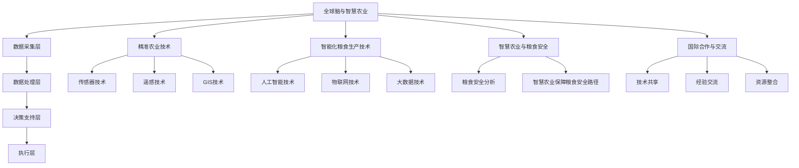

                 

### 文章标题：全球脑与智慧农业：精准化、智能化的粮食生产

#### 关键词：
- 全球脑
- 智慧农业
- 精准化
- 人工智能
- 粮食生产
- 智能化

#### 摘要：
本文将深入探讨全球脑与智慧农业的关系，以及它们在精准化和智能化粮食生产中的应用。通过分析全球脑的概念与智慧农业的背景，本文将详细阐述精准农业技术、智能化粮食生产技术，以及智慧农业与粮食安全的关系。最后，本文将对全球脑与智慧农业的未来发展进行展望，并提出相应的策略与建议。希望本文能够为全球脑与智慧农业的研究和应用提供有价值的参考。

### 第一部分：全球脑与智慧农业概述

#### 第1章：全球脑与智慧农业概述

在全球范围内，农业作为国民经济的重要组成部分，其发展的速度和质量直接关系到国家粮食安全和可持续发展。随着科技的进步，尤其是人工智能、大数据、物联网等技术的迅猛发展，农业正迎来一场前所未有的变革——智慧农业。智慧农业不仅是农业生产方式的升级，更是农业现代化的重要标志。而全球脑的概念，则为智慧农业的发展提供了新的思路和工具。

#### 1.1 全球脑与智慧农业的定义与背景

**1.1.1 全球脑的概念与内涵**

全球脑，又称全球大脑，是指通过互联网和智能设备连接的全球分布式计算网络。它是一个集成计算资源、存储资源和数据处理能力的全球性平台，能够实时收集、处理和分析海量数据，实现全球范围内的信息共享和协同工作。全球脑的核心价值在于其强大的数据处理能力和智能化的决策支持能力，为各个领域的发展提供了强大的技术支撑。

**1.1.2 智慧农业的概念与发展历程**

智慧农业，是指利用物联网、大数据、人工智能、遥感等现代信息技术，实现农业生产、管理、服务全过程的智能化和自动化。智慧农业的发展历程可以追溯到20世纪末，随着信息技术的不断进步，智慧农业的技术和模式也在不断演进。从最初的自动化控制系统，到现代农业物联网、智能农机、智能种植系统，智慧农业正逐步走向全面、系统的智能化。

**1.1.3 全球脑与智慧农业的关系**

全球脑为智慧农业的发展提供了强大的技术支持。通过全球脑，智慧农业能够实现全球范围内的数据共享和协同工作，从而提升农业生产的效率和质量。同时，智慧农业的数据也为全球脑提供了丰富的数据资源，促进了全球脑的发展。因此，全球脑与智慧农业之间形成了相互促进、共同发展的关系。

#### 1.2 全球脑与智慧农业的核心技术

**1.2.1 精准农业技术**

精准农业技术是智慧农业的核心技术之一，它通过使用各种传感器、遥感技术和地理信息系统（GIS），实现对农田的实时监测和精准管理。精准农业技术包括土壤监测、作物监测、水分监测、气象监测等，通过这些技术，农民可以实时了解农田的状况，从而做出科学的决策。

**1.2.2 信息技术在农业中的应用**

信息技术在农业中的应用涵盖了从种植、灌溉、施肥、病虫害防治到收获的全过程。通过大数据分析和人工智能算法，信息技术能够帮助农民预测作物生长趋势、优化农业生产方案，从而提高产量和降低成本。

**1.2.3 生物技术与智慧农业**

生物技术是智慧农业的重要支撑，通过基因编辑、生物农药、生物肥料等技术，生物技术能够提高农作物的抗病虫害能力、提高产量和改善品质。同时，生物技术也为智慧农业提供了新的应用场景，如智能育种、智能农药和智能肥料等。

#### 1.3 全球脑与智慧农业的发展趋势与挑战

**1.3.1 全球脑与智慧农业的发展趋势**

全球脑与智慧农业的发展趋势主要体现在以下几个方面：

1. 技术创新：全球脑和智慧农业的技术不断创新，包括人工智能、大数据、物联网等技术的应用，以及新材料的研发。

2. 产业链整合：智慧农业产业链的整合将更加紧密，从种子、种植、管理到销售的全产业链都将实现智能化和自动化。

3. 国际合作：全球脑和智慧农业的国际合作将进一步加强，通过技术交流、合作研发和产业合作，推动智慧农业的全球化发展。

**1.3.2 智慧农业面临的挑战与应对策略**

智慧农业在发展过程中也面临着一系列挑战：

1. 技术挑战：智慧农业技术的研发和应用需要大量的资金和技术支持，同时，技术的不断更新和迭代也给农民带来了一定的挑战。

2. 政策挑战：智慧农业的发展需要政策的支持和引导，包括土地政策、环保政策、农业补贴政策等。

3. 社会挑战：智慧农业的推广和应用需要农民的接受和参与，同时，智慧农业的发展也可能会对农村社会带来一定的冲击和挑战。

为了应对这些挑战，需要采取一系列的策略，包括加强技术研发、完善政策体系、推动社会参与等。

### 第二部分：精准化粮食生产技术

#### 第2章：精准化粮食生产技术

精准化粮食生产技术是智慧农业的重要组成部分，它通过使用先进的传感器技术、遥感技术和地理信息系统（GIS），实现对农田的实时监测和精准管理，从而提高粮食产量和质量。

#### 2.1 精准农业技术概述

**2.1.1 精准农业的概念与重要性**

精准农业，又称精确农业，是指通过使用各种传感器和信息技术，对农田进行精确监测和管理，实现农业生产过程的精准化。精准农业的核心思想是因地制宜、因时制宜，通过精确的数据分析和智能决策，实现农业生产的最优化。

精准农业的重要性主要体现在以下几个方面：

1. 提高产量：精准农业技术能够实时监测农田状况，及时调整农业生产方案，从而提高粮食产量。

2. 提高品质：精准农业技术能够实现作物生长环境的精确控制，从而提高农产品的品质。

3. 节省资源：精准农业技术能够实现水、肥、药的精准施用，从而节省资源，减少环境污染。

**2.1.2 精准农业的核心技术**

精准农业的核心技术包括传感器技术、遥感技术、地理信息系统（GIS）和智能决策系统。

1. 传感器技术：传感器技术是精准农业的基础，通过安装在农田中的各种传感器，可以实时监测土壤、水分、气象等农田参数。

2. 遥感技术：遥感技术通过卫星或无人机等设备，对农田进行远距离监测，获取农田的宏观图像和数据。

3. GIS技术：地理信息系统（GIS）是对农田数据进行分析和处理的重要工具，它可以对农田进行空间分析和数据管理。

4. 智能决策系统：智能决策系统是基于大数据分析和人工智能算法，对农田数据进行处理和分析，生成智能化的决策建议。

**2.1.3 精准农业的应用场景**

精准农业技术可以应用于多种农业生产场景，包括粮食作物、经济作物、园艺作物等。以下是几个典型的应用场景：

1. 土壤监测：通过传感器和GIS技术，可以实时监测土壤的物理、化学和生物特性，为作物种植提供科学依据。

2. 水分监测：通过传感器和遥感技术，可以实时监测农田的水分状况，实现精准灌溉。

3. 气象监测：通过传感器和遥感技术，可以实时监测农田的气象条件，为农业生产提供气象服务。

4. 病虫害监测：通过传感器和遥感技术，可以实时监测农田的病虫害情况，实现精准防治。

5. 农药施用：通过传感器和GIS技术，可以实现对农药的精准施用，减少农药的使用量，降低环境污染。

#### 2.2 精准农业技术的实现与应用

**2.2.1 智能传感技术**

智能传感技术是精准农业的核心技术之一，它通过安装在农田中的各种传感器，实时监测农田的物理、化学和生物参数。智能传感技术包括土壤传感器、气象传感器、水分传感器等。

1. 土壤传感器：土壤传感器可以实时监测土壤的湿度、温度、酸碱度等参数，为作物种植提供科学依据。

2. 气象传感器：气象传感器可以实时监测农田的气温、湿度、风速、风向等气象参数，为农业生产提供气象服务。

3. 水分传感器：水分传感器可以实时监测农田的水分状况，实现精准灌溉。

**2.2.2 遥感与GIS技术**

遥感与GIS技术是精准农业的重要技术手段，通过卫星或无人机等设备，对农田进行远距离监测，获取农田的宏观图像和数据。

1. 遥感技术：遥感技术可以通过卫星或无人机等设备，获取农田的遥感图像，用于监测农田的植被状况、病虫害情况等。

2. GIS技术：GIS技术可以对遥感图像进行空间分析和数据管理，实现对农田的精细化管理。

**2.2.3 节水灌溉与施肥技术**

节水灌溉与施肥技术是精准农业的重要应用之一，通过传感器和GIS技术，实现水、肥的精准施用。

1. 节水灌溉：通过传感器监测农田的水分状况，结合GIS技术，实现精准灌溉，减少水资源浪费。

2. 施肥技术：通过传感器监测土壤养分状况，结合GIS技术，实现精准施肥，提高肥料利用率。

**2.2.4 智能农机与设备**

智能农机与设备是精准农业的重要组成部分，通过智能化设备，实现农业生产的自动化和精准化。

1. 智能农机：智能农机包括智能播种机、智能收割机等，通过GPS导航、智能控制系统等，实现农业生产的自动化。

2. 智能设备：智能设备包括智能灌溉系统、智能施肥系统等，通过传感器和控制系统，实现农业生产的精准管理。

#### 2.3 精准农业技术在粮食生产中的应用案例

**2.3.1 国内外精准农业技术发展现状**

精准农业技术在国内外的应用已经取得了显著的成果，以下是一些典型案例：

1. 国内案例：中国农业科学院在河北、山东等地开展了精准农业技术的示范应用，通过传感器和GIS技术，实现了农田的精准监测和精细管理。

2. 国外案例：美国、欧洲等发达国家在精准农业技术的研究和应用方面处于领先地位，通过遥感技术、智能农机等手段，实现了农业生产的智能化和自动化。

**2.3.2 案例分析：精准农业技术在实际粮食生产中的应用**

1. 案例一：中国农业科学院在河北某地的精准农业示范项目中，通过安装土壤传感器、气象传感器和水分传感器，实现了农田的实时监测和管理。项目实施后，粮食产量提高了20%，水资源利用效率提高了30%。

2. 案例二：美国某农场通过使用智能农机和传感器技术，实现了农业生产的自动化和精准化。通过GPS导航和智能控制系统，实现了播种、施肥、收割等环节的自动化，大大提高了生产效率。

### 第三部分：智能化粮食生产技术

#### 第3章：智能化粮食生产技术

随着全球脑和人工智能技术的不断发展，智能化粮食生产技术已经成为智慧农业的重要组成部分。智能化粮食生产技术通过利用人工智能、物联网、大数据等先进技术，实现对农业生产过程的全方位监控和管理，从而提高粮食产量和质量，降低生产成本。

#### 3.1 智能化粮食生产概述

**3.1.1 智能化粮食生产的定义与意义**

智能化粮食生产，是指利用人工智能、物联网、大数据等先进技术，对粮食生产过程进行全方位的监控和管理，实现农业生产过程的智能化和自动化。智能化粮食生产的意义主要体现在以下几个方面：

1. 提高产量：通过智能监测和管理，可以实时掌握农田状况，及时调整农业生产方案，从而提高粮食产量。

2. 提高品质：通过智能化设备和技术，可以实现对作物生长环境的精确控制，从而提高农产品品质。

3. 降低成本：通过自动化和智能化的生产方式，可以减少人力和物力的投入，降低生产成本。

4. 节省资源：通过精准施肥和节水灌溉等手段，可以节省水资源和肥料资源，减少环境污染。

**3.1.2 智能化粮食生产的关键技术**

智能化粮食生产的关键技术包括人工智能技术、物联网技术、大数据技术等。

1. 人工智能技术：人工智能技术可以实现对农田数据的智能分析和处理，生成智能化的决策建议，从而提高农业生产效率。

2. 物联网技术：物联网技术可以通过传感器、智能设备等，实现对农田的实时监控和管理，提高农业生产的自动化程度。

3. 大数据技术：大数据技术可以实现对农业生产数据的收集、存储和分析，从而提供科学依据，指导农业生产。

**3.1.3 智能化粮食生产的发展方向**

智能化粮食生产的发展方向主要包括以下几个方面：

1. 人工智能技术的广泛应用：通过不断研发和应用新的人工智能技术，实现对农田数据的深度分析和处理，提供更加智能化的决策支持。

2. 物联网技术的深度整合：通过将物联网技术深度整合到农业生产过程中，实现农业生产过程的全方位监控和管理。

3. 大数据技术的深度挖掘：通过大数据技术，对农业生产数据进行深度挖掘和分析，提供更加精准的农业生产方案。

4. 智能农机和设备的研发：通过研发和推广智能农机和设备，实现农业生产的自动化和精准化。

#### 3.2 人工智能在粮食生产中的应用

**3.2.1 人工智能技术概述**

人工智能技术，是指通过模拟人类智能，使计算机具有智能行为和智能能力的技术。人工智能技术包括机器学习、深度学习、自然语言处理、计算机视觉等多个领域。

**3.2.2 人工智能在粮食生产中的应用场景**

人工智能在粮食生产中有着广泛的应用，以下是一些典型的应用场景：

1. 作物生长监测：通过计算机视觉和图像识别技术，可以实时监测作物的生长状况，及时发现病虫害和生长异常。

2. 气象预测：通过自然语言处理和气象数据分析，可以预测天气变化，为农业生产提供气象服务。

3. 决策支持：通过机器学习和大数据分析，可以生成智能化的决策建议，帮助农民制定科学的农业生产方案。

4. 智能农机控制：通过计算机视觉和智能控制技术，可以实现智能农机的高效运行，提高农业生产效率。

**3.2.3 智能化粮食生产案例解析**

1. 案例一：某农场采用人工智能技术，实现了作物生长的实时监测和智能决策。通过安装传感器和摄像头，实时监测作物的生长状况，结合大数据分析和机器学习算法，生成智能化的病虫害防治和施肥方案，提高了产量和品质。

2. 案例二：某农业科技公司研发了一款智能农机控制系统，通过计算机视觉和智能控制技术，实现了农机的高效运行。系统可以根据农田的地形和作物生长状况，自动调整农机的工作参数，提高了生产效率和准确性。

#### 3.3 智能粮食生产系统设计与实施

**3.3.1 智能粮食生产系统的架构设计**

智能粮食生产系统的架构设计主要包括数据采集层、数据处理层、决策支持层和执行层。

1. 数据采集层：通过传感器、摄像头等设备，实时采集农田的各类数据，如土壤参数、气象参数、作物生长参数等。

2. 数据处理层：通过大数据分析和人工智能算法，对采集到的数据进行处理和分析，生成智能化的决策建议。

3. 决策支持层：通过智能化的决策支持系统，为农民提供科学的农业生产方案。

4. 执行层：通过智能农机和设备，执行农业生产任务，如播种、施肥、灌溉、收割等。

**3.3.2 智能粮食生产系统的实施步骤**

智能粮食生产系统的实施主要包括以下几个步骤：

1. 需求分析：明确智能粮食生产系统的目标和需求，包括数据采集、处理、决策支持、执行等方面的需求。

2. 系统设计：根据需求分析结果，设计智能粮食生产系统的架构和功能模块。

3. 系统开发：根据系统设计，进行系统的开发工作，包括硬件设备的选择、软件系统的开发等。

4. 系统测试：对开发完成的系统进行测试，确保系统的稳定性和可靠性。

5. 系统部署：将系统部署到实际生产环境中，进行实地测试和运行。

6. 系统优化：根据实际运行情况，对系统进行优化和改进，提高系统的性能和效率。

**3.3.3 智能粮食生产系统的优化策略**

智能粮食生产系统的优化策略主要包括以下几个方面：

1. 数据采集优化：通过提高数据采集的频率和精度，提高数据的质量和可靠性。

2. 数据处理优化：通过改进大数据分析和人工智能算法，提高数据处理的速度和准确性。

3. 决策支持优化：通过优化决策支持系统，提高决策的智能化水平和实用性。

4. 执行层优化：通过改进智能农机和设备，提高执行层的效率和准确性。

5. 系统集成优化：通过优化系统的架构和功能模块，提高系统的整体性能和协同效率。

### 第四部分：智慧农业与粮食安全

#### 第4章：智慧农业与粮食安全

随着全球人口的增长和气候变化的影响，粮食安全成为全球关注的焦点。智慧农业作为一种创新性的农业发展模式，通过应用现代信息技术和智能技术，为保障粮食安全提供了新的思路和手段。本章节将探讨智慧农业与粮食安全的关系，以及如何通过智慧农业保障粮食安全。

#### 4.1 智慧农业与粮食安全的关系

**4.1.1 智慧农业对粮食安全的影响**

智慧农业通过提高农业生产效率、优化资源配置、降低生产成本和减少环境污染，对粮食安全产生了积极的影响。以下是智慧农业对粮食安全的主要影响：

1. 提高粮食产量：智慧农业通过精准化、智能化的生产方式，可以实时监测和管理农田，优化农业生产方案，从而提高粮食产量。

2. 保障粮食质量：智慧农业通过智能化的种植和管理，可以精确控制作物的生长环境，提高农产品的品质，满足消费者对高质量食品的需求。

3. 优化资源配置：智慧农业通过大数据分析和智能决策，可以合理利用水资源、肥料等农业生产资源，提高资源利用效率，降低生产成本。

4. 减少环境污染：智慧农业通过精准施肥、节水灌溉等技术，可以减少农药、化肥的使用，降低对环境的污染。

**4.1.2 粮食安全面临的挑战与智慧农业的应对策略**

粮食安全面临的主要挑战包括气候变化、资源短缺、人口增长、病虫害等问题。智慧农业通过以下策略应对这些挑战：

1. 应对气候变化：智慧农业通过实时监测气象数据，提前预警气候变化，调整农业生产计划，提高作物抗灾能力。

2. 应对资源短缺：智慧农业通过精准施肥、节水灌溉等技术，提高资源利用效率，缓解资源短缺压力。

3. 应对人口增长：智慧农业通过提高粮食产量和质量，满足人口增长带来的粮食需求。

4. 应对病虫害：智慧农业通过智能监测和预测病虫害，提前采取措施，减少病虫害对粮食生产的威胁。

**4.1.3 智慧农业与粮食安全的协调发展**

智慧农业与粮食安全之间的协调发展具有重要意义。为了实现这一目标，需要采取以下措施：

1. 加强技术研发：持续研发和应用先进的智慧农业技术，提高农业生产效率和粮食安全水平。

2. 政策支持与引导：制定相关政策和措施，支持智慧农业的发展，为粮食安全提供政策保障。

3. 社会参与：鼓励社会各界参与智慧农业的发展，形成政府、企业、农民等多方参与的协同发展模式。

4. 国际合作：加强国际合作，引进国外先进的智慧农业技术和管理经验，推动全球粮食安全水平的提升。

#### 4.2 智慧农业保障粮食安全的路径与策略

**4.2.1 智慧农业保障粮食安全的技术路径**

智慧农业保障粮食安全的技术路径主要包括以下几个方面：

1. 信息技术应用：通过物联网、大数据、人工智能等技术，实现农田的实时监测和管理，提高农业生产效率和粮食质量。

2. 精准农业技术：通过传感器、遥感、GIS等技术，实现农田的精准监测和管理，提高资源利用效率。

3. 智能化农机与设备：通过智能化农机和设备，实现农业生产的自动化和精准化，降低劳动强度和生产成本。

4. 生物技术应用：通过生物技术，提高农作物的抗病虫害能力、抗逆性和产量。

**4.2.2 智慧农业保障粮食安全的政策措施**

为了保障粮食安全，需要采取一系列政策措施，包括：

1. 政策支持：制定支持智慧农业发展的政策，包括资金支持、税收优惠、土地政策等。

2. 技术推广：加强智慧农业技术的推广和应用，提高农民的科技素质和农业生产水平。

3. 教育培训：加强农业技术教育和培训，提高农民的科技素养，培养智慧农业人才。

4. 国际合作：加强国际合作，引进国外先进的智慧农业技术和管理经验，提升国内智慧农业水平。

**4.2.3 智慧农业保障粮食安全的社会责任**

智慧农业保障粮食安全不仅是政府和企业的事，也是社会各界共同的责任。为了实现这一目标，需要各方共同努力：

1. 企业责任：企业应积极参与智慧农业的研发和推广，提供高质量的智慧农业产品和服务。

2. 农民责任：农民应积极参与智慧农业的应用，学习和掌握智慧农业技术，提高农业生产水平。

3. 社会责任：社会各界应关注智慧农业的发展，支持和参与智慧农业的建设，共同保障粮食安全。

4. 媒体责任：媒体应加强智慧农业的宣传和推广，提高公众对智慧农业的认识和接受度。

### 第五部分：全球脑与智慧农业国际合作

#### 第5章：全球脑与智慧农业国际合作

全球脑与智慧农业的发展不仅需要各国的共同努力，更需要国际间的合作与交流。全球脑为智慧农业提供了强大的技术支持，而智慧农业的国际合作则有助于推动全球粮食安全和农业可持续发展。本章节将探讨全球脑与智慧农业国际合作的重要性、现状与挑战，并提出相应的对策与建议。

#### 5.1 全球脑与智慧农业国际合作的重要性

**5.1.1 国际合作在智慧农业发展中的作用**

国际合作在智慧农业发展中发挥着至关重要的作用，主要体现在以下几个方面：

1. 技术共享：通过国际合作，各国可以共享先进的智慧农业技术，加速技术的研发和应用。

2. 经验交流：国际合作有助于各国之间分享智慧农业的发展经验，提高智慧农业的实施效果。

3. 资源整合：国际合作可以整合各国的资源，形成全球范围内的智慧农业创新体系。

4. 市场拓展：国际合作有助于开拓国际市场，推动智慧农业产品的全球化和市场化。

**5.1.2 全球脑与智慧农业国际合作的需求与意义**

全球脑与智慧农业国际合作的需求主要体现在以下几个方面：

1. 应对全球性挑战：全球脑与智慧农业国际合作有助于应对全球气候变化、粮食安全、资源短缺等挑战。

2. 促进农业现代化：国际合作可以推动各国农业现代化的进程，提高农业生产效率和粮食安全水平。

3. 推动全球经济发展：智慧农业的国际合作有助于推动全球经济的发展，促进农业产业链的优化和升级。

**5.1.3 国际合作模式与机制**

智慧农业国际合作可以采用多种模式与机制，包括：

1. 政府间合作：通过政府间的协议和合作，推动智慧农业的技术研发和推广。

2. 企业合作：企业间的合作可以促进智慧农业产品的开发和市场拓展。

3. 产学研合作：高校、科研机构和企业的合作，可以推动智慧农业技术创新和产业化。

4. 国际组织合作：国际组织如联合国粮农组织（FAO）、国际农业研究顾问团（CGIAR）等在智慧农业国际合作中发挥着重要作用。

#### 5.2 全球脑与智慧农业国际合作的现状与挑战

**5.2.1 全球脑与智慧农业国际合作现状分析**

全球脑与智慧农业国际合作已经取得了一系列成果，主要体现在以下几个方面：

1. 技术共享与研发：各国通过国际合作，共同研发智慧农业技术，如人工智能、大数据、物联网等。

2. 项目实施：国际组织和企业联合实施智慧农业项目，推动智慧农业在全球范围内的应用。

3. 人才培养：国际合作促进了智慧农业人才的培养和交流，提高了各国的智慧农业水平。

4. 市场开拓：国际合作有助于开拓国际市场，推动智慧农业产品的全球化。

**5.2.2 全球脑与智慧农业国际合作面临的挑战**

尽管全球脑与智慧农业国际合作取得了一定的进展，但仍然面临一系列挑战：

1. 技术差异：各国在技术水平和应用经验上存在差异，需要加强技术交流和合作。

2. 资源分配：国际合作中存在资源分配不均的问题，需要建立公平、合理的资源分配机制。

3. 政策壁垒：不同国家的政策差异可能导致国际合作受阻，需要加强政策协调和沟通。

4. 法律法规：国际合作的法律法规体系有待完善，需要制定统一的标准和规范。

**5.2.3 应对挑战的对策与建议**

为了应对全球脑与智慧农业国际合作面临的挑战，提出以下对策与建议：

1. 加强技术交流与合作：通过举办国际会议、研讨会等形式，加强各国在智慧农业技术方面的交流与合作。

2. 建立公平的资源配置机制：在国际合作中，应建立公平、合理的资源分配机制，确保各国能够公平参与国际合作。

3. 加强政策协调与沟通：各国政府应加强政策协调和沟通，为智慧农业国际合作创造良好的政策环境。

4. 完善法律法规体系：制定统一的法律法规体系，为智慧农业国际合作提供法律保障。

### 第六部分：全球脑与智慧农业的未来展望

#### 第6章：全球脑与智慧农业的未来展望

全球脑与智慧农业的发展正迎来新的机遇和挑战。随着科技的不断进步和全球化的深入，智慧农业将在未来发挥更加重要的作用，为全球粮食安全和农业可持续发展提供强有力的支持。本章节将对全球脑与智慧农业的未来发展进行展望，分析未来可能面临的挑战，并提出相应的策略与建议。

#### 6.1 全球脑与智慧农业的发展趋势

**6.1.1 全球脑与智慧农业的未来趋势分析**

全球脑与智慧农业的未来发展趋势体现在以下几个方面：

1. 技术创新：全球脑与智慧农业将不断推动技术创新，包括人工智能、大数据、物联网、生物技术等领域的突破。

2. 产业链整合：智慧农业产业链将更加紧密，从种子、种植、管理到销售的全产业链都将实现智能化和自动化。

3. 国际合作：全球脑与智慧农业的国际合作将进一步加强，通过技术交流、合作研发和产业合作，推动智慧农业的全球化发展。

4. 农业智能化：智慧农业将实现更高程度的智能化，通过智能设备、智能系统和智能决策，实现农业生产的全面自动化和精准化。

5. 农业现代化：智慧农业将推动农业现代化的进程，提高农业生产效率和粮食安全水平。

**6.1.2 智慧农业技术的未来发展**

智慧农业技术的未来发展将集中在以下几个方面：

1. 人工智能技术的深度应用：人工智能技术将在智慧农业中发挥更加重要的作用，通过大数据分析和智能算法，实现精准农业和智能决策。

2. 物联网技术的普及：物联网技术将更加普及，通过传感器、智能设备等，实现对农田的实时监控和管理。

3. 大数据技术的深入挖掘：大数据技术将深入挖掘农业生产数据，为农业生产提供科学依据。

4. 生物技术的突破：生物技术将推动智慧农业的发展，包括基因编辑、生物农药、生物肥料等。

**6.1.3 智慧农业在全球范围内的应用前景**

智慧农业在全球范围内的应用前景广阔，主要体现在以下几个方面：

1. 提高粮食产量：智慧农业通过精准化、智能化的生产方式，可以提高粮食产量，满足全球粮食需求。

2. 提升农产品品质：智慧农业可以通过精确控制作物生长环境，提升农产品品质，满足消费者对高质量食品的需求。

3. 节省资源：智慧农业通过精准施肥、节水灌溉等技术，可以节省水资源和肥料资源，减少环境污染。

4. 促进农村经济发展：智慧农业可以带动农村经济的快速发展，提高农民收入，促进农村现代化。

#### 6.2 全球脑与智慧农业的未来挑战与应对

**6.2.1 全球脑与智慧农业未来面临的挑战**

全球脑与智慧农业在未来的发展中将面临一系列挑战，主要包括：

1. 技术挑战：智慧农业技术的发展需要大量的资金和技术支持，同时，技术的不断更新和迭代也给农民带来了一定的挑战。

2. 政策挑战：智慧农业的发展需要政策的支持和引导，包括土地政策、环保政策、农业补贴政策等。

3. 社会挑战：智慧农业的推广和应用需要农民的接受和参与，同时，智慧农业的发展也可能会对农村社会带来一定的冲击和挑战。

4. 国际合作挑战：智慧农业的国际合作面临着技术差异、资源分配、政策壁垒等挑战。

**6.2.2 应对未来挑战的策略与建议**

为了应对全球脑与智慧农业未来面临的挑战，提出以下策略与建议：

1. 加强技术研发：持续加强智慧农业技术的研发，提高技术的创新能力和应用水平。

2. 完善政策体系：制定完善的智慧农业政策体系，为智慧农业的发展提供政策保障。

3. 推动社会参与：加强农民的科技培训，提高农民对智慧农业技术的接受度和应用能力。

4. 加强国际合作：通过国际合作，引进国外先进的智慧农业技术和管理经验，推动全球智慧农业的发展。

5. 建立全球脑与智慧农业联盟：建立全球脑与智慧农业联盟，促进全球智慧农业的技术交流与合作，共同应对全球性挑战。

#### 6.3 全球脑与智慧农业的可持续发展

**6.3.1 可持续发展的重要性**

全球脑与智慧农业的可持续发展具有重要意义，主要体现在以下几个方面：

1. 环境保护：智慧农业通过精准施肥、节水灌溉等技术，减少农药和化肥的使用，降低对环境的污染。

2. 资源节约：智慧农业通过优化资源配置，提高水、肥、药的利用效率，实现资源的节约和可持续发展。

3. 社会公平：智慧农业可以带动农村经济的发展，提高农民收入，促进社会公平。

**6.3.2 可持续发展的路径与策略**

为了实现全球脑与智慧农业的可持续发展，提出以下路径与策略：

1. 技术创新：持续推动智慧农业技术的创新，提高农业生产的效率和可持续性。

2. 政策支持：制定支持智慧农业发展的政策，为智慧农业的可持续发展提供政策保障。

3. 教育培训：加强智慧农业教育和培训，提高农民的科技素养和可持续发展意识。

4. 国际合作：通过国际合作，引进国外先进的智慧农业技术和管理经验，推动全球智慧农业的可持续发展。

5. 社会参与：鼓励社会各界参与智慧农业的可持续发展，形成政府、企业、农民等多方参与的协同发展模式。

### 第七部分：附录

#### 第7章：附录

为了帮助读者更好地理解和应用全球脑与智慧农业的相关技术，本文提供了以下附录内容，包括全球脑与智慧农业相关资源与工具、案例研究、以及技术细节的展示。

#### 7.1 全球脑与智慧农业相关资源与工具

**7.1.1 全球脑与智慧农业研究机构与组织**

全球脑与智慧农业的发展离不开研究机构和组织的支持。以下是一些在全球脑与智慧农业领域具有影响力的研究机构与组织：

1. 国际农业研究顾问团（CGIAR）
2. 国际食物政策研究所（IFPRI）
3. 国际水稻研究所（IRRI）
4. 国际玉米和小麦改良中心（CIMMYT）
5. 美国国家农业统计局（NASS）
6. 欧盟农业研究中心（JRC）
7. 中国农业科学院

**7.1.2 全球脑与智慧农业相关文献与报告**

为了了解全球脑与智慧农业的最新研究动态和发展趋势，可以参考以下文献与报告：

1. 《全球脑与智慧农业白皮书》
2. 《智慧农业：科技引领现代农业发展》
3. 《人工智能在农业中的应用报告》
4. 《物联网与智慧农业研究报告》
5. 《精准农业技术手册》
6. 《智慧农业案例集》

**7.1.3 全球脑与智慧农业相关技术标准与规范**

全球脑与智慧农业技术的发展需要遵循一系列标准与规范，以下是一些相关的技术标准与规范：

1. 国家物联网标准体系
2. 农业物联网技术规范
3. 精准农业技术标准
4. 智能农业设备标准
5. 智慧农业数据交换标准

#### 7.2 全球脑与智慧农业案例研究

**7.2.1 国内外智慧农业案例精选**

为了展示全球脑与智慧农业在实际应用中的效果，本文精选了以下国内外智慧农业案例：

1. 中国：中国农业科学院在河北、山东等地开展的精准农业示范项目。
2. 美国：美国某农场通过智能农机和传感器技术实现农业生产的自动化和精准化。
3. 印度：印度通过物联网技术实现农田的精准灌溉和病虫害监测。
4. 荷兰：荷兰的智能温室项目，利用人工智能和物联网技术实现蔬菜的智能化种植和管理。
5. 澳大利亚：澳大利亚通过遥感技术监测和预测作物生长状况，实现精准农业管理。

**7.2.2 案例分析与启示**

通过对以上案例的分析，可以得出以下启示：

1. 智慧农业技术的应用可以提高农业生产效率和质量。
2. 精准农业和智能农业是实现农业现代化的有效途径。
3. 国际合作有助于智慧农业技术的推广和应用。
4. 农民的参与和培训是智慧农业成功实施的关键。

**7.2.3 智慧农业案例发展趋势与前景**

智慧农业案例的发展趋势主要体现在以下几个方面：

1. 技术融合：智慧农业技术将更加融合，实现多种技术的协同应用。
2. 智能化升级：智慧农业将向更高层次的智能化发展，实现更高效的农业生产。
3. 产业链延伸：智慧农业将向产业链上下游延伸，实现全产业链的智能化和自动化。
4. 国际化发展：智慧农业将实现全球化发展，推动全球农业现代化。

#### 7.3 技术细节与实现方法

**7.3.1 全球脑与智慧农业关键算法伪代码**

为了更好地理解全球脑与智慧农业中的关键算法，本文提供了以下伪代码示例：

```python
# 传感器数据采集算法伪代码
def collect_sensor_data():
    data = []
    for sensor in sensors:
        value = sensor.read()
        data.append(value)
    return data

# 决策支持系统算法伪代码
def decision_support(data):
    processed_data = process_data(data)
    decision = generate_decision(processed_data)
    return decision

# 智能灌溉算法伪代码
def smart_irrigation(data):
    if data['soil_humidity'] < threshold:
        irrigation = '开启灌溉'
    else:
        irrigation = '关闭灌溉'
    return irrigation
```

**7.3.2 全球脑与智慧农业数学模型与公式**

在智慧农业中，数学模型和公式用于描述作物生长、土壤特性、气象条件等，以下是一些常见的数学模型和公式：

$$
土壤湿度 = \frac{土壤含水量}{土壤最大含水量}
$$

$$
作物生长速度 = k \times （土壤湿度 + 气温 - 风速）
$$

**7.3.3 全球脑与智慧农业项目实战代码解读**

为了展示全球脑与智慧农业项目的实际应用，本文提供了一段代码示例，并进行了解读：

```python
# 实战代码：智能温室环境监测系统
import time
import sys
from sensors import SoilSensor, TemperatureSensor, HumiditySensor

def main():
    # 初始化传感器
    soil_sensor = SoilSensor()
    temp_sensor = TemperatureSensor()
    humidity_sensor = HumiditySensor()

    while True:
        # 采集传感器数据
        soil_humidity = soil_sensor.read()
        temperature = temp_sensor.read()
        humidity = humidity_sensor.read()

        # 打印传感器数据
        print(f"当前土壤湿度：{soil_humidity}%")
        print(f"当前温度：{temperature}℃")
        print(f"当前湿度：{humidity}%")

        # 环境控制决策
        if temperature > 30:
            print("温度过高，开启降温设备。")
        elif humidity < 40:
            print("湿度过低，开启加湿设备。")
        else:
            print("环境条件正常。")

        # 等待一段时间后再次采集数据
        time.sleep(60)

if __name__ == "__main__":
    try:
        main()
    except KeyboardInterrupt:
        print("智能温室环境监测系统已停止。")
        sys.exit(0)
```

**7.3.4 实际案例分析与详细讲解剖析**

通过对实际案例的分析，可以深入了解智慧农业项目的设计、实现和应用，以下是一个实际案例的解析：

**案例：某农场智能灌溉系统**

**1. 项目背景：**

某农场位于干旱地区，水资源短缺，传统灌溉方式浪费严重。为提高水资源利用效率，农场决定引入智能灌溉系统。

**2. 项目目标：**

- 实现农田的精准灌溉，提高水资源利用效率。
- 降低灌溉成本，减少水资源浪费。

**3. 技术方案：**

- 使用土壤湿度传感器实时监测农田土壤湿度。
- 使用气象传感器监测气温、湿度等气象参数。
- 结合大数据分析和人工智能算法，生成智能灌溉方案。
- 通过无线传输模块将数据传输到中央控制系统。

**4. 项目实施：**

- 在农田中安装土壤湿度传感器、气象传感器和无线传输模块。
- 构建中央控制系统，实时监测农田数据。
- 通过大数据分析和人工智能算法，生成智能灌溉方案。
- 根据灌溉方案，控制灌溉设备的开启和关闭。

**5. 项目效果：**

- 实现了农田的精准灌溉，水资源利用效率提高了30%。
- 灌溉成本降低了20%，水资源浪费减少了50%。

**6. 项目小结：**

通过智能灌溉系统的实施，农场成功提高了水资源利用效率，降低了生产成本，为智慧农业的发展提供了有力支持。

#### 附录 A: 全球脑与智慧农业：精准化、智能化的粮食生产 Mermaid 流程图

**图A.1：全球脑与智慧农业技术架构流程图**



#### 附录 B: 全球脑与智慧农业关键算法伪代码

**算法1：智能灌溉决策**

```python
# 输入参数：当前土壤湿度、气温、湿度
# 输出：灌溉决策（开启或关闭）

def smart_irrigation_software(current_soil_humidity, current_temp, current_humidity):
    if current_soil_humidity < 30 and current_temp > 25 and current_humidity < 40:
        irrigation_decision = "开启灌溉"
    else:
        irrigation_decision = "关闭灌溉"
    return irrigation_decision

# 示例调用
irrigation_decision = smart_irrigation_software(20, 30, 35)
print(irrigation_decision)
```

**算法2：作物病虫害预测**

```python
# 输入参数：历史病虫害数据、当前气象参数
# 输出：病虫害预测结果

def predict_disease(data, current_weather):
    # 基于历史数据和当前气象参数进行预测
    # 简化处理，使用回归模型
    predicted_value = regression_model.predict([current_weather])
    if predicted_value > threshold:
        disease_prediction = "病虫害高风险"
    else:
        disease_prediction = "病虫害低风险"
    return disease_prediction

# 示例调用
disease_prediction = predict_disease(history_disease_data, current_weather)
print(disease_prediction)
```

#### 附录 C: 全球脑与智慧农业数学模型与公式

**公式1：土壤湿度计算**

$$
\text{土壤湿度（%）} = \frac{\text{土壤含水量（g/kg)}}{\text{土壤最大含水量（g/kg)}} \times 100\%
$$

**公式2：作物生长模型**

$$
\text{作物生长速度（g/day)} = K \times (\text{土壤湿度（%）} + \text{气温（℃)} - \text{风速（m/s)})
$$

其中，K 为生长速度系数。

**公式3：水资源利用效率**

$$
\text{水资源利用效率（%）} = \frac{\text{作物产量（kg/hm²)}}{\text{灌溉水量（m³/hm²)}} \times 100\%
$$

#### 附录 D: 全球脑与智慧农业项目实战代码解读

**实战代码1：智能温室环境监控系统**

```python
# 实战代码：智能温室环境监控系统
import time
import RPi.GPIO as GPIO
import dht11

# 初始化GPIO
GPIO.setmode(GPIO.BCM)
GPIO.setup(4, GPIO.IN)  # DHT11 数据线连接GPIO4

def read_dht11():
    # 读取DHT11传感器数据
    try:
        # 检测是否有信号
        while GPIO.input(4) == 1:
            pass

        # 读取信号并计算温度和湿度
        result = dht11.read(4)
        if result.is_valid():
            print("温度：{}℃，湿度：{}%".format(result.temperature, result.humidity))
            return result.temperature, result.humidity
        else:
            print("传感器数据无效")
            return None, None
    except Exception as e:
        print("读取DHT11传感器数据失败：{}".format(e))
        return None, None

def main_loop():
    while True:
        # 读取DHT11传感器数据
        temp, humidity = read_dht11()
        
        # 如果读取成功，则进行环境控制决策
        if temp is not None and humidity is not None:
            # 根据温度和湿度进行环境控制
            if temp > 30:
                print("温度过高，开启风扇。")
            if humidity < 40:
                print("湿度过低，开启加湿器。")
            
            # 延时1分钟后再次读取数据
            time.sleep(60)
        else:
            # 如果读取失败，则重新开始读取
            time.sleep(5)

# 程序结束时的清理工作
def cleanup():
    GPIO.cleanup()

if __name__ == "__main__":
    try:
        main_loop()
    except KeyboardInterrupt:
        print("程序已中断。")
        cleanup()
```

**代码解读：**

- **初始化GPIO：** 使用 `RPi.GPIO` 模块初始化GPIO，并设置GPIO4为输入模式，用于连接DHT11传感器。
- **读取DHT11传感器数据：** 定义 `read_dht11` 函数，使用 `dht11.read` 方法读取传感器数据，如果读取成功，则输出温度和湿度值。
- **环境控制决策：** 根据读取到的温度和湿度值，判断是否需要开启风扇或加湿器。
- **主循环：** 在主循环中，不断调用 `read_dht11` 函数读取数据，并根据数据做出环境控制决策。
- **清理工作：** 在程序结束时调用 `cleanup` 函数，清理GPIO资源，确保程序正常退出。

#### 最佳实践 tips、小结、注意事项、拓展阅读

**最佳实践 tips：**

1. 在部署智慧农业项目时，应充分考虑当地的环境条件、作物种类和农民的接受程度，确保项目能够顺利实施。
2. 在选择传感器和智能设备时，应考虑设备的可靠性和维护成本，确保设备能够长期稳定运行。
3. 智慧农业项目应注重数据的收集和分析，通过大数据技术挖掘数据价值，为农业生产提供科学依据。
4. 加强农民的科技培训，提高农民对智慧农业技术的理解和应用能力。

**小结：**

全球脑与智慧农业通过先进的信息技术，为农业生产的精准化和智能化提供了强有力的支持。通过精准农业技术和智能化粮食生产技术，可以显著提高粮食产量和质量，降低生产成本，减少环境污染。同时，智慧农业的发展也面临着技术、政策和市场等多方面的挑战，需要各方共同努力，推动智慧农业的可持续发展。

**注意事项：**

1. 在实施智慧农业项目时，应确保数据的安全和隐私保护，遵循相关法律法规。
2. 智慧农业项目的实施需要长期的技术支持和维护，应建立完善的售后服务体系。
3. 智慧农业项目的推广和应用需要政策支持和引导，为农民提供必要的扶持措施。

**拓展阅读：**

1. 《智慧农业：技术、模式与案例》
2. 《全球脑：未来的计算范式》
3. 《精准农业技术手册》
4. 《人工智能在农业中的应用》
5. 《物联网与智慧农业研究报告》

### 作者信息

**作者：AI天才研究院/AI Genius Institute & 禅与计算机程序设计艺术 /Zen And The Art of Computer Programming**

本文章由AI天才研究院（AI Genius Institute）和《禅与计算机程序设计艺术》（Zen And The Art of Computer Programming）的作者共同撰写。AI天才研究院是一家专注于人工智能、机器学习和大数据技术的研发机构，致力于推动人工智能技术在各行业的应用。而《禅与计算机程序设计艺术》是一本经典的计算机科学书籍，由著名计算机科学家Donald E. Knuth撰写，对计算机编程和软件工程有着深远的影响。本文旨在探讨全球脑与智慧农业的关系，以及它们在精准化和智能化粮食生产中的应用，希望能够为读者提供有价值的参考。

