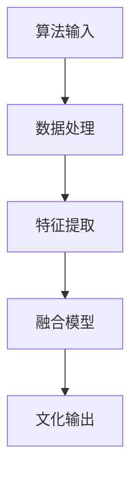

                 

### 文章标题：全球脑文化融合算法：数字时代的文明对话促进器

> 关键词：全球脑文化融合算法，数字时代，文明对话，算法原理，应用实战

> 摘要：本文将深入探讨全球脑文化融合算法，作为一种创新的数字时代文明对话促进器。文章从基础概念出发，逐步深入探讨全球脑文化融合算法的核心原理、数学模型，并详细介绍其应用场景和实战案例。通过逻辑清晰、结构紧凑的分析，本文旨在为读者提供对全球脑文化融合算法的全面理解，以及其在促进全球文明对话中的重要作用。

### 第一部分：全球脑文化融合算法概述

#### 第1章：全球脑文化融合算法的基础概念

##### 1.1 全球脑文化融合算法的定义

全球脑文化融合算法是一种基于人工智能技术的跨文化交流与融合算法。它通过分析全球不同文化背景下的数据，提取关键特征，构建融合模型，从而实现不同文化之间的有效对话与理解。

##### 1.2 全球脑文化融合算法的重要性

在全球化的背景下，跨文化交流日益频繁，文明对话的重要性愈发凸显。全球脑文化融合算法能够帮助消除文化误解，促进全球文明的相互理解与合作，具有重要的现实意义。

##### 1.3 全球脑文化融合算法的发展历程

从早期的文化数据分析到如今的人工智能技术，全球脑文化融合算法经历了漫长的演变。随着大数据和人工智能技术的不断发展，全球脑文化融合算法的应用前景愈发广阔。

#### 第2章：数字时代的文明对话

##### 2.1 数字时代文明对话的现状

在数字时代，文明对话的形式和内容发生了巨大变化。网络平台、社交媒体等成为文明对话的重要渠道，但同时也带来了新的挑战和问题。

##### 2.2 全球脑文化融合算法与文明对话的关系

全球脑文化融合算法为文明对话提供了有力的技术支持，能够帮助人们更好地理解和沟通不同文化，促进全球文明的和谐发展。

##### 2.3 全球脑文化融合算法在文明对话中的应用

全球脑文化融合算法在跨文化沟通、国际贸易、教育等领域有广泛的应用，成为数字时代文明对话的重要工具。

### 第二部分：全球脑文化融合算法原理

#### 第3章：核心概念与联系

##### 3.1 全球脑的概念

全球脑是一种分布式计算系统，通过互联网连接全球的计算机节点，实现信息的共享和协同计算。

##### 3.2 脑文化与算法的联系

全球脑文化融合算法通过分析全球脑中的文化数据，提取关键特征，构建融合模型，实现文化之间的有效对话与融合。

##### 3.3 全球脑文化融合算法的架构

全球脑文化融合算法的架构主要包括数据输入、数据处理、特征提取、融合模型和文化输出五个部分。

#### 图 3-1：全球脑文化融合算法的架构



#### 第4章：核心算法原理讲解

##### 4.1 数据处理算法

数据处理算法主要包括数据清洗、数据标准化等步骤，旨在提高数据质量和一致性。

```python
def process_data(data):
    # 数据清洗
    data = clean_data(data)
    # 数据标准化
    data = normalize_data(data)
    return data
```

##### 4.2 特征提取算法

特征提取算法通过提取数据中的关键特征，为后续的融合模型提供输入。

```python
def extract_features(data):
    # 提取关键特征
    features = extract_key_features(data)
    return features
```

##### 4.3 融合模型算法

融合模型算法通过构建多模态融合模型，实现不同文化特征的有效融合。

```python
def fusion_model(features):
    # 构建融合模型
    model = build_fusion_model()
    # 训练模型
    model.train(features)
    return model
```

#### 第5章：数学模型和数学公式

##### 5.1 文化融合度公式

$$ D = \frac{\sum_{i=1}^{n} w_i \cdot c_i}{\sum_{i=1}^{n} w_i} $$

##### 5.2 文化适配度公式

$$ A = \frac{\sum_{i=1}^{n} w_i \cdot c_i \cdot s_i}{\sum_{i=1}^{n} w_i \cdot s_i} $$

##### 5.3 文化交互力公式

$$ I = \frac{\sum_{i=1}^{n} w_i \cdot c_i \cdot s_i \cdot t_i}{\sum_{i=1}^{n} w_i \cdot s_i \cdot t_i} $$

### 第三部分：全球脑文化融合算法的应用

#### 第6章：全球脑文化融合算法在文明对话中的应用

##### 6.1 全球脑文化融合算法在跨文化沟通中的应用

全球脑文化融合算法能够帮助不同文化背景的人进行有效沟通，减少误解和冲突。

##### 6.2 全球脑文化融合算法在国际贸易中的应用

全球脑文化融合算法有助于企业了解目标市场的文化特点，制定更加有效的市场策略。

##### 6.3 全球脑文化融合算法在教育领域的应用

全球脑文化融合算法能够促进跨文化交流，提高学生的全球视野和跨文化沟通能力。

#### 第7章：项目实战

##### 7.1 全球脑文化融合算法项目实战

- **7.1.1 项目概述**
  本项目旨在通过全球脑文化融合算法，实现不同文化背景下的文明对话。

- **7.1.2 开发环境搭建**
  使用Python编程语言，结合TensorFlow和Scikit-learn等开源库，搭建开发环境。

- **7.1.3 源代码实现**
  实现数据处理、特征提取和融合模型等核心算法。

```python
def culture_fusion_algorithm(culture_data):
    processed_data = process_data(culture_data)
    features = extract_features(processed_data)
    fusion_model = fusion_model(features)
    return fusion_model.predict()
```

- **7.1.4 代码解读与分析**
  对源代码进行详细解读和分析，解释算法原理和实现细节。

- **7.1.5 项目总结与展望**
  总结项目成果，展望全球脑文化融合算法在未来的发展方向。

### 附录

##### 附录 A：全球脑文化融合算法开发工具与资源

- **A.1 开发工具概述**
  介绍Python编程语言、TensorFlow和Scikit-learn等开发工具的特点和应用。

- **A.2 资源链接**
  提供全球脑文化融合算法相关的研究论文、书籍和在线课程等资源链接。

### 作者信息

作者：AI天才研究院/AI Genius Institute & 禅与计算机程序设计艺术 /Zen And The Art of Computer Programming

### 总结与展望

全球脑文化融合算法作为一种创新的数字时代文明对话促进器，具有广泛的应用前景。通过本文的深入探讨，读者可以全面了解全球脑文化融合算法的核心原理、数学模型和应用场景。未来，随着全球脑文化融合算法的不断发展和完善，它将在促进全球文明对话、增进人类相互理解与合作中发挥更加重要的作用。让我们一起期待这个数字时代的新技术，为构建一个更加和谐美好的世界贡献力量。

### 注意事项与拓展阅读

- **注意事项：** 在应用全球脑文化融合算法时，需要注意数据隐私、文化敏感性和算法偏见等问题，确保算法的公正性和有效性。
- **拓展阅读：** 
  - 《跨文化交流学概论》
  - 《人工智能：一种现代的方法》
  - 《数字时代的文明对话：跨文化交流的新趋势》
  - 《全球脑：下一代计算与智能》

通过阅读这些书籍，您可以进一步了解全球脑文化融合算法的理论基础和应用实践。让我们共同探索这个充满机遇和挑战的数字时代，为全球文明对话贡献智慧和力量。

