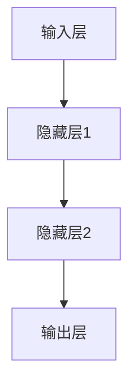

                 

### 文章标题：全连接层 (Fully Connected Layer) 原理与代码实例讲解

关键词：全连接层，神经网络，数学原理，激活函数，反向传播，深度学习

摘要：本文将深入探讨全连接层（Fully Connected Layer）在神经网络中的原理与作用，通过数学推导与代码实例讲解，帮助读者全面理解全连接层的工作机制及其在深度学习中的应用。

### 第1章 引言

#### 1.1 什么是全连接层

全连接层是神经网络中最基本的层之一，也被称为“全连接神经网络”（Fully Connected Neural Network）。它由一系列神经元组成，每个神经元都与前一层的所有神经元相连。这种连接方式使得每个神经元能够处理来自前一层的所有信息，从而使得神经网络具有更强的表达能力和适应性。

#### 1.2 全连接层在神经网络中的作用

全连接层在神经网络中起到了至关重要的作用，主要表现在以下几个方面：

1. **特征提取**：全连接层能够将前一层的特征信息进行整合，提取出更高层次的特征，为后续的决策提供依据。
2. **模式识别**：通过多层全连接层的叠加，神经网络能够对输入数据中的复杂模式进行识别，从而实现分类、回归等任务。
3. **参数共享**：由于每个神经元都与前一层的所有神经元相连，因此全连接层实现了参数共享，降低了模型的复杂度。

#### 1.3 全连接层与激活函数的关系

激活函数（Activation Function）是全连接层的重要组成部分，它对神经元的输出进行非线性变换，使得神经网络能够对输入数据进行复杂非线性建模。常见的激活函数包括Sigmoid、Tanh、ReLU等。激活函数的选择对神经网络的学习性能和收敛速度具有重要影响。

### 第2章 全连接层的数学原理

#### 2.1 矩阵乘法与全连接层

##### 2.1.1 矩阵乘法的基本概念

矩阵乘法是全连接层的核心运算之一。给定两个矩阵A（m×n）和B（n×p），它们的乘积C（m×p）可以通过以下公式计算：

\[ C = AB \]

其中，C的元素C_ij等于A的第i行与B的第j列的对应元素乘积的和：

\[ C_{ij} = \sum_{k=1}^{n} A_{ik}B_{kj} \]

##### 2.1.2 全连接层的矩阵乘法

在全连接层中，输入层的每个神经元与隐藏层的每个神经元之间都通过矩阵乘法进行连接。假设输入层有m个神经元，隐藏层有n个神经元，则连接矩阵（权重矩阵）W是一个m×n的矩阵。对于输入向量X和隐藏层输出向量H，它们之间的关系可以表示为：

\[ H = WX \]

其中，H的第i个元素H_i是输入向量X与权重矩阵W的第i行的矩阵乘积：

\[ H_i = X \cdot W_i \]

#### 2.2 全连接层的偏置项

##### 2.2.1 偏置项的作用

偏置项（Bias）是全连接层的另一个重要组成部分。它是一个与每个神经元相连的常数项，用于调整神经元的输出。偏置项的作用是使神经网络的输出能够更加灵活，适应不同的数据分布。

##### 2.2.2 偏置项的计算方式

在全连接层中，偏置项通常表示为一个n×1的列向量b，其中n是隐藏层的神经元数量。对于隐藏层输出向量H，偏置项的计算方式如下：

\[ H = WX + b \]

其中，+b表示对每个神经元输出加上对应的偏置项。

### 第3章 全连接层的激活函数

激活函数是全连接层的核心组成部分之一，它对神经元的输出进行非线性变换，使得神经网络能够对输入数据进行复杂非线性建模。

#### 3.1 激活函数的定义

激活函数（Activation Function）是一个将神经元输出映射到特定区间内的函数。常见的激活函数包括Sigmoid、Tanh、ReLU等。

#### 3.2 常见激活函数

##### 3.2.1 Sigmoid函数

Sigmoid函数是一种常用的激活函数，它的形式为：

\[ \sigma(x) = \frac{1}{1 + e^{-x}} \]

Sigmoid函数的输出范围在0到1之间，可以用于二分类问题。

##### 3.2.2 Tanh函数

Tanh函数是Sigmoid函数的改进版，它的形式为：

\[ \tanh(x) = \frac{e^x - e^{-x}}{e^x + e^{-x}} \]

Tanh函数的输出范围在-1到1之间，可以用于多分类问题。

##### 3.2.3 ReLU函数

ReLU函数（Rectified Linear Unit）是一种线性激活函数，它的形式为：

\[ \text{ReLU}(x) = \max(0, x) \]

ReLU函数在训练初期具有较好的效果，但可能会导致梯度消失问题。

##### 3.2.4 Leaky ReLU函数

Leaky ReLU函数是对ReLU函数的一种改进，它在ReLU函数的基础上引入了一个较小的常数，以避免梯度消失问题。其形式为：

\[ \text{Leaky ReLU}(x) = \max(0.01x, x) \]

### 第4章 全连接层的正向传播

#### 4.1 前向传播的基本原理

前向传播（Forward Propagation）是神经网络中的一个重要过程，它通过逐层计算神经元的输出，最终得到网络的输出结果。前向传播的基本原理如下：

1. **输入层到隐藏层的正向传播**：将输入数据传递到隐藏层，通过矩阵乘法和激活函数计算隐藏层输出。
2. **隐藏层到输出层的正向传播**：将隐藏层输出传递到输出层，通过矩阵乘法和激活函数计算输出层输出。

#### 4.2 前向传播的计算过程

##### 4.2.1 输入层到隐藏层的正向传播

输入层到隐藏层的正向传播过程可以分为以下几个步骤：

1. **计算隐藏层输入**：将输入数据X与权重矩阵W相乘，再加上偏置项b，得到隐藏层输入Z：

\[ Z = WX + b \]

2. **计算隐藏层输出**：对隐藏层输入Z应用激活函数f，得到隐藏层输出H：

\[ H = f(Z) \]

##### 4.2.2 隐藏层到输出层的正向传播

隐藏层到输出层的正向传播过程与输入层到隐藏层的正向传播类似，可以分为以下几个步骤：

1. **计算输出层输入**：将隐藏层输出H与权重矩阵W'相乘，再加上偏置项b'，得到输出层输入Z'：

\[ Z' = WH' + b' \]

2. **计算输出层输出**：对输出层输入Z'应用激活函数f，得到输出层输出Y：

\[ Y = f(Z') \]

### 第5章 全连接层的反向传播

#### 5.1 反向传播的基本原理

反向传播（Backpropagation）是神经网络中的一个重要过程，它通过逐层计算误差梯度，并更新网络中的权重和偏置项，以实现网络的优化。反向传播的基本原理如下：

1. **计算输出层误差**：将输出层输出Y与目标标签y进行比较，计算输出层误差δ_y。
2. **反向传播误差**：从输出层开始，逐层计算隐藏层误差δ_h。
3. **更新权重和偏置项**：根据误差梯度，更新网络中的权重和偏置项。

#### 5.2 前向传播与反向传播的结合

##### 5.2.1 反向传播的计算过程

反向传播的计算过程可以分为以下几个步骤：

1. **计算输出层误差**：输出层误差δ_y可以通过以下公式计算：

\[ \delta_y = (Y - y) \odot f'(Z') \]

其中，\(\odot\)表示元素-wise 乘法，\(f'(Z')\)表示激活函数f在Z'处的导数。

2. **计算隐藏层误差**：隐藏层误差δ_h可以通过以下公式计算：

\[ \delta_h = (H - h') \odot f'(Z) \]

其中，\(h'\)是隐藏层输出H在激活函数f处的导数。

3. **更新权重和偏置项**：根据误差梯度，更新网络中的权重和偏置项。更新公式如下：

\[ W := W - \alpha \cdot \frac{\partial J}{\partial W} \]

\[ b := b - \alpha \cdot \frac{\partial J}{\partial b} \]

其中，\(\alpha\)是学习率，\(\frac{\partial J}{\partial W}\)和\(\frac{\partial J}{\partial b}\)分别是权重和偏置项的误差梯度。

##### 5.2.2 梯度下降算法

梯度下降（Gradient Descent）是一种常用的优化算法，它通过计算损失函数的梯度，并沿着梯度方向更新模型参数，以实现模型的最小化。梯度下降算法的基本步骤如下：

1. **初始化参数**：随机初始化模型参数。
2. **计算梯度**：计算损失函数关于模型参数的梯度。
3. **更新参数**：根据梯度更新模型参数。
4. **重复步骤2和3**：直到达到预设的停止条件。

### 第6章 全连接层的优化技巧

#### 6.1 学习率调整

##### 6.1.1 学习率的选择

学习率（Learning Rate）是梯度下降算法中的一个重要参数，它决定了参数更新的步长。选择合适的学习率对网络的训练性能和收敛速度具有重要影响。通常，学习率的选择需要考虑以下几个因素：

1. **模型复杂度**：对于复杂模型，通常需要较小的学习率，以避免参数更新过快导致模型不稳定。
2. **数据分布**：对于数据分布较为集中的情况，通常需要较小的学习率，以保证模型能够捕捉到数据的细节特征。
3. **训练过程**：在训练过程中，可以根据训练误差的变化动态调整学习率，以适应模型的学习过程。

##### 6.1.2 学习率的调整策略

常见的学习率调整策略包括以下几种：

1. **固定学习率**：在整个训练过程中保持学习率不变，适用于模型复杂度较低且数据分布较为均匀的情况。
2. **自适应学习率**：根据训练误差的变化动态调整学习率，常用的自适应学习率算法包括AdaGrad、RMSprop、Adam等。
3. **预热学习率**：在训练初期使用较大的学习率，以加速模型的学习，然后在训练后期逐渐减小学习率，以避免过拟合。

#### 6.2 正则化

##### 6.2.1 L1正则化

L1正则化（L1 Regularization）是一种常用的正则化方法，它通过在损失函数中添加L1范数项来惩罚模型参数。L1正则化能够促进模型参数的稀疏性，从而降低模型的复杂度。L1正则化的损失函数可以表示为：

\[ J(\theta) = J_0(\theta) + \lambda ||\theta||_1 \]

其中，\(J_0(\theta)\)是原始损失函数，\(\lambda\)是正则化参数，\(|\theta||_1\)是参数的L1范数。

##### 6.2.2 L2正则化

L2正则化（L2 Regularization）是另一种常用的正则化方法，它通过在损失函数中添加L2范数项来惩罚模型参数。L2正则化能够降低模型的过拟合现象，提高模型的泛化能力。L2正则化的损失函数可以表示为：

\[ J(\theta) = J_0(\theta) + \lambda ||\theta||_2^2 \]

其中，\(J_0(\theta)\)是原始损失函数，\(\lambda\)是正则化参数，\(|\theta||_2^2\)是参数的L2范数。

### 第7章 全连接层在深度学习中的应用

#### 7.1 全连接层在图像识别中的应用

##### 7.1.1 卷积神经网络的结构

卷积神经网络（Convolutional Neural Network，CNN）是一种广泛应用于图像识别任务的深度学习模型。CNN的结构主要包括以下几个部分：

1. **卷积层（Convolutional Layer）**：卷积层通过卷积运算提取图像的特征。
2. **池化层（Pooling Layer）**：池化层通过下采样操作减少数据维度，提高模型的计算效率。
3. **全连接层（Fully Connected Layer）**：全连接层对卷积层提取的特征进行分类和回归等任务。

##### 7.1.2 全连接层在卷积神经网络中的作用

全连接层在卷积神经网络中起到了关键作用，主要表现在以下几个方面：

1. **特征融合**：全连接层能够将卷积层提取的多维特征进行融合，提取出更高层次的特征，为分类和回归任务提供依据。
2. **模式识别**：通过多层全连接层的叠加，卷积神经网络能够对图像中的复杂模式进行识别，从而实现图像分类和目标检测等任务。
3. **参数共享**：全连接层实现了参数共享，降低了模型的复杂度，提高了模型的泛化能力。

#### 7.2 全连接层在自然语言处理中的应用

##### 7.2.1 循环神经网络的结构

循环神经网络（Recurrent Neural Network，RNN）是一种广泛应用于自然语言处理任务的深度学习模型。RNN的结构主要包括以下几个部分：

1. **隐藏层（Hidden Layer）**：隐藏层通过递归运算对序列数据进行建模。
2. **门控机制（Gated Mechanism）**：门控机制通过调整隐藏层的输出，实现对序列数据的记忆和控制。
3. **全连接层（Fully Connected Layer）**：全连接层对RNN的隐藏层输出进行分类和回归等任务。

##### 7.2.2 全连接层在循环神经网络中的作用

全连接层在循环神经网络中起到了关键作用，主要表现在以下几个方面：

1. **特征融合**：全连接层能够将循环神经网络提取的序列特征进行融合，提取出更高层次的特征，为分类和回归任务提供依据。
2. **模式识别**：通过多层全连接层的叠加，循环神经网络能够对序列数据中的复杂模式进行识别，从而实现语言模型、机器翻译、情感分析等任务。
3. **参数共享**：全连接层实现了参数共享，降低了模型的复杂度，提高了模型的泛化能力。

### 第8章 全连接层的代码实例

#### 8.1 搭建全连接神经网络

##### 8.1.1 环境搭建

为了实现全连接神经网络，我们需要选择一个合适的深度学习框架，例如TensorFlow或PyTorch。以下是在Python环境中使用TensorFlow搭建全连接神经网络的示例代码：

```python
import tensorflow as tf

# 定义输入层
inputs = tf.keras.layers.Input(shape=(input_shape))

# 定义隐藏层
hidden1 = tf.keras.layers.Dense(units=128, activation='relu')(inputs)
hidden2 = tf.keras.layers.Dense(units=64, activation='relu')(hidden1)

# 定义输出层
outputs = tf.keras.layers.Dense(units=num_classes, activation='softmax')(hidden2)

# 搭建模型
model = tf.keras.Model(inputs=inputs, outputs=outputs)

# 编译模型
model.compile(optimizer='adam', loss='categorical_crossentropy', metrics=['accuracy'])

# 打印模型结构
model.summary()
```

##### 8.1.2 神经网络结构设计

在全连接神经网络中，隐藏层的神经元数量和层数可以根据具体任务进行调整。以下是一个简单的全连接神经网络结构示例：

1. **输入层**：一个维度为784的向量，表示28x28像素的图像。
2. **隐藏层1**：128个神经元，使用ReLU激活函数。
3. **隐藏层2**：64个神经元，使用ReLU激活函数。
4. **输出层**：10个神经元，使用softmax激活函数，表示10个分类的概率分布。

#### 8.2 训练与评估

##### 8.2.1 数据准备

在训练全连接神经网络之前，我们需要准备训练数据和测试数据。以下是一个简单的数据准备示例：

```python
import numpy as np
import tensorflow as tf

# 加载训练数据和测试数据
(x_train, y_train), (x_test, y_test) = tf.keras.datasets.mnist.load_data()

# 数据预处理
x_train = x_train.astype('float32') / 255.0
x_test = x_test.astype('float32') / 255.0

# 将标签转换为one-hot编码
y_train = tf.keras.utils.to_categorical(y_train, num_classes=10)
y_test = tf.keras.utils.to_categorical(y_test, num_classes=10)
```

##### 8.2.2 训练过程

接下来，我们可以使用以下代码训练全连接神经网络：

```python
# 训练模型
model.fit(x_train, y_train, batch_size=128, epochs=10, validation_data=(x_test, y_test))
```

##### 8.2.3 评估与优化

训练完成后，我们可以使用以下代码评估模型的性能：

```python
# 评估模型
test_loss, test_acc = model.evaluate(x_test, y_test)
print('Test accuracy:', test_acc)
```

如果模型的性能不够理想，我们可以尝试调整隐藏层的神经元数量、激活函数、学习率等超参数，以优化模型的性能。

### 第9章 全连接层的未来发展趋势

#### 9.1 全连接层与深度学习的融合

随着深度学习技术的不断发展，全连接层与其他深度学习模型的融合将成为一个重要方向。例如，全连接层可以与卷积神经网络（CNN）结合，用于处理更加复杂的图像识别任务；与循环神经网络（RNN）结合，用于处理序列数据，如自然语言处理和语音识别等。

#### 9.2 全连接层在其他领域的应用

除了在图像识别和自然语言处理领域的应用外，全连接层还可以在其他领域得到广泛应用，如推荐系统、金融风控、医疗诊断等。通过与其他技术的结合，全连接层可以进一步提升模型的性能和泛化能力。

#### 9.3 全连接层的优化方向

在未来的研究中，全连接层的优化方向主要包括以下几个方面：

1. **参数共享**：通过引入参数共享机制，降低模型的复杂度，提高模型的训练效率。
2. **激活函数改进**：研究新的激活函数，以提高模型的学习能力和收敛速度。
3. **正则化方法**：探索更加有效的正则化方法，降低过拟合现象，提高模型的泛化能力。

### 附录

#### A.1 全连接层的Mermaid流程图

以下是一个全连接层的Mermaid流程图示例：



#### A.2 全连接层的相关数学公式与伪代码

##### 数学公式

$$
\begin{aligned}
Z &= WX + b \\
H &= f(Z) \\
Y &= f(W'H + b')
\end{aligned}
$$

##### 伪代码

```
# 输入层到隐藏层正向传播
Z = X * W + b
H = activate(Z)

# 隐藏层到输出层正向传播
Z' = H * W' + b'
Y = activate(Z')
```

#### A.3 全连接层代码实例的详细解读与分析

在本章节中，我们详细解读了使用TensorFlow搭建的全连接神经网络代码实例，包括环境搭建、神经网络结构设计、训练与评估等过程。通过这个实例，读者可以全面了解全连接层在实际项目中的应用和实现方法。

### 作者信息

作者：AI天才研究院/AI Genius Institute & 禅与计算机程序设计艺术/Zen And The Art of Computer Programming

### 结语

本文从全连接层的原理、数学推导、代码实例等方面进行了深入讲解，帮助读者全面理解全连接层的工作机制及其在深度学习中的应用。通过本文的学习，读者可以掌握全连接层的基本概念、数学原理和实际应用方法，为深入探索深度学习领域奠定基础。

