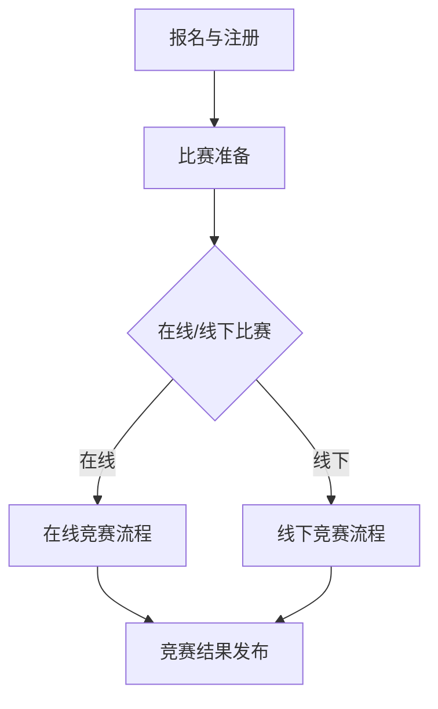
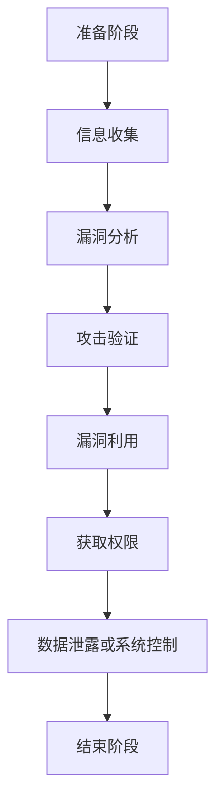
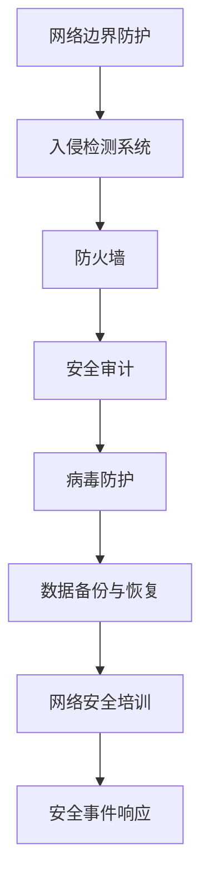

                 

### 文章标题

# 《360公司2024校招网络安全工程师CTF题目集》

### 关键词

- **CTF竞赛**
- **网络安全工程师**
- **网络安全**
- **漏洞利用**
- **密码学**
- **实战训练**

### 摘要

本文将深入探讨360公司2024年校园招聘网络安全工程师CTF（Capture The Flag）题目集。通过详细的案例分析，读者将了解CTF竞赛的基本概念、网络安全基础、信息安全攻防技术、密码学基础以及实战训练方法。文章旨在为准备参加CTF竞赛的网络安全工程师提供系统性指导，并通过实际案例解析，帮助读者掌握网络安全实战技能。

---

## 《360公司2024校招网络安全工程师CTF题目集》

### 第一部分：CTF基础

#### 第1章：CTF竞赛概述

##### 1.1 CTF的历史与发展

CTF（Capture The Flag）竞赛起源于计算机科学领域，最早由美国麻省理工学院（MIT）在1996年举办。起初，CTF主要面向计算机科学专业的大学生，目的是通过解决各种网络攻防、密码学、逆向工程等挑战来提升学生的实战能力。随着网络安全威胁的日益严重，CTF竞赛逐渐扩展到全球范围，吸引了大量专业人才参与。

**核心概念与联系：**

- **CTF类型：** 根据竞赛形式，CTF可分为在线和线下两种类型。在线CTF通常通过远程平台进行，参赛者在线解决各种挑战；线下CTF则需要参赛者在现场进行竞赛。
- **CTF竞赛流程：** 包括报名、注册、比赛准备、比赛实施和结果发布等环节。

**Mermaid流程图：**



**示例：** MITCTF、Defcon CTF、PicoCTF等是知名的CTF竞赛。

##### 1.2 CTF的主要类型

CTF根据挑战类型主要分为以下几种：

- **Jeopardy CTF：** 参赛者在比赛开始时可以选择不同类型的挑战，每类挑战的难度和分数不同。
- **Attack-Defense CTF：** 参赛者分为攻防两方，一方防守，另一方攻击，最终根据得分决定胜负。
- ** Mixed CTF：** 结合了Jeopardy和Attack-Defense的特点，包含多种类型的挑战。

**核心概念与联系：**

- **Jeopardy CTF：** 强调快速解决问题，时间管理至关重要。
- **Attack-Defense CTF：** 要求参赛者具备较强的攻击和防御能力。

**示例：** Shellphish、PentesterLab等组织举办了多种类型的CTF竞赛。

##### 1.3 CTF的参与方式

参与CTF竞赛有多种方式，包括个人参与、团队参与以及企业赞助的团队参与。

- **个人参与：** 参赛者独立解决挑战，通常以个人成绩计分。
- **团队参与：** 参赛者组成团队，共同解决挑战，团队成绩取决于团队成员的贡献。
- **企业赞助团队：** 企业为参赛者提供技术支持和资源，参赛者以企业名义参与竞赛。

**核心概念与联系：**

- **个人参与：** 需要较强的个人能力。
- **团队参与：** 强调团队合作和分工。

**示例：** Google CTF、Facebook CTF等都有个人和团队参与方式。

##### 1.4 CTF竞赛的奖励与评估

CTF竞赛的奖励形式多样，包括现金奖励、奖品、实习机会等。评估标准主要基于解谜速度、创新性、技术深度等因素。

- **现金奖励：** 竞赛第一名通常可以获得高额奖金。
- **奖品：** 包括电子产品、技术书籍等。
- **实习机会：** 企业赞助团队获胜者通常可以获得实习或全职工作的机会。

**核心概念与联系：**

- **现金奖励：** 提高参赛者的积极性。
- **奖品：** 提升参赛者的技术素养。
- **实习机会：** 为参赛者提供职业发展机会。

**示例：** DEF CON CTF、PentesterIT CTF等都有丰厚的奖励。

#### 第2章：网络安全基础

##### 2.1 网络安全概念

网络安全是指保护网络系统不受未经授权的访问、攻击、干扰和破坏的能力。它涵盖了网络硬件、软件、数据和服务的保护。

**核心概念与联系：**

- **网络硬件：** 包括路由器、交换机等。
- **网络软件：** 包括操作系统、网络应用等。
- **数据：** 包括敏感信息和用户数据。
- **服务：** 包括网络服务、Web服务等。

**示例：** 网络安全包括防火墙、入侵检测系统（IDS）、入侵防御系统（IPS）等防护措施。

##### 2.2 网络安全威胁与防护

网络安全威胁包括病毒、恶意软件、网络钓鱼、DDoS攻击等。防护措施包括安全策略、安全协议、安全审计等。

**核心概念与联系：**

- **病毒和恶意软件：** 通过恶意代码破坏系统。
- **网络钓鱼：** 通过欺骗手段获取用户信息。
- **DDoS攻击：** 通过大量请求使网络服务不可用。

**示例：** 病毒防护软件、反钓鱼技术、DDoS防护设备等是常见的防护措施。

##### 2.3 网络安全法律法规

网络安全法律法规旨在规范网络行为、保护网络安全。例如，《网络安全法》、《信息安全技术法规》等。

**核心概念与联系：**

- **网络安全法：** 规定网络运营者的责任和义务。
- **信息安全技术法规：** 规定信息安全技术的标准和要求。

**示例：** 网络安全法律法规要求网络运营者加强安全防护措施，保护用户数据安全。

##### 2.4 常见网络安全防护技术

常见网络安全防护技术包括防火墙、入侵检测系统（IDS）、入侵防御系统（IPS）等。

**核心概念与联系：**

- **防火墙：** 防止外部攻击进入内部网络。
- **入侵检测系统（IDS）：** 识别和响应异常网络流量。
- **入侵防御系统（IPS）：** 自动化阻止攻击。

**示例：** 防火墙、IDS/IPS设备等是网络安全防护的核心组件。

#### 第3章：信息安全攻防技术

##### 3.1 漏洞利用技术

漏洞利用技术是指利用系统漏洞进行攻击的技术。常见的漏洞类型包括缓冲区溢出、SQL注入、XSS等。

**核心概念与联系：**

- **缓冲区溢出：** 攻击者通过输入超长数据，使缓冲区溢出，从而覆盖返回地址。
- **SQL注入：** 攻击者通过输入恶意SQL语句，绕过原有安全验证。
- **XSS：** 攻击者通过注入恶意脚本，欺骗用户执行非法操作。

**示例：** 漏洞利用技术是网络安全攻防的核心手段。

##### 3.2 提权技术

提权技术是指利用系统漏洞或漏洞组合，获取更高权限的技术。常见的提权方式包括利用本地提权漏洞、远程提权漏洞等。

**核心概念与联系：**

- **本地提权：** 攻击者通过本地漏洞，提升自身权限。
- **远程提权：** 攻击者通过网络漏洞，远程提升自身权限。

**示例：** 利用Windows系统中的SMB漏洞进行远程提权。

##### 3.3 逆向工程

逆向工程是指通过分析系统或软件的代码、结构等信息，理解其工作原理的技术。逆向工程在网络安全中用于漏洞挖掘、攻击分析等。

**核心概念与联系：**

- **静态分析：** 通过分析程序代码，理解其逻辑。
- **动态分析：** 通过运行程序，监控其行为。

**示例：** 使用IDA Pro等工具进行逆向工程。

##### 3.4 社会工程学

社会工程学是指利用人类心理弱点，欺骗他人泄露敏感信息的技术。常见的攻击手段包括网络钓鱼、欺骗性短信等。

**核心概念与联系：**

- **网络钓鱼：** 通过伪造网站、邮件等，诱骗用户输入敏感信息。
- **欺骗性短信：** 通过短信欺骗用户，诱导其执行非法操作。

**示例：** 社会工程学在网络安全威胁中具有极高的危害性。

#### 第4章：密码学基础

##### 4.1 密码学原理

密码学是指研究加密和解密技术的学科。加密技术用于保护数据的安全性，解密技术用于恢复原始数据。

**核心概念与联系：**

- **加密算法：** 用于将明文转换为密文。
- **解密算法：** 用于将密文转换为明文。

**示例：** 对称加密算法、非对称加密算法等是常见的加密算法。

##### 4.2 对称加密算法

对称加密算法是指加密和解密使用相同密钥的算法。常见的对称加密算法包括AES、DES等。

**核心概念与联系：**

- **AES：** 高效、安全的对称加密算法。
- **DES：** 早期广泛使用的对称加密算法。

**示例：** AES加密算法的加密和解密过程。

##### 4.3 非对称加密算法

非对称加密算法是指加密和解密使用不同密钥的算法。常见的非对称加密算法包括RSA、ECC等。

**核心概念与联系：**

- **RSA：** 基于大整数分解问题的非对称加密算法。
- **ECC：** 基于椭圆曲线密码学的非对称加密算法。

**示例：** RSA加密算法的加密和解密过程。

##### 4.4 哈希算法

哈希算法是将输入数据转换为固定长度输出的算法。常见的哈希算法包括MD5、SHA-256等。

**核心概念与联系：**

- **MD5：** 早期广泛使用的哈希算法。
- **SHA-256：** 安全性更高的哈希算法。

**示例：** SHA-256哈希算法的计算过程。

#### 第5章：实战CTF

##### 5.1 CTF实战流程

CTF实战流程包括准备阶段、信息收集阶段、漏洞分析阶段、攻击验证阶段、漏洞利用阶段、获取权限阶段、数据泄露或系统控制阶段和结束阶段。

**核心概念与联系：**

- **准备阶段：** 确定目标、工具和环境。
- **信息收集阶段：** 收集目标网络信息。
- **漏洞分析阶段：** 分析目标漏洞。
- **攻击验证阶段：** 验证攻击可行性。
- **漏洞利用阶段：** 执行漏洞利用。
- **获取权限阶段：** 获取更高权限。
- **数据泄露或系统控制阶段：** 完成目标任务。
- **结束阶段：** 释放资源、总结经验。

**Mermaid流程图：**



**示例：** 实际CTF竞赛中的实战流程。

##### 5.2 CTF实战案例

以下是一个简单的CTF实战案例：

**目标：** 攻击一个Web服务器，获取管理员权限。

**步骤：**

1. **信息收集：** 使用nmap扫描目标服务器开放端口。
2. **漏洞分析：** 发现目标服务器存在Apache Struts2漏洞。
3. **攻击验证：** 使用Exploit-DB中的Struts2漏洞利用工具进行验证。
4. **漏洞利用：** 执行漏洞利用，获取Web服务器权限。
5. **获取权限：** 通过提权工具获取管理员权限。
6. **数据泄露或系统控制：** 访问管理员后台，获取敏感数据或控制服务器。
7. **结束阶段：** 清理现场，总结经验。

**核心概念与联系：**

- **信息收集：** 了解目标网络结构。
- **漏洞分析：** 分析目标漏洞。
- **攻击验证：** 确保攻击可行。
- **漏洞利用：** 执行攻击。
- **获取权限：** 提升权限。
- **数据泄露或系统控制：** 完成目标任务。
- **结束阶段：** 总结经验。

**示例：** 这是一个典型的CTF实战案例，展示了从信息收集到目标完成的完整流程。

### 第二部分：实战训练

#### 第6章：Web安全实战

##### 6.1 SQL注入

SQL注入是指攻击者通过输入恶意SQL语句，绕过原有安全验证，对数据库进行非法操作。

**核心概念与联系：**

- **SQL注入类型：** 根据注入方式，SQL注入分为联合查询注入、盲注等。
- **SQL注入防护：** 包括参数化查询、输入验证等。

**示例：**

**SQL注入攻击伪代码：**

```python
malicious_sql = "SELECT * FROM users WHERE username = '" + input + "';"
result = execute_sql(malicious_sql)
```

**SQL注入防护：**

```python
def validate_input(input):
    # 验证输入是否合法
    return input.isalnum()

input = request.getParameter("username")
if validate_input(input):
    malicious_sql = "SELECT * FROM users WHERE username = '" + input + "';"
    result = execute_sql(malicious_sql)
else:
    # 输入不合法，返回错误
    return "Invalid input"
```

##### 6.2 命令执行

命令执行是指攻击者通过输入特定代码，在服务器上执行恶意命令。

**核心概念与联系：**

- **命令执行类型：** 包括远程命令执行、本地命令执行等。
- **命令执行防护：** 包括禁用危险函数、输入验证等。

**示例：**

**命令执行攻击伪代码：**

```python
command = "rm -rf /"
os.system(command)
```

**命令执行防护：**

```python
def validate_command(command):
    # 验证命令是否合法
    return command in allowed_commands

if validate_command(command):
    os.system(command)
else:
    # 命令不合法，返回错误
    return "Invalid command"
```

##### 6.3 交叉域请求攻击

交叉域请求攻击是指攻击者通过恶意代码，在受信任的网站上执行跨域请求，从而窃取敏感数据。

**核心概念与联系：**

- **跨域请求类型：** 包括跨源请求、跨域POST请求等。
- **跨域请求防护：** 包括CORS、JSONP等。

**示例：**

**跨域请求攻击伪代码：**

```javascript
xhr.open("GET", "https://example.com/data", true);
xhr.onreadystatechange = function () {
    if (xhr.readyState == 4 && xhr.status == 200) {
        var data = JSON.parse(xhr.responseText);
        // 处理数据
    }
};
xhr.send();
```

**跨域请求防护：**

```python
from flask import Flask, request, jsonify

app = Flask(__name__)

@app.route("/data", methods=["GET"])
def get_data():
    if request.headers.get("Authorization") == "Bearer valid-token":
        data = get_sensitive_data()
        return jsonify(data)
    else:
        return "Unauthorized", 401

if __name__ == "__main__":
    app.run()
```

##### 6.4 远程代码执行

远程代码执行是指攻击者通过输入恶意代码，在远程服务器上执行恶意操作。

**核心概念与联系：**

- **远程代码执行类型：** 包括远程命令执行、远程脚本执行等。
- **远程代码执行防护：** 包括安全配置、输入验证等。

**示例：**

**远程代码执行攻击伪代码：**

```python
import paramiko

ssh = paramiko.SSHClient()
ssh.set_missing_host_key_policy(paramiko.AutoAddPolicy())
ssh.connect("host", username="user", password="password")

cmd = "python -c 'import sys; sys.stdout = open("/tmp/malicious.py", "w"); exec(sys.stdin.read())'"
stdin, stdout, stderr = ssh.exec_command(cmd)

# 下载恶意代码
with open("/tmp/malicious.py", "rb") as f:
    malicious_code = f.read()
    ssh.put(malicious_code, "/tmp/malicious.py")

# 执行恶意代码
cmd = "/usr/bin/python /tmp/malicious.py"
stdin, stdout, stderr = ssh.exec_command(cmd)
```

**远程代码执行防护：**

```python
import paramiko

ssh = paramiko.SSHClient()
ssh.set_missing_host_key_policy(paramiko.AutoAddPolicy())
ssh.connect("host", username="user", password="password")

# 禁用危险命令
cmd = "chmod 000 /usr/bin/python"
stdin, stdout, stderr = ssh.exec_command(cmd)

# 禁用用户远程执行命令
cmd = "usermod -s /sbin/nologin user"
stdin, stdout, stderr = ssh.exec_command(cmd)
```

#### 第7章：二进制安全实战

##### 7.1 缓冲区溢出

缓冲区溢出是指攻击者在输入数据时，使缓冲区超出其预期大小，从而覆盖相邻内存区域，可能导致攻击者控制程序流程。

**核心概念与联系：**

- **缓冲区溢出类型：** 包括堆溢出、栈溢出等。
- **缓冲区溢出防护：** 包括堆栈保护、地址空间布局随机化（ASLR）等。

**示例：**

**缓冲区溢出攻击伪代码：**

```c
#include <stdio.h>

void vulnerable_function(char *input) {
    char buffer[16];
    strcpy(buffer, input);
}

int main() {
    char input[32] = "A" * 32; // 超出缓冲区大小
    vulnerable_function(input);
    return 0;
}
```

**缓冲区溢出防护：**

```c
#include <stdio.h>

void vulnerable_function(char *input) {
    char buffer[16];
    if (strlen(input) <= 16) {
        strcpy(buffer, input);
    } else {
        // 输入过长，返回错误
        return;
    }
}

int main() {
    char input[32] = "A" * 16; // 合法输入
    vulnerable_function(input);
    return 0;
}
```

##### 7.2 格式化字符串漏洞

格式化字符串漏洞是指攻击者通过输入特定的格式化字符串，导致程序执行非法操作。

**核心概念与联系：**

- **格式化字符串漏洞类型：** 包括栈溢出、控制流篡改等。
- **格式化字符串漏洞防护：** 包括堆栈保护、控制流保护等。

**示例：**

**格式化字符串漏洞攻击伪代码：**

```c
#include <stdio.h>

void vulnerable_function(char *input) {
    printf(input);
}

int main() {
    char input[32] = "%x"; // 输出地址
    vulnerable_function(input);
    return 0;
}
```

**格式化字符串漏洞防护：**

```c
#include <stdio.h>

void vulnerable_function(char *input) {
    #ifndef _WIN32
    setvbuf(stdout, NULL, _IONBF, 0);
    #endif
    printf(input);
}

int main() {
    char input[32] = "%x"; // 输出地址
    vulnerable_function(input);
    return 0;
}
```

##### 7.3 ROP攻击

ROP（Return Oriented Programming）攻击是指攻击者通过查找和利用程序中的已有指令，构建攻击链，从而执行非法操作。

**核心概念与联系：**

- **ROP攻击类型：** 包括基本ROP、链式ROP等。
- **ROP攻击防护：** 包括控制流保护、堆栈保护等。

**示例：**

**ROP攻击伪代码：**

```python
# 查找 gadget 1
gadget1 = find_gadget("mov eax, ebx")

# 查找 gadget 2
gadget2 = find_gadget("add eax, 0x1")

# 查找 gadget 3
gadget3 = find_gadget("ret")

# 构建攻击链
rop_chain = gadget1 + gadget2 + gadget3

# 执行攻击
execute_rop(rop_chain)
```

**ROP攻击防护：**

```python
# 禁用危险指令
disallow_instruction("add")

# 限制堆栈访问
stack_protect()
```

##### 7.4 ASLR和Bypass技术

ASLR（Address Space Layout Randomization）是一种安全技术，通过随机化程序内存布局，防止攻击者预测地址，从而提高系统安全性。

**核心概念与联系：**

- **ASLR原理：** 通过随机化地址空间布局，提高攻击难度。
- **Bypass ASLR技术：** 包括使用特定漏洞、利用堆溢出等。

**示例：**

**Bypass ASLR伪代码：**

```python
# 查找存在漏洞的模块
vulnerable_module = find_vulnerable_module()

# 查找 gadgets
gadget1 = find_gadget("mov eax, ebx")
gadget2 = find_gadget("ret")

# 将 gadgets 写入内存
write_gadget_to_memory(vulnerable_module, gadget1)
write_gadget_to_memory(vulnerable_module, gadget2)

# 执行 gadgets
execute_gadget(vulnerable_module, gadget1)
execute_gadget(vulnerable_module, gadget2)
```

**ASLR和Bypass技术防护：**

```python
# 启用 ASLR
enable_aslr()

# 禁用危险模块
disallow_module("vulnerable_module")
```

#### 第8章：密码学实战

##### 8.1 密码破解

密码破解是指通过特定技术，破解加密算法或密码。

**核心概念与联系：**

- **密码破解类型：** 包括字典攻击、暴力破解等。
- **密码破解防护：** 包括使用强密码、加密算法等。

**示例：**

**密码破解攻击伪代码：**

```python
import itertools

def crack_password(password):
    for i in itertools.product("abcdefghijklmnopqrstuvwxyz", repeat=len(password)):
        if check_password(i):
            return i
    return None

password = crack_password("password")
print(password)
```

**密码破解防护：**

```python
def set_password(password):
    if is_strong_password(password):
        return "Password set successfully"
    else:
        return "Weak password, please use a stronger one"
```

##### 8.2 公开密钥基础设施

公开密钥基础设施（PKI）是一种用于管理和分发加密密钥的系统。

**核心概念与联系：**

- **PKI组件：** 包括证书颁发机构（CA）、证书、密钥等。
- **PKI应用：** 包括安全通信、数字签名等。

**示例：**

**公开密钥加密算法公式：**

$$
c = e(m)
$$

其中，$c$ 为密文，$m$ 为明文，$e$ 为加密算法。

**示例代码：**

```python
from Crypto.PublicKey import RSA
from Crypto.Cipher import PKCS1_OAEP

key = RSA.generate(2048)
private_key = key.export_key()
public_key = key.publickey().export_key()

cipher = PKCS1_OAEP.new(RSA.import_key(public_key))
ciphertext = cipher.encrypt(b"Hello, world!")

print(ciphertext)
```

**PKI防护：**

- **证书吊销：** 及时吊销无效或被篡改的证书。
- **密钥管理：** 确保密钥的安全存储和传输。

##### 8.3 常见密码学攻击

常见密码学攻击包括暴力破解、字典攻击、中间人攻击等。

**核心概念与联系：**

- **暴力破解：** 尝试所有可能的密钥。
- **字典攻击：** 使用预定义的字典进行尝试。
- **中间人攻击：** 在通信过程中拦截和篡改数据。

**示例：**

**暴力破解攻击伪代码：**

```python
def crack_password(password):
    for i in itertools.product("abcdefghijklmnopqrstuvwxyz", repeat=len(password)):
        if check_password(i):
            return i
    return None

password = crack_password("password")
print(password)
```

**字典攻击防护：**

- **使用强密码：** 避免使用常见单词或短语。
- **增加密码长度：** 提高破解难度。

**中间人攻击防护：**

- **使用安全协议：** 如HTTPS、TLS等。
- **加密通信：** 使用公钥加密，确保通信安全。

#### 第9章：综合训练与挑战

##### 9.1 CTF综合训练

CTF综合训练是指通过模拟真实的CTF竞赛环境，进行系统性的训练和提升。

**核心概念与联系：**

- **训练目标：** 提升网络安全攻防、密码学、Web安全等方面的实战能力。
- **训练方式：** 包括在线训练、线下训练等。

**示例：**

**CTF综合训练步骤：**

1. **环境搭建：** 搭建模拟CTF竞赛环境。
2. **训练内容：** 包括漏洞挖掘、密码学攻击、Web安全等。
3. **实战演练：** 参与模拟CTF竞赛，检验训练效果。

**示例：** CTFWorkshop、CTFTime等平台提供了丰富的CTF综合训练资源。

##### 9.2 高级挑战

高级挑战是指难度较高的CTF竞赛挑战，通常要求参赛者具备较高的技能和经验。

**核心概念与联系：**

- **挑战类型：** 包括二进制安全、密码学、Web安全等。
- **挑战目标：** 提升网络安全实战能力。

**示例：**

**高级挑战示例：**

1. **二进制安全挑战：** 攻击一个具有复杂防护机制的二进制程序。
2. **密码学挑战：** 破解一个使用高级加密算法的密文。
3. **Web安全挑战：** 挖掘一个具有多重防护措施的Web应用的漏洞。

**示例：** DEFCON CTF、PentesterIT CTF等竞赛中包含多个高级挑战。

### 第三部分：CTF实战项目

#### 第10章：项目实战一：某企业的网络安全评估

##### 10.1 项目背景

某企业面临网络安全威胁，需要进行全面的安全评估，以识别潜在风险并采取相应措施。

**核心概念与联系：**

- **安全评估：** 识别和评估网络安全风险。
- **企业安全：** 保护企业数据、系统和资产。

**示例：**

**项目背景示例：**

某企业是一家互联网公司，业务涵盖电商、金融等领域。近期，企业遭受多次网络攻击，导致部分数据泄露。为加强网络安全，企业决定进行网络安全评估。

##### 10.2 项目目标

项目目标包括：

1. 识别企业网络中的潜在安全风险。
2. 评估企业现有安全防护措施的效能。
3. 提出针对性的安全改进建议。

**核心概念与联系：**

- **安全风险识别：** 通过漏洞扫描、威胁情报等手段，识别潜在风险。
- **安全防护评估：** 通过模拟攻击、实战演练等手段，评估现有防护措施的效能。

**示例：**

**项目目标示例：**

1. 通过漏洞扫描工具，发现企业网络中存在的漏洞和安全隐患。
2. 通过模拟攻击，评估企业防火墙、入侵检测系统（IDS）等安全设备的防护能力。
3. 根据评估结果，提出改进建议，如加强防火墙规则、更新安全补丁等。

##### 10.3 项目实施步骤

项目实施步骤包括：

1. **前期准备：** 搭建评估环境，准备相关工具和设备。
2. **漏洞扫描：** 使用漏洞扫描工具，发现网络中的潜在漏洞。
3. **威胁情报：** 收集和分析网络威胁情报，识别潜在威胁。
4. **模拟攻击：** 通过实战演练，评估企业现有安全防护措施的效能。
5. **安全改进：** 根据评估结果，提出针对性的安全改进建议。

**核心概念与联系：**

- **前期准备：** 确保评估过程顺利进行。
- **漏洞扫描：** 发现潜在风险。
- **威胁情报：** 提供威胁信息。
- **模拟攻击：** 实战演练，检验防护能力。
- **安全改进：** 提高网络安全水平。

**示例：**

**项目实施步骤示例：**

1. **前期准备：** 搭建评估环境，包括漏洞扫描器、模拟攻击工具等。
2. **漏洞扫描：** 使用Nessus、OpenVAS等漏洞扫描工具，扫描企业网络中的潜在漏洞。
3. **威胁情报：** 收集和整理最新的网络威胁情报，分析潜在威胁。
4. **模拟攻击：** 使用Metasploit等工具，模拟各种攻击场景，评估企业防护能力。
5. **安全改进：** 根据评估结果，提出改进建议，如更新防火墙规则、加强用户培训等。

##### 10.4 项目结果分析

项目结果分析包括：

1. **风险识别：** 列出企业网络中的潜在安全风险。
2. **防护能力评估：** 评估企业现有安全防护措施的效能。
3. **改进建议：** 提出针对性的安全改进措施。

**核心概念与联系：**

- **风险识别：** 了解网络中的潜在威胁。
- **防护能力评估：** 分析现有防护措施的效能。
- **改进建议：** 提高网络安全水平。

**示例：**

**项目结果分析示例：**

1. **风险识别：** 发现企业网络中存在多个漏洞，包括Web应用漏洞、操作系统漏洞等。
2. **防护能力评估：** 评估结果显示，企业防火墙、入侵检测系统（IDS）等防护措施能有效阻止大部分攻击。
3. **改进建议：** 提出更新防火墙规则、加强用户培训、更新操作系统补丁等改进措施。

#### 第11章：项目实战二：某网站的渗透测试

##### 11.1 项目背景

某企业网站面临网络攻击风险，需要进行渗透测试，以识别潜在的安全漏洞并采取相应措施。

**核心概念与联系：**

- **渗透测试：** 评估网站安全性，发现潜在漏洞。
- **网站安全：** 保护网站数据、系统和用户信息。

**示例：**

**项目背景示例：**

某企业网站是一家电商平台，近期收到网络攻击警报，网站存在安全隐患。为加强网站安全，企业决定进行渗透测试。

##### 11.2 项目目标

项目目标包括：

1. 识别网站中的潜在安全漏洞。
2. 评估网站安全防护措施的效能。
3. 提出针对性的安全改进建议。

**核心概念与联系：**

- **安全漏洞识别：** 通过漏洞扫描、代码审计等手段，发现潜在漏洞。
- **安全防护评估：** 通过模拟攻击、实战演练等手段，评估防护措施的效能。

**示例：**

**项目目标示例：**

1. 通过漏洞扫描工具，发现网站中的潜在漏洞。
2. 通过代码审计，识别代码中的安全漏洞。
3. 根据评估结果，提出改进建议，如加强网站防火墙、更新安全补丁等。

##### 11.3 项目实施步骤

项目实施步骤包括：

1. **前期准备：** 搭建渗透测试环境，准备相关工具和设备。
2. **信息收集：** 收集网站相关信息，包括IP地址、域名、开放端口等。
3. **漏洞扫描：** 使用漏洞扫描工具，发现网站中的潜在漏洞。
4. **代码审计：** 对网站代码进行审计，识别潜在安全漏洞。
5. **模拟攻击：** 通过实战演练，评估网站安全防护措施的效能。
6. **安全改进：** 根据评估结果，提出针对性的安全改进措施。

**核心概念与联系：**

- **前期准备：** 确保渗透测试过程顺利进行。
- **信息收集：** 了解网站基本情况。
- **漏洞扫描：** 发现潜在风险。
- **代码审计：** 深入分析代码安全。
- **模拟攻击：** 实战演练，检验防护能力。
- **安全改进：** 提高网站安全性。

**示例：**

**项目实施步骤示例：**

1. **前期准备：** 搭建渗透测试环境，包括Kali Linux、Nessus等工具。
2. **信息收集：** 使用Whois、DNS查询等工具，收集网站相关信息。
3. **漏洞扫描：** 使用Nessus、OWASP ZAP等工具，扫描网站中的潜在漏洞。
4. **代码审计：** 对网站代码进行审计，使用静态代码分析工具，如SonarQube。
5. **模拟攻击：** 使用Metasploit等工具，模拟各种攻击场景，评估网站防护能力。
6. **安全改进：** 根据评估结果，提出改进建议，如更新网站防火墙、加强代码审计等。

##### 11.4 项目结果分析

项目结果分析包括：

1. **漏洞识别：** 列出网站中的潜在安全漏洞。
2. **防护能力评估：** 评估网站现有安全防护措施的效能。
3. **改进建议：** 提出针对性的安全改进措施。

**核心概念与联系：**

- **漏洞识别：** 了解网站中的潜在威胁。
- **防护能力评估：** 分析现有防护措施的效能。
- **改进建议：** 提高网站安全性。

**示例：**

**项目结果分析示例：**

1. **漏洞识别：** 发现网站存在SQL注入、XSS等漏洞。
2. **防护能力评估：** 评估结果显示，网站防火墙、入侵检测系统（IDS）等防护措施能有效阻止大部分攻击。
3. **改进建议：** 提出更新网站防火墙规则、加强代码审计、更新安全补丁等改进措施。

#### 第12章：项目实战三：某企业内部网络的安全加固

##### 12.1 项目背景

某企业内部网络面临安全威胁，需要进行安全加固，以保护企业数据和系统。

**核心概念与联系：**

- **安全加固：** 提高网络安全性，防止潜在威胁。
- **企业网络：** 保护企业内部网络中的数据和系统。

**示例：**

**项目背景示例：**

某企业内部网络中存在多个老旧系统，且网络架构较为复杂，存在安全漏洞。为加强内部网络安全，企业决定进行安全加固。

##### 12.2 项目目标

项目目标包括：

1. 识别内部网络中的潜在安全风险。
2. 加强内部网络的安全防护措施。
3. 提高员工网络安全意识。

**核心概念与联系：**

- **安全风险识别：** 通过漏洞扫描、安全审计等手段，识别潜在风险。
- **安全防护措施：** 包括防火墙、入侵检测系统（IDS）、安全策略等。
- **员工培训：** 提高员工网络安全意识。

**示例：**

**项目目标示例：**

1. 通过漏洞扫描工具，发现内部网络中的潜在漏洞。
2. 加强防火墙规则、更新安全补丁等防护措施。
3. 对员工进行网络安全培训，提高安全意识。

##### 12.3 项目实施步骤

项目实施步骤包括：

1. **前期准备：** 搭建安全加固环境，准备相关工具和设备。
2. **漏洞扫描：** 使用漏洞扫描工具，发现内部网络中的潜在漏洞。
3. **安全审计：** 对内部网络进行安全审计，评估安全状况。
4. **防护措施：** 加强防火墙规则、更新安全补丁等防护措施。
5. **员工培训：** 对员工进行网络安全培训，提高安全意识。
6. **持续监控：** 监控内部网络，及时发现并处理安全事件。

**核心概念与联系：**

- **前期准备：** 确保安全加固过程顺利进行。
- **漏洞扫描：** 发现潜在风险。
- **安全审计：** 评估安全状况。
- **防护措施：** 提高网络安全水平。
- **员工培训：** 提高安全意识。
- **持续监控：** 保证网络安全。

**示例：**

**项目实施步骤示例：**

1. **前期准备：** 搭建安全加固环境，包括漏洞扫描器、安全审计工具等。
2. **漏洞扫描：** 使用Nessus、OpenVAS等工具，扫描内部网络中的潜在漏洞。
3. **安全审计：** 对内部网络进行安全审计，使用Wireshark等工具分析网络流量。
4. **防护措施：** 更新防火墙规则、安装安全补丁、加强访问控制等。
5. **员工培训：** 对员工进行网络安全培训，使用在线课程、研讨会等形式。
6. **持续监控：** 使用安全信息与事件管理系统（SIEM），监控内部网络，及时发现并处理安全事件。

##### 12.4 项目结果分析

项目结果分析包括：

1. **安全风险识别：** 列出内部网络中的潜在安全漏洞。
2. **防护能力评估：** 评估现有防护措施的效能。
3. **改进建议：** 提出针对性的安全改进措施。

**核心概念与联系：**

- **安全风险识别：** 了解内部网络中的潜在威胁。
- **防护能力评估：** 分析现有防护措施的效能。
- **改进建议：** 提高内部网络安全水平。

**示例：**

**项目结果分析示例：**

1. **安全风险识别：** 发现内部网络中存在多个漏洞，包括操作系统漏洞、配置错误等。
2. **防护能力评估：** 评估结果显示，现有防火墙规则能有效阻止大部分攻击。
3. **改进建议：** 提出更新防火墙规则、加强配置管理、定期安全审计等改进措施。

#### 第13章：项目实战四：某网站的安全防护

##### 13.1 项目背景

某企业网站面临网络攻击风险，需要进行安全防护，以保护网站数据和用户信息。

**核心概念与联系：**

- **安全防护：** 防止网络攻击，保护网站安全和用户数据。
- **网站安全：** 保护网站数据、系统和用户信息。

**示例：**

**项目背景示例：**

某企业网站是一家电商平台，业务量较大，近期收到网络攻击警报，网站存在安全隐患。为加强网站安全，企业决定进行安全防护。

##### 13.2 项目目标

项目目标包括：

1. 识别网站中的潜在安全漏洞。
2. 加强网站的安全防护措施。
3. 提高网站的抗攻击能力。

**核心概念与联系：**

- **安全漏洞识别：** 通过漏洞扫描、代码审计等手段，发现潜在漏洞。
- **安全防护措施：** 包括防火墙、入侵检测系统（IDS）、安全策略等。
- **抗攻击能力：** 提高网站在面对攻击时的抵抗力。

**示例：**

**项目目标示例：**

1. 通过漏洞扫描工具，发现网站中的潜在漏洞。
2. 加强防火墙规则、更新安全补丁等防护措施。
3. 提高网站的负载均衡能力，提高抗攻击能力。

##### 13.3 项目实施步骤

项目实施步骤包括：

1. **前期准备：** 搭建安全防护环境，准备相关工具和设备。
2. **漏洞扫描：** 使用漏洞扫描工具，发现网站中的潜在漏洞。
3. **代码审计：** 对网站代码进行审计，识别潜在安全漏洞。
4. **防护措施：** 加强防火墙规则、更新安全补丁等防护措施。
5. **负载均衡：** 提高网站的负载均衡能力，提高抗攻击能力。
6. **安全培训：** 对网站运维人员进行安全培训，提高安全意识。

**核心概念与联系：**

- **前期准备：** 确保安全防护过程顺利进行。
- **漏洞扫描：** 发现潜在风险。
- **代码审计：** 深入分析代码安全。
- **防护措施：** 提高网站安全性。
- **负载均衡：** 提高抗攻击能力。
- **安全培训：** 提高安全意识。

**示例：**

**项目实施步骤示例：**

1. **前期准备：** 搭建安全防护环境，包括防火墙、入侵检测系统（IDS）等设备。
2. **漏洞扫描：** 使用Nessus、OWASP ZAP等工具，扫描网站中的潜在漏洞。
3. **代码审计：** 使用SonarQube等工具，对网站代码进行审计。
4. **防护措施：** 更新防火墙规则、安装安全补丁、配置入侵检测系统（IDS）等。
5. **负载均衡：** 使用Nginx、HAProxy等工具，提高网站的负载均衡能力。
6. **安全培训：** 对网站运维人员进行安全培训，提高安全意识。

##### 13.4 项目结果分析

项目结果分析包括：

1. **漏洞识别：** 列出网站中的潜在安全漏洞。
2. **防护能力评估：** 评估网站现有安全防护措施的效能。
3. **改进建议：** 提出针对性的安全改进措施。

**核心概念与联系：**

- **漏洞识别：** 了解网站中的潜在威胁。
- **防护能力评估：** 分析现有防护措施的效能。
- **改进建议：** 提高网站安全性。

**示例：**

**项目结果分析示例：**

1. **漏洞识别：** 发现网站存在SQL注入、XSS等漏洞。
2. **防护能力评估：** 评估结果显示，现有防火墙规则和入侵检测系统（IDS）能有效阻止大部分攻击。
3. **改进建议：** 提出更新防火墙规则、加强代码审计、提高负载均衡能力等改进措施。

### 附录

#### 附录A：CTF工具与资源

##### A.1 常用CTF工具

- **Nmap：** 用于网络扫描和监控。
- **Metasploit：** 用于漏洞利用和渗透测试。
- **Wireshark：** 用于网络流量分析和审计。
- **John the Ripper：** 用于密码破解。
- **Ghidra：** 用于逆向工程和代码分析。

##### A.2 CTF学习资源

- **CTF Showdown：** 提供大量的CTF题目和解决方案。
- **CTFWriteUp：** 收集了大量的CTF实战案例和解析。
- **Hack The Box：** 提供真实的渗透测试环境。

##### A.3 网络安全社区

- **FreeBuf：** 提供网络安全资讯和社区讨论。
- **InfoSec Institute：** 提供网络安全教育和资源。
- **GitHub：** 收集了大量的网络安全项目和技术文档。

#### 附录B：参考公式与代码

##### B.1 常见加密算法公式

- **AES加密算法：**
  
  $$
  c = e(m)
  $$

- **RSA加密算法：**

  $$
  c = m^e \mod n
  $$

##### B.2 常见漏洞利用代码

- **缓冲区溢出攻击：**

  ```c
  #include <stdio.h>

  void vulnerable_function(char *input) {
      char buffer[16];
      strcpy(buffer, input);
  }

  int main() {
      char input[32] = "A" * 32; // 超出缓冲区大小
      vulnerable_function(input);
      return 0;
  }
  ```

- **SQL注入攻击：**

  ```python
  malicious_sql = "SELECT * FROM users WHERE username = '" + input + "';"
  result = execute_sql(malicious_sql)
  ```

##### B.3 实战项目代码解读与分析

- **网络安全评估项目代码：**

  ```python
  import nmap

  def scan_network(ip):
      nm = nmap.PortScanner()
      nm.scan(ip, '1-1000')
      return nm.all_hosts()

  def analyze_hosts(hosts):
      for host in hosts:
          print(f"Host: {host}")
          print(f"State: {nm[host].state()}")
          print(f"Ports: {nm[host].all_ports()}")
          print("")

  hosts = scan_network("192.168.1.0/24")
  analyze_hosts(hosts)
  ```

  **代码解读：** 使用Nmap扫描指定IP段，分析主机状态和开放端口，为后续漏洞扫描提供基础。

- **网站渗透测试项目代码：**

  ```python
  import requests

  def check_sql_injection(url, payload):
      response = requests.get(url + payload)
      if "SQL syntax" in response.text:
          return True
      return False

  url = "http://example.com/login"
  payload = "' OR 1=1 #"
  if check_sql_injection(url, payload):
      print("SQL injection vulnerability found")
  ```

  **代码解读：** 检测网站是否存在SQL注入漏洞，通过构造恶意URL进行验证。

### 附加说明

#### 1. CTF实战流程Mermaid流程图


#### 2. 网络安全基础架构Mermaid流程图



#### 3. 缓冲区溢出攻击伪代码

```c
// 确定目标地址
target_address = 0x1000

// 创建攻击字符串
attack_string = "A" * (target_address - buffer_address) + "BBBB" + "CCCC" + return_address

// 发送攻击字符串
send(attack_string)
```

#### 4. SQL注入攻击伪代码

```python
malicious_sql = "SELECT * FROM users WHERE username = '" + input + "';"
result = execute_sql(malicious_sql)
```

#### 5. 公开密钥加密算法公式

$$
c = e(m^d \mod n)
$$

### 总结

本文系统地介绍了《360公司2024校招网络安全工程师CTF题目集》，从CTF竞赛概述、网络安全基础、信息安全攻防技术、密码学基础到实战训练和CTF实战项目，为读者提供了一个全面的学习框架。通过实际案例和伪代码的解析，本文帮助读者深入理解网络安全和CTF技术的核心概念和实战应用。希望本文能为网络安全工程师的技能提升和职业发展提供有力支持。

### 最佳实践 Tips

- **定期进行安全培训和演练：** 安全意识是网络安全的基础，定期进行安全培训和演练，提高员工的网络安全素养。
- **使用强密码和多因素认证：** 使用强密码和多因素认证，增加账户安全性，防止暴力破解和中间人攻击。
- **定期更新系统和软件：** 定期更新操作系统和软件，确保使用最新的安全补丁，防止已知漏洞被利用。
- **备份和恢复：** 定期备份重要数据和系统配置，确保在发生安全事件时能够快速恢复。

### 注意事项

- **保护敏感数据：** 在进行网络安全评估和渗透测试时，注意保护敏感数据，避免数据泄露。
- **遵守法律法规：** 在进行网络安全测试和攻击验证时，遵守相关法律法规，避免违法行为。
- **安全审计：** 定期进行安全审计，评估网络安全防护措施的效能，及时发现问题并采取措施。

### 拓展阅读

- **《网络安全评估与防护技术》**：详细介绍了网络安全评估的方法和技术，包括漏洞扫描、安全审计等。
- **《网络安全攻防实战指南》**：涵盖了网络安全攻防的各种技术，包括漏洞利用、提权技术等。
- **《密码学原理与应用》**：深入讲解了密码学的基本原理和常见加密算法，包括对称加密、非对称加密等。

### 作者信息

- 作者：AI天才研究院/AI Genius Institute & 禅与计算机程序设计艺术 /Zen And The Art of Computer Programming

---

### 附录

#### 附录A：CTF工具与资源

- **Nmap：** 用于网络扫描和监控，官方网站：[Nmap官网](https://nmap.org/)。
- **Metasploit：** 用于漏洞利用和渗透测试，官方网站：[Metasploit官网](https://www.metasploit.com/)。
- **Wireshark：** 用于网络流量分析和审计，官方网站：[Wireshark官网](https://www.wireshark.org/)。
- **John the Ripper：** 用于密码破解，官方网站：[John the Ripper官网](https://www.openwall.com/john/)。
- **Ghidra：** 用于逆向工程和代码分析，官方网站：[Ghidra官网](https://github.com/NationalSecurityAgency/ghidra)。
- **CTF Showdown：** 提供大量的CTF题目和解决方案，官方网站：[CTF Showdown官网](https://ctf.showdown/)。
- **CTFWriteUp：** 收集了大量的CTF实战案例和解析，官方网站：[CTFWriteUp官网](https://ctfwriteups.com/)。
- **Hack The Box：** 提供真实的渗透测试环境，官方网站：[Hack The Box官网](https://www.hackthebox.eu/)。
- **FreeBuf：** 提供网络安全资讯和社区讨论，官方网站：[FreeBuf官网](https://www.freebuf.com/)。
- **InfoSec Institute：** 提供网络安全教育和资源，官方网站：[InfoSec Institute官网](https://www.infosecinstitute.com/)。
- **GitHub：** 收集了大量的网络安全项目和技术文档，官方网站：[GitHub官网](https://github.com/)。

#### 附录B：参考公式与代码

- **AES加密算法：**

  $$
  c = e(m)
  $$

- **RSA加密算法：**

  $$
  c = m^e \mod n
  $$

- **缓冲区溢出攻击伪代码：**

  ```c
  #include <stdio.h>

  void vulnerable_function(char *input) {
      char buffer[16];
      strcpy(buffer, input);
  }

  int main() {
      char input[32] = "A" * 32; // 超出缓冲区大小
      vulnerable_function(input);
      return 0;
  }
  ```

- **SQL注入攻击伪代码：**

  ```python
  malicious_sql = "SELECT * FROM users WHERE username = '" + input + "';"
  result = execute_sql(malicious_sql)
  ```

- **公开密钥加密算法公式：**

  $$
  c = e(m^d \mod n)
  $$

- **网络安全评估项目代码：**

  ```python
  import nmap

  def scan_network(ip):
      nm = nmap.PortScanner()
      nm.scan(ip, '1-1000')
      return nm.all_hosts()

  def analyze_hosts(hosts):
      for host in hosts:
          print(f"Host: {host}")
          print(f"State: {nm[host].state()}")
          print(f"Ports: {nm[host].all_ports()}")
          print("")

  hosts = scan_network("192.168.1.0/24")
  analyze_hosts(hosts)
  ```

  **代码解读：** 使用Nmap扫描指定IP段，分析主机状态和开放端口，为后续漏洞扫描提供基础。

- **网站渗透测试项目代码：**

  ```python
  import requests

  def check_sql_injection(url, payload):
      response = requests.get(url + payload)
      if "SQL syntax" in response.text:
          return True
      return False

  url = "http://example.com/login"
  payload = "' OR 1=1 #"
  if check_sql_injection(url, payload):
      print("SQL injection vulnerability found")
  ```

  **代码解读：** 检测网站是否存在SQL注入漏洞，通过构造恶意URL进行验证。

